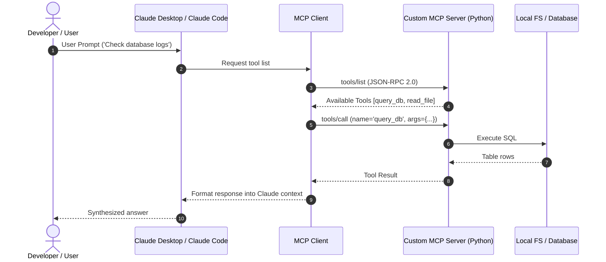

# 📹 Claude + MCP Explained

<div className="video-card" style={{border: '1px solid #30363d', borderRadius: '8px', padding: '16px', marginBottom: '24px', background: 'rgba(56, 139, 253, 0.05)'}}>
  <div style={{display: 'flex', gap: '16px', flexWrap: 'wrap'}}>
    <div><strong>Instructor:</strong> Nitish Singh (CampusX)</div>
    <div><strong>Duration:</strong> 54m 33s</div>
    <div><strong>Playlist:</strong> Agentic Coding with Claude Code (CampusX)</div>
    <div><strong>Watch Link:</strong> <a href="https://www.youtube.com/watch?v=Q38npqiDxMI" target="_blank" rel="noopener noreferrer">YouTube Lecture ↗</a></div>
  </div>
</div>

## 📌 Executive Summary & Learning Objectives

This lecture covers **Claude + MCP Explained**, focusing on production implementations, edge cases, and industry standards:
- Core intuition, architecture, and underlying mechanisms.
- Key differences between theoretical research implementations and scalable enterprise patterns.
- Concrete Python walkthroughs, error recovery, and performance optimization.

---

## 🏗️ Architecture & Conceptual Workflow



---

## 📖 Core Concepts & Technical Deep Dive

### 1. Architectural Foundations
In modern production AI engineering, **Claude + MCP Explained** is essential for ensuring reliability, low latency, and deterministic outcomes. As AI systems evolve from naive prompt-in / completion-out scripts into distributed systems, engineers must handle:
- **State management & consistency:** Ensuring intermediate states and tool invocations are tracked.
- **Error boundaries & recovery:** Graceful degradation when external LLMs or vector stores encounter rate limits or network partitions.
- **Resource utilization & cost efficiency:** Caching common queries and reducing unnecessary foundation model token expenditure.

### 2. Operational Considerations
- **Latency Optimization:** Pre-computing embeddings, utilizing asynchronous non-blocking event loops, and streaming tokens via Server-Sent Events (SSE).
- **Security & Sandboxing:** Validating inputs before ingestion, sanitizing LLM outputs, and isolating tool execution environments.

---

## 💻 Production Implementation Walkthrough

```python
from mcp.server.fastmcp import FastMCP

# Initialize FastMCP Server
mcp = FastMCP("Production AI Tools Server")

@mcp.tool()
def calculate_token_cost(input_tokens: int, output_tokens: int, model: str = "gpt-4o") -> dict:
    """Calculate total API cost given token counts."""
    rates = {
        "gpt-4o": {"input": 2.50 / 1_000_000, "output": 10.00 / 1_000_000},
        "claude-3-5-sonnet": {"input": 3.00 / 1_000_000, "output": 15.00 / 1_000_000},
    }
    rate = rates.get(model, rates["gpt-4o"])
    cost = (input_tokens * rate["input"]) + (output_tokens * rate["output"])
    return {"model": model, "total_cost_usd": round(cost, 6)}

if __name__ == "__main__":
    # Runs stdio transport protocol for Claude Desktop & Claude Code
    mcp.run(transport="stdio")
```

---

## 💡 Production Best Practices & Tips

:::tip Production Deployment Guideline
When deploying Claude + MCP Explained in enterprise environments, always configure automated retries with exponential backoff and telemetry tracing (such as OpenTelemetry or LangSmith).
:::

:::warning Common Failure Modes
Watch out for state contamination across concurrent requests. Ensure each session or user interaction uses an isolated thread ID or execution context.
:::

---

## 🎯 Key Takeaways & Quick Reference

| Dimension | Production Standard | Pitfall to Avoid |
| :--- | :--- | :--- |
| **Execution** | Async / Non-blocking with timeouts | Synchronous blocking calls in event loops |
| **Data Validation** | Strict Pydantic v2 schemas | Untyped dictionary access |
| **Monitoring** | Distributed tracing & latency percentiles | Relying only on standard console logs |

## ⏱️ Lecture Timeline & Key Topics

| Timestamp | Key Topic / Concept Discussed |
| :--- | :--- |
| **00:00:00** | हाय गाइस, माय नेम इज नितेश एंड यू वेलकम... |
| **00:12:57** | मैनेजर्स यूज़ करते हैं टू क्रिएट वायर... |
| **00:26:48** | हो। कैसे टेस्ट करोगे? अ मेरे पास यहां पे... |
| **00:42:24** | एलएलएम्स एंड एआई कोड एडिटर्स। यही इस... |
| **00:54:29** | नेक्स्ट वीडियो में। बाय।... |


---

---

## 📜 Complete Lecture Transcript (Hindi / Hinglish)

> **Language:** Hindi / Hinglish | **Source:** `13 - Claude + MCP Explained ｜ CampusX.hi.srt` | **Total Segments:** 28 | **Word Count:** ~8,872 words

<details>
<summary><b>Click to expand full chronological transcript (28 timestamped intervals)</b></summary>

#### ⏱️ [00:00 ➔ 00:02]

हाय गाइस, माय नेम इज नितेश एंड यू वेलकम टू माय YouTube चैनल। इस वीडियो में भी हम लोग अपना क्लॉट कोड प्लेलिस्ट कंटिन्यू करेंगे। और वीडियो को शुरू करने के पहले एक बार यह डिस्कस कर लेते हैं कि हम आज के वीडियो में क्या कवर करने वाले हैं। सो आज के वीडियो का टॉपिक है एमसीपी। कैसे आप मॉडल कॉन्टेक्स्ट प्रोटोकॉल को क्लॉट कोड में यूज़ कर सकते हो। यही हम प्राइमरीली आज के वीडियो में सीखने वाले हैं। सेकंड आज के वीडियो में मैं आपको टॉप 10 एमसीपी सर्वर्स के बारे में बताऊंगा। जिनको आप क्लॉट कोड में इजीली इंटीग्रेट करके अपना वर्क फ्लो इंप्रूव कर सकते हो। एंड लास्टली हमारा जो एक्सपेंस ट्रैकिंग प्रोजेक्ट है उसको भी हम कंटिन्यू करेंगे और उसमें एक नया फीचर ऐड करेंगे। बट इस नए फीचर को ऐड करने के प्रोसेस में हम एमसीपी का हेल्प लेंगे और आप देखोगे कि हमारा जो एकिस्टिंग वर्क फ्ल्लो है वो कैसे और आसान हो जाता है। ठीक है? तो यही है हमारे आज के वीडियो का गोल। नाउ लेट्स स्टार्ट द वीडियो। अब वीडियो की शुरुआत में सबसे पहले यह डिस्कस कर लेते हैं कि एमसीपी होता क्या है? एमसीपी का फुल फॉर्म होता है मॉडल कॉन्टेक्स्ट प्रोटोकॉल और यह एक स्टैंडर्डाइज तरीका है जिसकी हेल्प से आप अपने एलएलएम के साथ किसी भी एक्सटर्नल टूल को कनेक्ट कर सकते हो। यह प्रोटोकॉल अराउंड डेढ़ साल पहले आया था एंथ्रोपिक की साइड से और पिछले एक डेढ़ सालों में यह बहुत पॉपुलर हो गया है और आज की डेट में जितने भी बड़े प्लेयर्स हैं वो सब के सब एमसीपी यूज़ करते हैं इन ऑर्डर टू कनेक्ट देयर टूल्स टू एनी एलएलएम। ठीक है? तो बिफोर एमसीपी क्या होता था कि आपको कस्टम कोड लिखना पड़ता था किसी भी टूल या सर्विस के साथ अपने एलएलएम को कनेक्ट करने के लिए। और वो कोड आपका बिल्कुल भी स्टैंडर्डाइज़ नहीं होता था। वि मींस कि अगर सर्विस प्रोवाइडर ने अपनी साइड से एपीआई में कोई भी चेंजेस किए तो फिर आपको भी अपने कनेक्शन वाले कोड को चेंज करना पड़ता था। जिसकी वजह से बहुत ज्यादा प्रॉब्लम होने लग गई। तो दिस इज वेयर एंथ्रोपिक ब्रॉट एमसीपी इनू द पिक्चर और एमसीपी के आने के बाद से अब अपने एलएलएम से किसी भी टूल को या सर्विस को कनेक्ट करना हैज़ बिकम सुपर ईजी। ठीक है? यहां पे देखो लिखा हुआ

#### ⏱️ [00:02 ➔ 00:04]

है एमसीपी इज़ एन ओपन स्टैंडर्ड क्रिएटेड बाय एंथ्रोपिक दैट एक्ट्स एज अ यूनिवर्सल कनेक्टर यूनिवर्सल कनेक्टर बिटवीन क्लॉट कोड बिकॉज़ हम क्ल क्लॉड कोड के साथ काम कर रहे हैं एंड एक्सटर्नल टूल्स सर्विसेस एंड डेटा सोर्सेस। ठीक है? अब यहां पे हम बहुत ज्यादा डीप टाइप नहीं करेंगे अ एमसीपी के ऊपर। बिकॉज़ अगर आप इस चैनल के रेगुलर फॉलोअर हो तो आपको मोस्ट लाइकली ऑलरेडी एमसीपी के बारे में काफी कुछ पता होगा। बिकॉज़ मैंने लास्ट ईयर एक प्लेलिस्ट क्रिएट किया था एमसीपी के ऊपर जहां पर मैंने आठ बहुत डीप टाइप वीडियोस क्रिएट किए थे ऑन द टेक्निकिटीज ऑफ एमसीपी। सो इफ यू आर समवन जिसने एमसीपी को बहुत डिटेल में नहीं समझा है तो आई वुड रिकमेंड आप एक बार जाके इस प्लेलिस्ट को रेफर करो और इस प्लेलिस्ट को देखने के बाद आपको एमसीपी के बारे में सारा आईडिया लग जाएगा। ठीक है? यहां पर अगर मैं क्लॉट कोड के पर्सपेक्टिव से बताऊं कि क्लॉट कोड में जब आप डेवलपमेंट कर रहे हो तो वहां पर एमसीपी कैसे हेल्प कर सकता है तो एकदम सिंगल लाइन फायदा ये है कि क्लॉट कोड में अगर आप एमसीपी को लेके आते हो तो एमसीपी की हेल्प से आप क्लॉट कोड में और बहुत सारे टूल्स ऐड कर सकते हो और क्लॉट कोड की फंक्शनैलिटी को और एनहांस कर सकते हो। अभी तक हमारे क्लॉट कोड के पास क्या-क्या टूल्स थे? अगर आप सोच के देखो। क्लॉट कोड के पास रीड टूल है। मतलब वो किसी भी फाइल सिस्टम में जाकर के फाइल्स को रीड कर सकता है। सेकंड उसके पास राइट टूल है। व्हिच मींस कि इट कैन क्रिएट न्यू फाइल्स एंड राइट इन दोज़ फाइल्स। थर्ड इसके पास बैश टूल है जिसकी हेल्प से ये कमांड लाइन कमांड्स एग्जीक्यूट कर सकता है। यही टूल्स अभी हमारे क्लॉट कोड के पास अवेलेबल है। बट क्लॉट कोड के पास ये पावर नहीं है कि वो गेट पे जाकर रीड कर ले कि आपकी कितनी रेपोजिटरीज हैं। उन रेपोजिटरीज में किसने कमिट किया। कितने पेंडिंग इशूज़ हैं, कितने पुल रिक्वेस्ट हैं, ये सब आप फेच करके नहीं ला सकते। सिमिलरली क्लॉट कोड के पास यह पावर नहीं है कि वो आपके ड्राइव अकाउंट में जाकर के किसी डॉक्यूमेंट को फैच कर ले। क्लॉट कोड के पास यह पावर नहीं है कि वो आपके जीरा अकाउंट में जाकर के पेंडिंग

#### ⏱️ [00:04 ➔ 00:06]

टिकट्स को उठा के ले आए या फिर स्लैक में जाकर के जो भी एक्टिव कॉन्वर्सेशन है उसका एक जजस्ट उठा के ले आए। ये सारी कैपेबिलिटीज क्लॉट के पास नहीं है। बट एमसीपी के आ जाने से क्या होगा कि आप क्लॉट को ये सारी सारी जो पॉसिबिलिटीज है, सारी जो कैपेबिलिटीज है वो प्रोवाइड कर सकते हो। ठीक है? बाय सिंपली एडिंग एमसीपी सर्वर्स फॉर ऑल ऑफ दीज़ टूल्स। सो आईडिया ये है कि आप क्लॉट कोड को और पावरफुल बना सकते हो बाय एडिंग दीज़ एमसीपी टूल्स। और ये एमसीपी टूल्स आपके क्लॉट कोड को और एडिशनल कॉन्टेक्स्ट लाके दे सकती हैं अबाउट योर वर्क फ्लो। आपके गेट में क्या काम चल रहा है? आपके जीरा में कौन से टिकट्स हैं? आपके स्लैक में क्या मैसेजेस हैं? ये सारा इंफॉर्मेशन आप क्लॉट कोड के अंदर पुल करके ला सकते हो। आपको बताने की जरूरत नहीं पड़ेगी। तो दिस इज द बिगेस्ट बेनिफिट ऑफ यूजिंग एमसीपी अलोंग साइड क्लॉट कोड। ठीक है? आई होप मैं आपको समझा पाया। अब आज के वीडियो का जो प्लान ऑफ़ एक्शन है वो ये है कि मैं आपको तीन अलग एमसीपी सर्वर्स इंटीग्रेट करके दिखाऊंगा क्लॉट कोड में। सबसे पहले मैं एक डीबी हब नाम का एमसीपी सर्वर इंटीग्रेट करूंगा जिसकी हेल्प से हम अपने डेटाबेस से डायरेक्टली बात कर पाएंगे विदाउट राइटिंग एनी पाइthon कोड। सेकंड हम सिग्मा का एमसीपी सर्वर इंटीग्रेट करेंगे हमारे क्लॉट कोड के साथ और फिग्मा में अगर हमारी कोई डिज़ाइन पड़ी हुई है उसको हम तुरंत उठा के लाएंगे और उसके ऊपर हम यूआई कंपोनेंट बना पाएंगे। एंड थर्ड हम गिट का एमसीपी सर्वर ऐड करेंगे और हमारे गिट अकाउंट से हम कनेक्ट करके किसी भी तरह का क्वेश्चन पूछ पाएंगे। ठीक है? और ये तीनों चीजें प्रैक्टिकली करने के बाद मैं आपको और सेवन एमसीपी सर्वर्स के बारे में बताऊंगा जो आज की डेट में बहुत यूज़फुल है इफ यू आर अ प्रोग्रामर। ठीक है? तो दिस इज़ गोइंग टू बी द प्लान ऑफ़ एक्शन फॉर दिस वीडियो। आई रियली होप आपको पूरा फ्लो समझ में आ गया। नाउ लेट्स डव इंटू द प्रैक्टिकल एस्पेक्ट ऑफ़ एमसीपी। हाउ डू यू इंटीग्रेट एमसीपी टू क्लॉट कोड। लेट्स डू दैट। अब सबसे पहले मेरा प्लान था डीबी hub एमसीपी सर्वर इंटीग्रेट करके आपको दिखाने का। डीबी हब

#### ⏱️ [00:06 ➔ 00:08]

क्या है? मैं आपको बताता हूं। डीबी hub इज बेसिकली अ जीरो डिपेंडेंसी टोकन एफिशिएंट एमसीपी सर्वर अ जिसकी खासियत ये है कि ये एक साथ मल्टीपल डेटाबेस के साथ कनेक्ट कर सकता है। मतलब इट इज़ कंपैटिबल विद मल्टीपल डेटाबेस और एट अ सिंग एट अ सिंगल पॉइंट ऑफ़ टाइम इट कैन कनेक्ट टू मल्टीपल डेटाबेस एज़ वेल। ठीक है? तो अ मेरा प्लान था इस डेटा बेस एमसीपी सर्वर को कनेक्ट करके दिखाने का। बट द प्रॉब्लम इज कि अ जब मैंने इस सर्वर को चलाया हमारे प्रोजेक्ट में मेरे क्लॉट कोड सेटअप में तो ये स्टार्ट ही नहीं हो रहा है और थोड़ा रिसर्च करने पे मुझे यह पता चला कि इट्स मोस्टली बिकॉज़ कि हमारा जो डेटाबेस है वो सीक्वलाइट डेटाबेस है और वो लोकली हमारे मशीन पे पड़ा हुआ है और डीबी हब इस सेटअप में काम नहीं करता। ठीक है? मैं आपको दिखाता हूं। सो यह हमारा प्रोजेक्ट है। अगर आपको कभी भी चेक करना है कि आपके सेटअप में कौन-कौन से एमसीपी सर्वर्स अवेलेबल हैं, तो आपके पास एक स्लैश एमसीपी बोल के कमांड होता है। आप इस पे एंटर करोगे तो यू विल सी द लिस्ट ऑफ कमांड्स जो द लिस्ट ऑफ़ एमसीपी सर्वर्स दैट यू हैव। तो मेरे पास ये डीबी हब वाला है एमसीपी सर्वर बट उसके सामने आप देख सकते हो वहां लिखा आ रहा है फेल्ड। ठीक है? अब अगर आप उस पे एंटर मारो और रिकनेक्ट पर क्लिक करो तो इट सेस फेल्ट टू रिकनेक्ट टू डीबी हब और उसका रीज़न वही है जो मैंने आपको बताया इट्स मोस्टली बिकॉज़ वी आर यूजिंग सीक्वल आई डेटाबेस वो भी लोकली तो ये पर्टिकुलर प्लान तो फेल कर गया तो फिर मैंने थोड़ा और सर्च किया तो मुझे एक दूसरा डेटाबेस सर्वर दिखाई दिया इसका नाम है एमसीपी डेटाबेस सर्वर और ये भी अलग-अलग टाइप के डेटाबेसेस के साथ काम कर सकता है। एंड इट कैन आल्सो वर्क विद सीक्वलाइट डेटाबेस। ठीक है? तो हम इसको यूज़ करेंगे। और इसको यूज़ कैसे करना

#### ⏱️ [00:08 ➔ 00:10]

है? इट्स वेरी सिंपल। आपको सिंपली ये पर्टिकुलर कमांड कॉपी करना है। इसमें आपको क्या करना है? अपने अ डेटाबेस का जो फाइल है उसका पाथ स्पेसिफाई करके देना है। ठीक है? जैसे यहां पे आप नोटिस करोगे। यह पाथ है मेरे डेटाबेस का। यूज़र्स के अंदर नितीश, नितेश के अंदर डेस्कटॉप, डेस्कटॉप के अंदर हमारा प्रोजेक्ट फोल्डर, प्रोजेक्ट फोल्डर के अंदर स्पेंडली डॉटdB ये फाइल है हमारी डेटाबेस की। यू कैन सी दिस फाइल इनसाइड आवर प्रोजेक्ट फोल्डर। तो हमें सिंपली इस कमांड को कॉपी करना है और आपको एक नया टर्मिनल ओपन करना है अपने प्रोजेक्ट के अंदर और आपको इस कमांड को एग्जीक्यूट कर देना है एंड इट सेस ऐडेड स्टूडियो एमसीपी सर्वर एसटीडीआईओ एमसीपी सर्वर एसटीडीआईओ मतलब दो ट्रांसपोर्ट मैकेनिज्म्स होते हैं। एक होता है एसटीdio और एक होता है आपका एसएससी एसटीp एसएससी तो हम जो यूज कर रहे हैं वो एसटीडीio है बिकॉज़ वी आर यूजिंग अ लोकल सेटअप ठीक है दैट इज़ व्हाई फिलहाल यू डोंट हैव टू वरी अबाउट दीज़ टर्मिनोलॉजीस आपको सिंपली कमांड्स एग्जीक्यूट करने हैं एंड यू वुड सी कि अगर मैं यहां पे फिर से स्लैश एमसीपी लिखूं तो फिलहाल तो यहां पे रिफ्लेक्ट नहीं कर रहा है। आई विल डू एग्जिट। और मैं फिर से एक बार रन करता हूं क्लॉड। और अब मैं रन करता हूं स्लैश एमसीपी। दिस टाइम यू कैन सी ये सीक्वलाइट वाली जो हमारी एमसीपी सर्वर है वो कनेक्टेड शो कर रही है। ठीक है? तो आप भी यही वाला यूज़ करना जो मैं अभी बता रहा हूं। अब नाउ दैट वी हैव आवर एमसीपी सर्वर। अब मैं आपको बताता हूं आप क्या-क्या कर सकते हो। सो आपके पास बहुत सारी पॉसिबिलिटीज हैं। जो भी डेटाबेस से आपको क्वेश्चंस करने हैं या डेटाबेस के बारे में आपको जानना है वो सब कुछ आप सिंपली इंग्लिश में लिख करके पता कर सकते हो और आपको कोई पython कोड रन नहीं करना पड़ेगा।

#### ⏱️ [00:10 ➔ 00:12]

ठीक है? मैं आपको एक दो एग्जांपल्स दिखाता हूं। जैसे कि मान लो हमने यह क्वेश्चन पूछा। लिस्ट ऑल द टेबल्स इन स्पेंटली डेटाबेस। ठीक है? यह मैंने एंटर मारा। अब देखो वो हमसे पूछ रहा है कि आई एम गोइंग टू यूज़ दिस टूल। और ये टूल कौन सा है? सीक्वलाइट एमसीपी सर्वर का लिस्ट टेबल्स वाला टूल। ठीक है? तो मैं बोलूंगा यस एंड डोंट आस्क अगेन फॉर सीक्वलाइट। मैं इसको आगे तक का परमिशन दे रहा हूं। तो देखो ये बोल रहा है द डेटाबेस हैज़ टू टेबल्स यूज़र्स एंड एक्सपेंसेस। अब नेक्स्ट मैं पूछ रहा हूं कैन यू टेल मी द स्कीमा ऑफ एक्सपेंसेस टेबल अगेन आई डोंट नो क्यों मुझसे दोबारा पूछ रहा है परमिशन ले रहा है ये देखो ये यहां पे डिटेल्स आ गए ठीक है आप थोड़ी कॉम्प्लेक्स क्वेरीज भी पूछ सकते हो शो शो टोटल स्पेंडिंग ग्रुप्ड बाय कैटेगरी ये देखो ग्रुप बाय कैटेगरी हमें हमारा रिजल्ट मिल गया। ठीक है? तो यू कैन सी अभी मैं ऑब्वियसली आपको एमसीपी के बारे में बता रहा हूं। मेरा पूरा गोल यह नहीं है कि मैं सिर्फ यह पर्टिकुलर एमसीपी सर्वर आपको डिटेल में समझाऊं। बट यू कैन सी द पोटेंशियल। यू कैन सी द पॉसिबिलिटीज कि आप डेटाबेस से रिलेटेड आपको कुछ भी डाउट है तो आप झट से यहां पे क्वेरी कर सकते हो ऑन द गो। आपको जाके डेटाबेस का स्ट्रक्चर समझने की जरूरत नहीं है या फिर आपको जाकर के सीक्वल क्वेरीज रन करने की जरूरत नहीं है। अभी ये तो बहुत छोटा प्रोजेक्ट है।

#### ⏱️ [00:12 ➔ 00:14]

सिर्फ दो टेबल्स हैं। बट जब आप एक प्रॉपर प्रोजेक्ट में काम करोगे जहां पे 10 12 15 20 टेबल्स होते हैं। वहां पे कौन से टेबल्स हैं? उनके बीच में कैसा रिलेशनशिप है? ये सब कुछ समझने के लिए दिस इज़ अ वेरी वेरी यूज़फुल अ डेटाबेस सर्वर। ठीक है? अ एमसीपी सर्वर। ठीक है? तो ये आप एक बार ट्राई आउट करके देखना। और अगेन जैसा मैंने बोला यह सिर्फ सीक्वल लाइट के ऊपर ही काम नहीं करता। दिस वर्क्स फॉर माय सीक्वल एज वेल, पोस्ट क्रे सीक्वल एज वेल। तो, आप अलग-अलग डेटाबेसिस के साथ काम कर सकते हो। ठीक है? तो, दिस वाज़ द फर्स्ट एमसीपी सर्वर जो पर्टिकुलरली मुझे बहुत यूज़फुल लगता है और मैं अपने वर्क फ्लोस में हमेशा इस तरह के सर्वर को रखता हूं। सो अगला जो एमसीपी सर्वर हम लोग इंप्लीमेंट करेंगे क्लॉट कोड में वह है फिग्मा का सर्वर। आई एम प्रीटी श्योर आपने फग्मा का नाम कभी ना कभी सुना होगा। फग्मा इज़ अ डिज़ टूल जिसको डिज़र्स एंड प्रोडक्ट मैनेजर्स यूज़ करते हैं टू क्रिएट वायर फ्रेम्स फॉर द वेबसाइट और यूआईx कंपोनेंट्स फॉर द वेबसाइट। राइट? तो जनरली कंपनीज़ में काम कैसे होता है कि आपकी एक डिज़ टीम होती है जिनका काम होता है यह बनाना यह डिसाइड करना कि आपकी वेबसाइट दिखेगी कैसे। ठीक है? तो दे डिजाइन द यूआई यूएक्स कंपोनेंट्स ऑफ ऑफ ऑफ द वेबसाइट और वो वायरफ्रेम्स के फॉर्म में इन डिज़ाइंस को क्रिएट करते हैं और वही वायरफ्रेम्स आपकी डेवलपमेंट टीम को दिया जाता है और आपकी डेवलपमेंट टीम हूबहू उसी वायरफ्रेम को कोड में कन्वर्ट करती है। तो जनरली फ्लो ऐसा होता है कि आपका जो डिज़र होता है वो सिग्मा जैसा टूल यूज़ करता है और वहां पे वो अपने डिज़ाइंस क्रिएट करता है। यहां से वो डिज़ाइंस को एक्सपोर्ट करता है जो डेवलपमेंट टीम को मिलता है। डेवलपमेंट टीम उस डिज़ को स्टडी करती है, समझती है और उसको एज इट इज़ कोड में इंप्लीमेंट करने की कोशिश करती है। बट ये जो पूरा फ्लो है इसको आप विद द हेल्प ऑफ एमसीपी सर्वर कंप्लीटली ऑटोमेट कर सकते हो। सो करना

#### ⏱️ [00:14 ➔ 00:16]

क्या है कि आपको बस एक डिज़ रेडी रखना है। और एमसीपी के थ्रू आपको फिग्मा और क्लॉड कोड को कनेक्ट कर देना है। उसके बाद क्लॉट कोड को आप सिंपली यूआरएल दोगे अपने डिज़ाइन का। क्लॉड कोड उस यूआरएल के थ्रू आपके डिजाइन को समझेगा और आपके लिए एक पेज बना के आपको दे देगा। ठीक है? तो मैं यह पूरा फ्लो आपको एक बार सिमुलेट करके दिखाता हूं कैसे होता है। सो इमेजिन करो ये हमारी वेबसाइट है जो हम बना रहे हैं। और इसमें ना हम एक नया मॉड्यूल लेट्स से ऐड करना चाहते हैं एनालिटिक्स बोल के। उस पे क्लिक करने पे यूजर को अपने एक्सपेंसेस के ऊपर कंप्लीट एनालिटिक्स डैशबोर्ड दिखाई देगा। ठीक है? बट द थिंग इज कि अभी हमारा एनालिटिक्स डैशबोर्ड रेडी नहीं है। तो इंस्टेड व्हाट वी वांट इज कि अभी एनालिटिक्स डैशबोर्ड के बदले कमिंग सून पेज दिखाई दे और कमिंग सून पेज भी थोड़ा अच्छा दिखना चाहिए। तो वो हमने अपने डिज़र से डिजाइन करवाया है और हमारे डिज़र ने ये डिज़ाइन बनाया है। लेट मी शो इट टू यू। दिस इज़ द डिज़ाइन। ठीक है? कमिंग सून एडवांस्ड एनालिटिक्स यहां पे लिखा हुआ है सब कुछ। ये हमारे डिज़ाइनर ने क्रिएट किया है। ठीक है? अब हमारे प्रोग्रामर को क्या करना है कि इस एग्जैक्ट डिज़ाइन को रेप्लिकेट करना है कोड में। सो दैट हमारा जो वेबसाइट है उसका कमिंग सून पेज एग्जैक्टली ऐसा दिखाई दे। ठीक है? तो अब मैं क्या करूंगा? मैं सबसे पहले सिग्मा का एमसीपी सर्वर कनेक्ट करूंगा क्लॉट कोड के साथ और मैं इस डिज़ाइन को पुल करूंगा वहां पे और मैं कमांड दूंगा क्लॉट कोड को कि क्रिएट अ कमिंग सून पेज जस्ट लाइक दिस। ठीक है? तो कनेक्ट कैसे करना है? क्लॉट कोड और फिग्मा का जो कनेक्शन है वो आपको इस पेज पे मिल जाएगा। इट्स अ वेरी सिंपल सेटअप। आपको क्या करना है? आपको सिंपली ये पर्टिकुलर कमांड रन करना है क्लॉट कोड के अंदर। क्लॉट कोड के अंदर नहीं अपने कमांड

#### ⏱️ [00:16 ➔ 00:18]

प्र्प्ट के अंदर। सो मैं आपको दिखाता हूं। आपको सिंपली अपने टर्मिनल विंडो में जाना है और इस कमांड को पेस्ट कर देना है। इसको आप जैसे ही पेस्ट करोगे होगा क्या कि आपके क्लाउड कोड सेटअप में एक प्लगइन इंस्टॉल होगा। अब प्लगइन क्या होता है? हमने अभी नहीं पढ़ा है। आगे का टॉपिक है। एक दो वीडियो उसके बाद हम प्लगइिंस पढ़ेंगे। आप बस ऐसे समझो कि इस प्लगइन के अंदर फिग्मा का एमसीपी सर्वर छुपा हुआ है। ठीक है? तो मैंने एंटर मारा। ठीक है? इट सेस सक्सेसफुली इंस्टॉल्ड प्लगइन। कैसे पता? हम जाएंगे क्लड में। एक नया सेशन स्टार्ट स्टार्ट करेंगे और हम उसके बाद प्लगइन बोल करके एक कमांड है। उसको चलाएंगे। अब यहां से हम जाएंगे इंस्टॉल्ड वाले टैब में। लेट मी शो इट टू यू क्लियरली। इंस्टॉल्ड वाले टैब में और यहां पर आपको दिखाई देगा ये देखो फग्मा प्लगइन। इसको आप एंटर मारोगे और यहां से आपको सबसे पहले क्या करना पड़ेगा? ऑथेंटिकेट करवाना पड़ेगा अपने figma अकाउंट के अंदर। सो उसके लिए अपडेट नाउ अपडेट नाउ तो जरूरत नहीं पड़ रही है। लेट मी रन दिस वन मोर टाइम। सिग्मा प्लगइन। आई गेस सिंस मैंने ऑलरेडी एक बार ऑथेंटिकेट करवा लिया है figma के प्लगइन को। दैट इज़ व्हाई अभी मुझे ऑप्शन दिखाई नहीं दे रहा है। बिकॉज़ मैं ऑलरेडी ऑथेंटिकेटेड हूं। पर आप जब पहली बार इस प्लगइन को इंस्टॉल करोगे तो आपको ऑथेंटिकेट करने का ऑप्शन दिखाई देगा। आपको उसको सेलेक्ट करना है। जैसे ही आप सेलेक्ट करोगे ब्राउज़र में एक नया विंडो ओपन होगा और वहां पे आपको अपने figma अकाउंट के थ्रू लॉग इन करना पड़ेगा। ठीक है? तो ये एक इंपॉर्टेंट स्टेप है। मैं अभी दिखा नहीं पा रहा हूं बिकॉज़ मेरे मशीन में मुझे वो ऑप्शन नहीं दिख रहा है। बट अभी मैं ये

#### ⏱️ [00:18 ➔ 00:20]

मान के चल रहा हूं कि मेरा फग्मा प्लगइन सही से काम कर रहा है। देखो यहां पे लिखा हुआ है सिग्मा प्लगइन दैट इंक्लूड्स द फग्मा एमसीपी सर्वर एंड स्किल्स फॉर कॉमन वर्क फ्लोस। ठीक है? ठीक है? तो प्लगइन इज़ लाइक अ पैकेज जिसमें आप स्किल्स भी डाल सकते हो, एजेंट्स भी डाल सकते हो, एमसीपी सर्वर्स भी डाल सकते हो, हुक्स भी डाल सकते हो। ठीक है? तो उन्होंने इस प्लगइन के अंदर दो चीजें डाल के दी हैं। एमसीपी सर्वर भी दिया है और आपका स्किल्स भी दिया है। ठीक है? तो यहां पे देखो आपको दिखाई दे रहा है कौन-कौन से स्किल्स हैं और ये आपका एमसीपी सर्वर है। ठीक है? तो अब हम क्या करेंगे? इस एमसीपी सर्वर की हेल्प से हम लोग एक कमिंग सून पेज डिजाइन करेंगे। ठीक है? तो उसका प्र्ट मैंने लिख रखा है। मैं आपको दिखाता हूं। यहां पे देखो ये प्र्प्ट है। [गला साफ़ करने की आवाज़] सो हियर इज़ द फिग्मा डिज़ाइन फॉर द कमिंग सून पेज। ये डिज़ाइन का लिंक मैंने यहां से उठाया है। अगर आप यहां पे जाओगे कभी भी कोई भी डिज़ाइन बनाओगे फिग्मा में तो आपको बस उस डिज़ाइन के ऊपर राइट क्लिक करना है। कॉपी लिंक पे जाना है। आपको उस डिज़ाइन का लिंक मिल जाएगा। अब देखो यहां पे लिखा हुआ है प्लीज डू द फॉलोइंग। रीड द फिग्मा डिज़ाइन एंड कन्वर्ट इट टू अ जिंजर टू HTML टेंपलेट। ऐड एन एनालिटिक्स मेन्यू आइटम टू द नैv बार। क्रिएट अ फ्लास्क राउट इन appीy दैट रेंडर्स द कमिंग सून पेज। प्रोटेक्ट दिस रूट सो दैट ओनली लॉक्ड इन यूज़र्स कैन एक्सेस इट। बेसिक प्र्प लिखा हुआ है। ठीक है ना? कि मुझे कैसे डेवलप करना है इस कमिंग सून पेज को। तो व्हाट आई विल डू इज़ आई विल सिंपली कॉपी दिस प्र्ट एंड आई विल गो बैक टू क्लॉट कोड एंड आई विल पेस्ट इट हियर। ठीक है? एंड नाउ आई विल हिट एंटर। देखो यहां पे लिखा आ रहा है। आई विल रीड द फिग्मा डिज़ाइन एंड एक्सप्लोर द एकज़िस्टिंग कोड बेस। यह स्किल यूज़ हो रहा है फग्मा से। ये फाइल्स रीड हो रही हैं।

#### ⏱️ [00:20 ➔ 00:22]

ठीक है? सो ये टूल यूज़ हो रहा है। आई विल से यस। ठीक है? वो रीड कर रहा है फिग्मा से जो भी हमारा डिज़ाइन है। इस स्टेप में अगर आपने ऑथराइज़ नहीं कर रखा होगा फिग्मा का तो यहां पे आपसे ऑथराइज़ेशन मांगेगा। तो इस स्टेप में भी आप ऑथराइज ऑथराइजेशन वाला स्टेप कंप्लीट कर सकते हो। फिलहाल मुझसे नहीं मांग रहा है। इट मींस कि मेरा फ्रेम अकाउंट ऑलरेडी ऑथराइज्ड है। ऑथेंटिकेटेड है। आई मीन। ठीक है? इट सेज़ आई हैव द डिज़ नाउ। लेट मी रीड द एकज़िस्टिंग फाइल्स बिफोर मेकिंग एडिट। ठीक है? एकिस्टिंग सीएसएस चेक कर रहा है। ठीक है? यह हमारी फाइल बन गई। सारा कोड हो गया है। अब वो एक फाइनल टेस्ट कर रहा है अपने लेवल पे। ठीक है? तो सारे चेंजेस इंप्लीमेंट हो गए। लेट मी चेक कि ये सही से काम कर रहा है कि नहीं। आई विल रन द फ्लास्क एप्लीकेशन। सो, यह हमारा एप्लीकेशन है और पहले मैं एक बार साइन आउट कर लेता हूं। नाउ आई एम साइनिंग इन। ठीक है? यहां पे एनालिटिक्स बोल के एक मेनू आ गया। इस पे क्लिक करने पे वी आर सीइंग दिस डिज़ाइन। और ये हमारा डिज़ाइन था। सो यू कैन सी साइड बाय साइड। बिल्कुल सेम चीज़ विद द सेम फोंट स्टाइल। आई गेस नॉट एक्सैक्टली द सेम फॉन्ट स्टाइल बट एवरीथिंग इज़ क्वाइट द सेम। ठीक है? तो ये फायदा हुआ कि आप सिग्मा के थ्रू जो डिजाइन कर रहे हो उसको बहुत एक्यूरेटली कोड में रेप्लिकेट कर पा रहे हो। ठीक है? तो ये मैंने आपको अगेन एक फ्लो दिखाया कि कैसे कंपनीज़ में जब सॉफ्टवेयर डेवलप होता

#### ⏱️ [00:22 ➔ 00:24]

है तो किस तरीके से डिज़ टीम और आपकी सॉफ्टवेयर टीम आपस में इंटरेक्ट करती है और कैसे ये पर्टिकुलर एमसीपी सर्वर उस पूरे प्रोसेस को फैसिलिटेट कर सकता है। ठीक है? तो आई गेस आपको figma का एमसीपी सर्वर कैसे काम करता है समझ में आया? आई वुड रिकमेंड गोइंग फॉरवर्ड। कभी भी आप डिज़ाइंस बनाओ। आप figma में बनाओ। सिग्मा आपको एक बहुत बढ़िया चैटबॉट इंटरफेस देता है जहां पर आप बता सकते हो कि आपको किस तरह का डिजाइन बनवाना है और वो आपके लिए डिजाइन बनवा देगा और आप उसको बहुत आसानी से एक्सपोर्ट कर सकते हो। ठीक है? तो या दिस वाज़ द सेकंड एमसीपी सर्वर जो मुझे आपको पढ़ाना था। सो नेक्स्ट जो एमसीपी सर्वर हम लोग इंटीग्रेट करने जा रहे हैं क्लॉट कोड के साथ वो है Ghub का एमसीपी सर्वर। एंड ट्रस्ट मी व्हेन आई से दिस कि Ghub का एमसीपी सर्वर कैन बी वेरी वेरीरी यूज़फुल फॉर योर डेवलपमेंट वर्क फ्लो। बिकॉज़ आपके पास डायरेक्टली GH के ऊपर जो भी है उसके ऊपर क्वेश्चन पूछने का पावर आ जाता है। GH के ऊपर चेंजेस करने का पावर आ जाता है। तो मैं आपको दिखाता हूं वो सब कुछ कैसे करना है। बट उसके पहले आपको ये सीखना पड़ेगा कि Ghub का एमसीपी सर्वर आप कैसे इंटीग्रेट करोगे क्लॉट कोड के साथ। तो यहां पे मैंने लिंक दे दिया है इस डॉक्यूमेंट में। इस पे जब आप क्लिक करोगे तो यह पेज ओपन हो जाएगा जहां पे बहुत डिटेल्ड इंस्ट्रक्शन दिया हुआ है कि कैसे इंटीग्रेट करना है गेट का एमसीपी सर्वर। अ मैं आपको स्टेप बाय स्टेप बताता हूं। सबसे पहले आपको एक पर्सनल एक्सेस टोकन चाहिए पड़ेगा अपने ghub अकाउंट से। तभी आप अपने अकाउंट के साथ कनेक्ट कर पाओगे GitHub एमसीp सर्वर को। उसके लिए आपको क्या करना है? ghub.com पे जाना है। वहां से सेटिंग्स डेवलपर सेटिंग्स। वहां से पर्सनल एक्सेस टोकन पर जाना है। सो यह रहा ghub यहां से सेटिंग्स डेवलपर सेटिंग्स यहां से पर्सनल एक्सेस टोकन फाइन ग्रेन टोकंस जनरेट न्यू टोकन यहां पे यू हैव टू वेरीफाई वाया मेल आई विल क्विकली वेरीफाई दिस

#### ⏱️ [00:24 ➔ 00:26]

सो ये मैंने वेरीफाई कर दिया यहां पे आई विल प्रोवाइड अ टोकन नेम लेट्स से इसका नाम मैं रख रहा हूं क्लॉट कोड अ पी पी ए टी फॉर क्लॉट कोड रिसोर्स ओनर एक्सपायरेशन डेट आप यहां पे सेट कर सकते हो रेपोजिटरी एक्सेस आप बता सकते हो पब्लिक ऑल रेपोजिटरीज या ओनली सेक्टेड और यहां से आप परमिशंस ऐड कर सकते हो रीटाइट रेपो पीआर इशूज़ सो ऐड परमिशन आई गेस बेसिक लेवल परमिशंस ऑलरेडी है हमारे पास। तो यहां पर मैं कुछ एडिशनली सेलेक्ट नहीं कर रहा। आई विल जस्ट क्लिक ऑन जनरेट। जनरेट। तो ये मेरा टोकन है। ठीक है? अब मुझे क्या करना है? मुझे इस टोकन को सिंपली इस कमांड के अंदर पेस्ट कर देना है। ठीक है? कहां पे? जहां पर यह लिखा हुआ है योर एक्चुअल टोकन हियर। इस जगह पर आई विल पेस्ट माय गेटब टोकन। ठीक है? अब आई नो आपको मेरा टोकन दिखाई दे रहा है। डोंट वरी। इस वीडियो को पब्लिश करने के बाद मैं अपना यह टोकन हटा दूंगा, डिलीट कर दूंगा। सो डोंट वरी। नाउ व्हाट आई हैव टू डू इज़ आई हैव टू कॉपी दिस। एंड आई हैव टू गो टू वीएस कोड। और हमारे प्रोजेक्ट डायरेक्टरी के टर्मिनल में आई विल पेस्ट दिस एंड आई विल हिट एंटर। अब मुझे क्या करना है? इस टोकन को कॉपी करना है और इसको यहां पर इस कमांड के अंदर पेस्ट कर देना है। ठीक है? अब आई नो आपको मेरा टोकन दिखाई दे रहा है। एंड दिस इज़ नॉट अ सेफ प्रैक्टिस बट डोंट वरी। वीडियो को कंप्लीट करने के बाद मैं इस टोकन को डिलीट कर दूंगा। सो दैट इसको कोई भी एक्सेस ना कर पाए। अब हमें क्या करना है? इन दोनों कमांड्स को वन बाय वन रन करना है हमारे टर्मिनल में। सबसे पहले मैं

#### ⏱️ [00:26 ➔ 00:28]

इस पहले कमांड को रन करूंगा। सो आई विल पेस्ट इट हियर। हिट एंटर। कुछ भी नहीं होगा इस कमांड से। और उसके बाद मैं सेकंड कमांड को रन करूंगा। पेस्ट एंटर। एंड यू कैन सी यहां लिखा आ रहा है एडेड http एमसीपी सर्वर। ठीक है? चेक कैसे करेंगे? हम एक नए विंडो में टर्मिनल विंडो में क्लॉट ओपन करेंगे और वहां पर एमसीपी टाइप करेंगे। और इस एमसीपी के अंदर अब आप देखो आपको दिखाई देगा कि गेट के आगे कनेक्टेड लिखा हुआ है। ठीक है? दिस मींस कि हमने अपने गेट सर्वर के साथ एमसीपी सर्वर के साथ कनेक्ट कर लिया है। अब अगर आप चाहो तो टेस्ट कर सकते हो। कैसे टेस्ट करोगे? अ मेरे पास यहां पे कुछ प्रॉम्स लिखे हुए हैं। आई विल शो यू। जैसे कि ये मैंने क्वेश्चन पूछा व्हिच इज माय मोस्ट स्टार्ट रेपोजिटरी। ठीक है? एंटर मारा। देखो यहां लिखा आ रहा है। आई विल लुक अप योर गेट रेपोजिटरीज टू फाइंड द मोस्ट स्टार्ट वन। यस। यह देखो यहां लिखा आ रहा है योर मोस्ट स्टार्ट रेपोजिटरी इज़ 100 डेज ऑफ़ मशीन लर्निंग वि 2500 स्टार्स एंड दिस मेनी स्पोक्स। इट्स अ जुपिटर नोटबुक प्रोजेक्ट एंड स्टिल सीइंग एक्टिविटी। ठीक है? अब मान लो मुझे इसके बारे में थोड़ा और कुछ पूछना है तो मैं पूछ लूंगा आर देयर एनी इशज़ ऑन दिस रेबो? इफ देयर आर समराइज

#### ⏱️ [00:28 ➔ 00:30]

देम फॉर मी यस देखो यहां पे लिखा आ रहा है देयर आर 30 ओपन इशूज़ हियर अ समरी ऑफ़ अह हियर इज़ अ समरी ग्रुप बाय कैटेगरी सिक्योरिटी इशूज़ है, ब्रोकन मिसिंग कंटेंट है, डेप्लिकेटेड ब्रोकन कोड है, डेटा लीकेज और करेक्टनेस का इशू है। सो बेसिकली मैंने इस रेपोजिटरी को बहुत दिनों से चेक नहीं किया। तो देयर आर अ लॉट ऑफ़ इशूज़ राइट? बट यू कैन सी द पावर। आप यहां पर क्लॉट के थ्रू अपनी पूरी रेपोज़िटरी के बारे में पता कर पा रहे हो। आई कैन आल्सो आस्क अबाउट आर देयर एनी ओपन पुल रिक्वेस्ट्स एंड यू कैन सी देयर आर 37 ओपन पुल रिक्वेस्ट एंड हियर इज़ अ समरी तो यू कैन सी यू कैन डू अ लॉट ऑफ़ थिंग्स। मैं इनफैक्ट यहां से ही अपने पुल रिक्वेस्ट को क्लोज भी कर सकता हूं, मर्ज भी कर सकता हूं। ठीक है? तो बहुत तरह की चीजें मैं कर सकता हूं। बट अब मैं आपको एक सीरियसली यूज़फुल चीज दिखाता हूं। सो अभी तक इस प्रोजेक्ट में हम क्या कर रहे थे? अगर आपको याद हो तो हम ये फ्लो यूज कर रहे थे। राइट? नया ब्रांच बना के डेवलपमेंट कर रहे थे। लास्ट वीडियो में हमने सीखा था टेस्टिंग करना, कोड रिव्यू करना और एक बार सब कुछ हो जाने के बाद हम चेंजेस को कमिट करते थे। गेट पे पुश करते थे। पुल रिक्वेस्ट क्रिएट करते थे, मर्ज करते थे। मेन ब्रांच में स्विच करते थे, डाटा पुल करते थे और करंट ब्रांच को डिलीट करते थे। दिस वाज़ द फ्लो राइट। अब हम क्या करेंगे कि ये जो पूरा पार्ट है ना दिस एंटायर थिंग इसको हम ऑटोमेट करेंगे विद द हेल्प ऑफ GitHub एमसीपी सर्वर। ठीक है? कैसे मैं आपको बताता हूं। सो इस प्रोसेस में ही हम लोग एक काम और कर लेंगे। हम लोग एक नया फीचर भी डेवलप कर लेंगे। सो ये हमारी वेबसाइट है। और दिस इज़ द करंट स्टेट ऑफ़ आवर वेबसाइट। अब हम क्या करेंगे कि यहां पर एक नया फीचर

#### ⏱️ [00:30 ➔ 00:32]

ऐड करेंगे ऐड एक्सपेंस बोल के जिसकी हेल्प से हम एक पर्टिकुलर यूजर के लिए नया एक्सपेंस ऐड कर पाएंगे। ठीक है? तो इट विल बी अ फॉर्म जहां पे यूजर डिटेल्स डालेगा, सबमिट करेगा वो नया एक्सपेंस डेटाबेस में ऐड हो जाएगा और प्रोफाइल पेज में दिखने लगेगा। ठीक है? ये फीचर हम ऐड करेंगे। बट इस फीचर को बनाने के प्रोसेस में जब हम यह पूरा फ्लो दोबारा से करेंगे तो ये लास्ट वाला जो पार्ट है इसको हम लोग कंप्लीटली ऑटोमेट करेंगे वि द हेल्प ऑफ गेट एमसीपी सर्वर। ठीक है? आई होप आपको फ्लो समझ में आ रहा है। तो फॉर दैट व्हाट आई विल डू इज़ आई विल गो टू वीएस कोड और सबसे पहले मैं रिनेम कर लेता हूं इस सेशन को और इसका नाम रख देते हैं ऐड एक्सपेंस। ठीक है। अब सबसे पहले हम क्या करेंगे? क्रिएट स्पेक को कॉल करेंगे और हम एक स्पेक जनरेट करेंगे। ये हमारा स्पेक नंबर सेवन होने वाला है और इसका नाम होगा ऐड एक्सपेंस। ठीक है? और मैंने एंटर मार दिया। अब हमारा स्पेक क्रिएट होगा। ठीक है? ठीक है? तो इस पॉइंट पे हमें एक एरर आ गया कि हमारे पास कुछ अ चेंजेस है जो हमने कमिट नहीं किए। दैट इज व्हाई नया ब्रांच नहीं क्रिएट हो पा रहा। तो एक काम करते हैं। लेट्स राइट गेट ऐड गेट कमिट - m ऐड कमिंग सून पेज। एंड नाउ लेट्स रीरन दिस कमांड क्रिएट स्पेक वाला। ठीक है? नया ब्रांच बन गया।

#### ⏱️ [00:32 ➔ 00:34]

और ये उसने स्पेक फाइल क्रिएट कर दी। आई विल से यस। सो लेट मी शो यू द फाइल। दिस इज द फाइल। सो मैंने ये फाइल गो थ्रू की और जो स्पेक बन के आया है ये ठीक लग रहा है। ठीक है? सो व्हाट वी विल डू इज़ वी विल एंटर प्लान मोड एंड वी विल से रीड दिस फाइल एंड कम अप विद एन इंप्लीमेंटेशन प्लान। सो यू कैन सी प्लान जनरेट हो गया है। दिस इज़ द प्लान। अगेन ऐज़ आई ऑलवेज से कि आपको एक बार पूरा इसको गो थ्रू करना चाहिए। अ बट अगेन आई विल ट्रस्ट क्लॉट एंड आई विल से यस ऑटो एक्सेप्ट एडिट्स और अब हमारा प्लान इंप्लीमेंट होना शुरू हो जाएगा। [नाक से की जाने वाली आवाज़] यू कैन सी गाइस काफी सारा कोड अपने आप चेंज हो रहा है। नया कोड जनरेट हो रहा है। अ इस पॉइंट पे आई एम जस्ट ट्राइंग टू कीप अप कि क्या चीजें कहां पे चेंज हो रही है। यही आपको करना होता है। यू कैन नॉट एक्चुअली सी एवरीथिंग दैट इज़ हैपनिंग। बट ऐसा ओवरव्यू मोड में आपको समझते रहना पड़ता है कि किस फाइल में किस तरह के चेंजेस हो रहे हैं। वो अगेन थोड़ा एक्सपीरियंस के साथ आता है। यू कैन सी यहां लिखा आ रहा है ऑल गुड। इंप्लीमेंटेशन इज़ कंप्लीट। हियर इज़ अ समरी ऑफ़ व्हाट वाज़ डन। एक काम करते हैं। एक बार इसको चेक करते हैं। सो, यह हमारी वेबसाइट है। इसको हम लोग एक बार रीलोड करेंगे। और यहां पर यह देखो ऐड एक्सपेंस बोल के एक बटन दिखाई दे रहा है। थोड़ा अलग सा अगली लग रहा है यह बट ठीक है।

#### ⏱️ [00:34 ➔ 00:36]

फिलहाल एक बार इस पर क्लिक करते हैं। और लेट्स ऐड एन एक्सपेंस ₹1000 लेट्स सेलेक्ट अ कैटेगरी लेट्स से एंटरटेनमेंट और डेट हम आज का ही डाल देते हैं। और यहां पे लिख देते हैं मूवी टिकट्स। ठीक है? सेव एक्सपेंस पे क्लिक किया। यहां पे मैसेज आ रहा है एक्सपेंस एडेड। ये थोड़ा सेंटर पे कहीं पे डिस्प्ले होना चाहिए। बट यहां पर यू कैन सी हमें हमारा एक्सपेंस दिखाई दे रहा है। ठीक है? दिस इज़ अ थिंग जो डेटाबेस में ऐड हो रहा है अगेंस्ट दिस यूजर। तो दिस रफली शोज़ दैट आवर ऐड एक्सपेंस बटन इज़ वर्किंग। अब एक काम करते हैं। इसको टेस्ट कर लेते हैं। कोड रिव्यू कर लेते हैं और फिर हम लोग आगे का प्रोसेस करते हैं। सो आई विल सिंपली कॉल टेस्ट फीचर इस फीचर का नाम है 07 आई विल क्विकली चेक व्हाट इज द नेम 07 हफन ऐड एक्सपेंस जैसा हमने लास्ट वीडियो में डिस्कस किया था इस स्टेप में क्या होगा दो सब एजेंट्स मिलकर के हमारे फीचर को टेस्ट करेंगे एक टेस्ट केस केसेस जनरेट करेगा। दूसरा उन टेस्ट केसेस को रन करेगा और हमें एक समरी दिखाई जाएगी कि कितने टेस्ट केसेस पास हुए, कितने फेल हुए। क्या कुछ चेंज करने की जरूरत है या नहीं। ठीक है? सो या गाइस, हमारा ये स्टेप कंप्लीट हो गया। टोटल 46 टेस्ट केसेस क्रिएट किए गए। टेस्ट रनर ने सारे केसेस पास कर लिए। सो वी आर रेडी फॉर कोड रिव्यू। तो वी विल रन द नेक्स्ट कमांड कोड रिव्यू फीचर 07 ऐड एक्सपेंस। इस स्टेप में दो पैरेलल सब एजेंट्स ट्रिगर

#### ⏱️ [00:36 ➔ 00:38]

होंगे। एक सिक्योरिटी ऑडिट करेगा। दूसरा कोड क्वालिटी चेक करेगा और हमें लास्ट में एक समराइज्ड रिपोर्ट दिखाई जाएगी। सो गाइस यू कैन सी यह स्टेप भी कंप्लीट हो गया और यहां पर कुछ आपके सजेशंस हैं जो आपको इंप्लीमेंट करने चाहिए। कोड रिव्यू में यह निकल के आया है। तो आई वुड जस्ट से यस इंप्लीमेंट द एक्शन प्लान नाउ। सो या गाइस जो भी चेंजेस होने थे वो सारे हमने कर लिए। एक बार क्विकली फिर से चेक कर लेते हैं कि ऐप अभी भी सही से काम कर रहा है कि नहीं। सो आई विल रिफ्रेश। एंड एक बार इसको वापस रन करते हैं। लेट्स रिफ्रेश ऐड एक्सपेंस 2000 ट्रांसपोर्ट आज का ही डेट है कैब एक्सपेंस टू दिल्ली सेव एक्सपेंस एक्सपेंस ऐडेड यहां पे हमारा एक्सपेंस हमें दिखाई दे रहा है रिफ्रेश करने पे भी पर्सिस्ट कर रहा है इट मींस कि डेटाबेस में ऐड हो गया है ठीक है तो ये हमारा फीचर हमने सही से डेवलप कर लिया तो तो इस पॉइंट पे हमने यहां तक सब कुछ कर लिया है। अब हमें ये पूरा फ्लो इंप्लीमेंट करना है। अब जनरली अभी तक हम क्या करते आ रहे थे? ये सब कुछ हम खुद से मैनुअली करते जा रहे थे। कमिट करते थे, अपलोड करते थे। फिर पीआर क्रिएट करके मर्ज करते थे। ये सब कुछ हम खुद से करते थे। बट नाउ दैट वी हैव गेट एमसीपी सर्वर। व्हाट वी कैन डू इज़ वी कैन सिंपली रन दिस प्रम्प। देखो यहां पे क्या लिखा हुआ है। कमिट ऑल चेंजेस विथ एन एप्रोप्रियट कन्वेंशनल कमिट मैसेज। पुश टू द करंट फीचर ब्रांच। क्रिएट अ पुल रिक्वेस्ट इनू मेन विद अ प्रॉपर टाइटल एंड डिस्क्रिप्शन बेस्ड ऑन द स्पेक। मर्ज इट यूजिंग स्क्वाश मर्ज। स्विच टू मेन पुल लेटेस्ट एंड डिलीट द फीचर ब्रांच लोकली।

#### ⏱️ [00:38 ➔ 00:40]

जो भी चीज़ मैं कर रहा था वो सब मैं अ क्लॉट कोड को करने को बोलूंगा। ठीक है? सो आई विल कॉपी एंड आई विल पेस्ट दिस कोड। पेस्ट दिस प्र्ट हियर एंड आई विल हिट एंटर। ठीक है। अब यह पुश हो रहा है। अब देखो रिमोट में क्रिएट अ पुल रिक्वेस्ट आ रहा है। ये आई गेस अ डिस्क्रिप्शन फॉर्म हो रहा है हमारे पुल रिक्वेस्ट का। सो यहां पर एक प्रॉब्लम आ गई। इट सेस द गेट टोकन डजंट हैव पीआर राइट एक्सेस। द ब्रांच इज़ पुश् यू कैन क्रिएट द पीआर डायरेक्टली। वंस यू हैव क्रिएटेड इट अ उसके बाद आगे का काम ये कंटिन्यू कर सकता है। सो प्रॉब्लम क्या हुई है कि जब हम ये टोकन बना रहे थे तो वहां पे जो परमिशंस सेट करनी थी वो परमिशन हमने यहां पे सेट नहीं की। ठीक है? मैंने आपको बोल दिया था कि परमिशंस अवेलेबल है। बट आई गेस पीआर क्रिएट करने की परमिशन अवेलेबल नहीं है। सो हमें ये चीज़ मैनुअली करनी पड़ेगी। सो यू कैन सी ये रहा हमारा ब्रांच जो क्र पुश हो गया है। कंपेयर एंड पुल रिक्वेस्ट क्रिएट पुल रिक्वेस्ट। मर्ज पुल रिक्वेस्ट कंफर्म मर्ज ठीक है। डिलीट ब्रांच। अ सो जो मेरा प्लान था वो मैं आपको दिखा नहीं पाया। बट कोई बात नहीं। व्हाट आई विल डू इज़ वीडियो के बाद मैं एक नया अ पर्सनल एक्सेस टोकन क्रिएट करूंगा। जहां पे आई विल एक्सप्लसिटली गिव इट परमिशन टू क्रिएट

#### ⏱️ [00:40 ➔ 00:42]

पुल रिक्वेस्ट एंड मर्ज पुल रिक्वेस्ट। और गोइंग फॉरवर्ड जभी भी मैं कोई फीचर डेवलप करूंगा इस वेबसाइट पे वहां पर आई विल शो यू कि यह पूरी चीज आप कैसे ऑटोमेट कर पाओगे कि टोकन के साथ। ठीक है? अ सो या अ एक काम कर लेते हैं जल्दी से गेट चेक आउट मेन कर लेते हैं और गेट गेट ब्रांच फीचर ऐड एक्सपेंस को डिलीट कर देता हूं एंड गेट पुल ओरिजिन मेन कर लेते हैं। ठीक है? सारे चेंजेस हमारे पास आ गए हैं। सो या जैसा प्लान था वैसा हम एग्जीक्यूट नहीं कर पाए। बट कोई बात नहीं गलती समझ में आ गई। नेक्स्ट वीडियो ऑनवर्ड्स आई विल बी एबल टू शो यू एक्सैक्टली द एंटायर फ्लो विथ द हेल्प ऑफ़ GitHub एमसीपी सर्वर। तो आई रियली होप आपको मैं समझा पाया कि GitHub एम एमसीपी सर्वर कितना पावरफुल है और आप किस तरह की चीजें करवा सकते हो उससे। ठीक है? तो या ये तीन एमसीपी सर्वर्स मुझे आपको दिखाने थे। अ सबसे पहला था आपका सीक्वलाइit वाला सर्वर देन फग्मा वाला और अभी गिट वाला। ठीक है? अब मैं आपको कुछ और सर्वर्स के बारे में बताऊंगा। भले ही मैं उनको प्रैक्टिकली इंप्लीमेंट करके नहीं दिखाऊंगा बट आई विल टेल यू अबाउट देम। सो दैट आप खुद उनको इंप्लीमेंट कर पाओ अपने वर्क फ्लो में। सो जो सबसे पहला एमसीपी सर्वर मैं आपको रिकमेंड करूंगा उसका नाम है कॉन्टेक्स 7। ठीक है? सो कॉन्टक्स 7 इज अ एमसीपी सर्वर जिसको अगर आप अपने वर्क फ्लो में इंटीग्रेट करते हो तो आपको सबसे अपडेटेड इंफॉर्मेशनेशन मिलेगा अबाउट एनी लाइब्रेरीज और फ्रेमवर्क्स डॉक्यूमेंटेशन। ठीक है? यहां पे देखो लिखा हुआ है कॉन्टेक्स्ट सेवन इज़ एन एमसीपी सर्वर दैट पुल्स लाइव अप टू डेट

#### ⏱️ [00:42 ➔ 00:44]

डॉक्यूमेंटेशन फॉर एनी लाइब्रेरी और फ्रेमवर्क डायरेक्टली इंटू क्लॉट्स कॉन्टेक्स्ट व्हाइल यू आर कोडिंग। सो ये कॉन्टक्स 7 की वेबसाइट है। यहां पर आपको एक अकाउंट बनाना पड़ेगा। आपको एक एपीआई की भी मिलेगा और उसके ही बेसिस पे आप इस सर्वर को इंटीग्रेट कर पाओगे। बट यू कैन सी आप एक बार वेबसाइट को जाके देख सकते हो। यहां लिखा हुआ है अप टू डेट डॉक्स फॉर एलएलएम्स एंड एआई कोड एडिटर्स। यही इस वेबसाइट और इस एमसीपी सर्वर का पर्पस है। क्योंकि एलएलएप्स के पास जो नॉलेज है वह एक कट ऑफ तक का ही नॉलेज है। तो उस कट ऑफ डेट तक लाइब्रेरी का जो डॉक्यूमेंटेशन होगा वो आपके एलएलएम को पता होगा। बट अगर कोई नया वर्जन आ गया होगा आपकी लाइब्रेरी का या फ्रेमवर्क का तो उससे रिलेटेड अगर डॉक्यूमेंटेशन में कुछ भी अप टू डेट हुआ तो वो आपके एलएलएम को पता नहीं चलेगा। बट अगर आपने कॉन्टक्स्ट सेवन कनेक्ट कर रखा है अपने क्लॉट कोड के साथ या एi कोड एडिटर के साथ तो आपको हमेशा सबसे अपडेटेड डॉक्यूमेंटेशन ही मिलेगा। जिस भी लाइब्रेरी के साथ आप काम कर रहे हो यू कैन सी सारी पॉपुलर लाइब्रेरीज आपको यहां पे दिखाई दे जाएंगी। ठीक है? तो दिस इज़ द फर्स्ट वन और ये ऑलमोस्ट हर कोई यूज़ करता है इस एमसीपी सर्वर को। द नेक्स्ट वन इज़ जीरा। जीरा के बारे में अगर आपने नहीं सुना होगा तो इट इज अ प्रोजेक्ट मैनेजमेंट टूल बाय एटलाशियन इट इज वाइडली यूज्ड बाय सॉफ्टवेयर डेवलपमेंट टीम्स टू प्लान ट्रैक एंड मैनेज वर्क फ्रॉम बग फिक्सेस टू फुल फीचर डेवलपमेंट शॉर्ट में बोला जाए तो यह सॉफ्टवेयर डेवलपर्स का टू डू लिस्ट है जहां पे टीम्स जाके कोलैबोरेट करती हैं हर किसी को टास्क असाइन होता है टिकट्स के फॉर्म में और फिर आप बेसिकली बताते हो कि आपने कितना कर लिया कितना काम आपका बचा हुआ है ठीक है तो दिस इज़ जीरा इट्स अ वेरी फेमस टूल ऑलमोस्ट एव्री सॉफ्टवेयर टीम यूजज़ दिस और इसका भी एक एमसीपी सर्वर अवेलेबल है और इसका एमसीपी सर्वर अगर आप इंप्लीमेंट करोगे तो क्या फायदा होगा? किस तरह के सिनेरियो में फायदा होगा। आपको जाकर के जीरा पे चेक

#### ⏱️ [00:44 ➔ 00:46]

नहीं करना पड़ेगा कि आपके अगेंस्ट कौन सा टिकट असाइन हुआ है। आप सिंपली क्लॉट कोड में बोलोगे रीड दिस टिकट एंड इंप्लीमेंट द फीचर। तो जो भी डिटेल्स फीचर के वहां पे है वो सारा ऑटोमेटिकली पुल हो जाएगा कॉन्टेक्स्ट में और उसके बेसिस पे कोडिंग स्टार्ट हो जाएगी। या फिर आप डायरेक्टली यहां पे कुछ ऐसा टाइप कर सकते हो। फाइंड ऑल ओपन बग टिकट्स इन द स्पेंडली प्रोजेक्ट एंड फिक्स द हाईएस्ट प्रायोरिटी वन। ठीक है? तो टीम लीड ऐसा हो सकता है कि जितने भी बग्स आ रहे हैं उसको उसके अगेंस्ट टिकट्स जनरेट करता जाए और आपको टैग करता जाए। तो आप डायरेक्टली उनको रीड कर सकते हो और सबसे हाईएस्ट प्रायोरिटी वाले को यू नो फिक्स भी कर सकते हो। तो इस तरह का एक इंप्लीमेंटेशन हो सकता है इफ यू हैव गॉट जीरा का एमसीपी सर्वर। नेक्स्ट इज नोशन। नोशन इज अगेन अ वेरी वेरी यूज़फुल वेबसाइट। और पिछले दो चार सालों में ये बहुत ज्यादा पॉपुलर हुई है। क्या होता है नोशन? मैं आपको बता देता हूं। नोशन इज़ अ ऑल इन वन वर्कस्पेस टूल जहां पे टीम्स एंड इंडिविजुअल्स कैन राइट देयर ओन डॉक्यूमेंट्स, मैनेज नॉलेज, प्लान प्रोजेक्ट्स एंड कोलैबोरेट ऑल इन वन प्लेस। ठीक है? तो हर तरह की चीज़ आप कर सकते हो मोशन पे। आप टू डू लिस्ट बना सकते हो। प्रॉपर डॉक्स वहां पे स्टोर कर सकते हो। यू कैन क्रिएट एनी काइंड ऑफ डॉक्यूमेंट ओवर देयर और आप कोलैबोरेट भी कर सकते हो। ठीक है? तो अगर आपके पास नोशन का एमसीपी सर्वर है तो आप किस तरह की चीजें कर पाओगे? आप सिंपली इस तरह का एक प्र्प्ट लिख सकते हो दैट रीड द प्रोडक्ट रिक्वायरमेंट डॉक फॉर द एनालिटिक्स मॉड्यूल इन नोशन एंड इंप्लीमेंट द फीचर इन माय फ्लास्क एप्लीकेशन। ठीक है? है तो आपकी टीम ने जितने भी स्पेसिफिकेशंस हैं अराउंड एनी फीचर वो सब के सब नोशन पे डाल रखे हैं और आपको जाके मैनुअली रीड करके कॉपी पेस्ट करने की जरूरत नहीं है। आप डायरेक्टली क्लॉट को वहां पे रीडायरेक्ट कर सकते हो। और यू कैन राइट समथिंग लाइक दिस रीड द एपीआई डिज़ाइन डॉक्यूमेंट इन नोशन एंड स्कैफोल्ड ऑल द एंड पॉइंट्स इन app डॉटpy। अगेन आपके एपीआई के अगेंस्ट गाइडलाइंस लिखे हुए हैं कि आपकी हर एपीआई इन रूल्स को फॉलो करेगी और आप रादर देन

#### ⏱️ [00:46 ➔ 00:48]

कॉपी पेस्टिंग ईच टाइम टू क्लॉट कोड। आप सिंपली कनेक्ट कर दो एमसीपी सर्वर और क्लॉट ऑटोमेटिकली समझ जाएगा कि उसको एपीआई किस तरीके से डिजाइन करनी है। ठीक है? अगला बहुत यूज़फुल एमसीपी सर्वर हो सकता है स्लैक एमसीपी सर्वर। स्लैक के बारे में आई एम प्रीटी श्योर आपने सुन रखा होगा। इट्स बेसिकली अ कम्युनिकेशन प्लेटफार्म जहां पे आप किसी दूसरे बंदे से चैट कर सकते हैं। बट यह एक तरीके का एक प्रोफेशनल चैटिंग प्लेटफार्म बन गया है। जहां पे टीम्स जाकर के चैट करती हैं। दे सेंड मैसेजेस, शेयर फाइल्स एंड कोलैबोरेट स्लैक में अलग-अलग चैनल्स बन जाते हैं आपके काम के हिसाब से और उन चैनल्स में अलग-अलग टाइप की बातचीत होती है। ठीक है? अब अगर आपने स्लैक को डायरेक्टली कनेक्ट कर लिया अपने क्लॉट कोड से तो क्या फायदा है? आप डायरेक्टली कुछ इस तरह का प्र लिख सकते हो। आप लिखोगे पुश दिस फिक्स टू गेट। ओपन अ पीआर एंड पोस्ट द पीआर लिंक इन कोड रिव्यूज वाला चैनल विद अ समरी ऑफ व्हाट वास चेंज्ड। राइट? आपका एक कोड रिव्यूज बोल के चैनल बना हुआ है। जहां पे आपका टीम लीड है और आपके कलीग्स हैं, आपके पीियर्स हैं। आपने एक नया फीचर डेवलप किया। डायरेक्टली गेटअप पर अपलोड किया, पुल रिव्यू क्रिएट किया और उसका लिंक उठा करके डाल दिया और एक डिस्क्रिप्शन भी जनरेट कर दिया कि आपने इस पर्टिकुलर रिलीज में क्या किया या इस पर्टिकुलर फीचर डेवलपमेंट अ स्प्रिंट में क्या किया है। ठीक है? और यू कैन राइट अ प्र्प्ट लाइक दिस। चेक इंसिडेंट्स वाला चैनल फॉर द लेटेस्ट प्रोडक्शन एरर। रीड द डिटेल्स फाइंड द बग इन द कोड बेस एंड फिक्स इट। राइट? अह आपका ऐप लाइव है। उसमें कुछ बग्स आ रहे हैं। यूज़र्स उसके बारे में बता रहे हैं। आपकी टीम लीड को उसके बारे में पता चला। वह इंसिडेंट्स वाले टैब में जाकर के उसके बारे में स्क्रीनशॉट्स डाल रहा है। आपने सिंपली क्लॉड को बोला कि जाओ इंसिडेंट वाले में और वहां जाके पिक करो कि क्या एरर आ रहा है और कोड बेस को एनालाइज़ करके बताओ कि एरर कहां से आ रहा है। यू कैन सी कितना आसान हो रहा है पूरा का पूरा काम। कितना ज्यादा सीमलेसनेस आ रहा है। राइट? तो स्लैक इज़ आल्सो वैरी यूज़फुल। अ देन वी हैव एडब्ल्यूएस का

#### ⏱️ [00:48 ➔ 00:50]

एमसीपी सर्वर। आई विल बी ऑनेस्ट थोड़ा सा यहां पे। मैंने खुद कभी एडब्ल्यूएस का एमसीपी सर्वर यूज़ नहीं किया। उसका एक रीज़न ये भी है कि मेरे रीसेंट प्रोजेक्ट्स मैं Google क्लाउड प्लेटफार्म पे कर रहा हूं। बट मैंने जितना सुना है इट इज़ क्वाइट यूज़फुल। एडब्ल्यूएस के बारे में बताने की जरूरत नहीं है। इट्स अ इट्स द वर्ल्ड्स लार्जेस्ट क्लाउड प्लेटफार्म ऑफरिंग 200 प्लस सर्विसेस। आप इस पर्टिकुलर एमसीपी सर्वर की हेल्प से डायरेक्टली कुछ इस तरह का प्र्ट लिख सकते हो। डिप्लॉय द लेटेस्ट बिल्ड ऑफ स्पेंडली टू द ईसी टू इंस्टेंस एंड वेरीफाई इट्स रनिंग। राइट? आपको मैनुअली वो सारा का सारा काम करने की जरूरत नहीं है जो आप डेप्लॉयमेंट के टाइम पर रन करते थे। यू कैन आल्सो से समथिंग लाइक दिस। चेक क्लाउड वॉच लॉग्स फॉर द स्पेंटी ऐप फॉर फ्रॉम द लास्ट 2 आवर्स एंड फाइंड व्हाट्स कॉजिंग द 500 एरर्स। अगेन क्लाउड वॉच की हेल्प से आप पूरे टाइम मॉनिटर करते रहते हो अपने एप्लीकेशन को और वहां पे अगर कुछ अ एरर आ रहा है तो उसको आप एनालाइज कर सकते हो विथ द हेल्प ऑफ दिस एमसीपी टूल। ठीक है? तो अगेन सीमलेसनेस की बात है। आपको सब कुछ अ सॉफ्टवेयर चेंज कर करके नहीं समझना है। यू आर नॉट गोइंग टू एडब्ल्यूएस डैशबोर्ड एंड देन यू आर कमिंग बैक टू योर कोड एंड देन यू आर ट्राइंग टू अंडरस्टैंड व्हाट इज़ हैपनिंग। सब कुछ आपको एक सिंगल रूफ के अंदर मिल रहा है। क्लॉट सब कुछ को कंट्रोल कर रहा है। यू कैन एक्चुअली सी कि कैसे हम क्लॉट का जो कॉन्टेक्स्ट है उसमें और नया इंफॉर्मेशनेशन ला पा रहे हैं विथ द हेल्प ऑफ दीज़ एमसीपी टूल्स। एंड द लास्ट वन इज़ अ वेरी ऑब्वियस वन टॉकर। हम सब लोग टॉकर यूज़ करते हैं। टू कंटेनराइज़ आवर एप्लीकेशन। सो दैट हम उसको बहुत इज़ली किसी और को दे पाएं या फिर डिप्लॉय कर पाएं। इट्स अ प्लेटफार्म दैट पैकेजेस योर एप्लीकेशन एंड ऑल इट्स डिपेंडेंसीज इनटू अ कंटेनर। अ लाइट वेट पोर्टेबल सेल्फ कंटेंड यूनिट दैट रंस द सेम वे ऑन एनी मशीन। अब अगेन अगर आपने डॉकर के साथ काम किया होगा तो आपको पता होगा डॉकर अपने एप्लीकेशन को डॉकर थोड़ा एक मुश्किल काम होता है। और आप क्या कर सकते हो? अगर आपके पास डॉकर का एमसीपी सर्वर है तो आप कुछ इस तरह के प्रॉ्ट्स लिख सकते हो। रीड माय स्पेंडी फ्लास्क ऐप

#### ⏱️ [00:50 ➔ 00:52]

एंड जनरेट एन ऑप्टिमाइज्ड डॉकर फाइल फॉर इट। आपको डॉकर फाइल क्रिएट करनी पड़ती है। जहां पे आपको इंस्ट्रशंस लिखने पड़ते हैं। आपको वो करने की जरूरत नहीं है। क्लॉट विल डू इट ऑन योर बिहाफ। और यू कैन राइट अ कमांड लाइक दिस। माय डॉकर इमेज इज 2GB एनालाइज द डॉकर फाइल एंड रिड्यूस द इमेज साइज। अगेन समथिंग जो आप बहुत फेस करते हो। आपका जो डॉकर फाइल का जो इमेज है या जो आपका डॉकर इमेज है उसका साइज बहुत ज्यादा बड़ा है। उसको ऑप्टिमाइज करने की जरूरत है। तो अगेन बेस्ड ऑन योर एप्लीकेशन क्लॉट ये ऑटोमेटिकली कर देगा। बिकॉज़ वो टॉकर से डायरेक्टली बात कर सकता है। तो आपको बीच में आके चीजें करने की जरूरत नहीं है। तो ऑल एंड ऑल इट्स अ सुपर यूज़फुल थिंग एमसीपी सर्वर्स। और अगर आप सही एमसीपी सर्वर्स यूज करो तो इट कैन बी अ ग्रेट पार्टनर फॉर यू इन योर वर्क फ्लो और रादर सॉफ्टवेयर डेवलपमेंट। ठीक है? तो ये कुछ पांच छह एमसीपी सर्वर्स मुझे आपको बताने थे। बाकी आपको अगर कोई और बहुत यूज़फुल एमसीपी सर्वर पता हो तो प्लीज आप उसको कमेंट में लिख के बताओ। बाकी लोग भी पढ़ेंगे तो उनको भी पता चलेगा। अब वीडियो को खत्म करने के पहले एक दो इंपॉर्टेंट चीजें मैं आपको और बताना चाहूंगा। उनमें से सबसे पहली इंपॉर्टेंट चीज यह है कि मैंने आपको अभी तक एमसीपी सर्वर्स ऐड करना सिखाया। बट अगर आप चाहो तो एमसीपी सर्वर्स को हटा भी सकते हो। अगर आपको उस एमसीपी सर्वर की जरूरत नहीं है। कैसे करना है मैं आपको बताता हूं। सो लेट्स से मुझे मेरा सीक्वलाइट वाला जो एमसीपी सर्वर है उसको रिमूव करना है। तो आपको सिंपली यह कमांड लिखना होता है क्लॉड एमसीपी रिमूव आपके सर्वर का नाम दैट इज सीक्वलाइड एंटर मारा देखो यहां पे लिखा आ रहा है रिमूव्ड एमसीपी सर्वर कैसे पता चलेगा आप क्लॉड का एक नया सेशन स्टार्ट करो वहां पे लिखो एमसीपी एंड नाउ यू वुड सी कि आपका सीक्वलाइट वाला जो आपका एमसीपी सर्वर है वो नहीं दिखाई दे रहा है तो इतना सिंपल है एमसीपी सर्वर्स को रिमूव करना आल्सो अगर आपको कभी भी यह पता करना हो कि आपके एमसीपी सर्वर के पास कौन-कौन से टूल्स हैं और वो क्या-क्या कर सकते हैं। तो ये पता करना भी बहुत आसान

#### ⏱️ [00:52 ➔ 00:54]

है। आपको किसी भी एमसीपी सर्वर को पिक करना है। लेट्स से हम गेट वाले के लिए चेक करना चाहते हैं। लेट्स से हम फिग्मा वाले के लिए चेक करना चाहते हैं। तो यहां पर हमारा फिग्मा वाला है। अब यहां पे आपको व्यू टूल्स का ऑप्शन आएगा। आपको इस पे एंटर मारना है। एंड यू वुड सी कि इस पर्टिकुलर एमसीपी सर्वर के पास कौन-कौन से टूल्स हैं। क्या-क्या चीजें ये आपको करके दे सकता है। उनका डिटेल अगर आपको पता करना है, आप उस टूल को सेलेक्ट करो और एंटर मारो और आपको उसका फुल डिस्क्रिप्शन मिल जाएगा। ठीक है? है तो ये एक तरीका है अ समझने का कि क्या-क्या टूल्स आपके पास हैं और वो एग्जैक्टली क्या करते हैं। ठीक है? तो ये दो इंपॉर्टेंट चीजें मुझे बतानी थी। अब एक लास्ट और सबसे इंपॉर्टेंट चीज मैं आपको बताता हूं जो गलती मैंने कर रखी है वो आपको नहीं करनी है। सो होता क्या है कि जब आप एमसीपी के बारे में पढ़ते हो तो आपको समझ में आता है इट्स अ वेरी पावरफुल कांसेप्ट बिकॉज़ आप अपने क्लॉट कोड जैसे टूल को बहुत सारे अलग-अलग टूल्स एंड सर्विसेस के साथ कनेक्ट करके उसको बहुत ज्यादा पावर दे सकते हो। तो मैंने क्या किया था? मैंने ब्लाइंडली जितने भी एमसीपी सर्वर्स मुझे दिखाई दिए सबके साथ मैंने उसको कनेक्ट कर दिया। और इससे प्रॉब्लम क्या होता है कि वो सारे एमसीपी टूल्स का जो डिस्क्रिप्शन है वो ऑटोमेटिकली आपके कॉन्टेक्स्ट में लोड हो जाता है। जब भी आप नया सेशन स्टार्ट करते हो तो बहुत सारा अननेसेसरी कॉन्टेक्स्ट फिल हो जाता है स्पेशली ड्यूरिंग द स्टार्टिंग ऑफ द सेशन और वो आपके मॉडल का जो परफॉर्मेंस है उसको थोड़ा सा डिग्रेड करता है। तो आइडियली क्या करना चाहिए आपको कि आपको बहुत मिनिमल रखना चाहिए एमसीपी सर्वर्स का यूसेज। जो एमसीपी सर्वर्स आपको सच में यूज़फुल लगते हैं आप सिर्फ उनको ही रखो और जो आपको यूज़फुल नहीं लगते या जिनको आप रेगुलरली

#### ⏱️ [00:54 ➔ 00:54]

यूज़ नहीं कर रहे हो उनको आप हटा दिया करो। उससे क्या होगा कि बहुत कम डिस्क्रिप्शन टेक्स्ट टोकंस आपके कॉन्टेक्स्ट में एंटर करेंगे और आपका मॉडल का परफॉर्मेंस बिल्कुल सही रहेगा। ठीक है? तो या अ इतनी चीजें मुझे बतानी थी इस वीडियो में। आई रियली होप मैं आपको कंप्लीटली एक ओवरव्यू दे पाया अराउंड हाउ यू कैन यूज़ एमसीपी सर्वर्स अलोंग विद क्लॉट कोड। अगर आपको यह वीडियो पसंद आया तो प्लीज लाइक करना। अगर आपने इस चैनल को सब्सक्राइब नहीं किया है तो प्लीज डू सब्सक्राइब। मिलते हैं नेक्स्ट वीडियो में। बाय।

</details>
