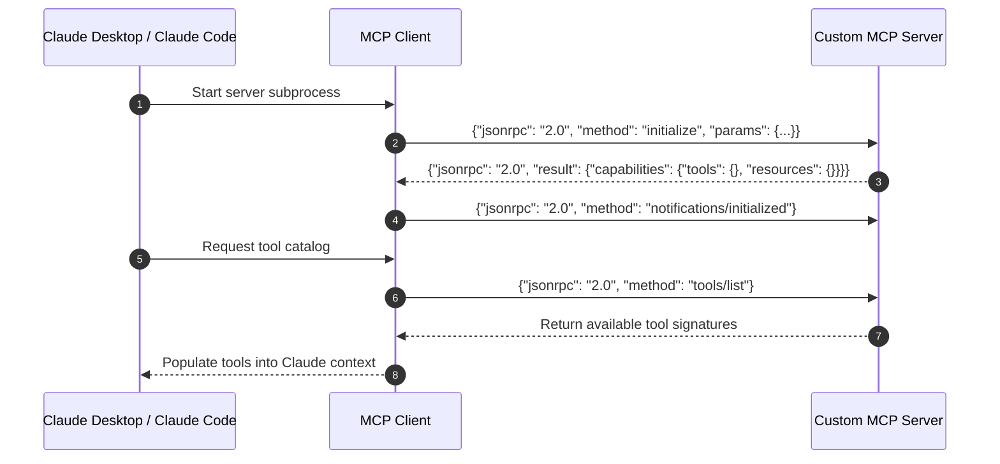

# 📹 Claude + MCP Explained

<div className="video-card" style={{border: '1px solid #30363d', borderRadius: '8px', padding: '16px', marginBottom: '24px', background: 'rgba(56, 139, 253, 0.05)'}}>
  <div style={{display: 'flex', gap: '16px', flexWrap: 'wrap'}}>
    <div><strong>Instructor:</strong> Nitish Singh (CampusX)</div>
    <div><strong>Duration:</strong> 3273</div>
    <div><strong>Course:</strong> Module 5: MCP & Claude Code</div>
    <div><strong>Watch Link:</strong> <a href="https://www.youtube.com/watch?v=Q38npqiDxMI" target="_blank" rel="noopener noreferrer">YouTube Lecture ↗</a></div>
  </div>
</div>

## 📌 Executive Summary

The Model Context Protocol architecture is built on a modular client-host-server topology communicating via JSON-RPC 2.0 messages.

This deep dive examines the protocol layers, transport bindings (`stdio` vs `SSE`), capabilities negotiation, security isolation boundaries, and error recovery contracts.

---

## 🏗️ System Architecture & Execution Flow



---

## 📖 Core Concepts & Technical Deep Dive

### 1. JSON-RPC 2.0 Message Structure
Every MCP message is a standard JSON-RPC 2.0 payload:
- Requests: `{"jsonrpc": "2.0", "id": 1, "method": "tools/call", "params": {...}}`
- Responses: `{"jsonrpc": "2.0", "id": 1, "result": {...}}`
- Errors: `{"jsonrpc": "2.0", "id": 1, "error": {"code": -32601, "message": "Method not found"}}`

### 2. Capabilities Negotiation
During the `initialize` handshake, the client and server exchange capability flags, enabling either side to gracefully degrade if features (e.g. prompt templates or resource subscriptions) are unsupported.

---

## 💻 Production Implementation

```python
import json

# Demonstrating standard JSON-RPC 2.0 tool execution request
json_rpc_request = {
    "jsonrpc": "2.0",
    "id": "req-101",
    "method": "tools/call",
    "params": {
        "name": "check_service_latency",
        "arguments": {"service_name": "checkout-service"}
    }
}

print(f"JSON-RPC Payload:\n{json.dumps(json_rpc_request, indent=2)}")
```

---

## ⚙️ Production Gotchas & Best Practices

:::tip Clean Subprocess Management
When building an MCP client over `stdio`, always handle `SIGTERM` and `SIGINT` signals to ensure child server subprocesses terminate cleanly.
:::

:::warning Strict Validation on Parameters
Validate all parameters inside tool functions against strict types; malformed arguments from client LLMs must return informative error codes rather than crashing the server.
:::

---

## 📊 Architectural Reference & Comparison

| Protocol Method | Direction | Purpose |
| :--- | :--- | :--- |
| `initialize` | Client -> Server | Initial handshake & capabilities negotiation |
| `notifications/initialized` | Client -> Server | Confirms readiness to begin operations |
| `tools/list` | Client -> Server | Discovers available tools |
| `tools/call` | Client -> Server | Invokes a specific tool with arguments |
| `resources/read` | Client -> Server | Reads content of a specified resource URI |

---

## 📚 Key Takeaways & Enterprise Checklist

- [ ] **Architecture Verification:** Ensure your design addresses latency, decoupled interfaces, and strict data validation contracts.
- [ ] **Deterministic Testing:** Run unit tests and golden dataset evaluations before shipping changes to staging or production.
- [ ] **Security & Observability:** Enforce input/output guardrails, scrub sensitive credentials/PII, and capture distributed traces.
- [ ] **Scalability & Sizing:** Calibrate model parameters, context limits, and compute instance requirements against projected request concurrency.
