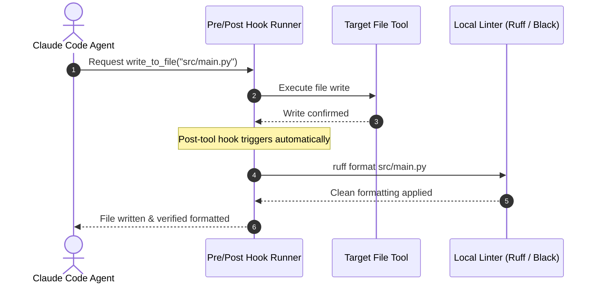

# 📹 Hooks in Claude Code — Full Theory + Practical Use

<div className="video-card" style={{border: '1px solid #30363d', borderRadius: '8px', padding: '16px', marginBottom: '24px', background: 'rgba(56, 139, 253, 0.05)'}}>
  <div style={{display: 'flex', gap: '16px', flexWrap: 'wrap'}}>
    <div><strong>Instructor:</strong> Nitish Singh (CampusX)</div>
    <div><strong>Duration:</strong> 3898</div>
    <div><strong>Course:</strong> Module 5: MCP & Claude Code</div>
    <div><strong>Watch Link:</strong> <a href="https://www.youtube.com/watch?v=oo1oADOiVmM" target="_blank" rel="noopener noreferrer">YouTube Lecture ↗</a></div>
  </div>
</div>

## 📌 Executive Summary

Claude Code Hooks allow injecting automated shell commands before or after tool executions and user interactions. Using hooks, teams can enforce pre-commit linters, automatic code formatting, security scanning, and desktop notifications.

This lesson explores hook configuration in `.claude.json`, pre-tool hooks, post-tool hooks, and enforcing zero-defect CI/CD standards locally.

---

## 🏗️ System Architecture & Execution Flow



---

## 📖 Core Concepts & Technical Deep Dive

### 1. Hook Execution Lifecycle
Hooks trigger at key lifecycle events:
- `pre-tool`: Runs before a tool executes (can reject or modify arguments).
- `post-tool`: Runs immediately after a tool finishes (ideal for auto-formatting code).
- `pre-prompt`: Runs before user prompts are evaluated.

### 2. Enforcing Code Quality Invariants
Configuring a post-tool hook running `ruff format` ensures that every time Claude Code edits a Python file, formatting standards are applied instantly before the user reviews the diff.

---

## 💻 Production Implementation

```python
# Example: .claude.json hook configuration
claude_hook_config = {
    "hooks": {
        "post-tool": [
            {
                "tool": "write_to_file",
                "command": "ruff check --fix $FILE && ruff format $FILE"
            }
        ]
    }
}

import json
print(f"Claude Code Hook configuration:\n{json.dumps(claude_hook_config, indent=2)}")
```

---

## ⚙️ Production Gotchas & Best Practices

:::tip Fast Formatters in Hooks
Only run fast formatters (like Ruff or Prettier) in post-tool hooks. Running slow multi-minute integration test suites in hooks will severely degrade agent responsiveness.
:::

:::warning Idempotent Hook Commands
Ensure hook shell commands are idempotent and exit with code 0 on success. Non-zero exit codes can interrupt the agent's active workflow.
:::

---

## 📊 Architectural Reference & Comparison

| Hook Type | Trigger Moment | Typical Use Case |
| :--- | :--- | :--- |
| `pre-tool` | Immediately before tool call | Validating paths, security sandbox checks |
| `post-tool` | Immediately after tool call | Code formatting (Ruff/Prettier), linting |
| `post-commit` | After git commit tool | Pushing telemetry, triggering webhook |

---

## 📚 Key Takeaways & Enterprise Checklist

- [ ] **Architecture Verification:** Ensure your design addresses latency, decoupled interfaces, and strict data validation contracts.
- [ ] **Deterministic Testing:** Run unit tests and golden dataset evaluations before shipping changes to staging or production.
- [ ] **Security & Observability:** Enforce input/output guardrails, scrub sensitive credentials/PII, and capture distributed traces.
- [ ] **Scalability & Sizing:** Calibrate model parameters, context limits, and compute instance requirements against projected request concurrency.
