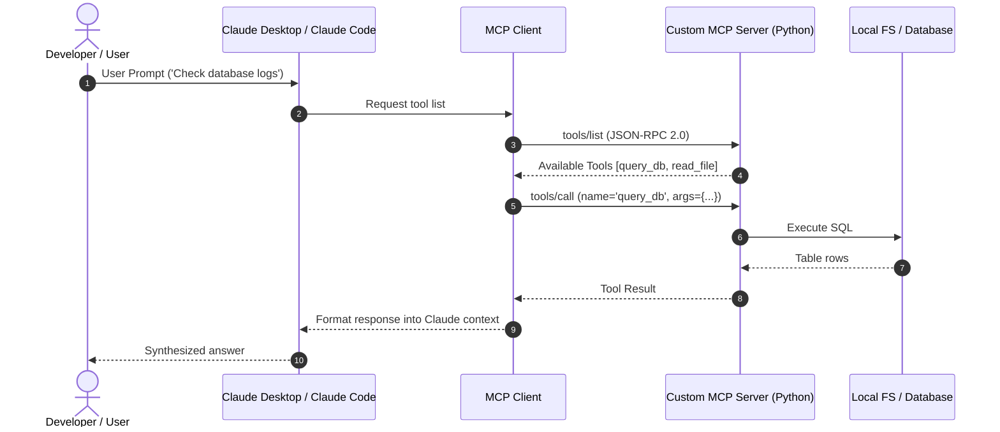

# 📹 Hooks in Claude Code — Full Theory + Practical Use

<div className="video-card" style={{border: '1px solid #30363d', borderRadius: '8px', padding: '16px', marginBottom: '24px', background: 'rgba(56, 139, 253, 0.05)'}}>
  <div style={{display: 'flex', gap: '16px', flexWrap: 'wrap'}}>
    <div><strong>Instructor:</strong> Nitish Singh (CampusX)</div>
    <div><strong>Duration:</strong> 64m 58s</div>
    <div><strong>Playlist:</strong> Agentic Coding with Claude Code (CampusX)</div>
    <div><strong>Watch Link:</strong> <a href="https://www.youtube.com/watch?v=oo1oADOiVmM" target="_blank" rel="noopener noreferrer">YouTube Lecture ↗</a></div>
  </div>
</div>

## 📌 Executive Summary & Learning Objectives

This lecture covers **Hooks in Claude Code — Full Theory + Practical Use**, focusing on production implementations, edge cases, and industry standards:
- Core intuition, architecture, and underlying mechanisms.
- Key differences between theoretical research implementations and scalable enterprise patterns.
- Concrete Python walkthroughs, error recovery, and performance optimization.

---

## 🏗️ Architecture & Conceptual Workflow



---

## 📖 Core Concepts & Technical Deep Dive

### 1. Architectural Foundations
In modern production AI engineering, **Hooks in Claude Code — Full Theory + Practical Use** is essential for ensuring reliability, low latency, and deterministic outcomes. As AI systems evolve from naive prompt-in / completion-out scripts into distributed systems, engineers must handle:
- **State management & consistency:** Ensuring intermediate states and tool invocations are tracked.
- **Error boundaries & recovery:** Graceful degradation when external LLMs or vector stores encounter rate limits or network partitions.
- **Resource utilization & cost efficiency:** Caching common queries and reducing unnecessary foundation model token expenditure.

### 2. Operational Considerations
- **Latency Optimization:** Pre-computing embeddings, utilizing asynchronous non-blocking event loops, and streaming tokens via Server-Sent Events (SSE).
- **Security & Sandboxing:** Validating inputs before ingestion, sanitizing LLM outputs, and isolating tool execution environments.

---

## 💻 Production Implementation Walkthrough

```python
from mcp.server.fastmcp import FastMCP

# Initialize FastMCP Server
mcp = FastMCP("Production AI Tools Server")

@mcp.tool()
def calculate_token_cost(input_tokens: int, output_tokens: int, model: str = "gpt-4o") -> dict:
    """Calculate total API cost given token counts."""
    rates = {
        "gpt-4o": {"input": 2.50 / 1_000_000, "output": 10.00 / 1_000_000},
        "claude-3-5-sonnet": {"input": 3.00 / 1_000_000, "output": 15.00 / 1_000_000},
    }
    rate = rates.get(model, rates["gpt-4o"])
    cost = (input_tokens * rate["input"]) + (output_tokens * rate["output"])
    return {"model": model, "total_cost_usd": round(cost, 6)}

if __name__ == "__main__":
    # Runs stdio transport protocol for Claude Desktop & Claude Code
    mcp.run(transport="stdio")
```

---

## 💡 Production Best Practices & Tips

:::tip Production Deployment Guideline
When deploying Hooks in Claude Code — Full Theory + Practical Use in enterprise environments, always configure automated retries with exponential backoff and telemetry tracing (such as OpenTelemetry or LangSmith).
:::

:::warning Common Failure Modes
Watch out for state contamination across concurrent requests. Ensure each session or user interaction uses an isolated thread ID or execution context.
:::

---

## 🎯 Key Takeaways & Quick Reference

| Dimension | Production Standard | Pitfall to Avoid |
| :--- | :--- | :--- |
| **Execution** | Async / Non-blocking with timeouts | Synchronous blocking calls in event loops |
| **Data Validation** | Strict Pydantic v2 schemas | Untyped dictionary access |
| **Monitoring** | Distributed tracing & latency percentiles | Relying only on standard console logs |

## ⏱️ Lecture Timeline & Key Topics

| Timestamp | Key Topic / Concept Discussed |
| :--- | :--- |
| **00:00:00** | हाय गाइस, माय नेम इज नितीश एंड यू वेलकम... |
| **00:16:21** | सिस्टम आपने बनाया है इट एक्ट्स लाइक अ... |
| **00:33:06** | टूल यूज़ वाले इवेंट पे। तो होगा क्या कि... |
| **00:48:14** | डिलीट करने को बोला जा रहा है या नहीं।... |
| **01:04:55** | नेक्स्ट वीडियो में। बाय।... |


---

---

## 📜 Complete Lecture Transcript (Hindi / Hinglish)

> **Language:** Hindi / Hinglish | **Source:** `14 - Hooks in Claude Code — Full Theory + Practical Use ｜ CampusX.hi.srt` | **Total Segments:** 33 | **Word Count:** ~11,085 words

<details>
<summary><b>Click to expand full chronological transcript (33 timestamped intervals)</b></summary>

#### ⏱️ [00:00 ➔ 00:02]

हाय गाइस, माय नेम इज नितीश एंड यू वेलकम टू माय YouTube चैनल। इस वीडियो में भी हम लोग अपना क्लॉट कोड प्लेलिस्ट कंटिन्यू करेंगे। और आज के वीडियो का टॉपिक है हुक्स। अब आज के वीडियो में हम क्या करने वाले हैं कि सबसे पहले हम लोग कॉनसेप्चुअल लेवल पर समझेंगे कि हुक्स होता क्या है? उसके बाद हम प्रैक्टिकली हुक्स को इंप्लीमेंट करेंगे क्लॉट कोड में और साथ ही साथ हम अपना जो प्रोजेक्ट चलता आ रहा है इस प्लेलिस्ट में उसको भी कंटिन्यू करेंगे और उसमें हम हुक्स का कांसेप्ट ऐड करेंगे। द मेन आईडिया इज कि हुक्स जो कि खुद में एक बहुत इंपॉर्टेंट कांसेप्ट है वो आपको बहुत अच्छे से समझ में आ जाए ताकि आप उसको अपने पर्सनल प्रोजेक्ट्स में इंप्लीमेंट कर पाओ। ठीक है? सो नाउ लेट्स स्टार्ट द वीडियो। अब हुक्स का कांसेप्ट समझने के लिए हम एग्जैक्टली वही फ्लो यूज़ करेंगे जो हम अपने बाकी के वीडियोस में करते हैं। हम सबसे पहले डिस्कस करेंगे व्हाई। फिर हम डिस्कस करेंगे व्हाट? फिर हम डिस्कस करेंगे हाउ। तो सबसे पहले यह डिस्कस करते हैं कि ऐसी क्या प्रॉब्लम है जो हुक्स सॉल्व करते हैं। व्हाई डू वी नीड हुक्स? अब ये पार्ट समझने के लिए इस प्रॉब्लम को समझने के लिए पहले आपको क्लॉड कोड को थोड़ा और डीपली समझना पड़ेगा। अभी तक आप क्लॉड कोड को यूज़ कर रहे थे। बट अब हम उसको थोड़ा सा समझते हैं कि क्लॉड कोड एकजेक्टली है क्या? अब यहां पर मैं आपको एक डिस्क्लेमर देना चाहूंगा कि हो सकता है कि अगला 10 मिनट्स ऐसा हो कि आपको लगने लगे कि ये थोड़ा सा सर आप एक्स्ट्रा चीजें पढ़ा रहे हो। अननेसेसरीली पढ़ा रहे हो। इससे छोटे एक्सप्लेनेशन पे भी काम चल जाता। बट ट्रस्ट मी आई नो व्हाट आई एम डूइंग। ये पूरा एक्सप्लेनेशन अगर आप देखोगे तो गोइंग फॉरवर्ड आपको काफी डीप इंट्यूशन हो जाएगा हुक्स का। साथ ही साथ आप कुछ नया भी सीखोगे। ठीक है? तो चलो लेट मी एक्सप्लेन द प्रॉब्लम जो हुक्स सॉल्व करते हैं बाय फर्स्ट अंडरस्टैंडिंग कि क्लॉड कोड है क्या? ठीक है? सो लेट्स से

#### ⏱️ [00:02 ➔ 00:04]

मैंने आपसे पूछ लिया कि क्लॉट कोड क्या है? तो व्हाट वुड यू से? देयर इज़ अ गुड चांस कि आप बोलोगे कि क्लॉड कोड इज़ अ टर्मिनल बेस्ड एi कोडिंग एजेंट। व्हिच इज़ ऑलमोस्ट ट्रू। बिकॉज़ अगर आप सोच के देखो तो क्लॉड कोड है क्या? हमारे पास एक क्लॉट का एलएलएम है। कोई भी एलएलएम आप उठा सकते हो। ओपस उठा लो, sonet उठा लो, हप उठा लो। और फिर उसके ऊपर हमने टूल्स और मेमोरी का एक लेयर बिठा दिया। ठीक है? हमने कुछ टूल्स का एक्सेस दे दिया क्लॉड को। कौन-कौन से टूल्स का? हमने रीड टूल का एक्सेस दे दिया। सो दैट क्लॉड हमारी फाइल्स को रीड कर पाए। हमने क्लॉड को राइट टूल का एक्सेस दे दिया। सो दैट वो नई फाइल्स क्रिएट कर पाए। उसमें नया कोड ऐड कर पाए। हमने बैश कमांड्स रन करने का टूल ऐड कर दिया। और इसके साथ-साथ हमने मेमोरी कैपेबिलिटीज़ भी दे दी। बिकॉज़ क्लॉट स्टेटलेस है। उसको पास्ट इंटरेक्शंस याद नहीं रहते। बट एक कोडिंग एजेंट को हमेशा प्रोजेक्ट का कॉन्टेक्स्ट पता होना चाहिए। अभी तक क्या-क्या चीजें बनी हुई है, पता होना चाहिए। आगे क्या करना है, पता होना चाहिए। तो एसेंशियली अगर हम बोले तो क्लॉड कोड इज नथिंग बट अ टर्मिनल बेस्ड एआई कोडिंग एजेंट और इसका सबसे बड़ा कोर फीचर है कि इट इज एजेंटिक इन नेचर। एजेंटिक का मतलब इट इज ऑटोनॉमस। जब आप इसको एक टास्क देते हो तो यह उस टास्क को पर्स्यू करता है ऑटोनॉमसली। आपसे पूछता नहीं है और आपकी जरूरत जब पड़ती है तभी वह आपसे बात करता है। बट एक गोल को वह खुद से पूरा का पूरा एग्जीक्यूट करता है और उस गोल को एग्जीक्यूट करने के प्रोसेस में उसको जब भी जिस भी टूल्स की जरूरत पड़ती है वो उस टूल को यूज़ भी कर लेता है। राइट? तो दिस इज़ व्हाट क्लॉड कोड इज़। बट अभी ये जो हमने डिस्कशन किया ना ये बहुत यूजर फेसिंग

#### ⏱️ [00:04 ➔ 00:06]

डेफिनेशन था। व्हिच बेसिकली मींस कि जो लोग क्लॉड कोड को यूज करते हैं ना वह लोग ऐसा डेफिनेशन देंगे। यूज़र्स के पर्सपेक्टिव से यह डेफिनेशन था। प्रोग्रामर्स जो एक्चुअल यूजर हैं क्लॉड कोड के दे वुड गिव सच डेफिनेशन। बट मुझे एक्चुअली ना सिस्टम डिज़ाइन पर्सपेक्टिव समझना है क्लॉड कोड का। आई वांट टू अंडरस्टैंड द सिस्टम डिज़ पर्सपेक्टिव ऑफ़ क्लॉड कोड। बेसिकली जिन लोगों ने क्लॉट कोड को बिल्ड किया, जिन इंजीनियर्स ने क्लॉट कोड को बिल्ड किया, उनके पर्सपेक्टिव से क्लॉट कोड क्या है? ये मैं समझना चाहता हूं। अब सिस्टम डिजाइन के पर्सपेक्टिव से अगर बोला जाए तो क्लॉट कोड को हम एक कोडिंग हारनेस बुला सकते हैं। अब यहां पे एक नया टर्म आ गया हारनेस। आप सोचोगे हारनेस क्या होता है? तो चलो एक बार हम समझते हैं कि हारनेस क्या होता है? मोस्ट लाइकली आपने इंग्लिश में ये टर्म सुना होगा और शायद आपके दिमाग में एक पिक्चर भी होगा कि हारनेस का मतलब क्या होता है। मैं बताता हूं हारनेस क्या होता है। यह जो इमेज है यह बहुत सॉलिड तरीके से एक्सप्लेन करती है हारनेस का कांसेप्ट। यहां पर एक घोड़ा बना हुआ है और उस घोड़े के ऊपर कुछ स्टैप्स और इक्विपमेंट्स लगे हुए हैं। इसी को हारनेस बुलाते हैं। यहां देखो एक डेफिनेशन लिखा हुआ है। अ सेट ऑफ स्टैप्स इक्विपमेंट्स यूज्ड टू कंट्रोल एंड डायरेक्ट द पावर ऑफ समथिंग स्ट्रांग। राइट? आप सोच के देखो। जो घोड़ा होता है उसके पास स्पीड एंड एजिलिटी होती है। मतलब वो तेजी से भाग सकता है और उसके पास पावर भी होता है टू पुल समथिंग। वह किसी चीज को खींच भी सकता है। इसका बेसिक मतलब यह है कि आप घोड़े को यूज़ करके घोड़ा गाड़ी बना सकते हो। जैसा पास्ट में लोगों ने किया भी है। बट घोड़ा गाड़ी बनाना इतना स्ट्रेट फॉरवर्ड नहीं है। इट्स नॉट लाइक आप घोड़े से रस्सी को कनेक्ट करके गाड़ी को कनेक्ट कर दोगे और आपकी घोड़ा गाड़ी बन गई। नो जब घोड़ा तेजी

#### ⏱️ [00:06 ➔ 00:08]

से भागेगा तो उस गाड़ी की स्टेबिलिटी भी बहुत ज्यादा मैटर करती है। तो इन सारी चीजों को सही से इंश्योर करने के लिए आप क्या करोगे? एक पूरा सिस्टम बनाओगे स्टैप्स एंड इक्विपमेंट्स का जो पूरे टाइम आपके घोड़े को और आपकी गाड़ी को बहुत प्रॉपर्ली कनेक्ट करके रखे। सो दैट घोड़ा जब फास्ट भाग रहा है, अनस्टेबल तरीके से भाग रहा है तो भी आपकी गाड़ी स्टेबल चले। अंदर बैठे हुए लोगों को चोट ना लगे। दिस इज व्हाट अ हारनेस इज। यहां देखो लिखा हुआ है द कोर आइडिया ऑफ अ हारनेस इज़ दैट रॉ पावर बिकम्स यूज़फुल ओनली व्हेन कंट्रोलोल्ड थ्रू स्ट्रक्चरर्ड इंटरफेस। यहां पे घोड़े के पास रॉ पावर है। और उसको हमने यूज़फुल बनाया कैसे? बाय कन्वर्टिंग इट इंटू अ घोड़ा गाड़ी। राइट? और ये घोड़ा गाड़ी हम बना क्यों पाए? बिकॉज़ हमारे पास ये हारनेस था। ये स्टैप्स थे। ये इक्विपमेंट्स थे। राइट? तो नाउ दैट यू अंडरस्टैंड कि हारनेस क्या होता है? एक बार वापस चलते हैं इस टर्म के पास कि कोडिंग हारनेस क्या होता है? सो कोडिंग हारनेस का भी फंडा बिल्कुल सेम है। आप ये घोड़ा गाड़ी वाला एग्जांपल लोगे ना तो आप बहुत आसानी से समझ जाओगे। यहां पर हमारे पास एक एलएलएम है व्हिच इज अगेन वेरी पावरफुल। रॉ पावर है इसके पास। बहुत अंडरस्टैंडिंग है, बहुत नॉलेज है। इट इज़ इंटेलिजेंट। इट कैन डू अ लॉट ऑफ़ टास्क। राइट? बट द प्रॉब्लम इज़ कि जस्ट लाइक इज़ जस्ट लाइक दिस घोड़ा। आवर एलएलएम हैज़ आल्सो सम प्रॉब्लम्स। लाइक हमारा जो एलएलएम है वह अनप्रिडिक्टेबल है। इट माइट हेलुसिनेट समटाइ्स। इट इज़ आल्सो स्टेटलेस व्हिच बेसिकली मीन्स कि इसको पास्ट इंटरेक्शंस याद नहीं रहते। इट इज़ आल्सो नॉन डिटरमिनिस्टिक व्हिच बेसिकली मींस कि आप दो बार सेम प्र्ट भेजोगे तो अलग आउटपुट मिल सकता है। इट इज़ आल्सो डिस्कनेक्टेड फ्रॉम द रियल वर्ल्ड। ये सिर्फ टेक्स्ट को समझता है। टेक्स्ट आपको पलट के देता है। इसके अलावा इसके पास कोई कैपेबिलिटीज़ नहीं है। एंड लास्टली इट इज़ अनेबल टू एक्ट

#### ⏱️ [00:08 ➔ 00:10]

सेफली ऑन इट्स ओन। यह बहुत सेफ नहीं है। इट माइट प्रोड्यूस समथिंग जो अनसेफ हो। राइट? तो जस्ट लाइक आवर हॉर्स घोड़ा हमारे पास एक क्लॉड एलएलएम है जिसके पास बहुत सारा रॉ पावर है। बट उसके साथ बहुत सारी परेशानियां भी हैं। ऐसा नहीं है कि आप इस एलएलएम को डायरेक्टली कोडिंग के लिए यूज़ कर सकते हो या एक कोडिंग बेस्ड सिस्टम बनाने के लिए यूज़ कर सकते हो। तो व्हाट यू नीड इज यू नीड सम काइंड ऑफ हारनेस जो इस क्लॉड एलएलएम के रॉ पावर को यूटिलाइज कर पाए, डायरेक्ट कर पाए और सेफली उसको एक सॉफ्टवेयर इंजीनियरिंग सिस्टम में कन्वर्ट कर पाए। तो कोडिंग हार्डनेस इज नथिंग बट अ पीस ऑफ सॉफ्टवेयर दैट इज यूज्ड टू कन्वर्ट अ रॉ एलएलएम इंटू अ रिलायबल सॉफ्टवेयर इंजीनियरिंग सिस्टम। यही डेफिनेशन है कोडिंग हारनेस का। और कोडिंग हारनेस ये काम अचीव कैसे करता है? कोडिंग हारनेस के अंदर जो डेवलपर्स हैं, जो इंजीनियर्स हैं, वो लोग बहुत तरीके का कोड लिखते हैं अलग-अलग तरह के सिचुएशंस को हैंडल करने के लिए। फॉर एग्जांपल क्लॉट कोड का ही अगर आप बात करो तो क्लॉट कोड के अंदर कोड लिखा हुआ है दैट इट कैन रीड योर फाइल सिस्टम सो दैट वो पूरा कॉन्टेक्स्ट एलएलएम को दे पाए। इट कैन डिस्प्ले टर्मिनल आउटपुट सो दैट जो भी उसको एलएलएम से मिल रहा है वो सही तरीके से आपको एज एन प्रोग्रामर को दिखा पाए। इट कैन आल्सो मैनेज योर कन्वर्सेशन हिस्ट्री। देखा ही था आपने। आप अलग-अलग सेशंस में बात कर रहे हो। वो सारे सेशंस प्रॉपर्ली आपके मशीन पे स्टर्ड हैं। आप कभी भी पीछे जाके उनको देख सकते हो। इट कैन आल्सो ट्रैक योर कॉन्टेक्स्ट विंडो यूसेज। कितना बचा है हफ्ते का इस सेशन का? कैसे आप उसको इनक्रीस कर सकते हो। अगर एक पर्टिकुलर सेशन में आपका कॉन्टेक्स्ट विंडो फिल हो रहा है तो आप कॉम्पैक्ट कमांड रन रन कर सकते हो। क्लियर कमांड रन कर सकते हो। आपका कोडिंग हारनेस सेंड्स एपीआई

#### ⏱️ [00:10 ➔ 00:12]

रिक्वेस्ट टू एंथ्रोपिक। आपका एलएलएम आपकी मशीन पे तो बैठा हुआ नहीं है। वो तो एंथ्रोपिक के सर्वर्स के पे ऊपर बैठा हुआ है। तो उससे इंटरेक्ट करने का काम किसका है? आपके कोडिंग हारनेस का। आपका कोडिंग हारनेस ही मॉडल्स के टूल कॉल को पास करता है और एग्जीक्यूट करता है। आपका कोडिंग हारनेस ही सेफ्टी एंड परमिशन मॉड्यूल को इंप्लीमेंट करता है। हर बार आपसे परमिशन लेता है। कोई भी कमांड्स को रन करने के पहले। देखा ही होगा आपने। एक बार परमिशन मिल जाने के बाद कोडिंग हारनेस ही वो बंदा है जो जाकर के आपके कमांड्स को एग्जीक्यूट करता है। मेमोरी मैनेजमेंट का काम कोडिंग हारनेस करता है। क्लॉट डॉट एमडी फाइल के बारे में आपने पढ़ा। सब एजेंट्स की मेमोरी फाइल्स के बारे में आपने पढ़ा। ये सारा मेमोरी सिस्टम कौन हैंडल कर रहा है? आपका कोडिंग हारनेस। बहुत सारे स्लैश कमांड्स आपको बना के दिए गए हैं। सो दैट आप तुरंत शॉर्टकट तरीके से कोई भी एक्शन एग्जीक्यूट कर पाओ। ये पावर आपको कौन दे रहा है? आपका कोडिंग हारनेस। इट कैन स्पॉन मल्टीपल सब एजेंट्स इन पैरेलल। सो दैट अलग-अलग टास्क साथ में एग्जीक्यूट हो पाए। बहुत तरह के एक्सटेंसिबिलिटी ऑप्शंस आपको देता है आपका कोडिंग हार्डनेस। सो दैट आप एमसीपी या प्लगइिंस की हेल्प से अलग-अलग टूल्स कनेक्ट कर पाओ अपने एलएलएम के साथ। तो यू गेट द आईडिया। अगर आपने ये प्लेलिस्ट पूरा अभी तक देखा होगा तो आपको समझ में आ रहा होगा कि मैं क्या बोल रहा हूं। यह सब कुछ किसी ने बनाया है और इसी को कोडिंग हारनेस बोला जाता है। तो आई रियली होप आप समझ पा रहे हो कि कोडिंग हारनेस चीज क्या है। अब एक एग्जांपल के थ्रू मैं आपको समझाता हूं कि कोडिंग हारनेस एक्सैक्टली काम कैसे करता है एलएलएम के साथ। मान लो आप आए और आपने अपने अ क्लॉट कोड में टाइप किया कि एक्सप्लेन द प्रोजेक्ट। अब होगा क्या कि आपका जो कोडिंग हारनेस है वह इस प्र्प्ट को उठाएगा। उसके साथ-साथ कुछ और इंपॉर्टेंट चीजों को उठाएगा सच एज क्लॉट फाइल और इन सबको भेज देगा एक एपीआई कॉल के थ्रू आपके एलएलएम के पास जो कि एंथ्रोपिक के सर्वर्स पे बैठा

#### ⏱️ [00:12 ➔ 00:14]

हुआ है। एंथ्रोपिक के सर्वर पे इस एलएलएम को ये सारी चीज मिलेगी और अब वो एक कमांड जनरेट करेगा दैट आई वांट टू रीड एप डॉट py फाइल। अब ये टेक्स्ट कमांड रिसीव कौन करेगा? अगेन आपका कोडिंग हारनेस और वो जाएगा कंसोल में और वहां पे कमांड एग्जीक्यूट करेगा जिससे वो आपकी app डॉटpy फाइल को ओपन करेगा। फिर उसके कंटेंट को कॉपी करेगा और फिर इस कॉपीड कंटेंट को वापस एक एपीआई कॉल के थ्रू आपके एलएलएम के पास भेजेगा। अब आपके एलएलएम के पास फाइल का कंटेंट आ गया। तो यू कैन सी यहां पे आप एक एनालॉजी के थ्रू समझ सकते हो कि एक कोडिंग हार्डनेस और एक एलएलएम कैसे साथ में काम कर रहे हैं। द एनालॉजी इज़ माइंड, ब्रेन एंड बॉडी। यहां पे आपका जो एलएलएम है इसको आप ब्रेन की तरह ट्रीट करो। जहां पे थॉट्स आ रहे हैं कि मुझे app. Py का कंटेंट देखना चाहिए। और फिर आपका जो कोडिंग हारनेस है इसको आप ट्रीट कर सकते हो एज योर बॉडी योर नर्वस सिस्टम जो एक बार एक थॉट आ रहा है उसको एक्शन में कन्वर्ट कर रहा है। ये जो पूरा का पूरा एग्जीक्यूशन हुआ वो कोडिंग हार्डनेस आपको करके दे रहा है। तो ये अंडरस्टैंडिंग होना बहुत जरूरी है कि कोडिंग हार्नेस और आपका एलएलएम्स साथ में काम कैसे करते हैं। राइट? अ ये पूरी चीज तो आपने देख ही ली। एक और साइड नोट आपको देना चाहूंगा कि यह जो टर्म है हारनेस यह रिसेंटली बहुत पॉपुलर हो रहा है। इनफैक्ट एक कंप्लीटली नई फील्ड इमर्ज कर रही है जिसका नाम है हारनेस इंजीनियरिंग। ठीक है? और हो सकता है कि फ्यूचर में यहां पे बहुत काम हो। और अब बहुत तरह के हारनेसेस भी पिक्चर में आ रहे हैं। क्लॉड कोड तो एक तरह का हारनेस है। इट्स अ कोडिंग हारनेस। बट आपने शायद और कुछ हारनेसेस का नाम सुना होगा। जैसे कि आपने

#### ⏱️ [00:14 ➔ 00:16]

शायद ओपन क्लॉ का नाम सुना होगा। ओपन क्लॉ इज नॉट अ कोडिंग हारनेस। इट इज मोर लाइक अ पर्सनल एजेंट हारनेस। यहां पे आप क्या कर सकते हो? ओपन क्लॉक की हेल्प से आप लॉन्ग रनिंग टास्क एग्जीक्यूट करवा सकते हो। ठीक है? और यह काइंड ऑफ आपके पर्सनल लाइफ से कनेक्ट भी कर जाता है। मतलब आप WhatsApp वगैरह से कनेक्ट कर सकते हो अपने एलएलएम को। एंड दैट इज व्हाई यह बहुत पॉपुलर हुआ था। एक आध महीने पहले बहुत फट पड़ा था। वायरल हो गया था। फिर आपने शायद हर्मीस एजेंट का भी नाम सुना होगा। ये भी आजकल थोड़ा पॉपुलर हो रहा है। हर्मीस एजेंट इज़ आल्सो अ पर्सनल एजेंट। हारनेस जस्ट लाइक ओपन क्लॉक। यहां पे बस एक एडवांटेज क्या है? दैट इट इज़ सेल्फ लर्निंग। सो जभी भी आप हर्मिस एजेंट के थ्रू कोई काम करवाते हो तो वो उस काम को करने का पूरा प्रोसेस को स्टोर कर लेता है और हर अगली बार उससे सीखता जाता है। तो इट्स अ सेल्फ लर्निंग लूप जो ओवर टाइम इवॉल्व होता जाता है और जितना ज्यादा आप हर्मीस एजेंट को यूज़ करोगे वो आपके हिसाब से ढलता जाएगा। ठीक है? तो ये भी एक तरह का अभी हारनेस बहुत पॉपुलर हो रहा है। इसके अलावा पाई बोल के एक और हारनेस है व्हिच इज़ क्वाइट पॉपुलर। पाई इज़ अ कोडिंग हारनेस। जस्ट लाइक क्लॉट कोड ये थोड़ा लाइट वेट है। तो ये अभी बहुत तरह के हारनेसेस पिक्चर में आ रहे हैं और हारनेस इंजीनियरिंग एज अ फील्ड इमर्ज कर रही है। ठीक है? तो ये एक साइड नोट मैंने आपको दे दिया। बट अभी तक इस पॉइंट तक हमने जो डिस्कशन किया है उसको समराइज़ कर लेते हैं। दैट क्लॉड कोड इज़ अ कोडिंग हारनेस बिल्ट ऑन टॉप ऑफ क्लॉड एलएलएम्स। द आईडिया इज टू कन्वर्ट द रॉ पावर ऑफ क्लॉड एलएलएम्स इंटू अ रिलायबल सॉफ्टवेयर इंजीनियरिंग सिस्टम। ठीक है? अब यहां से आगे बढ़ते हैं और ये डिस्कस करते हैं कि इस सिस्टम में ऐसी क्या प्रॉब्लम है जिसकी वजह से हमें हुक्स की जरूरत पड़ी। सो प्रॉब्लम अराइज़ करती है कोडिंग हारनेस और इस एलएलएम के बीच के

#### ⏱️ [00:16 ➔ 00:18]

रिलेशनशिप की वजह से। सो एलएलएम और कोडिंग हार्डनेस के बीच का जो रिलेशनशिप है उसको आप बॉस एंप्लई रिलेशनशिप बुला सकते हो। सो होता क्या है कि आपका जो एलएलएम है इट एक्ट्स एस अ बॉस जो एक टास्क देता है और आपका जो कोडिंग हार्डनेस है जो पूरा सिस्टम आपने बनाया है इट एक्ट्स लाइक अ एंप्लई जिसको जो भी इंस्ट्रक्शन बॉस से मिलता है उसको फेथफुली एग्जीक्यूट करने का काम मिला है। राइट? और एक और चीज आपका जो कोडिंग हारनेस है वो डिटरमिनिस्टिक है। डिटरमिनिस्टिक का मतलब आप हर बार अगर सेम इंस्ट्रक्शन दोगे तो यह सिस्टम एज इट इज उस इंस्ट्रक्शन को सेम टू सेम तरीके से एग्जीक्यूट करेगा। अगर आप बोलोगे ये फाइल रीड करके लाओ हर बार ये सिस्टम उस फाइल को सेम तरीके से रीड करके लाएगा। सेम आउटपुट आपको मिलेगा। जैसे कोई भी सॉफ्टवेयर सिस्टम होता है। सॉफ्टवेयर सिस्टम्स आर डिटरमिनिस्टिक बेस्ड ऑन द इनपुट। यू कैन एक्चुअली प्रेडिक्ट आउटपुट क्या रहेगा? राइट? द प्रॉब्लम इज कि यह जो एलएलएम है ना यह प्रोबेबलिस्टिक है व्हिच बेसिकली मींस कि यहां पर गारंटी नहीं है कि हर बार सेम इनपुट देने से सेम आउटपुट बाहर आए। सो थोड़ा सा आप इसको समझ सकते हो कि आपका जो बॉस है वो थोड़ा सा मूडी है। ठीक है? तो अभी तक के कॉन्वर्सेशन के बेसिस पे नेक्स्ट आउटकम क्या होना चाहिए? ये हमेशा आपका एलएलएम कैलकुलेट करता है और ये अलग-अलग हो सकता है डिपेंडिंग ऑन द सिचुएशन। तो कभी ऐसा सिचुएशन आ सकता है कि आपका एलएलएम आपके एंप्लई एज इन कोडिंग हारनेस को यह ऑर्डर दे कि गो डिलीट सम फाइल्स। ऐसा हो सकता है बिकॉज़ ऑफ़ सम हेलुसिनेशन और सम इंटरनल इशू कॉन्टेक्स्ट में कुछ गड़बड़ हो गई जिसकी वजह से आपके एलएलएम ने यह

#### ⏱️ [00:18 ➔ 00:20]

ऑर्डर दे दिया कि डिलीट सम फाइल्स। या फिर कभी ऐसा सिचुएशन आ गया कि आपके एलएलएम ने बोला गो एंड मेक चेंजेस टू द डॉट एनवी फाइल जहां पे आपकी एपीआई कीज़ रखी हुई हैं। या फिर कभी ऐसा सिचुएशन आ सकता है कि आपका क्लॉड एलएलएम आपको पैरामीटराइज्ड सीक्वल क्वरी लिखने के बदले एफ स्ट्रिंग्स लिखने को बोले। द प्रॉब्लम इज कि आपके कोडिंग हारनेस को ब्लाइंडली फॉलो करना है आपके एलएलएम के इंस्ट्रशंस को तो आपका एलएलएम जो भी बोलेगा आपका कोडिंग एजेंट उसको फेथफुली एग्जीक्यूट करेगा हर बार और यहीं पे आता है बहुत बड़ा रिस्क व्हेन यू आर वर्किंग ऑन अ प्रॉपर प्रोडक्शन ग्रेट सॉफ्टवेयर किसी क्लाइंट के प्रोजेक्ट के ऊपर काम कर रहे हो तो वहां पे ये जो सेटअप है क्लॉट एलएलएम और कोडिंग हारनेस का जहां पे फ्लॉड एलएलएम थोड़ा मूडी है और कोडिंग हारनेस बहुत ही ओबिडिएंट और फेथफुल है। ये जो कॉम्बिनेशन है ना ये थोड़ा डेंजरस हो जाता है और यही वो प्रॉब्लम है जिसको हुक्स सॉल्व करते हैं। यहां पे एक बात बताना मैं भूल गया। जब मैं एक चीज़ एक्सप्लेन कर रहा था कि आपका एलएलएम कुछ फाइल्स को डिलीट कर सकता है या डॉट एनवायरमेंट फाइल में चेंजेस कर सकता है। तो शायद आपके दिमाग में ये बात आ रही होगी कि इन सारी प्रॉब्लम्स को तो हम सॉल्व कर सकते हैं बाय राइटिंग इंस्ट्रक्शंस इन टू आवर क्लॉट फाइल। हम करते नहीं भी हैं। राइट? हम अपनी क्लॉट डॉट फाइल में एक्सप्लसिट इंस्ट्रक्शंस लिखते हैं कि कोई भी फाइल डिलीट नहीं होनी चाहिए। डॉट ईएनवी फाइल में चेंजेस नहीं होने चाहिए। हमेशा पैरामीटराइज़्ड क्वेरीज़ लिखो। ये सारे इंस्ट्रक्शंस हम लिखते हैं। राइट? तो फिर एक बार हमने इंस्ट्रक्शन दे दिया तो एलएलएम तो हमारी बात मानेगा। राइट? द आंसर इज नॉट नेसेसरीली। कभी-कभी क्या होता है कि अगर आपका कॉन्टेक्स्ट काफी हद तक फिल

#### ⏱️ [00:20 ➔ 00:22]

हो चुका है और आप एक बहुत कॉम्प्लेक्स टास्क के बीच में हो। जैसे कि आप कोई बहुत कॉम्प्लेक्स क्वेरी लिख रहे हो या फिर कोई बहुत क्रेजी रिफैक्टिंग कर रहे हो बहुत बड़े स्केल का। तो वहां पे क्या होता है कि आपके एलएलएम की टेंडेंसी होती है आपके इंस्ट्रक्शंस को ओवराइड कर देने की या भूल जाने की। तो उस केस में क्या होगा कि वो प्रोबेबलिस्टिकली ऐसा बोल सकता है कि फाइल्स को डिलीट कर दो। सो 98% चांसेस में ऐसा होता है कि आपके इंस्ट्रक्शंस फॉलो किए जाएंगे। बट देयर इज़ अ आउटसाइड 2% चांस जहां पे आपका क्लॉट एलएलएम पागल हो सकता है और वो इस तरह के इंस्ट्रक्शंस निकाल देगा आपके कोडिंग हार्डनेस के लिए कि जाओ डॉट ईएनवी फाइल में चेंजेस कर दो। फाइल्स डिलीट कर दो। और वहां पे आता है रिस्क। यह जो 2% टाइम्स है ना इसी को हमको हैंडल करना होता है और यही प्रॉब्लम को सॉल्व करते हैं हुक्स। ठीक है? तो यह पॉइंट मैं बताना भूल गया था। ये मैंने अभी आपको बता दिया। अब हुक्स क्या होते हैं? ये समझने के लिए हमें दो और कांसेप्ट समझने पड़ेंगे। उनमें से पहला कांसेप्ट है एजेंट लूप और दूसरा कांसेप्ट है सेशन लाइफ साइकिल। तो पहले एक बार एजेंट लूप के बारे में पढ़ते हैं। सो जब भी आप कोई टास्क देते हो क्लॉट कोड को तो एसेंशियली होता क्या है कि आप एक प्र्प्ट लिखते हो। वो प्र्ट आपके कोडिंग हारनेस के पास जाता है और वहां से वो जाता है आपके एलएलएम के पास जो एंथ्रोपिक के सर्वर्स पे है। राइट? दिस इज द फ्लो। और फिर आपका एलएलएम आपको पलट के रिजल्ट्स देता है और वही रिजल्ट कोडिंग हारनेस आपको बताता है। दिस इज द फ्लो। बट कभी भी ऐसा नहीं होता है कि कोई एक टास्क अगर यूजर ने प्र्प्ट में दिया है तो एलएलएम उसको एक ही बार में सॉल्व करके रिटर्न कर दे। जनरली क्या होता है कि इट्स अ मल्टीस्टेप प्रोसेस। मैं आपको एक एग्जांपल के थ्रू

#### ⏱️ [00:22 ➔ 00:24]

समझाता हूं। मान लो यूजर ने ये प्र्प्ट दिया कि मुझे अपनी वेबसाइट में एक स्लैश डिलीट बोल करके एपीआई एंड पॉइंट ऐड करना है। ये आपका प्र्प है। तो ये प्र्प्ट गया कोडिंग हार्नेस के पास कोडिंग हार्डनेस से गया एलएलएम के पास। अब यहां पे एलएलएम नेक्स्ट एक्शन डिसाइड करेगा। तो मान लो उसका नेक्स्ट एक्शन ये है कि उसने सोचा कि मुझे स्लश डिलीट बनाने के पहले एक बार ऐप डॉट py को रीड करना है। तो अब ये पलट के एक स्ट्रक्चरर्ड टूल कॉल गया आपके कोडिंग हारनेस के पास और कोडिंग हारनेस ने क्या किया कि उसने एग्जीक्यूशन चालू किया। एग्जीक्यूशन चालू करने का मतलब उसने ऐप डॉटpy को खोला। उसका कंटेंट कॉपी किया और उसको वापस भेज दिया मॉडल के पास। ठीक है? अब यह इनेशन मॉडल के पास पहुंचा। मॉडल ने ऐप डॉटpy को देखा। उसका जो भी रिक्वायरमेंट था उसने समझ लिया। उसके बाद मॉडल ने नेक्स्ट ये सोचा कि मुझे अब स्कीमा डॉट सीक्वल देखना है। मुझे डेटाबेस का स्ट्रक्चर समझना है डिलीट वाला एंड पॉइंट लिखने के पहले। तो अगेन एक स्ट्रक्चरर्ड टूल कॉल गया आपके कोडिंग हारनेस के पास। आपके कोडिंग हारनेस ने जाकर के ये फाइल ओपन की कंटेंट कॉपी किया वापस मॉडल के पास भेजा वापस मॉडल के पास ये इनेशन गया अब मॉडल ने दोनों चीजें समझ ली appीy में क्या था स्कीमा डॉट सीक्वल में क्या था अब उसने वो कोड तैयार किया जो वो चाहता था app डॉटpy में लिखना स्लैश डिलीट का कोड वो अगेन गया आपके कोडिंग हारनेस के पास कोडिंग हारनेस ने फाइल को ओपन किया उसमें वो उस कोड को पेस्ट कर दिया और जो भी रिजल्ट था उसको वापस भेजा आपके मॉडल के पास। अब आपके मॉडल ने सोचा मैंने एंड पॉइंट बना तो दिया है। उसको टेस्ट भी करना चाहिए। तो उसने ये कमांड चलाने को बोला आपके कोडिंग हार्डनेस को। आपके कोडिंग

#### ⏱️ [00:24 ➔ 00:26]

हारनेस ने टेस्ट रन किए। टेस्ट का जो भी रिजल्ट था उसको वापस भेजा मॉडल के पास। मॉडल ने देखा सारे टेस्ट सही से पास हो गए। तो अब उसने कोई टूल कॉल ना करके सिंपली बोला डन और अब आपका यह लूप बंद हो गया। तो दिस इज हाउ थिंग्स आर एग्जीक्यूटेड इनसाइड क्लॉट कोड। फॉर ईच टास्क देयर इज़ एन एजेंट लूप। ये जो आपने लूपिंग देखा इसी को हम एजेंट लूप बुलाते हैं कि हर टास्क को छोटे स्टेप्स में ब्रेक डाउन किया जाता है और वो इंस्ट्रक्शंस एग्जीक्यूट होते हैं। हार कोडिंग हारनेस उनको एग्जीक्यूट करता है। रिजल्ट्स मॉडल के पास भेजता है। मॉडल अगला इंस्ट्रक्शन देता है। कोडिंग हारनेस उसको एग्जीक्यूट करता है और ये तब तक चलता रहता है जब तक मॉडल अपना काम खत्म नहीं कर लेता। तो दिस इज़ व्हाट वी कॉल एजेंट लूप। और आप कोई भी कोडिंग हार्डनेस उठा लो उसके अंदर यह एजेंट लूप इंप्लीमेंटेड होता ही है। अब हम डिस्कस करेंगे कि सेशन लाइफ साइकिल क्या होता है? यहां पे मैंने एकदम सिंपल एक वन लाइन डेफिनेशन लिखा है। एक बार इसको पढ़ते हैं। सेशन लाइफ लाइन इज द फुल लाइफ स्पैन ऑफ वन क्लॉड सेशन फ्रॉम द मोमेंट यू लॉन्च इट टू द मोमेंट यू क्लोज इट। सो आप अभी तक मल्टीपल टाइम्स सेशंस क्रिएट कर चुके हो प्लॉट कोड में। मैंने आपको बताया भी था कि जब भी आपको एक नया फीचर डेवलप करना है, आप एक नया सेशन क्रिएट करोगे। उस सेशन के अंदर आप पूरा फीचर डेवलप करोगे और फिर उसको बंद करके नया सेशन स्टार्ट करोगे फॉर अ न्यू फीचर। राइट? तो, सेशन लाइफ साइकिल इज़ बेसिकली द एंटायर लाइफ स्पैन ऑफ अ सेशन। यह स्टार्ट तब होता है जब आप एक सेशन को स्टार्ट करते हो बाय टाइपिंग क्लॉड। और यह खत्म तब होता है जब आप एग्जिट लिखते हो। इसके बीच में जो कुछ भी होता है वो सब कुछ सेशन लाइफ साइकिल का पार्ट है। होता क्या है? बहुत सिंपल फ्लो है। सबसे पहले सेशन स्टार्ट होता है। उसके बाद यूजर एक प्र्ट सबमिट करता है। जैसे ही यूजर एक प्र्प्ट देता है

#### ⏱️ [00:26 ➔ 00:28]

या एक टास्क देता है तो उस टास्क के बेसिस पे आपका एजेंट लूप स्टार्ट होता है जो हमने थोड़ी देर पहले डिस्कस किया। ठीक है? और यह एजेंट लूप तब तक चलता है जब तक वह पर्टिकुलर टास्क कंप्लीट नहीं हो जाता। जैसे ही वह टास्क कंप्लीट हो जाता है, अब दो ऑप्शंस हैं हमारे पास। या तो हम सेशन को बंद कर दें या फिर यूजर हमें एक नया प्र्ट दे। तो अगर यूजर एक नया प्र्प्ट देता है तो फिर हम वापस यहां पहुंच जाते हैं। यहां पे हमें एक नया प्र्ट मिलता है, नया टास्क मिलता है। उस नए टास्क के कॉस्पोंडिंग फिर से एक नया एजेंट लूप स्टार्ट होता है। फिर से एजेंट लूप अपना काम खत्म करता है और हम फिर यहां पहुंच जाते हैं। फिर अगला प्र्प्ट आता है एंड वी कीप ऑन डूइंग दिस। और फाइनली कभी ऐसा टाइम आता है जब यूजर को इस पर्टिकुलर सेशन में और कोई टास्क नहीं करने तो फिर वो स्टॉप से बाहर निकल के सेशन को एंड कर देता है। तो एसेंशियली आपका जो एजेंट लूप है उसके बाहर जो एक और लूप चल रहा है दैट इज योर सेशन लाइफ साइकिल। ठीक है? अब ये जो पूरा का पूरा सेशन लाइफ साइकिल है इसको कैरी आउट कौन करता है? इसको चलाता कौन है? ऑब्वियसली आपका कोडिंग हारनेस आपके कोडिंग हारनेस के पास यह पूरा कंट्रोल होता है। वो ये सारी की सारी चीजें स्टेप बाय स्टेप एग्जीक्यूट करता है। अब यहां पे एक इंटरेस्टिंग चीज क्या है कि सिंस यहां पे कंट्रोल कोडिंग हारनेस के पास है। तो कोडिंग हारनेस क्या करता है कि कुछ इवेंट्स क्रिएट कर देता है। क्योंकि कोडिंग हारनेस को पता है कि एक सर्टेन फ्लो ऑफ इवेंट्स हो रहे हैं। जैसे कि हमेशा सबसे पहले सेशन स्टार्ट होगा। फिर यूजर प्र्प एजेंट लूप स्टार्ट होगा। एजेंट लूप में हमेशा टूल कॉल होगा। फिर एजेंट लूप खत्म होगा। फिर वापस या तो आप यूजर सबमिट प्र्ट पे जाओगे या फिर आप सेशन एंड करोगे। तो

#### ⏱️ [00:28 ➔ 00:30]

क्लॉट कोड के जो क्रिएटर्स हैं उन्होंने जब ये कोडिंग हारनेस बनाया तो उन लोगों ने ये सारे इवेंट्स डिफाइन कर दिए। अब ये जो आपको स्क्रीन पर दिखाई दे रहा है ये एक सिंपलीफाइड वर्जन ऑफ सेशन लाइफ साइकिल है। जो एक्चुअल क्लॉट कोड का सेशन लाइफ साइकिल है वो थोड़ा सा और कॉम्प्लेक्स है। उसमें थोड़े से और ज्यादा इवेंट्स आते हैं। मैं आपको दिखाता हूं। सो ये क्लॉट कोड का डॉक्यूमेंटेशन है। इसमें हुक्स के पेज पे जब आप जाओगे तो आपको दिखाई देगा कि ये है कंप्लीट लाइफ साइकिल। ठीक है? अगर मैं इसको थोड़ा ज़ूम करूं। तो यहां पे सेशन स्टार्ट से आप शुरू करते हो। सो अगर आप क्लॉड कोड के डॉक्यूमेंटेशन पर जाओ हुक्स वाले पेज पर तो वहां पर आपको कंप्लीट सेशन लाइफ साइकिल दिखाई देगा। इट स्टार्ट्स विद सेशन स्टार्ट यूजर प्र्प सबमिट्स। ये जितने भी आपको ये बॉक्सेस दिखाई दे रहे हैं ऑल ऑफ़ दीज़ आर इवेंट्स जो सेशन लाइफ साइकिल में होते हैं। ठीक है? फिर एजेंटिक लूप के अंदर आप घुसते हो। वहां पे प्री टूल यूज़ है। परमिशन रिक्वेस्ट इज़ एन इवेंट। पोस्ट टूल यूज़ है। मतलब टूल को यूज़ करने के पहले एक इवेंट है। टूल को यूज करने के बाद एक इवेंट है। फिर आपके कुछ और इवेंट्स हैं लाइक पोस्ट टूल बैच। फिर सब एजेंट्स भी यहां पे ही आते हैं। टास्क क्रिएटेड, टास्क कंप्लीटेड, स्टॉप, फिर आपका टीममेट आइडल, प्रीकंपैक्ट, पोस्ट कॉम्पैक्ट, सेशन एंड। तो ये आपके सारे इवेंट्स हैं जिससे मिलकर के आपका सेशन लाइफ साइकिल बनता है। अब आपको ये सारे इवेंट्स समझने की जरूरत नहीं है। आपको बस एक मेंटल मॉडल आपके दिमाग में होना चाहिए कि एजेंट लूप क्या है? सेशन लाइफ साइकिल क्या है? ठीक है? और उसमें क्या-क्या मेन इवेंट्स आते हैं। तो सेशन स्टार्ट, यूजर सबमिट प्र्प, प्री टूल यूज़, पोस्ट टूल यूज़, स्टॉप, सेशन एंड, सब एजेंट स्टार्ट, सब एजेंट स्टॉप। ये आपके कुछ मेन इवेंट्स हैं जो आपको अपने दिमाग में रखने हैं। ठीक है? तो इस पॉइंट पॉइंट पे आई रियली होप आपको एजेंट लूप का कांसेप्ट भी समझ में आ गया है। सेशन लाइफ साइकिल का कांसेप्ट भी समझ में आ गया है। अब हम

#### ⏱️ [00:30 ➔ 00:32]

डिस्कस करेंगे कि एग्जैक्टली हुक्स क्या होते हैं? तो गाइस, अब समझते हैं कि हुक्स क्या होते हैं? यहां पे मैंने एक बहुत सिंपल डेफिनेशन लिखा है और अब आपको ये डेफिनेशन बहुत अच्छे से समझ में आएगा बिकॉज़ आप ऑलरेडी एजेंट लूप और सेशन लाइफ साइकिल समझ चुके हो। देखो यहां पे लिखा हुआ है हुक्स आर कस्टम स्क्रिप्ट्स रिटेन बाय द प्रोग्रामर दैट द हारनेस ऑटोमेटिकली एग्जीक्यूट्स एट स्पेसिफिक इवेंट्स ड्यूरिंग अ सेशंस लाइफ साइकिल। सो सिंपल शब्दों में बुक्स आर नथिंग बट स्क्रिप्ट्स जो हम लिखते हैं। प्रोग्रामर लिखता है और उसको हम सेशन लाइफ साइकिल के साथ सेशन लाइफ साइकिल की किसी पर्टिकुलर इवेंट के साथ इस तरीके से कफ़िगर कर देते हैं कि जैसे ही वो पर्टिकुलर इवेंट अकर करता है, आपका कोडिंग हारनेस जाकर के इस स्क्रिप्ट को एग्जीक्यूट करता है। अब इससे क्या फायदा होगा? मैं आपको समझाता हूं वि द हेल्प ऑफ एन एग्जांपल। मान लो आप वही स्पेंटली वाले प्रोजेक्ट के ऊपर काम कर रहे हो। हमारा जो एक्सपेंस ट्रैकिंग प्रोजेक्ट है और इसमें हमारी एक डेटाबेस फाइल है। ऑब्वियसली ये फाइल सुपरेंट है। सारा डिटेल्स, यूजर डिटेल्स, ट्रांजैक्शन डिटेल्स सब कुछ आपको इसी फाइल में मिलेगा। तो किसी भी कीमत पे ये फाइल डिलीट नहीं होनी चाहिए। तो हम क्या कर सकते हैं कि हम एक स्क्रिप्ट क्रिएट कर सकते हैं। जहां पर हम कुछ इस तरह का कमांड लिखेंगे कि कभी भी अगर आपका एलएलएम आरm स्पेंडली डॉट डीवी इस तरह का कमांड एग्जीक्यूट करने की कोशिश करें तो हम ये ऑपरेशन अबोर्ट कर दें, स्टॉप कर दें। ये स्क्रिप्ट में लिखा हुआ है। और अब हम क्या करेंगे? इस स्क्रिप्ट को इस पर्टिकुलर इवेंट के साथ क्फिगर कर देंगे। कौन से इवेंट के साथ? प्री टूल यूज़। मतलब एक एजेंट लूप के अंदर जैसे ही आप घुसोगे और कोई पर्टिकुलर टूल एग्जीक्यूट करने जाएगा

#### ⏱️ [00:32 ➔ 00:34]

आपका कोडिंग हारनेस उसके पहले उसको ये पर्टिकुलर स्क्रिप्ट रन करनी पड़ेगी। और ये स्क्रिप्ट रन होने के बाद ही टूल एग्जीक्यूट होगा और आगे का काम होगा। अब एक सिचुएशन इमेजिन करो जहां पर आपके यूजर ने एज एन प्रोग्रामर ने यह प्र्ट लिखा कि क्लियर एंड ऑर्गेनाइज माय डीबी फाइल नॉट डीबी फाइल क्लियर एंड ऑर्गेनाइज माय कोड बेस ठीक है आपने बस अपने एलएलएम को ये टास्क दिया कि मेरे पूरे कोड बेस को थोड़ा सा रिस्ट्रक्चर कर दो रिऑर्गेनाइज कर दो ठीक है अब इस प्रोसेस में ऐसा हुआ कि आपका एलएलएम ने यह डिसाइड किया कि वह स्पेंटली फाइल को हटा देगा बिकॉज़ उसको लगता है कि यह फाइल इंपॉर्टेंट नहीं है। नाउ इमेजिन द सिचुएशन। आप एजेंट लूप में घुस चुके हो और आपका कोडिंग हारनेस इस कमांड को एग्जीक्यूट करने वाला है। बट सिंस आपने एक हुक कॉन्फ़िगर कर रखा है प्री टूल यूज़ वाले इवेंट पे। तो होगा क्या कि इस कमांड को रन करने के पहले स्पेंलीb को डिलीट करने के पहले ये पर्टिकुलर स्क्रिप्ट रन होगी और स्क्रिप्ट में क्या लिखा हुआ है कि स्पेंटी डॉट डीबी को डिलीट नहीं होने देना है अबाउट द ऑपरेशन तो ये टूल कॉल अबाउोट हो जाएगा और ये इंफॉर्मेशन आपके एलएलएम के पास चली जाएगी कि आप कोई ऐसी फाइल डिलीट करने जा रहे हो जो प्रॉबिटेड है। तो दिस इज हाउ हुक्स वर्क। मैंने आपको वीडियो की शुरुआत में बताया था कि प्रॉब्लम यह है कि हमारा जो एलएलएम है जो ब्रेन है हमारे सिस्टम का वो प्रोबेबलिस्टिक है। व्हिच मींस कि थोड़ा मूडी है और वो कभी-कभी गलती कर सकता है हमारे कहने के बावजूद भी। तो हुक्स आर अ मैकेनिज्म जिससे आप अपने इस प्रोबेबलिस्टिक सिस्टम में आप थोड़ा सा डिटरमिनिज्म ला सकते हो। आप अपने सिस्टम

#### ⏱️ [00:34 ➔ 00:36]

को थोड़ा ज्यादा डिटरर्मिनिस्टिक बना सकते हो। आप कुछ चीजों को एनफोर्स कर सकते हो। राइट? तो यही फायदा है हुक्स का। एंड दिस इज हाउ हुक्स वर्क। आप के क्लॉट डॉट एमडी फाइल के इंस्ट्रक्शन की तरह नहीं है हुक्स कि 98% टाइम्स तो काम करेगा बट 2% टाइम्स काम नहीं करेगा। नहीं सिंस दिस इज़ अ सॉफ्टवेयर सिस्टम। तो जितनी बार भी आप यहां पहुंचोगे ये वाला स्क्रिप्ट हर बार 100% टाइम्स एग्जीक्यूट होगा और आप 100% टाइम्स ये मेक श्योर करोगे कि आपकीेंट फाइल्स डिलीट ना हो। यही बेनिफिट आपको देता है हुक्स। ठीक है? तो यह तो मैंने सिर्फ एक यूज़ केस बताया जहां पर आप हुक्स को यूज कर रहे हो। इस तरह के और बहुत तरह इस तरह के और बहुत सारे यूज़ केसेस हैं। वो मैं नेक्स्ट आपको बताता हूं कि क्या कोर यूज़ केसेस हैं जिसके लिए हुक्स को लोग ज्यादातर इस्तेमाल करते हैं। सो सबसे पहला यूज़ केस है ऑटो फॉर्मेटिंग एंड लिंटिंग। फॉर्मेटिंग तो शायद आपको ऑलरेडी पता होगा कि आप अपने कोड को प्रॉपर्ली फॉर्मेट करते हो। ठीक है? दिस इज़ डायरेक्टली रिलेटेड टू कोड रीडेबिलिटी और कोड रीडेबिलिटी से कनेक्टेड है। मतलब कोड मेंटेनेबिलिटी से भी कनेक्टेड है। ठीक है? जितना ज्यादा प्रॉपर्ली फॉर्मेटेड आपका कोड रहेगा उतना ज्यादा रीडेबल रहेगा। जितना ज्यादा रीडेबल रहेगा उतना ही उसको मेंटेन करना आसान होगा। राइट? क्योंकि एज अ प्रोग्रामर अगर फॉर्मेटिंग खराब है तो आपको किसी का कोड पढ़ने में परेशानी होती है। मैं आपको एक एग्जांपल के थ्रू समझाता हूं। यहां पे दो पीसेस ऑफ कोड लिखे हुए हैं। एग्जैक्टली सेम कोड है। आप बताओ कि कौन सा कोड आपको बेटर लग रहा है पढ़ने में। अगर आप ऊपर वाला कोड देखोगे ना तो यहां पे आपको थोड़ा सा दिखाई देगा कि फॉर्मेटिंग सही से नहीं हुई है। अ जैसे यहां पे देखो स्पसेस हैं। इक्वल टू के अराउंड कभी स्पेसेस हैं कभी नहीं है। तो ऐसा नहीं होता है। जब आप एक प्रॉपर प्रोडक्शन ग्रेड कोड लिखते हो तो वहां पे फॉर्मेटिंग कंसिस्टेंट फॉर्मेटिंग बहुत मैटर करती है। व आप सेकंड वाला कोड देखोगे तो आपको दिखाई देगा कि एवरीथिंग इज प्रॉपर्ली फॉर्मेटेड। ठीक है? तो ये बेटर

#### ⏱️ [00:36 ➔ 00:38]

कोड है। हालांकि दोनों कोड सेम काम करेंगे। सेम आउटपुट देंगे। कोई एरर नहीं आएगा। बट रीडेबिलिटी के पॉइंट ऑफ़ व्यू से बोला जाए तो सेकंड वाला कोड इज़ बेटर। ठीक है? तो दिस इज़ व्हाट फॉर्मेटिंग इज़। अब फॉर्मेटिंग क्यों टॉप यूज़ केस है हुक्स का वो मैं आपको समझाता हूं। सो होता क्या है कि आप अपने कोड को जब आप क्लॉड कोड यूज़ कर रहे हो तो आप अपने कोड को स्टेप बाय स्टेप बिल्ड करते हो, डेवलप करते हो। राइट? तो मेरी जो app डॉटpy फाइल है, इसके ऊपर मैं मल्टीपल सेशंस में काम कर रहा हूं। एक सेशन में मैंने एक राउट ऐड किया। दूसरे सेशन में मैंने दूसरा राउट ऐड किया। तो हो क्या रहा है कि मल्टीपल सेशंस में इस फाइल को मैं डेवलप कर रहा हूं। अब होता क्या है कि ऐसा हो सकता है कि आपकी फॉर्मेटिंग ना अ कंसिस्टेंट ना हो। एक पर्टिकुलर सेशन में क्लॉड एक तरीके से आपके कोड को फॉर्मेट करे। मान लो कि वो इक्वल टू के अराउंड स्पेसेस ना दे। और फिर फिर किसी दूसरे सेशन में वो इक्वल टू के अराउंड स्पेसेस देने लग जाए। ठीक है? तो होता क्या है कि एक ही सिंगल फाइल में आपको ऐसा लगेगा जैसे पांच अलग प्रोग्रामर्स ने कोड लिखा है तो बहुत ही इनकंसिस्टेंट हो जाती है फॉर्मेटिंग। तो इट इज़ ऑलवेज अ गुड आईडिया कि आप एक बार क्लॉट जब अपना काम कर लें उसके बाद आप उसके ऊपर एक फॉर्मेटर चला दो। जैसे कि एक फॉर्मेटर है ब्लैक। ठीक है? ये एक फॉर्मेटर है अ पाइथन का। आप क्या कर सकते हो कि आप अपने हुक से इस ब्लैक वाले फॉर्मेटर को कनेक्ट कर दो थ्रू कोड। और ईच टाइम व्हेन क्लॉड कंप्लीट्स अ पीस ऑफ कोड ऑटोमेटिकली ये फॉर्मेटर ट्रिगर हो जाए और आपके पूरे कोड को फॉर्मेट कर दे। तो ये ऑटो फॉर्मेटिंग आप कर सकते हो पोस्ट टूल यूज़ वाले इवेंट के बाद। एक बार जब क्लॉट ने अपना काम कर दिया उसके बाद आप ये फॉर्मेटिंग कर सकते हो। ठीक है? तो दिस इज़ द मोस्ट कॉमन यूज़ केस। आप ज्यादातर YouTube ट्यूटोरियल्स में देखोगे कि वो लोग फॉर्मेटिंग के लिए हुक्स को यूज़ करते हैं। सेकंड इज़ लिंटिंग। लिंटिंग और फॉर्मेटिंग में क्या डिफरेंस है वो एक बार समझ लो। लिंटिंग इज अबाउट कैचिंग एक्चुअल प्रॉब्लम्स। जैसे कि अगर आपके कोड में बग्स हैं या बैड प्रैक्टिससेस हैं या

#### ⏱️ [00:38 ➔ 00:40]

सस्िशियस पैटर्न्स हैं तो आप उनको आइडेंटिफाई कर सकते हो इवन विदाउट रनिंग द कोड। लिंटर जो होता है वो आपके सोर्स कोड को पढ़ता है और इस तरह की प्रॉब्लम्स को आइडेंटिफाई कर लेता है। तो रादर देन फाइंडिंग देम आउट व्हाइल रनिंग आप उस आपको ये पहले से ही पता चल जाएगा कि आपके कोड में किस तरह की प्रॉब्लम्स हैं। कुछ एग्जांपल्स मैं आपको बताता हूं। जैसे कि कई बार आपके कोड में अनयूज्ड इंपोर्ट्स होते हैं। आपने इन लाइब्रेरीज को इंपोर्ट तो कर लिया बट आपने पूरी फाइल में इनको कहीं यूज़ नहीं किया। तो लिंटर ये आइडेंटिफाई करके आपको बता देगा। सेकंड कभी-कभी अनडिफाइंड वेरिएबल्स आ जाते हैं कोड में। जैसे कि यहां पे देखो दिस इज़ अ अनडिफाइंड वेरिएबल। जब कोड रन होगा तब हमें पता चलेगा। बट रेंटर इसको पहले ही आइडेंटिफाई कर सकता है। अनरीचेबल कोड। अब यहां पे आप ये पर्टिकुलर लाइन को देखो। ये लाइन कभी एग्जीक्यूट होगी ही नहीं। बिकॉज़ ये रिटर्न के बाद आता है। राइट? तो अगेन ये एक साइलेंट एरर है जो आपको दिखाई नहीं देगा। बट एरर है तो लिंटर इसको भी आइडेंटिफाई कर लेगा। बेयर एक्सेप्ट क्लॉज़। यहां पे एक्सेप्ट क्लॉज़ इस तरीके से लिखा हुआ है कि ये हर चीज को ही कैच कर लेगा। व्हिच इज़ नॉट अ गुड थिंग। तो अगेन समथिंग जो लिंटर ईजीली कैच कर सकता है। तो अगेन आप क्या कर सकते हो? पोस्ट टूल यूज़ के साथ एक लिंटर को कनेक्ट कर सकते हो और लिंटर आपके कोड को प्रॉपर्ली एक बार चेक कर लेगा। ठीक है? कि कोई गलतियां तो नहीं है। तो दिस इज़ द टॉप यूज़ केस ऑटो फॉर्मेटिंग एंड लेंटिंग। मैं आपको करके भी दिखाऊंगा। उसके बाद सेकंड जो पॉइंट है, सबसे इंपॉर्टेंट यूज़ केस है, वो है ब्लॉकिंग डेंजरस शेल कमांड्स। इसका एग्जांपल मैंने थोड़ी देर पहले आपको दिया कि कल को अगर कभी क्लॉट मूडी हो जाए और यह डिसाइड करे कि वह आपकी किसी फाइल को डिलीट करना चाहता है तो यू कैन एक्चुअली प्रोटेक्ट इट। आप एक स्क्रिप्ट लिख के रख सकते हो जो कि अगेन प्री टूल यूज़ पे ट्रिगर होगा। टूल के यूज़ होने के पहले और वो चेक करेगा कि कोई ऐसा शेल कमांड तो एग्जीक्यूट नहीं होने वाला जिससे कुछ ऐसी फाइल डिलीट हो जाए जो कि बहुत सेंसिटिव है। ठीक है? अ नेक्स्ट इज़ प्रोटेक्टिंग

#### ⏱️ [00:40 ➔ 00:42]

सेंसिटिव फाइल्स। जैसे कि एनवी फाइल में आप एडिट नहीं करवाना चाहोगे। तो ये सारे के लिए भी आप क्या कर सकते हो? एक स्क्रिप्ट क्रिएट करके प्री टूल यूज़ के साथ कनेक्ट कर सकते हो। फोर्थ इंटरेस्टिंग यूज़ केस इज़ नोटिफिकेशन। अ एग्जांपल बताता हूं मैं आपको। मान लो आप एक ऐसा टास्क करवा रहे हो क्लॉट कोड से जिसमें काफी टाइम लगेगा। आपके पास एक बड़ा कोड बेस है और आप उसके ऊपर रिफैक्टिंग करा रहे हो। अब इसमें 510 मिनट का टाइम लगेगा। 510 मिनट आपके पास दो ऑप्शंस हैं। या तो आप Instagram खोल के रील्स देख लो या फिर आप कुछ और प्रोडक्टिव कर लो दूसरा टैब ओपन करके। तो लेट्स से आप कुछ प्रोडक्टिव करने लग गए दूसरे टैब में तो आपको पता नहीं चलेगा कि कब क्लॉट कोड ने अपना काम कर लिया। तो इन दैट केस आप क्या कर सकते हो कि आप एक नोटिफिकेशन कनेक्ट कर सकते हो एक हुक की तरह अ स्टॉप वाले इवेंट पे। बहुत सारी सर्विज ऐसी होती हैं जैसे कि ये एक सर्विस है नोटिफाई एसए बोल के आप इस सर्विस को कनेक्ट कर सकते हो थ्रू अ हुक जैसे ही स्टॉप होगा एज इन क्लॉड अपना काम करना बंद करेगा आपके फोन पे एक पुश नोटिफिकेशन आ जाएगा कि क्लॉड ने अपना काम कर लिया है तो आपको तुरंत समझ में आते रहेगा कि व्हाट इज द करंट स्टेटस ऑफ़ क्लॉट कोड। ठीक है? तो दिस इज़ आल्सो अ वेरी इंटरेस्टिंग थिंग। नेक्स्ट इज़ टेलीमेट्री। टेलीमेट्री इज बेसिकली कि आप पूरा समझना चाहते हो कि क्लॉट कोड काम कैसे कर रहा है। मैंने इसका एक एग्जांपल भी आपको दिखाया था। मान लो आपको देखना है कि आपके सब एजेंट्स कब ट्रिगर होते हैं और कैसे साथ में काम करते हैं। तो आप क्या कर सकते हो? एक इस तरह का डैशबोर्ड बना सकते हो जहां पे जैसे ही एक नया सब एजेंट ट्रिगर होगा आप देख सकते हो कि वो कब ट्रिगर हुआ। वो कौन से कॉल्स ले रहा है, क्या काम कर रहा है। ये सब कुछ आप देख सकते हो। तो इसको हम टेलीमेट्री डैशबोर्ड बोलते हैं। तो यह मैंने यूज करके भी दिखाया था एक दो वीडियो पहले। और यह डैशबोर्ड बना कैसे था? बेसिकली अलग-अलग इवेंट्स के ऊपर हमने हुक्स कनेक्ट कर दिए और जैसे ही वो इवेंट्स ट्रिगर हो रहे थे हुक्स के थ्रू हमें पता चल रहा था और उसको हम एक यूआई के थ्रू दिखा रहे थे। तो ये जिसने भी ये पर्टिकुलर प्लेटफार्म

#### ⏱️ [00:42 ➔ 00:44]

बनाया है उसने हुक्स का ही इस्तेमाल किया है। ठीक है? तो सब एजेंट स्टार्ट, सब एजेंट स्टॉप ये जो इवेंट्स हैं इनको वो कैच कर रहा है और उसको यूआई में दिखा रहा है। ठीक है? तो आई रियली होप आपको ये भी समझ में आ रहा है। इसके अलावा आई वुड से कि बहुत स्पेसिफिक टू योर ओन नीड यूज़ केसेस भी हो सकते हैं। जैसे मैं आपको अपना एक यूज़ केस बताता हूं। मैं हुक्स को कैसे यूज़ करता हूं। सो व्हाट आई डू इज़ कि मैं सेशन स्टार्ट के ऊपर हमेशा एक काम करता हूं। जैसे ही कोई नया सेशन स्टार्ट होता है तो मैं एक समरी जनरेट करवाता हूं कि अभी तक इस प्रोजेक्ट में क्या-क्या कवर हो चुका है? क्या-क्या फीचर्स बन गए हैं? क्या-क्या फीचर्स बनने बाकी है? प्रीवियस सेशन की समरी क्या है? कोड का करंट स्टेटस क्या है? ये सारी चीजें मैं एक समरी के फॉर्म में जनरेट कर लेता हूं। जैसे ही मैंने एक नया क्लॉट सेशन स्टार्ट किया। वो समरी मेरे सामने होती है। तो मुझे काइंड ऑफ़ आईडिया लग जाता है कि लेट्स से लास्ट वीक मैंने क्या काम किया है। तो ये भी एक तरीका है हुक्स को यूज़ करने का। तो एज आई सेड हुक्स को आप बहुत अ इनोवेटिव तरीकों से यूज कर सकते हो और हर किसी का यूज़ केस अलग-अलग है अपने प्रोजेक्ट के हिसाब से बट हुक्स आर सुपर पावरफुल। आप जितना मर्जी डिटरमिनिज्म ला सकते हो अपने क्लॉट कोड के बिहेवियर में वि द हेल्प ऑफ हुक्स। अब अभी तक हमने व्हाई और व्हाट पढ़ लिया है हुक्स का। हुक्स की जरूरत क्यों पड़ती है? और हुक्स एग्जैक्टली होते क्या है? अब हम डिस्कस करेंगे हाउ एग्जैक्टली हुक्स वर्क। ठीक है? स्टेप बाय स्टेप डिस्कस करते हैं। तो होता क्या है कि सबसे पहले आपको अपना हुक क्रिएट करना पड़ता है। जिस भी पर्पस के लिए आपको हुक चाहिए, यू हैव टू फर्स्ट क्रिएट द हुक। हुक क्रिएट कहां पे करते हो? डॉट क्लॉट फोल्डर के अंदर सेटिंग्स डॉट jसon फाइल के अंदर आप jसon की हेल्प से हुक्स क्रिएट करते हो लाइक दिस। ठीक है? ये आप हुक बोल के एक की बना रहे हो और उस की के अंदर यू कैन हैव मल्टीपल हुक्स एज वैल्यूज़। तो जैसे यहां पर हमने एक हुक बना रखा है। अ मैं आपको बताता हूं एक हुक का टिपिकल स्ट्रक्चर कैसा होता है। हुक के अंदर तीन चीजें होती हैं। सबसे पहला होता है इवेंट। इवेंट का मतलब किस इवेंट के

#### ⏱️ [00:44 ➔ 00:46]

होने पे ये हुक ट्रिगर होगा। जैसे इस केस में ये जो हुक है ये प्री टूल यूज़ वाले इवेंट पे ट्रिगर होगा। टूल के यूज़ होने के जस्ट पहले ये ट्रिगर होगा। सेकंड चीज होती है मैचर। मैचर को आप एक तरह का फिल्टर बुला सकते हो। सो दैट आप थोड़ा और नैरो डाउन कर लो कंडीशन को कि कब आपका हुक रन होगा। अब मान लो यहां पर अगर मैचर नहीं होता तो ये पूरा टूल हर बार रन करता जब भी कोई टूल यूज़ होने वाला होता। व्हिच इज़ नॉट दैट ग्रेट। सपोज़ आप एक ऐसा हुक क्रिएट करना चाहते हो जो आपकी फाइल्स को डिलीट होने से बचाए। तो वो जनरली आपको तब ट्रिगर करना है जब भी जो टूल यूज़ हो रहा है वो या तो राइट टूल हो या फिर बैश टूल हो। राइट? रीड टूल के ट्रिगर पे आपको ये हुक एग्जीक्यूट नहीं करना बिकॉज़ रीड से कोई फाइल को डिलीट नहीं कर सकता। तो फ़िल्टर डाउन करने के लिए आप क्या करते हो? आप बता देते हो कि जभी भी बैश कमांड रन होने वाला होगा देन ओनली रन दिस हुक। अगर रीड या राइट हो रहा होगा तो फिर इस हुक को रन करने की जरूरत नहीं है। तो दिस इज लाइक अ फिल्टर। ठीक है? एंड थर्ड चीज होती है एक्शन कि हुक के ट्रिगर होने पे होगा क्या? सो हम चाह रहे हैं कि जैसे ही ये हुक ट्रिगर हो ये पर्टिकुलर फाइल रन हो जाए। ठीक है? आई होप आपको समझ में आ गया। अब हमने क्या कर रखा है? हमने एक ऐसा हुक बना रखा है जो हमारे स्पेंडली डॉट डीबी डेटाबेस फाइल को डिलीट होने से रोकेगा। ठीक है? और हमने ये जो फाइल है ये क्रिएट कर रखी है ब्लॉक डेंजरस डॉटpy और ये रही वो फाइल। ठीक है? यहां पे आप अगर देखोगे तो आपको समझ में आ जाएगा रफली कोड क्या है? अ हम बेसिकली इन फाइल्स को प्रोटेक्ट कर रहे हैं और इन कमांड्स को रन होने से रोक रहे हैं। तो इसके कॉम्बिनेशन में अगर कुछ भी हमें दिखाई देता है तो हम

#### ⏱️ [00:46 ➔ 00:48]

क्या कर रहे हैं? हम एक एग्जिट कोड दे रहे हैं टू का। हुक्स की लैंग्वेज में टू का मतलब होता है अबाउट स्टॉप द ऑपरेशन। डोंट गो फॉरवर्ड। ठीक है? तो जैसे ही ये स्क्रिप्ट रन होगी और अगर लगेगा कि कोई सेंसिटिव फाइल डिलीट हो रही है तो यहां से टू का आउटपुट जाएगा। किसको? आपके कोडिंग हार्डनेस को। और आपका कोडिंग हारनेस टूल को एग्जीक्यूट नहीं करेगा। बट अगर लेट्स से ये कंडीशन मैच नहीं की इन दैट केस आपका एग्जिट कोड क्या है? ज़ीरो। ज़ीरो का मतलब ऑल ओके। यू कैन गो अहेड। तो अब ये ज़ीरो मिलेगा फिर से किसको? आपके कोडिंग हारनेस को। और आपका कोडिंग हार्डनेस क्या करेगा? उस कमांड को एग्जीक्यूट करेगा। आई होप आपको समझ में आ रहा है पूरा फ्लो। एक बार फिर से देखते हैं। यहां पे मैंने पूरा फ्लो लिख रखा है। सो मान लो आपने स्टार्ट किया सेशन और आपने बोला क्लीन अप द स्पेंडली प्रोजेक्ट। अब क्लॉड एजेंट लूप के अंदर घुसा और उसने डिसाइड किया कि मैं ये कमांड रन करूंगा। उसने ये डिसाइड कर लिया कि मैं स्पेंडी डॉट डीबी को डिलीट करूंगा। तो इस पॉइंट पे हारनेस ने देखा कि उसको बोला जा रहा है बैश टूल एग्जीक्यूट करने को। तो वो सबसे पहले जाके चेक करेगा कि क्या कोई प्री टूल यूज़ हुक है और क्या उसका मैच बैश है? हमारे पास ऐसा हुक है कि वो प्री टूल यूज़ पे ट्रिगर होता है और उसका फ़्टर है बैश। तो अब क्या होगा? अब इस पॉइंट पे हमारा जो कोडिंग हारनेस है वो एक jसon भेजेगा। ठीक है? और वो jसon किसको भेजेगा? इस फाइल को जो हमारी हुक वाली फाइल है। ठीक है? और इसमें वो पूरा इंफॉर्मेशन भेजेगा कि मुझे बैश कमांड रन करने को दिया जा रहा है और मुझे ये कमांड रन करने को बोला जा रहा है। ये इंफॉर्मेशनेशन आपका कोडिंग हारनेस भेजेगा टू दिस स्क्रिप्ट। अब इस स्क्रिप्ट में हम क्या कर रहे हैं? जो भी हमें jसon डॉट लोड से मिल रहा है थ्रू एसटीd आई एन उसको हम रिसीव कर ले रहे हैं और उसके अंदर से हम

#### ⏱️ [00:48 ➔ 00:50]

एक्सट्रैक्ट कर रहे हैं टूल इनपुट व्हिच इज़ दिस और उसके अंदर कमांड व्हिच इज़ दिस और इस इंफॉर्मेशनेशन के बेसिस पे अब हम चेक कर रहे हैं कि क्या हमें स्पेंडली को डिलीट करने को बोला जा रहा है या नहीं। अगर बोला जा रहा है तो एग्जिट विद टू अगर नहीं बोला जा रहा है तो एग्जिट विद वन। तो दिस इज द फ्लो। ठीक है? अब इस पॉइंट पे क्या हुआ यहां पे देखो योर स्क्रिप्ट रेड्स रीड्स द jसon जो उसको कोडिंग हारनेस ने भेजा था। सीस आरm टारगेटिंग स्पेंडी डॉट डीबी इट प्रिंट्स कैन नॉट डिलीट द डेटाबेस फाइल एंड एग्जिट्स विद कोड टू। अब आपका कोडिंग हारनेस को दिखाई दिया कि एग्जिट कोड टू आ गया है। तो वो ब्लॉक कर देता है ऑपरेशन को और कमांड को रन नहीं करता। और इस पॉइंट पे आपका कोडिंग हारनेस एक एरर मैसेज क्रिएट करता है। कैन नॉट डिलीट द डेटाबेस फाइल और वो मॉडल के पास भेज देता है एलएलएम के पास। मॉडल इस एरर को पढ़ता है और समझ जाता है कि उसको उसने गलत कमांड एग्जीक्यूट करने को बोला था और फिर वो सही कमांड भेजता है और अब आपका एजेंट लूप काम करने लगता है। तो दिस इज़ हाउ द एंटायर थिंग वर्क्स। ठीक है? आई रियली होप मैं आपको समझा पाया। अब काफी कुछ हमने पढ़ लिया है हुक्स के बारे में। मैं आपको एक क्विक डेमोंस्ट्रेशन दिखाता हूं कि हुक्स काम कैसे करते हैं। सो मैंने क्या किया है? मैंने अपने क्लॉट डॉट क्लॉट फोल्डर के अंदर यह सेटिंग्स डॉट jसon फाइल बनाई है जो अभी आपके स्क्रीन पे है। दिस इज़ द फाइल। यहां पर आई हैव क्रिएटेड अ हुक। हुक में आपको तीन चीजें देखनी है। पहला इवेंट क्या है? तो ये हुक तब ट्रिगर होगा जब प्री टूल यूज़ इवेंट हिट होगा। ठीक है? मैचर क्या है? बैश कमांड्स। और हुक ट्रिगर होने पे करेगा क्या? यह पर्टिकुलर कमांड रन करेगा। अब यहां पर सिंपल लिखा हुआ है कि अगर अ क्लॉड हमारे स्पेंटली डॉट डीबी फाइल को डिलीट करने की कोशिश करता है तो हम ये प्रिंट कराएंगे ब्लॉक्ड। यू कैन नॉट डिलीट द डेटाबेस फाइल और हम एग्जिट टू करेंगे।

#### ⏱️ [00:50 ➔ 00:52]

मतलब हम आउटपुट में टू प्रिंट करेंगे। टू का मतलब मैंने आपको बताया था। टू का मतलब है अब जो ऑपरेशन है वो अबोर्ट हो जाएगा और बेसिकली वो कमांड एग्जीक्यूट नहीं करेगा हमारा कोडिंग हारनेस। ठीक है? सेफ साइड रहने के लिए मैंने अपने डेटाबेस की एक कॉपी भी बना ली है। लेट्स से अगर ये फेल कर जाता है हुक किसी तरीके से ट्रिगर नहीं करता है। इन दैट केस मेरे पास डेटाबेस की कॉपी होनी चाहिए। सो अब मुझे कुछ करना नहीं है। मुझे सिंपली क्लॉड का एक नया सेशन स्टार्ट करना है और वहां पर मुझे सिंपली एक कमांड देना है। डिलीट द स्पेंडली डॉट डीबी फाइल। ठीक है? ये मैंने कमांड दे दिया। ठीक है? यहां पे लिखा आ रहा है आई आई फाउंड स्पेंडली डॉट डीB डिलीटिंग इट नाउ। ठीक है? लेकिन तभी देखो क्या हुआ। जैसे ही वो कोडिंग हारनेस रन करने जा रहा था डिलीट वाले कमांड को उसके पहले हुक ट्रिगर हुआ और हुक से ये आउटपुट आया। ठीक है? और फिर वही आउटपुट हमने भेजा अह एलएलएम के पास। तो देखो क्या लिखा आ रहा है। अ प्रीकन्फ़िगरर्ड हुक इज़ ब्लॉकिंग डिलीशन ऑफ़ स्पेंटली। इट लुक्स लाइक देयर इज़ अ सेफ्टी रूल इन योर को क्लॉट कोड सेटिंग दैट प्रिवेंट्स डिलीटिंग दैट फाइल। अ यू वुड नीड टू इदर रन अ RM स्पेंडीबी डायरेक्टली इन योर टर्मिनल और अपडेट रिमूव दैट हुक फास्ट। तो यू कैन सी जो पूरा डिस्कशन हमने अभी तक इस वीडियो में किया वो कितना क्लियरली इस डेमो के थ्रू थ्रू आप देख सकते हो। कभी भी आपको सेफ गार्ड्स लगाने हैं अपने कोड के ऊपर। हुक्स आर द वे टू गो। ठीक है? तो यह बस एक छोटा सा डेमोंस्ट्रेशन था। मेरा प्लान यह है कि मैं अ आपको दो हुक्स ऐड करके दे दूं। अ वन वुड बी कोड फॉर्मेटिंग। एंड सेकंड आई एम डिसाइडिंग बिटवीन लिंटर टूल। अ लिंटर हुक लगाना चाहिए या फिर अ वी कैन क्रिएट अ

#### ⏱️ [00:52 ➔ 00:54]

इबोरेट काइंड ऑफ़ हुक जो हमारी सेंसिटिव फाइल्स को सेव करेगा। अ सो ठीक है। अ लेट मी डिसाइड एंड देन वी विल प्रोसीड। सो गाइस, मैंने दो हुक्स क्रिएट कर दिए हैं सेटिंग्स डॉट json फाइल में। दिस इज द फर्स्ट हुक और इस हुक में बेसिकली कोड लिखा हुआ है कोड फॉर्मेटिंग करने का। यहां पे यू कैन एक्चुअली सी कि ये हुक ट्रिगर होगा पोस्ट टूल यूज़ पे। मतलब जब टूल अपना काम कर चुका होगा। मैच क्या है? राइट या एडिट। ठीक है? रीड पे काम नहीं कर रहा। बैश पे काम नहीं कर रहा। सिर्फ राइट और एडिट पे काम कर रहा है। और ये कमांड एग्जीक्यूट हो रहा है। इस कमांड में हम बेसिकली क्या कर रहे हैं? ब्लैक जो हमारा कोड फॉर्मेटर है उसको हम रन कर रहे हैं अ जिन भी फाइल को क्रिएट किया गया है या एडिट किया गया है इस पर्टिकुलर टर्न में उनके ऊपर। ठीक है? और यहां पे यू हैव टू मेक श्योर कि आपके सिस्टम पे आपके इस प्रोजेक्ट फोल्डर के अंदर ब्लैक इंस्टॉल्ड होना चाहिए। पिप इंस्टॉल ब्लैक यू हैव टू डू। ठीक है? तो दिस इज़ द फर्स्ट हुक दैट आई हैव क्रिएटेड एंड दिस इज़ द सेकंड वन व्हिच इज़ बेसिकली एन एक्सपेंशन ऑफ द प्रीवियस डेमोंस्ट्रेशन दैट आई शोड। अ यहां पे हम बस अपनी जो सेंसिटिव फाइल्स हैं उनको हम सेफगार्ड कर रहे हैं। सो ये प्री टूल यूज़ है। मैच बैश है और यहां पे हम क्या कर रहे हैं कि हमारी स्पेंडली डॉट डीबी फाइल को हम प्रोटेक्ट कर रहे हैं। एनवी फाइल को प्रोटेक्ट कर रहे हैं। फिलहाल इस प्रोजेक्ट में कोई फाइल नहीं है। बट अगर फ्यूचर में आएगी तो वो प्रोटेक्टेड रहेगी। और माइग्रेशंस फोल्डर को भी हम प्रोटेक्ट कर रहे हैं। व्हिच इज़ अगेन नॉट प्रेजेंट करेंटली बट अगर फ्यूचर में जरूरत पड़ी तो वो होगा। और हम इन कमांड से प्रोटेक्ट कर रहे हैं। ठीक है? तो जो Python कोड मैंने आपको दिखाया था थोड़ी देर पहले ये बेसिकली वही कोड है और हम टू एग्जिट कर दे रहे हैं। ठीक है? तो ये पिछले वाले कोड का थोड़ा और रिफाइंड वर्जन है। ठीक है? तो ये दो हुक्स हमारे रेडी हैं। अब एक प्रॉब्लम बस ये है कि अ एज सच ये दोनों हुक्स आपको काम करते हुए नहीं

#### ⏱️ [00:54 ➔ 00:56]

दिखाई देंगे। बिकॉज़ फर्स्ट वाला हुक मे बी यूज़ हो ना हो। बिकॉज़ देयर इज़ अ गुड चांस कि जो जो कोड जनरेट होगा वो कोड प्रॉपर्ली फॉर्मेटेड भी होगा और सेकंड आई डोंट थिंक अभी किसी भी पॉइंट पे क्लॉड का एलएलएम ये बोलेगा कि कोई भी सेंसिटिव फाइल को डिलीट करो। तो ये सब कुछ एक्चुअली हम सेफ गार्डिंग करने के लिए कर रहे हैं। एक प्रोसेस सेटअप कर रहे हैं। ये प्रोसेस आपको प्रोजेक्ट के शुरुआत में ही सेटअप कर लेना चाहिए। तो फिलहाल बस मैं आपको दिखा रहा हूं कि दिस इज़ हाउ यू हैव टू क्रिएट योर हुक्स। ठीक है? अब मेरा प्लान ये है कि हमारा जो ऑनगोइंग प्रोजेक्ट है स्पेंडली वाला एक्सपेंस ट्रैकर प्रोजेक्ट उसमें हमने काफी प्रोग्रेस कर लिया है। अ एक और चीज हम आज ऐड करेंगे यहां पे वी आर गोइंग टू ऐड अ न्यू फीचर ऑफ एडिटिंग योर एक्सपेंस। सो अभी तक हम अपने एक्सपेंसेस देख पा रहे हैं। नए एक्सपेंसेस ऐड भी कर पा रहे हैं। बट अगर कोई ऑलरेडी एक्सपेंस ऐड हो चुका है तो उसको एडिट करने का फीचर हमारे पास नहीं है। तो वो हम आज ऐड करेंगे और उसी फ्लो में हुक्स भी ट्रिगर होंगे। अपना काम करेंगे। हालांकि पता नहीं चलेगा। बट या वी आर बेसिकली कंटिन्यूइंग आवर प्रोजेक्ट। ठीक है? तो अ लेट्स गो बैक एंड लेट्स स्टार्ट अ न्यू सेशन ऑफ क्लॉड। लेट्स रिनेम दिस टू एडिट एक्सपेंस। ठीक है? अब हमें क्या करना है? हमें एक नया स्पेक क्रिएट करना है। और यह स्टेप नंबर होगा। एक बार मैं चेक कर लेता हूं। एट 08 और इसका नाम रख देते हैं एडिट एक्सपेंस। ठीक है? आई विल हिट एंटर। और इस स्टेप में क्या होगा? एक नई ब्रांच क्रिएट होगी और वहां पे हमारा स्पेक डॉक्यूमेंट क्रिएट

#### ⏱️ [00:56 ➔ 00:58]

होगा। सो गाइज़, यह हमारी अ स्पेक फाइल बन गई है। मैंने इसको एक बार गो थ्रू कर लिया है और दिस इज़ वर्किंग फाइन। लाइक दिस इज़ अ प्रॉपर स्पेक्ट डॉक्यूमेंट जो मुझे चाहिए था। सो नाउ वी विल एंटर प्लान मोड एंड आई वुड से रीड द फाइल एट दिस पाथ। एंड कम अप विद अ डिटेल्ड इंप्लीमेंटशन प्लान। सो गाइस ये हमारा प्लान बन गया। अब हम इस प्लान को इंप्लीमेंट करेंगे। सो या गाइस यह पूरा प्लान इंप्लीमेंट हो गया है। कोड पूरा कंप्लीट हो चुका है। लेट मी शो यू कि आउटपुट क्या है। सो दिस इज़ आवर वेबसाइट। लेट मी रीलोड इट वंस। एंड यू कैन सी हर अ ट्रांजैक्शन के आगे हमारे पास एडिट का ऑप्शन है। ठीक है? एक काम करते हैं। अ मान लो ये फर्स्ट वाले ट्रांजैक्शन में हमें अमाउंट को 400 से 500 करना है। सो हमने एडिट पे क्लिक किया। ये सारे डिटेल्स ऑलरेडी प्रीफ्ल्ड हैं। हमने 500 किया। सेव चेंजेस पे क्लिक किया। यहां पे हमें मैसेज आ रहा है एक्सपेंस अपडेटेड। और यहां पर भी यू कैन सी चेंजेस हो रहे हैं। एक और करके देखते हैं। Netflix सब्सक्रिप्शन में 2 अप्रैल के बदले 2 मई करते हैं। 2 अप्रैल के बदले 2 मई सेव चेंजेस एंड यू कैन सी अपडेट हो गया और ऊपर दिखने लग गया। सो या हमने जो फीचर इंप्लीमेंट

#### ⏱️ [00:58 ➔ 01:00]

किया वो काम कर रहा है। अब आइडली इसके बाद हमें टेस्ट फीचर करना चाहिए। इनफैक्ट मुझे सजेशन भी आ रहा है। अ बट अभी मैं स्किप कर रहा हूं इसको बिकॉज़ वीडियो अननेसेसरीली थोड़ा लंबा हो जाता है। ये पूरी चीज मैंने आपको ऑलरेडी बता रखी है। आइडियली आप जब करो अपने मशीन पे यू शुड ट्राई आउट द एंटायर फ्लो। सिंस मैं पढ़ा रहा हूं। मुझे पूरी चीज हर बार करने की जरूरत नहीं है। मैं आपको एक नई चीज दिखाता हूं। सो इफ यू इफ यू रिमेंबर लास्ट वीडियो में मैंने आपको एमसीपी टूल्स के साथ काम करना सिखाया था और वहां पे हमने GitHub का एमसीपी सर्वर ऐड किया था और वो सर्वर ऐड करने का रीज़न ये था कि मैं क्लॉड कोड से ही GH का सारा फ्लो कंट्रोल करना चाहता था। मैं चाहता था कि मैं यहीं से पुल रिक्वेस्ट क्रिएट कर दूं, मर्ज कर दूं, ब्रांच डिलीट कर दूं। पूरा जो फ्लो था हमारा वो मैं एक ही चीज के साथ एक ही फ्लो में करना चाहता था। बट अनफॉर्चूनेटली हुआ क्या कि लास्ट वीडियो में जब हमने अटब का एक टोकन क्रिएट किया उस टोकन के पास सारे परमिशंस नहीं थे जिसकी वजह से पूरा फ्लो काम नहीं किया। तो वो प्रॉब्लम मैंने सॉल्व कर ली है। मैं आपको दिखाता हूं। सो ये हमारा टोकन था। अ तो मैंने इसको एडिट किया है। अभी यह मुझे वेरीफाई करने को बोल रहा है। आई विल क्विकली वेरीफाई दिस। सो यू कैन सी यह हमारा टोकन का पेज है। यहां पर मैं एडिट पर जाता हूं। सबसे पहले मैंने पब्लिक रेपोजिटरीज के बदले ओनली सेलेक्ट रेपोज़िटरीज को सेलेक्ट किया और वहां से मैंने स्पेंडली वाला रेपोज़िटरी सेलेक्ट कर लिया। उसके बाद ऐड परमिशंस में अगर आप जाओगे तो मैंने क्या-क्या परमिशंस ऐड की मैं आपको दिखाता हूं। पुल रिक्वेस्ट की परमिशन मैंने ऐड की है। इशूज़ की की है। इशूज़ की हालांकि नहीं भी करते तो चलता। कंटेंट्स की की है। कमेंट स्टेटस कमिट स्टेटसेस की की है। और हर परमिशन को मैंने रीड एंड राइट दोनों ऑप्शंस दिए हैं। ठीक है? तो ये कॉन्फ़िगरेशन आपको सेटअप करना

#### ⏱️ [01:00 ➔ 01:02]

है। ओके? तो दिस इज़ द फर्स्ट थिंग। द सेकंड थिंग इज़ कि मैंने क्या किया? मैंने एक कस्टम कमांड बनाया बाय द नेम ऑफ़ शिप फीचर। शिप फीचर में क्या फंडा है कि आप एक बार स्लश सिर्फ शिफ्ट फीचर को जैसे ही रन करोगे तो यह आपके लिए सारा के सारे स्टेप्स एक साथ एग्जीक्यूट कर देगा। जैसे कि स्टेप वन में वो क्या करेगा? अ आपके पूरे के पूरे प्रोग्रेस को कमिट कर देगा विथ अ प्रॉपर कमिट मैसेज। उसके बाद अ पुश कर देगा गेट के ऊपर करंट ब्रांच को। उसके बाद Ghub एमसीपी की हेल्प से इट विल क्रिएट अ पुल रिक्वेस्ट। पुल रिक्वेस्ट के अंदर सारा डिटेल्स भी ऐड कर देगा। जो भी टाइटल है, डिस्क्रिप्शन है, डेफिनेशन ऑफ़ डन, एवरीथिंग विल बी देयर। उसके बाद मर्ज भी कर देगा। गेट एमसीपी की हेल्प से। अ रिमोट ब्रांच को डिलीट भी कर देगा। यहां पे लोकली हम मेन में स्विच हो जाएंगे। सारा का सारा अपडेटेड कोड पुल कर लेंगे गेट से और लोकल ब्रांच को हम डिलीट भी कर देंगे। ठीक है? यह सब कुछ का इंस्ट्रक्शन मैंने यहां पर इस एक सिंगल फाइल में लिख दिया है। सो, एसेंशियली अब मुझे बस क्या करना है? टेस्ट करना है, कोड रिव्यू करना है और उसके बाद सिंपली स्लश शिप फीचर को रन कर देना है। उसके पहले बस मैं एक बार चेक कर लेना चाहता हूं कि करेंटली हम कौन से ब्रांच पे हैं। सो करेंटली वी आर ऑन दिस ब्रांच। फीचर एडिटिट एक्सपेंस। आइडियली होगा क्या कि जब शिप फीचर अपना काम कर लेगा उसके बाद हम मेन ब्रांच पे आ जाएंगे। ठीक है? सो, लेट मी शो यू यह पूरी चीज कैसे काम करती है। सो शिफ्ट फीचर एंटर इस पॉइंट पे अगर आप हमारा GitHub रेपो देखोगे तो वहां पे वी हैव 30 कमिट्स एंड देयर आर नो न्यू पुल रिक्वेस्ट्स। ठीक है? अब यहां पे देखो अ वो ऑटोमेटिकली डिफ को स्टडी कर रहा है कि कोड में क्या-क्या चेंजेस हुए हैं इस

#### ⏱️ [01:02 ➔ 01:04]

पर्टिकुलर अ सेशन में। और उसके बेसिस पर इट इज क्रिएटिंग अ कमिट मैसेज। अब अगर हम यहां पर जाएं तो देखो यहां पर एक पुल रिक्वेस्ट ऑटोमेटिकली क्रिएट हो गया है। ये देखो और आगे देखते हैं कि वो मर्ज कैसे करता है। ठीक है? नाउ मर्जिंग विद स्क्वाश। ठीक है? पीआर मर्ज टू मेन। एक बार इसको रिफ्रेश करते हैं। हां देखो मर्ज हो गया। यहां पर कमिट्स 31 हो गए और अभी भी कोई पुल रिक्वेस्ट नहीं है। सो एक पुल रिक्वेस्ट आई थी वो मर्ज भी हो गई। और ये देखो उसने बाकी का सारा काम भी कर दिया। अगर आप ब्रांचेस में जाओ तो ब्रांच में भी आपको सिर्फ एक ही ब्रांच दिखेगा। दैट इज द मेन ब्रांच। तो उसने ब्रांच भी डिलीट कर दी। देखो यहां पे लिखा आ रहा है। कमिट किया। कमिट क्या एक बार देख लेते हैं। इफ वी गो एंड इफ वी सी तो यह आपका कमिट है। अ पुश कर दिया। पुल रिक्वेस्ट क्रिएट एंड मर्ज कर दिया। रिमोट ब्रांच को डिलीट कर दिया। स्विच टू मेन लोकल ब्रांच डिलीटेड। एक बार चेक कर लेते हैं। इस पॉइंट पे हमारे पास कौन-कौन सी ब्रांचेस हैं? सिर्फ मेन ब्रांच है और उसी के अंदर सब कुछ है। ठीक है? तो यू कैन सी हमने बेसिकली अपने पूरे के पूरे फ्लो को ऑटोमेट कर दिया। अब हमें मैनुअली वो जो पूरा काम करना पड़ रहा था इस पूरे प्लेलिस्ट के दौरान वो करने की जरूरत ही नहीं है। यू हैव टू सिंपली टाइप शिप फीचर एंड यू आर डन। ठीक है? तो अब हमारा पूरा फ्लो कैसा है? मैं आपको बताता हूं। गोइंग फॉरवर्ड जो अगला वीडियो है उसमें वी विल सिंपली क्रिएट अ स्पेक। स्पेक के बाद प्लान मोड, प्लान मोड के बाद इंप्लीमेंटेशन, इंप्लीमेंटेशन के बाद टेस्ट, टेस्ट के बाद कोड रिव्य्यू, कोड

#### ⏱️ [01:04 ➔ 01:04]

रिव्य्यू के बाद शिप फीचर। आपको मैनुअली चीजें कंट्रोल करने की जरूरत नहीं है। ठीक है? सो, आई गेस आपको यह पूरी चीज समझ में आ गई। बाकी इस पूरे प्रोसेस में हमारा जो कोड है उसमें फॉर्मेटिंग भी हुई होगी। बट वही है। मैं आपको दिखा नहीं सकता। दिस इज़ व्हाट आई वांटेड टू शो यू। हमने हुक्स का कांसेप्ट पढ़ लिया इस वीडियो में और हमने एक और नया फीचर भी ऐड कर दिया और अब हमारी जो वेबसाइट है इसमें सिर्फ एक फंक्शनैलिटी ऐड करना बाकी है और वो है डिलीट एक्सपेंस का। अभी हम एडिट कर पा रहे हैं। बट व्हाट इफ हम किसी एक्सपेंस को डिलीट करना चाहें तो वो हम देखेंगे नेक्स्ट वीडियो में। ठीक है? तो आई होप आपको ये वीडियो पसंद आया। आई नो थोड़ा लें्थी हो गया। बट मैंने जानबूझ के इसको लंबा बनाया। मुझे आपको बहुत सारी चीजें बतानी थी और थोड़ा डेप्थ में बताना था। रियली सॉरी अगर आप बोर हुए। वीडियो अगर आपको पसंद आया तो लाइक करना। अगर आपने इस चैनल को सब्सक्राइब नहीं किया है तो प्लीज डू सब्सक्राइब। मिलते हैं नेक्स्ट वीडियो में। बाय।

</details>
