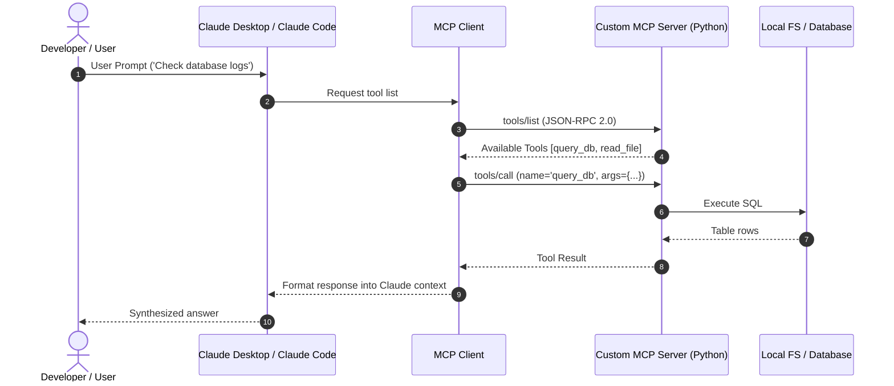

# 📹 Plugins in Claude Code + Claude Code Notes ｜ Final Video

<div className="video-card" style={{border: '1px solid #30363d', borderRadius: '8px', padding: '16px', marginBottom: '24px', background: 'rgba(56, 139, 253, 0.05)'}}>
  <div style={{display: 'flex', gap: '16px', flexWrap: 'wrap'}}>
    <div><strong>Instructor:</strong> Nitish Singh (CampusX)</div>
    <div><strong>Duration:</strong> 35m 8s</div>
    <div><strong>Playlist:</strong> Agentic Coding with Claude Code (CampusX)</div>
    <div><strong>Watch Link:</strong> <a href="https://www.youtube.com/watch?v=4lfcbeihdJk" target="_blank" rel="noopener noreferrer">YouTube Lecture ↗</a></div>
  </div>
</div>

## 📌 Executive Summary & Learning Objectives

This lecture covers **Plugins in Claude Code + Claude Code Notes ｜ Final Video**, focusing on production implementations, edge cases, and industry standards:
- Core intuition, architecture, and underlying mechanisms.
- Key differences between theoretical research implementations and scalable enterprise patterns.
- Concrete Python walkthroughs, error recovery, and performance optimization.

---

## 🏗️ Architecture & Conceptual Workflow



---

## 📖 Core Concepts & Technical Deep Dive

### 1. Architectural Foundations
In modern production AI engineering, **Plugins in Claude Code + Claude Code Notes ｜ Final Video** is essential for ensuring reliability, low latency, and deterministic outcomes. As AI systems evolve from naive prompt-in / completion-out scripts into distributed systems, engineers must handle:
- **State management & consistency:** Ensuring intermediate states and tool invocations are tracked.
- **Error boundaries & recovery:** Graceful degradation when external LLMs or vector stores encounter rate limits or network partitions.
- **Resource utilization & cost efficiency:** Caching common queries and reducing unnecessary foundation model token expenditure.

### 2. Operational Considerations
- **Latency Optimization:** Pre-computing embeddings, utilizing asynchronous non-blocking event loops, and streaming tokens via Server-Sent Events (SSE).
- **Security & Sandboxing:** Validating inputs before ingestion, sanitizing LLM outputs, and isolating tool execution environments.

---

## 💻 Production Implementation Walkthrough

```python
from mcp.server.fastmcp import FastMCP

# Initialize FastMCP Server
mcp = FastMCP("Production AI Tools Server")

@mcp.tool()
def calculate_token_cost(input_tokens: int, output_tokens: int, model: str = "gpt-4o") -> dict:
    """Calculate total API cost given token counts."""
    rates = {
        "gpt-4o": {"input": 2.50 / 1_000_000, "output": 10.00 / 1_000_000},
        "claude-3-5-sonnet": {"input": 3.00 / 1_000_000, "output": 15.00 / 1_000_000},
    }
    rate = rates.get(model, rates["gpt-4o"])
    cost = (input_tokens * rate["input"]) + (output_tokens * rate["output"])
    return {"model": model, "total_cost_usd": round(cost, 6)}

if __name__ == "__main__":
    # Runs stdio transport protocol for Claude Desktop & Claude Code
    mcp.run(transport="stdio")
```

---

## 💡 Production Best Practices & Tips

:::tip Production Deployment Guideline
When deploying Plugins in Claude Code + Claude Code Notes ｜ Final Video in enterprise environments, always configure automated retries with exponential backoff and telemetry tracing (such as OpenTelemetry or LangSmith).
:::

:::warning Common Failure Modes
Watch out for state contamination across concurrent requests. Ensure each session or user interaction uses an isolated thread ID or execution context.
:::

---

## 🎯 Key Takeaways & Quick Reference

| Dimension | Production Standard | Pitfall to Avoid |
| :--- | :--- | :--- |
| **Execution** | Async / Non-blocking with timeouts | Synchronous blocking calls in event loops |
| **Data Validation** | Strict Pydantic v2 schemas | Untyped dictionary access |
| **Monitoring** | Distributed tracing & latency percentiles | Relying only on standard console logs |

## ⏱️ Lecture Timeline & Key Topics

| Timestamp | Key Topic / Concept Discussed |
| :--- | :--- |
| **00:00:00** | हाय गाइस, माय नेम इज नितीश एंड यू वेलकम... |
| **00:08:22** | किया सच एज हुक्स का कांसेप्ट उसने पढ़ा तो... |
| **00:16:44** | मार्केट प्लेस डॉट json फाइल होना चाहिए।... |
| **00:26:03** | डिसाइड किया था कि हम अपनी वेबसाइट को... |
| **00:35:06** | बाय... |


---

---

## 📜 Complete Lecture Transcript (Hindi / Hinglish)

> **Language:** Hindi / Hinglish | **Source:** `15 - Plugins in Claude Code + Claude Code Notes ｜ Final Video ｜ CampusX.hi-orig.srt` | **Total Segments:** 18 | **Word Count:** ~6,232 words

<details>
<summary><b>Click to expand full chronological transcript (18 timestamped intervals)</b></summary>

#### ⏱️ [00:00 ➔ 00:02]

हाय गाइस, माय नेम इज नितीश एंड यू वेलकम टू माय YouTube चैनल। इस वीडियो में भी हम लोग अपना क्लॉट कोड प्लेलिस्ट कंटिन्यू करेंगे। और आज का वीडियो इस प्लेलिस्ट का लास्ट वीडियो होने वाला है। और आज की वीडियो का टॉपिक है प्लगिंस। सो अभी तक हमने इस प्लेलिस्ट में काफी चीजें कवर की हैं। और अब बस एक ही इंपॉर्टेंट टॉपिक बाकी है जो कि है प्लगिंस। बट अगर फ्यूचर में क्लॉट कोड में कोई नया फीचर या फिर कोई नया कांसेप्ट ऐड होता है तो वो भी मैं इस प्लेलिस्ट में ऐड करने की कोशिश करूंगा। बट एज ऑफ नाउ दिस इज गोइंग टू बी द लास्ट वीडियो। आज की वीडियो में अगेन मेरे दो मोटिव्स रहेंगे। फर्स्ट टू एक्सप्लेन प्लगिंस। प्लगइिंस क्या होते हैं? कैसे काम करते हैं? एंड सेकंड हमारा जो रनिंग प्रोजेक्ट है एक्सपेंस ट्रैकिंग वाला उसको आज हम कंप्लीट करके डिप्लॉय करेंगे। और डिप्लॉय करने के प्रोसेस में हम प्लगिंस को यूज़ करेंगे। सो काइंड ऑफ दोनों चीजें आज हम कंक्लूड कर देंगे इस वीडियो के अंदर। सो नाउ लेट्स स्टार्ट द वीडियो। अ वीडियो को स्टार्ट करने में सबसे पहले हमें ये समझना है कि प्लगइिंस होते क्या हैं और उससे भी ज्यादाेंट क्वेश्चन प्लगिंस की जरूरत क्यों पड़ी? तो पहले वो डिस्कस करते हैं। अब ये बात समझाने के लिए मैं आपको थोड़ा बड़ा एक्सप्लेनेशन दूंगा बट उस बड़े एक्सप्लेनेशन से आपको काफी डीपली ये समझ में आ जाएगा कि प्लगइिंस क्यों रिक्वायर्ड होते हैं। ठीक है? हम एक सिनेरियो लेंगे और उस सिनेरियो के बारे में बात करेंगे। सिनेरियो ये है कि हमारे पास एक बंदा है। अ देयर इज दिस गाय कॉल्ड राहुल एंड राहुल इज अ सीनियर डेटा साइंटिस्ट एट अ फिनटेक कंपनी। ठीक है? और वहां पे उसका जो काम है वो ये है कि ही बिल्ड्स क्रेडिट रिस्क मॉडल्स। क्रेडिट रिस्क मॉडल्स क्या होते हैं? ये बेसिकली ऐसे मशीन लर्निंग मॉडल्स होते हैं जो किसी भी कस्टमर का प्रोफाइल देख करके ये बता पाते हैं कि उस पर्टिकुलर कस्टमर को लोन देना चाहिए या नहीं देना चाहिए। ठीक है? तो यू कैन अंडरस्टैंड दीज़ आर लाइक रियली क्रिटिकल मॉडल्स बिकॉज़ अगर ये गलती करेंगे तो फिर आपकी कंपनी को काफी नुकसान हो सकता है। अगर एक अच्छे कस्टमर को आपने मना कर दिया लोन देने से आपका

#### ⏱️ [00:02 ➔ 00:04]

नुकसान है। अगर आपने एक ऐसे कस्टमर को लोन दे दिया जिसको नहीं देना चाहिए तो भी आपका नुकसान है। तो दीज़ आर लाइक रियली क्रिटिकल मॉडल्स और यहां पे आपको काफी दिमाग लगाना पड़ता है। तो राहुल एक्सजेक्टली यही काम करता है अपनी कंपनी में। और एक चीज और आपको बताना चाहूंगा राहुल के बारे में दैट राहुल इज अ एविड क्लॉट कोड यूजर। जब से क्लॉट कोड आया है मार्केट में राहुल उसको यूज करता है डे इन डे आउट अब इस लेवल पर यूज़ करता है कि उसने अपने पूरे वर्क फ्लो को क्लॉट कोड के हिसाब से ढा लिया है। अपने पूरे के पूरे वर्क फ्लो को वो एजेंटिक कोडिंग के थ्रू एग्जीक्यूट करता है। तो मैं एक बार आपको सबसे पहले दिखाना चाहूंगा समझाना चाहूंगा कि राहुल ने अपने वर्क फ्लो में कितना डीपली इंटीग्रेट किया है क्लॉट कोड को और कैसे? सबसे पहले राहुल ने स्किल्स के कांसेप्ट को इंप्लीमेंट किया है अपने वर्क फ्लो को एजेंटिक कोडिंग में ढालने के लिए। अ जैसे कि उसने दो स्किल्स बनाए हैं। एक स्किल है ईडीए स्किल और दूसरा स्किल है फीचर इंजीनियरिंग स्किल। अब आप लोगों में से जिन लोगों को भी पता होगा कि डेटा साइंस वर्क फ्लोस कैसे कैरी आउट किए जाते हैं उनको पता होगा कि ये दो बहुत इंपॉर्टेंट एस्पेक्ट्स होते हैं किसी भी डेटा साइंस वर्क फ्लो के। जब भी आपको एक डेटा सेट दिया जाता है, द फर्स्ट थिंग दैट यू डू इज यू परफॉर्म ईडीए एक्सप्लोरेटरी डेटा एनालिसिस। बिकॉज़ उससे आपको इनसाइट्स मिलते हैं अराउंड द डेटा। अब जनरली आप क्या करते हो कि ये इडीए खुद से मैनुअली कोड लिख के परफॉर्म करते हो। बट राहुल ऐसा नहीं करता। राहुल ने अपने पूरे के पूरे इडीए वर्क फ्लो को अह काइंड ऑफ़ डेलीगेट कर दिया है टू क्लॉट कोड। अब जो पूरा ईडीए करता है वो क्लॉट कोड करता है। बट द प्रॉब्लम इज कि अगर आप खुद यह काम करने जाओगे और आप बस क्लॉट कोड को बोलोगे कि यह मेरा डेटा सेट है इसके ऊपर आप ईडीए परफॉर्म कर दो तो वो आपको एक बहुत जेनेरिक सा ईडीए परफॉर्म करके देगा। बट राहुल को क्रेडिट रिस्क मॉडल के मॉडलिंग के हिसाब से ईडीए करवाना है। तो राहुल ने क्या किया? राहुल ने एक स्किल फाइल बनाई और उसमें एक डिटेल्ड इंस्ट्रक्शन डाला कि कैसे स्टेप बाय स्टेप मेरे हिसाब से ईडीए तुम परफॉर्म करोगे। ठीक है? अब पूरी चीज़ मैं आपको डिटेल में नहीं बता सकता। मैंने

#### ⏱️ [00:04 ➔ 00:06]

यहां पे लिख दिया है। आप वीडियो पॉज करके देख सकते हो। मैं आपको एक रफ ओवरव्यू देता हूं। जैसे कि सबसे पहले राहुल ने बोला कि जभी भी क्लॉट कोड को डेटा सेट मिलेगा तो क्लॉट कोड क्या करेगा? शेप निकालेगा डेटा सेट का। सारे फीचर्स का डी टाइप निकालेगा एज एन डेटा टाइप निकालेगा। ये पता करेगा कि हर फीचर में कितनी परसेंटेज ऑफ़ मिसिंग वैल्यूज़ हैं। और वो सब एक हीट मैप के थ्रू प्लॉट करके दिखाएगा। फिर अगर न्यूमेरिकल फीचर्स होंगे तो उनका डिस्ट्रीब्यूशन प्लॉट बना के देगा। स्क्यूनेस मेजर करेगा। अगर स्क्यूनेस 1.5 से ज्यादा है या -1.5 से कम है तो फिर फ्लैग कर देगा उन फीचर्स को कि उसके ऊपर हमें आगे काम करना पड़ सकता है। कैटेगोरिकल फीचर्स में जहां भी बहुत ज्यादा कैटेगरीज होंगी अ उनको भी फ्लैग कर देगा। टारगेट लीकेज मेजर करेगा। अगर कोई पर्टिकुलर फीचर ऐसा है जिसका बहुत ज्यादा कोरिलेशन है आपके टारगेट फीचर के साथ तो उसको भी हम फ्लैग कर देंगे। और इवेंचुअली हमें एक कंप्लीट समरी बना के देगा इस पूरे के पूरे एनालिसिस का। तो यहां पे आप देख सकते हो कि अगर आप खुद से बस रफली एक बार बोलोगे क्लॉट कोड को ईडीए जनरेट करने को या ईडीए करने को तो क्लॉट कोड कर तो देगा इडीए आपके लिए। बट आपको क्या चाहिए कि आपको अपनी इंडस्ट्री अपने प्रॉब्लम के हिसाब से इडीए करवाना है। और ये करवाने का तरीका क्या है कि आप एक प्रॉपर स्किल फाइल बनाओ और उसमें डिटेल्ड इंस्ट्रक्शन डालो कि आपको क्या-क्या करवाना है क्लॉट कोड से। और राहुल ने एग्जैक्टली यही किया विथ हज़ ईडीएस स्किल। सिमिलरली उसने जो फीचर इंजीनियरिंग स्किल बनाया। अब फीचर इंजीनियरिंग भी बहुत क्रिटिकल होता है। क्रेडिट रिस्क मॉडलिंग प्रॉब्लम्स में आपके जो नॉर्मल फीचर्स होते हैं इनकम हुआ या लोन अमाउंट हुआ। ये उतने ज्यादाेंट नहीं होते। बट अगर आप कुछ नए फीचर्स बनाते हो इन्हीं एकिस्टिंग फीचर्स से सच एज आपका इनकम टू लोन अमाउंट रेशो ये काइंड ऑफ़ एक ऐसा फीचर है जो आपने बनाया। तो दीज़ आर लाइक मोर मीनिंगफुल अ टारगेट को प्रेडिक्ट करने के लिए। तो राहुल ने क्या किया? सिंस उसने काफी सालों से फीचर इंजीनियरिंग कर रखी है इस तरह के

#### ⏱️ [00:06 ➔ 00:08]

प्रॉब्लम्स के ऊपर तो उसने एग्जैक्टली क्लॉट कोड को बताया कि देखो अगर तुमको कभी भी डेट टाइम फीचर्स मिलेंगे तो उसमें से तुम नए फीचर्स क्रिएट कर देना। सच एज लास्ट पेमेंट कब की थी या फिर अकाउंट ओपन हुए अब कितना दिन हो गया है। तो ये सब लाइक डेरिवेटिव फीचर्स हैं जो क्लॉट कोड बना के दे देगा। सेकंड आप कभी भी अ वन हॉट एनकोड मत करो। हाई कार्डिन वाले फीचर्स को ऐसे फीचर्स जहां पे बहुत सारी कैटेगरीज हैं। इंस्टेड यूज़ टारगेट एनकोडिंग विद फाइव फोल्ड क्रॉस वैलिडेशन। अब ये नॉलेज राहुल को कहां से आ रहा है? उसके पास ही डोमेन नॉलेज है। उसने इतना काम कर लिया अपनी इंडस्ट्री में कि उसको पता है कि एक्सैक्टली यही तरीके से फीचर इंजीनियरिंग होना चाहिए। एंड लास्टली जब फीचर्स बन जाए तो एक वीआईएफ चेक कर लेना और अगर किसी भी फीचर का वीआईएफ 10 से ज्यादा है तो उसको मल्टी कोलिनियरिटी के लिए फ्लैग कर देना और फाइनली फिर से मुझे एक रिपोर्ट बना के दे देना। तो अगेन यू कैन सी इवन इफ यू डोंट अंडरस्टैंड डेटा साइंस यू कैन एक्चुअली सी कि किस तरीके से राहुल ने अपने क्लॉट कोड को काइंड ऑफ़ कस्टमाइज कर दिया है। जेनेरिक्स से बहुत स्पेसिफिक बना दिया है अपनी नीड्स के हिसाब से। और उसके लिए उसने कौन सा कॉन्सेप्ट यूज़ किया? स्किल्स का कांसेप्ट यूज़ किया। तो, यह हो गया एक एस्पेक्ट कि कैसे राहुल ने क्लॉट कोड को पर्सनलाइज़ किया अपने लिए। उसके बाद राहुल ने एक दूसरा काम भी किया। राहुल ने एक कस्टम स्लैश कमांड बनाया और उस स्लैश कमांड का नाम था मॉडल इवल। और जब भी राहुल स्लश मॉडल इवाल टाइप करके एंटर मारता है तो ऑटोमेटिकली सीरीज ऑफ टास्क एग्जीक्यूट होने लगते हैं। जैसे कि सबसे पहले एक कन्फ्यूजन मैट्रिक्स प्रिंट हो जाता है। अ उसके कंपनी के थीम कलर के हिसाब से ऑटोमेटिकली एक क्लासिफिकेशन रिपोर्ट बन जाता है जिसमें प्रसीजन रिकॉल F1 सब कुछ दिखने लग जाता है। आरओसी कर्व प्लॉट हो जाता है। आपके फीचरेंस प्रिंट हो जाते हैं विथ द हेल्प ऑफ़ शार्प वैल्यूज़ और एक डिटेल्ड वन पेज समरी बन जाती है कि आपका मॉडल जो है उसने काम कैसा किया। तो अगेन ये सारा काम आप खुद से मैनुअली करने जाओगे

#### ⏱️ [00:08 ➔ 00:10]

तो इट वुड टेक अ लॉट ऑफ़ टाइम। बट राहुल ने इस पूरे सीरीज ऑफ़ काम को एक कस्टम स्लैश कमांड में डाल के एग्जीक्यूट करवा दिया। तो अगेन यू कैन सी वन मोर थिंग जिसकी हेल्प से राहुल इज़ यूजिंग एजेंटिक कोडिंग टू इंप्रूव हिज़ प्रोडक्टिविटी। उसके बाद राहुल रुका ने उसने और कांसेप्ट्स पर पढ़े क्लॉट कोड के और उसको भी उसने इंप्लीमेंट किया सच एज हुक्स का कांसेप्ट उसने पढ़ा तो ही सॉ कि व्हाट इफ आई कैन क्रिएट अ हुक जो हर बार कोड जनरेट करने के बाद ट्रिगर हो पोस्ट टूल यूज़ हुक हो और उसमें आप कई तरह के चेक लगा सकते हो और ये चेक नॉर्मल जेनेरिक चेकक्स नहीं है। ये डेटा साइंस स्पेसिफिक चेकक्स हैं। जैसे कि अगर कभी भी किसी कोड में डीएफ डॉट ड्रॉप एनए यूज़ किया गया है विदाउट प्रोवाइडिंग एनी काइंड ऑफ कॉलम नेम्स तो आप मना कर दोगे क्लॉट कोड को आप बोलोगे कि हमेशा कॉलम नेम्स प्रोवाइड करो विदाउट प्रोवाइडिंग द कॉलम नेम्स हो सकते हैं बहुत ज्यादा डेटा डिलीट हो जाए। सेकंड कभी भी आप किसी भी टाइप का स्केलर या एनकोडर पूरे के पूरे डेटा सेट पे नहीं लगाओगे। आप सिर्फ ट्रेन वाले एस्पेक्ट ट्रेन वाले डेटा सेट के ऊपर लगाओगे। टेस्ट वाले के ऊपर नहीं लगाओगे। नहीं तो डेटा लीकेज होता है। आप कभी भी इस तरह के पाथ्स प्रोवाइड नहीं करोगे। आप प्रोग्रामेटिक पाथ्स प्रोवाइड करोगे। अदरवाइज ये दूसरे के मशीन पे ये कोड काम नहीं करेगा। अ उसके बाद आप एक्यूरेसी जैसा मैट्रिक यूज़ नहीं करोगे। बिकॉज़ क्रेडिट रिस्क में मोस्टली आपके पास इमंबैलेंस डेटा रहता है। तो कभी भी इस तरह का कुछ भी पैटर्न कोड में दिखाई दे रहा है तो उसको फ्लैग कर दो और क्लॉट कोड को बताओ कि तुम ये गलती कर रहे हो। सो दैट वो अपनी गलती रेक्टिफाई कर पाए। तो अगेन उसने हुक्स का कांसेप्ट यूज किया टू प्रिवेंट सच बिहेवियर। एंड लास्टली ही आल्सो डिड वन मोर थिंग। उसने एमसीपी का कांसेप्ट पढ़ा। तो उसने क्या किया? अपने कंपनी के एक्सपेरिमेंट ट्रैकर से अपने क्लॉट कोड को कनेक्ट कर दिया। व्हिच बेसिकली मीन्स कि अब वो अपने ट्रेंड मॉडल्स को बहुत आसानी से लॉक कर सकता है अपनी कंपनी के एक्सपेरिमेंट ट्रैकर पे। नॉट ओनली दैट अगर उसको पास्ट में देखना है कि कौन सी टीम ने किस तरह के मॉडल्स बनाए हैं तो राइट फ्रॉम हिज क्लॉट कोड ही कैन एक्सेस दोज़ रिजल्ट्स

#### ⏱️ [00:10 ➔ 00:12]

एंड दोज़ मैट्रिक्स। उसके लिए उसको एक नया डैशबोर्ड ओपन करके जाके एनालाइज करने की जरूरत नहीं है। तो यू कैन सी मैं बस आपको ये समझाना चाह रहा हूं कि कैसे एक सीनियर डेटा साइंटिस्ट अपने पूरे वर्क फ्लो को ट्रांसफॉर्म कर पा रहा है विथ द हेल्प ऑफ क्लॉड कोड। ये पूरा का पूरा पर्सनलाइजेशन राहुल ने पिछले छ महीनों में अपने लिए बना लिया। अब उसकी प्रोडक्टिविटी काइंड ऑफ 2x हो गई इस पूरी चीज को करने के बाद। बट द प्रॉब्लम इज जिसकी वजह से प्लगइिंस की जरूरत है वो यह है कि राहुल ने तो अपना पूरा का पूरा वर्क फ्लो ट्रांसफॉर्म कर लिया। बट व्हाट अबाउट अदर पीपल इन ह टीम। कल को नए लोगों ने जॉइ किया जूनियर डेटा साइंटिस्ट ने। दे वर फ्रेशर्स और उनको उतना नॉलेज नहीं है, उतना डोमेन नॉलेज नहीं है जितना राहुल के पास है। तो आइडियली अ गुड सिचुएशन विल बी कि हम सभी को जो भी नए जूनियर डेटा साइंटिस्ट आ रहे हैं उन सभी को एग्जजेक्टली ये एजेंटिक कोडिंग वर्क फ्लो प्रोवाइड कर दे एज इट इज़। तो फिर क्या होगा कि जो टूल्स और जो फीचर्स प्लॉट कोड के राहुल यूज़ कर रहा है, जिस तरीके से राहुल यूज़ कर रहा है, एज इट इज़ उसको जूनियर डेटा साइंटिस्ट भी यूज़ कर पाएं। यह अपना आइडियल सिचुएशन है। बट द प्रॉब्लम इज दिस कि इस सिचुएशन पे पहुंचने के लिए राहुल को क्या करना पड़ेगा? बहुत मैनुअली जाकर के हर जूनियर डेटा साइंटिस्ट को ये बताना पड़ेगा कि देखो यार तुम ये स्किल फाइल्स हैं। इसको उठाओ अपने डॉट क्लॉट फोल्डर में डालो स्किल्स फोल्डर के अंदर। अ ये मेरा हुक फाइल है। इसको एज इट इज कॉपी करो और अपना सेटिंग्स डॉट json में डालो। फिर तुम ये मेरी कस्टम वाली कस्टम कमांड वाली फाइल है। इसको कॉपी करो और इसको डालो तुम अपने डॉट लॉट फोल्डर में। फिर उसने अपना एमसीpson फाइल का कंटेंट कॉपी करके दिया और बोला कि इसको तुम अपने प्रोजेक्ट फोल्डर में डालो। नाउ द प्रॉब्लम इज़ दिस कि ये सब कुछ बहुत ही मैनुअल है। और यहां पे गलती होने के बहुत चांसेस हैं। ऐसा हो सकता है कि जो जूनियर डेटा साइंटिस्ट है वो राहुल के सारे इंस्ट्रक्शंस फॉलो ना कर पाए। स्किल्स भले

#### ⏱️ [00:12 ➔ 00:14]

ही वो कॉपी कर ले बट कस्टम स्लैश कमांड बनाने में उसको प्रॉब्लम हो जाए या फिर हुक्स उसके प्रॉपर्ली काम ना करें। तो एग्जैक्ट रेप्लिका बना पाना राहुल के वर्क फ्ल्लो का थोड़ा मुश्किल है अगर आप इस तरीके से स्टैगर्ड तरीके से काम करो। द बेटर अप्रोच वुड बी कि हम इस पूरे के पूरे वर्क फ्लो को पैकेज कर दें एक सिंगल एंटिटी में और उस सिंगल एंटिटी को ही हम पास ऑन करें टू ऑल द जूनियर डेटा साइंटिस्ट। तो इसी पैकेज को इसी एंटिटी को हम प्लग इन बुलाते हैं। प्लगइन इन क्लॉट कोड इज नथिंग बट अ फोल्डर वेयर यू पुट एवरीथिंग दैट यू हैव क्रिएटेड जैसा कि राहुल ने क्रिएट किया है। अपने सारे स्किल्स, सारे एमसीपी टूल्स, सारे हुक्स, सारे कस्टम स्लैश कमांड्स इन सबको आप एक फोल्डर के अंदर पैकेज करते हो और वो पैकेज आप किसी और को देते हो। और जैसे ही वो सामने वाला बंदा उस पैकेज को अपने मशीन पर इंस्टॉल करता है एग्जैक्ट रेप्लिका क्रिएट हो जाता है और आप सेम टू सेम वही वर्क फ्लो एंजॉय कर सकते हो। दिस इज व्हाट प्लगइिंस आर। सो आई नो मैंने आपको काफी लंबा एक कहानी सुना करके समझाने की कोशिश की प्लगिंस क्या है? बट मैं आपको समझाना चाहता था कि अ कितनी बड़ी प्रॉब्लम को सॉल्व करता है प्लगिंस। ठीक है? तो प्लगइिंस आर नथिंग बट पैकेजेस जिसके अंदर आप अपने बनाए हुए स्किल्स, अ कस्टम स्लैश कमांड्स, हुक्स, एमसीपी टूल्स को पैकेज कर सकते हो और उसको डिस्ट्रीब्यूट कर सकते हो किसी को भी। दैट इज द मेन आईडिया बिहाइंड प्लगइिंस। सो दिस इज़ हाउ यू क्रिएट अ प्लगइन। आप क्या करते हो कि आप एक फोल्डर बना लेते हो। दिस इज़ द फोल्डर। और उस फोल्डर के अंदर आप सब फोल्डर्स क्रिएट करते हो। जैसे स्किल्स का एक फोल्डर होगा जिसके अंदर आप अपनी सारी स्किल फाइल्स डालोगे। अ हुक्स का एक फोल्डर होगा जिसमें अगर आपकी हुक्स की कोई फाइल्स हैं तो वो आप यहां पर डालोगे। अ आपके कस्टम स्लैश कमांड्स के लिए एक अलग फोल्डर है और आपके एमसीपी डॉट json फाइल में आपके एमसीपी टूल्स का कॉन्फ़िगरेशन रिलेटेड इनफो रहेगा।

#### ⏱️ [00:14 ➔ 00:16]

यहां पे एक इंपॉर्टेंट चीज आपको याद रखनी है कि आपको इस फोल्डर के अंदर एक और फोल्डर बनाना होता है बाय द नेम ऑफ़ डॉट क्लॉड प्लगइन। और यहां पे आपको एक फाइल क्रिएट करनी होती है जिसका नाम होता है प्लगइन .jjson। ये फाइल काइंड ऑफ एक मैनिफेस्ट फाइल है। इसके बिना आप प्लगइन क्रिएट नहीं कर पाओगे। और ये मैनिफेस्ट फाइल में आपकी फाइल से आपके प्लगइन से रिलेटेड इनेशन रहता है। जैसे यहां पे देखो लिखा हुआ है आपके प्लगइन का नाम क्या है? उसका वर्जन क्या है? उसका एक शॉर्ट डिस्क्रिप्शन ऑथर का इनेशन रेपोज़िटरी क्या है? और आप उसको कौन से लाइसेंस पे दे रहे हो? ये काइंड ऑफ़ इनेशन आपको देना होता है अपने प्लगइन डॉट json में। फिर से मैं एक बार बोलना चाहूंगा प्लगइन डॉट json अगर आपके फोल्डर के अंदर नहीं है तो इट विल नॉट बी कंसीडर्ड एज अ वैलिड प्लगइन। ठीक है? तो प्लीज मेक श्योर व्हनेवर यू आर क्रिएटिंग अ प्लगइन यू हैव टू ऐड दिस फाइल। ठीक है? तो ये तो हो गई बात कि आप अपने प्लगइिंस कैसे क्रिएट कर सकते हो। एक बार ये भी डिस्कस कर लेते हैं कि आप किसी दूसरे बंदे के प्लगइिंस को कैसे अपने क्लॉट कोड में इंस्टॉल कर सकते हो। और ये करने का तरीका होता है मार्केट प्लेसेस। ठीक है? तो एक बार हम लोग डिस्कस करते हैं कि व्हाट आर मार्केट प्लेसेस और मार्केट प्लेसेस और प्लगइंस के बीच क्या रिलेशनशिप है। अब मार्केट प्लेस का कांसेप्ट समझना बहुत आसान है। मार्केट प्लेस इज़ बेसिकली अ प्लेस वेयर यू स्टोर मल्टीपल प्लगिंस। ठीक है? आपकी एक टीम है और आप प्लगिंस बना रहे हो। आपने एक प्लगइन बनाया अपने डेटा साइंस वर्क फ्ल्लोस के लिए। आपने एक प्लगइन बनाया अपने सॉफ्टवेयर डेवलपमेंट वर्क फ्लोस के लिए। आप उन सबको एक जगह पे स्टोर करना चाहते हो। सो दैट आपकी टीम का कोई भी बंदा उसको एक्सेस कर पाए। तो ये जो जगह है जहां पे आप मल्टीपल प्लगइिंस को स्टोर कर रहे हो इसी को हम मार्केट प्लेस बोलते हैं। इसको आप बहुत आसानी से एक एनालॉजी के थ्रू समझ सकते हो। द एनालॉजी इज एप स्टोर एंड एप्स। आप फोन पे एप्स इंस्टॉल करते हो। एप्स को इंस्टॉल करने के लिए आपको कहां पे जाना पड़ता है? एप स्टोर पे। तो यहां पे जो एप स्टोर है ये आपका हो गया मार्केट प्लेस। और जो ऐप है इंडिविजुअल एप

#### ⏱️ [00:16 ➔ 00:18]

वो हो गया आपका प्लगइंस। ठीक है? अ और आपके मल्टीपल एप स्टोर्स एक्सिस्ट करते हैं। Google का अपना एप स्टोर है, Apple का अपना एप स्टोर है, Xiaomi का अपना एप स्टोर है, Samsung का अपना एप स्टोर है। तो सिमिलरली मल्टीपल मार्केट प्लेसेस एक्सज़िस्ट करते हैं। और आपको क्या करना पड़ता है? आपको पहले मार्केट प्लेस को इंस्टॉल करना पड़ता है क्लॉट कोड में और फिर आप उस मार्केट प्लेस के अंदर घुस के उसका कोई भी प्लगइन इंस्टॉल कर सकते हो। तो दिस इज़ द फ्लो। ठीक है? अगर आप थोड़ा और टेक्निकल लेवल पे समझना चाहते हो कि मार्केट प्लेसेस एग्जैक्टली क्या होते हैं? तो देखो यहां पे लिखा हुआ है अ मार्केट प्लेस इज़ जस्ट अ गेट हब रेपोज़िटरी दैट कंटेन अ मार्केट प्लेस डॉट json फाइल। तो जैसे प्लगइन के अंदर प्लगइन डॉट json फाइल होता है उसी तरीके से मार्केट प्लेस एक गेट रेपो है और उस रेपो के अंदर मार्केट प्लेस डॉट json फाइल होना चाहिए। ठीक है? और उसके अंदर क्या कंटेंट होता है वो भी देख लो। मार्केट प्लेस डॉट json फाइल के अंदर मार्केट प्लेस का नाम होना चाहिए। ओनर का इनेशन होना चाहिए। और फिर आप बताते हो कि इस मार्केट प्लेस के अंदर कौन-कौन से प्लगइिंस हैं। तो ये पहला प्लगइन है। ये दूसरा प्लगइन है। इस तरीके से आप प्लगइिंस को स्टोर करते हो। मैं आपको एग्जांपल दिखाता हूं। अ ये जो अभी आपको दिखाई दे रहा है ये ghub रेपो ये एक्चुअली क्लड कोड का ऑफिशियल मार्केट प्लेस है। ठीक है? यहां पर अगर आप देखो डॉट क्लॉड प्लगइन फोल्डर के अंदर अगर आप जाओ तो आपको दिखाई देगा मार्केट प्लेस डॉट json। मार्केट प्लेस डॉट json के अंदर आपको एग्जैक्टली वही सारी चीजें दिखाई देंगी जो मैंने अभी बोली ओनर और फिर ये देखो ये सारे प्लगइंस हैं। दीज़ आर ऑल प्लगइंस और फिर हर प्लगइन का इनेशन दिया हुआ है। दिस इज़ व्हाट मार्केट प्लेस इज़ ऑन अ टेक्निकल लेवल। अब दो तरह के मार्केट प्लेसेस एक्सज़िस्ट करते हैं। फर्स्ट इज़ ऑफिशियल मार्केट प्लेस जो कि अभी मैंने आपको दिखाया क्लॉट का ऑफिशियल मार्केट प्लेस है। यह प्रीइस्टॉल्ड आता है क्लॉट कोड में। आपको इंस्टॉल करने की जरूरत नहीं है। और फिर होते हैं थर्ड पार्टी मार्केट प्लेसेस। अ यह अलग-अलग कंपनीज़ अपने लिए खुद से बनाती है। आप भी बना सकते हो, राहुल भी बना सकता है। और इसको बेसिकली आप एक गेट रेपो की तरह क्रिएट करोगे और अंदर एक मार्केट प्लेस डॉ. json फाइल डालोगे और

#### ⏱️ [00:18 ➔ 00:20]

इन मार्केट प्लेसेस को आपको इंस्टॉल करना पड़ेगा। अगर आप किसी थर्ड पार्टी मार्केट प्लेस का प्लगइन यूज़ करना चाहते हो तो पहले आपको थर्ड पार्टी मार्केट प्लेस इंस्टॉल करना पड़ेगा क्लॉट कोड में और फिर आप उसका कोई प्लगइन इंस्टॉल कर पाओगे अपने मशीन के ऊपर। मैं दोनों वर्क फ्ल्लोस आपको दिखाता हूं जब हम प्रैक्टिकली प्लगइिंस को देखेंगे। प्रैक्टिकली प्लगइिंस को देखने के पहले एक छोटा सा मिस्टेक मैं रेक्टिफाई करना चाहूंगा। मेरे पूरे एक्सप्लेनेशन में मैंने एक बहुत इंपॉर्टेंट चीज को कंप्लीटली मिस कर दिया। आई डोंट नो हाउ। मैंने आपको बताया कि प्लगइंस इज अ प्लेस जहां पे आप अपने बनाए हुए स्किल्स और कस्टम स्लैश कमांड्स और हुक्स को एक जगह पे स्टोर करते हो। सो दैट आप उसको डिस्ट्रीब्यूट कर पाओ। अपने टीममेट्स या फिर किसी और के साथ। यहां पर मैं आई डोंट नो हाउ एजेंट्स को ऐड करना कंप्लीटली भूल गया। सो हमने इस प्लेलिस्ट में सब एजेंट्स का कांसेप्ट पढ़ा है और हमने ये देखा है कि कितनाेंट होता है सब एजेंट्स का कांसेप्ट। अगर आप चाहो तो आप अपने बनाए हुए सब एजेंट्स को भी डिस्ट्रीब्यूट कर सकते हो और तरीका बिल्कुल सेम है। आप अपने इस प्लगइन फोल्डर के अंदर एजेंट होल करके एक फोल्डर बनाते हो और उसके अंदर आप अपने सारे एजेंट्स का जो फाइल है उसको स्टोर कर देते हो। तो प्लगइन कैन आल्सो बी यूज्ड टू डिस्ट्रीब्यूट सब एजेंट्स। ये मैं यहां पे मेंशन करना बिल्कुल ही भूल गया। इट डज नॉट मीन कि आप सब एजेंट्स को नहीं दे सकते दूसरों को। वो भी बिल्कुल वैसे ही डिस्ट्रीब्यूट होते हैं जैसे स्किल्स डिस्ट्रीब्यूट होते हैं। तो रियली सॉरी अबाउट दैट। आई रियली होप आप कंफ्यूज नहीं हुए होगे। तो लेट मी शो यू हाउ डू यू इंस्टॉल प्लगिंस। सो आपको क्या करना होता है? क्लॉट कोड स्टार्ट करने के बाद स्लैश प्लगइन कमांड पे जाना होता है। ठीक है? वंस यू हिट एंटर आपको एक मेन्यू मिलता है। पहला है डिस्कवर टैब फिर इंस्टॉल्ड फिर मार्केट प्लेसेस। ठीक है? तो आपको क्या करना पड़ेगा कि अगर आप कोई थर्ड पार्टी मार्केट प्लेस इंस्टॉल करना चाहते हो बिकॉज़ आपका प्लगइन वहीं पर है तो आपको पहले मार्केट प्लेस को इंस्टॉल करना पड़ेगा। यहां पर अगर आप देखो तो आपके पास

#### ⏱️ [00:20 ➔ 00:22]

ऑलरेडी एक मार्केट प्लेस इंस्टॉल्ड है जो कि आपका ऑफ़िशियल एंथ्रोपिक वाला अह मार्केट प्लेस है। क्लॉड प्लगइंस ऑफिशियल और इसमें अगर आप देखो तो 172 प्लगिंस अवेलेबल है और वही आपको यहां पे दिखाए जा रहे हैं डिस्कवर वाले टैब में। तो यू कैन सी दीज़ आर लाइक ऑल प्लगइिंस जो ऑफिशियल प्लगिंस हैं। ठीक है? बहुत फेमस-फेमस प्लगइंस आपको यहां पे दिखाई देंगे। सुपर बेस इज़ देयर। सिमिलरली वर्सल का आपको प्लगइन दिखाई देगा। अ figma का प्लगइन दिखाई देगा। दीज़ आर लाइक ऑफिशियल प्लगइिंस। ठीक है? जो रेपुटेड सॉफ्टवेयर कंपनीज़ के थ्रू आते हैं। बट यू कैन आल्सो इंस्टॉल थर्ड पार्टी मार्केट प्लेसेस। कैसे करना है? बहुत सिंपल है। यहां पे ऑप्शन आ रहा है ऐड मार्केट प्लेसेस। हिट एंटर। अब यहां पे बस आपको उस गेट रेपो का एड्रेस देना है जो मार्केट प्लेस आपको इंस्टॉल करना है। मैं आपको एक एग्जांपल दिखाता हूं। सो ये एक मार्केट प्लेस है। क्लॉड प्लग इन मार्केट प्लेस बाय दिस कंपनी। ठीक है? आपको क्या करना है? सिंपली इस मार्केट प्लेस को अगर इंस्टॉल करना है तो यह यूआरएल कॉपी करना है और यहां पे इस जगह पर पेस्ट कर देना है। एंड यू हैव टू हिट एंटर। और अब आप देखोगे कि आपके पास दो मार्केट प्लेसेस इंस्टॉल्ड हैं। फर्स्ट वाले में 172 प्लगिंस हैं। सेकंड वाले में 12 प्लगइंस हैं। और अगर अब आप डिस्कवर में जाओगे तो आपको दिखाई देगा कि देयर आर 184 प्लगइंस नाउ। नाउ यू कैन गो एंड सेलेक्ट द प्लगइन दैट यू नीड टू इंस्टॉल। ठीक है? तो आई होप आपको समझ में आ रहा है प्लगिंस और मार्केट प्लेसेस कैसे काम करते हैं। अब मैं आपको बताता हूं कि हमारे वर्क फ्लो में हम प्लगइिंस कैसे यूज़ करेंगे। हम वर्सल का प्लगइन यूज़ करेंगे और वर्सल का प्लगइन यूज़ करके हम अपने प्रोजेक्ट को वर्सल पे डिप्लॉय करेंगे। आई गेस आपको वर्सल के बारे में पता है। वर्सल इज़ अ प्लेटफार्म जहां पे यू कैन डिप्लॉय योर प्रोजेक्ट्स। सो वी आर गोइंग टू डू दैट। और उसके लिए हमें कोई नया मार्केट प्लेस इंस्टॉल करने की जरूरत नहीं है। बिकॉज़ इट कम्स अंडर द ऑफिशियल एंथ्रोपिक मार्केट प्लेस। पूरा फ्लो ऐसा रहेगा कि हमारा जो प्रोजेक्ट है वो फिलहाल इस स्टेट में है

#### ⏱️ [00:22 ➔ 00:24]

कि ऑलमोस्ट सारे फीचर्स कंप्लीट हो गए हैं। बस एक लास्ट फीचर बचा हुआ है जो कि है डिलीट एक्सपेंस का। तो मैं क्या करूंगा? मैं जल्दी से यह डिलीट एक्सपेंस वाला फीचर बिल्ड करूंगा और उसके बाद हम वर्सल का प्लगइन इंस्टॉल करेंगे और उसके बाद हम वर्सल पे इस प्रोजेक्ट को डिप्लॉय कर देंगे। ठीक है? तो ये फ्लो हम लोग यूज़ करने वाले हैं इस वीडियो में। तो हम लोग अपना पूरा फ्लो ट्रिगर करते हैं। इफ यू रिमेंबर सबसे पहले हमें अपना स्पेक डॉक्यूमेंट बनाना है। फॉर दैट वी विल राइट क्रिएट स्पेक। दिस विल बी स्टेप नंबर नाइन। सो वी विल राइट 09 डिलीट एक्सपेंस आई विल हिट एंटर। सो फिर से पूरा फ्लो एज़ इट इज़ ट्रिगर हो जाएगा। नया ब्रांच बन जाएगा और वहां पे स्पेक डॉक्यूमेंट क्रिएट होने लग जाएगा। सो दिस इज़ द डॉक्यूमेंट। आई विल हिट यस। सो ये रहा वो डॉक्यूमेंट। इसको मैंने देख लिया है। दिस इज़ प्रॉपर सही काम करेगा। अब एक काम करते हैं। प्लान मोड में जाते हैं एंड प्लान जनरेट करते हैं। सो आई वुड ट्राई रीड दिस फाइल एंड कम अप विद एन इंप्लीमेंटेशन प्लान। सो हमारा प्लान बन गया है। अब हम इस प्लान को इंप्लीमेंट करेंगे। सो आई विल हिट यस। सो गाइज़ ये पूरा इंप्लीमेंटेशन कंप्लीट हो गया है। एक बार इसको टेस्ट करते हैं। सो ये हमारा डैशबोर्ड है।

#### ⏱️ [00:24 ➔ 00:26]

एंड नाउ यू कैन सी अगेंस्ट ईच ट्रांजैक्शन वी आर गेटिंग दिस डिलीट बटन। एक बार इसको ट्राई आउट करते हैं इस पर्टिकुलर ट्रांजैक्शन के अगेंस्ट। सो कंफर्म करने बोल रहा है। आई विल से ओके और डिलीट हो गया। इस लास्ट वाले को देखते हैं और बाकी [नाक से की जाने वाली आवाज़] चीजें भी चेक कर लेते हैं। दिस नंबर इज़ 6 768 लेट्स रिमूव दिस वन। ठीक है? ठीक है गाइज़? तो दिस मींस दैट दिस फंक्शनैलिटी इज़ वर्किंग। ठीक है? सो नाउ द नेक्स्ट थिंग दैट यू हैव टू डू इज़ यू हैव टू टेस्ट द फीचर एंड यू हैव टू डू अ कोड रिव्यू बट वो सब हम नहीं कर रहे हैं अगेन बिकॉज़ टाइम लगता है। इंस्टेड वी आर डायरेक्टली गोइंग टू शिप दिस फीचर यूजिंग द शिप फीचर कमांड जो हमने लास्ट वीडियो में बनाया था। सो आई विल हिट एंटर। यू कैन सी यहां पर एक पुल रिक्वेस्ट बन गया है। डिलीट एक्सपेंस एक नया ब्रांच है। दिस इज़ द पुल रिक्वेस्ट। मर्ज भी हो गया है। सो यू कैन सी मर्ज हो गया है। अगर आप पुल रिक्वेस्ट में जाओ तो नाउ यू कैन नॉट सी एनी ओपन पुल रिक्वेस्ट। सो या दिस इज़ डन। एक बार लेट मी क्विकली चेक हम कौन से ब्रांच में हैं। हां, वी आर इन द मेन ब्रांच। ठीक है? सो हमने अपना फीचर डेवलप कर लिया। विथ दैट आवर वेबसाइट इज़ कंप्लीट। इसमें जो भी फीचर्स हमें ऐड करने थे, लॉग इन रजिस्ट्रेशन, प्रोफाइल, अह ऐड ट्रांजैक्शन, डिलीट ट्रांजैक्शन, एडिट ट्रांजैक्शन, फ़िल्टरिंग, एवरीथिंग इज़ कंप्लीट। एंड नाउ वी कैन डिप्लॉय दिस वेबसाइट। ठीक है? तो प्लगइंस की हेल्प से हम ये पूरा काम करते हैं। नेक्स्ट। सो नाउ

#### ⏱️ [00:26 ➔ 00:28]

गाइस देयर इज़ अ स्मॉल प्रॉब्लम। मैंने डिसाइड किया था कि हम अपनी वेबसाइट को वर्सल पे होस्ट करेंगे। बट वर्सल इज़ मोर सूटेबल फॉर Nex जेएस टाइप फ्रंट एंड फ्रेमवक्स। अगर आपकी वेबसाइट किसी फ्रंट एंड फ्रेमवर्क में बनी है जैसे कि nexs तो उनके लिए यह ज्यादा सूटेबल है। हमारी वेबसाइट फ्लास्क में बनी हुई है और ऐसा बोला जाता है कि फ्लास्क एप्लीकेशनेशंस के लिए इट्स नॉट दैट ग्रेट। मोस्टली बिकॉज़ फ्लास्क एप्लीकेशनेशंस को वर्सल क्या करता है कि सर्वरलेस फंक्शनंस की तरह एग्जीक्यूट करता है। सो जभी भी कोई रिक्वेस्ट जाएगी तो एक सर्वरस फंक्शन ट्रिगर होगा। अह रिक्वेस्ट कंप्लीट करेगा और फिर बंद हो जाएगा। फिर अगले रिक्वेस्ट के लिए फिर से एक नया सर्वरलेस फंक्शन ट्रिगर होगा। तो एसेंशियली आप सही तरीके से वेबसाइट की फंक्शनैलिटी नहीं चला पाओगे वर्सल में। तो अब हमारे पास जो अल्टरनेटिव है वो है रेलवे। अ रेलवे इज़ गुड फॉर फ्लास्क डिप्लॉयमेंट्स। तो हम क्या करेंगे? हम रेलवे यूज़ करेंगे। रेलवे इज़ अगेन अ प्लेटफार्म जहां पे आप अपनी वेबसाइट्स को डिप्लॉय कर सकते हो। और अच्छी बात क्या है कि रेलवे का खुद का एक क्लॉट कोड प्लगइन भी है। तो हम रेलवे की हेल्प से अपनी वेबसाइट को डिप्लॉय करेंगे। ठीक है? कैसे? मैंने स्टेप्स लिख रखे हैं। सो, दीज़ आर द स्टेप्स। सबसे पहले आपको क्या करना है? रेलवे के ऊपर एक अकाउंट बनाना है। मैंने ऑलरेडी एक अकाउंट बना रखा है। तो, मैं साइन इन कर लूंगा। जनरली इट्स रिकमेंडेड कि आप अपने GitHub अकाउंट से साइन साइन इन करो। बिकॉज़ वहीं पर आपका प्रोजेक्ट रहता है। तो ये हमने साइन इन कर लिया, अकाउंट बना लिया। नेक्स्ट यू हैव टू इंस्टॉल रेलवे। उसके लिए यू हैव टू ओपन योर कमांड प्र्ट एंड यू हैव टू पेस्ट दिस कमांड। ठीक है? इंस्टॉल हो गया। उसके बाद यू हैव टू डू रेलवे लॉग इन। इट इज़ आस्किंग कि आपको ब्राउज़र ओपन करना है। आई वुड से यस। आई विल ऑथराइज

#### ⏱️ [00:28 ➔ 00:30]

ऑथेंटिकेशन सक्सेसफुल। एक बार हम लोग क्विकली चेक करेंगे कि हमने सही से लॉग इन किया है कि नहीं बाय पेस्टिंग दिस कमांड। तो देखो यहां पे लिखा आ रहा है लॉग्ड इन अस campus x दिस ईमेल आईडी। तो दिस इज़ फाइन। अब आपको क्या करना है? आपको रेलवे का प्लगइन इंस्टॉल करना है। पहले मार्केट प्लेस इंस्टॉल करना है, फिर प्लगइन इंस्टॉल करना है। उसके लिए व्हाट यू हैव टू डू इज़ यू हैव टू सिंपली पेस्ट दिस कमांड। सो ये रहा कमांड। ये हमने एंटर मारा। एंड यू कैन सी मार्केट प्लेस इंस्टॉल हो गया। यू कैन गो टू मार्केट प्लेसेस एंड यू विल सी दिस इज़ द मार्केट प्लेस। नेक्स्ट वी विल इंस्टॉल द प्लगइन। अब डायरेक्टली आप ब्राउज़ करके भी इंस्टॉल कर सकते हो या फिर आप यह कमांड भी रन कर सकते हो। सो आई एम सिंपली रनिंग दिस कमांड। यहां पे अब आपसे पूछा जा रहा है कि आप यूजर स्कोप में रखना चाहते हो या प्रोजेक्ट स्कोप में रखना चाहते हो। सो आई विल सेलेक्ट द थर्ड ऑप्शन इंस्टॉल फॉर यू इन दिस रेपो ओनली। इंस्टॉल हो गया। नाउ द टास्क इज वेरी सिंपल। मुझे सिंपली यह प्र्प्ट देना है। डिप्लॉय दिस फ्लास्क एप्लीकेशन टू रेलवे एंड गिव मी अ पब्लिक यूआरएल। सो आई हैव टू सिंपली पेस्ट दिस एंड आई हैव टू हिट एंटर। अब सारा का सारा काम ये प्लगइन देख लेगा। ठीक है? आई विल से यस। यस। ठीक है? इट सेज़ ऑथेंटिकेटेड ऐज़ camps X नो लिंक प्रोजेक्ट। आई नीड टू मेक अ स्मॉल एडिशन ऐड जी यूनिकॉर्न टू रिक्वायरमेंट्स तो वो एक रिक्वायरमेंट्स बना रहा है। एक प्रॉप फाइल बना रहा है। जो भी डिप्लॉयमेंट के स्टेप्स हैं अगर आपने पहले कभी किया होगा तो आपको समझ में आ रहा होगा। सो उसने एक सेट ऑफ टास्क लिख लिए हैं। वो टास्क स्टेप बाय स्टेप एग्जीक्यूट होते जा

#### ⏱️ [00:30 ➔ 00:32]

रहे हैं। आई हैव टू जस्ट प्रेस यस। एंड यू कैन सी गाइस हमारा ऐप डिप्लॉय हो गया है। एक बार इसको चला के देखते हैं। सो यू कैन सी दिस इज आवर डिप्लॉयड एप्लीकेशन। एक काम करते हैं। एक नया अकाउंट यहां पे क्रिएट करते हैं। सो लेट्स से नितेश सिंह। दिस इज़ द ईमेल आईडी। दिस इज़ द पासवर्ड। ठीक है? यह बन गया हमारा अकाउंट। साइन इन एंड यू कैन सी यह है हमारा डैशबोर्ड। यहां पर हम एक एक्सपेंस ऐड करते हैं। ₹1000 सेलेक्ट अ कैटेगरी फूड आज का डेट अ Zomato सेव एक्सपेंस एक्सपेंस एडेड यहां पर दिखाई दे रहा है। यहां से वी कैन एडिट इट। टू लेट्स से 500 ठीक है एक्सपेंस अपडेटेड यहां से इफ वी कैन वी कैन डिलीट इट ठीक है यहां से एनालिटिक्स वाला पेज दिख रहा है कमिंग सून और ये रहा हमारा डैशबोर्ड। ठीक है? व्हिच मींस जो फंक्शनैलिटी हमारे लोकल मशीन पे थी बिल्कुल वही फंक्शनैलिटी हमारे सर्वर पे भी है। सो दिस डिप्लॉयमेंट इज़ वर्किंग फाइन। अब यहां पे एक चीज आपको देखनी है। यहां पे लिखा भी हुआ है थिंग्स यू शुड नो सीक्वलाइस एफएफआरएल व्हिच बेसिकली मींस कि जितनी बार आप रीडप्लॉय करोगे आपका डेटाबेस भी उड़ जाता है। बिकॉज़ इट्स अ सीक्वलाइट डेटाबेस। अगर आप पोस्ट क्रे या माय सीक्वल यूज़ करोगे तो ये प्रॉब्लम नहीं होगी। ये आपको पता होना चाहिए। ठीक है? सो या गाइस, दिस इज़ अ क्लियर कट डेमो ऑफ़ हाउ यूज़फुल प्लगिंस कैन बी। यह पूरा काम अगर आप खुद

#### ⏱️ [00:32 ➔ 00:34]

से करने जाते तो अकाउंट बनाने से ले कंप्लीटली डिप्लॉय करने तक आपको काफी मेहनत करनी पड़ती और यह इजीली आपका आधा घंटा ले लेता बिकॉज़ इट्स अ न्यू प्लेटफार्म एंड ऑल। बट यू कैन सी एक प्लगइन को हमने इंस्टॉल किया और सिर्फ एक प्र्पों्ट दिया और बिहाइंड द सीन्स सारा का सारा काम प्लगइन ने खुद हैंडल कर लिया। तो ये बहुत बढ़िया एक एब्स्ट्रैक्शन आ गया है डेप्लॉयमेंट के पॉइंट ऑफ व्यू से। सो या गाइस यही सेम चीज मुझे आपको दिखानी थी इस वीडियो में। आई होप आपको समझ में आ गया प्लगइिंस क्या होते हैं? क्यों रिक्वायर्ड होते हैं? कैसे काम करते हैं? मार्केट बेसिस का क्या कांसेप्ट है? आई वुड रिकमेंड एक बार जाके आप YouTube पे या Google पे सर्च करो। व्हाट आर सम गुड प्लगइिंस दैट यू कैन यूज़। अ सो मैं आपको एक दो प्लगइिंस के बारे में बता सकता हूं। आपको क्या करना है? आपको प्लगइन पे जाना है। यहां डिस्कवर में आपको दिखाई देगा यह सुपर पावर्स बोल करके एक प्लगइन है। दिस इज़ अ वेरी यूज़फुल प्लगइन। यह आपके सॉफ्टवेयर डेवलपमेंट वर्क फ्लो को और इंप्रूव करता है। फ्रंट एंड डिज़ाइन इज़ अ प्लगइन जिससे आप अपने फ्रंट एंड का जो डिज़ाइंस जनरेट हो रहे हैं क्रॉड के थ्रू उसको इंप्रूव कर सकते हो। कॉन्टेक्स्ट सेवन से यू गेट ऑल द डॉक्यूमेंटेशन फॉर ऑल द लाइब्रेरीज़। कोड सिंपलीफायर इज़ आल्सो वेरी फेमस। ये आपके कोड को सिंपलीफाई करता है फॉर बेटर कोड रीडेबिलिटी। एंड स्किल क्रिएटर आपको पता ही होगा। इट इज यूज्ड टू क्रिएट न्यू स्किल्स। Kithub पता ही है। प्ले राइट इज फॉर ब्राउज़र ऑटोमेशन। सो दीज़ आर सम रियली गुड प्लगिंस जो आप यूज़ कर सकते हो। अब ऑब्वियसली आपको सारे प्लगइिंस इंस्टॉल नहीं करने हैं। जो आपको लगता है आपके वर्क फ्लो आपके काम के हिसाब से सबसे यूज़फुल प्लगिंस हो सकते हैं। आपको उन्हीं प्लगिंस को यूज़ करना होता है। ठीक है? सो, प्लीज गो एंड डिस्कवर। प्लेलिस्ट को खत्म करने के पहले एक लास्ट चीज आपके साथ और शेयर करना चाहूंगा। इस प्लेलिस्ट के दौरान बहुत लोगों ने कमेंट किया कि उनको इस प्लेलिस्ट के नोट्स चाहिए। तो हम फिर से इस प्लेलिस्ट के ऑर्गेनाइज नोट्स आपको प्रोवाइड कर रहे हैं। जैसा हम बाकी प्लेलिस्ट के भी कर रहे हैं। अराउंड 150

#### ⏱️ [00:34 ➔ 00:35]

पेजेस के ये नोट्स हैं। तो इफ यू वांट दीज़ नोट्स तो इसका लिंक आपको डिस्क्रिप्शन में मिल जाएगा। बहुत ही नॉमिनल चार्जेस हैं। अ आप जाकर के वेबसाइट से इसको परचेस कर सकते हो। ठीक है? तो यह पर्टिकुलर नोट्स आपको हर वीडियो में जितने भी वीडियोस हैं इस प्लेलिस्ट में सभी जगह पर आपको लिंक कर दिए जाएंगे। सो दैट यू कैन इज़ली गो एंड परचेस। ठीक है? सो विथ दैट आई विल कंक्लूड दिस प्लेलिस्ट गाइस। अराउंड डेढ़ से 2 महीने लगे इस पूरे प्लेलिस्ट को। और मेरा जो विज़न था वो ये था कि मैं आपको एजेंटिक कोडिंग सिखा पाऊं। जो ये नई चीज आ गई है मार्केट में। मैं उसका एक ओवरव्यू आपको दे पाऊ। आई रियली होप मैं जस्टिफाई कर पाया जो भी मैंने मेहनत की यहां पे आई रियली होप इस प्लेलिस्ट ने आपको हेल्प किया एंड नाउ यू आर एबल टू सी प्रॉपर्ली हाउ यू कैन इंप्लीमेंट एजेंटिक कोडिंग इन योर योर पर्सनल वर्क फ्लो अगर आपको ये वीडियो और यह प्लेलिस्ट पसंद आई तो प्लीज लाइक करना और कोई ऐसा आपके सर्कल में है जिसको यह सारी चीजें सीखनी है तो यू कैन रिकमेंड दिस बाकी मिलते हैं नेक्स्ट वीडियो में बाय

</details>
