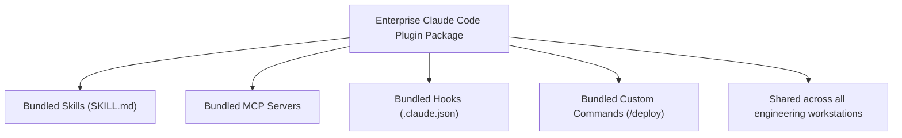

# 📹 Plugins in Claude Code + Claude Code Notes

<div className="video-card" style={{border: '1px solid #30363d', borderRadius: '8px', padding: '16px', marginBottom: '24px', background: 'rgba(56, 139, 253, 0.05)'}}>
  <div style={{display: 'flex', gap: '16px', flexWrap: 'wrap'}}>
    <div><strong>Instructor:</strong> Nitish Singh (CampusX)</div>
    <div><strong>Duration:</strong> 2108</div>
    <div><strong>Course:</strong> Module 5: MCP & Claude Code</div>
    <div><strong>Watch Link:</strong> <a href="https://www.youtube.com/watch?v=4lfcbeihdJk" target="_blank" rel="noopener noreferrer">YouTube Lecture ↗</a></div>
  </div>
</div>

## 📌 Executive Summary

Plugins bundle collections of skills, MCP servers, hooks, and custom slash commands into reusable, shareable packages that can be distributed across enterprise developer teams.

This final guide explores the Claude Code plugin architecture, installing community plugins, publishing private internal team plugins, and wrapping up the complete Claude Code agentic coding ecosystem.

---

## 🏗️ System Architecture & Execution Flow



---

## 📖 Core Concepts & Technical Deep Dive

### 1. Enterprise Standardization via Plugins
Rather than requiring every engineer to manually configure MCP servers and `CLAUDE.md` rules, plugins allow platform engineering teams to distribute standardized developer toolkits across the organization.

### 2. Plugin Installation & Versioning
Plugins can be installed from Git repositories, npm packages, or local shared file paths, supporting semantic version pinning to ensure reproducibility.

---

## 💻 Production Implementation

```python
# Plugin manifest blueprint: claude-plugin.json
plugin_manifest = {
    "name": "enterprise-sre-toolkit",
    "version": "1.0.0",
    "description": "Production SRE skills, Kubernetes MCP servers, and incident response commands.",
    "commands": ["commands/incident.md"],
    "skills": ["skills/k8s-debugger"]
}

import json
print(f"Claude Plugin Manifest:\n{json.dumps(plugin_manifest, indent=2)}")
```

---

## ⚙️ Production Gotchas & Best Practices

:::tip Semantic Versioning
Always pin plugin versions in team repositories to prevent unexpected upstream changes from altering agent behavior during release cycles.
:::

:::warning Security Auditing
Audit third-party community plugins thoroughly before installing them into environments containing proprietary source code.
:::

---

## 📊 Architectural Reference & Comparison

| Component | Scope | Distribution |
| :--- | :--- | :--- |
| **Command** | Single prompt shortcut | Repo `.claude/commands/` |
| **Skill** | Single capability folder | Repo `.claude/skills/` |
| **Plugin** | Multi-tool ecosystem package | npm / Git repository |

---

## 📚 Key Takeaways & Enterprise Checklist

- [ ] **Architecture Verification:** Ensure your design addresses latency, decoupled interfaces, and strict data validation contracts.
- [ ] **Deterministic Testing:** Run unit tests and golden dataset evaluations before shipping changes to staging or production.
- [ ] **Security & Observability:** Enforce input/output guardrails, scrub sensitive credentials/PII, and capture distributed traces.
- [ ] **Scalability & Sizing:** Calibrate model parameters, context limits, and compute instance requirements against projected request concurrency.
