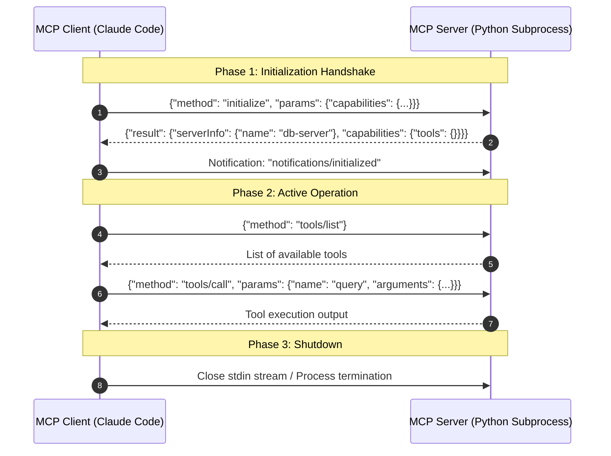

# MCP Lifecycle, Transports & Protocol Messages

<div className="video-card" style={{border: '1px solid #30363d', borderRadius: '8px', padding: '16px', marginBottom: '24px', background: 'rgba(56, 139, 253, 0.05)'}}>
  <div style={{display: 'flex', gap: '16px', flexWrap: 'wrap', alignItems: 'center'}}>
    <div><strong>Curators:</strong> Nitish Singh (CampusX)</div>
    <div><strong>Module:</strong> Module 5: Model Context Protocol (MCP) & Claude Code</div>
    <div><strong>Focus:</strong> Beginner to Production</div>
  </div>
</div>

## 🎯 What You'll Learn
- Understand the 3-phase MCP session lifecycle: Handshake/Init, Active Operation, and Graceful Shutdown.
- Compare `stdio` (Standard Input/Output) with `SSE` (Server-Sent Events) network transports.
- Inspect capability negotiation between clients and servers.

---

## 💡 Concept & Architecture

How do an MCP Client and Server start communicating?

### The 3-Phase Lifecycle:
1. **Initialization (Handshake):**
   - Client sends `initialize` request with its protocol version and supported capabilities.
   - Server replies with its protocol version, metadata, and server capabilities (tools, prompts, resources).
   - Client sends `notifications/initialized` confirming readiness.
2. **Operation (Active Session):**
   - The client lists available tools (`tools/list`), reads resources (`resources/read`), or executes functions (`tools/call`).
   - The server can emit notifications if resources change dynamically.
3. **Shutdown:**
   - Either process closes the stdio stream or terminates the HTTP connection.

### Transport Mechanisms:
- **stdio Transport:** Used when the client spawns the server as a local child subprocess on the same machine. Extremely fast, zero network overhead.
- **SSE Transport (HTTP):** Used when the server runs remotely on a cloud server or Docker container. The client connects via standard HTTP and receives updates over Server-Sent Events.

### System Architecture & Data Flow



---

## 💻 Step-by-Step Code Walkthrough

Below is the complete implementation broken down into digestible parts so you can understand every line.

### Part 1: Step 1: Inspecting Capability Negotiation in Python

```python
# Example initialization parameters exchanged during handshake
client_capabilities = {
    "roots": {"listChanged": True},
    "sampling": {} # Allows server to request LLM completions from client
}

server_capabilities = {
    "tools": {"listChanged": True},
    "resources": {"subscribe": True, "listChanged": True},
    "prompts": {"listChanged": False}
}

print("Handshake Capabilities Negotiated:")
print(f"Server provides tools: {'tools' in server_capabilities}")
print(f"Server provides resources: {'resources' in server_capabilities}")
```

#### 🔍 In-Depth Explanation:
Capability negotiation allows older clients and newer servers to work together seamlessly by disabling unsupported features.

---

## ⚠️ Beginner Tips & Best Practices

:::tip Use Logging to stderr on stdio Servers
Because `stdout` is reserved strictly for JSON-RPC messages on stdio transports, always use `sys.stderr.write()` or Python's `logging` module for debugging logs.
:::

:::warning Version Mismatch Rejection
If an MCP client supports protocol version `2024-11-05` and a server requires a higher version, the server will reject the initialization request. Always keep your MCP packages up to date.
:::

---

## 📝 Key Takeaways & Summary

- The MCP lifecycle consists of Initialization Handshake, Active Operation, and Graceful Shutdown.
- `stdio` is the primary transport for local desktop clients; `SSE` connects to remote cloud servers.
- Capability negotiation ensures forward and backward compatibility across clients and servers.

