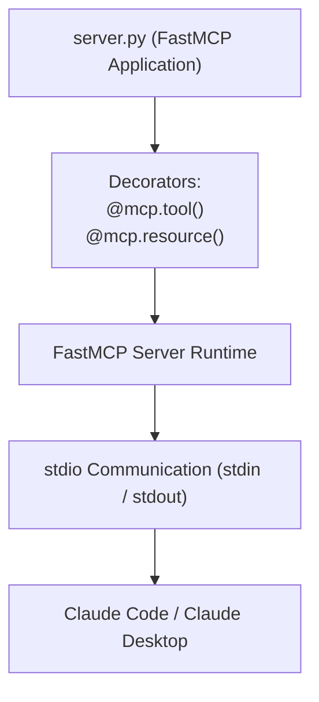

# Building Local MCP Servers with Python & FastMCP

<div className="video-card" style={{border: '1px solid #30363d', borderRadius: '8px', padding: '16px', marginBottom: '24px', background: 'rgba(56, 139, 253, 0.05)'}}>
  <div style={{display: 'flex', gap: '16px', flexWrap: 'wrap', alignItems: 'center'}}>
    <div><strong>Curators:</strong> Nitish Singh (CampusX)</div>
    <div><strong>Module:</strong> Module 5: Model Context Protocol (MCP) & Claude Code</div>
    <div><strong>Focus:</strong> Beginner to Production</div>
  </div>
</div>

## 🎯 What You'll Learn
- Install the official `mcp` SDK with `FastMCP`.
- Create tools and resources using simple Python decorators (`@mcp.tool()`, `@mcp.resource()`).
- Register the local server in Claude Desktop / Claude Code configuration.

---

## 💡 Concept & Architecture

Building an MCP server from scratch used to require hundreds of lines of boilerplate code to handle JSON-RPC serialization and async event loops.

Anthropic introduced **FastMCP**: a high-level Python library modeled after FastAPI.
With FastMCP:
- You decorate standard Python functions with `@mcp.tool()`.
- FastMCP automatically extracts type hints and docstrings into OpenAPI schemas.
- It handles stdio transport and client handshakes automatically!

### System Architecture & Data Flow



---

## 💻 Step-by-Step Code Walkthrough

Below is the complete implementation broken down into digestible parts so you can understand every line.

### Part 1: Step 1: Installing FastMCP

```python
pip install "mcp[cli]"
```

#### 🔍 In-Depth Explanation:
Installs the official Python MCP SDK and CLI tools.

### Part 2: Step 2: Writing the FastMCP Server (math_server.py)

```python
from mcp.server.fastmcp import FastMCP

# Initialize FastMCP server with a human-readable name
mcp = FastMCP("Developer Math Server")

# 1. Define an executable Tool
@mcp.tool()
def calculate_system_latency(network_ms: float, db_ms: float, llm_ms: float) -> dict:
    """
    Calculate total perceived request latency and identify the primary bottleneck.
    
    Args:
        network_ms: Estimated round-trip network latency in ms.
        db_ms: Database query latency in ms.
        llm_ms: LLM generation latency in ms.
    """
    total = network_ms + db_ms + llm_ms
    bottleneck = "LLM Generation" if llm_ms > (network_ms + db_ms) else "Database"
    return {
        "total_latency_ms": round(total, 2),
        "primary_bottleneck": bottleneck
    }

# 2. Define a read-only Resource
@mcp.resource("config://server-info")
def get_server_metadata() -> str:
    """Return server metadata and deployment environment."""
    return "Environment: Development | Region: us-west-2 | Version: 1.0.0"

if __name__ == "__main__":
    # Start stdio server loop
    mcp.run(transport="stdio")
```

#### 🔍 In-Depth Explanation:
In under 30 lines of code, we defined a complete MCP server exposing a computational tool and a metadata resource.

### Part 3: Step 3: Registering the Server with Claude Code

```python
# In Claude Code or Claude Desktop config (claude_desktop_config.json):
# {
#   "mcpServers": {
#     "developer-math": {
#       "command": "python3",
#       "args": ["/absolute/path/to/math_server.py"]
#     }
#   }
# }

# Test with the MCP CLI inspector:
# mcp dev math_server.py
```

#### 🔍 In-Depth Explanation:
The config file tells the client how to launch your Python script as a background child process.

---

## ⚠️ Beginner Tips & Best Practices

:::tip Use the MCP Dev Inspector UI
Run `mcp dev server.py` in your terminal. It launches a local web browser interface where you can test your tools and resources before connecting them to Claude.
:::

:::warning Use Absolute Paths in Configuration
Always specify absolute file paths to your Python interpreter and script in `claude_desktop_config.json`. Relative paths fail if the client launches from a different working directory.
:::

---

## 📝 Key Takeaways & Summary

- FastMCP provides a clean, FastAPI-like developer experience for building MCP servers.
- Tools allow the LLM to run Python code; Resources provide read-only context.
- The `mcp dev` CLI tool provides an interactive browser GUI for testing servers.

