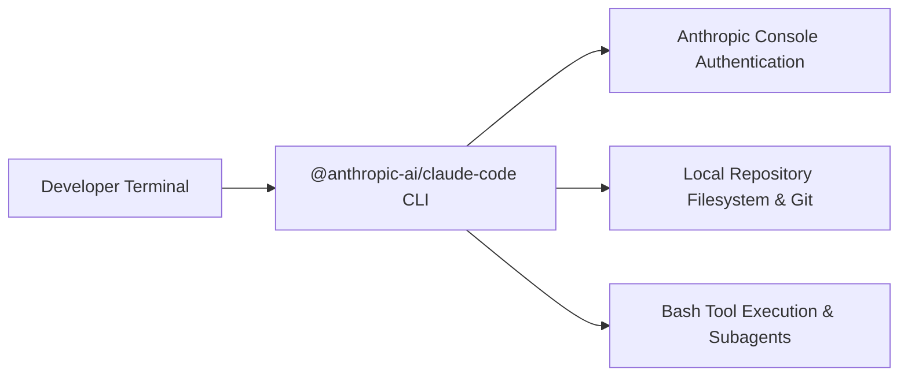

# 📹 Complete Claude Code Course In 2 Hours For Developers

<div className="video-card" style={{border: '1px solid #30363d', borderRadius: '8px', padding: '16px', marginBottom: '24px', background: 'rgba(56, 139, 253, 0.05)'}}>
  <div style={{display: 'flex', gap: '16px', flexWrap: 'wrap'}}>
    <div><strong>Instructor:</strong> Krish Naik</div>
    <div><strong>Duration:</strong> 7115</div>
    <div><strong>Course:</strong> Module 5: MCP & Claude Code</div>
    <div><strong>Watch Link:</strong> <a href="https://www.youtube.com/watch?v=TAKDIvvUdc4" target="_blank" rel="noopener noreferrer">YouTube Lecture ↗</a></div>
  </div>
</div>

## 📌 Executive Summary

Claude Code is Anthropic's official agentic command-line interface, running natively in your terminal with direct access to file systems, bash environments, and git repositories.

This guide explores installing the Claude Code CLI via Node.js, authenticating with Anthropic API credentials, configuring IDE terminal integrations, and running initial system diagnosis with `/doctor`.

---

## 🏗️ System Architecture & Execution Flow



---

## 📖 Core Concepts & Technical Deep Dive

### 1. Installation Requirements
Claude Code requires Node.js (v18+) and standard shell utilities (`git`, `bash`). It is installed globally via npm:
`npm install -g @anthropic-ai/claude-code`

### 2. Initial Setup & Authentication
Running `claude` launches the interactive CLI and opens a browser window for OAuth authentication with the Anthropic Console, storing credentials securely in the user's home directory.

### 3. System Health Checks with /doctor
The built-in `/doctor` command verifies local environment integrity: checking git configuration, write permissions, and network connectivity to Anthropic API endpoints.

---

## 💻 Production Implementation

```python
# CLI Commands for Claude Code Setup
# 1. Install globally
# npm install -g @anthropic-ai/claude-code

# 2. Launch in project root
# cd /path/to/project && claude

# 3. Verify installation inside Claude Code prompt
# /doctor
print("Claude Code installation and setup blueprint loaded.")
```

---

## ⚙️ Production Gotchas & Best Practices

:::tip Run in Repository Root
Always launch Claude Code from the root directory of your git repository. This ensures it correctly discovers project configuration files (`CLAUDE.md`, `.git`).
:::

:::warning Terminal Compatibility
Ensure your terminal emulator supports standard VT100 escape codes and ANSI colors (e.g. iTerm2, WezTerm, VS Code integrated terminal) for clean diff rendering.
:::

---

## 📊 Architectural Reference & Comparison

| Command | Execution Context | Purpose |
| :--- | :--- | :--- |
| `npm install -g @anthropic-ai/claude-code` | Bash Terminal | Global installation |
| `claude` | Bash Terminal | Starts interactive session |
| `/doctor` | Claude Code CLI | System diagnosis & health check |
| `/help` | Claude Code CLI | Lists all available commands & options |

---

## 📚 Key Takeaways & Enterprise Checklist

- [ ] **Architecture Verification:** Ensure your design addresses latency, decoupled interfaces, and strict data validation contracts.
- [ ] **Deterministic Testing:** Run unit tests and golden dataset evaluations before shipping changes to staging or production.
- [ ] **Security & Observability:** Enforce input/output guardrails, scrub sensitive credentials/PII, and capture distributed traces.
- [ ] **Scalability & Sizing:** Calibrate model parameters, context limits, and compute instance requirements against projected request concurrency.
