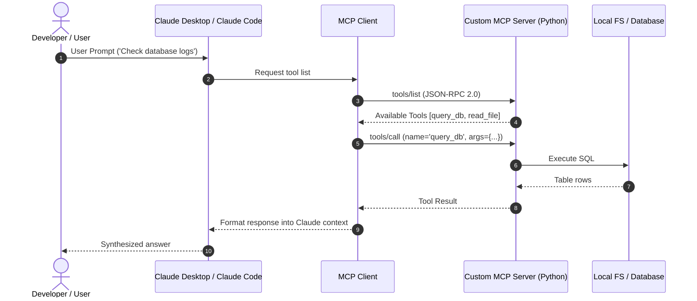

# 📹 Complete Claude Code Course In 2 Hours For Developers

<div className="video-card" style={{border: '1px solid #30363d', borderRadius: '8px', padding: '16px', marginBottom: '24px', background: 'rgba(56, 139, 253, 0.05)'}}>
  <div style={{display: 'flex', gap: '16px', flexWrap: 'wrap'}}>
    <div><strong>Instructor:</strong> Krish Naik (Krish Naik)</div>
    <div><strong>Duration:</strong> 118m 35s</div>
    <div><strong>Playlist:</strong> Claude Code & Workflows (Krish Naik)</div>
    <div><strong>Watch Link:</strong> <a href="https://www.youtube.com/watch?v=TAKDIvvUdc4" target="_blank" rel="noopener noreferrer">YouTube Lecture ↗</a></div>
  </div>
</div>

## 📌 Executive Summary & Learning Objectives

This lecture covers **Complete Claude Code Course In 2 Hours For Developers**, focusing on production implementations, edge cases, and industry standards:
- Core intuition, architecture, and underlying mechanisms.
- Key differences between theoretical research implementations and scalable enterprise patterns.
- Concrete Python walkthroughs, error recovery, and performance optimization.

---

## 🏗️ Architecture & Conceptual Workflow



---

## 📖 Core Concepts & Technical Deep Dive

### 1. Architectural Foundations
In modern production AI engineering, **Complete Claude Code Course In 2 Hours For Developers** is essential for ensuring reliability, low latency, and deterministic outcomes. As AI systems evolve from naive prompt-in / completion-out scripts into distributed systems, engineers must handle:
- **State management & consistency:** Ensuring intermediate states and tool invocations are tracked.
- **Error boundaries & recovery:** Graceful degradation when external LLMs or vector stores encounter rate limits or network partitions.
- **Resource utilization & cost efficiency:** Caching common queries and reducing unnecessary foundation model token expenditure.

### 2. Operational Considerations
- **Latency Optimization:** Pre-computing embeddings, utilizing asynchronous non-blocking event loops, and streaming tokens via Server-Sent Events (SSE).
- **Security & Sandboxing:** Validating inputs before ingestion, sanitizing LLM outputs, and isolating tool execution environments.

---

## 💻 Production Implementation Walkthrough

```python
from mcp.server.fastmcp import FastMCP

# Initialize FastMCP Server
mcp = FastMCP("Production AI Tools Server")

@mcp.tool()
def calculate_token_cost(input_tokens: int, output_tokens: int, model: str = "gpt-4o") -> dict:
    """Calculate total API cost given token counts."""
    rates = {
        "gpt-4o": {"input": 2.50 / 1_000_000, "output": 10.00 / 1_000_000},
        "claude-3-5-sonnet": {"input": 3.00 / 1_000_000, "output": 15.00 / 1_000_000},
    }
    rate = rates.get(model, rates["gpt-4o"])
    cost = (input_tokens * rate["input"]) + (output_tokens * rate["output"])
    return {"model": model, "total_cost_usd": round(cost, 6)}

if __name__ == "__main__":
    # Runs stdio transport protocol for Claude Desktop & Claude Code
    mcp.run(transport="stdio")
```

---

## 💡 Production Best Practices & Tips

:::tip Production Deployment Guideline
When deploying Complete Claude Code Course In 2 Hours For Developers in enterprise environments, always configure automated retries with exponential backoff and telemetry tracing (such as OpenTelemetry or LangSmith).
:::

:::warning Common Failure Modes
Watch out for state contamination across concurrent requests. Ensure each session or user interaction uses an isolated thread ID or execution context.
:::

---

## 🎯 Key Takeaways & Quick Reference

| Dimension | Production Standard | Pitfall to Avoid |
| :--- | :--- | :--- |
| **Execution** | Async / Non-blocking with timeouts | Synchronous blocking calls in event loops |
| **Data Validation** | Strict Pydantic v2 schemas | Untyped dictionary access |
| **Monitoring** | Distributed tracing & latency percentiles | Relying only on standard console logs |

## ⏱️ Lecture Timeline & Key Topics

| Timestamp | Key Topic / Concept Discussed |
| :--- | :--- |
| **00:00:00** | Hello all, my name is Krishna and... |
| **00:29:00** | information that you can save it in the... |
| **00:58:39** | plan mode on it runs a specific sub... |
| **01:27:30** | communication between sub aents right if... |
| **01:58:30** | you're executing again and again.... |


---

---

## 📜 Complete Lecture Transcript (Hindi / Hinglish)

> **Language:** Hindi / Hinglish | **Source:** `01 - Model Context Protocol ｜ Mini Playlist ｜ MCP Trilogy ｜ CampusX.hi-orig.srt` | **Total Segments:** 19 | **Word Count:** ~7,109 words

<details>
<summary><b>Click to expand full chronological transcript (19 timestamped intervals)</b></summary>

#### ⏱️ [00:00 ➔ 00:02]

हाय गाइज़, माय नेम इज नितीश एंड यू आर वेलकम टू माय YouTube चैनल। अब आपको इस वीडियो का थंबनेल देख के शायद थोड़ा अंदाजा हो गया होगा कि यह पर्टिकुलर वीडियो हमारे बाकी वीडियोस से थोड़ा अलग है। तो मैं एक काम करता हूं। पहले एक-दो मिनट्स में मैं आपको थोड़ा सा कॉन्टेक्स्ट देता हूं कि आपको इस वीडियो में क्या देखने को मिलने वाला है। पिछले दो-तीन महीनों में एक पर्टिकुलर टॉपिक है जिसके बारे में मुझे बहुत सारे रिक्वेस्ट आ रहे हैं आप लोगों की साइड से और उस टॉपिक का नाम है एमसीपी मॉडल कॉन्टेक्स्ट प्रोटोकॉल। मैं कोई भी वीडियो बना रहा था पिछले दो-ती महीनों में एटलीस्ट वहां पर मुझे एक कमेंट देखने को मिलता था कि सर आप प्लीज यह सब छोड़ो और एमसीपी के ऊपर वीडियो बनाओ। इतना ही नहीं मुझे Lindin पर और मेल्स पे मल्टीपल रिक्वेस्ट आए आप लोगों की साइड से कि सर आप प्लीज एक बार कंसीडर करो एमसीपी के ऊपर वीडियो बनाने का। अब मेरी प्रॉब्लम यह है कि मुझे काफी रिसर्च करके वीडियो बनाना पसंद है और मुझे रिसर्च करने का टाइम नहीं मिल पा रहा था क्योंकि मैं बाकी की चीजों में लगा हुआ था। था लैंग्राफ्ट का एक प्लेलिस्ट चल रहा है। उसके अलावा कैमपस एक्स को रन करने के लिए और भी चीजें करनी पड़ती हैं। बट पिछले तीन-चार वीक्स में थोड़ा सा मुझे टाइम मिला एमसीपी के बारे में पढ़ने का रिसर्च करने का और मैंने क्या किया? मैंने उस टाइम को बहुत अच्छे से यूटिलाइज किया। नॉट ओनली मैंने रिसर्च किया बट एक डिटेल्ड करिकुलम बनाया जिसके ऊपर मैं वीडियोस बनाना चाहता था। और इस पूरे के पूरे रिसर्च का आउटपुट यह निकला कि अब मेरे पास थोड़ा सा बैकग्राउंड नॉलेज है कि मुझे ऐसा लगता है कि मैं वीडियोस बना सकता हूं एमसीपी के ऊपर। सो व्हाट आई हैव डिसाइडेड इज़ कि मैं एक छोटा सा मिनी प्लेलिस्ट बनाऊंगा ऑन द टॉपिक ऑफ एमसीपी और इस मिनी प्लेलिस्ट में तीन वीडियोस होने वाले हैं। ठीक है? सिर्फ तीन। इनफैक्ट मैं आपको बता भी देता हूं कि वो तीन वीडियोस क्या रहेंगे। सो जो पहला वीडियो है उसका नाम मैंने सोच रखा है इट विल बी कॉल्ड द वाई जहां पर मैं आपको यह पढ़ाऊंगा कि एमसीपी पिक्चर में आया क्यों क्या एग्जैक्ट प्रॉब्लम सॉल्व करता है एमसीपी वीडियो नंबर टू का नाम होगा द व्हाट और इस पर्टिकुलर वीडियो में मैं आपको आर्किटेक्चर लेवल पे जाके समझाऊंगा कि एमसीपी काम कैसे करता है ठीक है एमसीपी

#### ⏱️ [00:02 ➔ 00:04]

सर्वर्स क्या होते हैं क्लाइंट्स क्या होते हैं होस्ट क्या होते हैं ये सब एक दूसरे के साथ इंटरेक्ट कैसे करते हैं और फिर जो फाइनल वीडियो होगा उसका नाम होगा द हाउ जहां पर मैं आपको प्रैक्टिकली कोड में जाकर के यूज़ केसेस सॉल्व करके दिखाऊंगा और आप अपने प्रोजेक्ट में एमसीपी को इंप्लीमेंट करना सीखोगे। ठीक है? एंड सिंस तीन वीडियोस होने वाले हैं इस पूरे प्लेलिस्ट में तो मैंने इसका एक फैंसी नाम सोचा और वो नाम है द एमसीपी ट्रायोलॉजी। अब जब मैं फर्स्ट वीडियो बनाने उतरा द वाई वाला वीडियो। तो, मुझे ऐसा लगा कि यह तीन इंफॉर्मेशन डेंस वीडियोस बनाने के पहले अच्छा होगा अगर मैं आपको थोड़ा सा इंस्पायर करूं। क्योंकि मुझे ऐसा लगता है टीचर की रिस्पांसिबिलिटी सिर्फ पढ़ाना ही नहीं है। इंस्पायर करना भी है। तो मुझे लगा कि पहले मुझे आपको एक प्रॉब्लम सॉल्व करके दिखानी चाहिए विथ द हेल्प ऑफ एमसीपी। और आपको जब वो दिखेगा अपनी आंखों के सामने होते हुए कि कैसे एक बड़ी प्रॉब्लम को आप आसानी से सॉल्व कर पा रहे हो विथ द हेल्प ऑफ एमसीपी। तो ऑटोमेटिकली आप इंस्पायर होगे थोड़ा और डीपली इन तीन वीडियोस को स्टडी करने के लिए। सो मैंने एक प्रोजेक्ट बनाया पिछले छ सात दिनों में काफी टाइम लगा के, काफी एफर्ट लगा करके और वो प्रोजेक्ट मैंने एमसीपी को यूज़ करके बनाया है। और आज के वीडियो में मैं आपको उस प्रोजेक्ट का डेमो दिखाने वाला हूं। सो यह प्रोजेक्ट रिलेटेड है हमारी कंपनी से कैमपस एक्स से। कैमपस एक्स में वी वर फेसिंग दिस प्रॉब्लम और उस प्रॉब्लम को हमने सॉल्व किया वि द हेल्प ऑफ एमसीपी। और यह पूरा का पूरा प्रॉब्लम स्टेटमेंट और उसको कैसे सॉल्व किया जा रहा है एमसीपी से वो सब मैं आपको इस वीडियो में दिखाने वाला हूं। एंड दैट इज़ व्हाई मैंने इस वीडियो का नाम रखा है द ट्रेलर। ठीक है? तो आई रियली होप पिछले दो-तीन मिनट में मैंने जो भी बोला वो जस्टिफाई कर रहा है हमारे थंबनेल को। अब डिस्कस करते हैं कि एक्जेक्टली क्या प्रॉब्लम है जिसको हम सॉल्व करने वाले हैं विथ द हेल्प ऑफ एमसीपी। सो जो प्रॉब्लम स्टेटमेंट हम सॉल्व करने जा रहे हैं इस वीडियो में वो है एक बहुत कॉमन प्रॉब्लम स्टेटमेंट और आप सभी उससे रिलेट कर पाओगे। प्रॉब्लम स्टेटमेंट यह है कि आज

#### ⏱️ [00:04 ➔ 00:06]

की डेट में जहां पर एआई एक बहुत रैपिड बेस पर ग्रो कर रहा है। हर दिन नए प्रोडक्ट्स आ रहे हैं, नई लाइब्रेरीज आ रही हैं, नए रिसर्च पेपर्स आ रहे हैं। वहां पर अगर कोई एआई को सीखना चाहता है कंप्लीटली और उसको मास्टर करना चाहता है, तो उसके लिए यह काम बहुत डिफिकल्ट है। बिकॉज़ आज अगर अपने लिए आप एक रोड मैप बनाओ कि मुझे अगले 6 महीनों में यह रोड मैप फॉलो करके एआई में एक्सपर्ट बनना है। तो विद इन वन और टू मंथ्स ऐसा हो सकता है कि उस रोड मैप के बहुत सारे टॉपिक्स ऑब्सोल्यूट हो जाए और वहां पे नए टॉपिक्स आ जाए। तो यह एक बहुत बड़ी प्रॉब्लम है जो मैं पर्सनली देख रहा हूं कि स्टूडेंट्स फेस कर रहे हैं। नॉट ओनली स्टूडेंट्स हम टीचर्स को भी ये प्रॉब्लम फेस करनी पड़ रही है। जबकि हम पिछले छह सात सालों से इस डोमेन में हैं। अब क्वेश्चन ये आता है कि इस पर्टिकुलर प्रॉब्लम को कैसे सॉल्व किया जा सकता है? आपकी साइड से बहुत सारे क्वेश्चंस आते हैं जो मुझसे एग्जैक्टली यही सवाल पूछते हैं कि सर आप कैसे अप टू डेट रहते हो जो भी डेवलपमेंट्स हो रहे हैं एआई में। अब ऑनेस्टली जस्ट लाइक एनीवन एल्स मेरे लिए भी इट्स इनक्रेडिबली डिफिकल्ट टू कीप अप वि द पेस ऑफ़ एआई। बट मैंने कुछ छोटी-छोटी चीजें फिगर आउट की हैं जिसकी हेल्प से मैं थोड़ा बहुत लूप में रहता हूं। उनमें से एक बहुत अच्छी चीज जिसने सच में मुझे पिछले तीन सालों में हेल्प किया है वो है न्यूज़ लेटर्स। सो मैंने क्या किया है? मैंने मल्टीपल एआई न्यूज़ लेटर्स को सब्सक्राइब कर रखा है। ठीक है? राइट फ्रॉम जब चार्ट जीपीटी रिलीज हुआ था। जैसे उनमें से एक न्यूज़ लेटर आपके सामने है द न्यूरॉन बोल के। होता क्या है कि मुझे ऑन अ डेली बेसिस ये मेल्स में न्यूज़ लेटर मिल जाते हैं। कभी किसी एक कंपनी का, कभी किसी दूसरी कंपनी का। और मैं क्या करता हूं कि रात में सोने के पहले एटलीस्ट एक बार कोई ना कोई एक न्यूज़ लेटर पढ़ के सोता हूं। तो उससे एटलीस्ट इतना मेक श्योर हो जाता है कि मुझे थोड़ा बहुत जो इंपॉर्टेंट डेवलपमेंट्स हैं उनके बारे में आईडिया रहता है। सो दिस इज वन ऑफ द वेज़ जिसकी हेल्प से आप थोड़ा अप टू डेट रह सकते हो।

#### ⏱️ [00:06 ➔ 00:08]

जब मैंने सोचना शुरू किया कि मैं कैसे स्टूडेंट्स को हेल्प कर सकता हूं इस प्रॉब्लम को सॉल्व करने में तो मुझे लगा कि व्हाट इफ हम भी कैंपस एक्स का खुद का एक एई न्यूज़ लेटर स्टार्ट करें। बट एI न्यूज़ लेटर स्टार्ट करने में जो सबसे बड़ी प्रॉब्लम है वह यह है कि आपको बहुत ज्यादा रिसर्च करना पड़ेगा ऑन अ डेली बेसिस उस न्यूज़ लेटर को प्रिपेयर करने में। उसके बाद आपको उसको बहुत अच्छे तरीके से लिखना पड़ेगा बिकॉज़ आप उसको इतने लोगों तक भेज रहे हो और ऑब्वियसली उसमें डिजाइनिंग वगैरह हर चीज का काम है। अब प्रॉब्लम यह है कि मेरे पास टाइम कंस्ट्रेंट है। मैं ऑलरेडी ऐसी चीजों में ऑक्युपाइड हूं जहां पे मुझे टाइम नहीं मिलता है। तो इसीलिए पिछले तीन-चार महीनों से जब से मैंने आईडिया सोचा कि हमारा न्यूज़ लेटर होना चाहिए। आई वास नॉट एबल टू एग्जीक्यूट दिस आईडिया। फिर लास्ट थ्री वीक्स जब मैंने एमसीपी के बारे में पढ़ना शुरू किया और उसके पावर्स को रियलाइज करना शुरू किया तो मुझे लगा कि व्हाट इफ मैं अपने इस न्यूज़ लेटर वाली प्रॉब्लम को सॉल्व करूं विथ द हेल्प ऑफ एमसीपी और पिछले तीन दिनों में मैंने एग्जैक्टली यही काम किया है। मैंने कोई भी और काम नहीं किया है। मैंने सिर्फ एक प्रॉब्लम स्टेटमेंट उठाया कि मुझे एआई की हेल्प से एमसीपी की हेल्प से एक न्यूज़ लेटर बनाना है। उसका रिसर्च भी एआई के थ्रू करवाना है। उसका कंटेंट क्रिएशन भी एआई के थ्रू कराना है। उसका डिजाइन भी एआई के थ्रू कराना है। बेसिकली न्यूज़ लेटर बनाने के पूरे प्रोसेस को एआई की हेल्प से ऑटोमेट करना है। सो दैट मैं ऑन अ रेगुलर बेसिस अच्छा न्यूज़ लेटर अपने स्टूडेंट्स को भेज पाऊं। आज इस पॉइंट पे मेरे मशीन पे वो सॉल्यूशन मौजूद है और वो मैं आपके साथ शेयर करना चाहता हूं इस वीडियो में। चलो, लेट मी शो यू कि एक्जेक्टली मैंने कैसे स्टेप बाय स्टेप चीजों को एग्जीक्यूट किया इन ऑर्डर टू अचीव दिस सॉल्यूशन। सो अब बात करते हैं स्टेप नंबर वन की। सो मुझे ऐसा लगा कि कोई भी स्टेप्स लेने के पहले जो सबसे इंपॉर्टेंट स्टेप है वो ये है कि मैं अपने दिमाग में एक क्लियर पिक्चर रखूं कि CPS एक्स का न्यूज़ लेटर दिखाई कैसा देगा।

#### ⏱️ [00:08 ➔ 00:10]

एज इन उसके अंदर कंटेंट कैसा जाएगा। सो मैंने कॉपी पेन लिया। मैंने और बहुत सारे न्यूज़ लेटर्स स्टडी किए और फाइनली एक स्ट्रक्चर प्रिपेयर किया। तो वो स्ट्रक्चर मैं आपके साथ डिस्कस करना चाहता हूं। सो इन टोटल देयर आर नाइन सेक्शंस इन आवर न्यूज़ लेटर। जो पहला सेक्शन होगा वो होगा इंट्रोडक्शन सेक्शन जहां पे हम एक छोटा सा पैराग्राफ लिख के रीडर को बताएंगे कि इस न्यूज़ लेटर में आप क्या एक्सपेक्ट कर सकते हो। थोड़ा सा क्यूरोसिटी बिल्ड करेंगे ताकि उसको आगे की चीजें पढ़ने का मन करे। उसके बाद जो सेकंड सेक्शन होगा उसका नाम हमने रखा है बिग स्टोरी ऑफ़ द वीक। एक सिंगल न्यूज़ जो एआई वर्ल्ड को पूरा हिला के रख दिया। ठीक है? अ उसके बाद थ्री टू फाइव क्विक अपडेट्स ये भी न्यूज़ ही है बट उतना भी ज्यादाेंट नहीं है। बट ऐसा है कि आपको पता होना चाहिए। नेक्स्ट एक सेक्शन मैंने प्लान किया जहां पे हम जो टॉप रिसर्च पेपर्स हैं इस वीक के वो आपको लिस्ट डाउन करके दें। उनकी समरी बताएं और उनका डाउनलोड लिंक भी आपको दे दें। अगला जो सेक्शन था वो था GitHub रेपोज़ का। सो बड़ी-बड़ी कंपनीज़ क्या करती हैं? बहुत सारा ओपन सोर्स में काम कर रही हैं और अपने रेपोस रिलीज़ करते रहती हैं। तो जो भी टॉप रेपोज़िटरीज हैं इस वीक एआई से रिलेटेड वो हम आपको लिस्ट करके भेजें। नेक्स्ट वाज़ कि हम आपको एक छोटा सा ट्यूटोरियल दें जो आप 5 मिनट में पढ़ लो बट आपको फायदा भी हो जाए उस तरह का कुछ स्ट्रक्चर। तो वो एक सेक्शन हमने प्लान किया। उसके अलावा डेली बेसिस पे एआई के नए-नए प्रोडक्ट्स आते रहते हैं। तो इस पर्टिकुलर वीक जो टॉप प्रोडक्ट्स हैं उनके बारे में आपको बताएं इन अ क्रिस्प मैनर। और एट्थ सेक्शन था कि जो भी सबसे पॉपुलर ट्वीट्स हैं एक्स प्लेटफार्म पे वो हम आपको बता दें कि कौन से लीडिंग पर्सनालिटीज क्या बात कर रहे हैं उसके बारे में थोड़ा आईडिया आपको लग जाए एंड लास्टली क्लोजिंग नोट्स हो जो पूरे के पूरे न्यूज़ लेटर को समराइज करें और साथ ही साथ थोड़ा सा आपको एक टीजर दे अगले न्यूज़ लेटर के बारे में तो मुझे ऐसा लगा कि ये एक डिसेंट स्ट्रक्चर है नॉट सेइंग कि दिस इज द बेस्ट न्यूज़ लेटर स्ट्रक्चर बट दिस इज अ गुड स्टार्टिंग पॉइंट ठीक है

#### ⏱️ [00:10 ➔ 00:12]

तो ये सबसे पहले इमेजिन करना, विजुअलाइज़ करना कि हमारा CPS X का न्यूज़ लेटर दिखाई कैसा देगा। मुझे लगा कि यह सबसे इंपॉर्टेंट चीज है। बिकॉज़ ये अगर एक बार समझ में आ गया तो फिर आगे का काम थोड़ा आसान हो जाता है। ठीक है? तो अब मैं आपको बताता हूं स्टेप टू क्या है। स्टेप नंबर टू था न्यूज़ लेटर बनाने के पूरे प्रोसेस को क्लियरली डिफाइन करना। सो, सिंस, यह पूरा का पूरा काम मुझे एआई से करवाना है, तो इट शुड बी वेरी क्लियर कि क्या एग्जैक्ट स्टेप्स होने वाले हैं इस न्यूज़ लेटर को डिजाइन करने के प्रोसेस में। सो, जब मैंने क्लियरली सोचने की कोशिश की, तो मुझे यह समझ में आया कि इस पूरे के पूरे क्रिएशन प्रोसेस में तीन स्टेजेस होंगे। पहला स्टेज होगा रिसर्च का जहां पर हमारा जो एआई टूल है या हमारा जो चैटबॉट है वो अलग-अलग सोर्सेस पे जाकर के रिसर्च परफॉर्म करेगा ऑन द बेसिस ऑफ सम प्र्प्ट जो मैं उसको दूंगा। क्या सर्च करना है, किस बेसिस पर सर्च करना है, वह मैं बताऊंगा और फिर हमारा चैटबॉट उन अलग-अलग जगहों पर जाके रिसर्च कंडक्ट करेगा और हर रिसर्च के अराउंड वो मुझे एक नोट प्रिपेयर करके देगा। फिर स्टेप नंबर टू में मैं क्या करूंगा कि ये जो सारे अलग-अलग सोर्सेस से नोट्स मुझे मिले हैं, मैं उनको एक्यूमुलेट करके एडिट करूंगा इंटू अ फाइनल ड्राफ्ट स्ट्रक्चर। और एक बार जब मुझे फाइनल ड्राफ्ट स्ट्रक्चर मिल जाएगा तो फिर मैं स्टेज थ्री में जाकर के उस ड्राफ्ट को प्रॉपर्ली एक यूआई में कन्वर्ट करूंगा। उसको प्रॉपर्ली डिजाइन करूंगा ताकि वो अच्छा दिखाई दे। सो गोइंग फॉरवर्ड मैं आपको एक-एक करके ये तीनों स्टेजेस में काम कैसे होने वाला है वो बताता हूं। अब रिसर्च एडिटिंग और डिजाइनिंग फेसेस के बारे में बात करने से पहले मैं आपको यह बता देता हूं कि इस पूरे प्रोजेक्ट को बिल्ड करने के लिए मैंने कौन-कौन से टूल्स यूज किए। सबसे पहले बात करते हैं मेन एi की मेन चैटबॉट की जो पूरा का पूरा हैवी लिफ्टिंग करेगा। अ इसके लिए हमने चूज़ किया क्लॉड को। क्लॉड चूज़ करने का रीज़न यह है कि एमसीपी जो है वो क्लॉड की तरफ से आया है। एंथ्रोपिक की तरफ से ही आया है। एंड दैट इज व्हाई क्लॉड मुझे बाकी चैट बॉट्स

#### ⏱️ [00:12 ➔ 00:14]

के कंपैरिजन में सबसे ज्यादा कैपेबल लगा। यह पूरा का पूरा प्रोसेस कैरी आउट करने में। ठीक है? अह चैट जीपीटी में उतने ज्यादा इंटीग्रेशंस नहीं है। एमसीपी का सपोर्ट नहीं है। और बाकी भी थोड़े लैगिंग लगे। बट क्लॉड को जब मैंने यूज़ किया तो मुझे लगा कि यहां पे बहुत स्ट्रांग सपोर्ट है एमसीपी का। सेकंड अगर मैं बात करूं कि हम कौन-कौन से टूल्स यूज करेंगे इस पूरे न्यूज़ लेटर को बिल्ड करने में तो हम कुछ छह-सात टूल्स यूज़ करने वाले हैं। जैसे कि गेट का एक टूल है। वेब सर्च करने का एक टूल है। Google ड्राइव के लिए एक टूल है। आर्काइव जो हमारा रिसर्च पेपर्स जहां पे पब्लिश होते हैं उसका एक टूल है। Gmail के लिए टूल है। प्रोडक्ट हंट के लिए टूल है। जहां पे एi प्रोडक्ट्स लॉन्च होते हैं। और इसके अलावा भी आई गेस एक दो टूल्स और हैं। और आई गेस आप सही समझ रहे हो। हमने क्लॉड को इन टूल्स के साथ जो कनेक्ट किया वो एमसीपी के थ्रू किया। अब आई नो इस पॉइंट पर शायद यह बहुत मीनिंगफुल स्टेटमेंट नहीं लग रहा होगा कि किसी टूल को किसी एआई से कनेक्ट करने के लिए एमसीपी की क्या जरूरत है। बट ट्रस्ट मी इस पूरे प्लेलिस्ट में अगले तीन वीडियोस में हम एग्जैक्टली यही से यही चीज समझना चाहते हैं। बट इस पॉइंट पे बस ऐसे समझो कि हमारे पास एक मेन एi है जो कि क्लॉड है और उसको हमने बहुत सारे टूल्स का कैपेबिलिटी दिया है। और ये जो कनेक्शन हुआ है हमारे एi का हमारे टूल्स के साथ। ये कनेक्शन हमने एमसीपी के थ्रू किया है। ठीक है? तो ये हमारा एंटायर टूलबॉक्स है जो हमें हेल्प करेगा इस पूरे के पूरे न्यूज़ लेटर क्रिएशन प्रोसेस में। अब बात करते हैं हमारे फर्स्ट फेज की जो कि है रिसर्च फज़। अब इस फेज में हम दो इंपॉर्टेंट काम करेंगे। पहला काम यह है कि हम यह पता करेंगे कि हमें रिसर्च किस चीज पे करना है। किन टॉपिक्स के ऊपर करना है और सेकंड हम उन टॉपिक्स के ऊपर रिसर्च कंडक्ट करेंगे। तो देखो इस पूरे फेस का फ्लो कैसा रहेगा कि मैं क्लड एi को एक प्र्प्ट लिख के दूंगा। एक बहुत ही डिटेल्ड प्र्प जिसमें दो इंस्ट्रक्शंस होंगे। पहला इंस्ट्रक्शन ये होगा कि क्लाउड एi को मेरे

#### ⏱️ [00:14 ➔ 00:16]

Google ड्राइव अकाउंट पे जाना है और वहां से दो फाइल्स को फैच करके लाना है। कौन सी दो फाइल्स? यह है पहली फाइल। इस फाइल का नाम है कंटेंट आइde। यहां पर मैंने ऑलरेडी लिस्ट ऑफ टॉपिक्स लिख रखे हैं जिसके अराउंड हमारा न्यूज़ लेटर पब्लिश किया जा सकता है। और सेकंड जो फाइल है उस फाइल का नाम है परफॉर्मेंस डेटा। सो यहां पर मैंने एक कुछ डमी डेटा क्रिएट कर रखा है जो क्लॉड को यह बताएगा कि पास्ट जो न्यूज़ लेटर्स हमने भेजे हैं अपने ऑडियंस को उसका रिस्पांस कैसा रहा? जैसे कि किस डेट पे भेजा है? सब्जेक्ट क्या था? ओपन रेट क्या है? क्लिक रेट क्या है? एवरेज रीड टाइम क्या है? ये सारा डेटा हमने मेंटेन कर रखा है। ये सारा डेटा हमें मिलेगा कहां से? मेल चिम जैसे टूल से जिनकी हेल्प से आप न्यूज़ लेटर्स भेजते हो। ठीक है? तो ऑब्वियसली अभी हमारे पास कोई डेटा नहीं है। बिकॉज़ अभी हम अपना फर्स्ट न्यूज़ लेटर भेजने वाले हैं। बट फ्यूचर में यहां पर प्रॉपर डेटा होगा। सो दैट इज व्हाई मैं अभी से क्लॉड को ये आदत लगा रहा हूं कि उसको रिसर्च कंडक्ट करने के पहले कंटेंट आइडियाज जाकर के देखने हैं ड्राइव से और परफॉर्मेंस डेटा स्टडी करना है कि पास्ट न्यूज़ लेटर के साथ क्या हुआ। और साथ ही साथ मैंने उसको अपने ईमेल का भी एक्सेस दे रखा है। तो मैंने उसको बोल रखा है कि तुम मेरे ईमेल पर जाओ और वहां पर जितने भी फीडबैक मेल्स हमें आए हैं उनको थोड़ा डीपली स्टडी करो और उसके बेसिस पे भी डिसाइड करो कि अगले न्यूज़ लेटर में क्या डालना है। तो ये हो गया पार्ट वन ऑफ द रिसर्च फेस जहां पे हम तीन चीजों के बेसिस पे यह डिसाइड कर रहे हैं कि हमारा रिसर्च किस बारे में होगा। कौन सी तीन चीजें? हमारे कंटेंट आइडियाज वाली फाइल, हमारा परफॉर्मेंस डेटा वाला फाइल और हमारे फीडबैक ईमेल्स। अब इन तीनों से जब हमें इंसाइट्स मिल जाएंगे, क्लॉड को जैसे ही इनसाइट्स मिल जाएंगे कि ओके मुझे इन टॉपिक्स के ऊपर रिसर्च कंडक्ट करनी है। तो फिर मैं क्लॉड को पांच अलग जगहों पर भेजना चाहता हूं टू कंडक्ट द रिसर्च। कौन सी पांच अलग जगह? सबसे पहले मैं उसको एक वेब सर्च टूल दूंगा। सो दैट वो वेब पे जाकर के गिवन टॉपिक्स के ऊपर सबसे इंटरेस्टिंग और सबसे इंपॉर्टेंट न्यूज़ फच करके ला पाए जो

#### ⏱️ [00:16 ➔ 00:18]

कि हमारे न्यूज़ लेटर का पहला सेक्शन है। उसके बाद मैं उसको गेटअप का एक्सेस दूंगा टू गो एंड फाइंड आउट कि कौन सी ट्रेंडिंग रेपोज़िटरीज हैं। फिर मैं उसको प्रोडक्ट हंट का एक्सेस दूंगा। सो दैट वो जाके पता कर पाए कि कौन से ट्रेंडिंग प्रोडक्ट्स हैं लास्ट वीक में। उसके अलावा मैं उसको आर्काइव का एक्सेस दूंगा। सो दैट वो जाकर ट्रेंडिंग रिसर्च पेपर्स फैच कर पाए और उसको Twitter का भी एक्सेस दूंगा ताकि लीडिंग पर्सनालिटीज क्या बात कर रही हैं उसके बारे में भी हमें पता चल पाए और इन पांचों जगहों से मैं एक-एक नोट्स जनरेट करूंगा। सो गीब से मुझे एक मार्कडाउन फाइल मिलेगी जहां पे पूरा का पूरा रिसर्च लिखा हुआ होगा गिट वाला। फिर मुझे आर्काइव से भी एक फाइल मिलेगी जिसमें पूरा का पूरा रिसर्च लिखा होगा अराउंड द आर्काइव रिसर्च पेपर्स। बेसिकली इन पांच चीजों के लिए मुझे पांच मार्क डाउन फाइल्स मिलेंगी और हर फाइल में उस पर्टिकुलर चीज से रिलेटेड रिसर्च लिखा होगा डिटेल में। और फिर मैं क्या बोलूंगा क्लॉड को कि इन पांचों फाइल्स को उठाओ। सो दिस विल बी द कंक्लूडिंग पार्ट ऑफ द रिसर्च फेस। अब बात करते हैं हमारे अगले फेस की जो कि है एडिटिंग फेस। सो इस पॉइंट पे हमारे पास हमारे डेस्कटॉप पे पांच रिसर्च डॉक्यूमेंट्स आ चुके हैं। अब हमें क्या करना है? उन पांच डॉक्यूमेंट्स से एक फाइनल ड्राफ्ट प्रिपेयर करना है हमारे न्यूज़ लेटर का। तो व्हाट आई विल डू इज़ कि मैं क्लॉड को फिर से एक प्र्प्ट दूंगा और एक बार जब वह सारे डॉक्यूमेंट्स रीड कर लेगा तो फिर उसको Google ड्राइव पे जाना है फिर से जहां पर मैंने एक सैंपल न्यूज़ लेटर प्रिपेयर कर रखा है। यू कैन सी दिस इज़ अ डॉक्यूमेंट जहां पे हमने एक सैंपल न्यूज़ लेटर बना रखा है। इंट्रो का सेक्शन है। बिग स्टोरी ऑफ़ द वीक का सेक्शन है। क्विक अपडेट्स का सेक्शन है। टॉप रिसर्च पेपर्स, टॉप गिटब रेपोस, लर्निंग ब्लॉग ऑफ द वीक, टॉप एआई प्रोडक्ट्स, टॉप ट्वीट्स ऑफ द वीक और फाइनली क्लोजिंग नोट। एग्जैक्टली वही स्ट्रक्चर जो मैंने आपको बताया था। अब मैं क्लॉड को यह बोल रहा हूं कि तुम मेरे डेस्कटॉप से सारा का सारा रिसर्च डॉक्यूमेंट उठाओ और ड्राइव से जाकर के एक आईडिया लो कि फाइनल न्यूज़ लेटर दिखेगा कैसे? और फिर इस फॉर्मेट के बेसिस

#### ⏱️ [00:18 ➔ 00:20]

पर इन सारे रिसर्च डॉक्यूमेंट्स को एक फाइनल ड्राफ्ट में कन्वर्ट करो। ठीक है? यहां पे इनसाइड्स नहीं आएगा। आई एम सॉरी। हां ये मैंने गलत लिख दिया। यहां पे फाइनल ड्राफ्ट होना चाहिए। और उस फाइनल ड्राफ्ट को मैं क्या करूंगा? जब वो बन जाएगा उसको वापस अपने डेस्कटॉप में उसी फोल्डर के अंदर सेव कर दूंगा। तो इस पॉइंट पे हमारा जो एडिटिंग फज़ है वो कंप्लीट हो गया। अब बात करते हैं नेक्स्ट और लास्ट स्टेप की जो कि है डिजाइनिंग वाला स्टेप। सो नाउ लेट्स टॉक अबाउट द डिजाइनिंग फेस। सो डिजाइनिंग फेस में भी हम क्या करेंगे? क्लॉड को एक प्र्प्ट देंगे और उस प्र्पों्ट में हम एक सिंपल सी बात लिखेंगे कि उसको हमारे डेस्कटॉप पे जाना है और वो जो फाइनल ड्राफ्ट डॉक्यूमेंट है उसको फैच करके लाना है। और सेकंड हम साथ ही साथ प्र्ट में उसको कुछ डिज़ स्पेसिफिकेशन देंगे। जहां पर हम बताएंगे कि हमारे न्यूज़ लेटर का यूआई दिखता कैसा है। और हम उसको बोलेंगे कि इस यूआई के बेसिस पे इस ड्राफ्ट को डिजाइन करो। और यह जो पूरा का पूरा डिजाइनिंग होगा वो एक HTML पेज के फॉर्म में होगा। ठीक है? मोस्टली आप जब न्यूज़ लेटर्स भेजते हो तो अलग-अलग तरीके से आप उसको डिज़ कर सकते हो। अ वन ऑफ़ द ऑप्शंस इज़ कि आप एक HTML पेज के फॉर्म में उसको डिज़ाइन करो। तो हम क्या कर रहे हैं? हम क्लॉट की हेल्प से बेसिकली एक HTML पेज बना रहे हैं। जहां पे डिज़िंग कैसे होगी हमने अलग से बता दिया। और उस HTML पेज का कंटेंट क्या होगा वो हमारे फाइनल ड्राफ्ट से आ रहा है। तो इस स्टेप के एंड में क्या होगा कि हमारे पास एक HTML पेज होगा फाइल होगी जिसको अगेन हम सेव कर देंगे उसी सेम फोल्डर में हमारे डेस्कटॉप के अंदर और एक बार जैसे ही हमारे पास ये HTML फाइल आ गई हमारा काम खत्म हो गया। अब हमें सिंपली मेल चिंप जैसे किसी टूल पर जाना है और वहां पर बेसिकली अपने जो भी कांटेक्ट्स हैं उनको मेल कर देना है। यह पर्टिकुलर HTML पेज। सो दिस इज द एंटायर फ्लो ऑफ क्रिएटिंग अ न्यूज़ लेटर। अब आई होप आपको

#### ⏱️ [00:20 ➔ 00:22]

यह पूरी चीज समझ में आ गई। एंड आई एम प्रीटी श्योर आपको शायद मेरे ऊपर गुस्सा भी आ रहा होगा कि बस थ्योरी थ्योरी में मैं आपको सारी चीज बता रहा हूं। शो अस द प्रैक्टिकल। तो चलो अब मैं आपको दिखाता हूं कि कैसे यह पूरा का पूरा न्यूज़ लेटर बनाने का जो प्रोसेस है यह आप तीन प्र्प्ट्स में कंप्लीट कर सकते हो। तो गाइस अब मैं आपको सेटअप दिखाता हूं। सो मैंने अपने मशीन पे क्लड डेस्कटॉप इंस्टॉल कर रखा है। और क्लड डेस्कटॉप में मैं आपको दिखाता हूं कि मेरे पास टूल्स कौन-कौन से हैं। सो यहां पे अगर मैं क्लिक करूं तो यू कैन सी द लिस्ट ऑफ ऑल एमसीपी टूल्स दैट आई हैव राइट नाउ। सो मेरे पास वेब सर्च है, ड्राइव सर्च है, Gmail सर्च है। आई आल्सो हैव कैलेंडर सर्च। अगर मैं चाहूं तो अपने कैलेंडर में जाके यह पता कर सकता हूं कि मुझे नेक्स्ट न्यूज़ लेटर कब भेजना है। आई आल्सो हैव Cवा। इफ आई वांट मैं Canv के थ्रू भी डिजाइनिंग कर सकता हूं। मैंने ट्राई भी किया बट मुझे ज्यादा अच्छे रिजल्ट्स HTML की डिजाइनिंग में मिले। दैट इज व्हाई मैं Canv यूज़ नहीं करूंगा। आई आल्सो हैव आर्कव लोकल फाइल सिस्टम का कंट्रोल है मेरे पास। GitHub है, नोशन भी है, प्रोडक्ट हंट है, Twitter है। तो यू कैन सी ऑल दीज़ टूल्स दैट आई हैव राइट नाउ ऑन क्लॉड। ठीक है? और यहां पर मेरे पास मेरे सारे प्र्ट्स हैं। देयर आर थ्री प्र्प्ट्स दैट आई एम गोइंग टू यूज़। वन प्र्प्ट फॉर रिसर्च फेस, वन प्र्प्ट फॉर एडिटिंग फज़ एंड वन प्र्प फॉर डिज़िंग फज़। ठीक है? तो सबसे पहले मैं आपको ऐसे ही क्विकली एक डेमो दिखाता हूं कि कैसे क्लड डेस्कटॉप किसी एमसीपी सर्वर के साथ कम्युनिकेट करता है। लेट्स से मैं इससे पूछूं व्हेन इज अ व्हेन डू आई हैव टू सेंड माय नेक्स्ट न्यूज़ लेटर और रादर एआई न्यूज़ लेटर। और आगे मैं लिख भी देता हूं। कैन यू चेक माय कैलेंडर एंड टेल मी व्हेन डू आई हैव टू सेंड माय नेक्स्ट एआई न्यूज़ लेटर। ठीक है? मैंने एंटर मारा और अब वो देखो मेरा कैलेंडर टूल

#### ⏱️ [00:22 ➔ 00:24]

यूज़ कर रहा है जो मैंने पास्ट में ऑलरेडी लिंक कर रखा है क्लॉट डेस्कटॉप के साथ। सो यू कैन सी बेस्ड ऑन योर कैलेंडर यू हैव एन इवेंट शेड्यूल्ड फॉर योर नेक्स्ट एआई न्यूज़ लेटर ऑन मंडे सितेंंबर फर्स्ट 2025 8:00 PM ठीक है? और सच में अगर मैं आपको अपना कैलेंडर दिखाऊं तो वहां पर आपको देखने को मिलेगा कि फर्स्ट सितेंंबर को मैंने एक डमी इवेंट क्रिएट कर रखा है। ये देखो फर्स्ट सितेंंबर नेक्स्ट एआई न्यूज़ लेटर और यह क्लॉड रीड कर पा रहा है। ठीक है? तो अब मुझे पता चल गया कि मुझे फर्स्ट को एक न्यूज़ लेटर बना के भेजना है। तो नाउ व्हाट आई विल डू इज़ मैं अपना रिसर्च फेस स्टार्ट करूंगा। सो रिसर्च फेस का बहुत बड़ा सा प्र्ट ये रहा। यहां पे देखो मैंने लिखा है यू आर एन एआई न्यूज़ लेटर रिसर्च एजेंट। योर टास्क इज टू जनरेट फ्रेश न्यूज़ लेटर कंटेंट बाय कंबाइनिंग पास्ट परफॉर्मेंस इनसाइट्स, कंटेंट आइडियाज, ऑडियंस फीडबैक एंड कम्युनिटी ट्रेंड्स। फॉलो द इंस्ट्रशंस केयरफुली। सबसे पहले मैं उसको बोल रहा हूं कि वो दो फाइल्स रीड करो Google ड्राइव से। यहां पे मैं उसको बोल रहा हूं कि मेरे रीसेंट मेल्स चेक करो। उसके बाद बी पार्ट ऑफ द रिसर्च इज कि मुझे आर्काइव पर जाके रिसर्च पेपर्स फाइंड आउट करने हैं और उनको इस फॉर्मेट में इस फाइल के अंदर स्टोर करना है। पार्ट थ्री इज़ गेटब पे रिसर्च और वो इस फॉर्मेट में हम स्टोर करेंगे। पार्ट फोर इज़ प्रोडक्ट हंट पे रिसर्च एंड पार्ट फाइव इज़ Twitter पे रिसर्च। ठीक है? और ये सब कुछ करने के बाद सारी फाइल्स को हमें डेस्कटॉप पे सेव करना है। तो व्हाट आई विल डू इज़ आई हैव टू डू नथिंग। आई हैव टू सिंपली कॉपी दिस एंटायर प्र्ट एंड आई हैव टू गो टू क्लॉड और वहां पे मुझे इसको बस पेस्ट कर देना है। हिट एंटर और अब बस आराम करके मुझे देखना है कि क्या-क्या हो रहा है। ठीक है? स्टेप वन रीडिंग सोर्स फाइल्स फ्रॉम Google ड्राइव। ठीक है? इसको ये फोल्डर मिल गया एआई न्यूज़ लेटर डेमो बोल के। अब उसके अंदर वो दोनों फाइल्स को सर्च करेगा। ठीक है? उसको तीन फाइल्स दिख रही हैं। सैंपल न्यूज़ लेटर, एआई न्यूज़ लेटर

#### ⏱️ [00:24 ➔ 00:26]

परफॉर्मेंस, एआई न्यूज़ लेटर कंटेंट आइडियाज। यहां पे उसने फाइल्स को फैच कर लिया। उसका कंटेंट दोनों फाइल्स का रीड कर लिया। अब वो ईमेल फीडबैक देख रहा है। तो वो सर्च कर रहा है मेरे ईमेल में। सो उसको चार रिजल्ट्स दिखाई दिए या चार मेल दिखाई दिए। वही वाले मेल्स हैं जो मैंने आपको दिखाए थे। अब वो अपना एनालिसिस रन कर रहा है कि इन तीनों चीजों के बेसिस पे उसको किस चीज के ऊपर रिसर्च करना चाहिए। तो वो बोल रहा है टॉप परफॉर्मिंग टॉपिक्स एआई इन हेल्थ केयर एंड फाइनेंस है जो हमारा डमी डेटा उसको बता रहा है। ओपन एआई वर्सेस एंथ्रोपिक कंपटीशन है। लामा 3.2 एंड एआई हार्डवेयर है। ओपन सोर्स एलएलएम्स हैं। टॉप सेक्शंस ये बन सकते हैं। यूजर की फीडबैक समरी ये है जो उसको मेल से दिखाई दी। तो रिसर्च फोकस एरिया जो उसने डिफाइन किया वो उसने ये डिफाइन किया। अब वो अपना रिसर्च स्टार्ट कर रहा है पार्ट ए वाला जो कि है वेब रिसर्च। वो जाकर के इंटरनेट पर सर्च कर रहा है और जो भी सर्च कर रहा है उसको मेरे लोकल फाइल सिस्टम पर जाकर एक फाइल में सेव कर रहा है। वही परमिशन वो मुझसे पूछ रहा है। मैंने उसको अलऊ कर दिया। अब वो बिहाइंड द सीन्स क्या करेगा? अ एक डायरेक्टरी क्रिएट करेगा और उस डायरेक्टरी के अंदर फाइल में रिसर्च को सेव करेगा। सो नाउ इट इज़ क्रिएटिंग द रिसर्च फाइल। सो यहां पर आप जाकर देख सकते हो कि वो क्या लिख रहा है। यहां पर देखो वो लिख रहा है। अब वो नेक्स्ट पार्ट ऑफ द रिसर्च स्टार्ट कर रहा है। जहां पर वो रिसर्च पेपर्स फाइंड आउट करेगा आर्काइव पे जाके। सो मैं उसको अलऊ कर रहा हूं ताकि वो जाके सर्च कर पाए। उसने रिसर्च कंप्लीट कर लिया। ये रही उसको जो भी रिसर्च फाइल्स मिली हैं और अब उसको वो एक फाइल में सेव कर रहा है। अब वो गेट वाला पार्ट स्टार्ट कर रहा है। सो मैंने थोड़ा ऑब्जर्व किया है कि अ क्लॉड इज़ इंटेलिजेंट इनफ टू कंडक्ट दीज़ रिसर्चेस इन पैरेलल। सो, एक पर्टिकुलर ब्रांच के ऊपर काम हो रहा है और तभी साइड से दूसरी चीज़ के ऊपर भी काम स्टार्ट हो जाता है। यह मैंने ऑब्ज़र्व किया है। आई मे नॉट बी राइट। सो, पार्ट सी ऑफ़ द रिसर्च हैज़ स्टार्टेड। सर्चिंग रेपोज़िटरीज़ और इसके लिए भी फाइल क्रिएट हो रही है। पार्ट फोर ऑफ़ द रिसर्च हैज़ बीन स्टार्टेड। प्रोडक्ट हंट वाला रिसर्च स्टार्ट हो गया है। अब Twitter वाला रिसर्च स्टार्ट हो रहा है जो हमारा लास्ट

#### ⏱️ [00:26 ➔ 00:28]

ब्रांच ऑफ द रिसर्च है। सो यह देखो फाइनली उसने अपना रिसर्च कंप्लीट कर दिया है। यहां पे लिखा आ रहा है आई हैव सक्सेसफुली कंप्लीटेड द एआई न्यूज़ लेटर रिसर्च फॉर योर सेप्टेंबर फर्स्ट डेडलाइन। यहां पे उसने सब कुछ समराइज करके लिख दिया है। और अब मैं आपको दिखाता हूं कि सच में हमारे डेस्कटॉप पे एक फोल्डर बन गया है। यह देखो यह रहा वो फोल्डर एi न्यूज़ लेटर बोल के। अगर मैं इसको ओपन करूं तो यू कैन सी हमारे पास पांच फाइल्स हैं। सबसे पहला है यह रहा वेब रिसर्च वाला जहां पर बिग स्टोरी ऑफ द वीक आ गई है। क्या हेडलाइन है? उसका समरी क्या है? इस लिंक पे क्लिक करके आप इस पूरे टॉपिक को पढ़ सकते हो। क्विक अपडेट्स में दीज़ आर द थ्री फोर क्विक अपडेट्स। ठीक है? तो ये हो गई हमारी फर्स्ट फाइल। उसके बाद हमारी जो सेकंड फाइल है वो है रिसर्च पेपर्स वाली। सो यू कैन सी दिस इज़ द रिसर्च पेपर वाली फाइल। यह अलग-अलग रिसर्च पेपर्स उनका डिस्क्रिप्शन उसका पॉसिबल इंपैक्ट यह सब दिखाई दे रहा है। उसके बाद वी हैव गेट रेपोज़ वाली फाइल यू कैन सी टॉप गिट रेपोज़ ऑफ द वीक ये चारप हैं। कितने स्टार्स मिले हैं? डिस्क्रिप्शन क्या है? गटब लिंक सब कुछ आपको देखने को मिल जाएगा। उसके बाद एआई प्रोडक्ट्स ऑफ द वीक। ये पांच प्रोडक्ट्स हैं। एंड लास्टली टॉप ट्वीट्स। ये रहे टॉप ट्वीट्स। ठीक है? तो पांच ट्वीट्स उसने फेच करके निकाल दिए। ठीक है? तो विद दैट हमारा रिसर्च वाला जो फज़ है वो कंप्लीट हो गया। अब हम क्या करेंगे? अगले फज़ में जाएंगे। जहां पे हम इन पांचों फाइल्स को मिला करके एडिटिंग करेंगे और फाइनल ड्राफ्ट प्रिपेयर करेंगे अपने न्यूज़ लेटर का। सो सेकंड जो फज़ है एडिटिंग फज़ उसका भी प्र्प्ट मैंने रेडी कर रखा है। मैं आपको जल्दी से दिखाता हूं प्र्प क्या है। यहां पे हमने प्र्ट लिख रखा है। प्र्प्ट बहुत ही सिंपल है। यहां पे लिखा हुआ है यू आर एन एआई न्यूज़ लेटर असेंबली एजेंट। योर टास्क इज टू क्रिएट दिस वीक्स एआई न्यूज़ लेटर यूजिंग द रिसर्च मटेरियल एंड द सैंपल टेंपलेट जो Google ड्राइव पे है। फॉलो द के इंस्ट्रक्शंस केयरफुली। पहला इंस्ट्रक्शन है रीड सोर्स रिसर्च फाइल्स। बेसिकली डेस्कटॉप पे जाओ। इस फोल्डर के अंदर ये

#### ⏱️ [00:28 ➔ 00:30]

पांच फाइल्स पड़ी हैं। इनको रीड करो। इंस्ट्रक्शन नंबर टू रीड सैंपल न्यूज़ लेटर टेंपलेट। Google ड्राइव पे जाओ और एआई न्यूज़ लेटर फोल्डर के अंदर घुसो। वहां पे आपको यह फाइल मिलेगी। इसमें सैंपल है उसको रीड करो। फिर इन दोनों चीजों के बेसिस पर जनरेट द न्यूज़ लेटर। ठीक है? पॉपुलेट ईच सेक्शन विद द लेटेस्ट रिसर्च रिजल्ट्स फ्रॉम द फाइव मार्कडाउन फाइल्स। एनश्योर स्मूथ ट्रांजिशंस, क्लियर सेक्शन हेडर्स एंड एंगेजिंग एडिटोरियल टोन। और फिर हर आइटम के लिए ऐड दीज़ थिंग्स। और फाइनल आउटपुट क्या रहेगा? इस नाम की एक मार्क डाउन फाइल जनरेट करो और उसको वापस डेस्कटॉप में उसी फोल्डर में सेव कर दो। बहुत ही सिंपल क्लियर इंस्ट्रशंस हैं। सो व्हाट आई विल डू इज़ आई विल कॉपी और इसको मैं ले जाऊंगा सीधे क्लड डेस्कटॉप पे एंड वहां पे आई विल पेस्ट दिस। हिट एंटर और क्लॉड अपना काम करना शुरू कर देगा। ठीक है? इट सेज़ रीडिंग रिसर्च फाइल्स। अब वो ड्राइव पे जाकर के सैंपल पढ़ रहा है। फैचिंग फाइल्स। यहां पे आप ओपन करके देख सकते हो कि वो क्या लिख रहा है। एंड यू कैन सी गाइस इट सेस न्यूज़ लेटर असेंबली कंप्लीट। तो एक काम करते हैं डेस्कटॉप पे चल के देखते हैं कि हमारे पास वो न्यूज़ लेटर आया कि नहीं। और यह देखो गाइस दिस इज द न्यूज़ लेटर। तो यह देखो यह रहा हमारा इंट्रो पार्ट। यह रहा बिग स्टोरी ऑफ द वीक। यह रहे क्विक अपडेट्स। टॉप रिसर्च पेपर्स, टॉप गटब रेपोस। लर्निंग कॉर्नर ऑफ द वीक में हमने छोटा सा एक मिनी ट्यूटोरियल टाइप का डाला है जो आप 1 मिनट में पढ़कर थोड़ा सा इंफॉर्मेशन गैदर कर सकते हो। टॉप एआई प्रोडक्ट्स ऑफ द वीक, टॉप ट्वीट्स ऑफ द वीक एंड फाइनली क्लोजिंग नोट्स। सो हमने अपना फाइनल ड्राफ्ट प्रिपेयर कर लिया है। अब बस एक काम बचा। हमें इसको डिजाइन करना है। वो हम देखेंगे नेक्स्ट फज़ में जो कि है डिजाइनिंग फज़। अब गाइज़, यह रहा हमारे डिज़िंग फज़ का प्र्ट। यहां पर मैंने लिख रखा है कि यू आर एन ईमेल टेंपलेट बिल्डर एजेंट। कन्वर्ट माय फाइनलाइज्ड वीकली न्यूज़ लेटर मार्कडाउन

#### ⏱️ [00:30 ➔ 00:32]

इनू अ प्रोडक्शन रेडी html ईमेल विद सॉलिड डिज़ एंड कंपैटिबिलिटी अक्रॉस मेजर ईमेल क्लाइंट्स। यहां पे इनपुट में मैंने बता दिया है कि उसको मेरे डेस्कटॉप पे एआई न्यूज़ लेटर वाले फोल्डर में जाके ये फाइनल ड्राफ्ट को रीड करना है। और आउटपुट में वो मुझे दो चीजें देगा। पहला एक HTML फॉर्मेट में न्यूज़ लेटर और सेकंड एक प्ले इन टेक्स्ट फॉर्मेट में। दो फॉर्मेट्स में हम इसलिए जनरेट कर रहे हैं कि अगर मान लो कि कोई पर्टिकुलर ईमेल क्लाइंट जैसे कि Gmail HTML वाले ईमेल को एज स्पैम मान लेता है या फिर उसको यूज़ नहीं करता है तो हमारे पास प्लेन टेक्स्ट का भी ऑप्शन हो। अगर पूरा UI लोड नहीं हो रहा है यूजर के कंप्यूटर पे तो एटलीस्ट प्लेन टेक्स्ट वाला फॉर्मेट उसको दिख जाए। ठीक है? आगे मैंने उसको सारा का सारा डिजाइन एंड कोडिंग रिक्वायरमेंट्स बता दिया है। लेआउट एंड स्ट्रक्चर कैसा होगा? स्टाइलिंग कैसा होगा? कंटेंट की मैपिंग कैसी होगी? और डिलीवरेबिलिटी एंड ट्रैकिंग प्लेन टेक्स्ट फॉल फॉलबैक का फॉर्मेट कैसा होगा? टेस्टिंग कैसे करनी है? और एक एग्जांपल HTML अ मार्कअप भी मैंने यहां पे प्रोवाइड कर दिया। जिसके बेसिस पे वो सारा का सारा जनरेशन करेगा। और दोनों फाइल्स को जनरेट करने के बाद वो वापस उसको हमारे डेस्कटॉप वाले फोल्डर में सेव कर देगा। ठीक है? तो व्हाट आई विल डू इज़ आई विल कॉपी दिस एंड आई विल गो टू क्लॉड। और क्लॉड में मैं यहां पे पेस्ट कर दूंगा। एंड लेट्स हिट एंटर। और क्लॉड ने अपना काम करना शुरू कर दिया है। सबसे पहले वो टेक्स्ट फाइल रीड कर रहा है। हमारा जो फाइनल ड्राफ्ट है। अब यहां पर उसने HTML में ईमेल अ न्यूज़ लेटर बनाना शुरू कर दिया है। और ये रहा गाइज़ हमारा फाइनल न्यूज़ लेटर। अ सो क्लॉड ने पूरा का पूरा HTML जनरेट कर दिया। और यह जो आपको दिखाई दे रहा है, यह हमारे HTML का प्रीव्यू है जो हमें क्लॉड दिखाना चाह रहा है। अह थोड़ा टाइम लगा इस पूरे के पूरे HTML को जनरेट होने में। इनफैक्ट मैं एक काम करता हूं। मैं आपको डायरेक्टली फोल्डर के अंदर दिखाता हूं कि हमारी एचटीएमl फाइल कहां जनरेट हुई है। सो ये रहा हमारा आउटपुट फोल्डर और इस आउटपुट फोल्डर के अंदर ये रही हमारी HTML फाइल। सो अगर मैं

#### ⏱️ [00:32 ➔ 00:34]

इसको डबल क्लिक करके ओपन करूं तो बिल्कुल ऐसा न्यूज़ लेटर आपको दिखाई देगा जब आपको मेल में हमारा न्यूज़ लेटर मिलेगा। ठीक है? आप ओपन करोगे बिल्कुल ऐसा दिखाई देगा। सो यहां पर हमारा इंट्रो सेक्शन है, बिग स्टोरी ऑफ द वीक है। उसमें काफी कुछ लिखा हुआ है। यहां पर हमने लिंक्स भी दे रखे हैं। अगर मैं इस लिंक को ओपन करूं तो आई कैन गो एंड रीड मोर। ठीक है? सिमिलरली क्विक अपडेट्स का सेक्शन है। चारप न्यूज़ यहां पे आ गई। टॉप रिसर्च पेपर्स हैं। टॉप गेटब रेपोस ऑफ द वीक है। लर्निंग कॉर्नर ऑफ द वीक में एक छोटा सा ट्यूटोरियल है। 1 मिनट का पढ़ने जैसा। टॉप एआई प्रोडक्ट्स हैं। यह शायद प्रोडक्ट हंट पे ओपन होंगे। हां, प्रोडक्ट हंट पे ओपन हो रहे हैं। एंड लास्टली वी हैव ट्वीट्स। ट्वीट्स आई गेस एक्स पे ओपन होंगे। ठीक है? तो सारे लिंक सही से काम कर रहे हैं। और फाइनली क्लोजिंग नोट भी है। एंड या गाइस हमने अपना प्रॉब्लम स्टेटमेंट सॉल्व कर दिखाया। और ऑनेस्टली बहुत सही लग रहा है। बिकॉज़ हमने एकदम स्टार्टिंग से शुरू किया था। एकदम कांसेप्ट लेवल से कि हमें एक न्यूज़ लेटर चाहिए है। हमने उसका स्ट्रक्चर प्लान किया। उसका पूरा रिसर्च फेस प्लान किया और पूरा का पूरा फ्लो बनाया और फिर उस एआई से हमने सारी चीज कराई। सो एंड में यह पूरा फाइनल प्रोडक्ट देख के मुझे पर्टिकुलरली बहुत ज्यादा सेटिस्फेक्टरी फील हो रहा है। आई रियली होप आपको भी यह पूरी चीज बहुत इंटरेस्टिंग लग रही होगी। ठीक है? अब मैं आपको दिखाता हूं सबसे मजेदार चीज। आपके दिमाग में क्वेश्चन आ रहा होगा कि इतने सारे टूल्स हमने इंटीग्रेट किए क्लड के साथ तो कितना कोड हमें लिखना पड़ा। तो चलो मैं आपको दिखाता हूं कि यह जितने भी टूल्स हमने इंटीग्रेट किए हैं गेट का टूल, प्रोडक्ट हंट का टूल, Twitter, Google ड्राइव, कैलेंडर जितने भी टूल्स मैंने आपको दिखाए, इन टूल्स को इंटीग्रेट करने के लिए मुझे कितना कोड लिखना पड़ा? सो अभी मैं क्लड के डेवलपर पेज पे हूं। और दिस इज़ द प्लेस वेयर यू ऐड योर एमसीपी सर्वर्स। आपको क्या करना होता है? जो भी एमसीपी सर्वर ऐड करना है उसके लिए आपको बस एक बार एडिट कॉन्फिग फाइल में जाना होता है। यहां पर आपको क्लॉट डेस्कटॉप कॉन्फिगon बॉल की

#### ⏱️ [00:34 ➔ 00:36]

एक फाइल मिलती है। इसको मैं एक बार ओपन कर रहा हूं विजुअल कोड में और यह देखो गाइस मुझे बेसिकली एक jसon फाइल लिखनी पड़ी टू ऐड ईच ऑफ माय एमसीपी टूल्स। जैसे अगर मुझे Twitter का एमसीपी टूल ऐड करना है तो बस मुझे इतना कोड लिखना पड़ा। दैट्स इट। अब यहां पर मेरा सीक्रेट की दिख रहा है। डोंट वरी ये सब मैं डिलीट कर दूंगा। बट यू गेट द आईडिया कि मुझे सिर्फ कॉन्फिग रिलेटेड कोड लिखना है। मुझे खुद से किसी भी टूल के लिए कोई भी फंक्शन कॉल या एपीआई कॉल करने की जरूरत नहीं है। आई जस्ट हैव टू प्रोवाइड दिस कॉन्फ़िगरेशन टू माय क्लॉट डेस्कटॉप। और आगे का सारा काम एमसीपी सर्वर्स खुद हैंडल करते हैं। जैसे कि यह देखो। यह है आकाइव के लिए कॉन्फ़िगरेशन कोड। यह है आपका GitHub के लिए और बाकी के सर्वर्स के लिए भी आपको इसी तरीके से कॉन्फ़िग रिलेटेड कोड लिखना पड़ता है। अब मजेदार चीज यह है कि कल को अगर हमारा जो GitHub का एमसीपी सर्वर है उसमें कुछ चेंजेस आए तो मुझे टेंशन लेने की जरूरत नहीं है। मुझे यहां पर कोई भी कोड में चेंज करने की जरूरत नहीं है। आई हैव टू जस्ट मेक श्योर कि इतना कोड मेरे पास है और इतने कोड की हेल्प से मैं उस टूल को परफेक्टली क्लॉट डेस्कटॉप की हेल्प से चला सकता हूं। सो बेसिकली सिर्फ एक फाइल में कॉन्फिग रिलेटेड कोड लिखा मैंने और मेरे पास इतने सारे टूल्स का एक्सेस आ गया और क्लॉड उन सारे टूल्स से किसी भी तरह का काम करवा सकता है। जैसे कि मैंने अपने लिए एंड टू एंड एक न्यूज़ लेटर बनवाया। तो आई रियली होप आपको समझ में आ रहा है। आप देख पा रहे हो कि एमसीपी कितना पावरफुल है। विदाउट राइटिंग मच कोड यू आर मेकिंग योर एआई मच मच मोर पावरफुल टू सॉल्व एनी काइंड ऑफ प्रॉब्लम स्टेटमेंट। तो अब मुझे बस आपसे दो क्वेश्चंस पूछने हैं। पहला क्वेश्चन क्या आपको एमसीपी इंटरेस्टिंग लगा? क्या आपके दिमाग में कोई प्रॉब्लम स्टेटमेंट है जो आपको लगता है एमसीपी सॉल्व कर सकता है? और दूसरा क्वेश्चन क्या आप हमारा न्यूज़ लेटर सब्सक्राइब करना चाहोगे? वुड यू लाइक अगर हम आपको वीकली

#### ⏱️ [00:36 ➔ 00:37]

बेसिस पर एक एआई की हेल्प से जनरेट किया हुआ न्यूज़ लेटर भेजें जहां पे आपको एआई के बारे में बताया जाए। अगर आपको अच्छा लगा तो आप बताना कमेंट में और अगर आपको यह पूरा का पूरा ट्रेलर अच्छा लगा अबाउट एमसीपी तो फिर अच्छी बात है बिकॉज़ नाउ गोइंग फॉरवर्ड मैं आपको अगले तीन वीडियोस में एमसीपी के बारे में सब कुछ बताने वाला हूं। एमसीपी की जरूरत क्यों है? थोड़ा बहुत तो आपको शायद इस वीडियो से भी पता चल गया होगा। एमसीपी एग्जैक्टली आर्किटेक्चर लेवल पे काम कैसे करता है और फिर एमसीपी को हम हर तरीके से हर एंगल से प्रैक्टिकली सीखेंगे। हम खुद के एमसीपी सर्वर्स बनाना सीखेंगे। हम खुद के एमसीपी क्लाइंट्स बनाना सीखेंगे। और इसके अलावा और हम बहुत तरह के प्रॉब्लम स्टेटमेंट सॉल्व करना सीखेंगे इन द थर्ड वीडियो। तो आई एम सुपर एक्साइटेड बिकॉज़ आई फील दिस इज अ वेरी पावरफुल पीस ऑफ़ टेक्नोलॉजी। और यह सीखना आज की डेट में विल मेक यू मोर पावरफुल। सो, अगर आपको वीडियो पसंद आया, तो प्लीज लाइक करना। अगर आपने इस चैनल को सब्सक्राइब नहीं किया है, प्लीज डू सब्सक्राइब। मिलते हैं नेक्स्ट वीडियो में। बाय।

</details>
