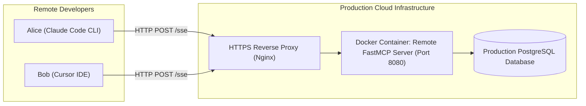

# Building & Deploying Production Remote MCP Servers

<div className="video-card" style={{border: '1px solid #30363d', borderRadius: '8px', padding: '16px', marginBottom: '24px', background: 'rgba(56, 139, 253, 0.05)'}}>
  <div style={{display: 'flex', gap: '16px', flexWrap: 'wrap', alignItems: 'center'}}>
    <div><strong>Curators:</strong> Nitish Singh (CampusX)</div>
    <div><strong>Module:</strong> Module 5: Model Context Protocol (MCP) & Claude Code</div>
    <div><strong>Focus:</strong> Beginner to Production</div>
  </div>
</div>

## 🎯 What You'll Learn
- Understand why multi-tenant teams require remote centralized MCP servers instead of local desktop processes.
- Configure FastMCP to serve over Server-Sent Events (`transport='sse'`).
- Containerize and deploy a remote MCP server with Docker.

---

## 💡 Concept & Architecture

Local `stdio` MCP servers run on a single engineer's laptop. 

In an enterprise organization, multiple engineers and autonomous agents need to access shared infrastructure (like a centralized corporate database, enterprise Jira, or internal vector search).

A **Remote MCP Server**:
- Runs on a centralized cloud server (AWS, GCP, Kubernetes) or Docker container.
- Listens on an HTTP port (e.g. port `8080`).
- Uses **Server-Sent Events (SSE)** to stream real-time JSON-RPC notifications and tool results back to remote clients.

### System Architecture & Data Flow



---

## 💻 Step-by-Step Code Walkthrough

Below is the complete implementation broken down into digestible parts so you can understand every line.

### Part 1: Step 1: Running FastMCP with SSE Transport

```python
from mcp.server.fastmcp import FastMCP

# Initialize remote server
remote_mcp = FastMCP("Corporate Knowledge MCP Service")

@remote_mcp.tool()
def query_employee_directory(department: str) -> list:
    """Search internal employee directory by department."""
    # In production: query corporate directory database
    return [
        {"name": "Alice Chen", "role": "Principal Architect", "dept": department},
        {"name": "David Miller", "role": "DevOps Lead", "dept": department}
    ]

if __name__ == "__main__":
    # Run over SSE transport bound to port 8080
    print("Starting Remote MCP Server on http://0.0.0.0:8080/sse")
    remote_mcp.run(transport="sse", host="0.0.0.0", port=8080)
```

#### 🔍 In-Depth Explanation:
Setting `transport='sse'` launches an HTTP web server that handles SSE streaming connections from remote clients.

### Part 2: Step 2: Containerizing the Remote MCP Server with Docker

```python
# Dockerfile for Remote MCP Server
# FROM python:3.11-slim
# WORKDIR /app
# RUN pip install --no-cache-dir "mcp[cli]"
# COPY remote_server.py .
# EXPOSE 8080
# CMD ["python3", "remote_server.py"]

# Build and run the container:
# docker build -t corporate-mcp:latest .
# docker run -d -p 8080:8080 --name mcp-prod corporate-mcp:latest
```

#### 🔍 In-Depth Explanation:
Containerizing the server ensures reproducible deployments on AWS ECS, Kubernetes, or any cloud provider.

---

## ⚠️ Beginner Tips & Best Practices

:::tip Configure Authentication on Remote Endpoints
Never expose a remote MCP server to the public internet without an API gateway enforcing Bearer token authentication.
:::

:::warning Enable CORS for Web Clients
If web-based AI clients connect to your remote MCP server, ensure proper CORS headers are enabled on the HTTP endpoint.
:::

---

## 📝 Key Takeaways & Summary

- Remote MCP servers enable team-wide sharing of centralized enterprise tools.
- The SSE transport streams JSON-RPC over standard HTTP connections.
- Containerization makes deploying remote MCP servers standard and repeatable.

