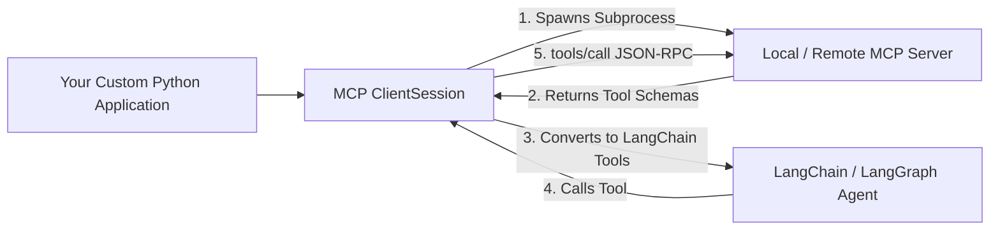

# Building Custom MCP Clients & Connecting LLMs

<div className="video-card" style={{border: '1px solid #30363d', borderRadius: '8px', padding: '16px', marginBottom: '24px', background: 'rgba(56, 139, 253, 0.05)'}}>
  <div style={{display: 'flex', gap: '16px', flexWrap: 'wrap', alignItems: 'center'}}>
    <div><strong>Curators:</strong> Nitish Singh (CampusX)</div>
    <div><strong>Module:</strong> Module 5: Model Context Protocol (MCP) & Claude Code</div>
    <div><strong>Focus:</strong> Beginner to Production</div>
  </div>
</div>

## 🎯 What You'll Learn
- Understand the responsibilities of an MCP Client (session management, transport, tool routing).
- Connect to a local stdio MCP server using Python's `ClientSession`.
- Convert MCP tool schemas into LangChain tools for autonomous agent execution.

---

## 💡 Concept & Architecture

While Claude Desktop and Claude Code are pre-built MCP clients, you will often want to build **your own custom MCP client**:
- You have an internal LangGraph agent and want it to connect to any public MCP server.
- You are building a custom company web chat application that needs to query local developer tools.

An **MCP Client**:
1. Spawns or connects to the server process via transport (`stdio` or `sse`).
2. Performs the `initialize` handshake.
3. Calls `tools/list` to fetch all available tools and their JSON schemas.
4. Translates those schemas into callable tools for foundation models.

### System Architecture & Data Flow



---

## 💻 Step-by-Step Code Walkthrough

Below is the complete implementation broken down into digestible parts so you can understand every line.

### Part 1: Step 1: Implementing a Basic Python MCP Client

```python
import asyncio
from mcp import ClientSession, StdioServerParameters
from mcp.client.stdio import stdio_client

async def run_mcp_client():
    # 1. Define how to launch the target MCP server subprocess
    server_params = StdioServerParameters(
        command="python3",
        args=["math_server.py"],
        env=None
    )
    
    # 2. Establish connection over stdio
    async with stdio_client(server_params) as (read_stream, write_stream):
        async with ClientSession(read_stream, write_stream) as session:
            # 3. Perform initialization handshake
            await session.initialize()
            print("[CLIENT]: Successfully connected to MCP server!")
            
            # 4. Discover available tools
            tools_response = await session.list_tools()
            print(f"[CLIENT]: Discovered {len(tools_response.tools)} tools:")
            for t in tools_response.tools:
                print(f" - {t.name}: {t.description}")
                
            # 5. Call a tool
            result = await session.call_tool(
                "calculate_system_latency",
                arguments={"network_ms": 25.0, "db_ms": 10.0, "llm_ms": 450.0}
            )
            print("[CLIENT]: Execution Result:", result.content)

# asyncio.run(run_mcp_client())
print("Custom MCP client blueprint ready.")
```

#### 🔍 In-Depth Explanation:
This demonstrates the complete client lifecycle: spawning the process, handshaking, discovering tools, and executing `call_tool`.

---

## ⚠️ Beginner Tips & Best Practices

:::tip Use langchain-mcp-adapters
LangChain provides the official `langchain-mcp-adapters` package that automatically converts an MCP `ClientSession` directly into standard LangChain `Tool` objects with one function call.
:::

:::warning Handle Subprocess Crashes
If a local MCP server crashes, the stdio pipe breaks. Implement automatic reconnect logic in production clients.
:::

---

## 📝 Key Takeaways & Summary

- MCP clients manage the connection lifecycle and tool discovery.
- ClientSession translates high-level function calls into JSON-RPC messages.
- Custom clients allow integrating the growing MCP ecosystem into your own proprietary AI applications.

