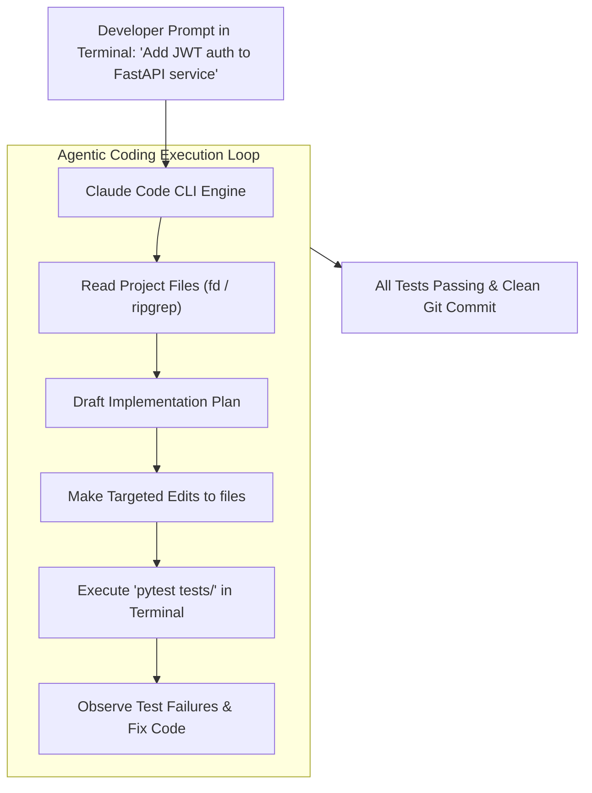

# Getting Started with Claude Code: Architecture, Installation & Auth

<div className="video-card" style={{border: '1px solid #30363d', borderRadius: '8px', padding: '16px', marginBottom: '24px', background: 'rgba(56, 139, 253, 0.05)'}}>
  <div style={{display: 'flex', gap: '16px', flexWrap: 'wrap', alignItems: 'center'}}>
    <div><strong>Curators:</strong> Unified Masterclass (CampusX & Krish Naik)</div>
    <div><strong>Module:</strong> Module 5: Model Context Protocol (MCP) & Claude Code</div>
    <div><strong>Focus:</strong> Beginner to Production</div>
  </div>
</div>

## 🎯 What You'll Learn
- Understand why agentic CLI tools are replacing traditional browser and autocomplete coding assistants.
- Install the official `@anthropic-ai/claude-code` CLI using Node.js.
- Authenticate via the Anthropic Console and configure local permissions.

---

## 💡 Concept & Architecture

Traditional AI coding tools (like GitHub Copilot autocomplete or browser chat windows) suffer from a severe limitation: **lack of agency**.
- You copy code from your IDE into a browser.
- The model suggests changes.
- You manually paste the changes back, run tests, see errors, copy errors back, and repeat.

**Claude Code** is an autonomous **Agentic Terminal Assistant**:
- Runs natively in your terminal where your code, Git, and compiler live.
- It can read your entire codebase, search files, execute Bash commands, edit files directly, run test suites, and fix errors autonomously!

### System Architecture & Data Flow



---

## 💻 Step-by-Step Code Walkthrough

Below is the complete implementation broken down into digestible parts so you can understand every line.

### Part 1: Step 1: Installing Claude Code Globally via npm

```python
# Ensure Node.js version 18+ is installed on your machine
node --version

# Install Claude Code globally
npm install -g @anthropic-ai/claude-code

# Verify installation
claude --version
```

#### 🔍 In-Depth Explanation:
Installs the official Claude Code binary into your system PATH.

### Part 2: Step 2: Launching and Authenticating

```python
# Navigate to your project directory
cd /path/to/my-ai-project

# Launch Claude Code
claude

# On first launch:
# 1. Claude Code opens your default browser for Anthropic Console OAuth login.
# 2. Grant permissions and copy the authentication token back to the CLI.
# 3. Choose your default theme and approval settings.
```

#### 🔍 In-Depth Explanation:
Authentication links your CLI session to your Anthropic billing account. Once authenticated, token credentials are stored securely in `~/.claude/`.

---

## ⚠️ Beginner Tips & Best Practices

:::tip Always Run in Project Root
Always launch `claude` from the root directory of your git repository. This allows Claude Code to read `.git`, project configs, and architecture guidelines.
:::

:::warning Use Dedicated API Keys
If running in headless CI/CD environments, supply an `ANTHROPIC_API_KEY` environment variable directly instead of interactive browser OAuth.
:::

---

## 📝 Key Takeaways & Summary

- Claude Code is an autonomous agentic terminal tool designed for real-world software engineering.
- It lives in the terminal alongside Git, compilers, and test runners.
- Global installation via npm provides instant terminal access across all projects.

