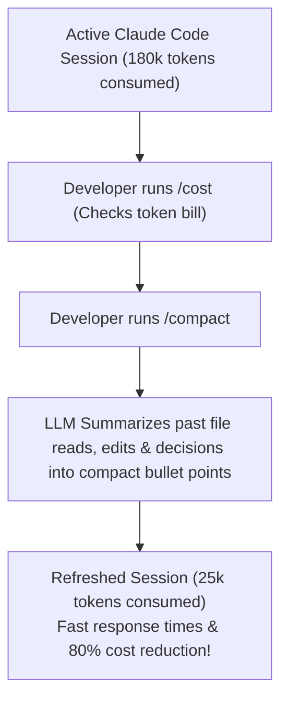

# Interactive Coding Workflow, Slash Commands & Context Management

<div className="video-card" style={{border: '1px solid #30363d', borderRadius: '8px', padding: '16px', marginBottom: '24px', background: 'rgba(56, 139, 253, 0.05)'}}>
  <div style={{display: 'flex', gap: '16px', flexWrap: 'wrap', alignItems: 'center'}}>
    <div><strong>Curators:</strong> Unified Masterclass (CampusX & Krish Naik)</div>
    <div><strong>Module:</strong> Module 5: Model Context Protocol (MCP) & Claude Code</div>
    <div><strong>Focus:</strong> Beginner to Production</div>
  </div>
</div>

## 🎯 What You'll Learn
- Master essential built-in slash commands: `/compact`, `/cost`, `/clear`, `/init`.
- Understand context token consumption during long coding sessions.
- Use `/compact` to summarize history and keep conversations fast and cost-efficient.

---

## 💡 Concept & Architecture

Claude Code interactions are managed via an interactive Read-Eval-Print Loop (REPL). 

As you ask Claude to inspect files, edit code, and run tests, the conversation history grows. Because every previous turn is re-sent on subsequent prompts, a session that lasts for 2 hours can consume millions of context tokens!

**Built-In Slash Commands** provide session control:
- `/cost`: Inspect real-time token expenditure and dollar costs for the current session.
- `/compact`: Summarize previous conversation turns into a dense brief, freeing up 80%+ of the context window!
- `/clear`: Wipe the conversation history entirely for a brand-new task.
- `/init`: Scan the codebase and generate an initial `CLAUDE.md` architecture guide.

### System Architecture & Data Flow



---

## 💻 Step-by-Step Code Walkthrough

Below is the complete implementation broken down into digestible parts so you can understand every line.

### Part 1: Step 1: Useful Slash Commands Reference Table

```python
# Common slash commands executed inside the Claude Code REPL:

# /help       -> View full list of commands and keyboard shortcuts
# /cost       -> View token counts and session cost breakdown
# /compact    -> Compress conversation history to preserve context budget
# /clear      -> Reset session memory completely
# /review     -> Request a code review of uncommitted git changes
# /terminal   -> Run a direct bash command in an isolated subshell
# /pr         -> Draft and open a GitHub Pull Request from current branch
```

#### 🔍 In-Depth Explanation:
Slash commands control the internal state of the CLI without sending instructions to the foundation model.

---

## ⚠️ Beginner Tips & Best Practices

:::tip Compact Every 15-20 Turns
Get into the habit of running `/compact` regularly. It keeps the model focused on your current objective and prevents attention degradation.
:::

:::warning Clear Context When Switching Tasks
If you finish fixing a bug in authentication and move to redesigning the database schema, run `/clear`. Stale authentication context will only distract the model.
:::

---

## 📝 Key Takeaways & Summary

- Slash commands provide terminal-level session and memory control.
- `/cost` tracks token usage in real time.
- `/compact` and `/clear` prevent context window degradation.

