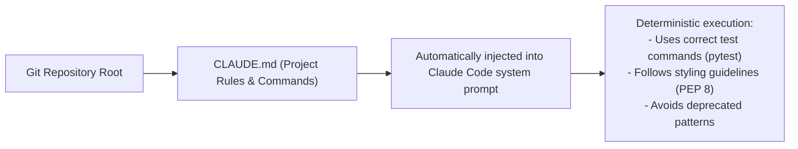

# Spec-Driven Development & Configuring CLAUDE.md

<div className="video-card" style={{border: '1px solid #30363d', borderRadius: '8px', padding: '16px', marginBottom: '24px', background: 'rgba(56, 139, 253, 0.05)'}}>
  <div style={{display: 'flex', gap: '16px', flexWrap: 'wrap', alignItems: 'center'}}>
    <div><strong>Curators:</strong> Nitish Singh (CampusX)</div>
    <div><strong>Module:</strong> Module 5: Model Context Protocol (MCP) & Claude Code</div>
    <div><strong>Focus:</strong> Beginner to Production</div>
  </div>
</div>

## 🎯 What You'll Learn
- Understand why 'vibe coding' produces unmaintainable spaghetti code in production.
- Master Spec-Driven Development: defining schemas, interfaces, and test criteria before writing code.
- Write an authoritative `CLAUDE.md` file that guides Claude Code's architectural decisions.

---

## 💡 Concept & Architecture

**'Vibe Coding'** is when a developer vaguely types: *'Make me a shopping cart service'* and accepts whatever code the model hallucinates without review. This leads to broken dependencies, missing error handlers, and security holes.

**Spec-Driven Development** is the professional approach:
1. Define the exact API specification (Pydantic schemas, endpoints).
2. Define the test criteria (e.g. `pytest tests/test_cart.py`).
3. Define project boundaries in **`CLAUDE.md`**.

### The Power of CLAUDE.md
`CLAUDE.md` is the most important file in a Claude Code project:
- Claude Code automatically reads `CLAUDE.md` into memory at the start of **every single conversation**.
- It tells Claude what package managers to use, how to run tests, formatting conventions, and what architectural patterns are forbidden.

### System Architecture & Data Flow



---

## 💻 Step-by-Step Code Walkthrough

Below is the complete implementation broken down into digestible parts so you can understand every line.

### Part 1: Step 1: Writing a Production-Grade CLAUDE.md

```python
# CLAUDE.md - Project Guidelines for AI Engineering Hub

## 🛠️ Build & Test Commands
- Install dependencies: `pip install -r requirements.txt`
- Run test suite: `pytest tests/ -v`
- Run linting: `ruff check .`
- Format code: `black .`
- Start dev server: `uvicorn main:app --reload --port 8000`

## 📐 Architecture & Coding Standards
- **Framework:** FastAPI with Python 3.11+ type hints.
- **Data Validation:** All request and response payloads MUST use Pydantic v2 `BaseModel`.
- **Async Execution:** Use `async def` for I/O-bound endpoints; standard `def` for heavy CPU inference.
- **Error Handling:** Always raise `HTTPException` with explicit status codes. Never return raw 500 error strings.
- **Docker:** All Dockerfiles must use `python:3.11-slim` with layer caching for `requirements.txt`.

## 🚫 Strictly Forbidden
- NEVER install legacy `langchain.chains` or `langchain.llms`.
- NEVER hardcode secrets or API keys; always load from `.env`.
- NEVER commit without running `pytest` first.
```

#### 🔍 In-Depth Explanation:
This markdown document acts as an immutable set of instructions for the AI assistant, guaranteeing consistency across sessions and team members.

---

## ⚠️ Beginner Tips & Best Practices

:::tip Keep CLAUDE.md Concise
Don't write a 50-page manual in `CLAUDE.md`. Keep it to 50-100 lines of actionable bullet points, commands, and rules to preserve context budget.
:::

:::warning Commit CLAUDE.md to Git
Always commit `CLAUDE.md` into your git repository so every developer on your team shares the exact same AI configuration.
:::

---

## 📝 Key Takeaways & Summary

- Spec-Driven Development establishes clear contracts before writing code.
- `CLAUDE.md` is automatically loaded by Claude Code on every turn.
- Documenting test commands and style guides ensures reliable AI-generated code.

