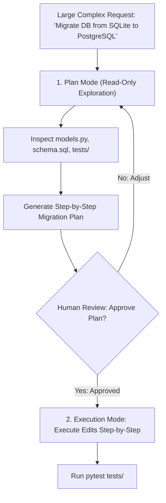

# Plan Mode & Extending Claude Code with Custom Skills

<div className="video-card" style={{border: '1px solid #30363d', borderRadius: '8px', padding: '16px', marginBottom: '24px', background: 'rgba(56, 139, 253, 0.05)'}}>
  <div style={{display: 'flex', gap: '16px', flexWrap: 'wrap', alignItems: 'center'}}>
    <div><strong>Curators:</strong> Nitish Singh (CampusX)</div>
    <div><strong>Module:</strong> Module 5: Model Context Protocol (MCP) & Claude Code</div>
    <div><strong>Focus:</strong> Beginner to Production</div>
  </div>
</div>

## 🎯 What You'll Learn
- Master Plan Mode to enforce 'Think Before You Code' on multi-file refactors.
- Understand how custom Skills extend Claude Code's capabilities with specialized scripts and prompts.
- Write a production `SKILL.md` file following the open standard.

---

## 💡 Concept & Architecture

When tasked with a massive architectural refactor (e.g. *'Migrate this entire application from Flask to FastAPI'*), an AI agent that immediately starts modifying files will break things.

### 1. Plan Mode (Shift + Tab)
Pressing **Shift + Tab** toggles Claude Code into **Plan Mode**:
- In Plan Mode, Claude Code is **read-only**: it is strictly forbidden from editing files or making git commits.
- It explores the codebase, traces dependencies, maps files, and produces an architectural implementation plan.
- Only after you review and approve the plan does Claude switch to execution mode.

### 2. Custom Skills (SKILL.md)
A **Skill** is a modular folder containing:
- `SKILL.md`: Frontmatter with name, description, and detailed procedural instructions.
- `scripts/`: Optional helper Python/Bash scripts that the agent can execute.
When a user asks a task matching the skill description, Claude Code automatically activates that skill!

### System Architecture & Data Flow



---

## 💻 Step-by-Step Code Walkthrough

Below is the complete implementation broken down into digestible parts so you can understand every line.

### Part 1: Step 1: Writing a Custom SKILL.md

```python
# In .claude/skills/deploy-fastapi/SKILL.md:
# ---
# name: deploy-fastapi
# description: Expert skill for containerizing and deploying FastAPI applications with Docker and health checks.
# ---
#
# # FastAPI Deployment Procedure
# When this skill is activated:
# 1. Verify that `requirements.txt` contains `uvicorn[standard]` and `pydantic`.
# 2. Check that `main.py` defines a `/health` endpoint returning `{"status": "healthy"}`.
# 3. Create a production `Dockerfile` utilizing `python:3.11-slim` with multi-layer caching.
# 4. Create a `.dockerignore` file excluding `venv/` and `.env`.
# 5. Build and test the container locally using: `docker build -t test-app .`
```

#### 🔍 In-Depth Explanation:
When you say: 'Help me deploy this FastAPI app with Docker', Claude Code recognizes the intent, activates `deploy-fastapi`, and follows the exact procedure.

---

## ⚠️ Beginner Tips & Best Practices

:::tip Always Plan Before Refactoring
For any task touching more than 3 files, always use Plan Mode first. Reviewing a 20-line plan takes 30 seconds and saves hours of debugging incorrect edits.
:::

:::warning Keep Skill Descriptions Specific
The agent selects skills based on the `description` in YAML frontmatter. Make the description precise so it triggers only when relevant.
:::

---

## 📝 Key Takeaways & Summary

- Plan Mode enforces read-only architectural planning before making code changes.
- Custom Skills (`SKILL.md`) standardize complex multi-step procedures.
- Skills can bundle helper scripts and templates to automate specialized tasks.

