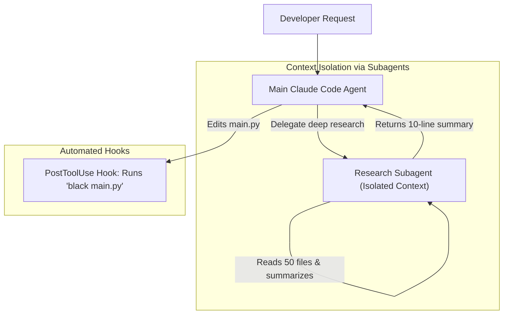

# Advanced Claude Code: Custom Subagents, Hooks & Plugins

<div className="video-card" style={{border: '1px solid #30363d', borderRadius: '8px', padding: '16px', marginBottom: '24px', background: 'rgba(56, 139, 253, 0.05)'}}>
  <div style={{display: 'flex', gap: '16px', flexWrap: 'wrap', alignItems: 'center'}}>
    <div><strong>Curators:</strong> Unified Masterclass (CampusX & Krish Naik)</div>
    <div><strong>Module:</strong> Module 5: Model Context Protocol (MCP) & Claude Code</div>
    <div><strong>Focus:</strong> Beginner to Production</div>
  </div>
</div>

## 🎯 What You'll Learn
- Understand how Subagents solve context token bloat by delegating deep research into isolated contexts.
- Configure lifecycle Hooks (`PreToolUse`, `PostToolUse`) to run formatters and linters automatically.
- Extend capabilities using modular Plugins.

---

## 💡 Concept & Architecture

As projects scale, two major challenges arise:
1. **Context Bloat:** Reading 40 documentation files fills the context window and slows down the main assistant.
2. **Deterministic Quality Control:** Forgetting to run a code linter or test suite before committing code.

Claude Code provides advanced enterprise primitives:
- **Custom Subagents:** The primary agent spawns an isolated child subagent (e.g. `ResearchSubagent`). The subagent reads 50 files in its own sandbox, summarizes the findings into 1 paragraph, and reports back. The main agent's context remains clean!
- **Lifecycle Hooks:** Shell commands triggered automatically at specific events (e.g. run `ruff check --fix` automatically after every file edit).
- **Plugins:** Bundles of skills, commands, and hooks distributed to teams.

### System Architecture & Data Flow



---

## 💻 Step-by-Step Code Walkthrough

Below is the complete implementation broken down into digestible parts so you can understand every line.

### Part 1: Step 1: Configuring an Automated PostToolUse Hook

```python
# In .claude/hooks.json (Runs automatically after file modifications)
# {
#   "hooks": [
#     {
#       "event": "PostToolUse",
#       "tool": "FileEdit",
#       "command": "black {file} && ruff check --fix {file}",
#       "description": "Automatically format Python code and fix lint errors after every edit."
#     }
#   ]
# }
```

#### 🔍 In-Depth Explanation:
Every time Claude Code finishes modifying a Python file, this hook automatically formats it with `black` and fixes linting issues with `ruff` before you even look at the file.

### Part 2: Step 2: Defining a Custom Subagent in Python / Markdown

```python
# Subagent definition blueprint
subagent_definition = {
    "name": "codebase-auditor",
    "role": "Security and Performance Auditor",
    "prompt": """You are an expert security auditor.
Analyze the target files for:
1. Hardcoded credentials, tokens, or private keys.
2. SQL injection vulnerabilities.
3. Unvalidated user inputs.
Report ONLY high-priority risks with line numbers.""",
    "tools": ["view_file", "grep_search", "find_by_name"] # Read-only tools!
}

print("Subagent 'codebase-auditor' configured with read-only sandbox permissions.")
```

#### 🔍 In-Depth Explanation:
The subagent is restricted to read-only tools, guaranteeing it cannot make unauthorized changes while performing deep audits.

---

## ⚠️ Beginner Tips & Best Practices

:::tip Use Subagents for Massive Code Searches
Whenever you need to inspect dozens of files or analyze git history across 100 commits, delegate to a subagent to keep your main conversation fast and focused.
:::

:::warning Keep Hooks Fast
Hooks execute synchronously. Ensure commands run in under 2 seconds (e.g. linting a single file) rather than running an entire 5-minute integration test suite on every edit.
:::

---

## 📝 Key Takeaways & Summary

- Subagents isolate heavy research tasks, preserving main agent context and reducing token costs.
- Lifecycle Hooks enforce automated formatting, linting, and safety checks on every tool action.
- Plugins allow distributing standardized workflows and rules across entire engineering teams.

