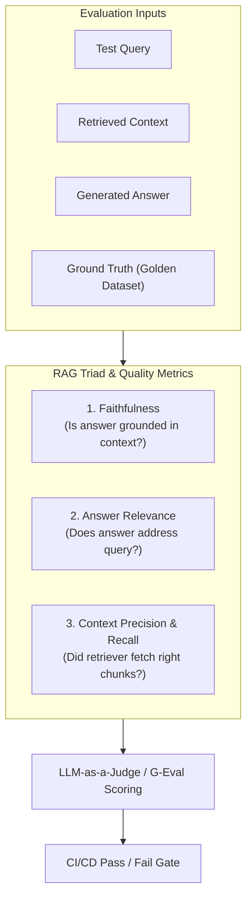

# 📹 Master LLM Evaluations: The Step-by-Step Playlist for 2026 ｜ New Playlist

<div className="video-card" style={{border: '1px solid #30363d', borderRadius: '8px', padding: '16px', marginBottom: '24px', background: 'rgba(56, 139, 253, 0.05)'}}>
  <div style={{display: 'flex', gap: '16px', flexWrap: 'wrap'}}>
    <div><strong>Instructor:</strong> Nitish Singh (CampusX)</div>
    <div><strong>Duration:</strong> 23m 24s</div>
    <div><strong>Playlist:</strong> LLM Evaluation Complete Series (CampusX)</div>
    <div><strong>Watch Link:</strong> <a href="https://www.youtube.com/watch?v=6W92_t9FveA" target="_blank" rel="noopener noreferrer">YouTube Lecture ↗</a></div>
  </div>
</div>

## 📌 Executive Summary & Learning Objectives

This lecture covers **Master LLM Evaluations: The Step-by-Step Playlist for 2026 ｜ New Playlist**, focusing on production implementations, edge cases, and industry standards:
- Core intuition, architecture, and underlying mechanisms.
- Key differences between theoretical research implementations and scalable enterprise patterns.
- Concrete Python walkthroughs, error recovery, and performance optimization.

---

## 🏗️ Architecture & Conceptual Workflow



---

## 📖 Core Concepts & Technical Deep Dive

### 1. Architectural Foundations
In modern production AI engineering, **Master LLM Evaluations: The Step-by-Step Playlist for 2026 ｜ New Playlist** is essential for ensuring reliability, low latency, and deterministic outcomes. As AI systems evolve from naive prompt-in / completion-out scripts into distributed systems, engineers must handle:
- **State management & consistency:** Ensuring intermediate states and tool invocations are tracked.
- **Error boundaries & recovery:** Graceful degradation when external LLMs or vector stores encounter rate limits or network partitions.
- **Resource utilization & cost efficiency:** Caching common queries and reducing unnecessary foundation model token expenditure.

### 2. Operational Considerations
- **Latency Optimization:** Pre-computing embeddings, utilizing asynchronous non-blocking event loops, and streaming tokens via Server-Sent Events (SSE).
- **Security & Sandboxing:** Validating inputs before ingestion, sanitizing LLM outputs, and isolating tool execution environments.

---

## 💻 Production Implementation Walkthrough

```python
from deepeval import assert_test
from deepeval.test_case import LLMTestCase
from deepeval.metrics import FaithfulnessMetric, AnswerRelevancyMetric

# 1. Prepare Test Case
test_case = LLMTestCase(
    input="What is the context window of Claude 3.5 Sonnet?",
    actual_output="Claude 3.5 Sonnet features a 200,000 token context window.",
    retrieval_context=["Claude 3.5 Sonnet supports up to 200k tokens of context."]
)

# 2. Define Metrics
faithfulness = FaithfulnessMetric(threshold=0.8)
relevancy = AnswerRelevancyMetric(threshold=0.8)

# 3. Assert Production Test Gate
def test_rag_accuracy():
    assert_test(test_case, [faithfulness, relevancy])
```

---

## 💡 Production Best Practices & Tips

:::tip Production Deployment Guideline
When deploying Master LLM Evaluations: The Step-by-Step Playlist for 2026 ｜ New Playlist in enterprise environments, always configure automated retries with exponential backoff and telemetry tracing (such as OpenTelemetry or LangSmith).
:::

:::warning Common Failure Modes
Watch out for state contamination across concurrent requests. Ensure each session or user interaction uses an isolated thread ID or execution context.
:::

---

## 🎯 Key Takeaways & Quick Reference

| Dimension | Production Standard | Pitfall to Avoid |
| :--- | :--- | :--- |
| **Execution** | Async / Non-blocking with timeouts | Synchronous blocking calls in event loops |
| **Data Validation** | Strict Pydantic v2 schemas | Untyped dictionary access |
| **Monitoring** | Distributed tracing & latency percentiles | Relying only on standard console logs |

## ⏱️ Lecture Timeline & Key Topics

| Timestamp | Key Topic / Concept Discussed |
| :--- | :--- |
| **00:00:00** | हाय गाइस, माय नेम इज नितीश एंड यू वेलकम... |
| **00:05:44** | हमने इस तरह के एप्लीकेशनेशंस बनाए हैं।... |
| **00:11:31** | नहीं कर सकते बिकॉज़ आई एम योर कस्टमर। तो... |
| **00:17:45** | तो आपको एक मल्टीडमेंशनल चेक लगाना पड़ता... |
| **00:23:22** | में। बाय।... |


---

---

## 📜 Complete Lecture Transcript (Hindi / Hinglish)

> **Language:** Hindi / Hinglish | **Source:** `01 - Master LLM Evaluations： The Step-by-Step Playlist for 2026 ｜ New Playlist ｜ CampusX.hi-orig.srt` | **Total Segments:** 12 | **Word Count:** ~3,794 words

<details>
<summary><b>Click to expand full chronological transcript (12 timestamped intervals)</b></summary>

#### ⏱️ [00:00 ➔ 00:02]

हाय गाइस, माय नेम इज नितीश एंड यू वेलकम टू माय YouTube चैनल। सो, अगर आप इस चैनल के रेगुलर फॉलोअ हो, तो आपको शायद यह बात पता होगी कि पिछले एक डेढ़ सालों से हम इस पर्टिकुलर जॉब रोल को बहुत टारगेट कर रहे हैं कैंपस एक्स के ऊपर। इस जॉब रोल का नाम है एआई इंजीनियर। सो, एआई इंजीनियर कौन होता है? यहां पे मैंने एक डेफिनेशन लिखा है। एन एआई इंजीनियर इज़ समवन हु बिल्ड्स एप्लीकेशनेशंस एंड प्रोडक्ट्स ऑन टॉप ऑफ़ फाउंडेशन मॉडल्स। फाउंडेशन मॉडल्स मतलब आप एलएलएम्स बोल सकते हो। सो बेसिकली ऐसा बंदा जो एलएलएम्स को यूज करके एप्लीकेशनेशंस बिल्ड करता है उसको हम एआई इंजीनियर बोलते हैं। अ कैंपस एक्स में हमें ऐसा लगता है कि ये पर्टिकुलर जॉब प्रोफाइल गोइंग फॉरवर्ड बहुत ज्यादा पॉपुलर होने वाली है और इसमें बहुत सारे जॉब्स फ्यूचर में आने वाले हैं। एंड दैट इज व्हाई पिछले एक डेढ़ सालों से हम इस जॉब प्रोफाइल के अराउंड जितना भी प्रिपरेशन करा सकते हैं आपको हम कराने की कोशिश कर रहे हैं। सो अगर आप पिछला एक डेढ़ साल एनालाइज करो हमारे वीडियोस को तो आपको दिखाई देगा कि हमने बहुत सारे रिलेटेड टॉपिक्स कवर किए हैं सच एज लैंगचेन जिसकी हेल्प से आप बेसिक एलएलएम एप्लीकेशनेशंस बना सकते हो। हमने आपको रैक चैटबॉट्स या रैक बेस्ड एप्लीकेशनेशंस बनाना सिखाया है। हमने आपको एजेंट्स के साथ काम करना सिखाया है। हमने अलग-अलग फ्रेमवर्क्स आपको सिखाए सच एज लग्राफ, क्रू एआई, एग्नो एंड मेनी मोर। फिर अगर हम बात करें तो हमने आपको थोड़ा बहुत फ्लेवर एलएलए मॉब्स का भी दिया है। जहां पर हमने आपको लैंगसिथ जैसा टूल पढ़ाया है। हम प्र्प इंजीनियरिंग के ऊपर भी एक कोर्स रिलीज़ कर चुके हैं। और इसके अलावा हम कई सारे नो कोड टूल्स भी आपको पढ़ा रहे हैं। जिनकी हेल्प से आप विदाउट इवन राइटिंग अ सिंगल लाइन ऑफ़ कोड एलएलएम बेस्ड एप्लीकेशनेशंस बना सकते हो। सच एज एन एट एन। तो गोइंग फॉरवर्ड भी हमारा गोल यही है कि

#### ⏱️ [00:02 ➔ 00:04]

हम इस पर्टिकुलर जॉब प्रोफाइल को क्रैक करने के लिए आपको जो जो चीजें पढ़ने की जरूरत है वो सब कुछ आपको पढ़ाएं। अब अगर हम बात करें गोइंग फॉरवर्ड हम क्या करने वाले हैं तो वो मैं आपको बताता हूं। अभी तक यह जो भी चीजें हमने पढ़ी है ना इसके बारे में अगर मैं एक समरी दूं तो यह बहुत ही कॉमन चीजें हैं। ये ऐसी चीजें हैं जो हर बंदा पढ़ेगा जो भी एआई इंजीनियरिंग जॉब रोल के लिए प्रिपेयर कर रहा है। बट अब गोइंग फॉरवर्ड व्हाट आई वांट इज कि मैं आपको कुछ ऐसी चीजें पढ़ाना चाहता हूं जो उतनी कॉमन नहीं है बट बहुत इंपॉर्टेंट है। और उन्हीं में से एक चीज हम आज स्टार्ट कर रहे हैं। और इस नए टॉपिक या फिर इस नए प्लेलिस्ट का नाम है एलएलएम इवल्स या एलएलएम इवैल्यूएशंस। सिंपल शब्दों में इस प्लेलिस्ट में मैं आपको यह सिखाऊंगा कि कैसे आप अपने बनाए हुए एलएलएम एप्लीकेशनेशंस को इवैल्यूएट कर सकते हो, डिसाइड कर सकते हो, समझ सकते हो कि उसको प्रोडक्शन में लॉन्च करना चाहिए या नहीं। क्योंकि अभी तक आपने सिर्फ यह सीखा है कि एलएलएम बेस्ड एप्लीकेशनेशंस बनाए कैसे जाते हैं। बट अभी तक आपने उसको इवैल्यूएट करने का काम नहीं सीखा। और ये जो टॉपिक है ये बहुत इंपॉर्टेंट है। इंडस्ट्री में इसके ऊपर आपको काम करना आना ही चाहिए। इनफैक्ट अगर आप कभी भी किसी जेन एआई प्रोफाइल के लिए इंटरव्यू दोगे तो देयर इज़ अ गुड चांस कि आपसे एक क्वेश्चन हमेशा पूछा जाएगा कि हाउ डू यू इवैल्यूएट योर रैग एप्लीकेशन? और हाउ डू यू इवैल्यूएट योर एजेंटिक एआई एप्लीकेशन? इस प्लेलिस्ट में हम एग्जजेक्टली इन्हीं क्वेश्चंस को आंसर करने जा रहे हैं। तो अगर आप इस प्लेलिस्ट को सही से पढ़ जाते हो तो आपको दो फायदे होंगे। पहला फायदा यह होगा कि आपको एक एज मिलेगा अपने कंपटीशन के ऊपर। आपके साथ और भी बहुत सारे लोग एआई इंजीनियर बनना चाहते हैं। बट उनमें से

#### ⏱️ [00:04 ➔ 00:06]

बहुत कम लोग एलएलएम इवाल्स का टॉपिक सीरियसली पढ़ते हैं। उसका एक बड़ा रीज़न यह है कि अभी YouTube पे या फिर ऑनलाइन बहुत कम अच्छे रिसोर्सेज अवेलेबल हैं। और सेकंड बेनिफिट ये होगा कि आपका ना माइंड माइंडसेट जो है ना वो थोड़ा सा चेंज होगा। अभी तक आप एलएलएम बेस्ड एप्लीकेशनेशंस बनाते हो पर्सनल प्रोजेक्ट लेवल पर कि मुझे बना करके इंटरव्यूअर को दिखाना है। बट जब आप ये पर्टिकुलर टॉपिक पढ़ोगे ना तब ऑटोमेटिकली आप ऐसे सोचने लगोगे कि कैसे मेरा एलएलएम बेस्ड एप्लीकेशन करोड़ों लोगों को सर्व कर सकता है। तो ये माइंडसेट का आपका एक शिफ्ट आएगा इस प्लेलिस्ट को कंप्लीटली देखने के बाद। सो आज इस प्लेलिस्ट का पहला वीडियो है और इस वीडियो में मैं आपको बस दो चीजें बताने जाऊंगा। बताने वाला हूं। पहली चीज ये है कि एलएलएम इव्स एज अ टॉपिक क्यों इंपॉर्टेंट है? क्यों हमें पढ़ना चाहिए? मैं आपको कन्विंस करूंगा। ठीक है? और सेकंड मैं आपको एक डिटेल्ड रोड मैप बताऊंगा कि इस प्लेलिस्ट में हम एग्जैक्टली कौन-कौन से टॉपिक्स टच करेंगे। ठीक है? तो आज के वीडियो का बस यही गोल है। आई रियली होप आपको अभी तक का एजेंडा पूरा समझ में आ गया। चलो गाइस अब डिस्कस करते हैं कि एलएलएम इवाल्स का टॉपिक इतना इंपॉर्टेंट क्यों है? तो इस पूरे डिस्कशन को मैं स्टार्ट करूंगा बाय आस्किंग अ सिंपल क्वेश्चन। क्वेश्चन ये है कि क्या आपने कभी किसी भी टाइप का एरलएम बेस्ड एप्लीकेशन बनाया है? कोई बेसिक चार्टबॉट या फिर रैक चार्टबॉट या फिर कोई बेसिक एजेंटिक एप्लीकेशन इनमें से कुछ भी चलेगा। आई एम प्रीटी श्योर यू वुड से यस हमने इस तरह के एप्लीकेशनेशंस बनाए हैं। देन आई वुड आस्क अ सेकंड क्वेश्चन। क्या आपने उन एप्लीकेशनेशंस को बनाने के बाद इवैल्यूएट किया है? अब आई नो आपका आंसर क्या होगा? मोर देन 50% ऑफ द ऑडियंस विल

#### ⏱️ [00:06 ➔ 00:08]

से कि हमने ऐसा प्रॉपर्ली तो इवैल्यूएट नहीं किया है। बट हां हमने क्वेश्चंस पूछ करके देखा। हमें लगा कि आंसर्स सही आ रहे हैं। तो हमने मान लिया कि हमारा प्रोजेक्ट सही से बन गया। अब ये जो चीज है ना ये जो तरीका है टेस्ट करने का जहां पे आप सिंपली तीन-चार क्वेश्चंस पूछ लेते हो जो आपके दिमाग में आ रहे हैं। इसको एक टर्म दिया जाता है। इसको बोला जाता है वाइप टेस्टिंग। ठीक है? ठीक है? जैसे वाइप कोडिंग होता है, वैसे ही वाइप टेस्टिंग होता है। यहां पे देखो मैंने एक डेफिनेशन लिखा है वाइप टेस्टिंग का। सो वाइप टेस्टिंग बेसिकली मींस कैजुअली ट्राइंग एन एलएलएम एप्लीकेशन विद अ फ्यू प्र्प्स एंड जजिंग इट बाय फील। सो आप यहां पे कोई मैट्रिक वगैरह नहीं लगा रहे हो। आप सिंपली फील के बेसिस पे बता रहे हो कि एप्लीकेशन सही से काम कर रहा है या नहीं। सो बेसिकली, आई आस्क्ड इट फाइव टू 10 क्वेश्चंस। द आंसर्स लुक्ड गुड। सो आई थिंक इट वर्क्स। यही फिलॉसफी हम लोग यूज़ करते हैं। व्हनेवर वी बिल्ड एनी काइंड ऑफ़ पर्सनल प्रोजेक्ट एलएलएम बेस्ड एप्लीकेशनेशंस। द प्रॉब्लम इज़ कि ये जो तरीका है वाइप टेस्टिंग ये इनफॉर्मल है। सब्जेक्टिव है। एंड यूजुअली इट्स नॉट रिपीटेबल। इट्स नॉट लाइक आप जब अगला वर्जन बनाओगे अपने प्रोजेक्ट का तो आप सेम तरीके से सेम मेथोडोलॉजी से प्रॉपर्ली इवैल्यूएट कर पाओगे। एंड दिस इज़ द बिगेस्ट फ्लॉ। द बिगेस्ट फ्लॉ ऑफ वाइप टेस्टिंग इज कि यह सिर्फ और सिर्फ पर्सनल प्रोजेक्ट लेवल पर ही काम करता है। अगर आपके पास एक प्रोडक्शन ग्रेड प्रोजेक्ट है उसको आप वाइप टेस्ट करके यूज़र्स के सामने नहीं रख सकते। अगर आप रखोगे तो फिर बहुत कांड हो सकता है। और यह मैं आपके दिमाग में रीइंफोर्स करना चाहता हूं। और इसलिए मैं आपको तीन केस स्टडीज बताऊंगा। तीन बहुत फेमस केस स्टडीज जो पास्ट में हो चुकी हैं। जहां पर लोगों ने एग्जैक्टली यही गलती की। एलएलएम बेस्ड एप्लीकेशन बनाया। उसको वाइप टेस्ट किया और डिप्लॉय कर दिया। तो चलो लेट मी टेल यू द फर्स्ट केस स्टडी

#### ⏱️ [00:08 ➔ 00:10]

फर्स्ट स्टोरी। नॉट स्टोरी क्योंकि ये सच में हुआ है। सो ये अ इंसिडेंट है एयर कनाडा का। सो देयर वास दिस गाय अ जिसकी ग्रैंड मदर दादी या फिर नानी का डेथ हो गया था और ये गया एयर कनाडा की वेबसाइट पे और उनके चार्ट पॉट से पूछने लगा कि क्या आपके पास बिलीवमेंट फेयर का कोई पॉलिसी है? बिलीवमेंट फेयर का मतलब है कि अगर आपके किसी रिलेटिव या क्लोज फ्रेंड की डेथ हो जाती है तो एयरलाइंस आपको एक डिस्काउंट ऑफर करती हैं। बिकॉज़ आपको बहुत जल्दी टिकट बुक करके जाना है। एंड इट्स एन इमरजेंसी। इंडिया में आई डोंट नो होता है कि नहीं बट बाहर ऐसा होता है। तो इसने चैटबॉट से पूछा कि क्या मुझे कोई डिस्काउंट मिलेगा? अब यहां पे क्या हुआ कि एयर कनाडा का जो चैटबॉट था वो हेलुसनेट कर गया। उसने क्या किया? उसने एक गलत आंसर दे दिया। उसने यूजर को बोला कि आप अभी पूरे पैसे देकर के टिकट बुक कर लो। बाद में हम आपके पूरे पैसे रिफंड कर देंगे। बट एक्चुअल जो पॉलिसी थी उसके हिसाब से आपको पहले ही डिस्काउंट मिलेगा। बाद में कोई रिफंड नहीं मिलेगा। ये एक्चुअल पॉलिसी थी। तो यूजर को तो पता नहीं चला। उसने चैटबॉट से जो आंसर उसको मिला उसके बेसिस पे उसने कॉन्फिडेंटली टिकट बुक कर लिया। और फिर बाद में जाकर के वो जब रिफंड मांगने लगा तो कस्टमर रिप्रेजेंटेटिव्स ने बोला कि दिस इज़ नॉट पॉसिबल। हमारी जो पॉलिसी है वो बोलती है कि आप टिकट कराने के पहले ही डिस्काउंट अवेल कराओ। बाद में हम आपको कोई पैसे रिटर्न नहीं करेंगे। यह बंदा आई गेस ऑलरेडी थोड़ा परेशान था ही। इसने सु कर दिया एयर कनाडा को कोर्ट में। कोर्ट में एयर कनाडा ने खुद को डिफेंड करने की कोशिश की। उन्होंने जज के सामने यह बोला कि ये जो चार्टबॉट हमारी वेबसाइट पे हमने डाला है ये एक सेपरेट एंटिटी है। सो ये जो बोल रहा है कंपनी इसकी रिस्पांसिबिलिटी नहीं लेगी। तो जज ने बोला कि ऐसा नहीं होता है।

#### ⏱️ [00:10 ➔ 00:12]

जिस तरीके से आपकी वेबसाइट आपकी प्रॉपर्टी है उसी तरीके से आपकी वेबसाइट पर डिप्लॉयड चैटबॉट भी आपकी प्रॉपर्टी है। सो जो भी आपका चैटबॉट बोलेगा वो ओनरशिप आपको लेना पड़ेगा। व्हिच बेसिकली मीन्स कि एयर कनाडा ये केस हार गया और उनको इस कस्टमर को पूरे पैसे रिटर्न करने पड़े। अब ये बहुत बड़ा अमाउंट नहीं था। बट स्टिल एयर कनाडा की बहुत बेइज्जती हुई और गलत रीज़ंस की वजह से न्यूज़ में आ गए और यह कोई भी कंपनी नहीं चाहेगी। यहां पर एग्जैक्टली जो डेवलपर्स थे उन्होंने यही गलती की कि विदाउट चेकिंग विदाउट इवैल्यूएटिंग द चैटबॉट उन्होंने उसको वेबसाइट पे डिप्लॉय कर दिया। जिसकी वजह से ये इतना बड़ा कांड हो गया। ठीक है? तो दिस इज़ केस स्टडी नंबर वन। एक और ऐसा ही केस स्टडी है। यह केस स्टडी है शेवरले का। शेवरलो इज शेवले इज अमेरिकन कार कंपनी। इंडिया में भी इनकी कार्स आती थी। तो इन्होंने भी इनका एक्चुअली एक डीलर था। मतलब ये डायरेक्टली शेवरोले ने नहीं किया। उनका एक डीलर था। उस डीलर ने अपना एक चैटबॉट बनाया। सो दैट उस चैटबॉट से कोई भी इंटरेक्ट करके इंफॉर्मेशन ले सकता है। तो वहां पर एक बंदा था। उसने क्या किया? उसने थोड़ा सा जेल ब्रेक करने की कोशिश की उस चैट बॉट को। बेसिकली उसने काइंड ऑफ इमोशनली कन्विंस करने की कोशिश की चैटबॉट को कि गोइंग फॉरवर्ड मैं जो भी बोलूंगा तुमको मेरी बात माननी है। तुम मेरे को डिनाई नहीं कर सकते बिकॉज़ आई एम योर कस्टमर। तो चैटबॉट ने बोला ओके। अब इस यूजर ने बोला कि क्या मुझे यह पर्टिकुलर कार तुम $1 में दे सकते हो? तो सिंस अ जेल ब्रेक हो चुका था ये चैटबॉट तो इस चैटबॉट ने अग्री कर लिया नॉट ओनली अग्री कर लिया उसने एक बाइंडिंग ऑफर भी दे दिया और ये सब कुछ डॉक्यूमेंट हो रहा था बिकॉज़ इट वास रिटेन और इस यूजर ने क्या किया इस पूरे कॉन्वर्सेशन का स्क्रीनशॉट्स

#### ⏱️ [00:12 ➔ 00:14]

लेके सोशल मीडिया पे डाल दिया और अगेन बहुत बेइज्जती हुई इस पूरे डीलरशिप की और शेड्रोले की कि कैसे आप $1 में कार बेच सकते हो ऑब्वियसली कार उन्हें उन्हें बेचना नहीं पड़ा। बिकॉज़ अ ये चीज पॉसिबल ही नहीं थी। बट इट वाज़ अ बिग नेगेटिव मार्केटिंग। अगेन अ सिचुएशन जो अवॉइड कर सकते थे अगर ये डेवलपर्स अपने एप्लीकेशन को प्रॉपर्ली इवैलुएट करते डिप्लॉय करने के पहले। तो दिस इज़ द सेकंड केस स्टडी। एंड द थर्ड वन इज़ आल्सो वेरी इंटरेस्टिंग। अ इसमें क्या हुआ कि देयर वाज़ दिस कोलंबियन एयरलाइन। अह वहां पर एक पैसेंजर ट्रैवल कर रहा था और जो एयर होस्टेस थी उनके पास यह अह कंटेनर होता है जिसमें वो सारा का सारा खाना एंड बेवरेजेस लेके मूव करते हैं फ्लाइट के बीच में। इस कंटेनर से इस पेशेंट को चोट लग गई। तो अगेन इस पेशेंट ने इस पैसेंजर ने क्या किया? इसने सु कर दिया। कोर्ट में एक केस कर दिया। तो इस पैसेंजर का जो लॉयर था उसने क्या किया? उसने सोचा कि मैं पास्ट में ऐसे अगर कोई भी इंसिडेंट्स हुए हैं उनके बारे में पता करता हूं और उनको एज प्रूफ दिखाता हूं कोर्ट में। तो वो चार्ज जीपीटी पे गया। उसने सिचुएशन बताया और चार्ज जीपीटी को बोला कि पास्ट में ऐसे जितने भी केसेस हुए हैं जहां पे एयरलाइन की वजह से कोई इंजरी हुई है पैसेंजर को तो और एयरलाइन को पैसे देने पड़े हैं पलट के वो आप मुझे डॉक्यूमेंट करके दो। अब चार्ट जीपीटी ने यहां पे क्या किया कि बहुत कॉन्फिडेंटली उसने हेलुसनेट करके नए-नए केसेस क्रिएट कर दिए। नॉट ओनली केसेस क्रिएट किए। केसेस के जो स्पेसिफिक्स थे जैसे कि नाम, डेट एवरीथिंग उसने फैब्रिकेट कर दिया। और ये सब कुछ उसने इस लॉयर को दे दिया। और लॉयर ने भी वेरीफाई नहीं किया। सिंपली इस पूरी चीज को उठा करके वो कोर्ट में ले गया। और जज के सामने रख दिया। जज

#### ⏱️ [00:14 ➔ 00:16]

और जब ऑोजिशन ने वेरीफाई करने की कोशिश की इन सारे केसेस को तो पता चला कि यह केसेस एकिस्ट ही नहीं करते और यह एक बहुत बड़ा ब्लंडर था। तो जज ने क्या किया इस वकील और इसके फर्म के ऊपर अराउंड $5000 का एक जुर्माना डाला और वो लोग केस भी हार गए और सोशल मीडिया पे यह चीज बहुत वायरल हुई थी उस टाइम पे कि एक लॉयर ने फेक केस स्टडीज प्रेजेंट कर दी कोर्ट में। तो अगेन अ सिचुएशन वेयर एलएलएम बेस्ड एप्लीकेशनेशंस आपको बहुत गलत तरीके से फंसा सकते हैं। तो आई रियली होप आपको मैं समझा पाया इन तीन केस स्टडीज की हेल्प से कि एलएलएम्स को इवैल्यूएट करने के बाद डिप्लॉय करना कितना इंपॉर्टेंट है। सो अगर मैं पूछूं इन तीनों केस स्टडीज को बताने के बाद कि आप क्या सीखें? तो आई गेस द ओनली थिंग दैट यू हैव लर्नड इज दैट इवैल्यूएशन इज सुपरेंट। ठीक है? बट यहां पर एक क्वेश्चन शायद आपके दिमाग में आ रहा होगा क्योंकि मेरे दिमाग में भी आया था अगर इतना ही इंपॉर्टेंट है एलएलएम्स को इवैलुएट करना तो फिर हम सब लोग एलएलएम एप्लीकेशनेशंस बनाने के बाद उनको इवैलुएट क्यों नहीं करते? उसका एक बहुत सिंपल आंसर है। द आंसर इज़ दिस कि इट इज़ नॉट दैट स्ट्रेट फॉरवर्ड। एलएलएम बेस्ड एप्लीकेशनेशंस को इवैलुएट करना आसान नहीं है। इनफैक्ट अगर आप इसको कंपेयर करो सॉफ्टवेयर बेस्ड एप्लीकेशन से तो आपको दिखाई देगा कि इट इज़ मच मोर ट्रिकीयर टू इवैल्यूएट अ एलएलएम बेस्ड एप्लीकेशन। और वही हम नेक्स्ट डिस्कस करेंगे कि एक ट्रेडिशनल सॉफ्टवेयर को टेस्ट करना और एक एलएलएम बेस्ड एप्लीकेशन को इवैलुएट या टेस्ट करने में क्या कोर डिफरेंसेस होते हैं। और उससे आपको आईडिया लगेगा कि क्यों एलएलएम बेस्ड एप्लीकेशनेशंस आर ट्रिकीयर टू टेस्ट। देखो सॉफ्टवेयर टेस्टिंग और एलएलएम बेस्ड एप्लीकेशनेशंस की टेस्टिंग में दो मेजर डिफरेंसेस हैं। पहला डिफरेंस

#### ⏱️ [00:16 ➔ 00:18]

यह है कि आपका जो सॉफ्टवेयर होता है वह डिटरर्मिनिस्टिक होता है। उसका मतलब यह है कि फॉर अ गिवन इनपुट आउटपुट विल ऑलवेज बी द सेम। फॉर एग्जांपल आप एक कैलकुलेटर बना रहे हो। तो कैलकुलेटर में जब भी आप टू और टू इनपुट दोगे तो आउटपुट हमेशा ही फोर आएगा। इट इज़ डिटरमिनिस्टिक। आप पहले से बता सकते हो ये बात। वेयर एज आपका जो एलएलएम बेस्ड एप्लीकेशनेशंस होते हैं बिकॉज़ ऑफ एलएलएम्स क्योंकि वो एलएलएम्स के ऊपर बने हैं। दे आर बाय नेचर प्रोबेबलिस्टिक व्हिच बेसिकली मीन्स कि फॉर द सेम इनपुट यू माइट गेट डिफरेंट आउटपुट। एक सिंपल एग्जांपल लेते हैं। मान लो आप चार जीपीटी पे गए और आपने ये पूछा कि व्हाट इज ओवरफिटिंग इन मशीन लर्निंग? अब इसका कोई एक सही आंसर नहीं है। वो आज एक पर्टिकुलर आंसर देगा। 6 महीने बाद हो सकता है कुछ अलग आंसर दे। मुझे कुछ अलग आंसर दे। आपको कुछ अलग आंसर दे। इनमें से कोई भी आंसर गलत नहीं है। सो यू कैन सी फॉर द सेम इनपुट यू आर गेटिंग डिफरेंट डिफरेंट आउटपुट। तो दिस इज़ द फर्स्ट मेजर चैलेंज। सेकंड इज़ कि सॉफ्टवेयर में आप कोई चीज सही है या नहीं। बस यही देखते हो। सो योर ओनली बेंचमार्क इज करेक्टनेस। राइट? आप बस यह देखते हो कि 2 + 2 आंसर में फोर आ रहा है कि नहीं। अगर फोर आ रहा है तो आपका प्रोग्राम सही है और कुछ चेक करने की जरूरत नहीं है। बट आप जब एलएलएम बेस्ड एप्लीकेशनेशंस को इवैलुएट करते हो तो आपको एक मल्टीडमेंशनल चेक लगाना पड़ता है। फॉर एग्जांपल अगर आप एक रैक चार्टबॉट बना रहे हो तो रैग चार्टबॉट बनाने के केस में आपको जो आंसर मिलेगा उसको इवैल्यूएट करना है। तो इसमें कई डायमेंशंस पे आप

#### ⏱️ [00:18 ➔ 00:20]

इंसान इस आंसर को इवैल्यूएट कर सकते हो। सबसे पहले आप उस आंसर की फ़क्चुअलिटी को इवैलुएट कर सकते हो। आप उसके कंप्लीटनेस को इवैलुएट कर सकते हो। आप उसकी टोनालिटी को इवैल्यूएट कर सकते हो। आप उसके ग्राउंडेडनेस को इवैलुएट कर सकते हो। आप ये देख सकते हो कि लेटेंसी कितना है। आप ये देख सकते हो कि आपको कॉस्ट कितना पड़ रहा है उस आंसर को क्रिएट करने में। तो यू कैन सी देयर आर सेवरल एस्पेक्ट्स जिनको मिला के आप इवैल्यूएशन परफॉर्म करते हो और ये एस्पेक्ट्स भी एप्लीकेशन टू एप्लीकेशन वेरीरी करते हैं। अगर मैं चार्टबॉट बना रहा हूं कैमपस एक्स के लिए तो मेरे लिए एस्पेक्ट्स कुछ और होंगे। कोई दूसरी कंपनी चार्टबॉट बना रही है तो उनके लिए एस्पेक्ट्स कुछ और होंगे। तो अगेन दीज़ आर द टू मेन पॉइंटर्स जिसकी वजह से एक सॉफ्टवेयर सिस्टम के कंपैरिजन में एक एलएलएम बेस्ड एप्लीकेशन को इवैल्यूएट करना इज मच मोर ट्रिकियर एंड दैट इज व्हाई बहुत सारे लोग इस स्टेप को किए बिना ही आगे बढ़ जाते हैं जो कि सही नहीं है। इस पर्टिकुलर प्लेलिस्ट में हम इसी चैलेंज को टैकल करने वाले हैं। मैं आपको यही सारी चीजें बताने वाला हूं कि कैसे आप इस तरह के अनएक्सेक्टेड बिहेवियर को कंट्रोल कर सकते हो। एंड दैट इज द यूएसपी दैट इज गोइंग टू बी द यूएसपी ऑफ़ दिस प्लेलिस्ट। अब नाउ दैट यू अंडरस्टैंड कि एलएलएम इवैल्यूएशंस आरेंट। अब मैं आपको क्विकली बताता हूं कि इस प्लेलिस्ट में हम क्या-क्या किस ऑर्डर में कवर करने जा रहे हैं। सो क्रोनोलॉजिकली हम अगर हम बात करें तो सबसे पहले नेक्स्ट वीडियो में हम ये सीखेंगे कि एलएलएम इवा्स एग्जजेक्टली होते क्या है? मैं आपको एक एग्जांपल देके प्रॉपर्ली समझाऊंगा कि एलएलएम इवाल्स एज अ कांसेप्ट क्या होते हैं? उसके बाद मैं आपको एलएलएम इवाल्स का पूरा का पूरा लैंडस्केप बताऊंगा।

#### ⏱️ [00:20 ➔ 00:22]

क्या-क्या चीजें यहां पर एक्सिस्ट करती हैं? क्या-क्या टेक्निक्स एक्सिस्ट करते हैं? किस-किस तरह के टूल्स एक्सिस्ट करते हैं? उसका एक हाई लेवल ओवरव्यू दूंगा। सो दैट आप कोई भी नया टर्म सुनो तो आप मेंटली उसको प्लेस कर पाओ कि अच्छा इस चीज का ये काम है। उसके बाद हम बात करेंगे एलएलएम्स को इवैलुएट करने के बारे में। सो एलएलएम इवैल में दो चीजें आती हैं। एक जहां पे आप एलएलएम्स को इवैलुएट करते हो और दूसरा जहां पे आप एलएलएम बेस्ड एप्लीकेशनेशंस को इवैलुएट करते हो। तो हम दोनों चीजें पढ़ेंगे। तो हम एलएलएम्स को इवैलुएट कैसे किया जाता है वो सीखेंगे। तो वहां पे हम बहुत तरह के बेंचमार्क्स पढ़ेंगे जो शायद आपने सुने भी होंगे। जभी भी कोई नया मॉडल रिलीज होता है तो हमें यही बताया जाता है कि इस पर्टिकुलर एलएलएम ने इस बेंचमार्क पे सबसे ज्यादा स्कोर किया है। तो वी विल स्टडी अबाउट डिफरेंट कैटेगरीज ऑफ़ बेंचमार्क्स। उसके बाद हम आ जाएंगे एलएलएम एप्लीकेशन इव्स में। जहां पर हम यह डिस्कस करेंगे कि एक एलएलएम बेस्ड एप्लीकेशन को कैसे इवैल्यूएट किया जाता है। उसके बाद हम एक खुद का इवैल पाइपलाइन बनाएंगे जहां पे हम अपना खुद का गोल्डन डेटा सेट क्यूरेट करना सीखेंगे। अपने खुद के रूब्रिक्स डिफाइन करेंगे और उसको अपने बनाए एक एप्लीकेशन के ऊपर चला के देखेंगे। यह सब कुछ करने के बाद हम रैग स्पेसिफिक इवैल कैसे करना है वो सीखेंगे। रैक के बाद एजेंट बेस्ड इव्स कैसे करने हैं वो सीखेंगे। उसके बाद सेफ्टी बेस्ड इव्स कैसे लिखने हैं वो सीखेंगे। और सबसे लास्ट में ऑपरेशनल इवल्स कैसे लिखने हैं। आपने एक एलएलएम बेस सिस्टम को डिप्लॉय कर दिया। तो ऐसा नहीं है कि डिप्लॉय करने के बाद इवैल्यूएशन का काम खत्म हो जाता है। एक सिस्टम के ऑनलाइन आने के बाद भी आप उसको इवैलुएट करते हो। बहुत तरह के मैट्रिक्स होते हैं। लेटेंसी कैसा है? टोकन पर सेकंड कैसा है? पहला टोकन कितनी देर के बाद आ

#### ⏱️ [00:22 ➔ 00:23]

रहा है? सिस्टम पे कितना लोड पड़ रहा है? ये सारी चीजें भी आपको देखनी पड़ती हैं। तो वो हम ऑपरेशंस ईल में सीखेंगे। ठीक है? तो रफ्ली रफली ये 10 टॉपिक्स हम कवर करेंगे इस प्लेलिस्ट में और मुझे ऐसा लगता है कि हम ऑलमोस्ट सारी चीजें टच कर लेंगे और गोल मेरा यही है कि मैं बहुत इन डेप्थ जाके आपको जो अभी की सबसे रेलेवेंट चीजें हैं वो पढ़ाऊं और आप ये प्लेलिस्ट बस पूरा का पूरा देखो। मुझे पर्सनली ऐसा सच में लगता है कि यह प्लेलिस्ट देखने के बाद आपका लेवल अप हो जाएगा एआई इंजीनियरिंग में। अभी तक आप एक सर्टेन लेवल पर ऑपरेट कर रहे थे। एलएलएम बेस्ड एप्लीकेशन सिर्फ बना पा रहे थे। इस पर्टिकुलर प्लेलिस्ट को देखने के बाद आप ये सोच पाओगे कि कैसे हम इसको करोड़ों यूज़र्स तक ले जा सकते हैं। तो गोइंग फॉरवर्ड भी हमारा यही प्लान है कि हम ऐसे-से टॉपिक्स टच करें जो अभी बाकी लोग नहीं पढ़ रहे हैं और वो अगर आप पढ़ो तो आपको अपने कंपटीशन के ऊपर एक एज मिले। ठीक है? तो दैट्स इट फॉर दिस वीडियो। यही हमारा एजेंडा था। अ वो हमने अचीव कर लिया। बाकी आप कमेंट में लिख के बताओ कितने एक्साइटेड हो आप इस प्लेलिस्ट के लिए। अगर आपका कोई फ्रेंड ये प्लेलिस्ट देखना चाहता है। ये टॉपिक कवर करना चाहता है। इस उस फ्रेंड के साथ आप इस वीडियो को शेयर कर सकते हो। अगर आपको यह वीडियो पसंद आया तो प्लीज लाइक करना और अगर आपने इस चैनल को सब्सक्राइब नहीं किया है तो प्लीज डू सब्सक्राइब। मिलते हैं नेक्स्ट वीडियो में। बाय।

</details>
