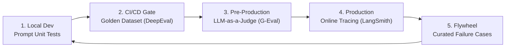

# 📹 Master LLM Evaluations: The Step-by-Step Playlist for 2026

<div className="video-card" style={{border: '1px solid #30363d', borderRadius: '8px', padding: '16px', marginBottom: '24px', background: 'rgba(56, 139, 253, 0.05)'}}>
  <div style={{display: 'flex', gap: '16px', flexWrap: 'wrap'}}>
    <div><strong>Instructor:</strong> Nitish Singh (CampusX)</div>
    <div><strong>Duration:</strong> 1404</div>
    <div><strong>Course:</strong> Module 6: LLM Evaluation & Observability</div>
    <div><strong>Watch Link:</strong> <a href="https://www.youtube.com/watch?v=6W92_t9FveA" target="_blank" rel="noopener noreferrer">YouTube Lecture ↗</a></div>
  </div>
</div>

## 📌 Executive Summary

Building production LLM applications requires shifting from subjective human "vibe checks" to rigorous, deterministic evaluation pipelines. In 2026, evaluation is not an afterthought—it is the core engineering discipline that governs prompts, model upgrades, and deployment gates.

This roadmap covers the complete evaluation taxonomy: unit testing prompts, golden datasets, LLM-as-a-judge methodologies, the RAG Triad, automated CI/CD eval gates, and production runtime observability.

---

## 🏗️ System Architecture & Execution Flow



---

## 📖 Core Concepts & Technical Deep Dive

### 1. The Vibe Check Trap
Early-stage prototyping relies on engineers informally testing 3-5 queries in a playground. This fails in production because:
- Language models have stochastic token generation distributions.
- Subtle prompt changes fix one edge case while breaking ten others (prompt regression).
- No quantitative baseline exists to justify migrating between model versions (e.g. GPT-4o to Claude 3.5 Sonnet).

### 2. The Multi-Tiered Evaluation Hierarchy
- **Level 1 - Deterministic Rule Evals:** Exact string matches, regex schema compliance, JSON validation, and latency/token budgets.
- **Level 2 - Embedding & Semantic Similarity:** Cosine distance between predicted and reference outputs using cross-encoder models.
- **Level 3 - LLM-as-a-Judge:** Specialized evaluation prompts querying high-intelligence models to assess reasoning, nuance, and groundedness.
- **Level 4 - Human-in-the-Loop Review:** Expert human annotation on flagged low-confidence or high-impact samples.

---

## 💻 Production Implementation

```python
from deepeval import assert_test
from deepeval.test_case import LLMTestCase
from deepeval.metrics import AnswerRelevancyMetric

# 1. Define test case with query and generated answer
test_case = LLMTestCase(
    input="How do I configure checkpointers in LangGraph?",
    actual_output="Use MemorySaver or SqliteSaver passed to graph.compile(checkpointer=...).",
    expected_output="Instantiate a checkpointer like SqliteSaver and compile the graph with it."
)

# 2. Configure metric with strict threshold
metric = AnswerRelevancyMetric(threshold=0.7)

# 3. Assert test for automated CI/CD pipeline
assert_test(test_case, [metric])
print(f"Test Passed! Metric score: {metric.score}, Reason: {metric.reason}")
```

---

## ⚙️ Production Gotchas & Best Practices

:::tip Automated Regression Gates
Integrate evaluation suites into GitHub Actions. Block any PR from merging if evaluation scores drop below defined thresholds (e.g. Faithfulness &lt; 0.90).
:::

:::warning Cost Control in Evaluation
Running multi-thousand-sample golden datasets through GPT-4o for every commit is cost-prohibitive. Use tiered testing: fast regex/small models on PRs, comprehensive G-Eval suites nightly.
:::

---

## 📊 Architectural Reference & Comparison

| Eval Tier | Tooling | Execution Speed | Cost per Run | Primary Purpose |
| :--- | :--- | :--- | :--- | :--- |
| **Unit Evals** | PyTest, Pydantic | Sub-second | $0.00 | Syntax, schema, regex sanity |
| **Semantic Evals** | DeepEval, SentenceTransformers | Seconds | $0.001 | Semantic similarity, cosine recall |
| **LLM-as-a-Judge** | G-Eval, Ragas | Minutes | $0.50 - $5.00 | Reasoning, faithfulness, tone |
| **Online Evals** | LangSmith, OpenTelemetry | Real-time | Continuous | Production drift, latency, user thumbs |

---

## 📚 Key Takeaways & Enterprise Checklist

- [ ] **Architecture Verification:** Ensure your design addresses latency, decoupled interfaces, and strict data validation contracts.
- [ ] **Deterministic Testing:** Run unit tests and golden dataset evaluations before shipping changes to staging or production.
- [ ] **Security & Observability:** Enforce input/output guardrails, scrub sensitive credentials/PII, and capture distributed traces.
- [ ] **Scalability & Sizing:** Calibrate model parameters, context limits, and compute instance requirements against projected request concurrency.
