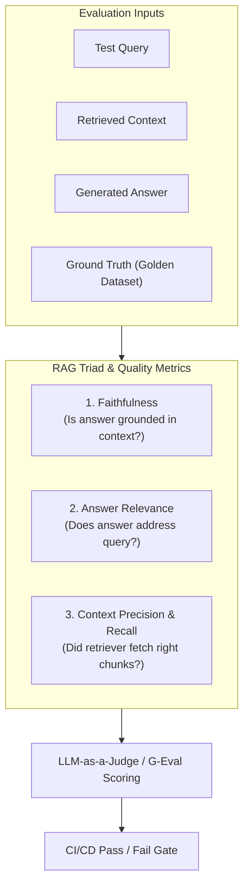

# 📹 Introduction to LLM Evaluations – Model Evals vs Application Evals

<div className="video-card" style={{border: '1px solid #30363d', borderRadius: '8px', padding: '16px', marginBottom: '24px', background: 'rgba(56, 139, 253, 0.05)'}}>
  <div style={{display: 'flex', gap: '16px', flexWrap: 'wrap'}}>
    <div><strong>Instructor:</strong> Nitish Singh (CampusX)</div>
    <div><strong>Duration:</strong> 24m 32s</div>
    <div><strong>Playlist:</strong> LLM Evaluation Complete Series (CampusX)</div>
    <div><strong>Watch Link:</strong> <a href="https://www.youtube.com/watch?v=cNF_MO82Qew" target="_blank" rel="noopener noreferrer">YouTube Lecture ↗</a></div>
  </div>
</div>

## 📌 Executive Summary & Learning Objectives

This lecture covers **Introduction to LLM Evaluations – Model Evals vs Application Evals**, focusing on production implementations, edge cases, and industry standards:
- Core intuition, architecture, and underlying mechanisms.
- Key differences between theoretical research implementations and scalable enterprise patterns.
- Concrete Python walkthroughs, error recovery, and performance optimization.

---

## 🏗️ Architecture & Conceptual Workflow



---

## 📖 Core Concepts & Technical Deep Dive

### 1. Architectural Foundations
In modern production AI engineering, **Introduction to LLM Evaluations – Model Evals vs Application Evals** is essential for ensuring reliability, low latency, and deterministic outcomes. As AI systems evolve from naive prompt-in / completion-out scripts into distributed systems, engineers must handle:
- **State management & consistency:** Ensuring intermediate states and tool invocations are tracked.
- **Error boundaries & recovery:** Graceful degradation when external LLMs or vector stores encounter rate limits or network partitions.
- **Resource utilization & cost efficiency:** Caching common queries and reducing unnecessary foundation model token expenditure.

### 2. Operational Considerations
- **Latency Optimization:** Pre-computing embeddings, utilizing asynchronous non-blocking event loops, and streaming tokens via Server-Sent Events (SSE).
- **Security & Sandboxing:** Validating inputs before ingestion, sanitizing LLM outputs, and isolating tool execution environments.

---

## 💻 Production Implementation Walkthrough

```python
from deepeval import assert_test
from deepeval.test_case import LLMTestCase
from deepeval.metrics import FaithfulnessMetric, AnswerRelevancyMetric

# 1. Prepare Test Case
test_case = LLMTestCase(
    input="What is the context window of Claude 3.5 Sonnet?",
    actual_output="Claude 3.5 Sonnet features a 200,000 token context window.",
    retrieval_context=["Claude 3.5 Sonnet supports up to 200k tokens of context."]
)

# 2. Define Metrics
faithfulness = FaithfulnessMetric(threshold=0.8)
relevancy = AnswerRelevancyMetric(threshold=0.8)

# 3. Assert Production Test Gate
def test_rag_accuracy():
    assert_test(test_case, [faithfulness, relevancy])
```

---

## 💡 Production Best Practices & Tips

:::tip Production Deployment Guideline
When deploying Introduction to LLM Evaluations – Model Evals vs Application Evals in enterprise environments, always configure automated retries with exponential backoff and telemetry tracing (such as OpenTelemetry or LangSmith).
:::

:::warning Common Failure Modes
Watch out for state contamination across concurrent requests. Ensure each session or user interaction uses an isolated thread ID or execution context.
:::

---

## 🎯 Key Takeaways & Quick Reference

| Dimension | Production Standard | Pitfall to Avoid |
| :--- | :--- | :--- |
| **Execution** | Async / Non-blocking with timeouts | Synchronous blocking calls in event loops |
| **Data Validation** | Strict Pydantic v2 schemas | Untyped dictionary access |
| **Monitoring** | Distributed tracing & latency percentiles | Relying only on standard console logs |

## ⏱️ Lecture Timeline & Key Topics

| Timestamp | Key Topic / Concept Discussed |
| :--- | :--- |
| **00:00:00** | तो अब नाउ दैट वी अंडरस्टैंड कि एलएलएम... |
| **00:06:20** | बाद कौन-कौन से टूल्स हम यूज़ कर हैं। लेट... |
| **00:12:29** | नहीं? जनरल नॉलेज है कि नहीं? राइट?... |
| **00:18:43** | एप्लीकेशनेशंस बनाते हो, यू वुड रियलाइज़... |
| **00:24:28** | मॉडल इवल के पर्सेक्टिव से नहीं पढ़ा रहा।... |


---

---

## 📜 Complete Lecture Transcript (Hindi / Hinglish)

> **Language:** Hindi / Hinglish | **Source:** `02 - Introduction to LLM Evaluations – Model Evals vs Application Evals ｜ CampusX.hi.srt` | **Total Segments:** 13 | **Word Count:** ~4,215 words

<details>
<summary><b>Click to expand full chronological transcript (13 timestamped intervals)</b></summary>

#### ⏱️ [00:00 ➔ 00:02]

तो अब नाउ दैट वी अंडरस्टैंड कि एलएलएम इवैल्यूएशंस की जरूरत क्यों है? क्यों इंपॉर्टेंट है वो? और कैसे एलएलएम इवैल्यूएशंस आर डिफरेंट फ्रॉम सॉफ्टवेयर टेस्टिंग। नाउ लेट्स मूव ऑन टू द मेन टॉपिक ऑफ द डे कि एलएलएम इवैल्व्स होते क्या है? अभी तक हमने ये बात डिस्कस नहीं की। मतलब ऊपर ऊपर से की है। बट थोड़ा डिटेल में पढ़ते हैं। ठीक है? तो यहां पर मैंने एक डेफिनेशन लिखा है। आई विल फर्स्ट रीड द डेफिनेशन एंड देन वी विल डिस्कस द पॉइंट। सो एलएलएम इवेल्स को हम ऐसे डिफाइन कर सकते हैं दैट एलएलएम इवेल्स आर सिस्टमैटिक रिपीटेबल टेस्ट्स यूज्ड टू जज एन एलएलएम और एलएलएम पावर्ड सिस्टम अगेंस्ट अ क्लियर क्राइटेरिया। ठीक है? बेसिकली एलएलएम इवैल्यूएशंस आर टेस्ट्स जो हम अप्लाई करते हैं एलएलएम्स के ऊपर भी या फिर एलएलएम बेस्ड एप्लीकेशनेशंस के ऊपर भी और इसके तीन मेन एस्पेक्ट्स होते हैं। पहला ये कि दीज़ टेस्ट्स आर सिस्टमैटिक। सेकंड दीज़ टेस्ट्स आर रिपीटेबल एंड दीज़ टेस्ट्स हैव वेरी क्लियर क्राइटेरिया। ये तीनों बहुत इंपॉर्टेंट पॉइंटर्स हैं। बहुत इंपॉर्टेंट कैरेक्टरिस्टिक्स हैं एलएलएम ईवेल्स की। एक बार इनको समझते हैं। सबसे पहले बात करते हैं सिस्टेटिक। सिस्टमैटिक का मतलब ये हुआ कि आप यहां पे वाइप टेस्टिंग नहीं कर रहे। आपके दिमाग में पांच क्वेश्चंस आए। आपने पूछा आंसर मिला। आपको लगा हां सब सही है। ऐसा नहीं होता। यहां पे व्हाट यू डू इज़ यू क्रिएट प्रॉपर डेटा सेट्स। और उन डेटा सेट्स में आप हर तरह का एज केस कवर करने की कोशिश करते हो। सो दैट आप प्रॉपर्ली टेस्ट कर पाओ अपने चैटबॉट को या अपने एल एलएम बेस्ड सिस्टम को। ठीक है? फॉर एग्जांपल अगर मैं कैमपस X का चैटबॉट बना रहा हूं तो व्हाट आई विल डू इज़ कि मैं रैंडमली 100 रियल

#### ⏱️ [00:02 ➔ 00:04]

यूज़र्स क्या चैट कर रहे हैं मेरे सिस्टम के साथ उसको उठाऊंगा और उस चैट का एक डेटाबेस बनाऊंगा। एक डेटा सेट बनाऊंगा और उस डेटा सेट के ऊपर मैं टेस्टिंग करूंगा। सो दैट मुझे एकदम रियल वर्ल्ड अ जो अ बिहेवियर है मेरे चार्टबॉट का वो देखने को मिले। ठीक है? तो फर्स्ट इट इज सिस्टेटिक। सेकंड इट इज रिपीटेबल। रिपीटेबल का मतलब ये है कि कल को अगर आप अपने सिस्टम में प्र्ट चेंज कर दो, मॉडल चेंज कर दो, रिट्रीवर चेंज कर दो, चंकिंग स्ट्रेटजी चेंज कर दो। ये सारी चीजें चेंज कर दो। उसके बावजूद भी आप अपने सिस्टम को बिल्कुल वैसे ही इवैल्यूएट कर पाओ जैसे आप पहले कर पा रहे थे। तो दिस इज अगेन वनेंट आईडिया दैट एलएलएम इवल्स शुड बी रिपीटेबल। आपके पास जो डेटा सेट है उसको आप किसी भी वर्जन ऑफ द सॉफ्टवेयर पे बिल्कुल वैसे ही अप्लाई कर पाओ और रिजल्ट्स एक्सट्रैक्ट कर पाओ। ये बहुत जरूरी है। और इसी से आप कंपेयर कर पाते हो कि वर्जन वन बेटर है या वर्जन टू बेटर है। बिकॉज़ आपके पास एक टेस्ट डेटा सेट है। वर्जन वन ने उस पे कितना परफॉर्मेंस दिया, वर्जन टू ने उसके ऊपर कितना परफॉर्मेंस दिया। उससे हमें समझ में आता है कि सिस्टम इंप्रूव कर रहा है या नहीं। ठीक है? है तो इट इज़ रिपीटेबल। थर्ड सबसे इंपॉर्टेंट चीज कि एलएलएम इवैल्यूएशंस इस बात पे डिपेंड करते हैं कि आप किस क्राइटेरिया के बेसिस पे इवैल्यूएशन करना चाहते हो। राइट? फॉर एग्जांपल अगर मैं कैंपस एक्स का चैटबॉट बना रहा हूं तो बहुत सारे क्राइटेरियाज़ होंगे जिनके बेसिस पे मैं इवैल्यूएशन करना चाहूंगा। फर्स्ट ऑब्वियसली जो आंसर निकल के आ रहा है वो करेक्ट होना चाहिए। सेकंड आंसर सिंपल एक्सप्लेनेशन से भरा होना चाहिए। थर्ड जो भी एक्सप्लेनेशन आ रहा है वह हमारे ही कोर्स कंटेंट से आना चाहिए। फोर्थ सेफ होना चाहिए। उसमें कुछ ऐसी बातें नहीं होनी चाहिए जो अनसेफ हैं या फिर गालियां लिखी हुई हैं या डराने का टोन है। ये सब नहीं होना चाहिए। तो आप क्या करोगे? आप इस तरह का क्राइटेरिया डिफाइन करोगे टू

#### ⏱️ [00:04 ➔ 00:06]

इवैलुएट द चैट बॉट। ठीक है? विदाउट क्राइटेरिया आप जस्ट वाइप टेस्टिंग करते हो। विद क्राइटेरिया आप प्रॉपर इवैल्यूएशन करते हो। ठीक है? सो नटशेल में अभी मैंने बहुत थ्योरिटिकल लेवल पे आपको समझाया है। बट डोंट वरी थोड़ी देर बाद हम एक प्रॉपर एग्जांपल के थ्रू समझेंगे ये पूरा का पूरा वर्क फ्लो। बट अभी इस पॉइंट पे इफ आई वुड लाइक टू समराइज एलएलएम ईवेल्स आर बेसिकली टेस्ट्स जिनकी हेल्प से आप एलएलएम या फिर एलएलएम बेस्ड एप्लीकेशनेशंस को टेस्ट करते हो फॉर सम गिवन क्लियर क्राइटेरिया एंड यूजुअली दीज़ टेस्ट्स आर रिपीटेबल एंड वेरी वेरी सिस्टमैटिक यही हमने अभी तक पढ़ा। अब यहां पर एक और चीज मैं क्लेरिफाई करना चाहूंगा क्योंकि ये बहुत लोगों को डाउट रहता है। मुझे भी था जब मैं पहली बार सुन रहा था इस टॉपिक के बारे में। मुझे ऐसा लगता था कि इवल का मतलब होता है मैट्रिक। बिकॉज़ मैं मशीन लर्निंग डीप लर्निंग से आया था। तो वहां पर इवैल्यूएशन का क्या मतलब होता था? मैट्रिक। हम कोई बोलते थे कि भाई मशीन लर्निंग मॉडल्स को कैसे इवैलुएट करना है? तो क्या बात करते थे हम? अ हम बात करते थे एक्यूरेसी का, हम बात करते थे प्रसीजन का, रिकॉल का। दोज़ वर मैट्रिक्स। तो मेरे दिमाग में ये परसेप्शन था कि एलएलएम इवल्स भी सिंपली सेट ऑफ मैट्रिक्स होंगे जिनके बेसिस पे हम इवैल्यूएशन परफॉर्म करते हैं। बट ये सही नहीं है। यहां पर एकदम फर्स्ट लेक्चर में मैं आपको एक बात बताना चाहूंगा कि इवैल्यूएशन का मतलब एलएलएम इवल का मतलब इज नॉट जस्ट मैट्रिक। इट इज़ बेसिकली द कंप्लीट टेस्टिंग सेटअप। जो पूरा का पूरा सेटअप हम क्रिएट करते हैं एलएलएम्स को टेस्ट करने के लिए उस पूरे टेस्टिंग सेटअप को हम एलएलएम इव्स बुलाते हैं। ठीक है? सो हम किस चीज को इवैल्यूएट कर रहे हैं? मान लो अगर आपके पास एक रैक चैटबॉट है। हम उसके अंदर के रिट्रीवर को इवैलुएट करना चाहते हैं। तो रिट्रीवर जो कंपोनेंट है वो हमारे एलएलएम इवाल्स का पार्ट बन गया। हम किस क्राइटेरिया के बेसिस पर उसको इवैल्यूएट कर रहे हैं। उसका रिट्रीव रिट्रीवर का एक्यूरेसी कितना है? उसके

#### ⏱️ [00:06 ➔ 00:08]

बेसिस पर हम इवैलुएट कर रहे हैं। हमने जो डेटा सेट प्रिपेयर किया इवैलुएट करने के लिए वो भी एलएलएम इवाल्स के अंदर आता है। अ हम ये टेस्ट कब रन कर रहे हैं? ऑफलाइन रन कर रहे हैं या फिर प्रोडक्शन में डिप्लॉय होने के बाद रन कर रहे हैं? वो भी आपका अ इस सेटअप का पार्ट होता है। उसके बाद कौन-कौन से टूल्स हम यूज़ कर हैं। लेट से हम रागास यूज़ कर रहे हैं बिकॉज़ इट इज़ अ रैग एप्लीकेशन। तो ये टूल भी आपके एलएलएम इवल्स का पार्ट है। तो नटशेल में अगर मैं सिंपलीफाई करूं इस पूरे डिस्कशन को तो बस ये समझो कि जभी भी कोई आपको बोले एलएलएम इव्स होता क्या है? तो आपको ये बोलना है कि एलएलएम इवल्स का मतलब सिर्फ मैट्रिक नहीं। एलएलएम इव्स मतलब द एंटायर टेस्टिंग सेटअप। किस चीज को टेस्ट कर रहे हैं? किस चीज के बेसिस पे टेस्ट कर रहे हैं? कब टेस्ट कर रहे हैं? कौन सा टूल यूज़ करके टेस्ट कर रहे हैं? इन सबको मिला के हम एलएलएम ईल्स बुलाते हैं। इज दिस पॉइंट क्लियर? ये थोड़ा सा हो सकता है कंफ्यूजिंग आपको लगे। बट इज दिस पॉइंट क्लियर? कि एलएलएम ईल्स इज़ नॉट ओनली मैट्रिक। इट इज़ बेसिकली द एंटायर टेस्टिंग सेटअप। ठीक है? और एलएलएम इवल का गोल आपको एक स्कोर देना नहीं होता है। उसका गोल होता है कि वो आपको प्रैक्टिकल क्वेश्चंस का आंसर दे। कैसे क्वेश्चंस? यहां पे देखो लिखा हुआ है। कैन द मॉडल बी यूज्ड फॉर अ पर्टिकुलर टास्क एप्लीकेशन? इस क्वेश्चन का आंसर आपको मिलेगा जब आप एलएलएम्स का इवैल्यूएशन करोगे। इज दिस सिस्टम गुड इनफ टू शिप? क्या हम इसको प्रोडक्शन में डाल सकते हैं? इस क्वेश्चन का आपको आंसर मिलेगा जब आप एलएलएम्स का इवैलुएट करोगे। डिड प्र्प्ट वर्जन टू इंप्रूव ओवर प्र्प्ट वी1 इस क्वेश्चन का आंसर आप निकाल सकते हो प्र्प्स का इवैल्यूएशन करके इज द रैग आंसर ग्राउंडेड इन रिट्रीव्ड कॉन्टेक्स्ट इज द एजेंट कंप्लीटिंग द टास्क करेक्टली इज द चैटबॉट सेफ फॉर रियल यूज़र्स इज द लेटेंसी अंडर कंट्रोल इस तरह के क्वेश्चंस का आंसर

#### ⏱️ [00:08 ➔ 00:10]

आपको मिलता है जब आप एलएलएम्स को इवैल्यूएट करते हो एलएलएम इवाल्स इस तरह के क्वेश्चंस को आंसर करता है ठीक है तो नटशेल में काफी थ्योरी पढ़ी अभी भी बट डोंट वरी अ इवन इफ आपको उतना क्लिक नहीं किया इस पॉइंट पे थोड़ी देर बाद हम एक प्रैक्टिकल एग्जांपल के थ्रू इस पूरी चीज को रिवजिट करेंगे और सब कुछ इट विल मेक सेंस डोंट वरी। ठीक है? अब एलएलएम इव्स एक्सैक्टली काम कैसे करते हैं? ये डिस्कस करने के पहले एक बहुत इंपॉर्टेंट डिस्क डिस्टिंशन मैं आपको बताना चाहता हूं। ये डिस्टिंशन आपके दिमाग में क्लियर होना बहुत जरूरी है। इससे क्या होगा? आपको आगे जाके बहुत हेल्प मिलेगी। ठीक है? डिस्टिंशन क्या है कि आज की डेट में आप एलएलएम इवल्स को दो पार्ट्स में डिवाइड कर सकते हो। एक को हम बुलाते हैं मॉडल इवल्स और सेकंड को हम बुलाते हैं एप्लीकेशन ईवेल्स। मॉडल ईवेल्स वो इवेल्स होते हैं जिनकी हेल्प से हम एलएलएम्स को इवैल्यूएट करते हैं। और एप्लीकेशन ईवेल्स वो इवेल्स होते हैं जिनकी हेल्प से हम एलएलएम बेस्ड एप्लीकेशनेशंस को इवैल्यूएट करते हैं। यहां पे अगर आप जाओगे पिछले वाली स्लाइड में तो वहां पे देखो डेफिनेशन में लिखा हुआ था कि एलएलएम ई वेल्स यहां पे पढ़ना एक बारी। यहां क्या लिखा हुआ है? एलएलएम इवल्स आर सिस्टेटिक रिपीटेबल टेस्ट यूज्ड टू जज एन एलएलएम और एलएलएम पावर्ड सिस्टम्स दोनों यहां पे लिखे हुए हैं। एंड दैट इज व्हाई इस डेफिनेशन के बेसिस पे वी कैन से कि दो टाइप्स के एलएलएम इवैल्स होते हैं। एक को हम मॉडल इवाइल्स बुलाते हैं। सेकंड को हम एप्लीकेशन इवाइल्स बुलाते हैं। मॉडल इवाइल्स का काम होता है बहुत सिंपल। गिवन एलएलएम को इवैल्यूएट करना। और एप्लीकेशन इवल का काम होता है पूरे के पूरे एलएलएम बेस्ड एप्लीकेशन को इवैल्यूएट करना। और यह डिस्टिंक्शन शुरू में ही आपके दिमाग में अगर क्लियर हो जाए तो बहुत अच्छा है। यहां पे इनफैक्ट मैं आपको एक डिस्क्लेमर भी दूंगा।

#### ⏱️ [00:10 ➔ 00:12]

डिस्क्लेमर ये है कि ये जो टर्म्स यहां पे लिखे हुए हैं मॉडल इवल और एप्लीकेशन ईवेल ये ऑफिशियल टर्म्स नहीं है। ये मैंने क्रिएट किए हैं। क्यों क्रिएट किए हैं? बिकॉज़ मैं इस टॉपिक को आपके दिमाग में सिंपलीफाई करना चाहता हूं। तो कल को आप मुझे कोट मत करना कि मॉडल इवल एक टर्म होता है। एप्लीकेशन इवल एक टर्म होता है। अभी भी इंडस्ट्री में दोनों को मिला के एलएलएम इवल्स ही बोला जाता है। और फिर डिपेंडिंग ऑन द यूज़ केस ऑटोमेटिकली इंप्लसिटली लोग समझ जाते हैं कि मॉडल इवल की बात हो रही है या फिर एप्लीकेशन इवल की बात हो रही है। ठीक है? तो ये एक डिस्क्लेमर मैं आपको पहले से दे रहा हूं। अब एक काम करते हैं। एक बार दोनों टाइप के इवेल्स को थोड़ा डिटेल में समझने की कोशिश करते हैं कि दोनों इवेल्स एक्सैक्टली करते क्या हैं। पहले बात करते हैं मॉडल इवेल्स की। यहां पे एक डेफिनेशन लिखा हुआ है मॉडल इव्स इवैलुएट द मॉडल इटसेल्फ। सिंपल है। इनका काम होता है एलएलएम्स को ही इवैलुएट करना। द मेन आइडिया इज़ टू टेस्ट एंड इवैल्यूएट द कैपेबिलिटीज़ ऑफ अ मॉडल। इस तरह के इवेल्स का एक ही गोल होता है कि जब एक नया एलएलएम रिलीज होता है तो हम उस एलएलएम की क्या-क्या कैपेबिलिटीज हैं उसको टेस्ट करते हैं और बेंचमार्क करते हैं, डॉक्यूमेंट करते हैं। आपने शायद देखा भी होगा कोई भी नया एलएलएम जब रिलीज होता है तो ऐसे बोला जाता है कि एक पर्टिकुलर बेंचमार्क पे या एक पर्टिकुलर लीडर बोर्ड पे यह एलएलएम टॉप पे आया। इतनी एक्यूरेसी है। इतने परसेंटेज पे है। देखा है आपने यह? कभी भी नोटिस किया है? कभी भी ये नए रिलीजेस होते हैं जब तो आप देखते हो कि ये यूर्स जो भी होते हैं वो हमेशा इन बेंचमार्क्स और लीडर बोर्ड्स को कोट करते हैं कि इस पर्टिकुलर लीडर बोर्ड या बेंचमार्क पे ये एलएलएम टॉप किया। तो वो हो क्या रहा है वहां पे कि कुछ इवेल्स रखे हुए हैं बना के। जैसे ही कोई एलएलएम आया नया मार्केट में हम उस एलएलएम को वो इवेल के ऊपर टेस्ट करते हैं टू फाइंड आउट द कैपेबिलिटी लेवल। और फिर उसी को हम डॉक्यूमेंट करके इंटरनेट पर पब्लिश करते हैं। जिससे पता चलता है कि कोई एलएलएम

#### ⏱️ [00:12 ➔ 00:14]

कितना कैपेबल है। ठीक है? अब क्वेश्चन यह आता है कि किस-किस टाइप की कैपेबिलिटीज़ को हम टेस्ट कर सकते हैं? तो आज के डेट के जो एलएलएम्स हैं, उनको हम मेजरली आठ कैपेबिलिटीज़ के ऊपर टेस्ट करते हैं। सबसे पहली कैपेबिलिटी है रीजनिंग। क्या हमारा एलएलएम रीजन कर सकता है? एक प्रॉब्लम को स्टेप बाय- स्टेप सोच कर सॉल्व कर सकता है कि नहीं? सेकंड है नॉलेज। क्या हमारे एलएलएम के पास बेसिक वर्ल्ड नॉलेज है कि नहीं? जनरल नॉलेज है कि नहीं? राइट? जिसमें हम बात करते हैं कि कट ऑफ डेट है। तो इस कट ऑफ डेट के पहले का सारा दुनिया भर का नॉलेज एलएलएम के पास होना चाहिए। तो दिस इज़ द सेकंड कैपेबिलिटी। थर्ड कैपेबिलिटी इज़ बेसिक मैथ्स। क्या हमारा एलएलएम मैथ्स प्रॉब्लम्स को सॉल्व कर सकता है कि नहीं? फिर फोर्थ कैपेबिलिटी इज़ कोडिंग। क्या हमारा एलएलएम कोडिंग कर सकता है कि नहीं? फिफ्थ कैपेबिलिटी इज इंस्ट्रक्शन फॉलोइंग। क्या हमारा मॉडल एलएलएम इंस्ट्रक्शंस को फॉलो कर सकता है कि नहीं? अगर मैं उसको 10 इंस्ट्रक्शंस फॉलो करने को दूं तो क्या वो सारे इंस्ट्रक्शंस एक के बाद एक फॉलो करता जाएगा या नहीं? फिर आता है लॉन्ग कॉन्टेक्स्ट हैंडलिंग। क्या हमारा एलएलएम बहुत बड़े कॉन्टेक्स्ट के अंदर से भी हमें सही आंसर्स निकाल के दे सकता है कि नहीं? फिफ्थ सेवंथ आता है मल्टीमोडल अंडरस्टैंडिंग। क्या हमारे एलएलएम के पास मल्टीमोडल कैपेबिलिटीज है कि नहीं? क्या वो इमेजेस को, टेक्स्ट को, साउंड को समझ सकता है कि नहीं या फिर आउटपुट दे सकता है कि नहीं? एंड लास्टली टूल यूज़। क्या हमारा एलएलएम टूल्स को यूटिलाइज कर सकता है कि नहीं प्रॉपर्ली? आज की डेट में ये आठ मेन कैपेबिलिटी कैटेगरीज हैं जिनके बेसिस पर हर नए एलएलएम्स को इवैल्यूएट किया जाता है और फिर डॉक्यूमेंट करके उसके बारे में बताया जाता है। और ये जो पूरा का पूरा इवैल्यूएशन होता है ना ये किया जाता है बेंचमार्क्स के बेसिस पे। ठीक है? तो यहां पे देखो मैंने कुछ एग्जांपल बेंचमार्क्स लिखे हैं। अभी हम सारे बेंचमार्क्स डिस्कस

#### ⏱️ [00:14 ➔ 00:16]

नहीं करेंगे। सो अगर आपको जनरल नॉलेज और रीजनिंग चेक करनी है किसी मॉडल की तो देयर इज अ फेमस बेंचमार्क कॉल्ड एमएमएलयू। ठीक है? जो आपसे बहुत तरह के सब्जेक्ट्स के ऊपर क्वेश्चन पूछता है। साइंस, हिस्ट्री, लॉ, मेडिसिन इनके ऊपर आपसे क्वेश्चंस पूछेगा। आपके एलएलएम से क्वेश्चन पूछेगा और उसको रिकॉर्ड करेगा, इवैल्यूएट करेगा। मैथ्स के लिए आपका जीएसएम 8 के बोल के एक बेंचमार्क है जो ग्रेड स्कूल मैथ्स के क्वेश्चंस पूछता है और उनके बेसिस पे आंसर इवैलुएट करता है। कोडिंग के लिए एसडब्ल्यूई बेंच शायद आपने सुना होगा इट इज़ अ वेरी फेमस बेंचमार्क ह्यूमन इवाल भी है। इंस्ट्रक्शन फॉलोइंग के लिए आईएफ इवैल है। लॉन्ग कॉन्टेक्स्ट चेक करने के लिए नीडल इन अ हेयर स्टक बोल के फेमस बेंचमार्क है। मल्टीमोडल कैपेबिलिटीज़ चेक करने के लिए ट्रिपल एमयू बोल के एक बेंचमार्क होता है। सो नटशेल में अगर अभी तक के डिस्कशन को मैं समराइज़ करूं तो एलएलएम इवल्स को दो पार्ट्स में डिवाइड किया। मॉडल इवाल एप्लीकेशन इवल। मॉडल इवाल यूज़ किया जाता है एलएलएम्स की कैपेबिलिटीज़ को टेस्ट करने के लिए। और कौन-कौन सी कैपेबिलिटीज़? फिलहाल हमने ये आठ कैपेबिलिटीज़ के बारे में पढ़ा। और ये कैपेबिलिटीज़ टेस्ट कैसे की जाती हैं? विद द हेल्प ऑफ बेंचमार्क्स। अब यह हमारे नेक्स्ट लेक्चर का टॉपिक है। जहां पर मैं एक पूरे लेक्चर में आपको सबसे पॉपुलर वाले जो बेंचमार्क्स हैं उनके बारे में पढ़ाऊंगा। उनको कैसे एलएलएम्स के ऊपर अप्लाई किया जाता है, कैसे रिजल्ट्स निकाला जाता है ये पूरा का पूरा वर्क फ्लो आपको सिखाऊंगा। तो आपको बेसिकली अगले लेक्चर में काफी अच्छा आईडिया हो जाएगा अराउंड मॉडल इवाs। बट यहां पर एक चीज मैं क्लियर करना चाहूंगा कि इफ यू आर गोइंग टू बिकम एन एआई इंजीनियर तो मॉडल इव्स के ऊपर आप उतना काम नहीं करोगे क्योंकि सोच के देखो ये नया एलएलएम आया उसको इवैलुएट करना उसको बेंचमार्क करना उसके इवैल्यूएशंस को डॉक्यूमेंट करना आपका काम नहीं है। ये काम है बड़े-बड़े फ्रंटियर लैब्स का। जब वह नया मॉडल ले आ रहे हैं तो वह टेस्ट

#### ⏱️ [00:16 ➔ 00:18]

करेंगे इन बेंचमार्क्स के ऊपर और वह बताएंगे कि उनका नया एलएलएम कैसा है। आपको बस यह पता होना चाहिए कि मॉडल इवैल्यूएशन होता क्या है? बेंचमार्क्स क्या होते हैं और बेंचमार्क्स को रीड कैसे करना है। इससे यह फायदा होगा कि कल को जब आप एक नया प्रोजेक्ट पिक करोगे तो आप सिंस आपको बेंचमार्क्स पढ़ने का आईडिया है और आपको नॉलेज है कि कौन सा मॉडल किस बेंचमार्क पे टॉप करता है तो उसके बेसिस पे यू विल बी एबल टू डू बेटर डिसीजन मेकिंग कि आपको अपने एलएलएम बेस्ड एप्लीकेशन में कौन सा एलएलएम रखना चाहिए। तो आप थोड़े ज्यादा लिटरेट फील करोगे। अगर आपको यह टॉपिक आता है, बट इट डज़ नॉट मीन कि आपको प्रैक्टिकली यह इवैल्यूएशंस कभी करने पड़ेंगे। देयर इज़ अ गुड चांस कि आप कभी भी मॉडल इवैल्यूएशंस ना करो। बट आपको पता होना चाहिए। आपको इनको रीड करना आना चाहिए। आपको टॉप बेंचमार्क्स के बारे में पता होना चाहिए। बिकॉज़ एज अ प्रोजेक्ट डेवलपर आपका एक बहुत इंपॉर्टेंट काम यह है कि जब आप प्रोजेक्ट शुरू कर रहे हो तो आप यह भी डिसाइड करो कि आपको ओपन एआई का एलएलएम चाहिए या फिर एंथ्रोपिक का या फिर कोई ओपन सोर्स एलएलएम भी मुझे चलेगा और ये डिसीजन मेकिंग मॉडल इवाल से ही निकल के आती है। तो इज इट क्लियर अभी तक का डिस्कशन एलएलएम इवाइल्स दो टाइप्स मॉडल इवाइल्स एप्लीकेशन इवाइल्स। हमने अभी डिस्कस किया मॉडल इवाइल्स। ठीक है? तो अब बात करते हैं सेकंड कैटेगरी की दैट इज एप्लीकेशन इव्स। कैटेगरी को डिस्कस करने के पहले ही आपको एक बात बताना चाहूंगा कि यह वो कैटेगरी है जो आपको अच्छे से पढ़नी है। ये आपका टॉपिक ऑफ इंटरेस्ट होना चाहिए। और ये वो कैटेगरी है जिसको आप प्रैक्टिकली करोगे। ठीक है? क्योंकि आपका काम एज एन एआई इंजीनियर इज़ टू बिल्ड एलएलएम बेस्ड एप्लीकेशनेशंस। तो उसको इवैल्यूएट करना भी आप ही का काम है। तो ये एप्लीकेशन इवल इज द मेन टॉपिक ऑफ दिस प्लेलिस्ट। इस पूरे कोर्स में हम यहां

#### ⏱️ [00:18 ➔ 00:20]

पे ज्यादा फोकस करेंगे। इसके ऊपर बस एक डेडिकेटेड लेक्चर होगा और वो भी इसलिए बिकॉज़ मैं चाहता हूं कि आपको समझ में आए कि मॉडल इवैल्यूएशन काम कैसे करता है। आपको समझ होनी चाहिए। लिटरेसी होनी चाहिए बस। ठीक है? तो एप्लीकेशन इवेल्स एक्सिस्ट ही इसीलिए करते हैं बिकॉज़ एलएलएम एप्लीकेशनेशंस में एलएलएम इज जस्ट वन कंपोनेंट इफ यू थिंक अबाउट इट हमें ऐसा लगता है स्पेशली बिगिनर्स को ऐसा लगता है कि एलएलएम एप्लीकेशन मतलब एलएलएम्स मेन अगर ब्रेन ही वही है तो फिर एवरीथिंग इज़ अबाउट एलएलएम्स बट ऐसा नहीं है। जैसे-जैसे आप थोड़े एक्सपीरियंस होते हो एआई इंजीनियरिंग में आप थोड़े बड़े-बड़े एप्लीकेशनेशंस बनाते हो, यू वुड रियलाइज़ कि ब्रेन तो चलो इंपॉर्टेंट है बट उसके अलावा भी बहुत सारी चीजें आपको डालनी पड़ती हैं। सो दैट आपका एलएलएम बेस्ड एप्लीकेशन सही से काम करे। यहां पे मैंने वो सारी चीजों का लिस्ट बनाया है। आपका यूजर इंटरफ़ेस इज़ वन थिंग। आप जो प्र्प्ट लिखते हो सिस्टम प्र्प दैट इज़ वन थिंग। आप अगर उसमें टूल्स ऐड करते हो, एपीआई ऐड करते हो, दैट इज़ वन थिंग। पूरे सिस्टम को ऑर्केस्ट्रेट करने का आपने जो कोड लिखा है लेट्स से लंग ग्राफ में कि यहां से कंट्रोल यहां जाएगा। यहां से ब्रांचिंग होगी। फिर पैरेलल में कंट्रोल जाएगा। ये भी एक चीज होती है। जो आप गार्ड रेल्स लगाते हो एप्लीकेशन लेवल पे वो भी एक बहुत इंपॉर्टेंट चीज है। अगर आप आउटपुट पार्सर्स यूज़ कर रहे हो। दैट इज़ वन थिंग। मेमोरी और कॉन्टेक्स्ट के बारे में तो क्या ही बोलूं। सुपरेंट। इफ यू आर बिल्डिंग अ रैग सिस्टम तो रिट्रीवल का अलग सिस्टम होता है। एंबेडिंग मॉडल आप अलग यूज़ करते हो। वेक्टर डेटाबसेस होते हैं। डिप्लॉय करने के बाद पूरा का पूरा मॉनिटरिंग का सेटअप होता है। पूरा का पूरा फीडबैक लूप होता है। सो यू माइट अंडरस्टैंड कि जब आप एक प्रॉपर एलएलएम बेस्ड एप्लीकेशन बनाते हो तो वहां पे एलएलएम इज़ जस्ट वन कंपोनेंट। उसके अलावा आपको और बहुत सारी चीजें वहां पे डालनी पड़ती है। एंड दैट इज व्हाई एप्लीकेशन इवल्स इज़ सच एन इंपॉर्टेंट टॉपिक। सिर्फ मॉडल इवैल्यूएशन से काम नहीं चलेगा। मॉडल

#### ⏱️ [00:20 ➔ 00:22]

इवैल्यूएशन से तो ये पता चल रहा है कि मॉडल कितना कैपेबल है। बट ये जो पूरा सिस्टम आपने इर्द-गिर्द बनाया है वो भी तो सही से काम करना चाहिए। अ बहुत अच्छा एनालॉजी है स्मार्टफोनोंस। स्मार्टफोनस में क्या होता है? एक चिप होता है Snapdragon MediaTek जिसका भी चिप है और आप देखोगे कि यह जो चिप मैन्युफैक्चरर्स हैं यह क्या करते हैं कि ये बेंचमार्क्स रिलीज़ करते हैं कि हमारा ये नया J2 आया है J3 आया है तो इसका N2 स्कोर या जो भी स्कोर्स होते हैं वो इतना हाई है। इससे हमें पता चलता है कि हमारा प्रोसेसर कितना स्ट्रांग है। अब खुद बताओ कि एक अच्छा प्रोसेसर होना क्या गारंटी करता है कि आपका स्मार्टफोन भी अच्छा हो या और भी चीजें मैटर करती हैं? कैन यू टेल मी? इज इट इनफ कि आपका प्रोसेसर स्ट्रांग है और आपका स्मार्टफोन फिर अस्यूम्ड है कि वह स्ट्रांग ही होगा या फिर और भी चीजों की जरूरत पड़ती है एक स्मार्टफोन को बनाने में। ऑब्वियसली स्मार्टफोन को बनाने में यू नीड अ लॉट मोर थिंग्स। राइट? आपका कैमरा सिस्टम हुआ, आपका ऑपरेटिंग सिस्टम हुआ, आपका साउंड सिस्टम हुआ, आपका ग्राफिक्स कार्ड हुआ, देयर आर अ लॉट मोर थिंग्स। और वह सब अच्छे से काम करें तो ही आपका स्मार्टफोन अच्छा होता है। तो सिंस इतनी सारी और चीजें हैं बैटरी हुआ बैटरी भी एक चीज इंपॉर्टेंट है। तो ये सारी चीजें साथ में काम करती है तब आपका स्मार्टफोन अच्छे से चलता है। सिर्फ प्रोसेसर अच्छा होने से कुछ नहीं होता। तो ये सारी चीजें जो बाकी आपने ऐड की इनको भी तो आप इवैलुएट करोगे। अगर आपने एक बैटरी डाला है तो बैटरी को भी तो टेस्ट करोगे। अगर आपने एक ग्राफिक्स कार्ड डाला है उसको भी तो टेस्ट करोगे। स्क्रीन का भी तो टेस्ट करोगे। तो वही चीज यहां पे भी अप्लाई होती है कि एलएलएम्स का इवैल्यूएशन फ्रंटियर लैब्स हमें करके दे रहे हैं। बट उसके ऊपर हमने जो पूरा सिस्टम बिल्ड किया है उसका पूरा इवैल्यूएशन का जो रिस्पांसिबिलिटी है वो हमारा है एज एन एआई इंजीनियर हम वो इवैल्यूएशन करते हैं। ठीक है? तो आई होप आपको मैं समझा पाया। यहां पे बस वही बात थ्योरी में लिखी हुई है। एप्लीकेशन इव्स असेस द बिहेवियर एंड

#### ⏱️ [00:22 ➔ 00:24]

परफॉर्मेंस ऑफ एन एलएलएम पावर्ड एप्लीकेशन वेदर एट द लेवल ऑफ द एंटायर सिस्टम और अ स्पेसिफिक कंपोनेंट विद इन इट। एप्लीकेशन इवल्स क्या करते हैं? कंपोनेंट लेवल पे भी इवैल्यूएशन करते हैं और पूरे सिस्टम के लेवल पे भी करते हैं। सो अगर आपने एक रैक चार्टबॉट बनाया है तो आप पूरे के पूरे रैक चार्टबॉट को भी इवैलुएट करोगे कि उसका फाइनल रिस्पांस कैसा है? लेटेंसी कैसा है? टोकन पर कॉस्ट पर टोकन कैसा है और आप उसको कंपोनेंट लेवल पर भी इवैलुएट करोगे कि मेरा रिट्रीवर सही से काम कर रहा है कि नहीं। मेरा एंबेडिंग मॉडल सही से काम कर रहा है कि नहीं। मेरा रीरेंकर सही से काम कर रहा है कि नहीं? यू गेट माय आईडिया? अ सो यहां पे देखो लिखा हुआ है इन एप्लीकेशन इवल वी डोंट आस्क कैन द मॉडल डू दिस? ये काम मॉडल इवैल्यूएशन का है। इंस्टेड हम एप्लीकेशन इवल में पूछते हैं कि क्या हमारा प्रोडक्ट सही से काम करेगा या नहीं? ठीक है? फॉर एग्जांपल अगर आप कैंपस एक्स का अ चैट बॉट बना रहे हो तो एप्लीकेशन ईवेल्स हमें इन क्वेश्चंस का आंसर देंगे कि क्या स्टूडेंट का क्वेश्चन सही से आंसर हुआ? क्या कोर्स मटेरियल प्रॉपर्ली यूज़ हुआ? क्या आंसर फेथफुल था? क्या आंसर बिगिनर के लिए इजी था? क्या हेललसिनेशन हुआ या नहीं? क्या जल्दी से आंसर मिला या नहीं? क्या हमारा चैटबॉट सेफ है कि नहीं? आई होप आपको समझ में आया। एप्लीकेशन इवॉल्व इवाइल क्या है? और मॉडल ईवेल क्या है? और क्यों हम इस पूरे कोर्स में एप्लीकेशन ईवेल के बारे में बात करने वाले हैं। इज दिस एंटायर डिस्कशन क्लियर गाइस? ये मैं अपफ्रंट क्लियर करना चाहता था। आई रियली होप मैं कर पाया। गोइंग फॉरवर्ड भी जब आप फ्यूचर में कोई वीडियो देखो YouTube पे और वहां लिखा हुआ है एलएलएम इवैल्यूएशन। आप ये अस्यूम कर सकते हो कि वो आपको एप्लीकेशन इवैल्यूएशन पढ़ा रहा है। मॉडल इवैल्यूएशन नहीं पढ़ा रहा। मोस्ट लाइकली 99% टाइम्स। वही आपको पढ़ना है। तो ठीक है। अगर अभी तक का पूरा फ्लो हम समराइज करें। इस लेक्चर में हमने क्या-क्या किया? हमने सबसे पहले व्हाई डिस्कस किया। व्हाई आर वी स्टडिंग दिस टॉपिक। फिर हमने व्हाट डिस्कस किया कि एलएलएम इव्स होते क्या हैं? और उसके

#### ⏱️ [00:24 ➔ 00:24]

टाइप्स क्या है? दो टाइप्स हमने पढ़े। मॉडल इव्स एप्लीकेशन इवल्स। तो व्हाई एंड व्हाट अभी तक आपके क्लियर होना चाहिए। अब हम मूव करते हैं हाउ की तरफ कि एलएलएम इवैल्यूएशंस किए कैसे जाते हैं। और यहां पर अगेन एक डिस्क्लेमर है कि जो हाउ मैं आपको पढ़ाने जाऊंगा वो एक्चुअली एप्लीकेशन इवल के पर्सेक्टिव से पढ़ाऊंगा। मॉडल इवल के पर्सेक्टिव से नहीं पढ़ा रहा।

</details>
