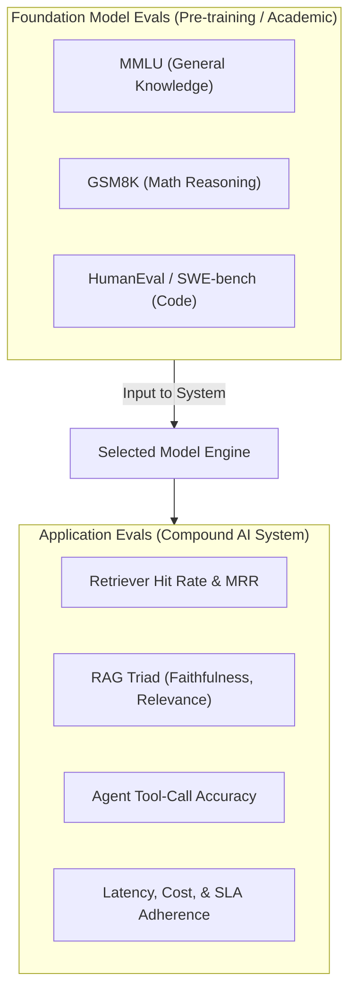

# 📹 Introduction to LLM Evaluations – Model Evals vs Application Evals

<div className="video-card" style={{border: '1px solid #30363d', borderRadius: '8px', padding: '16px', marginBottom: '24px', background: 'rgba(56, 139, 253, 0.05)'}}>
  <div style={{display: 'flex', gap: '16px', flexWrap: 'wrap'}}>
    <div><strong>Instructor:</strong> Nitish Singh (CampusX)</div>
    <div><strong>Duration:</strong> 1472</div>
    <div><strong>Course:</strong> Module 6: LLM Evaluation & Observability</div>
    <div><strong>Watch Link:</strong> <a href="https://www.youtube.com/watch?v=cNF_MO82Qew" target="_blank" rel="noopener noreferrer">YouTube Lecture ↗</a></div>
  </div>
</div>

## 📌 Executive Summary

A critical distinction in AI engineering is separating Foundation Model Evaluations from Application Evaluations. Model evaluations test raw reasoning, math, and coding capabilities in isolation; Application evaluations assess how an entire pipeline (prompts, retrieval, tools, business rules) satisfies user needs.

This lesson explores the boundaries between model benchmarks (MMLU, GSM8K, SWE-bench) and compound AI system evaluation (RAG, agents, workflows).

---

## 🏗️ System Architecture & Execution Flow



---

## 📖 Core Concepts & Technical Deep Dive

### 1. Model Evaluations (Academic & Provider Benchmarks)
- Evaluates raw weights across standard academic sets.
- Answers: *Is Model X better at Python code generation than Model Y?*
- Prone to data contamination: many benchmark questions were inadvertently included in web training crawls.

### 2. Application Evaluations (Production Engineering)
- Evaluates the end-to-end user-facing pipeline: Query -> Document Retrieval -> Re-ranking -> Prompt Formatting -> Model Inference -> Output Parsing.
- Answers: *Does our customer support bot correctly resolve billing inquiries without hallucinating policy terms?*
- System performance is often bottlenecked by retrieval quality rather than model reasoning capabilities.

---

## 💻 Production Implementation

```python
from pydantic import BaseModel, Field

class EvaluationResult(BaseModel):
    eval_type: str = Field(description="'model' or 'application'")
    metric_name: str
    score: float = Field(ge=0.0, le=1.0)
    passed: bool
    details: str

# Example: Evaluating an application-level RAG pipeline
app_eval = EvaluationResult(
    eval_type="application",
    metric_name="rag_context_recall",
    score=0.92,
    passed=True,
    details="Retrieved 3/3 ground-truth policy documents within top-5 results."
)

print(app_eval.model_dump_json(indent=2))
```

---

## ⚙️ Production Gotchas & Best Practices

:::tip Prioritize Application Evals
Do not select models based solely on academic leaderboards. A model with slightly lower MMLU may have significantly better latency, lower pricing, and superior tool-calling compliance for your specific domain.
:::

:::warning Data Contamination Awareness
Public benchmarks like GSM8K and HumanEval suffer from severe saturation. Always curate private, domain-specific evaluation sets reflecting real user queries.
:::

---

## 📊 Architectural Reference & Comparison

| Dimension | Model Evaluation | Application Evaluation |
| :--- | :--- | :--- |
| **Focus** | Raw model intelligence | Compound system business value |
| **Dataset** | Standardized public sets (MMLU, HumanEval) | Private domain golden datasets |
| **Variables** | Model weights, quantization, context size | Retriever, chunking, prompts, tools, model |
| **Owner** | Research teams / Foundation labs | Production AI Systems Engineers |

---

## 📚 Key Takeaways & Enterprise Checklist

- [ ] **Architecture Verification:** Ensure your design addresses latency, decoupled interfaces, and strict data validation contracts.
- [ ] **Deterministic Testing:** Run unit tests and golden dataset evaluations before shipping changes to staging or production.
- [ ] **Security & Observability:** Enforce input/output guardrails, scrub sensitive credentials/PII, and capture distributed traces.
- [ ] **Scalability & Sizing:** Calibrate model parameters, context limits, and compute instance requirements against projected request concurrency.
