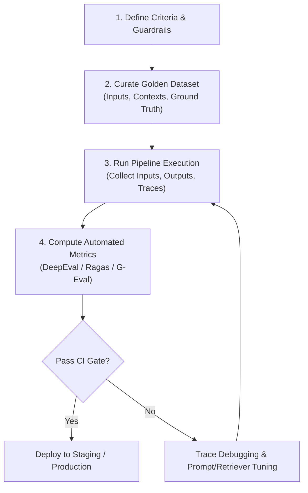

# 📹 How to Evaluate LLM Applications: The Complete Workflow

<div className="video-card" style={{border: '1px solid #30363d', borderRadius: '8px', padding: '16px', marginBottom: '24px', background: 'rgba(56, 139, 253, 0.05)'}}>
  <div style={{display: 'flex', gap: '16px', flexWrap: 'wrap'}}>
    <div><strong>Instructor:</strong> Nitish Singh (CampusX)</div>
    <div><strong>Duration:</strong> 1020</div>
    <div><strong>Course:</strong> Module 6: LLM Evaluation & Observability</div>
    <div><strong>Watch Link:</strong> <a href="https://www.youtube.com/watch?v=Pv4mkG2K_s8" target="_blank" rel="noopener noreferrer">YouTube Lecture ↗</a></div>
  </div>
</div>

## 📌 Executive Summary

Building an enterprise evaluation workflow requires a structured lifecycle: establishing evaluation criteria, curating representative golden datasets, selecting automated scoring metrics, running batch evaluations, and analyzing failure traces.

This lesson details the end-to-end evaluation architecture used by leading AI engineering teams to maintain software reliability.

---

## 🏗️ System Architecture & Execution Flow



---

## 📖 Core Concepts & Technical Deep Dive

### 1. Step 1: Defining Measurable Criteria
Translate business requirements into concrete evaluation metrics:
- *Factual accuracy* becomes **Faithfulness** (no unsupported claims).
- *Direct answers* becomes **Answer Relevancy** (concise, non-repetitive).
- *Information discovery* becomes **Context Precision** (relevant chunks ranked high).

### 2. Step 2: Golden Dataset Curation
A golden dataset must contain:
- Diverse query intents (simple lookup, comparative analysis, multi-hop reasoning, adversarial edge cases).
- Ground truth reference answers approved by human domain experts.
- Relevant document ground truth IDs for retriever scoring.

### 3. Step 3: CI/CD Integration
Wrap tests in standard test runners (e.g. `pytest`). Set thresholds: PR builds fail if overall score decreases by more than 2% or any critical safety test fails.

---

## 💻 Production Implementation

```python
import pytest
from deepeval.metrics import FaithfulnessMetric
from deepeval.test_case import LLMTestCase

@pytest.fixture
def rag_test_case():
    return LLMTestCase(
        input="What is the maximum token limit of Llama 3.1 405B?",
        actual_output="Llama 3.1 405B has a native context window of 128k tokens.",
        retrieval_context=["Meta released Llama 3.1 405B with support for up to 128,000 context tokens."]
    )

def test_rag_faithfulness(rag_test_case):
    metric = FaithfulnessMetric(threshold=0.8)
    metric.measure(rag_test_case)
    assert metric.is_successful(), f"Faithfulness check failed: {metric.reason}"
```

---

## ⚙️ Production Gotchas & Best Practices

:::tip Continuous Dataset Expansion
Every production bug report or user thumbs-down should be scrubbed of PII and added directly to the golden dataset as a regression test case.
:::

:::warning Avoid Single-Metric Optimization
Never optimize solely for Answer Relevance at the expense of Faithfulness; models will hallucinate convincing, direct answers that are factually fabricated.
:::

---

## 📊 Architectural Reference & Comparison

| Pipeline Phase | Primary Objective | Key Deliverables |
| :--- | :--- | :--- |
| **Curation** | Build diverse test cases | 100-500 verified question-context-answer triples |
| **Execution** | Batch run system | Raw outputs, latencies, tokens consumed |
| **Scoring** | Quantitative grading | Metric scores (0.0 to 1.0) and failure rationales |
| **Analysis** | Root-cause diagnosis | LangSmith trace waterfall, chunk inspection |

---

## 📚 Key Takeaways & Enterprise Checklist

- [ ] **Architecture Verification:** Ensure your design addresses latency, decoupled interfaces, and strict data validation contracts.
- [ ] **Deterministic Testing:** Run unit tests and golden dataset evaluations before shipping changes to staging or production.
- [ ] **Security & Observability:** Enforce input/output guardrails, scrub sensitive credentials/PII, and capture distributed traces.
- [ ] **Scalability & Sizing:** Calibrate model parameters, context limits, and compute instance requirements against projected request concurrency.
