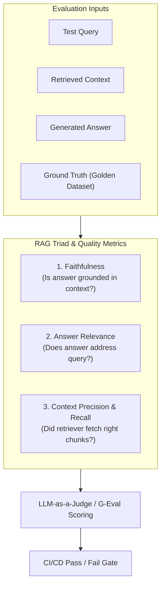

# 📹 How to Evaluate LLM Applications: The Complete Workflow

<div className="video-card" style={{border: '1px solid #30363d', borderRadius: '8px', padding: '16px', marginBottom: '24px', background: 'rgba(56, 139, 253, 0.05)'}}>
  <div style={{display: 'flex', gap: '16px', flexWrap: 'wrap'}}>
    <div><strong>Instructor:</strong> Nitish Singh (CampusX)</div>
    <div><strong>Duration:</strong> 17m 0s</div>
    <div><strong>Playlist:</strong> LLM Evaluation Complete Series (CampusX)</div>
    <div><strong>Watch Link:</strong> <a href="https://www.youtube.com/watch?v=Pv4mkG2K_s8" target="_blank" rel="noopener noreferrer">YouTube Lecture ↗</a></div>
  </div>
</div>

## 📌 Executive Summary & Learning Objectives

This lecture covers **How to Evaluate LLM Applications: The Complete Workflow**, focusing on production implementations, edge cases, and industry standards:
- Core intuition, architecture, and underlying mechanisms.
- Key differences between theoretical research implementations and scalable enterprise patterns.
- Concrete Python walkthroughs, error recovery, and performance optimization.

---

## 🏗️ Architecture & Conceptual Workflow



---

## 📖 Core Concepts & Technical Deep Dive

### 1. Architectural Foundations
In modern production AI engineering, **How to Evaluate LLM Applications: The Complete Workflow** is essential for ensuring reliability, low latency, and deterministic outcomes. As AI systems evolve from naive prompt-in / completion-out scripts into distributed systems, engineers must handle:
- **State management & consistency:** Ensuring intermediate states and tool invocations are tracked.
- **Error boundaries & recovery:** Graceful degradation when external LLMs or vector stores encounter rate limits or network partitions.
- **Resource utilization & cost efficiency:** Caching common queries and reducing unnecessary foundation model token expenditure.

### 2. Operational Considerations
- **Latency Optimization:** Pre-computing embeddings, utilizing asynchronous non-blocking event loops, and streaming tokens via Server-Sent Events (SSE).
- **Security & Sandboxing:** Validating inputs before ingestion, sanitizing LLM outputs, and isolating tool execution environments.

---

## 💻 Production Implementation Walkthrough

```python
from deepeval import assert_test
from deepeval.test_case import LLMTestCase
from deepeval.metrics import FaithfulnessMetric, AnswerRelevancyMetric

# 1. Prepare Test Case
test_case = LLMTestCase(
    input="What is the context window of Claude 3.5 Sonnet?",
    actual_output="Claude 3.5 Sonnet features a 200,000 token context window.",
    retrieval_context=["Claude 3.5 Sonnet supports up to 200k tokens of context."]
)

# 2. Define Metrics
faithfulness = FaithfulnessMetric(threshold=0.8)
relevancy = AnswerRelevancyMetric(threshold=0.8)

# 3. Assert Production Test Gate
def test_rag_accuracy():
    assert_test(test_case, [faithfulness, relevancy])
```

---

## 💡 Production Best Practices & Tips

:::tip Production Deployment Guideline
When deploying How to Evaluate LLM Applications: The Complete Workflow in enterprise environments, always configure automated retries with exponential backoff and telemetry tracing (such as OpenTelemetry or LangSmith).
:::

:::warning Common Failure Modes
Watch out for state contamination across concurrent requests. Ensure each session or user interaction uses an isolated thread ID or execution context.
:::

---

## 🎯 Key Takeaways & Quick Reference

| Dimension | Production Standard | Pitfall to Avoid |
| :--- | :--- | :--- |
| **Execution** | Async / Non-blocking with timeouts | Synchronous blocking calls in event loops |
| **Data Validation** | Strict Pydantic v2 schemas | Untyped dictionary access |
| **Monitoring** | Distributed tracing & latency percentiles | Relying only on standard console logs |

## ⏱️ Lecture Timeline & Key Topics

| Timestamp | Key Topic / Concept Discussed |
| :--- | :--- |
| **00:00:00** | तो ठीक है। अगर अभी तक का पूरा फ्लो हम... |
| **00:04:24** | अपने इवैल्यूएशन के लिए एक सक्सेस... |
| **00:09:02** | बी एलएलएम। इस पॉइंट तक चीजें क्लियर है?... |
| **00:12:58** | वर्थ डिप्लॉयंग। मैं अब इसको डिप्लॉय कर... |
| **00:16:58** | बाकी आप आगे देखोगे।... |


---

---

## 📜 Complete Lecture Transcript (Hindi / Hinglish)

> **Language:** Hindi / Hinglish | **Source:** `03 - How to Evaluate LLM Applications： The Complete Workflow ｜ CampusX.hi.srt` | **Total Segments:** 9 | **Word Count:** ~3,001 words

<details>
<summary><b>Click to expand full chronological transcript (9 timestamped intervals)</b></summary>

#### ⏱️ [00:00 ➔ 00:02]

तो ठीक है। अगर अभी तक का पूरा फ्लो हम समराइज करें। इस लेक्चर में हमने क्या-क्या किया? हमने सबसे पहले व्हाई डिस्कस किया। व्हाई आर वी स्टडिंग दिस टॉपिक? फिर हमने व्हाट डिस्कस किया कि एलएलएम इवल्स होते क्या हैं? और उसके टाइप्स क्या हैं? दो टाइप्स हमने पढ़े। मॉडल इवल्स एप्लीकेशन इवैल्स। तो व्हाई एंड व्हाट? अभी तक आपके क्लियर होना चाहिए। अब हम मूव करते हैं हाउ की तरफ कि एलएलएम इवैल्यूएशंस किए कैसे जाते हैं। और यहां पर अगेन एक डिस्क्लेमर है कि जो हाउ मैं आपको पढ़ाने जाऊंगा वो एक्चुअली एप्लीकेशन इवल के पर्सपेक्टिव से पढ़ाऊंगा। मॉडल इवल के पर्पस्पेक्टिव से नहीं पढ़ा रहा। ठीक है? मेक सेंस ऑब्वियसली बिकॉज़ हम इसी के ऊपर ज्यादा फोकस करने जा रहे हैं। तो चलो अब हम पढ़ेंगे एक बहुत इंपॉर्टेंट चीज जिससे आपको बहुत पर्सपेक्टिव मिलेगा और टॉपिक है एलएलएम एप्लीकेशन ईवेल का वर्क फ्लो। एक टिपिकल एलएलएम बेस्ड एप्लीकेशन का आप इवैल्यूएशन कैसे करते हो? ये हम नेक्स्ट पढ़ने जा रहे हैं। हम क्या सीखने जा रहे हैं कि आपके पास एक एलएलएम बेस्ड एप्लीकेशन है। ठीक है? और आपको उसको इवैल्यूएट करना है और हम एकदम सिंपलेस्ट पॉसिबल एग्जांपल के साथ आगे बढ़ेंगे। मैं आपको बताता हूं कि हमने क्या एप्लीकेशन बनाया है। सो वी आर अ लेट्स से वर्किंग फॉर अ कंपनी वी आर ए इंजीनियर्स और ये कंपनी मान लो Zomato है। और इनका प्रॉब्लम यह है कि इनको बहुत सारे अ मेल्स आते हैं डेली बेसिस पे बिकॉज़ इट्स अ बिग कंपनी। बहुत सारे कस्टमर्स हैं और ये लोग क्या चाहते हैं कि मैनुअली इन मेल्स को रिप्लाई करना थोड़ा मुश्किल है। तो दे वांट टू ऑटोमेट द सेटअप। सो व्हाट दे वांट इज कि दे वांट अ सिस्टम जो इन मेल्स को रीड करे और कंटेंट के बेसिस पे क्लासिफिकेशन करके दे कि इस मेल में कस्टमर बिलिंग रिलेटेड क्वेश्चन

#### ⏱️ [00:02 ➔ 00:04]

पूछ रहा है या फिर अ लेट्स से एक बार मैं यहां पे चेक कर लेता हूं क्या-क्या कॉम्बिनेशंस हैं। हां बिलिंग रिलेटेड क्वेश्चंस पूछ रहा है या फिर उसको कोई टेक्निकल प्रॉब्लम है या फिर कोई जनरल क्वेरी है। मैं बस ये क्लासिफिकेशन करवाना चाहता हूं। क्यों करवाना चाहता हूं? इससे क्या फायदा है कि अगर बिलिंग रिलेटेड क्वेरी है तो मैं इसको सीधे राउट कर दूंगा टू माय बिलिंग टीम। टेक्निकल क्वेरी है तो टेक्निकल टीम के पास भेज दूंगा और जनरल क्वेरी है तो मेरे कस्टमर सपोर्ट टीम के पास भेज दूंगा। मुझे यहां पर कोई बंदा नहीं चाहिए जो मैनुअली इन मेल्स को रीड करके मेरी टीम्स को टैग करे। इस प्रोसेस को मैं ऑटोमेट करना चाह रहा हूं। तो हमने क्या किया? हमने एक बहुत सिंपल सा सिस्टम बनाया। सिस्टम ये है कि हमने एक एलएलएम को बिठा दिया। हमने एक एलएलएम को बिठा दिया और उसको एक प्र्प दिया कि भाई यू आर दिस कस्टमर एजेंट जो ईमेल को पढ़ के डिसाइड करेगा कि इसको कहां पे राउट करना है। तो यहां पे हमें ईमेल मिल रहा है यूजर का और यहां से ये राउटिंग कर रहा है। ठीक है? बहुत ही सिंपल एलएलएम एप्लीकेशन है। मतलब आप लिटरली 510 मिनट में बना सकते हो उसको। ठीक है? बट अब आता है असली सवाल कि क्या हम इसको डायरेक्टली डिप्लॉय कर दें? नहीं यही तो हमने अभी तक डिस्कस किया है। हमें डिप्लॉय नहीं करना है। उसके पहले हमें क्या करना है? इस सिस्टम को इवैलुएट करना है। वी हैव टू इवैलुएट दिस सिस्टम। ठीक है? कैसे करना है इवैलुएट? वो फ्लो मैं आपको बताता हूं। और ये जो फ्लो अभी मैं आपको बताने वाला हूं ना, यही फ्लो इस पूरे कोर्स में आप बार-बार देखोगे। ये तो बहुत सिंपल एप्लीकेशन है। एक बहुत कॉम्प्लेक्स एजेंट के लिए भी आपको यही वर्क फ्लो यूज़ करना है। ठीक है? वर्क फ्लो क्या है? डिस्कस करते हैं। वर्क फ्लो में सबसे पहला काम जो आपको करना होता है कि यू हैव टु डिफाइन द टास्क एंड टारगेट। आप क्या चीज को इवैल्यूएट करना चाहते हो? आपको सबसे पहले ये डिफाइन करना होता है। तो इस केस

#### ⏱️ [00:04 ➔ 00:06]

में हमें इस सिस्टम को या फिर इस वर्क फ्लो को इवैल्यूएट करना है। ठीक है? और इवैल्यूएशन का टास्क क्या है? इट्स अ सिंपल क्लासिफिकेशन टास्क। हमें यह चेक करना है कि क्या यह सिस्टम सही से क्लासिफिकेशन कर पा रहा है या नहीं। तो, यह है हमारा स्टेप नंबर वन। स्टेप नंबर टू में आप क्या करते हो कि आप अपने इवैल्यूएशन के लिए एक सक्सेस क्राइटेरिया डिफाइन करते हो। कैन यू टेल मी इस पर्टिकुलर यूज़ केस के लिए व्हाट इज द सक्सेस क्राइटेरिया? हाउ वुड वी नो कि यह सिस्टम सही से काम कर रहा है। डीपी सर ने एकदम सही बोला। द आंसर इज़ एक्यूरेसी। सिंपल सी बात है। अगर इसको 100 क्वेरीज आई, इसने इनमें से 90 क्वेरीज को सही जगह पर अगर राउट कर दिया, तो व्हाट वुड यू से दैट दिस सिस्टम इज़ 90% एक्यूरेट। तो इस पर्टिकुलर सिस्टम में आपका सक्सेस क्राइटेरिया इज़ क्लासिफिकेशन। और जो मैट्रिक है जिसके बेसिस पे हम पता करेंगे कि क्लासिफिकेशन सही से हो रहा है कि नहीं वो है एक्यूरेसी। ये डिस्कशन क्लियर है? कुछ कंफ्यूजन नहीं है। सिंपल है। अब आता है अगला और सबसेेंट स्टेप। अब आपको क्या करना है? यू हैव टू बिल्ड अ डेटा सेट। ठीक है? सो व्हाट यू डू इज़ आप इस तरह का एक डेटा सेट प्रिपेयर करते हो। जहां पे एक साइड आपका मैसेज है या आपका मेल का कंटेंट है और दूसरी साइड में आपने मैनुअली खुद से बता रखा है कि उसका टाइप क्या है। जैसे अगर आपका मेल यह है माय कार्ड वाज़ चार्ज ट्वाइस। तो दिस इज अ बिलिंग इशू। द ऐप क्रैशेस ऑन लॉग इन। दिस इज अ टेक्निकल इशू। व्हाट आर योर आवर्स? तो यह जनरल इशू है। तो यहां पे तो चलो मैंने सिर्फ तीन रोज़ का डेटा बनाया है। जनरली आप 50 टू 500 रोज़ का एक डेटा क्रिएट करोगे। ये डेटा क्रिएट कैसे होगा? बेस्ट तो है कि आप अपना

#### ⏱️ [00:06 ➔ 00:08]

एक्चुअल डेटा लेके आओ। सो इफ दिस इज Zomato तो आप अपने पास्ट चैट्स को उठा के लाओ और उससे डेटा सेट क्रिएट करो और यह लेबलिंग भी आप मैनुअली करो। किसी को बिठा के ये लेबल करवा लो। तो दिस इज़ हाउ यू क्रिएट अ डेटा सेट। इसको बाय द वे एलएलएम इव्स की लैंग्वेज में गोल्डन डेटा सेट बोलते हैं। सो व्हाट वी आर डूइंग इज़ इस थर्ड स्टेप में वी आर बिल्डिंग अ डेटा सेट जो हमारे लिए इवैल्यूएशन करके देगा। ओके? उसके बाद नेक्स्ट यू डिफाइन अ इवैल्यूएशन मेथड। बेसिकली आप यह डिसाइड करते हो कि इवैल्यूएशन करेगा कौन? दो-तीन ऑप्शंस हैं। या तो ऑटोमेटेड तरीके से हो जाएगा या फिर कोई ह्यूमन करेगा या फिर आप किसी दूसरे एलएलएम को यूज़ कर सकते हो इवैल्यूएशन परफॉर्म करने के लिए। आई होप आपको समझ में आ रहा है। इवैल्यूएशन परफॉर्म करने का सिंपल मतलब क्या है? कि आपका ये सिस्टम है जो आपने बनाया था। ये जो सिस्टम आपने बनाया था। आप क्या करोगे? उस सिस्टम में इस डेटा सेट को भेज दोगे। राइट? अब वो हर मैसेज के लिए आपका सिस्टम एक आंसर देगा। लेट्स से फर्स्ट वाले के लिए उसने बोला बिलिंग। सेकंड वाले के लिए उसने बोला जनरल और थर्ड वाले के लिए उसने बोला जनरल। तो अब आप क्या करोगे? आप इन दोनों को कंपेयर करोगे और आप क्या कैलकुलेट करोगे कि एक्यूरेसी कितना है इस सिस्टम का। बट ये एक्यूरेसी कैलकुलेट करके कौन दे रहा है आपको? सिंपल है। इस केस में आप किसी ह्यूमन को क्यों बिठाओगे? फालतू में उसको सैलरी देनी पड़ेगी। एलएलएम को भी लाने की जरूरत नहीं है। आप सिंपली एक पाइthन कोड लिख दो जो चेक कर लेगा कि एक्यूरेसी स्कोर कितना है। तो इस केस में आपका जो इवल मेथड है वो

#### ⏱️ [00:08 ➔ 00:10]

क्या है? वो ऑटोमेटेड है। बिकॉज़ दिस इज अ सिंपल एलएलएम एप्लीकेशन। वही अगर यह इमेजिन करो अगर यह एक चैट बॉट होता यहां पर एक्सपेक्टेड में एक लंबा सा टेक्स्चुअल आंसर होता और यहां पे एलएलएम का लंबा सा टेक्स्चुअल आंसर होता। तो अब उन दोनों टेक्स्ट को कंपेयर किससे करते? सोच के बताओ। क्या ऑटोमेटेड तरीके से दो पैराग्राफ्स को आप कंपेयर कर सकते हो कि सही है कि नहीं? इज इट पॉसिबल? दो पैराग्राफ्स को कंपेयर करना है। इज इट पॉसिबल कि आप कोड के थ्रू कर दो। नहीं है पॉसिबल। राइट? एक सही है, दूसरा गलत है। यह कोड के थ्रू पता करना बहुत मुश्किल है। बिकॉज़ सिमेंटिक मीनिंग सेम है नहीं है पता करना पड़ेगा। ह्यूमन को बिठा सकते हो बट ह्यूमन वुड बी कॉस्टली। राइट? अगर मुझे बहुत सारा टेस्टिंग करना है तो ह्यूमन को सैलरी देना पड़ेगा। थर्ड ऑप्शन इज़ बीच की चीज़। एलएलएम। आप एलएलएम के थ्रू ये टेस्टिंग कर सकते हो। तो डीड यू गेट माय पॉइंट? कि इस पॉइंट पे आपके पास एक इवैल्यूएशन मेथड होना चाहिए। इट कैन बी ऑटोमेटेड, इट कैन बी अ ह्यूमन और इट कैन बी एलएलएम। इस पॉइंट तक चीजें क्लियर है? एक बार वापस ऊपर से नीचे आते हैं। सबसे पहले हमने टास्क डिफाइन किया, टारगेट डिफाइन किया। टारगेट क्या था? हमारा पूरा सिस्टम, पूरा वर्क फ्लो और टास्क क्या था? इस सिस्टम को हमें इवैलुएट करना है कि ये सही से काम कर रहा है कि नहीं। सक्सेस क्राइटेरिया क्या था? क्लासिफिकेशन और मैट्रिक क्या था? एक्यूरेसी स्कोर। डेटा सेट हमने बिल्ड कर लिया। 50 100 रोज़ का डेटा सेट हमने बिल्ड कर लिया। और अब हमने ये भी डिफाइन कर लिया कि जब मेरा सिस्टम आंसर निकाल के देगा तो वो एक्यूरेसी कैलकुलेट कौन करेगा? ऑटोमेटेड तरीके से होगा। ठीक है? अब आता है अगला स्टेप जहां पे यू बेसिकली रन द मॉडल। रन द मॉडल का सिंपल मतलब क्या है? कि यह आपने जो सिस्टम बनाया उसमें आप अपने डेटा सेट को भेज दोगे और आपका सिस्टम आंसर्स जनरेट करेगा। दिस इज द स्टेप। उसके बाद अगले स्टेप में आप क्या करते हो? यू इवैलुएट द रिजल्ट्स। बेसिकली आपके पास एक Python कोड

#### ⏱️ [00:10 ➔ 00:12]

है जो आपको एक्यूरेसी स्कोर कैलकुलेट करके दे रहा है इस स्टेप में। मान लो आपका एक्यूरेसी आया 80%। लेट्स से आपने 100 अ रोज़ भेजे। 100 में से 80 में ही सही से क्लासिफाई हुआ। 20 में गलती हो गई। तो अब अगला स्टेप आता है जहां पर व्हाट यू डू इज यू एनालाइज द रिजल्ट्स। व्हिच बेसिकली मीन्स कि आप सोचने की कोशिश करते हो कि कहां पे गलती हो रही है। सोच के बताओ। अगर आप एक ऐसा सिस्टम बना रहे हो जिसका काम है मेल का कंटेंट रीड करके क्लासिफाई करना कि बिलिंग है, टेक्निकल है या फिर जनरल है। और इसमें गलतियां अगर हो रही है तो स्कोप ऑफ इंप्रूवमेंट कहां पर है? क्या चीज इंप्रूव कर सकते हो? कहां पे गलती हो सकती है? आपको मेरा क्वेश्चन समझ में आ रहा है? मेरा क्वेश्चन यह है कि इफ यू आर बिल्डिंग अ सिस्टम जिसका सिंपल काम है टेक्स्ट को रीड करके क्लासिफाई करना और वो गलत कर रहा है काम। 80% ही सही है। 20% टाइम्स गलती कर रहा है। तो व्हाट इज द थिंग जिसको मैं चेंज करूंगा। क्या इंप्रूव कर सकता हूं? मल्टीपल चीजें आप ठीक कर सकते हो। मैं आपको बताता हूं। सबसे पहले आप अपना सिस्टम प्र्प ठीक कर सकते हो। हो सकता है आपका सिस्टम प्र्ट इस तरीके से डिफाइंड है कि वो बिलिंग और टेक्निकल में कंफ्यूज हो जा रहा है। दैट कुड बी वन पॉसिबल ऑप्शन। सेकंड पॉसिबल ऑप्शन इज़ कि जो आप मॉडल यूज़ कर रहे हो जो आप एलएलएम यूज़ कर रहे हो वो नहीं सक पा रहा है। आपने लो कम पैरामीटर वाला मॉडल ले लिया, ओपन सोर्स मॉडल ले लिया और वो नहीं सक पा रहा है। तो कुछ भी इस तरह के रीज़ंस हो सकते हैं। यहां पे बहुत ज्यादा स्कोप ऑफ इंप्रूवमेंट है नहीं। बट लेट्स से सिस्टम प्र्प है। मॉडल को चेंज करना इज़ वन मोर थिंग। जो भी है आप क्या करोगे? आप एनालाइज करोगे अपने सिस्टम को। आपके पास आपके इवैल्यूएशन का रिजल्ट आ गया है। 80% एक्यूरेसी आपके मैनेजर ने बोला इंप्रूव करो भाई क्या कर रहे हो? तो अब आप जाके प्र्ट को ट्वीक कर रहे हो या फिर मॉडल को चेंज कर रहे हो। और आप क्या करते हो? बेसिकली अपने सिस्टम को इंप्रूव करते हो। यहां पे मॉडल नहीं होना चाहिए। यहां पे सिस्टम होना चाहिए। यू ट्राई टू

#### ⏱️ [00:12 ➔ 00:14]

इंप्रूव द सिस्टम। और सिस्टम को इंप्रूव करने के जस्ट बाद फिर से अगला काम क्या होता है? वापस आप इवैल्यूएशन को ट्रिगर कर देते हो। यहां पर आई गेस आपको वो बात समझ में आ रही है जब मैंने थोड़ी देर पहले बोला कि एलएलएम ईल्स आर रिपीटेबल। तो दिस इज व्हाट यू आर डूइंग। आपके पास एक गोल्डन डेटा सेट है। आप बार-बार क्या कर रहे हो? अपने सिस्टम में चेंजेस कर रहे हो। इस बार प्र्ट चेंज करके आए। दोबारा से डेटा सेट पे रन किया तो पता चला एक्यूरेसी 90% हो गया। आपके मैनेजर ने बोला अभी भी और इंप्रूव करो। अब इस बार आप गए। आपने बोला कि हटाओ ज्यादा दिमाग नहीं लगाते हैं। एलएलएम चेंज कर देते हैं। भारी वाला एलएलएम लगा देते हैं। भारी वाला एलएलएम लगाया। वापस सेम डेटा सेट के ऊपर फिर से इवैल्यूएशन रन किया। 95% आ गया। नाउ योर मैनेजर इज़ हैप्पी। तो अब आप बंद कर दोगे। तो बेसिकली यू आइट्रेट इन दिस स्टेप। डेटा सेट बन गया है। मॉडल को लिया, डेटा सेट पे चलाया, रिजल्ट्स आए, इवैल्यूएट किया, एनालाइज किया, इंप्रूवमेंट्स किए, सर्कल में ये काम करते चले गए। लूप में काम करते चले गए। इवेंचुयूली यू रीच अ प्लेस जहां पे आपको लगता है कि अब मेरा सिस्टम इज़ वर्थ डिप्लॉयंग। मैं अब इसको डिप्लॉय कर सकता हूं। तो देन व्हाट यू डू इज यू एक्चुअली गो ऑन एंड डिप्लॉय योर सिस्टम ऑनलाइन। बट डिप्लॉय होने के बाद भी आपका काम खत्म नहीं होता। वहां पे आपका काम क्या होता है? आप मॉनिटर करने लगते हो। मॉनिटरिंग के बिना सिस्टम ऑनलाइन भी फेल कर सकता है। तो आप उसको कंसिस्टेंटली मॉनिटर करते हो। और मॉनिटरिंग में आपको देखना होता है कि क्या प्रोडक्शन में फेलियर्स हो रहे हैं कि नहीं। आपका सिस्टम 95% एक्यूरेट था आपके टेस्ट डेटा सेट के ऊपर। बट जब नया डाटा उसको मिला किसी कस्टमर का तो वहां पर वो गलतियां करने लग गया। तो अब यहां पर आप क्या करते हो? यहां पे एकेंट स्टेप होता है कि जो आपके प्रोडक्शन में फेलियर्स हैं। एक पर्टिकुलर मेल आया उसको बिलिंग बोलना चाहिए था पर उसको टेक्निकल बोला मेरा मेल मेरा मॉडल। तो मैं क्या करूंगा? उस पर्टिकुलर इंस्टेंस को उस मेल के कंटेंट को उठाऊंगा और उसको जाकर के मैं अपने इस डेटा सेट में ऐड कर दूंगा। मेरे गोल्डन डेटा सेट में और फिर मैं दोबारा से ये पूरा स्टेप अ रीस्टार्ट करूंगा। सो होता क्या है कि

#### ⏱️ [00:14 ➔ 00:16]

प्रोडक्शन की जो गलतियां होती हैं, प्रोडक्शन के जो फेलियर्स होते हैं, उनको आप कहां पर डालते हो? वापस जाके अपने डेटा सेट में। तो इस तरीके से आपका जो गोल्डन डेटा सेट है वो और रिच होता जाता है और गोल्डन डेटा सेट के ऊपर आप और इंप्रूव करते जाते हो अपने मॉडल को और डिप्लॉय करते जाते हो। तो बेसिकली दिस इज अ प्रॉपर बड़ा सा लूप जिसके अंदर ये पूरा का पूरा इवैल्यूएशन कंसिस्टेंटली चलता है। ये मैंने एक बहुत सिंपल एग्जांपल दिया है। बट ये सेम फ्लो आप देखोगे रैग्स के ऊपर भी अप्लाई होता है। यही सेम फ्लो एजेंट्स के ऊपर भी अप्लाई होता है। इज इट क्लियर? पूरा का पूरा फ्लो। डिफाइन टास्क एंड टारगेट डिफाइन अ सक्सेस क्राइटेरिया बिल्ड अ डेटा सेट डिफाइन एन इवैल्यूएशन मेथड रन द मॉडल इवैलुएट द रिजल्ट्स एनालाइज द रिजल्ट्स इंप्रूव द मॉडल आइटरेट व्हेन यू आर सेटिस्फाइड डिप्लॉय मॉनिटर गलती हो रही है गलती जिस चीज पे हो रही है उसको डेटा सेट का पार्ट बना दोबारा से इवैलुएट करो एंड यू कीप डूइंग इट फॉर एवर जब तक आपका सिस्टम डिप्लॉयमेंट में है आप ये काम करते चले जाते हो एंड दैट इज हाउ यू बिल्ड रिलाय बबल एलएलएम बेस्ड एप्लीकेशनेशंस हु विल डिसाइड वेदर द आउटपुट इज रोंग ड्यूरिंग द मॉनिटरिंग फेस? अ गुड क्वेश्चन एक्चुअली ये रेज होता जाएगा ना अगर अ मान लो मैं एक कस्टमर हूं। मेरे को मैंने एक मेल किया और एसेंशियली इट वाज़ अ बिलिंग इशू बट मुझे रीडायरेक्ट कर दिया गया टेक्निकल टीम के पास। टेक्निकल टीम ने फॉलो अप किया। तो मैंने टेक्निकल टीम को बताया कि मुझे तो आपसे मतलब ही नहीं। मुझे तो बिलिंग से मतलब है। तो यहां पे एक प्रोसेस सेटअप होगा कि टेक्निकल टीम जाके फ्लैग कर देगी इस केस को कि हमें गलत इंफॉर्मेशन भेजा गया। तो वो डेटा सेट में ऐड होता चला जाएगा। तो वो एक एक मॉनिटरिंग सिस्टम वहां पे इन प्लेस होता है। अच्छा यहां पे एक चीज और मैं इंपॉर्टेंट चीज बताना भूल गया। ये लाइन पढ़ो गाइस। दिस इज़ अ वेरीेंट लाइन। वन एलएलएम बेस्ड एप्लीकेशन मे हैव या माइट हैव सेवरल एलएलएम इवल्स। तो ऐसा हो सकता है कि आपका एक रैग एप्लीकेशन आपने बनाया बट उस एक रैग

#### ⏱️ [00:16 ➔ 00:16]

एप्लीकेशन के ऊपर आप मल्टीपल इवैल्यूएशंस रन कर रहे हो। लाइक ये एक सिंगल इवैल्यूएशन था ना बट ऐसा हो सकता है कि आपका एक सिंगल एलएलएम एप्लीकेशन के ऊपर आप मल्टीपल इवल्स रन करो। फॉर एग्जांपल रैग में आप एक इवैल्यूएशन रन कर रहे हो रिट्रीवर अ का परफॉर्मेंस टेस्ट करने के लिए। एक अलग इवैल्यूएशन रन कर रहे हो। एंबेडिंग मॉडल का परफॉर्मेंस चेक करने के लिए। एक अलग इवाल आप रन कर रहे हो। पूरा का पूरा रैग वर्क फ्लो को टेस्ट करने के लिए। एक अलग अ आपका इवल रन कर रहा है पूरे सिस्टम का लेटेंसी चेक करने के लिए। तो जनरली क्या होता है कि एक एलएलएम बेस्ड एप्लीकेशन का हमेशा एक से ज्यादा इवल्स रन करते हैं। अभी जो मैंने आपको एग्जांपल दिया उसमें मैंने सिर्फ एक इवाल के बारे में बताया। बट जनरली आपको ऐसा देखने को मिलेगा कि एक सिंगल एप्लीकेशन के ऊपर मल्टीपल इवेल्स रन किए जाते हैं। ये एक बहुतेंट पॉइंट है। ये आपको याद रखना है। बाकी आप आगे देखोगे।

</details>
