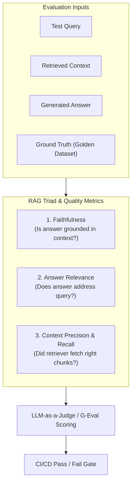

# 📹 Why Your AI Application Needs Multiple Eval Pipelines?

<div className="video-card" style={{border: '1px solid #30363d', borderRadius: '8px', padding: '16px', marginBottom: '24px', background: 'rgba(56, 139, 253, 0.05)'}}>
  <div style={{display: 'flex', gap: '16px', flexWrap: 'wrap'}}>
    <div><strong>Instructor:</strong> Nitish Singh (CampusX)</div>
    <div><strong>Duration:</strong> 28m 6s</div>
    <div><strong>Playlist:</strong> LLM Evaluation Complete Series (CampusX)</div>
    <div><strong>Watch Link:</strong> <a href="https://www.youtube.com/watch?v=DcZ-XCk-O_M" target="_blank" rel="noopener noreferrer">YouTube Lecture ↗</a></div>
  </div>
</div>

## 📌 Executive Summary & Learning Objectives

This lecture covers **Why Your AI Application Needs Multiple Eval Pipelines?**, focusing on production implementations, edge cases, and industry standards:
- Core intuition, architecture, and underlying mechanisms.
- Key differences between theoretical research implementations and scalable enterprise patterns.
- Concrete Python walkthroughs, error recovery, and performance optimization.

---

## 🏗️ Architecture & Conceptual Workflow



---

## 📖 Core Concepts & Technical Deep Dive

### 1. Architectural Foundations
In modern production AI engineering, **Why Your AI Application Needs Multiple Eval Pipelines?** is essential for ensuring reliability, low latency, and deterministic outcomes. As AI systems evolve from naive prompt-in / completion-out scripts into distributed systems, engineers must handle:
- **State management & consistency:** Ensuring intermediate states and tool invocations are tracked.
- **Error boundaries & recovery:** Graceful degradation when external LLMs or vector stores encounter rate limits or network partitions.
- **Resource utilization & cost efficiency:** Caching common queries and reducing unnecessary foundation model token expenditure.

### 2. Operational Considerations
- **Latency Optimization:** Pre-computing embeddings, utilizing asynchronous non-blocking event loops, and streaming tokens via Server-Sent Events (SSE).
- **Security & Sandboxing:** Validating inputs before ingestion, sanitizing LLM outputs, and isolating tool execution environments.

---

## 💻 Production Implementation Walkthrough

```python
from deepeval import assert_test
from deepeval.test_case import LLMTestCase
from deepeval.metrics import FaithfulnessMetric, AnswerRelevancyMetric

# 1. Prepare Test Case
test_case = LLMTestCase(
    input="What is the context window of Claude 3.5 Sonnet?",
    actual_output="Claude 3.5 Sonnet features a 200,000 token context window.",
    retrieval_context=["Claude 3.5 Sonnet supports up to 200k tokens of context."]
)

# 2. Define Metrics
faithfulness = FaithfulnessMetric(threshold=0.8)
relevancy = AnswerRelevancyMetric(threshold=0.8)

# 3. Assert Production Test Gate
def test_rag_accuracy():
    assert_test(test_case, [faithfulness, relevancy])
```

---

## 💡 Production Best Practices & Tips

:::tip Production Deployment Guideline
When deploying Why Your AI Application Needs Multiple Eval Pipelines? in enterprise environments, always configure automated retries with exponential backoff and telemetry tracing (such as OpenTelemetry or LangSmith).
:::

:::warning Common Failure Modes
Watch out for state contamination across concurrent requests. Ensure each session or user interaction uses an isolated thread ID or execution context.
:::

---

## 🎯 Key Takeaways & Quick Reference

| Dimension | Production Standard | Pitfall to Avoid |
| :--- | :--- | :--- |
| **Execution** | Async / Non-blocking with timeouts | Synchronous blocking calls in event loops |
| **Data Validation** | Strict Pydantic v2 schemas | Untyped dictionary access |
| **Monitoring** | Distributed tracing & latency percentiles | Relying only on standard console logs |

## ⏱️ Lecture Timeline & Key Topics

| Timestamp | Key Topic / Concept Discussed |
| :--- | :--- |
| **00:00:00** | Technically, we haven't even had a single class in this course yet.... |
| **00:07:24** | Basically, we will check that the... |
| **00:14:40** | guess I am able to make my point that you... |
| **00:21:36** | it is taking 5 seconds,... |
| **00:28:03** | multiple risk categories.... |


---

---

## 📜 Complete Lecture Transcript (English)

> **Language:** English | **Source:** `04 - Why Your AI Application Needs Multiple Eval Pipelines？ ｜ CampusX.en.srt` | **Total Segments:** 15 | **Word Count:** ~4,384 words

<details>
<summary><b>Click to expand full chronological transcript (15 timestamped intervals)</b></summary>

#### ⏱️ [00:00 ➔ 00:02]

Technically, we haven't even had a single class in this course yet. If you remember I take one less stroke.  In this course that we are running on LLM Eves, technically we have done only a single session till now. Ok?  In that one session we covered three things.  Three very important things.  I don't know whether you saw that session or not.  Let me give you a quick recap. Firstly we covered Why Do We Need LLM IVs where I explained to you with the help of certain case studies why LLM IVs is important?  What problems can arise if you deploy an LLM application into production without evaluating it ?  I had conveyed that point here.  After that we discussed what exactly are LL.M. eels?  What is LLM EVA? There we discussed that LLM Evals are basically a systematic and reliable way of evaluating LLMs and LLM based applications against a clear criteria.  I had told you this definition and along with that I had told you a very important thing that there are two types of LLM equals.  One is model eval and the other is application eval. What is Model Eval?  When you evaluate an LL.M.  Benchmarks are used for this. And what is Application Eval ?  When you evaluate your LLM application.  And I told you that this entire course will mostly revolve around application eval.  As an AI engineer, most of your time will be spent on application development.  Model Evas Generali Frontier Labs.  And you should know this only so that you can understand and decide what kind of LLM you need for your application. Ok?  So this was the what part and lastly we covered the how part where

#### ⏱️ [00:02 ➔ 00:04]

I showed you what an eval pipeline looks like. If you remember, I showed you this thing. This is what I showed you, how to perform the evaluation step by step. Ok?  So these three things we have covered so far in the previous lecture and today's lecture will start exactly from here. I will start the session with the last line of the previous session.  So in the last session when we were studying, after showing you the entire evaluation pipeline, I told you this one line at the end.  I told you that generally speaking one LLM based application has several LLM ells.  I told you that when you create any LLM application, it does not have just a single eval pipeline.  There are multiple eval pipelines.  Ok? We will start our today's session with this statement. Ok?  So first of all I will tell you or we will discuss why is this so? Why Do We Need Multiple Ewell Pipelines?  Why can't your application be evaluated with just one eval pipeline ?  We will discuss these points and discuss them very intuitively.  I will give you examples and through them I will explain to you why do we need multiple eval pipelines.  Ok?  So let me take an example.  So let's say we are building a Rack Chatbot for our company and our school and college whatever.  We have a Rack chatbot. What are the components of a Rack Chatbot ?  Now you must have memorized it.  So what happens ?  There is a retriever that is connected to a vector database. And to whom does this retriever give the documents after retrieving them? A generator that generates and gives you the answer.

#### ⏱️ [00:04 ➔ 00:06]

So roughly this is the flow. Ok?  The query comes to the retriever.   The retriever fetches relevant documents from the vector database based on the query. And then we take both the query and retrieved documents and give them to the generator.  The generator is an LLM and that LLM gives us answers based on the relevant context.  This is the setup of the rag. Ok?  So now let me tell you why do we need multiple eval pipelines?  One of the biggest reasons for this is that you might have multiple failure points in your LLM based application.   What I mean by this is that your LLM based application can be torn from many places. There can be failure at many places. Like quickly in the chat if you can type and tell me that this is the basic architecture of the Rag chatbot that I have created. What are the failure points in this according to you? Where can mistakes happen?  Where can the code be cracked?  Where is there a chance of getting wrong responses ?  You are right that even if we look at it directly, two failure points can be seen very easily. One is the retriever, the second is the generator.  Right?  It is possible that your retriever may fetch the wrong documents. What will the generator do if he fetches wrong documents?  Will give wrong answer on wrong documents.  The second problem is that the retriever is working properly but the generator is ignoring it and hallucinating and giving wrong answers. So we have two failure points.  So obviously both these failure points have to work properly. Only then will your application run properly.  Right? So what do you have to do?  You will need to install one evaluation pipeline above the retriever and one evaluation pipeline

#### ⏱️ [00:06 ➔ 00:08]

above the generator.  This is simple logic.  We now study these two evaluation pipelines independently. Ok?  So if we talk about the retriever pipeline, what would you do in the retriever pipeline?  What is a retriever's goal?  That when it receives a query, then on the basis of that query it fetches the relevant documents from the vector database. So basically here you will have to set up such a pipeline.  You need to create an evaluation pipeline that will check whether given a query you are getting the right relevant documents.  Ok?  You will set up this pipeline for your retriever.  Similary for Generator What is your basic work?  That you will be given a context and what will you do based on that context?  You will generate the answer. So here you have to set up a pipeline.  We are not discussing the nature of pipeline right now.  We are just discussing overall that on the basis of the given context we will check whether the answer is generated correctly or not.  What quality are we checking here?  We are checking for faithfulness, which we sometimes also call groundedness. Basically, we will check that the answer is generated on the basis of what we found in the relevant documents given to us in the context and no facts have been created on our own. For example, if my question was what is the duration of machine learning course?  Suppose this question was asked and the document that came out of mine was written as 3 weeks.  So at the time of generating the answer, it should be printed that the Machine Learning course duration is three weeks.  Now, there should not be any addition automatically like it is a great course or

#### ⏱️ [00:08 ➔ 00:10]

you can also purchase the Python course.  The duration of the Python course is four weeks.  This additional information should not come.  The answer should be grounded in context.  So what will this pipeline check all the time? That your context and the answer that has been generated are faithful to each other.  Ok ?  LLM applications have multiple failure points.  We took the example of a rack and in the rack we identified that there are two failure points where failure can occur. One is retriever, second is generator. what did we do?  We put an evaluation pipeline on top of both of them. Ok?   We are not discussing its details right now. All I'm telling you is, suppose we put an evaluation pipeline on top of these two. And at this point let's assume that both of these evaluations or both of these evaluation pipelines are telling us that our retriever and our generator are working correctly.  So my question to you is this: what do you think?  Do you think that if our retriever is working properly and our generator is working properly then our application will also work properly.  Is it true? My question is very simple.  We checked that our retriever was working properly. We have checked that our generator is working properly. So this guarantees that now our Rag application will also work properly. You just have to answer yes or no. What do you think?  A lot of people are saying yes.  Then some people are saying no. Those who are saying no, can you identify where the problem could be coming from?  If the retriever is working properly, the generator is also working properly then what can be the failure?  Other than this?  Let me tell you a scenario.  Suppose the scenario is that a user came and asked the question what is the

#### ⏱️ [00:10 ➔ 00:12]

duration of machine learning course.  Ok?  This question went to the retriever. In Retriever we had K set to five.  Can anyone tell me what K is? What is the K inside the retriever in rags?  Someone tell me quickly.  It basically means that we will fetch the five most relevant documents from the vector database. Ok?  Now the first document among these five documents was Some Random Thing.  The second document was Some Random Thing.  The third document was Some Random Thing.  The fourth document was Some Random Thing.   The fifth document stated that the duration of the ML course is eight weeks.  Ok?  Now quickly tell me in the chat whether the retriever did its job properly or not?  The answer should be just yes or no.  It is very simple.  Actually the answer to the question is very simple.  If I asked this question what is the duration of machine learning course?  I brought it packed in five documents.  The last document in it, the fifth document, clearly stated that the duration of the machine learning course is eight weeks.  So did the retriever do its job well ?  Forget reranking right now.  We are not talking about reranking.  For Now Assume is not reranking in our system.  So did my retriever do its job? Obviously we have done it, when we have given him a threshold of up to K, what does K mean, if K means five, then it means you have to bring correct answers in five documents, so did he bring correct answers in his five documents or not, it is like I will give you five attempts, you have to crack the exam once in five, now if you do it once in five, then my work is done, now I will pick up all these five documents and along with this, I will also pick up my question and

#### ⏱️ [00:12 ➔ 00:14]

I will send this entire thing to the generator. Right now I have written a system plan in the generator as to how you will get a question and a lot of context.  Merge them and generate an answer.  But do you agree that he will focus more on the initial documents?  Generally what happens is that many times the generator answers based on the context in which the higher retrieved document comes first or let's say your system is guiding you to give more priority to the higher documents D1, D2, D3, D4 and answer based on that.  Right?  So what did the generator do?  He picked something up from here.  It was written somewhere here that the duration of the Python course is six weeks. Taking this fact and this fact into account, he gave this answer that the duration of ML course is six weeks. Now tell me quickly whether this answer given by Track Chartbot is correct or wrong ? Obviously wrong.  But did the generator do its job properly?  Why no friend? What we had told the generator was that you have to generate the answer based on higher priority documents. So what happened to that poor guy was that he was given wrong documents, so he tried to do his work properly even on the wrong documents. He tried to answer on the basis of which was higher documents. He did not hallucinate anything. He got six weeks' data from above. It's not that he created that fact out of thin air. It's just that he mixed the wrong things.  But he was diligently following the instructions I had given him. So in that sense you can say that the generator was independently working fine.  The retriever was independently working fine but yet the pipeline broke and our application gave wrong results.  Do you understand what I am trying to explain to you?  I don't know whether I am able to make

#### ⏱️ [00:14 ➔ 00:16]

you understand or not.  What we came to discuss was why multiple evaluations are needed in an LLM application ?  So I said that there are multiple failure points.  We conducted evaluation on two failure points. But you can see that the work flow that is being created by their interaction will also have to be implemented on that. You will also need to create a workflow level analysis of how your retriever and generator combination is working together.  What would an Evel do like that ?  It will flag this error.  I guess I am able to make my point that you need not only individual component level events but you also need to create events at their interaction edge in work flow level. You also made that evil with let's.  Suppose you created another eval that evaluates the combination of both the retriever and the generator. So he will tell you that yes brother, what is the mistake that you gave the wrong answer.  You will have to improve this.  What is the mistake?  The mistake is that your most correct document is at the bottom of the priority order.  So most likely you will have to put a rearranger here. What is the work of a re-enacter ?  That after the results come, it reranks them so that based on the query D5 should be the highest priority. So he will pick up D5 and bring it here.  D1, D2, D3, D4 will be taken down and suddenly now your entire rack pipeline will start working properly.  So my entire point of discussion was that if you place evaluates only at the component level, it is not necessary that your pipeline will work properly.  Individual components will function properly.  But the pipeline can fail. This was the entire goal of this whole example. Now tell me quickly that suppose you now have this pipeline level eval as well and

#### ⏱️ [00:16 ➔ 00:18]

it is working correctly and it is telling you that your combination of retriever and generator is working correctly.  So does this guarantee that your Rag application is working properly ?  Does this guarantee?  You have three Eves.  The retriever has its own eval, the generator has its own eval and the mixture of both these components, this pipeline also has its own eval which is checking the working of their combination. So if these three values are working properly then can we guarantee that our application which will be used by my user will work properly or is there still some scope of problem ?  So many people are saying that yes, it can still cause problems.  So can you tell me where the problem can arise?  My retriever is working well.  My generator is working fine.  My retriever generator plumbing is working fine. So where can I have problems with my RAG application ? Problems may still arise.  For example, one problem is that everything is working properly. But my entire pipeline is taking 10 seconds to answer one question. Which basically means that my user is typing a question.  Waiting 10 seconds. Then the answer is coming out to him. So is our application fit to be deployed in production?  The answer is no. So what do you have to do here now?  You will also need to set an application level value to ensure that your latency remains below a threshold.  My simple point in this entire discussion is that I just want to explain to you where the failure points exist in an LLM based application. So basically there are three levels where failure points exist. I have written it down here. What are the three levels?  The first is the component level.  Any component of any LLM application you are building can fail. If you have written prp system prp then system prp may make a mistake.

#### ⏱️ [00:18 ➔ 00:20]

In a RAG application, you may have: Retriever, Reranker, Query Writer, Embedding Model, Vector Database, If you are building a structured output based application, your output parser, agent, your tool vector, memory guard rails. Any of these individual components can fail. So you will have to run eval on these.  Everyone will have their own eval pipeline.  After that, even if everything is working fine at the component level, there may still be a problem at the workflow level. As I showed you a while ago, there may be a problem with the work flow of the rack. If you are building an agent, there may be a problem at the workflow level of the agent. If you are building a multi-turn chatbot, there may be problems with its work flow. And even if everything is working fine at the workflow level, you still have to apply IWS at the entire application level. For example, you can check how much latency is there for the entire application, or you can check how much token cost you are spending to answer a single query, or how much time is it taking for the first token to be printed. So you will check these kinds of things at the application level.  So this dud this entire discussion make any sense to you?  That we started Why Do We Need Multiple Eves?  And I spent about 15-20 minutes trying to prove this point with an example.  That's it. We did not discuss anything more than this here.  Ok?  So let's move ahead. Now this is one reason for having multiple equals that there can be multiple failure points.   There's one more Reese.  And that's why there are risk categories.  Ok? Now what happens is that you have three things that you can apply evals to. Individual components, work flows and entire applications.  You can apply Eves on these three things.  But hope it is possible that there are

#### ⏱️ [00:20 ➔ 00:22]

variations within these three things also.  For example, suppose you have created a crack chartboard, then when a user is using that crack chartboard, when someone is using that application, then obviously what matters is that the answer that comes out should be correct.  It should be helpful.  Right?  He may be right. But apart from this, it is also important that the answer that is coming out should also be safe.  It should not happen that I am chatting with a chatbot and the chatbot tells me the phone number and email of some other user. So safety is also a concern. Apart from correctness and helpfulness, safety is also important at the application level.  Similarly, you are talking about some work flow. In the work flow, let's say you are talking about generator retriever generator, which is your work flow that we just discussed.  Now what matters there is whether the answer you gave is faithful?  Is he grounded?  That is one aspect.  But another aspect is that the answer that is coming out should not cost too much to get.  The cost should not exceed a threshold.  So this risk also matters.  Similarly, if you talk at the component level, you have a retriever.  The only job of a retriever is to fetch relevant documents.  But along with this, it also matters what is the latency of that component.  Now he is fetching the document correctly but it is taking 5 seconds, 10 seconds to fetch it.  So there could be trouble there too. So basically what I am trying to say is that not only do you have multiple failure points but associated with each failure point you have multiple aspects to it.  Which we call risk categories.  So we broadly divide risk categories into three parts.  The first is what tells the quality of the application.

#### ⏱️ [00:22 ➔ 00:24]

Second, those related to safety and third, those related to operation. Look here I have written the definitions of all three.  Application quality tells us whether the answer coming out of the system is good, correct or not.  It is written here that the app does its actual job well.  It gives correct relevant complete answers to what the user asked.  So this is application quality.  In safety, you ensure that the answer that comes out should not be harmful.  Now here also you see multiple things.  You see, there should not be a toxic answer.  There should not be toxic content.  There should not be any dangerous content.  There should not be biased content. A. Private data should not be leaked. Or you can somehow break him out of jail and prevent him from doing something he should n't do.  All this comes under safety.  And lastly what comes in operations is whether when we deploy it, can it run fast, cheap and reliably or not.  Ok? So basically we organize all the risks in these three categories. So what have I done?  I have created a kind of table where I have written all the risk categories that you will see in the future or will use when you create your own application. Whatever comes in the application, whatever comes in safety and whatever comes in operational, not all of them are written here but you should understand that the important ones which you will see again and again, I have written them here. In fact, I have made the application quality a little more organized. What are the risk categories in normal LLM applications , what are the rack specific risk categories, what are the agent specific risk categories, what are the risk categories in multiturn chatbots?  I have mentioned that here.  For example, if you are making a general LLM application. Any general LLM application for

#### ⏱️ [00:24 ➔ 00:26]

example you are creating a text summarizer in which you will enter the answer to a big question and it will give you a summarized answer or notes bullet point answer.  That's the kind of application.  So what risks can there be in such applications? Correctness and Accuracy Basically, is the summary you generated accurate?   Is it correct or not?  Relevance A: I got an answer related to what I asked. Completeness: Did I get answers to all the questions I asked or not?  Instruction Following If I am specifying a particular format or length, then did I get the answer in that format and length or not?  These are some of your core risk categories that we will explore in this course, Going Forward.  If we talk about Rag, the most important thing in Rag is context relevance.  It is the job of the retriever to ensure that the documents being retrieved are relevant. Retriever recall is the same thing.  It's related.  Groundedness and faithfulness means that the answer I generated was generated based on my context. No extra information came.  Citation accuracy, you know, is that I'm able to cite that this particular line that I wrote or generated was extracted from this particular document. You might have seen this chart in GPT also.  If you are creating agents, what matters there ?  Your tool selection: Is the agent able to select the right tool for the right job ?  Parameter Correctness.  If I am calling a tool, am I passing the correct parameters to it or not?  Task Completion: Is my agent able to complete the task properly or is its failure rate high? Error Recovery: If my agent does something wrong while performing a task, is it able to recover from there or not? This is also a risk category. If you are making a multi-turn chat bot where the user will chat and that chat will continue, then there is a risk category Context Retention: Basically, how much of the past conversation is our chat

#### ⏱️ [00:26 ➔ 00:28]

bot able to remember? Next is clarification behavior, that if our chat bot is confused about any path or it is getting some abbreviations from the user, then is it able to clarify or not? This is also seen.   If we talk about safety, there are four to five dimensions in safety.  Toxicity: Is the answer that is coming out toxic or not?  Harmful content: Is something coming out that should not be coming out? True self-harm related content. Weapons related content. Illegal apps related content. Is our chatbot biased or not? Is it answering everyone in the same way or is it answering differently based on the user profile? This is seen.  So basically, is your chatbot or your rack chatbot extracting and giving out someone's personal information like credit card information or contact details? This matters in safety. Latently, proper injection and jailbreak resistance. Basically, by giving proper information, are you able to make your LLM application do something which you should not do? That also comes under safety. You must be understanding that latency cost per request, token efficiency, error failure rate, latency under load, such things are seen.  So the summary of this entire discussion in a nutshell is that based on these risk categories you create different evaluation pipelines.  So it is the same application.  But it has an eval pipeline for latency, an eval pipeline for safety, and an eval pipeline for correctness.  So the entire discussion till now is just telling you that because of these reasons whenever you build an LLM application most of the times 99.99% of the times you will have more than one evaluation pipeline in it.  That's what I wanted to reinforce and I've given you both the main reasons for that.  The first reason is because there are

#### ⏱️ [00:28 ➔ 00:28]

multiple failure points.  The second reason is because there are multiple risk categories.

</details>
