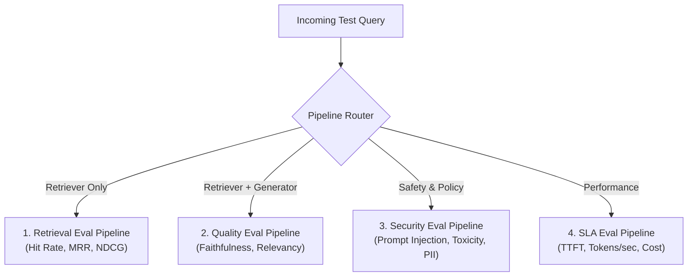

# 📹 Why Your AI Application Needs Multiple Eval Pipelines?

<div className="video-card" style={{border: '1px solid #30363d', borderRadius: '8px', padding: '16px', marginBottom: '24px', background: 'rgba(56, 139, 253, 0.05)'}}>
  <div style={{display: 'flex', gap: '16px', flexWrap: 'wrap'}}>
    <div><strong>Instructor:</strong> Nitish Singh (CampusX)</div>
    <div><strong>Duration:</strong> 1686</div>
    <div><strong>Course:</strong> Module 6: LLM Evaluation & Observability</div>
    <div><strong>Watch Link:</strong> <a href="https://www.youtube.com/watch?v=DcZ-XCk-O_M" target="_blank" rel="noopener noreferrer">YouTube Lecture ↗</a></div>
  </div>
</div>

## 📌 Executive Summary

Real-world AI systems cannot rely on a single catch-all evaluation pipeline. Different system components require isolated eval pipelines: retriever evals test search algorithms, generator evals test synthesis, safety evals block harmful outputs, and latency evals enforce SLAs.

This lesson explores how to decouple evaluation pipelines to isolate root causes of performance regressions.

---

## 🏗️ System Architecture & Execution Flow



---

## 📖 Core Concepts & Technical Deep Dive

### 1. The Necessity of Decoupled Evaluation
When an end-to-end RAG system outputs an incorrect response, diagnosing the culprit is impossible without decoupled pipelines:
- Did the retriever fail to fetch the correct document?
- Did the retriever fetch the document, but rank it below the top-K cutoff?
- Did the model ignore the retrieved context and hallucinate from parametric memory?
- Did the prompt contain contradictory system instructions?

### 2. Component Pipeline Taxonomy
1. **Retriever Pipeline:** Measures ranking and recall independent of LLM generation.
2. **Generator Pipeline:** Feeds ground truth context directly to the LLM to test synthesis and faithfulness in isolation.
3. **End-to-End Pipeline:** Measures joint system performance under real-world conditions.
4. **Safety & Security Pipeline:** Adversarial red-teaming for jailbreaks, prompt leaking, and sensitive data extraction.

---

## 💻 Production Implementation

```python
def evaluate_decoupled_system(query, ground_truth_doc_ids, retrieved_docs, generated_answer):
    # 1. Evaluate Retrieval in Isolation
    retrieved_ids = [doc["id"] for doc in retrieved_docs]
    hit = any(gid in retrieved_ids for gid in ground_truth_doc_ids)
    mrr = 0.0
    for idx, rid in enumerate(retrieved_ids):
        if rid in ground_truth_doc_ids:
            mrr = 1.0 / (idx + 1)
            break
            
    # 2. Evaluate Generation Output Length & Presence
    has_content = len(generated_answer.strip()) > 20
    
    return {
        "retriever_hit": hit,
        "retriever_mrr": round(mrr, 3),
        "generator_produced_content": has_content
    }

# Example run
res = evaluate_decoupled_system(
    query="Refund policy window",
    ground_truth_doc_ids=["doc_refund_01"],
    retrieved_docs=[{"id": "doc_tos_03"}, {"id": "doc_refund_01"}],
    generated_answer="Customers may request a full refund within 30 days of purchase."
)
print("Pipeline Results:", res)
```

---

## ⚙️ Production Gotchas & Best Practices

:::tip Run Retriever Evals Without LLM Calls
Retriever evaluation (Hit Rate, NDCG) requires zero LLM calls—it only compares document IDs. Run retriever evaluations first; if retrieval fails, there is no need to spend API credits testing generation.
:::

:::warning Component Interference
Do not change retrieval parameters (chunk size, overlap, top-k) at the same time as system prompt instructions. Change one variable at a time to isolate performance deltas.
:::

---

## 📊 Architectural Reference & Comparison

| Pipeline Type | Target Component | Metrics Used | Requires LLM API? |
| :--- | :--- | :--- | :--- |
| **Retrieval** | Vector index, Hybrid search | Hit Rate@K, MRR, MAP, NDCG | No |
| **Generator** | Prompt template, LLM synthesis | Faithfulness, Hallucination score | Yes (Judge LLM) |
| **Safety** | Guardrails, output filters | Toxicity, Jailbreak success, PII leak | Yes (Guardrail model) |
| **Performance**| Host runtime, API latency | TTFT, Total Latency, Token Cost | No |

---

## 📚 Key Takeaways & Enterprise Checklist

- [ ] **Architecture Verification:** Ensure your design addresses latency, decoupled interfaces, and strict data validation contracts.
- [ ] **Deterministic Testing:** Run unit tests and golden dataset evaluations before shipping changes to staging or production.
- [ ] **Security & Observability:** Enforce input/output guardrails, scrub sensitive credentials/PII, and capture distributed traces.
- [ ] **Scalability & Sizing:** Calibrate model parameters, context limits, and compute instance requirements against projected request concurrency.
