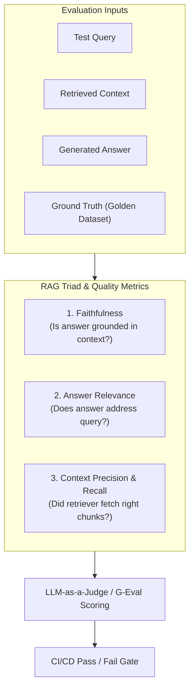

# 📹 LLM Eval Methods ｜ LLM-as-a-Judge ｜ Reference Based Evals Vs Reference Free Evals

<div className="video-card" style={{border: '1px solid #30363d', borderRadius: '8px', padding: '16px', marginBottom: '24px', background: 'rgba(56, 139, 253, 0.05)'}}>
  <div style={{display: 'flex', gap: '16px', flexWrap: 'wrap'}}>
    <div><strong>Instructor:</strong> Nitish Singh (CampusX)</div>
    <div><strong>Duration:</strong> 53m 10s</div>
    <div><strong>Playlist:</strong> LLM Evaluation Complete Series (CampusX)</div>
    <div><strong>Watch Link:</strong> <a href="https://www.youtube.com/watch?v=uQFLY8rQVYA" target="_blank" rel="noopener noreferrer">YouTube Lecture ↗</a></div>
  </div>
</div>

## 📌 Executive Summary & Learning Objectives

This lecture covers **LLM Eval Methods ｜ LLM-as-a-Judge ｜ Reference Based Evals Vs Reference Free Evals**, focusing on production implementations, edge cases, and industry standards:
- Core intuition, architecture, and underlying mechanisms.
- Key differences between theoretical research implementations and scalable enterprise patterns.
- Concrete Python walkthroughs, error recovery, and performance optimization.

---

## 🏗️ Architecture & Conceptual Workflow



---

## 📖 Core Concepts & Technical Deep Dive

### 1. Architectural Foundations
In modern production AI engineering, **LLM Eval Methods ｜ LLM-as-a-Judge ｜ Reference Based Evals Vs Reference Free Evals** is essential for ensuring reliability, low latency, and deterministic outcomes. As AI systems evolve from naive prompt-in / completion-out scripts into distributed systems, engineers must handle:
- **State management & consistency:** Ensuring intermediate states and tool invocations are tracked.
- **Error boundaries & recovery:** Graceful degradation when external LLMs or vector stores encounter rate limits or network partitions.
- **Resource utilization & cost efficiency:** Caching common queries and reducing unnecessary foundation model token expenditure.

### 2. Operational Considerations
- **Latency Optimization:** Pre-computing embeddings, utilizing asynchronous non-blocking event loops, and streaming tokens via Server-Sent Events (SSE).
- **Security & Sandboxing:** Validating inputs before ingestion, sanitizing LLM outputs, and isolating tool execution environments.

---

## 💻 Production Implementation Walkthrough

```python
from deepeval import assert_test
from deepeval.test_case import LLMTestCase
from deepeval.metrics import FaithfulnessMetric, AnswerRelevancyMetric

# 1. Prepare Test Case
test_case = LLMTestCase(
    input="What is the context window of Claude 3.5 Sonnet?",
    actual_output="Claude 3.5 Sonnet features a 200,000 token context window.",
    retrieval_context=["Claude 3.5 Sonnet supports up to 200k tokens of context."]
)

# 2. Define Metrics
faithfulness = FaithfulnessMetric(threshold=0.8)
relevancy = AnswerRelevancyMetric(threshold=0.8)

# 3. Assert Production Test Gate
def test_rag_accuracy():
    assert_test(test_case, [faithfulness, relevancy])
```

---

## 💡 Production Best Practices & Tips

:::tip Production Deployment Guideline
When deploying LLM Eval Methods ｜ LLM-as-a-Judge ｜ Reference Based Evals Vs Reference Free Evals in enterprise environments, always configure automated retries with exponential backoff and telemetry tracing (such as OpenTelemetry or LangSmith).
:::

:::warning Common Failure Modes
Watch out for state contamination across concurrent requests. Ensure each session or user interaction uses an isolated thread ID or execution context.
:::

---

## 🎯 Key Takeaways & Quick Reference

| Dimension | Production Standard | Pitfall to Avoid |
| :--- | :--- | :--- |
| **Execution** | Async / Non-blocking with timeouts | Synchronous blocking calls in event loops |
| **Data Validation** | Strict Pydantic v2 schemas | Untyped dictionary access |
| **Monitoring** | Distributed tracing & latency percentiles | Relying only on standard console logs |

## ⏱️ Lecture Timeline & Key Topics

| Timestamp | Key Topic / Concept Discussed |
| :--- | :--- |
| **00:00:00** | Now the next thing we are going to read is a... |
| **00:14:01** | learned something new or you may have read before about how do you... |
| **00:27:15** | What you do in some complex cases is that... |
| **00:40:13** | evaluated these 50 papers or... |
| **00:53:08** | topic which is left.... |


---

---

## 📜 Complete Lecture Transcript (English)

> **Language:** English | **Source:** `05 - LLM Eval Methods ｜ LLM-as-a-Judge ｜ Reference Based Evals Vs Reference Free Evals ｜ CampusX.hi.srt` | **Total Segments:** 27 | **Word Count:** ~8,717 words

<details>
<summary><b>Click to expand full chronological transcript (27 timestamped intervals)</b></summary>

#### ⏱️ [00:00 ➔ 00:02]

अब अगली चीज जो हम पढ़ने जा रहे हैं ना वो बहुत इंपॉर्टेंट चीज है। ठीक है? पढ़ते हैं। अगली चीज स्टार्ट कर रहे हैं। ठीक है? अ सो या अभी तक हमने ये पढ़ा कि हमें मल्टीपल एलएलएम इव्स बनाने पड़ेंगे। अब हम एक बहुत इंपॉर्टेंट चीज पढ़ने जा रहे हैं जिसको हम बोलते हैं मेथड्स या एलएलएम ईवेल मेथड्स। बेसिकली आप जो ईवेल पाइपलाइन बना रहे हो वह किस मेथड पर वर्क करेगी ये हम पढ़ने जा रहे हैं। ठीक है? तो यहां पे देखो एक डेफिनेशन लिखा हुआ है। एन एलएलएम ईवेल मेथड इज़ द मैकेनिज्म यू यूज टू डिसाइड वेदर एन एलएलएम्स आउटपुट इज गुड ऑ नॉट। द एक्चुअल प्रोसीजर दैट टेक्स एन आउटपुट एंड प्रोड्यूसेस अ जजमेंट अबाउट इट। सो हम इवैल्यूएशन पाइपलाइन क्यों बनाते हैं? हम इवैल्यूएशन पाइपलाइन इसलिए बनाते हैं सो दैट हम यह पता कर पाए कि हमारा कोई कंपोनेंट वर्क फ्लो या एप्लीकेशन सही से काम कर रहा है कि नहीं। बट इवैल्यूएशन पाइपलाइन को कैरी आउट कौन कैरी आउट कौन करता है? हमारा मेथड। ठीक है? प्राइमरीली स्पीकिंग आप कोई भी इवैल्यूएशन पाइपलाइन जब बनाओगे तो उसमें तीन में से कोई एक ही मेथड होता है। पहला है प्रोग्रामेटिक या डिटरमिनिस्टिक मेथड। दूसरा होता है ह्यूमन एज इन ह्यूमन मेथड। बेसिकली ह्यूमन इज अ कैरिंग आउट द इवैल एंड थर्ड होता है मॉडल ग्रेडेड या फिर आप एलएलएम ग्रेडेड भी उसको बोल सकते हैं। ठीक है? तो एकदम कंफ्यूज ना करने के तरीके से अगर मैं बोलूं तो सिंपल शब्दों में इसका मतलब यह हुआ कि आपका जो इवैल्यूएशन पाइपलाइन आपने बनाया उसको एग्जीक्यूट कौन कर रहा है? यही पॉइंट हम डिस्कस कर रहे हैं। क्या उसको एक प्रोग्राम एग्जीक्यूट कर रहा है? क्या उसको एक ह्यूमन एग्जीक्यूट कर रहा है या

#### ⏱️ [00:02 ➔ 00:04]

फिर उसको एक एलएलएम एग्जीक्यूट कर रहा है। यही तीन चीजें होती हैं। इसके अलावा और कुछ नहीं होता। ठीक है? अगर आपको याद होगा पिछली क्लास में मैंने एक एलएलएम इवल पाइप लाइन आपको दिखाया था। शायद आपको याद होगा। यह पाइप लाइन मैंने दिखाया था। और मैंने आपको एक यूज़ केस भी बताया था। अगर आपको याद होगा Zomato के हम एआई इंजीनियर्स हैं और हमारा टास्क क्या है कि कोई भी ईमेल जब आएगा तो हम उसको एक एलएलएम के पास भेजेंगे और वो एलएलएम कैटेगराइज करेगा कि वो ईमेल बिलिंग इशू से रिलेटेड है। टेक्निकल इशू से रिलेटेड है। और एक और क्या था? बिलिंग टेक्निकल और जनरल इशू से रिलेटेड है। हमने यह एप्लीकेशन बनाया था। डस एनीवन रिमेंबर कि यहां पर हमने कौन सा इवल मेथड यूज किया था इन तीनों में से। इन तीनों में से कौन सा इवेल मेथड यूज़ किया था। किसी को याद है? पिछले सेशन में हमने ये डिस्कस किया था। हमने सबसे पहले ये समझा था कि इस पूरे सिनेरियो में हमें एक्यूरेसी को पकड़ना है कि कितना एक्यूरेटली हम क्लासिफाई कर पा रहे हैं। तो ये एक्यूरेसी कैलकुलेट कौन कर रहा था। राइट? हमने Python कोड के थ्रू यह काम करवाया था। तो बेसिकली आप बोल सकते हो कि इट इज प्रोग्रामेटिक। ठीक है? तो वही मैं बोल रहा हूं कि आप कोई भी इवैल्यूएशन पाइपलाइन बनाओगे उसको इन्हीं तीन में से कोई एक चीज कैरी आउट करेगी, एग्जीक्यूट करेगी। या तो प्रोग्राम कैरी आउट करेगा या ह्यूमन कैरी आउट करेगा या फिर मॉडल एज एन एलएलएम कैरी आउट करेगा। तो आज की क्लास में मैं आपको इन तीनों का एक-एक एग्जांपल दूंगा। तीनों टाइप की पाइपलाइन का एक-एक एग्जांपल दूंगा। ठीक है? आई नो मैंने प्रोग्रामेटिक वाले का दे रखा है पास्ट में बट आज मैं उसका और ज्यादा रेलेवेंट एक एग्जांपल दूंगा। ठीक है? तो डिस्कस करते हैं। सबसे पहले डिस्कस करते हैं एक ऐसा ईवेल पाइपलाइन जिसका मेथड

#### ⏱️ [00:04 ➔ 00:06]

है प्रोग्रामैटिक। वी आर डिस्कसिंग अ इवल पाइपलाइन जिसका इवेल मेथड इज़ प्रोग्रामेटिक या फिर साथ में क्या लिखा हुआ था? डिटरमिनिस्टिक प्रोग्रामेटर। ठीक है? तो एग्जांपल ये है कि हमने कैमपस X के लिए एक रैक चैटबॉट बनाने का सोचा। सो दैट कोई भी हमारा यूजर आए तो वो हमारे चैट बॉट से इंटरेक्ट करें और उसको हेल्प मिल जाए और हमें मैनुअली उसको मेल के थ्रू रिप्लाई करने की जरूरत ना पड़े। ठीक है? और मैंने ये सोचा कि यार हमें स्टार्टबॉट को अच्छे से बनाना है। तो मैं इसको हर तरह का ईवेल पाइपलाइन बना के दूंगा। तो सबसे पहले मैंने सोचा कि एक बार हम लोग कंपोनेंट लेवल पर ईवेल पाइपलाइन बना लेते हैं। तो मैंने सबसे पहले पकड़ा रिट्रीवर को और मैंने सोचा कि रिट्रीवर के लिए एक ईवेल पाइपलाइन डिजाइन करते हैं। ठीक है? रिट्रीवर का काम क्या होता है? कि एक क्वेश्चन जैसे ही रिट्रीवर को मिलता है, रिट्रीवर वेक्टर डेटाबेस में से सबसे रेलेवेंट के डॉक्यूमेंट्स उठा के लाता है। यही काम होता है। तो अब मुझे क्या करना है? मुझे चेक करना है कि एग्जजेक्टली ये रिट्रीवर सही से काम कर रहा है कि नहीं। मुझे इस चीज के लिए एक पाइप लाइन बनाना है। ठीक है? और वो पाइप लाइन हम लोग बिल्कुल इस फ्लो के थ्रू बनाएंगे। ठीक है? तो ऑब्वियसली सबसे पहला हमारा काम है कि हमें टास्क और टारगेट डिफाइन करना है। हमारा टास्क क्या है? कि हमारा रिट्रीवर सही से काम करे। और हमारा टारगेट क्या है? एक सिंगल कंपोनेंट व्हिच इज़ रिट्रीवर। ठीक है? नेक्स्ट वी हैव टू डिफाइन अ सक्सेस क्राइटेरिया कि कब हमें कैसे हमें पता चलेगा कि हमारा रिट्रीवर सही से काम कर रहा है। तो गाइस ऑलरेडी स्क्रीन पे वैसे दिख गया होगा बट कोई बता सकता है कि हाउ कैन वी क्वांटिफाई

#### ⏱️ [00:06 ➔ 00:08]

कि एक रिट्रीवर सही से काम कर रहा है। एक रिट्रीवर के सही से काम करने का मतलब अभी जस्ट मैंने आपको बताया। हाउ डू वी क्वांटिफाई इट? चलो मैं आपको बताता हूं। द आंसर इज दिस मैट्रिक। यहां पर जो लिखा हुआ है। रिकॉल एट K यहां पर देखो एक डेफिनेशन लिखा हुआ है। एक बार इसको पढ़ते हैं। आउट ऑफ ऑल द करेक्ट आइटम्स दैट एकिस्ट हाउ मेनी डड द सिस्टम रिट्रीव इन इट्स टॉप के रिजल्ट्स? ये लाइन आपको समझ में आ रही है? ये देखो। मान लो ये क्वेश्चन है। व्हाट आर द प्रीरक्विज़िट्स फॉर एमएल कोर्स एंड हाउ लॉन्ग इट इज़? अब हमने क्या कर रखा है कि हमने अपने सारे कैंपस एक्स के डॉक्यूमेंट्स को चंक करके सारे डॉक्यूमेंट्स को वेक्टर स्टोर में डाल रखा है। अब इस क्वेश्चन के लिए हमें पहले से पता है कि 1001 और 1003 इन दोनों डॉक्यूमेंट्स में सही आंसर छुपा हुआ है। तो इन अ वे इस क्वेश्चन के लिए जो दो सही डॉक्यूमेंट्स हैं वो कौन से हैं? डॉक्यूमेंट नंबर 1001 एंड डॉक्यूमेंट नंबर 103। अब क्या हुआ कि जब मैंने इस क्वेश्चन को अपने रिट्रीवर के पास भेजा और मैंने बोला कि तुम k = 5 डॉक्यूमेंट्स फैच करके लाओ तो वो ये डॉक्यूमेंट्स फैच करके लाया 1001 102 104 105 106 अब आप मुझे बताओ कि इस पर्टिकुलर सिनेरियो में रिकॉल कितना है? कोई बता सकता है? व्हाट इज द रिकॉल? बेस्ड ऑन दिस डेफिनेशन? आप बहुत आसानी से बता सकते हो। ये मेरे सही डॉक्यूमेंट्स हैं और ये मेरे रिट्रीव्ड डॉक्यूमेंट्स हैं। तो कैन यू कैलकुलेट द रिकॉल? इस डेफिनेशन को पढ़ो। आउट ऑफ ऑल द करेक्ट रेलेवेंट आइटम्स दैट एग्ज़िस्ट? कितने

#### ⏱️ [00:08 ➔ 00:10]

करेक्ट डॉक्यूमेंट्स हैं? दो। हाउ मेनी डेट द सिस्टम रिट्रीव इन इट्स टॉप के रिजल्ट्स? ओनली वन? द आंसर इज 1/2 बेसिकली मेरा रिकॉल इज 50% आइडियली होना कितना चाहिए? 100% 100 से ज्यादा नहीं हो सकता। जीरो से कम नहीं हो सकता। तो रिकॉल @ k का यही मतलब होता है। तो किसी भी रिट्रीवर को अगर आपको जज करना है कि वो सही से काम कर रहा है कि नहीं तो उसको जज करने का एक बहुत अच्छा तरीका होता है कि आप उसका रिकॉल एट के निकाल लो जो मैंने अभी आपको कैलकुलेट करके दिखाया। इसके अलावा भी चीजें होती हैं। प्रसीजन भी एक चीज होती है। रैंक भी आप निकालते हो वो भी होता है। लेकिन फिलहाल अभी के डिस्कशन के लिए लेट्स कीप इट सिंपल कि हमारा सक्सेस क्राइटेरिया क्या है? रिकॉल @ k। ठीक है? यहां तक का डिस्कशन समझ में आया? हम क्या कर रहे हैं? हम हमारे रिट्रीवर को इवैल्यूएट कर रहे हैं। और इवैलुएट करने के लिए हमने सक्सेस क्राइटेरिया क्या डिफाइन किया कि हम उसका रिकॉल कैलकुलेट करेंगे। उसके बाद अगली चीज क्या थी कि हमें एक डेटा सेट बनाना होता है। तो वो हमने बनाया ये जो आपको स्क्रीन पर दिखाई दे रहा है। दिस इज द डेटा सेट। इस डेटा सेट में हमने क्या किया कि हमने 50 100 ऐसे क्वेश्चंस को निकाला जो यूज़र्स पूछ सकते हैं फ्यूचर में। जब ये वेबसाइट पे लाइव होगा हमारा चैट पॉट। ठीक है? तो यहां पे वी ट्राइड टू कवर ऑल द केसेस, एज केसेस, डिफिकल्ट क्वेश्चंस, ईजी क्वेश्चंस, रैंडम क्वेश्चंस सब तरह के क्वेश्चंस का हमने सैंपलिंग करके एक डेटा सेट बनाया। ये रहे वो क्वेश्चंस और फिर हमने एक ह्यूमन एक्सपर्ट को बैठाया। हमने उसको बोला कि यह क्वेश्चन को पकड़ो, देखो और फिर हमारे वेक्टर डेटाबेस में जाकर खोजो कि आउट ऑफ ऑल द डॉक्यूमेंट्स कौन सा डॉक्यूमेंट के अंदर इस क्वेश्चन का सही आंसर छुपा हुआ है। तो एक तरीके से हम अपना

#### ⏱️ [00:10 ➔ 00:12]

गोल्डन डेटा सेट यहां पे बना रहे हैं। ठीक है? तो ये हमने 50 से 100 क्वेश्चंस के लिए किया। ये हमारा डेटा सेट रेडी हो गया। यहां तक कोई प्रॉब्लम है? इज इट क्लियर? अब देखो फिर हमने क्या किया? हमने डिफाइन किया एक इवैल्यूएशन मेथड। इवैल्यूएशन मेथड बहुत सिंपल है। यहां पे हम प्रोग्रामेटिकली ये डिटरमाइन करेंगे कि हमारा रिकॉल कितना है। कैसे? मैं आपको बताता हूं। बहुत सिंपल है। हम क्या करेंगे? इन 50 के 50 क्वेश्चंस को उठाएंगे और उसको हमारे रिट्रीवर के पास भेज देंगे। ठीक है? सिर्फ रिट्रीवर के पास। पूरे रैक चैटवर्ड के पास नहीं सिर्फ रिट्रीवर के पास। सो हमने क्या किया? इस पहले क्वेश्चन को उठाया रिट्रीवर के पास भेज दिया। और रिट्रीवर का K कितना है? बाय द वे k है फाइव। ठीक है? तो रिट्रीवर ने क्या किया? इस पहले क्वेश्चन के लिए Q1 के लिए उसने ये पांच डॉक्यूमेंट्स निकाल के दिए। ठीक है? फिर हमने सेकंड क्वेश्चन को भेजा। फिर उसने सेकंड क्वेश्चन के लिए ये पांच डॉक्यूमेंट्स निकाल के दिए। फिर सेम फॉर थर्ड, फोर्थ एंड फिफ्थ। हमने हर क्वेश्चन के लिए डॉक्यूमेंट्स रिट्रीव कर लिए। अब देखो मेरे पास ओरिजिनल करेक्ट आंसर भी है और मेरे पास ये भी है कि रिट्रीवर कितना कौन सा डॉक्यूमेंट्स लेके आया। तो अब मैं क्या करूंगा? पर रो बेसिस पे या पर क्वेश्चन बेसिस पे रिकॉल कैलकुलेट कर लूंगा। जैसे फॉर द फर्स्ट क्वेश्चन अगर आप देखो तो सारा इंफॉर्मेशन एक ही डॉक्यूमेंट में था 1001 में और मेरा रिट्रीवर 1001 को खोज के लाया। तो टोटल 1001 ही था और 1001 को हम खोज के ले आए। तो इस केस में हमारा रिकॉल इज़ 100% वन। सेकंड वाला अगर आप देखो तो 1001 एंड 1003 था वो 1001 को भी खोज के लाया और 103 को नहीं ला पाया। तो इस केस में फाइव हो गया। और ये हम हर क्वेश्चन के

#### ⏱️ [00:12 ➔ 00:14]

लिए कैलकुलेट करते जाएंगे। करते जाएंगे। एंड एंड में फाइनली हम इस पूरी क्वांटिटी को एवरेज कर देंगे। और एवरेज करने से हमें मिल जाएगा हमारे पूरे डेटा सेट के ऊपर हमारा रिकॉल @ k रिकॉल @ k ठीक है? अब ये जो क्वांटिटी है ये हमें बता रही है कि हमारा रिट्रीवर कितना सक्सेसफुल है रेलेवेंट डॉक्यूमेंट्स फच करके लाने में। ये पूरी चीज आपको समझ में आई? बेसिकली हमने क्या किया? हमने इवैल्यूएशन मेथड क्या डिफाइन किया? प्रोग्राम। हमने एक प्रोग्राम लिख दिया। ये पूरा काम करने के लिए। वो प्रोग्राम ये सारा काम कर रहा है। और हमने रन किया। इवैल्यूएट किया रिजल्ट तो 67% हमारा रिकॉल आया। अब हम क्या करेंगे? हम उन केसेस उन क्वेश्चंस को जाके डीपली स्टडी करेंगे जहां पे हमारा रिकॉल बहुत खराब है। और फिर उन क्वेश्चंस को एनालाइज करने के बाद हम अपने मॉडल को नहीं इस केस में रिट्रीवर को इंप्रूव करने की कोशिश करेंगे। अब रिट्रीवर में आप क्या-क्या इंप्रूव कर सकते हो? बहुत सारी चीजें कर सकते हो। आप सबसे पहले तो अपना एंबेडिंग मॉडल है उसको इंप्रूव कर सकते हो। हो सकता है आपका एंबेडिंग मॉडल ही सही तरीके से सिमेंटिक मीनिंग कैप्चर नहीं कर पा रहा है। आप चाहो तो क्वेरी का एक्सपेंशन कर सकते हो। आप डायरेक्टली यूजर ने जो क्वेश्चन पूछा वो ना भेज करके पहले एक एलएलएम के थ्रू उस क्वेश्चन को थोड़ा एक्सपैंड करोगे और फिर उस एक्सपैंड क्वेश्चन को रिट्रीवर के पास भेजोगे। दैट कैन बी वन थिंग। आप k की वैल्यू इनक्रीस कर सकते हो। अभी हमने k = 5 कर रखा है। तो k = 10 ट्राई करके देखोगे या फिर आप रीरैंकिंग ट्राई कर सकते हो। ऐसा हो सकता है कि आपके टॉप 10 में था बट टॉप फाइव में नहीं आ पाया। तो आपने एक रीरेंकर लगाया तो जो चीज एट पे थी वो थ्री पे आ गई। तो अब ऑटोमेटिकली आप बेटर रिजल्ट्स देख पा रहे हो। तो दिस इज़ हाउ यू डू अ कंपोनेंट लेवल अ प्रोग्रामैटिक इवैल। तो ये एग्जांपल था एक प्रोग्रामैटिक इवल कैसे रन किया जाता है उसका। और इस प्रोसेस में आपने एक नई

#### ⏱️ [00:14 ➔ 00:16]

चीज सीखी या आपने शायद पहले भी पढ़ा होगा कि हाउ डू यू इवैलुएट अ रिट्रीवर रिकॉल @ k क्या होता है। ठीक है? बहुत डीप नहीं जा रहे बस ऊपर ऊपर से ही आपको इनेशन दे रहे हैं। बट आई होप आपको पॉइंट समझ में आ गया कि एक प्रोग्रामेटिक तरीके से आप कैसे इवैल्यूएशंस को कैरी आउट कर सकते हो? सोच के बताओ क्या हमें यहां पे किसी ह्यूमन की जरूरत पड़ी इवैलुएट करने के लिए रिट्रीवर को? क्या आपको लगा कि किसी ह्यूमन को लाना चाहिए चेक करने के लिए या फिर प्रोग्राम के थ्रू ही हमने अपना काम कर लिया? आई गेस आप समझ पा रहे हो कि एक प्रोग्राम अगर कर पा रहा है तो हम किसी ह्यूमन को पिक्चर में क्यों लेके आए? ह्यूमंस आर कॉस्टली सैलरी देनी पड़ेगी। देखो रेलेवेंसी के कई एस्पेक्ट्स हो सकते हैं। एक एस्पेक्ट ये है कि जितने सही डॉक्यूमेंट्स थे उनमें से आप कितनों को फच करके ला पाए वेक्टर डेटाबेस में। दैट इज वन एस्पेक्ट ऑफ रेलेवेंसी। सेकंड एस्पेक्ट ऑफ रेलेवेंसी कुड बी जितने डॉक्यूमेंट्स आप लाए उनमें से कितने यूज़फुल नहीं थे। तीसरा एस्पेक्ट ये हो सकता है कि जो भी डॉक्यूमेंट्स आए क्या वो प्रॉपर्ली रैंक थे कि नहीं। तो हम एक एस्पेक्ट को कवर कर रहे हैं कि जितने एक्चुअल रेलेवेंट डॉक्यूमेंट्स थे। ये हमें किसने बताया? यह हमें उस बंदे ने बताया जिसने गोल्डन डेटा सेट क्रिएट किया। उस बंदे ने हमें बताया कि देखो भाई इस क्वेश्चन से रिलेटेड सिर्फ एक ही डॉक्यूमेंट है हमारे वेक्टर डेटाबेस में व्हिच इज 1001। ठीक है? इस क्वेश्चन से रिलेटेड सिर्फ दो ही डॉक्यूमेंट्स हैं। 10013। अब आप इसमें से दोनों ले आओगे तो आप सबसे ज्यादा रेलेवेंट इनेशन ला रहे हो। आधा एक ले आओगे तो आप हाफ रेलेवेंट डॉक्यूमेंट्स ले आए। अगर आप दोनों में से कोई भी नहीं ले आए तो आप जीरो रेलेवेंट डॉक्यूमेंट्स लेके आए। तो हम इस तरीके से डिफाइन कर रहे हैं रेलेवेंसी को। अ देखो

#### ⏱️ [00:16 ➔ 00:18]

कोई भी इवल प्रोग्रामेटिक है, ह्यूमन बेस्ड है या फिर मॉडल जनरेटेड है। ये इस बात पर डिपेंड करता है कि जब हम उसको एग्जीक्यूट करते हैं, चलाते हैं तो वो कौन चला रहा है। गोल्डन डेटा सेट क्रिएट करना इज अ सेपरेट एक्टिविटी। एलएलएम ईवेल को एग्जीक्यूट करना, चलाना, स्कोर्स एक्सट्रैक्ट करना ये काम कौन कर रहा है? उसके बेसिस पे ये सारा डिस्कशन हो रहा है। ऑब्वियसली गोल्डन डेटा सेट इज़ क्रिएटेड बाय अ ह्यूमन। अ तो ये एक सेकंड एग्जांपल मैं बता रहा हूं। और इस केस में आप नोटिस करोगे कि आपका जो पूरा का पूरा एग्जीक्यूशन ऑफ इवैल्यूएशन पाइपलाइन है वो एक ह्यूमन करेगा। ठीक है? तो थोड़ी देर के लिए मान लेते हैं कि अगेन वी हैव अ चैट बॉट ऑन कैमपस एक्स वेबसाइट और ये एक जनरल सॉर्ट ऑफ़ चैटबॉट है जिससे आप किसी भी तरह का क्वेश्चन पूछ सकते हो। अगला कोर्स कब ल्च हो रहा है? किसी कोर्स का फीस कितना है? सर्टिफिकेट मिलेगा कि नहीं? कोर्स वैलिडिटी कितना है? इस तरह की चीजें आप पूछ सकते हो। जनरल सॉर्ट ऑफ चार्टबॉट है। ट्रैक चैटबॉट है। ऑब्वियसली हमारे डॉक्यूमेंट्स के ऊपर आंसर करेगा। ठीक है? अब हमें इस चार्ट बॉट को इवैलुएट करना है कि यह सही से काम कर रहा है कि नहीं। ठीक है? और हम सेफ्टी और ऑपरेशंस वाला पार्ट इवैलुएट नहीं कर रहे। हम एप्लीकेशन क्वालिटी वाला पार्ट इवैलुएट कर रहे हैं। हेल्पफुलनेस ऑफ द आंसर को हम इवैलुएट कर रहे हैं कि जब किसी यूजर ने कोई क्वेश्चन पूछा उसको जो जवाब मिला क्या वो हेल्पफुल था कि नहीं? इस चीज को हम इवैल्यूएट कर रहे हैं। ठीक है? तो हमारा टास्क हमारा टारगेट क्या है? हमारा पूरा का पूरा एप्लीकेशन नॉट वन कंपोनेंट नॉट वन वर्क फ्लो द एंटायर एप्लीकेशन। और हमारा टास्क क्या है? टू इवैलुएट

#### ⏱️ [00:18 ➔ 00:20]

इट्स हेल्पफुलनेस। ठीक है? हेल्पफुलनेस का मतलब होता है कि आपका जो आंसर निकल के आया वो एक्यूरेट था। उसका टोन सही था और वो आंसर खुद में कंप्लीट था। यही डिफाइन करता है हेल्पफुलनेस को। ठीक है? तो अब यहां पे भी सबसे पहले आपको क्या करना है? एक सक्सेस क्राइटेरिया डिफाइन करना है। अब यहां पे आप देखोगे कि एक सक्सेस क्राइटेरिया डिफाइन करना इज़ वेरी ट्रिकी। बिकॉज़ आप क्या कर रहे हो? आप एक पूरे एप्लीकेशन को इस बात पे इवैल्यूएट कर रहे हो कि वो हेल्पफुल है कि नहीं? हाउ वुड यू डिफाइन अ मैट्रिक फॉर दिस? द आंसर इज़ देयर इज नो करेक्ट मैट्रिक। ये बिजनेस टू बिनेस वेरीरी करेगा। राइट? तो हमने क्या किया? हमने कैंपस एक्स के हिसाब से एक काइंड ऑफ रूब्रिक डिफाइन कर दिया। एक क्राइटेरिया डिफाइन कर दिया हेल्पफुलनेस का वन टू फाइव के ऊपर। फाइव अगर हम दे रहे हैं इसका मतलब यह हुआ कि जो आंसर निकल के आया है चैट बॉट से वो सबसे पहले तो सही है, एक्यूरेट है, कंप्लीट है और एकदम सही टोन में है। ठीक है? थ्री का मतलब पार्शियली हेल्पफुल है। वन का मतलब एकदम ही हेल्पफुल नहीं है। कुछ और ही बोलने लग गया। ठीक है? तो ये हमारा काइंड ऑफ़ एक सक्सेस क्राइटेरिया हमने डिफाइन कर दिया। उसके बाद हमने क्या किया? हमने एक डेटा सेट बिल्ड किया। इवैल्यूएशन में आपको डेटा सेट चाहिए होता है। तो हमने क्या किया? हमने कुछ 50 100 क्वेश्चंस का फिर से एक चैट बॉट बनाया। एक डेटा सेट बनाया। जहां पे हमने फिर से कवरेज पॉइंट ऑफ व्यू से सोचा कि सब कुछ डाल के रखें। नॉर्मल वाले क्वेश्चंस, डिफिकल्ट वाले क्वेश्चंस, एज केसेस, रैंडम क्वेश्चंस जो भी मेरा यूजर पूछ सकता है, उसका एक रिप्रेजेंटेशन मैंने इस डेटा सेट में डालने की कोशिश की। अब इस डेटा सेट में एक चीज आपको ध्यान देना है कि सिर्फ एक ही कॉलम है व्हिच इज़ द क्वेश्चन दैट इज़ बीइंग आस्क्ड टू द चैटबॉट। हाउ लॉन्ग इज़ द एमएल

#### ⏱️ [00:20 ➔ 00:22]

कोर्स? इज़ द एमएमएल कोर्स राइट फॉर मी इफ आई ऑलरेडी नो Python? व्हाट्स द फी फॉर द डीएल कोर्स? डू आई गेट अ रिफंड इफ आई ड्रॉप आउट मिड वे? कैन आई पे फी इंस्टॉलमेंट? जिस तरह के भी क्वेश्चंस पूछे जा सकते हैं, उसके हमने 50 सैंपल्स निकाल के इस डेटा सेट में डाल दिया। ठीक है? उसके बाद नेक्स्ट इज़ डिफाइन एन इवैल्यूएशन मेथड। अब यहां पे आप मुझे बताओ कि ये जो हमें हेल्पफुलनेस फिगर आउट करना है इस एप्लीकेशन का। क्या आप इसको प्रोग्रामेटिकली अ मेजर कर सकते हो? क्या कोई प्रोग्राम आप ऐसा लिख सकते हो जो प्रोग्राम हमें बता दे? ऑटोमेटेड तरीके से कि यह जो चार्टबॉट है यह हेल्पफुल है। इज इट पॉसिबल और डू यू फील कि यह बहुत न्यूस्ड है और यहां पे आपको ह्यूमन जजमेंट की जरूरत पड़ेगी। व्हाट डू यू फील? डू यू फील कि कोई प्रोग्राम लिख के यू कैन राइट सम पीस ऑफ कोड जो यह पूरा इवैल्यूएशन करके आपको बता देगा कि हां ये चार्टबॉट आपका 70% हेल्पफुल है। 90% हेल्पफुल है। और डू यू फील कि ये उससे ज्यादा नवांस्ड है और आपको एक ह्यूमन के जजमेंट की यहां पे जरूरत पड़ेगी। जस्ट लेट मी नो। प्रोग्राम से कर सकते हो या फिर यह बहुत ज्यादा डिफिकल्ट टास्क है। और यहां पे ह्यूमन इज रिक्वायर्ड। आई गेस आप समझ पा रहे हो। यहां पे ह्यूमन की जरूरत पड़ेगी। ठीक है? तो यहां पे आप क्या करते हो? आप का जो इवैल्यूएशन मेथड है वो ह्यूमन बन जाता है। बेसिकली आपको एक ह्यूमन की जरूरत पड़ेगी। अब आप क्या करते हो? आप मॉडल को रन करते हो। बेसिकली आप अपने इवैल्यूएशन पाइपलाइन को ट्रिगर करते हो। पूरा पाइपलाइन कैसे काम करता है कि आप एक-एक क्वेश्चन उठाते हो और उसको अपने चार्टबॉट के पास भेजते हो। चार्टबॉट क्या करता है? चार्ट डॉट आंसर जनरेट करता है। ठीक है? उसके बाद आप अपना एक बंदा बिठा देते हो। और उस बंदे को आप ये इंस्ट्रशंस दे देते हो। ये इंस्ट्रशंस देखो। इस क्वेश्चन को

#### ⏱️ [00:22 ➔ 00:24]

देखो। इस आंसर को देखो और एक ग्रेड दो। फिर अगला क्वेश्चन उठाया। उसको चैटबॉट के पास भेजा। एक आंसर मिला। ह्यूमन को बोला यह क्वेश्चन देखो कि आंसर देखो एक नंबर असाइन करो बेस्ड ऑन द रब्रिक दैट वी हैव डिफाइंड सेम यू डू फॉर द एंटायर डेटा सेट अब जनरली आप क्या करते हो एक से ज्यादा ह्यूमंस को बिठाते हो जैसे ये है आपका ग्रेडर ए आपका ग्रेडर बी कोई सोच के बता सकता है एक से ज्यादा ह्यूमन बिठाने का क्या फायदा हो सकता है एक ह्यूमन बिाने का तो काम समझ में आ रहा है उसका जजमेंट को हम ट्रस्ट कर रहे हैं। दो ह्यूमंस बिठा के या दो से ज्यादा ह्यूमंस को बिठा के क्या फायदा हो सकता है? एक स्ट्रेट फॉरवर्ड फायदा ये है कि अगर आपके दोनों ग्रेडर्स का जो ग्रेडिंग है वो बहुत सारे क्वेश्चंस पे मैच नहीं कर रहा तो इससे क्या कंक्लूड कर सकते हो आप? सोच के बताना। दो बंदों को बिठाया। चैटबॉट का आंसर दिखाया। एक बोल रहा है मैं इसको दो नंबर दूंगा। दूसरा बोल रहा है मैं चार नंबर दूंगा। तो बार-बार वो डिफर कर रहे हैं। इससे क्या समझ में आ रहा है? इससे एक चीज ये समझ में आ रही है कि देयर इज सम एंबिग्विटी इन योर रब्रिक। जो आपने क्राइटेरिया डिफाइन किया है उसमें प्रॉब्लम हो सकती है। तो कई बार क्या किया जाता है कि एक से ज्यादा ग्रेडर्स को बिठाया जाता है जस्ट टू रिफाइन दिस रब्रिक। अगर ये लोग एग्री करने लग जा रहे हैं बहुत ज्यादा इट मींस दिस इंस्ट्रक्शन इज प्रीिटी क्लियर। अगर ये लोग डिसए्री कर रहे हैं तो ऊपर वाला इंस्ट्रक्शन इज ए्बिगुअस। उसकी वजह से दोनों कंफ्यूज हो रहे हैं और इस तरह के नंबर्स आ रहे हैं। तो यह पॉइंट बस मैं कवर करना चाहता था इसलिए मैंने यहां पे इस ग्रेडर को रख दिया। बट फिलहाल आप मान सकते हो कि देयर इज़ ओनली वन ह्यूमन जो कि क्या कर रहा है?

#### ⏱️ [00:24 ➔ 00:26]

आपके लिए सारे इवैल्यूएशंस कर रहा है। ठीक है? और फाइनली आप क्या करोगे? आप इसका एवरेज निकाल लोगे और आपको पता चल जाएगा कि आपका हेल्पफुलनेस स्कोर क्या है और यह निकल के किसकी वजह से आया? आपके ह्यूमन की वजह से आया। तो दिस इज़ अ सिंपल वेरी सिंपल सिनेरियो जहां पे ह्यूमन पिक्चर में आ के आपके अ इवैल्यूएशन पाइपलाइन को पूरा एंड टू एंड कैरी आउट कर रहा है। ठीक है? तो अगेन अ वेरी सिंपल एग्जांपल जस्ट वांटेड टू शो यू कि ह्यूमन पिक्चर में कैसे आता है। यहां पे एक चीज और मैं क्लियर करना चाहूंगा कि एलएलएम इव्स में ह्यूमंस सिर्फ एक तरीके से इवैल्यूएशन नहीं करते। एक से ज्यादा तरीके से इवैल्यूएशन करते हैं। ये जो मैंने आपको तरीका बताया ये सबसे सिंपल तरीका है कि चैटबॉट का आंसर देख के उसको एक स्कोर दे रहा है। ये सब सबसे सिंपल इवैल्यूएशन है जो ह्यूमंस करते हैं। इसके अलावा भी कुछ और चीजें हैं जो ह्यूमंस परफॉर्म करते हैं। कुछ और टाइप के इवैल्यूएशंस है जो ह्यूमन परफॉर्म करते हैं। कितने लोगों ने यहां पे रेड टीमिंग का नाम सुना है? रेड टीमिंग इज बेसिकली अ सिचुएशन वेयर अ ग्रुप ऑफ इंडिविजुअल्स ह्यूमंस जानबूझ के किसी एलएलएम बेस्ड सिस्टम को अटैक करते हैं और फिगर आउट करने की कोशिश करते हैं कि कहां पे सिस्टम ब्रेक कर रहा है। तो जब भी यह बड़े-बड़े एलएलएम्स ल्च होते हैं उसके पहले ऐसी टीम्स होती है रेड टीमिंग टीम्स जो क्या करती है कि सिस्टम को ब्रेक करने की कोशिश करती है और फिर जहां पे ब्रेक होता है वो डेटा निकाल के वापस डेवलपमेंट टीम के पास भेजा जाता है और उसको फिक्स किया जाता है। तो रेड टीमिंग इज आल्सो अ काइंड ऑफ़ इवैल्यूएशन जो ह्यूमंस परफॉर्म करते हैं। बट इट इज़ अ डिफरेंट काइंड ऑफ़ इवैल्यूएशन जो हमने अभी पढ़ा उससे अलग है। सेकंड एक और टाइप ऑफ इवैल्यूएशन में ह्यूमंस हेल्प करते हैं। एबी टेस्टिंग। सो सपोज आपके दो वर्जनंस ऑफ चैट बॉट्स हैं। आप दोनों को प्रोडक्शन में डाल दो और उनको एबी टेस्ट करो और आप अपने ह्यूमंस एज इन यूज़र्स को बता रखा है कि आप रेट करो आपको कैसा लग रहा है अभी तक का एक्सपीरियंस जिसमें

#### ⏱️ [00:26 ➔ 00:28]

ज्यादा अच्छा रेटिंग आ रहा है उस वाले वर्जन को आप सेलेक्ट करके पूरे के पूरे रीजन पे डिप्लॉय कर देते हो। तो यहां पे क्या हो रहा है? योर यूज़र्स आर इवैल्यूएटिंग योर एप्लीकेशन इन प्रोडक्शन। तो यह भी एक तरीके का इवैल्यूएशन है जो ह्यूमंस ही परफॉर्म कर रहे हैं। बट इट इज अ डिफरेंट काइंड ऑफ इवैल्यूएशन। जो हमने पढ़ा उससे अलग है। डायरेक्ट ग्रेटिंग और रेटिंग तो हमने अभी जस्ट पढ़ा जो अभी हमने पूरा ये फ्लो चार्ट देखा। एक और काइंड ऑफ इवैल्यूएशन आपका ह्यूमंस करते हैं। जब वो गोल्डन डेटा सेट बनाते हैं। अभी थोड़ी देर पहले किसी ने क्वेश्चन भी किया कि जब हम प्रोग्रामेटिक वाला कर रहे थे वहां पे भी तो गोल्डन डेटा सेट बनाने में ह्यूमंस की जरूरत पड़ी थी। तो दैट इज आल्सो अ काइंड ऑफ़ इवैल्यूएशन। अगर मैं जाकर के यह बता रहा हूं कि इस पर्टिकुलर क्वेश्चन के लिए इस पर्टिकुलर क्वेश्चन के लिए यहां पर इस डॉक्यूमेंट में आंसर छुपा है तो मैं एक तरह का इवैल्यूएशन ही तो परफॉर्म कर रहा हूं। तो एक और टाइप ऑफ इवैल्यूएशन इज़ जब ह्यूमंस पिक्चर में आके गोल्डन डेटा सेट और न्यूब्रिक्स डिफाइन करते हैं। एंड द लास्ट वन इज़ ह्यूमन इन द लूप। कभी-कभी इतने कॉम्प्लेक्स केसेस आ जाते हैं जहां पर आप सिर्फ प्रोग्रामेटिक या एलएलएम बेस्ड इवैल्यूएशंस के ऊपर ट्रस्ट नहीं करते। कुछ कॉम्प्लिकेट केसेस में क्या करते हो कि आप जजमेंट को पास कर देते हो ह्यूमन के पास। तो बेसिकली ह्यूमन इज आल्सो इन द पिक्चर। अगर एलएलएम हैंडल नहीं कर पा रहा या प्रोग्रामेटिक चेक्स उसको हैंडल नहीं कर पा रहे या कुछ थ्रेशहोल्ड बन जा रहा है। एक ग्रे एरिया बन जा रहा है तो वहां पे यू पास ऑन द रिस्पांसिबिलिटी टू अ ह्यूमन। और ह्यूमन अपनी जजमेंट के बेसिस पे आपको आंसर निकाल के देता है। तो ह्यूमन इन द लूप इज आल्सो अ काइंड ऑफ इवैल्यूएशन जो पिक्चर में आता है। तो नटशेल में ह्यूमंस पांच तरह के इवैल्यूएशंस परफॉर्म करते हैं एलएलएम्स के वर्ल्ड में। डायरेक्ट ग्रेडिंग एंड रेटिंग जो मैंने आपको ऊपर ये दिखाया। रेड टीमिंग, एबी टेस्टिंग, इंट्रोडक्शन, गोल्डन डेटा सेट क्रिएशन एंड ह्यूमन इन द लूप। तो हमने

#### ⏱️ [00:28 ➔ 00:30]

दो इवैल्यूएशन मेथड्स पढ़ लिए। प्रोग्रामेटिक एंड ह्यूमन। अब जल्दी से मुझे ये बताओ कि ह्यूमन बेस्ड इवैल्यूएशन मेथड का सबसे बड़ा डिसएडवांटेज क्या है? नहीं सबसे पहले ये बताओ एडवांटेज क्या है? नहीं नहीं सबसे पहले एडवांटेज बताओ। व्हाट इज द बिगेस्ट एडवांटेज? जब आप एलएलएम बेस्ड एप्लीकेशन को इवैलुएट करने के लिए किसी ह्यूमन को यूज करते हो तो इसका सबसे बड़ा एडवांटेज क्या है? ह्यूमंस क्या बेनिफिट लेके आ रहे हैं? यस देयर जजमेंट इज रिलायबल। अगर आप किसी सलीके के बंदे को हायर करके काम पे लगा रहे हो तो आप ट्रस्ट करोगे उसके जजमेंट को। एक ह्यूमन ब्रेन कैन ईजीली फिगर आउट दिस थिंग इन कंपैरिजन टू अ मशीन। राइट? तो इट इज़ मच मोर रिलायबल इन कंपैरिजन टू सम प्रोग्राम और एलएलएम। तो रिलायबिलिटी बहुत हाई होती है। ट्रस्ट ज्यादा रहता है सिस्टम में। बट द डिस डिसएडवांटेज इज़ कैन यू टेल मी व्हाट इज द डिसएडवांटेज? ह्यूमंस को पिक्चर में लाने का। सबसे बड़ा डिसएडवांटेज इज़ कॉस्ट। आपको लोगों को हायर करने के पैसे देने पड़ेंगे। वही सबसे बड़ा डाउन साइड है। एंड दैट इज व्हाई अगर आपका कोई एप्लीकेशन एट स्केल काम कर रहा है, लाखों करोड़ों यूज़र्स उसको यूज कर रहे हैं, तो वहां पर इवैल्यूएशन के लिए मोस्ट लाइकली आप ह्यूमंस को यूज़ नहीं कर सकते। इट वुड बी कॉस्टली। ठीक है? तो व्हाट इफ देयर इज़ अ सिनेरियो जहां पे हम प्रोग्रामेटिक वाला चीज यूज़ नहीं कर सकते। बिकॉज़ जो चीज हम इवैलुएट करना चाह रहे हैं वो बहुत ए्बगुअस है। सच एज वी वांट टू इवैलुएट कि एक चैटबॉट कितना हेल्पफुल है। तो वहां पे हम प्रोग्रामैटिक वाला चेक्स नहीं लगा सकते। बट एट द सेम टाइम हम वहां ह्यूमंस को भी नहीं बैठा सकते बिकॉज़ ह्यूमंस आर कॉस्टली। तो व्हाट इज द अल्टरनेटिव? दोनों के बीच में क्या है?

#### ⏱️ [00:30 ➔ 00:32]

प्रोग्रामेटिक और ह्यूमन के बीच में क्या चीज आ सकती है? जो जिसके अंदर प्रोग्राम्स की भी खूबियां हैं और ह्यूमंस की भी खूबियां हैं। राइट? आई गेस आपको समझ में आ गया। द आंसर इज़ एलएलएम्स व्हिच इज़ आवर थर्ड कैटेगरी। जब आप इवैल्यूएशन के लिए एलएलएम्स को यूज़ करते हो। दिस इज़ द थर्ड कैटेगरी और ये सबसे यूज़फुल कैटेगरी है। अगर आप इसको सही तरीके से यूज़ करो। एंड दैट इज़ व्हाई आप देखोगे कि मोस्ट ऑफ द एलएलएम इवैल्यूएशन पाइपलाइंस जो बनाई जाती हैं दे आर मोस्टली अ बेस्ड ऑन एलएलएम्स। जो वहां पर इवैल्यूएशन मेथड होता है वो मॉडल ग्रेडेड या फिर आप बोल सकते हो एलएलएम ग्रेडेड होता है। और यहां पर जो टेक्निक एक यूज की जाती है जो कि बहुत पॉपुलर टेक्निक है जो आप इस कोर्स में बहुत ज्यादा पढ़ोगे उसको बोला जाता है एलएलएम एज अ जज। आप एलएलएम को एक जज की तरह यूज़ करते हो टू इवैलुएट समथिंग। और अब मैं आपको इसका एक बहुत इंटरेस्टिंग एग्जांपल यूज़ केस दिखाऊंगा। तो केस स्टडी के पहले मैं थोड़ा सा एक सेटअप क्रिएट कर देता हूं। सेटअप यह है कि आई एम अ वेबसाइट और YouTube चैनल जो यूपीएससी का प्रिपरेशन कराता है। यूपीएससी पता होगा आपको। राइट? इंडिया का सबसे डिफिकल्ट एग्जाम बोला जाता है। इस एग्जाम को क्रैक करके आप आईएएस ऑफिसर बनते हो। और किसी को पता है यूपीएससी एग्जाम का पैटर्न क्या होता है? क्या-क्या स्टेजेस होते हैं? किसी ने किया है? किसी के दुख दर्द हैं यहां पे? कितने राउंड्स होते हैं यूपीएससी एग्जाम में? प्रीलिम्स, मेंस एंड इंटरव्यू। राइट? सो देयर इज अ प्रीलिम्स। देन जो पास करते हैं उनको एक मेंस एग्जाम देना पड़ता है और फिर आता है इंटरव्यू और इसके बाद आपकी सिलेक्शन होती है। ठीक है? प्रीलिम्स इफ आई एम नॉट रोंग एमसीक्यू बेस्ड होता है। करेक्ट में इफ आई एम रोंग। मेंस में सब्जेक्टिव होता है। राइट? यू हैव टू राइट सब्जेक्टिव आंसर्स। दैट इज़ करेक्ट। राइट? ओके। ठीक है? तो सेटअप ये है कि हमारी एक वेबसाइट है उसका नाम है

#### ⏱️ [00:32 ➔ 00:34]

कैमपस एक्स यूपीएससी ठीक है और हम क्या कराते हैं? हम यूपीएससी का प्रिपरेशन कराते हैं बोथ प्रीलिम्स एंड मेंस का। ठीक है? ओवर टाइम हमने ये रियलाइज़ किया कि हम लोग क्या कर सकते हैं? हम लोग एक ऑटोमेटेड टेस्ट कंडक्ट कर सकते हैं। जिसमें हम मतलब प्रीलिम्स [गला साफ़ करने की आवाज़] के लिए तो ऑटोमेटेड टेस्ट कंडक्ट करना बहुत आसान है। बिकॉज़ इट्स अ एमसीक्यू बेस्ड एग्जाम। ये तो बहुत आसानी से कोई भी कंडक्ट कर सकता है। मेंस के लिए एक ऑटोमेटेड टेस्ट कंडक्ट करना मुश्किल है। बिकॉज़ यहां पे जो आंसर्स हैं वो सब्जेक्टिव है। व्हिच मींस कि आपको आंसर्स को इवैलुएट करने के लिए सब्जेक्ट मैटर एक्सपर्ट्स चाहिए। अब हमारी प्रॉब्लम यह है कि हमारे YouTube चैनल पर लाखों बच्चे आते हैं और हमारा ये एग्जाम लाखों बच्चे दे सकते हैं। तो मेरे लिए बहुत ज्यादा बड़ी अर्निंग ओपोरर्चुनिटी है। मैं बहुत पैसे कमा सकता हूं। द ओनली प्रॉब्लम इज कि अगर मान लो 10,000 बच्चे भी बैठ गए हमारे मॉक टेस्ट में। तो हमें इन 10,000 बच्चों का सब्जेक्टिव पेपर इवैल्यूएट करना पड़ेगा। अब सोच के देखो कि हमें कितने सब्जेक्ट मैटर एक्सपर्ट्स चाहिए पड़ेंगे और इन सब्जेक्ट मैटर एक्सपर्ट्स को हमें पर पेपर इवैल्यूएशन बेसिस पे पेमेंट करना पड़ेगा। तो मेरी प्रॉफिटेबिलिटी घट गई। राइट? बट तभी सडनली से एक कंपनी मेरे पास आई और उन्होंने बोला कि हमने एक प्लेटफार्म बनाया है। उस प्लेटफार्म पे आप कितने भी बच्चों को भेज दो। हमारे पास एक एलएलएम बेस सिस्टम है जो आपके डिफाइंड रूब्रिक्स के बेसिस पर कितने भी बच्चों का लाखों बच्चों का भी इवैल्यूएशन परफॉर्म करके दे देगा और आपको बस फ्रैक्शन ऑफ अ कॉस्ट हमें देना है। तो डू यू थिंक इट मेक्स बिज़नेस सेंस फॉर मी कि मैं इस प्लेटफार्म को यूज़ करूं। राइट? बहुत सिंपल लॉजिकल है। तो यही प्लेटफार्म हमें बनाना है। बट मतलब इस प्लेटफार्म को हमने बना

#### ⏱️ [00:34 ➔ 00:36]

लिया है। अब हमें इसको इवैलुएट करना है। ये टास्क है हमारा। सेटअप समझ में आया गाइस? सेटअप समझ में आ गया? वी आर दिस प्लेटफार्म जो यूपीएससी मॉक मेंस एग्जाम कंडक्ट कराता है और उसका इवैल्यूएशन करके देता है। अब ये सिस्टम सही से काम कर रहा है कि नहीं ये हमें इवैल्यूएट करना है। एट स्केल ह्यूमंस नहीं आ सकते पिक्चर में। एलएलएम्स के थ्रू करना है। ठीक है? तो ये हम करने वाले हैं। अ नेक्स्ट सबसे पहले अ फिर से सेम फ्लो हमें अपना टारगेट और टास्क डिफाइन करना है। हमारा टारगेट ये है कि हमने जो ये एप्लीकेशन बनाया है इसको इवैलुएट करना है कि क्या ये सही तरीके से पेपर्स चेक कर रहा है कि नहीं। ह्यूमन एक्सपर्ट्स की तरह पेपर इवैलुएट कर रहा है कि नहीं। ठीक है? दैट इज़ आवर टास्क। अब यहां पर कैन यू टेल मी कि सक्सेस क्राइटेरिया क्या हो सकता है? यहां पर सक्सेस क्राइटेरिया क्या है? अगर एक चैटबॉट के केस में इट वाज़ हेल्पफुलनेस उसके पहले रिट्रीवर के केस में इट वाज़ रिकॉल @ k तो इस केस में इस पर्टिकुलर प्लेटफार्म के केस में सक्सेस क्राइटेरिया क्या है? व्हाट डज़ सक्सेस लुक लाइक? हम कब इस सिस्टम को सक्सेसफुल मानेंगे? आपके हिसाब से थोड़ा सोच के बताओ। आई वांट यू टू स्पेंड सम टाइम एंड थिंक एंड टेल मी कि ये जो सिस्टम है ये सही काम कर रहा है। ये किस बात पे डिपेंड करेगा? ये सही तरीके से पेपर्स इवैलुएट कर रहा है। ये किस बात पे डिपेंड करेगा? देखो यहां पर मल्टीपल पर्सेक्टिव्स ट्रू हो सकते हैं। यह जो क्वेश्चन मैं आपको पूछ रहा हूं उसमें मल्टीपल आपके आंसर्स हो सकते हैं। मैं बस जानना चाहता हूं कि आप क्या सोच रहे हो? हां हैरी ने बोला सिमिलरिटी स्कोर। हैरी कैन यू टेल मी किस चीज की सिमिलरिटी? किस चीज की सिमिलरिटी? चलो मैं बताता हूं। मैं एक्चुअली थोड़ा सा ना वेक क्वेश्चन पूछ

#### ⏱️ [00:36 ➔ 00:38]

रहा हूं। एम्बिग्वस क्वेश्चन पूछ रहा हूं। इसके मल्टीपल अ आंसर्स हो सकते हैं। मैं आपको बताता हूं कि यहां पे सक्सेस क्राइटेरिया क्या है? हमारे प्लेटफार्म का सक्सेस क्राइटेरिया ये होगा कि अगर मेरा प्लेटफार्म यूपीएससी के आंसर्स को बिल्कुल वैसे इवैलुएट कर पाए जैसे ह्यूमन एक्सपर्ट्स करते हैं। तो आई वुड से कि मेरा प्लेटफार्म इज सक्सेसफुल। डू यू अग्री टू दिस? मैं फिर से बोल रहा हूं। सुन के बताना। अगर मेरा प्लेटफार्म पेपर्स को बिल्कुल वैसे ही इवैलुएट करें जैसे कोई ह्यूमन एक्सपर्ट करता है। तो मैं मान जाऊंगा कि मेरा प्लेटफार्म सक्सेसफुल है। इसको मैं डिप्लॉय कर सकता हूं, लॉन्च कर सकता हूं। इससे पैसे कमा सकता हूं। डू यू अग्री टू दिस? आई गेस मोस्ट ऑफ यू वुड अग्री कि अगर हमारा प्लेटफार्म ह्यूमंस की तरह पेपर इवैलुएट करने लग जाए तो हमारा काम बन गया। तो यही हम अपना सक्सेस क्राइटेरिया मान के चलेंगे इस पर्टिकुलर सिनेरियो में। आर वी ऑन द सेम पेज? मैं यहां पर एग्री कर रहा हूं कि इसके अलावा कुछ और सक्सेस क्राइटेरिया भी हो सकता है। बट दिस इज आल्सो अ गुड सक्सेस क्राइटेरिया। ठीक है? सो या द सक्सेस क्राइटेरिया इज कि क्या हमारा प्लेटफार्म ह्यूमंस की तरह पेपर इवैलुएट कर पा रहा है कि नहीं? ये हमारा सक्सेस क्राइटेरिया है। ठीक है? एग्जैक्ट मैट्रिक क्या है? मैं अभी आपको नहीं बता रहा। सिर्फ सक्सेस क्राइटेरिया मैंने आपको बताया। मैट्रिक मैं थोड़े आगे आपको बताऊंगा। ठीक है? अब बेस्ड ऑन आवर सक्सेस क्राइटेरिया वी हैव टू बिल्ड अ डेटा सेट। अब यहां से इंटरेस्टिंग चीज शुरू होती है। ठीक है? सबसे पहले हम क्या करेंगे कि हम एक रब्रिक डिफाइन करेंगे। थोड़ी देर के लिए मान लेते हैं कि हमारा जो यूपीएससी का पेपर है इसमें तीन क्वेश्चंस हैं। सिर्फ तीन क्वेश्चंस कितने भी हो सकते हैं। फिलहाल के लिए मान लो तीन क्वेश्चंस हैं। पहला क्वेश्चन ये है। एथिकल गवर्नेंस इज इंपॉसिबल विदाउट एडमिनिस्ट्रेटिव अकाउंटेबिलिटी डिस्कस। 15 मार्क्स का क्वेश्चन है। दूसरा क्वेश्चन है एग्जामिन द रोल ऑफ द गवर्नर इन सेंट्रल

#### ⏱️ [00:38 ➔ 00:40]

स्टेट रिलेशन। 10 मार्क का क्वेश्चन है। फेडरलिज्म इन इंडिया इज मोर कोऑपरेटिव दन कंपेटिटिव। क्रिटिकली एनालाइज़ 15 मार्क का क्वेश्चन है। तीन क्वेश्चंस मुझे दिए गए। ठीक है? अब मैंने क्या किया? मैं एक एक्सपर्ट को पकड़ के लाया जो बहुत अच्छा पेपर इवैलुएट करता है और मैंने उसको बोला कि तू मेरे को बस इतना बता कि इस क्वेश्चन को आंसर करने के लिए कौन से डायमेंशंस को मैं चेक करूं। क्या-क्या आंसर में लिखा होगा तो उसको मैं अच्छा आंसर मानूंगा। तो उस एक्सपर्ट ने ये चार पांच चीजें डिफाइन की। उसने बोला कि अगर आंसर में एथिकल गवर्नेंस एंड अकाउंटेबिलिटी की बात हो रही है तो आंसर अच्छा है। अगर आंसर एक्सप्लेन द लिंक बिटवीन देम तो आंसर अच्छा है। इफ इट गिव्स मैकेनिज्म्स तो आंसर अच्छा है। इफ इट साइड्स एग्जांपल्स तो आंसर अच्छा है। इफ इट्स अ बैलेंस्ड कंक्लूजन तो आंसर अच्छा है। तो बेसिकली मैं क्या कर रहा हूं? मैं एक रब्रिक डिफाइन कर रहा हूं फॉर ईच ऑफ़ माय क्वेश्चन। तो मैंने अपने हर क्वेश्चन के लिए पांच-पिक्स डिफाइन कर दिए कि ये पांच डायमेंशंस अगर आंसर में मिलते हैं तो मैं उसको अच्छा आंसर मानूंगा। ठीक है? तो ये मेरा रब्रिक है। दिस इज़ नॉट द डेटा सेट गाइस। दिस इज नॉट द डेटा सेट। नो दिस इज अ रब्रिक व्हिच कैन इवैल्यूएट अ क्वेश्चन। ठीक है? अब डेटा सेट कैसा दिखाई देगा? डेटा सेट कुछ ऐसा दिखाई देगा। डेटा सेट में होगा आंसर आईडी। किस क्वेश्चन का वो आंसर है? आंसर में क्या लिखा हुआ है? अ यहां पे समरी नहीं होगे। मान लो कि यहां पे एग्जैक्ट आंसर है। यहां पर लिख देता हूं एग्जैक्ट आंसर है। यहां पे स्टूडेंट का एग्जैक्ट आंसर लिखा हुआ है। और फिर जिसने इस आंसर को इवैलुएट किया। दिस इज़ बाय अ ह्यूमन इवैलुएटर। बाय द वे वी आर क्रिएटिंग आवर गोल्डन डेटा सेट। गोल्डन डेटा सेट इज़ बीइंग क्रिएटेड बाय अ ह्यूमन

#### ⏱️ [00:40 ➔ 00:42]

इवैलुएटर। और ये कुछ मान लो 50 से 100 ही रोज़ हैं। तो हमें ज्यादा पेपर्स इवैलुएट करने की जरूरत नहीं पड़ी। हमें सिर्फ 50 से 100 पेपर्स इवैलुएट करना पड़ा। हम बस एक सब्जेक्ट मैटर एक्सपर्ट को लेके आए। उसने ये 50ों पेपर्स इवैलुएट कर दिए या 50ों आंसर्स इवैलुएट कर दिए। पेपर भी नहीं। चलो मैं इसको 50 टू 100 आंसर्स लिख देता हूं। सो दैट आपको समझ में आए कि बहुत ज्यादा बड़ा काम नहीं था। ठीक है? तो मेरा ये बंदा आया। उसने देखा ये कौन सा आंसर है? किस क्वेश्चन का आंसर है? उस आंसर को पढ़ा और फिर इस रूब्रिक के बेसिस पे उसने देखा ये क्वेश्चन वन का आंसर है। इस रूब्रिक के बेसिस पे उसने चेक मार्क्स लगाए कि पहला पॉइंट कवर्ड है। दूसरा कवर्ड है, तीसरा कवर्ड है, चौथा कवर्ड है, पांचवा ही कवर्ड है। तो मैं उसको 13 नंबर दे रहा हूं 15 में से। फिर उसने देखा अगला किसी और बच्चे ने सेम क्वेश्चन वन का ये आंसर लिखा है। तो पहला वाला उसने पार्शियली किया। दूसरा वाला था ही नहीं। तीसरा वाला था ही नहीं, चौथा नहीं था, पांचवा था तो मैं इसको चार नंबर दूंगा। आर यू गेटिंग माय पॉइंट? हाउ वी आर क्रिएटिंग अ गोल्डन डेटा सेट? हमने एक रूब्रिक डिफाइन किया। फिर हमने पेपर्स कंडक्ट कराए। कुछ बच्चों के उनके आंसर्स को निकाला और एक ह्यूमन एक्सपर्ट से उस रूब्रिक के बेसिस पे इवैल्यूएशन परफॉर्म करा रहे हैं। तो दिस इज़ बेसिकली हाउ अ ह्यूमन वुड इवैल्यूएट अ यूपीएससी मेंस पेपर। आई गेस आपको यहां तक समझ में आ रहा है। तो ये बन गया मेरा गोल्डन डेटा सेट। अब हमें क्या करना है? वी हैव टू डिफाइन एन इवैल्यूएशन मेथड। अब यहां पर एक बात क्लियर है। आप भी बता दो मुझे। डू यू थिंक प्रोग्रामेटिकली हम इवैलुएट कर सकते हैं इन पेपर्स को? इज देयर अ वे कि हम इवैलुएट कर पाएं कि एलएलएम अ बेसिकली जो आंसर यूजर ने लिखा है उसको हम किसी पाइथन कोड में डालें और उसको कंपेयर कर पाएं ह्यूमन वाले इवैल्यूएशन से और हम बता पाएं। नो नॉट रियली और ह्यूमन को हम यूज़ नहीं करना चाहते बिकॉज़ ऑब्वियसली इट्स कॉस्टली।

#### ⏱️ [00:42 ➔ 00:44]

तो देयर इज़ ओनली वन वे दैट वे इज दैट वी विल यूज़ एलएलएम। ठीक है? तो इवैल्यूएशन मेथड सेट हो गया दैट इट इज़ अ एलएलएम। अब हम क्या करेंगे? इस मॉडल को रन करेंगे। ठीक है? इस इवैल्यूएशन को रन करेंगे। और इवैल्यूएशन को रन करने का सिंपल मतलब क्या है? कि हम बेसिकली एक एलएलएम को पिक्चर में ले आएंगे। ठीक है? और उसको कुछ इंस्ट्रशंस देंगे। इंस्ट्रक्शन क्या है? यह इंस्ट्रक्शन है। हम हमारे एलएम को बोल रहे हैं यू आर अ ग्रेट यू आर ग्रेडिंग अ यूपीएससी मेंस आंसर अगेंस्ट एन इवैल्यूएशन रबिक। फिर हम उसको क्वेश्चन बता देंगे। क्वेश्चन कहां से आएगा? अ क्वेश्चन उसको क्वेश्चन पेपर से हम एक्सट्रैक्ट करके दे देंगे। कितने मार्क्स का क्वेश्चन है वो भी हम बता देंगे। और उस क्वेश्चन के लिए एग्जैक्ट थ्युब्रिक भी बता देंगे। बेसिकली यहां से हम डेटा निकाल रहे हैं। यहां से हम क्वेश्चन निकाल रहे हैं। यहां से कितने मार्क्स का क्वेश्चन है ये निकाल रहे हैं। और यहां से हम उसको एग्जैक्ट रूब्रिक भी बता रहे हैं। ठीक है? उसके बाद हम उसको दे रहे हैं एस्पिरेंट का आंसर जो यूजर ने लिखा है। बेसिकली ये क्वांटिटी। ये क्वांटिटी उठा के दे रहे हैं कि देखो यूजर ने ये आंसर लिखा है। अब हम आगे क्या लिख रहे हैं? फॉर ईच डायमेंशन डिसाइड वेदर द आंसर जेनुइनली एड्रेसेस इट देन एलोकेट मार्क डू नॉट रिवॉर्ड वर्बोसिटी कीवर्ड स्टफिंग और कॉन्फिडेंट असरशंस दैट लैक सब्सटैंसिएशन रिवॉर्ड स्ट्रक्चर रेलेवेंट एग्जांपल्स एंड बैलेंस्ड ऑर्गुमेंटेशन एक प्र लिख दिया हमने ठीक है और हमने पलट के बोला कि हमें ये चीजें बताओ कि कौन-कौन से डायमेंशंस उसने आंसर किए और तुम उसको टोटल कितने मार्क्स दे रहे हो और एक रीजनिंग भी दे दो सेंटेंस का जस्टिफिकेशन कि तुमने उसको इतने मार्क्स क्यों दिए। अब क्या हो रहा है कि हमारा हर आंसर उठ रहा है जो यूजर ने लिखा है और वो इस चैट डॉट इस एलएलएम के पास जा रहा है और हमारा एलएलएम हमें ये निकाल के दे रहा है।

#### ⏱️ [00:44 ➔ 00:46]

सी फॉर अ पर्टिकुलर आंसर ऑफ अ पर्टिकुलर क्वेश्चन वी आर गेटिंग कि उस एलएलएम ने कितने मार्क्स दिए। फॉर अ पर्टिकुलर आंसर फॉर अ पर्टिकुलर क्वेश्चन वी आर गेटिंग कि उस एलएलएम ने कितने मार्क्स दिए। एंड वी आर डूइंग दिस फॉर ऑल द आंसर्स। ठीक है? और साथ ही साथ हम उसको कंपेयर किससे कर रहे हैं? कि उस क्वेश्चन पे ह्यूमन ने उस यूजर को कितने मार्क्स दिए थे? अब मेरे पास एकदम साइड बाय साइड इनेशन है कि फॉर द सेम आंसर ह्यूमन ने इवैलुएट करके कितने मार्क्स दिए? एलएलएम ने इवैलुएट करके कितने मार्क्स दिए? बेस्ड ऑन द सेम रूब्रिक। दोनों ने सेम रूब्रिक देखा। ह्यूमन भी सेम रूब्रिक देख रहा है। एलएलएम भी सेम रूब्रिक देख रहा है। और वो दोनों कैसे मार्किंग कर रहे हैं। अब खुद बताओ हमारा इस पॉइंट पे गोल क्या है? इन दोनों कॉलम्स को देख के बताओ व्हाट शुड बी आवर गोल? व्हाट इज द सक्सेस क्राइटेरिया? व्हाट इज द सक्सेस क्राइटेरिया? इन दोनों कॉलम्स में ही हमारा सक्सेस क्राइटेरिया छुपा हुआ है। अगर ये दोनों कॉलम्स बहुत ज्यादा सिमिलर हैं तो इसका क्या मतलब हुआ? इसका यह मतलब हुआ कि ह्यूमन जिस तरीके से पेपर्स को इवैलुएट कर रहा है हमारा एलएलएम भी इवैलुएट कर पा रहा है। इट मींस हमारा जो सिस्टम है वो सही से काम कर रहा है ऑन दीज़ 50 क्वेश्चंस एट लीस्ट दीज़ 50 आंसर्स एट लीस्ट। तो नाउ कैन यू टेल मी? कैन यू गिव मी वन मैट्रिक? ये तो सक्सेस क्राइटेरिया है। ये दोनों सिमिलर होने चाहिए। बट कोई मैट्रिक तो बताओ। ये दोनों कॉलम्स सिमिलर हो इसके लिए कोई मैट्रिक डिफाइन कर सकते हो? इतना मशीन लर्निंग पढ़ा है कुछ बताओ। इज देयर अ मैट्रिक? हां परफेक्ट। हिमांशु ने परफेक्ट आंसर दिया। एम एई एमएई का फुल फॉर्म क्या होता है? मीन एब्सोल्यूट एरर। हम क्या करेंगे? हम सबट्रैक्ट कर लेंगे। 13 - 12 + 4 - 8 + 8

#### ⏱️ [00:46 ➔ 00:48]

- 8 प्लस ऐसा 50ों आंसर्स के लिए करेंगे और डिवाइड मार देंगे 50 से। मान लो यहां पे 2.3 आया। कैन यू टेल मी 2.3 का क्या मतलब है? मान लो ये आंसर 2.3 आया ये फार्मूला लगाने के बाद। इसका क्या मतलब हुआ? इसका मतलब यह हुआ कि ऑन एन एवरेज मेरा एलएलएम आंसर्स को इवैलुएट करते टाइम ह्यूमन से प्लस माइनस 2.3 डेविएट कर रहा है। अब आपका पूरा गोल क्या हो जाएगा? इस नंबर को नीचे लाना ज़ीरो के पास। क्योंकि अगर ये नंबर ज़ीरो हो गया, इट मींस कि आपका एलएलएम एग्जैक्टली वैसे ही इवैलुएट कर रहा है आंसर्स को जैसे कोई ह्यूमन करता है। दैट इज़ योर सक्सेस क्राइटेरिया। राइट? तो अब आपका पूरा गोल यही है कि आप किसी तरीके से इस नंबर को नीचे लेके आओ। अब इसमें कई सारी चीजें आप कर सकते हो। यू कैन ब्रिंग अ बेटर एलएलएम इन द पिक्चर। यू कैन चेंज द सिस्टम प्र्ट। यू कैन चेंज द रूब्रिक। रूब्रिक में आप चेंजेस कर सकते हो। तो कई तरह की चीजें आप करते रहोगे लूप में। बट आपके पास एक इवैल्यूएशन मैकेनिज्म आ गया। जिससे आप डिफाइन कर पा रहे हो कि कैसे मैं एक ऐसा सिस्टम बना पाऊंगा जो बिल्कुल वैसे इवैलुएट करेगा यूपीएससी आंसर्स को जैसे कोई ह्यूमन करता है। हमने जस्ट देखा कि एलएलएम एज अ जज कैसे काम करता है विथ अ रिलेटेबल काइंड ऑफ़ एग्जांपल। वाज़ इट इंटरेस्टिंग? बड़ी मेहनत लगी है ये एग्जांपल बनाने में। ट्रस्ट मी? इसके पहले जो एग्जांपल्स मेरे दिमाग में आ रहे थे दे वर वेरी बोरिंग वेला। फिर फाइनली काफी एक्सप्लोर करते-करते आई रीच्ड दिस कंक्लूजन कि दिस माइट बी एन इंटरेस्टिंग। आज तक आप लोग एलएलएम बेस्ड एप्लीकेशनेशंस बस बना के खुश हो जाते थे। क्या आप थोड़ा सा एक माइंडसेट चेंज फील कर रहे हो। नाउ यू आर थिंकिंग लाइक अ प्रोडक्शन इंजीनियर जो पहले यह फिगर आउट

#### ⏱️ [00:48 ➔ 00:50]

कर रहा है कि क्या सच में हमारा एप्लीकेशन सही से काम करेगा? और फिर उसको डिप्लॉय कर रहे हो। कैन यू सेंस दिस चेंज इनसाइड यू? पहले के कंपैरिजन में? इट्स नॉट ओनली अबाउट बिल्डिंग अ एलएलएम बेस्ड एप्लीकेशन। दैट इज द इजी पार्ट। द डिफिकल्ट पार्ट इज़ टू मेक श्योर इट विल वर्क ईच टाइम एवरीवेयर। दैट इज द चैलेंजिंग पार्ट। ठीक है? तो एक लास्ट चीज और कवर कर रहे हैं आज की क्लास में। एंड दैट इज एक टर्म आता है। कभी-कभी यह पूछ लिया जाता है इसलिए डिस्कस कर रहे हैं। वैसे आपको ऑलरेडी पता है इनके बारे में। सो दो टर्म्स पूछे जाते हैं या डिस्कस किए जाते हैं या आपको कभी ऑनलाइन पढ़ने को मिल सकते हैं कि रेफरेंस बेस्ड इवैल्यूएशन क्या होता है और रेफरेंस फ्री इवैल्यूएशन क्या होता है? दोनों एक बार डिफाइन कर लेते हैं। ये दोनों आप देख चुके हो ऑलरेडी। ठीक है? मैं आपको सबसे पहले बताता हूं। रेफरेंस बेस्ड इवैल्यूएशन क्या होता है? सो रेफरेंस बेस्ड इवैल्यूएशन इज़ अ इवैल्यूएशन वेयर यू हैव अ रेफरेंस अननोन करेक्ट आंसर और द की थिंग्स अ करेक्ट आंसर मस्ट कंटेन रिटन डाउन एडवांस फॉर ईच टेस्ट केस। यू ग्रेड बाय कंपेयरिंग द आउटपुट अगेंस्ट द रेफरेंस। जल्दी से मुझे बताओ। यह जो पिछले तीन एग्जांपल्स हमने देखे प्रोग्रामेटिक वाला जहां पर हमने रिट्रीवर को इवैलुएट किया ह्यूमन वाला जहां पे हमने चैटबॉट के हेल्पफुलनेस को इवैलुएट किया और एलएलएम एज अ जज वाला जहां पे हमने यूपीएससी वाला बनाया। कैन यू टेल मी इनमें से कौन से इवैल्यूएशंस रेफरेंस बेस्ड हैं? व्हिच मींस कि हमें पहले से करेक्ट आंसर पता था। कौन से मेथड्स में हमने रेफरेंस बेस्ड वाला कवर किया। जहां पे हमें आंसर पता था। आंसर हमें गोल्डन डेटा सेट में पता होता है। जल्दी से सोच के बताओ। अभी जो यूपीएससी

#### ⏱️ [00:50 ➔ 00:52]

वाला डिस्कस किया उसके गोल्डन डेटा सेट में क्या आंसर पता था हमें पहले से? यस और नो। हां, पता था। राइट? यह देखो। यहां पर अगर आप देखो इस जगह पर यहां पर यहां पर हम बता रहे हैं ना कि ह्यूमन कितना मार्क दे रहा है। यही तो करेक्ट आंसर है। यहां पे करेक्टनेस क्या है? हम ह्यूमन की तरह इवैलुएट करना चाहते हैं। तो करेक्ट कौन है? ह्यूमन का इवैल्यूएशन। तो ह्यूमन का इवैल्यूएशन मुझे हर आंसर के लिए बताया हुआ है कि इस आंसर में ह्यूमन ने इतने मार्क्स दिए। तो तुम भी इतने ही मार्क्स देने की कोशिश करो। यही तो हम बोल रहे हैं ना सिस्टम को। तो दिस इज एन एग्जांपल ऑफ रेफरेंस बेस्ड इवैल्यूएशन। सिमिलरली अगर मैं एकदम ऊपर जाऊं और ये वाला देखो रिट्रीवर वाला जो एग्जांपल है यहां पे इस क्वेश्चन के लिए मैंने पहले से बता दिया कि आंसर 1001 वाले डॉक्यूमेंट में है। इस वाले क्वेश्चन के लिए मैंने पहले से बता दिया कि आंसर 1001 और 1003 में है। तो अगेन मैं यहां पे करेक्ट चीज डिफाइन कर रहा हूं पहले से। तो दिस इज़ आल्सो एन एग्जांपल ऑफ रेफरेंस बेस्ड। वेयर एज अगर आप बात करो ह्यूमन वाले की तो यहां पर हमारा डेटा सेट क्या है? यहां पे हमारा डेटा सेट इज़ ये देखो यहां पे हमारा डेटा सेट इज़ सिंपली द लिस्ट ऑफ क्वेश्चंस। यही तो दे रहे हैं हम ह्यूमन को। इन क्वेश्चन को उठा के चैटबॉट को दे रहे हैं। चैटबॉट आंसर कर रहा है। हम बोल रहे हैं आंसर को इवैल्यूएट करके बताओ कि क्या वो सही है कि नहीं। बट डेटा में कोई करेक्ट आंसर नहीं है। ह्यूमन क्या कर रहा है? इस रब्रिक को पढ़ रहा है और फिर अपने जजमेंट के बेसिस पर डिसाइड कर रहा है कि वन टू फाइव के बीच में कितना देना चाहिए। यहां पे कोई करेक्ट आंसर डिफाइंड नहीं है। यहां पे हम ह्यूमन जजमेंट पे रिलाई कर रहे हैं और इस रूब्रिक पे डिफाइन कर रहे हैं। तो इस टाइप ऑफ इवैल्यूएशन को बोला जाता है रेफरेंस फ्री इवैल्यूएशन। यहां पे देखो लिखा हुआ है। यू हैव नो प्रीडफाइंड करेक्ट आंसर। यू जज द आउटपुट्स क्वालिटी

#### ⏱️ [00:52 ➔ 00:53]

डायरेक्टली ऑन इट्स ओन टर्म्स अगेंस्ट द क्राइटेरिया और और अगेंस्ट अ क्राइटेरिया और रब्रिक हमारे केस में रुब्रिक था बट अ रुब्रिक हियर इज़ अ स्केल स्टैंडर्ड नॉट अ पर आइटम करेक्ट आंसर जो एग्जैक्ट बात मैंने आपको बोली तो गोइंग फॉरवर्ड क्या आप क्लासिफाई कर पाओगे अगर मैं आपको एक इवैल्यूएशन पाइपलाइन दिखाऊं तो क्या आप इव बता पाओगे कि ये रेफरेंस फ्री वाला है या रेफरेंस बेस्ड वाला है सिंपली आपको ये पूछना है कि क्या आपके गोल्डन डेटा सेट में करेक्ट आंसर आपको दिया जा रहा है कि नहीं? अगर नहीं दिया जा रहा है इट इज़ अ रेफरेंस V1। अगर दिया जा रहा है तो इट्स अ रेफरेंस बेस्ड वन। सिंपल है। यही है इसका डिफरेंस। इसीलिए ये पढ़ाना था मुझे इसलिए मैंने आपको पीछे जो तीन एग्जांपल्स दिए मैंने उसमें मैंने जानबूझ के ह्यूमन वाले में ऐसा एग्जांपल लिया कि वहां पे कोई भी रेफरेंस नहीं था। एक बहुत इंपॉर्टेंट टॉपिक बचा हुआ है। ऑफलाइन वर्सेस ऑनलाइन इवैल्यूएशन। अभी तक हम जो भी पढ़ रहे हैं वो काइंड ऑफ बोला जाए तो ऑफलाइन इवैल्यूएशन है। सिस्टम जब प्रोडक्शन पर जाता है उसके बाद भी इवैल्यूएशन चलता है जिसको हम ऑनलाइन इवैल्यूएशन बोलते हैं वो हमें पढ़ना है नेक्स्ट। तो दैट वास वन टॉपिक व्हिच इज लेफ्ट।

</details>
