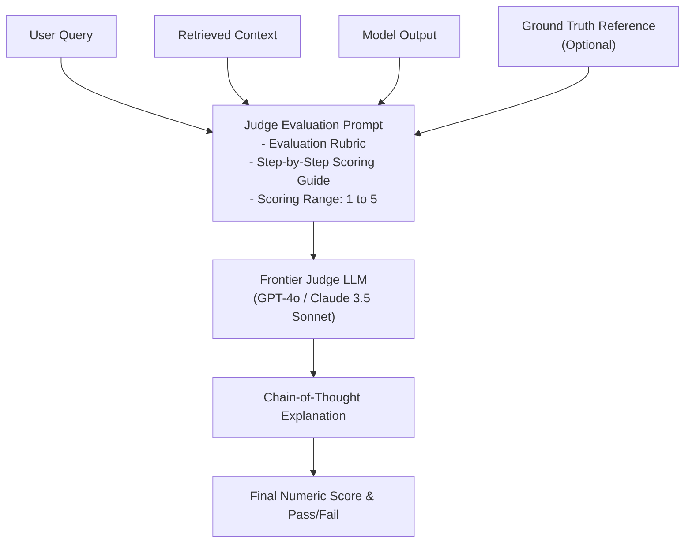

# 📹 LLM Eval Methods ｜ LLM-as-a-Judge ｜ Reference Based Evals Vs Reference Free Evals

<div className="video-card" style={{border: '1px solid #30363d', borderRadius: '8px', padding: '16px', marginBottom: '24px', background: 'rgba(56, 139, 253, 0.05)'}}>
  <div style={{display: 'flex', gap: '16px', flexWrap: 'wrap'}}>
    <div><strong>Instructor:</strong> Nitish Singh (CampusX)</div>
    <div><strong>Duration:</strong> 3190</div>
    <div><strong>Course:</strong> Module 6: LLM Evaluation & Observability</div>
    <div><strong>Watch Link:</strong> <a href="https://www.youtube.com/watch?v=uQFLY8rQVYA" target="_blank" rel="noopener noreferrer">YouTube Lecture ↗</a></div>
  </div>
</div>

## 📌 Executive Summary

LLM-as-a-Judge utilizes powerful frontier models (such as GPT-4o or Claude 3.5 Sonnet) to evaluate the qualitative output of smaller or specialized models. It replaces expensive, slow human annotation with automated, highly correlated scoring.

This lesson explores reference-based vs reference-free evaluations, single-answer grading, pairwise comparison (arena style), judge biases, and techniques to maximize judge consistency.

---

## 🏗️ System Architecture & Execution Flow



---

## 📖 Core Concepts & Technical Deep Dive

### 1. Reference-Based vs Reference-Free Evals
- **Reference-Based:** The judge compares the generated response against a human-written ground truth reference. Highly reliable, but expensive to curate ground truth datasets.
- **Reference-Free:** The judge evaluates the response against the user prompt and retrieved context alone. Faster and scalable to production telemetry, but vulnerable to undetected factual inaccuracies if the context itself is flawed.

### 2. Common Judge Biases & Mitigation Strategies
- **Position Bias:** In pairwise evaluations, judges prefer whichever answer is presented first. *Mitigation:* Evaluate pairs twice with swapped order `(A, B)` and `(B, A)`.
- **Verbosity Bias:** Models favor longer, structured answers even when bloated. *Mitigation:* Explicitly penalize verbosity in the evaluation rubric.
- **Self-Enhancement Bias:** LLMs tend to award higher scores to answers generated by their own model family. *Mitigation:* Use cross-family judges (e.g. Anthropic judge for OpenAI models).

---

## 💻 Production Implementation

```python
from langchain_openai import ChatOpenAI
from langchain_core.prompts import ChatPromptTemplate
from pydantic import BaseModel, Field

class JudgeEvaluation(BaseModel):
    chain_of_thought: str = Field(description="Step-by-step reasoning explaining the score")
    score: int = Field(ge=1, le=5, description="Score from 1 (poor) to 5 (flawless)")
    is_passing: bool = Field(description="True if score >= 4")

judge_prompt = ChatPromptTemplate.from_messages([
    ("system", "You are an impartial evaluator grading AI responses for factual grounding."),
    ("human", """[Context]:
{context}

[User Query]:
{query}

[Model Response]:
{response}

Grade the response strictly on whether every factual claim is grounded in the provided context.
Output structured JSON according to the schema.""")
])

judge_llm = ChatOpenAI(model="gpt-4o", temperature=0.0)
evaluator = judge_prompt | judge_llm.with_structured_output(JudgeEvaluation)

result = evaluator.invoke({
    "context": "Our refund window is 30 days. Software licenses are non-refundable once activated.",
    "query": "Can I get a refund on an activated license after 10 days?",
    "response": "No, activated software licenses are strictly non-refundable regardless of the timeframe."
})
print("Passing:", result.is_passing)
print("Score:", result.score)
print("Reasoning:", result.chain_of_thought)
```

---

## ⚙️ Production Gotchas & Best Practices

:::tip Chain-of-Thought Grading
Always require the judge model to generate its reasoning *before* outputting the final numeric score. Asking for the score first causes the model to commit prematurely without reasoning.
:::

:::warning Judge Temperature
Always set `temperature=0.0` for judge models. Non-zero temperature introduces grading variance across identical test runs.
:::

---

## 📊 Architectural Reference & Comparison

| Evaluation Method | Reference Required? | Cost | Scalability | Primary Use Case |
| :--- | :--- | :--- | :--- | :--- |
| **Pairwise Arena** | No | 2x LLM calls | Moderate | Comparing two model candidates side-by-side |
| **Single-Answer Scoring** | Optional | 1x LLM call | High | Absolute scoring against rubrics (1-5 scale) |
| **Reference Grounding** | Yes (Golden Truth) | 1x LLM call | High | Verifying exact factual alignment with documentation |

---

## 📚 Key Takeaways & Enterprise Checklist

- [ ] **Architecture Verification:** Ensure your design addresses latency, decoupled interfaces, and strict data validation contracts.
- [ ] **Deterministic Testing:** Run unit tests and golden dataset evaluations before shipping changes to staging or production.
- [ ] **Security & Observability:** Enforce input/output guardrails, scrub sensitive credentials/PII, and capture distributed traces.
- [ ] **Scalability & Sizing:** Calibrate model parameters, context limits, and compute instance requirements against projected request concurrency.
