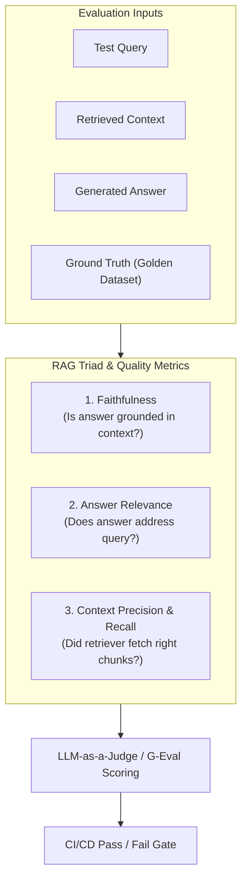

# 📹 Offline Evals Vs Online Evals

<div className="video-card" style={{border: '1px solid #30363d', borderRadius: '8px', padding: '16px', marginBottom: '24px', background: 'rgba(56, 139, 253, 0.05)'}}>
  <div style={{display: 'flex', gap: '16px', flexWrap: 'wrap'}}>
    <div><strong>Instructor:</strong> Nitish Singh (CampusX)</div>
    <div><strong>Duration:</strong> 81m 9s</div>
    <div><strong>Playlist:</strong> LLM Evaluation Complete Series (CampusX)</div>
    <div><strong>Watch Link:</strong> <a href="https://www.youtube.com/watch?v=SahaDGzN-Bk" target="_blank" rel="noopener noreferrer">YouTube Lecture ↗</a></div>
  </div>
</div>

## 📌 Executive Summary & Learning Objectives

This lecture covers **Offline Evals Vs Online Evals**, focusing on production implementations, edge cases, and industry standards:
- Core intuition, architecture, and underlying mechanisms.
- Key differences between theoretical research implementations and scalable enterprise patterns.
- Concrete Python walkthroughs, error recovery, and performance optimization.

---

## 🏗️ Architecture & Conceptual Workflow



---

## 📖 Core Concepts & Technical Deep Dive

### 1. Architectural Foundations
In modern production AI engineering, **Offline Evals Vs Online Evals** is essential for ensuring reliability, low latency, and deterministic outcomes. As AI systems evolve from naive prompt-in / completion-out scripts into distributed systems, engineers must handle:
- **State management & consistency:** Ensuring intermediate states and tool invocations are tracked.
- **Error boundaries & recovery:** Graceful degradation when external LLMs or vector stores encounter rate limits or network partitions.
- **Resource utilization & cost efficiency:** Caching common queries and reducing unnecessary foundation model token expenditure.

### 2. Operational Considerations
- **Latency Optimization:** Pre-computing embeddings, utilizing asynchronous non-blocking event loops, and streaming tokens via Server-Sent Events (SSE).
- **Security & Sandboxing:** Validating inputs before ingestion, sanitizing LLM outputs, and isolating tool execution environments.

---

## 💻 Production Implementation Walkthrough

```python
from deepeval import assert_test
from deepeval.test_case import LLMTestCase
from deepeval.metrics import FaithfulnessMetric, AnswerRelevancyMetric

# 1. Prepare Test Case
test_case = LLMTestCase(
    input="What is the context window of Claude 3.5 Sonnet?",
    actual_output="Claude 3.5 Sonnet features a 200,000 token context window.",
    retrieval_context=["Claude 3.5 Sonnet supports up to 200k tokens of context."]
)

# 2. Define Metrics
faithfulness = FaithfulnessMetric(threshold=0.8)
relevancy = AnswerRelevancyMetric(threshold=0.8)

# 3. Assert Production Test Gate
def test_rag_accuracy():
    assert_test(test_case, [faithfulness, relevancy])
```

---

## 💡 Production Best Practices & Tips

:::tip Production Deployment Guideline
When deploying Offline Evals Vs Online Evals in enterprise environments, always configure automated retries with exponential backoff and telemetry tracing (such as OpenTelemetry or LangSmith).
:::

:::warning Common Failure Modes
Watch out for state contamination across concurrent requests. Ensure each session or user interaction uses an isolated thread ID or execution context.
:::

---

## 🎯 Key Takeaways & Quick Reference

| Dimension | Production Standard | Pitfall to Avoid |
| :--- | :--- | :--- |
| **Execution** | Async / Non-blocking with timeouts | Synchronous blocking calls in event loops |
| **Data Validation** | Strict Pydantic v2 schemas | Untyped dictionary access |
| **Monitoring** | Distributed tracing & latency percentiles | Relying only on standard console logs |

## ⏱️ Lecture Timeline & Key Topics

| Timestamp | Key Topic / Concept Discussed |
| :--- | :--- |
| **00:00:00** | तो दिस इज आवर थर्ड और फोर्थ अ सेशन इन... |
| **00:20:40** | वी आर राइट नाउ डिस्कसिंग कि डिप्लॉयमेंट... |
| **00:40:56** | नहीं था। तो, हमने लास्ट बेस लाइन से... |
| **01:01:21** | कर रहा है कि नहीं? ऑन एनी गिवन क्वेश्चन।... |
| **01:21:05** | में मिलते हैं। ठीक है? ओके बाय गुड नाइट।... |


---

---

## 📜 Complete Lecture Transcript (Hindi / Hinglish)

> **Language:** Hindi / Hinglish | **Source:** `06 - Offline Evals Vs Online Evals ｜ CampusX.hi.srt` | **Total Segments:** 41 | **Word Count:** ~13,770 words

<details>
<summary><b>Click to expand full chronological transcript (41 timestamped intervals)</b></summary>

#### ⏱️ [00:00 ➔ 00:02]

तो दिस इज आवर थर्ड और फोर्थ अ सेशन इन दिस कोर्स। एक काम करते हैं। पहले मैं आपको एक क्विक रिककैप दे देता हूं। अभी तक हमने क्या-क्या कवर किया है और फिर मैं आपको आज के सेशन का एजेंडा बताता हूं। आज का सेशन इंटरेस्टिंग है। कुछ नई चीजें सीखोगे और बाय द एंड ऑफ द सेशन आप एक अच्छी चीज सीख के निकलोगे। ठीक है? तो अभी तक ना हम एलएलएम इव्स यह जो कोर्स है, इसमें पांच चीजें हमने कवर की हैं। पहला हमने यह कवर किया व्हाई डू वी नीड ईवेल्स। फिर हमने ये देखा कि व्हाट एग्जैक्टली आर इल्स? वहां पे हमने मॉडल बेस्ड एंड एप्लीकेशन बेस्ड दोनों टाइप्स पढ़े। फिर हमने पढ़ा हाउ डज़ अ एलएलएम ईल लुक लाइक? बेसिकली एक ईवेल पाइपलाइन हमने डिस्कस किया। उसके बाद पिछले सेशन में हमने एक बहुत इंटरेस्टिंग बात डिस्कस की थी कि व्हाई डू वी नीड मल्टीपल ईवेल पाइपलाइन फॉर अ सिंगल एप्लीकेशन। मैंने आपको बताया था कि कोई भी एलएलएम बेस्ड एप्लीकेशन ऐसा नहीं होता जहां पे आप सिर्फ एक ईवेल पाइपलाइन लगा के छोड़ देते हो। आइडियली व्हाट यू डू इज़ यू क्रिएट मल्टीपल ईवेल पाइपलाइंस फॉर अ सिंगल एप्लीकेशन। और इसके पीछे के मैंने आपको दो रीज़ंस दिए थे। पहला मैंने बताया था कि बिकॉज़ देयर आर मल्टीपल फेलियर पॉइंट्स। हमने बात करी थी कि हम कंपोनेंट लेवल पे भी फेलियर आ सकता है। वर्क फ्लो लेवल पे भी फेलियर आ सकता है और पूरे के पूरे एप्लीकेशन लेवल पे भी आ सकता है। तो दैट इज़ व्हाई हमें तीनों को मॉनिटर करने के लिए इवा्स लगाने पड़ते हैं। और सेकंड हमने ये डिस्कस किया था कि देयर आर डिफरेंट रिस्क कैटेगरीज़। सो यहां पर हमने तीन कैटेगरीज डिस्कस की थी। एप्लीकेशन की क्वालिटी,

#### ⏱️ [00:02 ➔ 00:04]

सेफ्टी और लास्ट में ऑपरेशंस। बेसिकली लेटेंसी एंड ऑल टाइप के मैट्रिक्स के लिए अलग इवेल्स होते हैं। और फिर हमने लास्ट वीडियो में ये डिस्कस किया था कि व्हाट आर द डिफरेंट इवल मेथड्स? जिनके थ्रू हम इवैल्यूएशन परफॉर्म करते हैं। इसमें भी हमने तीन चीजें देखी थी। प्रोग्रामेटिक मेथड्स। फिर हमने एलएलएम एज अ जज देखा था और हमने ह्यूमंस के साथ कैसे ई वेल परफॉर्म करना है वो सीखा था। तो नटशेल में दिस इज़ द समरी ऑफ़ व्हाटएवर वी हैव कवर्ड इन दिस कोर्स टिल नाउ। इतना हमने अभी तक कवर किया है। ठीक है? अब आज का जो वीडियो है, आज का जो सेशन है, इसमें हम एक बहुत इंपॉर्टेंट टॉपिक डिस्कस करने जा रहे हैं और वो टॉपिक है ऑफलाइन ईवेल वर्सेस ऑनलाइन इवल। ठीक है? पहले मैं आपको बताऊंगा ऑफलाइन इवाल क्या होता है। फिर मैं आपको बताऊंगा ऑनलाइन इवल क्या होता है और फिर इन दोनों के बीच में क्या डिफरेंसेस हैं वो हम देखेंगे और इस प्रोसेस में आप काफी कुछ सीखोगे। तो यही हमारा आज का एजेंडा है। दिस इज द टॉपिक जो हम आज कवर करने जा रहे हैं। तो इज इट क्लियर टिल नाउ? अभी तक हमने क्या पढ़ा और आज हम क्या पढ़ने जा रहे हैं? एजेंडा क्लियर है? सबसे पहले डिस्कस करते हैं कि ऑफलाइन इवल्स क्या होते हैं? ठीक है? अब अच्छी चीज क्या है कि यहां पर आपको कुछ भी नया नहीं पढ़ना है। ऑफलाइन इव्स आप ऑलरेडी पढ़ चुके हो। अभी तक हमने जितने भी एग्जांपल्स डिस्कस किए पिछले दो-तीन सेशंस में जहां पे मैंने आपको ईवेल पाइपलाइन बना के दिखाया वो सारा का सारा ईवेल पाइपलाइन आर एन एग्जांपल ऑफ ऑफलाइन ईवेल। बेसिकली ऑफलाइन ईवेल का फंडा यह है कि अगर आप कोई भी ईवेल पाइपलाइन अपने एलएलएम एप्लीकेशन के ऊपर लगाते हो

#### ⏱️ [00:04 ➔ 00:06]

उसको डिप्लॉय करने के पहले तो उसको हम ऑफलाइन ईवेल बोलते हैं। आपको शायद याद होगा लास्ट वीडियो में हमने डिस्कस किया था एक यूपीएससी का एप्लीकेशन जहां पर हमने एक एलएलएम एप्लीकेशन बनाया था जो मेंस वाले पेपर का मॉक पेपर का मॉक टेस्ट का इवैल्यूएशन करता है बिल्कुल एक ह्यूमन की तरह वहां पे हमने स्टेप बाय स्टेप डिस्कस किया था कि ये काम हम ये इवैल्यूएशन हम करेंगे कैसे हमने गोल्डन डेटा सेट बनाया था हमने एलएलएम एज अ जज यूज किया था मेथड और हमने इवैल्यूएशन परफॉर्म किया था। अब यह जो इवैल्यूएशन हो रहा है ना यह सॉफ्टवेयर के बनने के बाद बट डिप्लॉयमेंट होने के पहले हो रहा है। व्हिच मींस कि दिस इज़ एन एग्जांपल ऑफ एन ऑफलाइन इवैल। सो एकदम सिंपल शब्दों में कभी भी आपके पास एक एलएलएम बेस्ड एप्लीकेशन है और आप उसको डिप्लॉय करने के पहले पूरे तरीके से टेस्ट करना चाहते हो कि वह डिप्लॉय करने के लायक है या नहीं। तो वहां पर जो आप इवल्स रन करते हो उसको ही हम ऑफलाइन इवल बुलाते हैं। एज सिंपल एज दैट। तो अभी तक जो भी आपने पढ़ा एवरीथिंग कम्स अंडर ऑफलाइन इवल। सो कुछ नया नहीं सीखा हमने जो हमने पास्ट में सीखा था उसको हमने एक नया नाम दे दिया। तो क्विकली टेल मी इन द चैट कि कल को कोई आपसे पूछ ले अगर कि ऑफलाइन इवाइल्स क्या होते हैं? तो वुड यू बी एबल टू आंसर? ऑफलाइन इवाल समझा पाओगे? ओके। ईजी राइट। अब एक बार एक इंपॉर्टेंट एस्पेक्ट डिस्कस करते हैं ऑफलाइन इवल का। मैं आपसे सुनना चाहता हूं। आप मुझे बताओ कि ऑफलाइन इवल का मेन पर्पस क्या होता है? अगर एक से ज्यादा पर्पस है तो वो क्या है? एक बार टाइप करके बताओ। व्हाट आर द मेन पर्पज़ ऑफ एन ऑफलाइन इवल? व्हाई डू वी नीड

#### ⏱️ [00:06 ➔ 00:08]

एन ऑफलाइन इवल? हम ऐसा क्यों नहीं करते कि हम एक एलएलएम बेस्ड सॉफ्टवेयर बनाएं और उसको डायरेक्टली डिप्लॉय कर दें। व्हाट इज द प्रॉब्लम? यह आपको बताना है। एक्चुअली बहुत सिंपल क्वेश्चन है। एक तो बहुत स्ट्रेट फॉरवर्ड आंसर ये है कि अगर हम टेस्ट किए बिना डिप्लॉय कर देंगे तो डिप्लॉयमेंट में जाकर के प्रोडक्शन में जाके सॉफ्टवेयर कैसे बिहेव करेगा हमें नहीं पता होगा और कुछ भी रिस्क हो सकता है। मैंने आपको बहुत शुरू में ही दो-तीन केस स्टडीज बताई थी एयर कनाडा वाली चार्ट जीपीटी वाली। तो यू रिमेंबर राइट यू कैन नॉट डिप्लॉय अ एलएलएम बेस्ड सॉफ्टवेयर इनू प्रोडक्शन विदाउट टेस्टिंग इट। तो सबसे पहला फायदा जो ऑफलाइन ईवेल हमें देता है वो ये है कि वो हमें प्री रिलीज टेस्टिंग का फीचर देता है। रिलीज करने के पहले आई कैन प्रॉपर्ली टेस्ट माय ईवेल। अब यहां पे एक इंटरेस्टिंग चीज मैं आपको बताता हूं। ये आप शायद एलएलएम ऑब्स वाला जो कोर्स है उसमें भी पढ़ोगे कि ये जो पूरा का पूरा प्रोसेस है सॉफ्टवेयर को बनाने का उसको टेस्ट करने का और उसको डिप्लॉय करने का यह इतना लेवल पे ऑटोमेट कर दिया जाता है कि आप क्या कर सकते हो कि आप सिंपली एक गेट क्रिएट कर सकते हो कि अगर मेरा इवल रन करने से जो रिजल्ट है वो 95% से ऊपर आ रहा है तो तो फिर डिप्लॉय कर दो मेरे सॉफ्टवेयर को। बेसिकली आप सीआईसीडी यूज़ कर रहे हो और अगर 95% से कम है तो डोंट डिप्लॉय इट। तो फ्यूचर में आप ये जाकर के पढ़ोगे कि ये जो टेस्टिंग है ये जो पूरी की पूरी हम इवल रन कर रहे हैं, टेस्ट कर रहे हैं अपने सॉफ्टवेयर को इसको भी ऑटोमेट कर दिया जाता है। आप सॉफ्टवेयर में कुछ चेंजेस करते हो। जैसे ही चेंजेस करते हो आपका कोड पुश होता है गेट पे। गेट पे सीआई ट्रिगर होता है गेट एकशंस के थ्रू और वहां पर आपका ईवेल का स्क्रिप्ट रखा हुआ है वो रन होता है। उससे आपको एक स्कोर मिलता है। अगर वो स्कोर थ्रेशहोल्ड से ऊपर है तो ऑटोमेटिकली

#### ⏱️ [00:08 ➔ 00:10]

डिप्लॉयमेंट पाइपलाइन ट्रिगर हो जाती है। अगर आपका थ्रेशहोल्ड नीचे है तो आपको एक नोटिफिकेशन आ जाता है कि इवेल टेस्ट फेल कर गए। तो नॉट ओनली आपको प्री रिलीज टेस्टिंग मिल रही है बट अगर आप इसको सही तरीके से यूज करो तो यह एक रिलीज गेट की तरह काम करता है कि इवल हो गया सही से डिप्लॉय हो जाएगा नहीं हुआ तो रोल बैक हो जाएगा प्रीवियस वर्जन पे। ठीक है? तो ये सबसे पहला फायदा है। ठीक है? दूसरा एक बहुत इंपॉर्टेंट फायदा ये है कि आप ऑफलाइन इवाल की हेल्प से वर्जनंस को कंपेयर कर सकते हो। लेट्स से आपके पास एक चॉइस है कि आपको अपना एलएलएम बेस सॉफ्टवेयर यूपीएससी वाला मान लो अ क्लॉड के अ मॉडल से बनाना है या फिर अ ओपन एआई के मॉडल से बनाना है लेट्स से तो हाउ वुड यू कंपेयर दीज़ टू? बाकी सब कुछ तो सेम है। बाकी का जो भी कोड है वो सेम है। बस मॉडल अलग-अलग है। मुझे इवैलुएट करना है कि मेरे पर्पस के लिए ओपन एआई वाला मॉडल ज्यादा अच्छा रिजल्ट्स देगा या फिर क्लॉड वाला। तो ये काम मैं कैसे कर सकता हूं? बहुत सिंपल है। मैं दो वर्जनंस बनाऊंगा अपने सॉफ्टवेयर के और दोनों वर्जनंस के ऊपर सेम इवल को रन कर दूंगा। तो सिंस द इवल इज़ सेम, दैट गोल्डन डेटा सेट इज़ सेम। तो एवरीथिंग इज़ सेम, द फील्ड इज़ लेवल। तो अब जो मुझे रिजल्ट्स मिल रहे हैं उससे आई कैन ईजीली आइडेंटिफाई कि क्लॉड ज्यादा स्कोर कर रहा है इन कंपैरिजन टू ओपन एआई वि मींस कि मैं क्लॉड को यूज़ करूंगा और ये आप किसी भी चीज के लिए कर सकते हो। आप डिफरेंट प्र्प्ट्स को कंपेयर कर सकते हो। आप डिफरेंट मॉडल्स को कंपेयर कर सकते हो। आप डिफरेंट रीरेंकर्स को कंपेयर कर सकते हो। डिफरेंट वेक्टर डेटाबेस को कंपेयर कर सकते हो। यू कैन आल्सो ट्राई आउट कंपेयरिंग डिफरेंट आर्किटेक्चर्स ऑफ योर ऑफ योर सॉफ्टवेयर एप्लीकेशन। तो कभी भी अगर आपके दिमाग में यह क्वेश्चन आ रहा है कि मेरे पास एक से ज्यादा पॉसिबिलिटीज हैं। वि वन शुड आई चूज? तो यह चॉइस आपको बताएगा आपका इवल बाय रनिंग इट ऑन मल्टीपल

#### ⏱️ [00:10 ➔ 00:12]

वर्जनंस ऑफ द सॉफ्टवेयर। ठीक है? तो दिस इज द सेकंड बेनिफिट। थर्ड इज़ रिग्रेशन टेस्टिंग। ये भी एक बहुतेंट फायदा है। किसी को पता है व्हाट इज़ रिग्रेशन टेस्टिंग? कोई बता सकता है? कभी नाम सुना है ये? सॉफ्टवेयर में अ काफी फेमस टर्म है। वैसे तो एनीवन इफ यू कैन टेल मी रिग्रेशन टेस्टिंग क्या होता है? हां गुड सही बोला अमर ने। इट्स टेस्ट ऑफ चेंज। तो रिग्रेशन टेस्टिंग बेसिकली क्या होता है कि मान लो आपका वर्जन वन ऑफ़ द सॉफ्टवेयर इज़ ऑलरेडी लाइव। ठीक है? वहां पर आपने ऑब्जर्व किया कि मान लो ये कैंपस एक्स का चैट बॉट है जिससे स्टूडेंट्स इंटरेक्ट कर रहे हैं। अब वहां पे हमने ये ऑब्जर्व किया कि जब भी स्टूडेंट्स अ रिफंड के बारे में बात कर रहे हैं तो हमारा चैटबॉट थोड़ा कोल्ड तरीके से आंसर कर रहा है। आई डोंट नो व्हाई। ठीक है? तो हमने ये ऑब्जर्व किया पैटर्न प्रोडक्शन में। तो अब हमने क्या किया कि हमने सोचा इसको इंप्रूव करते हैं क्योंकि हमें हमेशा ऐसा चाहिए कि हमारा चैटबॉट अच्छा टोन से बात करें हमारे स्टूडेंट से। तो व्हाट आई डीड मैंने अपने सिस्टम प्र्ट में जाके थोड़े चेंजेस किए कि यू हैव टू बी वेरी काइंड एंड वेरी पोलाइट। अच्छे से आंसर करना है। मैंने ऐसा इंस्ट्रक्शन लिखा। अब ये इंस्ट्रक्शन लिखने के बाद क्या हुआ कि बहुत ज्यादा ही उसका पर्सनालिटी सॉफ्ट हो गया। जैसे अगर कोई पूछ रहा है कि इंसाइडर वाले प्लान का कॉस्ट क्या है? और मान लो इंसाइडर वाले प्लान का कॉस्ट है 19,500 तो वो बहुत सॉफ्टली 19,500 के बदले सामने वाले को इंप्रेस करने के लिए बोल रहा है। इट्स अराउंड 19,000 जस्ट टू मेक श्योर कि सामने वाले को वो अच्छा साउंड करे। आई नो बहुत अच्छा एग्जांपल नहीं दे रहा हूं मैं। बट मैं आपको यह बताना चाह रहा हूं कि कई बार क्या होता है कि आप एक बहुत कॉम्प्लेक्स सिस्टम बना रहे हो। उसमें एक चीज को आप इंप्रूव करने जाते हो तो बाकी की चीजें गड़बड़ा जाती है। एक चीज में

#### ⏱️ [00:12 ➔ 00:14]

परफॉर्मेंस इंप्रूव करने जा रहे हो बाकी चीजों पर परफॉर्मेंस खराब हो जाता है। इसको बोला जाता है रिग्रेशन। तो ये टेस्ट करना जरूरी है। व्हनेवर यू आर इंप्रूविंग योर सॉफ्टवेयर यू हैव टू मेक श्योर कि जो चीज मैं इंप्रूव कर रहा हूं वो तो इंप्रूव हो ही बट साथ ही साथ कुछ और चीज ना बिगड़ जाए। तो इसमें भी आपका ऑफलाइन इवेल आपको हेल्प करता है। कैसे? बहुत सिंपल है। आपके पास जो गोल्डन डेटा सेट है उसमें आप अलग-अलग टाइप के केसेस डालते हो। आप अलग-अलग टाइप के स्टूडेंट्स के क्वेश्चंस को डालते हो। तो हर तरह का केस आप कवर करने की कोशिश करते हो। रिफंड वाले क्वेश्चंस भी हैं, प्राइसिंग वाले क्वेश्चंस भी हैं। कोर्स करिकुलम रिलेटेड क्वेश्चंस भी हैं। तो बेसिकली आप हर टाइप के क्वेश्चन पे इवल रन करके ये पता कर सकते हो कि हर टाइप ऑफ क्वेश्चन पे आपके रिजल्ट्स कैसे आ रहे हैं। सो पहले रिफंड वाले पे अगर आपका सक्सेस रेट 90% था। तो प्र्प्ट में चेंज करने के बाद वो 90 के आसपास ही रहना चाहिए। 80 पे नहीं चला जाना चाहिए। अगर वो 80 पे जा रहा है तो इससे समझ में आ रहा है कि देयर इज सम फॉर्म ऑफ रिग्रेशन और आपको अभी जो चेंज आपने किया है वो नहीं करना चाहिए। इज दिस पॉइंट क्लियर? द आईडिया इज़ वेरी सिंपल। व्हनेवर यू मेक अ स्मॉल चेंज एनीवेयर सिस्टम प्र्ट में मॉडल चेंज किया, अपना वेक्टर डेटाबेस चेंज किया, कुछ भी चेंज किया, उससे कुछ और चीज नहीं बिगड़नी चाहिए। तो, हम यह भी टेस्ट कर सकते हैं विद द हेल्प ऑफ ऑफलाइन इव्स। दिस इज द मेन पॉइंट। ठीक है? तो नटशेल में हमने ये डिस्कस किया कि ऑफलाइन इवाइल्स क्या होते हैं? हमने जो अभी तक पढ़ा था उसको ही ऑफलाइन इवाइ्स बोलते हैं। और उसके तीन इंपॉर्टेंट बेनिफिट्स देखे। पहला टेस्टिंग करने को हमें मिलता है रिलीज के पहले। दूसरा हम दो वर्जनंस को कंपेयर कर सकते हैं जब भी हम डाउट में हैं। और तीसरा जब भी हम कोई चेंजेस कर रहे हैं अपने एकिस्टिंग सॉफ्टवेयर में तो वी कैन एक्चुअली टेस्ट कि कहीं और गड़बड़ ना हो जाए। ये तीन सबसे बड़े फायदे हैं जिसकी वजह से ऑफलाइन इवल्स आर सुपरेंट। इसके बिना काम नहीं चल सकता। तो अभी तक का डिस्कशन इज इट क्लियर? बहुत स्लोली हम जा

#### ⏱️ [00:14 ➔ 00:16]

रहे हैं बट वी आर कवरिंग राउंड। लेट मी नो। अभी तक कोई प्रॉब्लम है तो या कोई क्वेश्चन है तो। ओके। अब आगे बढ़ते हैं। अब बात करते हैं प्रोडक्शन की। मान लो आपने अपना एलएलएम बेस्ड सॉफ्टवेयर बना लिया। उसके ऊपर ऑफलाइन ईवेल चला लिया। सारे रिजल्ट्स भी पास हो गए। आपका सॉफ्टवेयर अब डिप्लॉय हो गया है। अब क्या? प्रोडक्शन पे क्या प्रॉब्लम आ सकती है? वो डिस्कस करते हैं। सो प्रोडक्शन पे तीन मेजर प्रॉब्लम्स आप फेस करोगे। एक बार जब आपका सॉफ्टवेयर डिप्लॉय हो जाएगा। तीन मेजर मेजर प्रॉब्लम्स आप फेस करोगे। सबसे पहला प्रॉब्लम यह है कि आपको बहुत तरह के अनंिसिपेटेड इनपुट्स देखने को मिलेंगे। लेट्स से कैमपस एक्स का चार्ट बॉट है। हम जब उसको टेस्ट कर रहे थे ऑफलाइन सेटअप में तो हमने क्या किया? हमने गोल्डन डेटा सेट बनाया जिसमें हमने 200 से 500 क्वेश्चंस डाले जो हमें लगता है कि यूजर पूछ सकता है। बट हमने सिर्फ इन्हीं 200 500 क्वेश्चंस पे अपने चैटबॉट को टेस्ट किया। बट जब हम उसको डिप्लॉय करेंगे तो हम उसको रियल वर्ल्ड के लिए ओपन कर रहे हैं। व्हिच बेसिकली मीन्स कि अब उससे स्टूडेंट किसी भी टाइप का क्वेश्चन पूछ सकता है। मे बी ऐसा कुछ क्वेश्चन भी पूछ सकता है जिसके लिए हमने अपने मॉडल को अपने सॉफ्टवेयर को टेस्ट भी नहीं किया है। यहां पे देखो लिखा हुआ है। हो सकता है सडनली से लोग हिंदी इंग्लिश मिक्स करके बात करने लग जाए। हमने जब मॉडल को ट्रेन किया या फाइन ट्यून किया तो मोस्टली इंग्लिश के ऊपर किया। बिकॉज़ वी एंटीिसिपेटेड कि इंग्लिश में ही बात होगी। बहुत तरह के एम्बिगुअस हाफ क्वेश्चंस आएंगे जहां पे समझ ही नहीं आएगा कि यूजर पूछना क्या चाह रहा है। बहुत बार एंग्री रैंड्स आएंगे जहां पे बहुत गुस्से के पीछे एक क्वेश्चन छुपा होगा या

#### ⏱️ [00:16 ➔ 00:18]

फिर बहुत तरह के लोग एडवर्सियल प्र्प इंजेक्शंस ट्राई करेंगे कि वो किसी तरीके से चार्ट पॉट से कुछ ऐसा आंसर निकलवाने की कोशिश करेंगे जो उसको नहीं देना चाहिए। बहुत तरह के एज केसेस सिनेरियोस आपको फेस करने पड़ेंगे। ठीक है? तो यही सब होता है जब आप प्रोडक्शन में अपने चार्ट बॉट को डालते हो फाइनली आपने जो अभी तक उसको दिखाया है जिस चीज पे टेस्ट किया है उससे एक बहुत ज्यादा बड़ा सुपर सेट आपको देखने को मिलता है जिसमें कुछ भी आपका चार्टबॉट फेस कर सकता है। तो दिस इज द फर्स्ट रिस्क। ठीक है? हम प्रोडक्शन पे क्या-क्या रिस्क है वो डिस्कस कर रहे हैं। सेकंड यू मे फाइंड इमर्जेंट और सिस्टमैटिक फेलियर्स। ठीक है? बहुत इस तरह के छोटे-छोटे फेलियर्स होते हैं जो आपको ऑफलाइन सेटअप में दिखाई नहीं देंगे। वो आते ही तब है पिक्चर में जब आप अपने सॉफ्टवेयर को डिप्लॉय करते हो। प्रोडक्शन पे लेके जाते हो। किस तरह की चीजों की बात कर रहा हूं मैं? ऐसी प्रॉब्लम्स जो सिर्फ स्केल पे फेस होती हैं। फॉर एग्जांपल अचानक से बहुत सारे लोग आ गए। हमने एक नया कोर्स ल्च किया कैंपस एक्स पे। अचानक से बहुत सारे लोग आ गए। और एक साथ हमारे चैटबॉट में कॉनकरेंट हजारों यूज़र्स हैं। तो अचानक से हमारा जो लेटेंसी है वह बढ़ गया। अब यह हम ऑफलाइन में कभी टेस्ट ही नहीं कर सकते थे। बिकॉज़ ऑफलाइन में हम हजारों यूज़र्स को नहीं ला सकते। राइट? तो दिस इज़ अ सिनेरियो जो आप सिर्फ प्रोडक्शन में फेस कर सकते हो। फिर आपका अ एक दो एग्जांपल अगर और दूं मैं तो ये बहुत अच्छा एग्जांपल है कि अ सर्टल बायस दैट ओनली बिकम्स विज़िबल अक्रॉस थाउजेंड्स ऑफ़ कन्वर्सेशंस। अब ऐसा हो सकता है कि हमारा जो मॉडल है, हमारा जो चैटबॉट है, वो थोड़ा सा बायस्ड है अगेंस्ट इंडिविजुअल्स जो नॉन टेक्निकल बैकग्राउंड से आते हैं। लेट्स से बट ये आपको तभी पता चलेगा जब आपका चैटबॉट हजारों लोगों से चैट करेगा। और जब बहुत सारा डाटा आपके पास आएगा तब आपको यह पैटर्न दिखने लगेगा कि यार जब भी ये टेक्निकल बैकग्राउंड वाले बंदों से बात करता है तो

#### ⏱️ [00:18 ➔ 00:20]

सही से बात करता है। लेकिन जैसे ही ये नॉन टेक्निकल वालों से बात करता है तो थोड़ा इसके अंदर एक बायस डेवलप हो जाता है। ठीक है? तो दिस इज आल्सो समथिंग जो आप प्रोडक्शन में ही फेस कर सकते हो। आप पहले से इसको फेस नहीं कर पाओगे। ठीक है? अ सो या रफली बहुत तरह के सिस्टमैटिक फेलियर्स अकर कर सकते हैं प्रोडक्शन में जो आपने पहले एंटीिसिपेट नहीं किए होंगे। और थर्ड एक बहुत इंपॉर्टेंट चीज होती है प्रोडक्शन में जिसको हम ड्रिफ्ट बोलते हैं। ड्रिफ्ट का मतलब ये है कि बेसिकली धीरे-धीरे आपका जो ऑफलाइन इवेल है जिसकी हेल्प से आपने टेस्टिंग करी थी और डिप्लॉयमेंट करा था वो ऑब्सोल्यूट होने लग जाए। कैसे मैं आपको बताता हूं। सो मान लो अभी हमने कैमपस एक्स का चार्ट बॉट बनाया तो अभी हमने उसमें अपने सारे डॉक्यूमेंट्स सारे प्राइसिंग स्ट्रक्चर कोर्स के पेजेस करिकुलम के पेजेस अ हमारे लेक्चर्स के ट्रांसक्रिप्ट्स ये सब कुछ डाले ये आज की बात है। अब ओवर द इयर्स हम क्या कर रहे हैं? ओवर द ईयर हम क्या कर रहे हैं? चेंजेस कर रहे हैं। जैसे किसी कोर्स का प्राइस हमने चेंज कर दिया। किसी का करिकुलम थोड़ा सा चेंज कर दिया। हमारी पॉलिसीज में थोड़ा सा चेंज आ गया। यू अंडरस्टैंड राइट? बिज़नेस जैसे-जैसे ऑपरेट करता है तो उसके डॉक्यूमेंट्स भी धीरे-धीरे चेंज होने लग जाते हैं। तो एक साल बाद हो सकता है कि जो डॉक्यूमेंट्स अब हम अपने चैटबॉट को दे रहे हैं अ रैग बनाने के लिए वो बहुत अलग दिखे इन कंपैरिजन टू एक साल पहले वाले डॉक्यूमेंट्स। बट हमने जो अपने टेस्ट केसेस बनाए थे, जो गोल्डन डेटा सेट बनाया था वो आज के हिसाब से बनाया था। एक साल बाद क्या होगा कि सिंस पूरा का पूरा डेटा चेंज हो चुका है, उसका डिस्ट्रीब्यूशन चेंज हो चुका है, तो फिर हमारा जो गोल्डन डेटा सेट है, हमारा जो पूरा इवाल पाइपलाइन है, वो काइंड ऑफ ऑब्सोलेट हो जाएगा। तो बिकॉज़ ऑफ़ दैट ड्रिफ्ट होगा क्या कि हमारा इवाल पाइपलाइन हमें अभी भी अच्छे रिजल्ट्स दे रहा होगा। जब हम ऑफलाइन उसको टेस्ट करेंगे हमारे

#### ⏱️ [00:20 ➔ 00:22]

एप्लीकेशन को। बट जब हम उसको ऑनलाइन लेके जाएंगे तो हम देखेंगे कि बहुत ज्यादा हमें नेगेटिव फीडबैक आ रहा है हमारे यूज़र्स की तरफ से। बिकॉज़ दे आर नॉट लाइकिंग द चैट बॉट्स बिहेवियर। और ये सब कुछ हो इसलिए रहा है बिकॉज़ हम चीजें बदलते जा रहे हैं बट हम अपना इवाल सेटअप को बदल नहीं रहे हैं। तो इवाल सेटअप काइंड ऑफ़ ऑब्सोल्यूट हो गया बिकॉज़ ऑफ़ द ड्रिफ्ट दैट इज हैपनिंग। तो इज दिस पॉइंट क्लियर? ये इन तीनों में सबसे ज्यादा टेक्निकल पॉइंट था। इज द पॉइंट क्लियर? कि धीरे-धीरे अगर ड्रिफ्ट अकर करने लग जाए किसी सिस्टम में तो उसका इवेल सेटअप जो है ऑफलाइन ईवेल सेटअप वो ऑब्सोल्यूट हो जाएगा और उसके रिजल्ट्स फिर मैटर नहीं करेंगे। इज दिस पॉइंट क्लियर? वी आर राइट नाउ डिस्कसिंग कि डिप्लॉयमेंट के बाद किस तरह के रिस्क होते हैं? तीन तरह के रिस्क होते हैं। पहला किसी भी तरह का क्वेश्चन पूछ लेगा यूजर। कोई कंट्रोल नहीं है इसके ऊपर हमारा। सेकंड बहुत तरह के इमर्जेंट सिस्टमैटिक फेलियर्स आ सकते हैं सच एज बायस आ सकता है। ककरेंट लोड बढ़ने पे लेटेंसी बढ़ सकता है। एंड थर्ड ड्रिफ्ट आ सकता है पिक्चर में। ये तीन पॉइंटर्स क्लियर है। तो बेसिकली यहां तक का डिस्कशन हमें ये बता रहा है कि ऑफलाइन ईवेल तो जरूरी है क्योंकि टेस्ट करना तो जरूरी है लॉन्च करने के पहले। लेकिन ल्च करने के बाद भी प्रोडक्शन पर भी बहुत तरह के रिस्क्स हैं और वो रिस्क ऑफलाइन इवल कवर नहीं कर सकता। इज दिस स्टेटमेंट ट्रू? इज दिस स्टेटमेंट ट्रू अकॉर्डिंग टू यू? कि प्रोडक्शन पे जो रिस्क है उनको हम सॉल्व नहीं कर सकते विद द हेल्प ऑफ ऑफलाइन इवाs। और उसका सिंपल रीजन यह है कि ऑफलाइन इव्स के काम करने का तरीका क्या है? आपको एक गोल्डन डेटा सेट चाहिए जिसमें आप करेक्ट आंसर बता देते हो और उसी के बेसिस पर इवैल्यूएशन होता है। बट द प्रॉब्लम इज कि एक बार अगर आप प्रोडक्शन पे चले गए तो अब आपके पास कोई

#### ⏱️ [00:22 ➔ 00:24]

गोल्डन डेटा सेट नहीं है। अब तो यूजर कुछ भी पूछ सकता है और ना आपके पास करेक्ट आंसर्स हैं। आपको ये भी नहीं पता कि फ्यूचर में कल को जब मेरा चैट बॉट डिप्लॉय हो जाएगा तो कौन सा स्टूडेंट आकर के क्या क्वेश्चन पूछेगा और उस क्वेश्चन का क्या सही आंसर है। यू डोंट नो दैट। सो बेसिकली इफ वी कैन कंक्लूड द कंक्लूजन वुड बी कि ऑफलाइन इवल से टेस्टिंग कराने के बाद डिप्लॉय करने के बाद प्रोडक्शन सेटअप में भी बहुत तरह के रिस्क है और उन रिस्क को आप इवैल्यूएट नहीं कर सकते वि द हेल्प ऑफ ऑफलाइन इवास ये हमने स्टेटमेंट अभी तक दिया एंड दैट इज व्हाई पिक्चर में कौन आता है ऑनलाइन इव्स नाम से काम समझ में आ रहा है ऑनलाइन इवल इज इवैल्यूएटिंग िंग योर सिस्टम ऑन लाइव प्रोडक्शन ट्रैफिक आफ्टर डेप्लॉयमेंट एज रियल यूज़र्स इंटरेक्ट विद इट। एकदम सबसे सिंपल डेफिनेशन यही है ऑनलाइन इव्स की कि ये एक अलग टाइप की इवैल्यूएशन है जो हम प्रोडक्शन पे रन करते हैं आफ्टर आवर सॉफ्टवेयर इज डिप्लॉयड। और इसका सबसे बड़ा कैरेक्टरिस्टिक ये है कि यह विदाउट आंसर की काम करता है। यह विदाउट एक गोल्डन डेटा सेट काम करता है। दिस इज द बिगेस्ट फीचर ऑफ ऑनलाइन इवैल। ठीक है? एंड दैट इज व्हाई इट इज सुपर क्रिटिकल बिकॉज़ ये हमें हेल्प करता है कि हमारा सॉफ्टवेयर जो डिप्लॉय हो चुका है वो सही तरीके से रन करता रहे। ये हमें बताता है कि ऑनलाइन में कोई गड़बड़ तो नहीं हो रही। ठीक है? तो उस सेंस में ऑनलाइन ईल्स आर सुपरेंट। सो अभी तक के डिस्कशन के बेसिस पे अगर मैं आपको क्विकली एक डिफरेंस लेआउट करके बताऊं ऑफलाइन और ऑनलाइन के बीच में तो चारप पॉइंटर्स हैं। सबसे पहला ये कि ऑफलाइन इवाल डिप्लॉयमेंट के पहले होता है। ऑनलाइन इवाल डिप्लॉयमेंट के बाद होता है। डेटा की बात की जाए तो ऑफलाइन इवाल में आपके पास एक फिक्स्ड डेटा सेट होता है जो आप क्रिएट

#### ⏱️ [00:24 ➔ 00:26]

करते हो। गोल्डन डाटा सेट। यहां पर आपके पास कोई ऐसा डाटा सेट नहीं होता। यू आर एक्चुअली वर्किंग ऑन द लाइव प्रोडक्शन ट्रैफिक। जो भी क्वेश्चंस पूछे जा रहे हैं उन सारे क्वेश्चंस के ऊपर आप ऑनलाइन इवाइल चलाते हो। आंसर की की बात की जाए तो मोस्टली ऑफलाइन इवाइ्स में आपके पास एक आंसर की होती है। बेसिकली आपका गोल्डन डेटा सेट। यहां पर आपके पास कोई आंसर की नहीं है। आपको एस्टीिमेट करना होता है ऑन द गो कि क्या सही आंसर हो सकता है। टाइमिंग की बात की जाए तो ये डिस्कस कर ही चुके हैं कि डिप्लॉयमेंट के पहले होता है और ये डिप्लॉयमेंट के बाद कंसिस्टेंटली चलते रहता है। इनपुट की बात की जाए तो ऑफलाइन इवल में आप सिर्फ वही चीजें इनपुट में देते हो जो आप एंटीिसिपेट करते हो। गोल्डन डेटा सेट आपने बनाया है। गोल्डन डेटा सेट में क्या-क्या चीजें आप डालते हो जो आपने एंटीिसिपेट कर रखी है। यहां पे यू कैन नॉट एंटीिसिपेट व्हाट मे कम। कुछ भी आ सकता है। कैचेस ऑफलाइन इवाइल जनरली रिग्रेशन को कैच करने में हेल्प करता है। यहां पे आप ड्रिफ्ट को कैच कर सकते हो। किसी भी तरह के सरप्राइज को कैच कर सकते हो। किसी भी तरह के इमर्जेंट बग को कैच कर सकते हो। जो अभी हमने डिस्कस किया। ऑफलाइन इवाल इज़ बेस्ट यूज्ड फॉर गेटिंग। गेटिंग का मतलब जो मैंने आपको थोड़ी देर पहले बताया कि अगर आपका जो थ्रेशहोल्ड है वो अ आपका जो स्कोर आया इवैल ऑफलाइन इवैल्यूएशन कंडक्ट करने के बाद वो थ्रेशहशोल्ड से ऊपर है तो आप सीआई की हेल्प से डायरेक्टली कोड को पुश कर देते हो डिप्लॉय कर देते हो वर्जन कंपैरिजन सीआई यहां पे ऑनलाइन इवाल का सिंपल काम होता है ड्रिफ्ट डिटेक्शन और रियल वर्ल्ड में आपका चैटबॉट कैसा परफॉर्म कर रहा है वो आपको बताना कॉस्ट एंड स्पीड की बात करें तो ऑफलाइन इवाल इज फास्ट चीप एंड रिपीटेबल बिकॉज़ बिकॉज़ इट्स बेसिकली यू आर रनिंग अ सिंपल कोड और अ एलएलएम ऑन अ स्मॉल डेटा सेट। तो चीप होता है, फास्ट होता है। वेयर एज ऑनलाइन इवल में बहुत ज्यादा स्केल पे हो सकता है कि आपको इवैल्यूएशन करना पड़े। हो सकता है आपका

#### ⏱️ [00:26 ➔ 00:28]

चैटबॉट एक दिन में 500 लोगों से बात कर रहा है। तो आपको उन 500 लोगों को मॉनिटर करना है। उन 500 कॉन्वर्सेशंस को मॉनिटर करना है। तो इट कैन बी कॉस्टली। तो यहां पे सैंपलिंग टाइप की टेक्निक यूज़ की जाती है कि रादर देन मॉनिटरिंग ईच ऑफ द कॉन्वर्सेशंस ईच ऑफ़ द 50,000 कॉन्वर्सेशंस यू सैंपल अराउंड और आप उनमें से 1000 कॉन्वर्सेशंस को मॉनिटर कर रहे हो रैंडमली। ठीक है? तो इससे आप थोड़ा कॉस्ट को नीचे लेके आते हो। तो दीज़ आर द मेन डिफरेंसेस बिटवीन ऑफलाइन एंड ऑनलाइन इवाल। यहां पर जो सबसेेंट चीज आपको समझनी है वो ये है कि दीज़ टू आर नॉट राइवल्स। इट्स नॉट लाइक कि ऑफलाइन इवाल का रिप्लेसमेंट है ऑनलाइन इवाल। ये दोनों चीजें साथ में होती है हमेशा। ठीक है? ये दोनों कॉम्प्लीमेंट्री है। ऐसा नहीं है कि एक होगा दूसरा नहीं होगा। दोनों का साथ में होना बहुत जरूरी है। एक बहुत अच्छी लाइन जो मैंने कहीं पढ़ी थी वो ये है कि आपका जो ऑफलाइन इवल है ना वो चेक करता है कि आपका एप्लीकेशन करेक्टली काम कर रहा है कि नहीं। ये लाइन बहुत इंपॉर्टेंट है। ध्यान से सुनना। ऑफलाइन इवाल का काम होता है यह चेक करना कि आपका एप्लीकेशन सही से काम कर रहा है कि नहीं। वेयर एज ऑनलाइन इवल का काम होता है यह बताना कि आपका एप्लीकेशन नॉर्मली रन कर रहा है कि नहीं प्रोडक्शन पे। यही दो मेन पर्पसेस हैं। ऑफलाइन इवाल विल टेल यू कि आपका एप्लीकेशन सही से काम कर रहा है कि नहीं। ऑफलाइन ऑनलाइन विल टेल यू कि अभी इस पॉइंट पर आपका एप्लीकेशन प्रोडक्शन पर नॉर्मली काम कर रहा है कि नहीं। इज दिस पॉइंट क्लियर? बाकी लेक्चर में भी हम और घुसेंगे। देखेंगे ऑनलाइन इवल कैसे काम करता है। अ क्या-क्या चीजें डिफरेंट है ऑफलाइन इवल से वो सब डिटेल में पढ़ेंगे। बट पर्पस समझ में आया? दोनों का अपना-अपना पर्पस है। इट्स नॉट लाइक आप ऑनलाइन को यूज कर सकते हो ऑफलाइन वाले केस में। नो दे आर डिफरेंट।

#### ⏱️ [00:28 ➔ 00:30]

इसका मैं आपको एक एग्जांपल देता हूं। इसका मैं आपको एक एग्जांपल देता हूं। ये जो स्टेटमेंट मैंने बोला ना कि ऑफलाइन ईवेल बताता है करेक्टनेस ऑनलाइन ईवेल बताता है नॉर्मल। इसका मैं आपको एक एग्जांपल देता हूं। रिमेंबर आवर यूपीएससी वाला ग्रेडर जो पेपर चेक करता है। कैन यू टेल मी हम लास्ट क्लास में जब डिस्कस कर रहे थे ऑफलाइन इवैल्यूएशन ऑफ दिस सिस्टम तो हम क्या कर रहे थे एग्जैक्टली? व्हाट वर वी ट्राइंग टू डू? जब हम ऑफलाइन इवैल्यूएशन अप्लाई कर रहे थे सिस्टम के ऊपर तो हम क्या चीज करने की कोशिश कर रहे थे? हमने बहुत डिटेल में डिस्कस किया था कि क्या पर्पस हम सॉल्व करने की कोशिश कर रहे हैं। किसी को याद है? लास्ट वाला सेशन में हमने डिस्कस किया था जब यूपीएससी वाला वहां पे हम ये डिस्कस कर रहे थे कि हमारा ये जो ग्रेडर है जो यूपीएससी पेपर्स इवैलुएट करेगा। क्या ये बिल्कुल वैसे ही पेपर्स इवैल्यूएट कर रहा है जैसे कोई ह्यूमन इवैलुएट करता है। यही तो हम करने की कोशिश कर रहे थे। तो यहां पर करेक्टनेस का मेजर क्या था कि जो मार्क्स किसी पर्टिकुलर आंसर को मेरा ये ग्रेडर दे रहा है वो ह्यूमन ने जो दिया है उसके आसपास होना चाहिए। यही तो होगा ना। राइट? तो इसकी हेल्प से हम इस सिस्टम का करेक्टनेस चेक कर रहे थे। यहां पे करेक्टनेस का डेफिनेशन क्या है? कि आपका सिस्टम जो मार्क्स दे रहा है, वह ह्यूमन के दिए हुए मार्क्स के कितने क्लोज हैं। अब सोचो थोड़ी देर के लिए कि मैंने इस सिस्टम को ऑफलाइन इवैलुएट कर लिया। आई एम सेटिस्फाइड। मैंने डिप्लॉय कर दिया। अब क्या ऑनलाइन सेटअप में व्हेन इट इज डिप्लॉयड क्या मैं इसका करेक्टनेस मेजर कर सकता हूं? सोच के बताना। क्या मैं ऑनलाइन सेटअप में यह बता सकता हूं कि अभी इस मोमेंट पर जो आंसर इवैलुएट कर रहा है मेरा

#### ⏱️ [00:30 ➔ 00:32]

सॉफ्टवेयर ये कितना करेक्ट तरीके से कर रहा है कैन आई कैन आई इवैलुएट दिस कैन आई इवैलुएट करेक्टनेस व्हाई नॉट बहुत लोग बोल रहे हैं नो बट व्हाई नॉट बिकॉज़ इस पॉइंट पे जिस आंसर को मैं इवैलुएट कर रहा हूं मुझे उस आंसर का ह्यूमन मार्क्स कितने हैं नहीं पता बेसिकली मेरे पास पास गोल्डन डेटा सेट नहीं है फॉर दिस पर्टिकुलर आंसर जिसको मैं अभी इवैलुएट कर रहा हूं। ह्यूमन का पर्सपेक्टिव ही नहीं है प्रोडक्शन में। ये आंसर ह्यूमन ने इवैलुएट किया ही नहीं है। इसको डायरेक्टली पहली बार मेरा सिस्टम इवैलुएट कर रहा है। तो आई कैन नॉट मेजर द करेक्टनेस। तो आपको पॉइंट समझ में आ रहा है? ऑफलाइन इवैल्यूएशन में करेक्टनेस चेक कर लिया तब हमने डिप्लॉयमेंट किया। बट एक बार डिप्लॉय होने के बाद वी कैन नॉट चेक द करेक्टनेस। बट हम चेक क्या कर सकते हैं ऑनलाइन में दैट इज द सिस्टम रनिंग नॉर्मली? यह हम चेक कर सकते हैं। कोई सोच के बताओ हाउ कैन वी फिगर आउट कि इस मोमेंट पे जो पेपर्स इवैलुएट हो रहे हैं, जो आंसर्स इवैलुएट हो रहे हैं वो नॉर्मली काम कर रहे हैं। आई एम नॉट आस्किंग कि करेक्टली काम कर रहे हैं। आई एम आस्किंग कि हाउ डू वी नो कि नॉर्मली काम कर रहे हैं। बहुत सिंपल है। आप क्या कर सकते हो? आप यह चेक कर लो कि लास्ट वीक डिस्ट्रीब्यूशन ऑफ स्कोर्स कितना था। ठीक है? आप एक ग्राफ प्लॉट कर लो कि लास्ट वीक हमने जितने भी आंसर्स इवैल्यूएट करवाए थे इस सिस्टम से उसका डिस्ट्रीब्यूशन कैसा था? अगर इस वीक वाले सारे इवैल्यूएशंस का डिस्ट्रीब्यूशन भी सेम है तो क्या आप इससे गारंटी कर सकते हो या बोल सकते हो कि हमारा सिस्टम वैसे ही काम कर रहा है जैसे लास्ट वीक काम कर रहा था और अगर लास्ट वीक सही था तो आज भी सही है। इसी को आपने बेसलाइन बना लिया और उस बेसलाइन के अगेंस्ट तो आप हमेशा कंपेयर करते जा रहे हो प्रोडक्शन में। सडनली से आपने देखा कि किसी एक पर्टिकुलर वीक में डिस्ट्रीब्यूशन बहुत चेंज हो गया आपके इवैल्यूएशन का। तो

#### ⏱️ [00:32 ➔ 00:34]

वुड यू से कि अब आपका जो यह सिस्टम है। यह कुछ तो नॉर्मल से अलग कर रहा है। कुछ तो एब्नॉर्मल हो गया है। जिससे आपको एक ट्रिगर मिल जाएगा और आप जाके देखोगे कि क्या गड़बड़ हुआ। तो ये एग्जांपल्स आपको समझ में आया? ये दोनों वर्ड्स का डिफरेंस करेक्टनेस और नॉर्मलिटी। डिस्ट्रीब्यूशन ऑफ़ व्हाट? प्रेम डिस्ट्रीब्यूशन ऑफ स्कोर्स। लेट्स से मैं एक हफ्ते में 1000 लोगों का पेपर इवैल्यूएट कर रहा हूं। पहले स्टूडेंट के आए 300 मार्क्स। दूसरे स्टूडेंट के आए 456 मार्क्स। तीसरे स्टूडेंट के आए 700 मार्क्स। तो आई कैन प्लॉट दीज़ कोर्स ना। तो यही डिस्ट्रीब्यूशन ये डिस्ट्रीब्यूशन इस वीक का था। फिर अगले तीन वीक का भी मैंने देखा तो मुझे समझ में आ गया कि मेरा बेसलाइन डिस्ट्रीब्यूशन यही रहता है। रफली मेरे ऐसे ही आंसर्स आते हैं। बट एक किसी पर्टिकुलर वीक में सडनली से इवैल्यूएशंस में बहुत हाई स्कोर्स आने लग गए। 900 के आसपास 800 के आसपास 700 के आसपास। तो सडनली से आपका डिस्ट्रीब्यूशन चेंज हो गया ना। तो इससे आपको समझ हां एकक्टली अभी शोएब ने बोला बट दैट डिस्ट्रीब्यूशन माइट बी ड्यू टू सम अदर ट्रेंड। राइट? कुछ और भी हो सकता है। सडनली से हो सकता है। बहुत इंटेलिजेंट बच्चे आके एग्जाम देने लग गए। ऐसा हो सकता है बट आपको पता तो चल रहा है ना आप जाके फिर उसको देखोगे कि गड़बड़ कहां पे हो रही है। सडनली से हम इतने हाई स्कोर्स क्यों दे रहे हैं? आप जाके उसको इन्वेस्टिगेट करोगे। बट आपको बताया तो जा रहा है ना किसी चीज ने ये इवैलुएट तो किया ना वही होता है ऑनलाइन इवल। ऑनलाइन इवल आपको करेक्टनेस गारंटी नहीं कर सकता। कई केसेस में कर भी सकता है। कई केसेस में नहीं भी करता है। तो वो आपको मोस्टली ये बताता है कि आपका एप्लीकेशन नॉर्मली काम कर रहा है कि नहीं। दैट इज द पर्पस ऑफ़ ऑनलाइन इवल। इज़ दिस पॉइंट क्लियर? देखो एकदम एग्जांपल को पकड़ के मत बैठो। मैंने एक एग्जांपल अभी कंस्ट्रक्ट किया जस्ट टू एक्सप्लेन द डिफरेंस। अब एकदम ऐसा नहीं है

#### ⏱️ [00:34 ➔ 00:36]

कि यह एग्जांपल हर जगह एप्लीकेबल है। बस आपको समझाना चाह रहा था कि करेक्टनेस का क्या मतलब होता है और नॉर्मल का क्या मतलब होता है। इज द पॉइंट क्लियर? हमने अभी जस्ट डिस्कस किया द डिफरेंस बिटवीन ऑनलाइन इवल एंड ऑफलाइन इवल और उन दोनों का अपना-अपना क्या काम होता है वो हमने डिस्कस किया। इज दिस क्लियर अभी तक? इज इट मेकिंग सेंस? आपको बस इतना बताना है कि क्या आपको अपनी लाइफ में ऐसा फील हो रहा है कि ऑनलाइन इवेल्स आरेंट इसके बिना काम नहीं चलेगा। अगर इतना फील हो रहा है तो फिर अभी तक का लेक्चर सही जा रहा है। इट मींस आपको समझ में आ रहा है। अगर आपको यह लग रहा है कि ऑनलाइन ईवेल की जरूरत नहीं है। अननेसेसरी है तो फिर अंडरस्टैंडिंग में प्रॉब्लम या मेरे पढ़ाने के तरीके में। शिव इज़ आस्किंग बट ऑनलाइन ईवेल हैज़ नो आंसर। हाउ वी एक्चुअली एस्टेट क्वालिटी अभी इस केस में तो हमने कैसे क्वालिटी एस्टिमेट किया? देखो कई तरीके होते हैं। अभी आपको समझ में आ जाएगा। वैसे मैं एग्जांपल दूंगा अभी। अ जैसे मान लो रैक चार्ट चार्टबॉट है। तो रैक चार्टबॉट में आप अ कई चीजें निकाल सकते हो। आप ये देख सकते हो कि फेथफुलनेस कैसा है? फेथफुलनेस चेक करने के लिए आपको सही आंसर पता होने की जरूरत नहीं है। राइट? फेथफुलनेस का मतलब क्या है? है कि रिट्रीव कॉन्टेक्स्ट से ही आंसर जनरेट हुआ है कि नहीं? तो कॉन्टेक्स्ट आपके पास है। आंसर जो जनरेट हुआ है आपके पास है। आप एक एलएलएम से पूछ लो कि ये कॉन्टेक्स्ट से ये आंसर जनरेट हुआ है। फेथफुलनेस फोर बताओ पता किया जा सकता है। राइट? तो कई केसेस में आपका करेक्ट आंसर पता हुए बिना भी आप कई मैट्रिक्स का आंसर दे सकते हो। ठीक है? और कुछ सिनेरियोस में आपके पास करेक्ट की नहीं होता है तो फिर आपको जुगाड़ लगाना पड़ता है। जैसे ये यूपीएससी वाले एग्जांपल में आपके पास सही एग्जांपल नहीं है। सही आंसर नहीं है। तो यहां पे आपने क्या जुगाड़ लगाया? आपने बेसलाइन

#### ⏱️ [00:36 ➔ 00:38]

डिस्ट्रीब्यूशन से कंपेयर करके देखा कि आपका सिस्टम नॉर्मली काम कर रहा है कि नहीं। या तो आपके पास ऐसा मैट्रिक होगा जिसका आपको सही आंसर पता करने की जरूरत ही नहीं है। जैसे कि फेथफुलनेस या फिर अगर आपके पास ऐसा मैट्रिक है जिसका करेक्ट आंसर पता करने की जरूरत है। इन दैट केस यू आर रेस्ट्रिक्टेड। आपको दिमाग लगाना पड़ेगा कि मैं कैसे आई कैन कम टू अ कंक्लूजन। जैसे एक और एग्जांपल देता हूं मैं। अ एक एग्जांपल ये हो गया कि अ आप अपने चार्टबॉट का करेक्टनेस मेजर करना चाहते हो ऑनलाइन सेटअप में। तो मुझे सोच के बताओ क्या ऑनलाइन सेटअप में चैटबॉट का करेक्टनेस मेजर किया जा सकता है? आई एम टॉकिंग अबाउट करेक्टनेस कि क्या वो आंसर सही दे रहा है कि नहीं? कैन वी मेजर करेक्टनेस इन द ऑनलाइन सेटअप आफ्टर डिप्लॉयमेंट? कोई भी नया क्वेश्चन आ रहा है। उसका सही आंसर तो मेरे पास नहीं है। तो मैं तो इवैलुएट नहीं कर सकता। तो यहां पे मैं कैसे पता कर सकता हूं कि मेरा चैटबॉट गलती कर रहा है। सोच के बताओ। मेरे पास करेक्ट आंसर की नहीं है। बिकॉज़ यूजर कुछ भी क्वेश्चन पूछ सकता है। आई डोंट हैव द आंसर। तो हाउ कैन वी फाइंड आउट द करेक्टनेस? कि मेरा चैटबॉट इस पॉइंट पे या पिछले एक घंटे में सही आंसर्स दे रहा है कि नहीं? क्या कोई और सिग्नल है जो यह बता सकता है इंस्टेड ऑफ द करेक्ट आंसर की। मैं आपको बताता हूं। व्हाट इफ आपने अपने चैट बॉट में थम्स अप थम्स डाउन का ऑप्शन दे रखा है। अगर आपको सडनली से दिखने लग जाए कि पिछले एक घंटे में बहुत सारे कॉन्वर्सेशंस में थम्स डाउन का रेटिंग आ रहा है। तो इससे क्या समझ में आएगा कि कुछ ना कुछ तो गड़बड़ हुआ है। कुछ ना कुछ तो आंसर गलत दे रहा है हमारा चैटबॉट। तो अगेन दिस इज़ अ जुगाड़ू तरीका टू फाइंड आउट कि करेक्टनेस सही से काम कर रहा है कि नहीं। हां, बेसिकली यूजर का फीडबैक हो गया। तो यहां पर करेक्टनेस का अल्टरनेटिव हुआ यूजर का फीडबैक। हां। व्हाट आर द जनरल मैट्रिक्स एंड सिग्नल्स ट्रैक्ड वाया ऑनलाइन इवैल्यूएशन? देखो अगेन ये भी एक ऐसा क्वेश्चन है जो हम अभी डिस्कस करेंगे। ये देखो जस्ट मैं आपके सामने ये स्क्रीन पे लिखा हुआ है। अभी मैं यही डिस्कस करने

#### ⏱️ [00:38 ➔ 00:40]

वाला हूं कि ऑनलाइन में आप किस तरह के सिग्नल्स के ऊपर काम करते हो? क्या-क्या देखते हो? कहां पे गड़बड़ हो सकती है? वो हम अभी डिस्कस करेंगे। सो डोंट वरी। ये सब हम डिस्कस करने वाले हैं। और कोई क्वेश्चन है तो पूछ लो। श्रुति सेइंग आई डिडंट गेट द डिस्ट्रीब्यूशन वाला पार्ट। श्रुति बहुत सिंपल मैंने क्या समझाया कि मेरे पास कोई तरीका नहीं है प्रोडक्शन में यह पता करने का कि इस मोमेंट पे मेरा सिस्टम जिस अ पेपर को इवैल्यूएट कर रहा है उसको सही से इवैलुएट कर रहा है या नहीं। क्यों? क्योंकि मेरे पास करंट पेपर का आंसर की एज एन आंसर की तो है लेकिन यूजर ने उसको एज एन ह्यूमन ने उसको कितने मार्क्स दिए थे ये नहीं है मेरे पास। राइट? तो मैं कंपेयर नहीं कर सकता कि ह्यूमन ने इतना दिया। मैंने इतना दिया तो मैंने सही किया कि नहीं किया। राइट? दिस इज़ द प्रॉब्लम। तो हाउ कैन आई इवैलुएट कि इस मोमेंट पे जो मैं इवैल्यूएशंस कर रहा हूं या आज मैं जो इवैल्यूएशंस कर रहा हूं पूरे दिन वो सही है कि नहीं? तो हमने इसका क्या तरीका निकाला कि हम क्या करते हैं कि हम हर स्कोर को हर पेपर को इवैलुएट करने के बाद जो टोटल स्कोर आता है वो कहीं पे स्टोर करते जाते हैं। और फिर उसको वन वीक के विंडो में प्लॉट कर लेते हैं। ठीक है? तो बेसिकली एक कुछ डिस्ट्रीब्यूशन का ग्राफ बनेगा। यह जीरो से ले 1000 तक है। तो यह डिस्ट्रीब्यूशन क्या बता रहा है कि ज्यादातर बच्चों के मार्क्स 500 के आसपास आए हैं। काफी सारे बच्चों के मार्क्स 700 के आसपास आए हैं और बहुत कम बच्चों के मार्क्स 200 के आसपास आए हैं। ये पिछले वीक की बात है। ठीक है? अब वीक टू की बात करते हैं। वीक टू में हमने क्या देखा कि सडनली से जब हमने सेम ग्राफ प्लॉट किया कि हर हर बच्चे के कितने मार्क्स आए हैं तो वो ग्राफ ऐसा दिखने लग गए। बेसिकली इसका मतलब यह है कि सबसे ज्यादा बच्चों के मार्क्स 800 के आसपास आए हैं और

#### ⏱️ [00:40 ➔ 00:42]

बहुत कम ऐसे बच्चे हैं जिनके 200, 300, 500 के आसपास आए हैं। तो ये दोनों ग्राफ्स देख के कैन यू कंक्लूड कि लास्ट वीक अलग है इस वीक के कंपैरिजन में। लास्ट वीक हमने जो पेपर्स इवैलुएट किए, मेरे सिस्टम ने जो पेपर्स इवैलुएट किए और जो रिजल्ट्स आए दैट इज वेरी डिफरेंट टू दिस वीक। और इसके पहले हर वीक में बिल्कुल ऐसा डिस्ट्रीब्यूशन बन रहा था। वीक वन में ऐसा बन रहा था, टू में ऐसा बन रहा था, थ्री में ऐसा बन रहा था, फोर में ऐसा बन रहा था। फिफ्थ वीक में ऐसा बनने लग गया। तो ये डिस्ट्रीब्यूशंस वीक बाय वीक कंपेयर करके आपको समझ में आने लगेगा ना कि इस वीक कुछ तो अलग हुआ है। कुछ तो गड़बड़ हुई है। सडनली इसे ज्यादा मार्क्स क्यों देने लग गया मेरा सॉफ्टवेयर? यह पॉइंट है। तो, हमने क्या किया? हमारे पास कोई करेक्टनेस मेजर करने का तरीका नहीं था। तो, हमने लास्ट बेस लाइन से कंपेयर करना स्टार्ट कर दिया। उससे हमें समझ में आया कि हमारा सॉफ्टवेयर नॉर्मली काम कर रहा है या नहीं। दैट्स द पॉइंट। अब इस क्लास का सबसे इंपॉर्टेंट सेक्शन। ठीक है? जिसमें आप सबसे ज्यादा इंपॉर्टेंट चीजें पढ़ने वाले हो। तो हम यह देखने जा रहे हैं कि एक ऑनलाइन इवैल्यूएशन पाइपलाइन कैसी दिखती है। ठीक है? देखो एक ऑनलाइन इवैल्यूएशन पाइपलाइन में जो फर्स्ट स्टेप होता है वो बहुत इंपॉर्टेंट होता है और उस स्टेप को हम बोलते हैं लॉगिन। सो द बेसिक आईडिया इज दिस कि आपका चैटबॉट प्रोडक्शन पे लाइव है और लोग उससे बात कर रहे हैं। अब कुछ भी अगर आपको इवैलुएट करना है तो उसके लिए सबसे इंपॉर्टेंट काम यह है कि आप पहले जो भी चीजें अभी हो रही हैं जो भी कन्वर्सेशंस अभी हो रहे हैं उन सबको कहीं पर रिकॉर्ड करते जाओ। ऑब्वियसली अगर आप उसको रिकॉर्ड ही नहीं करोगे तो वो तो खो जाएगा। और अगर वो खो गया अगर वो खो गया

#### ⏱️ [00:42 ➔ 00:44]

तो फिर आप इवैल्यूएशन किस चीज पे करोगे? तो सबसे पहला स्टेप होता है लॉगिंग। यहां पर देखो मैंने लिख रखा है। द आईडिया बिहाइंड लॉगिंग इज सिंपल। यू कैप्चर अ स्ट्रक्चरर्ड रिप्लेबल रिकॉर्ड ऑफ एव्री कॉन्वर्सेशन टर्न। सो मैंने अगर campस एक्स का चैटबॉट वेबसाइट पे डिप्लॉय कर रखा है और दिन भर में अगर मैं 50000 कॉन्वर्सेशंस करवा रहा हूं अपने चैटबॉट से तो मैं क्या करूंगा? मैं इन 5ाउजेंड कॉन्वर्सेशंस को कहीं पे प्रॉपर्ली स्टोर कर लूंगा। अब कॉन्वर्सेशन को स्टोर करने का क्या मतलब है? क्या-क्या चीजें मैं स्टोर करूंगा? सबसे पहले मैं हर कॉन्वर्सेशन को एक कॉन्वर्सेशन आईडी दे दूंगा। उसके अंदर हर टर्न जो हो रहा है, एक बार मैं बोल रहा हूं, एक बार चैटबॉट बोल रहा है, एक बार मैं बोल रहा हूं, एक बार चैटबॉट बोल रहा है। उसको एक टर्न आईडी दे दूंगा। जो यूजर वो कन्वर्सेशन कर रहा है, उसको एक यूजर आईडी दे दूंगा। उसका एक सेशन आईडी होगा। किस टाइम पे वो कन्वर्सेशन हो रहा है, उसको एक टाइम स्टैंप दे दूंगा। ये सारा इनेशन मैं स्टोर करूंगा। फिर यूजर ने क्या क्वेश्चन पूछा? यह मैं स्टोर करूंगा। उस क्वेश्चन को आंसर करने के प्रोसेस में क्या कॉन्टेक्स्ट जनरेट हुआ रैग चैटबॉट में वो कॉन्टेक्स्ट मैं स्टोर करूंगा। उस कॉन्टेक्स्ट और क्वेश्चन के बेसिस पे चैटबॉट ने क्या आउटपुट दिया उसको मैं स्टोर करूंगा। उसके अलावा मैं बहुत ऑपरेशनल चीजें भी स्टोर करूंगा। सच एज अ लेटेंसी इन मिलीसेस कितना है? प्र्प में कितने टोकंस खर्च हुए? कंप्लीशन टोकंस कितने हैं? टोटल कॉस्ट कितना लगा? क्या कोई एरर आया? अगर एरर आया तो उसका स्टेटस कोड क्या है? ये सब कुछ मैं स्टोर करूंगा। इसके अलावा अगर यूजर मुझे कुछ और सिग्नल्स दे रहा है मैं उन सिग्नल्स को भी स्टोर करूंगा। जैसे कि अगर कोई बिहेवियरल मैट्रिक है सच एज वो थम्स अप या थम्स डाउन प्रेस कर रहा है कॉन्वर्सेशन के ड्यूरेशन में तो मैं उसको भी स्टोर करूंगा। क्या वो मेल कर रहा है। वो बोल रहा है कि मेरे को आपसे बात नहीं करनी। मुझे किसी ह्यूमन से बात कराओ या फिर अपना ईमेल आईडी दो। मुझे मेल करना है। तो अगर बात एस्केलेट हो रही है मैं उसको

#### ⏱️ [00:44 ➔ 00:46]

स्टोर करूंगा। अ बार-बार सेम क्वेश्चंस पूछ रहा है यूजर बिकॉज़ उसको लग रहा है कि चैट बॉट उसको हेल्प नहीं कर पा रहा है। उसको रिफ्रेज़ कर रहा है क्वेश्चन को तो ये सारी चीजों को मैं स्टोर करूंगा। एवरीथिंग विल बी स्टर्ड। ठीक है? कोई बता सकता है ये सारी चीज को स्टोर करने के लिए कोई एक टूल कोई टूल आपने देखा है पास्ट में जहां पे आप इस तरह का चीज को स्टोर करने के लिए उस टूल को यूज़ करते हो। परफेक्ट। अमन ने सही बोला। लैंडस्मिथ मैंने YouTube पर पढ़ाया भी था। हमने बहुत डिटेल में कवर किया था कि हमने एक चार्टबॉट बनाया था और उस चार्टबॉट का हर कॉन्वर्सेशन को हम स्टोर करते जा रहे थे। कहां पर? लैंडस्मिथ के ऊपर। मैं आपको अभी भी दिखा सकता हूं। अ सो ये देखो ये लैंडस्मिथ है। लैंडस्मिथ में आपके अलग-अलग प्रोजेक्ट्स हैं। उन प्रोजेक्ट्स में आप जा के क्या कर सकते हो? आपके जितने भी कॉन्वर्सेशंस हो रहे हैं, दीज़ आर ऑल कॉन्वर्सेशंस। उन कॉन्वर्सेशंस को आप स्टोर कर सकते हो और उसमें सब कुछ आप स्टोर करते हो। यूजर ने क्या भेजा? आपका आउटपुट क्या था? उसके अलावा बहुत सारा मेटा डेटा है एवरीथिंग यू स्टोर। ठीक है? तो ये आपने पास्ट में पढ़ रखा है। अब ये जो स्टोरेज हो रहा है ये जो पूरी लॉगिंग हो रही है, अ इसकी कुछ इंजीनियरिंग प्रॉपर्टीज हैं। ये आपको पता होनी चाहिए। सबसे पहले ये जो लॉगिंग हो रही है, ये नॉन ब्लॉकिंग होना चाहिए। नॉन ब्लॉकिंग का मतलब कि आप सारी चीजों को लॉक कर रहे हो तो ये लॉगिंग भी एक ऑपरेशन है। तो आपको चार्ट डॉट भी चलाना है और लॉगिंग भी करनी है। तो ये दोनों ऐसा नहीं होना चाहिए कि एक दूसरे में दे आर बेसिकली इन दोनों को साथ में करने से लेटेंसी नहीं बढ़ना चाहिए। सो इट शुड बी नॉन ब्लॉकिंग। मतलब एक तरफ आपका कॉन्वर्सेशन हो रहा है नॉर्मली और दूसरी तरफ आपका लॉगिंग भी अपने आप हो रहा है। तो इट शुड बी नॉन ब्लॉकिंग। बेसिकली दोनों ऑपरेशंस को मिलकर के लेटेंसी नहीं बढ़ानी चाहिए। ठीक है? सेकंड जो आप पूरी लॉगिन कर रहे हो इट शुड बी ड्यूरेबल एंड क्यूरेबल क्वेरीएबल। बेसिकली आप कि कोई डेटा वेयर हाउस टाइप का टूल यूज़ करते हो या कोई ऑब्ज़वेबिलिटी टूल यूज़ करते

#### ⏱️ [00:46 ➔ 00:48]

हो सच एज लैंडस्मिथ। जहां पे आप बहुत स्ट्रक्चरर्ड तरीके से ये पूरा इनेशन स्टोर कर लेते हो। और बेस्ट पार्ट ये होता है कि आप इसको वापस कभी भी फेच कर सकते हो फ्यूचर में। ये बहुत इंपॉर्टेंट चीज है। थर्ड आपको लेट सिग्नल अटैचमेंट्स भी करने चाहिए। लेट सिग्नल अटैचमेंट का मतलब क्या है? कि कई बार यूजर के बहुत सारे सिग्नल्स तुरंत नहीं आते जब वो कन्वर्सेशन चल रहा है। बाद में आते हैं। फॉर एग्जांपल कि मान लो यूजर ने एस्केलेट किया। उसने मेल किया। कॉन्वर्सेशन हुआ उसको फायदा नहीं हुआ। उसने जाकर के बाद में अगले दिन एक मेल कर दिया su@ camps x.in पे तो यह एस्केलेशन कॉन्वर्सेशन के एक दिन बाद हुआ। बट ये भी हमें रिकॉर्ड करना है कि एस्केलेशन हुआ। अभी हम कैसे रिकॉर्ड करेंगे? हमारे पास कॉन्वर्सेशन आईडी है। उस कॉन्वर्सेशन आईडी से हमें फिगर आउट करना पड़ेगा कि उसी कॉन्वर्सेशन आईडी से एस्केलेशन हुआ है। तो आपको यह सब कुछ ट्रैक करना पड़ेगा। ठीक है? अ तो बेसिकली कोई भी लेट सिग्नल्स है उनको भी आपको स्टोर करना है। एंड लास्टली अ पीआईआई हैंडलिंग करना है। बेसिकली अगर आपके कन्वर्सेशन के दौरान यूजर ने अपना कुछ सेंसिटिव पर्सनल सेंसिटिव इनेशन शेयर किया है आपके साथ चैट बॉट के साथ अपना फोन नंबर या एड्रेस या कार्ड नंबर तो आप क्या करोगे? उसको लैंडस्मिथ में स्टोर करने के पहले हटा दोगे या ब्लर कर दोगे या किसी तरीके से उसको बिगाड़ दोगे। सो दैट फ्यूचर में कोई भी आपका टीममेट या आपका एंप्लई जाकर के वो इंफॉर्मेशन लैंगसिथ से एक्सट्रैक्ट ना कर पाए। तो प्राइवेसी मेंटेंड होनी चाहिए। ठीक है? तो ये हो गया आपका हां मास्किंग इज़ आल्सो डन। मास्किंग ही होना चाहिए एक्चुअली बिकॉज़ टेक्स्चुअल इनफेशन है तो मास्किंग होगा। तो या दिस इज़ द फर्स्ट एक्ट लॉगिंग। लॉगिंग समझ में आया? क्यों करना है? कैसे करना है? दोनों चीजें हमने अभी डिस्कस की। अ समझ में आ गया क्या? पीआईआई मतलब पर्सनल आइडेंटिफायबल इंफॉर्मेशन। फोन नंबर, कार्ड

#### ⏱️ [00:48 ➔ 00:50]

नंबर, डेट ऑफ बर्थ, आधार नंबर इस तरह का कुछ भी अगर आपने चैटबॉट को बताया है तो उसको हम मास्क करके स्टोर करेंगे लैंडसिथ में। जो भी है हम यह डिस्कस कर रहे हैं कि ऑनलाइन इवल पाइपलाइन कैसे बनाई जाती है। सो सबसे पहला स्टेप ये है कि कुछ भी इवैल्यूएट करने के पहले आपको सबसे पहले सब कुछ स्टोर करना है। ठीक है? कहीं पे लॉक करना है। जनरली इट इज़ सम डेटा वेयर हाउस और सम ऑब्ज़र्वेबिलिटी टूल लाइक लैंडस्मिथ। स्टेप वन में किसी को प्रॉब्लम है? इज स्टेप वन क्लियर? लॉगिन का फंडा समझ में आ गया। ओके। अब आता है स्टेप टू। अब स्टेप टू डिस्कस करने के पहले हमें ये पता करना पड़ेगा कि ऑनलाइन इवैल्यूएशन में क्या चीजें मैटर करती हैं। आपको किस तरह के सिग्नल्स पे ध्यान देना है। किन चीजों को देख के यह समझ में आएगा कि आपका चैटबॉट सही तरीके से काम कर रहा है या नहीं। ठीक है? तो इसमें एक्चुअली दो तरह के सिग्नल्स होते हैं जिनको आपको जिनके ऊपर आपको फेकस फोकस करना होता है। पहला होता है कंप्यूटेड और दूसरा होता है कैप्चरर्ड सिग्नल्स। ठीक है? तो कंप्यूटेड सिग्नल्स वो होते हैं जो आपको निकालने पड़ते हैं, कैलकुलेट करने पड़ते हैं या फिगर आउट करने पड़ते हैं। और कैप्चर्ड सिग्नल्स वो होते हैं जो ऑलरेडी प्रेजेंट होते हैं। आपको बस उसको कहीं पे स्टोर कर लेना है। मैं आपको दोनों का एग्जांपल देता हूं। जैसे कैप्चर्ड का एग्जांपल हुआ कैप्चरर्ड का एग्जांपल हुआ थम्स अप थम्स डाउन। कॉन्वर्सेशन के दौरान अगर यूजर ने थम्स अप या थम्स डाउन किया तो ये एक सिग्नल है। राइट? जो यूजर मुझे दे रहा है। तो मैं इसको डायरेक्टली उठा के लैंडs में

#### ⏱️ [00:50 ➔ 00:52]

स्टोर कर रहा हूं। अब यहां पे मुझे कुछ कैलकुलेट करने की जरूरत नहीं पड़ी। यूजर ने बोला थम्स डाउन। मुझे उसको एज़ इट इज़ स्टोर कर लेना है। तो इसको हम बोलते हैं कैप्चरर्ड सिग्नल। वन मोर एग्जांपल इज़ अ लेटेंसी। किसी पर्टिकुलर आंसर को करने के लिए मेरे चार्टबॉट को कितना टाइम लगा? जो भी टाइम लगा मुझे उसको उठा के सीधे लैंडस्मिथ में स्टोर करना है। अब यहां पे मुझे कुछ कैलकुलेट करने की जरूरत नहीं है। ठीक है? कॉस्ट पर कॉन्वर्सेशन कितना टोकन खर्च हुआ? उससे मेरे को कितना पैसा लगा? ये अगेन इट इज समथिंग जो मुझे कैलकुलेट करने की जरूरत नहीं है। वो मेरा कॉस्ट प्रोवाइडर जो अ एलएलएम प्रोवाइडर है वो बता देता है या हम कैलकुलेट पहले से करके रखते हैं। तो वी डोंट हैव टू डू अ रियल टाइम कैलकुलेशन फॉर दैट। टोकन यूसेज सिंपली काउंटिंग है। हमें नहीं करने की जरूरत है। तो दीज़ आर द एग्जांपल्स और सिग्नल्स जो आप सिर्फ कैप्चर करते हो और स्टोर करते हो लैंडस्मिथ में। यू डोंट नीड टू कैलकुलेट एनीथिंग अ इन दिस। अब बात करते हैं कंप्यूटेड वाले की। कंप्यूटेड वाले ऐसे सिग्नल्स हैं जो आपको कैलकुलेट करने पड़ते हैं, फिगर आउट करने पड़ते हैं। फॉर एग्जांपल आप ऑनलाइन अ प्रोडक्शन सेटअप में ये देखना चाहते हो कि आपके चैटब का फेथफुलनेस कितना है। अब ये ऐसी चीज है जो आपको सिर्फ चैट स्टोर करने से नहीं मिलेगा। आपको इसके लिए एक इवैलुएटर बनाना पड़ेगा। एक ऑनलाइन इवैल्यूएटर आप उस चैट को यहां पर भेजोगे इस ऑनलाइन इवैल्यूएटर के पास। यह ऑनलाइन इवैल्यूएटर आपको कैलकुलेट करके देगा, कंप्यूट करके देगा कि फेथफुलनेस स्कोर कितना है। तो दिस इज़ एन एग्जांपल ऑफ अ क्वांटिटी और मैट्रिक और सिग्नल जो हमें कैलकुलेट करना पड़ रहा है। ठीक है? आंसर रेलेवेंस हो गया, करेक्टनेस हो गया, हेलुसिनेशन हो गया, टॉक्सिसिटी हो गया, बायस एंड फेयरनेस हो गया। यह सारी चीज़ें आपको कंप्यूट करनी पड़ती है। तो, इज़ दिस पॉइंट क्लियर? हम किस तरह के सिग्नल्स को फ़ ऑफ़ ऑल यह देख लो कि किस तरह के सिग्नल्स

#### ⏱️ [00:52 ➔ 00:54]

को हम अेंस दे रहे हैं प्रोडक्शन सेटअप में और उसकी दो कैटेगरीज़ हैं। एक जो हमें कंप्यूट करनी पड़ रही है। एक जो हम सिंपली कैप्चर करके स्टोर कर ले रहे हैं। ठीक है? एक बार ये देख लो। अ सब कुछ बहुत सिंपल है। स्ट्रेट फॉरवर्ड है। अ ये सारा चैटबॉट रिलेटेड है। और ये आपका काइंड ऑफ जनरल क्वांटिटीज हैं जो शायद किसी सॉफ्टवेयर नॉर्मल सॉफ्टवेयर में भी होती हैं। एलएलएम बेस सॉफ्टवेयर स्पेशल नहीं है। ये नॉर्मल सॉफ्टवेयर में भी होती हैं। सो बेसिकली ऑनलाइन इवल पाइपलाइन कैसा दिखता है कि हमने सबसे पहले कॉन्वर्सेशन को स्टोर कर लिया लैंडs पे। ठीक है? अब अगर हम एक कैप्चरर्ड क्वांटिटी की बात करें जैसे कि लेटेंसी। यहां पे हमें कुछ कैलकुलेट नहीं करना। तो हम सीधे यहां से नेक्स्ट स्टेप पे चले जाते हैं व्हिच इज़ डैशबोर्डिंग। सो होता क्या है कि हर प्रोडक्शन सेटअप में आप एक डैशबोर्ड क्रिएट करते हो और उस डैशबोर्ड में आप इन क्वांटिटीज को दिखाते हो और दिखाते भी कैसे हो टाइम बेसिस पे कि पिछले 1 घंटे में लेटेंसी कैसी है? पिछले 24 घंटे में लेटेंसी कैसी है? पिछले एक हफ्ते में लेटेंसी कैसी है? पिछले 6 महीने में लेटेंसी कैसी है? राइट? तो अगर आपके पास आप एक ऐसी क्वांटिटी को ऑब्जर्व कर रहे हो जो कैप्चरर्ड क्वांटिटी है एंड यू डोंट वांट टू कंप्यूट एनीथिंग। देयर इज नो नीड टू कंप्यूट एनीथिंग। आप सीधे उसको कहां पे भेज देते हो अपने डैशबोर्ड के पास। और उस डैशबोर्ड में आपको सिंपली उसका ग्राफ दिखता है और उस ग्राफ से आपको समझ में आता है कि क्या आपका सिस्टम नॉर्मल काम कर रहा है या नहीं। फॉर एग्जांपल सडनली से आपने एक कोर्स ल्च किया। मैंने एक कोर्स ल्च किया। 500 लोग एक साथ वेबसाइट पे आ गए। चैटबॉट से चार्ट करने लग गए और अब आपको दिख रहा है कि सडनली से जो

#### ⏱️ [00:54 ➔ 00:56]

आपका चैटबॉट का रिप्लाई करने का टाइम है वो बढ़ गया। लेटेंसी बढ़ गई। तो आपका जो ग्राफ है वो अभी तक ऐसा चल रहा था। ऐसा चल रहा था सडनली से ऐसा दिखने लग जाएगा। तो इस ग्राफ को देख के आपको समझ में आ जाएगा कि कुछ तो गड़बड़ हुई है। तो आप झट से जाकर के क्या करोगे? और रिसोर्सेज एलोकेट करोगे। लेट्स से आप एडब्ल्यूएस पे हो तो आप और ईसी टू इंस्टेंसेस स्टार्ट करोगे। आप अपना लोड बैलेंसर वगैरह और स्टार्ट करोगे। किसी तरीके से ट्रैफिक को मैनेज करोगे तो थोड़ी देर बाद ऑटोमेटिकली आपका लेटेंसी फिर से नीचे आ जाएगा। तो इज दिस पॉइंट क्लियर? ये ये पाइपलाइन समझ में आया? दिस पाइपलाइन फॉर अ कैप्चरर्ड क्वांटिटी। लॉग किया वो लॉग डायरेक्टली आपने डैशबोर्ड के पास भेज दिया और डैशबोर्ड आपको ये ग्राफ बना के दिखा रहा है जिससे आपको समझ में आ रहा है कि क्या चल रहा है। अब डैशबोर्डिंग में भी एक इंपॉर्टेंट कंपोनेंट होता है। इसका नेक्स्ट स्टेज होता है अलर्टिंग। अब आप दिन भर तो ग्राफ नहीं देखते रहोगे। राइट? आपका कोई इंजीनियर है वह 24 घंटे तो यह ग्राफ नहीं देखता रहेगा। हो सकता है वो छुट्टी पे है या सो रहा है या कुछ भी है। तो आप क्या करते हो? आप अलर्ट्स सेटअप कर देते हो। बेसिकली अगर एक थ्रेशहोल्ड को क्रॉस कर रही है हमारी क्वांटिटी तो आप एक अलर्ट क्रिएट कर देते हो। लेट्स से स्लैक के ऊपर या फिर ईमेल के ऊपर या फिर WhatsApp। WhatsApp तो जनरली नहीं होता बट लेट्स से WhatsApp के ऊपर कि जैसे ही इस क्वांटिटी को क्रॉस किया आपकी कंसर्न टीम इंजीनियर को एक अलर्ट मेल चला गया कि देखो लेटेंसी 4 सेकंड्स से या 4 मिलीसे ज्यादा हो गई है। तो वो झट से जाकर के फिर चीजों को नॉर्मलाइज करेगा। तो दिस इज द फ्लो फॉर कैप्चरर्ड क्वांटिटीज़। लॉगिंग, डैशबोर्डिंग, अलर्टिंग। यहां पे मैं लिख देता हूं। इफ यू आर टॉकिंग अबाउट अ कैप्चरर्ड क्वांटिटी द फ्लो इज लाइक दिस यू लॉक यू प्रेजेंट इट ऑन अ डैशबोर्ड एंड यू सेट अप अलर्ट सिस्टम। दिस इज़ द फ्लो।

#### ⏱️ [00:56 ➔ 00:58]

दिस इज़ नॉट द फ्लो फॉर कंप्यूटेड क्वांटिटीज़। वो हम अभी डिस्कस करेंगे। मैं आपको इनफैक्ट एक दिखा अभी आपको इंटरेस्टिंग लगेगा। अगर आप देखो यहां पर लैंडस्मिथ में आपके पास मॉनिटरिंग यहां पर दिख रहा होगा आपको। अगर आप मॉनिटरिंग पर क्लिक करोगे तो जो भी आपका प्रोजेक्ट है यहां से आप अपना प्रोजेक्ट सेलेक्ट कर सकते हो। उस प्रोजेक्ट के लिए आपको दिखाई देगा कि बहुत तरह के ऑलरेडी बेसिकली एक डैशबोर्ड बना हुआ है। उस डैशबोर्ड में आपके ग्राफ्स बने हुए हैं। ये देखो ट्रेस की लेटेंसी, एरर रेट, एलएलएम कॉल का काउंट, एलएलएम की लेटेंसी, कॉस्ट का अलग ग्राफ्स यह सब बने हुए हैं। देख रहे हो? तो इसी से मुझे समझ में आएगा कि मेरा सिस्टम का हेल्थ कैसा है। और यहां पर इंटरेस्टिंग चीज क्या है? यह देखो जो मैं बोल रहा था यहां से आप सेलेक्ट कर सकते हो लास्ट वन ऑवर 3 आवर सिक्स आवर। तो कभी भी इन क्वांटिटीज को आप एग्रीगेट करके देखते हो। करंट चैट में लेटेंसी कितना है उससे आपको फर्क नहीं पड़ रहा। पिछले एक घंटे में ओवरऑल लेटेंसी जो एग्रीगेटेड लेटेंसी है वो कितना है वो मेरे लिए मीनिंगफुल है। तो कभी भी जब आप डैशबोर्डिंग कर रहे हो तो आपके लिए एक सिंगल कॉन्वर्सेशन इन आइसोलेशन मैटर नहीं करता। एक सिंगल कन्वर्सेशन में हो सकता है कि लेटेंसी ऊपर नीचे हो जाए। बट अगर पिछले एक घंटे में बहुत सारे कॉन्वर्सेशंस में लेटेंसी बढ़ रहा है। इट मींस आपका एवरेज लेटेंसी ऊपर जा रहा है फॉर लास्ट वन अ आवर। इट शोज़ कि कुछ सिस्टम में गड़बड़ हुआ है। सिस्टम लेवल गड़बड़ हुआ है। तो वही आपको यहां पर दिखाई देता है। ठीक है? अ सो यहां पर आप अलग-अलग कैटेगरीज में ये सब कुछ देख सकते हो। यहीं पे देखो बगल में अलर्ट्स बोल के एक सिस्टम है। यहां से आप नए अलर्ट्स बना सकते हो। ठीक है? यू कैन सेलेक्ट अ प्रोजेक्ट। अलर्ट का कुछ नाम रख सकते हो। अलर्ट किस मैट्रिक पे करना है वो आप सेलेक्ट कर सकते हो। उसके बाद बताया हुआ है अलर्ट व्हेन फीडबैक मैट्रिक। यहां से कोई मैट्रिक सेलेक्ट करोगे। इतने से ज्यादा है इन द लास्ट 5 मिनट्स और व्हाटएवर तो वह आपको

#### ⏱️ [00:58 ➔ 01:00]

स्लैक पे या पेज ड्यूटी कोई प्लेटफार्म है डायना ट्रैस या खुद का अपना एपीआई भी आप यहां पे कनेक्ट कर सकते हो सो दैट आप अपने हिसाब से अलर्टिंग कर पाओ तो ये दोनों चीजें साथ में आती है डैशबोर्डिंग एंड अलर्टिंग तो ये फ्लो डिस्कस किया हमने फॉर एनी कैप्चरर्ड क्वांटिटी जिसमें कोई कंप्यूटेशन नहीं है कोई इवैल्यूएटर सेटअप करने की जरूरत नहीं है एक क्वांटिटी हमने सीधे रिकॉर्ड करी कहां पे रिकॉर्ड करी यहां पे ट्रेिंग में हमने रिकॉर्ड करा। ये देखो यहां पे ट्रेसिंग हो रही है। ये ट्रेिंग में हमने रिकॉर्ड करा कि ये लेटेंसी है 2.03 सेकंड 2.03 सेकंड और यही उठा के हम मॉनिटरिंग में इस जगह पे दिखा रहे हैं। और यही पिछले 1 घंटे में अगर सडनली से बढ़ जाए तो हमने उसके लिए अलर्ट सिस्टम सेटअप कर रखा है। सो दैट मुझे पता चल जाए और फिर मैं उसके हिसाब से कुछ नेसेसरी एक्शंस ले पाऊं। तो इज दिस फ्लो क्लियर फॉर अ कैप्चरर्ड क्वांटिटी फॉर दिस काइंड ऑफ कंट इसके लिए हमने डिस्कस किया। ठीक है? तो अब डिस्कस करते हैं द मेन पार्ट द मोस्ट इंटरेस्टिंग पार्ट जब आपको कोई कंप्यूटेड क्वांटिटी को ट्रैक करना है प्रोडक्शन पे। ठीक है? कोई एक एग्जांपल लेके आगे चलते हैं। मान लो एग्जांपल है लेट मी थिंक मान लो एग्जांपल है हेलुसिनेशन। ठीक है? हमें रियल टाइम में ये देखना है कि क्या हमारा चार्ट बॉट हेलुसिनेट तो नहीं कर रहा? ये हमें टेस्ट करना है प्रोडक्शन पे। ठीक है? तो ये काम कैसे होगा? तो इसमें भी देखो जो पाइप लाइन है वो कुछ ऐसी दिखती है। द पाइपलाइन इज लाइक दिस। यहां पर भी आप सबसे पहले लॉग इन करते हो। सो अगर आप दिन भर में 500 कॉन्वर्सेशंस कैरी आउट कर रहे

#### ⏱️ [01:00 ➔ 01:02]

हो। आपका चैटबॉट 500 कॉन्वर्सेशंस कर रहा है तो यू विल एक्चुअली लॉग ईच ऑफ द कॉन्वर्सेशंस यूजिंग अ टूल लाइक लैंडथ। ठीक है? उसके बाद स्टेप टू में आपको क्या करना होता है? यू हैव टू सेट अप अ इवैल्यूएटर। आपको एक इवैलुएटर क्रिएट करना पड़ता है। ठीक है? अब ये जो इवैल्यूएटर है, ये एक रेफरेंस फ्री इवैलुएटर होता है। किसी को याद है लास्ट क्लास से रेफरेंस बेस्ड एंड रेफरेंस फ्री इवैल्यूएशंस में क्या डिफरेंस होता है? डू यू नो? डू यू रिमेंबर? मैंने बताया था अगर आप एक ऐसा इवैल्यूएशन परफॉर्म कर रहे हो जहां पर आपके पास आंसर की है इन योर गोल्डन डेटा सेट तो उसको हम कौन सा इवैल्यूएशन बोलते हैं रेफरेंस बेस्ड जिसका एग्जांपल था यूपीएससी वाला अगर हम एक ऐसा इवैल्यूएशन कैरी आउट कर रहे हैं जहां पे हमारे पास कोई गोल्डन डेटा सेट नहीं है और कोई सही आंसर की नहीं है तो हम इस तरह के इवैल्यूएशन को क्या बोलते हैं? रेफरेंस फ्री इवैल्यूएशन। राइट? तो अभी हमें क्या करना है? हमें हेलुसिनेशन रेट निकालना है कि हमारा चार्टबॉट हेलुसिनेट कर रहा है कि नहीं? ऑन एनी गिवन क्वेश्चन। तो जल्दी से मुझे सोच के बताओ कि क्या मेरे पास कोई गोल्डन डेटा सेट है? क्या मेरे पास कोई आंसर की है? यूजर ने मुझसे एक क्वेश्चन पूछा। मेरे चैटबॉट ने एक आंसर दिया। क्या मेरे पास आंसर है कि उसने जो आंसर दिया है वो हेलुसिनेशन है या नहीं? इज देयर अ गोल्डन डेटा सेट? इज देयर अ करेक्ट आंसर की? नो इट्स नॉट मेरे पास नहीं है। तो दिस इज़ अ रेफरेंस फ्री इवैल्यूएशन बट मुझे इवैल्यूएशन तो करना है। राइट? मुझे इवैल्यूएशन तो करना है। तो इसके लिए व्हाट आई विल डू इज़ आई विल सिंपली यूज़ अ एलएलएम एज अ जज।

#### ⏱️ [01:02 ➔ 01:04]

मैं सिंपली एक थोड़ा ज्यादा पावरफुल एलएलएम को ले आऊंगा और उसको मैं रिट्रीव्ड कॉन्टेक्स्ट दिखाऊंगा। जो क्वेश्चन यूजर ने पूछा वो दिखाऊंगा और जो आउटपुट मेरे एलएलएम ने जनरेट किया वो दिखाऊंगा और मैं बोलूंगा कि बताओ इज द एलएलएम हेलुसिनेटिंग ऑ नॉट। बेसिकली मैं एक डिटेल्ड रब्रिक लिख के दे दूंगा जो गाइड करेगा इस एलएलएम एज अ जज को कि कोई पर्टिकुलर जगह पे हमारा ओरिजिनल एलएलएम हेलुसनेट कर रहा है कि नहीं। ठीक है? लेकिन यहां पर एक प्रॉब्लम है। एक बहुत बड़ी प्रॉब्लम है। सोच के बताओ ये जो इवैलुएटर हमने बनाया जहां पर हम ये एलएलएम एज अ जज यूज़ कर रहे हैं और उसको ये रूब्रिक दे रहे हैं। क्या हम इसको पूरे के पूरे 500 कॉन्वर्सेशंस के ऊपर अप्लाई कर सकते हैं या नहीं? दिस इज द क्वेश्चन। अगर दिन भर में मेरा चार्टबॉट 500 कॉन्वर्सेशंस कर रहा है और मुझे हेलुसिनेशन चेक करना है कि क्या वो हेलुसिनेट करता है कि नहीं और उसके लिए मैंने एक इवैलुएटर क्रिएट किया इवैलुएटर खुद एक एलएलएम है तो क्या मैं पूरे 500 कॉन्वर्सेशंस के ऊपर छोड़ दूं इस एलएलएम एज अ जज को ऑब्वियसली नो इट विल बी वेरी वेरीरी कॉस्टली एक तो ऑलरेडी आपको पैसा देना पड़ रहा है अपने चार्टबॉट को चलाने को 500 कन्वर्सेशन जो आप कर रहे हो उसका तो आप पैसा दे ही रहे हो। अब आप उसको इवैलुएट करने का भी पैसा दोगे तो कॉस्ट डबल से भी ज्यादा हो सकता है। तो यहां पर बीच में एक स्टेप आता है जहां पे आप क्या करते हो? यू डू सैंपलिंग। आप बेसिकली दिन में 500 कन्वर्सेशंस में रैंडमली लेट्स से 1000 कॉन्वर्सेशंस को रैंडमली सेलेक्ट करते हो

#### ⏱️ [01:04 ➔ 01:06]

और उन 1000 कॉन्वर्सेशंस के ऊपर आप अपना इवैल्यूएटर रन करते हो व्हिच इज़ अ एलएलएम एज अ जज और फिर ये इवैल्यूएटर आपको एक क्वांटिटी निकाल के देता है हेलुसिनेशन रेट और वो वो क्वांटिटी को आप उठा के फिर से कहां पे भेजते हो? अपने डैशबोर्ड के ऊपर। जैसे हमने ऊपर वाली क्वांटिटीज को भेजा और फिर इसी डैशबोर्ड से यू क्रिएट अलर्ट्स। तो बेसिकली फ्लो बिल्कुल वही है जो ऊपर वाला फ्लो था। बस एडिशनल चीजें क्या है कि आपको सैंपलिंग करनी पड़ रही है। बिकॉज़ ऑब्वियसली आपको कॉस्ट बचाना है और बीच में एक इवैल्यूएशन का एडिशनल स्टेप आ गया। जहां पे यू आर कंप्यूटिंग द वैल्यू हैसिलेशन रेट और फिर आगे का स्टेप्स बिल्कुल सेम है। ठीक है? डोंट वरी अभी मैं प्रैक्टिकली दिखाऊंगा ये काम कैसे करता है। अ यहां पे एक क्वेश्चन और आप पूछ सकते हो या मैं आपको बता ही देता हूं। अगर आप सोच के देखो अगर आप रैंडमली 500 कॉन्वर्सेशंस में से 1000 कॉन्वर्सेशंस को रैंडमली सेलेक्ट करो तो ये रैंडम सैंपलिंग इज इट अ गुड स्ट्रेटजी या फिर इससे बेटर कोई स्ट्रेटजी हो सकती है। 500 कन्वर्सेशंस हो रहे हैं। मैंने रैंडमली को सेलेक्ट किया। अब उन000 के ऊपर मैं चेक कर रहा हूं कि उसमें हेलुसिनेशन हो रहा है कि नहीं। इज दिस द बेस्ट स्ट्रेटजी अराउंड? या फिर मैं इससे बेटर कोई स्ट्रेटजी यूज कर सकता हूं? मेरा सिंपल क्वेश्चन ये है कि क्या मुझे रैंडम सैंपलिंग करना चाहिए या फिर कुछ और। हां, जैसे अमर ने बोला कि हम उन कॉन्वर्सेशंस को इग्नोर कर सकते हैं जहां पे हमें थम्स अप मिला है। वैलिड है। राइट? जहां पे थम्स अप स्टूडेंट ने दे दिया। मोस्ट लाइकली वहां पे वो खुश है चैटबॉट के परफॉर्मेंस से। तो वहां पे हेलुसिनेशन नहीं हुआ होगा। मोस्ट लाइकली वी कैन अस्यूम दैट एक्सैक्टली फैक्ट नहीं है ये बात बट इट्स अ गुड सिग्नल कि उन

#### ⏱️ [01:06 ➔ 01:08]

कन्वर्सेशंस को रख के क्या फायदा उससे तो पता नहीं चलेगा। व्हाट अबाउट हम उन क्वेश्चंस पे ज्यादा फोकस करें जहां पे थम्स डाउन मिला है। विल इट बी अ गुड स्ट्रेटजी? सोच के देखो। विल इट बी अ गुड स्ट्रेटजी? अगर हम उन क्वेश्चंस पे ज्यादा फोकस करें जहां पे हमें थम्स डाउन मिला है। राइट? और या फिर हम उन कॉन्वर्सेशंस पर फोकस करें जो अचानक से बीच में खत्म हो गए अब्रप्टली या फिर जहां पर एस्केलेशंस हुए या फिर जहां पर आई डोंट नो यूजर बार-बार सेम क्वेश्चन अलग-अलग तरीके से रिफ्रेज करके पूछ रहा है या फिर जहां पे पैसों की बात की जा रही है, रिफंड की बात की जा रही है, एडमिशन की बात की जा रही है, फीस की बात की जा रही है। सो बेसिकली व्हाट आई एम ट्राइंग टू से इज़ कि नॉट ऑल कॉन्वर्सेशंस आर द सेम। आप क्या करते हो कि आप स्ट्रैटिफाइड सैंपलिंग करते हो। स्ट्रैटिफाइड सैंपलिंग आप कुछ आप बेसिकली क्या करते हो? पहले अपने सारे कॉन्वर्सेशन को कैटेगरीज में डिवाइड कर देते हो। और फिर आप उन कैटेगरीज में ज्यादा सैंपल्स उठाते हो जो प्रॉब्लमेटिक कैटेगरीज हैं। जैसे कि पैसों की बात बहुत की जा रही है या फिर थम्स डाउन मिला हुआ है तो मैं उन कैटेगरीज से ज्यादा सैंपल्स उठाऊंगा और नॉर्मल वाले से कम सैंपल्स उठाऊंगा। तो इससे मुझे जो सैंपल्ड अ कॉन्वर्सेशंस मिलेंगे उसमें ज्यादा चांस है हेलुसिनेशन सही से डिटेक्ट करने का। तो ये एक छोटी सी बात थी बट आपके साथ मैंने डिस्कस कर लिया। हां एक वही समझो क्लस्टरिंग कर रहे हैं हम। अ इसके लिए भी आपको एक छोटा सा मॉडल बिठाना पड़ेगा। एक छोटा सा मॉडल ये डिटेक्ट करेगा कि किस में थंब्स डाउन है। किस में इस तरह से बात हो रही है। किस में इस तरह से बात हो रही है। तो ये टेक्निकिटी है। बस आपको बताना चाहता था कि आप सैंपलिंग भी नॉर्मल सैंपलिंग रैंडम सैंपलिंग नहीं करते। यू डू स्ट्रेटिफाइड सैंपलिंग। ठीक है? तो इज द

#### ⏱️ [01:08 ➔ 01:10]

पॉइंट क्लियर गाइस? अभी तक जो फ्लो मैंने आपको बताया वो सही है। सबसे पहले हमने सब कुछ को लॉक कर लिया। उसके बाद हमने सैंपलिंग कर ली। उसके बाद हमने अपना इवैल्यूएटर सेटअप कर दिया। इवैल्यूएटर उन सैंपल्ड कॉन्वर्सेशंस के ऊपर इवैल्यूएशन परफॉर्म करके हमें मैट्रिक निकाल के दे रहा है। उस मैट्रिक को हम ओवर अ टाइम पीरियड एग्रीगेट करके डैशबोर्ड पे शो कर रहे हैं। और अगर एक थ्रेशहोल्ड क्रॉस हो रहा है तो मैं अलर्टिंग सिस्टम को ट्रिगर कर दे रहा हूं। दिस इज़ द एंटायर फ्लो फॉर ऑनलाइन इवैल। अब ये सिर्फ एक इवैल्यूएशन पाइपलाइन है। आप इस तरह के मल्टीपल इवैल्यूएटर्स बिठाते हो। मल्टीपल इवल पाइपलाइन बिठाते हो। इनफैक्ट मैं आपको दिखाता हूं कैसे होता है ये पूरा चीज। लेट मी शो इट टू यू यूजिंग लैंडस्मिथ। देखो अ देखो यहां पे कैन यू सी यहां पे इवैल्यूएटर्स बोल करके एक ऑप्शन दिया हुआ है। देखो यहां पे गेट स्टार्टेड विद इवैलुएटर्स बोल के एक है। शो ऑल टेंप्लेट्स में आप जाओ। यहां से यू कैन एक्चुअली गो थ्रू बहुत सारे आपको ऑप्शंस मिलेंगे। जैसे कि सिक्योरिटी के अलग इवैलुएटर्स बने हुए हैं। और देखना हर किसी के बगल में लिखा हुआ है एलएलएम एज अ जज एलएम एज अ जज। इट मींस कि अब जैसे ये वाला है। इसका काम क्या है? पीआईआई लीकेज। ये हमें ये कंप्यूट करके बताता है कि क्या हमारा अ चैटबॉट किसी भी तरह का पर्सनल इनेशन तो लीक नहीं कर रहा। और ये इवैलुएटर काम कैसे करता है? बिहाइंड द सीन्स। एक एलएलम एज अ जज बैठा हुआ है। प्र्प इंजेक्शन डिटेक्ट करने के लिए अलग है। कोड इंजेक्शन डिटेक्ट करने के लिए अलग है। सेफ्टी में टॉक्सिसिटी के लिए अलग है। बायस एंड फेयरनेस के लिए अलग है। क्वालिटी की बात की जाए तो हेलुजिनेशन का अलग इवैल्यूएशन पाइपलाइन है। करेक्टनेस का अलग है। असरशंस, कनसाइजनेस, कोर्ट चेकर कॉन्वर्सेशन की क्वालिटी के ऊपर अलग है। अ ट्रेजेजरी ये एक्चुअली एजेंट के लिए है। ये चैटबॉट्स के लिए नहीं है। दिस इज फॉर एजेंट्स। इमेज बेस्ड चैट बॉट्स के लिए अलग

#### ⏱️ [01:10 ➔ 01:12]

है। वॉइस बेस्ड चैट बॉट्स के लिए अलग है। अगर आप किसी एक पर्टिकुलर पे क्लिक करो जैसे हम हलसिनेशन की बात कर रहे थे तो आपको अगर एक हलसिनेशन के लिए पाइपलाइन सेटअप करना है तो आप इस पे क्लिक करोगे। यहां पे आप इसको एक नाम दोगे। यहां से आप एप्लीकेशन सेलेक्ट करोगे। जिस एप्लीकेशन के ऊपर आप इस इवैल्यूएशन को रन करना चाहते हो। ऑब्वियसली आपके ऑर्गेनाइजेशन में एक से ज्यादा एप्लीकेशनेशंस हो सकते हैं। मान लो यहां पे अभी एक एप्लीकेशन है। ठीक है? उसके बाद यहां से आप सेलेक्ट करोगे कि यहां पे एलएलएम एज अ जज में आप कौन सा मॉडल यूज़ करना चाहते हो। सो यहां से आप ओपन एआई या क्लॉड या जो भी सेलेक्ट करोगे अ यहां पे अपना एपीआई की प्रोवाइड करोगे और जो भी सेटिंग्स आपको रखनी है टेंपरेचर की और ये सारी आप यहां पे सेट करोगे। उसके बाद यहां पे आपका वो प्र्प होगा जो आप अपने एलएलम एज अ जज को दोगे। ठीक है? तो यहां पे आप अपना रब्रिक डिफाइन कर सकते हो जिससे आप बताओगे कि हेलुसिनेशन को कैसे डिटेक्ट करना है। अपनी साइट के कोई इंस्ट्रशंस आप यहां पे लिखोगे। कुछ कुछ रिमाइंडर देना है, कुछ कॉन्टेक्स्ट देना है। बेसिकली ये सब हम सीखेंगे आगे चलके। अभी बस मैं आपको दिखा रहा हूं। उसके बाद यहां से आप उसको बताओगे कि मुझे किस फॉर्मेट में पलट के आंसर बताओ। फिर अगर आप यहां पे देखो तो यहां पे अब आपके पास दो ऑप्शंस हैं। आप बताओगे कि इस इवैल्यूएटर को जो आप इवैलुएटर क्रिएट कर रहे हो हेलुसिनेशन के लिए उसको आप ट्रेसिंग के ऊपर चलाना चाहते हो या फिर डेटा सेट के ऊपर चलाना चाह रहे हो। कोई भी बता सकता है। आई विल बी वेरी इंप्रेस्ड अगर आप इसको आंसर कर पाओगे कि अगर मैं इस इवैल्यूएटर को ट्रेसिंग के ऊपर चलाऊं तो इसका क्या मतलब हुआ? कोई बता सकता है? दिस इज़ अ इंटरेस्टिंग क्वेश्चन। एक्चुअली यहां पे दो सेटिंग्स मुझे मिल रही है कि इस इवैलुएटर को जो मैं बना रहा हूं अभी इसको मैं ट्रेसिंग के ऊपर चला सकता हूं। ट्रेसिंग मतलब जो भी हम कन्वर्सेशंस को ट्रेस करते जा रहे हैं, लॉक करते जा रहे हैं। अगर मैं ट्रेिंग के ऊपर चलाऊं, लॉगिन के ऊपर चलाऊं तो क्या होगा? और अगर मैं किसी डेटा सेट के ऊपर चलाऊं तो क्या होगा?

#### ⏱️ [01:12 ➔ 01:14]

दिस इज द क्वेश्चन। दिस इज़ अ सिंपल ऑब्जरवेशन बेस्ड। हां, परफेक्ट। सही पकड़ लिया आप लोगों ने। अगर आप किसी भी ट्रेिंग एज एन लॉगिन के ऊपर चलाओगे, तो ये इवैल्यूएटर एक ऑनलाइन इवैल्यूएटर बन जाएगा। और अगर आप किसी डेटा सेट के ऊपर चलाओगे तो डेटा सेट्स कहां पर होते हैं? ऑफलाइन सेटअप में होते हैं तो यह एक ऑफलाइन इवैल्यूएटर बन जाएगा। तो लैंडस्मिथ इज अ ओवरऑल इवैल्यूएशन प्लेटफार्म। यहां पे आप ऑनलाइन इवैल्यूएशन भी कर सकते हो, ऑफलाइन भी कर सकते हो। तो अगर आपने ट्रेिंग में सेलेक्ट कर लिया किसी एक को तो अब ये ऑनलाइन इवैल्यूएटर बन गया। और अगर मैंने यहां पे एक डेटा सेट बना रखा होता। आप यहां पे डेटा सेट्स भी बना सकते हो। ये देखो डेटा सेट्स एंड एक्सपेरिमेंट्स में जाओ। यहां पे यू कैन एक्चुअली क्रिएट अ न्यू डेटा सेट। ठीक है? अब यहां पे आप अपने एग्जांपल्स ऐड करते जाओ। तो यू कैन क्रिएट योर ओन डेटा सेट। तो उसी डेटा सेट को आप यहां पे सेलेक्ट करते हो। अ हेलसिनेशन वाला हम कर रहे थे। तो यहां से आप क्या करो? डेटा सेट में जाओ। अगर आप इस डेटा सेट को सेलेक्ट कर लोगे तो फिर ये आपका अ ऑफलाइन बन जाएगा। ऑफलाइन इवैल्यूएशन और अगर आप यहां से अब तो ये बन गया। इसको कैंसिल करना पड़ेगा। बट यू गेट द आईडिया। ट्रेिंग सेलेक्ट करने से ऑनलाइन इवैल्यूएशन होता है और डेटा सेट सेलेक्ट करने पर ऑफलाइन इवैल्यूएशन होता है। इनफैक्ट मैं आपको दिखा भी सकता हूं कि ऑफलाइन यहां पे कैसे होता है। देखो अगर आप डेटा सेट्स एंड एक्सपेरिमेंट्स पे जाओ और थोड़ी देर के लिए अगर मैं इसको डिलीट कर दूं मेरे पास फिलहाल अगर कोई भी डेटा सेट नहीं हो तो यहां पे देखो आपको दो ऑप्शंस दिखाई दे रहे हैं। क्रिएट अ डेटा सेट जिससे आप डेटा सेट क्रिएट कर सकते हो। और सेकंड रन एन एक्सपेरिमेंट। अगर आप न्यू एक्सपेरिमेंट पर क्लिक करो तो अब यहां पर आपको कोड दिया गया है जिससे आप ऑफलाइन एक्सपेरिमेंट्स कंडक्ट कर सकते हो। यह हम आगे के सेशंस में करेंगे भी। बट लैंथ आपको पूरा सेटअप देता है। यहां पे आप अपने डेटा सेट्स क्रिएट कर सकते हो। अपने ऑफलाइन एक्सपेरिमेंट्स रन कर सकते हो। आप लॉगिन

#### ⏱️ [01:14 ➔ 01:16]

कर सकते हो। आप मॉनिटरिंग कर सकते हो। आप अलर्टिंग कर सकते हो और ऑब्वियसली आप ऑनलाइन ऑफलाइन इवैलुएटर्स अपने चला सकते हो। तो इट्स अ कंप्लीट अ इवैल्यूएशन प्लेटफार्म लैंडस्मिथ। तो, यह पॉइंट क्लियर हुआ? पूरा का पूरा फ्लो समझ में आया? इज़ द एंटायर फ्लो क्लियर? लेट मी नो। देखो, हम करके नहीं दिखा रहे बिकॉज़ दिस इज़ एन ओवरव्यू क्लास। राइट? मैं आपको बस एक ओवरव्यू दे रहा हूं चीजों का। इसीलिए अभी घुस के सब कुछ नहीं कर रहे हैं। बट आपको थोड़ा तो आईडिया लग रहा होगा कि कहां पे क्या कैसे हो रहा है। ठीक है? अब यहां पे एक इंटरेस्टिंग चीज़ क्या है? आपको याद होगा शायद पहली क्लास में मैंने जब आपको पढ़ाया था कि प्रोडक्शन में जहां पर प्रॉब्लम होती है जिन केसेस में जिन कन्वर्सेशंस में प्रॉब्लम होती है उसको उठा करके आप क्या करते हो अपने डेटा सेट का पार्ट बना लेते हो ये पढ़ा था आपको याद है मैंने ये बताया था आपको शायद इफ आई रिमेंबर करेक्टली लास्ट वाले में ये देखो ये वाला ये फ्लो ये ऑफलाइन वाले का फ्लो था बट ऑफलाइन वाले में डिप्लॉय एंड मॉनिटर वाला जो था। वहां पे हमने लिखा था कि अगर कोई प्रोडक्शन में फेलियर होता है तो उसको उठा करके हम कहां पे डाल देते हैं? अपने ऑफलाइन वाले डेटा सेट में। सो हम ये काम यहां पे भी करते हैं। देखो यहां पे मान लो आप ट्रेिंग कर रहे हो और किसी पर्टिकुलर कॉन्वर्सेशन में कुछ गड़बड़ हुई है। ठीक है? ये आपने आइडेंटिफाई कर लिया है। आपकी टीम ने ये आइडेंटिफाई कर लिया है। तो यहां पे देखो ऊपर आपको ऑप्शन आ रहा है ऐड टू डेटा सेट बोल के। इस पे क्लिक करके आप उस पर्टिकुलर कॉन्वर्सेशन को अपने ऑफलाइन डेटा सेट का पार्ट बना सकते हो। आप अगली बार जब ऑफलाइन इवैल्यूएशन आप करोगे तो आप अपडेटेड डेटा सेट के ऊपर करोगे। तो दिस इज़ हाउ यू क्लोज द लूप ऑफलाइन ऑनलाइन साथ में इनसिंक काम करते रहते हैं पूरे टाइम। ठीक है? यहां पर आपके पास एनोटेट करने का भी ऑप्शन होता है। कोई पर्टिकुलर कॉन्वर्सेशन को आप

#### ⏱️ [01:16 ➔ 01:18]

एक एनोटेशन क्यू में ऐड कर सकते हो और आप बता सकते हो कि उस कन्वर्सेशन में क्या सही हुआ, क्या गलत हुआ। तो बेसिकली आप ऑनलाइन में जो डेटा आ रहा है उसको एनोटेट करके अपना ऑफलाइन डेटा का पार्ट बनाते रहते हो। तो ये बेसिकली एक सर्कल बन जाता है। ऑफलाइन इवैल्यूएशन हुआ। प्रोडक्शन में गया। प्रोडक्शन में फेलियर्स हुए हैं। उसको उठा के वापस ऑफलाइन वाले डेटा सेट में ऐड किया। फिर से ऑफलाइन इवैल्यूएशंस रन किए, डिप्लॉय किया। नए फेलियर्स आए। सर्कल में पूरा काम होता जा रहा है। तो दिस इज़ हाउ दिस एंटायर थिंग वर्क्स। इज इट क्लियर? आई विल कम बैक टू द स्लाइड। दिस इज़ द सेल्फ इंप्रूविंग लूप। मैं इसकी बात कर रहा था कि ऑनलाइन के फेलियर्स को उठा के आप ऑफलाइन डेटा सेट में डालते जाते हो। और ऑफलाइन डेटा सेट का पार्ट बन गया तो ऑफलाइन इवैल्यूएशन का पार्ट बन गया। सो या गाइस इतना ही पढ़ाना था आज। बस आपको एक ओवरऑल आईडिया देना था ऑनलाइन इवैल्यूएशन के बारे में। अ करके नहीं दिखाया है कुछ भी। प्रैक्टिकली नहीं दिखाया है कुछ भी। बट एक ओवरव्यू दिया है कि क्यों होता है, कैसे होता है, क्या फ्लो होता है चीजों का वो बस आपको बताया है। बहुत ही बिगिनर लेवल क्लास थी। सो इससे ज्यादा पढ़ाने का प्लान नहीं था आज। लेट मी नो अगर कोई क्वेश्चंस हैं। जैसे एक दो क्वेश्चंस आ रहे हैं। सपोज एक डैशबोर्ड का फेथफुलनेस87 है। टॉक्सिसिटी लेटेंसी 3 इज द बॉट गुड। आई वांट टू नो हाउ वी जज बाय इवैल्यूएटिंग डैशबोर्ड। शिव एक्चुअली ना हर चीज का एक बेसलाइन डिफाइन होता है और वो बेसलाइन जनरली आपके ऑफलाइन इवैल्यूएशन से आता है। तो उस बेस लाइन के अगेंस्ट आप कंपेयर करते हो। मान लो आपका बेस लाइन जैसे आपने एग्जांपल दिया फेथफुलनेस87 और आपका बेस लाइन है 85 तो87 इज़ बेटर दैन 0.85 तो यू विल बी हैप्पी। बट सडनली से पिछले 24 घंटे में फेथफुलनेस स्कोर75 चला गया। तो अगेंस्ट

#### ⏱️ [01:18 ➔ 01:20]

द85 बेस लाइन दिस इज कंसर्निंग तो अलर्टिंग हो जाएगी या आप आकर के सिस्टम में कुछ इंप्रूवमेंट्स करोगे वो वो होता है। थोड़ा पर्सपेक्टिव मिल रहा है। डू यू रिमेंबर इस कोर्स को शुरू करने के पहले मैंने आपको एक बात बोली थी कि जब आप ये कोर्स पूरा पढ़ लोगे तो आप सिर्फ ऐसे नहीं सोचोगे कि मेरे को एक चैटबॉट बनाना है। मेरे को एक रैक चैटबॉट बनाना है। आप एपीआई की लेकर के सॉफ्टवेयर बना के सो जाओगे। आपका लेवल अप हो जाएगा। आपके माइंडसेट में एक चेंज आएगा और आप सोचने लगोगे कि मेरा चैटबॉट हजारों लाखों करोड़ों लोगों के लिए सही से काम कैसे करेगा? तो क्या वो पिक्चर बन रहा है आपके दिमाग में? आर यू सेंसिंग दैट माइंडसेट शिफ्ट कि यार मैंने सिर्फ बनाया नहीं है। मैं उसको सही से चलाना भी सीख रहा हूं। दैट्स द आईडिया ऑफ़ दिस प्लेलिस्ट। और मैंने आपको इसीलिए बोला था कि ये आपको अलग कर देगा आपके कंपटीशन से। बिकॉज़ ये अभी बहुत लोग नहीं पढ़ रहे हैं। तो ये चीज अगर आप सीख गए तो आपका वैल्यू रहेगा। जभी भी आप किसी इंटरव्यू में बैठोगे या खुद को प्रेजेंट करोगे तो अभी तो हम स्टार्ट ही कर रहे हैं। ऑनेस्टली प्लेलिस्ट तो अभी शुरू ही हुई है। दिस इज़ टेक्निकली द सेकंड लेक्चर बट लग रहा है आपको कि पोटेंशियल है इस पूरे चीज में। ठीक है? सो अब जो भी हमने सीखा इन दो-तीन सेशंस में उसी को हम अप्लाई करना सीखेंगे। गोल्डन डेटा सेट बार-बार बोल रहे हैं तो उसको बनाया कैसे जाता है वह सीखेंगे। ऑफलाइन इव्स कैसे चलाए जाते हैं वो सीखेंगे। ऑनलाइन इव्स कैसे चलाए जाते हैं वो सीखेंगे। और अलोंग द वे हम कुछ इंटरेस्टिंग टूल्स एंड लाइब्रेरीज यूज़ करना सीखेंगे। लैंगथ आपने देख ही लिया। लैगिथ को यूज़ करेंगे। अ फिर आपका डीप इवल बोल के एक लाइब्रेरी है। उसको यूज़ करेंगे। रागाज़ बोल के एक लाइब्रेरी है। उसको यूज़ करेंगे। सो दैट्स द आईडिया। अब जो नेक्स्ट चीज हम पढ़ने जा रहे हैं अ वो है बेंचमार्क्स जो हमने डिस्कस किया था ना कि दो तरह के एलएलएम इव्स होते हैं। एक मॉडल

#### ⏱️ [01:20 ➔ 01:21]

लेवल एक एप्लीकेशन लेवल ये सब कुछ जो डिस्कस कर रहे हैं ये एप्लीकेशन लेवल है। एक बार हम एक-दो सेशंस लेके मॉडल लेवल इव्स पढ़ेंगे। वहां पे बेंचमार्क्स वगैरह जो होते हैं वो पढ़ेंगे और फिर हम मूव कर जाएंगे एप्लीकेशन इवल में। ठीक है? तो दैट्स द प्लान। अ आज 8 तारीख है। मेरा गोल यह रहेगा कि इस मंथ में मैं आपको यह प्लेलिस्ट कंप्लीट करके दूं। ठीक है? प्लस माइनस वन वीक हो सकता है। सर एक और क्वेश्चन है। अगर ऑफलाइन में वी इनक्रीस फ्रॉम 92 टू 99 इज इट गुड फॉर ऑनलाइन प्रोडक्शन? अ सी शिव डिपेंड करता है क्वेश्चन कंप्लीट नहीं है। 92 टू 99 किस क्वांटिटी की बात कर रहे हैं? और ऐसा तो नहीं है कि 92 से 99 उस क्वांटिटी में जाने में बाकी क्वांटिटीज नीचे आ गई। सब कुछ अच्छा इंप्रूव कर रहा है तो ऑब्वियसली इट्स अ गुड थिंग बट एक के इंप्रूवमेंट में कहीं दूसरी चीज नीचे नहीं होनी चाहिए। बिकॉज़ एलएलएम बेस्ड सिस्टम्स में यही होता है। एक चीज को इंप्रूव करने जाते हो रिग्रेशन हो जाता है। बाकी चीजें नीचे आ जाती हैं। वो नहीं होना चाहिए। ठीक है गाइस? फिर आई गेस और क्वेश्चंस नहीं है। नेक्स्ट क्लास में मिलते हैं। ठीक है? ओके बाय गुड नाइट।

</details>
