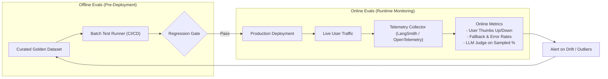

# 📹 Offline Evals Vs Online Evals

<div className="video-card" style={{border: '1px solid #30363d', borderRadius: '8px', padding: '16px', marginBottom: '24px', background: 'rgba(56, 139, 253, 0.05)'}}>
  <div style={{display: 'flex', gap: '16px', flexWrap: 'wrap'}}>
    <div><strong>Instructor:</strong> Nitish Singh (CampusX)</div>
    <div><strong>Duration:</strong> 4869</div>
    <div><strong>Course:</strong> Module 6: LLM Evaluation & Observability</div>
    <div><strong>Watch Link:</strong> <a href="https://www.youtube.com/watch?v=SahaDGzN-Bk" target="_blank" rel="noopener noreferrer">YouTube Lecture ↗</a></div>
  </div>
</div>

## 📌 Executive Summary

Reliable production systems bridge Offline Evaluations (pre-deployment testing on golden datasets) and Online Evaluations (real-time monitoring of live user interactions). 

This lesson covers the complementary roles of both paradigms: using offline evals to prevent regressions before deployment and online evals to detect topic drift, latency spikes, and unexpected user edge cases.

---

## 🏗️ System Architecture & Execution Flow



---

## 📖 Core Concepts & Technical Deep Dive

### 1. Offline Evaluations (The Safe Sandbox)
- Executed during development and inside CI/CD test runners.
- Tested against frozen datasets with deterministic inputs and ground-truth references.
- **Advantage:** Completely risk-free; regressions are caught before affecting real users.
- **Limitation:** Golden datasets are synthetic abstractions and cannot anticipate real human conversational chaos.

### 2. Online Evaluations (The Reality Check)
- Executed continuously against real production traffic.
- Metrics include implicit signals (user copied text, session duration, retry count) and explicit signals (thumbs up/down).
- Sampled real-time evaluation: 1-5% of live production traces are dispatched to a background judge model for automated grading.
- **Advantage:** Captures actual user behaviors, emerging domain shifts, and latency bottlenecks.
- **Limitation:** PII must be scrubbed; errors already impacted user experience.

---

## 💻 Production Implementation

```python
# Simulating an Online Telemetry Logger with Sampling
import random

def log_production_interaction(session_id: str, query: str, response: str, user_feedback: int = None):
    telemetry_payload = {
        "session_id": session_id,
        "query_length": len(query),
        "response_length": len(response),
        "feedback": user_feedback, # 1 for up, -1 for down, None for ignored
        "flagged_for_review": False
    }
    
    # Flag negative feedback immediately
    if user_feedback == -1:
        telemetry_payload["flagged_for_review"] = True
        print(f"[ALERT] Negative user feedback on session {session_id}. Queued for offline analysis.")
    
    # 5% background sampling for judge evaluation
    elif random.random() < 0.05:
        print(f"[SAMPLE] Session {session_id} selected for background LLM-as-a-judge evaluation.")
        
    return telemetry_payload

log_production_interaction("sess_4821", "How to delete account?", "Go to Settings > Profile > Delete Account.", -1)
```

---

## ⚙️ Production Gotchas & Best Practices

:::tip The Feedback Flywheel
Establish an automated pipeline where all flagged production interactions (thumbs-down, user retries) are scrubbed of PII and automatically appended to your offline golden dataset.
:::

:::warning Online Judge Costs
Do not evaluate 100% of production queries with frontier LLMs. Use sampling rates between 1% and 5% to keep telemetry costs under 3% of total infrastructure spend.
:::

---

## 📊 Architectural Reference & Comparison

| Metric Dimension | Offline Evaluations | Online Evaluations |
| :--- | :--- | :--- |
| **Execution Trigger** | Git push / CI build / Manual run | Continuous live user queries |
| **Data Source** | Synthetic / Expert curated golden set | Real-world anonymized user sessions |
| **Ground Truth** | Available & verified | Generally unavailable (reference-free) |
| **Primary Signals** | Faithfulness, Recall, G-Eval score | User feedback, session drop-off, latency, drift |

---

## 📚 Key Takeaways & Enterprise Checklist

- [ ] **Architecture Verification:** Ensure your design addresses latency, decoupled interfaces, and strict data validation contracts.
- [ ] **Deterministic Testing:** Run unit tests and golden dataset evaluations before shipping changes to staging or production.
- [ ] **Security & Observability:** Enforce input/output guardrails, scrub sensitive credentials/PII, and capture distributed traces.
- [ ] **Scalability & Sizing:** Calibrate model parameters, context limits, and compute instance requirements against projected request concurrency.
