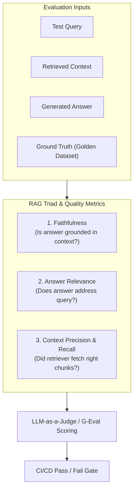

# 📹 LLM Model Evals & Capabilities

<div className="video-card" style={{border: '1px solid #30363d', borderRadius: '8px', padding: '16px', marginBottom: '24px', background: 'rgba(56, 139, 253, 0.05)'}}>
  <div style={{display: 'flex', gap: '16px', flexWrap: 'wrap'}}>
    <div><strong>Instructor:</strong> Nitish Singh (CampusX)</div>
    <div><strong>Duration:</strong> 37m 52s</div>
    <div><strong>Playlist:</strong> LLM Evaluation Complete Series (CampusX)</div>
    <div><strong>Watch Link:</strong> <a href="https://www.youtube.com/watch?v=FPS0rIAQwzo" target="_blank" rel="noopener noreferrer">YouTube Lecture ↗</a></div>
  </div>
</div>

## 📌 Executive Summary & Learning Objectives

This lecture covers **LLM Model Evals & Capabilities**, focusing on production implementations, edge cases, and industry standards:
- Core intuition, architecture, and underlying mechanisms.
- Key differences between theoretical research implementations and scalable enterprise patterns.
- Concrete Python walkthroughs, error recovery, and performance optimization.

---

## 🏗️ Architecture & Conceptual Workflow



---

## 📖 Core Concepts & Technical Deep Dive

### 1. Architectural Foundations
In modern production AI engineering, **LLM Model Evals & Capabilities** is essential for ensuring reliability, low latency, and deterministic outcomes. As AI systems evolve from naive prompt-in / completion-out scripts into distributed systems, engineers must handle:
- **State management & consistency:** Ensuring intermediate states and tool invocations are tracked.
- **Error boundaries & recovery:** Graceful degradation when external LLMs or vector stores encounter rate limits or network partitions.
- **Resource utilization & cost efficiency:** Caching common queries and reducing unnecessary foundation model token expenditure.

### 2. Operational Considerations
- **Latency Optimization:** Pre-computing embeddings, utilizing asynchronous non-blocking event loops, and streaming tokens via Server-Sent Events (SSE).
- **Security & Sandboxing:** Validating inputs before ingestion, sanitizing LLM outputs, and isolating tool execution environments.

---

## 💻 Production Implementation Walkthrough

```python
from deepeval import assert_test
from deepeval.test_case import LLMTestCase
from deepeval.metrics import FaithfulnessMetric, AnswerRelevancyMetric

# 1. Prepare Test Case
test_case = LLMTestCase(
    input="What is the context window of Claude 3.5 Sonnet?",
    actual_output="Claude 3.5 Sonnet features a 200,000 token context window.",
    retrieval_context=["Claude 3.5 Sonnet supports up to 200k tokens of context."]
)

# 2. Define Metrics
faithfulness = FaithfulnessMetric(threshold=0.8)
relevancy = AnswerRelevancyMetric(threshold=0.8)

# 3. Assert Production Test Gate
def test_rag_accuracy():
    assert_test(test_case, [faithfulness, relevancy])
```

---

## 💡 Production Best Practices & Tips

:::tip Production Deployment Guideline
When deploying LLM Model Evals & Capabilities in enterprise environments, always configure automated retries with exponential backoff and telemetry tracing (such as OpenTelemetry or LangSmith).
:::

:::warning Common Failure Modes
Watch out for state contamination across concurrent requests. Ensure each session or user interaction uses an isolated thread ID or execution context.
:::

---

## 🎯 Key Takeaways & Quick Reference

| Dimension | Production Standard | Pitfall to Avoid |
| :--- | :--- | :--- |
| **Execution** | Async / Non-blocking with timeouts | Synchronous blocking calls in event loops |
| **Data Validation** | Strict Pydantic v2 schemas | Untyped dictionary access |
| **Monitoring** | Distributed tracing & latency percentiles | Relying only on standard console logs |

## ⏱️ Lecture Timeline & Key Topics

| Timestamp | Key Topic / Concept Discussed |
| :--- | :--- |
| **00:00:00** | सेशन को स्टार्ट करते हैं। ठीक है? सो या... |
| **00:09:46** | तो ऐसा कोई एक सिंगल मॉडल इवल नहीं होता... |
| **00:19:47** | कैपेबिलिटीज होती हैं। हो सकती हैं। तो... |
| **00:28:54** | इंपॉर्टेंट। फोर्थ वन इज़ लॉन्ग... |
| **00:37:51** | दिस।... |


---

---

## 📜 Complete Lecture Transcript (Hindi / Hinglish)

> **Language:** Hindi / Hinglish | **Source:** `07 - LLM Model Evals & Capabilities ｜ CampusX.hi-orig.srt` | **Total Segments:** 19 | **Word Count:** ~7,117 words

<details>
<summary><b>Click to expand full chronological transcript (19 timestamped intervals)</b></summary>

#### ⏱️ [00:00 ➔ 00:02]

सेशन को स्टार्ट करते हैं। ठीक है? सो या गाइस क्विक रिककैप। अभी तक हमने इस प्लेलिस्ट में क्या-क्या किया? आई नो आप लोग थोड़ा कभी-कभी ऐसा सोचते होंगे कि मैं क्यों हर सेशन के पहले रीकैप कराने लग जाता हूं। मतलब आपको तो याद ही है। मैं इसलिए रिककैप कराता हूं गाइस बिकॉज़ एज अ टीचर जब भी मैं रीकैप करा के सेशन स्टार्ट करता हूं ना तो मेरे को थोड़ा सा मैं फ्लो में आ जाता हूं। मेरे को पूरा समझ में आ जाता है कि अभी तक हमने क्या पढ़ा है, आज क्या पढ़ाना है, कैसे कनेक्ट करना है, वो सब कुछ समझ में आ जाता है। तो जस्ट देयर विद मी इवन इफ यू नो अभी तक हमने क्या-क्या कवर किया है। आई जस्ट गिव यू अ क्विक रिककैप। हमने शुरू किया था व्हाई डू वी नीड एलएलएम इवल से। फिर हमने डिस्कस किया था कि व्हाट एकजेक्टली आर एलएलएम इवल्स? यहां पे हमने एक बहुत इंपॉर्टेंट बात डिस्कस की थी कि दो टाइप के एलएलएम इवाल्स होते हैं। एक होते हैं मॉडल इवा्स और एक होते हैं एप्लीकेशन इवल्स। बताया था ना? मॉडल इव्स मतलब ऐसे इवेल्स जो हम स्पेसिफिकली एलएलएम्स को इवैल्यूएट करने के लिए यूज करते हैं। और एप्लीकेशन इवाइल्स जो हम एलएलएम बेस्ड एप्लीकेशनेशंस को इवैल्यूएट करने के लिए यूज़ करते हैं। और मैंने आपको बताया था कि इस कोर्स का जो मेन फोकस रहने वाला है वो एप्लीकेशन इवल्स ही रहेगा। यहीं पे आप रैक के इवैल्यूएशंस, एजेंट के इवैल्यूएशंस वगैरह सीखोगे। ठीक है? उसके बाद हमने डिस्कस किया था एक ईवेल पाइपलाइन बेसिकली हाउ [नाक से की जाने वाली आवाज़] ईल्स वर्क। फिर हमने एक इंटरेस्टिंग पॉइंट डिस्कस किया था कि व्हाई डू वी नीड मल्टीपल ईवेल पाइपलाइंस? और लास्ट वीडियो में हमने एक इंपॉर्टेंट टॉपिक कवर किया था ऑनलाइन ईवेल्स का कि एक बार जब आप इवैल्यूएशन कर लेते हो अपने एप्लीकेशन का उसको डिप्लॉय कर देते हो तो डिप्लॉयमेंट के बाद भी उसको कैसे इवैलुएट करते रहना है। ये हमने लास्ट वीडियो में डिस्कस किया था। ठीक है? तो इन अ वे आई कैन से कि अभी तक हमने ना इस पूरे कोर्स का एक ओवरव्यू डिस्कस कर लिया है। अब हम स्पेसिफिक्स में जाएंगे। जो भी हमने अभी तक पढ़ा है उसी को और धीरे-धीरे डिटेल में कवर करेंगे। जैसे आज के हमारे वीडियो का जो मेन गोल है वो ये है कि हम मॉडल

#### ⏱️ [00:02 ➔ 00:04]

इवा्स को कवर करेंगे। मॉडल इवाइल्स मतलब ऐसे इवाइल्स जिनको आप यूज़ करते हो डायरेक्टली एलएलएम की कैपेबिलिटीज को टेस्ट करने के लिए। तो हम मॉडल इवाइल्स के ऊपर आज से काम करना स्टार्ट करेंगे। एक सिंगल लेक्चर में तो कवर नहीं होगा। आई एम ट्राइंग कि ये दो लेक्चर्स में हम कवर कर पाए। सबसे पहले जैसे हमारा एक फ्लो रहता है कैंपस एक्स में व्हाई व्हाट हाउ वाला उसी हिसाब से आगे बढ़ते हैं। सबसे पहले डिस्कस करते हैं व्हाई डू वी नीड मॉडल इवाs? ठीक है? इनफैक्ट हम ये क्वेश्चन नहीं पूछेंगे। हम ये क्वेश्चन पूछेंगे कि व्हाई एआई इंजीनियर्स नीड मॉडल इव्स? ठीक है? बिकॉज़ मैंने आपको बोल रखा है कि हम एआई इंजीनियर्स के पर्सेक्टिव से ये कोर्स पढ़ रहे हैं। तो हम रादर देन ये डिस्कस करने हैं कि मॉडल इवाइल्स की क्या जरूरत है? मॉडल इवा्स की क्या जरूरत है? हमें ऑलरेडी पता है। मॉडल इवा्स की सीधी-सीधी जरूरत क्या है कि मॉडल इवा्स इसलिए एक्सिस्ट करते हैं सो दैट वी कैन मेजर द कैपेबिलिटीज़ ऑफ आवर एलएलएम्स। और ये कैपेबिलिटीज़ मेजर करना क्यों जरूरी है? बिकॉज़ अगर आप मेजर नहीं करोगे तो इंप्रूव कैसे करोगे? वह फेमस लाइन आपने सुना होगा शायद। इफ यू कांट मेजर यू कांट इंप्रूव। ठीक है? तो मॉडल इव्स बेसिकली हमें मैकेनिज्म देते हैं जिनकी हेल्प से हम किसी भी एलएलएम की मल्टीपल टाइप की कैपेबल कैपेबिलिटीज़ को इवैलुएट कर सकते हैं। राइट? तो दैट इज़ व्हाई मॉडल मॉडल इव्स एकज़िस्ट इन जनरल। बट हम बात करेंगे एआई इंजीनियर के पर्सपेक्टिव से कि इफ आई एम एन एआई इंजीनियर मेरा डे टू डे काम है कि मैं एलएलएम बेस्ड एप्लीकेशनेशंस बनाता हूं तो फिर मेरे लिए मॉडल इवाइल्स क्यों जरूरी है? आई कैन अंडरस्टैंड कि फ्रंटियर लैब्स के लिए मॉडल इवाइल्स आर नेसेसरी बिकॉज़ उसके बेसिस पे ही फ्रंटियर लैब्स को समझ में आता है कि उनको क्या इंप्रूवमेंट करनी है, कहां पे गड़बड़ हुई है, कैसे अपना ट्रेनिंग को शेप करना है। बट एज एन एआई इंजीनियर मेरे लिए मॉडल इव्स क्यों जरूरी है? ये हम डिस्कस करेंगे। ठीक है? अभी तक हमने जो भी डिस्कशन किया इस पूरे के पूरे प्लेलिस्ट में इस पूरे के पूरे कोर्स में वो ये था कि हम मोस्टली एलएलएम

#### ⏱️ [00:04 ➔ 00:06]

बेस्ड एप्लीकेशनेशंस को कैसे इवैलुएट करना है ये सीख रहे थे। हम बात कर रहे थे कि अगर हम एक रैग एप्लीकेशन बना रहे हैं तो उसमें रिट्रीवर को कैसे इवैलुएट करना है, जनरेटर को कैसे इवैलुएट करना है, पूरी की पूरी पाइपलाइन को कैसे इवैलुएट करना है। पूरे के पूरे एप्लीकेशन को कैसे इवैलुएट करना है। बट आप याद करो इस पूरे डिस्कशन में हमने कभी भी एक सिंगल बार भी ये डिस्कस नहीं किया कि इस रैग एप्लीकेशन को चलाने के लिए जो एलएलएम हम यूज़ करेंगे जो कि ब्रेन होगा इस एप्लीकेशन का उसको हम कैसे इवैल्यूएट कर रहे हैं। उसको हम कैसे सेलेक्ट कर रहे हैं। सोच के देखो ना। मान लो आप आज की डेट में एक रैग एप्लीकेशन बनाने का सोच रहे हो अपनी कंपनी के लिए। तो ऑब्वियसली सबसे पहला क्वेश्चन तो यह आएगा कि आप एलएलएम कौन सा यूज़ करोगे? क्या आप ओपन एआई का एलएलएम यूज़ करोगे या फिर आप क्लॉड का एलएलएम यूज़ करोगे? सिंपल सा क्वेश्चन है। सोच के देखो। आपके पास दो ऑप्शंस हैं। ओपन एआई क्लॉड। अब आप ये नहीं बोल सकते इन अ प्रोफेशनल सेटिंग कि यार जो मर्जी यूज़ कर लो। दोनों अच्छे हैं। आप ऐसे बात नहीं कर सकते। इन अ टीम मीटिंग यू विल हैव टू कम विद कंक्रीट पॉइंटर्स कि व्हाई यू शुड ऑप्ट ओपन एआई का एलएलएम या फिर व्हाई यू शुड ऑप्ट क्लॉड का एलएलएम और इसी क्वेश्चन को आंसर करने के लिए आपको मॉडल इवाइ्स की जरूरत पड़ती है। मॉडल इवाइल्स के बेसिस पे आप कंक्रीट तरीके से बोल सकते हो कि देखो दीज़ आर द पॉइंटर्स दीज़ आर द कैपेबिलिटीज़ जो हमारे एप्लीकेशन के लिए जरूरी है। और देखो उस कैपेबिलिटी में ये पर्टिकुलर एलएलएम ज्यादा स्कोर कर रहा है। एंड दैट इज व्हाई वी शुड चूज़ दिस पर्टिकुलर एलएम ओवर द कंपेटिट। तो सबसे पहला रीज़न ये है मॉडल इवाइल्स पढ़ने का एज एन एआई इंजीनियर दैट यू कैन इजीली कंपेयर टू और मोर डिफरेंट मॉडल्स एंड यू कैन चूज़ वन फॉर योर एप्लीकेशन। ठीक है? तो दिस इज़ रीज़न नंबर वन। रीज़न नंबर टू इज़ कि मॉडल इवाल्स अगर होंगे पिक्चर में तो आप ये ट्रैक कर सकते हो कि जो नए मॉडल्स आ रहे हैं क्या वो सच में इंप्रूव कर रहे हैं या नहीं। सोच के देखो आपका एक रैग एप्लीकेशन डिप्लॉयड है। आपने उसमें क्लॉड का ओपस 4.8

#### ⏱️ [00:06 ➔ 00:08]

लगा रखा है। सब कुछ एप्लीकेशन सही से काम कर रहा है। अब क्लॉड का फेबल आ गया। ठीक है? अब आपका मैनेजर आपको बोल रहा है कि यार एक बार थोड़ा रिसर्च करके बताओ कि क्या फेबल हम डिप्लॉय करें या फिर ओपस पे ही रहने दें? अब यह बात आपको कैसे समझ में आएगी? हाउ वुड यू नो दिस एज अ फैक्ट कि फेबल बेटर है? अगेन द आंसर इज़ मॉडल इवास। आपके पास वो नंबर्स मॉडल इवाs के थ्रू ही आएंगे जिसके बेसिस पे आप ये जस्टिफाई कर सकते हो कि कहीं कोई नया मॉडल पिछले मॉडल से बेटर है या नहीं। पॉइंट नंबर थ्री मॉडल इवाs ही वो तरीका है जिसके बेसिस पे आप ये बता सकते हो कि आपका जो मॉडल है जो आपने डिप्लॉय कर रखा है या डिप्लॉय करने वाले हो वो सेफ है। राइट? मॉडल इवा्स आपको बताते हैं कि आपका जो एलएलएम है वो कितना हेलुसिनेट कर रहा है। वो कितना सेफ है यूज़ करने के लिए। कहीं उसको जेल ब्रेक तो नहीं किया जा सकता। तो ये सारी चीजें आपको अगेन मॉडल ईवेल ही बताता है। एंड द लास्ट पॉइंट इज मॉडल इवल के बेसिस पे आप एक बहुत इंपॉर्टेंट डिसीजन मेकिंग कर सकते हो कि आपको खुद का एलएलएम अ होस्ट करना चाहिए, डिप्लॉय करना चाहिए या फिर जो एकिस्टिंग एपीआई हैं उनको यूज़ करना चाहिए। राइट? आप कैसे डिसाइड करोगे कि यू शुड गो विद अ प्रोपराइटरी एलएलएम लाइक क्लॉड और यू शुड गो विद अ ओपन सोर्स एलएलएम लाइक डीप सीक दोनों के अपने-अपने फायदे हैं। हो सकता है क्लॉट ज्यादा महंगा पड़ रहा हो डीप सीक हो सकता है थोड़ा सस्ता पड़ रहा हो। बट ऐसा हो सकता है कि क्लॉट ज्यादा पावरफुल हो, ज्यादा बेटर हो मल्टीपल कैपेबिलिटीज में डीप सीक मैच ना कर पाए। तो हाउ वुड यू डिसाइड कि शुड आई गो फॉर अ प्रोपराइटरी एलएलएम? मैं सीधे एपीआई यूज़ कर लूं या फिर मैं एक ओपन सोर्स मॉडल को हगिंग फेस से पुल करके अपने सर्वर अपनी कंपनी के सर्वर पे बिठा करके अपने खुद के एपीआई लिख करके पूरा का पूरा एप्लीकेशन बनाऊं। अगेन ये जो कंपैरिजन है दिस इज फैसिलिटेटेड यूजिंग मॉडल इवाs सो नटशेल में आप विदाउट मॉडल

#### ⏱️ [00:08 ➔ 00:10]

इवाs अंधे हो यू आर बेसिकली ब्लाइंड। इफ यू वांट टू सी कि कौन सा मॉडल कैसा है और दो मॉडल्स को अगर आपको कंपेयर करना है द ओनली ऑप्शन दैट यू हैव इज मॉडल इव्स तो उस सेंस में एज एन एआई इंजीनियर दिस टॉपिक इज वेरी वेरीेंट एंड दैट इज व्हाई हम इस टॉपिक को अच्छे से कवर करेंगे। अब एक काम करते हैं। ये तो हमें समझ में आ गया कि मॉडल इव्स जरूरी हैं। अब थोड़ा प्रॉपर्ली फॉर्मली डिस्कस कर लेते हैं कि मॉडल इवा्स होते क्या है? ठीक है? अभी तक हमने सिर्फ इतना ही डिस्कस किया है कि मॉडल ईवेल इज बेसिकली अ वे टू इवैल्यूएट योर एलएलएम्स। उसी को थोड़ा और फॉर्मली डिस्कस करेंगे इस सेक्शन में। सो यहां पे लिखा हुआ है मॉडल ईवेल इज़ अ सिस्टमैटिक प्रोसेस ऑफ मेजरिंग एन अंडरलाइन मॉडल्स कैपेबिलिटीज़ बिहेवियर रिलायबिलिटी एंड ऑपरेशनल कैरेक्टरिस्टिक्स अंडर कंट्रोलोल्ड कंडीशंस। ठीक है? थोड़ा उसी डेफिनेशन को थोड़ा एक्सपैंड कर दिया गया। बट नटशेल में अभी भी बात वही है कि मॉडल इवल एक प्रोसेस है जिसकी हेल्प से आप किसी भी एलएलएम को टेस्ट कर सकते हो। उसकी कैपेबिलिटीज को उसके बिहेवियर को टेस्ट कर सकते हो। ठीक है? अब अगर बात की जाए थोड़े टेक्निकल लेवल पे कि एग्जजेक्टली होता क्या है? एक मॉडल इवाल के अंदर तो कभी भी आप किसी भी टाइप के मॉडल इवाल की बात करो तो वहां पर चार चीजें होती हैं। हर मॉडल इवाल चार स्टेप्स को फॉलो करता है। सबसे पहले आप ये डिसाइड करते हो कि आपको एलएलएम की कौन सी कैपेबिलिटी को टेस्ट करना है। एलएलएम्स आर जनरल पर्पस मॉडल्स। राइट? बहुत तरह के काम वो कर सकते हैं। उनके अंदर बहुत तरह की कैपेबिलिटीज होती हैं। तो ऐसा कोई एक सिंगल मॉडल इवल नहीं होता जो हर कैपेबिलिटी को टेस्ट कर ले। ठीक है? इट्स नॉट लाइक ह्यूमंस में जैसे आईक्यू होता है। एक सिंगल नंबर से आप काफी कुछ बता पाते हो एक ह्यूमन के बारे में। अनफॉर्चूनेटली एलएलएम्स में ऐसा नहीं है। एलएलएम्स की हर कैपेबिलिटी के लिए अलग

#### ⏱️ [00:10 ➔ 00:12]

मॉडल इवल होता है। ठीक है? तो द फर्स्ट थिंग दैट यू हैव इन मॉडल ईवेल इज दैट यू डिसाइड कि आपको मॉड मॉडल की या एलएलएम की कौन सी कैपेबिलिटी को टेस्ट करना है। क्या आप उसकी रीजनिंग कैपेबिलिटी को टेस्ट करना चाहते हो या उसकी कोडिंग कैपेबिलिटी को टेस्ट करना चाहते हो या आप देखना चाहते हो कितना सेफ है यूज़ करने में या फिर आप उसकी इंस्ट्रक्शन फॉलोइंग कैपेबिलिटी को टेस्ट करना चाहते हो तो द फर्स्ट थिंग दैट यू डू इज़ यू डिसाइड द कैपेबिलिटी दैट यू टेस्ट दैट यू वांट टू टेस्ट। ठीक है? उसके बाद आप क्या करते हो? आप उस कैपेबिलिटी को टेस्ट करने के लिए एक टेस्ट ले आते हो। ठीक है? एक टेस्ट या एक मैकेनिज्म लेके आते हो जिससे आप उस कैपेबिलिटी को टेस्ट करोगे। ठीक है? अभी मैं थोड़ी देर बाद इसके बारे में और बात करूंगा। बट द सेकंड स्टेप इज़ दैट यू ब्रिंग अ टेस्ट। थर्ड इज़ कि आप उस मॉडल को उस टेस्ट के ऊपर रन करते हो। ठीक है? बेसिकली वो मॉडल वो एग्जाम देता है। ठीक है? और एग्जाम देने के टाइम आप कुछ चीजें फिक्स कर लेते हो। जैसे कि कौन सा प्रेजोगे, किस तरह की कंडीशंस रहेंगी। ये सब कुछ आप फिक्स कर लेते हो। सो दैट आप इसको आगे रिपीट कर पाओ। अगर आप मल्टीपल मॉडल्स को टेस्ट कर रहे हो तो सारे मॉडल्स को एक तरह का कंडीशन मिलना चाहिए। तो थर्ड इज़ यू रन द मॉडल अंडर फिक्स्ड प्रोटोकॉल। एंड द फोर्थ थिंग इज़ वंस द टेस्ट इज़ डन यू स्कोर एंड इंटरप्रेट। सिंपल है। सो चार स्टेप्स में बात की जाए तो यू फर्स्ट डिसाइड कौन सी कैपेबिलिटी को टेस्ट करना है। उस कैपेबिलिटी को टेस्ट करने के लिए आप एग्जाम एक एक टेस्ट लेके आते हो। फिर उस टेस्ट को एक कंट्रोलोल्ड एनवायरमेंट में चलाते हो और जो भी स्कोर आता है उसको आप पब्लिश करते हो या फिर उसको इंटरप्रेट करते हो। ठीक है? तो ये चार स्टेप्स में होता है। बात थोड़ी सी करते हैं एक इंपॉर्टेंट सेकंड स्टेप के बारे में कि जहां पे हमने ये बोला कि हम एक टेस्ट लेके आते हैं। अब यहां पे दो टाइप्स के टेस्ट होते हैं मॉडल इवास में। ठीक है? यहां पे देखो मैंने नीचे लिखा हुआ है। फर्स्ट टेस्ट होता है जिसको हम बेंचमार्क बुलाते

#### ⏱️ [00:12 ➔ 00:14]

हैं। शायद आपने इसका नाम भी सुना होगा। बहुत फेमस फेमस बेंचमार्क्स होते हैं। अ बेंचमार्क्स क्या होते हैं? बेंचमार्क्स आर बेसिकली स्टैंडर्डाइज्ड शेयरर्ड टेस्ट जैसे कि एमएमएलयू हुआ या स्वी बेंच हुआ बिकॉज़ एवरीवन रंस द सेम टेस्ट इट्स ग्रेट फॉर कंपेयरिंग मॉडल्स ऑन कॉमन ग्राउंड। तो एक टेस्ट का टाइप होता है बेंचमार्क। बेंचमार्क इज़ लाइक अ स्टैंडर्डाइज्ड टेस्ट। वो बेसिकली सारे मॉडल्स के लिए सेम होता है। ठीक है? और उसका नंबर भी लाइक आप ओपनली कंपेयर कर सकते हो दो मॉडल्स का। इट्स लाइक अ स्टैंडर्डाइज्ड थिंग। एवरीवन रिकॉग्नाइज़ज़ इट। एंड एवरीवन यूजस इट। ठीक है? और सेकंड ये होता है कि आप कभी-कभी रादर देन बेंचमार्क के ऊपर एक एलएलएम को टेस्ट करने के आप अपने खुद के इवैल्यूएशन सेट्स भी बनाते हो। यहां पे देखो लिखा हुआ है डेटा यू असेंबल फ्रॉम योर एक्चुअल टास्क व्हिच मेजर्स व्हाट यू स्पेसिफिकली केयर अबाउट रादर देन व्हाट्स जेनेरिकली यूज़फुल। ठीक है? अब ये एक बहुतेंट पॉइंट है। ये समझना आप। मैंने अभी क्या एक इंपॉर्टेंट पॉइंट बोली कि मॉडल इव्स दो टाइप के होते हैं। एक होते हैं बेंचमार्क्स वि आर बेसिकली स्टैंडर्डाइज्ड टेस्ट जो स्पेसिफिक कैपेबिलिटीज को टेस्ट करते हैं। जैसे कि मैथ्स की कैपेबिलिटी को या रीजनिंग की कैपेबिलिटी को या फिर इंस्ट्रक्शन फॉलोइंग की कैपेबिलिटी को। और सेकंड होता है कि आप कभी-कभी कस्टम इवैल्यूएशंस भी रन करते हो अपने मॉडल के ऊपर। बिकॉज़ आपको यह पता करना है कि आपका जो गिवन एलएलएम है वो आपके एप्लीकेशन के ऊपर उसका कैपेबिलिटी या उसका परफॉर्मेंस कैसा रहेगा। ठीक है? अब ऑब्वियसली आपके दिमाग में क्वेश्चन आ सकता है कि अगर बेंचमार्क से मुझे स्टैंडर्ड क्वेश्चंस के आंसर मिल रहे हैं कि मैथ्स में कितना अच्छा है? रीजनिंग में कितना अच्छा है, कोडिंग में कितना अच्छा है? तो मेरे को अलग से अपना कस्टम इवल चलाने की क्या जरूरत है? इस क्वेश्चन का मैं आपको आंसर करता हूं। एक छोटा सा सिनेरियो लेते हैं। अगर आपको याद होगा तो हमने फर्स्ट सेशन में डिस्कस किया था कि हमने Zomato के लिए

#### ⏱️ [00:14 ➔ 00:16]

एक ऐसा सिस्टम बनाया था जो कि इनकमिंग ईमेल का कंटेंट को रीड करके ये बताता है कि वो मेल बिलिंग के पास राउट होना चाहिए या फिर और भी दोद कैटेगरीज थी यहां पे। मान लो बिलिंग था, टेक्निकल था, रिफंड था। मान लो ये तीन कैटेगरीज है। इसको हटा दो। तो बेसिकली आपने ये एप्लीकेशन बनाना है। अब इस एप्लीकेशन को बनाने के लिए आपके पास दो मॉडल के चॉइससेस हैं। मॉडल ए जो है वो एक प्रॉपर बड़ा एलएलएम है। ठीक है? यहां लिखा हुआ है बिग टॉप ऑफ द लीडर बोर्ड बट एक्सपेंसिव। यहां पर 1 मिलियन टॉक टोकंस यूज करने पर आपको रफली $15 खर्च करने पड़ते हैं। और सेकंड आपके पास एक सेकंड मॉडल का ऑप्शन है जो कि छोटा मॉडल है और ऑब्वियसली सस्ता है। यहां पर आप 1 मिलियन टोकन यूज़ करने पे सिर्फ 50 सेंट्स देते हो। और ये पब्लिक बेंचमार्क्स की अगर बात करो तो ये मिड ऑफ द टेबल आता है। वेयर एज मॉडल ए टॉप ऑफ द टेबल है। तो इसको आप कहीं समझो कि ये अ क्लॉड का ओपस टाइप का मोड मॉडल है और इसको आप समझो कि ये लेट्स से मिन मैक्स या फिर क्वेन का कोई कम बिलियन पैरामीटर वाला मॉडल है। तो अभी कॉमन सेंस यहां पे क्या बोलती है कि यार इतना दिमाग क्यों लगा रहे हो? सीधे-सीधे मॉडल ए को डिप्लॉय करो। मॉडल ए तो अच्छे रिजल्ट्स देगा ही। बट एक बात यहां पे समझो कि अगर आप सीधे मॉडल ए को लगा देते हो Zomato के स्केल पे तो यह खर्चा बहुत ज़्यादा बढ़ सकता है। तो यहां पे क्लियरली अगर आप सिर्फ बेंचमार्क्स की बात करो तो हर बेंचमार्क पे मॉडल ए विल बी बेटर देन मॉडल बी। राइट? मैथ्स में भी अच्छा होगा, कोडिंग में भी अच्छा होगा, लैंग्वेज जनरेशन में भी अच्छा होगा, हर चीज में अच्छा होगा। तो यहां पे तो ऑब्वियस आंसर इज़ कि मॉडल ए को यूज़ करना चाहिए। बट यहां पे क्या करोगे आप? आप सिंपली एक छोटा सा काम करोगे। आप अपना एक डाटा सेट बनाओगे। जहां पर आप 200 से 500

#### ⏱️ [00:16 ➔ 00:18]

पास्ट ईमेल्स को उठा के लाओगे और उनको लेबल भी कर दोगे कि वो ईमेल टेक्निकल है या बिलिंग है या रिफंड है। बेसिकली आप एक गोल्डन डेटा सेट बना रहे हो और ये गोल्डन डेटा सेट आप मॉडल ए को भी दोगे, मॉडल बी को भी दोगे और रिजल्ट्स निकालोगे। तो रिजल्ट्स आने के बाद पता चला कि क्लासिफिकेशन एक्यूरेसी जो है वो मॉडल ए की 94% है और मॉडल बी की ऑब्वियसली कम है बट बहुत कम नहीं है। सरप्राइजिंगली सिंस ये टास्क उतना डिफिकल्ट नहीं है। तो सेकंड वाला मॉडल भी 91% स्कोर कर रहा है। अर्जेंसी एक्यूरेसी क्या होता है? मेल का कंटेंट पढ़ के ये रीड करना कि कितना अर्जेंटली यूजर को रिप्लाई चाहिए। तो वो भी 88% मॉडल ए निकाल के दे रहा है। सही क्लासिफाई कर रहा है और ये 87% करके दे रहा है। अगेन बहुत ज्यादा डिफरेंस नहीं है। और 1000 ईमेल्स को प्रोसेस करने में यहां पे हमें $6 लग रहे हैं। यहां पे लेस देन लेस देन मैं स शायद गलत बोला। लेस देन 0.21 लग रहे हैं। ठीक है? और लेटेंसी की बात की जाए तो सिंस दिस इज़ अ बिग मॉडल। तो ये 4.1 सेकंड्स ले रहा है। वेयर एस दिस वन इज़ टेकिंग जस्ट 9 सेकंड्स टू सर्वर रिक्वेस्ट। अब आप मुझे बताओ बेस्ड ऑन दिस टेबल लॉजिकली वि मॉडल वुड यू चूज़ वुड यू गो फॉर मॉडल ए व्हिच इज अ बिगर पावरफुल मॉडल और बी इट्स वेरी वेरीरी सिंपल एंड वेरी वेरीरी स्ट्रेट फॉरवर्ड दैट यू विल से कि यार भले ही मॉडल ए बहुत पावरफुल है और बहुत अच्छा है मॉडल बी के कंपैरिजन में बट हमारे टास्क के लिए मॉडल बी इज अ मच बेटर वैल्यू प्रपोजिशन बिकॉज़ बहुत ज्यादा हम एक्यूरेसी लूज़ नहीं कर रहे बट हम बहुत पैसा और लेटेंसी बचा रहे हैं। तो वी विल गो विद मॉडल बी। अब खुद सोच के देखो अगर हम सिर्फ बेंचमार्क्स पर डिपेंड करते तो क्या हम कभी इस कंक्लूजन पर पहुंच पाते? जल्दी से बताओ। अगर हमारे पास सिर्फ बेंचमार्क्स का ऑप्शन होता हम सिर्फ बेंचमार्क्स के थ्रू मॉडल इवैल्यूएशन करते। तो क्या हम कभी पहुंच पाते इस कंक्लूजन पे कि मॉडल बी बेटर है? नहीं। हर

#### ⏱️ [00:18 ➔ 00:20]

बेंचमार्क में मॉडल ए मॉडल बी को बीट कर देता। बट सिंस हमने कस्टम इवल रन किया अपने डेटा के ऊपर। तो हमें पता चला कि हमारे काम के लिए एक्चुअली मॉडल बी ज्यादा अच्छा है। तो आई गेस आपको समझ में आ रहा है कि मॉडल इवल क्या है? एक मॉडल की कैपेबिलिटीज को टेस्ट करने का प्रोसेस बट आप दो तरीकों से टेस्ट कर सकते हो। या तो आप स्टैंडर्डाइज्ड बेंचमार्क्स रन कर लो जिससे आपको जेनेरिक कैपेबिलिटीज पता चल जाएंगी मॉडल की या फिर आप स्पेसिफिक कस्टम इव्स रन करो अपने एप्लीकेशन अपने डेटा के हिसाब से। सो दैट आपको अपने अ एप्लीकेशन के हिसाब से पता चल जाए कि कौन सा मॉडल इज मोर सूटेबल फॉर योर काइंड ऑफ़ वर्क। तो इज दिस एंटायर डिस्कशन क्लियर कि मॉडल इव्स होते क्या है और उनके क्या-क्या टाइप्स होते हैं? अब हम क्या करेंगे? आज का जो पूरा डिस्कशन है, आज का जो पूरा सेशन है, वो हम बेंचमार्क्स के ऊपर स्पेंड करेंगे। बिकॉज़ बेंचमार्क्स क्या होते हैं? बेंचमार्क्स कैसे काम करते हैं? बेंचमार्क्स का इवैल्यूएशन प्रोसेस क्या है? क्या-क्या फेमस बेंचमार्क्स हैं? ये सब भी पता होना जरूरी है। बेंचमार्क्स को रीड कैसे किया जाता है ये सब पता होना जरूरी है। और इसीलिए हम आज का सेशन पूरा बेंचमार्क्स पे स्पेंड करेंगे। सो बेसिकली आज के सेशन का नाम ही होगा एलएलएम बेंचमार्किंग। और फिर नेक्स्ट जो सेशन होगा वहां पे हम सीखेंगे हाउ डू यू रन कस्टम मॉडल ई वेल्स। आप अपने इवेल्स कैसे चला सकते हो एक गिवन एलएलएम के ऊपर। ठीक है? तो ये दो पार्ट्स में हम पूरी चीज को डिस डिवाइड कर रहे हैं। दिस इज टुडेेस सेशन। दिस विल बी द नेक्स्ट सेशन। बेंचमार्क्स को डिस्कस करने के पहले अच्छे से डिस्कस करने के पहले सबसे पहले हमें कैपेबिलिटीज को डिस्कस करना चाहिए कि एक एलएलएम में क्या-क्या कैपेबिलिटीज होती हैं। हो सकती हैं। तो हमने थोड़ी देर पहले ही डिस्कस किया कि एलएलएम्स आर लाइक जनरल पर्पस। सबसे बड़ी खूबी ही यही है एलएलएम्स की। कि वो एक जनरल पर्पस होते हैं। आप उनसे अलग-अलग

#### ⏱️ [00:20 ➔ 00:22]

टाइप्स का काम करा सकते हो। टेक्स्ट जनरेशन भी करा सकते हो। सेंटीमेंट एनालिसिस भी करा सकते हो। समराइजेशन भी करा सकते हो। अ पार्ट्स ऑफ स्पीच टैगिंग भी करा सकते हो। तो इट कैन डू अ लॉट ऑफ थिंग्स। इसके अंदर बहुत तरह की कैपेबिलिटीज होती हैं। और उन्हीं कैपेबिलिटीज को टेस्ट कौन करता है? बेंचमार्क्स। बट बेंचमार्क्स पढ़ने के पहले आपको यह पता होना चाहिए कि एक एलएलएम में क्या-क्या कोर कैपेबिलिटीज होती हैं। मोस्टली स्पीकिंग क्या-क्या कोर कैपेबिलिटीज होती हैं। ठीक है? तो इन टोटल देयर आर एट कोर कैपेबिलिटीज जो सब लोगों ने मिलके एग्री किया है। और मोस्ट ऑफ द बेंचमार्क्स जो आप देखोगे फ्यूचर में वो आपको इन्हीं आठ कैटेगरीज के ऊपर देखने को मिलेंगे। ठीक है? तो नेक्स्ट हम लोग 10 मिनट में क्या करने जा रहे हैं? जो भी सारी कोर कैपेबिलिटीज हैं उनको एक बार डिस्कस कर रहे हैं। ये हमने पास्ट में भी डिस्कस किया है बट अभी हम थोड़े ज्यादा डिटेल में डिस्कस करेंगे। एक डिस्क्लेमर है ये वाला पूरा जो डिस्कशन रहेगा अगला 10 मिनट का ये थोड़ा टेक्स्ट हैवी है। मतलब स्क्रीन पे काफी सारा टेक्स्ट है और मैं काफी कुछ रीड करूंगा। बिकॉज़ यहां पे जो भी एक्सप्लेनेशन है बहुत अच्छे से लिखा हुआ है। ठीक है? तो स्टार्ट करते हैं। सबसे पहली जो कोर कैपेबिलिटी है वो होता है नॉलेज एंड रीजनिंग। ठीक है? इन दोनों को हमने साथ में क्लब कर दिया है। बिकॉज़ बहुत टाइम्स ये दोनों साथ में ही काम करते हैं। ठीक है? तो दोनों का मतलब आई गेस आपको पता ही होगा। यहां पे देखो लिखा हुआ है कि इस डोमेन में दो चीजें आती हैं। पहला हमारे एलएलएम के पास कितना फैक्चुअल नॉलेज है जो उसने ट्रेनिंग के टाइम पे सीखा। और दूसरा क्या वो उस पूरे के पूरे फैक्चुअल नॉलेज को कनेक्ट कर पा रहा है कि नहीं? क्या वो डॉट्स कनेक्ट कर पा रहा है कि नहीं? यह दो चीजों को हम मेजर करते हैं इस कैपेबिलिटी में। क्या-क्या चीजें एक्सैक्टली यहां पर डिस्कस की जाती है? क्या-क्या चीजें मेजर की जाती हैं? सबसे पहले मेजर किया जाता है कि हमारे एलएलएम का फ़क्चुअल रिकॉल कितना है अलग-अलग सब्जेक्ट्स के ऊपर। जैसे कि बायोलॉजी, फिजिक्स, केमिस्ट्री, हिस्ट्री।

#### ⏱️ [00:22 ➔ 00:24]

अह इनफैक्ट देयर इज़ अ बेंचमार्क कॉल्ड एमएमएलयू जो 57 सब्जेक्ट्स के ऊपर मॉडल को इवैल्यूएट करता है। तो जितने भी आपके फील्ड ऑफ नॉलेज हैं उन सबके ऊपर आप टेस्ट करते हो कि उसके बेसिक क्वेश्चंस इंपॉर्टेंट क्वेश्चंस आपका एलएलएम आंसर कर पा रहा है कि नहीं। ये सबसे पहली चीज टेस्ट की जाती है नॉलेज की कैपेबिलिटी में। सेकंड है मल्टीस्टेप लॉजिकल रीजनिंग। यहां पर आप यह टेस्ट करते हो कि क्या आपका मॉडल मल्टीपल फैक्ट्स को कनेक्ट करके सही सीक्वेंस में एक कंक्लूजन पर पहुंच पा रहा है कि नहीं। मैं आपको एक सिंपल एग्जांपल देता हूं। मान लो मैंने ये क्वेश्चन उससे पूछ लिया कि पूरा का पूरा इवोल्यूशन को समराइज करो। जो भी ह्यूमन इवोल्यूशन हुआ है एकदम बिग बैंग से लेके अभी तक। उस पूरी चीज को एनालाइज करके मुझे बताओ कि आज की सोसाइटी ऐसी क्यों है? तो यहां पर अब आप देखो कि मल्टीपल एस्पेक्ट्स मल्टीपल चीजें हम टेस्ट कर रहे हैं हमारे मॉडल की। पहले तो हम उसका फक्चुअल नॉलेज चेक कर रहे हैं कि क्या उसको सच में पता है कि एकदम बिग बैंग से लेके अभी तक क्या-क्या इवेंट्स हुए हैं किस ऑर्डर में और फिर उन सारी चीजों को कनेक्ट करके उसको ये भी बताना है कि उस पूरी चीज का आज की सोसाइटी पे क्या असर पड़ा। तो दिस इज अ प्रॉपर टास्क जहां पर उसका नॉलेज भी टेस्ट हो रहा है और उसका रीजनिंग भी टेस्ट हो रहा है। तो हम इस तरह की चीजें चेक करते हैं मॉडल का। तो दिस इज द फर्स्ट कैपेबिलिटी नॉलेज एंड रीजनिंग। सेकंड कैपेबिलिटी इज़ उससे पहले ये देख लो कि फ्रंटियर लैब्स इस पर्टिकुलर कैपेबिलिटी पे इतना फोकस क्यों करते हैं? वो भी मैंने यहां पे लिखा है। इस में अगर आपका मॉडल अच्छा स्कोर कर रहा है नॉलेज में और रीजनिंग में तो उसका सिंपली मतलब ये होता है कि आपका मॉडल कितना इंटेलिजेंट है। एंड दैट इज व्हाई फ्रंटियर लैब्स केयर अबाउट दिस अ लॉट। तो यहां पे जो भी बेंचमार्क्स आप पढ़ोगे उसके ऊपर हर मॉडल

#### ⏱️ [00:24 ➔ 00:26]

अच्छा स्कोर करना चाहता है। बिकॉज़ इसी के बेसिस पे जज किया जाता है कि कोई मॉडल कितना इंटेलिजेंट है। ठीक है? तो दैट इज व्हाई दिस वन इज़ेंट। रियल वर्ल्ड में कहां-कहां पर यूज की जाती है ये कैपेबिलिटी? बहुत सिंपल है। अगर आप कभी भी एक रिसर्च [नाक से की जाने वाली आवाज़] चैट बॉट बना रहे हो जिसका काम है रिसर्च पेपर्स को एनालाइज करना और नया रिसर्च कंडक्ट करना। वहां पे नॉलेज प्लस रीजनिंग दोनों चेक हो जाता है। इफ यू आर एनालाइजिंग कॉम्प्लेक्स कस्टमर क्वेश्चंस। यहां पे तो आई एम नॉट रियली श्योर उतना यूज़ होता है कि नहीं। बट चलो ठीक है। ये लिखा हुआ है। इफ यू आर एनालाइजिंग टेक्निकली एक्यूरेट डॉक्यूमेंट्स। आपने एक मशीन लर्निंग का पेपर अपलोड कर दिया। वहां से नाउ यू आर आस्किंग क्वेश्चंस। तो रीजनिंग काफी टेस्ट होती है। अगर आप कोई ऐसा चार्ट बॉट बना रहे हो जो प्रोफेशनल्स को हेल्प कर रहा है उनकी फील्ड में। किसी लॉयर को लॉ में हेल्प कर रहा है। किसी टीचर को कोई सब्जेक्ट पढ़ाने में हेल्प कर रहा है तो वहां पे अगेन ये कैपेबिलिटी बहुत टेस्ट होती है। ठीक है? तो दिस इज द फर्स्ट वेरीेंट कैपेबिलिटी। जैसा मैंने बोला इसी से डिसाइड होता है कि कोई मॉडल कितना इंटेलिजेंट है। सेकंड कैपेबिलिटी इज कोडिंग एंड सॉफ्टवेयर इंजीनियरिंग। यह मेरे हिसाब से अगर आप पूछो तो सबसे ज्यादा इंपॉर्टेंट है फ्रॉम द पॉइंट ऑफ इकोनॉमिक्स। मतलब यहां से कोई भी मॉडल प्रोवाइडर कोई भी फ्रंटियर लैब बहुत पैसा कमा सकता है। आई गेस आपको समझ में आ ही रहा है। कर्सर का वैल्यू्यूएशन 60 बिलियन पहुंच गया। ऑल बिकॉज़ ऑफ़ दिस कैपेबिलिटी। क्योंकि एलएलएम्स कोड कर सकते हैं। सॉफ्टवेयर इंजीनियरिंग के टास्क कर सकते हैं। और आज के डेट में सॉफ्टवेयर डेवलपमेंट इज अ बिग बिग फील्ड। वहां पर अगर कोई मॉडल अच्छा कर रहा है तो यू आर बेसिकली क्रिएटिंग अ लॉट ऑफ वैल्यू फॉर अ लॉट ऑफ एंटप्राइजेस। तो उस सेंस में ये कैपेबिलिटी बहुतेंट हो जाती है। यहां पर आप क्या मेजर करते हो कि क्या आपका मॉडल ऐसा कोड लिख सकता है जो सच में काम करे? ये बेसिक क्वेश्चन है। इसके अलावा और भी चीजें आप चेक करते हो कि क्या आप रियल सॉफ्टवेयर इंजीनियरिंग टास्क कर सकते हो कि नहीं? क्या आप बड़े कोड बेसिस में एडिट कर सकते हो कि नहीं? जो कि मेजर

#### ⏱️ [00:26 ➔ 00:28]

आपके को सॉफ्टवेयर इंजीनियरिंग के टास्क हैं। क्या-क्या आता है यहां पर? वहां पर एक्सैक्ट लिखा हुआ है। क्या आपका मॉडल फंक्शनल लेवल कोड जनरेट कर सकता है कि नहीं? आपने एक इंग्लिश सेंटेंस दिया कि मुझे एक ऐसा फंक्शन बना के दो पython में। तो क्या वो फंक्शन बना पा रहा है कि नहीं? क्या उसके टेस्ट केसेस जनरेट कर पा रहा है कि नहीं? क्या टेस्ट केसेस में एरर आने के बेसिस पे क्या वो कोड को इंप्रूव कर पा रहा है कि नहीं? ये सब कुछ यहां पे आता है। सेकंड कैपेबिलिटी जो यहां पे टेस्ट की जाती है वो ये है कि क्या आप एकिस्टिंग कोड बेसिस में जाकर के बग फिक्सिंग कर सकते हो कि नहीं ये भी बहुत इंपॉर्टेंट है। फिर क्या आप मल्टीफाइल लॉन्ग होजाइन हॉरिजॉन इंजीनियरिंग टास्क कर सकते हो कि नहीं? आपको एक पूरा कोड बेस दे दिया गया और आपको बोला गया कि किसी एक एस्पेक्ट के बेसिस पे पूरे कोड बेस को रिफैक्टर करो। तो क्या आप ये कर पा रहे हो कि नहीं? ये कैपेबिलिटी है। क्या आप कमांड लाइन में मल्टीपल कमांड्स रन कर सकते हो कि नहीं? फॉर एग्जांपल आपको बोला गया कि कुछ पैकेजेस इंस्टॉल कर दो, सर्वर्स को कॉन्फ़िगर कर दो और कोई एनवायरमेंट सेटअप कर दो। तो ये सारा काम क्या आपका एलएलएम कर पा रहा है कि नहीं? लास्टली क्या आप एपीआई और फंक्शन कॉलिंग कर पा रहे हो कि नहीं? ये सारी सब कैपेबिलिटीज़ यहां पे टेस्ट की जाती हैं। ठीक है? तो रियल वर्ल्ड रेलेवेंस क्या है कि व्हनेवर यू आर मेकिंग एनी एआई कोडिंग एजेंट जो कि अब बहुत सारे हैं दुनिया में तो आपको यही कैपेबिलिटी यूज़ करनी होती है अपने एलएलएम की। तो उस सेंस में दिस कैपेबिलिटी इज़ सुपरेंट। थर्ड कैपेबिलिटी इज़ मैथमेटिक्स। अगेन अ यहां पे सिंपली आप ये मेजर करते हो कि क्या आपका मॉडल एक्यूरेट सिंबॉलिक और न्यूमेरिकल रीजनिंग कर पा रहा है कि नहीं। मैथ्स को बेसिकली आप एक फॉर्म ऑफ़ रीजनिंग ही समझ लो। है ना? मैथ्स इज अ फॉर्म ऑफ रीजनिंग कि आप स्टेप बाय स्टेप कुछ करते-करते एक सॉल्यूशन पर पहुंच रहे हो। तो इट इज अ फॉर्म ऑफ रीजनिंग। बट यह थोड़ा ज्यादा इसके एप्लीकेशनेशंस हैं रियल वर्ल्ड में। राइट? तो यहां पे क्या-क्या आप टेस्ट करते हो? सबसे पहले आप ये टेस्ट करते हो कि आपका मॉडल ग्रेड स्कूल लेवल मैथमेटिक्स सॉल्व कर पाता है कि नहीं?

#### ⏱️ [00:28 ➔ 00:30]

सेवंथ, एथ क्लास के मैथमेटिक्स मैथमेटिक्स के प्रॉब्लम सॉल्व कर पा रहा है कि नहीं? क्या आपका मॉडल कंपटीशन लेवल प्रॉब्लम सॉल्विंग कर पा रहा है कि नहीं? जैसे कि ओलंपियाार्ड्स वगैरह में जो प्रॉब्लम्स पूछे जाते हैं जहां पे थोड़ा क्रिएटिव थिंकिंग लगता है उस लेवल के प्रॉब्लम सॉल्व कर पा रहा है कि नहीं? क्या अंडर ग्रेजुएट लेवल के प्रॉब्लम सॉल्व कर पा रहा है कि नहीं? एंड लास्टली क्या रिसर्च लेवल मैथमेटिकल रीजनिंग कर पा रहा है कि नहीं? कुछ ऐसी प्रॉब्लम्स जो अभी ओपन एंडेड है जिसके सोशंस एक्सिस्ट नहीं करते। क्या वहां पे आप पहुंच पा रहे हो कि नहीं? ये सारी कैपेबिलिटीज आती है मैथमेटिक्स में। एंड अगेन दिस इज वेरीेंट बिकॉज़ बहुत तरह के ऐसी फील्ड्स हैं उनसे टच करते हुए अगर आप एप्लीकेशनेशंस बना रहे हो जैसे कि साइंटिफिक कंप्यूटिंग, फाइनेंसियल मॉडलिंग, इंजीनियरिंग सिमुलेशंस, डेटा एनालिसिस इन सारी फील्ड्स के लिए अगर आप एप्लीकेशनेशंस बना रहे हो तो यहां पे आपके मैथमेटिक्स की कैपेबिलिटी ही काम आएगी। तो अगेन दिस इज़ अ वेरी इंपॉर्टेंट कैपेबिलिटी जिसके ऊपर बहुत सारे बेंचमार्क्स बनाए गए हैं। बिकॉज़ इसको टेस्ट करना इज़ सुपर इंपॉर्टेंट। फोर्थ वन इज़ लॉन्ग कॉन्टेक्स्ट। कॉन्टेक्स्ट आई गेस आपको पता ही होगा। कॉन्टेक्स्ट का सिंपल मतलब होता है कि एक पर्टिकुलर आंसर को करने के टाइम आपका मॉडल कितना इंफॉर्मेशनेशन देख पा रहा है और वो लिमिटेड होता है। राइट? अ आजकल के जो मॉडल्स हैं उनका 1 मिलियन तक का टोकन लिमिट होता है। कॉन्टेक्स्ट विंडो होता है। बट उसमें भी क्या वो सब कुछ को यूज़ कर पा रहा है कि नहीं? वो बड़ा क्वेश्चन है। यहां पे देखो लिखा हुआ है। दिस डोमेन मेजर्स वेदर अ मॉडल कैन इफेक्टिवली यूज़ इनेशन फ्रॉम वेरी लॉन्ग इनपुट्स समटाइ्स कंटेनिंग 100्स ऑफ थाउजेंड्स ऑफ टोकंस। तो यहां पे क्या-क्या मेजर किया जाता है कि क्या आप बहुत लंबे कॉन्टेक्स्ट में कोई छोटा सा फैक्ट एक्सट्रैक्ट करके ला पाते हो कि नहीं? क्या आप अ बहुत बड़े बहुत बड़े डॉक्यूमेंट में से किसी एक पर्सन या एंटिटी के डिटेल्स फच करके ला पा रहे हो कि नहीं? क्या आप बहुत बड़े कॉन्टेक्स्ट को समराइज कर पा रहे हो कि नहीं? एंड लास्टली क्या आप अगर एक कोडिंग एजेंट की तरह काम कर रहे हो तो बहुत बड़े कोड बेस का पूरा कॉन्टेक्स्ट मेंटेन कर पा रहे हो

#### ⏱️ [00:30 ➔ 00:32]

कि नहीं? इस तरह की चीजों को आप यहां पे जज करते हो। तो फ्रंटियर लैब्स के लिए अगेन दिस इज अ वेरीेंट कैपेबिलिटी बिकॉज़ कहने को तो मॉडल्स बोल देते हैं कि उनका के कॉन्टेक्स्ट विंडो 128 के टोकंस का है, 200 के टोकंस का है, 1 मिलियन टोकंस का है। बट एक्चुअल क्या होता है कि जैसे-जैसे आपका चैट बड़ा होते जाता है वैसे-वैसे आप नोटिस करोगे कि जो कॉन्टेक्स्ट रिटेन करने की कैपेबिलिटी है वो डिमिनिश होते जाती है, कम होती जाती है और चैट की क्वालिटी ओवरटाइम खराब होते जाती है। तो इस पर्टिकुलर कैपेबिलिटी को टेस्ट करके यह समझ में आएगा कि कौन सा मॉडल एक्चुअली बड़े कॉन्टेक्स्ट पे अच्छे से काम कर पाता है। तो यह मैट्रिक्स इसलिए बहुत इंपॉर्टेंट हो जाते हैं और ये फिर हर जगह पे एप्लीकेबल है। आप किसी भी तरह का एलएलएम बेस्ड एप्लीकेशन बनाओ लॉन्ग कॉन्टेक्स्ट विल बिकम अ वेरीेंट कैपेबिलिटी टू मेजर। उसी से आपको पता चलेगा कि कितना लंबा कॉन्टेक्स्ट हैंडल हो रहा है आपके मॉडल से। ठीक है? अ फिफ्थ वन इज़ विज़न एंड मल्टीमॉडल। थोड़ा मैं समराइज़ करके पढ़ा रहा हूं। ये डॉक्यूमेंट आपको मिल जाएगा। आप लोग पढ़ लेना। बहुत डिटेल में सब कुछ लिखा हुआ है। यहां पे सिंपली आप टेक्स्ट को सरपास कर जाते हो और आप विज़न के डोमेन में चले जाते हो। एंड द आईडिया इज कि क्या आपका मॉडल विज़न को समझ पा रहा है कि नहीं? इमेजेस को समझ पा रहा है कि नहीं? वीडियोस को समझ पा रहा है कि नहीं? और अगेन इट इज़ वेरीेंट बिकॉज़ वी लिव इन अ मल्टीमोडल वर्ल्ड। और सिर्फ टेक्स्ट से काम नहीं चलता। आज की डेट में हम तुरंत वीडियो ऑन करके पूछ रहे हैं कि भाई बताओ ये सामने फ्रिज में ये सारा सामान है। बताओ इससे क्या बन सकता है? या फिर एक लाइब्रेरी में वी आर आस्किंग फॉर अ पर्टिकुलर बुक। तो वी आर लिविंग इन अ मल्टीमोडल वर्ल्ड। तो मल्टीमोडल कैपेबिलिटीज को टेस्ट करने के भी बेंचमार्क्स होने चाहिए। इसीलिए दिस इज़ आल्सो अ वेरीेंट कैपेबिलिटी टू मेजर। ठीक है? अ सिक्स्थ वन इज़ एजेंटिक एंड टूल यूज़। अगेन एक ऐसा कैपेबिलिटी जो धीरे-धीरे बहुत इंपॉर्टेंट होता जा रहा है। पूरा का पूरा एजेंटिक एआई का जो फील्ड है वो यहीं से इमर्ज किया है कि आपको सिर्फ ऐसे एलएलएम्स नहीं चाहिए जो सिर्फ टेक्स्ट प्रिंट कर सकते हैं। आपको ऐसे एलएलएम्स चाहिए जो कुछ कर भी सकते हैं। और वो करने के लिए आपको

#### ⏱️ [00:32 ➔ 00:34]

क्या करना पड़ेगा? टूल्स को अटैच करना पड़ेगा। तो बेसिकली यहां पे यू हैव टू टेस्ट कि आपका कोई मॉडल टूल्स को कितने इफेक्टिवली यूज कर पा रहा है। क्या वो खुद से वेब ब्राउजिंग कर पा रहा है? क्या वो स्ट्रक्चर टूल कॉलिंग कर पा रहा है? क्या वो एपीआई से इंटरेक्ट कर पा रहा है? क्या वो डेस्कटॉप और कंप्यूटरटर्स को यूज़ कर पा रहा है? तो इस तरह की चीजें आप यहां पे इवैलुएट करते हो। यहां पे आपको इस तरह के बेंचमार्क्स मिलते हैं। अगेन फ्रंटियर लैब्स के लिए इसलिएेंट है बिकॉज़ अ गोइंग फॉरवर्ड आप बहुत सारी एजेंटिक एप्लीकेशनेशंस ऑलरेडी देख ही रहे हो। तो उस तरह की एजेंटिक एप्लीकेशनेशंस बनाने के लिए आपको एक रिलायबल मॉडल चाहिए जो एजेंटिक टास्क कर पाए और वो कर पा रहा है कि नहीं कर पा रहा है वो यही वाले बेंचमार्क्स यही वाली कैपेबिलिटी आपको बताती है। द सेवंथ वन इज़ सेफ्टी एंड अलाइनमेंट। अगेन वेरी स्ट्रेट फॉरवर्ड। यहां पर आप बस यह मेजर करते हो कि क्या आपका मॉडल कैन बी ट्रस्टेड टू बिहेव रिस्पांसिबबली। तो यहां पर आप कई तरह की चीजें चेक करते हो कि क्या हार्मफुल कंटेंट तो जनरेट नहीं कर रहा। कहीं एडवर्सियल अटैक्स की तरफ की तरफ वो मतलब इजी तो नहीं है उसके ऊपर एडवर्सियल अटैक्स करना। क्या वो ट्रुथफुल है या फिर चापलूस है? या आपने देखा होगा चैट जीपीटी को आप कोई आईडिया प्रेजेंट करते हो तुरंत आपकी तारीफ करने लग जाता है। हां हां दिस इज़ द बेस्ट आईडिया इन द वर्ल्ड। वैसा नहीं होना चाहिए। आइडियली एक मॉडल को ट्रुथफुल होना चाहिए। मेरे पर्सनल एक्सपीरियंस में मैंने हमेशा देखा है कि क्लॉड इज मच मोर ट्रुथफुल देन चार्ज जीपीटी। चार्ज जीपीटी मेरे को चढ़ा देता है कई बार। क्लॉड इज लाइक नहीं आपने जो बोला उसमें ये फ्लॉस है। तो ये एक इंपॉर्टेंट चीज है। फिर अभी रिसेंटली ये देखा जा रहा है कि ऐसे मॉडल्स और ऐसे बेंचमार्क्स आ रहे हैं जो ये चेक करते हैं कि आपके एलएलएम के अंदर साइबर सिक्योरिटी रिलेटेड स्किल्स हैं कि नहीं। क्या आपका मॉडल क्रिप्टोग्राफी कर सकता है कि नहीं? रिवर्स इंजीनियरिंग कर सकता है कि नहीं? ये डिजिटल फॉरेंसिक्स कर सकता है कि नहीं? ये जो अभी क्लॉड का फेबल आया था ये एक ऐसा मॉडल था जो साइबर सिक्योरिटी में बहुत ही तगड़ा था और बहुत तरह के इसने वनरेबिलिटीज निकाल दिए थे एकिस्टिंग सॉफ्टवेयर्स में।

#### ⏱️ [00:34 ➔ 00:36]

तो ये टेस्ट कैसे करोगे कि ये मॉडल के अंदर साइबर सिक्योरिटी रिलेटेड स्किल्स है कि नहीं? उसके भी अलग बेंचमार्क्स आ गए हैं। ठीक है? तो सेफ्टी इज अ वेरीेंट थिंग फॉर फ्रंटियर एआई लैब्स। बिकॉज़ गवर्नमेंट तो उनको प्रेशराइज करती ही है कि भाई आपका मॉडल सेफ होना चाहिए। साथ ही साथ उनके लिए भी बहुत बड़ा रेपुटेशनल कंसर्न है। कभी भी कुछ भी माइनर सा भी इंसिडेंट हो जाएगा तो इनका धंधा ठप हो सकता है। तो इस सेंस में ये कैपेबिलिटी को ट्रैप करना मेजर करना बहुतेंट है इन फ्रंटियर एआई लैब्स के लिए। एंड द लास्ट थिंग इज थोड़ा ये काइंड ऑफ अंडर रेटेड है। बट बहुतेंट है इंस्ट्रक्शन फॉलोइंग। यह भी एक बहुत इंपॉर्टेंट कैपेबिलिटी है। यहां पर आप यह मेजर करते हो कि आपने मॉडल यूजर ने मॉडल को जो चीज बोली करने के लिए जिस तरीके से करने को बोली क्या मॉडल ने बिल्कुल वैसे ही किया कि नहीं? अगर मॉडल को मैंने बोला कि मुझे बुलेट लिस्ट में आंसर दो। तो उसने वैसा किया कि नहीं? मैंने बोला 200 वर्ड्स से कम में आंसर दो। मैंने बोला फ्रेंडली आंसर दो। ये सारी बातें मॉडल मान रहा है कि नहीं? ये भी टेस्ट करना बहुत जरूरी है। बिकॉज़ ये डायरेक्टली ट्रांसलेट करता है इंटू यूजर फीडबैक। मॉडल हमारी बात नहीं मानेगा। यूजर अनहै होगा, प्रोडक्ट छोड़ देगा, दूसरी कंपनी के पास चला जाएगा। तो उस सेंस में ये कैपेबिलिटी टेस्ट करना भी बहुतेंट हो जाता है। तो यहां पे अगेन मैंने लिखा हुआ है कि जो भी यूजर बता रहा है क्या उसको फॉलो कर रहा है कि नहीं? और अगर कभी ए्बगुस इंस्ट्रशंस आ रहे हैं यूजर की तरफ से तो क्या पलट के मॉडल क्लेरिफाइंग क्वेश्चंस पूछ रहा है कि नहीं? ये सारी चीजें यहां पे टेस्ट की जाती हैं। ठीक है? तो ये एक बहुत डिटेल्ड डॉक्यूमेंट है। ये मैं आपको कल दे दूंगा। खुद से एक बार पढ़ना मतलब पूरा लाइन बाय लाइन पढ़ाना थोड़ा बोरिंग हो जाएगा। तो मैंने 10 मिनट में कंप्रेस करके आपको समझा दिया। बट नटशेल में दीज़ आर द एट कैपेबिलिटीज़ जिनके ऊपर हर फ्रंटियर लैब फोकस करता है और जितने भी फ्यूचर में आप बेंचमार्क्स पढ़ोगे वो इनमें से ही किसी ना किसी एक कैपेबिलिटी को टारगेट करते हैं। एक बार समराइज अगर मैं कर दूं तो नॉलेज एंड रीजनिंग हमने पढ़ा, कोडिंग पढ़ा,

#### ⏱️ [00:36 ➔ 00:37]

मैथमेटिक्स पढ़ा, लॉन्ग कॉन्टेक्स्ट पढ़ा, विज़न एंड मल्टीमॉडल पढ़ा, एजेंटिक एंड टूल यूज़ पढ़ा, सेफ्टी एंड एलाइनमेंट पढ़ा। एंड लास्टली इंस्ट्रक्शन फॉलोइंग पढ़ा। यही आर्ट आपको कोर कैपेबिलिटीज के बारे में पढ़ना है। बिकॉज़ आई एम अ टीचर तो मेरे को थोड़ा-थोड़ा समझ में आता है। मुझे ऐसा लग रहा है कि आप लोगों में से कुछ लोगों के दिमाग में आ रहा होगा कि दिस इज द फोर्थ सेशन इन दिस कोर्स। और अभी तक हम मोस्टली थ्योरी ही पढ़ रहे हैं। थोड़ा बोर हो गए हैं। और इज इट इवनेंट? ट्रस्ट मी मैं अपने एक्सपीरियंस पर आपको बताता हूं कि मैंने अपनी लाइफ में कभी भी जब भी कॉम्प्लेक्स टॉपिक्स पढ़ाए हैं, जभी भी मैंने ओवरव्यू मोड में थ्योरी अच्छे से कवर कर दी है ना, तो आगे का जो प्रैक्टिकल पार्ट है ना, उसमें लोगों ने बहुत एंजॉय किया उसको पढ़ना। बिकॉज़ उनको मल्टीपल पर्सपेक्टिव से चीजों को देखना आ गया है। वही अगर मैं डे वन पे आपको सिखाने लग जाऊं कि गोल्डन डेटा सेट कैसे बनाए जाते हैं या कौन-कौन से मैट्रिक्स होते हैं। तो आपका दिमाग उतना ही सीखेगा जितना मैं आपको पढ़ाऊंगा। बट अभी आप ऑब्जर्व करोगे खुद विद इन टू सेशंस जब हम प्रैक्टिकली चीजें करेंगे तो आप जितना पढ़ोगे वो तो सब समझोगे ही उसके अलावा भी आप थोड़ा सा और ज्यादा क्वेश्चंस पूछ पाओगे थोड़ा और एक्सप्लोर कर पाओगे ये डिफरेंस होता है एंड दैट इज व्हाई आई हैव ऑप्टेड फॉर दिस मेथड जहां पे इनिशियली आई एम कवरिंग अ लॉट ऑफ़ थ्योरी एंड आई एम ट्राइंग टू मेक श्योर बहुत बोरिंग ना हो बट यस आई एम कवरिंग अ लॉट ऑफ़ थ्योरी इन कंपैरिजन टू सम अदर क्लास और कंपनी और YouTube चैनल जहां पे डे वन से आपको प्रैक्टिकल चीजें पढ़ाई जाती है। एंड दिस इज अ कॉन्शियस चॉइस फ्रॉम माय साइड। अब इसके लिए आप गाली दे दो तो दे दो। अ बट आई थिंक दिस वर्क्स। ये मैंने पास्ट में देखा है विद मल्टीपल कोर्सेस। एमएलप्स हो गया या इवन डीप लर्निंग हो गया। तो वहां पे आई स्पेंट गुड अमाउंट ऑफ़ टाइम ऑन थ्योरी व्हिच इवेंचुअली ट्रांसलेटेड इंटू गुड प्रैक्टिकल एक्सपीरियंस। सो यू हैव टू ट्रस्ट मी ऑन दिस।

</details>
