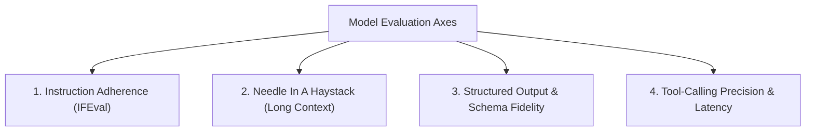

# 📹 LLM Model Evals & Capabilities

<div className="video-card" style={{border: '1px solid #30363d', borderRadius: '8px', padding: '16px', marginBottom: '24px', background: 'rgba(56, 139, 253, 0.05)'}}>
  <div style={{display: 'flex', gap: '16px', flexWrap: 'wrap'}}>
    <div><strong>Instructor:</strong> Nitish Singh (CampusX)</div>
    <div><strong>Duration:</strong> 2272</div>
    <div><strong>Course:</strong> Module 6: LLM Evaluation & Observability</div>
    <div><strong>Watch Link:</strong> <a href="https://www.youtube.com/watch?v=FPS0rIAQwzo" target="_blank" rel="noopener noreferrer">YouTube Lecture ↗</a></div>
  </div>
</div>

## 📌 Executive Summary

Systematically evaluating foundation model capabilities requires categorizing models across dimensions: multi-step reasoning, mathematical problem solving, code generation, instruction following, long-context retrieval, and latency profiles.

This lesson explores how to design custom capability benchmarks tailored to specific business applications.

---

## 🏗️ System Architecture & Execution Flow



---

## 📖 Core Concepts & Technical Deep Dive

### 1. The Core Capability Axes
1. **Instruction Following (IFEval):** Ability to obey formatting constraints (e.g. "reply in exactly 3 bullet points, no markdown, under 50 words").
2. **Context Window Utilization (Needle In A Haystack):** Ability to accurately recall facts placed at various depths (10%, 50%, 90%) across 128k+ token contexts.
3. **Structured Extraction:** Reliability in generating strict, valid JSON conforming to recursive schemas without missing required fields.
4. **Agentic Tool Calling:** Precision in selecting the correct tool from a list of 20+ definitions and populating argument types correctly.

### 2. The Frontier vs Small Language Model (SLM) Trade-off
- **Frontier Models (GPT-4o, Claude 3.5 Sonnet):** Excel at reasoning and ambiguous instructions; high latency and token cost.
- **SLMs (Llama 3.1 8B, Gemma 2 9B, Mistral 7B):** Excel at high-throughput focused tasks (routing, extraction, classification); lower cost and sub-second execution.

---

## 💻 Production Implementation

```python
# Needle In A Haystack (NIAH) Test Framework Concept
def generate_haystack(needle: str, target_word_count: int, needle_depth_ratio: float) -> str:
    filler = "The quick brown fox jumps over the lazy dog. Artificial intelligence is evolving rapidly. "
    filler_words = filler.split()
    
    total_filler = []
    while len(total_filler) < target_word_count:
        total_filler.extend(filler_words)
    total_filler = total_filler[:target_word_count]
    
    insert_index = int(len(total_filler) * needle_depth_ratio)
    total_filler.insert(insert_index, needle)
    
    return " ".join(total_filler)

needle = "SECRET_KEY_CODE_4291"
context = generate_haystack(f"The special administrative passkey is {needle}.", target_word_count=500, needle_depth_ratio=0.5)
print(f"Generated test context of {len(context.split())} words. Needle positioned at 50% depth.")
```

---

## ⚙️ Production Gotchas & Best Practices

:::tip Test Instruction Adherence Systematically
Use IFEval-style constraints to test candidates. Models that fail simple length or formatting constraints will regularly break downstream API integrations.
:::

:::warning Needle-in-a-Haystack Caveats
Standard NIAH tests use distinctive, high-entropy tokens. Real-world documents contain subtle semantic nuances where models degrade significantly more than simple needle tests suggest.
:::

---

## 📊 Architectural Reference & Comparison

| Capability Axis | Standard Academic Benchmark | Custom Production Test |
| :--- | :--- | :--- |
| **Instruction Adherence** | IFEval | Strict JSON Schema validation against 50 edge schemas |
| **Reasoning** | GSM8K, MATH, ARC-Challenge | Multi-step domain business rule resolution |
| **Code Generation** | HumanEval, SWE-bench | Writing migrations and fixing AST lint errors |
| **Long Context** | RULER, Needle-In-A-Haystack | Multi-document cross-reference synthesis (100k tokens) |

---

## 📚 Key Takeaways & Enterprise Checklist

- [ ] **Architecture Verification:** Ensure your design addresses latency, decoupled interfaces, and strict data validation contracts.
- [ ] **Deterministic Testing:** Run unit tests and golden dataset evaluations before shipping changes to staging or production.
- [ ] **Security & Observability:** Enforce input/output guardrails, scrub sensitive credentials/PII, and capture distributed traces.
- [ ] **Scalability & Sizing:** Calibrate model parameters, context limits, and compute instance requirements against projected request concurrency.
