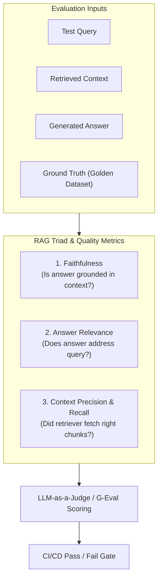

# 📹 Whats is LLM Benchmarking ｜ Benchmark Saturation vs. Contamination

<div className="video-card" style={{border: '1px solid #30363d', borderRadius: '8px', padding: '16px', marginBottom: '24px', background: 'rgba(56, 139, 253, 0.05)'}}>
  <div style={{display: 'flex', gap: '16px', flexWrap: 'wrap'}}>
    <div><strong>Instructor:</strong> Nitish Singh (CampusX)</div>
    <div><strong>Duration:</strong> 51m 20s</div>
    <div><strong>Playlist:</strong> LLM Evaluation Complete Series (CampusX)</div>
    <div><strong>Watch Link:</strong> <a href="https://www.youtube.com/watch?v=qIiU3lyjrhM" target="_blank" rel="noopener noreferrer">YouTube Lecture ↗</a></div>
  </div>
</div>

## 📌 Executive Summary & Learning Objectives

This lecture covers **Whats is LLM Benchmarking ｜ Benchmark Saturation vs. Contamination**, focusing on production implementations, edge cases, and industry standards:
- Core intuition, architecture, and underlying mechanisms.
- Key differences between theoretical research implementations and scalable enterprise patterns.
- Concrete Python walkthroughs, error recovery, and performance optimization.

---

## 🏗️ Architecture & Conceptual Workflow



---

## 📖 Core Concepts & Technical Deep Dive

### 1. Architectural Foundations
In modern production AI engineering, **Whats is LLM Benchmarking ｜ Benchmark Saturation vs. Contamination** is essential for ensuring reliability, low latency, and deterministic outcomes. As AI systems evolve from naive prompt-in / completion-out scripts into distributed systems, engineers must handle:
- **State management & consistency:** Ensuring intermediate states and tool invocations are tracked.
- **Error boundaries & recovery:** Graceful degradation when external LLMs or vector stores encounter rate limits or network partitions.
- **Resource utilization & cost efficiency:** Caching common queries and reducing unnecessary foundation model token expenditure.

### 2. Operational Considerations
- **Latency Optimization:** Pre-computing embeddings, utilizing asynchronous non-blocking event loops, and streaming tokens via Server-Sent Events (SSE).
- **Security & Sandboxing:** Validating inputs before ingestion, sanitizing LLM outputs, and isolating tool execution environments.

---

## 💻 Production Implementation Walkthrough

```python
# Production Implementation Blueprint
def run_production_pipeline():
    print("Executing production pipeline...")

if __name__ == "__main__":
    run_production_pipeline()
```

---

## 💡 Production Best Practices & Tips

:::tip Production Deployment Guideline
When deploying Whats is LLM Benchmarking ｜ Benchmark Saturation vs. Contamination in enterprise environments, always configure automated retries with exponential backoff and telemetry tracing (such as OpenTelemetry or LangSmith).
:::

:::warning Common Failure Modes
Watch out for state contamination across concurrent requests. Ensure each session or user interaction uses an isolated thread ID or execution context.
:::

---

## 🎯 Key Takeaways & Quick Reference

| Dimension | Production Standard | Pitfall to Avoid |
| :--- | :--- | :--- |
| **Execution** | Async / Non-blocking with timeouts | Synchronous blocking calls in event loops |
| **Data Validation** | Strict Pydantic v2 schemas | Untyped dictionary access |
| **Monitoring** | Distributed tracing & latency percentiles | Relying only on standard console logs |

## ⏱️ Lecture Timeline & Key Topics

| Timestamp | Key Topic / Concept Discussed |
| :--- | :--- |
| **00:00:00** | अभी तक का डिस्कशन हमने क्या किया? हमारा... |
| **00:13:18** | पर आपको टूल्स अलऊ करने पड़ते हैं। आई होप... |
| **00:26:12** | है। बट द प्रॉब्लम इज कि जब आप यह करने... |
| **00:38:49** | पर अच्छा नहीं कर रहा है उसको नीचे कर... |
| **00:51:16** | रफली आज इतना ही हमने कवर करना था। या... |


---

---

## 📜 Complete Lecture Transcript (English)

> **Language:** English | **Source:** `08 - Whats is LLM Benchmarking ｜ Benchmark Saturation vs. Contamination ｜ CampusX.hi.srt` | **Total Segments:** 26 | **Word Count:** ~9,089 words

<details>
<summary><b>Click to expand full chronological transcript (26 timestamped intervals)</b></summary>

#### ⏱️ [00:00 ➔ 00:02]

अभी तक का डिस्कशन हमने क्या किया? हमारा पूरा फ्लो क्या रहा क्लास का? कि हमने सबसे पहले यह पढ़ा कि मॉडल इवेल्स क्यों जरूरी हैं? फिर हमने फॉर्मली पढ़ा कि मॉडल इव्स होते क्या है? पता चला कि दो टाइप के मॉडल इवास होते हैं। एक होते हैं स्टैंडर्डाइज्ड बेंचमार्क्स और दूसरे होते हैं कस्टम इवल्स। और आज का सेशन इज़ ऑल अबाउट बेंचमार्क्स। बट मैंने आपको बोला कि बेंचमार्क्स को पढ़ने के पहले आपको यह पता होना चाहिए कि कौन-कौन सी कोर कैपेबिलिटीज एक्सिस्ट करती हैं। तो वो हमने पढ़ा कि देयर आर एट कोर कैपेबिलिटीज। तो यहां तक हमने पढ़ाई कर ली। नाउ वी आर फुल्ली इक्विप फुल्ली प्रिपयर्ड टू एक्चुअली स्टडी बेंचमार्क्स क्या होते हैं। ठीक है? तो अब अगला 10-15 मिनट वी आर गोइंग टू स्पेंड ऑन दिस टॉपिक। एंड ट्रस्ट मी बहुत ओवरव्यू मोड में अच्छे से पढ़ाऊंगा। मोस्टली आपको चीजें समझ में आ जाएंगी। ठीक है? तो एकदम सिंपल शब्दों में अगर आपसे कोई पूछे कि बेंचमार्क्स क्या होते हैं? एलएलएम बेंचमार्क्स क्या होते हैं? बहुत फेमस टर्म है। दिन भर लेफ्ट राइट सेंटर कोई भी मॉडल आता है, आपके ऊपर बेंचमार्क्स ही थ्रो किए जाते हैं कि स्वी बेंच पे इस मॉडल ने इतना स्कोर किया। अ आपका आर केजीआई पे इतना स्कोर किया। अलग-अलग मॉडल्स अलग-अलग बेंचमार्क्स पे कितना स्कोर स्कोर कर रहे हैं? उसके बेसिस पे ही आपको YouTube वीडियोस देखने को मिलते हैं। तो होता क्या है? बेंचमार्क होता क्या है? तो एकदम सिंपल वर्ड्स में अ बेंचमार्क इज बेसिकली अ स्टैंडर्डाइज्ड टेस्ट यूज्ड टू मेजर अ पर्टिकुलर मॉडल कैपेबिलिटी। सिंपल शब्दों में अ बेंचमार्क इज नथिंग बट अ स्टैंडर्डाइज्ड टेस्ट जो किसी मॉडल की कोई स्पेसिफिक कैपेबिलिटी को टेस्ट करता है। यही है सिंपल डेफिनेशन। ठीक है? अब एक बेंचमार्क में चार चीजें होती हैं। कोई भी बेंचमार्क आप उठा लो उसमें चार चीजें आपको मिलेंगी। सबसे पहली चीज होती है एक डेटा सेट स्लैश टास्क। दूसरा होता है रन कॉन्फिग या

#### ⏱️ [00:02 ➔ 00:04]

रन कॉन्फ़िगरेशन। आप बोल सकते हो। तीसरा होता है स्कोरिंग और तीसरा होता है और चौथा होता है एग्रीगेशन। यह चार चीजें होती है। यहां पर देखो लिखा हुआ है पहला डेटा सेट, रन कॉन्फ़िगरेशन, स्कोरिंग मेथड और एग्रीगेशन मेथड। ये चार चीजें होती हैं किसी भी बेंचमार्क में। ठीक है? तो हम लोग क्या करते हैं? एक एग्जांपल बेंचमार्क लेके चलते हैं और उसके बेसिस पे हम समझेंगे कि ये चारों चीजें क्या हैं। तो हम एक बेंचमार्क की बात करेंगे। इस बेंचमार्क का नाम है अ आपका जीएसएम 8K। किसी ने सुना है इसका नाम? अगर सुना है तो बताओ किस कैपेबिलिटी को टेस्ट करने के लिए यूज़ होता है जीएसएम 8 के ये एक पुराना बेंचमार्क है मतलब ये शायद 2020 2021 में आया था अब उतना यूज़ भी नहीं होता ये इसका फुल फॉर्म है ग्रेड स्कूल मैथमेटिक्स जीएसएम ग्रेड स्कूल मैथमेटिक्स 8K का मतलब है कि इस पर्टिकुलर बेंचमार्क का जो डेटा सेट है उसमें अराउंड 8K रोज़ हैं। ठीक है? तो हम इस बेंचमार्क के लेंस से समझेंगे कि एक कोई भी बेंचमार्क के अंदर क्या-क्या चीजें होती हैं। ठीक है? तो सबसे पहले डिस्कस करते हैं कि जीएसएम 8K का डेटा सेट क्या है और टास्क क्या है? तो यहां पे देखो लिखा हुआ है। द डेटा सेट इज़ द क्वेश्चन प्लस द आंसर की। जभी भी कोई बेंचमार्क के अंदर कोई डेटा सेट होता है तो उसमें दो चीजें होती हैं। क्वेश्चंस भी होते हैं, आंसर्स भी होते हैं। इट्स लाइक अ गोल्डन डेटा सेट। ठीक है? जैसे जीएसएम 8K में क्या है कि इसमें मैथ्स के क्वेश्चंस हैं और उसका स्यूशन भी दिया हुआ है। जैसे यहां पे एक सैंपल क्वेश्चन है। नेटालिया सोल्ड क्लिप्स टू 48 फ्रेंड्स इन अप्रैल एंड देन शी सोल्ड हाफ एस मेनी क्लिप्स इन मई। हाउ मेनी क्लिप्स डड शी सेल ऑल टुगेदर? अप्रैल में 48 और मई मे 24

#### ⏱️ [00:04 ➔ 00:06]

बिकॉज़ हाफ आपको सिंपली इन दोनों को ऐड करना है। आंसर इज़ 72 वही आंसर है यहां पे। तो ये बेसिकली बहुत सिंपल-सिंपल मैथमेटिकल क्वेश्चंस जो होते हैं ग्रेड स्कूल मैथ्स सेवंथ सिक्स सेवंथ एथ का जो मैथ्स है ना उसके क्वेश्चंस का ये एक डेटा सेट है। कितने क्वेश्चंस हैं यहां पे? 8000 डेटा सेट्स हैं। इनफैक्ट ये ना आप जाकर के Google भी कर सकते हो। तो आपको Google पे भी मिल जाएगा ये। आपको सिंपली सर्च करना है जीएसएम 8K और आपको दो-तीन जगह पे मिल जाएगा। आपको हगिंग फेस पे भी मिल जाएगा। आपको कैगल पे भी मिल जाएगा। ये देखो ये रहा इस पर्टिकुलर डेटा सेट का रेपोजिटरी। अ यहां पे आप फाइल्स एंड वर्जनंस में जाओ। मेन पे जाओ। ये रहा आपका डेटा सेट। यह देखो एग्जैक्टली। यहां पर क्वेश्चन है। यहां पर आंसर है। और यह कितने क्वेश्चन आंसर्स हैं? अराउंड 8500 तो दिस इज द डेटा सेट जो यूज किया जाता है जीएसएम 8K में सिमिलरली एमएमएलयू का अपना खुद का डेटा सेट है किसी और बेंचमार्क का अपना खुद का डेटा सेट है हर डेटा सेट हर बेंचमार्क का एक डेटा सेट होता है जिसमें क्वेश्चंस और आंसर्स दोनों होते हैं और आपको एक टास्क बताया जाता है। यहां पे टास्क क्या है कि जब आपके मॉडल को एक सिंपल ग्रेट स्कूल मैथमेटिक्स प्रॉब्लम दी जाएगी तो उसको आंसर जनरेट करना है। दिस इज द टास्क। ठीक है? तो यहां तक आई गेस समझ में आ गया। दिस इज द फर्स्ट कंपोनेंट। द सेकंड कंपोनेंट इज़ कि हर बेंचमार्क आपको कुछ गाइडलाइंस देता है कि जब आप उस बेंचमार्क को यूज करो इवैल्यूएशन के लिए तो क्या टिपिकल सेटिंग्स आपको रखनी है व्हाइल डूइंग द इवैल्यूएशन। ऐसा नहीं है कि एक मॉडल को आपने किसी पर्टिकुलर सेटिंग में चला दिया और दूसरे मॉडल को किसी दूसरे सेटिंग में चला दिया। आप जब इवैल्यूएशंस कर रहे हो दो मॉडल्स का तो दोनों मॉडल्स को चलाने के टाइम पे सारी सेटिंग्स जो है वो बिल्कुल सेम होनी चाहिए। तो वो सेटिंग्स क्या है वो आपको बताया जाता है

#### ⏱️ [00:06 ➔ 00:08]

रन कॉन्फ़िगरेशन में। ठीक है? तो इसमें तीन पार्ट्स होते हैं। पहला होता है प्र्प कैसा होगा? दूसरा होता है डिकोडिंग एंड सैंपलिंग कॉन्फ़िगरेशन कैसा होगा? और तीसरा होता है आपका स्कोरिंग स्ट्रेटजी और एनवायरमेंट कैसा होगा। मैं तीनों के बारे में आपको बताता हूं। तो प्र्प्ट कंस्ट्रक्शन में आपको ये बताया जाता है कि आपका जो प्र्प्ट लिख के भेजोगे आप जब एक क्वेश्चन उठाओगे यहां से। यहां से आप एक क्वेश्चन उठा के मॉडल को भेजोगे। मॉडल उसके बेसिस पे आंसर निकालेगा। बट इस क्वेश्चन को भेजने के साथ-साथ आप एक सिस्टम प्र्ट भी भेजते हो। तो वो सिस्टम प्र्ट आप कैसे लिखते हो वो भी मैटर कर जाता है। अगर वो प्र्ट अलग-अलग होगा तो एक मॉडल अलग रिजल्ट देगा दूसरा मॉडल अलग रिजल्ट देगा। मतलब आई गेस आपको समझ में आ रहा है। तो प्र्प्ट कंस्ट्रक्शन में सबसे पहले आप ये डिफाइन करते हो कि आपका सिस्टम प्र्प जीरो शॉर्ट होगा या फ्यू शॉर्ट होगा। इसका सिंपल मतलब यह है कि जब आप यह क्वेश्चन भेज रहे हो अपने एलएलएम के पास कि बताओ इसका आंसर निकाल के तो आप साथ ही साथ उसको कुछ और सॉल्वड एग्जांपल्स दिखा के भेजना चाहते हो या फिर आप विदाउट एनी एग्जांपल उसको सॉल्व करने को देना चाहते हो तो इसी को बोला जाता है जीरो शॉट। जीरो शॉट का मतलब है आपने सिंपली एक क्वेश्चन उठा के दे दिया और बोला कि इसको सॉल्व करो। फ्यू शॉट का मतलब क्या हुआ? कि आपने इस तरह के कुछ क्वेश्चंस प्र्ट में सॉल्व करके दिखाए और फिर लास्ट में एक क्वेश्चन अटैच करके भेजा कि देखो इन क्वेश्चंस को मैंने ऐसे सॉल्व किया समझ में आया। अब इस क्वेश्चन को सॉल्व करके बताओ। तो आपका प्र्प कंस्ट्रक्शन में बेंचमार्क में आप यह पहले से बताते हो कि आपको जीरो शॉट रखना है या फ्यू शॉट रखना है। अब जैसे अगर आप बात करो जीएसएम 8K का जीएसएम 8K जो है वो फ्यू शॉट स्ट्रेटजी यूज़ करता है। देखो यहां पे लिखा हुआ है कि जीएसएम 8K इज़ क्लासिकली रिपोर्टेड एट शॉट। मतलब यहां पे जभी भी आप एक क्वेश्चन सॉल्व करने को भेजते हो एलएलएम के पास तो आप

#### ⏱️ [00:08 ➔ 00:10]

उसको पहले एट सॉल्वड एग्जांपल्स दिखाते हो। सिस्टम प्र्प के अंदर और फिर आप अपना क्वेश्चन उसको भेजते हो। ठीक है? ऑब्वियसली अगर आप जीरो शॉट रखोगे तो परफॉर्मेंस खराब होगा मॉडल का और अगर आप फ्यू शॉट्स रखोगे तो आपका परफॉर्मेंस इंप्रूव करेगा। जीएसएम 8K में फ्यू शॉट रखा जाता है। ठीक है? सेकंड आप क्या चेन ऑफ थॉट अलऊ कर रहे हो या फिर आप डायरेक्टली काम करने को बोल रहे हो? चेन ऑफ़ थॉट अगर आप अलऊ कर रहे हो तो आप बेसिकली कुछ इस तरह का सिस्टम प्र्ट भेज रहे हो कि ये क्वेश्चन देखो और इसको स्टेप बाय स्टेप सॉल्व करने की कोशिश करो। जैसे यहां पे देखो आंसर में भी दिखाया गया है। निटालिया सोल्ड 48 / 2 मतलब 24 क्लिप्स इन मेटालिया सोल्ड 48 + 24 क्लिप्स ऑल टुगेदर। ये स्टेप बाय स्टेप सॉल्व हो रहा है और आंसर पे पहुंच रहा है। अगर आप उसको चेन ऑफ थॉट अलाउ नहीं करोगे और बोलोगे कि डायरेक्टली इसका आंसर निकालो तो गलती होने के चांसेस ज्यादा है। तो जीएसएम 8K में भी चेन ऑफ थॉट अलाउ किया जाता है। अगेन यहां पे बस हम बात कर रहे हैं कि क्या-क्या ऑप्शंस अवेलेबल है प्र्प को कंस्ट्रक्ट करने के टाइम। फ्यू शॉट, जीरो शॉट, चेन ऑफ थॉट या फिर नॉर्मल। उसके बाद आपका डिकोडिंग और सैंपलिंग कॉन्फ़िगरेशन में भी आप चीजें देखते हो। आप टेंपरेचर वैल्यू जीरो के आसपास रखते हो। बिकॉज़ जीरो से अगर ज्यादा बढ़ाओगे तो क्रिएटिव आंसर्स आने लग जाते हैं और हर बार वो वेरीरी करने लग जाते हैं। तो टेंपरेचर मोस्टली अराउंड जीरो रखा जाता है इस तरह के बेंचमार्क्स के लिए। फिर आप एक मैक्स टोकन भी सेट करते हो। तो अगर मैक्स टोकन बहुत कम सेट कर दिया तो ऐसा हो सकता है कि सिंस वो चेन ऑफ थॉट ट्रिगरर्ड है तो बीच में सोचते-सचते में ही आंसर खत्म हो गया और मॉडल आंसर जनरेट कर ही नहीं पाया वर्सेस बहुत ज्यादा अगर आपने टोकंस अलऊ कर दिए तो एक बहुत पावरफुल मॉडल क्या कर सकता है बहुत स्ट्रांगली रीजन कर सकता है तो मैक्स टोकन भी आप पहले से स्पेसिफाई करते हो कि मॉडल ए को भी मैं इतना ही मैक्स टोकन दूंगा मॉडल बी को भी मैं इतना ही मैक्स टोकन दूंगा वो बहुत कम भी नहीं होता बहुत ज्यादा भी नहीं होता ठीक है तो दिस

#### ⏱️ [00:10 ➔ 00:12]

इज द सेकंड सेटिंग उसके बाद ये [गला साफ़ करने की आवाज़] बहुत इंटरेस्टिंग चीज है कि आप कुछ एक स्कोरिंग स्ट्रेटजी भी फाइनललाइज करते हो। स्कोरिंग स्ट्रेटजी क्या होता है? एक स्कोरिंग स्ट्रेटजी है पास @ वन। इसका मतलब ये है कि आपने अपने मॉडल को एक क्वेश्चन एक बार दिखाया। उसने आंसर दिया। अब वो आंसर या तो सही होगा या तो गलत होगा। राइट? तो इसको बोला जाता है पास @ वन। फिर आता है आपका पास@ k। इसमें क्या होता है कि अगर आपने मान लो पास@5 कर दिया तो आप एक ही क्वेश्चन सेम मॉडल से पांच बार पूछोगे और अगर उसने पांचों बार में से एटलीस्ट एक बार भी सही आंसर कर दिया तो आप मान लोगे कि मॉडल ने सही आंसर दिया। तो बेसिकली पास एट द k इज़ अ मोर लीनियंट स्ट्रेटजी टू इवैलुएट योर एलएलएम। पास @ वन इज़ अ मोर स्ट्रिक्ट स्ट्रेटजी। तो अगेन यू हैव टू डिसाइड कि आपको पास @ वन रखना है, पास @ k रखना है। यह भी सेम रहेगा इवैल्यूएशन करने के टाइम। तो जीएसएम 8K में एक्चुअली एग्जैक्टली मुझे याद नहीं है। पेपर देखना पड़ेगा। मोस्ट लाइकली पास @ वन यूज़ किया गया है। बट कुछ बेंचमार्क्स में पास @ k भी यूज़ किया जा सकता है। डिपेंडिंग ऑन कि वो बेंचमार्क कितना डिफिकल्ट उसके क्वेश्चंस हैं। ठीक है? फिर एक आपका एक और है होता है मेजॉरिटी @ 8 मेजॉरिटी @ k होता है बेसिकली इसमें क्या होता है कि आप k टाइम्स सेम क्वेश्चन पूछते हो अपने मॉडल से वो आपको k अलग-अलग आंसर्स देता है उनमें से जो आंसर सबसे ज्यादा बार आया होता है आप उसको ही आंसर मान लेते हो बेसिकली मोड मोड होता है ना जो मीन मीडियन मोड तो जो मोड होता है उसी को आप आंसर मान लेते हो तो जभी भी आप रीड कर रहे हो किसी बेंचमार्क में। किसी ने बोला कि हमारा किसी पर्टिकुलर बेंचमार्क में 82% स्कोर कर रहा है हमारा मॉडल। तो

#### ⏱️ [00:12 ➔ 00:14]

यहां पे घुस के थोड़ा आपको ये पूछना चाहिए कि पास @ वन स्ट्रेटजी यूज़ किया, पास @ k स्ट्रेटजी यूज़ किया या मेजॉरिटी @ k स्ट्रेटजी यूज़ किया। अलग-अलग स्कोरिंग स्ट्रेटजीस यूज की जाती है। तो वो आपको पता होनी चाहिए। आई होप आपको समझ में आ रहा है। फिर क्या आप बेंचमार्क को इवैलुएट करते टाइम टूल्स अलऊ करना चाहते हो या नहीं? ये भी पहले से बताया जाता है। क्योंकि सोच के देखो अगर आपने टूल अलाउ कर दिया फॉर एग्जांपल एक टूल है वेब सर्च। अगर आपने वेब सर्च अलऊ कर दिया तो वह तो झट से जाकर किसी क्वेश्चन का आंसर इंटरनेट से खोज के ला सकता है। या फिर अगर आपने इसको एक कोडिंग इंटरप्रेटर दे दिया तो ये तो सारे मैथमेटिकल क्वेश्चंस कोड के थ्रू करवा के आंसर निकाल देगा। तो टूल का अलाउ किया जाना चाहिए या नहीं किया जाना चाहिए ये भी डिसाइड किया जाता है पहले से। जैसे ऑब्वियसली जीएसएम 8 के वाले बेंचमार्क में टूल्स आर नॉट अलाउड। बट कुछ बेंचमार्क्स को इवैलुएट करते टाइम टूल्स अलाउ भी किए जाते हैं। जैसे कि आपका स्वी स्वी बेंच है। सॉफ्टवेयर इंजीनियरिंग वाला जो है इसमें आप Ghub इशूज़ सॉल्व करना टेस्ट करते हो। तो GitHub पे जाके इसको इशूज़ फैच करने पड़ेंगे। उसके लिए टूल्स की जरूरत पड़ेगी। तो वहां पे ये एक ऐसा बेंचमार्क है जहां पर आपको टूल्स अलऊ करने पड़ते हैं। आई होप यू आर एबल टू अंडरस्टैंड कि अभी हम क्या बात कर रहे हैं कि व्हाट आर द सेटिंग्स जो किसी एक बेंचमार्क में आपको अप्लाई करनी होती है व्हाइल परफॉर्मिंग द इवैल्यूएशन। हम ये पॉइंट डिस्कस कर रहे हैं। ठीक है? थर्ड अ सो या दो चीज़ चार चीजें होती हैं। उसमें से हमने क्या-क्या कवर कर लिया? डेटा सेट और टास्क हमने कवर कर लिया। रन कॉन्फ़िगरेशन हमने सेलेक्ट डिस्कस कर लिया। थर्ड आता है स्कोरिंग। स्कोरिंग मेथड क्या है? अब स्कोरिंग मेथड में दो इंपॉर्टेंट चीजें होती हैं। पहला एलएलएम का जो आंसर है एलएलएम जो आंसर पलट के आपको दिया मतलब आपने क्या किया? ये पहला क्वेश्चन अलोंग विद अ सिस्टम प्र्ट

#### ⏱️ [00:14 ➔ 00:16]

इन अ डिफाइंड सेटिंग। आपने एलएलएम के पास भेजा। एलएलएम ने उस क्वेश्चन का एक आंसर निकाल के आपको दिया। अब वो आंसर किसी भी फॉर्म में हो सकता है। वो आंसर हो सकता है लिखा हुआ है द आंसर इज 72 ये भी आ सकता है। सिर्फ 72 भी आ सकता है। 72 भी लिखा हुआ आ सकता है। राइट? तो बिकॉज़ वो एलएलएम है। वो किसी भी तरह का आउटपुट आपको दे सकता है। तो आपको यहां पे सबसे पहले एक्सट्रैक्शन के ऊपर बहुत काम करना पड़ता है। तो यहां पे आप या तो स्ट्रक्चरर्ड एलएलएम्स यूज़ करोगे। स्ट्रक्चरर्ड आउटपुट इनफोर्स करोगे या फिर आप रेग्स का यूज करोगे टू मेक श्योर कि आप सही फॉर्मेट में आंसर को फर्स्ट ऑफ ऑल एक्सट्रैक्ट कर पा रहे हो। जैसे यहां पे सही आंसर इज़ 72 तो आपको यही नंबर चाहिए बाकी कुछ भी नहीं चाहिए। यहां पे देखो लिखा हुआ है अ इट एमिट्स जो भी है मतलब यू गेट द पॉइंट राइट। तो एक्सट्रैक्शन इज़ द फर्स्ट स्टेप स्कोरिंग के दौरान। और एक बार जब आपने एक्सट्रैक्ट कर लिया तो फिर आपको बस कंपैरिजन करना होता है। तो यहां पे तो जैसे एग्जैक्ट कंपैरिजन होगा बिकॉज़ ये मैथ्स का टेस्ट है। तो यहां पे 72 इक्वल टू इक्वल टू 72 आप टेस्ट करोगे। कुछ भी और नंबर है मतलब गलत है वन और ज़ीरो। और सेकंड अगर आप कोई ऐसा बेंचमार्क अ है आपका जो ओपन एंडेड आंसर्स निकाल के देता है। दिस इज़ अ क्लोज्ड एंडेड आंसर 72। बट अगर कोई ओपन एंडेड है तो वहां पे आपको इवैल्यूएट करने के लिए एलएलएम एज अ जज यूज करना पड़ता है। इसका मैं आपको कोई एक एग्जांपल दूंगा फ्यूचर में। कोई ऐसा बेंचमार्क हम डिस्कस करेंगे जहां पे आंसर इज नॉट एज स्ट्रेट फॉरवर्ड एज 72। तो वहां पे एक प्रॉपर पैराग्राफ आया है एज आंसर। उसको हमें इवैल्यूएट करना है। तो ऑब्वियसली यू विल यूज़ एलएलएम एज अ जज देयर। तो या कंपैरिजन जो होता है वो या तो स्ट्रेट फॉरवर्ड प्रोग्रामेटिकली हो जाता है या फिर एलएलएम एज अ जज या फिर ह्यूमन के थ्रू होता है। तो ये आता है आपका स्कोरिंग का अ पॉइंट। एंड द लास्ट इज़ एग्रीगेशन। एग्रीगेशन में बहुत सिंपल है।

#### ⏱️ [00:16 ➔ 00:18]

आपके पास टोटल पूरे डेटा सेट में 8000 क्वेश्चंस हैं। हर क्वेश्चन के अगेंस्ट आपको वन या ज़ीरो मिल रहा है कि एलएलएम ने सही आंसर बताया नहीं बताया। बताया नहीं बताया। ये आपको मिल रहा है। एग्रीगेशन स्टेज में आप सिंपली क्या करते हो? को एग्रीगेट कर लेते हो कि मेरे पास 1000 क्वेश्चंस थे। उसमें से 920 एलएलएम ने सही बताए। व्हिच बेसिकली मींस कि हमारे बेंचमार्क पे 92% स्कोर किया इस एलएलएम ने। दैट इज हाउ यू डू एग्रीगेशन। ठीक है? अब एग्रीगेशन मोस्ट ऑफ द टाइम स्ट्रेट फॉरवर्ड है। जैसे यहां पर अभी हमने जैसे किया कि 8500 बार एलएलएम को क्वेश्चन दिया, आंसर निकाला, स्कोर किया और देखा कि कितनी बार उसने सही बोला, कितनी बार गलत बोला। उसके बेसिस पे एक परसेंटेज असाइन कर लिया। कई बार ऐसा होता है कि कुछ बेंचमार्क्स ऐसे होते हैं जहां पर एग्रीगेशन इज नॉट एज स्ट्रेट फॉरवर्ड। फॉर एग्जांपल एमएमएलयू जो है जो बेसिकली आपका जनरल नॉलेज चेक करता है अक्रॉस 57 सब्जेक्ट्स। तो यहां पे हो सकता है कि आपको हर सब्जेक्ट का अलग रिजल्ट पब्लिश करना पड़े। जैसे बायोलॉजी में 87% आया। फिजिक्स में 91% आया। इकोनॉमिक्स में 72% आया। अब क्या करना है? इन सबको फिर से मिला के एक एग्रीगेट स्कोर देना है कि ओवरऑल एमएमएलयू में कितना आया। बट यहां पे आप ऐसा नहीं कर सकते कि सीधे सारे परसेंटेजेस को जोड़ा 57 से डिवाइड मार दिया। क्योंकि ऐसा हो सकता है कि डेटा में बायोलॉजी के क्वेश्चंस कम हो, इकोनॉमिक्स के क्वेश्चंस ज्यादा हो। तो यहां पे फिर हो सकता है आपको वेटेड मीन करना पड़े। तो एग्रीगेशन की भी अलग-अलग स्ट्रेटजीस होती हैं। ठीक है? तो मैंने आपको दोनों का एक-एक एग्जांपल दे दिया। तो नटशेल में अगर समराइज करें इस पूरे डिस्कशन को तो बेंचमार्क होता क्या है? बेंचमार्क इज बेसिकली अ स्टैंडर्डाइज्ड टेस्ट। अब उस टेस्ट के अंदर मल्टीपल चीजें होती हैं। सबसे पहले आपको टास्क बताया जाता है कि क्या मेजर करना है। फिर आपको एक डेटा सेट दिया जाता है विद क्वेश्चंस एंड आंसर्स

#### ⏱️ [00:18 ➔ 00:20]

बोथ। उसके बाद आपको बताया जाता है कि आपका पूरा रन कॉन्फ़िगरेशन कैसा होगा। किन कंडीशंस में आप यह टेस्ट एग्जीक्यूट करोगे। फोर्थ आपका पूरा का पूरा स्कोरिंग मैकेनिज्म एंड फिफ्थ आपका एग्रीगेशन मैकेनिज्म। और ये सारी चीजें लिखी कहां पे होती हैं? ये सब कुछ कहां पे बताया जाता है? बहुत सिंपल है रिसर्च पेपर में। सो मोस्ट ऑफ द बेंचमार्क्स जो आप आज के डेट में पढ़ रहे हो दे वर ओरिजिनली पब्लिश्ड एज रिसर्च पेपर्स। जैसे अगर आप सर्च करो जीएसएम एट के पेपर तो यह रहा वह पेपर जिसमें पहली बार रिसर्चर्स दुनिया के सामने ये बेंचमार्क लेके आए थे। अब इसी बेंचमार्क में उन्होंने सब कुछ डिस्कस किया कि उन्होंने कौन सा डेटा सेट यूज़ किया, क्या रन कॉन्फ़िगरेशन यूज़ किया, क्या स्कोरिंग मैकेनिज्म यूज़ किया, क्या एग्रीगेशन मैकेनिज्म यूज़ किया? सब कुछ इस पेपर में मेंशंड है और फिर वही डेटा सेट आपको इंटरनेट पे देखने को मिल जाता है। सिमिलरली आपको एमएमएलयू का पेपर भी मिल जाएगा। ये देखो ये सारे आपके वही पेपर्स हैं और इसी में सारा इनेशन रहता है जो अभी हमने डिस्कस किया। बट स्ट्रक्चर वही है। टास्क रहेगा, डेटा सेट रहेगा, रन रन कॉन्फ़िगरेशन रहेगा, स्कोरिंग मैकेनिज्म रहेगा, एग्रीगेशन मैकेनिज्म रहेगा। आई एम प्रीटी श्योर एसडब्ल्यूई बेंच का भी होगा। यह देखो। सो ईच ऑफ दी बेंचमार्क्स वर ओरिजिनली अ रिसर्च पेपर जो रिस्चरर्स लेके आए। रिस्चर्स का यही काम है। दे आर एक्चुअली स्टडिंग कि किसी पर्टिकुलर एलएलएम की किसी पर्टिकुलर कैपेबिलिटी को हम कैसे टेस्ट कर सकते हैं। तो अपने-अपने फील्ड के रिस्चरर्स अपने-अपने फील्ड के बेंचमार्क्स लेके आते हैं और फिर वही बेंचमार्क्स पॉपुलर हो जाते हैं। उनके डेटा सेट्स पॉपुलर हो जाते हैं और उन्हीं पे फिर मेजर किया जाता है हर नए एलएलएम को जो मार्केट में आता है। तो आई होप आपको मैं समझा पाया कि बेंचमार्क्स का पूरा फंडा क्या है। देखो मैंने अभी जानबूझ के

#### ⏱️ [00:20 ➔ 00:22]

ना आपके ऊपर बहुत सारे बेंचमार्क्स थ्रो नहीं किए हैं। मतलब आइडियली मैं आपके ऊपर बहुत सारे बेंचमार्क्स के नाम ऑलरेडी थ्रो कर सकता था। आई एम नॉट डूइंग दैट। आई विल डू दिस आफ्टर सम टाइम। बट पहले मैं आपको एक ओवरऑल आईडिया देना चाहता हूं। बेंचमार्क्स होते क्या हैं? आगे बढ़े। अब ये डिस्कस करते हैं कि हमारे पास एक बेंचमार्क है। मतलब एक रिसर्चर ने एक बेंचमार्क पब्लिश कर दिया। एक बेंचमार्क का रिसर्च पेपर आ गया। अब ऐसे इमेजिन करो दैट वी आर अ फ्रंटियर लैब। हम एक फ्रंटियर लैब हैं। वी आर ओपन एआई और एंथ्रोपिक या जो भी है और हम अपने एलएलएम्स ट्रेन करते हैं। अब हमारा एक नया एलएलएम हमने ट्रेन किया और हम इस नए बेंचमार्क के ऊपर जो अभी पब्लिश हुआ है बहुत फेमस हो रहा है। उसके ऊपर अपने एलएलएम को टेस्ट करना चाहते हैं। तो अब मैं आपको एग्जैक्ट प्रोसेस बताने वाला हूं कि एक बेंचमार्क को यूज करके मॉडल इवैल्यूएशन किया कैसे जाता है स्टेप बाय स्टेप। हालांकि ये हम ऑलरेडी डिस्कस कर चुके हैं। बट फिर से एक बार थोड़ा और स्टेप बाय स्टेप तरीके से डिस्कस करते हैं। तो हम क्या कर रहे हैं? वी आर अ मॉडल प्रोवाइडर। वी आर अ फ्रंटियर लैब। हमारा कोई नया एलएलएम आया है। मान लो कैमपस x v1 बोल के। और मार्केट में एक नया बेंचमार्क आया है जीएसएम 8K बोल के जो मैथमेटिकल कैपेबिलिटीज टेस्ट करता है किसी भी एलएलएम की। तो हमें क्या करना है? हमें अपने इस एलएलएम को टेस्ट करना है इस बेंचमार्क की हेल्प से। ठीक है? स्टेप बाय स्टेप कैसे करेंगे वो देखते हैं। ओके? तो सिंपली पुट मॉडल इवैल्यूएशन जो होता है किसी बेंचमार्क के ऊपर वो बेसिकली एक लूप होता है। इट्स बेसिकली अ लूप। आप एक लूप चलाते हो जहां पे आपके बेंचमार्क के डेटा सेट का हर क्वेश्चन एक रो बन जाता है। सो व्हाट वी डू इज़ सिंपली पुट हम

#### ⏱️ [00:22 ➔ 00:24]

एक क्वेश्चन को उठाते हैं और इसको अपने एलएलएम के पास भेजते हैं। ठीक है? और उस प्रोसेस में हम प्र्प्ट एग्जजेक्टली वैसे डिफाइन करते हैं जैसे बेंचमार्क में हमें बोला गया है। हम सेटिंग्स बिल्कुल वही रखते हैं जैसा बेंचमार्क में हमें बोला गया है। और वो हम भेज देते हैं एलएलएम के पास। एलएलएम पलट के हमें आंसर देता है। हमारे पास एक्चुअल आंसर है। हम एक्चुअल आंसर से कंपेयर करते हैं। स्कोरिंग मैकेनिज्म के हिसाब से स्कोर करते हैं। और ऐसा हम कितनी बार करते हैं? जितने रोज़ इस डेटा सेट में है उतनी बार। और उतनी बार करने के बाद हम सारे स्कोर्स को एग्रीगेट करते हैं और एग्रीगेशन का भी कोई स्ट्रेटजी होता है जो अगेन हमें बेंचमार्क ही बताता है। सो बेसिकली हम रिसर्च पेपर को फॉलो कर रहे हैं। यहां पे देखो स्टेप बाय स्टेप लिखा हुआ है। सबसे पहले लोड द आइटम इन दिस पर्टिकुलर सिनेरियो लोड द फर्स्ट क्वेश्चन। आइटम मतलब फर्स्ट क्वेश्चन। ठीक है? तो यहां पे हमने ये लूप चला लिया। लूप पहली बार चलेगा तो पहला क्वेश्चन लोड हो गया। उसके बाद बिल्ड द प्र्प इंजेक्ट फ्यू शॉट एग्जांपल्स अगर फ्यू शॉट करना है अप्लाई द चैट टेंप्लेट जो भी आपको अलग से लिखना है ऐड इंस्ट्रक्शंस नाउ यू हैव द एग्जैक्ट स्ट्रिंग जो मॉडल को आप भेजना चाहते हो तो देखो इस स्टेप में हमने एग्जैक्टली यही किया बिल्ड प्र्ट यहां पे हमने अपना आइटम भेज दिया एज इन अपना क्वेश्चन फ्यू शॉट एट का मतलब है हमने यहां पे आठ एग्जांपल्स भी भेज दिए और अपना पूरा चैट टेंप्लेट भेज दिया तो हमारा प्र्प्ट इज रेडी उसके बाद कॉल द मॉडल विद द पिंड डिकोडिंग कॉन्फिग यहां पे आप टेंपरेचर सेट करते हो मैक्स टोकन सेट करते हो ये सब कुछ आप इस स्टेप में करते हो तो आपने क्या किया मॉडल डॉट जनरेट को कॉल किया लैंड चेन में कर रहे हो तो आप इनवोक को कॉल करोगे अपना प्र्ट जो आपने पिछले स्टेप्स में बनाया था वो आपने भेजा टेंपरेचर की वैल्यू सेट कर दी मैक्स टोकन सेट कर दिया और कोई स्टॉपिंग क्राइटेरिया वगैरह लगा दिया कि कुछ प्रॉब्लम ना हो ठीक है उसके बाद यू कैप्चर द रॉ आउटपुट बेसिकली ली जो भी मॉडल

#### ⏱️ [00:24 ➔ 00:26]

ने आपको भेजा वो आप पुल करके लाते हो और उससे आप एक्सट्रैक्ट करते हो आंसर को। अब उसने बोला द आंसर इज़ 72 तो आप उसमें से एक्सट्रैक्ट करोगे सिर्फ 72 और उसको कहीं पे आप अ रख लोगे। उसके बाद आप क्या करोगे? ये वाला स्टेप है बेसिकली एक्सट्रैक्ट आंसर। वो प्रेडिक्शन में आ गया। और उसके बाद नेक्स्ट स्टेप में आप क्या करते हो? आप स्कोरिंग करते हो कि आंसर ट्रू है या फॉल्स है। आंसर सही है या गलत है। वह आपने स्कोर में रख लिया और फिर उस स्कोर को कहीं पे आप स्टोर कर लेते हो। सो आप बेसिकली एक लिस्ट में अपेंड करते जा रहे हो। ऐसा आपने 8 800 बार किया और एक बार जब लूप खत्म हुआ तो अब आपके पास ये रिजल्ट्स बोल के बड़ा सा लिस्ट है जिसमें हर क्वेश्चन के अगेंस्ट 1000 1 0 है। अब आपके ऊपर लूप खत्म होने के बाद आपने क्या किया? आपने उसका मीन निकाल लिया। जिससे आपको पता चल गया कि इस पूरे डेटा सेट के ऊपर हमारा स्कोर क्या है। सिंपल आई गेस आपको समझ में आ रहा है। दिस इज़ हाउ यू डू इवैल्यूएशन यूजिंग अ बेंचमार्क। एटलीस्ट सिंपल वालों में तो आपको यही करना पड़ता है। थोड़ा और कॉम्प्लेक्स जो बेंचमार्क्स हैं उनका मैं आपको आगे एग्जांपल दूंगा। बट बेसिक वालों में तो यही करना पड़ता है। सिंपल शब्दों में क्वेश्चन को उठाया। उसके अराउंड एक प्र्प्ट प्रिपेयर किया। सारी सेटिंग्स आपने सही से लगा ली। मॉडल को कॉल कर दिया। मॉडल ने आपको आंसर भेजा। उसमें से आंसर को एक्सट्रैक्ट किया। स्कोरिंग करी, एक जगह पर स्टोर करते चले गए। और यह काम आपने लूप में किया। जब तक सारे क्वेश्चंस एग्जॉस्ट नहीं हो गए। सारे क्वेश्चंस हो गए। लूप खत्म हो गया। आपके पास एक बड़ी सी लिस्ट है जिसमें हर क्वेश्चन का स्कोर आपके पास है। आपने उसके ऊपर एग्रीगेशन लगा दिया। आपको आपका फाइनल बेंचमार्क स्कोर मिल गया। दिस इज़ हाउ इवैल्यूएशन इज़ डन यूजिंग अ बेंचमार्क। अब मजेदार चीज क्या है? कि ये देख करके एटलीस्ट ये पूरा प्रोसेस देख के ऐसा लगता है कि ये तो बहुत सिंपल चीज है। राइट? लूप ही तो चलाना है। मैं आराम से कर लूंगा।

#### ⏱️ [00:26 ➔ 00:28]

यहां देखो ऐसा लगता है दैट द इवैल्यूएशन प्रोसेस इज़ सिंपल। आपको हर बार एक क्वेश्चन को लेना है। मॉडल के पास भेजना है। आंसर को चेक करना है और ऐसा हर क्वेश्चन के लिए करते जाओ। यही तो प्रोसेस है। बट द प्रॉब्लम इज कि जब आप यह करने जाओगे, इसका कोड जब आप लिखोगे, जब आप यह कोड लिखोगे, यह जो पूरा कोड है, यह तो सूडो कोड है। बट आप एक प्रॉपर कोड जब लिखोगे, तो आप रियलाइज करोगे कि ये उतना स्ट्रेट फॉरवर्ड नहीं है। सबसे पहले आपको जब एक्सट्रैक्ट करना पड़ेगा सही आंसर। दिस इज़ द आंसर इज़ 72, वर्ड में 72। तो, आपको उसमें कुछ एक्स्ट्रा कोड लिखना पड़ेगा। एग्जैक्ट स्कोरिंग मैकेनिज्म जो है बेंचमार्क पेपर के हिसाब से उसके लिए आपको अलग कोड लिखना पड़ेगा। इतने सारे हजारों क्वेश्चंस को आप भेज रहे हो एलएलएम के पास तो उसके ऊपर कुछ बैचिंग स्ट्रेटजी लगानी पड़ेगी तो उसका कोड अलग लिखना पड़ेगा। कभी अगर कोई एपीआई कॉल बीच में फेल कर जाता है तो रीिट्राई कैसे करना है उसका कोड आपको अलग से लिखना पड़ेगा। रेट लिमिट्स अगर हैं तो उसको हैंडल करने का कोड अलग से लिखना पड़ेगा। तो बेसिकली यू वुड रियलाइज कि काम तो लूप ही चलाने का है बट एक रिलायबल लूप चलाना एट द स्केल ऑफ़ 8000 10 एलएलएम कॉल्स यू नीड अ लॉट मोर इंजीनियरिंग अराउंड दिस। तो जनरली फिर लोग क्या करते हैं कि ये सारा कोड खुद से नहीं लिखते। इसके लिए लाइब्रेरीज़ एक्सिस्ट करती है। जैसे कि एक लाइब्रेरी है आपका अ एलएम इवैल्यूएशन हारनेस बोल की। तो बेसिकली ये जो साइड में जो पूरा प्लंबिंग का कोड लिखा जा रहा है जो ये सारी चीजें जो एडिशनल चीजें हैंडल कर रहा है इसको हम एक टर्म देते हैं। शायद आपने सुना भी होगा। इसको हम इवल हारनेस बोलते हैं। इवल हारनेस इज अ पीस ऑफ़ कोड दैट यू राइट इन ऑर्डर टू एग्जीक्यूट मॉडल इवैल्यूएशन। ठीक है? और ये काम आप खुद से नहीं करते। जनरली देयर आर बिल्ट इन लाइब्रेरीज नॉट बिल्ट इन लाइब्रेरीज। देयर आर लाइब्रेरीज़ जिनकी हेल्प से आप ये सारा काम करवा सकते हो। अभी मैं आपको एक सैंपल कोड भी दिखाऊंगा। तो ये एक बहुत फेमस

#### ⏱️ [00:28 ➔ 00:30]

लाइब्रेरी है एलएम इवैल्यूएशन हारनेस बोल के इंस्पेक्ट भी एक फेमस लाइब्रेरी है। हेल्प भी एक फेमस लाइब्रेरी है। इन लाइब्रेरीज का काम ही क्या है कि इनकी हेल्प से आप सिंपली किसी भी बेंचमार्क के ऊपर अपने एलएलएम को टेस्ट कर सकते हो। आपको बहुत ज्यादा कोड लिखने की जरूरत नहीं है। अगर ये लाइब्रेरीज एक्सिस्ट नहीं करती तो आपको ये सारा प्लंबिंग कोड लिखना पड़ता जो खुद में हेक्टिक है और हो सकता है स्टैंडर्डाइज ना हो तो एक बार आप इवैल्यूएशन करो तो कुछ रिजल्ट आए और एक बार इवैल्यूएशन करो तो कुछ और रिजल्ट आए। तो ये लाइब्रेरीज के आने की वजह से इन इवल हारनेसेस के आने की वजह से ये जो पूरा का पूरा काम है ये थोड़ा आसान हो गया है। ठीक है? तो नटशेल में अगर बात की जाए एक यहां पर एनालॉजी बहुत अच्छी लिखी हुई है कि बेंचमार्क को आप एग्जाम पेपर की तरह समझो और ये इवैल्यूएशन हारनेस जो मैं बात कर रहा हूं इसको आप पूरा का पूरा एग्जाम कंडक्ट करने वाले एडमिनिस्ट्रेशन की तरह समझो जो बाकी का सब कुछ हैंडल कर लेते हैं आपके बिहाफ में तो आपको कुछ ज्यादा नहीं करना पड़ता। मैं आपको एक क्विक कोड एग्जांपल भी दिखाता हूं इसका। ये देखो अ इसके लिए मुझे ना मेरा की चाहिए पड़ेगा। जस्ट वन सेकंड। डोंट वरी। मैं ये ओपन एआई एपीआई की है मेरा। मैं इसको डिलीट कर दूंगा। टेंशन मत लो। ठीक है? तो द फर्स्ट थिंग दैट यू नीड टू डू इज़ यू नीड टू इंस्टॉल दिस लाइब्रेरी एलएलएम ईल। तो ये मैंने इंस्टॉल कर लिया। उसके बाद यह मेरे को बोलेगा इस कोड में कि अपना ओपन एआई क्योंकि मैं यहां पर जो मॉडल को टेस्ट कर रहा हूं वो ओपन एi का मॉडल है। अब यहां पे आप कोई और मॉडल भी टेस्ट कर सकते हो। आप हगिंग फेस से भी कोई मॉडल को ला के टेस्ट कर सकते हो। ये लाइब्रेरी आपको ये फीचर देता है। हम बेसिकली ये लाइब्रेरी को यूज़ कर रहे हैं। वी आर यूजिंग दिस लाइब्रेरी। बहुत फेमस लाइब्रेरी है ये। अगर आप सर्च करोगे तो आपको दिख जाएगा एलएम ये वाला। यह ई लutथर एआई बोल के एक बहुत

#### ⏱️ [00:30 ➔ 00:32]

फेमस कंपनी है। उन्होंने यह पूरा का पूरा लाइब्रेरी बिल्ड किया है। जिसकी हेल्प से आप मॉडल इवैल्यूएशंस कर सकते हो और इनके अंदर बहुत सारे बेंचमार्क्स का ऑलरेडी आपको सपोर्ट मिलता है। ठीक है? यहां पे शायद कहीं पे लिस्ट होगा कि कौन-कौन से बेंचमार्क्स को ये सपोर्ट करते हैं। बट फिलहाल मैं आपको जो दिखा रहा हूं कोड उसमें हम जीएसएम 8K को यूज़ कर रहे हैं बेंचमार्किंग करने के लिए। ठीक है? तो यहां पे अब ये मुझसे मेरा ओपन एआई की मांगेगा। वो मैं इसको प्रोवाइड कर देता हूं। प्रोवाइड हो गया। अब बस ये कोड हमें लिखना है। ये देखो। दिस इज़ नॉट इवन अ कोड। दिस इज़ अ कमांड। ठीक है? तो यहां पे देखो अ मॉडल आर्गुमेंट्स में हमें बताना है कि हम कौन से मॉडल को टेस्ट करना चाहते हैं। किसको इवैलुएट करना चाहते हैं। तो वी आर टारगेटिंग जीपीटी 5.6 जो अभी आया है। अ नम कॉनकरेंट में फाइव इ है। बेसिकली कि एक बार में कितने कॉनकरेंट क्वेश्चंस हैंडल कर सकता है। आई गेस मैथ्स रीट्राइज़ हमने यहां पे सेट कर दिया। टास्क में आप देखो हम जीएसएम एट के बेंचमार्क को यूज कर रहे हैं। सीओटी स्टैंड्स फॉर चेन ऑफ थॉट। हम चेन ऑफ थॉट अलाउ कर रहे हैं। नम फ्यू शॉट एट है बिकॉज़ दिस इज अ फ्यू शॉट प्र्प्टिंग। एट शॉट प्र्प्टिंग है ये। अप्लाई चैट टेंप्लेट लिमिट 20। यहां पे हम बोल रहे हैं कि पूरे 800 क्वेश्चंस को इवैलुएट मत करना। सिर्फ 20 क्वेश्चंस को करना। बिकॉज़ वी आर टेस्टिंग कि ये सेटअप सही से काम कर रहा है कि नहीं। अगर हम प्रॉपर इवैल्यूएशन कर रहे होते तो हम ये लाइन नहीं डालते। तो क्या होता कि पूरे के पूरे 8000 क्वेश्चंस का इवैल्यूएशन होता। ठीक है? मैं नहीं करना चाहता बिकॉज़ मैंने जितना पता किया है अगर मैं 8000 क्वेश्चंस को इवैल्यूएट करने जाऊं जीएसएम 8 के वाले का तो ₹2300 चले जाएंगे एक इवैल्यूएशन में। वेयर एज अगर मैं 20 को करूंगा तो मेरे हार्डली 3 से ₹4 जाएंगे या उससे भी कम। ठीक है? आउटपुट पाथ यहां पे हमारे रिजल्ट्स प्रिंट होंगे। लॉक सैंपल्स अगेन वी वांट टू लॉक ऑल द जो भी रिजल्ट्स आ रहे हैं सबको हम लॉक कर रहे हैं। तो बेसिकली इसको हम रन कर रहे हैं और ये हमारा इवैल्यूएशन प्रोसेस स्टार्ट

#### ⏱️ [00:32 ➔ 00:34]

हो गया। देखा हमें कोई कोड नहीं लिखना पड़ा। हमें कोई लूप वगैरह चलाने की जरूरत नहीं पड़ी। सब कुछ इस एक कमांड से हैंडल हो रहा है। तो बेसिकली एक लेवल ऑफ़ ऑब्स्ट्रैक्शन आ गया बिकॉज़ [नाक से की जाने वाली आवाज़] ऑफ़ दिस इवल हार्डनेस। अदरवाइज़ ये कोड हमें खुद से लिखना पड़ता और बहुत सारा साइड में प्लंबिंग करना पड़ता। वो हमें करने की जरूरत नहीं है। अ एवरीथिंग इज़ वर्किंग ऑन इट्स ओन। तो चल रहा है इवैल्यूएशन। बेसिकली हम 20 बार एलएलएम को कॉल कर रहे हैं क्योंकि हम 20 क्वेश्चंस को इवैलुएट कर रहे हैं। तो बिहाइंड द सीन ऑटोमेटिकली 20 एपीआई कॉल्स हो गए। और ये देखो ये रिजल्ट आ गया। अ दिस इज द रिजल्ट। 90% के आसपास हमारा रिजल्ट आया। सो बेसिकली 20 में से 18 क्वेश्चंस सही निकाल के दे दिए हमारे मॉडल ने। ठीक है? और ये आपको यहां पे सारा लॉगिन भी चल रहा है। ये रहा जीएसएम 8 के रिजल्ट्स। यह रहा मॉडल का फोल्डर और यहां पर आपका हर क्वेश्चन का एक jसon ऑब्जेक्ट बन गया। डॉक आईडी कौन सा क्वेश्चन गया उसका क्या आंसर आया और सारा का सारा इवैल्यूएशन आपको इस जगह पे मिल जाएगा। तो आप आराम से बैठ के देख लेना। फिलहाल ये पूरी चीज देखने का फायदा नहीं है। ये कोड भी मैं आपको दे दूंगा। वेरी स्ट्रेट फॉरवर्ड। उस पूरी चीज को हमने लॉक कर लिया। तो दिस इज हाउ इवैल्यूएशन इज डन। इन लाइब्रेरीज की वजह से इवैल्यूएशन का पूरा काम इतना आसान हो गया है। जो भी बेंचमार्क्स का सपोर्ट है उसको आप इतनी आसानी से रन कर सकते हो। तो अभी लिटरली हमने आपकी आंखों के सामने एक छोटा सा मॉडल इवैल्यूएशन रन किया। भले ही वो उतना सिग्निफिकेंट नहीं था। बट अगर मैं यहां से लिमिट हटा दूं अगर इस जगह से अगर मैं लिमिट को हटा दूं तो हम एक्चुअली जीपीटी 5.6 को टेस्ट कर रहे हैं जीएसएम 8 के बेंचमार्क के ऊपर जो रिजल्ट आएगा वो रिजल्ट्स पब्लिश किए जा सकते हैं। मतलब ओपन एआई भी यही करता। सो या इस पर्टिकुलर सेक्शन में हमने डिस्कस किया इवेल हारनेस क्या होता है? ये

#### ⏱️ [00:34 ➔ 00:36]

टर्म बहुत सुनने को मिलता है तो इसलिए मुझे लगा कि इसको भी कवर कर लेना चाहिए या डीप ईवेल में भी है ऑप्शन डीप ईवेल भी आपको ये ऑप्शन देता है बट डीप ईवेल थोड़ा ना एप्लीकेशन ईवेल वाली साइट ज्यादा है और वहां पे मैंने कोड देखा था उसका ज्यादा कोड आपको लिखना पड़ रहा है ये जो एलएम इवल हारनेस वाली जो लाइब्रेरी है ना यह स्टैंडर्ड है एकदम मतलब इंडस्ट्री में इसको यूज़ किया जाता है टू रन बेंचमार्क्स डीप ईवेल में भी आपको ऑप्शन मिलता है मैं आपको दिखाता हूं डॉक्स में अगर आप जाओ और बेंचमार्क्स में अगर आप जाओ अवेलेबल बेंचमार्क्स में जाओ तो यह देखो आपको यह सारे बेंचमार्क्स मिल रहे हैं। इसमें कहीं ना कहीं GSM 8K भी होगा। ये देखो जीएसएम 8K है। तो आप एक्चुअली डीप ईवेल के थ्रू भी ये काम कर सकते हो। बट डीप ईवेल में ना आपको ओपन एi का मॉडल चलाने के लिए बहुत सारा कोड लिखना पड़ रहा था। वेयर ऐज़ अभी जो लाइब्रेरी मैंने आपको दिखाई उसमें बहुत कम कोड में कोड भी नहीं लिखना पड़ा। एक कमांड रन करने से काम हो गया। दैट इज व्हाई हमने वो वाली लाइब्रेरी यूज़ करी। अ डीप इवल को आप समझो कि एप्लीकेशन इव इवैल्यूएशन के लिए ज्यादा यूज़ किया जाता है। ये लोग ऑप्शन दे देता है आपको कि आप अपने खुद के छोटे-मोटे फाइन ट्यूंड एलएलएम्स को ट्राई आउट कर लो किसी बेंचमार्क के ऊपर। उसमें भी ये ज्यादा ऑप्शंस नहीं है आपके पास बेंचमार्क में। ये देख रहे हो बहुत सारे ऑप्शंस जो है आपके बेंचमार्क्स के। दीज़ आर मोस्टली सैचुरेटेड बेंचमार्क्स। ठीक है? मतलब है ऑप्शन। डीपी वाल से भी कर सकते हो। बट द मोस्ट प्रीमियम ऑप्शन इज दिस वन एलएम इवैल्यूएशन हारनेस। बड़ी कंपनीज़ भी इसको यूज़ करती हैं। अब ये पूरी चीज पढ़ने के बाद एक वैलिड क्वेश्चन आपके दिमाग में ये आ सकता है कि बेंचमार्किंग सिंस मोस्ट ऑफ़ द बेंचमार्क्स आर ओपन। ओपन सोर्स एज इन इंटरनेट पे फ्रीली अवेलेबल है। पब्लिकली अवेलेबल है। तो इवैल्यूएशन तो कोई भी कर सकता है। किसी एलएलएम का इवैल्यूएशन तो कोई भी कर सकता है। तो क्वेश्चन ये है कि कौन-कौन लोग इवैल्यूएशन करना चाहेंगे?

#### ⏱️ [00:36 ➔ 00:38]

किनको इवैल्यूएशन करना इंपॉर्टेंट लगेगा। यह डिस्कस करते हैं एक बार कि किसके-किस के लिए इवैल्यूएशन का काम इंपॉर्टेंट है। यह डिस्कस करते हैं। तो प्राइमरीली तीन कैटेगरी ऑफ लोग हैं जो एलएलएम का बेंचमार्किंग या मॉडल इवैल्यूएशन करते हैं। सबसे पहला ऑब्वियस कैंडिडेट इज़ फ्रंटियर लैब खुद। यह लोग तो इवैल्यूएशन करेगा ही। राइट? ओपन एआई एंथ्रोपिक Google डीप माइंड ये सब लोग ऑब्वियसली कोई भी मॉडल को ले आएगा उसके लिए दे विल डू इवैल्यूएशन दे विल डू बेंचमार्किंग बिकॉज़ इट विल हेल्प देम ड्यूरिंग द डेवलपमेंट ऑफ द मॉडल राइट मॉडल से ही तो मतलब इन बेंचमार्क से ही तो पता चलेगा कि जो अगला मॉडल वो ट्रेन कर रहे हैं वो इंप्रूव कर भी रहा है पिछले वाले वर्जन से या नहीं तो व्हाट दे डू इज़ कि वो जब मॉडल की ट्रेनिंग चल रही होती है उसमें भी डिफरेंट-डिफरेंट चेक पॉइंट्स पे भी वो मॉडल्स को निकाल करके ये बेंचमार्क्स रन करते हैं। तो ड्यूरिंग द प्री ट्रेनिंग स्टेज दे हैव अ फेयर आईडिया कि हमारी ट्रेनिंग सही डायरेक्शन में जा रही है कि नहीं और बीच में ही दे कैन चेंज ट्रेजजेक्टरी आल्सो। तो वहां पे इट हेल्प्स अ लॉट। ये बेंचमार्क्स उस सेंस में बहुत हेल्प करते हैं। अगला रिलीज गेटिंग में कि टू डिसाइड वेदर द न्यू वर्जन ऑफ़ द मॉडल इज बेटर देन द प्रीवियस वन एंड शुड वी रिलीज इट ऑ नॉट। तो रिलीज गेटिंग में भी आपको बहुत हेल्प करते हैं। एंड लास्टली मार्केटिंग में अगर उनका कोई नया मॉडल किसी एक पर्टिकुलर कैपेबिलिटी के ऊपर किसी पर्टिकुलर बेंचमार्क में बहुत अच्छा स्कोर करता है तो ये उनके लिए बहुत बढ़िया मार्केटिंग वो है चैनल सुना ही होगा आपने कि यार ये नया मॉडल आया है और ये कोडिंग बेंचमार्क्स को एकदम फोड़ के रख दिया तो हर यूट्यूबर फिर इसको कवर करने लग जाता है तो मार्केटिंग भी बड़ी होती है इससे। अब यहां पर एक चीज आपको केयरफुली देखना है कि इफ यू आर अ एआई इंजीनियर और आप सेलेक्ट कर रहे हो कि कौन सा मॉडल मुझे यूज करना चाहिए अपने एप्लीकेशन में डोंट

#### ⏱️ [00:38 ➔ 00:40]

रिलाई ऑन द बेंचमार्क नंबर्स गिवेन बाय द फ्रंटियर लैब्स। अगर फ्रंटियर लैब आपको ये पूछना चाहिए कि ये जो नंबर आप दिखा रहे हो ये इवैल्यूएशन किसने किया? आपने खुद किया। अगर वो बोले कि हां हमने खुद किया हमारी कंट्रोलोल्ड सेटिंग्स में तो आप ज्यादा ट्रस्ट मत करो। वो फिर वही बात हो गई कि कार का माइलेज बताते हैं 25 और जब आप एक्चुअली चलाओगे तो 510 का माइलेज देती है। तो वही सेम चीज यहां पर होती है कि लैब के नंबर्स आर बेसिकली अ सीलिंग दैट इज द हायर लिमिट बिकॉज़ वो हर तरीके से अपनी फेवरेबल कंडीशंस क्रिएट करके बेंचमार्क्स चलाते हैं और उसके नंबर्स पब्लिश करते हैं। ऊपर से दे डू चेरी पैकिंग चेरी पिकिंग। व्हाट दे डू इज कि उनका मॉडल जिनजिन बेंचमार्क्स में अच्छा स्कोर कर रहा है उसको एकदम ऊपर दिखा देंगे और जहां पर अच्छा नहीं कर रहा है उसको नीचे कर देंगे तो ऐसा लगेगा कि भाई मॉडल बहुत तोडू है बट जब रियल वर्ल्ड में आप उसको यूज़ करोगे तो देखोगे कि यार रिजल्ट्स आर नॉट दैट इंप्रेसिव और ये हुआ है हम सबके साथ राइट कि बहुत ही फोड़ू फोड़ू मॉडल्स आए अभी फेबल की बात कर लो फेबल मैं यूज़ किया मैंने जितना भी जो उसकी हाइप थी मेरे को तो नहीं मैच कर पाया आई डोंट नो आपका एक्सपीरियंस अलग होगा तो होगा बट आई नेवर फल्ट कि फेबल जितना उसके बारे में बोला गया उतना तगड़ा था कि उसको गवर्नमेंट ने बैन कर दिया है। यह वो आई वास एक्सपेक्टिंग सम आइंस्टाइन लेवल आंसर्स। तो मुझे तो नहीं दिखा। इनफैक्ट लोगों ने यह बोला कि बिहाइंड द सीन्स वो कभी-कभी ओपस के पास भेज दे रहा है क्वेरीज। तो अगेन यहां पे थोड़ा आपको बच के रहना है। तो पहला कैटेगरी ऑफ़ पीपल जो बेंचमार्किंग करता है वो है खुद फ्रंटियर लैब्स। बिकॉज़ उनके लिए इट्स अ वेरीेंट थिंग। सेकंड इज देयर आर सम थर्ड पार्टी इवैल्यूएटर्स। तो आपने शायद देखा होगा कि कुछ लीडर बोर्ड्स एक्सिस्ट करते हैं सच एज एलएम एरेना या फिर कुछ कंपनीज एक्सिस्ट करती है जिनका काम ही यही है कि वो अलग-अलग एलएलएम्स की बेंचमार्किंग करके एक रैंकिंग स्कोर बना के उनको लिस्ट आउट करती है। और

#### ⏱️ [00:40 ➔ 00:42]

ये काम वो बहुत दिनों से कर रहे हैं। तो अब लोग उनको ट्रस्ट करने लग गए हैं। बिकॉज़ वो जभी भी दो अलग मॉडल्स को टेस्ट करेंगे। एक क्लॉड के मॉडल को और एक ओपन एआई के मॉडल को तो वो सेम कंडीशंस में टेस्ट करेंगे। तो उनका जो रैंकिंग है वो ज्यादा रिलायबल होता है। ठीक है? तो यहां पे बेसिकली दीज़ आर इंडिपेंडेंट ऑर्गेनाइजेशंस जिनका प्रोडक्ट ही है इवैल्यूएशन उनको पैसे ही इसी बात के मिलते हैं। ठीक है? और उनके नंबर्स को रीड कैसे करना है? उनका नंबर सबसे रिलायबल है। आप इन लीडर बोर्ड्स और इन कंपनीज का जो रिपोर्ट्स आ रहा है उसको आप सबसे सही तरीके से देख सकते हो। मतलब सबसे रिलायबली ट्रस्टवर्दी तरीके से देख सकते हो। जैसे एलएम एरेना है। अब ये जो लीडर बोर्ड है ना ये आपका रिलायबल है। बिकॉज़ ये थर्ड पार्टी कर रही है और ये यहां पे देखो इन्होंने बता भी रखा है कि कैसे इन्होंने पूरा का पूरा ये लीडर बोर्ड बनाया है। तो दिस इज़ रिलायबल। ठीक है? तो इनको आप ट्रस्ट कर सकते हो। और अच्छी बात क्या है कि ये आपको और भी चीजें बताती हैं। जैसे कि आपका कॉस्ट एंड लेटेंसी कितना है इन मॉडल्स को यूज़ करने का। ये बहुत सारे लीडिंग लैब्स आपको नहीं बताते। वो बस बेंचमार्क के ऊपर नंबर बता देंगे। ये नहीं बताएंगे कि कितना टाइम लगेगा या कितना कॉस्ट लगेगा। तो ये सब कुछ आपको थर्ड पार्टी इवैल्यूएटर से मिलता है। तो दिस इज द सेकंड कैटेगरी ऑफ़ पीपल जो इवैल्यूएशंस करते हैं, बेंचमार्किंग करते हैं। एंड द लास्ट कैटेगरी इज बेसिकली यू गाइस जो एआई इंजीनियरिंग टीम्स हैं जिनको एलएलएम बेस्ड एप्लीकेशनेशंस बनाने हैं। तो वो लोग क्या करते हैं कि कई बार दे डोंट रिलाई ऑन द अ ब ये फ्रंटियर लैब्स और थर्ड पार्टी इवैल्यूएटर्स दे सिंपली से कि यार एक काम करते हैं हमारे पास तो टूल्स हैं ही। पब्लिक पब्लिकली अवेलेबल बेंचमार्क्स हैं। एलएम इवैल्यूएशन हारनेस जैसी लाइब्रेरीज हैं। लेट्स रन आवर ओल इवैल्यूएशन टू सी कि किसी पर्टिकुलर बेंचमार्क पे कितना स्कोर कर रहा है इन आवर कंडीशंस और कितना लेटेंसी है, कितना कॉस्ट है वो सब भी टेस्ट हो जाएगा। तो आप अपने लेवल पे भी करते हो। तो बेसिकली तीन

#### ⏱️ [00:42 ➔ 00:44]

स्टेक होल्डर्स हैं जिनको ये इवैल्यूएशंस करने होते हैं या कर सकते हैं फ्रंटियर लैब्स, थर्ड पार्टी इवैल्यूएटर्स एंड कंपनीज़ एंड एआई इंजीनियर्स खुद। ठीक है? तो आई गेस ये आपको समझ में आ गया या सही बोला आपने। ये जो लीडर बोर्ड्स हैं दे आर लाइक आईmडीबी रैंकिंग फॉर मॉडल्स। उसको आप वैसे ही ले सकते हो। अगले सेशन में मैं आपको और थोड़े डिटेल में दिखाऊंगा कि और कौन-कौन से लीडर बोर्ड्स हैं और हाउ डू दे डू द एंटायर लीडर बोर्ड्स एक्चुअली क्या होता है ना वो एग्रीगेशन होते हैं मल्टीपल बेंचमार्क्स के। तो डोंट वरी। लीडर बोर्ड्स हम लोग अगली क्लास में कवर कर लेंगे अच्छे से। फिलहाल इस क्लास में लीडर बोर्ड्स कवर नहीं हो पाएंगे। सो या अ एक लास्ट टॉपिक और क्विकली कवर करते हैं। अभी तक सब कुछ पढ़ा हमने बेंचमार्क्स के बारे में और इस तरीके से हमने पढ़ा कि बेंचमार्क्स आर सुपरेंट और वो हमें हेल्प करते हैं किसी एलएलएम की किसी पर्टिकुलर कैपेबिलिटी के बारे में जानने में। बट ऐसा नहीं है कि बेंचमार्क्स आर फ्लोलेस परफेक्ट है और उससे जो इंफॉर्मेशन मिला उसके ऊपर आप हमेशा विश्वास करो। इट्स नॉट लाइक दैट। बहुत सारे सिनेरियोस में बेंचमार्क्स आर मिसलीडिंग। तो आप उनको ब्लाइंडली ट्रस्ट नहीं कर सकते। यू हैव टू बी वेरी वेरीरी केयरफुल। जभी भी आप कोई बेंचमार्क्स को रीड कर रहे हो। यू हैव टू बी वेरी वेरीरी केयरफुल। तीन चार तरह की प्रॉब्लम्स होती है बेंचमार्क्स में एक-एक करके डिस्कस करते हैं। सबसे पहली प्रॉब्लम होती है बेंचमार्क कंटैमिनेशन। क्या होता है इसका मतलब? इसका मतलब बहुत सिंपल है। बहुत सारे जो आपके बेंचमार्क्स हैं एमएमएलयू हुआ, जीएसएम 8 के हुआ और भी बहुत सारे जो हम आगे डिस्कस करेंगे। दे आर मोस्टली पब्लिक बेंचमार्क्स। पब्लिक बेंचमार्क होने का मतलब क्या है? कि इनका रिसर्च पेपर, इनका पूरा मेथोडोलॉजी और इनका डेटा सेट यह सब पब्लिकली इंटरनेट पर अवेलेबल है। और स्पेशली वो बेंचमार्क्स जो बहुत पहले

#### ⏱️ [00:44 ➔ 00:46]

आए थे 2021 में 2022 में 2023 में इनका डेटा सेट बहुत टाइम से इंटरनेट पे अवेलेबल है। अब इमेजिन करो अभी रिसेंटली 6 महीने पहले ओपन एआई ने 5.6 को ट्रेन किया। तो इसमें सबसे रीसेंट इंटरनेट का पूरा डेटा ये लोग स्कैप करके डाला। तो देयर इज अ गुड चांस कि जब आप 6 महीने पहले इंटरनेट का पूरा डाटा स्क्रेप करके प्री ट्रेनिंग में डाल रहे हो तो इस पब्लिक बेंचमार्क का डेटा सेट डेटा सेट मतलब क्वेश्चंस और उनके सही आंसर्स भी इस मॉडल की प्री ट्रेनिंग का पार्ट बन जाए। अब अगर वो सारे 8 8000 क्वेश्चंस और उसके आंसर्स उसने देख ही लिए तो फ्यूचर में जब आप उससे पूछोगे कि भाई इस क्वेश्चन का आंसर बताओ तो देयर इज नो गारंटी कि वो सोच के बोल रहा है या फिर उसने मेमोराइज कर लिया। तो दैट इज व्हाई बहुत टाइम क्या होता है कि आपके जो ये बड़े-बड़े मॉडल्स हैं जिन्होंने बहुत बड़े डेटा से सेट पे प्री ट्रेनिंग किया है वो उनके लिए ये बेंचमार्क्स आर कंटैमिनेटेड बिकॉज़ दे ऑलरेडी नो द आंसर बिकॉज़ उनके ट्रेनिंग डेटा का पार्ट बन गया। तो यह एक बहुत बड़ा प्रॉब्लम है स्पेशली विद पब्लिक बेंचमार्क्स। तो इसका सशन बहुत टाइम्स यह रहता है कि आप प्राइवेट बेंचमार्क्स यूज़ करो। बहुत सारे प्राइवेट बेंचमार्क्स भी होते हैं। अगली क्लास में हम डिस्कस करेंगे। या फिर आप डायनेमिक बेंचमार्क्स यूज़ करो। दीज़ आर लाइक स्टैटिक बेंचमार्क्स। एक बार रिसर्च में जो पब्लिश हो गया जो डेटा सेट है पिछले 5 साल से वही डेटा सेट है बट देयर आर सर्टेन डायनेमिक बेंचमार्क्स एज वेल जिसमें डेली बेसिस पे या किसी पर्टिकुलर विंडो में वो डेटा सेट अपडेट होता रहता है तो उस तरह के डेटा सेट्स उस तरह के बेंचमार्क्स यूज़ किए जा सकते हैं। बट या बेंचमार्क कंटैमिनेशन इज अ प्रॉपर थिंग। ठीक है? सेकंड एक और चीज होती है बेंचमार्क सैचुरेशन। बेंचमार्क सैचुरेशन इज अ प्रोसेस जहां पर एक बेंचमार्क पिक्चर में आता है। लेट्स से

#### ⏱️ [00:46 ➔ 00:48]

2021 में पिक्चर में आया तो अभी ये नया है और किसी भी मॉडल को इस बेंचमार्क के बारे में आईडिया नहीं है। किसी ने भी नहीं देखा है। और इन क्वेश्चंस के ऊपर मोस्ट ऑफ द टाइम्स आपके मॉडल्स पुअरली परफॉर्म करते हैं। 25% स्कोर आ रहा है, 36% स्कोर आ रहा है। सारे मॉडल्स इसी अराउंड होवर कर रहे हैं। बट ओवर टाइम क्या होता है कि बेंचमार्क तो स्टैटिक है। इसमें तो कोई चेंजेस नहीं हुए बट आपके मॉडल इंप्रूव होते जा रहे हैं। हर छ महीने पर इंप्रूव होते जा रहे हैं। तो उनका परफॉर्मेंस ओवर दी क्वेश्चंस इंप्रूव ओवर टाइम। सो आप देखोगे कि नया मॉडल उसी बेंचमार्क पे धीरे-धीरे बेटर परफॉर्म करने लगता है। पिछला जनरेशन ऑफ़ मॉडल्स 36% पे थे। अब 50 पे चले गए। फिर 70 पे चले गए। ओवर टाइम क्या होता है कि आपके मॉडल्स 90 95% पर होवर करने लग जाते हैं और सारे मॉडल्स एक ही जगह पर क्लस्टर कर जाते हैं। मतलब उनके आपस में स्कोर में ज्यादा डिफरेंस नहीं होता। ओपस 9 ओपस [नाक से की जाने वाली आवाज़] आपका सबसे रीसेंट वाला 95% पे है। जीपीटी 5.6 94% पे है। Google जेमिनाई 92% पे है। तो बेसिकली बहुत सारी क्लस्टरिंग हो गई एक ही जगह पे। इसको बोला जाता है बेंचमार्क सैचुरेशन। इसका यह मतलब हुआ कि अब यह बेंचमार्क यूज़फुल नहीं रहा। इससे आप मॉडल्स को डिफरेंशिएट नहीं कर सकते। बिकॉज़ अगर सबके एक जैसे ही मार्क्स आ रहे हैं तो फिर वो एग्जाम का आएगा। फिर पता ही कैसे चलेगा कि कौन अच्छा है, कौन बुरा है? तो उस केस में फिर वो बेंचमार्क सैचुरेट कर जाता है। उसको हटा दिया जाता है और फिर एक नया बेंचमार्क लाया जाता है और फिर उस नए बेंचमार्क के ऊपर इंडस्ट्री काम करने लग जाती है। तो ये जो अभी मैंने आपको जीएसएम 8K का एग्जांपल दिया। दिस इज़ अ सैचुरेटेड बेंचमार्क। इसको यूज़ नहीं किया जाता। इसमें सबका ही 94 95 97% आता है। आपका एमएमएलयू मैंने बोला दैट इज अ सैचुरेटेड बेंचमार्क स्वी बेंच वो भी सैचुरेट कर गया है। तो मोस्टली बेंचमार्क्स का एक लाइफ साइकिल होता है। वो आते हैं। सारे मॉडल्स को वो डिफिकल्ट लगते हैं। फिर धीरे-धीरे मॉडल्स इंप्रूव करते हैं। सब लोग उस पे अच्छा स्कोर करने लगते हैं। फिर आपका

#### ⏱️ [00:48 ➔ 00:50]

बेंचमार्क सैचुरेट कर जाता है। उसको रिटायर कर दिया जाता है। उसको रिप्लेस कर दिया जाता है विद अ न्यू बेंचमार्क। दैट इज हाउ बेंचमार्किंग का प्रोसेस इज डन। ठीक है? अ उसके बाद ये भी एक प्रॉब्लम है कॉन्फ़िगरेशन गेमिंग। कॉन्फ़िगरेशन गेमिंग इज बेसिकली अ टर्म जहां पे फ्रंटियर एआई लैब्स जब खुद बेंचमार्किंग करती हैं तो वहां पे वो कॉन्फ़िगरेशन रिलेटेड छेड़छाड़ करती हैं। मतलब अपने मॉडल को एकदम सबसे फेवरेबल कंडीशंस दे देंगे और राइवल मॉडल को डिफॉल्ट कंडीशंस दे देंगी। या फिर आप ऐसे समझो कि अ क्या पॉइंट बोलने वाला था इसमें मैं भूल गया। बट या रफली आप ये समझो कि कॉन्फ़िगरेशन गेमिंग का बेसिक आईडिया इज कि आपको जो रन कॉन्फ़िगरेशन दिया गया उसमें आप अपने को सबसे फेवरेबल वाले कंडीशंस प्रोवाइड कर दो। फॉर एग्जांपल GSN8 के बेंचमार्किंग आप कर रहे हो और वहां पे आपने अपने मॉडल को Python इंटरप्रेटर का टूल दे दिया। तो वो कोड लिख-लिख के सारे मैथमेटिकल क्वेश्चन सॉल्व कर दिया। तो ऑब्वियसली उसका स्कोर बेटर होगा। तो कॉन्फ़िगरेशन के साथ बहुत छेड़छाड़ की जा सकती है। बहुत पॉसिबिलिटी है। उससे बहुत ज्यादा वेरिएशन आ जाता है। 510% का वेरिएशन आ जाता है। तो उससे थोड़ा बच के रहना है। स्पेशली जो मैंने बोल ही दिया कि फ्रंटियर लैब्स अगर बोल रही है कि हमारा मॉडल फोड़ के रख दिया एकदम वो बात कभी भी मानने की नहीं है। बिकॉज़ आपने अपने घर के अंदर मॉडल को कैसे टेस्ट किया? मुझे क्या पता? कुछ भी आप कर सकते हो। आपका अपना इवेल हारनेस है। उसमें क्या चेंजेस किए? क्या आपने मैथ्स टोकंस रखा? किस लेवल की आपने रीजनिंग की सेटिंग रखी? क्या टेंपरेचर वैल्यू रखा? आई हैव नो वैल्यू। आई हैव नो आईडिया। आपका लेटेंसी वैल्यू कितना है? आपको कितना कॉस्ट लग रहा है? ये सब आप बता ही नहीं रहे हो। आप सिंपली मुझे एक नंबर दे रहे हो कि 92% आ गया इस बेंचमार्क पे। आई डोंट ट्रस्ट यू। वो बात होती है। एंड लास्टली एग्रीगेशन जो लास्ट स्टेप होता है बेंचमार्किंग का जहां पे आप सारे क्वेश्चंस के जो नंबर्स हैं उनको एग्रीगेट करते हो। वहां पर बहुत लोग स्मार्टली प्ले कर जाते हैं। जैसे कोई फ्रंटियर लैब ये कर सकता है जैसे एमएमएलयू है। इसमें आपके पास 57 सब्जेक्ट्स के क्वेश्चंस हैं। तो ऐसा हो सकता है कि कोई

#### ⏱️ [00:50 ➔ 00:51]

मॉडल फिजिक्स में अच्छा स्कोर कर रहा है। बट इकोनॉमिक्स में बहुत पुअरली स्कोर कर रहा है। तो अब आपका मॉडल प्रोवाइडर क्या करेगा? वो आपको इंडिविजुअल स्कोर्स देने के बदले एवरेज स्कोर बता देगा। और वो आपको बताएगा ही नहीं कि हमारा मॉडल इकोनॉमिक्स में उतना अच्छा नहीं है। अब आपको एक इकोनॉमिक्स बेस्ड चैटबॉट बनाना था। आपने देखा कि यार एमएमएलयू स्कोर तो अच्छा है। 57 सब्जेक्ट्स में अच्छा स्कोर कर रहा है। आपने उसको डिप्लॉय कर दिया। पता चला इकोनॉमिक्स के क्वेश्चंस पे बहुत ही खराब परफॉर्म कर रहा है। बिकॉज़ इकोनॉमिक्स में अलग से उसके मार्क्स बहुत खराब थे। तो अगेन बिकॉज़ बेंचमार्क्स में छुपाया जा सकता है। तो आपको पता नहीं चला और आपके साथ फिर ये हो गया। तो दीज़ आर द फोर मेजर रीज़ंस जिसकी वजह से यू हैव टू टेक बेंचमार्क्स वि पिंच ऑफ साल्ट जो नंबर आपके मुंह पर फेंका गया है उसको आपको मानना नहीं है। आपको अपनी एक मेथोडोलॉजी इंप्लीमेंट करनी है और उसके बेसिस पे ही आपको डिसाइड करना है कि कौन सा मॉडल आपको चलेगा कौन सा नहीं चलेगा। उसके ऊपर हम आगे और डिस्कस करेंगे। ठीक है? अभी मैं जितना कवर करना चाहता था उतना हुआ नहीं है। हम लोग थोड़ा एक सेशन में और डिस्कस करेंगे। इसको और प्रैक्टिकली कैसे हैंडल करना है। बट या रफली आज इतना ही हमने कवर करना था। या

</details>
