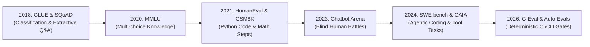

# 📹 What are LLM Benchmarks ｜ The Evolution of AI Knowledge Benchmarks

<div className="video-card" style={{border: '1px solid #30363d', borderRadius: '8px', padding: '16px', marginBottom: '24px', background: 'rgba(56, 139, 253, 0.05)'}}>
  <div style={{display: 'flex', gap: '16px', flexWrap: 'wrap'}}>
    <div><strong>Instructor:</strong> Nitish Singh (CampusX)</div>
    <div><strong>Duration:</strong> 6647</div>
    <div><strong>Course:</strong> Module 6: LLM Evaluation & Observability</div>
    <div><strong>Watch Link:</strong> <a href="https://www.youtube.com/watch?v=QSOB9lNrNj4" target="_blank" rel="noopener noreferrer">YouTube Lecture ↗</a></div>
  </div>
</div>

## 📌 Executive Summary

The progression of AI benchmarks traces the rapid evolution of model intelligence: from lexical pattern matching (GLUE), to multi-choice knowledge retrieval (MMLU), multi-step mathematics (GSM8K), and autonomous software engineering (SWE-bench).

This lesson explores how benchmark architecture evolved from static classification to interactive agentic environments.

---

## 🏗️ System Architecture & Execution Flow



---

## 📖 Core Concepts & Technical Deep Dive

### 1. Generation 1: Static Multiple-Choice (MMLU, ARC)
- Models predicted log-probabilities of token options `A`, `B`, `C`, or `D`.
- Fast and cheap to evaluate, but does not test generative synthesis, multi-turn reasoning, or code execution.

### 2. Generation 2: Code & Logic Execution (HumanEval, GSM8K)
- Required freeform code generation tested in sandboxed Python environments (`pytest`).
- Introduced unit-test execution as the evaluation ground truth.

### 3. Generation 3: Interactive Agentic Benchmarks (SWE-bench, WebArena)
- Models are placed in full Docker containers with git repositories, terminal access, and compiler tooling.
- Success is measured by whether the model can reproduce a bug, modify codebase files, and pass existing regression test suites.

---

## 💻 Production Implementation

```python
# Concept: Sandboxed Unit Test Evaluation (HumanEval-style)
def evaluate_code_solution(generated_code: str, test_suite: str) -> bool:
    sandbox_scope = {}
    try:
        # Execute generated function
        exec(generated_code, sandbox_scope)
        # Execute validation asserts
        exec(test_suite, sandbox_scope)
        return True
    except Exception as e:
        print(f"Execution failed: {e}")
        return False

code = """
def add_two_numbers(a: int, b: int) -> int:
    return a + b
"""
tests = """
assert add_two_numbers(2, 3) == 5
assert add_two_numbers(-1, 1) == 0
"""

print("Code Solution Passed:", evaluate_code_solution(code, tests))
```

---

## ⚙️ Production Gotchas & Best Practices

:::tip Evaluate with Code Execution
Whenever testing algorithmic or transformation prompts, use unit-test execution rather than LLM judges. Unit tests provide 100% deterministic evaluation.
:::

:::warning Sandboxing Security
Never execute untrusted model-generated Python code using `exec()` directly on your host machine. Always use isolated Docker containers or gVisor microVMs.
:::

---

## 📊 Architectural Reference & Comparison

| Generation | Benchmark Paradigm | Primary Metric | Determinism |
| :--- | :--- | :--- | :--- |
| **Gen 1 (2018-2020)** | Multiple Choice Q&A | Accuracy / F1 Score | 100% (Log-prob selection) |
| **Gen 2 (2021-2023)** | Unit Tested Code/Math | Pass@1 / Pass@k | 100% (Test execution) |
| **Gen 3 (2023-2024)** | Human Blind Preference | Bradley-Terry Elo Rating | Qualitative (Subjective) |
| **Gen 4 (2025-2026)** | Agentic Software & G-Eval | Patch Resolve Rate / G-Eval | Hybrid (Deterministic gates) |

---

## 📚 Key Takeaways & Enterprise Checklist

- [ ] **Architecture Verification:** Ensure your design addresses latency, decoupled interfaces, and strict data validation contracts.
- [ ] **Deterministic Testing:** Run unit tests and golden dataset evaluations before shipping changes to staging or production.
- [ ] **Security & Observability:** Enforce input/output guardrails, scrub sensitive credentials/PII, and capture distributed traces.
- [ ] **Scalability & Sizing:** Calibrate model parameters, context limits, and compute instance requirements against projected request concurrency.
