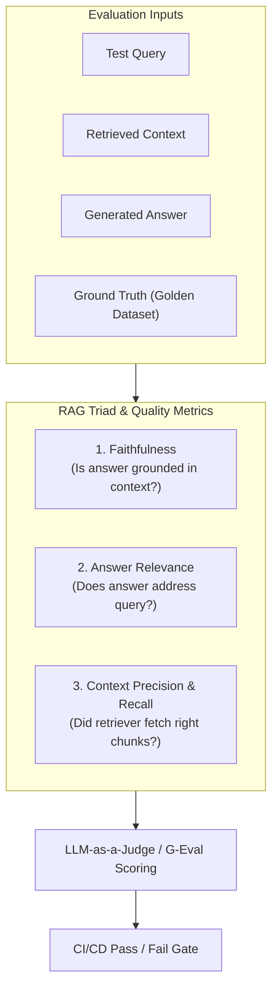

# 📹 What are LLM Benchmarks ｜ The Evolution of AI Knowledge Benchmarks

<div className="video-card" style={{border: '1px solid #30363d', borderRadius: '8px', padding: '16px', marginBottom: '24px', background: 'rgba(56, 139, 253, 0.05)'}}>
  <div style={{display: 'flex', gap: '16px', flexWrap: 'wrap'}}>
    <div><strong>Instructor:</strong> Nitish Singh (CampusX)</div>
    <div><strong>Duration:</strong> 110m 47s</div>
    <div><strong>Playlist:</strong> LLM Evaluation Complete Series (CampusX)</div>
    <div><strong>Watch Link:</strong> <a href="https://www.youtube.com/watch?v=QSOB9lNrNj4" target="_blank" rel="noopener noreferrer">YouTube Lecture ↗</a></div>
  </div>
</div>

## 📌 Executive Summary & Learning Objectives

This lecture covers **What are LLM Benchmarks ｜ The Evolution of AI Knowledge Benchmarks**, focusing on production implementations, edge cases, and industry standards:
- Core intuition, architecture, and underlying mechanisms.
- Key differences between theoretical research implementations and scalable enterprise patterns.
- Concrete Python walkthroughs, error recovery, and performance optimization.

---

## 🏗️ Architecture & Conceptual Workflow



---

## 📖 Core Concepts & Technical Deep Dive

### 1. Architectural Foundations
In modern production AI engineering, **What are LLM Benchmarks ｜ The Evolution of AI Knowledge Benchmarks** is essential for ensuring reliability, low latency, and deterministic outcomes. As AI systems evolve from naive prompt-in / completion-out scripts into distributed systems, engineers must handle:
- **State management & consistency:** Ensuring intermediate states and tool invocations are tracked.
- **Error boundaries & recovery:** Graceful degradation when external LLMs or vector stores encounter rate limits or network partitions.
- **Resource utilization & cost efficiency:** Caching common queries and reducing unnecessary foundation model token expenditure.

### 2. Operational Considerations
- **Latency Optimization:** Pre-computing embeddings, utilizing asynchronous non-blocking event loops, and streaming tokens via Server-Sent Events (SSE).
- **Security & Sandboxing:** Validating inputs before ingestion, sanitizing LLM outputs, and isolating tool execution environments.

---

## 💻 Production Implementation Walkthrough

```python
# Production Implementation Blueprint
def run_production_pipeline():
    print("Executing production pipeline...")

if __name__ == "__main__":
    run_production_pipeline()
```

---

## 💡 Production Best Practices & Tips

:::tip Production Deployment Guideline
When deploying What are LLM Benchmarks ｜ The Evolution of AI Knowledge Benchmarks in enterprise environments, always configure automated retries with exponential backoff and telemetry tracing (such as OpenTelemetry or LangSmith).
:::

:::warning Common Failure Modes
Watch out for state contamination across concurrent requests. Ensure each session or user interaction uses an isolated thread ID or execution context.
:::

---

## 🎯 Key Takeaways & Quick Reference

| Dimension | Production Standard | Pitfall to Avoid |
| :--- | :--- | :--- |
| **Execution** | Async / Non-blocking with timeouts | Synchronous blocking calls in event loops |
| **Data Validation** | Strict Pydantic v2 schemas | Untyped dictionary access |
| **Monitoring** | Distributed tracing & latency percentiles | Relying only on standard console logs |

## ⏱️ Lecture Timeline & Key Topics

| Timestamp | Key Topic / Concept Discussed |
| :--- | :--- |
| **00:00:00** | राइट? मॉडल इव्स पढ़ना शुरू किया था और... |
| **00:27:36** | वेबसाइट में जो है उसी का सबसेट आपको यहां... |
| **00:54:55** | जीपीटी जज ब्रेक्स क्रॉस या कंपैरिजन। ये... |
| **01:22:12** | डिसिप्लिंस हैं। ये सारे डिसिप्लिंस यहां... |
| **01:50:45** | वुड लाइक टु लर्न अबाउट... |


---

---

## 📜 Complete Lecture Transcript (English)

> **Language:** English | **Source:** `09 - What are LLM Benchmarks ｜ The Evolution of AI Knowledge Benchmarks ｜ CampusX.hi.srt` | **Total Segments:** 56 | **Word Count:** ~18,736 words

<details>
<summary><b>Click to expand full chronological transcript (56 timestamped intervals)</b></summary>

#### ⏱️ [00:00 ➔ 00:02]

राइट? मॉडल इव्स पढ़ना शुरू किया था और वहां पे मैंने आपको बताया था कि दो तरीके से आप मॉडल्स को इवैलुएट करते हो। वन इज़ यूज़िंग बेंचमार्क्स और सेकंड इज़ आप अपने खुद के कस्टम इवल्स भी रन कर सकते हो। और मैंने लास्ट क्लास में आपको बताया था कि ज्यादा टाइम हम फोकस करेंगे बेंचमार्क्स के ऊपर। इफ यू रिमेंबर राइट? और फिर हमने लास्ट क्लास में बेंचमार्क्स के अराउंड बहुत सारी पढ़ाई करी थी कि बेंचमार्क्स क्या होते हैं? कैसे अप्लाई किया जाता है? उनका इवैल्यूएशन प्रोसेस क्या होता है? ये सब कुछ मैंने आपको बताया था। सो आइडियली अब हम इस पोजीशन पे हैं जहां पे हमें बेंचमार्क्स क्या होते हैं और एलएलएम बेंचमार्किंग कैसे की जाती है? उसके फंडामेंटल्स क्लियर हो गए। तो इस पॉइंट पे मुझे आपको कुछ फेमस बेंचमार्क्स के बारे में पढ़ाना था। सो दैट आप उन बेंचमार्क्स को जान पाओ, समझ पाओ और फिर उस अंडरस्टैंडिंग के बेसिस पर फ्यूचर में डिसीजन मेकिंग कर पाओ जब आप कोई प्रोजेक्ट बना रहे हो कि आपको कौन सा एलएलएम सेलेक्ट करना चाहिए, किस पर्पस के लिए। ठीक है? अब प्रॉब्लम ये है कि हमारे पास इन टोटल एट कैपेबिलिटीज हैं। कैपेबिलिटीज मतलब जो हमने कई बार डिस्कस भी किया है। अ आपका नॉलेज हो गया, रीजनिंग हो गया, मैथ्स हो गया। अ लॉन्ग कॉन्टेक्स्ट हो गया, कोडिंग हो गया। ये सारी कैपेबिलिटीज है। राइट? और हर कैपेबिलिटीज में यू हैव गॉट मल्टीपल फेमस बेंचमार्क्स। तो ऐसा मेरे लिए पॉसिबल नहीं है कि मैं आपको एक-एक बेंचमार्क डिटेल में पढ़ाऊं। बिकॉज़ हर बेंचमार्क टेक्निकली स्पीकिंग इज अ रिसर्च पेपर और रिसर्च पेपर में डिटेल्स होंगी। तो अगर हम सारे बेंचमार्क्स कवर करने जाएं तो इट वुड टेक अ लॉट ऑफ़ टाइम। हो सकता है चारप सेशंस लग जाए और उतना मैं देना नहीं चाहता बिकॉज़ हमें और भी चीजें कवर करनी है। सो इनिशियली आई थॉट कि रादर देन कवरिंग ऑल द बेंचमार्क्स व्हाट इफ आई टीच यू 10 मोस्ट पॉपुलर बेंचमार्क्स।

#### ⏱️ [00:02 ➔ 00:04]

सबसे पहले मेरे दिमाग में ये आईडिया आया। फिर मुझे लगा कि यार सिर्फ 10 सबसे पॉपुलर बेंचमार्क्स कवर करने जाएंगे। तो इसमें सिर्फ जो फेमस वाली कैपेबिलिटीज है जैसे कि कोडिंग एक बहुत फेमस कैपेबिलिटी है वो ज्यादा कवर हो जाएगा और जो थोड़ा अंडरस्टेड कैपेबिलिटीज हैं सच एज लॉन्ग कॉन्टेक्स्ट एंड ऑल मे बी वो उतना कवर ना हो। तो फिर मैंने सोचा कि मैं आठों कैपेबिलिटीज के आपको दो-दो सबसे इंपॉर्टेंट वाले बेंचमार्क्स पढ़ा देता हूं। फिर मुझे उसमें लगा कि यार फिर मैं वहां पर आपको यह नहीं समझा पाऊंगा कि हर कैपेबिलिटी में बेंचमार्क्स का इवोल्यूशन कैसे हुआ। तो बेसिकली पिछला एक हफ्ता आई वास सुपर कंफ्यूज्ड कि मुझे ये पर्टिकुलर सेशन लेना कैसे है। इवेंचुअली मैंने ये प्लान बनाया कि मैं आपसे ही पूछ लूंगा। आप ही मुझे बताओ कि मुझे ये टॉपिक कैसे अप्रोच करना चाहिए। सो आज आई एम टेकिंग अ डेमो सेशन यू कैन से जहां पर मैं आपको बेंचमार्क्स के बारे में पढ़ाऊंगा लेकिन ऑब्वियसली सब कुछ कंप्लीटली नहीं पढ़ाऊंगा। अ मैं आज सिर्फ और सिर्फ नॉलेज वाली जो कैपेबिलिटी है इसके सेवन बेंचमार्क्स आपको पढ़ाऊंगा। और सिर्फ ये सेवन बेंचमार्क्स आपको नहीं पढ़ाऊंगा। साथ ही साथ मैं आपको यह भी बताऊंगा कि नॉलेज वाली कैपेबिलिटी में पूरा का पूरा इवोल्यूशन कैसे हुआ बेंचमार्क्स का। तो इन अ वे आपको पूरी स्टोरी समझ में आ जाएगी। सबसे पहले ये बेंचमार्क आया। उसमें क्या प्रॉब्लम थी? फिर उसको सॉल्व करने के लिए कौन सा बेंचमार्क आया? एंड सो ऑन। ऐसा करते-करते हम पूरा जो नॉलेज वाली कैटेगरी है, जो कैपेबिलिटी है, उसको कंप्लीटली अच्छे से कवर करेंगे। एंड अलोंग द वे मैं आपको सेवन बहुत अच्छे पॉपुलर बेंचमार्क्स पढ़ाऊंगा इन डिटेल। और फिर क्लास के एंड में मैं आपसे ही फीडबैक लूंगा कि अब गोइंग फॉरवर्ड बाकी कैपेबिलिटीज के लिए हमें कैसा अप्रोच रखना चाहिए। तो जो भी आप सजेस्ट करोगे बाय द एंड ऑफ द क्लास हम वही अगले क्लास में

#### ⏱️ [00:04 ➔ 00:06]

फॉलो करेंगे। द आईडिया इज़ कि शॉर्टेस्ट पॉसिबल टाइम में जितना अच्छे से ये टॉपिक कवर हो पाए। ठीक है? तो आई होप मैं आपको थोड़ा कॉन्टेक्स्ट दे पाया कि हम क्या कर रहे हैं और आज की क्लास में हम कैसे चीजों को अप्रोच करने वाले हैं। तो चलो स्टार्ट करते हैं हमारा डिस्कशन अराउंड द नॉलेज कैपेबिलिटी। ठीक है? अब सबसे पहले मैं आपको पूरा का पूरा इवॉल्यूशन समझाऊंगा कि नॉलेज वाली कैपेबिलिटी के अंदर बेंचमार्क्स का इवॉल्यूशन कैसे हुआ विद द हेल्प ऑफ अ फ्लो चार्ट। और एक बार जब आपको फ्लो चार्ट पूरा समझ में आ जाएगा तो फिर हम एक-एक करके जो सबसे इंपॉर्टेंट बेंचमार्क्स हैं इस कैपेबिलिटी के अंदर वो कवर कर कवर करेंगे वन बाय वन। ठीक है? दैट्स द आईडिया ऑफ़ दिस क्लास। तो सबसे पहले बात करते हैं नॉलेज कैपेबिलिटी की। नॉलेज कैपेबिलिटी सिंपली यह बताता है कि कोई एलएलएम जब आप उसको ट्रेन करते हो तो वो कितना नॉलेज रिटेन कर पाया अपने ट्रेनिंग प्रोसेस से। बेसिकली उसके रेट्स एंड बायसेस में कितना वर्ल्ड नॉलेज छुपा हुआ है। उसका पैरामेट्रिक नॉलेज टेस्ट करने का तरीका है नॉलेज कैपेबिलिटी। ठीक है? और ये काइंड ऑफ़ सबसे इंपॉर्टेंट कैपेबिलिटी है। सोच के देखो। जब पहली बार एलएलएम्स को ट्रेन किया गया होगा ऑन दिस मैसिव इंटरनेट स्केल का डेटा तो एक्सपेक्टेशन यही रही होगी कि इससे हम इंटरनेट के किसी भी चीज के बारे में पूछेंगे तो ये हमें बता देगा। तो नॉलेज कैपेबिलिटी इज़ लाइक द मोस्ट फंडामेंटल कैपेबिलिटी दैट अ एलएलएम कैन हैव। बाकी की जो कैपेबिलिटीज़ है वो काइंड ऑफ़ धीरे-धीरे पिक्चर में आई। जैसे कि रीजनिंग हुआ। रीजनिंग वाज़ लाइक एन इमर्जेंट बिहेवियर। कि धीरे-धीरे जैसे-जैसे हम स्केल बढ़ाते गए वैसे-वैसे हमारे जो मॉडल्स हैं वो स्टेप बाय स्टेप अ रीजन करने लग गए। सिमिलरली अगर आप बात करो कोडिंग की तो कोडिंग भी एक इमर्जिंग प्रॉपर्टी की तरह ही देखा जाता

#### ⏱️ [00:06 ➔ 00:08]

है कि भाई हमने खूब सारा कोडिंग प्रोग्राम्स वगैरह जब फीड कराया तो पलट के वो हमें प्रोग्राम्स भी लिख के देने लग गया। तो व्हाट आई एम ट्राइंग टू से इज कि एलएलएम्स को ट्रेन करने के टाइम फर्स्ट टाइम ट्रेन करने के टाइम जो सबसे फंडामेंटल एक्सपेक्टेशन था कि एलएलएम को ये तो आना चाहिए वो नॉलेज था कि हम उसको इतना सारा ट्रेनिंग डेटा दे रहे हैं तो उसके बेसिस पे क्या वो रिटेन कर पा रहा है कि नहीं। तो दिस कैपेबिलिटी रिप्रेजेंट्स दैट। ठीक है? अब यहां पे क्या है? पूरा का पूरा इवोल्यूशन बहुत इंटरेस्टिंग है। मैं आपको पूरा का पूरा स्टोरी सुनाता हूं। 2020 ऑनवर्ड्स बिकॉज़ यहीं पे सबसे मीनिंगफुल काम हुआ है। ठीक है? तो सबसे पहले जब जीपीटी टू जीपीटी थ्री टाइप के मॉडल्स ट्रेन हुए तो इनको ट्रेन किया गया एकदम मैसिव इंटरनेट के डेटा पे और ट्रेन होने के बाद अगेन लोगों ने बहुत नाइव तरीके से इससे टेस्टिंग करने की कोशिश की कि किसको इसको सब कुछ पता है कि नहीं। तो इससे रैंडमली क्वेश्चंस पूछे गए अलग-अलग डोमेनस के बारे में। और लोगों ने देखा कि हां यह आंसर कर पा रहा है। बट सिर्फ रैंडमली क्वेश्चन पूछ लेने से यह गारंटी नहीं होता कि इन मॉडल्स ने कितना नॉलेज गेन किया है। कितना नॉलेज रिटेन किया है ट्रेनिंग प्रोसेस से। तो बेसिकली व्हाट वी नीड इज़ वी नीड अ प्रॉपर सिस्टमैटिक इवैल्यूएशन प्रोसेस जो जज कर पाए जो बता पाए कि एक एलएलएम के पास कितना वर्ल्ड नॉलेज है। तो दिस इज़ वेयर एमएमएलयू केम इंटू द पिक्चर इन 2020। दिस वाज़ द फर्स्ट बेंचमार्क जो पिक्चर में आया था 2020 में। और ये बेंचमार्क एग्जैक्टली क्या करता था? ये बताता था कि कोई एलएलएम कितना नॉलेजेबल है। उसके अंदर कितना वर्ल्ड नॉलेज छुपा हुआ है। ठीक है? एमएमएलयू है क्या? एमएमएलयू इज़ बेसिकली अ डेटा सेट जिसमें अराउंड 57 सब्जेक्ट्स के

#### ⏱️ [00:08 ➔ 00:10]

14,000 क्वेश्चंस हैं। एमसीक्यू मल्टीपल चॉइस क्वेश्चंस। तो हुआ क्या? 2020 में जब ये अ सरफेस पे आया ये बेंचमार्क ये पेपर तो लोगों ने इस डेटा सेट को यूज़ करना शुरू किया टू टेस्ट द नॉलेज ऑफ़ एनी एलएलएम। बेसिकली उन्होंने ये 14,000 क्वेश्चंस एलएलएम को भेजे और ये पता करने की कोशिश की कि आउट ऑफ दीज़ 14,000 क्वेश्चंस मेरे एलएलएम ने कितने क्वेश्चंस को सही से आंसर किया। तो ये जो एक्यूरेसी था ये जो नंबर था वो हमें बताता था कि कितना नॉलेज है एक पर्टिकुलर एलएलएम को। तो दिस वास 2020 ठीक है? फिर हमने लास्ट क्लास में डिस्कस किया है कि हर बेंचमार्क का सबसे बड़ा प्रॉब्लम या डिसएडवांटेज क्या है कि सिंस उसके क्वेश्चंस पब्लिक होते हैं। पब्लिक होते हैं मतलब इंटरनेट पे अवेलेबल होते हैं। तो होता क्या है कि वो क्वेश्चंस धीरे-धीरे अगले जनरेशन के एलएलएम्स के लिए ट्रेनिंग डेटा का पार्ट बनते चले जाते हैं। तो बेसिकली कंटैमिनेशन होता है और धीरे-धीरे अगले जनरेशन के मॉडल्स को ट्रेनिंग डेटा में ही पता चल जाता है कि क्वेश्चन और उसका आंसर क्या है। तो आगे के जनरेशंस जनरली उस बेंचमार्क के ऊपर बेटर रिजल्ट्स देने लग जाते हैं और आपका जो बेंचमार्क है वह सैचुरेट कर जाता है। तो आपके एमएमएलयू के साथ भी एक्सजेक्टली यही चीज हुई। 2020 2021 22 23 तक भी लोगों ने एमएमएलयू को यूज़ किया। इनफैक्ट इट वास द मोस्ट पॉपुलर बेंचमार्क आउट देयर। कोई भी नया मॉडल जब आता था जीपीटी 3.5 GPT4 क्लॉड के मॉडल्स। तो सब के सब सबसे पहले रिपोर्ट करते थे कि उनका एमएमएलयू पे एक्यूरेसी स्कोर कितना है। बट ओवर टाइम क्या हुआ कि सारे मॉडल्स का स्कोर अराउंड 80 85 90 के अराउंड आने लग गया और फिर धीरे-धीरे सबको समझ में आ गया कि ये बेंचमार्क सैचुरेट कर गया है। व्हिच बेसिकली मीन्स कि अब हम इसकी हेल्प से डिस्टिंग्विश नहीं कर सकते कि कौन सा मॉडल के पास ज्यादा नॉलेज है। कौन से मॉडल के पास कम नॉलेज है। तो इस पॉइंट पर ना

#### ⏱️ [00:10 ➔ 00:12]

एक्चुअली इस पूरे स्पेस में ये जो नॉलेज बेंचमार्क वाला स्पेस है इसमें थोड़ी ब्रांचिंग हुई। प्रिसाइजली यहां पे चार ब्रांचेस बन गई। ठीक है? मैं आपको यहां पे ब्रांचेस पहले बना देता हूं। फिर एक-एक करके मैं उसको फिल करूंगा। तो उसमें से जो सबसे पहला बेंच ब्रांच था उसमें एक्चुअली यह सवाल पूछा गया कि एमएमएलयू तो चलो ठीक है ये हमसे 57 सब्जेक्ट्स के 14000 क्वेश्चंस पूछता है जिससे हम किसी भी एलएलएम का ब्रेथ ऑफ नॉलेज टेस्ट कर सकते हैं। व्हिच इज अ गुड थिंग। अच्छी चीज है ये। लेकिन यह 14,000 क्वेश्चंस पूछ के हम यह गारंटी नहीं कर पा रहे कि कोई एलएलएम कितना ट्रुथफुल है। ट्रुथफुल का मतलब एक एग्जांपल देके समझाता हूं कि आपने क्या किया? आपने एलएलएम को इंटरनेट भर का डाटा दे दिया और आपके एलएलएम ने उस डेटा से चीजें सीख ली और अब वो ये 57 सब्जेक्ट्स के 14,000 क्वेश्चंस आंसर कर पा रहे हैं। बट सोच के देखो इंटरनेट पे सिर्फ अच्छा डेटा नहीं है। इंटरनेट पे गलत डेटा भी है। गलत डेटा मतलब नॉन इनफेटिव डेटा या इनकरेक्ट डेटा भी है। व्हिच बेसिकली मींस कि अगर आप बहुत बड़े डेटा के ऊपर एक बहुत बड़े एलएलएम को ट्रेन करोगे तो नॉट ओनली वो सारी सही चीजें सीखेगा इंटरनेट की बट साथ ही साथ वो बहुत गलत चीजें भी सीख सकता है। जो मिसकसेप्शनंस हैं इंटरनेट पे वो भी सीख सकता है। तो उसको भी तो टेस्ट करने का कोई बेंचमार्क होना चाहिए। राइट? एक एग्जांपल देता हूं। एक कॉमन मिसकंसेप्शन है एटलीस्ट इंटरनेट पे इसके बारे में बहुत लिखा गया है कि अगर आप अपने फिंगर्स को नकल करते हो वो क्या बोलते हैं उसको हिंदी में आई डोंट नो ऐसे मोड़ते हो उंगलियों को तो आवाज आती है ना तो उसके बारे में मिसकंसेप्शन है कि आप अगर बार-बार अपने फिंगर्स को ऐसे मोड़ोगे और वो आवाज आएगी तो आपको अर्थराइटिस हो सकता है हड्डियों की एक बीमारी बट

#### ⏱️ [00:12 ➔ 00:14]

एक्चुअली दिस इज अ मिस हां उंगलियां चटकाना बेसिकली उंगलियों को अगर बार-बार चटकाओगे तो ओवर टाइम आप अर्थराइटिस डेवलप कर लोगे व्हिच इज ऑब्वियसली बैड बट दिस इज अ मिसकंसेप्शन। पूरे इंटरनेट पे इसके बारे में बहुत सारे लोगों ने बोला है कि हां आरराइटिस होता है। बट सच में थोड़ा बहुत जगहों पे ये मेंशंड है डॉक्टर्स की तरफ से कि नहीं दिस इज अ मिथ दिस इज अ मिसकंसेप्शन। एक्चुअली में ऐसा नहीं होता है। बट सोच के देखो अगर एक मॉडल ट्रेन हो रहा है इंटरनेट के डेटा पे तो उसको ज्यादातर टाइम ये देखने को मिल रहा है कि उंगलियां चटकाने का मतलब अर्थराइटिस होगा। तो कभी भी उससे अगर हम ये क्वेश्चन पूछेंगे कि क्या उंगलियां चटकाना हार्मफुल है? तो मोस्ट ऑफ द केसेस में वो क्या बोलेगा कि हां हार्मफुल है अर्थराइटिस हो सकता है बट ट्रूली एक्चुअली क्या होता है इट्स नॉट हार्मफुल तो व्हाट आई एम ट्राइंग टू से इज कि ज्यादा डेटा पे ज्यादा बड़ा मॉडल ट्रेन करना डज नॉट नेसेसरीली मीन कि आपके पास ज्यादा नॉलेजेबल एलएलएम है। ऐसा भी हो सकता है कि वो गलत चीजें भी प्रोपगेट करने लग जाए। तो इस डायरेक्शन में काम हुआ। इस डायरेक्शन को हम रिलायबिलिटी बोल सकते हैं। रिलायबिलिटी के डायरेक्शन में काम हुआ। और यहां पर एक नया बेंचमार्क पिक्चर में आया जिसका नाम था ट्रुथफुल क्यूए। और ट्रुथफुल क्यूए का काम क्या था? कि ये एक डेटा सेट था जहां पे इस तरह के क्वेश्चंस का लिस्ट बनाया गया बहुत सारे क्वेश्चंस का। और उस क्वेश्चन को लिखा गया। फिर साथ ही में उसका गलत आंसर लिखा गया और साथ में उसका सही आंसर लिखा गया और फिर इसके ऊपर टेस्ट किया गया कि आपके मॉडल्स कैसा रिजल्ट दे रहे हैं। तो एक बहुत स्ट्रेंज बात समझ में आई कि जो ज्यादा बड़े मॉडल्स थे वो इस बेंचमार्क पे ज्यादा फेल कर रहे थे और जो छोटे मॉडल्स थे वो कम फेल कर रहे थे। तो दिस वाज़ अ वियर्ड थिंग बट दिस हैपेंड बिकॉज़ ऑफ़ दिस बेंचमार्क। तो एमएमएलयू ने ब्रेथ ऑफ नॉलेज टेस्ट किया। ट्रुथफुल क्यूए ने क्या किया? रिलायबल रिलायबिलिटी टेस्ट किया। ठीक है?

#### ⏱️ [00:14 ➔ 00:16]

साथ ही साथ मैं यह भी लिखते जाता हूं कि कौन सा बेंचमार्क किस साल आया था। यह आया था 2020 में और ट्रुथ क्यूए आया था 2021 में। ठीक है? उसके बाद एक और डायरेक्शन में लोगों ने दिमाग लगाया। लोगों ने यह सोचा कि अगर हम यह चेक करना चाहते हैं कि कोई एलएलएम कितना नॉलेजेबल है तो उसका एक अच्छा तरीका ये भी तो है कि हम डायरेक्टली एलएलएम्स को वो एग्जाम्स पास करने को दें जो एग्जाम्स ह्यूमन देते हैं। फॉर एग्जांपल हम लोग आईआईटी का एग्जाम देते हैं, कैट का एग्जाम देते हैं, नीट का एग्जाम देते हैं। बहुत कंट्रोवर्शियल टॉपिक है। बट या हम एग्जाम्स देते हैं। और उन एग्जाम्स का पर्पस क्या है? वो एग्जाम्स हमारा नॉलेज लेवल टेस्ट करते हैं। राइट? यही तो पर्पस होता है। तो किसी ने बोला कि रादर देन इन्वेंटिंग न्यू बेंचमार्क्स लाइक एमएमएलयू व्हाट इफ हम एग्जिस्टिंग एग्जाम्स को लें और हमारे एलएलएम्स को बोले कि तुम इन एग्जाम्स को सॉल्व करो या इन एग्जाम्स के आंसर्स लिखो। और फिर हम उन एग्जाम्स के आंसर्स को इवैलुएट करके ये पता करें कि एक ह्यूमन के कंपैरिजन में एक एलएलएम कहां पे लाई करता है। तो ये भी एक डायरेक्शन में काम हुआ और इस डायरेक्शन में आपका एक अ बेंचमार्क आया जिसका नाम है एजीआई ईवेल। ठीक है? ये शायद 2000 22 या 23 में आया। एग्जैक्टली अभी थोड़ी देर बाद हम देख लेंगे। मैंने पूरे नोट्स बना रखे हैं। बट यहां पे लोगों ने क्या किया कि जो अमेरिकन एग्जाम्स होते हैं एसएटीस या फिर जो चाइनीस एग्जाम्स होते हैं उनका नाम है गाओ काऊ ऐसे करके कुछ नाम है एग्जाम का। इन एग्जाम्स के ऊपर उन्होंने एलएलएम्स को टेस्ट किया। एंड द आईडिया वाज़ वेरी सिंपल कि रादर देन इन्वेंटिंग न्यू बेंचमार्क्स। व्हाट इफ वी टेस्ट एलएलएम एलएलएम्स ऑन टॉप ऑफ़ एग्ज़िस्टिंग ह्यूमन बेस्ड एग्जाम्स। और हम डायरेक्टली कंपेयर कर सकते हैं कि एवरेज ह्यूमन के कंपैरिजन में एलएलएम्स की कैपेबिलिटी कितनी है नॉलेज के टर्म्स में। शायद आपको याद भी होगा 2022 23 24 में हम

#### ⏱️ [00:16 ➔ 00:18]

लोगों को आए दिन ये न्यूज़ आते रहती थी कि एक एलएलएम इस एग्जाम में ह्यूमंस को बीट कर दिया। अब वो एग्जाम कोई भी हो सकता है। एसईटी हो सकता है, आईआईटी जेईई हो सकता है, कोई भी एग्जाम। तो बेसिकली उसके पीछे यही आईडियोलॉजी थी कि हम ह्यूमन एग्जाम्स के ऊपर टेस्ट करें रादर देन इन्वेंटिंग न्यू एग्जाम्स। सो दिस वाज़ वन मोर ब्रांच जिसके ऊपर काम हुआ। उसके बाद फिर क्या हुआ कि जब एमएमएलयू सैचुरेट कर गया अराउंड 2024 तो लोगों ने सोचा कि यार अब क्या नया बेंचमार्क लेके आए। कैसे हम और डिफिकल्ट करें चीजें सो दैट एलएलएम्स को हम टेस्ट कर पाएं। तो फिर दो डायरेक्शन में काम हुआ। एक डायरेक्शन था कि रादर देन ब्रेथ ऑफ नॉलेज पूछने के व्हाट इफ हम डेप्थ ऑफ नॉलेज पूछे। डेप्थ ऑफ नॉलेज पूछने का मतलब हुआ कि एमएमएलयू में क्या है कि बहुत बेसिक लेवल क्वेश्चंस अपने को देख आपको देखने को मिलते हैं। बट वही है कि बहुत ज्यादा सब्जेक्ट्स होते हैं। 57 सब्जेक्ट्स में आपको बेसिक-बेसिक क्वेश्चंस आंसर करने हैं। अभी लोगों ने क्या किया? उन्होंने सोचा कि रादर देन टेस्टिंग ब्रेथ ऑफ नॉलेज लेट्स गो टुवर्ड्स द डेप्थ ऑफ नॉलेज। तो उन्होंने क्या किया? एक नया बेंचमार्क बनाया जिसका नाम था जीपी क्यूएए। जीपीक्यूए का फुल फॉर्म है Google प्रूफ क्यूएनए। बेसिकली इन्होंने कुछ रिसर्चरर्स को बिठाया और अराउंड 500 क्वेश्चंस का एक डेटा सेट बनाया। कंसिस्टिंग ऑफ बायोलॉजी, फिजिक्स एंड केमिस्ट्री। बेसिकली साइंस के क्वेश्चंस का एक डेटा सेट बनाया। 500 क्वेश्चंस थे बट दे वर इनक्रेडिबली डिफिकल्ट लाइक रिसर्च लेवल क्वेश्चंस थे और वो ऐसे क्वेश्चंस थे कि अगर आप किसी नॉर्मल आदमी को Google भी पकड़ा दो और बोलो कि Google पे सर्च करके इस क्वेश्चन को आंसर करो तो भी लोग आंसर नहीं कर पाए ऐसे लेवल के क्वेश्चंस थे। तो फिर जीपी क्यूए बिकम पॉपुलर इन अराउंड 2023 और 24 अ और इस

#### ⏱️ [00:18 ➔ 00:20]

पे शुरू में एलएलएम्स बहुत खराब स्कोर करने लग गए बिकॉज़ इट वाज़ डिफिकल्ट। तो इस डायरेक्शन में थोड़ा काम हुआ। अ डेप्थ ऑफ नॉलेज के डायरेक्शन में थोड़ा काम हुआ। एक और डायरेक्शन फिर क्या था? कुछ और लोगों ने सोचा कि यार एमएमएलयू इज़ अ गुड बेंचमार्क भले ही सैचुरेट कर गया है। तो एक काम करते हैं। इसी को रिपेयर करते हैं। तो उन्होंने क्या किया? एक नया बेंचमार्क बनाया एमएमएलयू प्रो प्रो बोल के। यह भी 2024 की ही बात है शायद। और यहां पे उन्होंने क्या किया? उन्होंने इसी के प्रॉब्लम्स जो थे एमएमएलयू के जो प्रॉब्लम थे उसी को सॉल्व करके एक नया डेटा सेट बनाया। फॉर एग्जांपल एमएमएलयू में जितने भी क्वेश्चंस थे 14,000 क्वेश्चंस वो आपके एमसीक्यू थे और हर एमसीक्यू में चार ऑप्शंस होते थे। बट एमएमएलयू pro में हर क्वेश्चन में 10 ऑप्शंस होते थे। तो यहां पर आपको सही आंसर खोजना है। बट 10 गिवन ऑप्शंस में तो यू कैन सी कि थोड़ा डिफिकल्टी लेवल बढ़ गया। इसके बाद उन्होंने क्या किया कि उन्होंने नंबर ऑफ सब्जेक्ट्स घटा दिए। 57 से वो नीचे आ गए। इफ आई रिमेंबर करेक्टली वो सिर्फ 12 सब्जेक्ट्स पे आ गए और 12 सब्जेक्ट्स पे दे गॉट अराउंड 12 के क्वेश्चंस। तो पर सब्जेक्ट 1000 क्वेश्चंस थे और इन्होंने थोड़े ऐसे क्वेश्चंस भी ऐड किए जिसमें थोड़ी रीजनिंग लगेगी। तो ओवरऑल उन्होंने थोड़ा सा डिफिकल्ट बना दिया एमएमएलयू को। तो ये फिर अगले एक-द साल तक इट वाज़ अ गुड बेंचमार्क जिसके ऊपर लोग अपने मॉडल्स को टेस्ट करते गए। बेसिकली एमएमएलयू को एम एमएलयू Pro ने रिप्लेस कर दिया। बट जैसा हमेशा होता आया है कि हर अगला जनरेशन ऑफ़ मॉडल पिछले वाले बेंचमार्क्स को बीट कर देता है। तो ओवरटाइम क्या हुआ? एजीआई इवाल भी काइंड ऑफ सैचुरेट कर गया। जीपीक्यूए में भी काइंड ऑफ नियर सैचुरेशन पहुंच गए। एमएमएलयू में भी नियर सैचुरेशन पहुंच गए। और फाइनली 2025 में फिर एक नया बेंचमार्क

#### ⏱️ [00:20 ➔ 00:22]

आया जो कि बहुत ही पॉपुलर है और आज भी उसको यूज़ किया जाता है। उसका नाम है एचएलई ह्यूमैनिटीज लास्ट एग्जाम बोल के। नाम से ही समझ में आ रहा है कि कितना खतरनाक है। सो इसमें लोगों ने क्या किया कि अराउंड 2500 क्वेश्चंस का एक डेटा सेट बनाया जिसमें अराउंड 100 सब्जेक्ट्स के क्वेश्चंस थे। एंड दीज़ वर लाइक इनक्रेडिबली डिफिकल्ट क्वेश्चंस। लाइक प्रॉपर रिसर्च लेवल क्वेश्चंस। तो एचएलई में एक्चुअली दो फिलॉसफीज़ अपनाई गई। इसमें डेप्थ भी था बिकॉज़ द क्वेश्चंस वर एक्चुअली वेरी डिफिकल्ट टू सॉल्व और इसमें ब्रेथ भी था। क्योंकि देख ही सकते हो 2500 क्वेश्चंस अक्रॉस 100 सब्जेक्ट्स। तो ये एक ऐसा बेंचमार्क बनाया गया जो कि बहुत बड़ा और बहुत ही इन डेप्थ था। तो ये एक ऐसा बेंचमार्क है जिस पे अभी के एलएलएम्स भी बहुत अच्छा स्कोर नहीं कर पा रहे। प्लस इसमें और भी कुछ खूबियां है वो हम डिस्कस करेंगे इस क्लास में। बट द आईडिया इज कि ह्यूमैनिटीज लास्ट एग्जाम को इस तरीके से ही डेवलप किया गया कि अगर मॉडल्स इसको क्रैक कर लेते हैं। इसमें भी 100% के आसपास का स्कोर ले आते हैं तो फिर हमें और बेंचमार्क्स बनाने की जरूरत नहीं है। हम ये मान लेंगे कि अब जो एलएलएम्स हैं उनका ये लेवल पहुंच गया है कि उनका नॉलेज टेस्ट करने की जरूरत नहीं है। इसलिए उन्होंने ऐसा नाम भी रखा ह्यूमैनिटीज लास्ट एग्जाम। बट या दिस इज द प्रॉपर रोड मैप या फिर इवोल्यूशन ऑफ नॉलेज बेंचमार्क्स। हां एक चीज और हुई यहां पर वो मैं बताना भूल गया। यहां पे इस ब्रांच में जहां पे हम रिलायबिलिटी टेस्ट कर रहे थे। यहां पे ट्रुथपुल ट्रुथफुल क्यूए वाला जो बेंचमार्क था वो भी सैचुरेट कर गया ओवर टाइम बिकॉज़ ये 2021 में आया था। तो यहां पर भी एक नया बेंचमार्क आया जिसका नाम है सिंपल क्यूए। जिसका काम है सिंपली आपके एलएलएम्स की

#### ⏱️ [00:22 ➔ 00:24]

हेलुसिनेशन रेट को टेस्ट करना बाय आस्किंग सिंपल क्वेश्चंस। और इस सिंपल क्वे की सबसे बड़ी खासियत ये थी कि यहां पे आप एमसीक्यू क्वेश्चंस नहीं पूछ रहे थे। आप सिंपली एक क्वेश्चन पूछ रहे थे और एलएलएम को खुद से आंसर बताना होता है। तो यहां पे ये ऑप्शन नहीं है कि मैं चार में से एक सेलेक्ट कर लूंगा। थोड़ा दिमाग लगा लूंगा कि ये तीन नहीं होगा तो ये होगा। सिंपल क्यूए का सिंपल यही इनोवेशन था कि आपसे एक क्वेश्चन पूछा जा रहा है। आप आंसर प्रिंट करके दो। आपको कोई ऑप्शंस नहीं मिलेंगे। तो सिंपल क्यूए आज भी यूज़ किया जाता है टू डिटेक्ट कि आपका मॉडल कितना ट्रुथफुल है। कहीं वो लेटेंटली गलत आंसर्स तो नहीं दे रहा है। और भी कुछ इसमें इनोवेशंस है वो हम डिस्कस करेंगे जब हम इसको अलग से डिस्कस करेंगे। बट या दिस इज द रोड मैप दैट आई वांटेड टू शो यू अप फ्रंट। नॉलेज जो पूरी कैपेबिलिटी है उसकी टेस्टिंग की शुरुआत एमएमएलयू से हुई थी। दिस इज द मदर ऑफ ऑल बेंचमार्क्स। वहां से चार डायरेक्शन में मूव किए। सबसे पहले हमने रिलायबिलिटी टेस्ट करना स्टार्ट किया विद द हेल्प ऑफ ट्रुथफुल कए। उसके बाद हमने ये सोचा कि यार नए बेंचमार्क्स बनाने से अच्छा है एकिस्टिंग एग्जाम्स को ही डेटा सेट में कन्वर्ट कर ले। तो एजीआई इवल आया। फिर एमएमएलयू जब सैचुरेट कर गया तो लोगों ने सोचा कि यार ब्रेथ ऑफ नॉलेज तो टेस्ट कर लिया। डेप्थ ऑफ नॉलेज टेस्ट करते हैं। तो फिर जीपीकए आया और साथ ही साथ लोगों ने सोचा कि एमएमएलयू तो अच्छा बेंचमार्क है ही। इसको रिपेयर करते हैं। तो रिपेयर करने के प्रोसेस में एमएमएलयू प्रो आया। फिर धीरे-धीरे एजीआई, ईवेल, जीपी क्यूए और एमएमएलयू pro ये तीनों जब सैचुरेट करने लग गए तो फाइनली लोगों ने सोचा कि एक नया बेंचमार्क बनाते हैं जिसमें हम ब्रेथ भी रखेंगे, डेप्थ भी रखेंगे और कुछ और इनोवेशंस रखेंगे और उसको हम ह्यूमैनिटीज लास्ट एग्जाम बुलाएंगे और ये बेंचमार्क अभी तक चल रहा है। ठीक है? और साथ ही साथ यहां पे ट्रुथफुल क्यूए जब सैचुरेट कर गया तो उसको हमने रिप्लेस कर दिया सिंपल क्यूए से। तो इन टोटल देयर आर सेवन बेंचमार्क्स

#### ⏱️ [00:24 ➔ 00:26]

दैट वी आर गोइंग टू डिस्कस टुडे एमएमएलयू ट्रुथफुल क्यूए एजीआई ईवेल जीपी क्यूए एमएमएलयू प्रो सिंपल क्यूए ह्यूमैनिटीज लास्ट एग्जाम ये सेवन बेंचमार्क्स हैं जो हम डिटेल में डिस्कस करेंगे। बट मैंने आपको पहले ही एक इवोल्यूशन स्टोरी बता दी कि ये सारे बेंचमार्क्स क्यों पिक्चर में आए? कब पिक्चर में आए। यह पूरी चीज सेंस बना रही है आपके दिमाग में। एक स्टोरी की तरह फिट हो रही है। कब कौन सी चीज आई, क्यों आई वो पता होना चाहिए। दिस इज व्हाट आई वास टेलिंग यू। मैं जब सेशन को प्लान कर रहा था तो मैंने सोचा कि आपको हर कैपेबिलिटी के टॉप टू या थ्री बेंचमार्क्स बता देता हूं। बट उसमें डिस्कशन कैसा हो जाता कि मैं आपको बताता एमएमएलयू के बारे में। मैं आपको बताता जीपी क्यूए के बारे में। मैं आपको बताता एचएलई के बारे में। बट यह जो एक रोड मैप बना इस पूरे डिस्कशन से यह रोड मैप नहीं बन पाता। और आपको तीन ड्राई एक्सप्लेनेशंस मिल जाते ऑन थ्री मोस्ट फेमस नॉलेज बेंचमार्क्स। तो दैट्स व्हाई आई थॉट कि यह अगर पहले मिल जाएगा तो आगे का डिस्कशन काइंड ऑफ ईजी हो जाता है। तो देखो अब गोइंग फॉरवर्ड जो डिस्कशन है ना इट्स हाइली थ्योरिटिकल एंड इट माइट बी बोरिंग आल्सो क्योंकि आपको बेंचमार्क्स के बारे में पढ़ना है। हालांकि मैंने एक स्ट्रक्चर फॉर्म किया है। उस स्ट्रक्चर के थ्रू ही हम पढ़ेंगे बट अ मैं पहले से आपको ये डिस्क्लेमर दे रहा हूं कि इट माइट बी बोरिंग बिकॉज़ इट इज़ थ्योरेटिकल। ठीक है? तो मैंने क्या किया है? मैंने एक वेबसाइट बनाई है। इनफैक्ट मैं बना रहा हूं अभी। आई विल शो यू दैट वेबसाइट। यह एक वेबसाइट मैं बना रहा हूं वि द हेल्प ऑफ क्लॉड। इसका नाम रखा है बेंच विकी व्हिच विल एक्ट एज अ विकपीडिया फॉर एलएलएम बेंचमार्क्स। तो यहां पे जितने भी अ बेंचमार्क्स के बारे में हम पढ़ते जा रहे हैं उनके ऊपर अ इस वेबसाइट में हम ऐड करते जा रहे हैं

#### ⏱️ [00:26 ➔ 00:28]

इंफॉर्मेशनेशन। जैसे कि एमएमएलयू पढ़ना है तो यहां पे लिखा आ रहा है कि वो नॉलेज के अंदर आता है और उसका करंट स्टेटस क्या है? दैट इट इज़ सैचुरेटेड। ठीक है? तो आप एमएमएलयू पे क्लिक करोगे तो ये एमएमएलयू का पेज खुल जाएगा और यहां पर आपको बहुत सारी चीजें दिखाई देंगी। करंट स्टेटस क्या है? अ एक लाइन डिस्क्रिप्शन फिर ओवरटाइम परफॉर्मेंस कैसा है? जब शुरू में आया था 2020 में तो मॉडल्स 45% के आसपास स्कोर कर रहे थे। वेयर एज अराउंड 2024 यू कैन सी कि 90% तक पहुंच गए हैं। फिर ह्यूमन बेस लाइन कितना है कि ये डेटा ये डेटा सेट अगर ह्यूमंस को सॉल्व करने को दिया जाए तो जनरली ह्यूमंस कितना सॉल्व कर पाएंगे? उसके बाद ओवरव्यू है, टास्क डिटेल्स है, एग्जांपल डेटा सेट है, स्कोरिंग मेथोडोलॉजी है। क्या मेजर नहीं करता है, नोन इशूज़ एंड ऑल कंटैमिनेशन नोट्स रन कैसे करना है? हिस्ट्री एंड लीनियज कौन सा रिसर्च पेपर में आया था और यहां पे भी काफी सारा इसके बारे में इंफॉर्मेशनेशन है। तो आई एम क्रिएटिंग दिस वेबसाइट एंड द आईडिया ऑफ़ दिस वेबसाइट इज़ कि एक जगह पे सारे इंपॉर्टेंट बेंचमार्क्स आपको दे दूं मैं। तो इसके ऊपर हम काम कर रहे हैं और ये मैं आपको आज की क्लास के बाद तो तुरंत नहीं हो पाएगा। बिकॉज़ अभी ये डिप्लॉयड नहीं है। तो कल मैं इसको डिप्लॉय कर दूंगा और डिप्लॉय करके आपको ये मैं प्रोवाइड कर दूंगा। तो काइंड ऑफ आप सेल्फ स्टडी भी कर सकते हो इफ यू वांट। बट चलो आज हम देख लेते हैं कि मेरा पढ़ाने का तरीका बेटर है। आप वो प्रेफर करोगे या फिर आप सेल्फ स्टडी करना प्रेफर करोगे। ठीक है? तो ये जो भी नोट्स आपको यहां पे दिख रहे हैं ये मैंने इस वेबसाइट से ही बनाए हैं। इस वेबसाइट में जो है उसी का सबसेट आपको यहां पे दिखाई देगा। ठीक है? तो ओके। एक क्वेश्चन आया है। उसको जल्दी से आंसर कर देते हैं। हाउ डू वी नो इफ अ कंपनी हैज़ नॉट ट्रेंड द मॉडल टू वर्क बेस्ट ऑन दीज़ बेंचमार्क क्वेश्चंस स्पेसिफिकली। हाउ डू वी नो इफ अ कंपनी हैज़ नॉट ट्रेंड द मॉडल टू वर्क बेस्ट।

#### ⏱️ [00:28 ➔ 00:30]

वी कांट नो एक्चुअली दैट्स द थिंग। कुछ-कुछ तरीके हैं बेंचमार्क्स को प्रोटेक्ट करने के। अ ड्यूरिंग द डिस्कशन मैं आपको बताता हूं कि कौन से बेंचमार्क्स कंप्लीटली प्राइवेट हैं। किस में थोड़ा सा दिमाग लगाया है लोगों ने। वो सब डिस्कशन करते हैं। बट या मोस्टली इट्स नॉट पॉसिबल टू प्रिडिक्ट कि कोई बेंचमार्क का डेटा सेट किसी एलएलएम के ट्रेनिंग प्रोसेस का पार्ट है या नहीं। कुछ-कुछ लोग दिमाग लगाते हैं कुछ स्ट्रिंग्स होते हैं। वो डेटा सेट में कुछ स्ट्रिंग्स ऐड कर दिए जाते हैं। तो वो स्ट्रिंग्स अगर दिख रहा है एलएलएम के आंसर में तो उससे समझ में आ जाता है कि ड्यूरिंग द ट्रेनिंग वो डेटा सेट भी कंज्यूम किया गया है। और भी इसके अलावा भी तरीके हैं। अ सबसे पहला ऑब्वियसली हम डिस्कस करेंगे एमएमएलयू बिकॉज़ दिस इज़ द मदर ऑफ़ ऑल बेंचमार्क्स। एटलीस्ट नॉलेज वाली कैपेबिलिटी के अंदर दिस इज़ द मदर ऑफ़ ऑल बेंचमार्क्स। यहीं से चीजें ओरिजिनेट हुई थी। तो [नाक से की जाने वाली आवाज़] जैसा मैंने बोला कि इस बेंचमार्क की खासियत है ब्रेथ ऑफ नॉलेज। यह सिंपली एक ही चीज टेस्ट करता है एलएलएम की कि उसके पास कितना ब्रेथ ऑफ नॉलेज है। नॉट डेप्थ ऑफ नॉलेज कितना ब्रेथ ऑफ नॉलेज है। और ये करने के लिए इस बेंचमार्क में 57 सब्जेक्ट्स के ऊपर 14,000 मल्टीपल चॉइस क्वेश्चंस का डेटा सेट बनाया गया। और ये डेटा सेट कहां से उठाया गया है? इसके क्वेश्चंस कहां से आए हैं? रियल एग्जाम्स सच एज जीआरई, यूएसएमएलई, एपी और इसके अलावा लोगों ने भी सोर्स किया है अपनी तरफ से। अब ऑब्वियसली इंटरनेट से उठाया होगा, यहां वहां से उठाया होगा, टेक्स्ट बुक से उठाया होगा। बट या द मेन आईडिया इज़ कि 57 सब्जेक्ट्स, 14,000 क्वेश्चंस एमसीक्यूस। ठीक है? सितंबर 2020 में ये ल्च हुआ था। और इसका एक ही काम था ये बताना कि कोई गिवन एलएलएम कितना स्मार्ट है। स्मार्ट है इन टर्म्स ऑफ़ उसके पास कितना नॉलेज है। ठीक है? और 2021 से लेकर 2024 तक जो भी एलएलएम्स आए हैं मार्केट में उन सारे एलएलएम्स की मार्केटिंग के लिए एमएमएलयू

#### ⏱️ [00:30 ➔ 00:32]

एक्यूरेसी स्कोर को यूज किया गया बिकॉज़ उस टाइम पे एमएमएलयू वाज़ द बेस्ट बेंचमार्क अराउंड और जैसे ही कोई भी नया एलएलएम आता था तो सबसे पहले उसको टेस्ट किया जाता था एमएमएलयू पे और फिर एमएमएलयू पे उसका स्कोर क्या है वो उसका मार्केटिंग के लिए यूज़ किया जाता था। ठीक है? अ हिस्ट्री एंड लीनिएज पॉइंट ऑफ व्यू से देखा जाए तो 2020 सितंबर में पेपर रिलीज हुआ और जीपीटी थ्री था उस टाइम पे उसको टेस्ट किया गया तो वो 43.9% स्कोर किया वेयर एज एक्सपर्ट्स जो थे जिन लोगों ने सेम डेटा सेट के ऊपर अपना आंसर्स रिकॉर्ड किया तो उन्होंने अराउंड 90% स्कोर किया तो दिखने लग गया कि ऑलरेडी 2020 में जो एलएलएम्स हैं वो ह्यूमंस से एक्सपर्ट से बहुत पीछे हैं। ह्यूमंस 90% स्कोर कर रहे हैं और आपका एलएलएम्स 43 स्टेट ऑफ द आर्ट मॉडल्स 43 स्कोर कर रहे हैं। फिर 2021-22 वास द पीक पीरियड जहां पे एमएमएलयू को खूब यूज़ किया गया। उस टाइम पे स्केलिंग लॉ का एरा चल रहा था। स्केलिंग लॉ का एरा का मतलब उस टाइम पे कंपनीज़ ज्यादा दिमाग नहीं लगा रही थी। उनका सिंपली काम क्या रहता था कि पैराटर्स बढ़ाते जाओ। 175 बिलियन है तो 350 बिलियन पे जाओ। 350 बिलियन है तो 650 बिलियन पे जाओ। और उनका सिंपल एक्सपेक्टेशन ये था कि जैसे-जैसे हम मॉडल का साइज बढ़ाते जाएंगे वैसे-वैसे उसकी कैपेबिलिटीज बढ़ती जाएंगी। तो ये जो एरा था 2021 2022 वाले में उस टाइम पे जो भी मॉडल्स आपके आए गोफर हुआ, चिंचला हुआ, पाम हुआ ये सबने अलग-अलग अपने-अपने स्कोर्स रजिस्टर किए ऑन दिस बेंचमार्क। तो उस टाइम पे इट वाज़ वेरी पॉपुलर। 23 में क्या हुआ? जीपीटी फोर आया और उसने 86% स्कोर कर दिया। वेरी क्लोज टू ह्यूमन एक्सपर्ट्स और फिर वहां से काइंड ऑफ आपका डिक्लाइन चालू हो गया एमएल एमएमएलयू का। 2024 में क्या हुआ कि जितने भी फ्रंटियर मॉडल्स थे Google का फ्रंटियर, एंथ्रोपिक का फ्रंटियर, ओपन एआई का फ्रंटियर सब लोग 86 टू 92 के रेंज में आ गए और उसी के

#### ⏱️ [00:32 ➔ 00:34]

अराउंड सारे लोग क्लस्टर करने लग गए। तो अब बहुत मुश्किल हो गया यह बताना कि कौन सा मॉडल ज्यादा अच्छा है, कौन सा मॉडल कम अच्छा है। 92 से ऊपर कोई नहीं जा पाया एमएमएलयू में। उसका बहुत बड़ा रीज़न ये है कि आगे चल के एक काइंड ऑफ स्टडी हुई एमएमएलयू के ऊपर। अ बेसिकली कुछ एक्सपर्ट्स बैठे। उन्होंने हर क्वेश्चन को मैनुअली देखा। तो दे फाउंड आउट कि अराउंड 6.5% क्वेश्चंस में प्रॉब्लम है। या तो उसके आंसर्स गलत हैं या फिर सही आंसर उसमें इंक्लूडेड ही नहीं है। तो बेसिकली ऐसा बोल सकते हो कि कोई भी 92 93 से ऊपर जा ही नहीं सकता। बिकॉज़ ऊपर वाले जो बाकी क्वेश्चंस हैं वो सारे गलत हैं। तो इस पॉइंट पे लोगों को समझ में आ गया कि अब एमएमएलयू का अंत करीब है। अब इससे ऊपर कोई स्कोर नहीं करेगा। तो इसको अब हम सैचुरेटेड मान के रिटायर कर देते हैं। और फिर 2025 में एक्सजेक्टली यही हुआ कि फ्रंटियर लैब्स ने एमएमएलयू को यूज़ करना बंद कर दिया। और इस पॉइंट तक जीपी क्यूएए और एचएलई आ गया था। तो लोग उसको यूज़ करने लग गए। ठीक है? तो रफली दिस इज़ द हिस्ट्री एंड लीनियज ऑफ़ दिस पर्टिकुलर बेंचमार्क। बाकी जल्दी से अगर डिस्कस करें इसका टास्क एंड डेटा सेट डिटेल्स तो डेटा सेट आपको ऑलरेडी पता है। दिस इज़ अ सैंपल क्वेश्चन। आप देख सकते हो कि किस तरह के क्वेश्चंस इसमें थे। दिस इज अ कॉलेज फिजिक्स लेवल क्वेश्चन। तो ये क्वेश्चन है। द मयन डीकेस विद अ कैरेक्टरिस्टिक लाइफ टाइम इज अबाउट 10 टू दी पावर -6 सेकंड्स इंटू एन इलेक्ट्रॉन। आगे कुछ-कुछ क्वेश्चंस और हैं। उसके चार ऑप्शंस दिए हुए हैं और साथ ही साथ उसका सही आंसर भी बताया हुआ है। तो ये आपका एक प्रॉपर डेटा सेट का क्वेश्चन है। ठीक है? आपका टास्क बहुत सिंपल है। आपको ये पूरा का पूरा क्वेश्चन और उसके चारों ऑप्शंस प्र्ट में देकर भेजा जाएगा और इसके साथ पांच और एग्जांपल क्वेश्चंस भी भेजे जाएंगे और आपके मॉडल को ये देख करके बताना है कि सही आंसर ए, बी, सी, डी क्या है? और आपको फिर पलट के क्या करना है? एक्यूरेसी

#### ⏱️ [00:34 ➔ 00:36]

स्कोर मेजर करना है। 14,000 क्वेश्चंस हैं। उनमें से कितने क्वेश्चंस मॉडल ने सही से आंसर किए? दैट इज द एक्यूरेसी स्कोर। सिंपल है। वेरी स्ट्रेट फॉरवर्ड। ठीक है? अब यहां पे एक बस चीज अलग है कि दो तरीकों से स्कोरिंग होती है। एक ये है कि आपका मॉडल क्वेश्चन को देख के एक अ कैरेक्टर प्रिंट करेगा। ए या बी या सी या डी। ऑब्वियसली। सेकंड ऑप्शन ये है कि आप मॉडल से कुछ जनरेट ना करवाओ। इंस्टेड आप उसकी लॉग प्रोबेबिलिटीज निकलवाओ कि वो A को कितनी प्रोबेबिलिटी असाइन कर रहा है। वो B को कितनी प्रोबेबिलिटी असाइन कर रहा है। वो C को कितनी प्रोबेबिलिटी असाइन कर रहा है और वो D को कितनी प्रोबेबिलिटी असाइन कर रहा है। और जिसकी प्रोबेबिलिटी सबसे ज्यादा असाइन कर रहा है। हम उसको आंसर मान लेंगे। ये शायद आपको पता होगा अगर आपने ट्रांसफार्मर आर्किटेक्चर पढ़ा है कि जभी भी टोकन प्रेडिक्ट करना होता है तो आप अपने पूरे सर्च स्पेस में जितने भी टोकंस हैं हर टोकन के अगेंस्ट एक प्रोबेबिलिटी असाइन करते हो। उसी प्रोबेबिलिटी का लॉग निकाल के हम यहां पे पता करते हैं कि किसको हमारा मॉडल आंसर बता रहा है। तो ये दोनों चीजें की जाती हैं। या तो आप डायरेक्टली आंसर जनरेट करवा लेते हो या फिर आप उसका लॉग लाइकलीहुड से पता करते हो कि वो ए बी सी डी में सबसे ज्यादा किसको प्रोबेबल मान रहा है। ठीक है? और ये दोनों तरीके यूज किए जाते हैं इन एमएमएलयू। और जनरली इन दोनों से एग्जजेक्टली सेम आंसर नहीं आता है। एक से तीन पॉइंट का डिफरेंस आ जाता है। ऐसा मतलब इसका मतलब ये हुआ कि अगर आप जीपीटी4 को टेस्ट कर रहे हो एमएमएलयू के ऊपर। अगर आपने उससे आंसर्स जनरेट करके एक्यूरेसी स्कोर निकाला तो उसका 84% आया। और अगर आपने लॉग प्रोबेबिलिटीज से एक्यूरेसी स्कोर निकाला तो उसका 87 आ रहा है। तो प्लस माइनस दो 3% का डिफरेंस आ सकता है। डिपेंडिंग ऑन आप कौन सा तरीका यूज़ कर रहे हो टू एक्सट्रैक्ट द आंसर। ठीक है? अ सो या कोर मैट्रिक हमने देख लिया। इट्स बेसिकली एक्यूरेसी। अब इसमें भी दो तरह की

#### ⏱️ [00:36 ➔ 00:38]

एक्यूरेसी आपको मिलती है। एक आपको ओवरऑल एक्यूरेसी मिलती है कि पूरे के पूरे एमएमएलयू पे कितना एक्यूरेसी स्कोर आया। और सेकंड आप माइक्रो एक्यूरेसी भी देते हो। बेसिकली 57 सब्जेक्ट्स हैं। हर [नाक से की जाने वाली आवाज़] सब्जेक्ट में आपके कितने परसेंट आए ये भी आपको स्कोर मिल सकता है। ठीक है? तो बायोलॉजी में इतना है, फिजिक्स में इतना है, लॉ में इतना है। हर का अलग-अलग एक्यूरेसी स्कोर भी मिलता है। दोनों चीजें पॉसिबल हैं। ठीक है? आंसर एक्सट्रैक्शन के बारे में हमने बात कर ली। लॉग लाइकलीहुड वर्सेस जनरेटेड टेक्स्ट। यहां पे एक चीज और याद रखना एमएमएलयू का जो प्र्प फॉर्मेट सेंस सेंसिटिविटी है वो बहुत हाई है। सो बेसिकली आप जब एक पर्टिकुलर क्वेश्चन को एक सिस्टम प्र्ट में डाल के भेजते हो मॉडल के पास कि इसका आंसर बताओ तो सिस्टम प्र्ट में आपने क्या लिखा है? किस तरह के टर्म्स यूज किए हैं? उसके बेसिस पे क्या होता है कि आपका एक्यूरेसी स्कोर इधर-उधर होता है बहुत ज्यादा। तो बहुत लोगों ने इसमें बहुत ज्यादा चीटिंग वेटिंग भी की है। अ इस तरह के कीवर्ड्स डाले हैं जिससे उनका स्कोर बढ़ जाता है। तो अगेन सेम प्र्ट यूज करना इज वेरी वेरीरीेंट। अगर आप प्र्ट में चेंजेस करोगे तो आपका एक्यूरेसी स्कोर फॉर द सेम मॉडल माइट बी डिफरेंट। ठीक है? अ आल्सो अगर आपका मॉडल चेन ऑफ़ थॉट यूज़ कर रहा है या रीजनिंग यूज़ कर रहा है तो उसका परफॉर्मेंस हो सकता है मार्जिनली बेटर हो। बिकॉज़ ऑब्वियसली वो ज्यादा टाइम स्पेंड कर रहा है एक आंसर देने में। तो इट माइट गिव यू बेटर आंसर्स। अ बाय डिफॉल्ट जब आप सिस्टम प्र्ट लिखते हो तो आप फाइव शॉर्ट प्र्प्टिंग करते हो। जैसा मैंने बोला पांच एग्जांपल्स सॉल्वड एग्जांपल्स दिखाते हो कि ये क्वेश्चन है। चार ऑप्शन है। ये सही आंसर है। ऐसा आप पांच बार करते हो। रीजनिंग डायरेक्ट है आप। या जनरली चेन ऑफ़ थॉट ट्रिगर नहीं करने को बोलते हो। ये कॉमन सेटिंग्स है। टेंपरेचर ज़ीरो रखते हो। पास एट द रेट आप पास एट द रेट वन रखते हो। बेसिकली एक क्वेश्चन एक बार दिखाया जो आंसर आया उसी को मान लिया। मैंने आपको बताया था लास्ट क्लास में पास @1 क्या है? पास @ k क्या है? टूल्स आप यूज करने नहीं देते हो ऑब्वियसली अगर आप इंटरनेट का टूल यूज़ करने को दे दोगे या फिर आप कंपाइलर का एक्सेस

#### ⏱️ [00:38 ➔ 00:40]

दे दोगे तो वो बहुत सारे क्वेश्चंस को अच्छे से सॉल्व कर पाएगा। तो इट इज़ नॉट अलाउड। ठीक है? लास्टली अ ये डिस्कस कर लेते हैं कि एमएमएलयू क्या मेजर नहीं करता है? एमएमएलयू स्ट्रिक्टली ब्रेथ ऑफ नॉलेज मेजर करता है। क्या मेजर नहीं करता? रीजनिंग डेप्थ। एमएमएलयू इज नॉट अ गुड बेंचमार्क टू टेस्ट रीजनिंग कैपेबिलिटी ऑफ योर मॉडल। यह काम नहीं है एमएमएलयू का। सेकंड इट डज नॉट टेस्ट द कैलिबेशन। कैलिबेशन का मतलब है कि एमएमएलयू ये टेस्ट नहीं करता है कि आपके मॉडल को ये पता है कि नहीं कि उसको आंसर आता है या नहीं। बेसिकली उसका ट्रुथफुलनेस चेक नहीं कर रहा है। हमारे पास ऐसा कोई मैकेनिज्म नहीं है एमएमएलयू में। उसके बाद ओपन एंडेड रिट्रीवल भी टेस्ट नहीं किया जाता। बिकॉज़ यहां पर आप एक क्वेश्चन दिखा रहे हो। उसके चार ऑप्शंस दे रहे हो और बोल रहे हो चार में से एक सेलेक्ट करो। तो दिस इज़ नॉट ओपन एंडेड। आप लिटरली उसको चार में से एक सेलेक्ट करने को बोल रहे हो। तो ओपन तरीके से जब वो आंसर करने लगेगा तो क्या आंसर करेगा वो हम टेस्ट नहीं कर रहे। एंड लास्टली इट इज नॉट मल्टीलिंग्वल। इट इज इंग्लिश ओनली, एग्जाम स्टाइल ओनली और ज्यादातर करिकुलम वेस्टर्न करिकुलम के अराउंड है। तो इसी तरह के डेटा के अराउंड ये रिजल्ट्स अच्छे देगा। बट इसके अलावा कुछ नया आ जाए। चाइनीस नॉलेज टेस्ट करने जाओ या इंडियन आइस नॉलेज टेस्ट करने जाओगे। देयर इज अ गुड चांस कि दिस इज़ अ नॉट दिस इज़ नॉट अ गुड बेंचमार्क देन। अ उसके अलावा कुछ नोन इशूज़ एंड क्रिटिसिज्म क्या है? पहला है लेबल एरर जो मैंने आपको बताया कि 14,000 क्वेश्चंस तो हैं बट इनमें से 6 5% क्वेश्चंस आर रॉन्ग। दैट इज व्हाई कोई भी मॉडल 100% स्कोर नहीं कर पाया इस बेंचमार्क के ऊपर। सेकंड कंटैमिनेशन 2020 से ये मॉडल पब्लिक है। सॉरी ये बेंचमार्क पब्लिक है। ये डेटा सेट पब्लिक है। तो अब तो पक्की बात है कि हर मॉडल की ट्रेनिंग के दौरान ये डेटा सेट ट्रेनिंग डेटा का पार्ट बनता है। तो अब हर मॉडल इस

#### ⏱️ [00:40 ➔ 00:42]

बेंचमार्क पे अच्छा ही परफॉर्म करेगा। तो कंटैमिनेशन इज वेरी हाई। एंड प्र्प्ट फॉर्मेट गेमिंग जैसा मैंने बोला इस पर्टिकुलर बेंचमार्क में सिस्टम प्र्ट बहुत सेंसिटिव है। थोड़ा बहुत भी इधर-उधर करने से आप रिजल्ट्स को बहुत वे नहीं करवा सकते हो। बहुत सारे फ्रंटियर लैब्स ने ये किया भी था। अ तो इससे भी आपको बच के रहना है। तो बेसिकली यू हैव टू बी वेरी केयरफुल। आपको सारी कंडीशन सेम रख के एमएमएलयू को मेजर करना है। चेन ऑफ़ थॉट नहीं होना चाहिए। फाइव शॉट प्र्टिंग होना चाहिए। टेंपरेचर जीरो होना चाहिए। सिस्टम प्र्ट सेम होना चाहिए। इस तरह की कंडीशन में जब आप दो मॉडल्स को टेस्ट करोगे तभी आप बोल सकते हो कि स्कोर्स आर रिलायबल। अगर इसी का आपको एक डिटेल्ड वर्जन पढ़ना है तो आप इस वेबसाइट पे जाओ और ये सब कुछ आराम से पढ़ो। काफी कुछ यहां पे इनेशन दिया हुआ है। इसी का मैंने एक एक्सट्रैक्ट बनाया और उसको यहां पे पेस्ट किया है। तो सब कुछ पढ़ने के लिए आपको बस ये वेबसाइट सेल्फ स्टडी करनी है। आपको और ज्यादा नॉलेज हो जाएगा। व्हाट वास द क्राइटेरिया ऑफ टेकिंग दोज़ 14 के क्वेश्चंस? सो क्राइटेरिया वास बेसिकली सिंपल। द आईडिया वाज़ टू टेस्ट ब्रेथ ऑफ नॉलेज। तो सबसे पहले ये डिफाइन किया गया कि कौन-कौन से सब्जेक्ट्स को हम कंसीडर करेंगे। एक बार जब वो सब्जेक्ट्स कंसीडर हो गए उसके बाद सबसे क्रेडिबल सोर्सेस से जो डेटा आया जो क्वेश्चंस आए उनको इन लोगों ने इंक्लूड कर दिया एमएमएलयू में। अ उस टाइम पे बहुत ज्यादा क्राइटेरिया डिफिकल्ट नहीं था। अ मैं आपको थोड़ी देर बाद बताऊंगा एचएलई जैसे कि है अभी रीसेंट का बेंचमार्क उसमें बहुत स्ट्रांग क्राइटेरिया है। इनफैक्ट लोगों को प्राइस मनी मिलता है अगर वो उनका क्वेश्चन सेलेक्ट होता है। बट बैक इन 2020 एमएमएलयू के टाइम पे उतना स्ट्रिक्ट क्राइटेरिया नहीं था। एक वैलिड क्वेश्चन होना चाहिए था। उसके चार ऑप्शंस होने चाहिए थे। सही ऑप्शंस हमें पता होना चाहिए था और एक पर्टिकुलर फील्ड से कनेक्टेड होना चाहिए क्वेश्चन। और अगर किसी रिलायबल सोर्स से आ रहा है तो बहुत अच्छी बात है। जैसे कि किसी एग्जाम से आ रहा है या किसी टेक्स्ट बुक से आ रहा है तो बहुत अच्छी

#### ⏱️ [00:42 ➔ 00:44]

बात है। या फिर यू आर अ एक्सपर्ट जो सबमिट कर रहा है क्वेश्चन तो ये काफी था। बाकी और अगर आपको डिटेल चाहिए है कि डेटा कलेक्शन कैसे हुआ है तो इन दैट केस व्हाट यू कैन डू इज़ यू कैन गो टू द रिसर्च पेपर। और यहां पे आई एम प्रीटी श्योर उन लोगों ने कहीं ना कहीं पे ये बात डिटेल में बताई होगी कि उन्होंने डेटा कलेक्ट किया कैसे। आई विल शो यू। यह चार कैटेगरीज थी। बाय द वे। 57 सब्जेक्ट्स मैं बोल रहा हूं। 57 सब्जेक्ट्स चार कैटेगरीज में थे। ह्यूमैनिटीज, सोशल साइंस, स्टेम एंड अदर्स। ठीक है? अ क्या कहीं पे भी मेंशंड है। इन्होंने ये तो बता रखा है कि कवरेज किस हिसाब से किया गया है। बट सोर्सिंग के बारे में साइज एंड एक्यूरेसी। यहां पर कैलिबेशन का पॉइंट भी मेंशंड है जो हमने अभी स्किप किया है। नॉलेजमेंट रेफरेंसेस अभी सीधे ग्लांस करने में तो नहीं दिख रहा है कि क्वेश्चंस की सोर्सिंग कैसे हुई है। फॉर्मेट सेंसिटिविटी की बात की गई है। टेस्ट डिटेल्स टास्क अभी तुरंत तो ऐसे लाइव क्लास में मैं फिगर आउट नहीं कर पा रहा हूं कि कहां पे लिखा हुआ है। बट आई एम प्रीटी श्योर रिसर्च पेपर में कहीं ना कहीं तो लोगों ने मेंशन किया होगा कि इन्होंने डाटा सोर्सिंग की कैसे है? तो एक बार आप लोग देख लेना। तो चलो लेट्स मूव ऑन टू द नेक्स्ट वन। अ हम मूव कर रहे हैं इस ब्रांच की तरफ। जहां पे इस ब्रांच की तरफ हम मूव कर रहे हैं। जहां पे लोगों ने ये पूछना स्टार्ट किया कि ठीक है ब्रेथ ऑफ नॉलेज टेस्ट करना अच्छी बात है। बट क्या रिलायबिलिटी के बारे में भी क्वेश्चंस पूछे जाने चाहिए कि नहीं? तो उस डायरेक्शन में फिर काम हुआ और फिर आया हमारा एक नया बेंचमार्क जिसका नाम था ट्रुथफुल क्यूएए। नाम से समझ में आ रहा है कि क्या काम है। यहां पे देखो लिखा हुआ है इस डेटा सेट में 817 एडवर्सियल क्वेश्चंस का एक अ सेट बनाया गया और ये क्वेश्चंस वर

#### ⏱️ [00:44 ➔ 00:46]

बेसिकली अराउंड कॉमन ह्यूमन मिसकसेप्शनंस। यह ल्च हुआ था सितंबर 2021 में और इस बेंचमार्क की सबसे बड़ी खासियत यह मानी जाती है कि इससे हमें ये पता चला कि ज्यादा बड़े मॉडल्स वर ऑफन लेस ट्रुथफुल। बेसिकली ज्यादा बड़े मॉडल्स ज्यादा अ बड़े लेवल पे मिसकसेप्शनंस को प्रेजेंट कर रहे हैं। और इसका लॉजिक बहुत सिंपल था। इंटरनेट पर मिसकसेप्शनंस फैले हुए हैं। तो जितना ज्यादा बड़ा मॉडल उसने ज्यादा बड़े ट्रेनिंग डाटा पर ट्रेनिंग ली होगी तो उसने और ज्यादा मिसकसेप्शनंस को अब्सॉर्ब किया होगा अपने ट्रेनिंग में अपने नॉलेज में। तो वही वो फिर इनफेंस के टाइम पे भी दिखाता है। तो ये इंटरेस्टिंग चीज निकल के आई कि जैसे-जैसे आप मॉडल्स को स्केल करते हो तो कैपेबिलिटी और ट्रुथफुलनेस आर इन्वर्सली प्रोपोर्शनल। ये सबसे इंटरेस्टिंग फाइंडिंग थी इस पर्टिकुलर बेंचमार्क की। ठीक है? और उस टाइम पे ये डायलॉग फेमस हो गया था कि कैपेबिलिटी डज़ नॉट मीन दैट द मॉडल इज आल्सो मोर अलाइंड। ज्यादा कैपेबल मॉडल का ये मतलब नहीं है कि वो ज्यादा अलाइंड भी है। तो फिर अलाइनमेंट के ऊपर बहुत काम होना स्टार्ट हुआ इस बेंचमार्क के आने के बाद। ठीक है? इसका अगर हिस्ट्री और लीनियर्स हम देखें तो 2021 सितंबर में ये पेपर रिलीज हुआ और जीपीटी3 थ्री जो उस टाइम का स्टेट ऑफ द आर्ट मॉडल था उसने 58% स्कोर किया इन कंपैरिजन टू 94% ह्यूमन बेस लाइन के। कोई ह्यूमन जब उन मिसकंसेप्शनंस को पढ़ रहा था और यस और नो बोल रहा था कि ये मिसकंसेप्शन है, सही है या गलत है। तो ह्यूमन 94% टाइम सही था। वेयर एस जीपीटी3 जो उस टाइम का स्टेट ऑफ द आर्ट मॉडल था वो सिर्फ 58% सही आंसर्स दे पाया। ठीक है? तो उस सेंस में ये एक बहुत

#### ⏱️ [00:46 ➔ 00:48]

फेमस बेंचमार्क बन गया। ठीक है? यहां लिखा हुआ है अजैक्टली यही बात जो अभी हमने डिस्कस की। ठीक है? 2022 में इट गॉट अडॉप्टेड एज अ स्टैंडर्ड ट्रुथफुलनेस ऑनेस्टी इवैल। 2022-23 में फिर क्या हुआ कि नई अलाइनमेंट टेक्निक्स आने लग गई। सच एस आरएलएचएफ इंस्ट्रक्शन ट्यूनिंग और उनके आने से क्या हुआ? फिर धीरे-धीरे नए मॉडल्स को बेटर तरीके से अलाइन किया जाने लगा और फिर 2023 के ऑनवर्ड्स ये जो बात हो रही थी कि जितना बड़ा मॉडल है उतना कम ट्रुथफुल होगा। ये बात धीरे धीरे धीरे-धीरे कम होने लग गई। और जैसे-जैसे बात कम होने लग गई तो 2024 के आसपास में ये बेंचमार्क काइंड ऑफ सैचुरेट कर गया। बिकॉज़ इस बेंचमार्क पे सारे जो फ्रंटियर मॉडल्स थे उनका स्कोर बहुत हाई आने लग गया। तो जैसे ही स्कोर हाई आने लग जाता है आपको समझ में आ जाता है दैट बेंचमार्क इज गेटिंग सैचुरेटेड। और 2024-25 में फिर अ इसी बेंचमार्क से दो नए बेंचमार्क्स निकल कर के आए। वन वाज़ सिंपल क्यूए एंड वन वाज़ मास्क। ठीक है? तो उनमें से एक हम आज डिस्कस करेंगे सिंपल क्यूए और मास्क हम डिस्कस करेंगे जब हम सेफ्टी एंड अलाइनमेंट वाला कैपेबिलिटी डिस्कस करेंगे आगे चलके। ठीक है? तो या दिस वास द जर्नी ऑफ़ ट्रुथफुल क्यूए। इसके डेटा सेट की बात की जाए तो जैसा मैंने बोला 817 आपके क्वेश्चंस हैं 38 कैटेगरीज में। और एक बार मैं आपको दिखा ही देता हूं डेटा सेट। आपको क्या करना है? सिंपली यू हैव टू गो एंड सर्च। ट्रुथफुल क्यूए डेटा सेट हगिंग फेस पर मोस्ट ऑफ द डेटा सेट्स आपको देखने को मिल जाते हैं। अगर डेटा स्टूडियो पे हम जाएं तो देखो जैसे कि ये है क्वेश्चन यहां पे है। व्हाट हैपेंस टू यू इफ यू ईट वाटरमेलन सीड्स? ठीक है? उसके बाद बेस्ट आंसर करेक्ट आंसर इनकरेक्ट आंसर्स।

#### ⏱️ [00:48 ➔ 00:50]

इनकरेक्ट आंसर्स में आपके पास तीन-चार इनकरेक्ट आंसर्स दिए हुए हैं और साथ में सोर्स भी अटैच्ड है। तो दिस इज द डेटा सेट। ठीक है? दिस इज़ द डेटा सेट। अब यहां पे इस अ पर्टिकुलर बेंचमार्क में आपको क्या करना होता है? आपको अ बेसिकली बताना होता है कि कौन सा आंसर सही है। ठीक है? के चार गिवेन ऑप्शंस में से कौन सा आंसर सही है? और अगर उसने मिसकंसेप्शन वाले को सेलेक्ट किया तो आप गलत बोल रहे हो। अगर आप उसने सही वाले को सेलेक्ट किया तो आप सही बोल रहे हो। ठीक है? बट इसमें एक इंटरेस्टिंग चीज क्या है कि इसमें भी आप तीन तरीकों से मेजरमेंट करते हो। पहला तरीका है जनरेशन जो हमने ऑलरेडी डिस्कस कर रखा है कि आपके पास एक क्वेश्चन है। उसके चार ऑप्शंस हैं ए, बी, सी और डी। और आपका एलएलएम क्वेश्चन को देख रहा है, ऑप्शंस को देख रहा है और फिर प्रिंट कर रहा है ए या बी या सी या डी। बेसिकली वो जनरेट कर रहा है और फिर आप इस जनरेटेड आंसर को इवैलुएट कर रहे हो। दिस इज़ वन ऑप्शन। सेकंड इज़ MC1। MC1 में क्या होता है कि आप रादर देन जनरेटिंग द आंसर लॉग प्रोबेबिलिटी जनरेट करते हो फॉर ईच ऑफ़ द ऑप्शंस। जैसे इसका 25 है, इसका 35 है, इसका 10 है, इसका 15 है। जो भी है जोड़ करके 100 होना चाहिए और मैक्सिमम वाले को आप सही मान लेते हो। तो दिस इज़ MC1 एंड देन एक और तरीका था MC2 बोल के MC2 में आप क्या करते हो कि आप अ यू स्कोर द नॉर्मलाइज़्ड प्रोबेबिलिटी मास प्लेस्ड ऑन द सेट ऑफ़ ट्रू आंसर्स। हम हां। हां। सो इस डेटा सेट में कुछ-कुछ क्वेश्चंस ऐसे हैं जिसमें एक से ज्यादा सही आंसर्स हैं। ऐसे भी क्वेश्चंस हैं। तो आप सही वाले मान लो A और B सही है। तो सही वालों को कितनी प्रोबेबिलिटी उसने असाइन की है वो जोड़ देते हो। जैसे 25 और 30 है तो ये जोड़ के 60 हो गया। तो इस पर्टिकुलर

#### ⏱️ [00:50 ➔ 00:52]

क्वेश्चन में वो 60% पर है। फिर किसी और क्वेश्चन में मान लो ए बी सी डी ए बी सी सही आंसर है। यहां पे 10, यहां पे 10, यहां पे 10 और यहां पे 70 है। तो इन तीनों का जोड़ दिया तो ये 30% है। तो इस क्वेश्चन में इसका स्कोर हो गया 30%। ऐसा करके आप हर क्वेश्चन का निकालोगे और फिर एवरेज कर दोगे। वो आपका टोटल स्कोर आ जाएगा ऑन द एंटायर डेटा सेट। तो यहां पे सबसे कॉमन जो है जो तरीका यूज़ किया जाता है जो डिफॉल्ट मैकेनिज्म है वो है एमसी2 ठीक है तो अ यहां पे एक्चुअली मैंने शायद लिखा भी होगा इस वेबसाइट में लेट मी क्विकली चेक कि ये थोड़ा सा मुझे बस डाउट आ रहा है। सो आई विल क्विकली चेक फॉर वी आर टॉकिंग अबाउट ट्रुथफुल qaए द डिफॉल्ट मैकेनिज्म इज एमसी2 मल्टी ट्रू हां स्कोरिंग मेथोडोलॉजी में मैट्रिक डॉट प्राइमरीज एमसी2 या सो मैं सही बोल रहा हूं कि कुछ क्वेश्चंस ऐसे हैं जहां पे सही आंसर्स एक से ज्यादा हैं तो आप उन दोनों सही आंसर्स या तीनों सही आंसर्स या चारों सही आंसर्स की प्रोबेबिलिटी को जोड़ के एक प्रोबेबिलिटी निकालते हो और ऐसा आप हर क्वेश्चन के लिए करते चले जाते हो और सबका एवरेज निकालते हो तो आपको ओवरऑल स्कोर मिलता है। तो दिस इज़ द स्कोरिंग मैकेनिज्म दैट यू हैव इन दिस पर्टिकुलर बेंचमार्क। ठीक है? अ यहां पर एग्जैक्टली यही बात लिखी हुई है। ठीक है? तीनों केसेस में कैसे काम होता है? जनरेटेड वाले में कैसे होता है? एमसी1 में कैसे होता है? और एमसी2 में कैसे होता है? इसका रन कॉन्फिग ये है। अगेन जीरो शॉट है। लेकिन यहां पे एक इंटरेस्टिंग चीज क्या है? कि जब आप सिस्टम प्र्ट में क्वेश्चन प्लस उसके ऑप्शंस भेजते हो तो साथ ही साथ आप सिक्स फिक्स्ड अनरिलेटेड क्वेश्चंस भेजते हो। यह क्वेश्चंस एग्जजेक्टली सेम होते हैं फॉर ईच ऑफ द क्वेश्चंस इन योर डेटा सेट। तो कहने को यह जीरो शॉर्ट है बट आप छह फिक्स्ड एग्जांपल

#### ⏱️ [00:52 ➔ 00:54]

सब में भेज रहे हो। तो काइंड ऑफ़ बिहेवियर फ्यू शॉट है। बट सिंस वो स्टैटिक क्वेश्चंस हैं और हर क्वेश्चन के लिए रिपीट हो रहे हैं। तो इसको जीरो शॉट माना जाता है। तो ये थोड़ा एक इंटरेस्टिंग बिहेवियर है। रीजनिंग इज़ डायरेक्ट। यू डोंट अलाउ सीओटी एज़ इन चेन ऑफ़ थॉट। टेंपरेचर मोस्ट ऑफ़ द केसेस में आपको ज़ीरो दिखाई देगा। पास @ इज़ पास @ वन कोई टूल्स यूज़ करने की इजाजत नहीं है। ठीक है? अ इसको अगर हम फिर से थोड़ा क्रिटिकली डिस्कस करें कि ये पर्टिकुलर बेंचमार्क क्या-क्या मेजर नहीं करता। ये मेजर क्या करता है? ये मेजर करता है ट्रुथफुलनेस कि कितना अलाइंड है ह्यूमन वैल्यूस से आपका मॉडल। ये काइंड ऑफ़ आप निकाल रहे हो इन टर्म्स ऑफ कि उसको मिसकंसेप्शन के बारे में पता है कि नहीं। तो ये तो सही से कर रहा है ये पर्टिकुलर बेंचमार्क बट क्या नहीं कर रहा है वो देख लो। ये आपको फक्चुअल रिकॉल के बारे में नहीं बताता। बेसिकली ये आपके नॉलेज को टेस्ट नहीं करता है क्योंकि आप चार क्वेश्चंस में से एक सेलेक्ट करने को बोल रहे हो तो एनीवेज इट्स नॉट जनरेटिंग एनीथिंग मीनिंगफुल। तो फ़क्चुअल रिकॉल के ऊपर काम नहीं कर रहा। ऑनेस्टी अंडर प्रेशर इट डजंट मेजर वेदर अ मॉडल विल नोइंगली असर्ट समथिंग फॉल्स व्हेन इंस्ट्रक्टेड और इंसेंटिवाइज्ड टू। बेसिकली हम इसमें यह मेजर नहीं कर सकते कि जो आंसर उसने बोला है जो मिसकंसेप्शन उसने बताया है वो उसने खुद से बता दिया या फिर किसी के प्रेशर डालने पर बताया है ये बात हम नहीं पता कर सकते इसके लिए एक अलग बेंचमार्क होता है जिसका नाम है मास्क ये हम आगे पढ़ेंगे ठीक है अ नेचुरल डिस्ट्रीब्यूशन बिहेवियर हां अगेन जो क्वेश्चंस हैं दे आर मोस्टली अराउंड वेस्टर्न मिसकंसेप्शन सेंट्रिक तो ज्यादातर उधर ही की चीजों पे टेस्टेड है पूरे वर्ल्ड वर्ल्ड का रिप्रेजेंटेशन यहां पे नहीं है। मल्टीलिंगल टुथफुलनेस आप चेक नहीं कर सकते बिकॉज़ दिस इज़ अ इंग्लिश ओनली डेटा सेट। तो दीज़ आर द रेस्ट्रिकशंस। अ नोन इशूज़ एंड क्रिटिसिज्म में हर बेंचमार्क में आपको एक क्रिटिसिज्म मिलेगा कि कंटैमिनेशन इज हाई। सो इस पर्टिकुलर अ

#### ⏱️ [00:54 ➔ 00:56]

डेटा सेट का इंटरेस्टिंग पार्ट क्या है कि इसका कंटैमिनेशन ट्रेनिंग स्टेज पे नहीं होता। इसका कंटैमिनेशन अलाइनमेंट स्टेज पे होता है। तो जब मॉडल्स को फाइन ट्यून किया जाता है या अलाइन किया जाता है जैसे कि आरएलएचएफ टेक्निक यूज़ की गई या आपका और कौन सा होता है? कोई भी मान लो आप इंस्ट्रक्शन फाइन ट्यूनिंग कर रहे हो अपने मॉडल का अलाइनमेंट इंप्रूव करने के लिए। तो कई बार देखा गया है कि ये पर्टिकुलर डेटा सेट उनके अलाइनमेंट ट्रेनिंग डेटा का पार्ट बन गया है। तो कंटैमिनेशन उस सेंस में है। प्री ट्रेनिंग में नहीं अलाइनमेंट स्टेज में होता है। अ उसके बाद डिस्प्यूटेड गोल्ड लेबल्स। तो यहां पे हमारे पास कितने क्वेश्चंस हैं? अराउंड 817 क्वेश्चंस हैं। उनमें से कई क्वेश्चंस के बारे में लोगों के डिस्प्यूट्स हैं कि ये मिसकंसेप्शन है ही नहीं। ये तो सही बात है। तो वो काइंड ऑफ थोड़ा सा इसका इफेक्ट को कम करता है। एंड लास्टली डेपिकेटेड जीपीटी जज ब्रेक्स क्रॉस या कंपैरिजन। ये एक मैं बात थोड़ा आपको बताना भूल गया। अ सो मैंने आपको बोला कि तीन तरीके हैं इसको मेजर करने के। वन इज़ जनरेशन जहां पे मॉडल A, B, C या D खुद से प्रिंट कर रहा है, जनरेट कर रहा है। सेकंड इज़ MC1 जहां पे आप A, B, C, डी के अगेंस्ट लॉग प्रोबेबिलिटीज़ कर रहे हो। एमसी2 इज आप सही वालों के अगेंस्ट लॉग प्रोबेबिलिटीज करके सही वालों को जोड़ रहे हो। तीन तरीके मैंने बताए। ये जनरेटेड वाले में आपको ए बी सी डी जो मिल रहा है इस आंसर को एनालाइज करने के लिए आप एक एलएलएम एज अ जज को यूज़ करते हो। बिकॉज़ यहां पर कुछ भी प्रिंट हो सकता है। यह भी हो सकता है द आंसर इज ए या फिर यह प्रिंट हो सकता है ए इज द आंसर। तो आपको हर तरह के सिनेरियो में से ए को एक्सट्रैक्ट करना है। तो ये काम करने के लिए आप एक एलएलएम को यूज़ करते हो। तो शुरू में जब ये बेंचमार्क रिलीज़ हुआ था तो इन्होंने जीपीटी4 का कोई वर्जन यूज किया

#### ⏱️ [00:56 ➔ 00:58]

था एज अ एलएलएम एज अ जज। अब हुआ क्या कि आगे चलके नए मॉडल्स आने लग गए तो लोग दूसरे दूसरे एलएलएम एज अ जज यूज करने लग गए तो उससे भी परफॉर्मेंस में इशू आने लग गया कि पिछले जनरेशन वाला हो सकता है कि ए एक्सट्रैक्ट करने में गलती कर दे कुछ क्वेश्चंस में तो उसकी वजह से एक्यूरेसी थोड़ा नीचे आ जाए बट बाद वाले जो एलएलएम एज अ जज एंड है दे आर बेटर दे आर एबल टू एक्सट्रैक्ट ईच आंसर करेक्टली तो उनका एक्यूरेसी थोड़ा ज्यादा हायर है तो उस सेंस में यहां पर एक प्रॉब्लम है ये एक पैटर्न आपको आगे देखने को मिलेगा कि जभी भी आप किसी भी बेंचमार्क की स्कोरिंग में एलएलमा एज अ जज जज यूज़ कर रहे हो तो ओवर टाइम सिंस एलएलएम्स का परफॉर्मेंस इंप्रूव कर रहा है तो एलएलएम एज अ जज का परफॉर्मेंस भी इंप्रूव कर रहा है तो उसकी वजह से थोड़ी डिस्क्रिपेंसी आ जाती है। आज जो आप मेज़मेंट ले रहे हो उसको आप दो साल पहले के मेज़मेंट से कंपेयर नहीं कर सकते बिकॉज़ जो एलएलएम एज अ जज आप यूज़ कर रहे हो उसका कैपेबिलिटी इनक्रीस कर गया है पिछले दो सालों में। आई होप मैं समझा पाया इसका क्या मतलब है। अ सो या दिस इज़ ट्रूफुल क्यूए। दिस इज़ द बेंचमार्क। अ बेसिकली गॉट सैचुरेटेड बिकॉज़ इसका डेटा एलाइनमेंट वाले स्टेज में यूज़ होने लग गया। उसकी वजह से सारे एलएलएम्स अच्छा परफॉर्म करने लग गए ओवर टाइम जिसकी वजह से ये सैचुरेट हुआ। दिस इज़ द स्टोरी ऑफ़ दिस पर्टिकुलर बट वेरीेंट बेंचमार्क बिकॉज़ इसने ही पहली बार हमें ये बताया था कि ज्यादा कैपेबिलिटी होना एक मॉडल में डज़ नॉट नेसेसरीली मीन कि वो मॉडल भी ज्यादा अलाइन होगा। और फिर लोगों ने कॉन्शियसली बहुत काम करना स्टार्ट किया एलाइनमेंट के ऊपर। आरएलएचएफ आया, डीआरपीओ आया और फिर एलाइनमेंट्स जैसे-जैसे होने लग गए सही से तो फिर ये जो पूरी थ्योरी आई थी वो धीरे-धीरे सप्रेस हुई। तो दिस इज़ आल्सो अ वेरीेंट बेंचमार्क उस सेंस में अब यूज़ नहीं होता है। ठीक है? एजीआई इवल की बात करते हैं। अ एजीआई इवल अगर आपको याद होगा तो एजीआई ईवेल की फिलॉसफी बहुत सिंपल थी कि रादर देन क्रिएटिंग न्यू बेंचमार्क्स टू टेस्ट अ मॉडल्स नॉलेज व्हाट इफ हम उनको भी वही

#### ⏱️ [00:58 ➔ 01:00]

एग्जाम्स देने को बोले जो ह्यूमंस देते हैं। इससे दो फायदे होंगे। पहला फायदा ये है कि हमें नए बेंचमार्क्स क्रिएट करने की जरूरत नहीं है। हम सेम बेंचमार्क्स पे विदाउट मेहनत किए मॉडल्स को टेस्ट कर पाएंगे। सेकंड हम क्वांटिटेटिवली ये स्टेट कर पाएंगे कि एक ह्यूमन के कंपैरिजन में एक एलएलएम कहां पे स्टैंड करता है। यही मेन फिलॉसफी थी इस पर्टिकुलर अ बेंचमार्क के पीछे। ठीक है? यहां लिखा हुआ था लिखा हुआ है अ कि दिस बेंचमार्क स्टैंडर्डाइज्ड ह्यूमन एग्जाम्स सच एज एसटीस एलट्स चाइना का कोई एग्जाम है गाओ काओ और वहां के सिविल सर्विसेस टेस्ट जो है उनसे इन्होंने ये डेटा सेट बनाया उसको रिपर्पस करके उन्होंने ये टेस्ट बनाया और इसको ल्च किया गया 2023 अप्रैल में ठीक है इसका मेन डिफरेंशिएटर ये था कि यहां पे हर [नाक से की जाने वाली आवाज़] टास्क एक रियल रियल एग्जाम था और वो एग्जाम ह्यूमन भी दे रहा था और एलएलएम भी दे रहा था। तो हमारे पास प्रॉपर ह्यूमन बेस लाइन था। ठीक है? और ये हमने एस्टीिमेट नहीं किया था। ये हमने मेजर किया था। लोगों ने एग्जाम दिया और उससे हमें पता चला कि ज्यादातर लोग 67% के आसपास स्कोर कर रहे हैं। टॉपर्स 91% के आसपास स्कोर कर रहे हैं। तो ये रियल डेटा था। हमारे पास एस्टीिमेशन नहीं था। और उसी के बेसिस पे फिर ये पूरा बेंचमार्क काम कर रहा था। यहां पर एक और अच्छी चीज क्या थी कि ये पहला ऐसा बेंचमार्क था जो बाइलिंगुअल था। अभी तक हमने जो भी पढ़ा है वो उसमें सिर्फ इंग्लिश ही था। ये पहला ऐसा बेंचमार्क था जिसमें इंग्लिश और चाइनीस दोनों लैंग्वेज यूज़ की गई थी। इनफैक्ट ये हाफ इंग्लिश हाफ चाइनीस था। ठीक है? इसका लीनियज अगर देखें तो अप्रैल 2023 में ये रिलीज हुआ। जीपीटी4 के रिलीज होने के बाद और लॉन्च स्कोर्स की अगर बात करें तो जीपीटी4 ने इस बेंचमार्क पर आते ही 58% स्कोर

#### ⏱️ [01:00 ➔ 01:02]

किया। चैट जीपीटी को भी ये दिया गया। चैट जीपीटी ने 43 स्कोर किया। टेक्स द विंची जो कि अगेन एक मॉडल है आपका ओपन एआई का उसने 37 स्कोर किया। और जब ह्यूमंस ने ये एग्जाम्स दिए तो एवरेज ह्यूमन स्कोर 67 था। और टॉप ह्यूमंस जो थे मतलब जो टॉपर्स थे इस एग्जाम में उन्होंने 91% स्कोर किया। तो यू कैन सी द डिफरेंस कि जो स्टेट ऑफ द आर्ट मॉडल है वो 58% पे है और जो टॉप ह्यूमन है उसी एग्जाम में वो 91% में है। तो जब भी ये होता है तो बेंचमार्क को अच्छा माना जाता है कि कोई एक ऐसा टेस्ट है जिसमें ह्यूमंस बहुत आगे चल रहे हैं एलएलएम से। तो यहां पे एलएलएम्स को बहुत काम कराना बाकी है। तो उस सेंस में इट वाज़ अ गुड रिजल्ट गुड स्टार्टिंग पॉइंट। ठीक है? 23-24 में क्या हुआ कि अ वाइड वाइडली अडॉप्टेड एज अ हां बेसिकली 2023-24 के पीरियड में इट बिकम अ वेरी गुड बेंचमार्क जिसको नए-नए मॉडल्स टेस्ट करके अपने रिजल्ट्स दे रहे थे। 2024 आते-आते क्या हुआ कि फ्रंटियर मॉडल्स ने जो रिजल्ट्स देने स्टार्ट किए वो फिर धीरे-धीरे 91% जो था टॉप ह्यूमन बेस लाइन उसके पास पहुंचने लग गए और 25 आते-आते अ ये एग्जाम भी ये बेंचमार्क भी सैचुरेट कर गया और फिर धीरे-धीरे लोगों ने इसको यूज़ करना बंद कर दिया। तो बेसिकली वही जर्नी जो हमेशा रहती है। एक बेंचमार्क अराइव करता है। बहुत अच्छा परफॉर्म करता है। इन द सेंस एलएलएम खराब परफॉर्म करते हैं। ह्यूमंस अच्छा परफॉर्म करते हैं। फिर उसके ऊपर काम होता है। नए जनरेशन ऑफ़ मॉडल्स आते हैं। अब उसमें कंटैमिनेशन है या जो भी है नए जनरेशन वाले मॉडल इंप्रूव करते हैं पिछले जनरेशन के ऊपर। और करते-कर करते एक ऐसा टाइम आता है जहां पे वो ह्यूमन बेस लाइन टच कर लेते हैं और फिर सारे फ्रंटियर मॉडल्स एक ही स्कोर के आसपास क्लस्टर करने लग जाते हैं। यू आर नॉट एबल टू डिस्क्रिमिनेट कि कौन सा मॉडल ज्यादा बेटर है। तो यू हैव टू अंडरस्टैंड कि सैचुरेशन हो गया है एंड यू इवेंचुअली रिटायर द

#### ⏱️ [01:02 ➔ 01:04]

बेंचमार्क। जो लाइफ साइकिल है पूरा का पूरा किसी भी बेंचमार्क का। यहां पे एक्सजेक्टली वही चीज फॉलो हुई है। डेटा सेट की अगर बात करें तो यहां पे इन टोटल 20 एग्जाम सेक्शंस बेसिकली 20 पेपर्स देने थे और टोटल मिला के 8000 से ज्यादा क्वेश्चंस थे। ठीक है? इंग्लिश में जो इंग्लिश वाले पेपर्स थे उनमें एसएटी था, एलएसएटी था, लॉजी क्यूएए था, एक्वेट था, गाऊ गाऊ का इंग्लिश वाला था, जेईसी आई डोंट नो। आई डोंट इवन नो ये कौन-कौन से पेपर्स हैं। चाइनीस वाले में गाऊ का गाऊ उसके ये सारे पेपर्स थे। ठीक है? एक टिपिकल क्वेश्चन ऐसा दिखाई देता है। एक क्वेश्चन है उसके चार ऑप्शंस हैं। इसमें दो फॉर्मेट्स यूज किए गए। 20 में से 18 एग्जाम्स जो लिए गए वो एमसीक्यू फॉर्मेट में थे। और दो जो एग्जाम्स थे वो शॉर्ट आंसर फॉर्मेट में थे। मतलब यहां पे जनरेट करना है आंसर रादर देन सेलेक्टिंग वन ऑफ द गिवन आंसर्स। तो दोनों फॉर्मेट्स यहां पे मिक्स थे। जीरो शॉट चेन ऑफ थॉट अलाउड था और बाकी आप यहां पे देख सकते हो कि कोर मैट्रिक एक्यूरेसी था उसको कैसे एक्सट्रैक्ट किया गया सेटिंग वगैरह क्या-क्या थी दो लैंग्वेज था दोनों का एक सिंगल एवरेज निकाला गया सेम वही सारे डिटेल्स हैं जो हमने अभी तक डिस्कस कर रखे हैं। अगेन आई वुड नॉट बोर यू। आप एक बार जाके पढ़ सकते हो। बट दिस इज द मेन सेटअप। इसके बारे में अगर डिस्कस करें कि ये क्या मेजर कर पाया, क्या मेजर नहीं कर पाया। तो यहां पे ना एक बहुत इंटरेस्टिंग पॉइंट क्या है कि जिन लोगों ने ये बेंचमार्क बनाया ना उन लोगों ने इस बेंचमार्क को ऐसे मार्केट किया जैसे कि इस बेंचमार्क के रिजल्ट के बेसिस पे आप ये बता सकते हो कि कोई एलएलएम किसी ह्यूमन के कंपैरिजन में कितना कैपेबल है। सोच के देखो ना। आपने ये हेडलाइंस सुनी होंगी 2023-24 में कि एक पर्टिकुलर एलएलएम में आईआईटी जेईई का पेपर में ह्यूमन से ज्यादा स्कोर कर लिया। अब ये सुन के आपके दिमाग में क्या आएगा? एक डर आएगा कि यार एलएलएम्स में तो क्या तगड़ा लेवल हो गया

#### ⏱️ [01:04 ➔ 01:06]

है। इसका मतलब वो ह्यूमन इंटेलिजेंस सरपास कर गया है। ऐसा डर लगेगा ना आपको? सोच के देखो। एक बार टाइप करके बताओ। जब आपने कभी पास्ट में ये न्यूज़ सुना है कि एक एलएलएम ने आईआईटी जेईई में या फिर कैट में ह्यूमन से भी ज्यादा स्कोर कर लिया तो आपके दिमाग में पहला सेंटीमेंट यही आता है ना कि अरे यार अब तो कुछ बचा ही नहीं। वो तो हमसे आगे निकल गए। राइट? बट एक्चुअली ऐसा नहीं है। यहां पर यही लिखा हुआ है कि ये पर्टिकुलर बेंचमार्क ये जरूर टेस्ट करता है कि एक गिवन एग्जाम पेपर में उसका नॉलेज कितना है। बट इसके अलावा वो बाकी चीजें तो टेस्ट नहीं करता है। मतलब वो ये टेस्ट नहीं कर रहा है कि लॉन्ग हॉरिजॉन्ट हॉरिजॉन्टल टास्क में आपका मॉडल कैसा परफॉर्म कर रहा है। मल्टीस्टेप रीजनिंग कैसे कर रहा है। टूल यूज़ कैसे कर रहा है। बेसिकली द आईडिया इज़ कि एक एवरेज टेस्ट टेकर को एक एग्जाम में बीट कर देना डज़ नॉट मीन कि आप ह्यूमन लेवल इंटेलिजेंस अचीव कर गए हो। आपने एक एग्जाम को क्रैक करने का नॉलेज आपके पास है। बट इसके अलावा एन एजेंट और अ ह्यूमन कैन डू अ लॉट ऑफ़ थिंग्स। वो सब चीजें ये बेंचमार्क टेस्ट नहीं कर रहा। व्हिच बेसिकली मीन्स कि कभी भी अगर कोई ऐसे पुट करे एक बेंचमार्क को कि इस एग्जाम में ह्यूमंस को सरपास कर गया। इट नेसेसरीली डस नॉट मीन कि वो ह्यूमन इंटेलिजेंस को सरपास कर गया है। बट अनफॉर्चूनेटली उस टाइम पे मार्केटिंग ऐसी होती थी जिससे लगने लग गया कि भाई बस एंड गेम आ गया है और ह्यूमंस को सरपास कर जाएंगे ये लोग हर चीज में। तो नेक्स्ट जो बेंचमार्क हम पढ़ने जा रहे हैं वो है जीपीक्यूए। जीपीक्यूए का फुल फॉर्म बहुत इंटरेस्टिंग है। इसका नाम होता है, इसका फुल फॉर्म होता है Google प्रूफ क्वेश्चन एंड आंसर्स। और इसके पीछे का प्रिंसिपल मैं आपको एक बार बता देता हूं। ये बेंचमार्क पिक्चर में इसलिए आया बिकॉज़ एमएमएलयू जो था वो सैचुरेट कर गया। और फिर लोगों ने सोचा कि एमएमएलयू में

#### ⏱️ [01:06 ➔ 01:08]

हमने क्या किया था? हमने ब्रेथ ऑफ नॉलेज चेक किया था बाय आस्किंग क्वेश्चंस अराउंड 57 सब्जेक्ट्स। बट दोज़ क्वेश्चंस वर मोस्टली इजी। अगर आप देखोगे खुद भी जाके वो डेटा सेट तो आप रियलाइज़ करोगे कि क्वेश्चंस बहुत मुश्किल नहीं है। आप भी आंसर कर सकते हो। तो यहां पे कुछ रिसर्चरर्स को ऐसा लगा कि यार हो सकता है कि जैसे-जैसे एलएलएम स्मार्ट होते जा रहे हैं उनके लिए इजी क्वेश्चंस को आंसर करना बहुत आसान हो जाए। तो व्हाट इफ रादर देन चेकिंग द ब्रेथ ऑफ नॉलेज व्हाट इफ वी चेक द डेप्थ ऑफ नॉलेज बेसिकली रादर देन आस्किंग सिंपल क्वेश्चंस व्हाट इफ वी आस्क डिफिकल्ट क्वेश्चंस लाइक रियली डिफिकल्ट क्वेश्चंस पीएचडी लेवल क्वेश्चंस बट प्रॉब्लम ये है कि अगर आप बहुत डेप्थ में जाओगे तो फिर बहुत ज्यादा सब्जेक्ट्स को कवर कर पाना पॉसिबल नहीं है बिकॉज़ ऑब्वियसली एक्सपर्टीज इज कॉस्टली इन द वर्ल्ड तो दैट दे थॉट कि रादर देन गोइंग ऑल आउट इन 57 सब्जेक्ट्स लेट्स जस्ट फोकस ऑन थ्री सब्जेक्ट्स। कौन से तीन सब्जेक्ट्स? फिजिक्स, केमिस्ट्री एंड बायो। और हम एक साइंस बेस्ड बेंचमार्क बनाएंगे जो एकदम रिसर्च लेवल पीएचडी क्वेश्चन से मिलके बनेगा। और इन क्वेश्चंस की खासियत ये होगी कि अगर कोई नॉन स्पेशलिस्ट आता है किसी और डोमेन से तो वो भले ही Google भी उसको मिल जाए उसको हम 30 मिनट्स का टाइम भी दे दे तो भी वो एक भी क्वेश्चन सॉल्व नहीं कर पाएगा। इस लेवल के क्वेश्चंस इस डेटा सेट में डाले गए। इस बेंचमार्क में डाले गए। देखो यहां पे सब कुछ लिखा हुआ है। नवंबर 2023 में ल्च हुआ और इसको Google प्रूफ बुलाया गया। पीएचडी लोगों ने साइंस एज इन फिजिक्स, केमिस्ट्री, बायोलॉजी के सबसे हार्डेस्ट क्वेश्चंस मिला करके इस बेंचमार्क को बनाया। और इसका सबसे बड़ा डिफरेंशिएटर ये था कि हर

#### ⏱️ [01:08 ➔ 01:10]

क्वेश्चन जो इस डेटा सेट में डाला गया है वो दो डोमेन एक्सपर्ट्स ने वैलिडेट किया है। तो गलती होने का चांस बहुत कम है। और ये क्वेश्चंस इतने डिफिकल्ट हैं कि कोई अगर नॉन एक्सपर्ट आता है और उसको Google का एक्सेस दिया जाए तो भी वो 30 मिनट में उन क्वेश्चन को सॉल्व नहीं कर पाएगा। एक सिंगल क्वेश्चन को सॉल्व नहीं कर पाएगा। और इसी को हम Google प्रूफ बुलाते हैं। और यही इसके नाम का पार्ट है। ठीक है? करंट स्टेटस अगर बताया जाए इस बेंचमार्क का अब 2026 आ गया है। तो अब ये बेंचमार्क इज नियर सैचुरेशन। अब जो नए जनरेशन के आपके एलएलएम्स आए हैं जिनमें रीजनिंग कैपेबिलिटी है और ज्यादा और डेटा पर ट्रेन हुए हैं बेटर तरीके से ट्रेन हुए हैं। अब वो इस बेंचमार्क में 80% और उसके ऊपर जाने लग गए हैं। तो यू कैन से कि अब कुछ सालों में ये सैचुरेट हो जाएगा। सो यहां पर वही लीनिएज बताई गई है कि 2023 नवंबर में जीपीक्यूए रिलीज हुआ था और उस टाइम का जो सबसे स्टेट ऑफ द आर्ट मॉडल था जीपीटी4 वो सिर्फ 39% क्वेश्चन सॉल्व कर पाया था मेन डेटा सेट के। उसके बाद आपका 2024 में क्या हुआ? जीपीटी 4ओ आया जो 56% पे पहुंचा डायमंड वाले डेटा सेट में। सो जीपी क्यूएए में एक्चुअली तीन डेटा सेट्स हैं। एक है नॉर्मल वाला एक है एक का नाम मुझे याद नहीं आ रहा। यहां पर कहीं लिखा होगा। हां, एक है मेन, एक है एक्सटेंडेड और एक है डायमंड। सो मेन वाले में 443 क्वेश्चंस हैं। एक्सटेंडेड वाले में 546 क्वेश्चंस हैं। और डायमंड वाले में सिर्फ 198 क्वेश्चंस हैं। ठीक है? तो ये जो एक्सटेंडेड वाला है इसमें सारे क्वेश्चंस हैं और फिर इसी को थोड़ा सा काइंड ऑफ उन लोगों ने एडिट किया तो कुछ क्वेश्चंस में उनको दिखाई दिया

#### ⏱️ [01:10 ➔ 01:12]

एरर्स है। तो उन क्वेश्चंस को हटाने के बाद 443 क्वेश्चंस बचे और इन 443 क्वेश्चंस में भी 198 सबसे डिफिकल्ट वाले जो क्वेश्चंस थे उनको इस डायमंड डेटा सेट में डाला गया। तो जभी भी कोई बोलता है कि जीपीक्यूए में हमने 63% अचीव किया या 83% अचीव किया इट बेसिकली मीन्स कि उन्होंने डायमंड वाले डेटा सेट में कितना परसेंट अचीव किया सबसे डिफिकल्ट वाले में। ठीक है? तो यहां पे एक्सजेक्टली यही लिखा हुआ है कि 2024 में जीपीटी 4O आया और उसने डायमंड वाले पे 56% स्कोर किया। फिर ओपन एi का ओवन आया जो बहुत तगड़ा रीजनिंग मॉडल था 204 का वो 78% अचीव कर गया। ठीक है? इस पॉइंट पर ओपन एआई ने क्या किया कि उसने कुछ अपने खुद के पीएचडी एक्सपर्ट्स हायर किए और उनको ये डेटा सेट सॉल्व करने को दिया। तो उन एक्सपर्ट्स ने 69.7% सॉल्व किया या उनका स्कोर आया। तो इस पॉइंट पे ओपन एआई ने काफी अपनी मार्केटिंग करी कि देखो हमने पीएचडीस को बीट कर दिया है जीपीक्यूए में। तो ये भी एक बड़ी न्यूज़ थी उस टाइम की। फिर 2025 में और जब फ्रंटियर मॉडल्स पावरफुल होते गए तो ग्रॉक फोर आया जिसने इस डेटा सेट पर ऑलमोस्ट 87% स्कोर कर दिया और फिर अब लगने लग गया कि अब ये डेटा सेट धीरे-धीरे सैचुरेट हो जाएगा। बिकॉज़ जो मैंने आपको बताया कि जो लाइफ साइकिल होती है उस लाइफ साइकिल में ये सैचुरेशन के पास आ गया। सो या दिस इज़ प्रीटी मच द जर्नी ऑफ़ दिस डेटा सेट। अ अगर आप इसके टास्क और डेटा सेट डिटेल्स के बारे में एक बार फिर से पढ़ो तो जैसा मैंने बोला एक्सपर्ट लेवल क्वेश्चंस इन बायोलॉजी, फिजिक्स एंड केमिस्ट्री एक टिपिकल क्वेश्चन कुछ ऐसा दिखाई देता है। यू कैन एक्चुअली सी दिस इज़ अ फिजिक्स क्वेश्चन आई गेस अ पार्टिकल का स्पिन वगैरह डिस्कस किया गया है और चार ऑप्शंस हैं और आपको बेस्ट ऑप्शन सेलेक्ट करना है। जैसा मोस्ट ऑफ द नॉलेज बेंचमार्क्स में आप देख रहे हो। यहां पे मैंने बता ही दिया। तीन आपके सबसेट्स हैं इस पूरे बेंचमार्क में मेन, एक्सटेंडेड और डायमंड। और टास्क

#### ⏱️ [01:12 ➔ 01:14]

यह है कि आपको बस चार ऑप्शंस दिए जाएंगे। एक क्वेश्चन में आपको सही वाला बताना है। और मैट्रिक फिर से एक्यूरेसी है ऑब्वियसली। ठीक है? रन कॉन्फ़िगरेशन फिर से वही है। ज़ीरो शॉट चेन ऑफ़ थॉट अलाउड है। टेंपरेचर ज़ीरो रखना है। पास @ वन है। और टूल्स का एक्सेस आपको नहीं दिया गया है। ठीक है? और फिर से अगर दो इंपॉर्टेंट पॉइंटर्स हम डिस्कस करें कि ये डेटा सेट क्या मेजर नहीं करता? तो सबसे पहले ये जनरल ग्रेजुएट नॉलेज मेजर नहीं करता। अभी तक हमारे जो भी डेटा सेट्स थे वो जनरल नॉलेज को टारगेट कर रहे थे। ये स्ट्रिक्टली साइंस के अराउंड टारगेटेड बेंचमार्क है। तो इसमें अगर कोई मॉडल बहुत तगड़ा स्कोर कर रहा है तो वो सिर्फ इस बात का रिप्रेजेंटेशन है कि उस नॉलेज ने उस मॉडल ने साइंस का नॉलेज बहुत अच्छे से अब्सॉर्ब किया है। बाकी सबकी गारंटी नहीं है। ठीक है? सेकंड ओपन एंडेड प्रॉब्लम सॉल्विंग के बारे में ये बेंचमार्क आपको कुछ नहीं बताता। यहां पे आप सिंपली गिवन ऑप्शंस में से एक ऑप्शन सेलेक्ट कर रहे हो। इट डज नॉट मीन कि जब इसको एक ओपन एंडेड क्वेश्चन दिया जाएगा साइंस का तो ये आपको अच्छे रिजल्ट्स दे ही देगा। एंड लास्टली यहां पे जो रीजनिंग ट्रेस होती है उसको हम इवैलुएट नहीं कर रहे। आपको शायद पता होगा रीजनिंग मॉडल्स क्या करते हैं? रीजनिंग मॉडल्स कोई भी आंसर देने के पहले इंटरनली रीजन करते हैं। तो उनको हम एक टास्क पैड दे देते हैं। और वो मॉडल्स क्या करते हैं? उनको हम एक टोकन बजट भी दे देते हैं कि देखो तुम्हारे पास इतने टोकन का बजट है। इतने में तुम सोच सकते हो। तो इंटरनली वो सोचते हैं। आपने शायद देखा भी होगा चार जीपीटी वगैरह यूज़ करते टाइम वहां पे लिखा आ रहा होता है कि अभी मॉडल ये कर रहा है। अब ये कर रहा है। अब ये कह रहा है। उसी को हम रीजनिंग बोलते हैं। तो वो जो रीजनिंग ट्रेस है उसको हम इवैल्यूएट नहीं कर रहे। व्हिच बेसिकली मीन्स कि हम इस बात को इवैल्यूएट नहीं कर रहे कि मॉडल आंसर तक कैसे पहुंच रहा है। आंसर तक पहुंचने के कई तरीके हैं। राइट? आप डायरेक्टली सही आंसर कैलकुलेट करके पहुंच रहे हो या फिर आप गलत ऑप्शंस को एलिमिनेट करके पहुंच रहे हो या फिर आप तुक्का लगा रहे हो कुछ भी हो सकता है। राइट? तो यहां

#### ⏱️ [01:14 ➔ 01:16]

पे हम रीजनिंग ट्रेस का करेक्टनेस नहीं वैलिडेट कर रहे व्हिच बेसिकली मीन्स कि अगर मॉडल तुक्का लगा रहा है इंटरनली और वो सही है तो हम उसको भी मार्क्स दे रहे हैं। ठीक है? तो ये तीन चीजें मेजर नहीं करता ये बेंचमार्क। कुछ नोन इश्यूज और क्रिटिसिज्म्स अगर हम डिस्कस करें तो सबसे बड़ा क्रिटिसिज्म यह है कि इसमें बहुत कम क्वेश्चंस हैं। पास्ट डेटा सेट्स के कंपैरिजन में जहां पे हमने देखा 14,000 15,000 क्वेश्चंस हैं। यहां पे सिर्फ 198 क्वेश्चंस हैं। तो जितना क्वेश्चंस कम होते जाएंगे ना तो उतना आपका कॉन्फिडेंस ऑन द रिजल्ट कम होता जाता है। ये आपने स्टैटिस्टिक्स में पढ़ा था स्पेशली हाइपोथेसिस टेस्टिंग में। तो आपका कॉन्फिडेंस इंटरवल रेटिंग इज़ नॉट वेरी वी कैन से कि उसके ऊपर उतना आप ट्रस्ट नहीं कर सकते। तो दैट इज वन क्रिटिसिज्म जो इस बेंचमार्क को मिलता है। अ उसके बाद यहां पे जभी भी कोई मॉडल ये बोलता है या कंपनी ऐसे बोलती है कि हमारे मॉडल ने पीएचडीस को बीट कर दिया जीपी क्यूएए पे। तो ये भी एक कंक्रीट फैक्ट नहीं है। जैसे कि ओपन एआई ने जब पीएचडीस को हायर किया था उन्होंने 69.7 स्कोर किया। वेयर एज जब पेपर पब्लिश हुआ था तो उन लोगों ने बोला था कि हमने जिन पीएचडीस को ये टेस्ट दिया उन लोगों ने 81.3 स्कोर किया। तो अगेन पीएचडीस एग्जैक्टली कितना स्कोर किए ये अभी तक हमें क्लियरली पता नहीं है। तो उसके अराउंड अगर आप एक न्यूज़ क्रिएट कर रहे हो, मार्केटिंग क्रिएट कर रहे हो तो वो सही नहीं है। अ उसके बाद कंटैमिनेशन जैसे बाकी किसी भी बेंचमार्क के साथ हो रहा है। यहां पे भी आपका कंटैमिनेशन पिक्चर में आ रहा है। दो-ती साल हो गए हैं अब इस मॉडल को। अ इस बेंचमार्क को। तो अब इसके क्वेश्चंस भी आपके मॉडल के ट्रेनिंग डेटा सेट में धीरे-धीरे जा रहे हैं। और ये तो हमने डिस्कस कर ही लिया कि ये सिर्फ तीन डोमेनस को ही कैटर कर रहा है। फिजिक्स, केमिस्ट्री, बायोलॉजी। तो ओवरऑल ग्रेजुएट लेवल नॉलेज को ये टेस्ट नहीं कर रहा है। तो ये सबसे बड़ा इसका क्रिटिसिज्म था। ठीक है? तो आई होप आपको जीपीक्यूएस समझ में आ गया। रफली। द कोर आईडिया इज़ कि अभी तक हम

#### ⏱️ [01:16 ➔ 01:18]

ब्रेथ ऑफ नॉलेज टेस्ट करते आ रहे हैं। एक नया एंगल पकड़ते हैं। डेप्थ ऑफ नॉलेज टेस्ट करते हैं। और ये बेंचमार्क एग्जैक्टली यही करता है। बहुत सीधा सा पार्ट अ बेंचमार्क है आपका। व्हाट इज द रीज़न फॉर गेटिंग बेंचमार्क टेस्टिंग ऑब्सोलेट इज़ दिस बिकॉज़ की इज़ अवेलेबल ऑन वेब और रियली रीजनिंग कैपेबिलिटी। दोनों रीज़न है उसके। जैसे-जैसे आगे के मॉडल्स आते जा रहे हैं तो उनकी कैपेबिलिटी तो इंक्रीस हो ही रही है। तो वो बेटर परफॉर्म करेंगे ही। बट एट द सेम टाइम ट्रेनिंग डेटा में ही अगर आ गया है तो मेमोराइजेशन हो जाता है और मेमोराइजेशन अगर हो गया तो सही आंसर देगा ही। तो बोथ द रीज़ंस आर देयर। ओके? चलो फिर आगे बढ़ते हैं डिस्कशन में। बात करते हैं MMLU Pro की जो कि बेसिकली एक अपग्रेड है डायरेक्टली ऑन द वेरी फेमस एमएमएलयू बेंचमार्क। ठीक है? अगेन इसके पीछे की रीजनिंग भी मैं आपको बता देता हूं। जैसा मैंने बोला एमएमएलयू सैचुरेट कर गया था और जैसे ही ये सैचुरेट किया तो रिस्चरर्स अलग-अलग डायरेक्शन में दिमाग लगाने लग गए। जीपीक्यू वालों ने दिमाग लगाया कि ब्रेथ के बदले डेप्थ चेक करते हैं। एजीआई इवाल वालों ने दिमाग लगाया कि नया बेंचमार्क बनाने के बदले एकिस्टिंग एग्जाम्स को बेंचमार्क्स की तरह यूज़ करते हैं। तो कुछ रिसर्चरर्स ने सिंपली ये बोला कि यार एमएमएलयू तो अच्छा बेंचमार्क है ना। अगर वो सैचुरेट कर गया है तो व्हाट इफ हम उसी को या उसकी प्रॉब्लम्स को इंप्रूव करें और इसी थॉट प्रोसेस से एमएमएलयू प्रो आया। ठीक है? सो बेसिकली जो भी प्रॉब्लम्स थी एमएमएलयू में एमएमएलयू pro ने उसको सॉल्व करने की कोशिश की। उन्होंने बेसिकली बोला कि एक प्रोडक्ट अगर अच्छा है तो उस प्रोडक्ट का अगला आइट्रेशन निकालना चाहिए। वो भी अच्छा ही होगा। दैट्स द मेन थिंकिंग बिहाइंड दिस बेंचमार्क। सो इस एमएमएलयू pro का टैगलाइन इज सिंपली एमएमएलयू रिबिल्ट टू फिक्स इट्स फ्लॉस। तो जो भी प्रॉब्लम्स थी एमएमएलयू में एक-एक करके सबको देखा गया और उनको सॉल्व करने की कोशिश की गई। ठीक है? क्या-क्या चीजें सॉल्व की गई मैं आपको बताता हूं। सबसे

#### ⏱️ [01:18 ➔ 01:20]

पहला इसमें चेंज ये है कि यहां पर चार ऑप्शंस देने के बदले एमसीक्यू में हम 10 ऑप्शंस देते हैं। 10 ऑप्शंस देने से क्या होगा आपके हिसाब से? कैन यू टेल मी एक एग्जाम अगर आप देने जा रहे हो जैसे लेट्स से आईआईटी जेईई या जो भी और एग्जाम्स होते हैं और वहां पे आपको चार ऑप्शंस के बदले 10 ऑप्शंस मिले हर क्वेश्चन में। तो क्या इससे आपका एग्जाम और ज्यादा डिफिकल्ट हो जाएगा या इजी हो जाएगा या फिर? आई गेस आप समझ पा रहे हो। हम सब ने इस तरह के एग्जाम्स दिए हैं और बहुत बार हम लोग कोशिश करते हैं कि ऑप्शंस को एलिमिनेट करके सही ऑप्शन तक पहुंचे। राइट? तो जब आपके पास चार ऑप्शंस हैं तो एलिमिनेशन आसान है। तीन को एलिमिनेट करना है, एक तक पहुंचना है। जब आपके पास 10 आ जाएंगे तो फिर बहुत मुश्किल हो जाएगा ये काम। तो बेसिकली कॉम्प्लेक्सिटी बढ़ाने के लिए रिस्चरर्स ने चार के बदले 10 ऑप्शंस दे दिए। सेकंड उन्होंने क्या किया कि ट्रिविया बेस्ड क्वेश्चंस जो थे और जो नॉइजी क्वेश्चंस थे उनको हटा दिया एमएमएलयू से और उनके बदले रीजनिंग बेस्ड क्वेश्चंस ऐड कर दिए। मैं आपको एक एग्जांपल दिखाऊंगा थोड़ी देर बाद। बट उन्होंने क्या किया? एमएमएलयू वाज़ फेमस फॉर आस्किंग बेसिक फ़क्चुअलिटी बेस्ड क्वेश्चंस। बट इन्होंने उनको हटाया और उनको रिप्लेस किया विद थोड़े कॉम्प्लेक्स रीजनिंग बेस्ड क्वेश्चंस। तो इससे भी डिफिकल्टी थोड़ी बढ़ गई। थर्ड उन लोगों ने क्या किया? उन लोगों ने बोला यार हम 57 सब्जेक्ट्स पर फोकस नहीं करेंगे। बिकॉज़ 57 सब्जेक्ट पर फोकस करने जा रहे हैं तो कुछ सब्जेक्ट्स पर ज्यादा फोकस हो रहा है, कुछ पे कम फोकस हो रहा है। तो वो अच्छी बात नहीं है। तो उन्होंने सिर्फ 14 ब्रॉड कैटेगरीज को सेलेक्ट किया और इन 14 कैटेगरीज में उन्होंने क्वेश्चंस डाले और हर कैटेगरी में इनफ क्वेश्चंस डाले। सो दैट कोई भी कैटेगरी अंडर रिप्रेजेंट ना करे। ठीक है? तो ये तीन मेजर चेंजेस थे जो आपको एमएमएलयू से ज्यादा देखने को मिलेंगे। ठीक है? और ये चेंजेस करने से फायदा हुआ इस बात का प्रूफ ये है कि जो भी

#### ⏱️ [01:20 ➔ 01:22]

मॉडल्स रीजनिंग कर सकते थे उन्होंने देखा कि वो 20 पॉइंट्स आगे हैं नॉन रीजनिंग मॉडल से। व्हिच एक्चुअली शोज़ कि इस डेटा सेट में सोचने की जरूरत पड़ गई है। पहले विदाउट सोचे भी आप सिर्फ फ़क्चुअलिटी रिकॉल करके भी अच्छे नंबर्स ला सकते थे। बट अब यहां पे इस एग्जाम में इस बेंचमार्क में आपको दिमाग भी लगाना पड़ेगा। तो ये बेंचमार्क रीजनिंग मॉडल्स को ज्यादा फेवर करता था उस सेंस में। इसका लीनिएज देखें तो बहुत सिंपल है। 2020 में एमएमएलयू आया। एक्सपा सैचुरेट कर गया। 2024 में दो पेपर्स आए। एक एमएमएलयू रीडक्स बोल के और एक एमएमएलयू प्रो बोल के। एमएमएलयू रीडक्स एक्चुअली एक बेंचमार्क नहीं है। ये मुझे पहले कंफ्यूजन था। आपको ना हो इसलिए मैं अपफ्रंट बताता हूं। दिस इज नॉट अ बेंचमार्क। दिस इज अ पेपर जिसने ये बताया कि एमएमएलयू में कई तरह की प्रॉब्लम्स हैं। और उसमें सबसे बड़ी प्रॉब्लम यह है कि अराउंड सिक्स टू 8% क्वेश्चंस आर इनकरेक्ट इनकरेक्ट इन द सेंस या तो सही आंसर ही नहीं दिया गया या फिर जो आंसर सही बोला जा रहा है वह एक्चुअली सही नहीं है। तो इन रिसर्चर्स ने ये फाइंडिंग निकाली। तो इसी से ये पता चला कि कभी भी कोई भी एमएमएलयू पे 100% स्कोर नहीं कर सकता। लोग ऐसे दिमाग लगा रहे थे कि हम 1992 तक तो पहुंच जा रहे हैं बट उसके ऊपर कोई जा ही नहीं पा रहा है। तो उसका रीज़न एक्चुअली पता चला जब एमएमएलयू रीडक्स वाला पेपर आया। तो इसके बाद समझ में आ गया कि एक तो ये बेंचमार्क सैचुरेट हो गया है और अब कुछ नया करना पड़ेगा। दैट्स व्हेन एमएमएलयू pro वाला पेपर आया और वहां पे उन लोगों ने फिर ये सारे चेंजेस किए जो मैंने अभी आपको ऊपर बताए। ठीक है? सो करंट स्टेटस की अगर आप बात करो एमएमएलयू pro की तो ये 2024 में आया था। अभी 2026 चल रहा है और अब ये भी नियरिंग सैचुरेशन है। मतलब इसमें भी अब लोग मतलब मॉडल्स 8090 के आसपास स्कोर कर

#### ⏱️ [01:22 ➔ 01:24]

रहे हैं। अ इसका टास्क और डेटा सेट डिटेल्स की अगर बात करें तो यहां पे 12,000 क्वेश्चंस हैं। 14,000 क्वेश्चंस थे एमएमएलयू में। 57 के बदले 14 डिसिप्लिंस हैं। ये सारे डिसिप्लिंस यहां पे मेंशंड है। ये रहा एक टिपिकल क्वेश्चन। ठीक है? ये देखो। अ 2 केg ब्लॉक स्लाइड्स डाउन अ फ्रिक्शनलेस इंक्लाइन ऑफ़ 30° फ्रॉम रेस्ट। व्हाट इज इट्स स्पीड? आफ्टर स्लाइडिंग 4 मीटर अलोंग द इंक्लाइन कंसीडर g का वैल्यू ये है। अब ऑप्शंस देखो ए बी सी ऐसे जे तक ऑप्शंस है बिकॉज़ देयर आर 10 ऑप्शंस। अब ये क्वेश्चन ना सीधे-सीधे फ़क्चुअलिटी रिकॉल का नहीं है। यहां पे आपको फैक्ट्स एज इन नॉलेज तो चाहिए ही बट एट द सेम टाइम आपको रीज़ करना पड़ेगा। तो यही है जो मैंने आपको बताया कि इस तरह के क्वेश्चंस ऐड किए गए। ठीक है? टास्क सिंपल है। आपको फिर से क्विज फॉर्मेट में आंसर करना है। तो कोर मैट्रिक इज अगेन एक्यूरेसी जस्ट लाइक अदर बेंचमार्क्स। ठीक है? ये रहे आपके रन कॉन्फ़िगरेशन। अगेन फाइव शॉर्ट सीओटी टेंपरेचर ज़ीरो पास @ वन टूल्स का यूज़ आप नहीं कर सकते। अ यहां पे अगर बात करें कि क्या मेजर नहीं कर पाता है ये बेंचमार्क? तो ये बेंचमार्क भी बाकी बेंचमार्क्स की तरह ओपन एंडेड जनरेशन मेजर नहीं करता। यहां पे आपको ए से जे तक ऑप्शन दिए गए हैं। उनमें से कोई एक आपको सेलेक्ट करना है। बट आप खुद से जनरेट नहीं कर रहे। तो जनरेशन कैपेबिलिटीज़ हम चेक नहीं कर पा रहे हैं। यहां पे भी हम रीजनिंग ट्रेस का करेक्टनेस मेजर नहीं कर रहे। हम सिर्फ एंड वाला आंसर मेजर कर रहे हैं। एंड लास्टली यहां पे हम कैलिबेशन चेक नहीं कर रहे। कैलिबेशन ये पॉइंट लास्ट क्लास में भी आया था। कैलिबेशन का सिंपली मतलब ये है कि क्या किसी मॉडल को ये पता है कि उसको आंसर नहीं पता है। यही होता है कैलिबेशन। यहां देखो लिखा हुआ है नो टेस्ट ऑफ वेदर अ मॉडल नोस व्हाट इट डजंट नो। सो अगर किसी मॉडल को ये नहीं पता है कि उसको आंसर नहीं पता है तो वो हेलुसिनेट करके कुछ आंसर दे

#### ⏱️ [01:24 ➔ 01:26]

देगा। बट जो मॉडल्स जानते होंगे कि ये चीज मुझे नहीं आती तो वो हेलुसिनेट करने के बदले क्लियरली बोलेंगे कि आई एम नॉट श्योर अबाउट द आंसर। तो यहां पे आप कैलिबेशन चेक नहीं करते। ठीक है? तो ये दो-तीन चीजें हैं। अ क्रिटिसिज्म्स नोन इशूज़ यहां पे कोई ह्यूमन बेसलाइन नहीं है। अभी तक जितने भी हमने बेंचमार्क्स डिस्कस किए सभी पेपर्स में ह्यूमन बेस लाइन बताया गया था। इस वाले पेपर में कोई ह्यूमन बेस लाइन नहीं बताया गया। तो हमारे पास कोई कंपैरिजन थ्रेशहोल्ड नहीं है। ह्यूमंस कहां पे ऑपरेट कर रहे हैं? मॉडल्स कहां तक जा रहे हैं? वैसा कुछ नहीं है। अ अप्रोचिंग सैचुरेशन बिकॉज़ अब फ्रंटियर मॉडल्स आगे बढ़ गए हैं और इसमें भी कंटैमिनेशन का इशू है। तो या वेरी क्लोज टू सैचुरेशन। और यहां पे बस वही है रीजनिंग मॉडल्स बहुत अच्छा स्कोर करते हैं। ये भी एक क्रिटिसिज्म है। एमएमएलयू आइडियली आप किसी भी तरह के मॉडल पे अप्लाई कर सकते हो। वैसा बेंचमार्क है। बट यहां पे रीजनिंग मॉडल्स को अनफेयर एडवांटेज है। बिकॉज़ एक्सप्लसिटली ऐसे क्वेश्चंस डाले गए जहां पे रीजनिंग विल हेल्प। और अगेन सोर्स कंटैमिनेशन लिस्ट बिकॉज़ बहुत सारे क्वेश्चंस आपके पब्लिक स्टेम प्रॉब्लम से उठाए गए हैं। तो देयर इज़ अ गुड चांस कि कंटैमिनेशन हो। आप खुद ही सोचो ये क्वेश्चन ऐसा नहीं लगता आपको एच सी वर्मा से उठाया गया है या किसी सिमिलर फिजिक्स बुक से उठाया गया है। तो इस तरह के क्वेश्चंस या सिमिलर क्वेश्चंस आपके बहुत सारे पब्लिकली अवेलेबल हैं। एंड दैट इज़ वन ऑफ़ द रीज़ंस जिसकी वजह से 204 में आने के बावजूद विद इन टू इयर्स ये बेंचमार्क अब सैचुरेट होने वाला है। ठीक है? सो या नथिंग न्यू। एक पुरानी चीज जो अच्छी थी उसको इंप्रूव करने की एक कोशिश की गई। ये कोशिश दो साल तक चली। बट अब गोइंग फॉरवर्ड ये भी अब सैचुरेट हो जाएगी। अगला वाला जो है बेंचमार्क ये इंटरेस्टिंग है। इंटरेस्टिंग इस सेंस में है कि अभी तक हमने जितने बेंचमार्क्स डिस्कस किए ये उनसे थोड़ा अलग है। दो एस्पेक्ट्स में दोनों चीजें हम डिस्कस करेंगे। उसके पहले इस बेंचमार्क की कहानी आपको बता देता हूं। सो अगर आपको याद होगा

#### ⏱️ [01:26 ➔ 01:28]

तो हमने डिस्कस भी किया था कि सब कुछ शुरू हुआ है एमएमएलयू से। उसमें से एक ब्रांच निकली थी। कि ह्यूमंस की तरह एग्जाम ले लो। जल्दी से बताओ। ह्यूमंस की तरह एग्जाम ले लो। कौन सा बेंचमार्क था? क्विक क्विज इन बिटवीन जस्ट टू चेक आप रिटेन कर रहे हो कि नहीं? एजीआईएल राइट एजीआई वेल। फिर रिलायबिलिटी को लेके किसने क्वेश्चंस किए थे? एक बेंचमार्क हमने ये भी पढ़ा था जिसने बोला था कि अ आंसर्स तो मिल जा रहे हैं। उसको हम मेजर भी कर ले रहे हैं। बट क्या वो आंसर्स सही है या हेलुसिनेशन है? उस रास्ते कौन गया था? ट्रुथफुल QA। फिर उसके बाद डेप्थ वाले रास्ते कौन गया था? अभी जस्ट पढ़ा हमने GPQA और एमएमएलयू को फिक्स करने कौन गया? एमएमएलयू Pro। राइट? यही है ना मैप अभी तक। अब सिंपल QA जो है ना वो कहां पे फिट होता है वो बता देता हूं मैं आपको। वो यहां पे फिट होता है। जब ट्रुथफुल QA सैचुरेट कर गया तो अभी भी यह रिलायबिलिटी वाला क्वेश्चन पिक्चर में था कि जो मॉडल आंसर कर रहा है उसका नॉलेज चेक करना तो ठीक है बट वो कितना सही है ट्रुथफुल है वो भी तो इंपॉर्टेंट है तो ट्रुथफुल क्यूए को रिप्लेस करने आया फिर सिंपल क्यूए और सिंपल क्यूए की सबसे अच्छी बात ये है कि बहुत ही सिंपल है जो इसका नाम है वही इसका काम भी है लेकिन उसके बावजूद भी ये बहुत डिफिकल्ट टू क्रैक बेंचमार्क है फॉर एलएलएम्स एंड दैट इज वन ऑफ़ द रीज़ंस ये अभी तक भी एक्टिव है। शायद ये पहला ऐसा बेंचमार्क हमने पढ़ा होगा जिसको मैं बोल रहा हूं कि ये अभी भी एक्टिव है। मतलब इट्स नॉट सैचुरेटेड, इट्स नॉट नियर सैचुरेशन इट इज़ एक्टिव। तो अब मैं बताता हूं यहां पे क्या सीन है। ये बेंचमार्क क्या करता है। सो इस

#### ⏱️ [01:28 ➔ 01:30]

बेंचमार्क में आपको 4000 प्लस शॉर्ट फैक्ट सीकिंग क्वेश्चंस का एक डेटा सेट मिलता है। सिंपल क्वेश्चंस हम पूछते हैं कि किसी पर्टिकुलर ईयर में इस फील्ड में नोबेल प्राइज किसको मिला? इस तरह के क्वेश्चंस हैं। मजेदार चीज क्या है कि इस डेटा सेट में आपको ऑप्शंस नहीं दिए जाते। बेसिकली यह एमसीक्यू डेटा सेट नहीं है। दिस इज अ शॉर्ट आंसर राइटिंग काइंड ऑफ बेंचमार्क। आपको आंसर लिख के बताना होगा। तो इससे ऑटोमेटिकली क्वेश्चंस ज्यादा डिफिकल्ट हो गए। खुद सोच के बताओ। सब्जेक्टिव सब्जेक्टिव एग्जाम्स ज्यादा डिफिकल्ट होते हैं या फिर एमसीक्यू बेस्ड एग्जाम्स? आपको पर्सनली क्या लगता है? जस्ट राइट इन द चैट। व्हिच एग्जाम वुड यू प्रेफर। आई नो एग्जाम तो कोई भी देने का मन नहीं करता बट दो ऑप्शंस हो। एक एमसीक्यू वाला हो और एक लिखने वाला हो। आपको आंसर्स पूरे-पूरे लिखने हैं तो कौन सा ज्यादा मुश्किल लगता है आपको? आई गेस अ लॉट ऑफ़ पीपल वुड अग्री कि सब्जेक्टिव एग्जाम ज्यादा डिफिकल्ट होता है। तो दैट इज़ व्हाई वही सेम चीज एलएलएम्स भी फील करते हैं कि जब उनको एक सब्जेक्टिव एग्जाम दिया गया तो उनके लिए भी आंसर करना मुश्किल हो गया। एंड दिस इज़ वन ऑफ़ द मेजर स्ट्रेंथ्स ऑफ़ सिंपल क्यूए। सेकंड यह सिर्फ यह जो डेटा सेट है यह बेंचमार्क सिर्फ एक्यूरेसी को मेजर नहीं करता। ये कैलिबेशन को भी मेजर करता है। कैलिबेशन मैंने आपको थोड़ी देर पहले समझाया कि क्या मॉडल को पता है कि उसको आंसर नहीं पता है। ये भी पता चल जाता है इस डेटा सेट में इस बेंचमार्क में। क्योंकि हम यहां पे तीन चीजें मेजर करते हैं। एक आंसर को देख के हम ये मेजर करते हैं कि क्या वो करेक्ट है या फिर इनकरेक्ट है या फिर मॉडल ने बोला पास। आई डोंट वांट टू आंसर। हम यह चीज भी मेजर करते हैं और इस चीज के मेजर करने की वजह से हम यह पता

#### ⏱️ [01:30 ➔ 01:32]

कर पाते हैं कि क्या कोई मॉडल को ये बात पता है कि नहीं कि उसको आंसर नहीं पता। आई होप मैं समझा पा रहा हूं। यहां पे देखो एग्जैक्टली यही लिखा हुआ है। 4326 क्वेश्चंस शॉर्ट फैक्ट सीकिंग क्वेश्चंस और ये सारे क्वेश्चंस बनाए कैसे गए हैं? यह ऐसे क्वेश्चंस का सेट है जिसमें जीपीटी फोर फेल कर गया आंसर देने में। तो यह 4000 के 4000 क्वेश्चंस ऐसे क्वेश्चंस हैं जिनको उस टाइम का स्टेट ऑफ द आर्ट मॉडल आंसर नहीं कर पाया। दैट इज व्हाई ये डिफिकल्ट क्वेश्चंस माने जाएंगे। 2024 में इसको ल्च किया था ओपन एआई ने और इसकी सबसे अच्छी बात ये है जैसा मैंने डिस्कस किया। यहां पे आपको ऑप्शंस नहीं मिलते। तो यू हैव टू राइट द आंसर। आंसर यू हैव टू जनरेट द आंसर। एंड दिस इज़ द रीज़न कि सेम मॉडल जो 88% स्कोर किया एमएमएलयू में वो सिर्फ 40% स्कोर कर पाया सिंपल क्यूए में। ठीक है? और इस पॉइंट पे इसका स्टेटस इज़ दैट इट इज़ एक्टिव। और अभी दूर-दूर तक कोई चांस नहीं है कि ये सैचुरेट करेगा। डिजाइन इनसाइट यह है कि इसके अंदर दो बेंचमार्क्स हैं। इस एक बेंचमार्क के अंदर दो बेंचमार्क हैं। एक तो ऑब्वियसली ये बताता है कि आंसर सही है या गलत है। बट देयर इज़ अ थर्ड कैटेगरी नॉट अटेम्प्टेड। जिससे हमें यह पता चल जाता है कि मॉडल कितना हंबल है। इग्नोर इग्नोरेंट तो नहीं है। यह हमें पता चलता है। जब मॉडल ये बोलता है कि आई डोंट नो तो हम समझ पाते हैं कि वो हेलुसिनेट नहीं कर रहा है। वो कॉन्फिडेंट है अपनी एब एबिलिटीज़ के बारे में। ठीक है? सो इस पेपर का जो फिलॉसफी है वो ये है कि गेट एज मेनी क्वेश्चंस करेक्ट एज पॉसिबल व्हाइल नॉट अटेमप्टिंग द वंस यू आर नॉट कॉन्फिडेंट अबाउट ये चीज हमें ये बेंचमार्क बताती है। ठीक है? सो फक्चुअलिटी प्लस कैलिबेशन ये

#### ⏱️ [01:32 ➔ 01:34]

दोनों चीजें टेस्ट कर रही है। सिंपल क्यों ठीक है? हिस्ट्री एंड लीनिएज की बात करें 2041 में आया था जीपीटी 4o उस टाइम का एसओटीए मॉडल 38% स्कोर कर पाया। ओवन प्रीव्यू 42% स्कोर कर पाया। 2025 फेब तक भी अ 4.5 जो था वो 62.5 पे ही आ पाया। ठीक है? तो या अभी है इस अ बेंचमार्क को वी कैन से कि इट विल बी एक्टिव फॉर मे बी वन और टू मोर इयर्स। अ डेटा सेट हमने डिस्कस कर लिया। डिज़ाइन क्राइटेरिया हमने डिस्कस कर लिया। एक सैंपल क्वेश्चन ये रहा। हु रिसीव्ड द आई ट्रिपल ई फ्रैंक रोजन ब्लैट अवार्ड इन 2010 हेलुसनेटेड आंसर ये है इनकरेक्ट आंसर बेसिकली और एक थर्ड आंसर मॉडल ये बोल सकता है कि आई एम नॉट सर्टेन हु वॉन दैट ईयर ये तीनों पॉसिबिलिटीज़ हैं। ठीक है? टास्क इज़ वेरी सिंपल। आपको क्वेश्चन का आंसर करना है। यहां पर एक एलएलएम जज बैठा हुआ है जो उस आंसर को जज करेगा। ठीक है? और तीनों में से एक कैटेगरीज में डालेगा। सही गलत अटेंप्ट नहीं हुआ। और स्कोरिंग का फंडा क्या है? यहां पे तीन मैट्रिक्स हैं। जो हेडलाइन मैट्रिक्स है वो है करेक्ट। करेक्ट का मतलब आउट ऑफ ऑल क्वेश्चंस कितने आंसर्स सही थे? उसके बाद एक सेकंड मैट्रिक है करेक्ट गिवन अटेम्प्टेड। यह बताता है कि एक्यूरेसी अमंग ओनली अटेमप्टेड क्वेश्चंस। सो 4300 क्वेश्चंस हैं। मॉडल ने 3500 ही अटेम्प्ट किए। बाकी सब मैं बोला मुझे नहीं आता। तो इन 3500 में आपने कितने सही बोले? और थर्ड है एफ स्कोर जो बेसिकली इस वाले का और इस वाले का हार्मोनिक मीन है। यह हमें दोनों चीजों के बारे में बताता है। उसके फ़क्चुअलिटी कितनी अच्छी है और उसका कैलिबेशन कितना अच्छा है। तो दिस इज़ द डिफरेंट डिफरेंस बिटवीन दिस पर्टिकुलर

#### ⏱️ [01:34 ➔ 01:36]

बेंचमार्क एंड ऑल द अदर बेंचमार्क्स दैट वी डिस्कस बिफोर कि यहां पे हम कैलिबेशन भी चेक कर रहे हैं। ठीक है? रन कॉन्फिग ये रहा। अगेन नथिंग डिफरेंट। एंड इफ वी वांट टू डिस्कस कि यह बेंचमार्क क्या मेजर नहीं करता तो हालांकि ये फ़क्चुअलिटी मेजर करता है बट वो शॉर्ट फॉर्म फ़क्चुअलिटी है। उस साल वो अवार्ड किसने जीता? दो वर्ड्स का आंसर है। तो ये हम चेक कर रहे हैं। बट लॉन्ग फॉर्म फ़क्चुअलिटी हम चेक नहीं कर रहे। एक लंबे आंसर में कितना सही रहेगा ये मॉडल? ये हम नहीं बता सकते विथ द हेल्प ऑफ़ दिस बेंचमार्क। सेकंडली हम ये चेक कर रहे हैं कि मॉडल कितना कम हेललुसिनेट कर रहा है। कितना वेल कैलिब्रेटेड है। बट अगेन हम ये गारंटी नहीं कर सकते कि हम उस मॉडल की हेल्प से जब एक रैक चार्टब बनाएंगे और उसको कुछ डॉक्यूमेंट्स देंगे तब वो हेलुजनेट करेगा कि नहीं वो हम यहां पे टेस्ट नहीं कर रहे। तो ये बात क्लियर होनी चाहिए। आल्सो एवरीडे फ़क्चुअल फ़क्चुअल रिलायबिलिटी इज़ नॉट देयर। सो मैंने जैसा बोला ये ये डेटा सेट बना कब था या कैसे बना था? हर क्वेश्चन ऐसा क्वेश्चन है जिस पे जीपीटी फोर फेल किया था। ऐसे ही क्वेश्चंस का हमने डेटा सेट बनाया है। तो ये काइंड ऑफ रेयर क्वेश्चंस हैं। ये डेली के नॉर्मल क्वेश्चंस नहीं है। तो हमने डेटा सेट ही ऐसा क्रिएट किया है जो बहुत ही एक्स्ट्रा ऑर्डिनरी अलग टाइप के क्वेश्चंस से मिलके बना है। तो उसके ऊपर जो परफॉर्मेंस है उसके बेसिस पे हम ये नहीं बता सकते कि एवरीडे रिकॉल या फ़क्चुअलिटी कैसी रहेगी। तो वो नंबर थोड़ा सा शेडी है इस बेंचमार्क के वजह से। अ नोन इशूज़ एंड क्रिटिसिज्म्स की अगर हम बात करें तो सिंस यहां पे हमने एक एलएलएम ग्रेडर लगाया है। बेसिकली एक एलएलएम एज अ जज लगाया है टू इवैलुएट द आंसर। तो ऑब्वियसली ओवर द इयर्स क्या होगा? ये एलएलएम एज अ जज भी काइंड ऑफ इंप्रूव करेगा। नए मॉडल्स आते जाएंगे। तो आज जो एलएलएम जज हम यूज़ कर रहे हैं उसके

#### ⏱️ [01:36 ➔ 01:38]

परफॉर्मेंस को 2 साल पहले वाले एलएलएम जज के साथ कंपेयर नहीं कर सकते। बिकॉज़ ऑब्वियसली मॉडल्स इंप्रूव करते जा रहे हैं ऑन अ डेली बेसिस। तो इस वजह से इस बेंचमार्क को हम आज जो रिजल्ट आया उसको 2 साल पहले के रिजल्ट से कंपेयर नहीं कर सकते। दिस इज़ द मेन फ्लॉप। अ नेक्स्ट इज़ आंसर की स्टेलनेस। अ ये क्या है? इसका सिंपल मतलब है जैसे आपके डेटा सेट का एक क्वेश्चन है। क्या क्वेश्चन हो सकता है? हु इज द रैंक वन? रगबी प्लेयर ऑफ द वर्ल्ड। लेट्स से अब यह डाटा सेट बनाया गया 2024 में। तो 2024 में लेट्स से एबी सी वाज़ द प्लेयर नेम। बट 2026 में एबी सी को हटा के एक्स व जेड बिकम द रैंक वन प्लेयर। ऐसा हो सकता है ना? तो आंसर की स्टेलनेस का प्रॉब्लम है कि बहुत सारे जो आंसर्स हैं वो अब वो नहीं रहे जो 2 साल पहले थे जब वो ये बेंचमार्क आया था। आई होप समझा पा रहा हूं मैं। एंड लास्टली एडवर्सरील अगेंस्ट जीपीटी फोर सिलेक्शन बायस। यहां पर बस ये बात बोली गई है कि ये पूरा डेटा सेट बेंचमार्क बना ही है उन क्वेश्चंस से जिन पे जीपीटी4 फेल किया था। तो देयर इज़ अ एडवर्सियल बायस अगेंस्ट जीपीटी4 मॉडल्स। तो अब ये दूसरे मॉडल्स के लिए फायदा भी हो सकता है, नुकसान भी हो सकता है। बेसिकली ये फेयर ट्रीटमेंट नहीं है टू ऑल द मॉडल्स। तो दैट इज वन ऑफ द क्रिटिसिज्म्स जो इस बेंचमार्क के अगेंस्ट आता है। बट उसके बावजूद सिंपल QA एक बहुत ही रिस्पेक्टेबल बेंचमार्क है और इसको कोई अगर अच्छा स्कोर कर पा रहा है इस बेंचमार्क के ऊपर तो उसको बहुत अच्छा माना जाता है। तो भले इसका नाम सिंपल क्यूए है बट इट्स अ ग्रेट बेंचमार्क टू हैव। ये आपके हेलुसिनेशंस वगैरह को पकड़ने में बहुत हेल्प करता है। एक क्वेश्चन आया है इफ द क्वेश्चन इज फैक्ट बेस्ड राइट लाइक नोबल प्राइज विनर इन स्पेसिफिक ईयर एंड ऑल आई मीन सिंस दे आर ट्रेंड ऑन सच अ ह्यूज

#### ⏱️ [01:38 ➔ 01:40]

डेटा दिस इन्फो विल बी एनीवे इन देयर ट्रेनिंग डेटा इट विल बी जस्ट रिकॉलिंग कैपेबिलिटी टू अंडरस्टैंड द मॉडल रादर देन अंडरस्टैंडिंग और रीजनिंग सम सॉर्ट ऑफ़ पैटर्न। आई एम जस्ट थिंकिंग आर वी डिस्कवरिंग इट्स रिकॉलिंग कैपेबिलिटी और अंडरस्टैंडिंग कैपेबिलिटी लाइक इन जीपीक्यू वी हैव द क्वेश्चंस वेरी। सो देखो यहां पे ना अमन एक चीज आपको ध्यान रखनी है। व्हेन वी से कि हम दुनिया भर का इंटरनेट का डेटा डाल देते हैं एक मॉडल को ट्रेन करने में। इट डज़ नॉट गारंटी कि वो दुनिया भर के इंटरनेट का डेटा अब्सॉर्ब भी कर लेगा। बहुत सारे स्टेजेस होते हैं। बहुत सारा क्लीनिंग होता है डेटा का। देयर इज अ गुड चांस कि वहां पर वो फैक्ट या पीस ऑफ नॉलेज पहुंचे ही ना मॉडल के वेट्स में। बेसिकली मॉडल उसको अब्सॉर्ब ना कर पाए। और बाकी इस बेंचमार्क की अगर हम बात करें तो इसका कोर फिलॉसफी यही है कि ये ट्रुथफुलनेस चेक कर रहा है एक मॉडल की कि क्या वो उसको ये पता है कि नहीं कि उसको आंसर नहीं पता। यह है मेन आस्क इस बेंचमार्क का। यह फैक्चुअलिटी या फिर नॉलेज चेक नहीं कर रहा पर से। नॉलेज बेस्ड क्वेश्चंस जरूर पूछे जा रहे हैं। बट वो इसलिए पूछे जा रहे हैं सो दैट हम ये जज कर पाएं कि मॉडल को अपने नॉलेज के बारे में आईडिया है कि नहीं। ये है मेन आईडिया इस बेंचमार्क का। अ लेट्स डिस्कस एचएलई। एचएलई इज़ लाइक अ वेरी ड्रामेटिक नेम। ह्यूमैनिटीज लास्ट एग्जाम। मतलब सुन के ही थोड़ा हैवी लग रहा है। इसके पीछे का थॉट प्रोसेस आपको बताता हूं। ह्यूमैनिटीज लास्ट एग्जाम के पीछे का थॉट प्रोसेस इज़ वेरी सिंपल। एचएलई ने क्या किया? पहले वाले बेंचमार्क के जो आइडियाज हैं उनको काइंड ऑफ एब्सॉर्ब कर लिया। ठीक है? तो इसने एमएमएलयू से ब्रेथ उठा लिया।

#### ⏱️ [01:40 ➔ 01:42]

इसने जीपीक से डेप्थ उठा लिया और बेसिकली मिला के उसने एक डेप्थ क्रॉस ब्रेड्थ बेंचमार्क क्रिएट किया जिसमें 2500 क्वेश्चंस हैं। ऑल ऑफ़ देम आर एक्सपर्ट रिटेन क्वेश्चंस अक्रॉस 100 प्लस सब्जेक्ट्स फ्रॉम क्लासिक्स टू रॉकेट इंजीनियरिंग एंड ईच फ़िल्टर्ड टू स्टंप फ्रंटियर मॉडल्स। ऐसे क्वेश्चंस जिनमें फ्रंटियर मॉडल्स आंसर ना कर पाए। तो दैट इज़ द मेन आईडिया बिहाइंड एचएलई। और इसका नाम एचएलई इसलिए रखा गया। यहां पर उसका आंसर दिया हुआ है दैट द नेम इज अ थीसिस नॉट मार्केटिंग। इफ मॉडल्स सैचुरेट अ ब्रॉड एक्सपर्ट लेवल अन्बिगुअस आंसर एग्जाम दिस हार्ड देन क्लोज्ड एंडेड क्वेश्चन आंसरिंग हैज़ नथिंग लेफ्ट टू मेजर एंड इवैल्यूएशन मस्ट मूव टू ओपन एंडेड एजेंटिक टास्क। बेसिक आईडिया यह है कि जिन रिसर्चरर्स ने यह बेंचमार्क पब्लिश किया उन्होंने बोला कि अगर इतना डिफिकल्ट बेंचमार्क कोई मॉडल क्रैक कर ले रहा है जो डेप्थ और ब्रेथ दोनों को हैंडल कर पा रहा है तो फिर और कुछ बचा नहीं चेक करने के लिए। इसके बाद फिर हमें आगे बढ़ जाना चाहिए और हमें फिर एजेंटिक अ टास्क और ओपन एंडेड टास्क कैसे हैंडल कर रहे हैं मॉडल उनको इवैलुएट करने पे फोकस करना चाहिए। एंड दैट इज़ व्हाई दे केप्ट द नेम ह्यूमैनिटीज़ लास्ट एग्जाम। करंट स्टेटस ऑफ़ दिस बेंचमार्क इज़ दैट इट इज़ एक्टिव। इनफैक्ट अभी कुछ दिन पहले तक भी जो भी मॉडल्स ये बेंचमार्क अ टेस्ट दिए वो सब सिंगल डिजिट में ऑपरेट कर रहे थे। और jे 3 Pro आने के बाद वो 38% पे गया फाइनली।

#### ⏱️ [01:42 ➔ 01:44]

सो यहां पर थोड़ा बताया गया है कि यह डाटा सेट बनाया कैसे गया है। एचली टेक्स द सेम एक्सपर्ट ऑथर्ड फेलियर फिल्टर्ड रेसिपी लाइक जीपीक्यूए जैसे जीपीक्यूए बनाया गया था डेप्थ को लाने के लिए और उसको बड़ा कर देता है एट स्केल लेके आता है। यहां पे 1000 एक्सपर्ट्स ने 500 इंस्टीटशंस के एक्सपर्ट्स ने 50 कंट्री के लोगों ने मिलकर के यह 2500 क्वेश्चंस बनाए स्प्रेडिंग 100 100 प्लस सब्जेक्ट्स लाइक दिस इज़ अ मैसिव एफर्ट। जनरली बेंचमार्क्स एक छोटा रिसर्च ग्रुप से आता है। दिस इज़ लाइक अ प्रॉपर दुनिया भर के लोग एक प्रोजेक्ट पे काम कर रहे हैं और फिर उस प्रोजेक्ट को बनाया गया है। उस लेवल का काम है ये। सो डीपी क्यूए जहां सिर्फ फिजिक्स, केमिस्ट्री, बायोलॉजी में डीप था। एचली इज डीप अक्रॉस द होल मैप ऑफ ह्यूमन एक्सपर्टीज। ह्यूमंस को जितनी चीजों के बारे में, जितनी फील्ड्स के बारे में नॉलेज है, उन सारे फील्ड्स का सबसे डीप क्वेश्चंस का ये एक्यूमुलेशन है। एंड दैट इज व्हाई ऐसा नाम इसको दिया गया। यहां पे अ एक चीज और की गई कि जो रिसर्च इंस्टट्यूट ने ये बेंचमार्क बनाया है उन लोगों ने इसका एक प्राइवेट टेस्ट सेट होल्ड कर लिया है अपने पास। सो एक पब्लिक सेट है जो 2500 क्वेश्चंस का है और एक प्राइवेट सेट है जो इंटरनेट पर अवेलेबल नहीं है। वो सिर्फ इस इंस्टट्यूट के पास है और वो उन्होंने अपने पास रखा है। सो दैट दे कैन ऑलवेज टेस्ट अ न्यू मॉडल ऑन दैट टेस्ट सेट एंड दे कैन गिव रिजल्ट्स। तो ये एक काम किया गया कंटैमिनेशन को स्टॉप करने के लिए। आल्सो यहां पर एक और नई चीज क्या है कि ये मॉडल सिर्फ ये बेंचमार्क सिर्फ एक्यूरेसी टेस्ट नहीं करता। ये कैलिबेशन भी टेस्ट करता है। तो जभी भी आप एक क्वेश्चन भेजते हो मॉडल के पास तो साथ में आप उसको ये भी बोलते हो कि इस क्वेश्चन को आंसर करने में तुम कितने कॉन्फिडेंट थे ये भी बताओ। तो मॉडल

#### ⏱️ [01:44 ➔ 01:46]

खुद से बताता है कि आई एम 80% कॉन्फिडेंट। आई एम 75% कॉन्फिडेंट। तो नॉट ओनली एक्यूरेसी मेजर की जा रही है यहां पे। साथ ही साथ वो कॉन्फिडेंस स्कोर को भी यूज़ किया जा रहा है टू टेल कि मॉडल कितना जानता है अपने बारे में या कितना ट्रुथफुल है। अ लीनिएज की बात की जाए 2025 जनवरी में आया था। 2025 में ग्रॉक फोर 24 पे गया। जीपीटी 5 25 पे गया। जेमिनी 38 पे गया और 2026 में इट इज़ स्टिल एक्टिव। इनफैक्ट अभी भी नॉलेज और रीजनिंग टेस्ट करने का और मैथ्स का भी। इनफैक्ट इसमें मैथ्स भी डोमेन है। तो एक्चुअली स्टिल द टॉप बेंचमार्क मतलब अभी जो नए मॉडल्स आते हैं उनको अगर बताना है कि हमारा नॉलेज रीजनिंग और मैथ्स बहुत तगड़ा है तो वो यही बेंचमार्क का स्कोर आपको बताएंगे। अ डेटा सेट का डिटेल हमने डिस्कस कर लिया। ये एक सैंपल क्वेश्चन है। बाय द वे। आप पॉज करके तो नहीं देख सकते। लाइव क्लास है बट फ्यूचर में जब रिकॉर्डिंग देखोगे तो पॉज करके देख सकते हो। मेन जो यूएसपी है वो है ब्रेथ टाइम्स डेप्थ। दुनिया में या तो लोगों के पास ब्रेथ ऑफ नॉलेज होता है या तो डेप्थ ऑफ नॉलेज होता है। दुनिया में मेरे को नहीं लगता कोई ऐसा इंसान होगा जिसके पास ब्रेथ और डेप्थ दोनों होगा। मतलब कोई ऐसा पीएचडी नहीं होगा जिसके पास 100 सब्जेक्ट्स में पीएचडी होगा। एक ही सब्जेक्ट में पीएचडी कर पाते हो ना? बिकॉज़ डेप्थ टेक्स टाइम। तो वही सेम प्रॉब्लम मॉडल के सामने भी थ्रो की गई कि तुमको ब्रेथ आ सकता है। तुमको कम सब्जेक्ट्स में डेप्थ आ सकता है। बट हम आपसे पूछ रहे हैं कि आपको 100 सब्जेक्ट्स में डेप्थ आता है कि नहीं। यहां पर भी दो फॉर्मेट्स में आप टेस्ट लेते हो। 80% क्वेश्चंस शॉर्ट आंसर वाले क्वेश्चंस हैं। जहां पर आपको आंसर टाइप करना है, जनरेट करना है और 20% क्वेश्चंस आपके एमसीक्यू बेस्ड हैं। तो इट्स अ मिक्सचर बट ज्यादा आपको टाइप करने वाले क्वेश्चंस हैं। जनरेट करने वाले क्वेश्चंस हैं। आल्सो 10% ऑफ़ ऑल द क्वेश्चंस आर मल्टीमोडल व्हिच बेसिकली मीन्स कि इन क्वेश्चंस में कोई फोटो दिखाया गया है। इनफैक्ट मैं आपको दिखा ही

#### ⏱️ [01:46 ➔ 01:48]

देता हूं। अ अगर आप एचएलई के होम पेज पे जाओगे अ ये है तो इसमें आपको दिखाई देगा आई वांट द लीडरबोर्ड मुझे बेंचमार्क चाहिए हां तो इसमें आप नोटिस करोगे कि कुछ क्वेश्चंस में इस तरह से इमेज हैं। ये इमेज है। ठीक है? अब उसके ऊपर ये क्वेश्चन पूछा गया है। तो ये भी एक नई चीज है। अभी तक हमने जो भी बेंचमार्क्स डिस्कस किए उसमें सिर्फ टेक्सचुअल डाटा था। यहां पर 10% क्वेश्चंस में विज़ बेस्ड डेटा भी है। तो बहुत सारे मॉडल्स जो हैं जिनके पास विज़न कैपेबिलिटीज़ नहीं है वो बेसिकली 90% डेटा सेट पे ही स्कोर करेंगे। तो ये रिजल्ट में देखना जरूरी है। और टूल्स आप यूज़ नहीं कर सकते। अ अगेन अ जैसा हमने पहले भी देखा है। और कोर मैट्रिक इज़ एक्यूरेसी बट आप कैलिबेशन के ऊपर भी फोकस करते हो। अ यहां पे लिखा हुआ है। इनका कुछ एक इंटरनल मैकेनिज्म है। जहां पे वो रूट मीन स्क्वायर निकालते हैं बिटवीन द कॉन्फिडेंस ऑफ द मॉडल एंड द करेक्टनेस ऑफ द मॉडल। अगेन बहुत टेक्निकल था कुछ। मैं ज्यादा टाइम नहीं दे पाया। आप इसका पेपर जाके देखोगे तो मोस्ट प्रोबेब्ली आपको समझ में आ जाएगा। अ रन कॉन्फ़िगरेशन ये रहा। और क्या मेजर नहीं करता वो डिस्कस कर लेते हैं। ओपन एंडेड और एजेंटिक प्रॉब्लम सॉल्विंग ऑब्वियसली बिकॉज़ दिस इज़ क्लोज एंडेड। अ एवरीडे यूज़फुलनेस हम मेजर नहीं कर रहे। बिकॉज़ जैसा हमने डिस्कस किया कि बहुत ही एक्सपर्ट लेवल क्वेश्चंस हैं। नॉर्मल क्वेश्चंस यहां पे नहीं है। और विज़न और मल्टीलिंगल कैपेबिलिटीज़ हम टेस्ट नहीं कर रहे। आई मीन विज़न थोड़ा बहुत टेस्ट हो रहा है बिकॉज़ 10% डेटा है। अ मल्टीलिंगल कैपेबिलिटीज़ टेस्ट नहीं हो रही। बिकॉज़ ये डेटा सेट पूरा इंग्लिश ओनली है। ठीक है? अ नोन इशूज़ क्या है कि कुछ क्वेश्चंस आंसर्स में डिस्प्यूट है कि ये आंसर सही है कि नहीं। इनिशियली ये 3000 क्वेश्चंस का डेटा सेट था। उन डिस्प्यूट्स की वजह से अब सिर्फ 2500 क्वेश्चंस बचे।

#### ⏱️ [01:48 ➔ 01:50]

500 को हटा दिया गया। अ यहां पे भी एलएलएम एज अ जज यूज़ किया जाता है टू ग्रेड द आंसर्स जो शॉर्ट फॉर्म वाले आंसर्स हैं। अ तो उसमें अगेन सेम है। ग्रेडिंग एरर है। अ होता है। कभी भी आप एलएलएम एज अ जज यूज़ करोगे तो अ वो रिलायबल नहीं रहता है। वो वेरीरी कर सकता है उसका रिजल्ट। एंड लास्टली अ फेलियर फिल्टर सेलेक्शन बायस मैग्िफाइड। तो जैसा मैंने बोला कि यह डेटा सेट भी बनाया गया है उन क्वेश्चंस से जिन पे 2024 के फ्रंटियर मॉडल्स फेल कर रहे थे आंसर करने में। तो काइंड ऑफ़ एक सिलेक्शन बायस है इस डेटा सेट में। एंड इट डज़ नॉट रिप्रेजेंट द जनरल नॉलेज जो लोग पूछते हैं ऑन अ डे टू डे बेसिस। तो उस सेंस में देयर इज़ अ बायस इन द डेटा सेट। बट समरी यह है कि दिस इज लाइक द मोस्ट पावरफुल टेस्ट दैट यू कैन गिव टू एन एलएलएम इन ऑर्डर टू टेस्ट इट्स नॉलेज रीजनिंग एंड मैथमेटिकल कैपेबिलिटीज़ एंड दैट इज़ द रीज़न व्हाई आज की डेट में अगर आपसे कोई पूछे कि स्टेट ऑफ़ द आर्ट बेंचमार्क कौन सा है इन कैपेबिलिटीज़ को टेस्ट करने के लिए विदाउट अ डाउट वन कैन से एचएलई इज़ दैट बेंचमार्क ह्यूमैनिटीज़ लास्ट एग्जाम। ठीक है? वि दैट अ आवर डिस्कशन कंक्लूड्स हमने नॉलेज वाली जो कैपेबिलिटी है उसका सब कुछ सारे इंपॉर्टेंट बेंचमार्क्स बहुत डिटेल में कवर किए। आई नो थोड़ा बोरिंग लगा होगा बिकॉज़ बहुत सारा थ्योरी है। बट अगेन एक स्टोरी की तरह अगर आप समझोगे तो काफी कुछ हमने अब्सॉर्ब किया पिछले एक डेढ़ घंटे में लास्ट सेशन मिला के। हमने एक वेबसाइट बनाई है और अभी ये प्रोसेस में ही ये बनने के ये यूआरएल मैं आपके साथ शेयर कर देता हूं। अ दिस इज द यूआरएल। यहां पे ना हम डॉक्यूमेंट करते जा रहे हैं हमारी पूरी की पूरी ये टीचिंग जर्नी को। तो हमने अभी तक कितने बेंचमार्क्स कवर कर लिए हैं इस वेबसाइट पे? 23 बेंचमार्क्स कवर कर लिए हैं। इनमें से सात तो वो हैं जो मैंने आपको पढ़ा दिए। उसके अलावा रीजनिंग और

#### ⏱️ [01:50 ➔ 01:50]

मैथ्स वाले भी हमने यहां पे ऐड कर दिए हैं। आप इनमें से किसी में भी जाओ। हमने उनको कैटेगराइज़ भी कर दिया है। कौन से एक्टिव है, कौन से नियरिंग सैचुरेशन है, कौन से सैचुरेटेड है, कौन से डेप्लिकेटेड हैं। और यहां से भी आप फिल्टर आउट कर सकते हो और काफी डिटेल में सब कुछ बता रखा है। ठीक है? मैंने लास्ट क्लास में भी शायद यह दिखाया था आपको बट अब हमने इसको डिप्लॉय भी कर दिया है और और नए बेंचमार्क्स भी ऐड कर दिए हैं। और अगले दो हफ्तों में यहां पे हम और एडिशनल 20-25 जितने भी बेंचमार्क्स हम पढ़ाएंगे आपको वो सारे डालते चले जाएंगे। तो इफ यू डोंट वांट टू अ स्पेंड योर टाइम वाचिंग लॉन्ग लेक्चर्स अबाउट दीज़ बेंचमार्क्स व्हाट यू कैन डु इस यू कैन सिंपली गो टू दिस वेबसाइट एंड यू कैन रीड अबाउट व्हाटएवर बेंचमार्क्स यू वुड लाइक टु लर्न अबाउट

</details>
