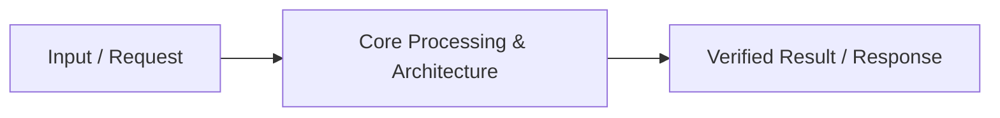

# 📹 How to Use LLM Leaderboards

<div className="video-card" style={{border: '1px solid #30363d', borderRadius: '8px', padding: '16px', marginBottom: '24px', background: 'rgba(56, 139, 253, 0.05)'}}>
  <div style={{display: 'flex', gap: '16px', flexWrap: 'wrap'}}>
    <div><strong>Instructor:</strong> Nitish Singh (CampusX)</div>
    <div><strong>Duration:</strong> 30m 7s</div>
    <div><strong>Playlist:</strong> LLM Evaluation Complete Series (CampusX)</div>
    <div><strong>Watch Link:</strong> <a href="https://www.youtube.com/watch?v=SoZPmKb5uGc" target="_blank" rel="noopener noreferrer">YouTube Lecture ↗</a></div>
  </div>
</div>

## 📌 Executive Summary & Learning Objectives

This lecture covers **How to Use LLM Leaderboards**, focusing on production implementations, edge cases, and industry standards:
- Core intuition, architecture, and underlying mechanisms.
- Key differences between theoretical research implementations and scalable enterprise patterns.
- Concrete Python walkthroughs, error recovery, and performance optimization.

---

## 🏗️ Architecture & Conceptual Workflow



---

## 📖 Core Concepts & Technical Deep Dive

### 1. Architectural Foundations
In modern production AI engineering, **How to Use LLM Leaderboards** is essential for ensuring reliability, low latency, and deterministic outcomes. As AI systems evolve from naive prompt-in / completion-out scripts into distributed systems, engineers must handle:
- **State management & consistency:** Ensuring intermediate states and tool invocations are tracked.
- **Error boundaries & recovery:** Graceful degradation when external LLMs or vector stores encounter rate limits or network partitions.
- **Resource utilization & cost efficiency:** Caching common queries and reducing unnecessary foundation model token expenditure.

### 2. Operational Considerations
- **Latency Optimization:** Pre-computing embeddings, utilizing asynchronous non-blocking event loops, and streaming tokens via Server-Sent Events (SSE).
- **Security & Sandboxing:** Validating inputs before ingestion, sanitizing LLM outputs, and isolating tool execution environments.

---

## 💻 Production Implementation Walkthrough

```python
# Production Implementation Blueprint
def run_production_pipeline():
    print("Executing production pipeline...")

if __name__ == "__main__":
    run_production_pipeline()
```

---

## 💡 Production Best Practices & Tips

:::tip Production Deployment Guideline
When deploying How to Use LLM Leaderboards in enterprise environments, always configure automated retries with exponential backoff and telemetry tracing (such as OpenTelemetry or LangSmith).
:::

:::warning Common Failure Modes
Watch out for state contamination across concurrent requests. Ensure each session or user interaction uses an isolated thread ID or execution context.
:::

---

## 🎯 Key Takeaways & Quick Reference

| Dimension | Production Standard | Pitfall to Avoid |
| :--- | :--- | :--- |
| **Execution** | Async / Non-blocking with timeouts | Synchronous blocking calls in event loops |
| **Data Validation** | Strict Pydantic v2 schemas | Untyped dictionary access |
| **Monitoring** | Distributed tracing & latency percentiles | Relying only on standard console logs |

## ⏱️ Lecture Timeline & Key Topics

| Timestamp | Key Topic / Concept Discussed |
| :--- | :--- |
| **00:00:00** | कोई बताएगा स्टार्ट करने के पहले लीडर... |
| **00:07:35** | लेवल पे अभी ऑपरेट कर रहे हैं क्या कोई... |
| **00:15:13** | सकते हो। तो नॉर्मल चैट में कर सकते हो।... |
| **00:22:40** | कोई लीडर बोर्ड को देख रहे हो तो जितना... |
| **00:30:06** | लेंगे।... |


---

---

## 📜 Complete Lecture Transcript (Hindi / Hinglish)

> **Language:** Hindi / Hinglish | **Source:** `10 - How to Use LLM Leaderboards ｜ CampusX.hi.srt` | **Total Segments:** 16 | **Word Count:** ~5,596 words

<details>
<summary><b>Click to expand full chronological transcript (16 timestamped intervals)</b></summary>

#### ⏱️ [00:00 ➔ 00:02]

कोई बताएगा स्टार्ट करने के पहले लीडर बोर्ड्स क्या होते हैं? एलएलएम लीडर बोर्ड्स कहीं देखे हैं आपने? अगर देखा है तो किसी लीडर बोर्ड का नाम बताओ जो आपने देखा है या यूज करते हो अपनी कंपनी में या अपने डे टू डे काम में। कैन एनीवन टेल मी लीडर बोर्ड्स क्या है? बेंचमार्क्स तो समझ में आ गया। बेंचमार्क्स आर बेसिकली टेस्ट। लीडर बोर्ड्स क्या हैं? एनीवन? बहुत सिंपल है ना? मतलब बेंचमार्क्स क्या होते हैं? बेंचमार्क्स किसी एक पर्टिकुलर आस्पेक्ट में एलएलएम्स को टेस्ट करने का एग्जाम होता है। अब एग्जाम देने के बाद रिजल्ट आता है। अब रिजल्ट को कहीं तो पब्लिश करोगे ना। कहीं तो दिखाओगे ना वो जगह क्या है? वो है आपके लीडर बोर्ड्स। राइट? जैसे आपके स्कूल में लीडर बोर्ड्स होते हैं जो बताते हैं कि किन लोगों ने टॉप किया या जो भी था। सो यहां पर एक सिंपल डेफिनेशन लिखा हुआ है। एन एलएलएम लीडर बोर्ड इज अ पब्लिक रैंकिंग और कंपैरिजन टेबल दैट शोज़ हाउ डिफरेंट एलएलएम्स परफॉर्म ऑन अ कॉमन सेट ऑफ इवैल्यूएशंस। सो बेंचमार्क का जो रिजल्ट है उसी को निकाल के हम लीडर बोर्ड पर शो करते हैं और लीडर बोर्ड एक सिंगल जगह हो जाती है जहां पर हम अलग-अलग मॉडल्स को एक जगह पे एक बेंचमार्क के ऊपर कंपेयर कर सकते हैं। सो दैट हमें तुरंत एक ओवरव्यू मिल जाए कि इस बेंचमार्क में सबसे बढ़िया मॉडल कौन सा है? दैट्स द बेसिक आईडिया ऑफ़ अ लीडर बोर्ड। लीडर बोर्ड्स एकिस्ट क्यों करते हैं? एक रीज़न तो मैंने अभी बता दिया दैट वी कंपेयर मॉडल्स अक्रॉस लैब्स विद अ कॉमन रेफरेंस। सेम एग्जाम दिया सारे मॉडल्स ने। कौन टॉप आया, कौन सेकंड आया, कौन लास्ट आया। ये पता चल जाता है। उससे हमें समझ में आ जाता है कि हमें किसको यूज़ करना है अपने एप्लीकेशन में। सेकंड लीडर बोर्ड्स आल्सो प्रोवाइड ट्रस्ट। जनरली लीडर बोर्ड्स थर्ड पार्टी होते हैं। मतलब ओपन एआई या फिर क्लॉड खुद से बोले अगर कि हमने इस बेंचमार्क पे इतना स्कोर किया। तो आप शायद उतना ट्रस्ट नहीं करोगे। बिकॉज़ ऑब्वियसली ओपन एआई चाहेगा कि

#### ⏱️ [00:02 ➔ 00:04]

उसके मॉडल की ज्यादा तारीफ हो। बट अगर एक थर्ड पार्टी आके बोले कि हमने एक एग्जाम के ऊपर क्लॉड को भी टेस्ट किया है, ओपन एआई को भी टेस्ट किया है। एंड दीज़ आर द रिजल्ट्स। तो आप ज्यादा बिलीव करोगे बिकॉज़ थर्ड पार्टी है उसका स्टेक्स उतना हाई नहीं है जितना ओपन एआई और क्लॉड का है। ठीक है? तो ये एक पर्पस है लीडर बोर्ड्स के एकिस्ट करने का। सेकंड इट गाइड्स मॉडल सेक्शन व्हेन यू डोंट हैव रिसोर्सेज टू रन इव्स योरसेल्फ। राइट? आप एक चार्टबॉट बनाना चाह रहे हो जो मैथ्स की कैपेबिलिटीज़ रखता हो। आपके स्टूडेंट्स ऐसे हैं तो ऑब्वियसली आप चाहोगे कि मैं खुद टेस्ट करूं अ इवैल्यूएशन को। बट क्या आपके लिए ये पॉसिबल है कि आप 100्स ऑफ़ मॉडल्स जो एकिस्ट करते हैं अभी दुनिया में उन सबको टेस्ट करो। नहीं है ना पॉसिबल? देयर आर सो मेनी मॉडल्स। आपको एक मॉडल सेलेक्ट करना है। तो आपका काम क्या हो गया कि आप 100 मॉडल्स को लेके आओ और 100 के 100 के ऊपर वो इवैल्यूएशंस चला के देखो। इट विल टेक अ लॉट ऑफ़ अ मनी। राइट? बहुत ज्यादा मनी लगेगा। बहुत ज्यादा टाइम एफर्ट सब लगेगा। कोई और आपके लिए ये कर रहा है तो आपके लिए काम आसान हो गया। आप सिंपली उस लीडर बोर्ड पे जाओ। उसमें से टॉप 10 को उठा लो और उसमें से कोई अपना मॉडल पिक कर लो। तो दिस इज़ द सेकंड बेनिफिट। थर्ड इसकी हेल्प से हमें यह पता चलता है कि क्या कोई बेंचमार्क सैचुरेट तो नहीं कर गया। अगर बहुत सारे टॉप मॉडल्स सेम स्कोर के आसपास सैचुर क्लस्टर करने लग जाए। एक बेंचमार्क है जो एक नॉलेज कैपेबिलिटी को टेस्ट करता है। वहां पे टॉप 10 एलएलएम्स का स्कोर 92 से 94 के बीच में है। तो जैसे ही क्लस्टरिंग दिखने लग गई एलएलएम लीडर बोर्ड पे हमें समझ में आ गया कि ये बेंचमार्क सैचुरेट कर रहा है। तो वो भी एक पर्पस है जिसके लिए लोग एलएलएम लीडर बोर्ड्स को यूज़ करते हैं। एंड द फोर्थ वन इज़ आल्सो वैरी यूज़फुल। मैं बहुत यूज़ करता हूं। उसके लिए मैं 2022-23 से ये काम कर रहा हूं कि मुझे कभी भी नए मॉडल्स डिस्कवर करने होते हैं तो उसके लिए

#### ⏱️ [00:04 ➔ 00:06]

मैं एलएलएम लीडर बोर्ड्स को यूज़ करता हूं। बिकॉज़ जनरली टॉप थ्री फोर तो वही रहते हैं अपने Google ओपन एआई और आपका एंथ्रोपिक वाले मॉडल्स ही रहते हैं। बट थोड़ा आप नीचे स्क्रॉल करोगे ना तो 10 12 15 20 इधर आते-आते आपको नए मॉडल्स दिखने लग जाते हैं। और ये मॉडल्स बेस्ट नहीं होते बट आपके पर्पस के लिए काम आ सकते हैं। बिकॉज़ दे आर जनरली चीपर। तो नए मॉडल्स डिस्कवर करने में भी एलएलएम लीडर बोर्ड्स आपका हेल्प करते हैं। अगर बात की जाए कि एलएलएम लीडर बोर्ड्स को कौन-कौन यूज करता है और किस-किस पर्पस के लिए यूज़ करता है तो तीनचार स्टेक होल्डर्स हैं यहां पे। सबसे पहले हैं एआई इंजीनियर्स। आपके और मेरे जैसे लोग जिनको एलएलएम बेस्ड एप्लीकेशनेशंस बनाने हैं। और हम लोग एलएलएम लीडर बोर्ड्स को यूज़ करते हैं शॉर्टलिस्टिंग करने के लिए। मुझे एक एप्लीकेशन बनाना है जो मैथ्स के डोमेन में है। तो मैं मैथ्स वाले लीडर बोर्ड पे जाऊंगा और वहीं से अपने कैंडिडेट मॉडल्स को सेलेक्ट करूंगा। जनरली आप लीडर बोर्ड से एक सिंगल मॉडल सेलेक्ट नहीं करते। आप कैंडिडेट मॉडल सेलेक्ट करते हो। फिर उसके ऊपर आप अपने इव्स रन करते हो और वहां से आपको अपना बेस्ट मॉडल मिलता है जो आप यूज़ करोगे एक एप्लीकेशन को बनाने में। तो 100 से पांच फिल्टर करने में एलएलएम लीडर बोर्ड्स आपकी हेल्प करते हैं। सेकंड फ्रंटियर लैब्स भी लीडर बोर्ड्स को काफी यूज़ करते हैं। बिकॉज़ एक तो उससे ये पता चलता है कि वो कहां पे लाई कर रहे हैं, कहां पे एक्सिस्ट कर रहे हैं। और सेकंड उससे ये पता चलता है कि उनको अपने अगले मॉडल्स को रिलीज़ करना भी चाहिए कि नहीं। फॉर एग्जांपल मेरा मैं ओपन एआई हूं। मेरा करंट मॉडल है GPT 5.5 ठीक है और सामने से OPS का 4.8 है। एक पर्टिकुलर बेंचमार्क में मैंने देखा कि मैं जो अगला मॉडल ट्रेन कर रहा हूं वो OPS के 4.8 को भी बीट नहीं कर पा रहा। तो क्या मैं रिलीज़ करूंगा उस मॉडल को? मैं नहीं करूंगा। मैं बोलूंगा कि मैं नया मॉडल रिलीज़ करूंगा और लोग तुरंत बोलेंगे कि ये तो OPS 4.8 जो पिछला मॉडल है उनका उससे भी खराब है। तो मेरी बैड

#### ⏱️ [00:06 ➔ 00:08]

मार्केटिंग हो गई। तो मैं रादर देन रिलीजिंग दैट आइट्रेशन मैं फिर और नेक्स्ट आइट्रेशन पे जाऊंगा और तब रिलीज़ करूंगा जब मुझे दिखेगा कि हां मैं बेंच लीडर बोर्ड में बाकियों को सिग्निफिकेंटली पीछे कर पा रहा हूं और ये एक्चुअली किया जाता है। इंटरनली दे प्लान एंड स्ट्रेटजाइज कि कब कौन सा रिलीज़ उनको लेके आना है मार्केट में। दे कॉन्सेंटली चेक कि लीडर बोर्ड पे अभी वो कहां पे लाई कर रहे हैं। सो देखा ही होगा आपने। कई बार क्या होता है कि अ हिडन नेम से अ लीडर बोर्ड पे कुछ मॉडल्स आते हैं। देखा आपने कभी? नैनो बनाना सुना ही होगा आपने। नैनो बनाना का इतना फनी नाम क्यों है? बिकॉज़ इनिशियली जब वो आया था तो वो स्टेल्थ मोड में आया था किसी ये इमेज वाले लीडर बोर्ड में और उन्होंने ये बताया नहीं था कि Google का मॉडल है। बस एक नया मॉडल आया था नैनो बनाना के नाम से और एकदम फोड़ के रख दिया सारे बेंचमार्क्स को। तो जब उन्होंने देखा कि हां एकदम सब कुछ सिग्निफिकेंटली बीट कर रहा है तब वो फिर उसको रिलीज करते हैं लोगों के सामने तो वहां पर Google ने फिर बोला कि यार नैनो बनाना इतना फेमस हो गया है मार्केटिंग हो गई है तो नैनो बनाना ही रख लेते हैं तो फ्रंटियर लैब्स के लिए बहुत अच्छी चीज है लीडर बोर्ड्स रिस्चरर्स भी इसको काफी यूज़ करते हैं क्योंकि रिसर्च को काफी कुछ पता चलता है कि अभी हो क्या रहा है कौन से बेंचमार्क्स सैचुरेट हो गए हैं कौन से बेंचमार्क्स पे अच्छा काम चल रहा है तो उसके बेसिस पे दे आर एबल टू फाइंड आउट न्यू टेक्निक्स न्यू आई आइडियाज दे कम अप विद बेसिकली नया रिसर्च डायरेक्शन मिलता है लोगों को इन लीडर बोर्ड्स की हेल्प से पॉलिसी मेकर्स एंड सेफ्टी इंस्टट्यूट्स इनका भी बहुत स्टेक्स है यहां पे दे कॉन्सेंटली मॉनिटर कि कौन से मॉडल किस लेवल पे अभी ऑपरेट कर रहे हैं क्या कोई नया मॉडल ऐसा तो नहीं आ गया जो बाकी सबको बहुत पीछे छोड़ दे रहा है तो वहां पे दे हैव टू कम इंटू द पिक्चर दे हैव टू स्टॉप और दे हैव टू बेसिकली वो बीच में आके चेंजेस करने की कोशिश करते हैं ये फेबल फाइव के साथ जैसा हुआ यूएस गवर्नमेंट आ गई तुरंत क्योंकि उनको उनको दिखा कि दिस मॉडल इज डेंजरस। एंड लास्टली जो आपकी ओपन सोर्स कम्युनिटी है उसके लिए भी लीडर बोर्ड्स

#### ⏱️ [00:08 ➔ 00:10]

बहुत अच्छा काम करते हैं। बिकॉज़ लीडर बोर्ड्स की हेल्प से डिस्कवरी होती है। जो मैंने बोला कि मैं खुद डिस्कवरी के लिए लीडर बोर्ड्स यूज़ कर रहा हूं। मेरे जैसे और बहुत सारे लोग हैं जो इस तरह के नए मॉडल्स को इस तरह के लीडर बोर्ड्स पे जाके खोजते हैं। तो कोई एक नया रिसर्च लैब है जिसमें 101 लोग हैं और उनका एक नया उन्होंने एक छोटा सा प्यारा सा मॉडल रिलीज़ किया जो एक सिंगल बेंचमार्क पे बहुत अच्छा स्कोर करके टॉप तीनचार में चला गया। तो उस लैब की तो पब्लिसिटी हो गई। वो मॉडल तो एकदम फेमस हो गया ना। इसी तरीके से पिक्चर में आए थे ये लोग आपके जो भी ये चाइनीस लैब्स हैं ये सब पिक्चर में ऐसे ही आए कि सडनली से एक नया मॉडल रातोंरात आया और वो किसी एक बेंचमार्क में एकदम टॉप मॉडल को टक्कर देने लग गया तो उसकी डिस्कवरी हो गई पब्लिसिटी हो गई मार्केटिंग हो गई तो उस सेंस में भी एलएलएम लीडर बोर्ड्स आर ग्रेट सो आई होप आपको अभी तक ये समझ में आ गया लीडर बोर्ड्स क्या होते हैं क्यों एकिस्ट करते हैं और कौन-कौन उसका काम लेता है अब एक बार जल्दी से डिस्कस करते हैं कि व्हाट आर द डिफरेंट टाइप्स ऑफ लीडर बोर्ड्स दैट एकिस्ट। ठीक है? तो प्रिसाइज़ली देयर आर फोर टाइप्स ऑफ लीडर बोर्ड्स जो आपको देखने को मिलेंगे। सबसे पहला और सबसे सिंपल लीडरबोर्ड होता है बेंचमार्क स्पेसिफिक लीडर बोर्ड्स। सो यहां पर आपका जो लीडरबोर्ड है वो सिर्फ एक सिंगल बेंचमार्क के बेसिस पे रैंकिंग क्रिएट करता है। यहां लिखा हुआ है दीज़ रैंक मॉडल्स यूजिंग द रिजल्ट ऑफ वन पर्टिकुलर बेंचमार्क। या तो वो एमएमएलयू है या ह्यूमन इवाल है कोडिंग के लिए या जीएसएम 8 के है मैथ्स के लिए या फिर जीपीक्यू है कोई एक सिंगल बेंचमार्क पे सारे मॉडल्स को चला के देखेगा और वो रैंकिंग एक लीडर बोर्ड के फॉर्म में आपको दिखाई जाएगी। सो द मेन आईडिया इज ये बताना कि व्हिच मॉडल परफॉर्म्स बेस्ट ऑन दिस बेंचमार्क। ठीक है? द ओनली प्रॉब्लम वि दिस काइंड ऑफ लीडर बोर्ड इज कि ये आपको एक बहुत नैरो व्यू देते हैं। कोई एक बेंचमार्क पे कोई मॉडल कैसा परफॉर्म कर रहा है। बस आपको ये पता चलता है। ओवरऑल मॉडल कैसा है इसके बारे में आपको आईडिया नहीं लगता। इसका एक बहुत अच्छा एग्जांपल है। ऑलरेडी मैंने आपको दिखा भी दिया। जैसे ये है HLE का वेबसाइट है। ह्यूमैनिटीज़

#### ⏱️ [00:10 ➔ 00:12]

लास्ट एग्जाम। तो ये उसका लीडर बोर्ड है। यू कैन सी कि जेमिनाई 3 Pro 38% पे है और कैलिबेशन एरर वगैरह सब दिखा रहा है। तो ये एक ऐसा लीडर बोर्ड है जो एक सिंगल बेंचमार्क को कैटर कर रहा है। तो मोस्ट ऑफ द फेमस बेंचमार्क्स हैव देयर ओन लीडर बोर्ड्स। ये जो रिसर्च टीम्स हैं यही अपने दम पे ये पूरा का पूरा लीडर बोर्ड बनाती हैं और मेंटेन करती हैं। बहुत ज्यादा यूज़फुल नहीं होते इस तरह के लीडर बोर्ड्स। ऑनेस्टली यूज़फुल होता है ये सेकंड कैटेगरी जहां पे आप मल्टी बेंचमार्क लीडर बोर्ड्स के बारे में पढ़ोगे। नाम से समझ में आ रहा है? ये ऐसे लीडर बोर्ड्स हैं जो एक साथ मल्टीपल बेंचमार्क्स के रिजल्ट्स को लाके एक क्यूम्युलेटिव स्कोर देके लीडर बोर्ड क्रिएट करते हैं। सो यहां लिखा हुआ है दीज़ लीडर बोर्ड्स कंपेयर मॉडल्स अक्रॉस मल्टीपल बेंचमार्क्स एंड इवैल्यूएशन डायमेंशंस इंस्टेड ऑफ़ रिलाइंग ऑन जस्ट वन टेस्ट। तो ऐसा हो सकता है कि कोई बेंच कोई लीडर बोर्ड हो जो नॉलेज रीजनिंग मैथमेटिक्स कोडिंग इंस्ट्रक्शन फॉलोइंग डेटा एनालिसिस ये सारे बेंचमार्क्स को मिला करके एक लीडर बोर्ड बनाए। इसका एक एग्जांपल मैं आपको दिखाता हूं। इसका एक बहुत अच्छा एग्जांपल है लाइव बेंच। ये देखो यहां लिखा हुआ है अ चैलेंजिंग कंटैमिनेशन फ्री एलएलएम बेंचमार्क जिसमें 23 ऑब्जेक्टिव टास्क हैं अक्रॉस सेवन कैटेगरीज अ रीजनिंग कोडिंग एजेंटिक कोडिंग हर में स्कोर कितना है ये बताया हुआ है हर मॉडल का और फिर एक ओवरऑल स्कोर भी आपको बताया गया है। तो दिस इज़ लाइक अ मोर यूज़फुल लीडर बोर्ड बिकॉज़ ये आपको एक ओवरऑल व्यू दे रहा है कि एक मॉडल इन जनरल मल्टीपल कैपेबिलिटीज में कैसा है। आई होप आपको समझ में आ रहा है। एंड नॉट ओनली दिस यह लीडर बोर्ड्स और भी एस्पेक्ट्स पर आपको इंफॉर्मेशन देते हैं। जैसे कि कॉस्ट पर टोकन कितना है? लेटेंसी कितना है? आउटपुट स्पीड कितना है? कॉन्टेक्स्ट विंडो का साइज कितना है? ये सारा इंफॉर्मेशनेशन भी

#### ⏱️ [00:12 ➔ 00:14]

देते हैं। तो इसका भी एक एग्जांपल दिखाता हूं। जैसे ये है आर्टिफिशियल एनालिसिस बोल के एक कंपनी है। लाइक इनका काम ही है लीडर बोर्ड्स बनाना और इस तरह का इनेशन प्रोवाइड करना। तो ये आपको हर तरह की चीज के ऊपर लीडर बोर्ड्स बना के देते हैं। ये देखो इंटेलिजेंस का इनका अलग लीडर बोर्ड है। स्पीड का अलग लीडर बोर्ड है। कॉस्ट पर टास्क का अलग अलग लीडर बोर्ड है। लाइक बहुत ही एग्जॉस्टिव लिस्ट है। देखो एचएलई का इन्होंने अलग बना के दे दिया। जीपीक्यू है। डायमंड का अलग बना के दे दिया। तो यह ऐसी कंपनीज़ है जो आपको बेसिकली हर तरह का लीडर बोर्ड बना के दे रही हैं। तो दे आर लाइक अ प्रॉपर प्रोडक्ट कोडिंग एजेंट्स का इनका अलग लीडर बोर्ड है। स्पीच, इमेज, ऑडियो, हार्डवेयर। सो अ लॉट ऑफ़ लीडर बोर्ड्स आर देयर। फिर उन्होंने ओवरऑल भी बना दिया सब कुछ को क्यूमुलेट करके। तो यह सबसे यूज़फुल कैटेगरी है जो पर्सनली मैं भी सबसे ज्यादा यूज करता हूं और लोग भी सबसे ज्यादा यूज करते हैं। इस तरह के लीडर बोर्ड्स इस क्वेश्चन का आंसर करते हैं। व्हिच मॉडल प्रोवाइड्स द स्ट्रांगेस्ट ओवरऑल कॉम्बिनेशन ऑफ़ कैपेबिलिटी कॉस्ट एंड परफॉर्मेंस। दिस इज़ द लीडर बोर्ड दैट यू विल यूज़ द मोस्ट। ठीक है? थर्ड एक और इंटरेस्टिंग कैटेगरी होता है। इसको बोलते हैं ह्यूमन प्रेफरेंस बेस्ड लीडर बोर्ड्स। इसमें ना आप किसी बेंचमार्क के बेसिस पे रैंक नहीं बनाते। आप क्या करते हो? आप कंपैरिजन करवाते हो। सो आपका यूजर आता है आपकी वेबसाइट पे। आप उसको बोलते हो कि एक क्वेश्चन पूछो। वो सेम क्वेश्चन दो मॉडल से पूछा जाता है। ए और बी। दोनों का आंसर आता है। अब यूजर से बोलते हैं कि आपको ए वाला अच्छा लगा या बी वाला अच्छा लगा? तो बेसिकली आप खुद यूजर स्कोर कर रहा है ऑन द बेसिस ऑफ़ हेल्पफुलनेस, क्लेरिटी, राइटिंग क्वालिटी, क्रिएटिविटी जो भी आंसर देने के तरीके हैं उसके ऊपर और फिर जब बहुत सारे इस तरह के वोट्स कलेक्ट हो जाते हैं तो उसके बेसिस पे फिर एक रैंकिंग बनाई जाती है और वो रैंकिंग इस लीडर बोर्ड में दिखाई

#### ⏱️ [00:14 ➔ 00:16]

जाती है। यहां लिखा हुआ है दीज़ रैंक दीज़ रैंक मॉडल्स यूजिंग ह्यूमन वोट्स। दो मॉडल से उन्होंने रिस्पांस ले लिया। यूजर को बोला कौन सा है सेलेक्ट करो और बहुत सारे वोट्स होने के बाद यह लीडर बोर्ड हमें दिखाता है कि कौन सा मॉडल टॉप पे है। तो इसका बहुत फेमस एग्जांपल है एलएम एरेना। ये देखो बैटल मोड में कुछ भी आप पूछ लो व्हाट आर एलएम लीडर बोर्ड्स। तो अब दो मॉडल्स हैं बिहाइंड द सीन्स। मुझे नहीं पता कौन से मॉडल्स हैं और वो अपना-अपना आंसर देंगे यू कैन सी। और एक बार जब वो आंसर दे देंगे मैं दोनों पढूंगा और मुझसे पूछा जाएगा इनमें से कौन सा आपको अच्छा लगा। देखो ये पूछ रहा है ए इज़ बेटर बोथ आर गुड बोथ आर बैड बी इज़ बेटर। अब मैंने पढ़ा नहीं है। लेट्स से मैंने बोल दिया B इज़ बेटर। तो अब वो रिवील करेगा कि कौन सा है। देखो ये था क्लॉड OPS 4.8 सर्च और ये फेबल था। अब इस तरह के वो दिन भर दुनिया भर में लोगों से वोट्स कलेक्ट करते-करते ये लीडर बोर्ड बनाते हैं। फिर दिस इज़ द लीडर बोर्ड। सो दिस इज़ द करंट रैंकिंग। फेबल फाइव 5.6 सोल 4.8 थिंकिंग और ये अलग-अलग कैटेगरीज़ में आप कर सकते हो। तो नॉर्मल चैट में कर सकते हो। कोड का अलग है, इमेज का अलग है, वीडियो का अलग है। तो ये भी एक टाइप ऑफ लीडर बोर्ड है जो अब एकिस्ट करता है और बहुत फेमस है। जो लिमिटेशन है इस तरीके का वो ये है कि जरूरी नहीं है कि किसी यूजर को अगर एक आंसर बेटर लग रहा है तो वो आंसर सच में बेटर हो भी। कई बार हम ह्यूमंस पट जाते हैं कि बहुत अच्छे से फॉर्मेट करके दिया है या फिर थोड़ा ऐसा आंसर दिया है जो मुझे पसंद आ रहा है पर्सनली। तो थोड़ा ना यहां पे ह्यूमन बायस होता है। बट अगेन एट स्केल हो रहा है। दुनिया भर के लोग कर रहे हैं। तो फिर भी आप ट्रस्ट कर सकते हो। एंड दैट इज़ व्हाई यू कैन सी कि जो टॉप मॉडल्स हैं वही इन लीडर बोर्ड्स में भी लीड कर

#### ⏱️ [00:16 ➔ 00:18]

रहे हैं। एंड द लास्ट टाइप ऑफ लीडरबोर्ड्स आर एप्लीकेशन स्पेसिफिक लीडर बोर्ड्स। ये ऐसे लीडर बोर्ड्स हैं जो एक पर्टिकुलर डोमेन या काम के अराउंड बिल्ड किए जाते हैं। जैसे कि कोडिंग का एक डेडिकेटेड लीडर बोर्ड हो। तो कोडिंग में जितने बेंचमार्क्स होते हैं उन सबका कॉम्बिनेशन से उन्होंने एक सिंगल स्कोर बनाया और वो यहां पे दिखाया जा रहा है। या फिर आप एजेंटिक टास्क के लिए अलग एक लीडर बोर्ड बना रहे हो। या फिर आप सीक्वल क्वेरीज को जनरेट करने के लिए अलग लीडर बोर्ड बना रहे हो या मेडिकल क्वेश्चंस के लिए अलग लीडर बोर्ड बना रहे हो। तो इस तरह का एक एग्जांपल अगर मैं आपको दिखाऊं तो ये एक लीडर बोर्ड है बर्कली फंक्शनल कॉलिंग लीडर बोर्ड। तो यह एक लीडर बोर्ड है जो स्पेसिफिकली यह बताता है कि आपके मॉडल की टूल कॉलिंग की कैपेसिटी कितनी अच्छी है। तो उसके बेसिस पे ये मॉडल्स को रैंक करता है। तो ये एक सिंगल डोमेन में ऑपरेट कर रहा है। भले ही ये मल्टीपल बेंचमार्क्स को यूज़ कर रहा है बट इन अ सिंगल डोमेन। तो इस टाइप के भी बहुत सारे होते हैं। कोडिंग के भी अलग बेंचमार्क्स हैं। तो अलग-अलग इस तरह के बेंचमार्क्स भी होते हैं। सो यही चार टाइप्स आपको देखने को मिलेंगे। सबसे कम यूज़फुल है सिंगल बेंचमार्क वाला लीडरबोर्ड। सबसे ज्यादा यूज़फुल है मल्टीपल बेंचमार्क जनरल कैपेबिलिटी मेजर करने वाला लीडरबोर्ड जो आपको और बहुत सारी चीजें बताएं। कॉस्ट, लेटेंसी, एवरीथिंग। अ ह्यूमन बेस्ड भी मतलब इट्स पॉपुलर मार्केटिंग करने के लिए बहुत होता है कि एलएम एरेना पे सबसे टॉप कौन सा है। बट या ये भी एक कैटेगरी एक्सिस्ट करती है। एंड द लास्ट वन इज़ आपके एप्लीकेशन के स्पेसिफिक भी कैटेगरीज होती हैं लीडर बोर्ड की। वो भी आप यूज करते हो अगर आप लेट्स से एक पर्टिकुलर डोमेन का एप्लीकेशन बना रहे हो। दीज़ आर द फोर टाइप्स ऑफ अ लीडर बोर्ड्स दैट यू विल फाइंड ऑन इंटरनेट। ठीक है? अ चलो आगे भी एक बार पढ़ लेते हैं। फिर एक ही साथ क्यूएनए कर लेंगे। ठीक है? अगली चीज़ हालांकि लीडर बोर्ड्स बहुत तगड़ी चीज होती है और आपको एक साथ एक समराइज्ड

#### ⏱️ [00:18 ➔ 00:20]

ओवरव्यू देती है पूरे के पूरे एलएलएम लैंडस्केप का। बट आप ब्लाइंडली लीडर बोर्ड्स को ट्रस्ट नहीं कर सकते। ये एक बहुतेंट बात है। बिकॉज़ आप फ्यूचर में एआई इंजीनियर्स की तरह काम करोगे। एंड मोस्ट ऑफ द टाइम्स जब आप एक एप्लीकेशन बनाने जाओगे तो स्टेप वन होता है मॉडल सेलेक्शन। और मॉडल सेलेक्शन में भी स्टेप वन होता है लीडर बोर्ड्स में जाके देखना कि कौन सा मॉडल टॉप पे है। तो हम हमारे अंदर ये बायस आ जाता है कि लीडर बोर्ड पे है तो फिर सही होगा। बट ऐसा नहीं है। यू कैन नॉट ब्लाइंडली ट्रस्ट लीडर बोर्ड्स। क्या रीज़ंस हैं, वह हम डिस्कस कर रहे हैं। सबसे पहला रीज़न यह है कि बेंचमार्क परफ़ॉर्मेंस मे नॉट ट्रांसफर टू रियल एप्लीकेशनेशंस। यह एक बहुत इंपॉर्टेंट बात है। जनरली लीडर बोर्ड में कोई मॉडल अगर 80 90 हिट कर रहा है। इट डज़ नॉट मीन कि आपके रियल एप्लीकेशन में भी वो उतना ही अच्छा आपको रिजल्ट्स देगा। वो एक बात जैसे बहुत फेमस थी ना कि CG पे प्रॉब्लम सॉल्व कर लोगे। इट डज़ नॉट मीन कि आप रियल लाइफ में अच्छे डेटा साइंटिस्ट बन जाओगे। क्यों ऐसा बोला जाता था? बिकॉज़ कैगल पे जो डेटा आपको दिया जाता है वो बहुत ही क्लीन डेटा दिया जाता है। प्रॉब्लम स्टेटमेंट बहुत क्लियर होती है। तो जनरली आपको काम आसान मिलता है। रियल वर्ल्ड में एवरीथिंग इज़ मेसी। तो यहां पे भी सेम बात है। बेंचमार्क्स में जो डेटा है जनरली क्लीनड है। उसके ऊपर मॉडल्स अच्छा परफॉर्म करेंगे ही करेंगे। रियल वर्ल्ड में बहुत सारी चीजें होती हैं। ए्बगुएस रिक्वेस्ट, मिसिंग इनेशन, कंपनी स्पेसिफिक डेटा, टूल फेलियर, अनयूजुअल एज केसेस इन सबको मॉडल वैसे हैंडल करे ना करे डोंट नो। सो या दिस इज द फर्स्ट रीज़न। सेकंड जैसा हमने डिस्कस किया था बेंचमार्क्स बहुत आसानी से कंटैमिनेट होते हैं और बेंचमार्क्स कंटैमिनेट होंगे तो उनका लीडर लीडर बोर्ड स्कोर भी कंटैमिनेट होगा और इनफ्लेटेड होगा। ज्यादा दिखाई देगा। तो ऐसा ब्लाइंडली ट्रस्ट मत करो। ऐसा हो सकता है कि जो स्कोर लीडर बोर्ड पे दिखाई दे रहा है वो जेन्युइन हो। बट ऐसा भी हो सकता है कि मॉडल ने मेमोराइज कर लिया है या फिर उसको ऑलरेडी इस तरह के क्वेश्चंस पता थे। तो यू कैन नॉट ट्रस्ट ब्लाइंडली। उसके बाद यह एक बहुत जेन्युइन

#### ⏱️ [00:20 ➔ 00:22]

प्रॉब्लम है और यह पिछले एक दो सालों में लोगों ने डिस्कस करना शुरू किया है कि मॉडल्स कैन बी ओवर ऑप्टिमाइज्ड फॉर द लीडर बोर्ड। कभी-कभी क्या होता है कि कोई पर्टिकुलर लीडर बोर्ड बहुत पॉपुलर हो जाता है। जैसे कि एलएम एरेना है। बहुत पॉपुलर हो गया कि एलएम एरेना पे कौन टॉप कर रहा है? तो अब क्या होगा कि कंपनीज़ को भी दिखता है कि सबसे ज्यादा बात होती है एलएम एरेना पे कौन टॉप कर रहा है? तो हमें टॉप करना है। अब एलएम एरेना पे टॉप कौन करेगा? जो ह्यूमंस को पटाएगा। ह्यूमंस को पटाने के लिए क्या करना पड़ेगा? थोड़ा इस तरह का हम फॉर्मेटिंग करेंगे। थोड़ा इस तरह से सॉफ्ट आंसर्स देंगे। थोड़ा चापलूसी वाले आंसर्स देंगे तो ज्यादा चांसेस है कि हमारे मॉडल को सेलेक्ट किया जाएगा, वोट किया जाएगा। तो अब वो लोग क्या करेंगे? अपनी ट्रेनिंग या फाइन ट्यूनिंग स्टेजेस में इस तरह का डेटा फीड कराएंगे अपने मॉडल को। सो दैट वो रादर देन एक्चुअल कैपेबिलिटी में अच्छा परफॉर्म करने के सिर्फ एलएम एरेना वाले तरह के सिचुएशनंस में अच्छा परफॉर्म करेगा। तो होगा क्या कि आपका मॉडल लीडर बोर्ड पर तो अच्छा स्कोर करने लग जाएगा बट उसकी रियल वर्ल्ड कैपेबिलिटीज इंप्रूव नहीं करेंगी। तो यहां पे एक लॉ है ये बहुत फेमस लॉ है गुड हार्ट्स लॉ। इसमें लिखा हुआ है व्हेन अ मेजर बिकम्स अ टारगेट इट बिकम्स लेस यूज़फुल एज अ मेजर। सो अगर आप एक मैट्रिक को टारगेट करने लग जाओ कि हम इस मैट्रिक को इंप्रूव करेंगे। आप मान लो एक गाड़ी हो और आप आपको पता है कि इंडिया में सिर्फ माइलेज को लेके लोग गाड़ी खरीदते हैं। तो अब आपकी पूरी इंजीनियरिंग टीम सिर्फ इस बात पे फोकस कर रही है कि हम माइलेज कैसे इंप्रूव करें? माइलेज कैसे इंप्रूव करें। तो पूरा का पूरा इंजीनियरिंग माइलेज के अराउंड होगा। लेकिन जो ओवरऑल कार है वो खराब हो जाएगी। क्योंकि आप ड्राइविंग डायनामिक्स 0 टू 100 कितने टाइम में पहुंचती है। इन तरह की चीजों पे आप फोकस ही नहीं कर रहे। आप सिर्फ माइलेज पे फोकस कर रहे हो। तो वही यहां पे लिखा हुआ है कि एक मैट्रिक को अगर आप टारगेट बना लेते हो तो फिर वो मैट्रिक अच्छा मैट्रिक नहीं रहता। तो वो होने लग गया है आजकल कि कंपनीज़ आर बिल्डिंग मॉडल्स सो दैट दे कैन टॉप द लीडर बोर्ड्स बट एक्चुअल परफॉर्मेंस

#### ⏱️ [00:22 ➔ 00:24]

फिर अच्छा नहीं रहता। उसके बाद ये भी एक इंपॉर्टेंट बात है स्पेशली उन लीडर बोर्ड्स के लिए जो मल्टीपल बेंचमार्क्स को जोड़ करके रिजल्ट्स आपको दिखाती हैं। अब वहां पे प्रॉब्लम क्या है कि वो लीडर बोर्ड कौन से बेंचमार्क्स को इंक्लूड कर रहा है? कौन से बेंचमार्क को एक्सक्लूड कर रहा है? वो लीडर बोर्ड के ऊपर है। उसके बाद स्कोर्स को कैसे नॉर्मलाइज किया गया है? अगर मान लो अलग-अलग कैपेबिलिटीज का हम एक ओवरऑल स्कोर कैलकुलेट कर रहे हैं तो हम हर कैपेबिलिटी को कितना वेटेज दे रहे हैं ये भी हमें नहीं बताया गया। तो इस तरह की चीजें छुपी हुई रहती हैं और वो कभी-कभी आपको परेशान कर सकती हैं। तो जभी भी आप कोई लीडर बोर्ड को देख रहे हो तो जितना उसमें ट्रांसपेरेंसी हो उतना अच्छा है। जितना आप पता कर पाओ उस लीडर बोर्ड के बारे में उतना अच्छा है। उसके बाद लीडर बोर्ड में छोटे बहुत डिफरेंसेस उतना मैटर नहीं करते। जैसे दो मॉडल्स हैं। एक का स्कोर है 84.3, एक का है 84.1 और ये मॉडल आ गया थर्ड पोजीशन पे और ये चला गया फिफ्थ पोजीशन पे। बट डिफरेंस तो टू का ही था ना। अब इससे यह समझ नहीं आता। हमें ऐसा लगने लगा कि यार थर्ड वाला पकड़े हम फोर फिफ्थ वाले को हम चूज़ नहीं करेंगे अपने एप्लीकेशन के लिए। बट देयर इज़ अ गुड चांस कि ये दोनों बहुत सिमिलर हैं। और फिफ्थ शायद आपके एप्लीकेशन के लिए ज्यादा अच्छा होता। तो कभी-कभी हम ज्यादा ही फोकस करने लग जाते हैं कि कौन से रैंक पे है मॉडल जो हम चूज़ कर रहे हैं। ये इस लीडर बोर्ड के इस रैंक पे है। तो रैंक का एक बायस हो जाता है। वो अच्छी बात नहीं है। अगर डिफरेंस कम है तो मॉडल्स एक ही लेवल के हैं। ये होती है बात। अब आईआईटी जेईई में रैंक वन और रैंक 25 में ज्यादा का डिफरेंस नहीं होगा। एक दो क्वेश्चंस किसी के भी गलत हो सकते हैं। राइट? तो वही लॉजिक यहां पे है। सिक्स्थ इज़ ह्यूमन प्रेफरेंस लीडर बोर्ड्स हैव ह्यूमन बायसेस। ये हमने ऑलरेडी डिस्कस कर लिया। अब एलएम एरेना है। अब यहां पर जो टॉप मॉडल है इट डस नॉट नेसेसरीली मीन कि वो ऑब्जेक्टिवली सबसे टॉप मॉडल है। ह्यूमंस को लंबे आंसर्स, ज्यादा कॉन्फिडेंट आंसर, बेटर फॉर्मेटेड आंसर्स, ज्यादा एंटरटेनिंग आंसर्स ज्यादा

#### ⏱️ [00:24 ➔ 00:26]

अच्छे लगते हैं। बट ऐसा हो सकता है ना कि जो ज्यादा अच्छा मॉडल है उसको ये सब नहीं आता है। तो फिर वो फेल कर जाएगा ह्यूमन वाले लीडर बोर्ड रैंकिंग में। तो दैट इज़ आल्सो अ प्रॉब्लम। एंड लास्टली लीडर बोर्ड स्कोर्स आर स्टेल इनकंप्लीट और सेल्फ रिपोर्टेड। अब जैसे यही एग्जांपल देख लो। हमने कौन सा डिस्कस किया था अभी? मैंने आपको दिखाया था ह्यूमैनिटीज लास्ट एग्जाम। अब यहां पे जेमिनाई 3 Pro है। इसमें 38.3 है। अब सबसे रीसेंट वाले मॉडल्स यहां पे आए नहीं है। कहां आपको दिखाई दे रहा है फेबल या 5.6 सोल नहीं है। क्योंकि इन लोगों ने अभी तक अपडेट ही नहीं किया। इन लोगों ने अपडेट ही नहीं किया। तो कई बार क्या होता है कि बेंचमार्क्स लीडर बोर्ड्स ना अपडेटेड नहीं होते हैं। पुराने मॉडल वर्जन के रिजल्ट्स मिलेंगे या नए वाले का नहीं मिलेगा या कई बार डिस्कंटिन्यूड मॉडल के रिजल्ट्स आपको मिलेंगे तो अच्छी बात नहीं है। कई बार कुछ लीडर बोर्ड्स में जो रिजल्ट्स होते हैं वो कंपनी अपनी अपने अपने ही मॉडल का रिजल्ट डाल देती है। तो वो भी अच्छी बात नहीं है। कंपनी खुद अपने रिजल्ट्स डाल रही है। तो क्यों ट्रस्ट करें? तो ये छह सात कुछ रीज़ंस है जिसकी वजह से आप ब्लाइंडली लीडर बोर्ड्स को ट्रस्ट नहीं करते। बट थोड़ा केयरफुली करते हो। इट्स अ यूज़फुल थिंग बट यू कैन नॉट बी ब्लाइंड। ठीक है? अ सो नाउ कम्स द लास्ट थिंग दैट वी हैव टू डिस्कस कि इफ यू आर एन एi इंजीनियर एंड यू आर बिल्डिंग अ एलएलएम बेस्ड एप्लीकेशन और आपका पहला काम है एक मॉडल को सेलेक्ट करना उसके लिए। तो आप एलएलएम लीडर बोर्ड्स को कैसे रीड करोगे? तो यह एक गाइडलाइन है जो मैं आपको जल्दी से बताता हूं। किसी भी लीडर बोर्ड पर जाने के पहले सबसे पहले आप ये चारप चीजें अपने दिमाग में क्लियर करो। आप किस टाइप का एप्लीकेशन बना रहे हो? कितना लेटेंसी चाहिए उस एप्लीकेशन में? कितना कॉस्ट आप बेयर कर सकते हो? आपकी कॉन्टेक्स्ट की नीड्स क्या है? क्या कोई डिप्लॉयमेंट कंस्ट्रेंट्स है कि नहीं? क्या मैं जनरल पब्लिकली अवेलेबल मॉडल्स यूज़ कर सकता

#### ⏱️ [00:26 ➔ 00:28]

हूं? हो या मुझे ऑन प्रमाइस मॉडल यूज़ करना है। ये सारी चीजें एकदम क्लियरली अपना लिख लो। ये अगर क्लियर हो जाएगा ना तो फिर आप बायस्ड नहीं होंगे टुवर्ड्स द रैंक वन मॉडल। ऑटोमेटिकली आप ऑब्जेक्टिवली सोचने लग जाओगे कि यार अब मेरे को अगर ऑन प्रिमाइस ही सेटअप करना है तो ऑब्वियसली आई कैन नॉट यूज़ क्लॉट फेबल। फिर मुझे थोड़ा ओपन सोर्स वाली तरफ जाना पड़ेगा। तो वो थोड़ा दिमाग खुल जाता है। स्टेप वन अगर ये रहे। स्टेप टू में अब आप ब्लाइंडली किसी भी लीडर बोर्ड पे नहीं जाओगे। आप वो लीडर बोर्ड पे जाओगे जो आपके काम से रिलेटेड है। कोई एजेंट बना रहे हो तो कोई एजेंट रिलेटेड लीडर बोर्ड में जाओगे। कोई चैटब बना रहे हो तो मे बी एलएम एरेना टाइप के लीडर बोर्ड पे जाओगे। बिकॉज़ वहां पे चैटिंग का आपको डायरेक्ट ऑब्जेक्टिव मेज़मेंट मिल रहा है। रैग बना रहे हो तो एमटीबी एमटीईबी में जाओगे। ये एक्चुअली एंबेडिंग मॉडल्स की रैंकिंग का लीडर बोर्ड है। रैग में आपको एंबेडिंग मॉडल लगाना पड़ता है। बजट कंस्ट्रेंट्स हैं आपके एप्लीकेशन में तो आप शायद आर्टिफिशियल एनालिसिस वाले या ये वेलम ये वाले लीडर बोर्ड में जाओगे। बिकॉज़ यहां पे आपको एग्जैक्ट इनेशन मिलता है कि कौन से मॉडल्स कितने फास्ट हैं और कितना पैसा खर्चा करते हैं। तो दिस इज़ स्टेप टू। आप सही लीडर बोर्ड के पास जाओ। उसके बाद रीड लीडर बोर्ड को करेक्टली रीड करो। मतलब आप हर चीज समझो। क्या चीज स्कोर की जा रही है? किस तरीके से स्कोर की जा रही है? किसने इवैल्यूएट किया है? कितना इनफेंस बजट था? रीजनिंग हो रही है नहीं हो रही है? इवैल्यूएशन डेटा सेट कब का है? कितना पुराना है? क्या वो अपडेट हो रहा है? क्या उसका प्राइवेट एक टेस्ट सेट मेंटेन किया जा रहा है कि नहीं? क्या जो बेंचमार्क है वो सैचुरेट हो गए हैं कि नहीं? कॉन्फिडेंस इंटरवल हमने डिस्कस किया था। छोटा डेटा सेट है तो कॉन्फिडेंस इंटरवल कितना है वो बताया भी गया है कि नहीं। अगर नहीं बताया गया है तो फिर दो बहुत क्लोज मॉडल्स आर इफेक्टिवली द सेम। अ अगर कॉम्पोजिट लीडर बोर्ड है मल्टीपल बेंचमार्क्स को जोड़ के एक स्कोर दे रहा है तो अलग-अलग

#### ⏱️ [00:28 ➔ 00:30]

कैपेबिलिटीज को क्या वेटेज दी गई है? ये सब कुछ आप एनालाइज करोगे। यहां पे बस बहुत सारे पॉइंटर्स लिखे हुए हैं। बट यू गेट द आईडिया। ब्लाइंडली एक नंबर है उस पे ट्रस्ट नहीं करना है। नीचे जो स्टार मार्क है ना उसको पढ़ना है। जैसे यहां पे की डेफिनेशंस आप देखोगे तो आप जाकर के पढ़ोगे ये सारी चीजें। ये फ्रीक्वेंटली आस्क क्वेश्चन पढ़ोगे तो आप बेटर पोजीशन में होगे उस लीडर बोर्ड को जज करने के। ठीक है? और फिर अपने क्राइटेरिया के बेसिस पे टॉप तीन से पांच मॉडल्स को आप शॉर्टलिस्ट करोगे। ठीक है? और जब आपके पास अपने पांच मॉडल्स आ गए तब आता है आपका फिफ्थ और सबसे इंपॉर्टेंट स्टेप कि आप उसके ऊपर अपना खुद का इवैल्यूएशन रन करोगे उन पांचों मॉडल्स के ऊपर और वो पांचों मॉडल्स जब अ आपके खुद के इवैल्यूएशन सेट पे रन होंगे और जो रिजल्ट्स वो देंगे तो आपको आपका टॉप कैंडिडेट मिलेगा। सो यहां पे एक लाइन जो आपको याद रखनी है वो ये है। दिस इज द मोस्टेंट लाइन दैट यू हैव टू टेक फ्रॉम दिस सेशन दैट लीडर बोर्ड्स आर नॉट अ सेलेक्शन टूल। लीडर बोर्ड्स आर अ फिल्टरिंग टूल नॉट अ डिसीजन टूल। मतलब लीडर बोर्ड पे जाके आप ये डिसाइड नहीं करते हो कि मैं ये एप्लीकेशन को ये मॉडल को यूज़ करूंगा अपने एप्लीकेशन को बनाने के लिए। नो वो गलत स्ट्रेटजी है। आप चार पांच टॉप मॉडल्स को शॉर्टलिस्ट करते हो विथ द हेल्प ऑफ लीडर बोर्ड्स और फिर सबके ऊपर अपने कस्टम इवल्स रन करके एक मॉडल को आप पिक करते हो अपने एप्लीकेशन के लिए। आई होप आपको समझ में आ रहा है और वही हम करने वाले हैं नेक्स्ट सेशन में। जो मैंने बोला ना कि अब आगे की क्लासेस प्रैक्टिकल होंगी। तो नेक्स्ट सेशन इज़ ऑल अबाउट हाउ डू यू रन योर कस्टम इवैल्यूएशन ऑन अ गिवन एलएलएम। वो हम नेक्स्ट क्लास में सीखेंगे। तो ये जो भी फ्लो मैंने आपको बताया है ये प्रैक्टिकली आप नेक्स्ट क्लास में करके देखोगे। बेंचमार्क्स हमने कर लिए मतलब कंप्लीट नहीं हुआ है। अ बट एटलीस्ट कॉनसेप्चुअली क्या होता है वो हमने देख लिया है और लीडर बोर्ड्स भी हमने कर लिए। अब कस्टम इवाइल्स करेंगे। एक बार कस्टम इवाइ्स हो जाएंगे। अ उसके बाद हम मूव कर

#### ⏱️ [00:30 ➔ 00:30]

जाएंगे अ एप्लीकेशन इवाइ्स की तरफ जहां पे हम रैग इवाइ्स और एजेंट इवाइल्स दोनों पढ़ लेंगे।

</details>
