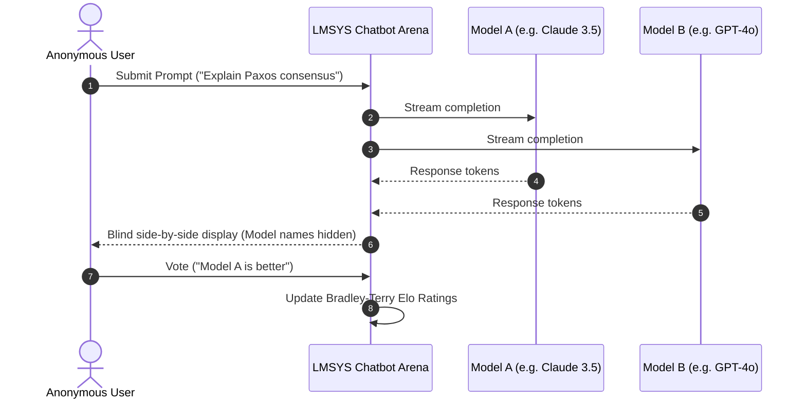

# 📹 How to Use LLM Leaderboards

<div className="video-card" style={{border: '1px solid #30363d', borderRadius: '8px', padding: '16px', marginBottom: '24px', background: 'rgba(56, 139, 253, 0.05)'}}>
  <div style={{display: 'flex', gap: '16px', flexWrap: 'wrap'}}>
    <div><strong>Instructor:</strong> Nitish Singh (CampusX)</div>
    <div><strong>Duration:</strong> 1807</div>
    <div><strong>Course:</strong> Module 6: LLM Evaluation & Observability</div>
    <div><strong>Watch Link:</strong> <a href="https://www.youtube.com/watch?v=SoZPmKb5uGc" target="_blank" rel="noopener noreferrer">YouTube Lecture ↗</a></div>
  </div>
</div>

## 📌 Executive Summary

Public LLM leaderboards—most notably the LMSYS Chatbot Arena and Hugging Face Open LLM Leaderboard—provide comparative performance rankings across hundreds of open and proprietary models.

This lesson explores the mathematics behind Elo ratings, blind A/B testing methodologies, detecting gaming on leaderboards, and interpreting benchmark data for production decisions.

---

## 🏗️ System Architecture & Execution Flow



---

## 📖 Core Concepts & Technical Deep Dive

### 1. LMSYS Chatbot Arena & Bradley-Terry Elo
- Users submit arbitrary prompts; two anonymous models respond side-by-side.
- The user votes on the superior answer without knowing which model produced it.
- Match outcomes update Elo scores using the Bradley-Terry statistical model:
`P(A > B) = 1 / (1 + 10^((R_B - R_A) / 400))`

### 2. Strengths of Crowd-Sourced Arenas
- Highly resistant to prompt gaming because prompts originate from diverse global users.
- Captures human preference, conversational style, tone, and visual layout.

### 3. Production Blindspots of Leaderboards
- Chatbot Arena favors articulate, polite, and well-structured responses (verbosity bias).
- Does not test enterprise concerns: structured JSON adherence, latency per token, API uptime, or strict system-prompt adherence.

---

## 💻 Production Implementation

```python
def calculate_expected_score(rating_a: float, rating_b: float) -> float:
    # Bradley-Terry expected outcome for Model A against Model B
    return 1.0 / (1.0 + 10 ** ((rating_b - rating_a) / 400.0))

def update_elo(rating_a: float, rating_b: float, actual_a: float, k: float = 32.0):
    expected_a = calculate_expected_score(rating_a, rating_b)
    new_rating_a = rating_a + k * (actual_a - expected_a)
    return round(new_rating_a, 1)

# Example: Model A (Elo 1250) defeats Model B (Elo 1200)
new_a = update_elo(1250, 1200, actual_a=1.0)
print(f"Model A updated Elo: {new_a}")
```

---

## ⚙️ Production Gotchas & Best Practices

:::tip Look at Category-Specific Leaderboards
Filter the Chatbot Arena leaderboard by specific task categories: "Coding", "Hard Prompts", or "Longer Query" rather than relying on overall aggregate rankings.
:::

:::warning Do Not Rely on Overall Elo for RAG
A model ranked #1 in conversational chat may rank poorly when tasked with strict context-bounded retrieval or schema-constrained extraction.
:::

---

## 📊 Architectural Reference & Comparison

| Leaderboard | Methodology | Primary Value | Key Limitation |
| :--- | :--- | :--- | :--- |
| **LMSYS Arena** | Blind human crowdsourced A/B | Real-world conversational preference | Verbosity bias, subjective |
| **Hugging Face Open LLM** | Automated academic benchmarks | Open-weight model discovery | Saturation & contamination |
| **AlpacaEval 2.0** | Automated frontier judge | Fast, cheap model comparison | High correlation to judge model |
| **SWE-bench Leaderboard** | Real GitHub issues resolution | True agentic software capability | High compute cost to run |

---

## 📚 Key Takeaways & Enterprise Checklist

- [ ] **Architecture Verification:** Ensure your design addresses latency, decoupled interfaces, and strict data validation contracts.
- [ ] **Deterministic Testing:** Run unit tests and golden dataset evaluations before shipping changes to staging or production.
- [ ] **Security & Observability:** Enforce input/output guardrails, scrub sensitive credentials/PII, and capture distributed traces.
- [ ] **Scalability & Sizing:** Calibrate model parameters, context limits, and compute instance requirements against projected request concurrency.
