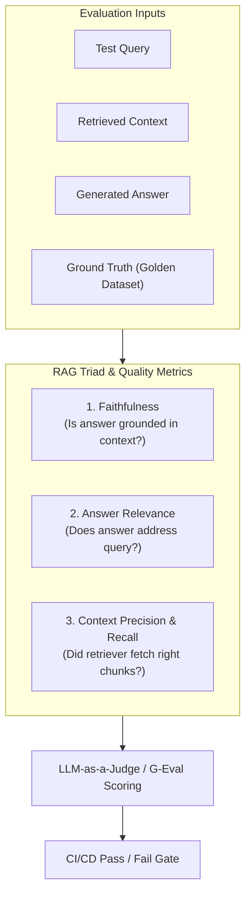

# 📹 Selecting the Right LLM for Your AI App: Running Custom Model Evals

<div className="video-card" style={{border: '1px solid #30363d', borderRadius: '8px', padding: '16px', marginBottom: '24px', background: 'rgba(56, 139, 253, 0.05)'}}>
  <div style={{display: 'flex', gap: '16px', flexWrap: 'wrap'}}>
    <div><strong>Instructor:</strong> Nitish Singh (CampusX)</div>
    <div><strong>Duration:</strong> 116m 53s</div>
    <div><strong>Playlist:</strong> LLM Evaluation Complete Series (CampusX)</div>
    <div><strong>Watch Link:</strong> <a href="https://www.youtube.com/watch?v=RG5A-W3eMHI" target="_blank" rel="noopener noreferrer">YouTube Lecture ↗</a></div>
  </div>
</div>

## 📌 Executive Summary & Learning Objectives

This lecture covers **Selecting the Right LLM for Your AI App: Running Custom Model Evals**, focusing on production implementations, edge cases, and industry standards:
- Core intuition, architecture, and underlying mechanisms.
- Key differences between theoretical research implementations and scalable enterprise patterns.
- Concrete Python walkthroughs, error recovery, and performance optimization.

---

## 🏗️ Architecture & Conceptual Workflow



---

## 📖 Core Concepts & Technical Deep Dive

### 1. Architectural Foundations
In modern production AI engineering, **Selecting the Right LLM for Your AI App: Running Custom Model Evals** is essential for ensuring reliability, low latency, and deterministic outcomes. As AI systems evolve from naive prompt-in / completion-out scripts into distributed systems, engineers must handle:
- **State management & consistency:** Ensuring intermediate states and tool invocations are tracked.
- **Error boundaries & recovery:** Graceful degradation when external LLMs or vector stores encounter rate limits or network partitions.
- **Resource utilization & cost efficiency:** Caching common queries and reducing unnecessary foundation model token expenditure.

### 2. Operational Considerations
- **Latency Optimization:** Pre-computing embeddings, utilizing asynchronous non-blocking event loops, and streaming tokens via Server-Sent Events (SSE).
- **Security & Sandboxing:** Validating inputs before ingestion, sanitizing LLM outputs, and isolating tool execution environments.

---

## 💻 Production Implementation Walkthrough

```python
from deepeval import assert_test
from deepeval.test_case import LLMTestCase
from deepeval.metrics import FaithfulnessMetric, AnswerRelevancyMetric

# 1. Prepare Test Case
test_case = LLMTestCase(
    input="What is the context window of Claude 3.5 Sonnet?",
    actual_output="Claude 3.5 Sonnet features a 200,000 token context window.",
    retrieval_context=["Claude 3.5 Sonnet supports up to 200k tokens of context."]
)

# 2. Define Metrics
faithfulness = FaithfulnessMetric(threshold=0.8)
relevancy = AnswerRelevancyMetric(threshold=0.8)

# 3. Assert Production Test Gate
def test_rag_accuracy():
    assert_test(test_case, [faithfulness, relevancy])
```

---

## 💡 Production Best Practices & Tips

:::tip Production Deployment Guideline
When deploying Selecting the Right LLM for Your AI App: Running Custom Model Evals in enterprise environments, always configure automated retries with exponential backoff and telemetry tracing (such as OpenTelemetry or LangSmith).
:::

:::warning Common Failure Modes
Watch out for state contamination across concurrent requests. Ensure each session or user interaction uses an isolated thread ID or execution context.
:::

---

## 🎯 Key Takeaways & Quick Reference

| Dimension | Production Standard | Pitfall to Avoid |
| :--- | :--- | :--- |
| **Execution** | Async / Non-blocking with timeouts | Synchronous blocking calls in event loops |
| **Data Validation** | Strict Pydantic v2 schemas | Untyped dictionary access |
| **Monitoring** | Distributed tracing & latency percentiles | Relying only on standard console logs |

## ⏱️ Lecture Timeline & Key Topics

| Timestamp | Key Topic / Concept Discussed |
| :--- | :--- |
| **00:00:00** | तो गाइस जैसा मैंने आपको लास्ट क्लास में... |
| **00:29:21** | रहे हैं और ऐसा हमें 30 दिन करना है।... |
| **00:59:10** | मैं हर मॉडल को दो क्वालिटीज़ पे टेस्ट कर... |
| **01:28:02** | की एपीआई तो अलग-अलग है। ओपन ओपन एआई का... |
| **01:56:50** | नेक्स्ट सेशन में। बाय गुड नाइट।... |


---

---

## 📜 Complete Lecture Transcript (Hindi / Hinglish)

> **Language:** Hindi / Hinglish | **Source:** `11 - Selecting the Right LLM for Your AI App： Running Custom Model Evals ｜ CampusX.hi.srt` | **Total Segments:** 59 | **Word Count:** ~19,387 words

<details>
<summary><b>Click to expand full chronological transcript (59 timestamped intervals)</b></summary>

#### ⏱️ [00:00 ➔ 00:02]

तो गाइस जैसा मैंने आपको लास्ट क्लास में प्रॉमिस किया था कि काफी थ्योरी पढ़ ली हमने इस कोर्स में। अब गोइंग फॉरवर्ड सब कुछ हमें प्रैक्टिकली करना है। सो ऑल आवर सेशंस विल बी लाइक हैंड्स ऑन सेशंस आज के सेशन से। और अच्छी बात ये है कि सिंस आपने बहुत इन डेप्थ थ्योरी पढ़ी है, बहुत अच्छा ओवरव्यू ले लिया है पूरे लैंडस्केप का। तो थ्योरी आप थोड़ा ये जो प्रैक्टिकल्स हम करेंगे इनको आप थोड़ा और ज्यादा एप्रिशिएट कर पाओगे। ठीक है? तो व्हाट आई विल डू इज फर्स्ट ऑफ ऑल क्विकली आई विल गिव यू अ रीकैप। अभी तक हमने क्या किया? इट विल हार्डली टेक थ्री फोर मिनट्स। फिर मैं आपको आज के क्लास का एजेंडा बताता हूं और फिर आज की क्लास को स्टार्ट करते हैं। ठीक है? तो हमारा ये जो कोर्स है एलएलएम इवल्स का उसमें हमने एकदम शुरुआत में फर्स्ट एक दो सेशंस में ये एस्टैब्लिश कर दिया था कि दो तरह के एलएलएम ईवेल्स होते हैं। एक होते हैं मॉडल इवेल्स और एक होते हैं एप्लीकेशन इवल्स। और मैंने आपको बता दिया था शुरू में ही कि हम ज्यादा फोकस एप्लीकेशन इव्स पर करेंगे। बट उसके पहले हम लोग मॉडल इवा्स थोड़ा पढ़ लेंगे। ठीक है? फिर हम लोग फोकस करने लग गए मॉडल इवाs के ऊपर। मॉडल इवाइ्स में मैंने आपको फिर से बहुत अर्ली ऑन बता दिया था कि दो तरह के मॉडल इवाइल्स होते हैं। एक होते हैं बेंचमार्क्स जिनकी हेल्प से आप बहुत स्पेसिफिक एलएलएम कैपेबिलिटीज को टेस्ट कर सकते हो। ठीक है? नॉलेज, रीजनिंग, मैथ्स। तो इन चीजों को चेक करने के लिए कुछ अ जेनेरिक डेटा सेट्स हैं, बेंचमार्क्स हैं जिनकी हेल्प से आप ये इवैल्यूएशंस करते हो। बट एट द सेम टाइम आपको अगर अपने कस्टम एप्लीकेशन के लिए एलएलएम का परफॉर्मेंस मेजर करना है तो उसके लिए आपको कस्टम मॉडल इवल्स चलाने होते हैं। बेसिकली आप एलएलएम्स को अपने डेटा अपने एप्लीकेशन के ऊपर चला के देखते हो और उससे आपको समझ में आता है कि आपके एप्लीकेशन के लिए बेस्ट मॉडल कौन सा रहेगा। सिंपल एग्जांपल अगर मैं दूं तो लेट्स से यू आर बिल्डिंग अ चैटबॉट फॉर योर कंपनी। ऑब्वियसली उस

#### ⏱️ [00:02 ➔ 00:04]

चैटबॉट को बनाने के लिए आपको एक ब्रेन एज इन एलएलएम की जरूरत है। बट वो एलएलएम आप सेलेक्ट कैसे करोगे? सिंपली बेंचमार्क देखने से तो आपको टॉप कैंडिडेट्स मिल जाएंगे कि ये चारप अच्छे मॉडल्स हैं मार्केट में। बट उन चारप मॉडल्स में से आपके एप्लीकेशन के लिए बेस्ट कौन सा रहेगा? उस क्वेश्चन का आंसर आपको कस्टम मॉडल ईल्स देते हैं। तो हम आज के सेशन में एग्जजेक्टली इसी टॉपिक के ऊपर काम करने वाले हैं। आज एक केस स्टडी की हेल्प से मैं आपको बताऊंगा कि कैसे आप कस्टम मॉडल इव्स रन करते हो। कैसे आप इस क्वेश्चन का आंसर निकालते हो कि आपके एप्लीकेशन के लिए बेस्ट अवेलेबल मॉडल कौन सा है। यही है आज की क्लास का जस्ट। तो मैंने रिककैप भी बता दिया और मैंने आपको आज की क्लास का एजेंडा भी बता दिया। आज की क्लास का एजेंडा सिंपल शब्दों में है टू लर्न हाउ टू रन। कस्टम मॉडल इव्स यही हमारे आज के क्लास का एजेंडा है। दिस इज़ अ वेरी प्रैक्टिकल हैंड्स ऑन काइंड ऑफ़ टॉपिक। तो यहां पे मैं आपको अब थ्योरी नहीं पढ़ाऊंगा। मैं आपको प्रैक्टिकली सब कुछ करके दिखाऊंगा। और वो करने के लिए मुझे लगा कि एक अच्छी केस स्टडी होनी चाहिए। एक अच्छा प्रॉब्लम स्टेटमेंट होना चाहिए। तो मैंने बहुत सारे प्रॉब्लम स्टेटमेंट्स एक्सप्लोर किए। उनमें से जो सबसे अच्छा प्रॉब्लम स्टेटमेंट मुझे लगा वो मैं आपके सामने रख रहा हूं। सो हाउ मेनी ऑफ यू आर क्रिकेट लवर्स लाइक यू वॉच क्रिकेट, यू फॉलो क्रिकेट? कितने लोग हो ऐसे सिंस ये क्लास इंडिया में हो रही है। आई एम प्रीटी श्योर अ लॉट ऑफ यू विल बी लाइक यस आई फॉलो क्रिकेट। तो अगर आप क्रिकेट फॉलो करते होगे तो आपने शायद यह वेबसाइट भी देखी होगी ईएसपी क्रिक इनफो। दिस इज लाइक वन ऑफ द टॉप वेबसाइट्स जिसको यूज किया जाता है टू चेक लाइव क्रिकेट स्कोर्स। मैं पर्सनली भी करता हूं। सालों से करता आ रहा हूं। और भी बहुत सारे

#### ⏱️ [00:04 ➔ 00:06]

यूज़र्स होंगे इसके। तो ये एक प्रॉपर बड़ी वेबसाइट है। अब इस वेबसाइट में क्या है कि जब मैच चल रहा होता है, जब मैच चल रहा होता है तो लोग ना अपने क्वेश्चंस भेजते हैं। ये लोग कमेंट्री भी करते हैं, टेक्स्चुअल कमेंट्री करते हैं और उसके बीच-बीच में ये लोग क्वेश्चंस भी लेते हैं यूज़र्स का और उनको आंसर बताते हैं। तो प्रॉब्लम क्या है कि सिंस दिस वेबसाइट वर्क्स एट अ बिग स्केल। बहुत सारे लोग इनके फीड को फॉलो करते हैं। तो प्रॉब्लम क्या होती है कि कई बार जो नंबर ऑफ क्वेश्चंस आते हैं इनके पास उनका जो स्केल है वो बहुत ज्यादा होता है। लाइक लिटरली 5 मिनट में 500 क्वेश्चंस आ गए। और क्वेश्चंस कैसे होते हैं? जैसे अभी मैच चल रहा है इंडिया वर्सेस पाकिस्तान का। तो सडनली से कोई क्वेश्चन पूछ लेगा कि यार थोड़ा बताना कि विराट कोहली का पाकिस्तान के अगेंस्ट बैटिंग एवरेज कैसा है? या फिर लास्ट जब इंडिया पाकिस्तान खेली थी तो जसप्रीत बुमराह ने कितने विकेट्स लिए थे? राइट? सिंपल क्वेश्चंस पूछ लेते हैं लोग। और फिर इनकी एक टीम होती है। एक कमेंट्री टीम होती है। उनके साथ कुछ एनालिस्ट्स बैठे होते हैं। दिस इज हैपनिंग लाइव बाय द वे। और इन एनालिस्ट का काम क्या है कि कमेंट्री टीम इनको क्वेश्चन देती है। यह एनालिस्ट लोगों के पास क्रिक इनफो का डेटाबेस का एक्सेस होता है। ये लोग क्वेरी लिखते हैं झट से ऑन द स्पॉट और उस क्वेरी का आंसर वापस कमेंट्री टीम को देते हैं और वही कमेंट्री टीम उसको वापस फीड में डालते डाल के बताती है। तो ये सालों से क्रिक इनफो करता आ रहा था। बट इवेंचुअली दे रियलाइज कि यह बहुत स्केलेबल तरीका नहीं है। बिकॉज़ इंडिया वर्सेस पाकिस्तान जैसे मैचेस में यह स्केल बहुत बड़ा हो जाता है कि हम सबको आंसर नहीं कर पाते। तो व्हाट दे थॉट कि व्हाट इफ हम एक प्लेटफार्म बनाएं। प्लेटफार्म या फिर आप बोलो एक फीचर बनाएं हमारी वेबसाइट पे जिस पे जाकर के कोई भी क्रिकेट फैन कोई भी क्वेश्चन पूछ

#### ⏱️ [00:06 ➔ 00:08]

पाए क्रिकेट से रिलेटेड। तो उन्होंने यह फीचर डेवलप किया और इस फीचर का नाम इफ आई रिमेंबर करेक्टली इट इज आस्क क्रिक इनफो। दिस इज द फीचर। अब ड्यूरिंग द मैच वो लोग इस फीचर का लिंक दे देते हैं। और आप जाके क्या कर सकते हो? आप झट से यहां से फर्स्ट ऑफ़ ऑल सेलेक्ट कर सकते हो कि आप किस चीज के बारे में बात करना चाहते हो। लेट्स से आप आईपीएल के बारे में बात करना चाहते हो। तो आप सिंपली जाके यहां पर पूछ सकते हो हु हैज़ कोड मोस्ट नंबर ऑफ रंस अगेंस्ट बुमराह। लेट्स से ऐसा पूछ लिया आपने। अब ये सिस्टम क्या करेगा? इस ओके। ये सिस्टम क्या करेगा? ये आपकी इंग्लिश वाली क्वेरी को लेगा और उसको पीछे जाकर के एक सीक्वल में कन्वर्ट करेगा। सो चलो मेरी बेइज्जती नहीं हो रही है। क्रिक इनफो की बेइज़्ज़ती हो रही है। अ सिंपली ये पूछ लेते हैं कि सबसे ज्यादा रंस किसने स्कोर किए हैं। लेट्स सी इसका आंसर दे पाओ। समथिंग इज़ हैपनिंग। आई डोंट नो। बट यू अंडरस्टैंड। राइट? हो क्या रहा है इस फीचर में कि आपके पास आपने एक ऐसा सिस्टम या फीचर बनाया जहां पे आप एक टेक्स्ट बेस्ड क्वेश्चन लेते हो और उसको आप किसी एलएलएम को देते हो एलएलएम को ये क्वेश्चन भी पता है और आपके डेटाबेस का स्कीमा भी पता है कि आपके डेटाबेस किस तरीके से ऑर्गेनाइज्ड है। उसमें कौन-कौन से कॉलम्स हैं। उसके बेसिस पे ये एलएलएम आपको एक सीक्वल जनरेट करके देता है। फिर आपका सिस्टम उस सीक्वल को उठाता है और उसको डेटाबेस के ऊपर रन करता है। जो भी रिजल्ट आता है उस रिजल्ट को वापस हम स्क्रीन पे यूजर को दिखाते हैं। तो बेसिकली ये जो एनालिस्ट लोगों की जरूरत थी इसको हमने खत्म कर दिया और ये सिस्टम को हमने वहां

#### ⏱️ [00:08 ➔ 00:10]

पे बिठा दिया। और अब ये पूरी चीज स्केलेबल हो गई। बिकॉज़ नाउ इट कैन हैंडल एनी नंबर ऑफ क्वेरीज। अनफॉर्चूनेटली डेमो के टाइम पर इट्स नॉट वर्किंग बट इट इज नॉट माय फॉल्ट। आप जाकर क्लास के बाद चेक कर लेना। सो अब हमारा केस स्टडी ये है कि वी हैव टू अस्यूम दैट वी आर ए इंजीनियर्स वर्किंग फॉर क्रिक इनफो। और हमारे पास ये एक फीचर रिक्वेस्ट आई है और हमें बोला गया है कि हमें ये सिस्टम बनाना है। ठीक है? अब खुद सोचो इस सिस्टम को बनाने जाने के पहले सबसे पहले सबसे बड़ा क्वेश्चन क्या आएगा? ऑब्वियसली सबसे बड़ा क्वेश्चन ये आएगा कि इस सिस्टम को बनाने के लिए हम कौन सा एलएलएम यूज़ करें? बिकॉज़ एलएलएम इज द ब्रेन। मेन काम यही कर रहा है। तो हमें सबसे पहले ये डिसाइड करना है कि कौन सा एलएलएम इज़ द मोस्ट सूटेबल मॉडल फॉर दिस एप्लीकेशन। एंड एज़ आई हैव सेड प्रीवियसली आप ऐसे रैंडमली नहीं बोल सकते अपने टीम में कि यार चलो ना अ फेबल यूज़ कर लेते हैं। अभी का सबसे टॉप मॉडल है। आप ऐसे बात नहीं करते कंपनीज़ में। यू हैव टू गिव गुड इनपुट गुड रीजनिंग कि आप किसी मॉडल को क्यों सेलेक्ट करोगे। तो देयर हैज़ टू बी प्रॉपर इवैल्यूएशन डन बिफोर सेलेक्टिंग द मॉडल। आई होप आपको स्टेक्स समझ में आ रहे हैं। तो हम आज की क्लास में एग्जैक्टली यही करने वाले हैं। वी आर अ टीम एआई इंजीनियर्स की। वी आर वर्किंग एट क्रिक इनफो। हमें एक नया फीचर बनाना है और उस फीचर को बनाने के पहले सबसे पहले यह डिसाइड करना है कि हम कौन सा मॉडल यूज करेंगे इस फीचर को बिल्ड करने के लिए और ये डिसीजन लेने के लिए हमें क्या करना पड़ेगा? हमें एक प्रोसेस फॉलो करना पड़ेगा और उस प्रोसेस के दौरान हम ये सीखेंगे कि हाउ कैन वी रन कस्टम मॉडल इव्स ऑन आवर ओन डेटा। इज द प्रॉब्लम स्टेटमेंट क्लियर? हम

#### ⏱️ [00:10 ➔ 00:12]

क्या डिस्कस करने वाले हैं? गोइंग फॉरवर्ड इज दिस क्लियर? वी आर गोइंग टू बिल्ड अ एकदम टेक्निकल शब्दों में बात करें तो वी आर गोइंग टू बिल्ड अ टेक्स्ट टू सीक्वल एप्लीकेशन बट आवर गोल इन दिस क्लास इज़ टू सेलेक्ट वन बेस्ट मॉडल जो इस सिस्टम का ब्रेन बनेगा। यही है हमारे आज की क्लास का गोल। सो वी अस्यूम दैट वी हैव रैग डेटा पाइपलाइन एंड प्लेस। अ दिस इज नॉट एग्जैक्टली रैग बिकॉज़ यहां पर हम मॉडल को कुछ भी एक्सटर्नल डॉक्यूमेंट्स नहीं दे रहे जिसके बेसिस पे उसको आंसर करना है। वी आर जस्ट प्रोवाइडिंग द स्कीमा ऑफ़ द डेटाबेस जो कि हर बार सेम रहेगा। तो वी डोंट नीड टू बिल्ड अ रैक चार्ट वर्ड। दिस इज़ नॉट अ रैक चार्ट वर्ड। दिस इज़ अ टेक्स्ट टू सीक्वल एप्लीकेशन। मैं आपको पूरा फ्लो बताता हूं कि यह पूरा जो मॉडल को सेलेक्ट करने की जर्नी है यह एग्जजेक्टली कैसे काम करेगी। हम डायरेक्टली कस्टम इवल रन करना स्टार्ट नहीं करेंगे। डू यू रिमेंबर द लास्ट सेशन वेयर वी लर्नड अबाउट एलएलएम लीडर बोर्ड्स? याद है आपको? हम एलएलएम लीडर बोर्ड्स को भी यूज़ करने वाले हैं इस पूरे सिलेक्शन प्रोसेस में। सो मैं आपको बताता हूं पूरा फ्लो कैसे रहने वाला है। सबसे पहले हम क्या करेंगे? हमेशा मैंने आपको बताया था। द फर्स्ट थिंग दैट यू विल डू इज़ दैट यू विल अंडरस्टैंड द प्रॉब्लम स्टेटमेंट एंड देन यू विल राइट डाउन योर रिक्वायरमेंट्स। सबसे पहले जब एक एआई इंजीनियरिंग टीम को एक टास्क दिया जाता है तो वो अपनी रिक्वायरमेंट्स को बहुत क्लियरली लिखते हैं। वही हम करेंगे स्टेज वन पे। स्टेज टू पे हम क्या करेंगे कि हम उन रिक्वायरमेंट्स को पिक करेंगे और हम लीडर बोर्ड्स पर जाएंगे एंड वी विल शॉर्टलिस्ट 5 टू 10 कैंडिडेट मॉडल्स। मैंने आपको बताया था कि एलएलएम लीडर बोर्ड्स का काम

#### ⏱️ [00:12 ➔ 00:14]

क्या होता है? फिल्टरेशन ना कि सिलेक्शन। तो हमें पता कैसे चलेगा कि कौन-कौन से कैंडिडेट मॉडल्स हैं विद द हेल्प ऑफ दीज़ लीडर बोर्ड्स। और एक बार जब हमारे पास ये पांच 10 कैंडिडेट मॉडल्स आ जाएंगे देन वी विल रन अ कस्टम मॉडल ई वेल ऑन ऑल दोज़ फाइव टू 10 मॉडल्स। और वहां पर जो मॉडल सबसे बढ़िया स्कोर करेगा हम उस मॉडल को सेलेक्ट करेंगे। सो इज द फ्लो क्लियर? तीन स्टेप्स में हम सारा काम करेंगे। फर्स्ट वी विल राइट डाउन आवर रिक्वायरमेंट्स। उन रिक्वायरमेंट्स को लेकर के हम लीडर बोर्ड्स पर जाएंगे एंड फाइव टू 10 कैंडिडेट मॉडल्स को सेलेक्ट करेंगे जो हमारी क्राइटेरिया को फुलफिल करते हैं। और फिर उन पांच से 10 अ मॉडल्स के ऊपर हम अपने कस्टम मॉडल इवा्स को रन करेंगे हमारे अपने डेटा के ऊपर और वहां पे हम देखेंगे कि हमारे सारे कैंडिडेट मॉडल्स में सबसे बढ़िया मॉडल कौन सा है और वही मॉडल हम सेलेक्ट करेंगे अपने एप्लीकेशन को बिल्ड करने के लिए। दिस इज द फ्लो। आई होप इज इट इज इट क्लियर? ओके। तो चलो फिर गाइस स्टार्ट करते हैं। सबसे पहली चीज इज़ टू गैदर ऑल द रिक्वायरमेंट्स। सो हम कुछ की क्वेश्चंस पूछेंगे। मैं आपसे पूछूंगा और आप आंसर बताना मुझे। ठीक है? तो जल्दी से मुझे टाइप करके बताओ कि हम एग्जजेक्टली किस टास्क के लिए मॉडल्स को खोज रहे हैं। व्हाट इज द टास्क? टेक्निकल टेक्निकल लेवल पे व्हाट इज द टास्क? मैंने ऑलरेडी आपको बता दिया। बाय द वे वी आर एक्चुअली बिल्डिंग अ टेक्स्ट टू सीक्वल एप्लीकेशन। ये हमारा टास्क है। इसके लिए हमें मॉडल चाहिए। अगला बहुतेंट क्वेश्चन है। ये आप एक्चुअली अपने प्रोडक्ट मैनेजर से या अपने इंजीनियरिंग मैनेजर से पूछोगे कि कॉस्ट

#### ⏱️ [00:14 ➔ 00:16]

सीलिंग क्या है? कॉस्ट सीलिंग का मतलब हम इस एप्लीकेशन को चलाने के टाइम पे कितना खर्चा कर सकते हैं? तो व्हाट डू यू थिंक इज़ अ गुड नंबर। अगेन दिस इज नॉट स्ट्रिक्टली रिलेटेड टू एआई इंजीनियरिंग बट जस्ट वांटेड टू सी आपके एस्टीमेट्स कैसे रहते हैं। लेट्स से एक वेबसाइट है एट द स्केल ऑफ ईएसपीए क्रिक इनफो जो पूरी दुनिया में उसको देखा जाता है यूज किया जाता है। वहां पे हम एक नया फीचर ऐड कर रहे हैं। तो फर्स्ट ऑफ ऑल आपको यह सोचना है कि इस फीचर को ऐड करने से क्रिक इनफो को फायदा क्या हो रहा है? एक फायदा तो यह हो रहा है कि उनसे क्वेश्चन पूछे जाते थे और उनको मैनुअली क्वेरीज लिखनी पड़ती थी। तो वो स्केल अप नहीं कर पा रहे थे। तो इस सिस्टम को बनाने से वो स्केल अप कर पाएंगे। बट एट द सेम टाइम आपको यह सोचना है कि यह हम लोगों को क्वेश्चन पूछ लोग जो हमसे क्वेश्चन पूछ रहे हैं हम उनका आंसर क्यों देते हैं? बेसिकली हमने शुरुआत ही क्यों की इस बात की कि आप हमसे क्वेश्चन पूछो। हम आपको आंसर बताएंगे। व्हाट डू यू थिंक इज द रीज़न? सिंपली वो कमेंट्री भी तो दे सकते थे ना लोगों को। उन्होंने फिर ये क्यों बोला कि आप हमसे क्वेश्चन पूछो, हम आपको आंसर बताएंगे। इसके पीछे छुपा है आंसर कि आप इसके ऊपर कितना पैसा खर्च कर सकते हो। बहुत सिंपल है। ये रिटेंशन प्ले है। दुनिया की कोई भी वेबसाइट जो होती है उनका नॉर्थ स्टार क्या होता है? कि यूजर ज्यादा से ज्यादा टाइम वेबसाइट पे रहे। तो होता क्या है कि इस तरह की छोटी-छोटी चीजें जो होती है ना कि आप हमसे क्वेश्चन पूछोगे हम आपको तुरंत आंसर बताएंगे। कोई भी आप रिकॉर्ड पूछ लो। यह भी एक तरह का रिटेंशन प्ले है। दे वांट यू टू स्टे ऑन द वेबसाइट। और जितनी ज्यादा टाइम आप वेबसाइट पर रहोगे उतना ज्यादा चांसेस है कि आप एड्स देखोगे। जितना ज्यादा आप एड्स देखोगे उतना ज्यादा मैं कमाऊंगा। तो इन अ वे ये जो फीचर है ये मुझे मेरा रेवेन्यू बढ़ाने में जनरेट करने में हेल्प कर रहा है। तो व्हाट डू यू थिंक कुड बी अ गुड नंबर कि मैं इस फीचर पे उतना

#### ⏱️ [00:16 ➔ 00:18]

पैसा स्पेंड कर सकता हूं। इफ यू आर अ बिज़नेस डेवलपर अ फॉर ईएसपीएन क्रिक इनफो आपको दिया गया है फीचर बिल्ड करने के लिए तो आपको क्या लगता है आपको कितना बजट मिलेगा ऐसे ही जस्ट आस्किंग अ क्वेश्चन रैंडमली 30 प्लस लैक्स वी आर टॉकिंग अबाउट पर मंथ बजट लेट्स से व्हाट डू यू थिंक इज अ गुड नंबर इस नए फीचर पे आप कितना स्पेंड करना चाहोगे मैं आप सबका नंबर देखता हूं फिर मैं एवरेज निकाल दूंगा इसको हम विज़डम ऑफ़ द क्राउड बोलते हैं 2 लाख 5 लाख चलो सिंपल रखते हैं क्योंकि इसका आंसर हमारे पास नहीं है। तो लेट्स कीप दिस नंबर टू बी अराउंड लेट्स से 3 लैक्स। दिस इज द कॉस्ट सी सेलिंग। 5 लाख भी हो सकता है, 10 लाख भी हो सकता है। इसके ऊपर आर्ग्यू नहीं करेंगे। बट हमने अपने बिजनेस मैनेजर से जाके पूछा कि यार हमें यह फीचर बनाने के लिए कितने पैसे दिए जा रहे हैं? तो बिजनेस मैनेजर ने बोला कि भाई 3 लाख के नीचे रहोगे सब सही है। 3 लाख क्रॉस मत करो। हमारे पास ये गाइडलाइन आ गई। ठीक है? अब यहां पे एक बहुत इंपॉर्टेंट चीज आपको समझनी है कि आपका खर्चा होगा कितना? वो आपको निकालना है। एज एन ए इंजीनियर वो आपका टास्क है। ठीक है? तो सबसे पहले समझते हैं कि हमारा ये जो टेक्स्ट टू सीक्वल सिस्टम है ये पैसे कैसे बर्न करेगा। बहुत सिंपल है। आप एक एलएलएम को यूज़ कर रहे हो तो एलएलएम आपको पर टोकन बेसिस पे चार्ज करता है। यही आपका कॉस्ट है सबसे बड़ा। इसके अलावा और छोटे-मोटे कॉस्ट और होंगे। डिप्लॉयमेंट वगैरह तो चलो डिप्लॉयमेंट का कॉस्ट नहीं कंसीडर करेंगे बिकॉज़ हमारी वेबसाइट ऑलरेडी चल रही है। तो उसी में हम इस फीचर को इंटीग्रेट कर रहे हैं। तो अलग से शायद डिप्लॉयमेंट कॉस्ट उतना बढ़ेगा नहीं। तो मेनली हमारा जो कॉस्ट है वो है एलएलएम का

#### ⏱️ [00:18 ➔ 00:20]

कॉस्ट। कंसीडरिंग वी आर यूजिंग अ पेड एपीआई ओपन एआई एंथ्रोपिक टाइप का। तो यहां पे एक कैलकुलेशन जल्दी से कर लेते हैं। सो इस पूरे सिस्टम में होगा क्या कि आपका जो ये एप्लीकेशन है आपका यूजर आपको एक टेक्स्ट भेजेगा। जैसे उसने पूछा कि हाउ मेनी रंस हैज़ विराट कोहली स्कोर्ड इन द आईपीएल? दिस इज द क्वेश्चन। अब आपको क्या करना है? इस क्वेश्चन को एलएलएम के पास भेजना है। और यह एलएलएम आपको एक सीक्वल जनरेट करके देगा। एलएलएम का इतना ही काम है। राइट? तो एक बार कैलकुलेट करने की कोशिश करते हैं कि एलएलएम के अराउंड हमारा खर्चा कितना होगा। ठीक है? तो आप क्या करते हो? आप फर्स्ट ऑफ ऑल डायरेक्टली इस टेक्स्ट को एलएलएम के पास नहीं भेजते हो। आप पहले क्या करोगे? इस टेक्स्ट को उठाओगे और इससे प्र्प क्रिएट करोगे। राइट? वो प्र्ट कैसा दिखाई देगा मैं आपको दिखाता हूं। यहां पे देखो मैंने लिख रखा है एक्चुअली। तो दिस इज द प्र्प्ट जो हम एलएलएम के पास भेज रहे हैं। इसको बहुत केयरफुली रीड करेंगे समझ में आ जाएगा क्या चल रहा है। ये हमारा सिस्टम प्र्प है। ये एग्जैक्ट चीज हम भेजने वाले हैं एलएलएम के पास। यू आर अ टेक्स्ट टू सीक्वल जनरेटर गिवन अ डेटाबेस स्कीमा। हम अपना डेटाबेस स्कीमा भी प्रोवाइड करेंगे। तभी तो वह समझ पाएगा कि मुझे क्या सीक्वल क्वेरी लिखनी है। गिवन अ डेटाबेस स्कीमा एंड अ क्वेश्चन रिटर्न अ सिंगल सीक्वल क्वेरी दैट आंसर्स इट यूजिंग सीक्वलाइट सिंटेक्स बिकॉज़ करेंटली हम जो डेटाबेस यूज़ कर रहे हैं आज की क्लास में वो सीक्वलाइट है। आप पोस्ट क्रेज़ माय सीक्वल कुछ भी यूज़ कर सकते हो। रिटर्न ओनली द सीक्वल क्वेरी। उसके अलावा मुझे कोई एक्सप्लेनेशन नहीं चाहिए एलएलएम से। तुम मेरे को सिंपली एसक्यूएल क्वेरी दो। मैं उसको डेटाबेस पे रन करूंगा। अब यहां पर देखो स्कीमा मैंने यहां पर प्रोवाइड किया है। सो अपेरेंटली मेरे पास जो करंट स्कीमा है उसमें दो टेबल्स हैं। एक है मैचेस बोल के जिसमें आईपीएल के सारे बाय द वे फिलहाल हम आईपीएल के डोमेन में ऑपरेट कर रहे हैं क्योंकि क्रिकेट में और बहुत सारी चीजें आती है। इंटरनेशनल टी20,

#### ⏱️ [00:20 ➔ 00:22]

इंटरनेशनल टेस्ट मैचेस, वुमस का अलग है, मेंस का अलग है। तो हम थोड़ा डोमेन को नैरो करके सिर्फ आईपीएल के ऊपर फोकस कर रहे हैं। ऐसे इमेजिन कर लो कि हम आईपीएल के टाइम पे ये टेक्स्ट टू सीक्वल सिस्टम ल्च कर रहे हैं। ठीक है? तो हमारे पास एक मैचेस बोल के टेबल है जिसमें एक पर्टिकुलर आईपीएल मैच का सारा रिकॉर्ड्स अवेलेबल है। वो मैच कौन सी दो टीम्स के बीच खेला गया? कौन से ग्राउंड में खेला गया? कौन से डेट पे खेला गया? ये सब चीजें हैं। अंपायर कौन है? ये सारा चीज यहां पे है। और एक और टेबल है हमारे पास डिलीवरीज जहां पर हमारे पास हर मैच का बॉल बाय बॉल डाटा है। सो एक टी20 मैच में 240 बॉल्स होती हैं। राइट? 40 ओवर्स का मैच होता है। तो हर बॉल पर क्या हुआ था? उसका डाटा है। हर बॉल पर कौन बैट्समैन था? कौन बॉलर था? लगा, चौका लगा, आउट हुआ, आउट हुआ तो किसने आउट किया? ये सारा डिटेल्स यहां पे है। तो ये मैंने अपना स्कीमा भेज दिया। और फिर नीचे जो यूजर ने यहां पे क्वेश्चन पूछा था। ये जो क्वेश्चन है उसको मैंने यहां पे डाल दिया। इस क्वेश्चन को मैंने यहां पे डाल दिया। और क्वेश्चन कुछ बहुत कॉम्प्लेक्स सा है कि वि बॉलर हैज़ द बेस्ट इकॉनमी रेट अमंग बॉलर्स हु हैव बॉल्ड एटलीस्ट 500 लीगल बॉल्स। बहुत एक कॉम्प्लेक्स सा क्वेश्चन है और मैंने बोला कि सीक्वल जनरेट कर दूं। तो ये है मेरा प्रम। ये मैं एलएलएम के पास भेजूंगा और पलट के एलएलएम मुझे ये आउटपुट देगा। ठीक है? पलट के यह मुझे आउटपुट मिल रहा है। यह मेरा इनपुट है और यह मेरा आउटपुट है। बाय द वे एलएलएम हमें दोनों चीजों के लिए चार्ज करता है। ये आपको पता होगा। दो रेट्स आपको मिलेंगे। आप कभी भी किसी भी एलएलएम प्रोवाइडर के पास जाओ जैसे कि अगर आप एंथ्रोपिक पे जाओगे तो हर एलएलएम प्रोवाइडर का आपको इनपुट टोकंस का भी रेट मिलेगा और आपको आउटपुट टोकंस का भी रेट मिलेगा। ऑब्वियसली आउटपुट टोकंस ज्यादा कॉस्टली होते हैं इनपुट टोकंस से। ठीक है? तो सबसे पहले हम ये देखते हैं कि हम कितने टोकंस भेज रहे हैं हर रिक्वेस्ट में। ठीक

#### ⏱️ [00:22 ➔ 00:24]

है? तो व्हाट आई विल डू इज अगेन लेंथ थोड़ा-थोड़ा वेरीरी करेगा। बिकॉज़ ये सब कुछ तो सेम रहेगा। ये जो पूरी चीज है अ ऊपर जो सिस्टम प्र्ट लिखा हुआ है और ये जो स्कीमा है ये तो सेम है। बस वेरीरी क्या करेगा? नीचे ये जो क्वेश्चन है बट इससे बहुत ज्यादा डिफरेंस नहीं आएगा। तो व्हाट आई विल डू इज़ आई विल क्विकली कॉपी दिस एंटायर इनपुट प्र्प्ट एंड आई विल गो टू सम वेबसाइट व्हिच कैन हेल्प मी कैलकुलेट कि मेरे इनपुट प्र्ट में कितने टोकंस हैं। सो व्हाट आई विल डू इज़ आई विल सिंपली पेस्ट इट एंड यू कैन सी यहां पे बता रहा है कि इससे 352 टोकंस बने। ये रहे वो टोक्स एलएलएम्स को ऐसा दिखाई देगा इनपुट। ठीक है? तो रफली अगर पकड़ लें तो अगर हम इसको 350 के बदले लेट से इसको सिंपल कर लेते हैं। 400 मान लेते हैं। तो हमारा इनपुट्स का खर्चा कितना है? 400 टोकंस। और इनपुट आउटपुट का खर्चा कितना है? उसके लिए हम क्या करेंगे? इस क्वेरी को पकड़ेंगे और इसको भी पेस्ट कर देंगे। तो यह है अराउंड 100 तो अगेन हर क्वेरी का लेंथ सेम नहीं होगा। बस ऐसा मान लेते हैं कि एवरेज में हम 100 टोकंस का आउटपुट मांग रहे हैं। तो बेसिकली जभी भी हम एक रिक्वेस्ट मार रहे हैं हमारे एलएलएम पे तो हम उसको 400 टोकंस भेज रहे हैं और पलट के वो हमें 100 टोकंस दे रहा है। अब यहां पे एक और इंपॉर्टेंट नंबर बहुत जरूरी है। वो आपको पता होना चाहिए कि ऑन एन एवरेज डेली आपसे कितने क्वेश्चंस पूछे जा सकते हैं। बेसिकली कितनी बार लोग ये वेबसाइट ओपन करेंगे ड्यूरिंग अ मैच और

#### ⏱️ [00:24 ➔ 00:26]

यहां पे क्वेश्चन टाइप करके आपके पास भेजेंगे। ये नंबर भीेंट है कॉस्ट कैलकुलेट करने के लिए। अगेन आई नीड योर हेल्प। व्हाट डू यू थिंक एक क्रिक इनफो जैसी वेबसाइट अगर है दुनिया के लेवल पे ऑपरेट करती है तो इस तरह का फीचर अगर हम वहां पर ल्च करें तो व्हाट डू यू थिंक एक दिन में हमें कितने क्वेश्चंस हिट करने को मतलब आंसर करने को मिल सकते हैं आपके हिसाब से अगेन जस्ट अ रफ एस्टीमेट आई विल ट्राई टू अ डू द एवरेज वन टू 2 करोड़ इज टू मच यार कम ऑन वी आर जस्ट टॉकिंग अबाउट दिस पर्टिकुलर फीचर वी आर नॉट टॉकिंग अबाउट द वेबसाइट होम होम पेज की बात नहीं कर रहे हम। होम पेज के अंदर कोई मैच चल रहा है। मैथ्स के अंदर ये फीचर छुपा हुआ है। आपको क्या लगता है? कितने लोग मैथ्स फॉलो करेंगे? फिर मैथ्स फॉलो करने के बाद इस फीचर पे जाएंगे। क्वेश्चन भी टाइप करेंगे और आप करते हो कभी? मैंने कभी नहीं किया ऑनेस्टली। तो अगेन बहुत क्रेजी-क्रेजी नंबर्स कुछ लोग बोल रहे हैं। जैसे एक से 2 करोड़ बोल रहे हैं। इतना लोग नहीं देखते क्रिकेट। अ चलो मैं आपको बताता हूं। मेरा अ मेरा क्रिकेट नॉलेज इस बारे में क्या बताता है मुझे? मुझे लगता है कि फर्स्ट ऑफ ऑल स्पाइकी रहेगा ये पूरा। अगर आप एक ग्राफ प्लॉट करोगे जहां पे वन टू 365 डेज हैं और आप प्लॉट करोगे कि हर दिन साल के कितने क्वेश्चंस पूछे गए तो ये बहुत स्पाइकी होगा। कैन यू टेल मी ये जो स्पाइक्स हैं ये कौन से दिन है? स्पाइक्स कौन से दिन आ रहे हैं आपके हिसाब से? जो इंपॉर्टेंट मैचेस हैं उन दिनों में स्पाइक्स आ रहे हैं। जैसे यह चेन्नई का मैच है तो ज्यादा क्वेश्चन पूछे जा सकते हैं। राइट? यू अंडरस्टैंड राइट? सीएसके वर्सेस एमआई में ज्यादा क्वेश्चन इट्स इट विल बी स्पाइकी। बट अगर हमको एक एवरेज बनाना है तो थोड़ी देर के लिए हम मान लेते हैं। ये मेरी कट फीलिंग है। सो आई विल से कि ऐसा हो सकता है कि हम ऑन एन एवरेज डेली बेसिस पे 5000 क्वेश्चंस को आंसर करेंगे। ठीक है? अब आप इस पे बिल्कुल आर्ग्यू कर

#### ⏱️ [00:26 ➔ 00:28]

सकते हो और बिल्कुल हो सकता है कि मैं गलत हूं। बट इस क्लास के लिए हम अस्यूम कर रहे हैं कि हम 50 के आंसर्स को डेली आंसर करने वाले हैं। 50 50 के क्वेश्चंस को डेली आंसर करने वाले हैं। तो अगर हम नंबर्स पे फिर से समराइज करें तो हमारे पास 400 इनपुट टोकंस हैं और 100 आउटपुट टोकंस हैं। और ये एक क्वेश्चन की बात की जा रही है। और हम डेली बेसिस पे कितने क्वेश्चंस आंसर करने वाले हैं? 5000 और फिर हम इसको 30 से मल्टीप्लाई करेंगे। 30 से क्यों मल्टीप्लाई करेंगे? कोई बता दो जल्दी से यार सिंपल सा क्वेश्चन है। बिकॉज़ हमें पर मंथ कॉस्ट निकालना है। और फिर इसको हम एक मैजिक नंबर से मल्टीप्लाई करेंगे। व्हिच इज 95। कैन एनीवन टेल मी मैजिक नंबर क्या है? 95? नहीं यार, दिस इज यूएसडी टू आईएआर कन्वर्शन। क्योंकि यहां पर डॉलर्स में रेट है ना। यह देखो डॉलर्स में रेट है ना तो हमें तो रुपीस में चाहिए क्योंकि हमारा बजट कितना सेट किया हमने? 3 लाख सेट किया है। ठीक है? तो अब एक बार हम लोग चेक करते हैं कि क्या हम क्लॉड फेबल फाइव अ अफोर्ड कर सकते हैं कि नहीं। क्योंकि हमारे सबसे नए इंटर्न ने बोला कि सर फेबल यूज़ कर लो। बहुत मस्त मॉडल है। तो उसको चलो कैलकुलेट करके बताते हैं। जल्दी से यहां पर देखो फेबल का इनपुट कॉस्ट कितना है? इनपुट कॉस्ट है फेबल का 10 यूएसडी पर मिलियन टोकंस। इनपुट की बात हो रही है और आउटपुट कितना है? आउटपुट है $50 पर मिलियन टोकंस। तो अब हम एग्जैक्ट कैलकुलेशन करने जा रहे हैं कि अगर हम क्लॉड फेबल यूज़ करेंगे तो हमारा मंथली कॉस्ट कितना होगा? ठीक है? ध्यान से देखना। पहले हम पर क्वेरी कॉस्ट निकालेंगे। एक क्वेश्चन को आंसर करने का कॉस्ट क्या है? सो इनपुट है 10

#### ⏱️ [00:28 ➔ 00:30]

बाय 10 लाख मल्टीप्लाई बाय हमारे इनपुट टोकंस कितने हैं? 400 प्लस 50 / 10 लाख थोड़ा क्विक मैथ करने में हेल्प करना मेरी। ठीक है? और हमारा आउटपुट टोकन कितना है? 100। सो तीन जीरो यहां पर हट गए। तीन जीरो यहां पर हट गए। सो हमारे पास नीचे 1000 है और ऊपर आया 4 + 5 9 इज इट करेक्ट? और एम आई डूइंग सम मिस्टेक? 4 / 1000 + 5 / 1000 ठीक है ना? तो यह आ गया 99 यूएसडी पर क्वेरी इज इट करेक्ट सही है ना ये तो हो गया एक क्वेरी हमारे पास कितनी क्वेरीज आ रही है पर डे 50 के सो वी विल मल्टीप्लाई दिस नंबर विद 500000 तो दिस नंबर विल बिकम 25 और 3 बेसिकली $250 हम डेली बेसिस पर 250 यूएसडी स्पेंड कर रहे हैं और ऐसा हमें 30 दिन करना है। अब मैं और कैलकुलेशंस कर सकता हूं वैसे तो हाथ से ही। दिस विल बी 7500 यूएसडी। कुछ गलत किया क्या मैंने? ओह सॉरी। ओह माय बैड। गलत किया ना मैंने। 9 * 5 इज 45 और 450 हो गया 450 यूएसडी करेक्ट है और डेली का 450 है तो मंथली कितना हो जाएगा 450 * 30 सो दिस वुड बी 13

#### ⏱️ [00:30 ➔ 00:32]

5 0 यह सही नंबर है क्या? और अब इसको हमें मल्टीप्लाई कर देना है 95 से टू गेट अ नंबर ये मुझे लग रहा है 101 लाख के अराउंड हो गया ना 13500 * बाय 95 ये रहा आपका कॉस्ट 12.82 लैक्स पर मंथ अब आप बताओ कैन वी यूज़ फेबल हमारा बजट था 3 लै 12 लैक्स इज़ लाइक 4x एक्सीड कर रहा है। तो क्लियरली हमें समझ में आ रहा है कि हमारी औकात के बाहर का मॉडल है। हमें नीचे जाना पड़ेगा। ठीक है? नीचे मतलब कहीं यहां पे बेसिकली 1/4 पे कहीं जाना पड़ेगा। समवेयर लाइक क्लॉट ऑन इट फाइव। Sonet वने इट ठीक लग रहा है। राइट? 1 पे ऑपरेट कर रहा है। मेरे को लग रहा है Sonet जस्ट हमारे बजट में आके गिरेगा। आई होप आपको समझ में आ रहा है। तो फर्स्ट लेट मी नो ये जो पूरा हमने डिस्कशन किया अराउंड कॉस्ट। क्या ये डिस्कशन क्लियर है? इज इट क्लियर और कोई क्वेश्चन है? दिस इज़ हाउ यू डू कैलकुलेशन। दिस इज़ हाउ यू गैदर रिक्वायरमेंट्स। ठीक है? अब यहां पर एक इंटरेस्टिंग चीज पढ़ा रहा हूं। स्किप भी कर सकता था ऑनेस्टली बिकॉज़ थोड़ा सा हम टी टूर लेंगे। बट यहां पे एक चीज नोटिस करो। ये दिखाई दे रहा है आपको? 5 मिलियन कैश राइट्स, 5 मिलियन नहीं 5 मिनट कैश राइट्स, वन आवर कैश राइट्स, कैश हिट्स एंड रिफ्रेशेस। यह क्या नंबर है? यह

#### ⏱️ [00:32 ➔ 00:34]

भी एक बार समझ लेते हैं। यह एक बहुत इंटरेस्टिंग चीज है। सो किसी ने यह टर्म सुना है? एक टर्म होता है जिसको हम बोलते हैं प्र्प कैशिंग। ये किसी को पता है क्या होता है या कभी नाम सुना है इसका? नाम आई गेस सुना होगा। होता क्या है? मैं आपको बताता हूं। प्र्प्ट कैशिंग का सिंपल फंडा यह है कि ऐसा हो सकता है कि जो प्र्प्ट आप एलएलएम के पास भेज रहे हो उसमें बहुत सारा कंपोनेंट ऑफ द प्र्प्ट इज़ द सेम अक्रॉस मल्टीपल क्वेरीज़। जैसे इस पर्टिकुलर केस में आप देखो तो यू कैन ईज़ली सी कि दिस पार्ट ऑफ़ द प्र्प्ट दिस पार्ट ऑफ़ द प्र्प्ट इज़ गोइंग टू बी द सेम फॉर ऑल द 50000 क्वेरीज़ दैट यू विल आंसर ड्यूरिंग द एंटायर डे। चेंज बस क्या हो रहा है? ये वाला पार्ट। बट द प्रॉब्लम इज़ कि आप हर बार मॉडल को इस सेम रेपिटेटिव क्वेरी का भी इनपुट का पैसा दे रहे हो। ऑब्वियसली इट्स नॉट गुड। तो यह मॉडल प्रोवाइडर्स क्या बोलते हैं कि हम आपको कैशिंग की फैसिलिटी दे सकते हैं। सो होगा क्या कि आप अपने प्र्प का एक पोर्शन उठा के कैश कर दो हमारे सर्वर्स पे और आपको उसके लिए सब्सीक्वेंट स्टेजेस में पैसा नहीं देना पड़ेगा। तो बेसिकली यहां पर मतलब क्या है कि मान लो अगर आपको 5 मिनट तक सर्वर पर रखना है अपने इस टेक्स्ट को तो 5 मिनट तक सर्वर पर रखने का कॉस्ट आपको पड़ेगा $50 ध्यान देना ये नॉर्मल इनपुट से ज्यादा है। क्यों? क्योंकि आप इस बार सिर्फ इनपुट

#### ⏱️ [00:34 ➔ 00:36]

नहीं कैश प्रोसेसिंग भी करा रहे हो। तो इसलिए ये मॉडल्स आपसे 1250 चार्ज करेंगे फॉर द फर्स्ट क्वेरी जो पहला क्वेश्चन आप आंसर करोगे जो पहला क्वेश्चन आप भेजोगे ना जो फर्स्ट क्वेश्चन भेजोगे उसके लिए आपको 10 नहीं बल्कि 12.5 यूएसडी देना पड़ेगा बट हर सब्ससीक्वेंट बार आपको इतना देना पड़ेगा फॉर दिस मच इतने के लिए आपको सिर्फ वन वन देना पड़ेगा इंस्टेड ऑफ 10। तो नाउ यू कैन डू द कैलकुलेशन इन योर हेड और यू कैन यूज़ अ कॉपी। यू कैन ईजीली फिगर आउट कि आपका अब जो नंबर है वो कम हो जाएगा। जो इनपुट वाला है आउटपुट वाला अभी भी सेम रहेगा बट इनपुट वाला कम हो जाएगा फॉर द रिमेनिंग अ 4999 क्वेश्चंस। तो इट विल बी अ सिग्निफिकेंट रिडक्शन। यहां पर एक चीज और क्लियर करना चाहूंगा कि ये 5 मिनट का कैश और 1 ऑवर का कैश राइट का क्या मतलब है? सो होता क्या है कि 5 मिनट कैश का मतलब है कि आपने एक क्वेश्चन भेजा और आपने उसको कैश में स्टोर कर दिया। बट आपका अगला क्वेश्चन 7 मिनट के बाद आया तो आपका क्वेश्चन कैश से हट जाएगा और आपको सेकंड क्वेश्चन के लिए भी 12:50 देना पड़ेगा वापस उसको कैश में स्टोर करने के लिए बट लेट्स से आपका पहला क्वेश्चन अभी आया और उसके 3 मिनट के बाद दूसरा क्वेश्चन आ गया तो अब आपको सिर्फ $1 मिलियन देना $1 देना है बिकॉज़ अभी अभी आपका वो क्वेश्चंस कैश में है। तो बेसिकली रिफ्रेश होने का साइकिल है। सो अगर आप ये वाला सेलेक्ट करोगे तो हर 5 मिनट में रिफ्रेश हो जाएगा और कैश से निकल जाएगा। तो सिंस वी आर ईएसपी एंड क्रिक इनफो और हम

#### ⏱️ [00:36 ➔ 00:38]

5000 क्वेश्चंस को आंसर कर रहे हैं। तो फॉर अस 5 मिनट इज अ गुड रिफ्रेश साइकिल। बिकॉज़ हर 5 मिनट के अंदर मेरा कोई ना कोई क्वेश्चन आता रहेगा। हां, यह होगा कि रात में 2:00 बजे के बाद हो सकता है कि अब अगले 3 घंटे तक कोई क्वेश्चन ना आए। तो कोई प्रॉब्लम नहीं है। जो उसके बाद 6:00 बजे हमारी पहली क्वेरी आएगी उसके लिए हम $1 के बदले 12 1:30 फिर से दे देंगे और फिर उसके बाद एक-एक देने लग जाएंगे। अगर आपका एक ऐसा एप्लीकेशन होता जिसमें थोड़े कम यूज़र्स आते हैं। जैसे कि आप पूरे दिन में मान लो कि सिर्फ 1000 क्वेश्चंस एक्सपेक्ट कर रहे हो। बिकॉज़ योर वेबसाइट इज नॉट दैट फेमस। इन दैट केस आप यह वाला यूज करते। वन आवर कैश राइट्स। इसमें क्या होगा? आपका रिफ्रेश साइकिल इज फॉर 1 आवर। तो अभी आपने एक भेजा $20 पे किया। अब उस 1 घंटे के अंदर दूसरा क्वेश्चन आया तो उसके लिए $1 लगेगा। अगर 1 घंटे के बाद आया तो दोबारा आप इतना पे करोगे। तो आई होप आपको ये सारे नंबर्स समझ में आ गए। और अगर आपके दिमाग में यह क्वेश्चन है कि इंटरनली ये कैशिंग कैसे काम करती है? तो मैं आपको सॉरी पढ़ा तो नहीं सकता हूं बट गाइड कर सकता हूं। यह पूरी चीज काम करती है ऑन अ कांसेप्ट कॉल्ड केवी कैश। केवी कैशिंग बोल के एक बहुत फेमस कांसेप्ट है। हम भी पढ़ेंगे फ्यूचर में। अ इट इज़ रिलेटेड टू अटेंशन मैकेनिज्म। वो K और V वेक्टर्स जो होते हैं अटेंशन मैकेनिज़्म में उनको आप काइंड ऑफ़ कैश कर लेते हो। और उसी वजह से ये पूरा का पूरा ऑप्टिमाइजेशन पिक्चर में आता है। बट जो भी है मैंने ये कैलकुलेशंस करके देखे थे। अगर आप अराउंड ₹1 लाख दे रहे थे फेबल को यूज करने के तो देयर इज अ गुड चांस कि आप उसको 67 लाख पर ला सकते हो। तो वि द हेल्प ऑफ दिस ऑप्टिमाइजेशन यू कैन एक्चुअली सेव अ लॉट ऑफ़ मनी। अगर आपके प्र्प में ऐसा कुछ है जो बार-बार सेम रहता है। फॉर एग्जांपल रैग चार्टबॉट बनाने में ये चीज उतनी काम नहीं करेगी। बिकॉज़ रैग चार्टबॉट में हर बार क्या होता है? आपके

#### ⏱️ [00:38 ➔ 00:40]

प्र्प्ट का एक बहुत बड़ा हिस्सा कॉन्टेक्स्ट रहता है। और कॉन्टेक्स्ट क्या है? हर क्वेरी में चेंज होता रहता है। तो वहां पे प्र्प्ट कैशिंग आपको उतना फायदा नहीं पहुंचाएगी। लेकिन यहां पे प्र्प्ट दिस प्र्प कैशिंग कांसेप्ट कैन एक्चुअली हेल्प यू सेव अ लॉट ऑफ़ मनी। आई होप दिस एंटायर डिस्कशन इज़ क्लियर। बहुत इंजीनियरिंग वाला डिस्कशन हम कर रहे हैं और आई होप बोर नहीं हो रहे हो आप। सो या वी आर एक्चुअली राइट नाउ डिस्कसिंग अबाउट द रिक्वायरमेंट्स। टास्क हमें समझ में आ गया। टेक्स्ट टू सीक्वल बना रहे हैं। कॉस्ट हमने पूरा डिटेल में समझ लिया कि कैसे कैलकुलेट किया जाता है। और प्लस हमारे पास हमारा मैजिक नंबर भी है कि ₹ लाख के अंदर हमें रखना है। ऐसा मॉडल चाहिए। सो समवन इज़ आस्किंग विद विदाउट कॉलम डिस्क्रिप्शन हाउ कैन एलएलएम अंडरस्टैंड व्हाट डेटा हैज़ इन द टेबल्स? फ्यू जनरल टेबल स्कीमाज़ ओके बट फॉर स्पेसिफिक टू आवर प्रोजेक्ट? श्रीनिवास अगेन आप स्कीमा यहां पर आपने बता दिया उसके बाद आप स्कीमा को डिस्क्राइब भी कर दो अपने सिस्टम प्रम में। इट्स अप टू यू। यहां पे एक्चुअली इट्स वेरी डिस्क्रिप्टिव। तो मैंने एक्सप्लेन नहीं किया। बट लेट्स से मेरी कंपनी का बहुत पर्सनलाइज्ड कुछ डेटाबेस है। कॉलम नेम्स भी बहुत डोमेन स्पेसिफिक हैं। बहुत टेक्निकल है। तो व्हाट आई वुड डू इज़ कि इसके नीचे मैं एक और पैराग्राफ ऐड करूंगा। जहां पे मैं अपने हर कॉलम को डिस्क्राइब कर दूंगा। वो कंट्रोल मेरे पास है। राइट? सिस्टम प्र्ट थोड़ा बड़ा हो जाएगा। ज्यादा पैसे मुझे देने पड़ेंगे। बट अगेन प्र्प्ट कैशिंग से वो प्रॉब्लम भी सॉल्व हो सकती है। बट या आई अंडरस्टैंड योर पॉइंट यू कैन प्रोवाइड एक्स्ट्रा इनफेशन एज वेल। अगला क्वेश्चन है लेटेंसी। लेटेंसी इज़ आल्सो अ वेरीेंट कंसीडरेशन। ये आपको पहले से पता होना चाहिए कि आपको जो एप्लीकेशन आप बना रहे हो उसमें किस तरह का लेटेंसी चलेगा। फॉर एग्जांपल अगर आप एक रिसर्च असिस्टेंट बना रहे हो जिसका काम है इंटरनेट पर जाके इंफॉर्मेशन ला के रिसर्च प्रोवाइड करना तो वहां पे लेटेंसी इज नॉट अ बिग कंसीडरेशन बट व्हाट डू यू थिंक अबाउट दिस एप्लीकेशन जहां पे लोग इस वेबसाइट पे जाएंगे और जाके

#### ⏱️ [00:40 ➔ 00:42]

क्वेश्चन पूछेंगे ड्यूरिंग अ लाइव मैच बिकॉज़ उनके दिमाग में क्यूरोसिटी आया है। इज इट अ यहां पे लेसेंट लेटेंसी इज इट कंसीडरेशन ऑ नॉट? आई गेस यू आर एबल टू अंडरस्टैंड यहां पर लेटेंसी मैटर करता है। व्हाट डू यू थिंक इज अ गुड नंबर सेकंड्स के टर्म्स में कि इतने से ज्यादा तो नहीं होना चाहिए। इतने में अगर मुझे आंसर मिल जाए तो एज अ यूजर आई विल हैव नो कंप्लेंट्स। 5 सेकंड्स भी मुझे ज्यादा लगता है। बहुत सारे लोग 5 सेकंड बोल रहे हैं। बट मुझे लगता है कि दो से तीन सेकंड्स अगर लगते हैं। इट्स अ गुड नंबर। तीन से ज्यादा में ना थोड़ा कुछ तो हम लोगों का ओसीडी ट्रिगर हो जाता है कि कुछ हो नहीं रहा है भाई कुछ गड़बड़ है हमारा पैसा कट जाएगा ऐसा कुछ हो जाता है हमारे साथ सो लेट्स कीप इट टू टू थ्री सेकंड्स बट या दिस इज अ एप्लीकेशन जहां पे मैटर करता है लेटेंसी यहां पे आप ऐसे कोई मॉडल को उठा के नहीं ला सकते जिसका लेटेंसी इज़ वेरी हाई या फिर कोई ऐसा रीजनिंग मॉडल नहीं ला सकते जो रीजनिंग में काफी टाइम स्पेंड करता है और फिर आंसर करता है। यू हैव टू अंडरस्टैंड दिस। ठीक है? ठीक है? तो ये भी एक कंसीडरेशन है। अगली चीज है कॉन्टेक्स्ट। मॉडल का कॉन्टेक्स्ट भी तो होती है ना एक चीज कि कॉन्टेक्स्ट का लिमिट ब्रीच नहीं होना चाहिए। व्हाट डू यू थिंक यहां पे इस एप्लीकेशन के लिए कॉन्टेक्स्ट बहुत ज्यादा मैटर करता है या नहीं करता है? इट्स अ गुड क्वेश्चन। थोड़ा आपको सोचने पे मजबूर करेगा। बट आई एम एक्सपेक्टिंग करेक्ट आंसर्स फ्रॉम यू। व्हाट डू यू थिंक यहां पे कॉन्टेक्स्ट मैटर कर रहा है कि मॉडल का कॉन्टेक्स्ट विंडो कितना बड़ा है? आई गेस यू आर एबल टू अंडरस्टैंड। यहां पर कॉन्टेक्स्ट विंडो ज्यादा मैटर नहीं कर रहा। बिकॉज़ कॉन्टेक्स्ट बड़ा होगा ही नहीं। यूजर आएगा एक क्वेश्चन पूछेगा। फिर अगला क्वेश्चन इज अ डिसजॉइंट क्वेश्चन। पिछले क्वेश्चन से उसका कोई रिलेशन नहीं है। हम कोई कन्वर्सेशन नहीं कर रहे। कोई मल्टीटर्न कॉन्वर्सेशन नहीं हो रहा। तो हमारा कॉन्टेक्स्ट बड़ा होगा ही नहीं। तो यहां पे एक्चुअली कॉन्टेक्स्ट इज़ नॉट अ बिग कंसीडरेशन। बट अगर आप एक चैट बॉट बना रहे होते तो वहां पे कॉन्टेक्स्ट मैटर कर

#### ⏱️ [00:42 ➔ 00:44]

जाता है। अगर आप एक कोडिंग असिस्टेंट बना रहे होते तो वहां पे कॉन्टेक्स्ट मैटर करता है। फॉर दिस एप्लीकेशन कॉन्टेक्स्ट डस नॉट मैटर बिकॉज़ कोई यूजर सेशन नहीं है। कोई मल्टीटर्न कॉन्वर्सेशन नहीं है। यू यू आई गेस यू आर अंडरस्टैंडिंग माय पॉइंट। डिप्लॉयमेंट पॉइंट ऑफ व्यू से अगर बात की जाए। यहां पे बेसिकली हम ये क्वेश्चन पूछ रहे हैं कि क्या ओपन सोर्स मॉडल ही रखने चाहिए? बिकॉज़ कुछ प्राइवेसी का इशू है या फिर हम पब्लिक एपीआई सच एज ओपन एआई एंड एंथ्रोपिक यूज कर सकते हैं। व्हाट डू यू थिंक यहां पर कोई ऐसा कंसीडरेशन आपको दिख रहा है कि नो नो वी हैव टू हैव आवर ओन ऑनप सर्वर्स वहां पे हम डालेंगे या फिर हम सिर्फ ओपन सोर्स मॉडल्स ही रख सकते हैं। नहीं यहां पे ऐसा कोई कंसीडरेशन नहीं है। हम इस तरह का कोई भी डेटा के साथ डील नहीं कर रहे जहां पे हमें लगता है कि वो सिर्फ हमारे सर्वर्स पे रहना चाहिए। तो वी आर ओपन टू पब्लिक एपीआई। हम एंथ्रोपिक क्लॉड अह आई एम सॉरी एंथ्रोपिक ओपन एआई इन सबके एपीआई ईज़ली यूज़ कर सकते हैं। ठीक है? अ लास्ट क्वेश्चन करेक्टनेस मॉडल का करेक्ट होना। एक्यूरेट होना कितनाेंट है इस एप्लीकेशन के लिए आपके हिसाब से। [गला साफ़ करने की आवाज़] अगेन बहुत सिंपल है, लॉजिकल है। इट्स वेरीेंट बिकॉज़ यहां पे कैसा है ना कि क्रिकेट फैंस आएंगे। क्रिकेट फैंस आर सुपर फिनिकी अबाउट रिकॉर्ड्स। यहां पे मैंने बोला कि हु हैज़ स्कोर्ड द मोस्ट नंबर ऑफ़ रंस इन आईपीएल। गलती से जसप्रीत बुमराह आ गया ना तो झट से एक स्क्रीनशॉट आएगा और सीधे वो Instagram और Twitter और सब जगह पोस्ट हो जाएगा और मेरी बहुत बेइज़्ज़ती हो जाएगी पीएसपी एंड क्रिक इनफो की। तो यहां पे करेक्टनेस मैटर्स अ लॉट। यू कैन नॉट बी इनकरेक्ट और यू कैन नॉट हेलुसनेट। तो वो एक क्वालिटी है जो आपको बहुत अच्छे से चेक करनी है। और चेक कैसे होगी यह क्वालिटी? एक तो आप लीडर बोर्ड्स पे जाके चेक करोगे कि भाई कोडिंग वाली चीज ये मॉडल सही से कर पा रहा है कि नहीं। बिकॉज़ सीक्वल जनरेट करना इज़ लाइक अ कोडिंग टास्क। आल्सो आप अपने कस्टम इवल की हेल्प से भी यही चीज

#### ⏱️ [00:44 ➔ 00:46]

फिगर आउट करोगे कि आपके डेटा के ऊपर आपके टास्क के ऊपर मॉडल का करेक्टस या एक्यूरेसी कितना अच्छा है। तो कैन वी समराइज आवर एंटायर डिस्कशन टिल नाउ? वी आर बिल्डिंग अ टेक्स्ट टू सीक्वल एप्लीकेशन। कॉस्ट की सीलिंग दी गई है ₹ लाख पर मंथ। उसके नीचे हमें ऑपरेट करना है। लेटेंसी शुड नॉट बी ग्रेटर देन टू टू थ्री सेकंड्स। कॉन्टेक्स्ट विंडो ज्यादा मैटर नहीं करता। हम ऐसा मॉडल भी सेलेक्ट कर सकते हैं जिसका कॉन्टेक्स्ट विंडो बहुत छोटा है तो भी प्रॉब्लम नहीं होगी। डिप्लॉयमेंट कोई प्रेफरेंस नहीं है। इनफैक्ट वी विल प्रेफर पब्लिक एपीआई मोर बिकॉज़ पब्लिक एपीआई का इंफ्रास्ट्रक्चर और रिलायबिलिटी रोबसनेस ज्यादा अच्छा होता है। अगर मैं आज की डेट में एंथ्रोपिक का एपीआई यूज़ करूंगा टू बिल्ड माय एप्लीकेशन। देयर इज़ अ गुड चांस कि एपीआई कभी डाउन नहीं होगी। मैं अपना खुद का पूरा सेटअप करूंगा तो हो सकता है कि मुझे बहुत टेक्निकल टीम चाहिए होगी और उसके बाद भी इट विल नॉट बी रिलायबल। यू अंडरस्टैंड राइट? एंड करेक्टनेस मैटर्स अ लॉट। बिकॉज़ वी आर डीलिंग विद क्रिकेट फैंस हु आर सुपर फिनिकी। कुछ गलत दिखेगा फोटो उठा के डाल देंगे बेइज्जती हो जाएगी। मार्केट सेंटीमेंट खराब हो जाएगा। सो या ये हमारे कोर रिक्वायरमेंट्स हैं। और ये हम इस डिस्कशन के बेसिस पे इस कंक्लूजन पे हम लोग पहुंचे। तो इज इट क्लियर अभी तक का डिस्कशन? डू यू फील इस पूरे डिस्कशन के बाद यू आर इन अ बेटर मेंटल स्टेट टू एक्चुअली गो आउट एंड एक्सप्लोर लीडर बोर्ड्स। आप ऐसे तो नहीं करोगे कि गए और फर्स्ट वाला मॉडल को देख के बोलते हो हां यही यही यूज़ करेंगे हम लोग। नो नाउ यू विल फील मोर लिटरेट बिकॉज़ यू हैव योर रिक्वायरमेंट्स इन योर हैंड। तो यही इस स्टेप का मेन गोल होता है। ये हमने लास्ट क्लास में डिस्कस किया था। सो हमने जो डिस्कस किया था कि हम तीन स्टेप्स में काम करेंगे। पहला स्टेप क्या था? रिक्वायरमेंट गैदर करना। वो हमने कर लिया। सेकंड स्टेप क्या है? लीडर बोर्ड पर जाना और फाइव टू 10 कैंडिडेट मॉडल्स को शॉर्टलिस्ट करके लाना। ये हमारा अगला टास्क रहने वाला है। ठीक है? तो इसके लिए

#### ⏱️ [00:46 ➔ 00:48]

अब सबसे पहले क्वेश्चन ये आता है कि कौन सा लीडर बोर्ड यूज़ करें? बेस्ट तो ये होता कि हमारे पास अगर कोई पहले से ही टेक्स्ट टू सीक्वल लीडर बोर्ड होता तब तो बेस्ट हो जाता। हम उसी को डायरेक्टली कंसल्ट कर लेते टू फाइंड आउट हु आर द टॉप मॉडल्स राइट और फिर उसके ऊपर कस्टम इवल चला देते बट आपको क्या लगता है टेक्स्ट टू सीक्वल लीडरबोर्ड्स होते हैं एक्चुअली होते हैं आपको सिंपली सर्च करना है टेक्स्ट टू सीक्वल लीडरबोर्ड्स और आपको दिख जाएंगे दो-तीन है एक तो ये बर्ड सीक्वल है सो यहां पे इट्स लाइक अ बेंचमार्क फॉर टेक्स्ट टू सीक्वल अ टास्क्स तो ये एकिस्ट करता है बट बट मैंने जब इसको एक्सप्लोर किया इस पूरे लीडर बोर्ड को तो मुझे सही नहीं लगा। दो रीज़ंस की वजह से। पहला रीज़न ये है कि ये अपडेटेड नहीं है। यहां पे आप देखोगे कि थोड़े पुराने मॉडल्स हैं और इन्होंने थोड़े फाइन ट्यूड मॉडल्स को भी कंसीडर किया है। अब jे सीक्वल टू कोई मॉडल नहीं है। तो देयर इज़ अ गुड चांस कि ये शायद कुछ तो फाइन ट्यूड वर्जन है जो सीक्वल डेटा पे फाइन ट्यून हुआ है। तो उस सेंस में मेरे को थोड़ा सा यह डायरेक्ट नहीं लगा। मैं इनके मॉडल्स को यूज़ ही नहीं कर सकता। तो फिर मैं इस लीडर बोर्ड का क्या करूं? सेकंड एक चीज जिसकी वजह से मैंने इसको एकदम ही रिजेक्ट कर दिया। वो था इनका फुल फॉर्म रखने का तरीका। शॉर्ट फॉर्म रखने का तरीका। इन्होंने नाम रखा है बर्ड और इन्होंने ऐसे उठाया है। बी आई जी बिग से उठा लिया और लार्ज में उन्होंने बीच का आर उठा के बर्ड बना दी। तो इससे मेरे को बहुत गुस्सा आया। तो मैंने रिजेक्ट कर दिया इसको। इसके अलावा और भी स्पाइडर बोल के भी एक टेक्स्ट टू सीक्वल लीडर बोर्ड होता है। नहीं मेरा मेन रीज़न इसको रिजेक्ट करने का यही था कि अपडेटेड नहीं है। नए मॉडल्स नहीं है। ये ये भी है एक अ

#### ⏱️ [00:48 ➔ 00:50]

बट अगेन ये इन्होंने शायद पूरे के पूरे हारनेस को इवैलुएट किया है। अ जैसे j लूप सेंटिनल एजेंट V2 Pro। आई डोंट नो ये कौन सा मॉडल है। मोस्ट लाइकली दिस इज़ नॉट अ मॉडल। कोई कंपनी ने कंप्लीट हारनेस बनाया है। एक सिस्टम बनाया है। उसको इन लोगों ने रैंक किया है। फिर एक आपका और भी है। लाइव सीक्वल बेंच बोल के भी है। अब लाइव सीक्वल बेंच में भी जब मैं गया तो यहां पे एक लीडर बोर्ड है। बट इट इज़ नॉट अपडेटेड। क्लस 4.6 सबसे रीसेंट का मॉडल है। 5.5 है। KT 2.6 है। इससे अगले जनरेशन ऑफ मॉडल्स आ गए हैं। और सेकंड इन्होंने कौन सा डेटा यूज़ किया है टू डू दिस एंटायर बेंचमार्किंग वो मेरे को पूरी तरह से पता नहीं था। तो इन शॉर्ट मैं ट्रस्ट नहीं कर पाया इन टेक्स्ट टू सीक्वल लीडर बोर्ड्स को। तो मुझे फॉलबक यह दिखाई दिया कि इंस्टेड ऑफ गोइंग स्पेसिफिक टू टेक्स्ट टू सीक्वल लीडर बोर्ड्स लेट्स गो टू कोडिंग लीडर बोर्ड्स बिकॉज़ सीक्वल जनरेट करना इज काइंड ऑफ अ कोडिंग एक्टिविटी। तो कोडिंग लीडर बोर्ड्स से हम थोड़ा अ एक्सट्रैक्ट कर सकते हैं इंफॉर्मेशनेशन। तो इस क्लास में व्हाट आई एम गोइंग टू डू इज़ कि आई एम गोइंग टू यूज़ अ कोडिंग लीडरबोर्ड। और कोडिंग कैपेबिलिटी को हम एलियास की तरह ट्रीट करेंगे टू जनरेट सीक्वल। मतलब बेसिकली सीक्वल जनरेट करने की कैपेबिलिटी कितनी अच्छी है किसी मॉडल की। यह हम इस बात से पता करेंगे कि उसकी इन जनरल कोडिंग कैपेबिलिटी कितनी अच्छी है। आई गेस आपको समझ में आ रहा है। वी आर यूजिंग कोडिंग कैपेबिलिटी एज एन एलियास। ठीक है? तो एक लीडर बोर्ड जो मुझे मिला जो मुझे सबसे अच्छा लगा उसका नाम है एलएलएम stats.com। सो बेसिकली दिस इज अ थर्ड पार्टी वेबसाइट जो अलग-अलग लीडर बोर्ड से डाटा ले आती है और फिर अपना थोड़ा सा एनालिसिस करके एक ओवरऑल रेटिंग देती है। तो इनके पास काफी

#### ⏱️ [00:50 ➔ 00:52]

इंफॉर्मेशन था। तो अगर आप जाओ बेस्ट एआई फॉर कोडिंग वाले में तो इन्होंने काइंड ऑफ एक लीडर बोर्ड बना रखा है और ये अच्छी बात क्या थी कि एकदम अपडेटेड है जो सबसे रीसेंट वाले मॉडल्स हैं फेबल हुआ 5.6 सोल हुआ ये सारे मॉडल्स यहां पे रेटेड थे अलोंग विद सम मोर इंफॉर्मेशन सच एज उनका कॉस्ट कितना है और उनका स्पीड कितना है ये सारा इंफॉर्मेशन कॉन्टेक्स्ट कितना है यह सारा भी था तो यू कैन सी ऑलमोस्ट हर टाइप के कोडिंग बेंचमार्क का इन्होंने एग्रीगेशन कर रखा है और उस एग्रीगेशन के बेसिस पर इन्होंने एक रेटिंग दे रखी है। तो द टॉप कोडिंग मॉडल अकॉर्डिंग टू दिस लीडर बोर्ड इज़ gpटी 5.6 उसके बाद फेबल फाइव माइथोस प्रीव्यू 5.6 टेरा K3 सुना ही होगा अभी आपने न्यूज़ दो-ती दिन पहले का पूरा बवाल मचा दिया है इसने तो KMI K3 को भी रेट किया है क्लड OPOS 4.8 OPS 5 जस्ट दो-ती दिन पहले आया है। तो बेसिकली जितने भी टॉप के आपके मॉडल्स हैं वो सब यहां पे हैं कोडिंग वाले। कितने मॉडल्स हैं? 146 मॉडल्स हैं। तो मुझे लगा दिस सीम्स लाइक अ गुड लीडरबोर्ड जिसको हम यूज़ कर सकते हैं टु एक्चुअली शॉर्टलिस्ट आवर टॉप फाइव टू 10 कैंडिडेट्स। ठीक है? तो अब एक बार हमने ये सेलेक्ट कर लिया कि हम कौन सा लीडर बोर्ड कंसल्ट करने वाले हैं। उसके बाद अब यही क्वेश्चन आता है कि हाउ वुड यू शॉर्टलिस्ट? ये रहे आपके टॉप मॉडल्स। कैसे शॉर्टलिस्ट करोगे? कितना शॉर्टलिस्ट करोगे? इसका कोई आंसर है आपके पास? जस्ट आस्किंग आपको क्या लगता है? अगर आपके ऊपर ये दारोमदार डाला जाता कि आप यहां से पांच 10 कैंडिडेट मॉडल सेलेक्ट करो तो आपका क्या स्ट्रेटजी होता? फिर मैं आपको बताऊंगा मैंने क्या सोचा है। बट पहले एक बार मैं आपकी सुनना चाहता हूं। एनीवन जस्ट

#### ⏱️ [00:52 ➔ 00:54]

टाइप व्हाट डू यू थिंक हाउ डू यू सेलेक्ट? पता है ना रिक्वायरमेंट्स क्या है? रिक्वायरमेंट्स क्या है? ₹ लाख से ज्यादा पे नहीं कर सकते। लेटेंसी दो-ती सेकंड्स के आसपास होनी चाहिए। कॉन्टेक्स्ट का कुछ उतना मैटर नहीं करता। मैं आपको बताता हूं मैंने क्या किया? मैंने कैसे 5 10 टॉप मॉडल्स को निकाला। सबसे पहले यहां पे एक चीज है ना थोड़ी कंफ्यूजिंग है वो समझ लेना। यहां पे इस लीडर बोर्ड में ना इन लोगों ने दो अलग नंबर्स नहीं बताए हैं प्राइसिंग के। इनपुट और आउटपुट अलग नहीं बताया है। यहां पे अगर आप होवर करोगे तो इन्होंने सिर्फ एक नंबर बताया है। वो नंबर कैसे आया है? ठीक है? इसके ऊपर मैं होमवर्क कर रहा हूं। पढ़ने की कोशिश करना आप अगर ये अपीयर करेगा तो क्या हो रहा है? मतलब इस क्लास में मैं कुछ भी डेमो करना चाह रहा हूं फेल कर जा रहा है। यहां पे एक्चुअली इसका डेफिनेशन आना चाहिए कि ये एक सिंगल प्राइस इन्होंने कैसे कैलकुलेट किया है। यहां पे हालांकि नीचे आपको दिखाई दे रहा होगा 4:1 ब्लेंडेड। इससे कुछ समझ में आ रहा है आपको? रिफ्रेश कर लो। चलो रिफ्रेश कर लेते हैं। ओवर करते हैं। हां थैंक यू यार वरुण। देखो यहां पे लिखा आ रहा है ब्लेंडेड प्राइस पर मिलियन टोकंस 4:1 इनपुट आउटपुट रेशो। अब किसी को समझ में आ रहा है ये सिंगल नंबर कैसे आया प्राइसिंग का? ये सब रीड करना आपको आना चाहिए। इसलिए मैं बता रहा हूं। देखो मैं आपको बताता हूं। फेबल वाला नंबर लेते हैं। ठीक है? क्लॉट फेबल फाइव का नंबर क्या था? हमने यहां पे देखा था ना क्लॉट फेबल फाइव का क्या था? इनपुट था 10 और आउटपुट था 50। ठीक है? इनपुट था 10 और आउटपुट था 50। अब आप क्या कर रहे हो? आप इसको 4:1 में ब्लेंड कर रहे हो। तो बेसिकली व्हाट यू विल डू इज़ आप 4 * 10 कर दोगे + 1 * 50 कर दोगे। और डिवाइड कितने से कर दोगे? 5 से। 4 + 1 तो ये कितना हो गया? 40 और ये कितना हो गया? 50 तो 90/5

#### ⏱️ [00:54 ➔ 00:56]

कितना आया? 18 यही नंबर आपको यहां पर दिखाई दे रहा है। आया समझ में यह नंबर कैसे आ रहा है? सिंगल नंबर पर कैसे आता है? तो बहुत सारे लीडर बोर्ड्स आपको एक ब्लेंडेड नंबर देते हैं। तो ब्लेंडेड नंबर में हमेशा आपको देखना है कि रेश्यो क्या यूज़ हो रहा है? 4:1 8:1 अलग-अलग लीडर बोर्ड्स का अलग-अलग रहता है। अब मजेदार बात क्या है? किसी को याद है? हमारा जो ये हमने प्र्ट बनाया है इसका इनपुट टू आउटपुट रेशियो कितना आया था? किसी को याद है? इनपुट प्र्प जो था वह कितने साइज का था? 400 टोकंस और आउटपुट कितना आया था? 100 इतना अच्छा लगा मुझे इस मोमेंट पर कि हमें कुछ और कैलकुलेशन करने की जरूरत नहीं है। यह ब्लेंडेड नंबर एग्जजेक्टली हमारे सिचुएशन के लिए टेलर मेड है। हमारा भी जो सिचुएशन है, हमारा भी जो इनपुट टू आउटपुट रेशियो है प्र्प्ट और आउटपुट टोकंस का वो एग्जैक्टली 4:1 है। तो इसका ये मतलब हुआ कि मैं इस नंबर को डायरेक्टली यूज़ कर सकता हूं अपने एप्लीकेशन के लिए। एकदम टेलर मेड है। तो सिंपली मुझे क्या करना है? मुझे एक ही बार में कैलकुलेशन कर देना है 10 का वैल्यू पकड़ के। सो बेसिकली मेरा टोटल टोकंस कितने हैं? 400 + 100 मतलब 500 मल्टीप्लाई बाय क्लॉट फेबल 18 तो 18 बाय 10 लाख। इससे मेरे को पर क्वेरी चार्ज मिल जाएगा। उसको मैं मल्टीप्लाई कर दूंगा 50,000 से। उसको मैं मल्टीप्लाई कर दूंगा 30 से। उसको मैं मल्टीप्लाई कर दूंगा 95 से। तो इस एक सिंगल नंबर से भी मुझे मेरा टोटल कॉस्ट पर मंथ मिल जाएगा। सो मैंने एग्जैक्टली यही किया। मैंने सबसे पहले क्या किया? ये पूरा का पूरा डेटा डाउनलोड किया। 146 मॉडल्स का। 146 मॉडल्स का मैंने डेटा डाउनलोड किया। और फिर मैंने हर मॉडल

#### ⏱️ [00:56 ➔ 00:58]

का यह नंबर कैलकुलेट किया कि मुझे उस मॉडल को अपने एप्लीकेशन पे चलाने में कितने रुपए लगेंगे। तो जैसे कि क्लॉट फेबल के लिए 12 लाख आया। किसी सस्ते मॉडल के लिए 8 लाख आया। तो मैंने क्या किया? हर मॉडल के लिए ये कैलकुलेट किया। 146 मॉडल्स के लिए अपना पर मंथ कॉस्ट निकला। निकाला। कैसे निकाला? सामने आपके फार्मूला है। फिर मैंने क्या किया? मैंने सिंपली उन 146 मॉडल्स में से उन मॉडल्स को सीधे रिजेक्ट कर दिया जो 3 लैक्स के ऊपर थे। आई गेस आपको समझ में आ रहा है। तो कुछ 50-60 मॉडल्स बच गए। अब मुझे एक्सजेक्टली याद नहीं है। बट यू गेट द आईडिया कि काफी सारे मॉडल्स रिजेक्ट हो गए। महंगे वाले मॉडल्स रिजेक्ट हो गए। उसके बाद अब मेरे पास वही मॉडल्स हैं जिनको मैं यूज़ कर सकता हूं और मुझे 3 लाख से कम पैसे देने पड़ेंगे। कम रुपए देने पड़ेंगे। अब मैंने क्या किया? मैंने एक सिंपल फंडा लगाया। मैंने सबसे पहले इनकी जो रेटिंग थी, इसको नॉर्मलाइज कर दिया। नॉर्मलाइज़ करने का मतलब जैसे मुझे इसका नॉर्मलाइज़्ड वैल्यू निकालना है इस वाले मॉडल का। तो मैं सिंपली क्या करूंगा? 50 माइनस मिनिमम जो भी मिनिमम वैल्यू है इस कॉलम में किसी मॉडल की तो सबसे कम होगी। देख लेते हैं। सो ये कोई मॉडल है जीपीटी 4.1 नैनो जिसका -1.1 है। तो मैंने 50 -1.1 किया और फिर जो मैक्सिमम वैल्यू है व्हिच इज अगेन 50 और माइनस आपका जो भी मिनिमम वैल्यू नॉर्मलाइजेशन सीखा था ना आपने मशीन लर्निंग में। तो मैंने बेसिकली इस पूरे रेटिंग वाले कॉलम को नॉर्मलाइज़ कर दिया। जल्दी से मुझे बताओ नॉर्मलाइज़ करने का क्या फायदा होता है? नॉर्मलाइज करने से यह कॉलम की वैल्यूस किस रेंज में आ जाएंगी? कम ऑन गाइस। 0 टू वन। राइट? तो मेरे पास हर मॉडल की

#### ⏱️ [00:58 ➔ 01:00]

रेटिंग जीरो टू वन में आ गई। फिर मैंने क्या किया? मैंने ये स्पीड वाला कॉलम देखा जिसमें ये बताया जा रहा है कि वो मॉडल एक सेकंड में कितने कैरेक्टर्स प्रिंट करेगा। इससे हमें मॉडल की स्पीड समझ में आती है। तो मैंने इस वैल्यू को भी नॉर्मलाइज़ कर दिया। तो ये भी किस में आ गई? ज़ीरो से वन के बीच में। फिर मैंने क्या किया? मैंने यह फार्मूला लगाया। 9 * बाय नॉर्मलाइज्ड रेटिंग स्कोर प्लस1 * बाय नॉर्मलाइज्ड लेटेंसी स्कोर फॉर एव्री मॉडल। सो ये मॉडल मैंने पकड़ा जीपीटी 5.6 उसके लिए मैंने9 * बाय उसका नॉर्मलाइज्ड रेटिंग स्कोर निकाला जो कि वन होगा। बिकॉज़ इस मॉडल की रेटिंग मैक्सिमम है। प्लस वन इन जो भी उसका रेटिंग स्कोर है। ये 17 कैरेक्टर पर सेकंड डालता है। बहुत ही कम है। क्योंकि कोई एक मॉडल है जो 63 डालता है। तो मान लो इसका नॉर्मलाइज स्कोर था2 और ये नंबर मैंने कैलकुलेट किया। सो बेसिकली व्हाट आई एम ट्राइंग टू डू इज़ कि मैं हर मॉडल को दो क्वालिटीज़ पे टेस्ट कर रहा हूं। एक उसका कोडिंग कैपेबिलिटी दूसरा उसका लेटेंसी। कोडिंग कैपेबिलिटी को मैं बहुत ज्यादा वेटेज दे रहा हूं। 90% वेटेज दे रहा हूं। और लेटेंसी को मैं 10% वेटेज दे रहा हूं। जल्दी से कोई सोच के बताओ मैं लेटेंसी को इतना कम वेटेज क्यों दे रहा हूं? डोंट यू थिंक 50-50 होना चाहिए था। आई विल टेल यू व्हाई। यहां पर एक्चुअली मॉडल का कैरेक्टर पर स्पीड या लेटेंसी इसलिए कम मैटर कर रहा है बिकॉज़ हमें जो आउटपुट मिल रहा है दैट इज जस्ट अ सीक्वल क्वेरी जो कि हार्डली 100 टोकंस होगी। तो कोई मॉडल अगर थोड़ा स्लो भी है तो भी एक क्वेरी को प्रिंट करने में उसको ज्यादा टाइम नहीं लगेगा। आप मेरी बात समझ रहे हो?

#### ⏱️ [01:00 ➔ 01:02]

अगर मेरा आउटपुट होता एक बहुत बड़ा एस्स तो लेटेंसी बहुत ज्यादा मैटर करती। व्हाई? बिकॉज़ पूरा का पूरा ऐसे प्रिंट करना है। तो उसमें अगर कोई ऐसा मॉडल है जो सिर्फ तीन या चार कैरेक्टर पर सेकंड दे रहा है तो इट विल टेक अ लॉट ऑफ़ टाइम टू प्रिंट द एंटायर रिस्पांस। बट सिंस आई हैव टू प्रिंट जस्ट वन क्वेरी। तो इवन अ स्लो मॉडल विल गिव मी गुड रिजल्ट्स। लाइक डिसेंट अमाउंट ऑफ़ टाइम में। 1 सेकंड, डेढ़ सेकंड में तो प्रिंट कर ही देगा। बट हो सकता है कोई मॉडल बहुत ही स्लो हो तो वो दो-ती 4 सेकंड्स लगा दे। तो इस सेंस में मैंने क्या किया? ज्यादा वेटेज दिया करेक्टनेस कोडिंग कैपेबिलिटी को और लेटेंसी को मैंने कम वेटेज दिया। बट अगेन दिस इज़ माय पर्सनल ओपिनियन। आप इसको वेरीरी कर सकते हो। आप 98.2 भी कर सकते हो। 75.25 भी कर सकते हो। लेटेंसी इस एप्लीकेशन में कैरेक्टर पर सेकंड इसलिए मैटर नहीं कर रहा बिकॉज़ यू डोंट हैव टू प्रिंट टू मेनी कैरेक्टर्स। स्लो मॉडल भी सीक्वल क्वरी जल्दी से प्रिंट कर देगा। तो ये जो पूरा ऑपरेशन मैंने किया उससे फाइनली मुझे मेरे टॉप 10 मॉडल्स मिले और वो मैं आपको दिखाता हूं। ये है वो मेरे टॉप 10 मॉडल्स। ये पूरा एक्टिविटी करने के बाद टॉप पे आया ये मॉडल जीपीटी 5.6 टेरा और इसका मंथली कॉस्ट था। अच्छा बाय द वे जब मैंने ये एक्सरसाइज किया था तो मैंने मंथली बजट 5 लै रखा था। अभी हमारे डिस्कशन में हमने 3 लै कर दिया था उस डिस्कशन में। बट मैंने जब इस एक्सरसाइज को किया था क्लास लेने के पहले तो मेरे दिमाग में मंथली बजट वाज़ 5 लै। ठीक है? तो दैट इज़ व्हाई यहां पे जो भी मॉडल्स आपको दिख रहे हैं उनमें से कुछ मॉडल्स 4 लाख के आसपास में आपको दिखाई देंगे। ये उसका थ्रूपट है और ये उसका ओवरऑल स्कोर है। ये स्कोर बेसिकली जो स्कोर हमने कैलकुलेट किया ये वाला दिस स्कोर 9 * दिस तो लेट मी टेल यू अगेन कि मेरा पूरा फिल्टरेशन

#### ⏱️ [01:02 ➔ 01:04]

स्ट्रेटजी क्या था। मैं इस लीडर बोर्ड पर गया। सबसे पहले मैंने कॉस्ट के बेसिस पे उन सारे मॉडल्स को हटा दिया जो मुझे 5 लाख से ज्यादा का खर्चा देंगे महीने में। तो कुछ मॉडल्स बच गए। अब उन कुछ मॉडल्स में मेरे को एक रैंकिंग क्रिएट करनी थी। रैंकिंग किस चीज के बेसिस पे क्रिएट करनी थी? दो चीजों के बेस पे। एक उसकी कोडिंग कैपेबिलिटी और दूसरा उसका लेटेंसी या थ्रूप पुट कितना कैरेक्टर्स पर सेकंड वो दे रहा है। और इन दोनों को मुझे कंबाइन करना था इनू वन नंबर। तो मैंने पहले इन दोनों को नॉर्मलाइज किया। दोनों को सेम रेंज में लेके आया। 0 टू वन सिंपल है। वो हमने मशीन लर्निंग में सीखा है। और फिर मैंने दोनों को एक वेटेज दे दिया। मैंने कोडिंग को न दिया। लेटेंसी को वन दिया। उसके पीछे मेरा रीज़न ये था कि लेटेंसी ज्यादा मैटर नहीं कर रही इस पर्टिकुलर एप्लीकेशन में। बिकॉज़ यू हैव टू प्रिंट अ वेरी स्मॉल सीक्वल क्वेरी। कितना ही टाइम लगेगा 100 कैरेक्टर्स को प्रिंट करने में। तो इसलिए ये वेटेज था और इस वेटेज के हिसाब से मैंने हर मॉडल को एक नंबर असाइन किया और मैंने सॉर्ट कर दिया और वो सॉर्ट करने से ये टॉप 10 मॉडल्स मुझे दिखाई दिए। अ सो दीज़ 10 आर द बेस्ट मॉडल्स दैट आई कैन यूज़ इन माय बजट। आई कैन ट्राई आउट। ठीक है? अब इसमें से भी ये जो मॉडल है म्यूस स्पार्क 1.1 ये हम यूज नहीं कर सकते बिकॉज़ ये अभी बस यूएस में यूज Facebook का मॉडल है मेटा का मॉडल है। ये सिर्फ यूएस में यूज़ किया जा सकता है। इसके अलावा यस बाकी के ऑप्शंस हमारे पास हैं। बट अब हमें बाकी के सारे मॉडल्स में से बेस्ट मॉडल को सेलेक्ट करना है। अब यहां पे एक दो चीजें आप इंटरेस्टिंग देखोगे कि जो आपके पेड वाले हैं जैसे कि जीपीटी हुआ या क्लड हुआ दे आर एक्चुअली कॉस्टली मॉडल्स बट देयर आर सर्टेन ओपन सोर्स मॉडल्स सच एज मिनीक्स M3 जो कि बहुत ही चीप है और वो बहुत पीछे भी नहीं है अगर आप देखोगे तो

#### ⏱️ [01:04 ➔ 01:06]

बहुत पीछे नहीं है। लाइक अगर जीपीटी 5.6 टेरा 9 का लेटेंसी प्लस कोडिंग कैपेबिलिटी आपको दे रहा है तो मिनी मैक्स बहुत कम कॉस्ट में फ्रैक्शन ऑफ अ कॉस्ट में आपको 76 दे रहा है नॉट फार बिहाइंड और अभी ये टेस्ट होना बाकी है कि आपके एप्लीकेशन पे कौन सा मॉडल कैसा काम करता है। तो ये बहुत इंटरेस्टिंग था कि जो ओपन सोर्स वाले मॉडल्स हैं क्वेन हो गया जीएलएम हो गया ये सब सस्ते हो रहे हैं। ठीक है? और जीपीटी वगैरह वाले थोड़े महंगे हो रहे हैं। Sonet कहीं बीच में आ रहा है। तो अब हम क्या करेंगे? हम बाकी के मॉडल्स को उठाएंगे और उसको हम यूज़ करेंगे। अ उसको बेसिकली हम डालेंगे हमारे कस्टम मॉडल इवाल में जो हमारे टास्क के ऊपर टेस्ट करेगा कि इन मॉडल्स की कैपेबिलिटी कैसी है। एंड अगेन बिकॉज़ दिस इज़ अ लाइव क्लास। तो हम सारे मॉडल्स को टेस्ट नहीं कर सकते। तो मैंने सोचा है कि मैं आपको पांच मॉडल्स को टेस्ट करके दिखाऊंगा। फर्स्ट वन इज जीपीटी दिस वन। बेसिकली मैं ग्रीन से कलर कर देता हूं। हम इसको करेंगे बिकॉज़ ये टॉप कैंडिडेट है। थोड़ा महंगा जरूर है बट टॉप कैंडिडेट है। ओपन एi का है। तो इसको हम ट्राई करेंगे। Km K3 को मैं पर्सनली करना चाहता हूं। बिकॉज़ बहुत तारीफ सुन ली इसकी पिछले एक हफ्ते में। क्रॉप को जरूर करेंगे बिकॉज़ यू नेवर नो ईलॉन मस्क क्या करते। क्लॉट इसलिए करेंगे बिकॉज़ इट इज द ओनली वन जो यहां पर आता है फ्रॉम द एंथ्रोपिक फैमिली। उसके बाद जीपीडी 5.6 लूना को कर सकते थे बट हम टेरा को कर रहे हैं। तो लूना को नहीं कर रहे बिकॉज़ देयर इज़ अ गुड चांस कि टेरा बेटर परफॉर्मेंस देगा ही देगा लूना के ऊपर बिकॉज़ दोनों सेम कंपनी से आ रहे हैं। उसके बाद अ GLM, क्वेन और मिनीमैक्स में हम किसी एक को करने वाले हैं। बिकॉज़ तीनों चाइनीस मॉडल्स हैं। तो हम इसको करेंगे। व्हाई? बिकॉज़ बहुत कम पैसे में यह हमें रिजल्ट्स लाके दे सकता है। और जेमिनाई 3.6 फ्लैश को कर सकते थे बट छोड़ दिया। तो दिस इज़ द फर्स्ट

#### ⏱️ [01:06 ➔ 01:08]

वन। दिस इज़ द सेकंड वन। दिस इज़ द थर्ड वन। दिस इज़ द फोर्थ वन। व्हिच इज़ द फिफ्थ वन। अच्छा दिस इज़ द फिफ्थ वन। KMI K3। ये पांच मॉडल्स को हम टेस्ट करेंगे। आप लोग 10ों के 10ों को टेस्ट कर सकते हो। इसको नहीं कर पाओगे। ये अवेलेबल नहीं है बट बाकी नौ को कर सकते हो। मैं आपको एग्जैक्ट तरीका बताऊंगा कैसे करना है। आपको कुछ नहीं करना है। एक लिस्ट हम बनाएंगे उसमें बस ऐड कर दो मॉडल का नाम। वो भी इवैल्यूएशन हो जाएगी इसकी। बट सिंस इट इज़ अ लाइव क्लास मैं आपको पांच करके दिखाऊंगा। और उन पांच में फिर हम देखेंगे कि सच में कौन सा मॉडल टॉप पे निकल के आता है। तो यहां पे हमने स्टेज टू भी क्लियर कर लिया। स्टेज वन था रिक्वायरमेंट्स गैदर करना। स्टेज टू था पांच से 10 मॉडल्स को शॉर्टलिस्ट करना फ्रॉम द लीडर बोर्ड बेस्ड ऑन योर रिक्वायरमेंट्स। और स्टेज थ्री क्या है? कस्टम इवल रन करना। व्हिच इज द लास्ट पार्ट ऑफ दिस सेशन। सच-सच बताना। आपने इतनी थ्योरी पढ़ी तो आप ये पूरे प्रैक्टिकल डिस्कशंस को थोड़ा ज्यादा एंजॉय कर पा रहे हो? आपको ऐसा लग रहा है कि हां मेरा स्टेक्स इसमें ज्यादा है। आई अंडरस्टैंड ऑल द थिंग्स। आई एम एबल टू यू नो थोड़ा ज्यादा सोच पा रहा हूं। क्वेश्चंस आ रहे हैं मेरे दिमाग में। अगर मैं वो सारी थ्योरी नहीं पढ़ा के डायरेक्टली ये क्लास लूंगा ना तो आप थोड़ा सा फील करोगे कि यार क्या बोला जा रहा है समझ नहीं आ रहा। दैट इज द मेन डिफरेंस। वही मैं बोल रहा था कि थ्योरी थोड़ा पहले प्रिपेयर कराना पड़ता है। और ये मैंने ओवर द इयर्स पढ़ा-पढ़ा के सीखा है। इट इज़ वेरी अनसेक्सीी। आई नो बहुत सारे लोग पहले दूसरे तीसरे सेशन में निकल जाएंगे। बट जो लोग ठहरेंगे ना वो सातवें आठवें सेशन में एक्चुअली काफी कुछ डिराइव करना चालू करते हैं। तो आई रियली होप आपको ये क्लास अ इंटरेस्टिंग भी लग रही है और आप इससे वैल्यू डिराइव कर रहे हो। अभी तो हम शॉर्टलिस्टिंग कर रहे हैं। तो ये क्वेश्चन एक्चुअली आता नहीं है। ये क्वेश्चन तब आएगा जब हम कस्टम इवल रन करेंगे और उसका रिजल्ट हमारे पास आएगा। वहां पर क्वेश्चन

#### ⏱️ [01:08 ➔ 01:10]

आएगा कि क्या सच में GPT 5.6 Ta जस्टिफाई करता है अपना प्राइस या फिर हम मिनी Max M3 को यूज़ कर ले बिकॉज़ काफी पास है। एंड अगेन इट वेरीज़ एप्लीकेशन टू एप्लीकेशन। इफ इट्स अ वेरी-वेरी सेंसिटिव एप्लीकेशन लाइक अ मेडिकल एप्लीकेशन जहां पे यू नो यू कैन नॉट बी रॉन्ग तो फिर आप एक्स्ट्रा प्राइस पे करोगे ज्यादा सही रहने के लिए। बट लेट्स से इट्स अ कंज्यूमर क्रिएट एप्लीकेशन जहां पर थोड़ा बहुत रॉन्ग होने से उतना स्टेट सही नहीं है। तो आप शायद कॉस्ट बचाने के लिए थोड़ा नीचे का मॉडल सेलेक्ट कर लोगे। इट डिपेंड्स ऑन द सिचुएशन ऑन द एप्लीकेशन दैट यू आर बिल्डिंग। तो गाइस अब आता है सबसे लास्ट और सबसे क्रूशियल पार्ट। मेरे पास पांच कैंडिडेट मॉडल्स हैं। और हमें इन पांच में से एक को सेलेक्ट करना है। और अब हम क्या करेंगे? हम उसको अपने डेटा सेट पे रन करके देखेंगे। अपने टास्क पे रन करके देखेंगे। ठीक है? तो मैं आपको पूरा फ्लो बताता हूं। पूरा फ्लो क्या है कि सबसे पहले आपको एक डेटा सेट चाहिए जो कि क्रिक इनफो के पास ऑलरेडी होगा। तो मैं भी वो डाटा उठा के ले आया। कहां से? कैगल से। CG पे यह आईपीएल का कंप्लीट डेटा सेट है 2008 से ले 2024 तक का। तो हम इस डेटाबेस को यूज़ करेंगे। इस डेटा सेट को यूज़ करेंगे। ठीक है? तो डेटा सेट हमारे पास आ गया। अगली चीज क्या है कि हमें चाहिए एक गोल्डन डेटा सेट। बेसिकली हमें एक ऐसा डाटा सेट चाहिए जिसमें आई डोंट नो 30 से 50 क्वेश्चंस हो। जैसे कि एक क्वेश्चन हो सकता है कि विराट कोहली ने 2018 से लेके 2022 तक वाले आईपीएल में कितने मारे? ये आपका फर्स्ट क्वेश्चन है आपके गोल्डन डेटा सेट

#### ⏱️ [01:10 ➔ 01:12]

में। तो यह क्वेश्चन लिखा हुआ है और फिर उसके आगे हम उसकी सीक्वल क्वेरी लिखें। कौन लिखेगा ये सीक्वल क्वरी? हमारा डाटा एनालिस्ट और वह इस क्वेरी को लिख करके चला के देखेगा इस डेटाबेस के ऊपर और उसको वैलिडेट करेगा कि हां ये जो सीक्वल क्वेरी है वो इस क्वेश्चन को सही से आंसर करती है। फिर हम इसी तरह से और क्वेश्चंस ऐड करेंगे कि जसप्रीत बुमराह ने 2012 से लेके 2016 तक में सबसे ज्यादा मैचेस कौन से ग्राउंड में खेले? ये क्वेश्चन हमने यहां पर ऐड किया। हमारा डेटा एनालिस्ट आएगा इस क्वेश्चन के लिए एक सीक्वल क्वेरी लिखेगा और उस सीक्वल क्वेरी को डेटाबेस में चला के वैलिडेट करेगा कि हां जो क्वेरी मैंने यहां पे ऐड की है वो मैंने सही से की है और ऐसे-ऐसे आप 50 क्वेश्चंस की लिस्ट बनाओगे जिसको हम अपना गोल्डन डेटा सेट बुलाएंगे। अब इस गोल्डन डेटा सेट को बनाने के टाइम पर यू हैव टू बी सुपर केयरफुल कि आप बहुत रिप्रेजेंटेटिव रखो इस डेटा सेट को टू द डिस्ट्रीब्यूशन ऑफ अ द यूजर क्वेश्चंस। तो आप क्या करोगे? 50 में से हो सकता है 10 इजी क्वेश्चंस रख लो। फिर आप 20 मीडियम क्वेश्चंस रख लो और 20 आप हार्ड क्वेश्चंस रखोगे। बिकॉज़ हो सकता है इसी तरह का डिस्ट्रीब्यूशन आपको देखने को मिले। फिर इसमें भी आप बहुत तरह की वैरायटी क्रिएट करने की कोशिश करोगे। आप चाहोगे कि पांच क्वेश्चंस जॉइंट्स के ऊपर हो, पांच क्वेश्चन सब क्वेरीज के ऊपर हो, विंडो फंक्शनंस के ऊपर हो। तो आप हर तरह की जो पॉसिबिलिटी है उसको आप इस डेटा पे रखने की कोशिश करोगे। तो दिस इज़ हाउ यू क्रिएट योर गोल्डन डेटा सेट। यू क्रिएट इट मैनुअली मोस्ट ऑफ़ द टाइम्स। या फिर अगर आप किसी एलएलएम से करवा रहे हो तो यू मेक श्योर कि वो पूरी चीज बिल्कुल सही है। बट या इस पॉइंट पे आपके पास दो चीजें होंगी।

#### ⏱️ [01:12 ➔ 01:14]

फर्स्ट आपके पास एक डेटा सेट होगा जो कि ऑब्वियसली क्रिक इनफो के पास है और सेकंड आपकी डेटा एनालिस्ट टीम बैठ करके एक गोल्डन डेटा सेट बनाएगी। ठीक है? एक बार जैसे ही गोल्डन डेटा सेट बन गया। अब यहां से इवैल्यूएशन का काम शुरू होता है। आप क्या करोगे? इवैल्यूएशन के दौरान आपके डाटा गोल्डन डाटा सेट के अंदर घुसोगे। हर क्वेश्चन को उठाओगे। आप क्वेश्चन वन को उठाओगे और उसको भेजोगे अपने एलएलएम के पास। सो आपके पास 10 पांच कैंडिडेट एलएम्स हैं। आप एक बार में एक एलएलएम को टेस्ट करोगे। फिर दूसरे को फिर तीसरे को ऐसे करके पांचों को टेस्ट करोगे। तो मान लो अभी हम फर्स्ट वाले को टेस्ट कर रहे हैं। 5.6 टेरा को टेस्ट कर रहे हैं। तो हमने क्या किया? क्वेश्चन वन को उठाया और उसको 5.6 टेरा के पास भेजा। टेरा ने क्या किया? एक सीक्वल जनरेट किया। अब हम क्या करेंगे? इस सीक्वल को उठाएंगे और इसको हमारे डेटाबेस में जाके रन करेंगे। और साथ ही साथ हम क्या करेंगे कि हमारे गोल्डन डेटाबेस में जो फर्स्ट क्वेश्चन था उसकी जो सीक्वल क्वेरी थी गोल्डन सीक्वल क्वरी उसको भी डेटाबेस में रन करेंगे। दोनों क्वेरीज़ हैं। एक जो डेटा सेट से आई और एक जो एलएलएम से आई। हम उन दोनों को रन करेंगे डेटाबेस में। अब सोच के बताओ क्या क्राइटेरिया होगा? हाउ वुड वी चेक कि जो जनरेटेड क्वेरी है वह सही है? हम क्या स्ट्रिंग मैचिंग कर सकते हैं? जल्दी से बताना। क्या हम ऐसा कर सकते हैं कि हम डायरेक्टली यह जनरेटेड क्वेरी को कैरेक्टर बाय कैरेक्टर कंपेयर कर लें इस क्वेरी से। अगर कैरेक्टर बाय कैरेक्टर सेम है तो सही क्वेरी जनरेट हुई है। बट इज इट अ गुड स्ट्रेटजी?

#### ⏱️ [01:14 ➔ 01:16]

इज इट अ गुड स्ट्रेटजी? नो। बिकॉज़ एक सिंगल रिजल्ट के लिए मल्टीपल क्वेरीज लिखी जा सकती हैं। एक सिंगल रिजल्ट को अचीव करना मल्टीपल क्वेरीज के थ्रू भी पॉसिबल है। तो हो सकता है कि जो क्वेरी आपके डेटा एनालिस्ट ने लिखी है और उसी प्रॉब्लम को सॉल्व करने के लिए जो क्वेरी आपके एलएलएम ने जनरेट की है वो दोनों अलग-अलग हो एटलीस्ट अ टेक्स्चुअली। बट आप उसको चेक कैसे कर सकते हो कि आप दोनों को रन करो डेटाबेस के ऊपर और दोनों से आपको एक रिजल्ट सेट मिलेगा। बेसिकली एक टेबल मिलेगा। ये होगा टेबल वन। ये होगा टेबल टू। और आप क्या करो? आप इन दोनों टेबल्स को कंपेयर करो कि क्या ये दोनों टेबल सेम है? अगर यह दोनों टेबल सेम है तो इसका सिंपल मतलब यह है कि आपकी जो जनरेटेड क्वेरी है वह सही है। दिस इज हाउ यू चेक कि जनरेटेड क्वेरी सही है कि नहीं। सेम काम फिर आप क्वेश्चन टू के लिए करोगे। क्वेश्चन टू, क्वेश्चन थ्री, क्वेश्चन फाइव, क्वेश्चन 50। और हर क्वेरी के हर क्वेश्चन के अगेंस्ट आपको पता चल जाएगा कि वह सही है या गलत है। सही है या गलत है। और एक बार जब आप 50ों क्वेश्चन के लिए कर लोगे फिर आप सिंपली एक्यूरेसी निकाल लो। तो पता चला कि जीपीटी 5.6 टेरा का एक्यूरेसी इज़ 95%। फिर यही सेम काम आप रिपीट करोगे किसके लिए? सेकंड मॉडल के लिए। फिर थर्ड मॉडल के लिए। फिर फोर्थ एंड फिफ्थ मॉडल के लिए। और यह पूरा ऑपरेशन करने के बाद आपके पास पांचों मॉडल्स की एक्यूरेसी होगी आपके डेटा के ऊपर और वो सही रिप्रेजेंटेशन है कि आपका मॉडल कैसा परफॉर्म कर रहा है आपके टास्क के ऊपर। सो इज दिस एंटायर प्रोसेस क्लियर? कस्टम इवल कैसे रन करना है। स्टेप बाय स्टेप लेट मी रिवाइज़। फर्स्ट यू नीड अ डेटाबेस। सेकंड यू नीड अ गोल्डन डेटा सेट जिसमें क्वेश्चन होगा और उसकी सही क्वेरी

#### ⏱️ [01:16 ➔ 01:18]

होगी। फिर आप क्या करोगे? एक-एक मॉडल को लोड करोगे और एक-एक करके गोल्डन डेटा सेट के क्वेश्चंस भेजते जाओगे। फॉर ईच क्वेश्चन द एलएलएम विल जनरेट अ क्वेरी। सो आप क्या करोगे? उस जनरेटेड क्वेरी और गोल्डन डेटा सेट वाली क्वेरी दोनों को डेटाबेस पे चलाओगे। दोनों से रिजल्ट्स आएंगे। उन दोनों रिजल्ट्स को एकदम कंपेयर करोगे बाय वैल्यू कि वो दोनों टेबल सेम है कि नहीं। अगर वो दोनों टेबल सेम है तो क्वेरी सही जनरेट हुई है। टेबल सेम नहीं है। क्वेरी गलत जनरेट हुई है। ऐसा आप 50 क्वेश्चंस के लिए करोगे और एवरेज निकाल दोगे। एक्यूरेसी निकाल लोगे और दैट विल बी द एक्यूरेसी फॉर योर मॉडल। और ऐसा आप सारे मॉडल्स के लिए रिपीट करोगे। बाय द एंड ऑफ़ दिस प्रोसेस यू विल हैव योर आंसर। कौन सा मॉडल सबसे बढ़िया है? तो इज़ दिस प्रोसेस क्लियर? यही हम करने वाले हैं अभी। कैन वी मेक अ गोल्डन डेटाबेस ऑफ गोल्डन डेटा सेट ऑफ़ 100 क्वेश्चंस आल्सो। इज़ देयर अ लिमिट? नो नो देयर इज़ नॉट अ लिमिट। दो प्रॉब्लम्स होती हैं। पहली। पहली प्रॉब्लम ये है कि गोल्डन डेटा सेट जनरली ह्यूमंस बनाते हैं। तो यहां पर पैसे देने पड़ेंगे आपको गोल्डन डाटा सेट बनाने के। टाइम एंड एफर्ट लगता है, पैसा लगता है। सेकंड प्रॉब्लम इज कि आप जैसे जैसे-जैसे साइज बढ़ाते जाओगे अपने डेटा सेट का। अब सोचो आप कितने बार एलएलएम कॉल्स करने वाले हो। आपके पास पांच मॉडल्स हैं और आप हर मॉडल को 50 एलएलएम कॉल्स दे रहे हो। तो दैट इज लाइक 250 कॉल्स। अब अगर आप यही 50 के बदले 500 क्वेश्चन कर दो तो दैट इज 2500 कॉल्स। तो आपके इवैल्यूएशन में भी तो आप पैसा देते जा रहे हो ना। तो उसका भी एक बजट रहेगा ना। तो या वो उसके लिए भी यू हैव टू बी केयरफुल। बट या जैसा मैंने आपको पढ़ाया ही था। 50 से 500 कुछ भी सही है। और बाकी तो नए क्वेश्चंस ऐड होते जाते हैं। जब आप डिप्लॉय कर देते हो तो नए क्वेश्चंस जहां पे फेल हो रहा है आपका मॉडल उसको उठा के आप अपने गोल्डन डेटा सेट में ऐड करते जाते हो। तो या दैट इज़ हाउ यू डिसाइड। फिलहाल सिंस क्लास रूम सेटिंग है तो आज तो मैं 20 ही क्वेश्चंस लेके आया हूं। 20 क्वेश्चंस लेके आया हूं। वेरी डिफिकल्ट क्वेश्चंस।

#### ⏱️ [01:18 ➔ 01:20]

हाउ वी डिसाइड बिटवीन यूजिंग फ्रेमवर्क्स लाइक डीप इवल एंड क्रिएटिंग गोल्ड इन मैनुअली? तुषार ये क्वेश्चन आज आंसर नहीं करूंगा। बिकॉज़ ये टॉपिक ही नहीं है आज का। डीप इवल के बारे में हमने डिस्कशन ही नहीं किया है। तो अभी ये पॉइंट डिस्कस करके कोई फायदा नहीं है। आगे जब हम करेंगे ऑब्वियसली फ्रेमवर्क्स आपको ज्यादा फायदा देते हैं। सहूलियत देते हैं ये सारा काम करने के लिए। तो डीपीआई जब पढ़ेंगे तो मैं आपको पढ़ा दूंगा। तो गाइस ये सेटअप समझ में आ गया ना? अब मैं आपको स्टेप बाय स्टेप करके दिखाऊंगा। कोड मैंने मोस्टली लिख रखा है बट एंड में चला के जरूर दिखाऊंगा। ठीक है? सो दैट आपको भी एक थोड़ा किक मिले देख करके। तो देखो स्टेप बाय स्टेप काम करेंगे। मैंने स्टेप्स लिख रखे हैं। मैं आपको दिखाता हूं। ठीक है? मजा ही आएगा। कुछ ज्यादा आपको करना नहीं है। बस देखना है, ऑब्ज़र्व करना है। क्वेश्चन आए तो पूछना है। ठीक है? तो स्टेप्स क्या-क्या हैं? सबसे पहला स्टेप ये है कि आपको डेटा सेट चाहिए। तो मैंने क्या किया? अ ज्यादा दिमाग नहीं लगाया। कैगल से डेटा डाउनलोड किया और उसको मैंने यहां पे डेटा फोल्डर में डाल दिया। कैन यू सी यही दो हैं। डिलीवरीज डॉटcv डिलीवरीज डॉट csv एंड मैचेस csv यही दो फाइल्स मैंने यहां पे डाल दी। ठीक है? आल्सो चीजों को थोड़ा और सिंपल रखने के लिए ड्यूरिंग द इवैल्यूएशन मैंने एक डिसीजन और लिया। डेटा सेट में हमारे पास 2008 से लेके 2024 तक का डेटा था। मैंने क्या किया? मैंने उसको ट्रिम कर दिया और मैंने सिर्फ 2020 से लेके 2024 तक का डेटा रखा है। इवैल्यूएशन के टाइम पे थोड़ा सिंपलीफाई कर दिया बिकॉज़ अदरवाइज ज्यादा टाइम लगेगा चीजों में। ठीक है? तो डेटा सेट क्लियर है। हम आईपीएल का 2020 से लेके 2024 तक का सारा डेटा यूज़ करेंगे। ठीक है? उसके बाद स्टेप टू में क्या करना है कि फिलहाल हमारा डेटा सीएसवी फाइल में है। हमको उस डेटा को उठा के लोड करना है कहां पे? इन अ डेटाबेस। और हम कौन सा डेटाबेस यूज़ करेंगे? सीक्वलाइट। तो यहां पे मेरे पास एक फाइल है। फाइल का नाम है

#### ⏱️ [01:20 ➔ 01:22]

db.pY। इस फाइल को जाके अगर आप स्टडी करोगे ना तो यहां पे सिंपल सा कोड लिखा हुआ है। देखने में लग रहा है कि बहुत सारा लाइंस है। बट हम सिंपली क्या कर रहे हैं? इन दोनों फाइल्स को रीड कर रहे हैं और उसमें से इन चार साल का डेटा उठा के एक डेटाबेस में स्टोर कर रहे हैं। दैट्स इट। तो नोटिस करोगे कि जब मैं इस फाइल को रन करूंगा इस फाइल का नाम है डीबी डॉटpy तो यहां पे एक डेटाबेस क्रिएट हो जाएगा। ईएसपी एंड क्रिक क्रिक इनफो के पास यह डेटा सेट पहले से होगा। हम ऑन द गो बना रहे हैं। यह देखो यह बन गया हमारा डेटा सेट। ठीक है? तो यहां पे 21 से लेके 24 का डेटा है। ठीक है? दो टेबल्स हैं डिलीवरीज़ एंड मैचेस। अब डेटा हमने लोड कर दिया डेटाबेस में। तो अब हम इसके ऊपर सीक्वल क्वेरीज़ रन कर सकते हैं। तो आई गेस ये सेटअप स्टेप भी समझ में आ गया। अब अगला एक बहुत इंपॉर्टेंट स्टेप है। हमें ना हमारा जो डेटाबेस है उसका स्कीमा एक्सट्रैक्ट करना है। बेसिकली हमें ये बताना है कि कितने टेबल्स हैं और हर टेबल में कौन से कॉलम्स हैं और उन कॉलम्स का टाइप क्या है? कोई जल्दी से मुझे बता सकता है कि ये हम क्यों कर रहे हैं? व्हाई डू वी नीड द स्कीमा? जल्दी से टाइप करके बताओ। स्कीमा की जरूरत क्यों है हमें? कहां पे स्कीमा यूज़ करेंगे? गाइज़ सिस्टम प्र्ट में। राइट? मैंने आपको दिखाया था ना एकदम शुरू में अ यहां पे दिखाया था क्या यहां पे दिखाया था ये देखो ये जो चीज है ना ये मुझे प्रोवाइड करना है ना सिस्टम प्र्ट में मुझे बताना है कि कौन-कौन से टेबल्स हैं कौन-कौन से कॉलम्स हैं उनका टाइप क्या है ये इनेशन मुझे एलएलएम को हर बार भेजना है तो मुझे वो पहले एक्सट्रैक्ट करना पड़ेगा तो हमें नेक्स्ट स्टेप में क्या करना है किसी एक फाइल में स्कीमा एक्सट्रैक्ट कर लेना है। तो इसके लिए भी मैंने कोड लिख रखा है।

#### ⏱️ [01:22 ➔ 01:24]

अगेन सिंपल कोड है। आप चाहो तो जाके रीड कर सकते हो अ स्कीमा एक्सट्रेक्टर बोल के। अब इस कोड का सिंपल फंडा ये है कि ये जाएगा आपके डेटाबेस को स्टडी करेगा और उससे स्कीमा जनरेट करके एक फाइल में स्टोर कर देगा। ठीक है? अगेन कोड के स्पेसिफिक्स में नहीं जा रहे हैं। यू कैन जस्ट गो एंड चेक द कोड। सो आई एम रन जस्ट रनिंग दिस Python 3 स्कीमा एक्सट्रेक्टर डॉटpy देखना यहां पे एक नई फाइल बनेगी ये देखो स्कीमा डॉट सीक्वल है और इसमें देखो ये स्कीमा है दो टेबल्स हैं और उन टेबल का सारा कॉलम्स और उनका टाइप हमने एक जगह पे रख दिया इसी को हम लोड कर लेंगे ठीक है तो इज दिस स्टेप क्लियर? यह भी हमने कर लिया। जो जो करते जा रहे हैं उसके आगे टिक मार देते हैं। अब आता है सबसे इंपॉर्टेंट स्टेप। स्टेप नंबर फोर जहां पे हमको एक गोल्डन डेटा सेट क्रिएट करना है। आइडियली ये आपको मैनुअली करना चाहिए। बट मैंने ये काम ऑब्वियसली एक एलएलएम से करवाया। मैंने उसको ये इंस्ट्रक्शंस दिए कि बहुत ही डिफिकल्ट क्वेश्चंस का एक सेट बनाओ। हालांकि ये भी सही बात नहीं है। आपको थोड़े इजी क्वेश्चंस भी रखने चाहिए। बट मुझे सिंस आपको थोड़ा दिखाना था कि कौन सा मॉडल अच्छा परफॉर्म कर रहा है, कौन सा खराब परफॉर्म कर रहा है। तो मैंने डिफिकल्ट क्वेश्चंस का सेट बनाया 20 क्वेश्चंस का। ठीक है? और ऑब्वियसली उसको मुझे चला के देखना था कि मेरे डेटाबेस में वो सही से काम कर रही है कि नहीं वो क्वेरीज़। तो उसके लिए भी मैंने एक फाइल बनाई और उस फाइल का नाम है गोल्डन डेटा सेट जनरेटर। इसमें अगर आप देखोगे तो आपको दिखाई देंगे कि यहां पे हर डिक्शनरी इज़ वन क्वेश्चन। ठीक है? मैं आपको दिखाता हूं। जैसे कि ये एक क्वेश्चन है। व्हाट इज द एवरेज नंबर ऑफ रंस स्कोर्ड पर मैच

#### ⏱️ [01:24 ➔ 01:26]

गिव अ सिंगल नंबर। ठीक है? ये क्वेश्चन है और ये उसकी क्वेरी है। अब ये ऐसे सोचो कि ये डेटा एनालिस्ट ने लिखा है। ठीक है? इसको मैंने लेबल भी कर दिया कि इट इज़ अ हार्ड क्वेरी। ठीक है? और ऐसी मैंने कितनी क्वेरीज़ बनाई? 20। ठीक है? और यह जो नीचे का कोड है यह क्या करता है कि आप जब इस फाइल को रन करोगे तो यह सारी क्वेरीज हमारे डेटाबेस पर रन होंगी और बताएंगी कि क्वेरी सही से रन हुआ कि नहीं। तो अगर कोई क्वेरी खराब है तो एरर आ जाएगा। तो इससे हमें पता चल जाएगा कि गोल्डन डेटा सेट में प्रॉब्लम है। सो व्हाट आई विल डू इज़ आई विल क्विकली सिंपली राइट Python 3 गोल्डन डेटा सेट जनरेटर डॉट py इसको मैंने रन किया। ये देखो क्या कर रहा है? बिहाइंड द सीन वो सारी क्वेरीज़ को रन कर रहा है और वो चला के बता रहा है कि 20 आउट ऑफ 20 क्वेरीज़ पास्ड। यहां पे हम ये चेक नहीं कर रहे कि आंसर सही है कि नहीं। यहां पे हम ये चेक कर रहे हैं कि कोई सीक्वल एरर तो नहीं है। क्वेरीज एटलीस्ट सही से फॉर्म तो हुई है ना? तो ये हमने चेक कर लिया। तो हमारे पास 20 क्वेरीज़ हैं। अब बस हमें क्या करना है? इन क्वेरीज़ को उठा करके एक सीएसवी फाइल में डाल देना है। वही हमारा गोल्डन डेटा सेट होगा। तो उसके लिए भी मेरे पास एक फाइल है मेक गोल्डन डेटा सेट बोल के। इसका सिंपली काम क्या है कि ये गोल्डन डेटा सेट जनरेटर फाइल में जाएगा और यहां पे जो 20 क्वेरीज है इनको एक्सट्रैक्ट करके एक सीएसवी फाइल बना देगा। सो बेसिकली आई हैव टू गो एंड आई हैव टू जस्ट राइट Python 3 मेक गोल्डन डेटा सेट डॉट py यहां पे देखो एक नई फाइल आ गई गोल्डन हार्ड डॉट csv बोल के अगर आप यहां पे जाओगे तो आपको दिखाई देगा कि ये रहा हमारा एग्जैक्टली वही 20 क्वेश्चंस पहला क्वेश्चन है व्हाट इज़ द एवरेज नंबर ऑफ़ रन स्कोर पर मैच उसके आगे अगर आप जाओगे तो यहां पे गोल्डन क्वेरी है इसके अलावा थोड़ा बहुत इनेशन हमने और ऐड किया है। जैसे कि

#### ⏱️ [01:26 ➔ 01:28]

ये वन क्या है? वन है नंबर ऑफ रोज़। हम कितने रोज़ एक्सपेक्ट कर रहे हैं। और ये भी हम बता रहे हैं कि ऑर्डर सेंसिटिव है कि नहीं क्वेरी। मतलब लिमिट ये ऑर्डर बाय, डिसेंडिंग, ऑर्डर बाय असेंडिंग की जरूरत पड़ रही है कि नहीं उस क्वेरी में। तो जैसे इस पर्टिकुलर क्वेरी में फॉल्स है। इसका मतलब यहां पे ऑर्डर बाय क्लॉज़ यूज़ नहीं किया गया। ये क्लॉज़ क्यों जरूरी है? यहां पे बताना हम आगे डिस्कस करेंगे। बट जो भी है इस स्टेप में हमने क्या किया कि हमने नॉट ओनली हमारा गोल्डन डेटा सेट क्रिएट किया हमने उसको वैलिडेट भी कर दिया उसकी सारी क्वेरीज को चला के भी देख लिया सब कुछ सही से चल रहा है और लास्टली हमने स्टोर भी कर लिया उसको सीएसपी फॉर्मेट में तो छह स्टेप्स हो गए 12 में से इस पॉइंट पे कोई प्रॉब्लम है किसी को पूरा फ्लो समझने में एक बार मैं रिवाइज करवा देता हूं डेटा सेट को लेके आए उसको डेटाबेस में डाला स्कीमा एक्स एक्सट्रैक्ट किया। गोल्डन डेटा सेट बनाया। गोल्डन डेटा सेट बनाने में हमने क्या किया? पहले गोल्डन डेटा सेट एलएलएम से बनवाया। फिर उसको रन करके देखा। सब कुछ सही से रन कर रहा था। तो उसको सीएसबी फाइल में डाल दिया। अब हम क्या करेंगे? हम डायरेक्टली पांचों मॉडल्स के लिए कोड टेस्ट नहीं करेंगे। सबसे पहले हम क्या करेंगे? पूरा फ्लो एक बार चला के देखेंगे। पूरा फ्लो क्या है? गोल्डन डेटा सेट। गोल्डन डाटा सेट में से एक क्वेश्चन को निकालेंगे। लेट्स से Q1 को और उसको भेजेंगे एक एलएलएम के पास और बस ये देखेंगे कि पलट के हमें एक सीक्वल क्वरी मिल रही है कि नहीं। बस इतना हम लोग टेस्ट करेंगे। इससे हमें ये समझ में आ जाएगा कि हमारा अभी तक का सेटअप सही से काम कर रहा है कि नहीं। अच्छा बाय द वे एक क्विक क्वेश्चन। हमें पांच मॉडल्स को टेस्ट करना है। उसमें से एक ओपन एआई का है, एक एंथ्रोपिक का है, एक ग्रॉक का है और शायद दो चाइनीस मॉडल्स हैं। तो ये सारे मॉडल्स

#### ⏱️ [01:28 ➔ 01:30]

की एपीआई तो अलग-अलग है। ओपन ओपन एआई का अलग है, एंथ्रोपिक का अलग है, ग्रॉक का अलग है। तो क्या करें? सबके लिए अलग कोड लिखें या कोई और सशन है हमारे पास? कोई ऐसी जगह है जहां पे हमें पांचों मॉडल्स एक जगह पे मिल जाएंगे। गाइस डू यू नो अ प्लेटफार्म और अ सर्विस जहां पर हमें एक ही जगह पर सारे मॉडल्स मिल जाएंगे। परफेक्ट सौरभ ने बिल्कुल सही बोला। आई गेस आपने इस प्लेटफार्म के बारे में सुना होगा। ओपन राउटर ग्रेट प्लेटफार्म। इसके थ्रू आप कोई भी मॉडल को यूज कर सकते हो। उसकी एपीआई को यूज़ कर सकते हो। जैसे आपको मान लो KMI K3 चाहिए। इट इज अवेलेबल। आपको टेरा चाहिए इट इज अवेलेबल आपको Sonet चाहिए इट इज अवेलेबल ग्रेट प्लेटफार्म एंड द बेस्ट पार्ट इज़ कि इसका डायरेक्ट इंटीग्रेशन लंग चेन के साथ भी है तो जो लंगचेन में आपने सीखा है चैट ओपन एआई करना वैसे ही चैट ओपन राउटर करके आप किसी भी मॉडल के साथ बात कर सकते हो तो इस पर्टिकुलर डेमो के लिए वी आर गोइंग टू यूज़ ओपन राउटर अच्छी बात क्या है कि इसमें कुछ फ्री क्रेडिट्स भी मिलते हैं तो आप सारे तो टेस्ट टेस्ट ना भी कर पाओ। एक दो मॉडल्स तो टेस्ट कर लोगे आराम से। उसका पूरा एक्यूरेसी आपको निकाल के दे देगा। मैंने खुद आज किया है। बट सबका चलाने में थोड़ा हमें पैसे लगाने पड़े। अराउंड $5 ₹500 लगाने पड़े। तो इसलिए वी आर गोइंग टू यूज़ ओपन राउटर फॉर दिस पर्टिकुलर डेमो। सो यहां पे हमारे पास एक फर्स्ट टेस्ट बोल करके एक फाइल है। और इस फाइल का सिंपल काम क्या है? कि यहां पर बस हमें एक चेंज करना पड़ेगा फ्रॉम डॉट इंपोर्ट लोड डॉट एंड आई विल हैव टू डू लोड डॉट एनv आई विल नॉट यूज़ द एपीआई की

#### ⏱️ [01:30 ➔ 01:32]

और क्या मुझे कहीं और एपीआई की देने की जरूरत तो नहीं है। ठीक है? बेसिकली हम क्या कर रहे हैं? हम एक मॉडल सेलेक्ट कर रहे हैं वि इज जीपीटी 4o ओपन एआई का मॉडल है। यह हमारा कैंडिडेट मॉडल नहीं है। इसको हम जस्ट चेक करने के लिए यूज़ कर रहे हैं। हमारा फ्लो सही से काम कर रहा है कि नहीं। ये क्या करेगा? एक क्वेश्चन को उठाएगा और उसको मॉडल के पास भेजेगा और चैट ओपन राउटर के थ्रू हम बस ये पता करेंगे कि हमें पलट के एक सही सीक्वल मिल रहा है कि नहीं। दैट्स इट। हम बस पूरा फ्लो एक बार टेस्ट करना चाहते हैं। तो व्हाट वी विल डू इज वी विल सिंपली राइट Python 3 फर्स्ट टेस्ट डॉट py ये देखो ये रहा क्वेश्चन जो हमने पूछा था और पलट के ये आंसर हमें मिला। एक सीक्वल क्वेरी उसके अलावा और कुछ नहीं दिख रहा। व्हिच बेसिकली मीन्स कि हमारा सिस्टम प्र्प हमारा पूरा जो फ्लो ऑफ द कोड है वो सही से काम करेगा जब हम आगे इसको यूज़ करेंगे। तो दिस वाज़ जस्ट अ टेस्ट। इसको नहीं भी करते तो चलता। तो हमने अभी जस्ट क्या किया? फ्लो चेक कर लिया। इज़ इट क्लियर? यहां तक आई गेस कोई प्रॉब्लम नहीं है। अब आता है स्टेप नंबर एट पिक कैंडिडेट मॉडल्स। तो इसके लिए भी हमने एक फाइल बना ली। यहां पर एक फाइल आपको दिखाई देगी। फाइल का नाम है मॉडल ओपन राउटर स्लग। इसमें हमने एक लिस्ट बनाई है। उस लिस्ट में हमने पांच टपल्स ऐड किए हैं। हर टपल में हमने मॉडल का नाम रखा है। और उसका जो स्लग है ओपन राउटर पे वो हम उठा के लाए हैं। बिकॉज़ वो जरूरी है एपीआई हिट करने के टाइम। सो आप देखोगे मैं अगर ओपन राउटर पर जाऊं और यहां पर मैं

#### ⏱️ [01:32 ➔ 01:34]

Sonit 5 करूं तो ये जो चीज आपको दिखाई दे रही है यही एग्जैक्ट चीज मैंने यहां पे लिखी है। ये मैंने हर मॉडल के लिए सर्च किया। जितने भी अगर पांच के बदले 10 करना होता तो मैं 10ों मॉडल का सर्च करता। उनका ऑफिशियल नाम जो ओपन राउटर पे है उसको लाके यहां पे डाल देता। ठीक है? तो ये काइंड ऑफ मेरा मॉडल डेटाबेस हो गया। तो दिस इज़ स्टेप नंबर एट। आई होप दिस वन इज आल्सो क्लियर। अब आता है बहुत इंपॉर्टेंट स्टेप। स्टेप नंबर नाइन बिल्ड द इवैल्यूएटर। बेसिकली हमें एक रूल क्रिएट करना है। एक एल्गोरिदम क्रिएट करना है जिससे हम हमारे दोनों रिजल्ट्स को कंपेयर कर पाएं। हमने क्या बोला था? एक तरफ हम जनरेटेड सीक्वल क्वरी को रन करेंगे डेटाबेस पे। दूसरी तरफ गोल्डन डेटा सेट में जो क्वेरी लिखी हुई है, डेटा एनालिस्ट ने जो क्वेरी लिखी है, उसको भी रन करेंगे। दोनों को रन करने से हमें दो रिजल्ट सेट्स मिलेंगे। हमको उन दोनों को कंपेयर करना है कि वो दोनों सेम है कि नहीं। अगर सेम है तो मॉडल ने सही क्वेरी जनरेट की है। यही हमारा डिस्कशन था। तो ये पूरी चीज के लिए आपको एक लॉजिक लिखना पड़ेगा। वही लॉजिक आपको इस फाइल में देखने को मिलेगा। इवैल्यूएटरpy में यहां पर काफी सारा कोड है। बट नटशेल में यह कोड बस क्या करता है कि इसको जब दो डेटा फ्रेम्स दिए जाते हैं। एक है गोल्डन वाला डेटा फ्रेम। ये डेटा फ्रेम उसको कब मिला? जब हमने गोल्डन वाली क्वेरी को डेटाबेस पे चलाया। और जनरेटेड वाला डेटा फ्रेम उसको कब मिला? जब हमने जनरेटेड क्वेरी को डेटाबेस पे चलाया। हम इन दोनों को कंपेयर करते हैं इस फंक्शन के अंदर और कंपैरिजन का बहुत सारा लॉजिक मैंने लिखा है। जैसे कि मैं आपको जल्दी से बता देता हूं लॉजिक क्या है। जैसे आपके पास अगर ये टेबल वन है और ये टेबल टू है। आपको इन दोनों को

#### ⏱️ [01:34 ➔ 01:36]

कंपेयर करना है कि ये दोनों सेम है कि नहीं। तो सबसे पहले आप ये टेस्ट करोगे कि क्या इन दोनों के नंबर ऑफ रोज़ सेम है कि नहीं। खुद सोच के बताओ अगर दो टेबल के नंबर ऑफ रोज़ अलग हैं तो क्या वह सेम टेबल हो सकते हैं इन अ सीक्वल रिजल्ट सेट आपके हिसाब से क्या लगता है गाइस अगर दो टेबल्स आपको मिले आपने सर्च किया कि टॉप फाइव बैट्समैन कौन है एक में आपको पांच रो दिखाई दे रहा है एक में तीन रो दिखाई दे रहा है तो ऑब्वियसली तीन रो वाली क्वेरी गलत हुई ना तो आप सबसे पहले रो पे चेक करोगे उसके बाद आप चेक करोगे अह उसके बाद बेसिकली आप क्या करोगे कि सबसे पहले जो भी वैल्यूज़ हैं आपके दोनों टेबल में उनको काइंड ऑफ नॉर्मलाइज़ करोगे। नॉर्मलाइज़ मतलब वो वाला नॉर्मलाइज़ नहीं जो मैं थोड़ी देर पहले बताया मीन मैक्स वाला वो नहीं। नॉर्मलाइज करने का मतलब है कि आप जैसे कि अ एक जगह पे डेसिमल वैल्यू है 2.0 और एक जगह पे इंटीजर वैल्यू है। एक टेबल में एक जगह पे 2.0 है और उसी जगह पे दूसरे टेबल में टू है तो आप इन दोनों को सेम ट्रीट करोगे क्योंकि आप ऐसा नहीं चाहोगे कि ये दोनों को अलग ट्रीट किया जाए तो फिर हो जाएगा कि गलत क्वेरी जनरेट हुई है। तो यह करोगे या फिर आपके पास मान लो 2.999 आया और दूसरी जगह पर 2.99 आया तो यू नो कि ये दोनों सेम है। तो आप इसको भी नॉर्मलाइज करोगे। तो ये सारी चीज हमने कर रखी है इस पूरे के पूरे इवैलुएटर डॉट py वाली फाइल में। ये जो फाइल है इसमें एक्सैक्टली यही कोड लिखा है कि हम सबसे पहले चेक कर रहे हैं कि रोज़ सेम है कि नहीं। अगर सेम नहीं है तो बात वहीं पे खत्म हो गई। अगर रोज़ सेम है तो हम सारी वैल्यूस को नॉर्मलाइज कर रहे हैं। मल्टीपल चीजें कर रहे हैं। उसके बाद हम क्या कर रहे हैं कि हम दोनों टेबल्स में जो वैल्यूस पड़ी हुई हैं उनको रो बाय रो

#### ⏱️ [01:36 ➔ 01:38]

ऑर्गेनाइज कर दे रहे हैं। ये टेबल वन हो गया। और फिर टेबल टू के लिए भी सेम काम कर रहे हैं। और फिर हम क्या कर रहे हैं? हम इन दोनों को कंपेयर करते रहे हैं कि वैल्यू्यूज अगर सेम है तो टेबल सेम है। और अगर ऑर्डर मैटर करता है जैसे कि बाय द वे हां हम सॉर्टिंग करते हैं पहले। सॉरी मैं थोड़ा यहां पे कंफ्यूज हो गया। एक बार मैं फिर से बताता हूं। पहले आपने चेक किया कि दोनों के रोज़ बराबर हैं या नहीं। बराबर है। फिर आपने क्या किया? टेबल के अंदर की सारी वैल्यूस को नॉर्मलाइज कर दिया। ठीक है? उसके बाद आपने दोनों टेबल की वैल्यूस को इस तरीके से सेट कर दिया। लिस्ट के अंदर टपल की फॉर्म में लिख दिया। उसके बाद आप क्या करोगे? इन वैल्यूस को सॉर्ट कर दोगे। ठीक है? तो ये वैल्यूज़ सॉर्ट हो जाएंगी और आप नीचे वाले को भी सॉर्ट कर दोगे दूसरे टेबल को भी। और जब सॉर्टिंग दोनों टेबल्स में हो जाएगा तो आप मैच कर जाओगे कि दोनों टेबल्स के रिजल्ट्स एग्जैक्टली सेम है कि नहीं। ऐसा हम इसलिए कर रहे हैं बिकॉज़ कभी-कभी ऐसा हो सकता है कि रिऑर्डरिंग हो जाती है। एक वैल्यू किसी टेबल में रो नंबर वन पे है वही वैल्यू दूसरे में रो नंबर टू पे है। ऐसा हो सकता है डिपेंडिंग ऑन थोड़ा वेरिएशन ऑफ द क्वेरी। तो इसलिए हम सॉर्टिंग करके कंपेयर कर रहे हैं। बट अगर ऑर्डर मैटर करता है जो कि हमें पता चल जाएगा हमारे गोल्डन क्वेरी से अ गोल्डन डेटा सेट से। यहां पे हम बता रहे हैं कि ऑर्डर मैटर करता है कि नहीं उस क्वेरी के लिए। अगर ऑर्डर मैटर करता होगा मतलब उसमें ऑर्डर बाय क्लॉज़ होगा तो हम यह सॉर्टिंग नहीं करेंगे और बिना सॉर्टिंग के कंपेयर करेंगे। बिना सॉर्टिंग के कंपेयर करने से मैच किया मतलब दोनों ने सही ऑर्डर बाय क्लॉज़ लगाया है। अदरवाइज इट्स फॉल्स। ठीक है? तो ये भी हम टेस्ट करते हैं और और इसके अलावा दो-तीन चेक्स और हैं। अभी ऑलरेडी 10:00 बज गए इसलिए मैं बहुत ज्यादा डिटेल में नहीं घुस रहा हूं। बस ऐसे समझो कि हमने इस फाइल में ये जो इवैल्यूएटर डॉटpy फाइल है इसमें काफी दिमाग लगाया है

#### ⏱️ [01:38 ➔ 01:40]

जस्ट टू मेक श्योर कि दो टेबल्स जब आपको दिए जाए कंपेयर करने को तो आप सही से कंपेयर कर पाओ उन दोनों को और सही रिजल्ट बता पाओ। ठीक है? तो वही चीज यहां पे आपको इवैल्यूएटर डॉटpy में देखने को मिलती है। ये वाला पार्ट आई नो थोड़ा रश आपको लग रहा होगा बट अगेन ये कोड आपको दिया जाएगा। आप लाइन बाय लाइन क्लॉट पे डाल के देखना। आपको समझ में आ जाएगा। आप सिंपली बोलना कि समराइज करो ये लॉजिक क्या है? आपको समझ में आ जाएगा। ठीक है? तो गोइंग बैक हमारे पास एक इवैल्यूएशन लॉजिक आ गया है जिससे हम बता सकते हैं कि जनरेटेड क्वेरी सही रिजल्ट्स दे रही है कि नहीं। अब बस लास्ट काम है जिसका काम है पूरे लॉजिक को ऑर्कस्ट्रेट करना। एंड दिस इज़ द लास्ट फाइल जो मैं आपको दिखाना चाहता हूं। व्हिच इज़ मेन डॉटpy। और main डॉटpy में पूरा काम क्या है? देखो यहां पे लिखा हुआ है मॉडल को लोड करना। पांच मॉडल्स हैं। मॉडल्स को लोड करना। हर मॉडल के ऊपर गोल्डन डेटा सेट को चलाना। उसके बाद जनरेटेड सीक्वल को डेटाबेस पे चलाना और गोल्डन क्वेरी को डेटाबेस पे चलाना। इवैल्यूएट करना विद द हेल्प ऑफ इवैलुएट डॉट py और स्कोर्स को एक जगह पे लॉक करना। कौन-कौन सी फाइल्स पे ये पूरी चीज़ डिपेंड कर रही है? है स्कीमा डॉट सीक्वल बिकॉज़ उसी की हेल्प से हम अपना सिस्टम प्र्प बना रहे हैं। गोल्डन डेटा सेट ऑब्वियसली उसके बिना काम नहीं होगा। मॉडल ओपन राउटर स्लग यहीं से हमें कौन-कौन से मॉडल्स चलाने हैं उसका इनेशन मिल रहा है और इवैल्यूएटर डॉट पीवाई से हमें समझ में आ रहा है कि हमारा रिजल्ट सही आया या नहीं। बिल्कुल यही फ्लो यहां पे लिखा हुआ है। आप सिंपली जाके देखोगे ना तो ये इस फंक्शन के अंदर आप जाके देखो हम क्या कर रहे हैं? स्कीमा को लोड कर रहे हैं। गोल्डन डेटा सेट को लोड कर रहे हैं। डेटाबेस से कनेक्ट कर रहे हैं। फिर हर मॉडल के लिए लूप चलाया और लूप के अंदर हम क्या कर रहे हैं? बस मॉडल को कॉल कर रहे हैं। सीक्वल को ले आ रहे हैं। सीक्वल को एग्जीक्यूट कर रहे हैं और फिर इवैलुएट वाले फंक्शन को कॉल कर रहे हैं जो कि इस फाइल में पड़ा हुआ है। इस फंक्शन को कॉल कर रहे हैं।

#### ⏱️ [01:40 ➔ 01:42]

इस फंक्शन को कॉल कर रहे हैं। ये फंक्शन हमें बता रहा है कि सही से रिजल्ट मैच हुआ या नहीं हुआ। और या बाकी सब चीज को हम लॉक करते जा रहे हैं। दिस इज द मेन टास्क। तो अब विदाउट एनी डिले व्हाट वी विल डू इज वी विल सिंपली डू द फाइनल टास्क व्हिच इज़ वी विल रन द मेन फाइल मेन डॉट py एंड वी विल हिट एंटर और काम स्टार्ट हो जाएगा और काम ओके देयर इज़ वन प्रॉब्लम हमारी फाइल का नाम यहां पे गोल्डन डॉट हार्ड है और इस कोड में हमने फाइल का नाम अस्यूम कर रखा है तो मैं इसको रीने नेम कर देता हूं। मैं इसको बना देता हूं गोल्डन डेटा सेट जो हमारा कोड एक्सपेक्ट कर रहा है। लेट्स रन इट वन मोर टाइम। और अब देखो गाइस स्टार्ट हो गया हमारा इवैल्यूएशन। सबसे पहले हम 5.6 टेरा के साथ काम कर रहे हैं। पहला क्वेश्चन उसने सही से कर दिया। ओके मैच का मतलब है जो क्वेरी जनरेट हुई उसका रिजल्ट और गोल्डन डेटा सेट वाली क्वेरी का रिजल्ट मैच कर गया। दूसरे वाले में फेल कर गया इसलिए मिसमैच आ रहा है। तीसरे वाला मैच कर गया। एंड नाउ ऐसा 20 क्वेश्चंस के लिए होगा फॉर जीपीटी 5.6 टेरा और ऐसा फिर हर मॉडल के साथ होता जाएगा। एंड इवेंचुअली वी विल हैव आवर रिजल्ट। लेट्स वेट। इसमें वेट ही कर सकते हैं और कुछ नहीं कर सकते। तो इस पॉइंट पे इफ यू हैव एनी क्वेश्चंस यू कैन आस्क। आई विल वेट। सो अभी तक ठीक जा रहा है जीपीटी 5.6 टेरा का। अ सात क्वेश्चंस हमने इवैलुएट किए आठ। उसमें से अभी तक सिर्फ एक ही में गलती हुई है। व्हिच वाज़ द सेकंड क्वेश्चन वरुण। यस ऑब्वियसली यू विल यूज़ अ दीज़ एआई टूल्स। आप वैसे इसका बहुत सिंपल वर्जन भी कर सकते हो। ये हाथ से कोड करना भी कोई बड़ी बात नहीं है। ये पूरा जो प्रोजेक्ट है इट इज़ वेरी सिंपल। क्योंकि अगर आपको लॉजिकली समझ में आ रहा है, ये बस थोड़ा

#### ⏱️ [01:42 ➔ 01:44]

बहुत आपको एक्स्ट्रा कम कोड और कमेंट्स दिख रहे हैं। बिकॉज़ मैंने खुद कोड जनरेट करवाया है। बट इट इज़ नॉट डिफिकल्ट। इट्स वेरी ईजी टू अंडरस्टैंड। कभी भी ना अब आप जिस लेवल पर हो ना वहां पर लाइन बाय लाइन कोड समझने का प्रेशर मत लो। पूरी फाइल क्या कर रही है? फंक्शन क्या कर रहा है? वो समझ में आ रहा है तो यू आर इन कंट्रोल। ऐसे सोचो। देखो गाइज़ क्वेश्चन नंबर 10 पे फेल कर गया। 11 पे फेल कर गया। बिकॉज़ दीज़ आर ब्रूटल क्वेश्चंस। मैंने इसको ब्रूटल लेबल किया बिकॉज़ दीज़ आर लाइक रियली डिफिकल्ट क्वेश्चंस। तो अभी तक तीन फेल हुआ है। बाकी सब में करेक्ट रहा है। जीपीडी 5.6 टेरा। मीनवाइल आप क्वेश्चंस पूछ सकते हो बिकॉज़ अभी मैं कुछ नहीं कर सकता। मैं आपको बस जो स्क्रीन पर है वह धीरे-धीरे आएगा और ऐसा पांच मॉडल्स के लिए होगा। तो यू विल हैव टू वेट फॉर अनदर 10 मिनट्स कम से कम। कैन वी डू अ प्रॉपर ई टू ई एंड टू एंड टेक्स्ट टू सीक्वल प्रोजेक्ट व्हिच इनवॉल्व्स कॉम्प्लेक्स जॉइंट्स रीजनिंग एक्सट्रा इन द सब्सीक्वेंट क्लासेस। सौरव द गोल ऑफ़ दिस कोर्स इज़ नॉट टू बिल्ड प्रोजेक्ट्स। इट इज़ टू इवैलुएट प्रोजेक्ट्स। तो प्रोजेक्ट बनाने नहीं जा सकते इस कोर्स में। मोस्टली कुछ भी मैं बना के ही लाऊंगा और फिर उसको टेस्ट करेंगे। एलएलएम इव्स में वी कैन नॉट बिल्ड प्रोजेक्ट्स। दैट्स नॉट द पॉइंट ऑफ दिस कोर्स। तो अभी तक ठीक जा रहा है। चार एरर्स हैं 18 क्वेश्चंस में हो गया। 80% आया जीपीटी 5.6 एनी सेपरेट क्लास ऑन दिस मे बी नॉट पार्ट ऑफ़ दिस इवाल कोर्स। दैट वी कैन डू बट स्कोप किधर है? छह क्लासेस कर रहे हो आप महीने हफ्ते में देखना पड़ेगा मतलब स्कोप बाकी तो यार देखो ऐसा कुछ डिफिकल्ट है नहीं है आप भी कर सकते हो मैं तो बेसिक्स ही पढ़ाऊंगा अच्छा kमी k3 आ गया है ki k3 बाय द वे अगर आपको नहीं पता है रिसेंटली ल्च हुआ है ये नया मॉडल मून शॉट एi का और 2.7 ट्रिलियन पैराटर्स का मॉडल है और लोग बोल रहे हैं कि फेबल 5 के बहुत आसपास है व्हाइल बीइंग 1/3 ऑफ द कॉस्ट और काफी तहलका मचा दिया है

#### ⏱️ [01:44 ➔ 01:46]

यूएस के शेयर मार्केट्स में। बिकॉज़ इतना पावरफुल फ्रंटियर मॉडल चाइना की तरफ से आया है व्हाइल बीइंग ओपन वेट्स नॉट एक्जेक्टली ओपन सोर्स बट ओपन वेट्स। तो लेट्स सी कैसा करता है K3। मुझे तो बहुत उम्मीदें हैं इस मॉडल से। लेट्स सी अह GP 5.6 को बीट करता है कि नहीं। ये देखो क्वेश्चन नंबर सिक्स पे सीक्वल एरर आया। इसका क्या मतलब है पता है? जो सीक्वल जनरेट हुआ है ना उसमें ही एरर है। तो ये बात सही गलत की नहीं रही। ये सिंटेक्स एरर हो गया। ये आ रहा है यहां पे। तो नॉट गुड। इज़ नॉर्मलाइजेशन जनरली बेटर देन कीपिंग एवरीथिंग इन अ सिंगल टेबल? व्हाइल नॉर्मलाइज़ेशन इज़ यूजुअली प्रेफर्ड? वुडंट इट इंक्रीज़ द एरर रेट फॉर सीक्वल जनरेशन। सिंस क्वेरीज़ वुड रिक्वायर मल्टीपल जॉइंट्स एज़ कॉम्प्लेक्सिटी ऑफ़ सीक्वल क्वेरीज़ जनरेशन। आप कौन से नॉर्मलाइजेशन की बात कर रहे हो जो हमने एलएलएम लीडर बोर्ड के ऊपर अप्लाई किया या फिर जो अभी डाटा के ऊपर अप्लाई किया ये तो बहुत ही खराब परफॉर्म कर रहा है कि K3 तीन क्वेश्चंस में तो सीक्वल एरर आ गया वही जो एक फेमस कहावत है चाइना का माल ओ डेटाबेस नॉर्मलाइजेशन की बात कर रहे हो आप इज़ नॉर्मलाइजेशन जनरली बेटर देन कीपिंग एवरीथिंग इन अ सिंगल टेबल बाय नॉर्मलाइजेशन यूजुअली प्रेफर्ड वुड इट इंक्रीस द एरर रेट फॉर सीक्व जनरेशंस एंड क्वेरीज़ वन रिक्वायरमेंट देखो एनालिसिस के लिए डीनॉर्मलाइज्ड टेबल्स ही प्रेफर किए जाते हैं। ऑब्वियसली तो इफ दिस एंटायर एक्टिविटी इज़ अराउंड एनालिसिस तो आप डीनॉर्मलाइज्ड टेबल्स ही यूज़ करोगे। ट्रांजैक्शनल डेटाबेसिस के लिए आप नॉर्मलाइजेशन करते हो। सो या ईएसपी एंड क्रिक इनफो की टीम आई एम प्रीटी श्योर उन लोगों ने पहले से ही नॉर्मलाइज़ कर रखा। डीनॉर्मलाइज़ कर रखा होगा डेटा। नॉर्मलाइजेशन इज गुड फॉर ट्रांजैक्शनल डेटाबसेस और डीनॉर्मलाइजेशन इज गुड फॉर एनालिटिकल डेटाबसेस। कुछ टर्म्स भी होते हैं इसके मुझे एक्सैक्टली याद नहीं आ रहा है। कुछ होता है ओएलटीपी ओएलईपी ऐसा कुछ

#### ⏱️ [01:46 ➔ 01:48]

टर्म्स होते हैं। ऑनलाइन ट्रांजैक्शन प्रोसेसिंग ऑनलाइन एनालिटिकल प्रोसेसिंग। अ आल्सो मैं पता है नोटिस क्या कर रहा हूं? KMI K3 इज़ वेरी स्लो। ये आप लोग ऑब्ज़र्व कर रहे हो। मे बी बिकॉज़ इट्स अ बिग मॉडल प्लस इट्स अ रीजनिंग मॉडल। मैंने रीजनिंग सेटिंग्स कुछ छेड़ी नहीं है। तो देयर इज अ गुड चांस कि वो रीजनिंग में काफी टाइम ले रहा है। इट इज़ अ स्लो मॉड। लेटेंसी इशू हो सकते हैं इस मॉडल में। प्लस आल्सो इट्स नॉट परफॉर्मिंग वेरी वेल। तो मुझे तो नहीं लग रहा ये कर पाएगा। देखो ये बहुत अच्छा एग्जांपल है समझने के लिए। अगर आप देखो लीडर बोर्ड पे कोई बहुत तहलकेदार मॉडल आ जाए। इट डस नॉट गारंटी कि आपके टास्क पर वो उतना ही अच्छा करेगा। दिस इज अ वेरी गुड एग्जांपल। पूरे न्यूज़ में छाया हुआ है KBM K3 बट उसको जब हमने अपने टास्क पे डाला सी व्हाट इज़ हैपनिंग। स्लो भी है और इट्स नॉट परफॉर्मिंग ग्रेट। तो ये एक बहुत अच्छा लेसन है जो आपने प्रैक्टिकली देखा। Redit पे रिव्यूज अच्छे नहीं है K3 के। श्योर। तो दिख ही रहा है रीज़न क्या है? लोगों ने टेस्ट किया होगा अपने-अपने। इस तरह के कस्टम इवल्स चलाए होंगे। एंड दे आर नॉट सी इट्स वेरी बैड यार मेरे को लग रहा है कि 10 50% आ रहा है क्या इसका एक्यूरेसी दो क्वेश्चंस और लेट्स सी हम लोगों ने लेटेंसी भी कर सकते थे हम यहां पे कितना टाइम लगा पूरे एक्टिविटी में वो भी हम कर सकते थे अ बट वो कोड मैंने नहीं लिखा है मैं कल कर दूंगा वो कोड पांच तो सी छह तो सीक्वल एरर्स आ गए उसके अलावा दो मिसमैच दिख रहे हैं मुझे मोस्ट लाइकली 50% के आसपास इसकी एक्यूरेसी है दैट्स बैड फॉर अ फ्रंटियर मॉडल ऑफ़ दिस स्केल। 2.7 ट्रिलियन पैराटर्स मजाक नहीं होता। 55% 11 क्वेश्चन सही किए। ग्रॉक आ गया। बोर हो रखा है गाइस। ये मैं घर से चला के भी ला सकता था। बट मुझे लगा कि थोड़ा किक मिलेगा सामने सामने होगा तो। बट अब थोड़ा लग रहा है कि

#### ⏱️ [01:48 ➔ 01:50]

टाइम ज्यादा लग रहा है। ग्रॉक इज क्लियरली फास्ट देन K3 फास्ट हो रहा है और अभी तक कोई एरर्स भी नहीं है। हां ग्रॉक ने सेकंड क्वेश्चन क्रैक किया। सेकंड क्वेश्चन दोनों ने भी अभी गलत किया था क्या? हां जो क्वेश्चन नंबर टू था हमारे गोल्डन डेटा सेट में उसमें जीपीटी भी फेल किया था और KMI KK K3 भी फेल किया था बट क्रॉक ने कर लिया। इनफैक्ट अभी तक कोई एरर नहीं है। ग्रॉक मुझे हमेशा ही बहुत अंडररेटेड लगता है। आल्सो यू कैन नेवर अंडरएस्टेट ईलॉन मस्क। ब्रूटल क्वेश्चन में भी हां ये ब्रूटल वाला जो 10थ क्वेश्चन है नाइंथ क्वेश्चन है वो भी ऊपर में गलत हुआ। एक भी एरर नहीं आएगा क्या इसको? आ गया फर्स्ट वन कमेंटेटर्स का। राइट वो भी लाइव देख लिया आपने। गाइस इसके बाद दो मॉडल्स और हैं। बट आई एम होपिंग जो मिनक्स वाला जो है मिनी मैक्स वाला वो तो थोड़ा फास्ट होगा और उसके अलावा कौन सा था एक और फिफ्थ मॉडल मुझे याद नहीं आ रहा कौन सा है Sonet यस Sonet Sonet भी इन लोग से तो फास्ट ही होगा क्योंकि पता नहीं है कितने पैराटर्स का है बट ऊपर से तो नीचे ही है इट हैज़ टू बी फास्टर GCK 4.5 क्या सबसे रीसेंट वाला है क्या GCK का या इसके ऊपर भी कोई जनरेशन है मैंने फॉलो नहीं किया है GK का कौन सा है सबसे रीसेंट किसी को पता यस तरुण और ये प्रोजेक्ट मैनेजर नहीं करता। ये काम तो एआई इंजीनियर्स ही करते हैं क्योंकि ये काफी टेक्निकल काम है। फिर आप इसका रिपोर्ट दोगे प्रोजेक्ट मैनेजर को एंड देन वो फाइनल डिसीजन ले सकता है। बट काफी ज्यादा इनपुट आपकी तरफ से जाएगा। यार ये तो बहुत ही फोड़ो निकला। दो ही गलतियां हुई है अभी तक। तो इट्स लाइक 90% एक्यूरेसी पे है। फास्ट भी है। राइट? इट्स आल्सो फास्ट। ग्रॉक का खर्चा कितना था? एक बार लेट मी क्विकली चेक। ग्रॉक कितना

#### ⏱️ [01:50 ➔ 01:52]

कॉस्ट कर रहा था? जस्ट वन सेकंड। ग्रॉक था 2.5 लाख। टेरा से ऑलमोस्ट आधा ही है। KMI K3 से भी बहुत कम है। अभी तक तो क्लियर विनर है ये। या 90% पे है। ओ Sonet देखो कितना फास्ट है यार। ऑलरेडी सात क्वेश्चंस कर दिए। लेट्स सी ब्रूटल वाले क्वेश्चंस पर क्या होता है Sonet के साथ। Sonet तो अच्छा मॉडल है ही और यह Sonet 5 है बाय द वे। तो ये प्रीवियस जनरेशन ऑफ़ ओपस के आसपास ही होगा। अच्छा इसके भी दो क्वेश्चंस गए। एक तो और गलत करेगा ये ब्रूटल में फॉर श्योर। बट इट इज़ वेरी फास्ट। मेरे को लग रहा है अभी तक के तीनों मॉडल से सबसे फास्टेस्टर है। आप लोगों को गया एक और फास्टेस्ट टिल नाउ। क्लियरली दिख रहा है 85% नाइस। Sonet का कितना खर्चा है? Sonet इज एट 284। क्रॉक ही ज्यादा सस्ता है अभी तक। ओ आ गया हमारा डार्क हॉर्स। ओ हो पहले ही गलती हो गई दूसरे क्वेश्चन पे। दूसरा क्वेश्चन क्या है? एक बार देखना पड़ेगा। तीन मॉडल गलत हुए हैं अभी तक उस पे। 10थ और 11th भी। फिर वो तो चलो ब्रूटल क्वेश्चंस ही थे। मतलब बहुत ही डिफिकल्ट सेट किया था। बस गाइज़ दिस इज़ द लास्ट वन। एक बार बस यह हो जाए तो फिर हम लोग कंक्लूड कर देंगे क्लास को। आई नो थोड़ा ज्यादा टाइम लग गया। बट मुझे ऐसा लगता है आज हमने बहुत कवरेज किया है। काफी कुछ डिस्कस किया मैंने। लिटरली इट सीम्स लाइक हम लोग कलीग्स हैं। किसी कंपनी के लिए काम कर रहे हैं और आज एक प्रोजेक्ट को कंक्लूड करके जा रहे हैं। वैसा फील आ रहा है। GK इज़ फास्टर देन Minimax। हम मिनीx मेरे को लग रहा है थर्ड नंबर पर हो सकता है। गया मिनीx चाइना का माल चाइनीज़ मॉडल्स में आ रहा है यह सीक्वल एरर हम अमन सही बोल रहे हो आप नॉट बैड ऐज़ द लेटेंसी इज़

#### ⏱️ [01:52 ➔ 01:54]

वेरी गुड फॉर Sonet वी कैन पुश फॉर एक्स्ट्रा 25 के यही सारे डिस्कशनंस होंगे गया मिनी मैक्स तो तीन लगातार है ना ये चाइनीज़ मॉडल में सीक्वल एरर आ रहा है बाकी अमेरिकन मॉडल्स में सीक्वल एरर नहीं आ रहा है मतलब सिंटेक्स तो एटलीस्ट सही दे रहे हैं वो लोग ये लोग का सिंटेक्स ही गायब हो जा रहा है बीच में क्या मैड्रिन में लिखने लग जा रहा है क्या अ अपना खुद का कुछ सीक्व लिख रहे हो। सब तो बैन कर दिया तो अपना ही बनाएगा। जस्ट सेवन मोर क्वेश्चंस। वैसे मेरे को अब लग पता तो चल ही गया। राइट गाइस बताओ क्या लग रहा है? हु इज द विनर किसको सेलेक्ट करोगे? ईलॉन बाबा। वैसे ये छोटा डेटा सेट है। अ थोड़ा और बड़ा डेटा सेट होना चाहिए आइडियली। 20 क्वेश्चंस में मतलब लिटरली एक क्वेश्चन 5% कैरी कर रहा है। डेटा सेट थोड़ा और बड़ा होना चाहिए। बट मुझे लग रहा है बड़े क्वेश्चन बड़े डेटा सेट में भी ग्रॉक विल बीट आल्सो यू कैन हैव मल्टीपल रंस ऑन द सेम डेटा सेट क्योंकि कोई कनेक्शन तो है नहीं अगला एपीआई कॉल भी इंडिपेंडेंट है तो आपको ज्यादा स्टैटिस्टिकल एविडेंस मिल जाएगा कि हमने पांच बार भी रन किया इस पूरे इवैल्यूएशन को तो भी टॉप स्कोर ग्रॉक का ही आया ऑन एन एवरेज फाइव रंस में वो भी आप कर सकते हो बस कॉस्ट ज्यादा लगेगा बट आपके पास ये कॉन्फिडेंस होगा कि पांच बार टेस्ट रन करने के बाद भी वी आर गेटिंग द सेम रिजल्ट बस लास्ट दो क्वेश्चंस इसमें मुझे लग रहा है पांच छह क्वेश्चंस गलत हो गए। 65% यह रहा गाइस आपका फाइनल रिजल्ट। सबसे पुअर kमी K3 था। 90 और 85 सो इट्स बेसिकली बिटवीन ग्रॉक एंड Sonet राइट क्योंकि टेरा इज़ वेरी कॉस्टली मतलब

#### ⏱️ [01:54 ➔ 01:56]

टेरा इज़ वेरी कॉस्टली राइट तो इसको क्यों करेंगे हम लोग खर्चा तो क्वेश्चन इज़ बिटवीन ग्रॉक एंड क्लॉड आई एम सॉरी ग्रॉक एंड Sonet क्योंकि कॉस्ट आसपास ही है इनका इंडेक्स भी देखो बराबर ही था स्पीड पॉइंट ऑफ व्यू से यहां पे देखो देखो थ्रूप पुट में बोल तो रहा है कि ग्रॉक इज फास्टर बट हमारे एक्सपीरियंस में क्लॉड वास फास्टर। Sonet के साथ बस थोड़ी एंथ्रोपिक की रिलायबिलिटी है उसके एपीआई में। तो वो हो सकता है कि उस सेंस में आप थोड़ा ज्यादा प्रायोरिटी दे सकते हो Sonet को। अ यू डिसाइड गाइस मतलब ये आपके ऊपर है। हमारे पास दो फाइनल फाइनलिस्ट आ गए हैं। ग्रॉक 4.5 एंड क्लॉट Sonet 5। यही दोनों हमारे कैंडिडेट मॉडल्स हैं। यू डिसाइड क्या करना है। अ थोड़ा सा मैं Sonet की तरफ इस सेंस में ज्यादा इंक्लाइन करूंगा बिकॉज़ वो कंपनी थोड़ी ज्यादा रिलायबल लगती है मेरे को। तो उनका एपीआई एंड एवरीथिंग विल बी मोर रिलायबल देन ग्रॉक थोड़ा वो GCK में थोड़ी इलॉन की पर्सनालिटी है तो वो मेरे को थोड़ा रिलायबल नहीं फील होता तो मे बी आई विल गो इट टुवर्ड्स अ Sonet क्योंकि ज्यादा स्टेबल मॉडल है उस सेंस में बट या अ आपका डिसीजन हो सकता है ये वी कैन आल्सो [गला साफ़ करने की आवाज़] हैव अ वोटिंग ये भी होता है कंपनीज़ में जब डिसीजन नहीं ले पाते हैं तो यू डू वोटिंग नाउ यू टेल मी इफ यू हैव एनी क्वेश्चंस यही हमारा आज का सेशन था यही हमने शुरू में डिस्कस किया था वी हैव अचीव्ड आवर अ गोल। थोड़ा सा बस एक चीज शायद थोड़ी रश थी। वो था कोड का एक्सप्लेनेशन। अ दो घंटे में मैंने कोशिश की पूरा समझाने की। कोड आपको कल मिल जाएगा। थोड़ा अपने से भी करना। थोड़ा ट्राई करना। ये पूरा कस्टम इवल आप चला के देखो। किसी और तरह के एप्लीकेशन पे। टेस्ट टू सीक्वल तो एक चीज है। और भी हो सकता है दूसरा कुछ। तो आप ट्राई करके देखना। ठीक है? आप एक बार कर लोगे तो अंडरस्टैंडिंग एकदम डीपन हो जाएगी। ठीक है? लास्ट 1 मिनट हूं मैं और कोई क्वेश्चन है तो आप पूछ सकते हो। वी कैन डू द सेम एक्टिविटी इन सिस्टम डिज़ाइन इन फ्यूचर। इट वुड बी रियल

#### ⏱️ [01:56 ➔ 01:56]

वैल्यूुएबल। वी कैन प्रिपेयर समथिंग बिफोर क्लास टू डिस्कस इन अ बेटर वे। या तरुण केस स्टडीज तो रहेंगी ही सिस्टम डिज़ाइन में। व्हाट विल बी आवर नेक्स्ट कोर्स आफ्टर ईल्स एआई सिक्योरिटी। अ सॉरी उपेंद्र मैंने अभी GitHub रेपो नहीं बनाया है। अभी मैं अपनी ही लोकल मशीन पे काम कर रहा था। कल मिलेगा आपको यह अनफॉर्चूनेटली। सॉरी। मैंने बनाया नहीं अभी। अभी मैं फिर अब घर जाना है मुझे। अ तो ठीक है नेक्स्ट क्लास में मिलते हैं। ये मॉडल इवाइल्स वाला पार्ट कंप्लीट हो गया। ठीक है? ये जल्दी से बता देता हूं मैं। ये जो पार्ट है ना ये वाला पार्ट हमने कंप्लीट कर लिया मॉडल इवाल वाला। ठीक है? बेंचमार्क्स भी हो गए। कस्टम इवल रन करना भी आ गया। अब गोइंग फॉरवर्ड हम लोग एप्लीकेशन इव्स पे फोकस करेंगे। मॉडल सेलेक्ट करना आ गया। अब एप्लीकेशन कैसे करना है वो करेंगे। ठीक है? तो चलो गाइस नाउ आई विल क्लोज द सेशन। मिलते हैं नेक्स्ट सेशन में। बाय गुड नाइट।

</details>
