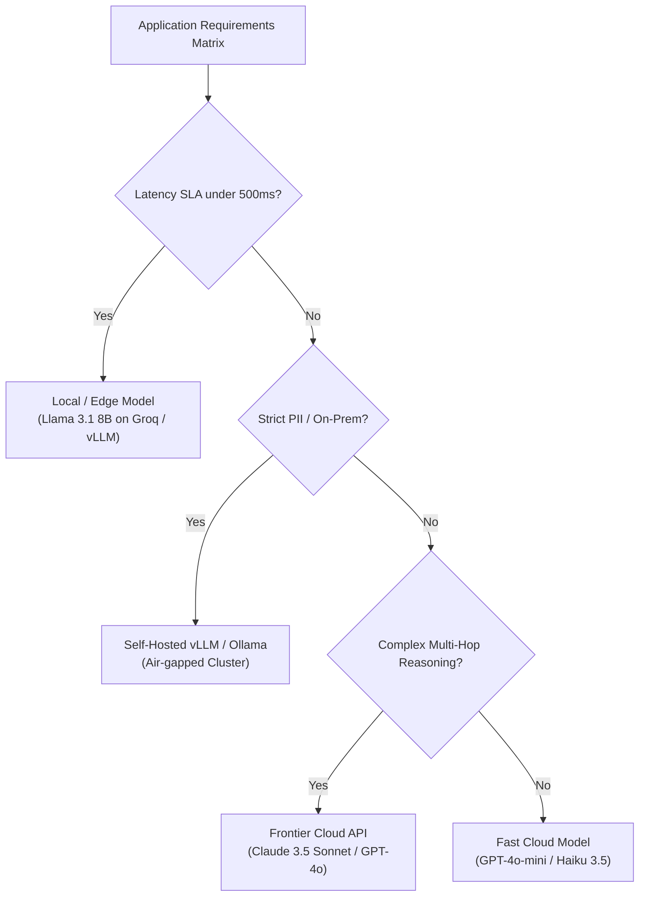

# 📹 Selecting the Right LLM for Your AI App: Running Custom Model Evals

<div className="video-card" style={{border: '1px solid #30363d', borderRadius: '8px', padding: '16px', marginBottom: '24px', background: 'rgba(56, 139, 253, 0.05)'}}>
  <div style={{display: 'flex', gap: '16px', flexWrap: 'wrap'}}>
    <div><strong>Instructor:</strong> Nitish Singh (CampusX)</div>
    <div><strong>Duration:</strong> 7013</div>
    <div><strong>Course:</strong> Module 6: LLM Evaluation & Observability</div>
    <div><strong>Watch Link:</strong> <a href="https://www.youtube.com/watch?v=RG5A-W3eMHI" target="_blank" rel="noopener noreferrer">YouTube Lecture ↗</a></div>
  </div>
</div>

## 📌 Executive Summary

Selecting the optimal foundation model for an enterprise application requires balancing four architectural trade-offs: Reasoning Quality, Latency (TTFT & TPS), Cost per Million Tokens, and Operational Privacy/Sovereignty.

This lesson guides engineers through running custom domain evaluations to select the right model for their specific workload.

---

## 🏗️ System Architecture & Execution Flow



---

## 📖 Core Concepts & Technical Deep Dive

### 1. The Four Dimensions of Selection
1. **Intelligence & Task Alignment:** Extraction vs. creative writing vs. complex code generation.
2. **Latency Profiles:** Time to First Token (TTFT) governs conversational responsiveness; Tokens per Second (TPS) governs bulk batch workflows.
3. **Economics:** Input vs output pricing. For RAG with large 100k contexts, input token cost dominates.
4. **Data Compliance:** HIPAA, GDPR, and enterprise NDA constraints often mandate self-hosted weights.

### 2. Designing a Custom Selection Matrix
Rather than testing 50 models, shortlist 3-4 candidates across tiers (e.g. GPT-4o, Claude 3.5 Haiku, Llama 3.1 8B, DeepSeek-V3). Run your domain golden dataset and generate a Pareto frontier plot.

---

## 💻 Production Implementation

```python
# Model Selection Cost-Performance Score Calculator
def calculate_model_score(quality_score: float, cost_per_m_tokens: float, latency_ms: float) -> float:
    # Weighted composite score: Quality (60%), Cost (20%), Latency (20%)
    norm_cost = max(0.1, 10.0 - cost_per_m_tokens) / 10.0
    norm_lat = max(0.1, 2000.0 - latency_ms) / 2000.0
    
    total = (0.6 * quality_score) + (0.2 * norm_cost) + (0.2 * norm_lat)
    return round(total, 3)

models = {
    "Claude 3.5 Sonnet": {"quality": 0.94, "cost": 3.00, "latency": 800},
    "GPT-4o-mini": {"quality": 0.82, "cost": 0.15, "latency": 350},
    "Llama-3.1-8B (Groq)": {"quality": 0.76, "cost": 0.05, "latency": 120}
}

for name, specs in models.items():
    score = calculate_model_score(specs["quality"], specs["cost"], specs["latency"])
    print(f"{name}: Composite Production Score = {score}")
```

---

## ⚙️ Production Gotchas & Best Practices

:::tip Multi-Model Routing
Production architectures rarely use a single model. Route simple classification and extraction tasks to cheap, fast SLMs (GPT-4o-mini), and route complex queries to frontier reasoning models.
:::

:::warning Context Cost Traps
When using 128k context windows in RAG, a single query can cost $0.05+. Without prompt caching (Anthropic/OpenAI prompt cache), high-volume systems will exceed budget limits rapidly.
:::

---

## 📊 Architectural Reference & Comparison

| Model Tier | Representative Models | Ideal Workloads | Estimated Cost / 1M In |
| :--- | :--- | :--- | :--- |
| **Frontier Reasoning** | Claude 3.5 Sonnet, GPT-4o, o3-mini | Code, complex agents, difficult reasoning | $2.50 - $15.00 |
| **Fast Cloud Utility** | GPT-4o-mini, Claude 3.5 Haiku | Summarization, structured extraction, basic RAG | $0.15 - $0.80 |
| **Open On-Prem SLM** | Llama 3.1 8B, Gemma 2 9B, Mistral | High-volume privacy, low-latency edge | Compute infrastructure |

---

## 📚 Key Takeaways & Enterprise Checklist

- [ ] **Architecture Verification:** Ensure your design addresses latency, decoupled interfaces, and strict data validation contracts.
- [ ] **Deterministic Testing:** Run unit tests and golden dataset evaluations before shipping changes to staging or production.
- [ ] **Security & Observability:** Enforce input/output guardrails, scrub sensitive credentials/PII, and capture distributed traces.
- [ ] **Scalability & Sizing:** Calibrate model parameters, context limits, and compute instance requirements against projected request concurrency.
