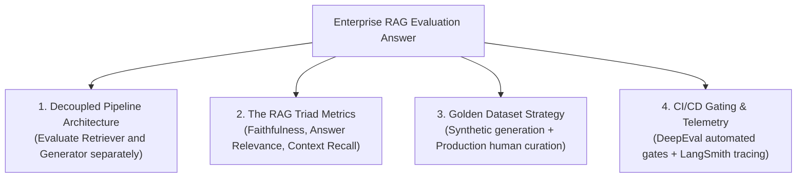

# 📹 How to Answer ＂How Do You Evaluate Your RAG App?＂ in GenAI Interviews

<div className="video-card" style={{border: '1px solid #30363d', borderRadius: '8px', padding: '16px', marginBottom: '24px', background: 'rgba(56, 139, 253, 0.05)'}}>
  <div style={{display: 'flex', gap: '16px', flexWrap: 'wrap'}}>
    <div><strong>Instructor:</strong> Nitish Singh (CampusX)</div>
    <div><strong>Duration:</strong> 2780</div>
    <div><strong>Course:</strong> Module 6: LLM Evaluation & Observability</div>
    <div><strong>Watch Link:</strong> <a href="https://www.youtube.com/watch?v=4zn-gSckVTQ" target="_blank" rel="noopener noreferrer">YouTube Lecture ↗</a></div>
  </div>
</div>

## 📌 Executive Summary

"How do you evaluate your RAG application?" is the quintessential technical question asked in AI Engineering and Generative AI interviews. Candidates who answer with vague "we test it manually" fail immediately.

This guide provides the complete production-grade architectural framework to answer this question with depth, precision, and enterprise maturity.

---

## 🏗️ System Architecture & Execution Flow



---

## 📖 Core Concepts & Technical Deep Dive

### 1. The Perfect 4-Part Interview Structure
1. **Deconstruct the System:** Explain that you never evaluate RAG as a black box. You decouple the Retrieval component from the Generation component.
2. **Articulate the RAG Triad:**
   - *Context Recall / Precision:* Did the retriever fetch all relevant information and rank it near the top?
   - *Faithfulness (Groundedness):* Are all claims in the generated response derived exclusively from the context?
   - *Answer Relevance:* Does the response directly solve the user's intent without rambling?
3. **Detail Golden Dataset Generation:**
   - 20% high-frequency historical user questions curated by domain experts.
   - 80% synthetically generated question-answer pairs created via Evol-Instruct on knowledge base documents.
4. **CI/CD Integration & Production Observability:**
   - Automated evaluation runs in GitHub Actions using DeepEval.
   - Continuous online monitoring via LangSmith with user thumbs-up/down telemetry.

---

## 💻 Production Implementation

```python
# Template Interview Demonstration Script
def describe_rag_evaluation():
    principles = [
        "1. Decoupled Evaluation: Separate retriever metrics (MRR, Hit Rate) from generator metrics.",
        "2. The RAG Triad: Measure Faithfulness (groundedness), Answer Relevancy, and Context Precision.",
        "3. Curated Golden Set: 200 human-verified edge cases + synthetic multi-hop reasoning questions.",
        "4. Automated Gates: Pre-merge CI checks with DeepEval blocking any PR dropping Faithfulness below 0.90.",
        "5. Production Observability: 5% sampled online evaluation in LangSmith with trace waterfalls."
    ]
    return "\n".join(principles)

print(describe_rag_evaluation())
```

---

## ⚙️ Production Gotchas & Best Practices

:::tip Mention Edge Cases Unprompted
In interviews, proactively discuss how your evaluation suite tests for edge cases: empty retrieval contexts, contradictory knowledge base documents, and adversarial prompt injections.
:::

:::warning Avoid Tool-Only Answers
Do not just say "I use Ragas". Interviewers want to understand the underlying statistical principles, metric formulas, and how you act when a metric degrades.
:::

---

## 📊 Architectural Reference & Comparison

| Interview Topic | Junior / Shallow Response | Senior Production Response |
| :--- | :--- | :--- |
| **Methodology** | "We prompt the model and check if it looks right." | "We maintain a decoupled evaluation suite measuring the RAG Triad." |
| **Retriever Evals**| "If the answer is right, retrieval was good." | "We evaluate retriever Hit Rate@5 and MRR independently using ground truth chunk IDs." |
| **Hallucinations** | "We set temperature to 0 to prevent hallucination." | "We compute G-Eval Faithfulness scores measuring sentence entailment against context." |
| **Production** | "We read user complaints in Discord." | "We capture telemetry in LangSmith and sample 5% of traces to an automated judge." |

---

## 📚 Key Takeaways & Enterprise Checklist

- [ ] **Architecture Verification:** Ensure your design addresses latency, decoupled interfaces, and strict data validation contracts.
- [ ] **Deterministic Testing:** Run unit tests and golden dataset evaluations before shipping changes to staging or production.
- [ ] **Security & Observability:** Enforce input/output guardrails, scrub sensitive credentials/PII, and capture distributed traces.
- [ ] **Scalability & Sizing:** Calibrate model parameters, context limits, and compute instance requirements against projected request concurrency.
