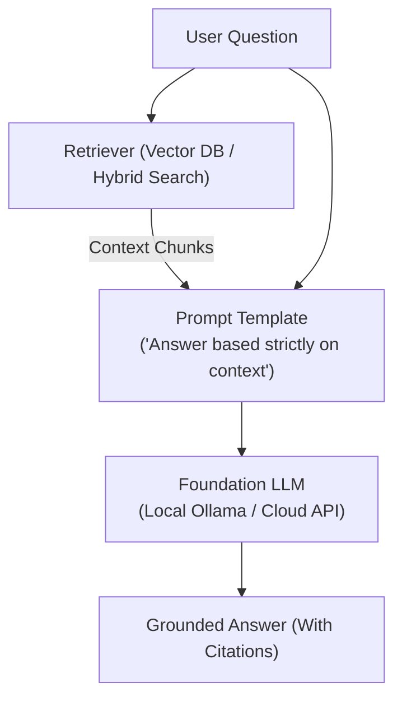

# 📹 How to Answer ＂How Do You Evaluate Your RAG App?＂ in GenAI Interviews

<div className="video-card" style={{border: '1px solid #30363d', borderRadius: '8px', padding: '16px', marginBottom: '24px', background: 'rgba(56, 139, 253, 0.05)'}}>
  <div style={{display: 'flex', gap: '16px', flexWrap: 'wrap'}}>
    <div><strong>Instructor:</strong> Nitish Singh (CampusX)</div>
    <div><strong>Duration:</strong> 46m 20s</div>
    <div><strong>Playlist:</strong> LLM Evaluation Complete Series (CampusX)</div>
    <div><strong>Watch Link:</strong> <a href="https://www.youtube.com/watch?v=4zn-gSckVTQ" target="_blank" rel="noopener noreferrer">YouTube Lecture ↗</a></div>
  </div>
</div>

## 📌 Executive Summary & Learning Objectives

This lecture covers **How to Answer ＂How Do You Evaluate Your RAG App?＂ in GenAI Interviews**, focusing on production implementations, edge cases, and industry standards:
- Core intuition, architecture, and underlying mechanisms.
- Key differences between theoretical research implementations and scalable enterprise patterns.
- Concrete Python walkthroughs, error recovery, and performance optimization.

---

## 🏗️ Architecture & Conceptual Workflow



---

## 📖 Core Concepts & Technical Deep Dive

### 1. Architectural Foundations
In modern production AI engineering, **How to Answer ＂How Do You Evaluate Your RAG App?＂ in GenAI Interviews** is essential for ensuring reliability, low latency, and deterministic outcomes. As AI systems evolve from naive prompt-in / completion-out scripts into distributed systems, engineers must handle:
- **State management & consistency:** Ensuring intermediate states and tool invocations are tracked.
- **Error boundaries & recovery:** Graceful degradation when external LLMs or vector stores encounter rate limits or network partitions.
- **Resource utilization & cost efficiency:** Caching common queries and reducing unnecessary foundation model token expenditure.

### 2. Operational Considerations
- **Latency Optimization:** Pre-computing embeddings, utilizing asynchronous non-blocking event loops, and streaming tokens via Server-Sent Events (SSE).
- **Security & Sandboxing:** Validating inputs before ingestion, sanitizing LLM outputs, and isolating tool execution environments.

---

## 💻 Production Implementation Walkthrough

```python
from langchain_core.prompts import ChatPromptTemplate
from langchain_core.runnables import RunnablePassthrough
from langchain_core.output_parsers import StrOutputParser
from langchain_community.chat_models import ChatOllama

# RAG Prompt with strict grounding
rag_template = """Answer the question based strictly on the provided context:
Context:
{context}

Question: {question}
Answer:"""

prompt = ChatPromptTemplate.from_template(rag_template)
llm = ChatOllama(model="llama3", temperature=0.1)

# Format documents helper
def format_docs(docs):
    return "\n\n".join(doc.page_content for doc in docs)

# Complete RAG Chain
rag_chain = (
    {"context": retriever | format_docs, "question": RunnablePassthrough()}
    | prompt
    | llm
    | StrOutputParser()
)
```

---

## 💡 Production Best Practices & Tips

:::tip Production Deployment Guideline
When deploying How to Answer ＂How Do You Evaluate Your RAG App?＂ in GenAI Interviews in enterprise environments, always configure automated retries with exponential backoff and telemetry tracing (such as OpenTelemetry or LangSmith).
:::

:::warning Common Failure Modes
Watch out for state contamination across concurrent requests. Ensure each session or user interaction uses an isolated thread ID or execution context.
:::

---

## 🎯 Key Takeaways & Quick Reference

| Dimension | Production Standard | Pitfall to Avoid |
| :--- | :--- | :--- |
| **Execution** | Async / Non-blocking with timeouts | Synchronous blocking calls in event loops |
| **Data Validation** | Strict Pydantic v2 schemas | Untyped dictionary access |
| **Monitoring** | Distributed tracing & latency percentiles | Relying only on standard console logs |

## ⏱️ Lecture Timeline & Key Topics

| Timestamp | Key Topic / Concept Discussed |
| :--- | :--- |
| **00:00:00** | सेशन में हम क्या करने वाले हैं, वह बताने... |
| **00:11:34** | आप ऑब्वियसली सबसे पहले क्या करोगे? आप इस... |
| **00:23:09** | स्टेट ऑफ द आर्ट लाइब्रेरी है। मोस्ट ऑफ़ द... |
| **00:35:14** | कैसे हैंडल कर रही है। तो आप लोगों ने... |
| **00:46:14** | आज इतना ही कर रहे हैं।... |


---

---

## 📜 Complete Lecture Transcript (English)

> **Language:** English | **Source:** `12 - How to Answer ＂How Do You Evaluate Your RAG App？＂ in GenAI Interviews ｜ CampusX.hi.srt` | **Total Segments:** 24 | **Word Count:** ~8,006 words

<details>
<summary><b>Click to expand full chronological transcript (24 timestamped intervals)</b></summary>

#### ⏱️ [00:00 ➔ 00:02]

सेशन में हम क्या करने वाले हैं, वह बताने के पहले एक बार अभी तक का रिककैप देना चाहूंगा इस पूरे प्लेलिस्ट का। बिकॉज़ हमने अभी तक दो बड़े माइलस्टोनस कवर कर लिए हैं इस प्लेलिस्ट में। तो एक बार थोड़ा पता होना चाहिए कि हम कहां पे लाई कर रहे हैं पूरे के पूरे करिकुलम में। सो एलएलएम ईवेल का ये जो प्लेलिस्ट है इसमें हमने पहले तीन-चार लेक्चर्स जो स्पेंड किए वो हमने काइंड ऑफ इंट्रोडक्शन या फिर आप बोल सकते हो फंडामेंटल्स में कवर किए जहां पे हमने समझा कि मॉडल एलएलएम वेल्स की जरूरत क्यों है अ क्या होते हैं एलएलएम ई वेल्स ये सारी चीजें कवर की हमने डिस्कस किया रेफरेंस बेस्ड इव्स रेफरेंस प्री ई वेल्स हमने डिस्कस किया ऑनलाइन ई वेल्स ऑफलाइन ई वेल्स ्स ये सारे कांसेप्ट्स डिस्कस किए और जो सबसे इंपॉर्टेंट कांसेप्ट डिस्कस किया वो ये था कि दो तरह के एलएलएम इवैल्व्स होते हैं। एक होते हैं मॉडल इव्स और दूसरे होते हैं एप्लीकेशन इवल्स और हमने ये बात की थी कि हम एप्लीकेशन इवल्स के ऊपर ज्यादा फोकस करेंगे। बट हमने फर्स्ट जाकर के मॉडल इवेल्स को कवर किया जो हम पिछले दो-तीन सेशंस में कर रहे हैं। तो मॉडल इवा्स भी पढ़ते टाइम हमने ये डिस्कस किया था कि मॉडल इवेल्स में भी दो तरह के इवेल्स होते हैं। एक होते हैं स्टैंडर्डाइज्ड इवल्स जिनको हम बेंचमार्क्स बुलाते हैं। जो हमने अ नॉलेज कैपेबिलिटी वाला पढ़ पढ़ा था जहां पे हमने मल्टीपल बेंचमार्क्स डिस्कस किए थे वो इस टॉपिक के अंदर आता है। और फिर हमने यह भी डिस्कस किया था कि आपके अपने एप्लीकेशन के हिसाब से भी जब आपको मॉडल चूज़ करना होता है तो यू कैन रन कस्टम मॉडल इव्स जो आप अपना खुद का डेटा सेट बना के रन करते हो। तो ये हमने प्रीवियस लेक्चर में कवर किया। तो इन शॉर्ट हमने इस प्लेलिस्ट में अभी तक इतना कुछ कवर किया है। और अब इस प्लेलिस्ट का सबसे इंपॉर्टेंट पार्ट आने वाला है व्हिच इज़ दिस एप्लीकेशन इव्स। और यह हम आज से शुरू करेंगे। आज से

#### ⏱️ [00:02 ➔ 00:04]

हम यह सीखेंगे कि अगर आपके पास एक एलएलएम बेस्ड एप्लीकेशन है तो आप उसको कैसे इवैलुएट कर सकते हो बेस्ड ऑन ऑल द नॉलेज दैट वी हैव गैदर्ड टिल नाउ। ठीक है? और यहां पे भी एक चीज आपको समझनी पड़ेगी कि कई तरह के एलएलएम बेस्ड एप्लीकेशनेशंस हो सकते हैं। राइट? सो आपके पास सिंपल चैटबॉट्स हो सकते हैं या फिर आपके पास रैग बेस्ड चैटबॉट हो सकते हैं या फिर आपके पास एजेंट्स हो सकते हैं। ऑल ऑफ दीज़ आर एग्जांपल्स ऑफ एलएलएम बेस्ड एप्लीकेशनेशंस। और अगर एग्जांपल दूं तो मल्टीमोडल एप्स हो सकते हैं। बेसिकली ऐसे एप्लीकेशनेशंस जहां पे टेक्स्ट के अलावा भी किसी मोटलिटी में बात या काम किया जा रहा है। फॉर एग्जांपल इमेज जनरेटर है। दैट इज आल्सो अ एलएलएम बेस्ड एप्लीकेशन बट वहां पे आप इमेज जनरेट कर रहे हो। राइट? फिर आपका और हो सकता है फिक्स्ड स्कीमा आउटपुट टाइप ऑफ एप्लीकेशन। जहां पर आपका एप्लीकेशन एलएलएम को यूज करके कुछ फिक्स्ड स्कीमा आउटपुट देता है। जिसका एग्जांपल हो सकता है Zomato वाला जो केस स्टडी हमने डिस्कस किया था दो-तीन लेक्चर्स पहले जहां पे आप ईमेल को रीड कर रहे हो उसके कंटेंट को और आप उसको क्लासिफाई कर रहे हो कि वो सपोर्ट ईमेल है या फिर रिफंड ईमेल है या फिर टेक्निकल ईमेल है। तो यहां पे आउटपुट विल फॉलो अ फिक्स्ड स्कीमा। तो ये भी एक टाइप का एलएलएम बेस्ड एप्लीकेशन होता है। तो ऑनेस्टली इट इज नॉट पॉसिबल फॉर मी टू टीच यू ऑल काइंड ऑफ एप्लीकेशनेशंस एंड देयर एप्लीकेशन ईवेल्स। मैं ऐसा नहीं कर सकता कि मैं आपको चैटबॉट के ऊपर एप्लीकेशन ईवेल कैसे चलाया जाता है वो भी सिखाऊं। रैक के ऊपर क्या रैक के ऊपर भी सिखाऊं। एजेंट्स के ऊपर भी सिखाऊं। तो मेरे सामने ये डिसीजन था कि मुझे सेलेक्ट करने थे और मैंने अपने दिमाग में रखा था कि मैं दो चीजें आपको पढ़ाऊंगा। तो मैंने दो चीजें जो सेलेक्ट की है जो हम आगे पढ़ने वाले

#### ⏱️ [00:04 ➔ 00:06]

हैं। अ उसमें से फर्स्ट है रैक बिकॉज़ बिकॉज़ इट इज़ वेरीेंट। मोस्ट ऑफ द चार्ट पॉट्स दैट यू विल बिल्ड इन योर प्रोफेशनल जर्नी विल हैव रैग फंक्शनैलिटी। तो रैग उस सेंस में बहुतेंट हो जाता है। एंड सेकंड आई विल टीच यू एजेंट्स का एप्लीकेशन इवल। क्योंकि एजेंट्स भी बहुत इंपॉर्टेंट है। राइट? तो ये जो बाकी की चीजें हैं जैसे कि एक सिंपल चैटबॉट है जिसमें ना कोई रैक का फंक्शनैलिटी है ना कोई एजेंट का फंक्शनैलिटी है वो मैं आपको नहीं सिखा रहा कि उसको इवैलुएट कैसे करना है। आई वुड एक्सपेक्ट कि अगर आपने ज्यादा डिफिकल्ट वाली चीजें पढ़ ली तो फिर आप ऑटोमेटिकली इजी वाली चीजें कर ही लोगे। ठीक है? अ दिस वन इज़ आल्सो काइंड ऑफ़ ईजी। ये जो है ना ये भी काइंड ऑफ़ इजी ही है। मल्टीमोडल ऐप वाला थोड़ा सा अलग है। आई वुड नॉट से इट इज़ डिफिकल्ट। इट इज़ स्लाइटली डिफरेंट फ्रॉम द अदर थिंग्स। बट अगेन यू कैन डू इट। द ओनली थिंग इज़ कि यह ना थोड़ा कम एग्ज़िस्ट करते हैं प्रोडक्शन सेटअप में। मतलब बहुत कम कंपनीज़ हैं। बहुत कम प्रोजेक्ट्स हैं जो मल्टीमोडल नेचर के होते हैं। ज्यादातर आपको रैग और एजेंट वाले डिज़ पैटर्न्स देखने को मिलेंगे। दैट इज व्हाई वी आर गोइंग टू कवर रैग एंड एजेंट्स का एप्लीकेशन इवैल गोइंग फॉरवर्ड। तो अब आज का सेशन और अगले दो-तीन सेशंस जो हमारे रहने वाले हैं वो होने वाले हैं रैग इवल के ऊपर। बेसिकली हम एक रैग चार्टबॉट बनाएंगे और उसको प्रॉपर्ली इवैलुएट करेंगे। और ये तीनचार सेशंस देखने के बाद आप इस बहुतेंट इंटरव्यू क्वेश्चन को बहुत आसानी से आंसर कर पाओगे। क्वेश्चन है हाउ डू यू इवैलुएट योर रैक चैट बॉट? वेरी फेमस क्वेश्चन फॉर जेएनएआई इंटरव्यूज। ऑलमोस्ट 10 में से आठ इंटरव्यूज में पूछा जाता है। एंड मोस्ट ऑफ द टाइम्स स्टूडेंट्स बहुत कन्विंसिंग आंसर नहीं दे पाते। बहुत लोगों को तो पता ही नहीं होता है क्योंकि उन्होंने कभी इवाइ्स पढ़ा ही नहीं होता। जिन्होंने इव्स पढ़ा भी होता है वो बहुत स्ट्रक्चरर्ड प्रॉपर

#### ⏱️ [00:06 ➔ 00:08]

आंसर नहीं दे पाते। आई गारंटी यू कि अगर आप आज का सेशन और अगले तीन-चार सेशंस प्रॉपर्ली देख लेते हो अच्छे से तो आप बहुत प्रॉपर आंसर दे पाओगे इस क्वेश्चन का और आप काइंड ऑफ इंप्रेस कर दोगे सामने वाले को। दैट इज माय गारंटी। सो आई होप मैं आपको समझा पाया कि हम अभी इस प्लेलिस्ट में कहां पे एकिस्ट कर रहे हैं और अगला हमारा डायरेक्शन क्या है। ठीक है? हमारा नेक्स्ट डायरेक्शन है कि बेस्ड ऑन जो भी हमने अभी तक सीखा है उसको यूज़ करके हम रैग इवल्स पढ़ने वाले हैं विद द हेल्प ऑफ अ केस स्टडी। तो अब हम लोग अपना रैग इवल स्टार्ट करते हैं। ऑब्वियसली सबसे पहले हमें एक रैग प्रोजेक्ट चाहिए पड़ेगा जिसको हम इवैल्यूएट करेंगे। तो ये प्रोजेक्ट क्या है वो मैं आपको बता देता हूं। मैंने ना जानबूझ के बहुत फैंसी प्रॉब्लम स्टेटमेंट चूज़ नहीं किया। मेरे दिमाग में बहुत अच्छे-अच्छे प्रॉब्लम स्टेटमेंट्स आ रहे थे। जिसमें बहुत अलग-अलग टाइप की चीजें आप कर सकते हो एप्लीकेशन को बनाने के प्रोसेस में। बट मुझे लगा कि यहां पे हमारा फोकस ना एक बहुत फैंसी रैग एप्लीकेशन बनाने के बजाय इस बात पे होना चाहिए कि हम एक सिंपल रैग एप्लीकेशन को भी अच्छे से इवैल्यूएट कैसे कर सकते हैं। एंड दैट इज़ व्हाई मैंने एक बहुत सिंपल प्रॉब्लम स्टेटमेंट लिया है। इट विल बी अ रैग चैट बॉट बट इट विल बी सिंपल बट उसका इवैल्यूएशन करने में आपको बहुत मजा आएगा। ठीक है? तो व्हाट वी आर बिल्डिंग इज़ कैमपस एक्स का डाउट सॉल्वर। ठीक है? सो बेसिक प्रॉब्लम स्टेटमेंट प्रेमाइस ये है कि आप लोग यह कोर्स कर रहे हो एलएलएम ईल्स का जहां पर हम हर हफ्ते अराउंड दो लेक्चर्स आपके लेते हैं और हर लेक्चर के एंड में हम आपको रिकॉर्डिंग और साथ ही साथ लेक्चर का ट्रांसक्रिप्ट भी प्रोवाइड करते हैं। राइट? तो अभी तक हर लेक्चर का एक ट्रांसक्रिप्ट है। तो हम क्या करेंगे? इन ट्रांसक्रिप्ट्स को एज डॉक्यूमेंट यूज करेंगे और इन्हीं डॉक्यूमेंट्स को हम एलएलएम में फीड करेंगे और फिर इस एलएलएम के साथ आप पूछ सकते हो

#### ⏱️ [00:08 ➔ 00:10]

कोई भी डाउट जो आपको इस पूरे प्लेलिस्ट में है। सो बेसिकली वी आर मेकिंग अ रैक चैटबॉट फॉर दिस पर्टिकुलर कोर्स। ठीक है? विथ द हेल्प ऑफ़ ऑल द ट्रांसक्रिप्ट्स दैट वी हैव। मैं आपको दोबारा रैक कैसे काम करता है वो नहीं समझाने वाला। आई प्रीटी श्योर आपने अभी तक इतनी बार पढ़ लिया होगा कि आपको पता होगा कि रैक कैसे काम करता है। रिट्रीवर होता है, जनरेटर होता है और एक वेक्टर डेटाबेस होता है। एक एंबेडिंग मॉडल होता है। यू अंडरस्टैंड ऑल ऑफ़ दैट। तो उसका वर्किंग में नहीं जा रही। बस रफली आपको प्रॉब्लम स्टेटमेंट समझा रहा हूं। दैट वी आर गोइंग टू बिल्ड अ सिंपल कैमपस एक्स डॉट डाउट सॉल्वर फॉर दिस पर्टिकुलर कोर्स। दूसरे कोर्सेस की बात नहीं कर रहा। जस्ट एलएलएम ईल्स वाला कोर्स। क्योंकि इस कोर्स के हर लेक्चर का ट्रांसक्रिप्ट हमारे पास मौजूद है। ठीक है? तो हम क्या करेंगे? हम फर्स्ट इस चार्टबॉट को इस रैग प्रोजेक्ट को बिल्ड करेंगे और फिर उसको इवैल्यूएट करेंगे। इनफैक्ट इसको बनाने के ही प्रोसेस में हम इसको इवैल्यूएट भी करते जाएंगे। ठीक है? तो आई होप आपको प्रॉब्लम स्टेटमेंट समझ में आ गया। कुछ खास यहां पे समझाने का नहीं है। तो मूव करते हैं आगे और डिस्कस करते हैं सबसे इंपॉर्टेंट चीज कि जब ये चार्टबॉट बन जाएगा तो हम इसको इवैल्यूएट कैसे करेंगे ये हम लोग समझते हैं। ठीक है? तो हम लोग ना एक प्रॉपर इवल स्वीट बनाने वाले हैं। मैंने आपको शायद किसी एक लेक्चर में पढ़ाया था। आई डोंट नो आपको याद है कि नहीं कि जभी भी आप कोई एक एलएलएम बेस्ड एप्लीकेशन बनाते हो तो उसका सिर्फ एक सिंगल इवैल्यूएशन नहीं होता। उसके मल्टीपल इवैल्यूएशंस होते हैं। तो हम वही करने वाले हैं कि हम हर एंगल से हमारे बनाए हुए रैक चार्टबॉट को इवैल्यूएट करेंगे एट डिफरेंट लेवल्स और वो सारे इवैल्यूएशंस के पास होने पे ही हम उसको डिप्लॉय करेंगे और डिप्लॉय होने के बाद भी उसको हम इवैल्यूएट करेंगे विथ द हेल्प ऑफ ऑनलाइन इवल्स। तो ये जो पूरा प्रोसेस रहने वाला है इस पूरे रैक चार्ट पॉट के इवैल्यूएशन का वो फ्रेमवर्क मैं आपके साथ शेयर करना चाहता हूं। ठीक है? तो सबसे

#### ⏱️ [00:10 ➔ 00:12]

पहली और सबसे इंपॉर्टेंट बात कि हम लोग अपने रैक चार्टबॉट को तीन लेवल्स पे इवैल्यूएट करेंगे। सबसे पहला लेवल होगा कंपोनेंट लेवल। दूसरा होगा पाइपलाइन पाइपलाइन लेवल और तीसरा होगा एप्लीकेशन या फिर सिस्टम लेवल। ये मैंने आपको पहले भी पढ़ाया है कि आप किसी भी एलएलएम बेस्ड एप्लीकेशन को तीन लेवल पे इवैल्यूएट कर सकते हो। ये तीन लेवल्स होते हैं। ठीक है? तो सबसे पहले बात करते हैं कंपोनेंट लेवल की। कंपोनेंट लेवल पे आप क्या करते हो कि जिस टाइम पे आप रैक चार्टबॉट बिल्ड कर रहे होते हो उसी टाइम पे साथ ही साथ कंपोनेंट्स को इवैल्यूएट भी करते चले जाते हो। सो थोड़ा सा यहां पे डिस्कस करना पड़ेगा रैक का आर्किटेक्चर। आपको पता ही होगा। आपके पास एक रिट्रीवर होता है और आपके पास एक जनरेटर होता है और आपके पास एक वेक्टर डेटाबेस होता है जिसमें आपके सारे डॉक्यूमेंट्स वेक्टर्स की फॉर्म में स्ट होते हैं। जैसे ही आपके पास एक क्वेरी आती है आप उस क्वेरी को भेजते हो वेक्टर डेटाबेस के पास। वेक्टर डेटाबेस क्या करता है कि सबसे क्लोजेस्ट चारप रेलेवेंट डॉक्यूमेंट्स को भेजता है आपके पास। बेसिकली ये पूरा काम रिट्रीवर का है। तो रिट्रीवर आपको यहां पे क्वेश्चन प्लस रेलेवेंट कॉन्टेक्स्ट देता है। आप इस क्वेश्चन और रेलेवेंट कॉन्टेक्स्ट को जनरेटर के पास भेजते हो और जनरेटर इन दोनों चीजों को लेकर के एक आंसर जनरेट करता है। दिस इज़ द वर्किंग ऑफ अ बेसिक रैक चैट बॉट। राइट? तो अब इसको अगर स्टेप बाय स्टेप डेवलप करना है, बिल्ड करना है, तो आप ऑब्वियसली सबसे पहले क्या करोगे? आप इस रिट्रीवर को बिल्ड करोगे। एक बार जब यह रिट्रीवर बन जाएगा फिर आप इस जनरेटर को बिल्ड करोगे और इन दोनों को आप कनेक्ट कर दोगे। तो यह जो पाइप लाइन है इसी को आप रैक बुलाते हो। तो हमारा स्ट्रेटजी ये होगा कि हम स्टेप वन पे सबसे पहले रिट्रीवर को बिल्ड करेंगे। बेसिकली रिट्रीवर का कोड लिखेंगे। ठीक है? तो यहां पे वो सारा काम आप करते हो। डॉक्यूमेंट्स को लोड करके लाओगे। उसको चंकिंग करोगे।

#### ⏱️ [00:12 ➔ 00:14]

उसको एंबेडिंग मॉडल में डाल के वेक्टर्स में कन्वर्ट करोगे और उसके बाद एक रिट्रीवर की हेल्प से नया क्वेरी को ला के रेलेवेंट डॉक्यूमेंट्स को फैच करके लाओगे। ये जो पूरा काम होता है इसी को हम रिट्रीवर बुलाते हैं। राइट? तो जैसे ये रिट्रीवर हम बनाएंगे तो स्टेप टू में हम तुरंत क्या करेंगे? इस रिट्रीवर को इवैलुएट करने लग जाएंगे। इंडिपेंडेंटली जस्ट द रिट्रीवर। वी आर नॉट फोकसिंग ऑन द एंटायर एप्लीकेशन। राइट नाउ आवर एंटायर फोकस इज कि क्या जो रिट्रीवर हमने बनाया वो सही से काम कर रहा है कि नहीं और रिट्रीवर सही से काम कर रहा है इसका एक ही मतलब होता है कि गिवेन अ क्वेश्चन क्या मेरा रिट्रीवर सही डॉक्यूमेंट्स वेक्टर डेटाबेस से फैच करके ला पा रहा है या नहीं? तो यहां पे हम इवैल्यूएशन के लिए दो मैट्रिक्स को यूज़ करेंगे। वन विल बी रिकॉल जो कि यह बताता है कि जितने सही डॉक्यूमेंट्स थे उनमें से कितने डॉक्यूमेंट्स को मैं ला पाया और दूसरा होता है प्रसीजन जिसका मतलब होता है कि जितने डॉक्यूमेंट्स मैं लाया उनमें से कितने काम के डॉक्यूमेंट्स थे। तो हम इन दोनों के ऊपर हमारे रिट्रीवर को इवैलुएट करेंगे और एक बार जब ये इवैल्यूएशन हो जाएगा और हम सेटिस्फाई हो जाएंगे कि हमारा रिट्रीवर सही से काम कर रहा है तो हम स्टेप थ्री में मूव करेंगे और स्टेप थ्री में हम स्टार्ट करेंगे अपना जनरेटर को बिल्ड करना। ठीक है? तो अब हम जनरेटर का कोड लिखेंगे। जनरेटर इज़ बेसिकली अ एलएलएम जिसमें आप एक क्वेश्चन देते हो और रेलेवेंट कॉन्टेक्स्ट देते हो और वो जनरेटर उसके बदले आपको एक आंसर देता है। तो हम इसको आइसोलेशन में बिल्ड करेंगे। और इसको बनाने के बाद हम स्टेप फोर में इसको भी इवैल्यूएट करेंगे। और इसको इवैल्यूएट करने में दो-तीन मैट्रिक्स आप सीखोगे। वन विल बी फेथफुलनेस व्हिच बेसिकली टेल्स कि जो आंसर जनरेट हुआ है क्या वो गिवन कॉन्टेक्स्ट के अंदर से ही जनरेट हुआ है या फिर कुछ खुद से मॉडल ने हेलुसिनेट कर दिया। तो ये चीज हम चेक करेंगे। सेकंड हम

#### ⏱️ [00:14 ➔ 00:16]

ये चेक करेंगे कि आपका जो आंसर जनरेट हुआ है वो क्वेश्चन के साथ रेलेवेंट है कि नहीं। और थर्ड हम साइटेशन एक्यूरेसी भी जज करेंगे। आपने देखा होगा कि चार्ट जीपीटी भी कभी-कभी आंसर देता है किसी डॉक्यूमेंट को देख के तो रेफर करता है कि मैंने इस डॉक्यूमेंट के इस लाइन से ये बात उठाई है या फिर मैंने इस लिंक से ये बात उठाई है। तो इसको हम साइटेशन बोलते हैं। तो हमारा डाउट सॉल्वर क्या कर रहा है? एक गिवन क्वेश्चन के लिए डाउट सॉल्व कर रहा है। तो साथ ही साथ वो हमें बताएगा कि ये क्वेश्चन नितिश सर ने कौन से सेशन में डिस्कस किया था। तो वो ट्रांसक्रिप्ट का लिंक हम प्रोवाइड करेंगे। तो वो साइटेशन एक्यूरेसी भी हम जज किया करेंगे इन द जनरेटर। ठीक है? अब यहां पे एक इंपॉर्टेंट बात हम जनरेटर को इन आइसोलेशन इवैल्यूएट करेंगे। व्हिच बेसिकली मीन्स कि इस पॉइंट पे आपका जनरेटर इज नॉट कनेक्टेड टू द रिट्रीवर। व्हिच बेसिकली मीन्स कि इस जनरेटर को हम खुद से मैनुअली कुछ क्वेश्चन और कुछ कॉन्टेक्स्ट प्रोवाइड करेंगे। काइंड ऑफ लाइक अ गोल्डन डेटा सेट। हम इंडिपेंडेंटली प्रोवाइड कर रहे हैं। रिट्रीवर्स इसको नहीं मिल रहा। हमने अभी तक यह पाइपलाइन बनाई नहीं है। वी आर डूइंग कंपोनेंट लेवल इवैल्यूएशन। एक बार जब ये आइसोलेशन में इवैलुएट हो जाएगा जनरेटर एंड वी आर सेटिस्फाइड कि हां ये जनरेटर खुद में अच्छे से काम कर रहा है। तो फिर हमारा ये जो लेवल है ये अचीव हो जाएगा कि हमने कंपोनेंट लेवल पे चीजें कर ली। हमारा रिट्रीवर आइसोलेशन में अच्छे से काम कर रहा है। हमारा जनरेटर आइसोलेशन में अच्छे से काम कर रहा है। वी आर डन विद द स्टेज वन। उसके बाद आता है अगला स्टेज व्हिच इज स्टेप फाइव। जहां पे अब हम क्या करेंगे? हम हमारा रैक पाइपलाइन बिल्ड करेंगे। रैक पाइपलाइन बिल्ड करने का सिंपल मतलब है कि हम अपने रिट्रीवर और जनरेटर को कनेक्ट कर देंगे। बहुत सिंपल कोड है। कनेक्ट हो गया। इसके बाद आता है स्टेप सिक्स। जहां पर हम

#### ⏱️ [00:16 ➔ 00:18]

यह चेक करेंगे कि जब यह दोनों आपस में कनेक्ट हो गए और एक पाइप लाइन बन गए तो यह जो पूरी पाइप लाइन है क्या यह सही से काम कर रहा है कि नहीं? और यहां पे जो इवैल्यूएशन है वो बहुत फेमस एक टर्म है। इसको हम बोलते हैं रैक ट्रायड। अ सो बेसिकली यहां पे आप क्या करते हो? यहां पे आप जैसे ही रैक पाइपलाइन बना लेते हो तो आप तीन मैट्रिक्स चेक करते हो। और ये तीन मैट्रिक्स को हम रैक ट्रायड बुलाते हैं। क्यों बुलाते हैं? मैं आपको बताता हूं। सो यहां पे तीन चीजें एक्सिस्ट कर रही है। सबसे पहले यूजर का क्वेश्चन जो कॉन्टेक्स्ट हमें मिला है वेक्टर डेटाबेस से जो रिट्रीवर लेके आया है और जो आंसर जनरेट हुआ है अ जनरेटर के द्वारा ये तीन चीजें एक्सिस्ट करती हैं। राइट? तो इन तीनों के पेयर्स में ही तीन मैट्रिक्स एक्सिस्ट करते हैं। जैसे कि क्वेश्चन और कॉन्टेक्स्ट के लिए एक मैट्रिक एक्सिस्ट करता है जिसको हम बोलते हैं कॉन्टेक्स्ट रेलेवेंस। जो कि ये बताता है कि किसी गिवन क्वेश्चन के लिए जो कॉन्टेक्स्ट फैच हो के आया है रिट्रीवर से क्या वो रेलेवेंट है कि नहीं क्वेश्चन के साथ। ठीक है? सेकंड होता है आंसर और कॉन्टेक्स्ट इसको हम बुलाते हैं फेथफुलनेस। यह बेसिकली हमें यह बताता है कि जो आंसर जनरेट हुआ है क्या वो कॉन्टेक्स्ट से ही जनरेट हुआ है या कुछ हेलुसनेट कर गया मॉडल। और थर्ड आप ये चेक करोगे कि आपका आंसर और क्वेश्चन का आपस में रिलेशन है कि नहीं। और इसके लिए जो मैट्रिक होता है उसको हम बोलते हैं आंसर रेलेवेंस। यहां पर बेसिकली आपको यह बताया जाता है कि गिवन अ क्वेश्चन जो आंसर निकल के आया है वह क्वेश्चन के लिए रेलेवेंट है कि नहीं। तो हम इन आइसोलेशन ये तीनों मैट्रिक्स टेस्ट करते हैं हमारे रैक पाइपलाइन का। अगर ये तीनों मैट्रिक्स सही से काम कर रहे हैं इट मींस कि आपका रैक

#### ⏱️ [00:18 ➔ 00:20]

पाइपलाइन सही से काम कर रहा है। और अगर ये तीनों मैट्रिक्स हो गए तो हमारा ये पर्टिकुलर लेवल भी डन हो जाएगा। तो अभी तक का फ्लो आई गेस आपको समझ में आ रहा है। हम क्या कर रहे हैं? हम ऐसा नहीं कर रहे कि हमने पहले अपना पूरा रैक चार्टबॉट बना लिया और फिर उसको इवैलुएट कर रहे हैं। नहीं ऐसे काम नहीं होता है। आपका बिल्डिंग द चैटबॉट एंड इवैल्यूएटिंग इट। वो साथ में काम करता है। इट इज़ जस्ट लाइक सॉफ्टवेयर। सॉफ्टवेयर में आप ऐसा नहीं करते ना कि आप पूरा एप्लीकेशन बना देते हो और फिर उसको टेस्ट करते हो। नहीं आप फीचर लेवल पे भी टेस्टिंग करते हो। आप फंक्शन लेवल पे भी टेस्टिंग करते हो। यहां पे एग्जजेक्टली वही हो रहा है कि आपके कंपोनेंट्स को आपने टेस्ट किया। कंपोनेंट्स को जब जोड़ा तो पाइपलाइन को भी आपने टेस्ट किया। पाइपलाइन भी हो गई। अब आपका एप्लीकेशन आ गया तो अब आप एप्लीकेशन लेवल पे भी टेस्ट करोगे। तो आई रियली होप आपको अभी तक का फ्लो समझ में आ रहा है। ठीक है? तो अब नाउ दैट वी हैव टेस्टेड द पाइपलाइन। नेक्स्ट इज़ कि अब आप स्टेप सेवन पे एप्लीकेशन लेवल टेस्टिंग करो। यहां पर बेसिकली आप यह टेस्ट कर रहे हो कि आपका जो एप्लीकेशन है, जो डाउट सॉल्वर है, वह सही से फंक्शन कर रहा है कि नहीं। तो यहां पर कई तरह के और मैट्रिक्स आते हैं। जैसे कि एक बहुत इंपॉर्टेंट मैट्रिक है करेक्टनेस। क्या जो आंसर निकल के आया है वो करेक्ट है कि नहीं? ये आपको पता करना है। फिर एक और मैट्रिक होता है जिसको हम बोलते हैं कंप्लीटनेस। कंप्लीटनेस यह बताता है कि गिवन अ क्वेश्चन क्या आंसर उस क्वेश्चन को कंप्लीटली आंसर कर रहा है कि नहीं। मान लो आपके क्वेश्चन में दो पार्ट्स हैं बट आपका जो आंसर आया वो एक ही पार्ट को आंसर कर रहा है। दूसरे पार्ट को इग्नोर कर दिया तो कंप्लीटनेस नहीं है। भले ही एक पार्ट का आंसर करेक्ट है बट कंप्लीटनेस नहीं है। तो हम वो भी चेक करते हैं। थर्ड हम स्टाइल भी चेक करेंगे। हम कोशिश करेंगे कि हमारा जो कैंपस एक्स डाउट सॉल्वर है उसका एक्सप्लेनेशन स्टाइल वैसा ही हो जो कैंपस एक्स के टीचर्स का है। ये भी चीज हम इवैल्यूएट करेंगे और ये आप कर सकते हो। तो

#### ⏱️ [00:20 ➔ 00:22]

ये भी आता है एप्लीकेशन लेवल इवैल्यूएशन में। तो ये हो गए कुछ क्वालिटी रिलेटेड मैट्रिक्स। इसके अलावा एप्लीकेशन लेवल पे अगर आप बात करो तो आप सेफ्टी भी यहीं पे टेस्ट करोगे। आप चेक करोगे कि क्या आपका रिस्पांस टॉक्सिक तो नहीं है। या फिर आप चेक करोगे कि क्या आपका रिस्पांस किसी भी तरीके से पर्सनली आइडेंटिफाई इंफॉर्मेशन तो नहीं दे रहा है। आप चेक करोगे कि क्या आपके कैंपस एक्स डाउट सॉल्वर को जेल ब्रेक तो नहीं किया जा सकता। तो ये सेफ्टी वाले भी हम इवैल्यूएशंस स्टेप नंबर एट पे करेंगे। स्टेप नंबर एट पे हम सेफ्टी वाले इव्स रन करेंगे इसी एप्लीकेशन के ऊपर। एंड लास्टली आता है ऑपरेशंस वाले इव्स जहां पर आप तीन चीजें चेक करते हो प्राइमरली आपका लेटेंसी कितना है एप्लीकेशन का कॉस्ट कितना लग रहा है आपको पर क्वेरी पे और आप कितने टोकन स्पेंड कर रहे हो तो ये आता है स्टेप नंबर नाइन इसको हम बोलते हैं ऑप्स ईल्स ये हम टेस्ट करेंगे ठीक है तो ये जो पूरी चीज अभी तक मैंने आपको बताई कंपोनेंट पाइपलाइन और एप्लीकेशन ये जो तीन लेवल पे हम इवैलुएट कर रहे हैं हमारे पूरे एप्लीकेशन को। इसी को हम कंबाइंड फॉर्म में बुलाते हैं इवल स्वीट। दिस इज लाइक आवर एंटायर टेस्टिंग स्वीट। कभी भी हमें अपने इस एप्लीकेशन को टेस्ट करना है। तो हम सिर्फ एक टेस्ट रन ना करके ये सारे के सारे टेस्ट्स साथ में रन करते हैं। तब हमें पता चलता है कि हर एस्पेक्ट से क्या हमारा एप्लीकेशन सही काम कर रहा है या नहीं। तो इतने सारे टेस्ट्स हम करने वाले हैं। इतने सारे इवैल्यूएशंस हम करने वाले हैं। यह रहेगा हमारा इवैल्यूएशन स्ट्रेटजी। आर वी गोइंग टू जनरेट गोल्डन डेटा सेट्स? यस समर इनमें से बहुत सारे ऐसे इवेल्स हैं जिसके लिए आपको गोल्डन डेटा सेट जनरेट करने पड़ेंगे। कुछ इव्स ऐसे भी हैं जहां पे आपको गोल्डन डेटा सेट की जरूरत नहीं पड़ती है। अभी तक ना हम जो

#### ⏱️ [00:22 ➔ 00:24]

भी अभी तक की क्लासेस हुई हैं उसमें हम इवेल्स जो भी बना रहे थे वो खुद से उसका कोड लिख रहे थे। स्पेशली अगर आपने लास्ट लेक्चर देखा होगा जहां पर हम कस्टम मॉडल इव्स रन कर रहे थे वहां पर आपने देखा होगा कि मैंने खुद के कोड लिखे थे। अ बट ऐसा हम इस केस में नहीं करने जा रहे। ये सारा कोड अगर हम खुद से लिखेंगे तो इट विल बी अ वेरी बिग प्रोजेक्ट। इंस्टेड व्हाट वी विल डू इज़ वी विल यूज़ अ लाइब्रेरी जिसका नाम है डीप इवल। डीप इवल में अगर आप जाओगे तो आप देखोगे कि यह जो हमने डिस्कशन किया उसमें से बहुत सारे मैट्रिक्स ऑलरेडी एक्सिस्ट करते हैं। जैसे यहां पे देखो अगर आप रैग में जाते हो तो आप देखोगे कि आंसर रेलेवेंसी, फेथफुलनेस, कॉन्टेक्स्चुअल प्रसीजन रिकॉल, कॉन्टेक्चुअल रेलेवेंसी ये सारी चीजें ऑलरेडी एक्सिस्ट करती हैं। फिर अगर आप सेफ्टी में जाओगे तो टॉक्सिसिटी, पीआईआई लीकेज यह सारी चीजें ऑलरेडी एक्सिस्ट करती हैं। तो हम इंस्टेड ऑफ राइटिंग कस्टम कोड टू इवैलुएट आवर रैग एप्लीकेशन वी विल इंस्टेड यूज़ दिस ग्रेट लाइब्रेरी कॉल्ड डीप इवल जो कि अभी का स्टेट ऑफ द आर्ट लाइब्रेरी है। मोस्ट ऑफ़ द कंपनीज़ बड़ी कंपनीज़ एलएलएम बेस्ड इवैल्यूएशंस करने के लिए इसी लाइब्रेरी को यूज़ करती है। एंड द बेस्ट पार्ट अबाउट दिस लाइब्रेरी इज कि यह एकदम पाई टेस्ट जो मेन लाइब्रेरी है पाइथन की सॉफ्टवेयर टेस्टिंग के लिए उस पे बेस्ड है पूरा सिंटेक्स। तो अगर आपने सॉफ्टवेयर टेस्टिंग कभी भी करी है यूजिंग पाई टेस्ट तो ये लाइब्रेरी आपको बहुत एट होम फील कराएगी। तो वी आर गोइंग टू यूज़ दिस लाइब्रेरी। वी आर नॉट गोइंग टू यूज़ रागाज़ बिकॉज़ दोनों चीजों को आप यूज़ कर सकते हो। आप रागाज़ में भी ये सारा काम कर सकते हो। आप डीपी इवल में भी कर सकते हो। आई एम सेलेक्टिंग डीप इवल पर्टिकुलरली बिकॉज़ ऑफ़ टू रीज़ंस। फर्स्ट इज़ रागास हमने ऑलरेडी पढ़ा रखा है एडवांस बैग वाले कोर्स में। सेकंड डीप ईवेल ज्यादा ब्रॉडर लाइब्रेरी है। इसका जो स्कोप है वो और चीजों तक भी है। जैसे कि एजेंट्स हुए। यू कैन सी यहां पे आप एजेंट्स, मल्टीटर्न

#### ⏱️ [00:24 ➔ 00:26]

चैटबॉट्स, नॉन एलएलएम एप्लीकेशनेशंस, इमेज बेस एप्लीकेशनेशंस हर तरह की चीज के लिए डीपी वेल को यूज़ कर सकते हो। तो इसलिए इसका अडॉप्शन भी ज्यादा है। एंड देयर इज अ गुड चांस कि एकद साल बाद ये एलएलएम इवैल्यूएशंस की एकदम बेंचमार्क लाइब्रेरी बन जाएगी। लाइक इट विल बिकम द स्टैंडर्ड। तो इट्स अ गुड स्ट्रेटजी कि हम डीप इवल पे ज्यादा फोकस करें। आई रियली होप आपको इससे कोई प्रॉब्लम नहीं है। या रागास इज़ गुड। ऑब्वियसली उसमें कोई प्रॉब्लम नहीं है। जैसा मैंने अभी दो रीज़ंस बताए। हमने ऑलरेडी कवर भी कर रखा है। एंड सेकंड डीपी वाल इज़ अ बेटर लाइब्रेरी इन कंपैरिजन टू रागास। अब एक बहुत इंपॉर्टेंट डिस्कशन एक बार जब आप अपना इवाल स्वीट बना लेते हो जो कि हमने अभी बनाया उसके बाद आता है एक बहुत इंपॉर्टेंट टास्क जिसको हम बोलते हैं रिग्रेशन टेस्टिंग। उसके बाद हम करते हैं रिग्रेशन टेस्टिंग। रिग्रेशन टेस्टिंग क्या होता है? द रिग्रेशन टेस्टिंग इज बेसिकली द एक्ट ऑफ रनिंग योर इवल स्वीट ऑन योर एप्लीकेशन। अभी तक हम क्या कर रहे हैं? हम हमारा इवल स्वीट बिल्ड कर रहे हैं। हम अलग-अलग इवैल्यूएशन का कोड लिख रहे हैं फॉर डिफरेंट-डिफरेंट कंपोनेंट्स एंड पाइपलाइंस एंड एप्लीकेशन। एक बार जब वो पूरी चीज बन जाती है तो उसको जब आप रन करते हो एक साथ पूरे एप्लीकेशन के ऊपर इसको हम बोलते हैं रिग्रेशन टेस्टिंग। रिग्रेशन टेस्टिंग का सिंपल फंडा ये होता है कि अगर आपका एक वर्जन वन ऑफ द सॉफ्टवेयर रन कर रहा है। अब आपने वर्जन टू बनाया ऑफ द सेम सॉफ्टवेयर। तो हाउ डू यू नो वर्जन टू इज ऑब्जेक्टिवली नॉट वर्स देन वर्जन वन? क्या मेरा एप्लीकेशन और खराब तो नहीं हो गया? ये मैं कैसे टेस्ट करूंगा? इसी का आंसर आपको मिलता है रिग्रेशन टेस्टिंग में। तो रिग्रेशन टेस्टिंग में कुछ खास होता नहीं है। बेसिकली आपने जो पूरा अपना इवेल स्वीट बनाया है आप उसको एक बार में रन कर देते हो और रन करने से आपको

#### ⏱️ [00:26 ➔ 00:28]

रिजल्ट्स मिलते हैं। पूरा एक रिपोर्ट मिलती है कि ये मैट्रिक में इतना है उससे कम हो गया। ये मैट्रिक में इतना है उससे ज्यादा हो गया। तो इस पूरे के पूरे रिग्रेशन टेस्टिंग को रन करने से अपने सामने एक बहुत क्लियर पिक्चर आ जाता है कि जो नया वर्जन ऑफ द सॉफ्टवेयर हमने बनाया है क्या वो ऑब्जेक्टिवली पिछले वाले वर्जन से बेटर है या नहीं और उसी के बेसिस पे फिर ये डिसाइड होता है कि हम नए वाले वर्जन को डिप्लॉय करेंगे या फिर नहीं करेंगे। ठीक है? तो मैं आपको एकदम सिंपल शब्दों में समझाता हूं। सो होगा क्या? स्टेप बाय स्टेप हमारे पास हम एक प्रोजेक्ट फोल्डर बनाएंगे। उस प्रोजेक्ट फोल्डर में एसआरसी बोल के एक फोल्डर होगा जिसमें हम अपना रैक चार्टबॉट का सोर्स कोड लिखेंगे। यहां पे हमारी रिट्रीवर की फाइल होगी, जनरेटर की फाइल होगी, रैक पाइपलाइन की फाइल होगी। हो सकता है हम फास्ट एपीआई यूज़ करें एपीआई बनाने के लिए। हो सकता है हम स्ट्रीमलेट को यूज़ करें यूआई बनाने के लिए। तो ये सारा कोड एसआरसी में होगा। उसके अलावा हमारे प्रोजेक्ट फोल्डर में एक इव्स बोल के एक और फोल्डर होगा जिसमें हमारी सारी इवैल्यूएशन की फाइल्स होंगी। तो यहां पर आपका एक रिट्रीवर डॉट py फाइल होगी या ईल अंडरस्कोर रिट्रीवर डॉट py फाइल होगी जो बेसिकली ये वाला काम करेगी। फिर आपके पास सिमिलरली एक और फाइल होगी जिसका नाम होगा eval अंडरsर जनरेटर डॉटpy जिसमें हम इसको इवैलुएट करने का कोड लिखेंगे। सिमिलरली आप समझ पा रहे हो एक रैक पाइपलाइन का अलग फाइल होगा। एक एप्लीकेशन टेस्ट करने का अलग फाइल होगा। सेफ्टी का अलग फाइल होगा। ऑपरेशंस का अलग फाइल होगा। तो ये जो बेसिकली ये जो इवैल फोल्डर के अंदर ये जो सारी फाइल्स पड़ी हुई है जहां पे हमने अपने सारे टेक्स्ट्स लिखे हुए हैं इसी को हम बुलाते हैं अपना इवल स्वीट। और फिर क्या होगा? सारे फोल्डर्स के बाहर हमारा एक फाइल होगा जिसको हम बोलेंगे रन

#### ⏱️ [00:28 ➔ 00:30]

इव्स डॉट पीवाई और इसके अंदर क्या कोड लिखा होगा कि जैसे ही हम इस फाइल को ट्रिगर करेंगे तो ये फाइल क्या करेगी एक-एक करके ये सारे के सारे टेस्ट्स को हमारे इस एप्लीकेशन के ऊपर रन कर देगी और हमें एक रिपोर्ट जनरेट करके करके दे देगी। और उसी रिपोर्ट को जब आप एनालाइज करोगे तो आपको यह समझ में आएगा कि आपका नया वर्जन ऑफ द सॉफ्टवेयर पिछले वाले वर्जन से ऑब्जेक्टिवली बेटर है या नहीं। राइट? आपका रिट्रीवर वाला फाइल यह बता रहा है कि आपका नया रिट्रीवर पिछले वाले रिट्रीवर से बेटर है या नहीं। नया वाला जनरेटर यह बता रहा है कि यह वाली फाइल बता रही है कि नया वाला जनरेटर पिछले वाले जनरेटर से बेटर है कि नहीं। एंड सो ऑन। आई गेस यू अंडरस्टैंड। दिस इज हाउ यू डू रिग्रेशन टेस्टिंग इज द कांसेप्ट ऑफ रिग्रेशन टेस्टिंग क्लियर हमने क्या किया स्टेप बाय स्टेप हमने एप्लीकेशन बनाया एप्लीकेशन बनाने के प्रोसेस में हमने अपना इवैल स्वीट बिल्ड किया जिसमें हमने मल्टीपल इवैल्यूएशन फाइल्स क्रिएट की और फिर उन सारी इवैल्यूएशन फाइल्स को रन करने का हमारे पास एक सिंगल कोड है जिसको बोलते हैं रन evalpy तो जभी भी हमारा एप्लीकेशन कंप्लीट होता है या उसमें हम कुछ चेंजेस करते हैं तो ये रन इव evspy फाइल को हम रन कर देते हैं और ये हमें कंप्लीट रिपोर्ट बना के देता है कि भाई नया वर्जन पिछले वर्जन के कंपैरिजन में कहां पे स्टैंड करता है। इससे हमें समझ में आ जाता है कि नए वर्जन को डिप्लॉय करना चाहिए या नहीं करना चाहिए। अब यहां पे एक चीज और मैं आपको थोड़ा समझाना चाहता हूं। हालांकि यहां पे हम अब जो डिस्कशन करेंगे वो थोड़ा सा काइंड ऑफ एलएलएम ऑप्ट्स के डोमेन में ज्यादा आएगा। इंजीनियरिंग के डोमेन में ज्यादा आएगा। रादर देन जस्ट इवैल्यूएशन। बट मैं आपको बताना चाहता हूं बिकॉज़ इट इज़ रिलेटेड। सो रिग्रेशन टेस्टिंग जो होती है ना वो बहुत ही अ काइंड ऑफ एडवांस्ड तरीके से की जाती है। मैंने जो आपको अभी बताया

#### ⏱️ [00:30 ➔ 00:32]

वो बहुत बेसिक तरीका है कि आपने बस इस फाइल को रन कर दिया। इस फाइल ने क्या किया? आपके सारे मैट्रिक्स को कंपेयर कर लिया पिछले वाले वर्जन से और बता दिया कि नया वाला वर्जन बेटर है या नहीं। बट इसमें अभी और बहुत तरह की चीजें की जा सकती है। ठीक है? क्या मैं आपको बताता हूं। सबसे पहली चीज यह होती है कि इसमें आप एक्सपेरिमेंट ट्रैकिंग कर सकते हो। सो अगर आपने एमएलप्स पढ़ा होगा तो वहां पर आपने शायद एमएल फ्लो के बारे में सुना होगा जिसको हम यूज़ करते हैं टू रन मल्टीपल एक्सपेरिमेंट्स ऑन आवर एप्लीकेशन। तो यहां पे भी आप एग्जैक्टली यही काम कर सकते हो। सो बेसिकली व्हाट यू विल डू इज़ कि आपने अपना एप्लीकेशन फॉर द फर्स्ट टाइम बिल्ड किया। अब आपके कुछ सेटिंग्स होंगे। राइट? आपका चंकिंग के लिए आप कितने कैरेक्टर्स यूज कर रहे हो? ओवरलैप कितना है? आप टेंपरेचर कितना यूज कर रहे हो? आपके एंबेडिंग मॉडल से रिलेटेड कुछ-कुछ सेटिंग्स होंगी। तो ये सारी सेटिंग्स आपने एक जगह पर रख ली और आपने फर्स्ट टाइम अपने इस इवल स्वीट को चलाया। तो ये इवाल स्वीट क्या करेगा? आपको सारे मैट्रिक्स के लिए कुछ नंबर्स दे देगा। फॉर एग्जांपल आपका रिट्रीवर का रिकॉल आया मान लो82 और प्रसीजन आया मान लो 68 तो इस तरह से हर मैट्रिक का कुछ-कुछ नंबर आ जाएगा। तो आप क्या करोगे? ये जो आपने रन अभी किया अपने सॉफ्टवेयर को और ये जो सारे कॉन्फ़िगरेशन नंबर्स और ये जो मैट्रिक्स के नंबर आए उनको जाकर के आप लॉक कर दोगे कहां पे? एमएल फ्लो जैसे सॉफ्टवेयर पे। सो बेसिकली एक्सपेरिमेंट वन ये कॉन्फ़िगरेशन वैल्यू्यूज थी। उसके अराउंड हमें ये मैट्रिक वैल्यूस मिली। और इसको आप क्या बुला लोगे? इसको आप बुला लोगे अपना बेस लाइन कि जब हमने पहली बार चलाया सॉफ्टवेयर को तो ये रीडिंग्स हमें मिली। उसके बाद अब

#### ⏱️ [00:32 ➔ 00:34]

आपने सोचा कि यार थोड़ा इंप्रूव करते हैं। तो इंप्रूव करने के लिए आप गए। आपने चंकिंग का जो साइज था बढ़ा दिया। ओवरलैपिंग का साइज घटा दिया और फिर से अपने एप्लीकेशन को रन किया। विद द हेल्प ऑफ दिस फाइल। अब नई सेटिंग्स के लिए नई रीडिंग्स आई तो अब आप वो भी जाकर लॉक हो गया। तो उसको आप झग से कंपेयर कर सकते हो पिछले वाले से। विजुअली आपको मतलब लिटरली यहां पे डैशबोर्ड मिल जाता है और उस डैशबोर्ड पे आप जाकर के हर मैट्रिक को कंपेयर कर सकते हो कि पिछले 10 बार मैंने रन किया तो ये मैट्रिक्स मेरे ऊपर नीचे कैसे जा रहे हैं। तो ये जो रिग्रेशन टेस्टिंग है इसी का पार्ट हो जाता है आपका एक्सपेरिमेंट ट्रैकिंग और इसी का पार्ट हो जाता है टैश कोडिंग। ठीक है? तो ये बेसिक लेवल रिग्रेशन टेस्टिंग भी हो सकती है और उसमें आप और एडवांस बनाना चाहो तो एक एक्सपेरिमेंट ट्रैकर और एक डैशबोर्ड वाला टूल भी ऐड कर दो तो थोड़ा और बेटर हो जाता है। इनफैक्ट आप इसको भी और बेटर बना सकते हो बाय ऐडिंग सीआई टू द मिक्स। सीआई स्टैंड्स फॉर कंटीन्यूअस इंटीग्रेशन। सो व्हाट यू विल डू इज़ कि आप कोई सीआई टूल लोगे। फॉर एग्जांपल आपने गेट एक्शन पकड़ा और आपने क्या किया? आपने वहां पर कुछ कंडीशंस लगा दी कि जैसे ही आप अपने कोड में कुछ भी चेंज करके गेट पुश करते हो। मान लो आपने चंकिंग का साइज का वैल्यू चेंज किया और पुश किया तो कोड में जैसे ही चेंज हुआ तो आपने अपने सीआई में ये कोड लिख दिया कि जैसे ही कुछ भी कोड में चेंज हो तो इवल को फिर से रन करो। पूरे के पूरे इवेल स्वीट को फिर से रन करो। और जैसे ही रन होगा बेसिकली एक नई सेट ऑफ रीडिंग्स आएंगी। आप झट से उन सेट ऑफ रीडिंग्स को करंट बेस लाइन से कंपेयर करोगे। अगर आपका

#### ⏱️ [00:34 ➔ 00:36]

करंट रीडिंग बेस लाइन से कम है। एक थ्रेशहोल्ड आप डिफाइन कर लोगे कि पिछले वाले से 3 कम नहीं होना चाहिए। मान लो कम है। तो आप इंस्टेंटली क्या करोगे? आप अपने नए डिप्लॉयमेंट को पॉज कर दोगे। आप बोलोगे ये जो नया चेंज किया गया है अभी उसको मैं डिप्लॉय नहीं कर सकता। बिकॉज़ जो मेरा करंट बेस लाइन है उससे भी खराब है मेरा नया चेंज। तो सॉफ्टवेयर रिग्रेस कर गया। खराब हो गया। ऑन द अदर हैंड अगर आपने कुछ अच्छा चेंज किया और उससे आपका बेसलाइन से ज्यादा इंप्रूवमेंट हुई तो आप अलऊ करोगे कि जाओ अब आप डिप्लॉय हो जाओ। तो बेसिकली सीआई की हेल्प से आप एक गेटिंग मैकेनिज्म भी क्रिएट कर सकते हो। जिससे क्या होगा कि आप अपने सॉफ्टवेयर को आराम से बिना किसी टेंशन के चेंज करते जाओ। उसमें इंप्रूवमेंट्स लाते जाओ और उसको पुश करते जाओ और उसको डिप्लॉय करते जाओ और वो डिप्लॉय तभी होगा जब आपके चेंजेस कुछ पॉजिटिव इंपैक्ट ला रहे होंगे आपके करंट बेस लाइन के ऊपर अदरवाइज वो रिजेक्ट हो जाएगा। तो आई रियली होप आपको समझ में आ रहा है कि ये पूरी चीज एक इंजीनियरिंग टीम कैसे हैंडल कर रही है। तो आप लोगों ने इवैल्यूएशन अ स्वीट बिल्ड किया। उसी इवैल्यूएशन स्वीट को हम रिग्रेशन टेस्टिंग में यूज कर रहे हैं एज अ गेटिंग मैकेनिज्म। आई रियली होप आपको समझ में आ रहा है। ये सब मैं आपको करके दिखाऊंगा। बाय द वे सीआई का आई एम नॉट रियली श्योर कि मैं आपको कंटीन्यूअस इंटीग्रेशन दिखा पाऊंगा या नहीं। बट मोस्ट लाइकली हिमांशु विल शो इट टू यू बिकॉज़ वो एलएलएम ऑब्स में आपको पढ़ाया जाएगा। मैं चाहे तो स्किप भी कर सकता था ये टॉपिक बट मुझे लगा कि सिंस इट इज़ रिलेटेड। तो मैं आपको एक बार पढ़ा देता हूं। तो अभी तक के डिस्कशन के बेसिस पे हमारा जो पूरा इवाल स्ट्रेटजी है वो यह है कि हम एक इवाल स्वीट बिल्ड कर रहे हैं तीन लेवल्स पे और उस इवाल स्वीट की हेल्प से रिग्रेशन टेस्टिंग कर रहे हैं। अब रिग्रेशन टेस्टिंग में भी हमने तीन लेवल्स डिस्कस किए। पहला लेवल सिंपल रिग्रेशन

#### ⏱️ [00:36 ➔ 00:38]

टेस्टिंग जहां पे हम एक बार सॉफ्टवेयर को रन करके बेस लाइन नंबर्स ला रहे हैं। फिर हर अगली बार चला करके अगला नंबर ला के मैनुअली कंपेयर कर रहे हैं। उससे हमें समझ में आ रहा है कि हमारा सॉफ्टवेयर इंप्रूव कर रहा है कि नहीं। लेवल नंबर टू आप इसको थोड़ा और ऑटोमेट कर सकते हो बाय एडिंग अ एक्सपेरिमेंट ट्रैकिंग टूल सच एज एमएल फ्लो। तो अब आप क्या कर रहे हो? जितनी बार आप अपने इवाल पाइपलाइन को ट्रिगर कर रहे हो, हर बार आपके कॉन्फ़िगरेशन सेटिंग्स के हिसाब से मैट्रिक्स वैल्यू लॉग होते जा रही है। और उसको आप विजुअली देख सकते हो विथ द हेल्प ऑफ अ डैशबोर्ड। तो, थोड़ा और बेटर हो गया। और इससे भी बेटर स्ट्रेटजी क्या है कि आप ऑटोमेशन के लिए इस पूरी चीज को यूज़ करो। आप सीआई टूल को लेके आओ पिक्चर में और उसको बोलो कि जब भी मैं अपना ईवेल पाइपलाइन रन करूं ऑटोमेटिकली टेस्ट करो कि मेरा जो नया वर्जन ऑफ द सॉफ्टवेयर है क्या उसके मैट्रिक्स मेरे बेसलाइन से बेटर है या नहीं। अगर बेसलाइन से बेटर है तो हम डिप्लॉयमेंट भी कर देंगे और हम अपना बेसलाइन चेंज कर देंगे टू द न्यू मैट्रिक्स। और ऐसा आप कंटीन्यूअसली करते जाते हो। तो दिस इज़ हाउ दिस एंटायर थिंग इज़ डन। बाय द वे एमएल फ्लो इज़ नॉट द ओनली ऑप्शन। आप एक्सपेरिमेंट ट्रैकिंग के लिए और भी कई तरह के सॉफ्टवेयर्स यूज़ कर सकते हो। इवन डीप इवल का जो कंपनी का जो एक और सॉफ्टवेयर है कॉन्फिडेंट एi उसमें भी ये काम होता है। वेट्स एंड बायसेस बोल के एक सॉफ्टवेयर है उसमें भी ये काम होता है। बहुत सारे प्लेयर्स हैं इसमें। तो अगेन जैसा मेन आईडिया है वो ये है कि टूल को मत पकड़ो। कांसेप्ट को पकड़ो ताकि अगर कांसेप्ट समझ में आ गया तो फिर कोई भी टूल पे एक हफ्ता भी लगाओगे तो सीख जाओगे। क्योंकि कोई जरूरी नहीं है कि हम आपको यहां पे एमएल फ्लो सिखा के भेजें। जिस कंपनी में आपकी जॉब लगे वहां पे भी एमएल फ्लो यूज़ हो रहा है। कोई जरूरी नहीं है। अभी कोई ऐसा स्टैंडर्ड टूल इस्टैब्लिश नहीं हो पाया है एलएलएम्स के लिए। मशीन लर्निंग के लिए यस एमएल फ्लो हैज़ बिकम द डी फैक्ट टू स्टैंडर्ड। यहां पे अभी तक ऐसा कोई स्टैंडर्ड नहीं बना है। तो कांसेप्ट पे फोकस करो। अब बात करते हैं लास्ट स्टेप की। एक बार अब आपने अपना

#### ⏱️ [00:38 ➔ 00:40]

रिग्रेशन टेस्टिंग कर लिया और आपने यह रियलाइज़ किया कि जो नया वर्जन ऑफ़ द सॉफ्टवेयर है उसकी रीडिंग्स उसके मैट्रिक्स बेसलाइन वाले से बेटर है। तो अब आप क्या करोगे? अब आप उस सॉफ्टवेयर को डिप्लॉय कर दोगे। राइट? डिप्लॉयमेंट हो जाएगी। बट डिप्लॉयमेंट के बाद इवैल्यूएशन रुकता नहीं है। ये मैंने आपको पढ़ाया था। और वही चीज हम यहां पर करने वाले हैं। एक बार जब सॉफ्टवेयर डिप्लॉय हो जाएगा उसके बाद भी हम उसको इवैल्यूएट करते रहेंगे। और इस इवैल्यूएशन का नाम होता है ऑनलाइन इवैल्यूएशन। अब यहां पे क्या-क्या चीजें आप करोगे वो मैं आपको जल्दी से बताता हूं। यहां पे आप तीनचार चीजें मेजर करते हो। एक बार जब सॉफ्टवेयर ऑनलाइन आ गया तो आप तीन-चार चीजें मेजर करते हो। फर्स्ट आप कुछ चीजें कैप्चर करते हो। जैसे कि हर बार जब कोई स्टूडेंट हमारे चैट बॉट पर आकर डाउट्स पूछ रहा है तो उसके क्वेश्चन को आंसर करने में लेटेंसी कितना है? कॉस्ट कितना है? उसने थम्स अप दिया या थम्स डाउन दिया? ये सारे सिग्नल्स आप कैप्चर करते हो। जल्दी से मुझे चैट में लिख के बताओ ये पूरी चीज करने के लिए हम कौन सा सॉफ्टवेयर यूज़ कर सकते हैं? गिव मी वन सॉफ्टवेयर नेम जो हम यूज़ कर सकते हैं। मैंने दिखाया भी है आपको पास्ट में। लैंगsथ इज़ वन ऑप्शन। वी आल्सो हैव लैंड फ्यूज। इनफैक्ट कॉन्फिडेंट एआई भी यह काम करता है। इसको हम ट्रेिंग बुलाते हैं या ऑब्जरवेबिलिटी बुलाते हैं अ एलएलएम्स की दुनिया में। तो बेसिकली हम क्या करेंगे? हम अपने कोड के अंदर थोड़ा ट्रैकिंग का कोड ऐड कर देंगे। और उस ट्रैकिंग के कोड के ऐड होने से क्या होगा कि जितने भी इंटरेक्शंस हमारे सॉफ्टवेयर पे होंगे जब वो लाइव है वो सारे इंटरेक्शन से रिलेटेड डेटा हम कैप्चर करते जाएंगे। लेटेंसी, कॉस्ट, टोकंस, थम्स अप, थम्स डाउन ये सारी चीजें हम कैप्चर करेंगे और वो सब कुछ हमें एक जगह पे एक डैशबोर्ड में दिखने लगेगा जो कि है लैंडs का डैशबोर्ड। इसके अलावा हम कुछ और वैल्यूस भी कंप्यूट करेंगे। ये तो कैप्चरर्ड

#### ⏱️ [00:40 ➔ 00:42]

वैल्यूज़ हैं। जो आ रहा है, जैसे आ रहा है, वैसे स्टोर करते जा रहे हैं। बट कुछ चीजें हम कैप्चर भी करेंगे। जैसे जब हमारा सॉफ्टवेयर डिप्लॉय हो चुका है तो ऑनलाइन उसका फेथफुलनेस कैसा है? या उसका आंसर रेलेवेंस कैसा है या उसका करेक्टनेस कैसा है? जो चीजें हमने ऑफलाइन में टेस्ट की थी वही कुछ एक चीजें हम ऑनलाइन में भी टेस्ट करते हैं। तो ये भी हमारा एक काम है। उसके बाद हम ड्रिफ्ट भी चेक करते हैं। ड्रिफ्ट का बेसिकली मतलब है कि क्या ओवर टाइम हमारा सॉफ्टवेयर का परफॉर्मेंस खराब तो नहीं हो रहा? अ मैंने बताया था ये एक किसी लेक्चर में कि हमारे पास एक लास्ट 24 घंटे का ग्राफ होगा। उसमें हम किसी मैट्रिक को ट्रैक कर रहे होंगे। होंगे। फॉर एग्जांपल फेथफुलनेस। तो अचानक से पिछले 8 घंटे में फेथफुलनेस का कर्व अगर ऐसे नीचे जा रहा है तो ये एक तरह का ड्रिफ्ट है जो हम डिटेक्ट कर रहे हैं और उससे फिर हम अलर्टिंग करते हैं और अलर्टिंग के बाद उसको इंप्रूव करते हैं। तो ये पूरी चीज भी आपको करनी है। एक बार सॉफ्टवेयर जब डिप्लॉय हो जाए उसके बाद हम ये वाली चीज भी करेंगे। एंड लास्टली देयर विल बी अ सेल्फ इंप्रूविंग लूप। व्हिच बेसिकली मी्स कि कभी-कभी कोई ऐसा चैट होगा किसी ऐसे स्टूडेंट के साथ जहां पर हमारा जो सॉफ्टवेयर है वो मिस बिहेव करेगा। हमारा एप्लीकेशन मिस बिहेव करेगा तो उन स्पेसिफिक इंस्टेंसेस को हम उठा करके वापस अपने ऑफलाइन इवल का पार्ट बना लेंगे। हमारे ऑफलाइन डेटा सेट का पार्ट बना लेंगे। सो दैट हमारा जो ऑफलाइन डेटा सेट है जो हमारे गोल्डन डेटा सेट्स हैं वो और एनरिच होते जाए। सो दैट हम फ्यूचर में जब नया वर्जन बनाएं और जब उसको इवैल्यूएट करें ऑफलाइन तो वह ज्यादा अच्छे से इवैलुएट हो पाए। तो इसीलिए यहां पर एक लूप भी लगा हुआ है। ठीक है? तो दिस इज़ हाउ द एंटायर इवैल्यूएशन स्ट्रेटजी विल बी कैरीड आउट। यह मैंने सोचा है आप लोगों के लिए कि हम एक रैग एप्लीकेशन बनाएंगे और उसको इस लेवल पे यह जो पूरा पेज आपको स्क्रीन पे दिखाई दे रहा है इस हिसाब से टेस्ट

#### ⏱️ [00:42 ➔ 00:44]

करेंगे। प्लान ऑफ़ एक्शन ये है कि नेक्स्ट क्लास में मैं आपको पूरा का पूरा कंपोनेंट लेवल इवैल्यूएशन सिखाऊंगा। व्हिच बेसिकली मींस कि नेक्स्ट क्लास में मैं आपको रिट्रीवर बना के दिखाऊंगा। फिर रिट्रीवर को टेस्ट करना सिखाऊंगा। फिर जनरेटर बना के दिखाऊंगा और जनरेटर को टेस्ट करना सिखाऊंगा। और उसी प्रोसेस में आप फर्स्ट टाइम डीप इवैल यूज़ करोगे। उसके बाद उसके अगले सेशन में हम रैक पाइपलाइन बिल्ड करेंगे और हम ये रैग ट्रायर्ड जो मैट्रिक है तीन मैट्रिक्स इन तीनों को चला के देखेंगे। उसके बाद थर्ड सेशन या मे बी थोड़ा जल्दी भी हो सकता है। आई डोंट रियली नो बिकॉज़ फ्यूचर में कैसे टर्न आउट करेगा मुझे नहीं पता। हम एप्लीकेशन लेवल पे सारा इवैल्यूएशन रन करेंगे। एंड फोर्थ जो फाइनल सेशन होगा उसमें हम रिग्रेशन टेस्टिंग और ये ऑनलाइन इवैल ये चीज कवर करेंगे। तो बेसिकली अगले चार सेशंस में यह जो पूरा फ्रेमवर्क हमने बनाया है एक रैग एप्लीकेशन को टेस्ट करने का उसको प्रैक्टिकली पूरा कैरी आउट करेंगे। यही हमारा रोड मैप है अगले चार सेशंस का। आज इसलिए स्टार्ट नहीं कर रहा हूं बिकॉज़ ये पूरी चीज अराउंड 2 आवर्स की है। और ये 2 घंटे मैं एक ही स्ट्रेच में करवाना चाहता हूं। मैं ऐसा नहीं करवाना चाहता कि एक घंटा आज पढ़ लो। फिर एक घंटा सैटरडे को पढ़ो। फ्लो टूट जाता है। तो आज वाला मैंने क्लास स्पेसिफिकली रखा है। टू हैव दिस एंटायर डिस्कशन। बाय द वे मुझे लगता है कि आज के सेशन के बेसिस पर भी आप इस क्वेश्चन को काइंड ऑफ अच्छे से टैकल कर सकते हो। डोंट यू थिंक डू यू थिंक कोई अगर आपसे ये क्वेश्चन पूछे अब कि हाउ डू यू इवैल्यूएट योर रैक चैटबॉट? तो विल यू बी एबल टू आंसर दिस क्वेश्चन? सोच के देखो। बहुत सिंपल है। आपको क्या बोलना है कि फर्स्ट मैं एक इवैल्यूएशन स्वीट बिल्ड करूंगा। वो सामने वाला बोलेगा कि क्या होता है इवैल्यूएशन स्वीट? आप बोलोगे

#### ⏱️ [00:44 ➔ 00:46]

कि मैं तीन लेवल्स पर अपने एप्लीकेशन को टेस्ट करूंगा। आई विल टेस्ट इट ऑन द कंपोनेंट लेवल जहां पर मैं रिट्रीवर और जनरेटर को टेस्ट करूंगा। वहां पर मैट्रिक्स का नाम बता दो। फिर मैं पाइपलाइन लेवल पे टेस्ट करूंगा। रैग ट्रायड बता दो। फिर मैं एप्लीकेशन लेवल पे टेस्ट करूंगा। करेक्टनेस कंप्लीटनेस। फिर मैं सेफ्टी और ऑपरेशन मैट्रिक्स भी टेस्ट करूंगा। और एक बार जब ये पूरी चीज हो जाएगी तो मैं इन सबको यूज़ करके रिग्रेशन टेस्टिंग करूंगा। रिग्रेशन टेस्टिंग के भी तीन लेवल्स हो सकते हैं। बेसिक वाला, एक्सपेरिमेंट ट्रैकिंग वाला, सीआईसीडी वाला। मैं अपनी कंपनी के हिसाब से कोई एक लेवल पर ऑपरेट कर लूंगा। और एक बार जब रिग्रेशन टेस्टिंग हो जाएगी और मुझे नया बेस लाइन मिल जाएगा। मैं डिप्लॉय कर दूंगा और डिप्लॉय करने के बाद भी मैं रुकूंगा नहीं। मैं ऑनलाइन इवैल्यूएशंस रन करूंगा। ऑनलाइन में क्या-क्या रन करोगे वो भी आप समझा दो। और वहां पे जो गलतियां होंगी उनको उठा के मैं अपने ऑफलाइन इवाल का पार्ट बनाते जाऊंगा। ट्रस्ट मी ऑन दिस। जब आप यह आंसर करोगे ना इंटरव्यू में तो सामने वाला प्रॉपर्ली समझ जाएगा कि इस बंदे को आता है। बिकॉज़ इसके अलावा कुछ होता नहीं है रैग इवैल्यूएशन। दिस इज द आंसर टू दिस क्वेश्चन। बहुत लोग क्या करते हैं? मैंने क्योंकि खुद इंटरव्यूज लिए हैं तो मैं आपको बता सकता हूं। जब मैं कैंडिडेट से पूछता हूं बहुत सारे लोगों को मैं जब पूछता हूं कि रैग चैटबॉट कैसे इवैलुएट करोगे? अ लॉट ऑफ पीपल डोंट नो दिस आंसर बिकॉज़ उन्होंने कभी इवैल्यूएशंस पढ़े ही नहीं है। जिन लोगों ने इवैल्यूएशंस पढ़े हैं उनमें से मेजरिटी ऑफ़ द पीपल आंसर दिस। कि हम रिकॉल चेक करेंगे, हम प्रसीजन चेक करेंगे, हम आंसर रेलेवेंस चेक करेंगे। तीन से चार मैट्रिक्स का वो नाम ले लेते हैं और उनको लगता है कि दैट इज द आंसर। बट ट्रस्ट मी देयर इज़ अ फ्रेमवर्क। व्हेन यू विल आंसर इट लाइक अ फ्रेमवर्क तो फिर सामने वाला आपको रिस्पेक्ट देगा कि हां बॉस इसको आता है। इसको इन डेप्थ इसको आता है। इसने कर रखा है। वो वाली चीज़ है। तो इसी को जब आप प्रैक्टिकली करोगे अगले चार सेशन में तो और डीपली आपके दिमाग में इनग्रेन हो जाएगा। एंड दैट इज द आईडिया कि अगले चार सेशन में एक ऐसा रिसोर्स मुझे क्रिएट करना है कि दुनिया में किसी को भी अगर रैग इवैल्यूएशन समझना हो तो ये चार

#### ⏱️ [00:46 ➔ 00:46]

लेक्चर्स देख के उसको समझ में आ जाए। दैट इज द होल आईडिया। सो या अ इस लेक्चर को खत्म कर रहे हैं एक प्रॉमिस पे कि अगले चार लेक्चर्स बहुत धमाकेदार होंगे। सो या आज इतना ही कर रहे हैं।

</details>
