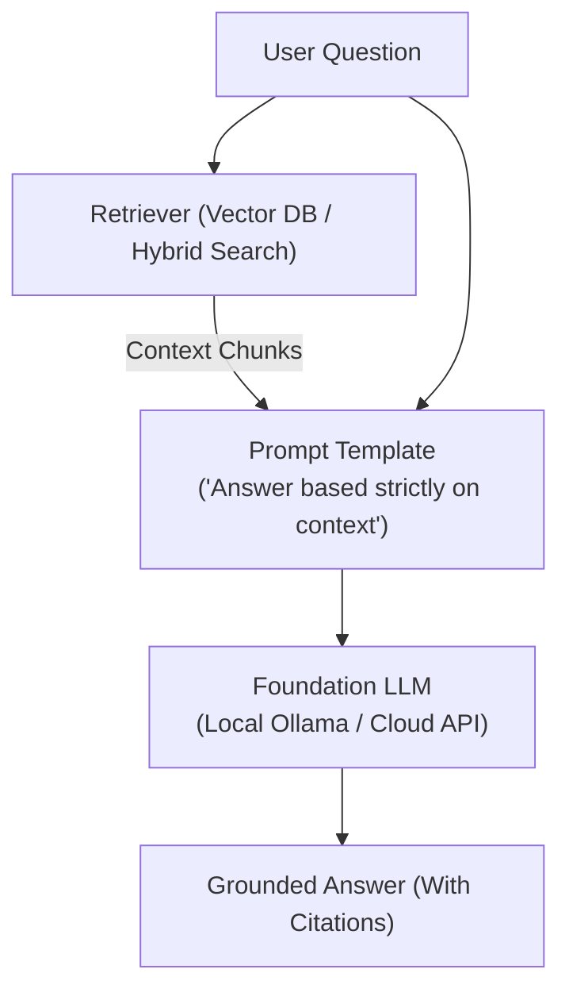

# 📹 How to Test RAG Retrievers(Hands-On)

<div className="video-card" style={{border: '1px solid #30363d', borderRadius: '8px', padding: '16px', marginBottom: '24px', background: 'rgba(56, 139, 253, 0.05)'}}>
  <div style={{display: 'flex', gap: '16px', flexWrap: 'wrap'}}>
    <div><strong>Instructor:</strong> Nitish Singh (CampusX)</div>
    <div><strong>Duration:</strong> 107m 2s</div>
    <div><strong>Playlist:</strong> LLM Evaluation Complete Series (CampusX)</div>
    <div><strong>Watch Link:</strong> <a href="https://www.youtube.com/watch?v=9Dkz3ckRj8c" target="_blank" rel="noopener noreferrer">YouTube Lecture ↗</a></div>
  </div>
</div>

## 📌 Executive Summary & Learning Objectives

This lecture covers **How to Test RAG Retrievers(Hands-On)**, focusing on production implementations, edge cases, and industry standards:
- Core intuition, architecture, and underlying mechanisms.
- Key differences between theoretical research implementations and scalable enterprise patterns.
- Concrete Python walkthroughs, error recovery, and performance optimization.

---

## 🏗️ Architecture & Conceptual Workflow



---

## 📖 Core Concepts & Technical Deep Dive

### 1. Architectural Foundations
In modern production AI engineering, **How to Test RAG Retrievers(Hands-On)** is essential for ensuring reliability, low latency, and deterministic outcomes. As AI systems evolve from naive prompt-in / completion-out scripts into distributed systems, engineers must handle:
- **State management & consistency:** Ensuring intermediate states and tool invocations are tracked.
- **Error boundaries & recovery:** Graceful degradation when external LLMs or vector stores encounter rate limits or network partitions.
- **Resource utilization & cost efficiency:** Caching common queries and reducing unnecessary foundation model token expenditure.

### 2. Operational Considerations
- **Latency Optimization:** Pre-computing embeddings, utilizing asynchronous non-blocking event loops, and streaming tokens via Server-Sent Events (SSE).
- **Security & Sandboxing:** Validating inputs before ingestion, sanitizing LLM outputs, and isolating tool execution environments.

---

## 💻 Production Implementation Walkthrough

```python
from langchain_core.prompts import ChatPromptTemplate
from langchain_core.runnables import RunnablePassthrough
from langchain_core.output_parsers import StrOutputParser
from langchain_community.chat_models import ChatOllama

# RAG Prompt with strict grounding
rag_template = """Answer the question based strictly on the provided context:
Context:
{context}

Question: {question}
Answer:"""

prompt = ChatPromptTemplate.from_template(rag_template)
llm = ChatOllama(model="llama3", temperature=0.1)

# Format documents helper
def format_docs(docs):
    return "\n\n".join(doc.page_content for doc in docs)

# Complete RAG Chain
rag_chain = (
    {"context": retriever | format_docs, "question": RunnablePassthrough()}
    | prompt
    | llm
    | StrOutputParser()
)
```

---

## 💡 Production Best Practices & Tips

:::tip Production Deployment Guideline
When deploying How to Test RAG Retrievers(Hands-On) in enterprise environments, always configure automated retries with exponential backoff and telemetry tracing (such as OpenTelemetry or LangSmith).
:::

:::warning Common Failure Modes
Watch out for state contamination across concurrent requests. Ensure each session or user interaction uses an isolated thread ID or execution context.
:::

---

## 🎯 Key Takeaways & Quick Reference

| Dimension | Production Standard | Pitfall to Avoid |
| :--- | :--- | :--- |
| **Execution** | Async / Non-blocking with timeouts | Synchronous blocking calls in event loops |
| **Data Validation** | Strict Pydantic v2 schemas | Untyped dictionary access |
| **Monitoring** | Distributed tracing & latency percentiles | Relying only on standard console logs |

## ⏱️ Lecture Timeline & Key Topics

| Timestamp | Key Topic / Concept Discussed |
| :--- | :--- |
| **00:00:00** | ठीक है गाइस? सो लेट्स स्टार्ट द सेशन। सो... |
| **00:25:40** | है तो आपका प्रसीजन हो गया 2/5।... |
| **00:53:11** | स्टेटमेंट लिखा हुआ है कि इट इंक्लूड्स... |
| **01:20:06** | लैंग्वेज। फेथफुलनेस वर्सेस ग्राउंडेडनेस... |
| **01:47:01** | बाकी... |


---

---

## 📜 Complete Lecture Transcript (Hindi / Hinglish)

> **Language:** Hindi / Hinglish | **Source:** `13 - How to Test RAG Retrievers(Hands-On) ｜ CampusX.hi-orig.srt` | **Total Segments:** 54 | **Word Count:** ~17,291 words

<details>
<summary><b>Click to expand full chronological transcript (54 timestamped intervals)</b></summary>

#### ⏱️ [00:00 ➔ 00:02]

ठीक है गाइस? सो लेट्स स्टार्ट द सेशन। सो आज का सेशन इज टोटली कनेक्टेड टू द प्रीवियस सेशन। इफ यू रिमेंबर द प्रीवियस सेशन हमने वहां पर ये डिस्कस किया था कि वी आर गोइंग टू स्टार्ट रैग इवैल्यूएशंस। रैग इवैल बोल सकते हो आप उसको। और लास्ट सेशन में हमने कंप्लीट अ रोड मैप सेट किया था कि हम एक रैग एप्लीकेशन को कैसे इवैल्यूएट करेंगे। फर्स्ट मैंने आपको एक बताया था प्रॉब्लम स्टेटमेंट कि हम किस तरह का रैग एप्लीकेशन बनाएंगे और फिर मैंने आपके साथ एक रोड मैप शेयर किया था कि आप उसको कैसे इवैल्यूएट करोगे स्टेप बाय स्टेप। ठीक है? तो अब वहीं से हमारी आज की क्लास शुरू हो रही है। अब गोइंग फॉरवर्ड अगले तीन क्लासेस में इंक्लूडिंग दिस वन। हमारा जो गोल है वो यह है कि वी वांट टू बिल्ड अ रैक इवल स्वीट। बेसिकली हम तीन लेवल्स पर अपने रैग एप्लीकेशन को इवैल्यूएट करेंगे। द फर्स्ट वन इज़ कंपोनेंट लेवल पे, सेकंड इज़ पाइपलाइन अ या फिर वर्क फ्लो लेवल पे एंड द थर्ड वन इज़ एप्लीकेशन लेवल पे। तो जब हम यह सारे इवैल्यूएशंस या ये सारे इवैल्यूएशन पाइपलाइन बना लेंगे तो इसी को हम कलेक्टिवली हमारा इवाट बुलाएंगे जिसको हम रिग्रेशन टेस्टिंग में यूज़ करेंगे। ठीक है? तो आज के वीडियो का या आज के सेशन का गोल है फर्स्ट वाला पार्ट को कंप्लीट करना व्हिच इज़ द कंपोनेंट पार्ट ऑफ द इवल स्वीट। तो आज हम लोग क्या करने वाले हैं? हम लोग अपने रैक एप्लीकेशन के जो कंपोनेंट्स हैं उनको कैसे इवैलुएट करना है यह सीखने जा रहे हैं। ठीक है? सो आई गेस आपको पता ही है कि किसी भी रैग एप्लीकेशन में जो दो सबसे इंपॉर्टेंट कंपोनेंट्स होते हैं वो होते हैं रिट्रीवर

#### ⏱️ [00:02 ➔ 00:04]

एंड जनरेटर। रिट्रीवर का काम होता है फॉर अ गिवन क्वेरी अह रेलेवेंट कॉन्टेक्स्ट फेच करके लाना वेक्टर डेटाबेस से। और जनरेटर का काम होता है कि गिवन अ क्वेरी एंड रेलेवेंट कॉन्टेक्स्ट टू प्रोड्यूस अ आंसर दैट इज रेलेवेंट टू द क्वेश्चन। राइट? तो आज हम लोग इन दोनों कंपोनेंट्स को कैसे इवैलुएट किया जाता है? अभी तक हमने पास्ट में उनको बनाया जरूर है। कभी इवैलुएट करना नहीं सीखा। आज हम उनको इवैल्यूएट करना सीखेंगे। ठीक है? तो फर्स्ट वी विल स्टार्ट विद द रिट्रीवर एंड देन वी विल मूव ऑन टू द जनरेटर। यही दो कंपोनेंट्स को हमें इवैलुएट करना है और यही हमारे आज के क्लास का प्लान है। तो अ सबसे पहले एक काम कर लेते हैं। हम लोग ना अपना प्रोजेक्ट सेटअप कर लेते हैं। ये प्रोजेक्ट हम अगले दो-तीन क्लासेस तक चलाएंगे। तो अच्छे से प्रोजेक्ट को सेटअप कर लेना इज़ अ गुड आईडिया। ठीक है? सो व्हाट आई विल डू इज कि आई विल क्विकली क्रिएट अ न्यू फोल्डर बाय द नेम ऑफ रैग इवल प्रोजेक्ट और इसको मैं क्या करूंगा वीएस कोड में ओपन कर लूंगा। सो यह है डॉक्यूमेंट्स के अंदर वर्क के अंदर रैग इवल प्रोजेक्ट इसी प्रोजेक्ट में हम लोग सारा का सारा काम करने वाले हैं। ठीक है? तो यहां पर मैंने ना कुछ सेटअप इंस्ट्रक्शंस लिख लिए हैं। इनको हम एक-एक करके कैरी आउट कर लेंगे। एकदम स्टैंडर्डाइज्ड प्रोजेक्ट सेटअप इंस्ट्रक्शंस हैं। सबसे पहले हमने एक फोल्डर बना लिया। अ उसके अंदर एक डायरेक्टरी स्ट्रक्चर बनाएंगे। ठीक है? सो ऐसे नहीं होगा कि हम रैंडमली फाइल्स क्रिएट करते चले जाएंगे। हम एक स्ट्रक्चर फॉलो करेंगे। सो सबसे पहले हमारे फोल्डर में एक डेटा बोल करके फोल्डर होगा जहां पे हम अपने सारे लेक्चर के ट्रांसक्रिप्ट्स

#### ⏱️ [00:04 ➔ 00:06]

का अ जो डेटा है उसको स्टोर करेंगे। सो आपको पता है हम हर लेक्चर जो आपको प्रोवाइड कर रहे हैं उसका एक ट्रांसक्रिप्ट जनरेट करते हैं और वही ट्रांसक्रिप्ट हमारे रैग एप्लीकेशन के लिए नॉलेज बेस का काम करेगा। तो यहीं पर हम वो सारे ट्रांसक्रिप्ट स्टोर करेंगे। उसके बाद हमारे इस एप्लीकेशन में रैग एप्लीकेशन में जितनी भी हम फाइल्स क्रिएट करेंगे इन ऑर्डर टू बिल्ड द एप्लीकेशन उसके लिए हम एसआरसी या सोर्स फोल्डर बना लेते हैं। सो जब हम रिट्रीवर बनाएंगे, जनरेटर बनाएंगे, रैक पाइपलाइन बनाएंगे या कल को हम एक स्ट्रीमलेट एप्लीकेशन बनाएंगे वो सारा कोड आपको यहां पे देखने को मिलेगा। उसके बाद आएगा आपका इव्स बोल के एक फोल्डर और यहीं पर हम अपने सारे इवैल्यूएशन पाइपलाइन को स्टोर करेंगे। रिट्रीवर को इवैलुएट करने का पाइपलाइन है। जनरेटर को इवैलुएट करने का पाइपलाइन है। रैग के पूरे के पूरे पाइपलाइन को इवैलुएट करने का कोड है। वो सब कुछ यहां पे जाएगा। एंड वी कैन हैव वन मोर फोल्डर बाय द नेम ऑफ़ गोल्डंस जहां पे हम अपने अ गोल्डन डेटा सेट्स को स्टोर करेंगे। तो फॉर नाउ मेरे को लगता है इतने फोल्डर्स सही हैं। आगे चलके और जरूरत पड़ेगी तो हम लोग क्रिएट कर लेंगे। बट दिस इज गोइंग टू बी द स्ट्रक्चर। ठीक है? तो ये हमने अपने डायरेक्टर्स क्रिएट डायरेक्टरीज क्रिएट कर ली। अब हमें क्या करना है? अ ट्रांसक्रिप्ट्स को ऐड करना है। सो ट्रांसक्रिप्ट्स को ऐड करने के लिए व्हाट आई विल डू इज़ आई विल गो बैक। मैंने ना एक्चुअली ये प्रोजेक्ट एक और जगह पे कैरी आउट मतलब पूरा बना रखा है। मैं वहां से एज़ इट इज़ कॉपी कर रहा हूं। सो हमारे अभी तक शायद आठ लेक्चर्स हुए हैं और मैं उन आठ लेक्चर्स के ट्रांसक्रिप्ट्स को कॉपी कर रहा हूं और हमारे वाले डेटा फोल्डर के अंदर पेस्ट कर दे रहा हूं। सो दैट यहां पे आपको दिखाई दे जाए कि दीज़ आर आवर ट्रांसक्रिप्ट्स। ठीक है? सेशन वन से लेके एट तक। दिस इज़ द नाइन सेशन आई गेस या फिर पता नहीं मैं एक दो सेशन शायद मैंने मिस कर दिए। बट कोई बात नहीं। ये हमारे

#### ⏱️ [00:06 ➔ 00:08]

पहले आठ सेशन के ट्रांसक्रिप्ट्स हैं। ठीक है? तो ट्रांसक्रिप्ट्स कुछ ऐसे दिखाई देते हैं। शायद आपने यूज भी किए होंगे, देखा भी होगा। जैसे मूवीस का सबटाइटल होता है ना बिल्कुल वैसा ही है। एक टाइम स्टैंप दिया हुआ है और उस गिवन टाइम स्टैंप में टीचर ने क्या बोला है या फिर स्टूडेंट्स ने क्या बोला है ये इंफॉर्मेशनेशन इस फाइल में रहता है। तो इट्स अ लॉन्ग फाइल ऑब्वियसली बिकॉज़ दो-दो घंटे के लेक्चर्स हैं। बट या दिस इज़ आवर नॉलेज बेस जिसके बेसिस पे हमारा रैक चार्ट पॉट काम करेगा। सो दिस इज़ आल्सो डन। नेक्स्ट इज क्रिएट वर्चुअल एनवायरमेंट बिकॉज़ नया प्रोजेक्ट है तो इसकी डिपेंडेंसीज होंगी। उसको हम ग्लोबली इंस्टॉल करने के बदले प्रोजेक्ट के अंदर इंस्टॉल करेंगे। तो इसके लिए हम क्या करेंगे? UV यूज़ करेंगे। आई गेस आपको UV ऑलरेडी पता ही होगा। तो हम क्या करते हैं? सबसे पहले यूवी को इनिशियलाइज करते हैं और हम Python का वर्जन ले रहे हैं 3.11 और साथ ही साथ जो भी हमारी डिपेंडेंसीज हैं जो भी लाइब्रेरीज हमें चाहिए हैं उन सबका भी लिस्ट मेरे पास है। मैं उन सबको एक साथ इंस्टॉल कर लेता हूं। क्या-क्या चाहिए लाइब्रेरीज़? लकचेन चाहिए है ऑब्वियसली। क्योंकि काफी सारा काम लचेन के थ्रू होगा। ओपन एi का भी लाइब्रेरी इंस्टॉल कर रहे हैं। डीप इवल ऑब्वियसली बिकॉज़ उसके थ्रू ही हम टेस्टिंग करेंगे। पाई टेस्ट भी मैं कर ले रहा हूं। बिकॉज़ आई गेस डीप इवल का ये डिपेंडेंसी है और Python डॉट एनv बिकॉज़ हमें एनवायरमेंट फाइल्स के साथ काम करना है। सो व्हाट वी विल डू इज़ वी विल रन दिस कमांड एज़ वेल। यह कमांड क्या करेगा? इन सारी लाइब्रेरीज़ को इंस्टॉल कर देगा। सो यह देखो यह रहा हमारा करंट स्टेट। यहां पे पाई प्रोजेक्ट डॉट टॉमल फाइल आ गई है और आपका गेट इग्नोर फाइल आ गई है। बेसिकली जैसे यूवी काम करता है उसने फास्ट सेटअप कर दिया पूरे के पूरे प्रोजेक्ट को। तो इस पॉइंट पे वी आर काइंड ऑफ़ रेडी। अ बस एक लास्ट चीज बच गई और वो है कि मुझे ना अटॉईन

#### ⏱️ [00:08 ➔ 00:10]

फाइल एक बनानी पड़ेगी। बिकॉज़ उसी में हम अपना ओपन एआई का एपीआई की डालेंगे। सो वो भी कर लेते हैं जल्दी से। सो आई विल क्विकली क्रिएट अ डॉट ईएनबी फाइल एंड व्हाट आई विल डू इज़ थोड़ी देर के लिए ना मैं स्क्रीन शेयरिंग बंद कर रहा हूं एंड आई विल क्विकली कॉपी द एपीआई की ये देखो गाइस ये मैंने एक फाइल बना ली अ ओपन एib फाइल बना ली उसमें मैं ना अपना ओपन एआई की डाल दिया ठीक है तो ये सेटअप भी हो गया सो वी आर डन विद ऑल द स्टेप्स ये सारे स्टेप्स हमने कर लिए ठीक है बहुत बेसिक स्टेप्स थे आपने पास्ट में डेफिनेटली कर रखे होंगे और अब यहां से हमारा आज का सेशन स्टार्ट होता है। ठीक है? तो सबसे पहले हमें क्या करना है ना? हमें अपना रिट्रीवर बिल्ड करना है। मैंने आपको लास्ट सेशन में ये बात बोला था कि कभी भी आप इवैल्यूएशन ऐसे नहीं करते कि पहले आपने पूरा एप्लीकेशन बना लिया और फिर आप उसको टेस्ट कर रहे हो। नहीं आप बिल्कुल सॉफ्टवेयर की तरह ऑपरेट करते हो कि आपने एक नया मॉड्यूल बनाया, एक नया फंक्शन लिखा तो आप उसको टेस्ट करते हो। फिर आगे बढ़ते हो। फिर उस नई चीज को टेस्ट करते हो, फिर आगे बढ़ते हो और ऐसे करते-करते आपका एप्लीकेशन बनता है। तो सिमिलरली यहां पे भी जब हम एलएलएम बेस्ड एप्लीकेशन बना रहे हैं तो हम क्या करेंगे? हम सबसे पहले अ पहला कंपोनेंट बनाएंगे व्हिच इज़ आवर रिट्रीवर। फिर हम उस रिट्रीवर को इवैलुएट करेंगे। जब हम उससेफाई हो जाएंगे, फिर हम आगे बढ़ेंगे, हम अपना जनरेटर बनाएंगे। फिर हम उसको इवैलुएट करेंगे। फिर पाइपलाइन बनाएंगे। उसको इवैलुएट करेंगे। जब एक बार एप्लीकेशन बन जाएगा तो एप्लीकेशन लेवल इवैल्यूएशन करेंगे। दिस इज हाउ यू डेवलप अ एलएलएम बेस्ड एप्लीकेशन। तो ऑब्वियसली सिंस दिस इज द स्टार्ट तो हमें सबसे पहले क्या करना है? अपने पहले कंपोनेंट को बिल्ड करना है। व्हिच इज़ आवर रिट्रीवर। ठीक है? अब रिट्रीवर क्या होता है? कैसे काम करता है? आई गेस आपको ऑलरेडी पता है। इट्स बेसिकली अ कंपोनेंट। इट्स बेसिकली अ कंपोनेंट जिसको इनपुट में एक क्वेरी मिलती है। और

#### ⏱️ [00:10 ➔ 00:12]

रिट्रीवर क्या करता है? उस क्वेरी को अ एक एंबेडिंग मॉडल की हेल्प से वेक्टर में कन्वर्ट करता है और फिर उस वेक्टर को ले जाकर के एक वेक्टर डेटाबेस में अ सर्च करता है। यहां पे ऑलरेडी हमारे चंक्स पड़े हुए हैं इन वेक्टर फॉर्म। तो जो भी पांच या 10 नियरेस्ट वेक्टर्स होते हैं उनको फच करके लाता है। उसी को हम अपना कॉन्टेक्स्ट बुलाते हैं। तो ये पूरा सेटअप हमें अभी क्रिएट करना है। ठीक है? तो दिस विल इंक्लूड एवरीथिंग। फर्स्ट वी विल अ फच आवर डॉक्यूमेंट्स जो कि अभी ट्रांसक्रिप्ट्स के फॉर्म में है। फिर उसको हम चंक करेंगे। फिर उसको हम एंबेड करेंगे और जब एक बार एंबेडिंग हो जाएगी उसके बाद हम अ अपना एक रिट्रीवर ऑब्जेक्ट बनाएंगे जिसको हम यूज़ किया करेंगे। जभी भी हमें रिट्रीवर को चलाना होगा या रिट्रीवर को इवैलुएट करना होगा। ठीक है? ठीक है? तो दिस इज़ द कोड। यहां पे देखो बिल्कुल वही फोल्डर स्ट्रक्चर है। डेटा इव्स गोल्ड्स एसआरसी जो हमने क्रिएट किया है। तो मैं एसआरसी में जा रहा हूं। और एसआरसी में यू कैन सी आपको रिट्रीवर डॉट py दिखाई देगा। मैं इस फाइल में जा रहा हूं। और फिलहाल मैं क्या कर रहा हूं? एकदम आराम से इसको कॉपी कर ले रहा हूं। क्योंकि मुझे एग्जैक्टली यही कोड लगेगा। सो नाउ व्हाट आई विल डू इज़ मैं अपने प्रोजेक्ट में आके एसआरसी के अंदर आई विल क्रिएट अ न्यू फाइल बाय द नेम ऑफ रिट्रीवर डॉट py और इसको मैं यहां पर पेस्ट कर दे रहा हूं और इसको मैं वर्डप कर देता हूं और इसको मैं एक बार आपके सामने एक्सप्लेन करता हूं। ठीक है? बिकॉज़ बहुत ही सिंपल चीज है। आपको झट से समझ में आ जाएगा। तो यहां तक का कोड तो सेल्फ एक्सप्लेनेटरी है। जो भी हमारी डिपेंडेंसीज़ हैं उनको हमने इंपोर्ट कर लिया। लोडnबी इसलिए बिकॉज़ हम एनवायरमेंट फाइल से अपना ओपन एi की इंपोर्ट कर रहे हैं। यहां पर हमने कुछ सेटअप क्रिएट कर लिया है कि हमारी जो डेटा डायरेक्टरी है

#### ⏱️ [00:12 ➔ 00:14]

वो है डेटा। ये मैंने बता दिया और हमने एक डेटाबेस की डायरेक्टरी बनाई है वेक्टर डेटाबेस की जिसका नाम है क्रोमा स्टोर। सो अभी आप देखोगे तो यहां पे आपको ये डायरेक्टरी नहीं दिखेगी। बट जैसे ही आप इस कोड को रन करोगे तो ये क्रोमा स्टोर बोल के डायरेक्टरी बन जाएगी और यही हमारा वेक्टर स्टोर रहेगा। इसी में हमारा सारा का सारा जो चंक्स हैं वेक्टर फॉर्म में एग्ज़िस्ट करेंगे। ठीक है? मेन कोड आपका यहां पर है। तो यहां से आप कोड रीड कर सकते हो। तो सबसे पहले हमें क्या करना है? हमें एक रिट्रीवर बनाना है। ऑब्वियसली रिट्रीवर को चलाने के पहले बनाना पड़ेगा। तो यहां पे हम रिट्रीवर को क्रिएट कर रहे हैं। और रिट्रीवर को क्रिएट करने के लिए हमारे पास एक फंक्शन है जिसका नाम है बिल्ड रिट्रीवर जो कि ठीक ऊपर यहां पे लिखा हुआ है। ठीक है? अब इस फंक्शन के अंदर क्या कोड है कि हम सबसे पहले लोड स्टोर फंक्शन को कॉल कर रहे हैं। अब लोड स्टोर फंक्शन कहां है? जस्ट ऊपर है। लोड स्टोर फंक्शन क्या करता है? अ कि बेसिकली सबसे पहले एक एंबेडिंग मॉडल को लेके आता है। हम जिस एंबेडिंग मॉडल को यूज़ करेंगे उसका नाम है टेक्स्ट एंबेडिंग थ्री स्मॉल। ये ओपन एआई का एंबेडिंग मॉडल है और ये सबसे पहले सिंपली ये चेक करता है कि क्या करेंटली आपका वेक्टर डेटाबेस एक्सिस्ट करता है या नहीं। अगर नहीं करता है तो फिर वो नया वेक्टर डेटाबेस क्रिएट करेगा। अगर वेक्टर डेटाबेस ऑलरेडी क्रिएटेड है तो नया वेक्टर डेटाबेस क्रिएट नहीं करेगा। ठीक है? तो यहां पे बेसिकली हम वही चेक कर रहे हैं। और अगर क्रिएटेड नहीं है तो हम क्या कर रहे हैं? सबसे पहले हमारी सारी की सारी जो ट्रांसक्रिप्ट्स हैं उनको डॉक्यूमेंट की फॉर्म में लोड कर रहे हैं विथ द हेल्प ऑफ़ दिस फंक्शन लोड ट्रांसक्रिप्ट। सो अगर आप यहां पे आओ दिस इज़ द लोड ट्रांसक्रिप्ट फंक्शन। ये फंक्शन कर क्या रहा है? देखने में कॉम्प्लेक्स लग रहा होगा। बट इसका सिंपल काम क्या है कि वो इस डायरेक्टरी में घुस रहा है डेटा डायरेक्टरी के अंदर। और जितनी भी डॉट vtटी फाइल्स हैं व्हिच इज़ बेसिकली दीज़ फाइल्स। हमारी सारी फाइल्स का एक्सटेंशन वीटी तो जितनी भी वीटी फाइल्स हैं वो सबको लोड कर

#### ⏱️ [00:14 ➔ 00:16]

रहा है और लाइन बाय लाइन रीड कर रहा है। ठीक है? और लाइन बाय लाइन रीड करने के बाद वो एक क्वेश्चन पूछ रहा है कि क्या करंट लाइन में टाइम स्टैंप्स तो नहीं है। अगर टाइम स्टैंप्स है तो उसको इग्नोर कर दो। और अगर टाइम स्टैंप्स नहीं है तो फिर उसको उठा के एक टेक्स्ट में ऐड करते जाओ। सो बेसिकली आवर स्ट्रेटजी इज दिस कि हम ना पूरा का पूरा डॉक्यूमेंट एज इट इज यूज नहीं करने वाले। हम सिर्फ जो टेक्स्ट है उसको यूज़ करेंगे। ये जो टाइम स्टैंप है इसको हम इग्नोर कर रहे हैं। ऑब्वियसली अगर हम टाइम स्टैंप को भी रखेंगे ना तो हमारा जो रिट्रीवर का क्वालिटी है वो बहुत खराब आएगा। बिकॉज़ टेक्स्ट है अचानक से उसके बीच में टाइम स्टैंप है। फिर टेक्स्ट है उसके बीच में टाइम स्टैंप है। तो जो सिमेंटिक मीनिंग कैप्चर करने का काम है वो अच्छे से नहीं हो पाएगा। दैट इज व्हाई व्हाट वी आर डूइंग इज वी आर बेसिकली क्रिएटिंग अ फिल्टर जहां पर हम जो भी टाइम स्टैंप्स वाली लाइंस है उनको हटा रहे हैं और नॉर्मल टेक्स्ट को एक्सट्रैक्ट करते जा रहे हैं और उनको उठा करके हम अ डॉक्यूमेंट के अंदर स्टोर कर रहे हैं। लैंग चेन डॉक्यूमेंट के अंदर स्टोर कर रहे हैं। आल्सो हम डॉक्यूमेंट के मेटा डेटा में ये भी बता रहे हैं कि कोई पर्टिकुलर लाइन जो बोली गई है वो किस सेशन में बोली गई है। सो दैट हम आगे चलके साइटेशन दे पाए कि यह जो क्वेश्चन आपने पूछा है उसका ये जो आंसर है वो इस सेशन में सर ने पढ़ाया था। तो दैट इज व्हाई हम सेशन को भी एक्सट्रैक्ट कर रहे हैं और यहां से हम सारे डॉक्यूमेंट्स को भेज रहे हैं वापस जो हम यहां पर रिट्रीव कर रहे हैं और फिर एक बार जब हमारे पास सारे डॉक्यूमेंट्स आ जा रहे हैं तो हम इस स्टेप में चंकिंग परफॉर्म कर रहे हैं और चंकिंग के लिए हमारा जो चंक साइज है चलो थोड़ी देर के लिए मान लेते हैं कि हम थोड़े छोटे से स्टार्ट करते हैं। 750 हमारा चंक साइज होगा और चंक ओवरलैप हो जाएगा 100 का लेट्स से। ठीक है? और फिर हम क्या कर रहे हैं? क्रोमा डेटाबेस को यूज कर रहे हैं और फ्रॉम डॉक्यूमेंट्स फंक्शन में चंक्स एंबेडिटिंग्स भेज दे रहे हैं और उसी को हम

#### ⏱️ [00:16 ➔ 00:18]

लोड कर रहे हैं बिल्ड रिट्रीवर में और उसी से फिर हम एज रिट्रीवर फंक्शन को कॉल करके एक रिट्रीवर ऑब्जेक्ट बना रहे हैं। वही रिट्रीवर ऑब्जेक्ट आपको यहां पे दिखाई दे रहा है। एक बार आपके पास रिट्रीवर आ गया तो आप रिट्रीवर को कोई भी क्वेश्चन दे के इनवोक कर सकते हो। और जैसे ही आप इसको इनवोक करोगे तो रिट्रीवर क्या करेगा? आपके करंट क्वेश्चन को कन्वर्ट करेगा इनू वेक्टर्स और जाकर के वेक्टर डेटाबेस से नियरेस्ट फाइव वेक्टर्स को फेच करके लाएगा और उसको रिजल्ट में स्टोर कर देगा और उसी रिजल्ट को हम लूप करके देख रहे हैं। दिस इज़ हाउ दिस एंटायर कोड इज़ ऑर्गेनाइज्ड। एकदम सिंपल शब्दों में अगर मैं क्विकली वन मिनट रिवीज़ दूं तो यहां पे हम क्या कर रहे हैं? अपने सारे के सारे ट्रांसक्रिप्ट्स को लोड कर रहे हैं। टाइम स्टैंप वाली लाइंस को हटा रहे हैं और डॉक्यूमेंट ऑब्जेक्ट्स में कन्वर्ट कर दे रहे हैं। और साथ ही साथ ये इंफॉर्मेशन भी स्टोर कर रहे हैं कि वो लाइन किस सेशन में बोली गई। फिर इन डॉक्यूमेंट्स को उठा के हम चंकिंग कर रहे हैं। चंकिंग का सेटअप है 750 चंक साइज एंड चंक ओवरलैप इज़ 100। और फिर इस सेटअप के साथ हम एक वेक्टर डेटाबेस बना रहे हैं। अ और उस वेक्टर डेटाबेस से हम एक रिट्रीवर बना रहे हैं जिसमें हमने K का वैल्यू फाइव सेट कर रखा है। और फिर उसी रिट्रीवर ऑब्जेक्ट से हम क्वेरी परफॉर्म कर रहे हैं और उसी क्वेरी के रिजल्ट्स हम यहां पे दिखा रहे हैं। तो वेरी स्ट्रेट फॉरवर्ड कोड इफ यू हैव डन रैक बिफोर। ठीक है? तो एक काम करते हैं। क्विकली ये चेक कर लेते हैं कि ये पूरा सेटअप काम कर रहा है कि नहीं। ठीक है? तो व्हाट वी विल डू इज यहां पे वी विल क्विकली रन दिस कोड। अ इस फाइल का नाम है रिट्रीवर डॉट py। सो हमने ये क्वेश्चन पूछ रखा है। व्हाट इज रिग्रेशन टेस्टिंग? सो अगर आपको याद होगा तो ये हमने लास्ट सेशन में ही डिस्कस किया था। जो पिछला सेशन था वहां पर मैंने आपको डिटेल में बताया था कि रिग्रेशन टेस्टिंग क्या होता है। लेट्स सी कि क्या हमारा रिट्रीवर अ करंट करेक्ट चंक्स एक्सट्रैक्ट

#### ⏱️ [00:18 ➔ 00:20]

करके ला पा रहा है कि नहीं। सो अभी थोड़ा टाइम लगेगा फर्स्ट टाइम में बिकॉज़ आपका वेक्टर डेटाबेस क्रिएट हो रहा है। अभी तक वेक्टर डेटाबेस एक्सिस्ट नहीं करता है तो वेक्टर डेटाबेस क्रिएट होने में थोड़ा टाइम लगेगा और फिर अ क्वेरी परफॉर्म होगी और रिजल्ट्स हमें दिखाई देंगे। सो लेट्स जस्ट वेट। सबसे पहले यहां पर एक क्रोमा स्टोर बोल के अ वेक्टर डेटाबेस बन गया। ठीक है? और अब ये रहा हमारा आउटपुट। सो यू कैन सी ये पांच अ आपके चंक्स रिट्रीव हुए हैं। यहां पे यू कैन सी यू गेट इन रिग्रेशन टेस्टिंग। सो देयर इज़ नथिंग स्पेशल इन रिग्रेशन टेस्टिंग। बेसिकली द इवाल सूट यू हैव मेड। रन इट वंस। यू कैन सी कि रेलेवेंट कॉन्टेक्स्ट हम फच करके ला पा रहे हैं। तो इस पॉइंट पे वी कैन से कि हमने अपना रिट्रीवर बना लिया है। मतलब काम तो कर रहा है। कितना अच्छा काम कर रहा है वो अभी हमने इवैल्यूएट नहीं किया बट इट इज़ वर्किंग। जो हमारा पूरा रैक एप्लीकेशन है उसका एक कंपोनेंट हमने बिल्ड कर लिया व्हिच इज़ आवर रिट्रीवर। अब बात करते हैं कि रिट्रीवर को इवैल्यूएट कैसे किया जाता है? जस्ट वन सेकंड। देयर इज़ वन क्वेश्चन। हाउ डू वी हैंडल चेंजेस टू द डॉक्यूमेंट? सो लेट्स से एक नया सेशन हमने कंडक्ट कराया तो उसका भी ट्रांसक्रिप्ट आ गया अब सेशन नंबर 10 का। तो आप क्या करोगे? उसका ट्रांसक्रिप्ट लेके आओगे और यहां पे डेटा फोल्डर में पेस्ट कर दोगे। ठीक है? और आपको क्या करना होगा? उसके बाद हमारा करंट सेटअप कैसा है कि आपको सबसे पहले ये जो क्रोमा स्टोर है इस फोल्डर को डिलीट करना पड़ेगा और फिर से आपको रिट्रीवर डॉट py को चलाना पड़ेगा। तो बेसिकली आप फिर से एंबेडिंग परफॉर्म करोगे और डॉक्यूमेंट्स को वापस से वेक्टर फॉर्म में लेके आओगे। तो ये आपको हर बार ही करना पड़ेगा जब भी आपके डॉक्यूमेंट में कुछ भी चेंजेस आ रहे

#### ⏱️ [00:20 ➔ 00:22]

हैं। ये स्टेप आपको बार-बार रिपीट करना पड़ेगा। इज इट क्लियर? आइडियली डाटा इंजेशन एंड रिट्रीवल शुड बी डीकंपल्ड। दैट इज करेक्ट सौरव? इट्स जस्ट कि अभी ना वी आर नॉट फोकसिंग मोर ऑन एप्लीकेशन डेवलपमेंट। वी आर फोकसिंग मोर ऑन इवैल्यूएशन साइड ऑफ़ थिंग्स। ठीक है? दैट इज़ व्हाई आप थोड़ा ज्यादा प्रोडक्शन ग्रेड कोड एक्सपेक्ट मत करो। मैं जानबूझ के सिंपलीफाई कर रहा हूं। अभी मैं यहां पे अगर बहुत ज्यादा प्रोडक्शन ग्रेड कोड लिखूंगा ना तो मेरे को एक्सप्लेन करने में टाइम चला जाएगा कि यहां पे हो क्या रहा है। दैट इज व्हाई मैंने जब क्लॉड से कोड जनरेट कराया तो मेरा इंस्ट्रक्शन ये था कि एकदम ही बेसिक लेवल कोड डालो जो कोई एक ग्लांस में भी समझ पाए। सो इट्स अ कॉन्शियस चॉइस फ्रॉम माय साइड। सो नाउ दैट वी हैव आवर रिट्रीवर। नाउ कम्स द क्वेश्चन कि क्या जो रिट्रीवर हमने बनाया है क्या वो सही से काम कर भी रहा है या नहीं? यह हमें क्वेश्चन को आंसर करना है। बेसिकली हमें किसी तरीके से अपने रिट्रीवर को इवैल्यूएट करना है। ठीक है? तो यहां पर हमें थोड़ा सा ना एक डिस्कशन लगेगा। वो डिस्कशन से फिर हम समझ पाएंगे कि हमें एग्जैक्टली कैसा इवैल्यूएशन कोड लिखना है। ठीक है? तो यहां पे मैंने तीन चार पॉइंटर्स लिखे हैं। अ एक बार इनको डिस्कस करते हैं। तो सबसे पहले आपको यह समझना पड़ेगा कि रिट्रीवर जो है वह फेल कैसे होता है? मतलब रिट्रीवर क्या होता है? रिट्रीवर इज बेसिकली अ फंक्शन जिसको आप एक क्वेरी देते हो और वो आउटपुट में आपको उस क्वेरी से रिलेटेड पांच रेलेवेंट कॉन्टेक्स्ट देता है। पांच या 10 जितना भी आपने केस सेट कर रखा है। यही होता है ना रिट्रीवर। तो अगर आपसे कोई पूछे कि रिट्रीवर के फेल होने के क्या-क्या सिनेरियोस हैं? तो

#### ⏱️ [00:22 ➔ 00:24]

आइडियली देयर आर टू सिनेरियोस जहां पर रिट्रीवर फेल कर सकता है। पहला ये है कि रिट्रीवर जो सही कॉन्टेक्स्ट लाना चाहिए था किसी क्वेश्चन को आंसर करने के लिए वो सही कॉन्टेक्स्ट ला ही नहीं पाया। व्हाट आई एम ट्राइंग टू से इज कि मान लो देयर इज अ क्वेश्चन A B C और आपके पास आपके वेक्टर डेटाबेस में चंक्स पड़े हुए हैं एक से लेके 100 तक। ठीक है? और A B C को सही से आंसर करने के लिए हमें वन 15 एंड 13 ये तीन चंक्स की जरूरत थी। बिकॉज़ इन तीन चंक्स के अंदर ही हमारा सही आंसर छुपा हुआ था। बट हमारा जो रिट्रीवर है वो अच्छा नहीं है। बिकॉज़ वो ए बी सी वाले क्वेश्चन के लिए ये चंक्स लेके आया। 27 28 29 सो बेसिकली वो एक भी रेलेवेंट कॉन्टेक्स्ट या चंक फच करके नहीं ला पाया। तो इस तरह का रिट्रीवर इज़ नॉट अ गुड रिट्रीवर ऑब्वियसली। राइट? सो इफ अ रिट्रीवर मिसेस और इफ इट डस नॉट ब्रिंग रेलेवेंट कॉन्टेक्स्ट आउट ऑफ द वेक्टर डेटाबेस देन इट इज़ अ बैड रिट्रीवर एंड द सेकंड सिनेरियो इज़ कि वो सही कॉन्टेक्स्ट तो ला पा रहा है बट वो नॉइज़ी है। वि बेसिकली मी्स कि मान लो आपका सही कॉन्टेक्स्ट था एक 15 और 13 आपका रिट्रीवर ले आया 1 15 27 28 29 अब आइडियली उसको ये तीन लाने चाहिए थे उस तीन में से वो दो तो ले आया बट उसके अलावा जो बाकी तीन लेके आया वो सही वाले नहीं थे तो इनको आप नॉइज़ कंसीडर कर सकते हो अब आप ये पांचों ही चीजें चीजें जनरेटर के पास भेजोगे तो जनरेटर को आप दो सही

#### ⏱️ [00:24 ➔ 00:26]

वाले कांटेक्ट भी दे रहे हो बट साथ में तीन फालतू के कॉन्टेक्स्ट भी दे रहे हो तो उसके पास इंफॉर्मेशनेशन भी जा रहा है उसके पास नॉइज़ भी जा रहा है तो देयर इज़ अ गुड चांस कि जो आंसर फाइनली निकल के आए वो अच्छा ना हो तो दिस इज द सेकंड फेलियर मोड कि आपका रिट्रीवर सही कॉन्टेक्स्ट लाने के साथ-साथ नॉइज़ कॉन्टेक्स्ट भी ला रहा है। तो यही दो फेलियर मोड्स होते हैं। और इन दोनों फेलियर मोड्स के अराउंड हमारे पास एक-एक मैट्रिक होता है। यह हमने डिस्कस भी किया था पास्ट में। सो, अगर आपको यह मेजर करना है कि कितने सही कॉन्टेक्स्ट ला पाया है मेरा रिट्रीवर, उसके लिए हमारे पास एक मैट्रिक होता है जिसको हम रिकॉल बोलते हैं। और अगर आपको ये मेजर करना है कि जितने कॉन्टेक्स्ट वो लेके आया है उसमें से कितने यूज़फुल है सच में तो उसको मेजर करने का तरीका होता है प्रसीजन। और यही दोनों मैट्रिक्स हम लोग आज यूज करेंगे टू इवैलुएट आवर रिट्रीवर। ठीक है? तो एक बार फॉर्मल डेफिनेशन क्या होता है? रिकॉल का मैं आपको बता दूं रिकॉल का फॉर्मल डेफिनेशन इज़ कि आउट ऑफ ऑल द करेक्ट कॉन्टेक्स्ट दैट आर अवेलेबल इन आवर वेक्टर डेटाबेस? हाउ मेनी ऑफ़ देम द रिट्रीवर वाज़ एबल टू ब्रिंग। ठीक है? पांच सही थे। उसमें से तीन अगर ला पाया तो रिकॉल हो गया आपका 3/5 बिकॉज़ पांच सही कॉन्टेक्स्ट एक्सिस्ट करते हैं। मेरा रिट्रीवर उसमें से तीन ला पाया। दैट इज रिकॉल। प्रसीजन क्या होता है? कि जितने कॉन्टेक्स्ट लेके आया उसमें से कितने सही थे। सो अगर आप पांच लेके आए हो और उसमें से दो ही यूज़फुल है तो आपका प्रसीजन हो गया 2/5। यही फंडा होता है। ठीक है? इज इट क्लियर गाइस? रिट्रीवर के दो कोर इवैल्यूएशन मैट्रिक्स आपको समझ में आ गए और वह कहां से पिक्चर में आए यह समझ में आ गए। रिट्रीवर के दो फेलियर मोड से निकल के आए हैं। पहला फेलियर मोड कि सही चीज ला ही नहीं पा रहा

#### ⏱️ [00:26 ➔ 00:28]

है और दूसरा सही ला रहा है बट नॉइस के साथ ला रहा है। ये दोनों चीजें नहीं होनी चाहिए। वही होता है आइडियल रिट्रीवर। तो आइडियली आपका रिकॉल भी हाई होना चाहिए और आपका प्रसीजन भी हाई होना चाहिए। यह आइडियल केस है। जितना वन के पास होगा रिकॉल एंड प्रसीजन उतना अच्छा रिट्रीवर आपने बनाया है। एकदम सिंपल मैथमेटिकल नंबर्स में आपको पता चल जाएगा। बट देयर इज़ अ प्रॉब्लम। प्रॉब्लम ये है कि रिकॉल और प्रसीजन के बीच में एक टेंशन रहती है। या फिर आप बोल सकते हो कि देयर इज़ अ ट्रेड ऑफ। कैसे? मैं आपको एक एग्जांपल के थ्रू समझाता हूं। सो मान लो आपका रिकॉल अभी आ रहा है 65 या फिर मान लो यही है 3/5 इसका मतलब ये है कि जो पांच सही वाले कॉन्टेक्स्ट थे उसमें से सिर्फ तीन सही वालों को फच करके ला पा रहा है मेरा रिट्रीवर अब अगर मैं आपसे बोलूं कि क्या तरीका है रिकॉल को इंप्रूव करने का क्या तरीका है यह मेक श्योर करने का कि पांचों की पांचों कॉन्टेक्स्ट फच करके ले आए मेरा रिट्रीवर तो क्या बोलोगे? व्हाट इज अ क्विक हैक टू डू इट? हाउ कैन वी इंक्रीस द रिकॉल? बहुत सिंपल है। आप K को बढ़ा दो। अभी आपने K कितना कर रखा है? फाइव। तो आप पांच में से तीन को ला पा रहे हो। आप K को 10 कर दो। देयर इज़ अ गुड चांस कि जो बाकी के दो बचे हैं उनको भी आप ले आओगे। राइट? तो K को बढ़ाने से हमेशा रिकॉल बढ़ता है। बट द प्रॉब्लम इज कि जैसे ही आप K को बढ़ा के 10 करोगे तो आपका प्रसीजन हिट ले लेगा। क्योंकि अब आपके पास 10 में से पांच तो सही वाले हैं बट पांच नॉइज़ वाले भी तो आ गए। तो जैसे ही आप रिकॉल को 100 की तरफ लेके गए प्रसीजन आपका टुवर्ड्स ज़ीरो मूव करने लग जाता है। एंड दैट इज़ व्हाई देयर

#### ⏱️ [00:28 ➔ 00:30]

इज़ अ ट्रेड ऑफ बिटवीन दीज़ टू। और दोनों को ऊपर ले जाना थोड़ा सा ट्रिकी काम रहता है। थोड़ा दिमाग लगाना पड़ता है। सो यू हैव टू अंडरस्टैंड दिस स्टेटमेंट कि प्रसीजन और रिकॉल के बीच में थोड़ा टेंशन है। थोड़ा ट्रेड ऑफ स्पेशली इफ यू टॉक अबाउट के जो नंबर होता है ना वो ट्रेड ऑफ करता है प्रसीजन और रिकॉल के बीच में। ठीक है? तो आई होप आपको ये ऊपर वाले दो पॉइंट समझ में आ गए कि रिट्रीवर के दो फेलियर मोड्स क्या है? और उन दोनों फेलियर मोड से एक-एक मैट्रिक निकला और वो दोनों मैट्रिक के बीच में एक टेंशन है अगर आप K की बात करो। अब बात करते हैं थर्ड हमें रिट्रीवर के रिकॉल और प्रसीजन दोनों को इवैलुएट करना है। यही हमारा आगे का गोल है। राइट? अब यहां पे मैं एक स्टेटमेंट बोलूंगा। आपको बताना है कि वो स्टेटमेंट ट्रू है या फॉल्स। सो द स्टेटमेंट इज दिस कि बोथ रिकॉल एंड प्रसीजन आर रेफरेंस बेस्ड इवैल्यूएशंस। सो इफ यू रिमेंबर प्रीवियस क्लासेस वहां पे हमने डिस्कस किया था रेफरेंस बेस्ड इवैल्यूएशन क्या होता है और रेफरेंस फ्री इवैल्यूएशन क्या होता है। सो अगर आपको वो चीज याद है तो आपको सिंपली बताना है वेदर दिस स्टेटमेंट इज़ ट्रू और फॉल्स। मैं बोल रहा हूं कि रिकॉल और प्रसीजन को इवैल्यूएट करने का जो प्रोसेस है वो प्रोसेस एक रेफरेंस बेस्ड इवल है। इज इट ट्रू और फॉल्स। सो द आंसर इज़ यस। अगर आपको याद होगा तो मैंने बताया था कि रेफरेंस बेस्ड इवल का मतलब यह है कि जब आपको इवैल्यूएशन परफॉर्म करना है उस टाइम पर आपको एक गोल्डन डेटा सेट या गोल्डन आंसर की जरूरत होती है। और जो रेफरेंस फ्री वाले इवैल होते हैं वहां पे आपको एज सच कोई गोल्डन आंसर की जरूरत नहीं होती। ठीक है? तो यहां पर आप देखो अगर आपको

#### ⏱️ [00:30 ➔ 00:32]

बताना है कि आपका रिकॉल कम है या ज्यादा है तो इसके लिए आपको पता होना चाहिए कि फॉर एव्री क्वेरी करेक्ट कॉन्टेक्स्ट कैसा दिखता है। राइट? और सिंस हमें बताना पड़ रहा है कि फॉर एव्री क्वेरी करेक्ट कॉन्टेक्स्ट कैसा दिखता है। तो दिस इज़ व्हेयर वी नीड अ गोल्डन डेटा सेट एंड दिस इज़ व्हेयर वी नीड अ गोल्डन कॉन्टेक्स्ट। तो सिंस वी हैव टू टेल कि सही आंसर क्या है? दिस बिकम्स अ रेफरेंस बेस्ड इवन। ठीक है? चाहो तो मैं ये पॉइंट स्किप कर सकता था। बट ये बहुत इंपॉर्टेंट है। टू रियली अंडरस्टैंड कि इतने सारे इवैल्यूएशंस आप परफॉर्म करने वाले हो अगले तीन क्लासेस में। आपके दिमाग में क्लेरिटी होना चाहिए कि कौन सा इवैल्यूएशन रेफरेंस बेस्ड है, कौन सा रेफरेंस फ्री है। तो आज के ये जो दोनों मैट्रसेस हैं, ये जो दोनों इवैल्यूएशंस हैं, दीज़ आर रेफरेंस बेस्ड इव्स बिकॉज़ इनको परफॉर्म करने के लिए इनको इवैल्यूएट करने के लिए हमें एक गोल्डन डेटा सेट और गोल्डन कॉन्टेक्स्ट की जरूरत पड़ेगी। तो अब हम बात करते हैं कि एग्जैक्टली हम इन दोनों मैट्रिक्स को कैसे इवैलुएट करेंगे? कैसे कैलकुलेट करेंगे? ये जो मेरा रिट्रीवर है, ये जो मेरा रिट्रीवर है, इसके अगेंस्ट मैं कैसे एक रिकॉल का नंबर कैलकुलेट करूंगा या फिर एक प्रसीजन का नंबर कैलकुलेट करूंगा। ठीक है? तो मैं आपको एकदम स्टेप बाय स्टेप प्रोसेस बताता हूं। सो सबसे पहले आपको क्या चाहिए पड़ेगा? आपको चाहिए पड़ेगा एक गोल्डन डेटा सेट। वो गोल्डन डेटा सेट कैसा दिखाई देगा? मैं आपको बताता हूं। उस गोल्डन डेटा सेट में दो कॉलम्स होंगे। पहला कॉलम होगा क्वेश्चन और दूसरा कॉलम होगा डॉक्यूमेंट या चंक आईडी। ठीक है? सो मैं क्या करूंगा? अभी फिलहाल ये मत सोचो कि ये डेटा सेट कैसे बनेगा? कहां से आएगा? फिलहाल बस ऐसे सोचो कि ये डेटा सेट मेरे पास है। ठीक है? मैं बस आपको बता रहा हूं कि ये दिखता कैसा है। तो यहां पे मान लो एक क्वेश्चन रहेगा व्हाट इज

#### ⏱️ [00:32 ➔ 00:34]

रिग्रेशन टेस्टिंग? दिस इज़ द क्वेश्चन। और हम यहां पे बताएंगे कि आउट ऑफ ऑल द चंक्स दैट वी हैव स्टर्ड इन आवर वेक्टर डेटाबेस। उनमें से कौन-कौन से चंक्स ऐसे हैं जहां पे रिग्रेशन टेस्टिंग की बात की गई है। तो पता चला पूरा अ सारे चंक्स को स्टडी करने के बाद कि 72, 89 और 100 ये तीन चंक्स के अंदर रिग्रेशन टेस्टिंग के अराउंड बात हुई है। इसके अलावा बाकी जितने भी चंक्स हैं हमारे वेक्टर डेटाबेस में उनमें किसी में भी रिग्रेशन टेस्टिंग की बात नहीं हुई है। ठीक है? फिर ऐसा ही हमारे पास एक और क्वेश्चन रहेगा। मान लो क्वेश्चन है व्हाट इज रैक ट्रायड? ये भी हमने लास्ट सेशन में डिस्कस किया था और पता चला कि इससे रिलेटेड कॉन्टेक्स्ट चंक नंबर 120 और 111 में स्टर्ड है। ऐसा ही एक और क्वेश्चन रहेगा। क्वेश्चन है मान लो व्हाट आर ऑनलाइन ई वेल्स? और यह स्टर्ड है 151, 121 एंड 130 में। तो इस तरीके से हमारे पास कुछ 50 क्वेश्चंस का एक डेटा सेट रहेगा और हर क्वेश्चन के अगेंस्ट हम आईडीस डाल देंगे उन डॉक्यूमेंट्स की जहां पर उस क्वेश्चन का कॉन्टेक्स्ट एग्जिस्ट करता है। अब हम क्या करेंगे? हम अपना रिट्रीवर जो है उसको रन करेंगे और उसको सबसे पहले हम फर्स्ट वाला क्वेश्चन देंगे। फर्स्ट वाला क्वेश्चन हम जैसे ही रिट्रीवर को देंगे तो रिट्रीवर का काम क्या है? क्वेश्चन को लेना और उसके नियरेस्ट चंक्स को फच करके लाना। तो पता चला कि हमारा रिट्रीवर बोलता है कि चंक्स ये हैं। 72, 81, 89, 99 एंड

#### ⏱️ [00:34 ➔ 00:36]

100 हमने k = 5 सेट कर रखा है। तो पांच ही चंक्स आएंगे। तो अब हम क्या करेंगे? सिंपली इस क्वेश्चन के लिए रिकॉल कैलकुलेट करेंगे कि जितने आने चाहिए थे उसमें से कितने आए। तो पता चला 72 भी आ गया, 89 भी आ गया और 100 भी आ गया। तो तीन आने चाहिए थे उसमें से तीनों आ गए। इट मींस इस पर्टिकुलर क्वेश्चन के लिए हमारा रिकॉल कितना हो गया? वन। इस क्वेश्चन के लिए हमारा रिट्रीवर परफेक्टली बिहेव कर रहा है। उसके बाद हम क्या करेंगे? इसी रिट्रीवर में सेकंड क्वेश्चन को डालेंगे। व्हाट इज रैक ट्रायड? तो इसके लिए हमारे रिट्रीवर ने पांच चंक्स कौन से दिए? 1 2 3 120 एंड 5 तो फिर से हम देखेंगे कि जितने आने चाहिए थे उसमें से कितने आए। तो आने चाहिए थे 120 और 111 उसमें से आया सिर्फ 120। तो बेसिकली 1/2.5 इस तरीके से हम हर क्वेश्चन के लिए रिकॉल कैलकुलेट करते जाएंगे। तो 50ों क्वेश्चंस के लिए हम रिकॉल कैलकुलेट करेंगे और फिर हम क्या करेंगे? सारे के सारे क्वेश्चंस का एवरेज निकाल देंगे तो वही हमारा रिकॉल वैल्यू होगा। एवरेज रिकॉल वैल्यू। आई होप आपको समझ में आ रहा है हम रिकॉल कैसे कैलकुलेट करेंगे। ठीक है? सिमिलरली हम प्रसीजन भी ऐसे ही कैलकुलेट करेंगे। कैसे? ध्यान देना। सो प्रिसीजन के लिए भी हमने सेम काम किया। ये क्वेश्चन को भेजा रिट्रीवर के पास फर्स्ट वाले को। ये पांच आपके चंक्स निकल के आए। इन पांच में से तीन चंक्स तो सही वाले थे बट दो नॉइजी वाले थे। वि बेसिकली मींस कि इस पर्टिकुलर क्वेश्चन के लिए हमारा प्रसीजन कितना हो गया? 3/5 सिमिलरली इस क्वेश्चन के लिए ये पांच चंक्स आए। इसमें से सिर्फ एक सही है। चार नॉइज़ हैं। तो ये हो गया 1/5। और सेम तरीके से हम हर रो के लिए प्रसीजन

#### ⏱️ [00:36 ➔ 00:38]

कैलकुलेट करेंगे और फिर एवरेज निकाल देंगे। दैट विल बी आवर एवरेज प्रसीजन। और ये दो नंबर्स हमें मिलके बताएंगे कि हमारा रिट्रीवर कितने अच्छे से काम कर रहा है। दिस इज़ आवर अ स्ट्रेटजी। यही स्ट्रेटजी हम फॉलो करने वाले हैं। आप लोगों को बेसिक फंडा समझ में आ गया कि हम कैसे रिकॉल और कैसे प्रसीजन कैलकुलेट करने वाले हैं। अब यहां पे मैं एक अ एक इंपॉर्टेंट बात बोलता हूं और वो इंपॉर्टेंट बात ये है कि ये जो तरीका है ना जो हमने अभी डिस्कस किया जहां पे हम ये डेटा सेट यूज़ कर रहे हैं टू कैलकुलेट प्रसीजन एंड रिकॉल। जहां पर हमारे पास सही वाले कॉन्टेक्स्ट का आईडीज है। यह तरीका आप यूज नहीं कर सकते अपने इस एप्लीकेशन के लिए। इनफैक्ट बहुत तरह के रैग एप्लीकेशनेशंस के लिए आप यह तरीका यूज़ नहीं कर सकते। जहां पे आपने डॉक्यूमेंट की आईडी लिख रखी है। सही वाले डॉक्यूमेंट की आईडी लिख रखी है। और उसके बेसिस पे यू आर कैलकुलेटिंग रिकॉल एंड प्रसीजन। कैन यू टेल मी व्हाई? दिस इज़ नॉट द करेक्ट वे। हम आज जो तरीका यूज़ करेंगे रिकॉल और प्रसीजन कैलकुलेट करने का वो इस तरीके से बिल्कुल अलग है। ये तरीका एक्चुअली गलत है हमारे एप्लीकेशन के लिए। हम ऐसे नहीं करेंगे इवैल्यूएशन रिकॉल और प्रसीजन का कि आप कोई भी रीज़न सोच सकते हो कि ये तरीका क्यों गलत है। हालांकि ये सोचने में और समझने में बहुत लॉजिकल लग रहा होगा कि हां ऐसे ही तो रिकॉल कैलकुलेट करेंगे। बट एक्चुअली यह तरीका आप जब करने जाओगे इट्स नॉट द करेक्ट वे टू फाइंड रिकॉल एंड प्रसीजन फॉर आवर एप्लीकेशन। आई विल वेट फॉर योर आंसर्स बिकॉज़ आई रियली वांट यू टू थिंक कि क्या प्रॉब्लम है इस तरीके में? ये तरीका क्यों यूज़ नहीं कर सकते? ये तरीका गलत नहीं है। बहुत बुक्स और YouTube

#### ⏱️ [00:38 ➔ 00:40]

चैनल्स और वीडियोस में आपको ये तरीका पढ़ाया जाएगा। और ये तरीका कुछ जगहों पे चलता भी है बट बहुत जगहों पर फेल करेगा। वी शुड लुक एट द कंटेंट ऑफ द चंक्स। जरूरी नहीं है। एक्चुअली मतलब आप सोच के देखो। जरूरी नहीं है वो। अगर आप यहां पे उसका नंबर डाल रहे हो तो ये नंबर रिप्रेजेंट क्या कर रहा है? अपने चंक के कंटेंट को ही तो रिप्रेजेंट कर रहा है ना। तो एक्चुअली जरूरी नहीं है। जो भी लोग ये बोल रहे हैं कि वी शुड लुक एट द एक्चुअल ट्रांसक्रिप्ट। उसका रीजन यह नहीं है कि हमने यहां पर नंबर्स यूज किए। उसका रीजन कुछ और है। थोड़ा सोचो। इट्स अ वेरी गुड एक्सरसाइज। इफ यू कैन कोई भी अगर सही आंसर यहां पे बता पाएगा तो आई विल बी हैप्पी कि आप साथ में सोच पा रहे हो कि क्या चल रहा है। आई विल गिव यू वन मोर मिनट। इट्स ओके। फिर मैं आपको एग्जैक्ट रीज़न बताऊंगा कि क्यों हम ये तरीका यूज़ नहीं करेंगे। डांसर मे एक्सिस्ट इन एनी ऑफ़ द चंक बट नॉट इन ऑल। अ नॉट रियली श्रुति एक्चुअली ऐसा हो सकता है कि एक गिवन क्वेश्चन को हमने तीन अलग जगहों पर डिस्कस किया हो और तीनों को मिला के हमें आंसर बनाना हो। तो जिसने भी ये डेटा सेट बनाया होगा जिसने भी ये गोल्डन डेटा सेट बनाया होगा वो ऑब्वियसली जानकार आदमी होगा। वो सब कुछ देख के मैनुअली खुद से डेटा सेट क्रिएट करेगा। तो वो फालतू की चीजें यहां पे नहीं डालेगा। दैट इज़ आवर अजमशन। 30 मोर सेकंड्स इफ यू कैन थिंक। यस फाइनली किसी ने सही आंसर बता दिया। सॉरी आपका नाम ना थोड़ा मैं प्रोनाउंस नहीं कर पा रहा हूं। इज इट योर रियल नेम बिकॉज़ वो ऐसा लग रहा है दोनों नाम सेम है। पतालय आई डोंट नो इफ इट्स द करेक्ट प्रोनाउंसिएशन। बट जो भी है आपने सही आंसर लिखा। चेंज इन द डॉक्यूमेंट्स कंटेंट विल चेंज द आईडीस। एटलीस्ट पूरा सही नहीं है बट उस डायरेक्शन में आप बोल रहे हो। चलो रूपेश ठीक है। अ रूपेश आपने थोड़ा सही

#### ⏱️ [00:40 ➔ 00:42]

बताया है। मैं आपको एकदम रीज़ बताता हूं। एकदम लॉजिकल रीज़ बताता हूं कि ये तरीका अ सही क्यों नहीं है हमारे एप्लीकेशन के लिए। सबसे पहले आप मुझे ये बताओ कि जिस भी आदमी को हम ये काम देंगे ये गोल्डन डेटा सेट बनाने का काम देंगे। क्या वो अपनी लाइफ में खुश होगा या उसको सुसाइड करने का मन करेगा? हमने उसको क्या काम दिया है? थोड़ा सोच के देखो। हमने उसको बोला कि ये क्वेश्चन मैंने क्लास में पढ़ाया था। अब आपको क्या करना है? आपको जितने भी चंक्स हैं सबको जाके मैनुअली स्टडी करना है और बताना है कि किन चंक्स में इस क्वेश्चन से रिलेटेड बात की गई है। बाय द वे हमारे पास कितने ऐसे चंक्स हैं मैं आपको दिखा देता हूं। अ सो व्हाट वी विल डू इज कहीं पर भी यहां पे अगर हम प्रिंट लेंथ ऑफ चंक्स कर पाए। तो आई गेस मैं आपको समझा पाऊंगा कि हमारे पास टोटल कितने चंक्स हैं। एक बार फिर से रन करते हैं इस कोड को। मैंने बस प्रिंट करवाया है कि कितने चंक्स हैं हमारे पास आफ्टर चंकिंग। सो वी हैव कहीं पे भी ट्रिगर नहीं हुआ क्या? चलो ठीक है। कोई बात नहीं। मैं आपको बताता हूं। फिलहाल रफली हमारे पास 800 प्लस चंक्स हैं। तो बेसिकली जिस आदमी को हमने ये टास्क दिया है ये डेटा सेट क्रिएट करने का उसका काम क्या है कि वो एक क्वेश्चन को पढ़ेगा और फिर 800 चंक्स को पढ़ के ये डिसाइड करेगा कि अच्छा इस चंक में इस चंक में और इस चंक में इस क्वेश्चन को आंसर देने लायक कंटेंट है। फिर वो ये काम रिपीट करेगा अगले क्वेश्चन के लिए। वो इस क्वेश्चन को देखेगा और फिर सारे 800 चंक्स में जाकर के बताएगा कि अच्छा इन दोनों चक्स में इस क्वेश्चन से रिलेटेड बात की गई है। राइट? और ऐसा वो कितनी बार करेगा? 50 बार। बिकॉज़ हमारे पास 50 क्वेश्चंस हैं हमारे डेटा सेट में। वुड यू रियली लाइक टू डू दिस जॉब? क्या आपको ये काम दिया जाएगा? तो आप

#### ⏱️ [00:42 ➔ 00:44]

रन करोगे या ये काम करोगे? ऑब्वियसली नो। राइट? अब देखो मान लो किसी ने कर भी दिया ये काम। यू आर द पर्सन। आपको यह काम दिया गया। आपने रात भर बैठ के कर दिया। अब अगले दिन जब हमने इस गोल्डन डेटा सेट के ऊपर रिट्रीवर को चलाया तो पता चला कि हमारा रिकॉल आया है 65। ऑब्वियसली इट्स नॉट गुड। तो हमको इसको इंप्रूव करना चाहिए। तो इंप्रूव करने का एक सिंपल तरीका ये है कि आप K को बढ़ा दो। राइट? तो आपने बोला कि चलो K को हम लोग 5 से 8 कर देते हैं। आप खुद देखो जैसे ही आप K को फाइव से एट करोगे नॉट रियली आई एम सॉरी मैं एक्चुअली गलत फ्लो में चला गया जस्ट वन सेकंड अ या सॉरी एक्चुअली मैं क्या बोलना चाह रहा था कि जैसे ही आपने रिकॉल के लिए चलाया रिट्रीवर को तो पता चला कि आपका रिकॉल वैल्यू इज़ कमिंग आउट टू बी65 तो नाउ यू वुड लाइक टू इंप्रूव योर रिकॉल वैल्यू अब रिकॉल बढ़ाने के कई तरीके होते हैं। ठीक है? जैसे कि K को बढ़ाना या फिर आप क्या कर सकते हो कि आपके जो चंकिंग पैराटर्स हैं व्हिच इज़ बेसिकली फिलहाल हमारा 750 और 100 सेट है उसको आप थोड़ा बढ़ा घटा सकते हो। तो आपने ये सोचा कि अभी जो 750 और 100 है इसको बढ़ा करके हम 1000 और 150 कर देते हैं। चंक साइज 1000 और ओवरलैपिंग 150 कर देते हैं। क्या पता इससे हमारा रिकॉल बढ़ जाए। बट द प्रॉब्लम इज दिस कि जैसे ही आप अपना चंकिंग पैराटर्स चेंज कर रहे हो, आपका चंक साइज चेंज हो रहा है, तो आपके चंक्स भी तो चेंज हो रहे हैं। तो जैसे ही चंक्स चेंज हो रहे हैं, तो आपको क्या करना पड़ेगा? आपको दोबारा से अपना पूरा का पूरा वेक्टर डेटाबेस क्रिएट करना पड़ेगा। और अब आपके पास नए चंक्स आ जाएंगे। सो जहां पहले आपके पास 800 चंक्स थे, चंक साइज बढ़ाने से शायद वो घट के 700 चंक्स हो गए। और

#### ⏱️ [00:44 ➔ 00:46]

जैसे ही चंक्स नए आ गए आपका यह जो गोल्डन डेटा सेट है यह वॉइड हो गया। अब यह चंक का कोई मतलब ही नहीं है। बिकॉज़ ये चंक प्रीवियस चंक साइज के लिए वैलिड था। अब आपको क्या करना पड़ेगा? ये गोल्डन डेटा सेट दोबारा से बनाना पड़ेगा। बिकॉज़ आपने चंक साइज चेंज कर दिया। तो जितनी बार आप चंक साइज चेंज कर रहे हो, उतनी बार आपको क्या करना पड़ रहा है? दोबारा से अपना गोल्डन डेटा सेट बनाना पड़ रहा है। इज इट अ गुड थिंग और बैड थिंग? सोच के बताओ। ऑलरेडी ये इतना हेक्टिक टास्क था यह गोल्डन डेटा सेट बनाना। और अब हमें बोला जा रहा है कि जितनी बार हम अपने पैराटर्स को ट्विक करेंगे उतनी बार नया गोल्डन डेटा सेट भी बनाएंगे। तो ये काम नहीं करेगा। दिस विल नॉट वर्क। दिस इज़ अ वेरी बैड एग्जांपल ऑफ़ इंजीनियरिंग। देयर आर सर्टेन एप्लीकेशनेशंस जहां पर ये तरीका काम कर सकता है। फॉर एग्जांपल आपका रैग चैटबॉट आप ऐसे डॉक्यूमेंट्स के ऊपर बना रहे हो जो खुद में बहुत क्लीनली सेपरेटेड है। सो डॉक्यूमेंट वन इज वेरी डिफरेंट फ्रॉम डॉक्यूमेंट टू। डॉक्यूमेंट टू इज़ वेरी डिफरेंट फ्रॉम डॉक्यूमेंट थ्री। तो इन दैट केस आप क्या करोगे कि आप डॉक्यूमेंट वन और डॉक्यूमेंट टू को आपस में छेड़छाड़ नहीं करोगे। वहां पे बेसिकली आप अपने चंकिंग पैराटर्स को ज्यादा छेड़छाड़ नहीं करोगे। एक बार जो शुरू में आपने सेट कर लिया वही आप थ्रूउ रखने वाले हो। तो अगर आपके चंकिंग पैराटर्स चेंज नहीं हो रहे हैं और आपके चंक्स का साइज चेंज नहीं हो रहा है उस सिचुएशन में आप ये वाले टाइप का अ गोल्डन डेटा सेट यूज़ कर सकते हो और ये वाले तरीके से रिकॉल और प्रसीजन कैलकुलेट कर सकते हो। बट हमारे केस में ऐसा नहीं है। हमारे केस में डॉक्यूमेंट्स आर रिलेटेड और इंफॉर्मेशन एक डॉक्यूमेंट से दूसरे डॉक्यूमेंट में स्प्रेड हो सकती है। मतलब ऐसा कोई क्वेश्चन हो सकता है जिसका आंसर मैंने सेशन वन में भी दिया था और सेशन फाइव में भी दिया था। तो दैट इज व्हाई चंकिंग पैरामीटर को हम ट्वीक करेंगे और ट्वीक करने की वजह से ईच टाइम द गोल्डन

#### ⏱️ [00:46 ➔ 00:48]

डेटा सेट विल बी वॉइड एंड वी विल हैव टू क्रिएट अ न्यू गोल्डन डेटा सेट व्हिच इज टू मच एफर्ट। एंड दैट इज व्हाई यह जो तरीका है यह हम यूज़ नहीं कर सकते। तो अब क्वेश्चन आता है कि कैसे कैलकुलेट करें प्रसीजन और रिकॉल? ये तरीका तो फेल कर गया। क्या तरीका है फिर? तो अब असली तरीका डिस्कस करते हैं। ठीक है? जिससे आप एक्चुअली प्रसीजन और रिकॉल कैलकुलेट कर पाओगे। तो हमें क्या पड़ेगा जरूरत? हमें ना एक न्यू टाइप ऑफ गोल्डन डेटा सेट चाहिए। इस पर्टिकुलर गोल्डन डेटा सेट में भी दो कॉलम्स होंगे। पहला कॉलम अगेन होगा क्वेश्चन और दूसरा कॉलम होगा आइडियल आंसर। इस बार कॉन्टेक्स्ट या फिर डॉक्यूमेंट आईडीज नहीं है। सेकंड कॉलम आइडियल आंसर है। एक एग्जांपल देके समझाता हूं। फॉर एग्जांपल पहला क्वेश्चन है व्हाट इज रिग्रेशन टेस्टिंग। अब हम यहां पर क्या लिखेंगे? हम रिग्रेशन टेस्टिंग का एक्चुअल डेफिनेशन जो होता है जो मैंने क्लास में पढ़ाया था वो यहां पे लिखेंगे। एक बहुत इंपॉर्टेंट चीज ध्यान रखना। आइडियल आंसर का ये मतलब नहीं है जो Google पे हमें मिला। आइडियल आंसर का मतलब है जो हमारे वेक्टर डेटाबेस में पढ़ाया गया उससे हमने आंसर क्रिएट किया। सो हम एक्चुअली इन तीनों डॉक्यूमेंट आईडीज के पास गए और इन तीनों डॉक्यूमेंट आईडीज को जोड़ करके हमारे बंदे ने एक आंसर क्रिएट किया। वो आंसर यहां पे है। जरूरी नहीं है कि यह आंसर सही है। बट यह वो आंसर है जो मैंने आपको क्लास में पढ़ा है। इज इट क्लियर? सिमिलरली अगला क्वेश्चन है व्हाट इज

#### ⏱️ [00:48 ➔ 00:50]

रैक ट्रायड? अब फिर से जो बंदा होगा वो जाएगा और वो देखेगा कि इन दोनों चंक्स में इस क्वेश्चन को आंसर करने का मटेरियल है। वो उन दोनों को जोड़ करके एक आंसर क्रिएट करेगा और वही आंसर आपको यहां पे दिखाई देगा। एंड सिमिलरली यू विल डू दिस फॉर 50 क्वेश्चंस और 100 क्वेश्चंस और 500 क्वेश्चंस। बट दिस इज गोइंग टू बी योर गोल्डन डेटा सेट। दिस इज़ गोइंग टू बी योर गोल्डन डेटा सेट। तो फर्स्ट ऑफ़ ऑल मेरे को ये बताओ कि क्या आपको ये समझ में आया ये गोल्डन डेटा सेट क्या है? अभी इस चीज पे फोकस मत करना कि इसको हम बनाएंगे कैसे? मैं बताऊंगा आपको तरीके। अगला क्वेश्चन अगला सेक्शन वही है। ये गोल्डन डेटा सेट बनेगा कैसे? बट उसके पहले इज इट क्लियर कि ये है क्या? इसके अंदर क्या है? इसके अंदर क्वेश्चन है और इसके अंदर आंसर है। आइडियल आंसर बट आइडियल आंसर Google से फच करके लाया हुआ आंसर नहीं है। हमारे ट्रांसक्रिप्ट्स में जो आंसर बताया गया है, जो डिस्कशन की गई है, उसके बेसिस पे आंसर बनाया गया है, उसको हम आइडियल आंसर बुला रहे हैं। अभी तक क्लियर है? ठीक है? अब यह डिस्कस करते हैं कि इस नए गोल्डन डाटा सेट से हम रिकॉल और प्रसीजन कैसे कैलकुलेट करेंगे। ठीक है? पहले बात करते हैं रिकॉल की। तो सबसे पहले आप क्या करोगे? आप अपने रिट्रीवर को लेके आओगे और रिट्रीवर को आप ये फर्स्ट क्वेश्चन दोगे। ठीक है? सो क्वेश्चन है व्हाट इज रिग्रेशन टेस्टिंग? रिट्रीवर इस क्वेश्चन को लेगा और वेक्टर डेटाबेस में जाकर के खोजेगा कि कौन-कौन से रेलेवेंट कॉन्टेक्स्ट हैं। तो पता चला उसने ये पांच कॉन्टेक्स्ट फैच करके लाया। 72, 81, 89, 99 एंड 100 72, 81, 89, 99 एंड 100। ठीक है? अब यहां पे आता

#### ⏱️ [00:50 ➔ 00:52]

है मेन स्टेप। अब यहां पर हम क्या करेंगे? एक एलएलएम को ले आएंगे। हम एक एलएलएम को ले आएंगे। एलएलएम एज अ जज आप उसको बोल सकते हो। और हम इस एलएलएम को ये बोलेंगे कि ये हमारा आइडियल आंसर है। सबसे पहले इसको ब्रेक डाउन करो इंटू क्लेम्स। सो मान लो यहां पर मैंने लिख रखा है कि रिग्रेशन टेस्टिंग इज बेसिकली अ वे टू टेस्ट वेदर योर न्यू वर्जन इज़ बेटर देन योर प्रीवियस वर्जन। सेकंड सेंटेंस में मैंने बता रखा था अ इट रंस अ इवाल स्वीट अगेंस्ट योर सॉफ्टवेयर। एंड थर्ड इट कैन बी यूज्ड फॉर सीआई एज वेल। तो यहां पर बेसिकली तीन क्लेम्स बनेंगे। फर्स्ट क्लेम में रिग्रेशन टेस्टिंग क्या होता है? सेकंड में अह जो भी सेंटेंस मैंने अभी बोला मैं भूल गया। और थर्ड में यह सीआई के लिए यूज़ होता है। तो तीन क्लेम्स बन गए। तो इस एलएलएम ने क्या किया? इस क्वेश्चन को रीड किया और इस क्वेश्चन को ब्रेक डाउन कर दिया इंटू थ्री क्लेम्स। बिकॉज़ इस क्वेश्चन में तीन क्लेम्स एक्सिस्ट करते हैं। अब हम क्या बोल रहे हैं? हम दोबारा से इसी एलएम को क्या बोलते हैं? कि अब एक-एक करके इन सारे कॉन्टेक्स्ट में जाओ और यह बताओ कि इन तीन में से कितने क्लेम्स इन कॉन्टेक्स्ट में एक्सिस्ट करते हैं। तो पता चला कि जो फर्स्ट वाला क्लेम है वो 72 में था। फिर 81 वाले में कोई भी क्लेम नहीं था। 89 वाले में सेकंड क्लेम था। 99 वाले में कोई क्लेम नहीं था। और 100 वाले में थर्ड वाला क्लेम भी था। व्हिच बेसिकली मी्स कि आपके आइडियल आंसर में जो तीन क्लेम्स थे वो

#### ⏱️ [00:52 ➔ 00:54]

तीनों क्लेम्स इन पांचों कॉन्टेक्स्ट में कहीं ना कहीं तो पाए गए। व्हिच बेसिकली मीन्स कि जितना कॉन्टेक्स्ट रिक्वायर्ड है इस क्वेश्चन को आंसर करने के लिए उसका 100% कॉन्टेक्स्ट रिट्रीव करके ले आया मेरा रिट्रीवर। तो दैट इज व्हाई यहां पर कैलकुलेशन हो जाएगा 3/3 मतलब वन। अब फिर से रिपीट करते हैं इस प्रोसेस को। अगला क्वेश्चन है व्हाट इज रैक ट्रायड? तो इस क्वेश्चन को भी हमने भेजा इस रिट्रीवर के पास और रिट्रीवर ने प्रोड्यूस किया ये 1 2 3 120 एंड 5 1 2 3 120 एंड फाइव। अब हम फिर से क्या करेंगे? इस एलएलएम एज अ जज को लाएंगे और सबसे पहले बोलेंगे कि यह जो क्वेश्चन है ना इसको क्लेम्स में ब्रेक करो। तो अगेन मैं आपको एक एग्जांपल दे रहा हूं कि फर्स्ट में एक सेंटेंस लिखा हुआ है कि अ रैक ट्रायट इज़ बेसिकली अ कॉम्बिनेशन ऑफ थ्री मैट्रिक्स मैट्रिसेस। और सेकंड स्टेटमेंट लिखा हुआ है कि इट इंक्लूड्स आंसर रेलेवेंस, फेथफुलनेस एंड कॉन्टेक्स्ट रेलेवेंस। ठीक है? तो क्लेम वन में क्या है कि भाई इसमें तीन मैट्रिससेस आते हैं और क्लेम टू में क्या है? तीनों मैट्रिससेस का हमने नेम दे दिया। ठीक है? एक बार जैसे ही हमने क्लेम्स में ब्रेक डाउन कर दिया आंसर को। फिर हम क्या करेंगे? हम एलएलएम को बोलेंगे कि अब इन पांचों कॉन्टेक्स्ट में घुसो और बताओ इनमें से कौन-कौन से क्लेम्स यहां पर कवर्ड है? तो वन में कोई भी क्लेम कवर्ड नहीं था। टू में कोई भी क्लेम कवर्ड नहीं था। थ्री में कोई भी क्लेम कवर्ड नहीं था। फोर्थ वाले में सेकंड वाला क्लेम कवर्ड था। फिफ्थ वाले में कोई भी क्लेम कवर्ड नहीं था। तो बेसिकली दो में से एक क्लेम

#### ⏱️ [00:54 ➔ 00:56]

मुझे इन पांचों में से कहीं ना कहीं मिल गया। तो दैट इज व्हाई 1/2 विल बी द रिकॉल ऑफ दिस पर्टिकुलर क्वेश्चन। और यही प्रोसेस हम रिपीट करते जाएंगे। फिर फॉर ऑल आवर क्वेश्चंस इन आवर गोल्डन डेटा सेट। अब आप सोचो कि फायदा क्या हुआ? ये पूरा का पूरा प्रोसेस करने का फायदा ये हुआ कि अब मान लो आपका रिकॉल आया है 65। आपने बोला कि इसको इंप्रूव करना चाहिए। चंक साइज बढ़ा दो। आपने चंक साइज को 750 से बना दिया 1000। बट अब सोच के बताओ जल्दी से। जैसे ही हमने चंक साइज बढ़ा दिया तो क्या हमें अपने गोल्डन डेटा सेट को चेंज करने की जरूरत है? कंसीडरिंग हमने अब आइडियल आंसर एक बार लिख लिया शुरुआत में। अब चंक्स चेंज होंगे अगर तो क्या उससे इस आइडियल आंसर पे कोई चेंज आएगा? आएगा या नहीं आएगा? दिस आइडियल आंसर विल रिमेन द सेम ना। चंक ऊपर नीचे हो जाए। यह इंफॉर्मेशन अभी इस चंक में था। उठ के वो दूसरे चंक में चला जाए। क्या फर्क पड़ता है? आइडियल आंसर तो सेम ही है ना। वो मेहनत जो हमने एक बारी कर ली। अब वो चंक्स के चेंज होने से नहीं चेंज होगी। आइडियल आंसर इज़ आइडियल आंसर। एंड इस तरीके से हमने बचा लिया बार-बार दोबारा गोल्डन डेटा सेट बनाने के प्रोसेस से खुद को। एंड दिस इज व्हाई वी विल यूज दिस टेक्निक इंस्टेड ऑफ द प्रीवियस वन। तो यह जो अभी मैंने आपको टेक्निक बताई है, यह टेक्निक अ डीप इवल यूज़ करता है और इसको हम डीप इवल के लैंग्वेज में कॉन्टेक्स्चुअल रिकॉल बुलाते हैं। सो मैंने आपको पहले जो पढ़ाया था वो रिकॉल @ K बोल के था। हम वो यूज़ नहीं कर रहे। हम ये वाला यूज़ कर रहे हैं। कॉन्टेक्स्चुअल रिकॉल। हम जो मैट्रिक यूज़ कर रहे हैं वह है तो रिकॉल ही बट उसका एक

#### ⏱️ [00:56 ➔ 00:58]

अलग फ्लेवर है। एलएलएम एज अ जज फ्लेवर है और इसको हम कॉन्टेक्स्चुअल रिकॉल बुलाते हैं। तो आई रियली होप आप दोनों का डिफरेंस बता पाओगे। वन क्वेश्चन व्हाट चांसेस आर देयर दैट एलएलएम एज जज विल कंबाइन मल्टीपल चे्स इनू वन एंड इन आवर रिट्रीव कॉन्टेक्स्ट दैट कम्स इन टू डिफरेंट चांस। व्हाट चांसेस आर देयर? व्हाट चांसेस आर देयर दैट द एलएलएम एस जज विल कंबाइन मल्टीपल क्लेम्स इनू वन एंड इन आवर रिट्रीव्ड कॉन्टेक्स्ट दैट विल कम इन टू डिफरेंट जंक्स ऑब्वियसली देयर आर चांसेस बट इसमें दो चीजें आती है। दो बारीकी है। पहली बारीकी ये है कि जो बंदा गोल्डन डेटा सेट क्रिएट कर रहा है वो इस तरीके से ही क्रिएट करेगा कि एटॉमिक क्लेम्स को मिला मिला के आंसर बने। दैट इज द फर्स्ट डेलीपेट चॉइस, डिज़ाइन चॉइस। आप आंसर का कंस्ट्रक्शन ही ऐसा कर रहे हो कि कोई एलएलएम जब उसको देखेगा तो बहुत आसानी से उसको क्लेम्स में ब्रेक डाउन कर देगा। और सेकंड इज कि आप एक अच्छे क्वालिटी का एलएलएम जज यूज करोगे जो जिसका सिस्टम इंस्ट्रक्शन बहुत अच्छे से लिखा गया है और वो अपने सिस्टम इंस्ट्रक्शन को बहुत अच्छे से फॉलो कर रहा है। यही दो डिज़ाइन चॉइससेस हैं। सो अ या लेट्स डिस्कस कि इस सेम मेथड से आप प्रसीजन कैसे कैलकुलेट करोगे? ठीक है? सो प्रसीजन में भी आप सिमिलर टेक्निक यूज़ करते हो। आप क्या करते हो कि फिर से एक क्वेश्चन को आपने उठाया पहले क्वेश्चन को व्हाट इज रिग्रेशन टेस्टिंग और उसको उठा के आपने अ भेज दिया रिट्रीवर के पास। रिट्रीवर ने फिर से आपको पहले क्वेश्चन के अगेंस्ट चंक्स ला के दे दिए। चंक्स थे 72, 81, 89, 99 एंड 100। अब फिर से क्या होगा? आपके पास एक एलएलएम

#### ⏱️ [00:58 ➔ 01:00]

आएगा। एलएलएम एज अ जज और फिर से आप क्या करोगे कि आप ये जो आइडियल आंसर है उसको क्लेम्स में एक्चुअली यहां पे कन्वर्ट करने की जरूरत नहीं है। आप क्या करोगे? आप सिंपली एक प्र्प्ट दोगे अपने एलएलएम एज अ जज को। आप बोलोगे कि इस पर्टिकुलर क्वेश्चन के अगेंस्ट दिस इज आवर आंसर। एलएलएम को क्या करना है? इस एलएलएम को क्या करना है? हर चंख को उठाना है और जाकर के इस आंसर में यह देखना है कि क्या इस चंख का कंटेंट इस आंसर को देने में हेल्प करेगा या नहीं। अगर करेगा तो फिर हम इसको हेल्पफुल मान लेंगे और अगर नहीं करेगा तो हम इसको नॉइज़ मान लेंगे। सो यहां पर मैंने एक्चुअली अच्छे से समझाया नहीं। यहां पर कहीं पर मैंने ना बहुत अच्छा एक सेंटेंस लिखा है। उस सेंटेंस से आपको समझ में आ जाएगा। यह सेंटेंस आपको पढ़ना है। यह सेंटेंस आपके एलएलएम एज अ जज का सिस्टम प्र्ट रहेगा। देखो यहां पे क्या लिखा हुआ है। सो, हम अपने एलएलएम एज अ जज को बोलेंगे। हियर इज द क्वेश्चन। हियर इज द आइडियल आंसर। हियर इज़ वन रिट्रीव्ड चंक। मान लो चंक नंबर 72। सो हमारे पास क्वेश्चन है, हमारे पास आइडियल आंसर है और हमारे पास करंट चंक है। हम अपने एलएलएम को बोलेंगे कि इज दिस चंक रेलेवेंट? डस इट कंटेन इंफॉर्मेशनेशन दैट हेल्प्स प्रोड्यूस दैट एक्सपेक्टेड आंसर। आंसर यस और नो एंड गिव अ रीज़। ये हमारा सिस्टम प्र्प रहने वाला है। आया आपको समझ में? फिर से मैं समझा देता हूं। हमने इस पहले क्वेश्चन को उठाया।

#### ⏱️ [01:00 ➔ 01:02]

रिट्रीवर के पास भेजा। रिट्रीवर ने यह पांच चंक्स ला के दिए। अब हम एक एलएलएम एज अ जज को ले आए। उसको हमने क्वेश्चन दिखाया, आइडियल आंसर दिखाया और पहला चंक दिखाया 72 वाला। और हमने बोला ये क्वेश्चन देखो। ये आंसर देखो और इस चंक को देख के बताओ कि क्या ये चंक इस आंसर को बनाने में हेल्प कर रहा है या नहीं? अगर कर रहा है तो बोलो यस। अदरवाइज नो। तो इस तरीके से हम क्या कर सकते हैं? हम हर चंक को बता सकते हैं कि वो सही चंक है या नॉइजी चंक है। प्रसीजन का काम कैसे हो रहा है? समझ में आ रहा है? ये सही चंक है। ये सही चंक है। ये सही चंक है। और ये वाला और ये वाला नॉइज़ी चंक है। तो अब आप सिंपली क्या करोगे? 3 / 5 करके प्रसीजन निकाल लोगे। एंड यू विल रिपीट इट फॉर ऑल द क्वेश्चंस एंड देन यू विल डू द एवरेज ऑफ द ऑल क्वेश्चन प्रसीजंस। आपको उससे प्रसीजन मिल जाएगा। यहां पे बस एक और बारीकी है। एक और माइन्यूट डिटेल है वो भी मैं क्लेरिफाई करना चाहूंगा। सो प्रसीजन ना रिट्रीव्ड चंक्स के रैंक को भी कंसीडर करता है। थोड़ा सोच के बताना। अ [गहरी सांस लेने की आवाज़] 1 2 3 4 5 1 2 3 4 5 दो केसेस मैं आपको बता रहा हूं। दिस इज केस ए दिस इज केस बी। समझना दो केसेस हैं। पहले केस में भी तीन नॉइज़ी चंक हैं। दूसरे केस में भी तीन नॉइज़ी चंक्स हैं। और दोनों में दो-दो सही वाले चंक्स हैं। तो कैन यू टेल मी इन दोनों का प्रसीजन बराबर होगा या अलग-अलग होगा। दिस इज माय क्वेश्चन। फर्स्ट ऑफ ऑल। हमने जो अभी तक डिस्कस किया प्रसीजन कैसे कैलकुलेट

#### ⏱️ [01:02 ➔ 01:04]

किया जाता है कि जितने भी चंक्स आए हैं आपके पास उसमें से कितने चंक्स यूज़फुल हैं। यही होता है ना? तो उस फार्मूला के बेसिस पे सेम होगा। दोनों का प्रिसीजन या डिफरेंट होगा, गाइज़। एक बार थोड़ा केयरफुली सुनना और आंसर करना। जो फार्मूला हमने डिस्कस किया है प्रसीजन का जितने भी चंक्स हैं उनमें से कितने यूज़फुल हैं? तो क्या प्रसीजन सेम होगा या अलग-अलग होगा? द आंसर इज़ सेम होगा। राइट? टोटल पांच चंक्स हैं उसमें से दो यूज़फुल है। टोटल पांच चंक्स हैं उसमें से दो यूज़फुल है। दोनों तो सेम ही होगा ना। आर वी अग्रीइंग ऑन दिस? प्रसीजन इज़ सेम फॉर बोथ द केसेस। बट व्हाट डू यू थिंक? इन दोनों में से बेटर केस कौन सा है? मतलब अगर आपको बोला जाए कि इन दोनों में से कोई एक ही केस को आप सेलेक्ट करके जनरेटर के पास भेजोगे तो आप कौन से वाले को भेजना चाहोगे? ऑब्वियसली केस ए को आप भेजना चाहोगे। राइट? केस ए ने क्या किया? जो दो सही वाले आपके कॉन्टेक्स्ट थे, चंक्स थे उनको वो ऊपर लेके आया। रैंकिंग में ऊपर रखा वर्सेस सेकंड वाले ने जिसने उसको एकदम नीचे रखा। तो ऑब्वियसली दिस इज दिस इज अ बेटर रिट्रीवर ना। दिस इज अ बेटर रिट्रीवर देन दिस वन। बट अगर आप सिर्फ प्रसीजन की बात करो तो प्रसीजन के बेसिस पर आप इन दोनों में डिफरेंशिएट नहीं कर सकते। राइट? बिकॉज़ प्रसीजन दोनों का सेम आ रहा है। 2 / 5 आइडियली A इज़ अ बेटर रिट्रीवर। तो इसको भी कंसीडर करने का एक तरीका होता है। सो डीप इवल में जो प्रसीजन है डीप इवल में जो प्रसीजन है उसको फर्स्ट ऑफ ऑल हम बुलाते हैं कॉन्टेक्स्चुअल प्रसीजन। ठीक है? तो वो कैसे कैलकुलेट होता है? मैं आपको बताता हूं। इन्हीं दोनों केसेस की हेल्प से मैं आपको बताता हूं। सो 1 2 3 4 5 और पहला दो सही है। अगला तीन गलत है। ठीक है?

#### ⏱️ [01:04 ➔ 01:06]

तो बेसिकली इस केस में आपका जो प्रसीजन है वो ऐसे कैलकुलेट होगा कि एक आपने अभी तक देखा और वो सही है। तो बेसिकली इट इज वन बाय वन। तो इस पॉइंट पे आपका प्रसीजन माना जाएगा वन। फिर आपने टू देखा। और दोनों के दोनों सही हैं। तो अगेन 2/ 2 तो अगेन प्रसीजन इज वन। उसके बाद अ यहां पर आपका आपने थ्री देखा तो अभी तक उसमें से दो सही है। अ दो देखा आई एम सॉरी चार देखा उसमें से दो सही है। पांच देखा उसमें से दो सही है। तो आप 2 / 3 2 / 4 और 2 / 5 कैलकुलेट करोगे। सो दिस विल बी 2/3 जो भी होता है आप बेसिकली अब इन सारे नंबर्स का एवरेज निकाल लोगे वर्सेस इस वाले केस में आप क्या करोगे 1 2 3 4 5 अ दूसरे वाला केस था कि गलत है गलत है गलत है सही है सही है तो यहां पे आपने अ जीरो सही है आउट ऑफ वन दिस विल बी ज़ीरो ज़ीरो से ही है आउट ऑफ टू दिस विल बी ज़ीरो बेसिकली 0 / 1 हो गया 0 / 2 हो गया ज़ीरो सही है आउट ऑफ थ्री दिस विल बी अगेन ज़ीरो अब वन सही है आउट ऑफ़ फोर तो दिस विल बी 1/4 तो दिस विल बी25 एंड टू सही है आउट ऑफ़ फाइव तो दिस विल बी 2 /5 दिस विल बी40 अब आप इन पांच नंबर्स का एवरेज निकालोगे और यहां पे आप इन पांच नंबर का एवरेज निकालोगे। दिस इज़ केस A, दिस इज़ केस B. सोच के बताओ अ किसका एवरेज ज्यादा होगा? ऑब्वियसली इस वाले का।

#### ⏱️ [01:06 ➔ 01:08]

तो दिस इज़ हाउ यू कैलकुलेट कॉन्टेक्स्चुअल प्रसीजन जो रैंकिंग अवेयर होता है। ये वाली बात समझ में आई ना? कैसे मैंने कैलकुलेट किया। हमने देखा कि अभी तक हमने एक चंक देखा है और वो सही निकल गया। तो ये वन बाय वन हो गया। फिर हमने देखा कि अभी तक हमने दो चंक्स देखे हैं और दोनों सही निकल गए। तो ये 2/ 2 हो गया। फिर हमने देखा कि अभी तक हमने तीन चंक्स देखे हैं। उसमें से दो सही हैं। तो ये 2/3 हो गया। फिर हमने बोला चार चंक्स देखे हैं। उसमें से अभी तक दो सही हैं। तो ये 2 / 4 हो गया। फिर हमने बोला कि अभी तक पांच चंक्स देखे हैं। उसमें से दो सही हैं। तो ये 2 / 5 हो गया। तो सबका इंडिविजुअल नंबर आ गया। ठीक है? सो दिस विल बी6 दिस विल बी5 एंड दिस विल बी4 तो इन सबको जोड़ोगे तो जो भी एवरेज यहां पे आएगा वो आपका टोटल प्रसीजन हो गया। इस केस में हमने क्या बोला कि अभी तक हमने एक चंक देखा है और वो नॉइज़ है। दो चंक देखे हैं दोनों नॉइज़ है। तीन चंक देखे हैं तीनों नॉइज़ है। चार चंक देखा है पहला वाला सही है। पांच चंक देखे हैं तो दो सही है। तो इस तरीके से हमने कैलकुलेट किया। तो यहां पे एवरेज निकल के आया। तो ये जो तरीका है ना प्रसीजन कैलकुलेट करने का रैंकिंग अवेयर होके ये यूज़ किया जाता है डीप ईवेल में। तो प्रसीजन का कांसेप्ट तो है ही कि जितने भी आए उसमें से कितने सही है? ये तो हम देख ही रहे हैं। बट साथ ही साथ उसमें हमने एक कांसेप्ट और इनकॉर्पोरेट कर लिया कि जो सही वाले हैं क्या वो रैंक ऊपर आ रहा है कि नहीं उनका? ये भी हम कंसीडर कर रहे हैं विथ द हेल्प ऑफ़ दिस कैलकुलेशन। ये कैलकुलेशन समझ में आ गया ना? मैंने बहुत ऐसा इनफॉर्मल तरीके से करके दिखाया। जल्दी-जल्दी में बट इज इट क्लियर? सामने सामने आप समझ पा रहे हो कि कैसे पहले वाले का ज्यादा आ रहा है प्रसीजन दूसरे वाले का कम आ रहा है। ये जो तरीका है ना ये तरीका यूज़ होता है डीपी वैल में। तो अभी यह जो पिछला 15 20 मिनट का जो डिस्कशन हुआ एक नया तरीका हमने लिया गोल्डन डेटा से एक नए

#### ⏱️ [01:08 ➔ 01:10]

तरीके का लिया आइडियल आंसर वाला और उससे जो रिकॉल कैलकुलेट किया और उससे जो प्रसीजन कैलकुलेट किया वो तरीका हम फॉलो करेंगे टू कैलकुलेट द प्रसीजन एंड रिकॉल ऑफ आवर रिट्रीवर। सो दिस वास ऑल द थ्योरी दैट वास नीडेड इन ऑर्डर टू अंडरस्टैंड कि हम इवैल्यूएशन कैसे कैरी आउट करने वाले हैं। इंपॉर्टेंट बात ये है कि दोनों के कैलकुलेशन में हम एलएलएम एज अ जज यूज़ करने वाले हैं। दिस इज़ नॉट अ प्रोग्रामेटिक इवैल्यूएशन एनीमोर। इनिशियल प्लान के हिसाब से अ इट वाज़ प्रोग्रामेटिक इवैल्यूएशन बट उसमें एक प्रॉब्लम निकल के आ गई जिसकी वजह से अब हमने चेंज कर दिया। आगे बढ़ने से पहले सबसे इंपॉर्टेंट चीज यह जो गोल्डन डाटा सेट हमने डिस्कस किया यह बनेगा कैसे? ये आता है सबसे बड़ा क्वेश्चन। कैसे बनाओगे आप? तो तीन चार तरीके हैं। मैं आपको तीनों चारों तरीके बता रहा हूं। सबसे पहला और सबसे अच्छा तरीका है कि आप अपने हाथ से इस डेटा सेट को क्रिएट करो। हैंड ऑथर्ड हो। बट इसके लिए इंपॉर्टेंट है कि आपको पूरा का पूरा जो डेटा है उसका नॉलेज हो। जैसे आई एम इन अ वेरी गुड प्लेस टू एक्चुअली क्रिएट दिस डेटा सेट ऑन माय ओन। क्योंकि मैंने ये सारी क्लासेस ली है तो मुझे पता है कि मैंने कब क्या पढ़ाया है किस सेशन में। तो मैं अपने दिमाग में क्या कर सकता हूं? सोच सकता हूं एक क्वेश्चन कि यार मैं गोल्डन डेटा सेट में एक क्वेश्चन डालूंगा। व्हाट इज रैक ट्रायड? और मजेदार बात ये है कि मुझे पता है कि मैंने रैक ट्रायड पढ़ाया है सेशन नंबर एट में लास्ट सेशन में। तो अब मैं लास्ट सेशन के अ चंक्स में जाऊंगा जहां पर भी सेशन एट लिखा होगा और उन चंक्स में उन चंक्स में मान लो 15 20 25 30 चंक्स होंगे वहां पे जाकर के मैं देखूंगा कि कौन-कौन से चंक्स में बात लिखी हुई है अराउंड रैक ट्रायड और फिर वो चंक्स लेके आऊंगा जिसमें रैक ट्रायड की बात लिखी हुई है और उससे मैं फिर एक आंसर कंस्ट्रक्ट करूंगा या किसी एलएलएम की

#### ⏱️ [01:10 ➔ 01:12]

हेल्प से करवा लूंगा बट या यह प्रोसेस मैं 15, 20, 25, 50 बार रिपीट करूंगा। बट आई कैन डू इट बिकॉज़ आई एम इन कंट्रोल ऑफ द डेटा। बिकॉज़ मैंने ही यह पढ़ाया है। तो दिस इज द बेस्ट वे बिकॉज़ इसमें ह्यूमन जजमेंट यूज़ हो रहा है। गलती होने का चांस कम है। द ओनली प्रॉब्लम इज इट इज़ नॉट स्केलेबल। मतलब मैंने ही पढ़ाया है बट मैं 50 क्वेश्चंस बनाने के बाद फिर मैं थक जाऊंगा या मैं किसी को रखूंगा तो मुझे उसको पैसे देने पड़ेंगे। तो दैट इज द प्रॉब्लम हैंड ऑथर्ड होने में। सेकंड इज जो मैंने किया है जो इस सेशन के लिए मैं जो डेटा सेट लेके आया हूं आपके लिए वो ये है कि आप एलएलएम असिस्टेड ड्राफ्टिंग करो। इसमें आप क्या करो आप अपने डेटा सेट को अपलोड कर दो क्लॉट पे और उसको समझा दो कि मुझे इस तरह का एक डेटा सेट बना के दो। और जब डेटा सेट बन जाए तो फिर आप उसको रिव्यू करो बहुत केयरफुली। तो यहां पर बनाने का काम आपका नहीं है। ह्यूमन का नहीं है बट उसको रिव्यू करने का काम आपका है। तो मान लो क्लॉड ने मुझे 1520 क्वेश्चंस का एक डेटा सेट बना के दिया तो मैं एक्चुअली पढूंगा कि पहला क्वेश्चन उसका आइडियल आंसर और आइडियल आंसर देख के मुझे समझ में आ जाएगा कि मैंने ये पढ़ाया था कि नहीं। तो ह्यूमन रिव्यू इज़ वेरीेंट बिकॉज़ आप एलएलएम असिस्टेड तरीके से कर रहे हो। इससे फायदा क्या है कि कॉस्ट कम हो जाएगी, टाइम कम हो जाएगा, एफर्ट कम हो जाएगा। बट गलती होने के चांसेस बढ़ सकते हैं। ठीक है? ऐसा कुछ आंसर में लिख सकता है एलएलएम जो हो सकता है क्लास में मैंने ना पढ़ाया हो। रैक ट्रायर्ड के बारे में हो सकता है कुछ ऐसा लिख दे जो उसने इंटरनेट पे पढ़ा है मेरी क्लासेस के थ्रू नहीं। तो वो गलती हो सकती है। तो वहीं पे ह्यूमन रिव्यू इंपॉर्टेंट है कि मैं जाकर के उस पॉइंट को हटाऊंगा मैनुअली। थर्ड इज़ कि आप डीप इवेल जो लाइब्रेरी है उसको यूज़ कर सकते हो। सो उसके अंदर ना एक सिंथेसाइजर मॉड्यूल है। उसकी हेल्प से भी ना आप डेटा सेट क्रिएट कर सकते हो। गोल्डन

#### ⏱️ [01:12 ➔ 01:14]

डेटा सेट क्रिएट कर सकते हो। ऑनेस्टली मैंने बहुत ज्यादा नहीं किया। मैंने इसी प्रोजेक्ट के लिए किया था। एंड माय एक्सपीरियंस वास नॉट दैट ग्रेट। तो मैं आपको जल्दी से दिखाता हूं कि कैसे किया जाता है। भले ही हम आगे यूज़ करें ना करें बट आपको पता होना चाहिए कि डीप इवल का जो सिंथेसाइजर मॉड्यूल है उसकी हेल्प से आप डेटा सेट गोल्डन डेटा सेट क्रिएशन कर सकते हो। और इसमें भी डेटा सेट क्रिएट होने के बाद बहुतेंट है ह्यूमन रिव्यू। फिर से आप चेक करोगे बिकॉज़ एट द एंड फिर से वो एलएलएम के थ्रू ही आप करवा रहे हो। तो मैं आपको जल्दी से दिखाता हूं। अ सो यहां पे अगर मैं गोल्डंस में जाऊं तो यहां पर एक फाइल है जनरेट गोल्ड डॉटpy। अब इसके अंदर का कोड ज्यादा मैं अभी एक्सप्लेन नहीं करूंगा। उसका एक रीजन यह भी है कि इसका जो आउटपुट आया वो अच्छा नहीं आया। दैट इज व्हाई मैं अभी ज्यादा कोड एक्सप्लेन नहीं कर रहा हूं। बस रफली आप ये समझो कि हम इस कोड में क्या कर रहे हैं? अपना जो सारे ट्रांसक्रिप्ट्स हैं उसको लोड कर रहे हैं और उसकी चंकिंग कर रहे हैं और उनमें से कुछ रैंडम चंक्स को उठा करके हम डीप इवल के पास भेज रहे हैं। ये जो सिंथेसाइजर है ना ये डीप इवल के अंदर की एक क्लास है। वहां पे हमने एक एलएलएम बिठा रखा है और उसको हमने कुछ इंस्ट्रक्शंस दे दिए हैं टू क्रिएट गोल्डन डेटा सेट इन अ पर्टिकुलर फॉर्मेट। यहां पे फॉर्मेटिंग का हमने एक इंस्ट्रक्शन दे रखा है। तो हम क्या करेंगे? हम एग्जैक्टली इस कोड को एज़ इट इज़ उठाएंगे और कॉपी कर लेंगे और यहां पे गोल्डंस में जाकर के एक नई फाइल बनाएंगे गोल्डंस जनरेटर बोल के और इस फाइल को यहां पे पेस्ट कर देंगे एज इट इज। ठीक है? और अब मैं क्या करूंगा? मैं इस फाइल को रन करूंगा। अ सो आई वुड राइट पython

#### ⏱️ [01:14 ➔ 01:16]

गोल्डंस गोल्डंस अंडरस्कोर जनरेटर डॉट पीवाई तो जैसे ही मैं इस फाइल को रन करूंगा होगा क्या कि ये पर्टिकुलर फाइल का जो डीप इवल सिंथेसाइजर मॉड्यूल है वो मेरे लिए एक गोल्डन डेटा सेट जनरेट कर देगा। यहां पे मैंने सारे इंस्ट्रक्शंस लिख रखे हैं। अ इट्स जस्ट कि जो आउटपुट आया था वो अच्छा नहीं आया था। दैट इज व्हाई मैं आपको ज्यादा यहां पे फोकस करने को नहीं बोल रहा हूं। जस्ट दिखाना चाहता हूं कि ये पूरी चीज काम कैसे करती है। सो मैंने एंटर मारा और कुछ तो हुआ। ये देखो ये कुछ-कुछ जो वबोस स्टेटमेंट्स आ रहे हैं ये डीप इवल के स्टेटमेंट्स हैं। यहां पे वो बता रहा है कि मैं कॉन्टेक्स्ट से एक गोल्डन डेटा सेट जनरेट कर रहा हूं। इसके मैकेनिक्स हम लोग आगे कभी डिस्कस करेंगे। आज की क्लास का मेन एजेंडा ये नहीं है। बस दिखाना चाहता था आपको। ये देखो ये कोड अपना काम कर लिया। और अब अगर आप गोल्डन फोल्डर में जाओगे तो यू विल सी कि हमारे पास एक फाइल आ गई है। इस फाइल का नाम है रिट्रीवर अंडरस्कोर डीपी अंडरस्कोर गोल्डन डॉट json। इस फाइल को ओपन करते हैं और इसको एक बार मैनुअली रिव्यू करने की कोशिश करते हैं कि यहां पे किस तरह का क्वेश्चन आंसर आया है। तो आईडी है क्वेश्चन की क्वेश्चन है आइडियल आंसर है और सोर्स में हमें बताना है कि वो कौन से सेशन से उठाया गया है क्योंकि ये डीप इवल नहीं बता सकता। वो इनेशन उसके पास नहीं है। तो यहां पे देखो क्वेरी क्या फच की उसने खुद से क्वेश्चन बनाया। व्हाट स्पेसिफिक ग्रेड स्कूल मैथ प्रॉब्लम्स डस द जीएसएम 8 के डेटा सेट कंटेन फॉर मॉडल ट्रेनिंग? इफ यू रिमेंबर हमने एक क्लास ली थी अ बेंचमार्क्स के ऊपर। वहां पे शायद हमने जीएसएम 8K के बारे में पढ़ाया होगा। तो वहां से ये आंसर फिर उसने जुटाया। ठीक है?

#### ⏱️ [01:16 ➔ 01:18]

दिस सीम्स लाइक अ गुड गुड क्वेश्चन आंसर। उसके बाद अगला क्वेश्चन देखो। एक्सेस मेथोड मेथोडोलॉजीस टू वैलिडेट एलएलएम्स रोबस्टनेस अगेंस्ट एडवर्सियल एक्सप्लइट्स एंड मिसइफेशन जनरेशन। अब सबसे पहले आप खुद सोचो कि कभी भी आपको ऐसा लगता है कि कोई स्टूडेंट हमारे डाउट सॉल्वर पे आकर के इस तरह का क्वेश्चन पूछेगा। ये उसका लैंग्वेज ही नहीं हो सकता। तो यह काइंड ऑफ़ ओवरऑप्टिमाइज़ करके डीपी वैल ने क्वेश्चन जनरेट कर दिया। बट दिस डस नॉट सीम लाइक अ गुड गोल्डन डेटा सेट एंट्री। उसके बाद अगला क्वेश्चन देखो। इज द प्लेटफार्म सक्सेस क्राइटेरिया टू इवैलुएट यूपीएससी आंसर्स एक्सजेक्टली एज़ ह्यूमन एक्सपर्ट्स टू विद कंसिस्टेंट एक्यूरेसी? सो अगर आपको याद होगा बहुत पहले किसी सेशन में मैंने आपको यूपीएससी वाला एक एग्जांपल दिया था। तो इसने उस एग्जांपल के मैकेनिक्स के ऊपर एक क्वेश्चन पूछ लिया। व्हिच इज़ नॉट एकजेक्टली यूज़फुल बिकॉज़ हमारा कोर्स इज़ मोर अबाउट एलएलएम ईल्स रादर देन द स्पेसिफिक्स ऑफ़ यूपीएससी वाला वो एप्लीकेशन कैसे बनता है। तो अगेन डीपी वाल को कोई आईडिया नहीं है कि कहां पेेंस देनी है, कहां पे तवज्जो देनी है, किस तरह के क्वेश्चंस लोग डाउट में पूछेंगे। बस उसको जो भी ट्रांसक्रिप्ट्स मिला उसमें से वो फच करके निकाल रहा है क्वेश्चंस को। इफ स्कीमा डिटेल्स आर ओमिटेड हाउ माइट एडिंग डिस्क्रिप्टिव प्रॉ्ट्स एड एलएलएम्स इन पार्सिंग टेक्निकल कॉलम्स। तो आप जब ये पूरा स्टडी करोगे ना मैं आपको दे दूंगा ये पूरी फाइल एक्चुअली गेट पे भी है। उसमें क्वेश्चंस अलग होंगे ऑलदो बट आप समझ जाओगे मैं क्या बोल रहा हूं कि जो क्वालिटी ऑफ क्वेश्चंस है ना वो मुझे लगे नहीं जिसकी हेल्प से मैं इवैल्यूएशन कर पाऊं अपने रिट्रीवर का। तो ये जो तरीका है इसमें शायद और बारीकी होगी। मैं फिगर आउट कर लूंगा गोइंग फॉरवर्ड। बट जो मेरा पहला इंटरेक्शन था डीप इवल के सिंथेसाइजर के साथ वहां से मुझे इंप्रेसिव रिजल्ट्स नहीं मिले। एटलीस्ट फॉर माय एप्लीकेशन। तो दैट्स व्हाई फॉर आवर करंट एप्लीकेशन वी आर नॉट गोइंग टू यूज़ दिस टेक्निक। ऑलदो दिस

#### ⏱️ [01:18 ➔ 01:20]

इज अ टेक्निक जो लोग यूज़ करते हैं। ठीक है? डीपी वाला आपको ऑप्शन देता है बट करेंटली वी आर नॉट यूजिंग इट। एंड द फोर्थ टेक्निक इज कि आप प्रोडक्शन से लॉग्स उठा के लाओ। आप क्या करो? एक बार जब ऐप आपका डिप्लॉय हो गया तो अब लोग आएंगे और क्वेश्चंस पूछेंगे। अब कभी आपका ऐप गलत जवाब देगा, कभी वह सही जवाब देगा। तो जिन भी इंटरेक्शंस में आपको पॉजिटिव सिग्नल्स मिल रहे हैं जैसे कि थम्स अप एंड ऑल। तो आप उनको उठा करके अपने गोल्डन डेटा सेट की एंट्री बना सकते हो। बिकॉज़ वहां पे हमारा रिट्रीवर और पूरा जो चार्ट पॉट है वो सही से काम कर रहा है। तो वो भी एक तरीका है गोल्डन डेटा सेट बनाने का। बट ऑब्वियसली वो पहला तरीका नहीं हो सकता बिकॉज़ आपको शुरू में भी कुछ एंट्रीज चाहिए। तो यही तीनचार तरीके हैं। खुद से मैनुअली कर लो, एलएलएम की हेल्प से कर लो, डीप ईवेल की हेल्प से कर लो या फिर प्रोडक्शन से उठा के ले आओ और उसको अपने डेटा स्पेस में ऐड करते जाओ। तो ये तीन-चार तरीके हैं गोल्डन डेटा सेट बनाने के। मैंने कौन सा तरीका यूज़ किया? मैंने ये वाला तरीका यूज़ किया। मैंने यूज़ किया ये तरीका। सेकंड वाला। मैंने सारी ट्रांसक्रिप्ट्स उठाई। क्लॉट पे डाल दिया। बहुत क्लियर उसको इंस्ट्रक्शंस दिए कि मुझे एक रैक चार्टबॉट बनाना है। मुझे उसके रिट्रीवर को इवैलुएट करना है। उसके रिट्रीवर को इवैल्यूएट करने के लिए मुझे कॉन्टेक्स्चुअल प्रसीजन एंड कॉन्टेक्स्चुअल रिकॉल मेजर करना है। उसके लिए मुझे एक गोल्डन डेटा सेट की जरूरत है। जिसमें ये कॉलम वन होगा, ये कॉलम टू होगा। कैन यू क्रिएट इट फॉर मी? और मैंने ज्यादा क्वेश्चंस एक बार में नहीं बनाए। मैंने एक-एक करके 15 क्वेश्चंस बनवाए। पहली बार में पहला क्वेश्चन फिर दूसरा फिर तीसरा फिर चौथा और ऐसे करके मैंने 15 क्वेश्चंस का सेट बनाया और वो क्वेश्चंस यहां पर है ये वाला रिट्रीवर गोल्ड्स बोल के। तो यू कैन सी यहां पे क्वेश्चंस भी आप पढ़ोगे तो आपको लगेगा कि हां ये क्वेश्चन

#### ⏱️ [01:20 ➔ 01:22]

स्टूडेंट पूछ सकता है। व्हाट इज़ एन ऑनलाइन इवल एंड हाउ इज इट डिफरेंट फ्रॉम ऑफलाइन इवल? दिस सीम्स लाइक अ स्टूडेंट्स का लैंग्वेज। फेथफुलनेस वर्सेस ग्राउंडेडनेस क्या होता है? हाउ डू आई नो इफ माय ईवेल इज रेफरेंस बेस्ड और रेफरेंस फ्री? व्हाई कांट वी टेल एलएलएम एप्स? व्हाई कांट वी टेस्ट एलएनएम एप्स द सेम वी वे वी टेस्ट नॉर्मल सॉफ्टवेयर। तो यहां पर आपको समझ में आएगा कि जो लैंग्वेज भी है वो स्टूडेंट टाइप का है और जो आंसर है वो ऑब्वियसली हमारे ट्रांसक्रिप्ट से उठाया गया है। ये मैंने मैनुअली चेक किया है फॉर दीज़ 15 क्वेश्चंस एटलीस्ट। तो आप ये तरीके से भी बना सकते हो। सो व्हाट आई विल डू इज़ आई विल कॉपी दिस और गोल्ड्स में जाकर के आई विल क्रिएट अ न्यू फाइल बाय द नेम ऑफ़ रिट्रीवर अंडरs गोल्डंस डॉट json और यहां पे मैं पेस्ट कर दूंगा। तो ये मेरा गोल्डन डेटा सेट है। तो इज इट क्लियर? हम कैसे ऑपरेट कर रहे हैं? हम अपना गोल्डन डेटा सेट कैसे क्रिएट कर रहे हैं? हमने स्टार्टिंग किया इस बात से कि हम सबसे पहले कंपोनेंट अ इवैलुएट करेंगे। उसमें भी सबसे पहले रिट्रीवर इवैलुएट करेंगे। फिर हमने रिट्रीवर बनाया। फिर हमने रिट्रीवर को इवैलुएट करना कैसे है? उसके ऊपर एक बहुत डिटेल्ड डिस्कशन किया। पहले गलत वाला तरीका पढ़ा। फिर ये पढ़ा कि वो गलत क्यों है और फिर सही वाला तरीका पढ़ा और फिर हमने ये सीखा कि अपना गोल्डन डेटा सेट हम कैसे बनाएंगे। तो हम लोग अभी करेंटली यहां पर हैं। इस पॉइंट पे एकिस्ट कर रहे हैं। तो अब वी आर बेसिकली रेडी टू कैरी आउट द इवैल्यूएशंस। हम लोगों को पता चल गया हमें क्या करना है और हमारे पास एक गोल्डन डेटा सेट भी है। तो अब सिंपली क्या करना है? डीप इवल यूज़ करके अपना कॉन्टेक्स्चुअल प्रसीजन कॉन्टेक्स्चुअल रिकॉल कैलकुलेट करना है। तो वो डेटा वो वो कोड आपको डायरेक्टली दिखाने के पहले मैंने आपको थोड़ा सा एक काइंड ऑफ शॉर्ट इंट्रो देना चाहूंगा। डीप

#### ⏱️ [01:22 ➔ 01:24]

इवल के बारे में। डीप इवल का बेसिक फंडा क्या रहता है और कॉमन पैटर्न क्या रहता है? जब आप डीप इवल की लाइब्रेरी को यूज़ करते हो वो मैं आपको जल्दी से बताना चाहूंगा। सो एंड डीप इवल का यूज करके आप कभी भी अगर इवैल्यूएशन करते हो ना तो आप प्राइमरली तीन चीजों को यूज़ करते हो। टीपीवाल में प्राइमरली तीन चीजें होती हैं। ठीक है? सबसे पहली चीज होती है जिसको हम बोलते हैं एलएलएम टेस्ट केस। डीप इवल में जो पहली चीज आपको देखने को मिलेगी उसको हम बोलते हैं एलएलएम टेस्ट केस। सो एलएलएम टेस्ट केस बेसिकली रिप्रेजेंट्स वन रो ऑफ योर गोल्डन डेटा सेट। आई होप आपको समझ में आ गया। कभी भी आपको एलएलएम टेस्ट केस यह वर्ड दिखाई दे डीप इवल के कोड में उसका सिंपली मतलब यह है कि हम करेंटली अपने गोल्डन डेटा सेट के एक रो के बारे में बात कर रहे हैं। तो यहां पर अगर आप देखो इस कोड में इस कोड में हम क्या कर रहे हैं कि हम अ किसी एक पर्टिकुलर एप्लीकेशन के आंसर रेलेवेंसी मैट्रिक को टेस्ट कर रहे हैं। आंसर रेलेवेंसी इज़ आल्सो अ मैट्रिक रैक ट्रायर्ड में आता है। तो हम इस मैट्रिक को टेस्ट कर रहे हैं। तो सबसे पहले इस मैट्रिक को टेस्ट करने के लिए हमें कुछ गोल्डन डेटा सेट चाहिए होगा। तो हमारा जो गोल्डन डेटा सेट है उसमें दो रोज़ हैं। तो यू कैन सी यहां पर ये रहे वो दो रोज़। ठीक है? सो एलएलएम टेस्ट केस फर्स्ट, एलएलएम टेस्ट केस, सेकंड। ठीक है? और हर एलएलएम टेस्ट केस के अंदर आपकी कुछ फील्ड्स होती हैं। जैसे कि इनपुट। इनपुट रिप्रेजेंट्स क्वेश्चन क्या है? यहां पर क्वेश्चन है व्हाट इज द कैपिटल ऑफ फ्रांस? और फिर उसका एक्चुअल आउटपुट क्या है? द कैपिटल ऑफ फ्रांस इज पेरिस। फिर सेकंड वाले में भी क्वेश्चन है और फिर उसका

#### ⏱️ [01:24 ➔ 01:26]

एक्चुअल आउटपुट है। तो ये हो गई पहली चीज। किसी भी डीप इवल कोड में जो पहली चीज आपको देखने को मिलेगी वो है एलएलएम टेस्ट केस। व्हिच इज़ बेसिकली वन रो ऑफ योर गोल्डन डेटा सेट। इफ यू हैव मल्टीपल रोज़। तो हर रो को आप एक एलएलएम टेस्ट केस से रिप्रेजेंट करते हो। सेकंड चीज जो आपको देखने को मिलेगी वो होती है मैट्रिक कि आप उस कोड को उस एप्लीकेशन को किस मैट्रिक के ऊपर इवैल्यूएट करना चाहते हो। तो इस केस में हम जो मैट्रिक यूज़ कर रहे हैं उसका नाम है आंसर रेलेवेंसी मैट्रिक। सिमिलरली आपको कॉन्टेक्स्चुअल प्रसीजन भी दिखेगा। सिमिलरली आपको कॉन्टेक्स्चुअल रिकॉल भी दिखेगा। और हर मैट्रिक के अंदर आपके पास कुछ पैराटर्स होते हैं जो आप सेट कर सकते हो। जैसे कि उस मैट्रिक को कैलकुलेट करने के लिए आप कौन सा एलएलएम यूज़ करना चाहते हो? एलएलएम एज अ जज ही रहेगा। तो कौन सा एलएलएम यूज़ करना चाहते हो? तो हम मान लो इसके लिए 4.1 यूज़ करना चाहते हैं। फिर आप एक थ्रेशहोल्ड सेट कर सकते हो कि इस थ्रेशहोल्ड से नीचे अगर स्कोर करेगा तो हम उसको फेल मानेंगे। उस पर्टिकुलर टेस्ट केस को फेल मानेंगे। अगर उससे ज्यादा स्कोर करेगा तो पास मानेंगे। जैसे कि यहां पे देखो हमने अगर मान लो हम प्रसीजन कैलकुलेट कर रहे होते। ठीक है? हम प्रसीजन कैलकुलेट कर रहे होते तो इस पर्टिकुलर केस में हमारा प्रसीजन कितना आया था? 1/2 मतलब 5 अगर हमने थ्रेशहोल्ड सेट कर रखा होता तो ये पर्टिकुलर जो टेस्ट केस है ये फेल कर जाता। तो बेसिकली किसी टेस्ट केस का फेल होना या पास होना वो इस थ्रेशहोल्ड पे डिपेंड करता है। ठीक है? एंड लास्टली इंक्लूड रीजन इक्वल टू ट्रू बताता है कि क्या रीजन है कि उस टेस्ट केस को पास किया गया या क्या रीजन है उसको फेल किया गया। बेसिकली एक रीज़ बताया जाता है। सो दो चीजें हो गई अभी तक। पहला एलएलएम टेस्ट केस और दूसरा एक मैट्रिक। थर्ड चीज होती है एक फंक्शन जिसको हम बोलते हैं इवैल्यूएट। इवैल्यूएट क्या करता है?

#### ⏱️ [01:26 ➔ 01:28]

इवैलुएट सिंपली इस टेस्ट केस के ऊपर इस मैट्रिक को चला के देखता है और आपको एक स्कोर ला के देता है। दैट्स इट। सो अगर आप इस कोड में देखो तो हम इवैलुएट फंक्शन में अपने सारे टेस्ट केसेस भेज रहे हैं। बेसिकली दोनों एलएलएम टेस्ट केसेस को भेज रहे हैं। और कौन से मैट्रिक के ऊपर टेस्ट कर रहे हैं? इस मैट्रिक के ऊपर टेस्ट कर रहे हैं। तो जनरल स्ट्रक्चर यही रहता है कोड का। दिस इज़ द जनरल स्ट्रक्चर ऑफ़ अ डीप इवल कोड। कभी भी तीन चीजें दिखेंगी। एलएलएम टेस्ट केस जिससे आप अपने गोल्डन डेटा सेट के रोज़ को रिप्रेजेंट करोगे। मैट्रिक एक भी हो सकता है, एक से ज्यादा भी हो सकता है। एंड थर्ड इवैलुएट फंक्शन जो उस एलएलएम टेस्ट केस को इवैलुएट कर रहा है ऑन द बेसिस ऑफ़ दोज़ मैट्रिक्स जो आपने प्रोवाइड किए हैं। दिस इज़ द जनरल स्ट्रक्चर ऑफ़ अ डीप इवल कोड। ठीक है? तो अब हम क्या करने वाले हैं? इसी स्ट्रक्चर की हेल्प से एक कोड लिखेंगे जो हमारे एप्लीकेशन के रिट्रीवर को इवैलुएट करेगा ऑन द बेसिस ऑफ टू मैट्रिससेस। कौन-कौन से टू मैट्रिससेस? कॉन्टेक्स्चुअल रिकॉल कॉन्टेक्स्चुअल प्रसीजन। ठीक है? तो वो कोड यहां पे इव्स के अंदर है। और ये रहा वो कोड। आई विल सिंपली फर्स्ट कॉपी दिस। या फिर यहीं पे आपको समझा सकता हूं मैं। देखो यहां पे आप समझने की कोशिश करना बहुत सिंपल कोड है। यहां पे इंपोर्ट्स हैं। यहां पे आपने अपना रिट्रीवर भी इंपोर्ट कर लिया। उसके बाद यहां पे आपने बता दिया कि आपका गोल्डन डेटा सेट का पाथ क्या है। फिर आपने बता दिया कि आपका जो जज मॉडल है एलएलएम एज अ जज वो कौन रहेगा और यहां पे आपने थ्रेशहोल्ड सेट कर दिया। ये आपके कुछ इंपॉर्टेंट पैराटर्स हैं। अब यहां पे आप क्या कर रहे हो? सबसे पहले अपने गोल्डन डेटा सेट को लोड कर रहे हो। व्हिच इज बेसिकली अ जेसon फाइल। हम इस फाइल की बात कर रहे हैं जो हमने जस्ट क्रिएट किया ये वाली फाइल हम इसको लोड कर रहे हैं। फिर हम क्या कर रहे हैं? उस jसon फाइल के ऊपर लूप चला रहे हैं। तो टोटल हमारे पास 15 क्वेश्चंस हैं इस फाइल में। अगर आप देखोगे

#### ⏱️ [01:28 ➔ 01:30]

G01 से लेके G015 तक है। 15 क्वेश्चंस हैं। तो हमारे केस में ये जो लूप है ये 15 बार चलेगा। ठीक है? और हर 15 बार लूप के अंदर हम क्या कर रहे हैं? रिट्रीवर को कॉल कर रहे हैं और जो क्वेश्चन है पहली बार लूप में गए तो यह एंट्री है इसके क्वेश्चन को हमने उठाया और रिट्रीवर के पास भेजा। रिट्रीवर पलट करके क्या लाएगा? रिट्रीवर पलट करके लाएगा कॉन्टेक्स्ट। पांच कॉन्टेक्स्ट लेके आएगा। हम उन पांचों कॉन्टेक्स्ट का जो टेक्स्ट है उसको एक्सट्रैक्ट करके इस वेरिएबल में डाल रहे हैं। ठीक है? और फिर हम क्या कर रहे हैं? हम हर रो के लिए एक एलएलएम टेस्ट केस ऑब्जेक्ट बना रहे हैं। उस एलएलएम टेस्ट केस ऑब्जेक्ट में हम इनपुट में बता रहे हैं क्वेश्चन को और एक्सपेक्टेड आउटपुट में बता रहे हैं आइडियल आंसर को जो हमने यहां से फच किया और साथ ही साथ रिट्रीवर कॉन्टेक्स्ट में क्या डाल रहे हैं जो भी रिट्रीवर ने भेजा। तो ये हम तीन चीजें भेज रहे हैं इस केस में। हम क्वेश्चन को भेज रहे हैं। हम आइडियल आंसर को भेज रहे हैं और हम रिट्रीव्ड कॉन्टेक्स्ट को भेज रहे हैं। और ये चौथी चीज भी आपको दिखेगी एक्चुअल आउटपुट। मतलब जनरेटर ने क्या आउटपुट डाला? तो सिंस अभी जनरेटर पिक्चर में नहीं है तो हम यहां पे बस ऐसा अ प्लेस फोल्डर टेक्स्ट डाल दे रहे हैं। जनरेटर नॉट इवैल्यूएटेड इन दिस रन। तो इसको आप इग्नोर कर सकते हो। सो बेसिकली व्हाट वी आर डूइंग इज हम अपने गोल्डन डेटा सेट के ऊपर लूप चला रहे हैं। हर रो को एक एलएलएम टेस्ट केस ऑब्जेक्ट में कन्वर्ट कर रहे हैं। और हर एलएलएम टेस्ट केस ऑब्जेक्ट में तीन चीजें भेज रहे हैं। क्वेश्चन, क्वेश्चन, आइडियल आंसर और उस क्वेश्चन के लिए जो रिट्रीव्ड कॉन्टेक्स्ट था। ये तीनों चीजें हम उठा के भेज रहे हैं। और ये रही हमारी दो मैट्रिक्स। एक है कॉन्टेक्स्चुअल रिकॉल

#### ⏱️ [01:30 ➔ 01:32]

मैट्रिक और एक है कॉन्टेक्स्चुअल प्रसीजन मैट्रिक। और अंदर सेटिंग देखो। थ्रेशहोल्ड में थ्रेशहोल्ड, मॉडल में जज मॉडल इंक्लूड रीज़ ट्रू। एंड यहां पे हम इवैलुएट फंक्शन को कॉल कर रहे हैं। और इवैलुएट फंक्शन में फिर से स्ट्रक्चर देखना। टेस्ट केसेस में हम ये सारे टेस्ट केसेस भेज रहे हैं। 15 के 15 और मैट्रिक्स क्या है? जो दो मैट्रिक्स हमने सेलेक्ट की। और ये आगे वाला कोड बहुत सिंपल है। यहां पे हम अपनी कॉन्फ़िगरेशन पैराटर्स बता रहे हैं कि इस पूरे रिट्रीवर को चलाने के प्रोसेस में अ हमने ये एंबेडिंग मॉडल यूज़ किया। ये चंक साइज यूज़ किया। ये चंक ओवरलैप यूज़ किया। टॉप फाइव यूज़ किया। जज मॉडल ये था। गोल्डन डेटा सेट ये था। बेसिकली हम कॉन्फ़िगरेशन की लॉगिन कर रहे हैं। बट मेन कोड यही है ये दो लाइंस का। तो फिर से देखो। तीन चीजें हैं। पहले हमने 15 एलएलएम टेस्ट केसेस बनाए। बिकॉज़ हमारे डेटा सेट में 15 रोज़ थे। फिर हमने दो मैट्रिक्स के ऊपर साथ में काम किया और थर्ड हमने इवैलुएट फंक्शन को कॉल किया और ये दोनों चीजें पास कर दी। तो बेसिकली दिस इज़ द स्ट्रक्चर ऑफ़ आवर कोड। यही होता है डीपी वैल में। आई रियली होप आपको समझ में आ गया। अब हम क्या करेंगे? हम इसको कॉपी करेंगे और इसको उठा के पेस्ट कर देंगे इवल्स फोल्डर के अंदर और इस फाइल का नाम रहेगा eval अंडरs रिट्रीवर डॉट py और यहां पे हम पेस्ट कर देंगे और रन कर देंगे अ सॉरी पहले एक बार वर्ड व्यू कर दे ठीक है सेव कर दिया हमने अब देखो अब कुछ नहीं करना कोड हमारे पास है हम इसको रन करेंगे रन रन करने के लिए वी विल राइट Python थ्री ये है इवेल फोल्डर के अंदर इव्स और इसका नाम है इवल अंडरs रिट्रीवर डॉट py एंटर मारा और कुछ गड़बड़ हो गई जस्ट वन सेकंड गाइस

#### ⏱️ [01:32 ➔ 01:34]

मॉड्यूल नॉट फाउंड एरर नो मॉड्यूल नेम एसआरसी सो बेसिकली प्रॉब्लम आ रही है इस लाइन में जहां पर हम अपने रिट्रीवर को इंपोर्ट कर रहे हैं। बिकॉज़ रिट्रीवर इज अ सेपरेट फाइल ना। रिट्रीवर कहां पर है? रिट्रीवर एसआरसी के अंदर यहां पर पड़ा हुआ है। दिस इज़ रिट्रीवर। तो हम यहां से एक फंक्शन को इंपोर्ट कर रहे हैं। जस्ट वन सेकंड। हम बिल्ड रिट्रीवर फंक्शन को यूज़ कर रहे हैं। बिल्ड रिट्रीवर कहां पर है यार? ये फंक्शन को हम इंपोर्ट कर रहे हैं। बट वो बोल रहा है कि मॉड्यूल नॉट। अच्छा ओके गॉट इट। तो बेसिकली हम क्या करते हैं? हम मॉड्यूल बना लेते हैं इसको। सो हो क्या रहा है ना हम कोड को रन कहां से कर रहे हैं ये प्रॉब्लम समझ में आ रही है एरर क्यों आया ये एरर इसलिए आया बिकॉज़ हम इवल अंडरस्कोर रिट्रीवर डॉट py को रन कर रहे हैं। राइट इस कोड का यही मतलब है ना? अ हम इवाल रिट्रीवर py को रन कर रहे हैं। बट वहां के पर्सपेक्टिव से एसआरसी फोल्डर एक्सिस्ट ही नहीं करता ना। बिकॉज़ हम ऑलरेडी इवाs फोल्डर के अंदर हैं। तो वहां पे हम सोच रहे हैं कि एसआरसी फोल्डर कहां है? इसलिए एरर आ रहा है। तो एक काम करते हैं। दोनों को ना मॉड्यूल में कन्वर्ट कर देते हैं। सो हम लोग क्या कर रहे हैं? एसआरसी के अंदर एक इनट डॉटpy फाइल बना लेते हैं। और इव्स के अंदर भी एक इनट डॉट py फाइल बना लेते हैं। और इंस्टेड हम ये रन करते हैं। हम रन करते हैं Python 3 एज मॉड्यूल ईल्स डॉट इवल रिट्रीवर डॉट इसको रन करते हैं। अब एरर नहीं आना चाहिए। हम नहीं आ रहा है एरर। आना होता तो अभी तक आ जाता। देखो स्टार्ट हो गया गाइस। अगर मैं इसको थोड़ा और एक्सपैंड कर पाऊं। ये डीपीएल ने अपना काम स्टार्ट कर दिया। देखो सारे टेस्ट केसेस वो रन कर रहा है। तो रिज्यूम करते हैं। सॉरी थोड़ा सा डिस्टरबेंस हो गया। सो या नटशेल में हमने

#### ⏱️ [01:34 ➔ 01:36]

क्या किया? हमने अपने कोड को रन किया। तो ओवरऑल नंबर्स ये आ रहे हैं कि दोनों चीजें 80 आ रही हैं। और 15 में से पांच टेस्ट केसेस फेल कर गए। तो हमने फिर क्या किया? जाकर के इंडिविजुअल टेस्ट केसेस को देखा। आइडियली आपको जाकर के कंप्लीटली स्टडी करना चाहिए। ये जो रीज़ यहां पे बताया होता है ना ये रीज़ आपको पढ़ना चाहिए। तभी आप समझ पाओगे कि किस तरह के टेस्ट केसेस में क्या गलती हो रही है। तो वही आपको करना है। ठीक है? तो कांग्रेट्स अभी जस्ट आपने अपना फर्स्ट ईवेल रन किया। अब एक काम करते हैं जल्दी से थोड़ा सा टाइम लगा करके इंप्रूवमेंट्स करते हैं। ठीक है? 80 और 80 आ रहा है। एक बार इसको वहीं पर लिख लेते हैं। सो फिलहाल जो हमने पहला इल बेस लाइन रन किया हमारा बेस लाइन जो है उसमें रिकॉल आ रहा है 80 और प्रसीजन भी आ रहा है 80 और 15 में से 10 टेस्ट केसेस पास कर गए हैं। पांच फेल कर गए हैं। दिस इज द करंट सिनेरियो। ऑब्वियसली आपको यहां पर रुकना नहीं है। अभी आपको इंप्रूव करना है अपने रिट्रीवर को। तो कोई बता सकता है कि क्या-क्या तरीके हैं इस स्कोर को इंप्रूव करने के? क्या चीजें कर सकते हैं हम रिकॉल और प्रसीजन को बढ़ाने के लिए। एक सजेशन मैं देता हूं। सबसे सिंपल सजेशन ये है कि आपके जो चंकिंग पैराटर्स हैं। दो पैराटर्स हैं। राइट? वन इज चंकिंग का साइज कितना होगा? चंक साइज। और सेकंड इज ओवरलैप। कैरेक्टर्स कितने होंगे? इनको आप चेंज कर सकते हो। फिलहाल हम जो यूज कर रहे हैं वो है 750 एंड 100। तो हम क्या करेंगे? सबसे पहले इनको चेंज करके देखेंगे। ठीक है? तो व्हाट वी कैन डू इज़ थोड़ा बढ़ा के देखते हैं। मैंने जानबूझ के कम सेट कर रखा है। लेट्स मेक देम 1000 एंड

#### ⏱️ [01:36 ➔ 01:38]

150। सो व्हाट आई विल डू इज़ आई विल गो बैक एंड रिट्रीवर में जो कोड है हमारा वहां पर मैं जाऊंगा। और यह जो चंक साइज है इसको मैं बना दूंगा 1000 और जो चंक ओवरलैप साइज है उसको मैं बना दूंगा लेट्स से 150 सेव करूंगा सिमिलरली इवल रिट्रीवर में यहां पे भी मैं चेंजेस कर दूंगा यहां पे चलो पहले से ही मैंने गलत लिख रखा था 1000 और 150 ही है यहां पे ये सही है फिलहाल और सिंस मैंने चेंजेस किए हैं तो मेरे को अपना एकिस्टिंग वाला जो वेक्टर डेटाबेस है इसको डिलीट करना पड़ेगा अगर यह डिलीट नहीं किया तो मैं दोबारा रन करूंगा तो नया डेटाबेस बनेगा ही नहीं। तो मैं इसको डिलीट कर रहा हूं और फिर से हम इस कोड को रन करते हैं। सो आई एम रनिंग द इवल कोड वन मोर टाइम। मैंने रन कर दिया। लेट्स सी क्या होता है। अच्छा देखो इस बार प्रिंट हो रहा है। 697 कोई बता सकता है ये 697 क्या प्रिंट हुआ? हमने थोड़े टाइम पहले ये प्रिंट कराने की कोशिश करी थी। डू यू रिमेंबर क्या है ये? या टोटल चंक साइज। टोटल चंक काउंट एक्चुअली। वाओ यह देखो गाइस यह देखो अब हमारा जो कॉन्टक्स्ुअल रिकॉल है आफ्टर दिस चेंज वो 97 पे चला गया और कॉन्टेक्स्चुअल प्रसीजन भी आगे चला गया 83 पे बाय मेकिंग दिस चेंज। हमने चंक साइज जैसे ही बढ़ाया कॉन्टेक्स्चुअल रिकॉल काफी बढ़ गया और प्रसीजन थोड़ा सा और बढ़ गया। और अगर यहां पे देखो तो अब हम पांच में से सिर्फ तीन ही गलती कर मतलब पांच गलतियां कर रहे थे पहले अब तीन गलतियां कर रहे हैं। सो ये हमारा नया बेस लाइन बन गया। हमारा प्रसीजन कितने पे पहुंच गया? हमारा प्रसीजन पहुंच गया सीधे 97 पे और ये पहुंच गया 83 पे और पहले जहां पे पांच फेल हो रहा था अब तीन फेल हो रहा है। अब कुछ सजेस्ट करो और इंप्रूव कर सकते हैं। रिकॉल तो काफी अच्छा चला गया। यार रिकॉल पे अब

#### ⏱️ [01:38 ➔ 01:40]

ज्यादा ध्यान ना भी दो। अ 93% का पास रेट है। बट प्रसीजन कैसे बढ़ाएं? प्रसीजन को बढ़ाना है थोड़ा सा। विल चेंज ओवरलैप। हां, परफेक्ट। राहुल ने एकदम सही बात बोली। व्हाट इफ वी इंप्लीमेंट अ रीररेंकर? रीरेंकर को पिक्चर में लाने से हमेशा प्रसीजन ऊपर जाता है और उसका रीजन आप शायद खुद ही समझ पाओगे। हमने काफी डिटेल डिस्कशन किया था कि कॉन्टेक्स्चुअल प्रसीजन नॉट ओनली ये बताता है कि कितना नॉइज़ आया है बट वो रैंक अवेयर होता है। हमने डिस्कशन किया था। राइट? तो रीरेंकर क्या करता है? एक रिट्रीवर के कॉन्टेक्स्ट को लेता है और उसको रीरेंक करता है। सबसे मीनिंगफुल वाले चंक्स को ऊपर लेके जाता है। नॉन मीनिंगफुल वाले को नीचे लेके जाता है। तो जैसे ही आप मीनिंगफुल वाले को ऊपर लेके जाओगे नॉन मीनिंगफुल एज इन नॉइज़ वाले को नीचे लेके आओगे तो बाय डिफॉल्ट बाय डेफिनेशन प्रसीजन का वैल्यू बढ़ना चाहिए। तो वही हम करने वाले हैं। हम क्या करने वाले हैं? हम एक रीरेंकर को पिक्चर में लेके आएंगे। रीरेंकर का काम क्या होता है? रिट्रीवर पांच चीजें लेके आया। पांच कॉन्टेक्स्ट उसमें से मीनिंगफुल वाले को ऊपर लेके आएगा। नॉन मीनिंगफुल वाले को नीचे लेके आएगा। अब इस क्लास में मेरा गोल ये नहीं है कि मैं आपको रीरेंकर पढ़ाऊं। वो हिमांशु ने ऑलरेडी पढ़ा रखा है। आपको एडवांस ट्रैक वाले कोर्स में मिल जाएगा। मैं डायरेक्टली इंप्लीमेंट करके दिखा रहा हूं। सो दैट आपको दिखाई दे कि हां रीरेंकर डालने से फायदा हुआ। ठीक है? सो व्हाट आई विल डू इज़ मैं कोड कॉपी पेस्ट करूंगा। आई विल गो टू गेटब। यहां पर अगर आप एसआरसी फोल्डर में जाओगे तो वहां पर आपको रिट्रवरpy के साथ-साथ एक रीरेंकर भी दिखाई देगा। तो हम ये रीरेंकर यूज़ करेंगे। सो आई विल कॉपी दिस एंड आई विल पेस्ट इट इंसाइड एसआरसी। गाइस अगर आपने रीरेंकर्स के बारे में नहीं पढ़ा है तो एक बार आप हिमांशु का

#### ⏱️ [01:40 ➔ 01:42]

वीडियो जरूर देखना। फिलहाल आपको बस यह देखना है कि क्या रीकर डालने से फायदा हो रहा है कि नहीं। यह मेरा रीरेंकर है। और रीरेंकर की आने की वजह से हमारा जो इवल वाला कोड है उसमें थोड़ा सा चेंज होगा। चेंज ये होगा कि पहले जहां पे हम रिट्रीवर बनाते टाइम लोड वाला कोई फंक्शन यूज़ कर रहे थे। अ लेट मी शो यू। सो पहले जो हमारा इवाल रिट्रीवर था उसमें हम क्या यूज़ कर रहे थे? हम ये लाइन यूज़ कर रहे थे। बिल्ड रिट्रीवर। उसके बदले बस हम क्या यूज़ कर रहे हैं? रीरैंकिंग रिट्रीवर। तो बेसिकली व्हाट आई विल डू इज़ आई विल कॉपी दिस कोड एंड आई विल पेस्ट इट ओवर दिस कोड। तो नाउ दिस इज़ रीरेंकर वाला इवैल। ठीक है? सेव किया सब कुछ ठीक है। यहां पर लॉगिन भी आई गेस ठीक है। यहां पर रिट्रीवर बेस 25 के बदले रीरेंकर है और ₹150 है। बाकी सब कुछ ठीक है। सेव किया और एक बार फिर से रन करते हैं। लेट्स सी। इस बार रीरेंकर है। देखो यहां पर डाउनलोड हो रहा है। यह हगिंग फेस से एक बेसिकली एक सेंटेंस ट्रांसफार्मर मॉडल है। इस रीररैंकर को जो पावर कर रहा है। ये देखो गाइस प्रसीजन थोड़ा सा तो बढ़ा है। 83 था ना 85 तक गया पर रिकॉल थोड़ा नीचे आ गया। ये देखो अब दो ही टेस्ट केसेस फेल हो रहे हैं। पहले तीन फेल हो रहे थे। अब दो ही फेल हो रहे हैं। तो यह फायदा तो हुआ। जो हमारा7 का थ्रेशहोल्ड था उसके हिसाब से अब सिर्फ दो फेल हो रहे हैं। तो उस सेंस में इंप्रूवमेंट हुआ है। दिख रहा है प्रसीजन भागा है थोड़ा सा। आई वास एक्सपेक्टिंग थोड़ा और बढ़ता। अ एक लास्ट चीज और करते हैं। क्या कोई और इंप्रूवमेंट कर सकते हैं हम गाइस? कोई और तरीका है स्कोर्स को बढ़ाने का? सोच के बताओ।

#### ⏱️ [01:42 ➔ 01:44]

हमने क्या-क्या ट्राई किया? हमने चंक वाले पैराटर्स को बढ़ाया और अ रीरैंकर इंप्लीमेंट किया और कोई तरीका है सोच के देखो आपको रिट्रीवर की क्वालिटी इंप्रूव करनी है। के की वैल्यू बढ़ा सकते हो बट के की वैल्यू बढ़ाना वही ट्रिकी है। रिकॉल शायद बढ़ेगा लेकिन हो सकता है प्रसीजन घट जाए। हां, शिवानी ने एक अच्छा आईडिया दिया। व्हाट अबाउट हम एंबेडिंग मॉडल को इंप्रूव करें। एंबेडिंग मॉडल भी तो बहुत इंपॉर्टेंट चीज है। देखो मैं क्या कर रहा हूं। मैं जा रहा हूं मेरे रिट्रीवरpy में वहां पर हम कौन सा मॉडल यूज कर रहे हैं? टेक्स्ट एंबेडिंग 3 स्मॉल यूज़ कर रहे हैं ना। लार्ज यूज़ करके देखते हैं। ठीक है? अ ऑब्वियसली कॉस्ट बढ़ेगा। बट देखते हैं क्या फायदा हो रहा है कि नहीं। और ये करने के पहले हमें दो चेंजेस करने पड़ेंगे। लॉक करते टाइम भी हमें लार्ज यूज़ करना पड़ेगा। और यहां पर हमें सिंस हमने चेंजेस किए हैं हमारे वेक्टर डेटाबेस में इसको डिलीट कर देते हैं। फिर से बनेगा नया बनेगा नए रिट्रीवर के साथ सॉरी नए एंबेडिंग मॉडल के साथ। तो अब इसको फिर से रन करते हैं। अब इस बार रीरेंकर भी हमने लगा दिया और नया एंबेडिंग मॉडल बड़ा एंबेडिंग मॉडल यूज़ कर रहे हैं। लेट्स सी फायदा होता है कि नहीं। करंट बेस लाइन इज़ 92 एंड 85। दिस इज़ द करंट बेस लीन। दिस इज़ 92.85 और दो फेल हो रहा है अभी तक। लेट्स सी वो मॉडल लोड हो रहा है हगिंग फेस से रीरेंकर वाला। टेस्ट केसेस चालू हो गए इवैलुएट होना। थोड़ा फायदा हुआ। नहीं एक्चुअली फिर से तीन केसेस फेल हो गए। रिकॉल बहुत बढ़ गया। 999 पे चला गया। और यह 85 पे आ गया। दिस इज आवर न्यू स्कोर।

#### ⏱️ [01:44 ➔ 01:46]

यह आ गया 99 पे 92 से बढ़ के और यह 85 पे ही है और वापस से तीन केसेस फेल हो गए। सो या काफी कुछ ट्राई करने के बाद वी आर हियर। प्रसीजन हम और नहीं बढ़ा पा रहे हैं। मे बी K को थोड़ा सा अब आप घटाने का सोच सकते हो। K5 है ना मे बी K3 कर सकते हो। उससे रिकॉल थोड़ा हिट लेगा बट प्रसीजन हो सकता है थोड़ा ऊपर आ जाए। कर सकते हैं ट्राई एक बारी। फॉर दैट विल गो टू रिट्रीवर और यहां पे K का वैल्यू कहां पे सेट किया हमने? इसको थ्री कर रहे हैं। इसके लिए तो हमें दोबारा से अ वेक्टर डेटाबेस क्रिएट करने की जरूरत नहीं है। K की वैल्यू थ्री। लेट्स सी। हां, हिमांशु ने सही बोला। अह हमने बहुत बेसिक रीरैंकर यूज़ किया है। बट थोड़ा और अच्छे क्वालिटी का रीरैंकर यूज़ करने से और फायदा होगा। रीरैंकर से फायदा हो रहा था। यह दिख रहा है। बेटर रीरैंकर यूज़ कर सकते हैं। K और कम करने से कम ही हो गया। 84 पे आ गया। देखो थोड़ा बहुत वेरिएशन ऐसे भी आता है। आप अभी सेम सेटिंग्स के साथ फिर से रन करोगे ना तो थोड़ा बहुत वेरिएशन आएगा। उसका रीज़न ये है कि बहुत कम रोज़ हैं। बेसिकली आपके पास सिर्फ 15 रोज़ हैं गोल्डन डेटा सेट में। तो थोड़ा बहुत वेरिएशन तो ऐसे भी आ जाएगा। वो वेरियंस रहेगा ही। मेरे को लगता है कोई फायदा नहीं हुआ K को घटाने से। तो थोड़ा बहुत प्लस माइनस हो रहा है। तो रफली वी कैन से कि हमने अचीव कर लिया है 95 प्लस का रिकॉल व्हिच इज वेरी गुड। और 85 के आसपास का प्रसीजन व्हिच इज़ आल्सो काइंड ऑफ़ गुड। और अब जो हमारे पास तरीके बचे हैं वह यही है कि हम और बेटर अह रीरैंकिंग मॉडल यूज़ करें और चंकिंग में थोड़ा सा और हम लोग ट्राई कर लें। हमने 150 का सेटिंग यूज़ किया है। मे बी 1500 200 का सेटिंग यूज़ करके देख सकते हो। बट जो भी है

#### ⏱️ [01:46 ➔ 01:47]

नटशेल में व्हाट आई वुड से इज़ टू समराइज़ कि मे बी फॉर द फर्स्ट टाइम आपने एक रैक प्रोजेक्ट बनाना बिल्ड किया। उसका रिट्रीवर बनाया और बनाने के साथ-साथ अब आपके पास एक बहुत इंपॉर्टेंट पीस ऑफ इंफॉर्मेशन यह भी है कि उसका रिट्रीवल क्वालिटी कैसा है। यू कैन एक्चुअली से कि द रिट्रीवल क्वालिटी ऑफ़ माय रिट्रीवर इज़ एक्चुअली गुड। रिकॉल 95 के ऊपर है और प्रसीजन 85 के आसपास है। तो आप फिर थोड़ा कॉन्फिडेंस के साथ आगे बढ़ सकते हो और जनरेटर बिल्ड कर सकते हो जो हम नेक्स्ट क्लास में करेंगे भी। बट या दैट वास द मेन आईडिया ऑफ टुडेेस क्लास टू बिल्ड अ रिट्रीवर एंड टू इवैलुएट इट एंड टू इंप्रूव इट। हमने जो प्लान बनाया था उस प्लान के हिसाब से वी आर हियर नाउ। हम लोग यह प्लान लेके चले थे ना कंपोनेंट वाला करना है। तो रिट्रीवर वाला हो गया। जनरेटर बाकी

</details>
