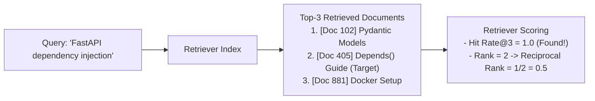

# 📹 How to Test RAG Retrievers(Hands-On)

<div className="video-card" style={{border: '1px solid #30363d', borderRadius: '8px', padding: '16px', marginBottom: '24px', background: 'rgba(56, 139, 253, 0.05)'}}>
  <div style={{display: 'flex', gap: '16px', flexWrap: 'wrap'}}>
    <div><strong>Instructor:</strong> Nitish Singh (CampusX)</div>
    <div><strong>Duration:</strong> 6422</div>
    <div><strong>Course:</strong> Module 6: LLM Evaluation & Observability</div>
    <div><strong>Watch Link:</strong> <a href="https://www.youtube.com/watch?v=9Dkz3ckRj8c" target="_blank" rel="noopener noreferrer">YouTube Lecture ↗</a></div>
  </div>
</div>

## 📌 Executive Summary

Retrieval is the foundation of any RAG pipeline. If the retriever fails to supply relevant chunks, no language model can synthesize an accurate answer. Evaluating retrievers is fast, deterministic, and requires no LLM generation calls.

This hands-on lesson covers the mathematical formulations and Python implementations for Hit Rate@K, Mean Reciprocal Rank (MRR), and Context Recall.

---

## 🏗️ System Architecture & Execution Flow



---

## 📖 Core Concepts & Technical Deep Dive

### 1. Key Retriever Metrics
- **Hit Rate@K:** Binary indicator (1 or 0) of whether at least one ground-truth relevant document appears in the top $K$ retrieved results.
- **Mean Reciprocal Rank (MRR):** Measures the position of the *first* relevant document. If the first relevant doc is at rank 1, MRR is 1.0; if at rank 2, MRR is 0.5; if at rank 4, MRR is 0.25.
- **Context Recall:** The proportion of ground-truth relevant chunks that were successfully retrieved in the top $K$.

---

## 💻 Production Implementation

```python
from typing import List, Dict

def evaluate_retriever(test_cases: List[Dict], k: int = 3):
    total_hits = 0
    reciprocal_ranks = []
    
    for tc in test_cases:
        target_id = tc["ground_truth_id"]
        retrieved = tc["retrieved_ids"][:k]
        
        # Hit Rate@K
        if target_id in retrieved:
            total_hits += 1
            rank = retrieved.index(target_id) + 1
            reciprocal_ranks.append(1.0 / rank)
        else:
            reciprocal_ranks.append(0.0)
            
    hit_rate = total_hits / len(test_cases)
    mrr = sum(reciprocal_ranks) / len(reciprocal_ranks)
    
    return {"Hit_Rate@K": round(hit_rate, 3), "MRR": round(mrr, 3)}

# Sample evaluation data
cases = [
    {"query": "fastapi cors", "ground_truth_id": "doc_01", "retrieved_ids": ["doc_01", "doc_99", "doc_03"]},
    {"query": "pydantic validator", "ground_truth_id": "doc_02", "retrieved_ids": ["doc_88", "doc_02", "doc_04"]},
    {"query": "docker compose", "ground_truth_id": "doc_03", "retrieved_ids": ["doc_12", "doc_14", "doc_15"]}
]

print("Evaluation Results:", evaluate_retriever(cases, k=3))
```

---

## ⚙️ Production Gotchas & Best Practices

:::tip Optimize Chunk Size and Overlap First
Before fine-tuning embeddings or adopting complex re-rankers, benchmark different chunk sizes (256 vs 512 vs 1024 tokens) against your retrieval metrics. Chunk sizing accounts for over 60% of retrieval variance.
:::

:::warning Watch for False Negatives in Annotations
In large document collections, the retriever might fetch an unannotated chunk that actually answers the question. Regularly audit low-scoring queries for missing ground truth labels.
:::

---

## 📊 Architectural Reference & Comparison

| Metric | Focus | Sensitive to Order? | Range | Target Production SLA |
| :--- | :--- | :--- | :--- | :--- |
| **Hit Rate@3** | Presence in top-3 | No | [0, 1] | >= 0.90 |
| **Hit Rate@5** | Presence in top-5 | No | [0, 1] | >= 0.95 |
| **MRR** | Rank of 1st relevant chunk | Yes (Heavy penalty for low rank) | [0, 1] | >= 0.80 |
| **NDCG@K** | Multi-document relevance grading | Yes | [0, 1] | >= 0.85 |

---

## 📚 Key Takeaways & Enterprise Checklist

- [ ] **Architecture Verification:** Ensure your design addresses latency, decoupled interfaces, and strict data validation contracts.
- [ ] **Deterministic Testing:** Run unit tests and golden dataset evaluations before shipping changes to staging or production.
- [ ] **Security & Observability:** Enforce input/output guardrails, scrub sensitive credentials/PII, and capture distributed traces.
- [ ] **Scalability & Sizing:** Calibrate model parameters, context limits, and compute instance requirements against projected request concurrency.
