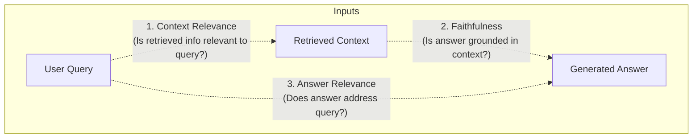

# 📹 Evaluating RAG: Testing the Generator & Full Pipeline with the RAG Triad

<div className="video-card" style={{border: '1px solid #30363d', borderRadius: '8px', padding: '16px', marginBottom: '24px', background: 'rgba(56, 139, 253, 0.05)'}}>
  <div style={{display: 'flex', gap: '16px', flexWrap: 'wrap'}}>
    <div><strong>Instructor:</strong> Nitish Singh (CampusX)</div>
    <div><strong>Duration:</strong> 4889</div>
    <div><strong>Course:</strong> Module 6: LLM Evaluation & Observability</div>
    <div><strong>Watch Link:</strong> <a href="https://www.youtube.com/watch?v=PATGn2XhmCY" target="_blank" rel="noopener noreferrer">YouTube Lecture ↗</a></div>
  </div>
</div>

## 📌 Executive Summary

The RAG Triad—comprising Context Relevance, Faithfulness (Groundedness), and Answer Relevance—is the industry-standard framework for end-to-end RAG evaluation popularized by TruLens and Ragas.

This lesson explores how to test the synthesis capabilities of the generation model, detect hallucinations, and enforce strict factual grounding.

---

## 🏗️ System Architecture & Execution Flow



---

## 📖 Core Concepts & Technical Deep Dive

### 1. The Three Legs of the RAG Triad
1. **Context Relevance (Retriever Quality):** Measures whether the retrieved chunks contain relevant information to answer the query without excessive noise or unrelated text.
2. **Faithfulness / Groundedness (Generator Reliability):** Verifies that every claim in the generated answer can be directly inferred from the retrieved context. A faithfulness score of 1.0 indicates zero hallucinations.
3. **Answer Relevance (Task Fulfillment):** Measures whether the generated answer directly addresses the specific user prompt, irrespective of factual correctness.

### 2. Computing Faithfulness Algorithmically
- **Step 1:** Extract all atomic factual statements from the generated answer.
- **Step 2:** For each statement, use a natural language inference (NLI) model or judge LLM to verify if the context entails the statement.
- **Step 3:** Faithfulness = (Number of entailed statements) / (Total statements extracted).

---

## 💻 Production Implementation

```python
from ragas.metrics import faithfulness, answer_relevancy
from ragas import evaluate
from datasets import Dataset

# Construct evaluation dataset sample
data_sample = {
    "question": ["What is the default port for FastAPI in Uvicorn?"],
    "contexts": [["Uvicorn defaults to running applications on port 8000 on localhost."]],
    "answer": ["Uvicorn runs FastAPI on port 8000 by default."],
    "ground_truth": ["Port 8000"]
}

dataset = Dataset.from_dict(data_sample)
print("RAG Triad dataset ready for batch scoring across faithfulness and answer relevancy.")
```

---

## ⚙️ Production Gotchas & Best Practices

:::tip Catching Subtly Inaccurate Answers
An answer can have 100% Answer Relevance while having 0% Faithfulness if the model invents a convincing answer from memory. Always inspect both metrics together.
:::

:::warning Strict Extraction Prompts
Instruct your generator prompt: *"You must answer solely using the facts in the Context. If the context does not contain sufficient facts, respond with 'Information not available in context'."*
:::

---

## 📊 Architectural Reference & Comparison

| Triad Metric | Evaluates | High Score Means | Low Score Diagnosis |
| :--- | :--- | :--- | :--- |
| **Context Relevance** | Retriever | Concise, pertinent chunks | Retriever fetching noisy, irrelevant docs |
| **Faithfulness** | Generator | Zero hallucinations; fully grounded | Model relying on pre-training memory |
| **Answer Relevance** | Generator | Direct, helpful answer to query | Model rambling, repeating, or evading question |

---

## 📚 Key Takeaways & Enterprise Checklist

- [ ] **Architecture Verification:** Ensure your design addresses latency, decoupled interfaces, and strict data validation contracts.
- [ ] **Deterministic Testing:** Run unit tests and golden dataset evaluations before shipping changes to staging or production.
- [ ] **Security & Observability:** Enforce input/output guardrails, scrub sensitive credentials/PII, and capture distributed traces.
- [ ] **Scalability & Sizing:** Calibrate model parameters, context limits, and compute instance requirements against projected request concurrency.
