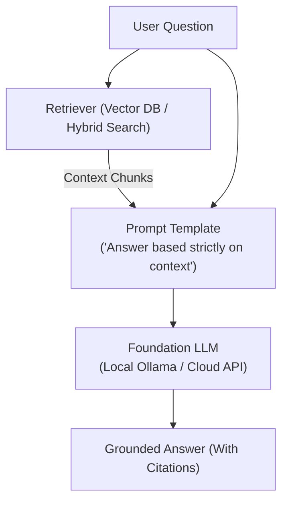

# 📹 Evaluating RAG: Testing the Generator & Full Pipeline with the RAG Triad

<div className="video-card" style={{border: '1px solid #30363d', borderRadius: '8px', padding: '16px', marginBottom: '24px', background: 'rgba(56, 139, 253, 0.05)'}}>
  <div style={{display: 'flex', gap: '16px', flexWrap: 'wrap'}}>
    <div><strong>Instructor:</strong> Nitish Singh (CampusX)</div>
    <div><strong>Duration:</strong> 81m 29s</div>
    <div><strong>Playlist:</strong> LLM Evaluation Complete Series (CampusX)</div>
    <div><strong>Watch Link:</strong> <a href="https://www.youtube.com/watch?v=PATGn2XhmCY" target="_blank" rel="noopener noreferrer">YouTube Lecture ↗</a></div>
  </div>
</div>

## 📌 Executive Summary & Learning Objectives

This lecture covers **Evaluating RAG: Testing the Generator & Full Pipeline with the RAG Triad**, focusing on production implementations, edge cases, and industry standards:
- Core intuition, architecture, and underlying mechanisms.
- Key differences between theoretical research implementations and scalable enterprise patterns.
- Concrete Python walkthroughs, error recovery, and performance optimization.

---

## 🏗️ Architecture & Conceptual Workflow



---

## 📖 Core Concepts & Technical Deep Dive

### 1. Architectural Foundations
In modern production AI engineering, **Evaluating RAG: Testing the Generator & Full Pipeline with the RAG Triad** is essential for ensuring reliability, low latency, and deterministic outcomes. As AI systems evolve from naive prompt-in / completion-out scripts into distributed systems, engineers must handle:
- **State management & consistency:** Ensuring intermediate states and tool invocations are tracked.
- **Error boundaries & recovery:** Graceful degradation when external LLMs or vector stores encounter rate limits or network partitions.
- **Resource utilization & cost efficiency:** Caching common queries and reducing unnecessary foundation model token expenditure.

### 2. Operational Considerations
- **Latency Optimization:** Pre-computing embeddings, utilizing asynchronous non-blocking event loops, and streaming tokens via Server-Sent Events (SSE).
- **Security & Sandboxing:** Validating inputs before ingestion, sanitizing LLM outputs, and isolating tool execution environments.

---

## 💻 Production Implementation Walkthrough

```python
from langchain_core.prompts import ChatPromptTemplate
from langchain_core.runnables import RunnablePassthrough
from langchain_core.output_parsers import StrOutputParser
from langchain_community.chat_models import ChatOllama

# RAG Prompt with strict grounding
rag_template = """Answer the question based strictly on the provided context:
Context:
{context}

Question: {question}
Answer:"""

prompt = ChatPromptTemplate.from_template(rag_template)
llm = ChatOllama(model="llama3", temperature=0.1)

# Format documents helper
def format_docs(docs):
    return "\n\n".join(doc.page_content for doc in docs)

# Complete RAG Chain
rag_chain = (
    {"context": retriever | format_docs, "question": RunnablePassthrough()}
    | prompt
    | llm
    | StrOutputParser()
)
```

---

## 💡 Production Best Practices & Tips

:::tip Production Deployment Guideline
When deploying Evaluating RAG: Testing the Generator & Full Pipeline with the RAG Triad in enterprise environments, always configure automated retries with exponential backoff and telemetry tracing (such as OpenTelemetry or LangSmith).
:::

:::warning Common Failure Modes
Watch out for state contamination across concurrent requests. Ensure each session or user interaction uses an isolated thread ID or execution context.
:::

---

## 🎯 Key Takeaways & Quick Reference

| Dimension | Production Standard | Pitfall to Avoid |
| :--- | :--- | :--- |
| **Execution** | Async / Non-blocking with timeouts | Synchronous blocking calls in event loops |
| **Data Validation** | Strict Pydantic v2 schemas | Untyped dictionary access |
| **Monitoring** | Distributed tracing & latency percentiles | Relying only on standard console logs |

## ⏱️ Lecture Timeline & Key Topics

| Timestamp | Key Topic / Concept Discussed |
| :--- | :--- |
| **00:00:00** | सो गाइस एक बार आज के सेशन का प्लान ऑफ... |
| **00:20:52** | क्या यह क्लेम इस गोल्डन कॉन्टेक्स्ट में... |
| **00:40:26** | भी अच्छा ही होता है। तो... |
| **01:00:12** | मैट्रिक्स एक्सिस्ट करते हैं। अब आप मुझे... |
| **01:21:26** | नहीं है बट हो जाएंगे विद इन वन ईयर।... |


---

---

## 📜 Complete Lecture Transcript (English)

> **Language:** English | **Source:** `14 - Evaluating RAG： Testing the Generator & Full Pipeline with the RAG Triad ｜ CampusX.hi.srt` | **Total Segments:** 41 | **Word Count:** ~13,116 words

<details>
<summary><b>Click to expand full chronological transcript (41 timestamped intervals)</b></summary>

#### ⏱️ [00:00 ➔ 00:02]

सो गाइस एक बार आज के सेशन का प्लान ऑफ एक्शन डिस्कस कर लेते हैं। सो इफ यू रिमेंबर हम लोग अह दो क्लासेस पहले रैग इवाल स्टार्ट किए हैं। और हमने बहुत डिटेल में एक प्लान बनाया है कि हम एक रैग एप्लीकेशन को कैसे इवैल्यूएट करेंगे और उस डिटेल्ड प्लान में अभी करेंटली हम सिर्फ एक काम कर रहे हैं और वो काम यह है कि हम अपने रैग एप्लीकेशन के लिए एक रैग इवल स्वीट बिल्ड कर रहे हैं। बेसिकली अ सेट ऑफ इवैल्यूएशंस जिनको हम एक साथ रन करें और हमें अपने पूरे रैग एप्लीकेशन का इवैल्यूएशन करने को मिल जाए। यह हम लोग बिल्ड कर रहे हैं। और ये हम तीन लेवल्स पे बिल्ड कर रहे हैं। सो वी आर बिल्डिंग एट कंपोनेंट लेवल, वी आर बिल्डिंग एट पाइपलाइन लेवल, एंड वी आर बिल्डिंग एट एप्लीकेशन लेवल। तो लास्ट सेशन में हमने स्टार्ट किया था कंपोनेंट लेवल पे बिल्ड करना। मैंने आपको बताया था कि रैग में दो ही कंपोनेंट्स होते हैं। फर्स्ट इज़ रिट्रीवर एंड द सेकंड वन इज़ जनरेटर। तो लास्ट सेशन में हमने रिट्रीवर वाला अ इवैल्यूएशन कंप्लीट कर लिया था। हमने दो मैट्रिक्स को ट्रैक किया था, बनाया था। अ रिकॉल एंड प्रसीजन दोनों हमने कंप्लीट कर लिया था। अब आज के सेशन का हमारा प्लान ये है कि हम जनरेटर को इवैलुएट करना सीखेंगे और फिर आज ही हम लोग हमारी कंप्लीट रैग पाइपलाइन को भी इवैलुएट करना सीखेंगे। तो ये दोनों काम हमें आज के सेशन में कंप्लीट करने हैं। यही हमारा आज का प्लान है। ठीक है? तो आई होप प्लान इज़ क्लियर। नाउ लेट्स मूव ऑन टू अ द स्टार्ट ऑफ द सेशन। सो सबसे पहले अगर हमें जनरेटर को इवैल्यूएट करना है तो उसके लिए पहले हमें अपने एप्लीकेशन में जनरेटर को बनाना भी तो पड़ेगा। सो हम सबसे पहले क्या कर रहे हैं? एक जनरेटर बना रहे हैं। ठीक है? आपको याद होगी ये बात।

#### ⏱️ [00:02 ➔ 00:04]

हमने डिस्कस भी किया है कि हम ऐसा नहीं कर रहे हैं कि एक बार में पूरा रैग एप्लीकेशन बिल्ड कर लिया और फिर उसको टेस्ट कर रहे हैं। हम कंपोनेंट बाय कंपोनेंट अ रैग एप्लीकेशन को बिल्ड कर रहे हैं और हर कंपोनेंट को बनाने के साथ-साथ उसको टेस्ट भी कर रहे हैं। बिल्कुल वैसे ही जैसे सॉफ्टवेयर में होता है। बिल्कुल सेम फॉर्मेट हम यूज़ कर रहे हैं। रिट्रीवर को बनाया, रिट्रीवर को इवैल्यूएट किया। आज जनरेटर को बनाएंगे, जनरेटर को इवैल्यूएट करेंगे। यही प्रोसेस रहने वाला है। ठीक है? तो जनरेटर इज अ वेरी सिंपल कंपोनेंट। आपको शायद पता ही होगा पूरा फंडा क्या होता है जनरेटर का। एक रैक पाइपलाइन में आपके पास रिट्रीवर का काम क्या है कि उसको जैसे ही एक क्वेरी मिला वो क्वेरी को वो भेजता है एक वेक्टर डेटाबेस में। एंबेड करके और पलट करके पांच या 10 रेलेवेंट डॉक्स फच करके लाता है। उसके बाद रैक पाइपलाइन में आप क्या करते हो? यही पांच या 10 रेलेवेंट डॉक्स और इस क्वेश्चन को उठा के जनरेटर के पास भेजते हो। और जनरेटर का काम क्या होता है? इस क्वेश्चन और रेलेवेंट डॉक्स के बेसिस पे एक आंसर जनरेट करना। सो बेसिकली जनरेटर इज अ फंक्शन जिसको इनपुट में दो चीजें मिल रही हैं। आपका क्वेश्चन और ये रेलेवेंट डॉक्यूमेंट्स और वो आउटपुट में आपको एक चीज दे रहा है। दैट इज द आंसर टू योर क्वेश्चन। ठीक है? तो हमें आज बेसिकली ये कंपोनेंट बिल्ड करना है। बहुत ही सिंपल कंपोनेंट है। इट बेसिकली यूज़ अ एलएलएम। दैट्स इट। सो अगेन कोड मैं स्क्रैच से नहीं लिखूंगा बिकॉज़ इट विल टेक टाइम। इंस्टेड मैंने जो कोड ऑलरेडी लिख रखा है और वो गेट पर पुश् मैं उस कोड को यूज करूंगा। सो यह वही रेपो है जो मैंने आपको लास्ट सेशन में दिखाया था। इसी में मैंने नई फाइल्स भी पुश की हैं आज। तो अगर आप यहां पे एसआरसी में जाओगे तो अब आपको यहां पे एक नई फाइल दिखाई देगी जनरेटर डॉटpy। इस पे जैसे ही आप क्लिक करोगे तो

#### ⏱️ [00:04 ➔ 00:06]

ये रहा आपका जनरेटर का कोड। बहुत ही सिंपल प्यारा सा कोड है। एक बार जल्दी से स्टडी कर लेते हैं। सो सबसे पहले लाइब्रेरीज को इंपोर्ट किया। लोडnबी को कॉल किया। बिकॉज़ हमें ओपन एआई की एपीआई कीज़ चाहिए। यहां पे हमने एक एलएलएम को बुलाया। हमारा एलएलएम है GPT 4O मिनी। सस्ता है और टेंपरेचर हमने ज़ीरो सेट कर दिया। मोस्ट ऑफ़ द टाइम्स आप देखोगे इवैल्यूएशन के टाइम पे हम टेंपरेचर ज़ीरो ही सेट करते हैं। हालांकि ये तो रैग बनाने का प्रोसेस है। बट जो भी है। अब यहां पे हमने एक प्र्प्ट बनाया अपने जनरेटर के लिए। बहुत सिंपल सा प्रम्प्ट है। यू आर अ हेल्पफुल टीचिंग असिस्टेंट फॉर अ कोर्स ऑन एलएलएम इवैल्यूएशंस। आंसर द स्टूडेंट्स क्वेश्चन ओनली फ्रॉम द कॉन्टेक्स्ट प्रोवाइडेड बिलो। कुछ रूल्स हमने बता दिए कि यूज़ ओनली इंफॉर्मेशनेशन प्रेजेंट इन द कॉन्टेक्स्ट डू नॉट ऐड आउटसाइड नॉलेज। ऑब्वियसली रैक चार्टबॉट्स जो होते हैं वो आंसर कॉन्टेक्स्ट से ही देते हैं। अपने ट्रेनिंग नॉलेज से नहीं देते। तो ये हमने एक्सप्लसिटली लिख दिया। इफ द कॉन्टेक्स्ट डज नॉट कंटेन इनफ इंफॉर्मेशन टू आंसर से आई डोंट हैव इनफ इनफेशन इन द कोर्स मटेरियल टू आंसर दैट सो हमने सीधे-सीधे बोल दिया हेलुसनेट मत करना कुछ भी हो जाए नहीं पता होगा सीधे-सीधे बोल देना नहीं आता है ठीक है एंड लास्टली कीप द आंसर क्लियर एंड कॉन्साइज और साथ में हम कॉन्टेक्स्ट प्रोवाइड कर रहे हैं जो हमें रिट्रीवर से मिल रहा है और क्वेश्चन प्रोवाइड कर रहे हैं जो हमें यूजर दे रहा है और यहां पे हमने एक सिंपल लैंग चेन चेन बनाया हमें हमें प्र्ट मिल रहा है। उसको हम एलएलएम के पास भेज रहे हैं। जो रिस्पांस आ रहा है उसको हम स्ट्रिंग आउटपुट पार्सर में डाल के स्ट्रिंग एक्सट्रैक्ट कर रहे हैं। यहां पे हमने एक सिंपल सा जनरेट फंक्शन बनाया जिसमें दो चीजें इनपुट में मिल रही हैं। क्वेरी और कॉन्टेक्स्ट और ये पलट करके हमें क्या रिटर्न कर रहा है? हमारा आंसर जो जनरेटर जनरेट करेगा और ये कोड है सिंपली उसको टेस्ट करने का। इसको आप इग्नोर भी कर सकते हो। तो हम बस इस सिंपल से कोड को यूज़ करेंगे। आई विल कॉपी दिस और मैं अपने कोड में जाऊंगा और वहां पे मैं एसआरसी में

#### ⏱️ [00:06 ➔ 00:08]

एक नई फाइल बनाऊंगा बाय द नेम ऑफ जनरेटर डॉट py और यहां पे मैं पेस्ट कर दूंगा सेम कोड को एंड आई विल सेव इट। ठीक है? सिंपल। एक बार इसको चला के देख सकते हैं हम लोग। सो चलाने का कोड में क्या लिखा है हमने? हमने बेसिकली खुद से एक डमी कॉन्टेक्स्ट बनाया है। यह हमें रिट्रीवर से नहीं मिल रहा। हम खुद से जनरेट करके ला रहे हैं। और एक क्वेश्चन हमने अपने हिसाब से बनाया। व्हाट इज़ ऑनलाइन इवल? और कॉन्टेक्स्ट हमने पास कर दिया जनरेट फंक्शन को। इन दोनों चीजों की हेल्प से एलएलएम हमें एक आंसर जनरेट करके देगा। लेट्स क्विकली ट्राई दिस। सो इफ वी गो टू टर्मिनल एंड इफ वी रन तो अब ये कोड रन हो रहा है एंड होपफुली विल गेट एन आंसर ठीक है ये रहा ऑनलाइन इवल मींस इवैलुएटिंग योर सिस्टम ऑन लाइव प्रोडक्शन ट्रैफिक आफ्टर डिप्लॉयमेंट इट वर्क्स विदाउट एन आंसर की अनलाइक ऑफलाइन इवा रहा गाइज़ बिल्कुल यहीं से उसने आंसर बता दिया तो इट क्लियरली शोज़ की हमारा कोड काम कर रहा है। इससे ज्यादा हमने कुछ प्रूव नहीं किया। सो या नटशेल में हमने अपना जनरेटर क्रिएट कर दिया एंड इट इज़ वर्किंग। अच्छा काम कर रहा है, बुरा काम कर रहा है वो हमें नहीं पता। वो इवैलुएट करके पता चलेगा। बट हमने जनरेटर बना लिया। अब हम इसको इवैलुएट करेंगे। तो अब क्वेश्चन आता है कि अगर आपके पास एक जनरेटर है तो आप उसको इवैल्यूएट कैसे करोगे? देखो कभी भी किसी भी सिस्टम को अगर आपको इवैल्यूएट करना है तो सोचने का तरीका क्या होता है? फर्स्ट प्रिंसिपल तरीका क्या होता है कि आप ये सोचो कि वो सिस्टम कहां-कहां और कैसे-कैसे फेल कर सकता है। बेसिकली उस सिस्टम के फेलियर मोड्स आप खोजो। तो अगर हमें जनरेटर को इवैलुएट करना है तो हम जनरेटर के फेलियर मोड्स पहले डिस्कस करेंगे कि क्या-क्या तरीकों से जनरेटर फेल कर सकता है। तो दो बहुत मेजर तरीके हैं

#### ⏱️ [00:08 ➔ 00:10]

जिसमें जनरेटर फेल कर सकता है। उसमें से पहला तरीका यह है कि आपका जो जनरेटर है वो अनफेथफुल रिस्पांस दे। अनफेथफुल का मतलब क्या है? कि आपने जनरेटर को एक क्वेश्चन दिया और साथ ही साथ कुछ कॉन्टेक्स्ट ला के दिया और आपने बोला कि ये क्वेश्चन देखो ये कॉन्टेक्स्ट पढ़ो और इस क्वेश्चन को इस कॉन्टेक्स्ट के बेसिस पे आंसर करो। बट जनरेटर ने क्या गड़बड़ की कि उसने कॉन्टेक्स्ट तो पढ़ा बट उसने थोड़ा बहुत अपनी साइड से इंफॉर्मेशन ऐड भी कर दिया। इसको बोलते हैं अनफेथफुल रिस्पांस। जैसे यहां पे एक एग्जांपल देखो। डस द कैंपस एक्सक्स एआई इंजीनियरिंग प्रोग्राम इंक्लूड लाइव क्लासेस? ये क्वेश्चन यूजर ने पूछा। हम जो कॉन्टेक्स्ट फैच करके लाए वो ये है। द एआई इंजीनियरिंग प्रोग्राम इंक्लूड्स रिकॉर्डेड लेसंस, कोडिंग असाइनमेंट्स, प्रोजेक्ट्स एंड वीकली डाउट सॉल्विंग सेशंस। बट यहां पे एग्जैक्टली नहीं लिखा हुआ है कि लाइव सेशंस या लाइव क्लासेस होती हैं कि नहीं। बाकी इसके अलावा की चीजें कॉन्टेक्स्ट में लिखी हुई हैं। अब यहां पे देखो क्या आंसर आ रहा है? आंसर आ रहा है यस। द प्रोग्राम इंक्लूड्स टू लाइव क्लासेस एव्री वीक अलोंग विद वीकली डाउट सॉल्विंग सेशंस। नाउ यू टेल मी क्या ये आंसर फेथफुल है कॉन्टेक्स्ट के साथ और नॉट। यू कैन क्लियरली सी दिस इज़ नॉट फेथफुल। द एलएलएम इज़ हेलुसनेटिंग एंड इट इज़ क्रिएटिंग रिस्पांस फ्रॉम इट्स ओन एंड। जब इसको नहीं मिला आंसर इस कॉन्टेक्स्ट में तो उसने अपनी फ्रीडम से आंसर क्रिएट कर दिया। इसी को हम बोलते हैं हेलुसिनेटेड रिस्पांस या फिर अनफेथफुल रिस्पांस। एंड दिस इज वेरी वेरीरी डेंजरस। बिकॉज़ अगर ये चीज आपके रैग एप्लीकेशन में है [नाक से की जाने वाली आवाज़] तो इट कैन क्रिएट मैसिव प्रॉब्लम्स। जो पास्ट में हमने देखा भी था एग्जांपल्स में जब हमने

#### ⏱️ [00:10 ➔ 00:12]

वो एयर कनाडा वाली केस स्टडी डिस्कस की थी कि एयर कनाडा वाले ने ऐसे ही बोल दिया कि आप टिकट करा लो हम बाद में आपके पैसे रिइबर्स कर देंगे। तो दिस वाज़ अ जनरेटर प्रॉब्लम। जनरेटर वहां पे फेल किया था। उसने कॉन्टेक्स्ट को इग्नोर करके खुद से इंफॉर्मेशनेशन क्रिएट किया और सामने यूजर को दे दिया। तो दिस इज अ वेरी वेरीरी डेंजरस सिचुएशन। यह आपको अवॉइड करना होता है। तो, यह जो मैट्रिक है जो इस चीज़ को टेस्ट करती है, इसको हम बोलते हैं फेथफुलनेस। सिंपल शब्दों में आपका जनरेटेड आंसर कितना फेथफुल है टुवर्ड्स योर कॉन्टेक्स्ट। यही मेजर किया जाता है विथ द हेल्प ऑफ फेथफुलनेस। आई रियली होप मैं समझ आपको समझा पाया। यहां पे एक इंपॉर्टेंट चीज और है कि कई बार ऐसा होगा कि आपका जो कॉन्टेक्स्ट रिट्रीव करके आप लाओगे वो एकदम ही गलत होगा। होता है ऐसा आपका रैक चार्टबॉट का रिट्रीवर गलत कॉन्टेक्स्ट फैच करके लाया तो एक सही जनरेटर क्या करेगा कि उस गलत कॉन्टेक्स्ट से ही आंसर क्रिएट करेगा। भले ही वो आंसर कंप्लीटली गलत हो। सो यहां पर एक इंपॉर्टेंट चीज आपको याद रखनी है कि फेथफुल होने का मतलब जरूरी नहीं है कि आपका आंसर करेक्ट भी हो। फेथफुल होने का सिर्फ यह मतलब होता है कि जो कॉन्टेक्स्ट आया है गलत या सही मैं आंसर पूरा का पूरा उसी से क्रिएट करूंगा। उसके अलावा एक बिट इंफॉर्मेशन भी मैं अपनी साइड से नहीं दूंगा। यही होता है फेथफुलनेस का प्रॉमिस। आई रियली होप मैं आपको समझा पाया। तो फेथफुलनेस एज अ मैट्रिक हम इवैलुएट करेंगे अपने जनरेटर के ऊपर। यह हमारा पहला की मैट्रिक है। इसके अलावा अगर हम बात करें तो देयर इज़ वन मोर फेलियर मोड। एक और तरीके से जनरेटर फेल कर सकता है। कैसे? सो इमेजिन करो कि अगेन ये आपका क्वेश्चन है। डस द कैंपस

#### ⏱️ [00:12 ➔ 00:14]

एक्स एआई इंजीनियरिंग प्रोग्राम इंक्लूड लाइव क्लासेस? और यह आंसर जनरेट हुआ। द प्रोग्राम इंक्लूड्स कोडिंग असाइनमेंट, प्रोजेक्ट्स, रिकॉर्डेड लेसंस एंड वीकली डाउट सॉल्विंग सेशंस। ठीक है? दिस इज द क्वेश्चन। दिस इज द आंसर। नाउ यू टेल मी फर्स्ट चैट में यस और नो में कि इज दिस आंसर फेथफुल टू द कॉन्टेक्स्ट? ये है कॉन्टेक्स्ट। बाय द वे। क्या ये आंसर जो जनरेट हुआ है, इज इट फेथफुल? आई गेस आप देख पा रहे हो कि द आंसर इज फुल्ली फेथफुल टू द कॉन्टेक्स्ट। जो चीज कॉन्टेक्स्ट में उसको मिली है उसी से उसने आंसर प्रिपेयर किया है। ऑलमोस्ट हो सकता है वर्ड बाय वर्ड सेम हो। तो क्लियरली दिस आंसर इज़ फेथफुल? सेकंड क्वेश्चन क्या ये आंसर? रेलेवेंट है टू द क्वेश्चन? ये सोच के बताओ। इज दिस आंसर रेलेवेंट टू द क्वेश्चन? क्या यह क्वेश्चन को आंसर कर रहा है जो यूजर ने पूछा? द आंसर इज नो। तो यह भी एक फेलियर मोड है कि कई बार ऐसा होगा कि कॉन्टेक्स्ट को पकड़ के ही जनरेटर आंसर जनरेट करेगा। बट वो आंसर ही रेलेवेंट नहीं होगा क्वेश्चन को आंसर करने के लिए। दैट इज़ आल्सो अ फेलियर मोड। बिकॉज़ इस केस में भी यूजर को उसका आंसर नहीं मिला। आइडियली एक रेलेवेंट आंसर ये होता अगर जनरेटर ये प्रिंट करता। द प्रोवाइडेड कॉन्टेक्स्ट डज़ नॉट कंफर्म दैट द प्रोग्राम इंक्लूड्स लाइव क्लासेस। इट ओनली मेंशंस रिकॉर्डेड लेसंस, कोडिंग असाइनमेंट्स, प्रोजेक्ट्स एंड वीकली डाउट सॉल्विंग सेशंस। तो अब ये जो चीज है ना ये एटलीस्ट रेलेवेंट है। द आंसर इज़ रेलेवेंट टू द क्वेश्चन एंड साथ ही साथ इट इज़ आल्सो फेथफुल। क्योंकि यह कुछ भी इंफॉर्मेशन खुद से क्रिएट नहीं कर रहा है। तो दिस इज द सेकंड फेलियर मोड कि जहां पर कॉन्टेक्स्ट से ही आंसर निकला बट वो आंसर ही रेलेवेंट नहीं है। तो इसको बोला जाता है सेकंड

#### ⏱️ [00:14 ➔ 00:16]

मैट्रिक और इसका नाम है आंसर रेलेवेंस। इसके अलावा और भी कुछ मैट्रिक्स होते हैं जो आप टेस्ट करते हो जनरेटर के ऊपर सच एज साइटेशन एक्यूरेसी कंप्लीटनेस करेक्टनेस ये सारी चीजें भी होती हैं बट इनको हम एप्लीकेशन लेवल पर टेस्ट करेंगे अभी नहीं ठीक है तो अभी हमारा जो गोल है वो ये है कि हम अपने जनरेटर को दो चीजों के ऊपर इवैल्यूएट करेंगे फर्स्ट हम उसको इवैलुएट करेंगे फेथफुलनेस के ऊपर व्हिच बेसिकली टेस्ट्स कि जो आंसर हमने जनरेट किया वो कॉन्टेक्स्ट से ही निकला हुआ है या फिर कुछ अलग इन्वेंट कर रहा है हमारा जनरेटर। एंड सेकंड थिंग दैट वी विल टेस्ट इज़ आंसर रेलेवेंस व्हिच बेसिकली मीन्स कि जो आंसर जनरेट हुआ है क्या वो क्वेश्चन के लिए रेलेवेंट है कि नहीं? क्या वो क्वेश्चन को सही तरीके से आंसर कर रहा है कि नहीं? ये दो क्वांटिटीज हम टेस्ट करेंगे। ठीक है? तो नेक्स्ट हमारा गोल है टू फुल्ली अंडरस्टैंड कि ये दोनों मैट्रिक्स कैलकुलेट कैसे किए जाते हैं। अभी तक हमने व्हाट डिस्कस किया? क्या मैट्रिक्स हम इवैलुएट करेंगे? अब हम हाउ डिस्कस करेंगे कि एग्जैक्टली फेथफुलनेस कैलकुलेट कैसे होता है? आंसर रेलेवेंस कैलकुलेट कैसे होता है? और फिर हम उसको डीप इवल में इंप्लीमेंट करेंगे और फिर रन करके देखेंगे कि क्या सच में हमारा जनरेटर सही काम कर रहा है या नहीं। सबसे पहले हमें फेथफुलनेस कैलकुलेट करने के लिए ना एक डेटा सेट चाहिए। अब वो डेटा सेट कहां से आएगा वो थोड़ी देर बाद डिस्कस करेंगे। फिलहाल मैं आपको बता देता हूं कि वो डेटा सेट दिखेगा कैसा। सो इस डेटा सेट में दो कॉलम्स होंगे। पहला कॉलम होगा क्वेश्चन और दूसरा कॉलम होगा गोल्डन कॉन्टेक्स्ट। ये दो कॉलम्स होंगे। अब मैं आपको एक्सप्लेन करता हूं कि इन दोनों

#### ⏱️ [00:16 ➔ 00:18]

कॉलम्स में क्या-क्या होगा। सो बेसिकली यहां पे एक क्वेश्चन होगा। सिंपल क्वेश्चन है। मान लो क्वेश्चन है अ व्हाट इज रैग ट्रायड जो हमने किसी सेशन में डिस्कस किया था। अब इसके कॉस्पोंडिंग गोल्डन कॉन्टेक्स्ट में क्या होगा वो मैं आपको बताता हूं। सो कोई बंदा होगा जो क्या करेगा कि वो हमारा जो पूरा का पूरा चंक्स है हमारे वेक्टर डेटाबेस में उसको जाकर के वो पूरा छान मारेगा और वहां से वो चंक्स निकालेगा जहां पे रैग ट्रायर्ड के बारे में बात हुई है। ठीक है? और उन सारे चंक्स को यहां पे डाल देगा। फिर सिमिलरली हम कोई और क्वेश्चन ले आएंगे। व्हाट आर ऑनलाइन इव्स? और यहां पे भी हम फिर से जाके खोजेंगे कि कौन-कौन से चंक्स में ऑनलाइन इव्स की बात हुई है और उन सारे चंक्स को हम यहां पे ले आ के रख देंगे। और ऐसा हम 10, 15, 50 क्वेश्चंस के लिए करेंगे। ठीक है? तो हमारे पास बेसिकली ये डेटा सेट आ गया। तो इन अ वे दिस इज अ गोल्डन डेटा सेट। दिस कंटेन आवर गोल्डन कॉन्टेक्स्ट। ठीक है? नाउ द प्रोसेस इज़ वेरी सिंपल। व्हाट यू विल डू इज़ आप एक एलएलएम एज अ जज को लेके आओगे। एक एलएलएम एज अ जज को लेके आओगे। और उसको ये फर्स्ट क्वेश्चन भेजोगे। ठीक है? और ये जो आपका एलएलएम है ये क्या करेगा कि सबसे पहले अ हमारा जो जनरेटर है हमारा जनरेटर मान लो यहां पे है तो सबसे पहले एक्चुअली ये एलएलएम एज अ जज पिक्चर में नहीं आएगा। सबसे पहले हम क्या करेंगे? इस क्वेश्चन को उठाएंगे और जनरेटर के पास भेजेंगे। और जनरेटर को हम ये गोल्डन कॉन्टेक्स्ट भी

#### ⏱️ [00:18 ➔ 00:20]

दे देंगे। ठीक है? तो जनरेटर को हमेशा दो चीजें चाहिए होती हैं। एक क्वेश्चन चाहिए होता है। सेकंड कॉन्टेक्स्ट चाहिए होता है। यहां पे एक इंपॉर्टेंट चीज आपको अभी क्लेरिफाई मैं करना चाहूंगा। सिंस हम जनरेटर को इन आइसोलेशन इवैलुएट कर रहे हैं। इट मींस इस पॉइंट पे ये वाला कनेक्शन पिक्चर में नहीं है कि रिट्रीवर इज़ कनेक्टेड टू जनरेटर। व्हिच बेसिकली मींस कि जो कॉन्टेक्स्ट हम भेज रहे हैं जनरेटर के पास वो रिट्रीवर से नहीं आ रहा। हम जनरेटर को इंडिपेंडेंटली इन आइसोलेशन टेस्ट कर रहे हैं। दिस इज़ अ वेरी क्रिटिकल पॉइंट। सो दैट इज़ व्हाई व्हाट वी आर डूइंग इज़ कि हम अपने जनरेटर को हमारे गोल्डन डेटा सेट के अंदर से क्वेश्चन और गोल्डन कॉन्टेक्स्ट दोनों भेज रहे हैं। ठीक है? जनरेटर पलट के क्या करेगा? इस क्वेश्चन को देखेगा, इस गोल्डन कॉन्टेक्स्ट को देखेगा और एक आंसर जनरेट करेगा। राइट? सिंपल सेटअप है। अब हम क्या करेंगे? हम इस आंसर को उठाएंगे और इसको हम भेजेंगे टू दिस एलएलएम एज अ जज। एलएलएम एज अ जज क्या करेगा? उस आंसर को क्लेम्स में ब्रेक करेगा। मान लो पांच क्लेम्स में ब्रेक हो गया। और अब वो क्या करेगा? हर क्लेम को उठाएगा और जाकर चेक करेगा कि गोल्डन कॉन्टेक्स्ट में कहीं भी वो क्लेम एग्जिस्ट करता है कि नहीं। फिर वो सेकंड वाले क्लेम को उठाएगा और फिर से जाके चेक करेगा कि गोल्डन कॉन्टेक्स्ट में वो क्लेम कहीं भी एग्जिस्ट करता है कि नहीं। और ऐसा वो पांचों क्लेम्स के लिए करेगा। थोड़ी देर के लिए मान लेते हैं कि फर्स्ट क्लेम गोल्डन कॉन्टेक्स्ट में एक्सिस्ट करता था। सेकंड वाला भी करता था। फोर्थ वाला भी करता था। बट थर्ड वाला नहीं करता था, फिफ्थ वाला नहीं करता था। तो फेथफुलनेस कैलकुलेट कैसे होगा? आप सिंपली बोलोगे आउट

#### ⏱️ [00:20 ➔ 00:22]

ऑफ फाइव क्लेम्स जो आंसर में थे सिर्फ तीन गोल्डन कॉन्टेक्स्ट में थे। तो दैट इज़ व्हाई फॉर दिस क्वेश्चन द फेथफुलनेस स्कोर वुड बी 3/5 एंड यू विल रिपीट दिस प्रोसेस फॉर एव्री क्वेश्चन एंड देन यू विल डू द एवरेज स्कोर। एग्जैक्टली यही चीज इस ग्राफिक में आपको देखने को मिलेगी। सो यहां पर आपका क्वेश्चन है व्हाट डस इट मीन फॉर अ बेंचमार्क टू गेट सैचुरेटेड? ये क्वेश्चन पूछा गया और ये गोल्डन कॉन्टेक्स्ट है जो हमने प्रोवाइड किया। रिट्रीवर ने नहीं हमने प्रोवाइड किया हमारे डेटा सेट के अंदर से। ये आंसर जनरेट हुआ। अब हमने इस आंसर को एक एलएलएम एज अ जज की हेल्प से क्लेम्स में ब्रेक डाउन किया। क्लेम वन, क्लेम टू, क्लेम थ्री। अब वह एलएलएम एज अ जज क्या कर रहा है? जाकर देख रहा है कि क्या यह क्लेम इस गोल्डन कॉन्टेक्स्ट में एक्सिस्ट करता है कि नहीं? करता है गुड। सेकंड वाला क्लेम गोल्डन कॉन्टेक्स्ट में एक्सिस्ट करता है? करता है। गुड। थर्ड वाला क्लेम एग्ज़िस्ट करता है? नहीं करता है। बैड। सो 2ेड / 3 द फेथफुलनेस स्कोर फॉर दिस पर्टिकुलर क्वेश्चन इज़ 67। और ऐसा आप अपने गोल्डन डेटा सेट के हर क्वेश्चन के साथ करोगे। और फिर आप एवरेज कैलकुलेट कर दोगे। वही आपका फेथफुलनेस स्कोर है। तो इज दिस एंटायर डिस्कशन क्लियर? फेथफुलनेस कैसे कैलकुलेट किया जा रहा है? समझ में आ गया? हमने गोल्डन डेटा सेट बनाया। उसमें क्वेश्चंस रखे, गोल्डन कॉन्टेक्स्ट रखा। उन दोनों चीजों को जनरेटर के पास भेजा। जनरेटर ने एक आंसर जनरेट किया। जनरेटेड आंसर को क्लेम्स में ब्रेक डाउन किया गया। और फिर एक-एक क्लेम के लिए हमने चेक किया कि गोल्डन कॉन्टेक्स्ट में वो क्लेम है या नहीं, है या नहीं? है या नहीं। और फिर फाइनली टोटल नंबर ऑफ क्लेम्स डिवाइडेड बाय जितने कॉन्टेक्स्ट में हमें मिले। डिवाइड मारा हमें हमारा आंसर मिल गया। दिस इज हाउ यू कैलकुलेट फेथफुलनेस। एक क्वेश्चन आया हैरी की तरफ से। सर इज देयर एनी वे वी कैन इवैलुएट एलएलएम एप्लीकेशनेशंस इन जनरल अदर देन रैग एंड

#### ⏱️ [00:22 ➔ 00:24]

एजेंटिक एआई बेस्ड सिस्टम्स एग्जांपल एन एप्लीकेशन व्हिच एक्ट्स एज़ एन इंटरव्यू सिंथेस? हां हां ऑब्वियसली अ डीपी वैल में अगर आप जाओगे आई विल लेट आई विल क्विकली शो यू जस्ट वन सेकंड। मान लो आप डीपी वाल में जाते हो तो यहां पे आपको हर तरह के मैट्रिक्स मिलते हैं। आपको एजेंटिक रैग नहीं चाहिए तो आप मल्टीटर्न पे जा सकते हो। सब सपोज इट्स अ चैट बॉट तो उस चैटबॉट में दीज़ आर द मैट्रिक्स दैट यू कैन यूज़ और अगर कुछ ऐसा है आपका एप्लीकेशन जो एकदम ही अलग है। इट्स नॉट अ चैटबॉट नर अ रैग एप्लीकेशन नर एन एजेंट तो आप कस्टम मैट्रिक्स भी क्रिएट कर सकते हो। वो हम नेक्स्ट क्लास में पढ़ने वाले हैं। तो ऐसा कुछ नहीं है कि सिर्फ रैग और एजेंट्स को ही आप इवैलुएट कर सकते हो। आप किसी भी तरह का एलएलएम बेस्ड एप्लीकेशन को इवैलुएट कर सकते हो। इट्स कंप्लीटली पॉसिबल। अ और कुछ क्वेश्चंस आ रहे हैं। सो डू वी पास अ सबसेट ऑफ़ गोल्डन डेटा सेट और द फुल गोल्डन? या दिस इज़ अ कंप्लीटली न्यू गोल्डन डेटा सेट जो हमने फेथफुलनेस कैलकुलेट करने के लिए ही बनाया है। तो हम इस पूरे डेटा सेट के ऊपर फेथफुलनेस स्कोर निकालते हैं। अगर 15 क्वेश्चंस हैं तो 15 के 15 के ऊपर निकालेंगे। 50 है तो 50 के ऊपर निकालेंगे। वी आर नॉट चेकिंग प्रिसीजन रिकॉल फॉर जनरेटर। नो नो नो दिस इज़ नॉट प्रिसीजन एंड रिकॉल। दिस इज़ कंप्लीटली डिफरेंट। एक्चुअली आप ध्यान दोगे ना तो रिकॉल इसका ठीक उल्टा प्रोसेस है। आप उधर जनरेट क्या करते हो? कॉन्टेक्स्ट को जनरेट करते हो और उसको एक आइडियल आंसर से कंपेयर करते हो। यहां पर ठीक उसका उल्टा हो रहा है। यहां पर आपके पास आइडियल कॉन्टेक्स्ट है और जनरेटेड आंसर है। दो एकदम कंप्लीटली ऑोजिट चीजें हैं। रिकॉल कैलकुलेट करना, फथ फेथफुलनेस कैलकुलेट करना इज़ लाइक टू ऑोजिट थिंग्स। बट या अगर आपके दिमाग में ट्रिगर हुआ तो इट्स अ गुड थिंग। इट बेसिकली मींस आप रिकॉल कर रहे हो। मतलब रिकनेक्ट कर रहे हो उन चीजों को। तो नाउ दैट वी नो फेथफुलनेस स्कोर कैसे कैलकुलेट किया जाता है। लेट्स फोकस ऑन आंसर रेलेवेंस। आंसर

#### ⏱️ [00:24 ➔ 00:26]

रेलेवेंस थोड़ा और आसान है। ऑनेस्टली आंसर रेलेवेंस के लिए ना आपको कोई गोल्डन डेटा सेट भी नहीं चाहिए। आप विदाउट गोल्डन डेटा सेट काम कर सकते हो। तो इन दैट मैनर वी कैन से कि आंसर रेलेवेंस इज़ अ रेफरेंस फ्री इवल। बिकॉज़ वी डोंट नीड एनी रेफरेंसेस। कैसे काम करता है? मैं आपको बताता हूं। बहुत सिंपल फंडा है। आप क्या कर रहे हो? आप एक क्वेश्चन एंड कॉन्टेक्स्ट भेज रहे हो जनरेटर के पास। जनरेटर एक आंसर जनरेट कर रहा है। अब आप एक एलएलएम एज अ जज को पिक्चर में लेके आते हो और उसको बोलते हो कि देखो ये क्वेश्चन है और ये आंसर है। तुम क्या करो? यह बताओ कि यह आंसर इस क्वेश्चन के हिसाब से रेलेवेंट है कि नहीं? कैसे बताओगे? बहुत सिंपल है। आप इस आंसर को अगेन क्लेम्स में ब्रेक डाउन कर दो। क्लेम वन, क्लेम टू, क्लेम थ्री। और फिर हर क्लेम को इस क्वेश्चन के साथ कंपेयर करके पूछो कि क्या यह क्लेम इस क्वेश्चन को आंसर करने में हेल्प कर रहा है या इररेलेवेंट है? अगर हेल्प कर रहा है तो हम इसको रेलेवेंट मानेंगे। क्या सेकंड वाला क्लेम इस क्वेश्चन को आंसर करने में हेल्प कर रहा है? यस। क्या थर्ड वाला क्लेम इस क्वेश्चन को आंसर करने में हेल्प कर रहा है? नो। तो तीन में से दो क्लेम्स रेलेवेंट है। एक क्लेम इररेिलेवेंट है। तो आंसर रेलेवेंसी स्कोर आ जाएगा 2/3 फॉर दिस पर्टिकुलर क्वेश्चन। और ऐसा फिर आप कितने भी क्वेश्चंस के ऊपर कर सकते हो। तो यहां पे आपको गोल्डन डेटा सेट बस इस सेंस में चाहिए कि आपको कुछ आंसर्स जनरेट करवाने हैं। बट आप गोल्डन डेटा सेट के किसी भी आस्पेक्ट को रेफरेंस की तरह यूज़ नहीं कर रहे। आप पलट के रेफर नहीं कर रहे कि देखो यह सही है। यह बात प्लीज ध्यान रखना। वी

#### ⏱️ [00:26 ➔ 00:28]

नीड अ गोल्डन डेटा सेट फॉर यू नो जनरेटिंग मल्टीपल आंसर्स बट वी डोंट नीड इट फॉर रेफरेंस। दैट्स द मेन डिफरेंस। तो हम यहां पे यूज़ करेंगे डेटा सेट को बट नॉट एज अ रेफरेंस। ठीक है? ये इसका एग्जांपल देखो। मान लो अगेन आपकी क्वेरी है। व्हाट डज़ इट मीन फॉर अ बेंचमार्क टू गेट सैचुरेटेड? और ये आपका जनरेटेड आंसर है। अ बेंचमार्क गेट सैचुरेटेड व्हेन मॉडल स्कोर्स मॉडल स्कोर्स क्लस्टर हाई एंड क्लोज टुगेदर। सो इट कैन नो लगर टेल मॉडल्स अपार्ट। सेपरेटली बेंचमार्क कंटैमिनेशन हैपेंस व्हेन टेस्ट डेटा लीक्स इनटू ट्रेनिंग डेटा। अब इसमें तीन क्लेम्स हैं। पहला क्लेम है सैचुरेशन इज व्हेन सारे मॉडल्स क्लस्टर करने लगते हैं। उनका स्कोर एक जैसा आने लगता है। स्टेटमेंट टू इज बेंचमार्क दो अच्छे मॉडल्स के बीच में डिफरेंशिएट नहीं कर पाता। और फिर एक थर्ड क्लेम है बेंचमार्क कंटैमिनेशन इज़ टेस्ट डेटा लीकिंग। तो पहला वाला ऑब्वियसली इस क्वेश्चन को आंसर करने में रेलेवेंट है। दूसरा वाला भी रेलेवेंट है। बट तीसरा वाला थोड़ा ऑफ टॉपिक है। एंड दैट इज़ व्हाई हम इसको बोलेंगे दैट इज दैट दिस इज़ इररेलेवेंट। एंड दैट इज व्हाई द स्कोर वुड बी 2/3.67 और ऐसा हम हर क्वेश्चन के लिए करते जाएंगे। दिस इज हाउ यू कैलकुलेट आंसर रेलेवेंसी। ये पिछले वाले से भी सिंपल है। इसमें आपने कुछ कंपैरिजनंस नहीं किए। एक एलएलएम के जजमेंट पे छोड़ दिया आपने कि तुम बताओ ये क्लेम क्वेश्चन को आंसर कर रहा है या नहीं? दैट्स इट। यहां पे कुछ ज्यादा नहीं है। तो हमने दोनों मैट्रिक्स कैसे कैलकुलेट किए जाते हैं वह डिस्कस कर लिया। अब नेक्स्ट हम क्या करेंगे? इन दोनों को इंप्लीमेंट करेंगे यूजिंग डीपी वैल्यू। सर व्हाट इफ सम क्लेम पॉइंट इज़ मिस्ड बाय जनरेटर देन हाउ टू कैलकुलेट रेलेवेंसी? अ पॉइंट व्हाट इफ सम क्लेम पॉइंट इज़ मिस्ड बाय

#### ⏱️ [00:28 ➔ 00:30]

जनरेटर। तो उसका रेलेवेंसी खराब आएगा। दैट्स द होल पॉइंट ना। हम तो जज करना चाहते हैं कि जनरेटर अच्छा है या बुरा है। अगर वो मिस कर रहा है अच्छे वाले क्लेम्स इट मींस वो बुरा है। हमें तो इवैलुएट करना है। द एलएलएम व्हिच वी आर द एलएलएम व्हिच वी विल यूज़ फॉर ब्रेकिंग इंटू क्लेम्स एंड द एलएलएम्स व्हिच वी यूज़ टू एनालाइज़ द आंसर। नो प्रेम बोथ आर सेम। डीपीवेल के इंप्लीमेंटेशन में अ जो एलएलएम क्लेम्स में ब्रेकडाउन करता है और फिर हर क्लेम को एनालाइज करता है अगेंस्ट द क्वेश्चन दे आर द सेम एलएलएम्स वो सेम है क्या फर्क पड़ता है कोई फर्क थोड़ी ना पड़ता है सेम हो डिफरेंट हो उससे क्या फर्क पड़ता है हर एलएलएम एपीआई कॉल तो ऐसे भी इंडिपेंडेंट है ना हम कोई कॉन्टेक्स्ट प्रोवाइड नहीं कर रहे पहली बार हम सेम एलएलएम को यूज़ करके बोल रहे हैं कि इस आंसर को ब्रेकडाउन कर दो उसने कर दिया इट्स एन एपीआई कॉल। अगले वाले में हम क्या कर रहे हैं? ये क्वेश्चन उठा रहे हैं और ये वाला स्टेटमेंट उठा रहे हैं और एलएलएम को बोल रहे हैं कि बताओ ये क्वेश्चन और ये स्टेटमेंट रिलेटेड है कि नहीं। इट्स अ सेपरेट एपीआई कॉल। कोई कॉन्टेक्स्ट ही नहीं है दोनों के बीच में। तो इट डज़ नॉट मेक एनी सेंस कि आप दो अलग एलएलएम्स यूज़ करो। एक ही एलएलएम यूज़ करो जो अच्छा है। सिंस इट्स ऑन एलएलएम रीजनिंग देयर विल बी चांस ऑफ़ फॉल्स पॉजिटिव एंड फॉल्स नेगेटिव करेक्ट। या या ऑब्वियसली देखो ये सारे एलएलएम एज अ जज वाले जो भी मेथड्स हम डिस्कस कर रहे हैं यहां पर एक बहुत बड़ा चांस ये होता है कि आपका जो जज है वो भी गलती कर सकता है ऑब्वियसली ये तो होता ही है और ये मान के चलो हमने शुरू में अगर आपको याद होगी जो हमारी थ्योरिटिकल क्लासेस थी वहां पे हमने हर बार जब भी ये पढ़ा है कि एलएलएम एज अ जज यूज़ किया जाएगा हमने वहां पे ये डिस्कस किया है कि एलएलएम एज अ जज पे कंप्लीटली आप रिलाई नहीं कर सकते। बट द गुड थिंग इज कि आप सेम ही जज को दो बार रन करो तो

#### ⏱️ [00:30 ➔ 00:32]

दोनों बार तो सेम ही गलतियां है ना। इट्स लाइक अगर एक पिच खराब है क्रिकेट खेलने के लिए तो वो दोनों टीम्स के लिए खराब है। तो उस मैच का इवैल्यूएशन भी सेम बेसिस पे होगा। तो सिमिलरली एक फौ्टी जज को आप दो बार रन कर रहे हो तो एटलीस्ट वो फौल्टी है। इस बात का बायस तो हट गया ना। अब हो सकता है कि आइडियली आपके एप्लीकेशन का फेथफुलनेस स्कोर 40 आना चाहिए था। बट आपके एलएलएम एज अ जज की वजह से 30 आ रहा है इन अ पर्टिकुलर रन। तो वो अगली बार जब आप उसको रन करोगे तो भी तो 30 के आसपास ही रहेगा ना। तो दो इवैल्यूएशंस को आप कंपेयर कर सकते हो। बट या दिस इज़ ट्रू दैट एलएलम एज अ जज कैन मेक मिस्टेक्स। और इसका एक ही सशन फिर यह होता है कि आप अच्छा जज यूज़ करो। पावरफुल जज। बिकॉज़ इसमें ऐसे भी आपको बहुत पैसा खर्चना नहीं है। राइट? आप ऐसा थोड़ी ना है कि आप करोड़ों यूज़र्स को सर्व कर रहे हो। नहीं, आपको कुछ सैंपल्स के ऊपर टेस्टिंग करनी है। तो आपके पास जो बेस्ट पॉसिबल एलएलएम है वो आप यूज़ करो इसके लिए। तो खर्चा थोड़ा होगा बट आपके पास ये सिक्योरिटी रहेगी कि एलएलएम एज अ जज में हम बहुत पावरफुल मॉडल यूज़ कर रहे हैं। फाइनल स्कोर वुड बी एवरेज वैल्यू एज़ द नंबर ऑफ़ क्लेम्स मे चेंज। या या अमन फॉर ये जो अभी हमने डिस्कस किया दिस वाज़ फॉर वन क्वेश्चन। ऐसे हमारे पास 15 क्वेश्चंस हैं हमारे डेटा सेट में। तो हर क्वेश्चन का एक फेथफुलनेस स्कोर होगा। हर क्वेश्चन का एक आंसर रेलेवेंट स्कोर होगा। हम सबका एवरेज करते हैं। तो वो हमारा फाइनल फेथफुलनेस स्कोर आता है फॉर द जनरेटर। फाइनल आंसर रेलेवेंसी स्कोर आता है फॉर द जनरेटर। आर दीज़ नंबर ऑफ़ क्लेम्स व्हिच वी डिसाइड एज अ हाइपर पैरामीटर। नो राहुल आई डोंट थिंक। सो ऐसा रेस्ट्रिक्शन नहीं है कि आप यह डिसाइड करते हो कि कितने क्लेम्स में ब्रेकडाउन करना है। दैट इज़ नॉट अ हाइपर पैरामीटर इन माय ओपिनियन। सर इफ फॉर द सेम क्वेरी जनरेटर गिव्स स्टेटमेंट टू एंड मिसेस स्टेटमेंट वन वि इज द मेन आंसर टू आवर क्वेरी एंड स्टेटमेंट थ्री इज़ आल्सो देयर व्हिच इज नॉट रेलेवेंट देन व्हाट वुड बी द स्कोर इन दैट केस 50% आपने दो क्लेम्स किए एक सही था एक गलत था तो 50% हो गया आपका आंसर

#### ⏱️ [00:32 ➔ 00:34]

रेलस यहां पे हम करेक्टनेस की बात नहीं कर रहे हैं समझो इस बात को फेथफुलनेस ये बताता है कि आपका आंसर कितना फेथफुल है टू द कॉन्टेक्स्ट दैट इज नॉट करेक्टनेस आंसर रेलेवेंस ये बताता है कि आपका आंसर कितना रेलेवेंट है इन आंसरिंग द क्वेश्चन। अगेन इट्स रेलेवेंट डज़ नॉट मीन कि वो करेक्ट है। करेक्टनेस इज़ अ डिफरेंट मैट्रिक। वो हम अगली क्लास में डिस्कस करेंगे। अब नेक्स्ट स्टेप इज़ अ कि ये जो डेटा सेट की मैंने बात की जहां पे एक तरफ क्वेश्चन होगा और एक तरफ रेलेवेंट रेलेवेंट नहीं एक्चुअली गोल्डन कॉन्टेक्स्ट होगा। यह कैसे बनाना है? सो, मैंने क्या किया? मैंने सिंपली अपना पूरा का पूरा जो वेक्टर डेटाबेस था ना जिसके अंदर सारे के सारे चंक्स स्टर्ड थे उस पूरे को ही मैंने एक्सपोर्ट कर दिया। ठीक है? सो अगर मैं आपको दिखाऊं यहां पे गेटब में यह एक कोड है एक्सपोर्ट क्रोमा चंक्स बोल के दिस इज द एंटायर कोड इसमें क्या कोड लिखा हुआ है कि कैसे आप अ पूरा का पूरा जो आपके वेक्टर डेटाबेस में सारे चंक्स हैं उनको आप कैसे एक साथ एक्सपोर्ट कर सकते हो तो मेरे पास कुछ 862 चंक्स थे वो पूरा का पूरा मैंने एक्सपोर्ट एक्सपोर्ट कर दिया इंटू अ jसon फाइल। और फिर मैंने क्या किया? इस पूरी jसon फाइल को उठा के क्लॉड पे डाल दिया। और मैंने क्लॉड को बोला कि क्रिएट दिस डेटा सेट फॉर मी। बट एक इंपॉर्टेंट चीज मैंने क्या बोली? क्रिएट इट स्टेप बाय स्टेप। मतलब एक बार में एक क्वेश्चन और एक गोल्डन कॉन्टेक्स्ट पेयर ही जनरेट करो। तो फिर उसने पूरा का पूरा 862 चंक्स को एनालाइज किया एंड इट जनरेटेड द फर्स्ट क्वेश्चन

#### ⏱️ [00:34 ➔ 00:36]

फॉर मी। फर्स्ट क्वेश्चन को मैंने देखा। उसका जो कॉन्टेक्स्ट निकल के आया उसको मैंने रीड किया बिकॉज़ मैंने ये सारी क्लासेस ली थी। तो मुझे पता है मैंने कब कहां पे क्या पढ़ाया है। और जब मुझे सही लगा तो फिर मैं उसको ऐड करते गया इंटू अ Jason फाइल। और ऐसे करते-करते मैंने 15 क्वेश्चंस का एक डेटा सेट बनाया। एंड दिस इज़ हाउ यू कैन डू इट। एक तरीका है मैनुअली सेकंड तरीका है एलएलएम की हेल्प से बट यू डू द रिव्यूइंग और थर्ड तरीका इज अगेन डीपीवेल का सिंथेसाइजर जो लास्ट क्लास में मैंने आपको दिखाया था बट अभी तक मैं उसको सही तरीके से यूज़ नहीं कर पाया हूं तो आगे की किसी क्लास में मैं आपको अच्छे से दिखाऊंगा कि कैसे करना है बट या दिस इज़ हाउ आई क्रिएटेड दिस डेटा सेट अ सो ये डेटा सेट आई गेस यहां पे है गोल्ड्स में अगर आप जाओगे तो ये देखो फेथफुलनेस अंडरस्कोर डेटा सेट बोल के ये डेटा सेट है [नाक से की जाने वाली आवाज़] जिसमें क्वेश्चन है और फिर उसका आइडियल कॉन्टेक्स्ट है। ठीक है? और ऐसे-ऐसे 15 क्वेश्चंस हैं। सी 15 क्वेश्चंस हैं। ठीक है? तो अगेन मैंने वेरीफाई कर रखा है। आप भी चाहो तो कर सकते हो। आप क्या करोगे? आप सिंपली इस फाइल को कॉपी कर लोगे और अपने कोड में जाओगे। जहां पे आपके सारे गोल्डन डेटा सेट्स हैं। आप वहां पे एक नई फाइल क्रिएट करोगे बाय द नेम ऑफ फेथफुलनेस। अंडरs डाटा सेट डॉट jसon और यहां पे आप पेस्ट कर दोगे सेव। ठीक है? तो ये बन गया हमारा गोल्डन डेटा सेट। अब हमारे पास हमारा गोल्डन डेटा सेट है। अब हमें क्या करना है? सिंपली डीप इवल का एक कोड लिखना है जो हमारे लिए ये दोनों मैट्रिक्स इवैलुएट करेगा हमारे जनरेटर के ऊपर। ठीक है? तो अगेन कोड बहुत सिंपल है। मैं आपको दिखा देता हूं। कोड आपको मिलेगा यहां पे ईल्स वाले सेक्शन में। यहां पे ईवेल अंडरस्कोर जनरेटर डॉट py फाइल मैंने बनाई है। वेरी सिंपल फाइल जैसा आपने

#### ⏱️ [00:36 ➔ 00:38]

रिट्रीवर के लिए देखा था। बिल्कुल सेम फाइल है। देखना क्या है यहां पे। सबसे पहले हम जो गोल्डन डेटा सेट अभी हमने जस्ट बनाया फेथफुलनेस वाला उसको लोड कर रहे हैं। ये हमारा जज मॉडल है। हम जीपीटी 4o मिनी यूज़ कर रहे हैं। आप चाहो तो थोड़ा और पावरफुल मॉडल यूज़ कर सकते हो। एक थ्रेशहोल्ड सेट कर रहे हैं। इसके नीचे हम फेल मानेंगे। इसके ऊपर हम पास मानेंगे। यहां पे हम उस डेटा सेट को लोड कर रहे हैं। एक फाइल ऑब्जेक्ट में। फिर हम एक लूप चला रहे हैं जिसमें हम हर बार एक क्वेश्चन को उठा करके एक एलएलएम टेस्ट केस ऑब्जेक्ट बना रहे हैं। अब यहां पर देखो इंटरेस्टिंग चीज क्या है कि इनपुट में हम क्वेरी कहां से ला रहे हैं? हमारे गोल्डन डेटा सेट से। एक्चुअल आउटपुट कहां से आ रहा है? आंसर से। और ये आंसर कहां से आ रहा है? ध्यान देना जनरेट फंक्शन से। और ये जनरेट फंक्शन कहां पर है? ये जनरेट फंक्शन है आपके जनरेटर के अंदर। सो बेसिकली हम क्वेश्चन और कॉन्टेक्स्ट जनरेटर को दे रहे हैं। यहां पे देखो क्वेश्चन और जो कॉन्टेक्स्ट है कॉन्टेक्स्ट भी हमें गोल्डन डेटा सेट से ही मिल रहा है। ये दोनों चीजें हम जनरेटर के पास भेज रहे हैं। जनरेटर हमें आंसर दे रहा है। तो इनपुट में गोल्डन डेटा सेट से क्वेश्चन गया। एक्चुअल आउटपुट में जनरेटर का आंसर गया और रिट्रीवल कॉन्टेक्स्ट में हमारे गोल्डन डेटा सेट का कॉन्टेक्स्ट गया। आइडियल वाला कॉन्टेक्स्ट। और फिर यहां पे हम दो मैट्रिक्स डिफाइन कर रहे हैं। वन इज फेथफुलनेस एंड वन इज आंसर रेलेवेंसी मैट्रिक। ये दोनों अ बिल्ट इन मैट्रिक्स हैं डीपी वैल के। और यहां पे हम थ्रेशहोल्ड भेज दे रहे हैं। मॉडल भेज दे रहे हैं। इंक्लूड रीज़न इक्वल टू ट्रू भेज दे रहे हैं। इससे हमें पता चलेगा कि कभी अगर फेल किया कोई टेस्ट केस तो क्यों किया? और फाइनली हम इवैलुएट फंक्शन को कॉल करके अपने सारे टेस्ट केसेस और मैट्रिक्स भेज रहे हैं। बिल्कुल सेम कोड जो हमने रिट्रीवर में देखा था। देखो बिल्कुल सेम कोड। बिल्कुल सेम कोड। वहां पर भी दो मैट्रिक्स थे और आपका इवैलुएट फंक्शन था। अब इवैलुएट में मैंने ये सारे हाइपर पैरामीटर्स ऐड नहीं किए हैं। आप चाहो तो कर सकते हो। बट

#### ⏱️ [00:38 ➔ 00:40]

या दिस इज़ द कोड। सो व्हाट आई विल डू इज़ आई विल कॉपी और यहां पे मैं इव्स में जाऊंगा। एंड आई विल क्रिएट अ न्यू फाइल बाय द नेम ऑफ़ इवल अंडरsर जनरेटर डॉट py। और यहां पे मैं इस फाइल को पेस्ट कर दूंगा। आई विल सेव इट एंड दैट्स इट। नाउ वी आर रेडी टू रन आवर फर्स्ट इवल ऑन जनरेटर। ठीक है? तो कैसे रन करना है? फिर से Python 3 इसको हम एक मॉड्यूल की तरह रन करेंगे। इव्स डॉट इवल जनरेटर। ठीक है? एंड वी विल हिट एंटर और हमारा डीपी इवल अपना काम शुरू कर देगा इन दोनों मैट्रिक्स के ऊपर। लेट्स वेट एंड सी क्या होता है। इसको मैं थोड़ा सा और एक्सपेंड कर देता हूं। फिर से एक चीज यहां पर मैं बताना चाहूंगा। इस पॉइंट पर हमारा जनरेटर इज नॉट कनेक्टेड टू रिट्रीवर। हम आइसोलेशन में जनरेटर को इवैलुएट कर रहे हैं। सो जो गोल्डन कॉन्टेक्स्ट है जो कॉन्टेक्स्ट है वो हमारा डेटा सेट से आ रहा है। रिट्रीवर से नहीं आ रहा। ठीक है? दो टेस्ट केस। सम हाउ पता नहीं लाइव क्लास में दो ये एक कोई टेस्ट केस बच जाता है। थोड़ा टाइम ज्यादा लेता है। जब मैं नॉर्मली टेस्ट करता हूं ना लाइव क्लास नहीं चल रही होती है तो बहुत फास्ट होता है सब कुछ। ये लास्ट क्लास में भी मैंने देखा था। आई डोंट नो क्या प्रॉब्लम है ये। मे बी सिस्टम थोड़ा ज्यादा लोड लेता है जब लाइव क्लास चल रही होती है। पैसों की प्रॉब्लम नहीं है। मैंने आज ही अपना जो ओपनi वाला वॉलेट है जहां पर आप एपीआई यूज करते हो। उसका जो प्लेटफार्म है वहां पर आई हैव रिचार्ज विद $10। तो आई हैव इनफ क्रेडिट्स। तो यह टाइम कुछ और की वजह से लगता है। सो या गाइस दिस इज़ द आउटपुट। ये रहे हमारे एग्रीगेट मैट्रिक्स। फेथफुलनेस इज़ क्वाइट गुड। 91% के आसपास है। बट जो आंसर रेलेवेंसी है दैट इज़ नॉट दैट ग्रेट।

#### ⏱️ [00:40 ➔ 00:42]

73 आ रहा है। ठीक है? तो हमें इसको इंप्रूव करना है। तो एक बार लेट्स हैव अ डिस्कशन कि इसको कैसे इंप्रूव कर सकते हैं। सबसे पहले एक सिंपल से सिंपल सा डिस्कशन करते हैं कि फेथफुलनेस स्कोर जो है वो 91 आ रहा है। व्हिच इज़ क्वाइट गुड। 9190 के ऊपर कुछ भी अच्छा ही होता है। तो अच्छा क्यों आया? 91 अच्छा कि सीधे 91 क्यों आया? कम क्यों नहीं आया? कुछ किसी के पास ये आंसर है? कोई सोच के बता सकते हो कि सीधे विदाउट ट्वीकिंग एनी कोड विदाउट डूइंग एनी मेहनत पहली बारी ही रन करते ही ये 91 आ गया। ऐसा क्यों? कोई बता सकता है? इसके पीछे जो रीज़न है वो बहुत सिंपल है। फेथफुलनेस में कुछ मेहनत ही तो नहीं करनी है। आप सोच के देखो हम क्या कर रहे हैं? हमारे पास एक एलएलएम है जो हमारा जनरेटर है उसको हम एक क्वेश्चन दे रहे हैं और हम एक कॉन्टेक्स्ट दे रहे हैं और इस एलएलएम को हम ये इंस्ट्रक्शन दे रहे हैं कि भाई इस क्वेश्चन को आंसर करो इस कॉन्टेक्स्ट की हेल्प से और यहां पे हमें हमारा आंसर मिल जा रहा है। तो यार ऑब्वियसली इस बात की प्रोबेबिलिटी बहुत हाई होगी कि ये जो आंसर है वो इसी कॉन्टेक्स्ट से बनाया गया हो। बिकॉज़ आज की डेट में जो एलएलएम्स हैं इनका जो इंस्ट्रक्शन फॉलोइंग कैपेबिलिटी है दैट इज क्वाइट हाई राइट तो अगर मैं उसको एक कॉन्टेक्स्ट दे रहा हूं एक क्वेश्चन दे रहा हूं और बोल रहा हूं कि इसी कॉन्टेक्स्ट से आंसर करो तो देयर इज़ अ गुड चांस कि फेथफुल जो फेथफुलनेस मैट्रिक है वो अच्छा ही आएगा। आंसर रेलेवेंसी इसलिए कम है जो भी आया बिकॉज़ नाउ वी आर आस्किंग कि जो आंसर जनरेट हुआ है क्या वो क्वेश्चन के लिए या क्वेश्चन को आंसर करने के लिए रेलेवेंट है कि नहीं। राइट? तो आई होप आपको ये तो समझ में आ रहा है कि फेथफुलनेस पे स्कोर करना इज़ काइंड ऑफ़

#### ⏱️ [00:42 ➔ 00:44]

इज़ियर इन कंपैरिजन टू अ आंसर रेलेवेंस। नाउ कम्स द क्वेश्चन कि हम जनरेटर को इंप्रूव कैसे करें? उसका आंसर रेलेवेंसी कैसे बढ़ाएं? देखो, जनरेटर को इंप्रूव करने के दो-तीन ही तरीके होते हैं। जैसे रिट्रीवर को इंप्रूव करने के हमने तरीके देखे थे। किसी को याद है लास्ट क्लास में हमने डिस्कस किया था। रिट्रीवर को कैसे-कैसे इंप्रूव किया जा सकता है? कोई बताएगा? कोई बताएगा? क्या-क्या तरीके हमने डिस्कस किए थे लास्ट क्लास में? टू इंप्रूव द क्वालिटी ऑफ़ रिट्रीवल। व्हाट वाज़ द फर्स्ट थिंग दैट वी ट्राइड। ऑब्वियसली सबसे पहले आप अपना चंक साइज एंड ऑल चेंज कर सकते हो। उसके अलावा आप एंबेडिंग मॉडल को चेंज कर सकते हो। उसके अलावा और क्या था? रीरेंकर लगा सकते हो। राइट? तो ये तीन-चार तरीके थे जिसकी हेल्प से आप एक रिट्रीवर को फिक्स कर सकते हो। जनरेटर में आपके पास एक्चुअली ज्यादा ऑप्शंस नहीं रहते। दो जो सबसे बड़े ऑप्शंस हैं वो ये हैं। पहला आप बेटर मॉडल पर स्विच कर जाओ जो और अच्छा इंस्ट्रक्शन फॉलोइंग आपको दे और सेकंड आपका जो सिस्टम प्र्ट है ना जनरेटर का वो यहां पे बहुत मैटर करता है। ये जो हमने प्र्ट लिखा है ना अगर आप जनरेटर में जाओ एसआरसी जनरेटर तो ये जो प्र्प्ट है ना आई विल जस्ट सेट व्यू टू वर्डप। यह प्र्प्ट बहुत मैटर करता है। प्र्प को आप सही तरीके से ट्वीक करोगे ना तो आप बेटर रिजल्ट्स लेके आ पाओगे। तो मैंने भी एग्जैक्टली यही किया। अभी मैं आपको एग्जैक्टली सारे ट्वीक्स नहीं दिखा सकता क्योंकि मैंने मल्टीपल रंस लिए थे और हर रन में मैंने सिस्टम प्र्प को इंप्रूव करने की कोशिश की। मैं आपको फाइनल वर्जन दिखाता हूं। सो मैंने क्या किया? दो तीन

#### ⏱️ [00:44 ➔ 00:46]

चार बार चलाने के बाद यह सारे रिजल्ट्स को एनालाइज किया कि कौन से टेस्ट केसेस फेल कर रहे हैं और क्या रीजन दे रहा है और यह सब कुछ को मैंने एक एलएलएम में डाला और धीरे-धीरे मैंने प्र्ट को रिफाइन किया। तो तीन से चार बार रिफाइन करने के बाद मेरे पास ये प्र्ट आया। दिस वाज़ द प्र्प्ट। ठीक है? ये एक बार में नहीं बना है। ये तीन से चार बार में बना है। मैं एक बार इसको कॉपी कर लेता हूं और एक बार वापस कोड में जाता हूं। और यह जो हमारा एकिस्टिंग सिंपल वाला प्र्ट है इसको रिप्लेस कर देता हूं। सो यहां पर आप देखोगे फर्स्ट ऑफ ऑल कि रूल्स थोड़े से ज्यादा हो गए और ये सारे रूल्स ऐड हुए हैं धीरे-धीरे। हर इंडिविजुअल फेल्ड टेस्ट केस को देखदेख के मैंने रिफाइनमेंट करी और कुछ-कुछ पॉइंट्स ऐड करे। यूज़ ओनली इनेशन प्रेजेंट इन द कॉन्टेक्स्ट डू नॉट ऐड आउटसाइड नॉलेज। यह पहले भी था। डू नॉट स्ट्रेंथन और ओवरस्टेट क्लेम्स इफ द कॉन्टेक्स्ट सेस टू डिफरेंट थिंग्स टू थिंग्स आर डिफरेंट डू नॉट अपग्रेड दैट टू सेपरेट मेथड्स और स्ट्रांग वर्डिंग द कॉन्टेक्स्ट इज़ एन इनफॉर्मल लेक्चर ट्रांसक्रिप्ट सिंथेसाइज एंड रिफ्रेज व्हाट इज देयर डू नॉट रिक्वायर द क्वेश्चंस एग्जैक्ट वर्डिंग और अपीयर। सो बेसिकली वही मैं बोल रहा हूं कि मल्टीपल रंस किए जो जो टेस्ट केसेस फेल हो रहे थे। क्यों फेल हो रहे थे? उनका रीज़न उठाया। इस पूरी चीज को इस पूरे कॉन्टेक्स्ट को डाला एलएलएम के ऊपर, क्लॉड के ऊपर और धीरे-धीरे सिस्टम प्र्प को ओवर थ्री फोर आइट्रेशंस मैंने इंप्रूव किया। एंड दिस वाज़ द फाइनल वन जिसने मेरे को बेस्ट रिजल्ट्स दिए। तो मैं क्या करता हूं? मैं इस कोड को सेव कर लेता हूं और एक बार फिर से इस नए सिस्टम प्र्ट के साथ आपको इवैल्यूएशन रन करके दिखाता हूं। लेट्स सी इससे इंप्रूवमेंट आता है कि नहीं। अच्छा बाय द वे ये चीज़ मैंने डिस्कस नहीं किया आपके साथ। जब आप इवैलुएट फंक्शन यूज़ करते हो ना डीप इवल का तो अगर आपके पास 15 टेस्ट केसेस हैं तो उनको पैरेलली अह यूज़ किया जाता है। पैरेलली उनको रन किया जाता है। तो ये

#### ⏱️ [00:46 ➔ 00:48]

पैरेलली हो रहा है। सीक्वेंशियली नहीं हो रहा है। दैट इज़ व्हाई इवैल्यूएशन इज़ वेरी फास्ट। ये एक चीज़ आपको पता होनी चाहिए। सो या गाइज़ दिस इज़ द आउटपुट। यू कैन सी ये रहा हमारा आउटपुट। सो इस सिस्टम प्र्ट को ट्वीक करने से हमारा फेथफुलनेस स्कोर और बढ़ गया। 96 और हमारा आंसर रेलेवेंसी भी काफी बढ़ गया। 092 पे आ गया व्हिच इज़ अ वेरी गुड स्कोर। तो वही मैं बोल रहा हूं कि जनरेटर अगर आपका अच्छे रिजल्ट्स नहीं दे रहा है ऑन दीज़ टू मैट्रिक्स तो आपके पास बहुत ज्यादा ऑप्शंस होते नहीं है। आप ट्विक कर सकते हो अपने अ सिस्टम प्र्ट को काफी हद तक और आप चेंज कर सकते हो टू अ बेटर मॉडल। अगर आप अच्छा मॉडल यूज़ करोगे तो ये दोनों क्वांटिटीज़ आपकी ऑटोमेटिकली इंप्रूव कर जाएंगी। सो या दिस इज द प्र्प्ट दैट गव मी दिस स्कोर एंड अभी भी एक टेस्ट केस फेल कर रहा है। उसको भी हम एनालाइज करके थोड़ा सा और इंप्रूव कर सकते हैं। बट अगेन बहुत ज्यादा एक अगर आप बहुत ज्यादा एक डेटा सेट गोल्डन डेटा सेट के हिसाब से ही अगर ट्वीक कर दोगे अपने पूरे के पूरे सिस्टम प्र्ट को तो काइंड ऑफ एक ओवरफिटिंग हो सकता है कि आपके टेस्ट वाले डेटा के ऊपर इट इज़ गिविंग गुड रिजल्ट्स। बट जब नया डेटा आपके पास आएगा नया रिट्रीव्ड कॉन्टेक्स्ट आएगा रिट्रीवर से जब आप कनेक्ट करोगे तो आपका फेथफुलनेस स्कोर एकदम ही गिर जाए तो वो अभी हम लोग टेस्ट कर लेंगे अभी हम लोग जब पाइपलाइन बिल्ड करेंगे तो क्या होगा जो रिट्रीव्ड कॉन्टेक्स्ट है वो गोल्डन डेटा सेट से नहीं आएगा रिट्रीवर के थ्रू आएगा तो वहां पे पता चल जाएगा कि ये जो सिस्टम प्र्ट हमने लिखा है ये सिर्फ हमारे टेस्ट डेटा पे अच्छा रिजल्ट दे रहा था या फिर ओवरऑल हमारी पाइपलाइन पे भी अच्छा रिजल्ट दे रहा है तो वो हम टेस्ट कर लेंगे पहले ही बता देता हूं उस पे भी अच्छा ही स्कोर देगा क्योंकि ये काइंड ऑफ़ एक जनरल काइंड ऑफ़ हमने एक सिस्टम प्र्ट बनाया है। बट या नटशेल में दिस इज़ द इंप्रूवमेंट। अ मॉडल इंप्रूव कर सकते हो, सिस्टम प्र्ट इंप्रूव कर सकते हो। हमने सिस्टम प्र्ट इंप्रूव किया। सो या आई विल कम बैक एंड विथ दैट वी कैन गो टू द प्लान ऑफ़ एक्शन वाला स्लाइड एंड वी कैन से कि हमने

#### ⏱️ [00:48 ➔ 00:50]

ये दोनों कंपोनेंट्स कर लिए। इन दोनों को हमने इवैलुएट करना सीख लिया। हम कंपोनेंट लेवल पर रिट्रीवर और जनरेटर दोनों को इवैलुएट कर चुके हैं। सो दिस पार्ट इज कंप्लीट। चार मैट्रिक्स हमने सीखे रिकॉल, प्रसीजन फॉर रिट्रीवर, फेथफुलनेस, आंसर रेलेवेंसी फॉर जनरेटर एंड वी आर डन। नाउ वी विल मूव ऑन टू द नेक्स्ट लेवल व्हिच इज़ पाइपलाइन लेवल। दीज़ आर ऑल रिप्रोड्यूसेबल रिजल्ट्स। बाय द वे। आप अपनी मशीन पे भी रन करोगे तो थोड़ा बहुत ही प्लस माइनस होगा। ऐसा नहीं होगा कि यहां पर अगर मुझे 96 दिखा रहा है तो आपको 76 दिखाएगा। आपकी मशीन पर भी इट विल गिव यू सिमिलर काइंड ऑफ़ रिजल्ट्स। ऑब्वियसली थोड़ा बहुत तो चेंज होता ही है बिकॉज़ एलएलएम्स आर प्रोबेबलिस्टिक बट बहुत ज्यादा डिफरेंस नहीं आएगा। पूरा डिस्कशन पूरा नैरेटिव आपके दिमाग में क्लियर चल रहा है। क्या करना स्टार्ट किया था? रैग एप्लीकेशन को इवैलुएट करने आए थे। फिर ये डिस्कस किया कि एक रैग इवाल स्वीट बनाना पड़ेगा। वो इवाल स्वीट हम बना रहे हैं तीन लेवल्स पे। उसमें पहला लेवल हमने कंप्लीट कर लिया। उस प्रोसेस में चार नए मैट्रिक्स पढ़े। उनको डीप इवल पे इंप्लीमेंट किया। तो इज दिस एंटायर थिंग क्लियर इन योर हेड? एक नैरेटिव चल रहा है? सर, कैन वी डू द एंटायर इवैल्यूएशन यूजिंग ओपन सोर्स मॉडल्स इंक्लूडिंग जनरेशन ऑफ़ गोल्ड्स। आई सॉ रेट लिमिटिंग इशूज़ व्हेन ट्राइंग टू जनरेट गोल्ड्स? हां, रेट लिमिटिंग इशूज़ हैं फॉर सर्टेन मॉडल्स। उसको आप सेटिंग्स में ट्वीक कर सकते हो या फिर आप थोड़े छोटे मॉडल्स को यूज़ कर सकते हो। अगर आप यहां पे जीपीटी फाइव यूज़ करोगे अ इधर सॉरी कहां पे तो मुझे भी आ रहा था वो इशू अ कुछ लिमिट कर देता है कि एक बार में आप कितने पैरेलल एलएलएम कॉल्स मार सकते हो। तो GPT4 और मिनी पे वो रेस्ट्रिक्शन नहीं था। तो मैं GPT4 और मिनी से करा रहा हूं। बट आप जीपीटी 4.1 या 5.6 से करा सकते हो। कुछ सेटिंग्स देखनी पड़ेंगी आपको अपने ओपन

#### ⏱️ [00:50 ➔ 00:52]

एआई डैशबोर्ड में जाकर के। बट अगर आप कंप्लीटली ओपन सोर्स से करना चाहते हो तो अ हिमांशु इज देयर एन ऑप्शन कि आप डीपी वेल पे ओपन सोर्स मॉडल्स रन करो। आपने किए हैं कभी? इफ यू आर इन द चैट एक बार बताना। सो हिमांशु इस सेइंग सेट अ सिंक कॉन्फिग देयर इज़ अ वे बट अ लॉट ऑफ़ ग्लू कोड। ओके। हां वही है। मतलब कुछ ना कुछ तो तरीका होगा। तो यही फायदा होता है। देखो ओपन सोर्स लाइब्रेरीज के साथ ये फायदा होता है कि आप अपने लेवल पे काफी कुछ ट्वीक कर सकते हो। अ बट चलो आई विल शो यू सम डेमो इन द नेक्स्ट क्लास। और कोई क्वेश्चन है गाइस इस पॉइंट पे? वी डू रिकॉल एंड कॉन्टेक्स्चुअल प्रसीजन फॉर रिट्रीवर एंड आंसर रेलेवेंसी एंड फथफुलनेस फॉर जनरेटर। इज इट ट्रू ऑलवेज फॉर ऑल रैग एप्स और कैन चेंज एज़ पर यूज़ केसेस? नो नो रैग के लिए इट्स ट्रू। इनफैक्ट इसीलिए आप अगर जाओगे अ डीप इवल के डॉक्यूमेंटेशन पे और वहां पे अगर आप रैग सेलेक्ट करोगे तो वहां पे आपको पांच ही मैट्रिक्स दिखाई देंगी। उन पांच में से हमने चार कर भी लिया। सो आपको आंसर रेलेवेंसी एंड फेथफुलनेस दिखाई देगा। ये दोनों हमने कर लिया। आपको कॉन्टक्चुअल प्रसीजन कॉन्टेक्स्चुअल रिकॉल दिखाई देगा जो हमने कर लिया। एक बचा हुआ है कॉन्टेक्चुअल रेलेवेंसी वो हम अभी करेंगे थोड़ी देर में। तो यही पांच आपके कोर मैट्रिक्स हैं। इसके अलावा और भी मैट्रिक्स होते हैं जैसे कि करेक्टनेस कैसे आप डिफाइन करते हो या स्टाइलिंग आप कैसे डिफाइन करते हो? कंप्लीटनेस आप कैसे डिफाइन करते हो? ये सारी चीजें भी है वो हम नेक्स्ट क्लास में देखेंगे। वो कस्टम मैट्रिक्स है वो आप अपने हिसाब से बनाते हो। वहां पे एक कांसेप्ट यूज़ होता है जी इवल बोल के। यहां पे देखो लिखा आ रहा है जी इवाल। हम ये यूज़ करेंगे। ये नेक्स्ट सेशन का बात है। सो मोस्टली जो स्टैंडर्ड मैट्रिक्स हैं वो यही है जो हम अभी डिस्कस कर रहे हैं। कोई भी रैग एप्लीकेशन बनाओगे तो ये चार आपके रहेंगे ही। अ व्हेन वी चेंज्ड मल्टीपल प्र्प्ट्स शुड वी सेव ऑल प्र्प्स एंड देयर स्कोर्स इज़ देयर ऑप्शन टू अ नो इट्स ये ऑप्शन हां है ना? आप क्या कर सकते हो? कॉन्फिडेंट एआई जो है आप देखो यहां पे एक ऑप्शन आता है। मैंने अभी तक

#### ⏱️ [00:52 ➔ 00:54]

आपको दिखाया नहीं है। बिकॉज़ वो एक्चुअली हमारा मैटर नहीं करता। बट अगर आप यहां पर देखो तो यहां पर आपको एक ऑप्शन दिखाई दे रहा है रन डीप इवल व्यू टू एनालाइज एंड सेव टेस्टिंग रिजल्ट्स टू कॉन्फिडेंट एआई अगर मैं चाहूं तो क्या कर सकता हूं अभी इस कमांड को रन करके ये जो पूरा मैंने अभी रन लिया है इसको कॉन्फिडेंट एआई जो डीप इवल का ही पेरेंट कंपनी है वहां पे स्टोर कर सकता हूं। तो जितने भी प्रम चेंजेस मैंने किए हर रन को मैं सेव कर सकता हूं। तो एक तरीके से एक्सपेरिमेंट ट्रैकिंग आप कर सकते हो। मैं आपको करके दिखा सकता हूं। बट फिर मुझे उसके लिए कॉन्फिडेंट एi पे एक अकाउंट बनाना पड़ेगा। उनका एपीआई की लाना पड़ेगा। अ चलो करके दिखा देता हूं मैं आपको कैसे किया जाता है। डीप इवल व्यू बोल के ये कमांड हमने रन किया। अब वो यहां पे लेके आया मुझे। यह कॉन्फिडेंट एआई है। दिस इज़ द पेरेंट कंपनी डीपी वैल इनकी लाइब्रेरी है। और यहां पे उसने क्या बोला मुझे? मेरे अकाउंट्स में मैं लॉगिन कर गया हूं और अब वह मुझसे मेरा एपीआई की मांग रहा है। तो एपीआई की कहां होता है? यहां पे करते हैं प्रोजेक्ट के अंदर। टेस्ट थ्री क्रिएट कॉपी। दिस इज़ माय लास्ट ट्राई। अगर इस बार हो गया तो ठीक है। नहीं तो फिर से इसको अच्छे से देखेंगे। फिर से सेम प्रोजेक्ट ओपन हुआ। और इस बार हमने इसी प्रोजेक्ट का एपीआई की बनाया है। हो गया। सो या यह देखो अभी जो हमने जस्ट रन लिया था इवैल्यूएशन वाला वो पूरा का पूरा लॉग हो गया है कॉन्फिडेंट एआई के डैशबोर्ड में। सो यू कैन सी टेस्ट पास 14 आउट ऑफ़ 15 जो फेल है वो ये रहा। इस पे क्लिक करके आप आप बेसिकली सारा का सारा देख सकते हो। हर इंडिविजुअल अ रो को आप इवैल्यूएट कर सकते हो। यहां पर

#### ⏱️ [00:54 ➔ 00:56]

साथ ही साथ आप अपने कॉन्फिग्स को भी स्टोर कर सकते हो। कौन सा सिस्टम प्र्प आपने यूज किया? आपका चंक साइज क्या था? यह सारी पैराटर्स आप इस रन के साथ स्टोर कर सकते हो। तो इन अ वे आप एक्सपेरिमेंट ट्रैकिंग कर रहे हो। जो आपने एमएल फ्लो में किया था। सेम चीज यहां पे हो रही है। तो आई गेस आपको आपके क्वेश्चन का आंसर मिल गया। थोड़ा सा इसमें टाइम ज्यादा हमने दे दिया। बट यू कैन डू इट। ये थोड़ा एलएलएम ऑब्स का पार्ट हो गया। रादर देन एकदम हार्ड कोर इवाल्स हम जो पढ़ रहे हैं इसका पार्ट नहीं है ये। यह हिमांशु जो पढ़ा रहा है उससे कनेक्टेड है। बट आई गेस हिमांशु इज़ यूज़िंग ML फ्लो फॉर दिस। अह बट कॉन्फिडेंट एआई में भी यह ऑप्शन है। अब हमें क्या करना है कि हमारा रिट्रीवर बन चुका है। हमारा जनरेटर भी बन चुका है। और अच्छी बात क्या है कि ये दोनों सही से काम भी कर रहे हैं। अब हम क्या करेंगे? इन दोनों को कनेक्ट करेंगे। और जैसे ही हम इनको कनेक्ट करेंगे तो हमारा रैक पाइप लाइन कंप्लीट हो जाएगा। ठीक है? और फिर हम क्या करेंगे? जैसे ही ये रैक पाइप लाइन बन जाएगा तो फिर हम इस पूरे रैग पाइपलाइन को ऑन द होल इवैलुएट करेंगे। बेसिकली हम पाइपलाइन लेवल पे इसको इवैलुएट करेंगे। ठीक है? तो अब स्टेप बाय स्टेप हमारा काम क्या है? स्टेप वन इज़ फर्स्ट टू बिल्ड दिस पाइप लाइन। पहले हम यह पाइपलाइन बनाएंगे। फिर स्टेप टू में हम क्या करेंगे? वी विल इवैल्यूएट इट। ठीक है? ये हमारा अब स्टेप बाय स्टेप प्रोसेस है। तो पाइप लाइन को बिल्ड करना बहुत सिंपल है। आपको इन दोनों कंपोनेंट्स को जोड़ना है। ये जो दोनों फाइल्स हैं इनको कनेक्ट करके एक सिंगल कंपोनेंट में कन्वर्ट करना है। इट्स वेरी सिंपल। आपने ऑलरेडी कर भी रखा है। तो यहां पर अगर आप जाओगे तो आपको एसआरसी के अंदर फिर से रैक पाइपाइन डॉट py मिलेगा। जहां पे एक बहुत सिंपल कोड लिखा है। क्या लिखा है? हम सबसे पहले यहां से रिट्रीवर को ला रहे हैं। हम

#### ⏱️ [00:56 ➔ 00:58]

रीरैंकिंग रिट्रीवर यूज़ कर रहे हैं। और हम यहां से जनरेटर को ला रहे हैं। और यहां पे हम एक क्लास बना रहे हैं जिसका नाम है रैक पाइपलाइन। और रैक पाइपलाइन के अंदर हम सिंपली क्या कर रहे हैं? स्टेप बाय स्टेप सबसे पहले रिट्रीवर की हेल्प से अ कॉन्टेक्स्ट फैच करके ला रहे हैं और उस कॉन्टेक्स्ट को एक स्ट्रिंग में कन्वर्ट कर रहे हैं और फिर उस कॉन्टेक्स्ट और उस क्वेश्चन को जनरेटर के पास भेज रहे हैं जिससे हमें आंसर मिल रहा है और वो आंसर हम रिटर्न कर रहे हैं और यहां पे हमने बेसिकली उसी कोड को टेस्ट कर रखा है। आई गेस आपको समझ में आ रहा है। सिंपल है। जनरेटर को ले आए। रिट्रीवर को ले आए। क्वेश्चन को लिया। रिट्रीवर के पास भेजा। रिट्रीवर ने कॉन्टेक्स्ट दिया। कॉन्टेक्स्ट को उठाया। क्वेश्चन को उठाया। जनरेटर के पास भेजा। जनरेटर ने आंसर दिया। आंसर को डिस्प्ले करा दिया। दिस इज़ द कोड। बेसिकली ग्लू कोड है। दोनों को जोड़ने का कोड है। तो हम इसको कॉपी करेंगे। हमारे कोड बेस में वापस जाएंगे। और एसआरसी के अंदर हम एक नई फाइल बनाएंगे रैक पाइपलाइन डॉटpy बोल के और वहां पे इस कोड को पेस्ट कर देंगे सेव और एक बार इसको चला के देख लेंगे। ठीक है? सो मान लो ये क्वेश्चन पूछा गया। व्हाट इज ड्रिफ्ट एंड व्हाई डस इट मैटर आफ्टर डिप्लॉयमेंट? ये क्वेश्चन हमने पूछा। तो अब ये क्वेश्चन एक्चुअली हमारे रियल रिट्रीवर के पास जाएगा। वहां से कॉन्टेक्स्ट फच करेगा और फिर क्वेश्चन और कॉन्टेक्स्ट को हम एक रियल जनरेटर के पास भेजेंगे और जनरेटर हमें आंसर जनरेट करके देगा। तो दिस इज़ लाइक अ रियल थिंग। यही हमारा एप्लीकेशन है जो हमने अभी क्रिएट किया। सो एक बार इसको चला के देख लेते हैं। सो व्हाट वी नीड टू डू इज़ वी सिंपली वी विल राइट Python थ्री। और इसको अगेन हम

#### ⏱️ [00:58 ➔ 01:00]

एक मॉड्यूल की तरह रन करेंगे। बिकॉज़ हमने इंपोर्ट्स ले रखे हैं। एंड वी विल रन sआरसी डॉट रैक पाइपलाइन। और हमें हमारा आंसर मिल जाएगा टू दिस क्वेश्चन। ये रहा। दिस इज़ द आंसर। ये रहा आंसर। ये क्वेश्चन था एज़ इट इज़। यह हमारा आंसर है और यह चंक्स रिट्रीव हुए हैं। यह पांच चंक्स रिट्रीव हुए हैं। तो यू कैन एक्चुअली रीड क्वेश्चन था व्हाट इज ड्रिफ्ट एंड व्हाई डस इट मैटर आफ्टर डिप्लॉयमेंट? आंसर है ड्रिफ्ट रेफर्स टू द ग्रेजुअल चेंज इन अ सिस्टम्स परफॉर्मेंस और द रेलेवेंस ऑफ इट्स इवैल्यूएशन सेटअप ओवर टाइम पर्टिकुलरली आफ्टर डेप्लॉयमेंट। इट मैटर्स बिकॉज़ एज अ बिज़नेस ऑपरेट्स जो भी है सही से दिख नहीं रहा है। बट यू कैन रीड इट। और वो यहां इस कॉन्टेक्स्ट से प्रोड्यूस हुआ है। ठीक है? इट बेसिकली मींस कि हमारा रैक पाइपलाइन इज वर्किंग फाइन। कोई एरर थ्रो नहीं कर रहा। तो इफ आई गो बैक टू आवर प्लान तो वी कैन से दैट वी हैव सक्सेसफुली बिल्ट आवर रिट्रीवर रैक पाइपलाइन। द पाइपलाइन इज़ वर्किंग फाइन। अब हमें क्या करना है? हमें इसको इवैल्यूएट करना है। इस पाइपलाइन को पाइपलाइन लेवल पे इवैलुएट करना है। ठीक है? तो इज़ दिस क्लियर? पाइपलाइन कैसे बनाई हमने यह क्लियर है? एकदम शुरू में ही क्लेरिफाई करना चाहूंगा। हम एप्लीकेशन लेवल पर इवैल्यूएट नहीं कर रहे। हम पाइपलाइन लेवल पे इवैलुएट कर रहे हैं। व्हिच बेसिकली मीन्स कि हमें एक रैक पाइपलाइन को इवैलुएट करना है। और आप इंटरनेट पे जाके एक बार सर्च करोगे कि हाउ डू यू इवैलुएट अ रैक पाइपाइन। आपको सिर्फ एक कीवर्ड दिखाई देगा जिसको हम बोलते हैं रैग ट्राईड। यही होता है रैक पाइपलाइन का इवैल्यूएशन। क्या होता है? जल्दी से फिर से बताता हूं। पास्ट में भी बता रखा है। तीन चीजें हैं। सबसे पहले आपके पास एक क्वेश्चन है जो यूजर ने पूछा। उसको आपने भेजा रिट्रीवर के पास और रिट्रीवर ने जनरेट किया कॉन्टेक्स्ट।

#### ⏱️ [01:00 ➔ 01:02]

और फिर उस क्वेश्चन और कॉन्टेक्स्ट की हेल्प से जनरेट हुआ आंसर। अब इन्हीं तीनों के कॉम्बिनेशन के ऊपर तीन मैट्रिक्स एक्सिस्ट करते हैं। अब आप मुझे बताओगे क्वेश्चन और कॉन्टेक्स्ट के बीच के रिलेशन के ऊपर कौन सा मैट्रिक एकिस्ट करता है? चलो ये लास्ट में बताना। आप ये बताओ कि आंसर और कॉन्टेक्स्ट के बीच का रिलेशनशिप कौन सा मैट्रिक्स बताता मैम ने आज ही डिस्कस किया है। आंसर और क्वेश्चन कॉन्टेक्स्ट। क्या हमारा आंसर जो निकला है वो कॉन्टेक्स्ट से निकला है? हां या ना? ये कौन सा मैट्रिक बताता है? नो नो। थिंक केयरफुली। जो आंसर है क्या वो कॉन्टेक्स्ट से बना है या नहीं? यह फेथफुलनेस से पता चलता है। राइट? आज ही पढ़ा था हमने। फेथफुलनेस। अगला जो आंसर हमारा आया है क्या वो क्वेश्चन से रिलेटेड है रेलेवेंट है ये कहां से पता चलता है आंसर रेलेवेंसी अभी जस्ट डिस्कस किया और थर्ड जो कॉन्टेक्स्ट जनरेट हुआ है क्या वो क्वेश्चन से रिलेटेड है या रेलेवेंट है यहां पे आता है आपका थर्ड मैट्रिक्स जिसको हम बोलते हैं कॉन्टेक्स्चुअल रेलेवेंसी इन्हीं तीनों मैट्रिक्स को मिला करके हम रैक ट्रायड बुलाते हैं। अगर इन तीनों मैट्रिक्स में हम अच्छा कर रहे हैं, इट मींस हमारा रैक पाइपलाइन इज वर्किंग फाइन। यही होता है बेसिक फंडा। ठीक है? अब यहां पे आपसे क्विक क्वेश्चन पूछ रहा हूं। ठीक है? अभी तक अगर आपने सब कुछ फॉलो किया है तो बता दोगे। हमने इंडिविजुअल कंपोनेंट लेवल पर भी फेथफुलनेस कैलकुलेट किया था जब हम

#### ⏱️ [01:02 ➔ 01:04]

जनरेटर को इवैलुएट कर रहे थे और आंसर रेलेवेंसी कैलकुलेट किया था जब हम जनरेटर को इवैलुएट कर रहे थे। तो कैन यू टेल मी पाइपलाइन लेवल पर कैसे डिफरेंट है ये वाला फेथफुलनेस और ये वाला आंसर रेलेवेंसी फ्रॉम व्हाट वी जस्ट डिस्कस्ड ऑन कंपोनेंट लेवल क्या डिफरेंट है क्या ये दोनों चीजें एक्सैक्टली सेम नहीं हो गई फेथफुलनेस थोड़ी देर पहले ही तो निकाला आंसर रेलेवेंसी थोड़ी देर पहले ही तो निकाला तो दोबारा से क्यों निकाल रहे हैं क्या अलग है इस टाइम पे प्रेम ने एकदम सही बोला दिस टाइम द कॉन्टेक्स्ट इज़ डिफरेंट लास्ट टाइम जब हम कंपोनेंट लेवल पे डिस्कस कर रहे थे तो जनरेटर को कॉन्टेक्स्ट कहां से मिल रहा था? हमारे गोल्डन डेटा सेट से। बट अब सिंस पाइपलाइन बन गई है तो वो कॉन्टेक्स्ट कहां से आ रहा है? वो कॉन्टेक्स्ट आ रहा है आपके रिट्रीवर से। एंड दैट इज़ व्हाई थिंग्स विल बी डिफरेंट। यहां पे जब आप फेथफुलनेस निकालोगे और आंसर रेलेवेंसी निकालोगे, दीज़ विल गिव यू डिफरेंट स्कोर्स। राइट? आई होप आपको यह बात समझ में आ रही है। दिस इज़ अ मेन चेंज पाइपलाइन लेवल पे और कंपोनेंट लेवल पे। ठीक है? बट अगेन कैलकुलेट करने का तरीका बिल्कुल सेम है। फेथफुलनेस कैलकुलेट कैसे होगा? बिल्कुल सेम है सब कुछ। द ओनली डिफरेंस विल बी कि इस बार आप आइडियल कॉन्टेक्स्ट के बदले रिट्रीवर वाला कॉन्टेक्स्ट यूज़ करोगे। दैट्स द ओनली डिफरेंस। और आंसर रेलेवेंसी तो सेम ही है। जो आंसर जनरेट हुआ और जो क्वेश्चन है उसको हम एलएलम एज अ जज के पास भेज रहे हैं। जो एक मैट्रिक हमने अभी तक डिस्कस नहीं किया है वो है कॉन्टेक्स्चुअल रेलेवेंसी। यह एक बार डिस्कस कर लेते हैं कि इसको कैसे कैलकुलेट किया जाता है। फिर हमको रैक ट्रायड के तीनों मैट्रिक्स आ जाएंगे। ठीक है? [गला साफ़ करने की आवाज़] तो कॉन्टेक्स्चुअल रेलेवेंसी क्या होता है? सिंपल शब्दों में हम ये देखते हैं कि जो कॉन्टेक्स्ट मेरे रिट्रीवर ने पुल करके मुझे दिया है वो कितना रेलेवेंट है टू आंसर द क्वेश्चन। कैलकुलेट कैसे किया जाता है? मैं आपको बताता हूं। सो बेसिकली मान लो आपके पास

#### ⏱️ [01:04 ➔ 01:06]

एक रिट्रीवर है। आपने क्या किया? रिट्रीवर को एक क्वेश्चन दिया और दैट्स इट। क्वेश्चन ही तो दोगे। रिट्रीवर को और कुछ नहीं चाहिए होता है। और रिट्रीवर पलट के क्या प्रोड्यूस किया? कॉन्टेक्स्ट। मान लो k = 5 था तो पांच कॉन्टेक्स्ट वो फच करके लाया। अब हम क्या करेंगे? फिर से सेम काम करेंगे। एक एलएलएम एज अ जज को ले आएंगे और उसको पांच में से पहला कॉन्टेक्स्ट देंगे और बोलेंगे कि इस फर्स्ट कॉन्टेक्स्ट को क्लेम्स में ब्रेकडाउन करो। सो क्लेम वन, क्लेम टू, क्लेम थ्री ऐसे करके। फिर सेकंड वाले कॉन्टेक्स्ट को भी क्लेम्स में ब्रेक डाउन करेंगे। थर्ड वाले को भी क्लेम्स में ब्रेक डाउन करेंगे। मान लो टोटल मिला के हमारे पास 15 क्लेम्स हैं हमारे रिट्रीव्ड कॉन्टेक्स्ट में। अब हम क्या करेंगे? हर एक क्लेम को इंडिविजुअली उठाएंगे और क्वेश्चन को उठाएंगे और इस एलएलएम एज अ जज को पूछेंगे कि क्या यह क्लेम इस क्वेश्चन से रिलेटेड या रेलेवेंट है? यस और नो। सो फॉर दीज़ 15 यू विल गेट अ यस नो आंसर। पहला वाला हां रिलेटेड टू द क्वेश्चन है। दूसरा वाला रिलेटेड टू क्वेश्चन है। तीसरा वाला नहीं है। चौथा वाला है। तो पता चला आउट ऑफ दीज़ 15 क्लेम्स जो रिट्रीवर फेच करके लाया था उनमें से 10 क्लेम्स एक्चुअली रेलेवेंट है टू आंसर द क्वेश्चन। तो आपका फॉर दैट पर्टिकुलर क्वेश्चन कॉन्टेक्चुअल रेलेवेंसी विल बी 10 / 15 और यही आप मल्टीपल क्वेश्चंस के लिए करोगे। तो हमारे गोल्डन डेटा सेट में 15 क्वेश्चंस हैं। हम 15 क्वेश्चंस को उठाएंगे और रिट्रीवर के पास भेज देंगे। तो दिस इज़ आल्सो अ रेफरेंस

#### ⏱️ [01:06 ➔ 01:08]

फ्री इवैल्यूएशन। बिकॉज़ अगेन हमें गोल्डन डेटा सेट सिर्फ इसलिए चाहिए बिकॉज़ हमें कुछ क्वेश्चंस चाहिए। और हमें कुछ भी चीजों की जरूरत नहीं है। कोई रेफरेंस की जरूरत नहीं है। तो दैट इज़ हाउ यू कैलकुलेट कॉन्टेक्स्चुअल रेलेवेंसी। इज़ दिस थिंग क्लियर? इज दिस थिंग क्लियर? कॉन्टक्चुअल रेलेवेंसी कैसे निकाला जाता है? बहुत सिंपल है। क्वेश्चन उठाओ, रिट्रीवर के पास भेजो। रिट्रीवर कॉन्टेक्स्ट जनरेट करेगा। कॉन्टेक्स्ट को क्लेम्स में ब्रेक डाउन करो। हर क्लेम को उठाओ, क्वेश्चन को उठाओ, एलएलएम के पास भेजो और पूछो इस क्वेश्चन से ये क्लेम रिलेटेड है या नहीं। डू दिस फॉर ऑल द क्लेम्स और फिर आप एक रेशो निकाल करके कैलकुलेट कर सकते हो कि फॉर दैट पर्टिकुलर क्वेश्चन कॉन्टेक्स्चुअल रेलेवेंसी कितना है। डू दिस फॉर 10-15 क्वेश्चंस एवरेज इट आउट दैट विल बी योर एंटायर रैक पाइपलाइन का कॉन्टेक्स्चुअल रेलेवेंसी। इट्स ऑल एलएलएम एज अ जज बिकॉज़ दीज़ आर लाइक रेफरेंस फ्री इवा्स। तो यहां पे आप और किसी तरह का इवैल्यूएशन ऐसे भी नहीं कर सकते। आपको एलएलएम ही डालना पड़ेगा या एक ह्यूमन को जजमेंट में ला सकते हो। पिक्चर में ला सकते हो व्हिच विल बी कॉस्टली। तो या एलएलएम इज़ द सॉल्यूशन। तो नाउ दैट वी आर क्लियर कि यह तीनों मैट्रिक्स कैलकुलेट कैसे होती हैं। तो अब हम क्या करेंगे? इन तीनों को इंप्लीमेंट करेंगे यूजिंग डीप ईवेल। तो अब हम क्या कर रहे हैं? एक और ईवेल फाइल बनाएंगे। अगेन फाइल हमारे गेट पे है। सो अगर आप ईवेल्स पे जाओगे तो यहां पे आपको इवैल रैक पाइपलाइन बोल के एक फाइल मिलेगी। अगेन वेरी सिंपल कोड ध्यान देना ये सारा कोड इंपोर्ट करने के लिए है। यहां से हमने अपना रैक पाइपलाइन इंपोर्ट कर लिया जो हमने जस्ट क्रिएट किया था। हमें एक डेटा सेट चाहिए है। वो डेटा सेट है फेथफुलनेस डेटा सेट डॉट json मॉडल वही वाला यूज़ कर रहे हैं। थ्रेशहोल्ड से है। फिर से हम क्या कर रहे हैं? हमारे गोल्डन डेटा सेट को लोड कर रहे हैं। और फॉर एव्री रो वी आर क्रिएटिंग अ एलएलएम टेस्ट केस ऑब्जेक्ट।

#### ⏱️ [01:08 ➔ 01:10]

बस यहां पे ध्यान देना इनपुट क्या है? जो हमारे गोल्डन डेटा सेट का क्वेश्चन है। एक्चुअल आउटपुट क्या है जो हमारे जनरेटर ने प्रोड्यूस किया। और रिट्रीव्ड कॉन्टेक्स्ट इस बार देखना क्या है? जो हमारे रैक पाइपलाइन से आ रहा है। ठीक है? लास्ट टाइम क्या था? अगर आप जनरेटर वाले में जाओ तो रिट्रीव्ड कॉन्टेक्स्ट यहां पे क्या था जो आपके गोल्डन डेटा सेट के अंदर था। बट रैक पाइपलाइन वाले में देखो कॉन्टेक्स्ट कहां से आ रहा है? आपके रैक पाइपलाइन के अंदर से मतलब रिट्रीवर भेज रहा है। तो सिंपल है। क्वेश्चन आ रहा है गोल्डन डेटा सेट से। आउटपुट आ रहा है रैक पाइपलाइन से और कॉन्टेक्स्ट भी आ रहा है रैक पाइपलाइन से। ठीक है? और यहां पे हमने तीनों मैट्रिक्स डिफाइन कर दिए। बिकॉज़ तीनों ही बिल्ट इन मैट्रिक्स हैं। तो हम उनको डिफाइन कर सकते हैं। और फिर हमने इवैलुएट फंक्शन को कॉल कर दिया। सेम वही फॉर्मेट हम रिपीट करते जा रहे हैं। नथिंग स्पेशल। हम बस इस कोड को कॉपी करेंगे और हमारे प्रोजेक्ट में हम जाएंगे और ईल्स वाले फोल्डर के अंदर वी विल क्रिएट अ न्यू फाइल बाय द नेम ऑफ eval रैक पाइपलाइन डॉट py एंड वी विल पेस्ट इट हियर। सेव इट। रैक पाइपलाइन को भी सेव कर लिया। एंड या वी आर रेडी। वी आर रेडी टू रन आवर इवन। ठीक है? कुछ नहीं करना है। फिर से हम सेम कमांड रन करेंगे। इस बार ईवेल अंडरsर रैक अंडरs पाइपलाइन होगा और हम एंटर मार देंगे एंड लेट्स सी क्या आते हैं हमारे स्कोर्स

#### ⏱️ [01:10 ➔ 01:12]

या दिस इज़ द आउटपुट गाइज़ ये देखो दिस इज़ द समरी ऑफ़ आवर रैक ट्राईड फेथ फेथफुलनेस लिख लेते हैं कहीं पे। फेथफुलनेस इज़ कमिंग आउट टू बी9293 एक्चुअली। सो दिस इज़ अ वेरी गुड साइन। आंसर रेलेवेंसी इज़ आल्सो गुड। 87 था ना?86 86 बट एक चीज़ अच्छी नहीं आ रही है एंड दैट इज़ कॉन्टेक्स्चुअल रेलेवेंसी इट इज़ कमिंग आउट टू बी जस्ट 43 42 एक चीज़ जो क्लियरली प्रूव हुई है फर्स्ट ऑफ़ ऑल कि जो सिस्टम प्र्ट हमने लिखा था जनरेटर के लिए जिसकी वजह से आंसर रेलेवेंसी स्कोर बढ़ गया था वो हमने ठीक लिखा है क्योंकि जब हमने कॉन्टेक्स्ट चेंज भी कर दिया अब कॉन्टेक्स्ट कहां से आ आ रहा है रिट्रीवर से तो भी आंसर रेलेवेंसी स्कोर बहुत नीचे नहीं गया है तो ठीक है ये ठीक है द ओनली प्रॉब्लम इन दिस एंटायर इवैल्यूएशन पीस इज़ दिस अब ये थोड़ा क्यूरियस केस है क्यूरियस केस इसलिए है बिकॉज़ हमारा जो फर्स्ट ऑफ़ ऑल अगर कॉन्टेक्स्चुअल रेलेवेंसी नीचे है तो कैन यू टेल मी इसका मेन जिम्मेदार कौन होता है सोच पूछ के बताओ रैक पाइपलाइन में कॉन्टेक्चुअल रेलेवेंसी अगर नीचे आ रहा है तो उसका कोर जिम्मेदारी कौन लेगा? हु विल बी द कल्पेट? रिट्रीवर राइट रिट्रीवर की तो जिम्मेदारी है ना। कॉन्टेक्स्ट तो वही लेके आ रहा है। बट क्यूरियस केस क्या है कि हम जब रिट्रीवर को इवैलुएट कर रहे हैं इंडिपेंडेंटली। देखना एक बारी मैं फिर से करके दिखा देता हूं। हमने लास्ट क्लास में करा था। मैं फिर से रन कर रहा हूं। रिट्रीवर को इवल रिट्रीवर जो हमने लास्ट

#### ⏱️ [01:12 ➔ 01:14]

क्लास में बनाया था। अभी देखना यह इवेल दो चीजों पर रन होगा रिकॉल पर और प्रसीजन पे। एक बार रिकॉल और प्रसीजन स्कोर भी ले लेते हैं इसी पॉइंट पे। किसी को याद है कितना आया था लास्ट क्लास में? रिकॉल और प्रसीजन इफ यू रिमेंबर क्योंकि उसी के आसपास आना चाहिए। रिकॉल तो मुझे याद है 90 प्लस था। यो नाइस। यह देखो। सो अगर मैं वापस चलूं तो रिकॉल आ रहा है। 99% और प्रसीजन आ रहा है 89%। अब ये क्या गड़बड़ है? एक तरफ जब मैं रिट्रीवर को इवैलुएट कर रहा हूं इंडिपेंडेंटली तो उसके खुद के जो मैट्रिक्स हैं वो बहुत अच्छे हैं। लेकिन जब हम एक पाइपलाइन में डाल के कॉन्टक्स्ुअल रेलेवेंसी निकाल रहे हैं। इट्स जस्ट 42% तो कोई समझा सकता है कि एक रिट्रीवर अच्छा होने के साथ-साथ बुरा कैसे हो सकता है। कैन समवन एक्सप्लेन दिस? रिट्रीवर का अगर रिकॉल अच्छा है तो इसका मतलब यह हुआ कि आउट ऑफ जितने सही वाले कॉन्टेक्स्ट उसको लाने चाहिए थे उसमें से वो 99% कॉन्टेक्स्ट सही ला रहा है। सेकंड जितने कॉन्टेक्स्ट वो लेके आ रहा है उसमें से 89% या 90% कॉन्टेक्स्ट वैलिड है। सही है। बट कॉन्टेक्स्चुअल रेलेवेंसी इज लो। अब कोई एक्सप्लेन कर सकता है यह यह डलिटी ऑफ रिट्रीवर कहां से आ गया? कुछ मैट्रिक्स अच्छे हैं। फिर एक मैट्रिक खराब कैसे है? कॉन्टेक्स्चुअल रेलेवेंसी खराब होना वाइल रिकॉल एंड प्रसिजन अच्छा होना। कैन समवन एक्सप्लेन ये क्यों हो रहा है? आई विल वेट। आई एक्चुअली वांट कि आप आंसर करो।

#### ⏱️ [01:14 ➔ 01:16]

बिकॉज़ अब आप देख ही रहे हो सब कुछ। कोई अगर आंसर करेगा तो मुझे बहुत अच्छा लगेगा। इट्स नॉट ओवरफिटिंग एक्चुअली। अ आई विल टेल यू द एक्सैक्ट रीज़। आई विल टेल यू द एक्सैक्ट रीज़री। इट्स वैरी इंटरेस्टिंग। इट्स वेरी सिंपल। फिर से हमको डेफिनेशंस पे जाना पड़ेगा। ठीक है? डेफिनेशंस पे जाते हैं। रिकॉल अच्छा है। इसका मतलब ये है कि अगर 100 सही कॉन्टेक्स्ट चाहिए थे एक आंसर को एक क्वेश्चन को आंसर करने के लिए तो हम उसमें से 99 को लेके आ पा रहे हैं। दैट इज रिकॉल। प्रसीजन बेसिकली मींस कि अगर हम 100 कॉन्टेक्स्ट फच करके ला रहे हैं तो उसमें से 89 आर हेल्पफुल टू आंसर द क्वेश्चन। ऑन द अदर हैंड कॉन्टेक्स्चुअल रेलेवेंसी क्या बताता है कि जो कॉन्टेक्स्ट आपने पुल किया है जो आप लेके आए हो वो कितना रेलेवेंट है टू आंसर द क्वेश्चन। तो अजीब बात यह है कि रिकॉल अच्छा आ रहा है। प्रसीजन भी अच्छा आ रहा है। प्रसीजन एक्चुअली अगर आप देखोगे तो डोंट यू थिंक प्रसीजन एंड कॉन्टेक्स्चुअल रेलेवेंसी आर वेरी सिमिलर मैट्रिक्स। प्रसीजन क्या बताता है? प्रसीजन बताता है कि जितने भी आप लेके आए उसमें से काम के कितने हैं? कॉन्टेक्स्ट। राइट? और कॉन्टेक्स्चुअल रेलेवेंसी क्या बताता है कि जितना भी आपका कॉन्टेक्स्ट है वो आंसर से कितना रिलेटेड है या रेलेवेंट है। बट यहां पे प्रसीजन इज़ 89 कॉन्टेक्स्चुअल रेलेवेंस इज़ 42। अब तो कोई बता दो। मैंने तो एकदम खोल के रख दिया आंसर। हां, दैट्स इट। राहुल ने एकदम सही बोला। टू मच नॉइज़ पर चंक। सो मान लो हम K = 5 सेट करके रखे हैं। तो हमारे पास पांच कॉन्टेक्स्ट आया C1, C2, C3, C4, C5। ठीक है? अब इन पांच

#### ⏱️ [01:16 ➔ 01:18]

में से चार कॉन्टेक्स्ट में रेलेवेंट चंक्स हैं। वि बेसिकली मींस कि आंसर क्वेश्चन को आंसर करने का इनेशन इसमें भी अवेलेबल है। इसमें भी अवेलेबल है, इसमें भी अवेलेबल है, इसमें भी अवेलेबल है। इसमें नहीं है। तो इस केस में क्या होगा? आपका प्रसीजन विल ऑब्वियसली बी हाई। बट देयर इज़ वन मोर सिचुएशन एंड दैट सिचुएशन इज कि हर कॉन्टेक्स्ट के अंदर भी तो नॉइज़ हो सकता है। सोच के देखो। अब इस कॉन्टेक्स्ट में मान लो पांच लाइंस हैं और पांच में से सिर्फ दो ही लाइंस यूज़फुल हैं। बाकी की तीन लाइंस कुछ और ही हैं। तो जब आप इसको क्लेम्स में ब्रेकडाउन करोगे तो ये पांच क्लेम्स बन जाएंगे। और पांच क्लेम्स में दो ही यूज़फुल है। तो कॉन्टेक्सुअल रेलेवेंस कितना हो गया? 2 / 5 सिमिलरली यहां पे भी पांच क्लेम्स में से मान लो एक ही यूज़फुल है। अब सिंस वो एक भी यूज़फुल है तो हम उस चंक को तो यूज़फुल मान रहे हैं ना तो प्रसीजन लेवल पे वो यूज़फुल हो जा रहा है। बट चंक के अंदर नॉइज़ है। यहां पे एग्जैक्टली यही बात पता चल रही है कि हमारे जो चंक्स आ रहे हैं भले ही ऑन द होल उसके अंदर एक या दो सेंटेंसेस हैं जो आंसर करने में हमें हेल्प करेंगे। बट बाकी की चीजों में बहुत सारा नॉइज़ है। दिस इज व्हाट कॉन्टेक्चुअल रेलेवेंसी मींस इज दिस पॉइंट क्लियर कि क्यों रिकॉल अच्छा है? क्यों प्रसीजन अच्छा है? बट क्यों कॉन्टेक्स्चुअल रेलेवेंसी खराब है? इज दिस पॉइंट क्लियर गाइस? इज द क्यूरियस केस ऑफ रिट्रीवर सेटल्ड नाउ? प्रॉब्लम यह नहीं है कि हम आउट ऑफ सही कितने सही ले आ पा रहे हैं। वह रिकॉल देख ले रहा है। प्रॉब्लम यह भी नहीं है कि जितने हम लेके आए उसमें से कितने नॉइज़ हैं। वो प्रसीजन देख ले रहा है। बट हम अभी तक ये चेक नहीं कर रहे थे कि एक सिंगल कॉन्टेक्स्ट के अंदर कितना नॉइज़ है। वो कॉन्टक्स्ुअल रेलेवेंसी हमें बताता है। अब

#### ⏱️ [01:18 ➔ 01:20]

आप सोच के बताओ कौन सा पैरामीटर ट्वीक करने से कॉन्टेक्स्चुअल रेलेवेंसी इंप्रूव कर सकता है? एग्जैक्टली चंकिंग आप चंक साइज को रिड्यूस करके देख लो। चंक्स ही छोटे होंगे तो नॉइज़ कम होने का चांस है। राइट? तो अब वह आपका काम है। बाकी मैंने इस लेवल तक तो पहुंचा ही दिया है कि आपका अगर फेथफुलनेस स्कोर, आंसर रेलेवेंसी, रिकॉल और प्रसीजन अच्छा आ रहा है तो कॉन्टेक्स्चुअल रेलेवेंसी उतना अच्छा नहीं भी आ रहा है तो कोई फर्क नहीं पड़ता है। बिकॉज़ एट द एंड आपके आंसर्स अच्छे आ रहे हैं। अब इससे क्या फर्क पड़ता है कि आपके एक कॉन्टेक्स्ट में नॉइस है। मतलब ऑब्वियसली थोड़ा नॉइज़ कम करोगे तो बाकी की वैल्यूज़ भी थोड़ी-थोड़ी बढ़ेंगी। बट या सिंस बाकी चार चीजें अच्छी काम कर रही है तो कॉन्टेक्चुअल रेलेवेंसी थोड़ा लो भी है तो इट कैन बी एक्सेप्टेड बट या यू कैन ऑलवेज गो एंड ट्राई आउट अब उसके लिए मुझे फिर से 70-80 नहीं जलाने आप ट्राई करना चंक साइज रिड्यूस करना ओवरलैपिंग थोड़ा कम करना ट्राई आउट विद डिफरेंट पैराटर्स एंड यू माइट सी कि कॉन्टेक्चुअल रेलेवेंसी शायद थोड़ा बढ़ गया बट ये भी हो सकता है कि ट्रेड ऑफ आ जाए कॉन्टेक्चुअल रेलेवेंसी ऊपर जा रहा है तो चारों बाकी नीचे आने लग जाए इट माइट बी बी पॉसिबल बट या नाउ अगेन वी हैव डिस्कस्ड एंड वी हैव कंप्लीटेड दिस पार्ट ऑफ आवर इवल स्वीट। दिस इज़ आल्सो डन। अब बस बचा है एप्लीकेशन लेवल पे इवैल्यूएशन करना। जहां पे हम अलग-अलग तरह की चीजें चेक करेंगे कि क्या हमारा आंसर करेक्ट है कि नहीं। वो हमने अभी तक चेक नहीं किया। हम ये चेक करेंगे कि क्या हमारा आंसर कंप्लीट है कि नहीं। वह हमने अभी तक चेक नहीं किया। हम यह चेक करेंगे कि क्या जो आंसर का स्टाइल है वह कैमपस एक्स या मेरा स्टाइल मैच करता है कि नहीं। यह हमने अभी तक चेक नहीं किया। और इसके अलावा बच गए सेफ्टी वाले इवेल्स एंड ऑप्स

#### ⏱️ [01:20 ➔ 01:21]

वाले इवेल्स। ये हमें नेक्स्ट क्लास में करना है। और फिर रिग्रेशन टेस्टिंग ऑनलाइन इवल। तो वी आर लाइक ऑन ट्रैक। ठीक है? दो इंपॉर्टेंट चीजें हमने कर ली। इंटरेस्टिंग लग रहा है जो इस कोर्स में हमने शुरू में प्रॉमिस किया था कि आप दूसरों से बेटर समझ पाओगे पर्सव कर पाओगे। रैग एप्लीकेशन सब लोग बनाते हैं। आप मुझे लगता है कि आप थोड़ा लेवल अप कर गए हो। आप एक दूसरे लेंस से देखोगे जब आप एक रैग एप्लीकेशन बनाओगे। वो अंडरस्टैंडिंग आई होप डेवलप हो रहा है आपका। दैट इज वेरीेंट। एंड मोरेंटली आप इंटरव्यू्यूज में मेरे को लगता है बेटर परफॉर्म करोगे बिकॉज़ बिकॉज़ ऑफ दिस स्कार्स नॉलेज बोरिंग नहीं लग रहा है ना दिस इज़ नॉट बोरिंग राइट मतलब या एक मैट्रिक तो क्लियरली ये है कि कितने लोग अटेंड कर रहे हैं। उससे भी समझ में आता है तो बहुत कम लोग हैं। तो इट माइट बी बोरिंग बट मैं अपनी साइड से ट्राई कर रहा हूं कि इट्स वेरी लॉजिकल वेरी नैरेटिव ड्रिवन। एंड प्रोग्रेशन बहुत लॉजिकल हो। यह मैं कोशिश कर रहा हूं अपनी साइड से। बाकी आप लोग बताओ। YouTube पे भी कम ही लोग देख रहे हैं। मैंने नोटिस किया है हार्डली 3 5000 लोग देख रहे हैं। सो इट्स ओके। मे बी धीरे-धीरे जब इसकाेंस बढ़ेगा तो लोग देखेंगे। अभी थोड़ा नीश है ये। उतने लोग अभी यू नो इवैल्यूएशंस को लेकर सीरियस नहीं है बट हो जाएंगे विद इन वन ईयर।

</details>
