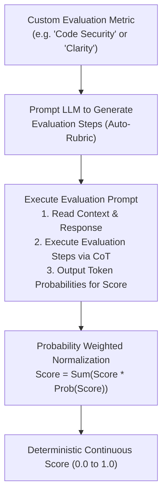

# 📹 Mastering G-Eval: The Deterministic LLM-as-a-Judge Framework Explained

<div className="video-card" style={{border: '1px solid #30363d', borderRadius: '8px', padding: '16px', marginBottom: '24px', background: 'rgba(56, 139, 253, 0.05)'}}>
  <div style={{display: 'flex', gap: '16px', flexWrap: 'wrap'}}>
    <div><strong>Instructor:</strong> Nitish Singh (CampusX)</div>
    <div><strong>Duration:</strong> 5212</div>
    <div><strong>Course:</strong> Module 6: LLM Evaluation & Observability</div>
    <div><strong>Watch Link:</strong> <a href="https://www.youtube.com/watch?v=nlyxlKD5cvU" target="_blank" rel="noopener noreferrer">YouTube Lecture ↗</a></div>
  </div>
</div>

## 📌 Executive Summary

G-Eval is a state-of-the-art framework that uses Large Language Models with Chain-of-Thought (CoT) reasoning and form-filling algorithms to evaluate LLM outputs against custom criteria. Published by Microsoft Research, G-Eval achieves unprecedented human-evaluator correlation (>0.85).

This lesson demystifies the G-Eval protocol: automatic evaluation step generation, scoring rubrics, probability normalization, and Python implementation.

---

## 🏗️ System Architecture & Execution Flow



---

## 📖 Core Concepts & Technical Deep Dive

### 1. Why Standard LLM-as-a-Judge Struggles
Standard judge prompts simply ask: *"Rate this answer from 1 to 5."* This leads to:
- Inconsistent scoring across identical samples.
- Clustering around scores 3 and 4 (reluctance to give extreme scores).
- Little understanding of *how* the score was derived.

### 2. The G-Eval Innovation
- **Step Generation:** G-Eval uses an LLM to generate a sequence of explicit evaluation steps based on the metric definition.
- **Chain-of-Thought Execution:** The judge executes each step sequentially, writing out intermediate rationales.
- **Token Probability Weighting:** Rather than taking the discrete decoded score token, G-Eval inspects the top token log-probabilities (e.g. P(4)=0.7, P(5)=0.3) and computes a continuous expected value: 4 * 0.7 + 5 * 0.3 = 4.3.

---

## 💻 Production Implementation

```python
from deepeval.metrics import GEval
from deepeval.test_case import LLMTestCase, LLMTestCaseParams

# Define custom G-Eval metric with explicit evaluation criteria
correctness_metric = GEval(
    name="Technical Accuracy",
    criteria="Determine whether the technical instructions are syntactically and architecturally valid for Linux systems.",
    evaluation_steps=[
        "Check if command lines use valid Linux shell syntax.",
        "Verify that package manager commands match the indicated distribution.",
        "Check that file paths follow POSIX conventions."
    ],
    evaluation_params=[LLMTestCaseParams.INPUT, LLMTestCaseParams.ACTUAL_OUTPUT]
)

test_case = LLMTestCase(
    input="How do I install curl on Ubuntu?",
    actual_output="Run `sudo apt-get update && sudo apt-get install -y curl`."
)

correctness_metric.measure(test_case)
print(f"G-Eval Score: {correctness_metric.score}")
print(f"Evaluation Reason: {correctness_metric.reason}")
```

---

## ⚙️ Production Gotchas & Best Practices

:::tip Custom Steps for Domain Rules
Write explicit `evaluation_steps` tailored to your compliance policies (e.g. "Verify that medical disclaimers are present at the beginning of the response").
:::

:::warning Model Requirements for G-Eval
G-Eval requires frontier models with high reasoning fidelity (GPT-4o, Claude 3.5 Sonnet). Using 8B models as G-Eval judges degrades correlation with human judgments significantly.
:::

---

## 📊 Architectural Reference & Comparison

| Evaluation Technique | Human Correlation | Determinism | Explainability | Cost per Eval |
| :--- | :--- | :--- | :--- | :--- |
| **Basic LLM Judge (1-5)** | 0.55 - 0.65 | Low | Minimal | Very Low |
| **Few-Shot Prompt Judge** | 0.68 - 0.75 | Moderate | Moderate | Low |
| **G-Eval Framework** | 0.82 - 0.88 | High | High (Explicit CoT steps) | Moderate |
| **Human Expert Panel** | 1.00 (Reference) | High | High | Very High ($5-25/sample) |

---

## 📚 Key Takeaways & Enterprise Checklist

- [ ] **Architecture Verification:** Ensure your design addresses latency, decoupled interfaces, and strict data validation contracts.
- [ ] **Deterministic Testing:** Run unit tests and golden dataset evaluations before shipping changes to staging or production.
- [ ] **Security & Observability:** Enforce input/output guardrails, scrub sensitive credentials/PII, and capture distributed traces.
- [ ] **Scalability & Sizing:** Calibrate model parameters, context limits, and compute instance requirements against projected request concurrency.
