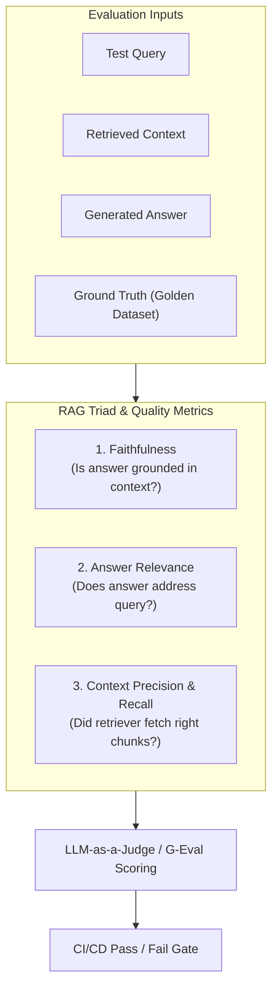

# 📹 Mastering G-Eval: The Deterministic LLM-as-a-Judge Framework Explained

<div className="video-card" style={{border: '1px solid #30363d', borderRadius: '8px', padding: '16px', marginBottom: '24px', background: 'rgba(56, 139, 253, 0.05)'}}>
  <div style={{display: 'flex', gap: '16px', flexWrap: 'wrap'}}>
    <div><strong>Instructor:</strong> Nitish Singh (CampusX)</div>
    <div><strong>Duration:</strong> 86m 52s</div>
    <div><strong>Playlist:</strong> LLM Evaluation Complete Series (CampusX)</div>
    <div><strong>Watch Link:</strong> <a href="https://www.youtube.com/watch?v=nlyxlKD5cvU" target="_blank" rel="noopener noreferrer">YouTube Lecture ↗</a></div>
  </div>
</div>

## 📌 Executive Summary & Learning Objectives

This lecture covers **Mastering G-Eval: The Deterministic LLM-as-a-Judge Framework Explained**, focusing on production implementations, edge cases, and industry standards:
- Core intuition, architecture, and underlying mechanisms.
- Key differences between theoretical research implementations and scalable enterprise patterns.
- Concrete Python walkthroughs, error recovery, and performance optimization.

---

## 🏗️ Architecture & Conceptual Workflow



---

## 📖 Core Concepts & Technical Deep Dive

### 1. Architectural Foundations
In modern production AI engineering, **Mastering G-Eval: The Deterministic LLM-as-a-Judge Framework Explained** is essential for ensuring reliability, low latency, and deterministic outcomes. As AI systems evolve from naive prompt-in / completion-out scripts into distributed systems, engineers must handle:
- **State management & consistency:** Ensuring intermediate states and tool invocations are tracked.
- **Error boundaries & recovery:** Graceful degradation when external LLMs or vector stores encounter rate limits or network partitions.
- **Resource utilization & cost efficiency:** Caching common queries and reducing unnecessary foundation model token expenditure.

### 2. Operational Considerations
- **Latency Optimization:** Pre-computing embeddings, utilizing asynchronous non-blocking event loops, and streaming tokens via Server-Sent Events (SSE).
- **Security & Sandboxing:** Validating inputs before ingestion, sanitizing LLM outputs, and isolating tool execution environments.

---

## 💻 Production Implementation Walkthrough

```python
from deepeval import assert_test
from deepeval.test_case import LLMTestCase
from deepeval.metrics import FaithfulnessMetric, AnswerRelevancyMetric

# 1. Prepare Test Case
test_case = LLMTestCase(
    input="What is the context window of Claude 3.5 Sonnet?",
    actual_output="Claude 3.5 Sonnet features a 200,000 token context window.",
    retrieval_context=["Claude 3.5 Sonnet supports up to 200k tokens of context."]
)

# 2. Define Metrics
faithfulness = FaithfulnessMetric(threshold=0.8)
relevancy = AnswerRelevancyMetric(threshold=0.8)

# 3. Assert Production Test Gate
def test_rag_accuracy():
    assert_test(test_case, [faithfulness, relevancy])
```

---

## 💡 Production Best Practices & Tips

:::tip Production Deployment Guideline
When deploying Mastering G-Eval: The Deterministic LLM-as-a-Judge Framework Explained in enterprise environments, always configure automated retries with exponential backoff and telemetry tracing (such as OpenTelemetry or LangSmith).
:::

:::warning Common Failure Modes
Watch out for state contamination across concurrent requests. Ensure each session or user interaction uses an isolated thread ID or execution context.
:::

---

## 🎯 Key Takeaways & Quick Reference

| Dimension | Production Standard | Pitfall to Avoid |
| :--- | :--- | :--- |
| **Execution** | Async / Non-blocking with timeouts | Synchronous blocking calls in event loops |
| **Data Validation** | Strict Pydantic v2 schemas | Untyped dictionary access |
| **Monitoring** | Distributed tracing & latency percentiles | Relying only on standard console logs |

## ⏱️ Lecture Timeline & Key Topics

| Timestamp | Key Topic / Concept Discussed |
| :--- | :--- |
| **00:00:00** | अ स्टार्ट करने के पहले लेट्स क्विकली... |
| **00:22:16** | कैलकुलेट करोगे? तो अब सेकंड तरीका क्या... |
| **00:43:56** | स्टेप वन जो मैंने आपको बताया था। आप एक... |
| **01:05:43** | एक स्कोरिंग रूब्रिक भी बता रहे हैं। सो... |
| **01:26:51** | करेंगे।... |


---

---

## 📜 Complete Lecture Transcript (Hindi / Hinglish)

> **Language:** Hindi / Hinglish | **Source:** `15 - Mastering G-Eval： The Deterministic LLM-as-a-Judge Framework Explained ｜ CampusX.hi.srt` | **Total Segments:** 44 | **Word Count:** ~14,381 words

<details>
<summary><b>Click to expand full chronological transcript (44 timestamped intervals)</b></summary>

#### ⏱️ [00:00 ➔ 00:02]

अ स्टार्ट करने के पहले लेट्स क्विकली डिस्कस अभी हम कहां पर हैं और आज के सेशन में क्या कवर करने वाले हैं। सो दो-तीन सेशन पहले हमने रैग इवैल्यूएशन शुरू किया था और वहां पे हमने एक डिटेल्ड प्लान डिस्कस किया था और मैंने आपको बताया था कि हमारा सबसे प्राइमरी गोल अभी जो है वो ये है कि हम अपने रैक पाइपलाइन के लिए एक ऑफलाइन इवल स्वीट प्रिपेयर कर रहे हैं। जो कि तीन लेवल्स पे प्रिपेयर होगा। अ फर्स्ट इज़ कंपोनेंट लेवल। सेकंड इज पाइपलाइन लेवल एंड थर्ड इज एप्लीकेशन लेवल। ठीक है? अब इसमें हमने कंपोनेंट लेवल पाइपलाइंस बना लिए हैं और रैक पाइपलाइन लेवल के भी हमने इवैल्यूएशंस कर लिए हैं लास्ट सेशन में। अब हम मूव कर रहे हैं एप्लीकेशन वाले की तरफ। ठीक है? अब एप्लीकेशन में तीन टाइप के हम इवैल स्वीट्स बिल्ड करेंगे। फर्स्ट विल बी जो एप्लीकेशन की क्वालिटी को चेक करेगा। सेकंड जो एप्लीकेशन के सेफ्टी आस्पेक्ट को चेक करेगा। और थर्ड है जो हमारे अ एप्लीकेशन के ऑपरेशंस वाले एस्पेक्ट को चेक करेगा। ठीक है? और आज की क्लास में स्ट्रिक्टली वी आर गोइंग टू कवर दिस। जहां पे हम एक गिवन रैग एप्लीकेशन की जो क्वालिटी है उसको इवैल्यूएट करेंगे। और उसके लिए हम तीन मैट्रिक्स के ऊपर काम करने वाले हैं। फर्स्ट वुड बी करेक्टनेस कि जो आंसर निकल के आ रहा है हमारे रैक चैटब से क्या वो सही है या गलत है वो चेक करेंगे। सेकंड कंप्लीटनेस। बेसिकली अगर मैंने एक क्वेश्चन पूछा जिसमें अंदर में दो क्वेश्चंस हैं। क्वेश्चन है और उसके साथ एक और क्वेश्चन है। तो क्या मेरा आंसर दोनों सब क्वेश्चंस को कवर कर रहा है या फिर वो पार्शियल आंसर है। ये भी हम चेक करेंगे। एंड थर्ड वी विल चेक फॉर स्टाइल। हम यह मेक श्योर करेंगे

#### ⏱️ [00:02 ➔ 00:04]

कि जो हमारा डाउट सॉल्व है उसका एक्सप्लेनेशन स्टाइल शुड मैच कैंपस एक्स्ट्रा टीचिंग स्टाइल। इसको भी हम इवैलुएट करेंगे। ठीक है? तो ये हमारा एप्लीकेशन क्वालिटी के अंदर आएगा। एक बार जब हम ये कर लेंगे देन वी विल मूव ऑन टू सेफ्टी। वहां पे भी हम दो-तीन मैट्रिक्स कवर करेंगे एंड देन वी विल मूव ऑन टू ऑपरेशंस। तो ये दोनों मोस्ट लाइकली हम लोग अगले सेशन में कवर करेंगे अलोंग विद रिग्रेशन टेस्टिंग। ठीक है? तो दैट्स द प्लान। आज का प्लान इज़ वेरी सिंपल दैट वी आर गोइंग टू बिल्ड अ इवैल्यूएशन पाइपलाइन जो एप्लीकेशन की क्वालिटी को टेस्ट करेगा ऑन थ्री एस्पेक्ट्स ऑन थ्री मैट्रिक्स करेक्टनेस, कंप्लीटनेस एंड स्टाइल। ठीक है? तो इज़ दिस क्लियर? आज हम क्या करने वाले हैं? इज़ दिस पॉइंट क्लियर? और इस पूरी चीज को पढ़ने के प्रोसेस में आज हम एक नई चीज भी सीखने वाले हैं जिसको हम जी ईवल बुलाते हैं। बहुत इंपॉर्टेंट कांसेप्ट है। अ काइंड ऑफ इंटरव्यूज में इंपॉर्टेंट है। तो ये भी हम सीखने वाले हैं। आज की क्लास का यही एजेंडा है। बहुत ही अ ल्यूसिड स्टाइल में पूरे लेक्चर को हम लोग चलाएंगे। ठीक है? तो एकदम एट एनी पॉइंट आपको पता होगा कि हम क्या कर रहे हैं। तो एकदम शुरू से शुरू करते हैं। अभी तक हमने इस रैक पाइपलाइन को इवैलुएट करने के लिए पांच मैट्रिक्स कवर किए हैं। अगर आपको याद हो। कौन-कौन से पांच मैट्रिक्स कवर किए हैं? हमने अभी तक कवर किया है रिकॉल, प्रसीजन, अह फेथफुलनेस और आंसर रेलेवेंस एंड लास्ट वन इज़ कॉन्टेक्स्ट रेलेवेंस। यह पांच मैट्रिक्स हमने अभी तक कवर किए हैं इन ऑर्डर टू इवैलुएट आवर रैग एप्लीकेशन। अब इन पांचों मैट्रिक्स में ना एक चीज कॉमन है। एक पैटर्न है जो आपको इन सारे मैट्रिक्स में देखने को मिलेगा। पैटर्न क्या है? मैं आपको बताता हूं। पैटर्न ये है कि ये पांचों मैट्रिक्स काउंट बेस्ड मैट्रिक्स हैं। काउंट बेस्ड मैट्रिक्स का क्या मतलब

#### ⏱️ [00:04 ➔ 00:06]

होता है? मैं आपको समझाता हूं। एक एग्जांपल ले लेते हैं फेथफुलनेस का। फथफुलनेस हमें यह बताता है कि हमारा जो जनरेटर है उसने जो आंसर जनरेट किया है क्या वो आंसर कंप्लीटली आपके कॉन्टेक्स्ट के अंदर से ही जनरेट हुआ है या फिर कुछ खुद से इन्वेंट किया जनरेटर ने। यही होता है ना फेथफुलनेस। अब अगर आप वापस जाओ पिछले सेशन में या उसके पिछले सेशन में तो आपको याद आएगा कि फेथफुलनेस कैलकुलेट हम कैसे करते थे। बहुत सिंपल था। हमारे पास एक जनरेटेड आंसर होता था। राइट? हम उसको एक एलएलएम की हेल्प से क्लेम्स में ब्रेकडाउन करते थे। क्लेम वन, क्लेम टू, क्लेम थ्री, क्लेम फोर। और फिर हम हर क्लेम को उठाते थे और यह पूछते थे कि क्या वो क्लेम हमारे कॉन्टेक्स्ट के अंदर एग्जिस्ट करता है कि नहीं। अगर करता है तो अच्छी बात है। अगर नहीं करता है तो बुरी बात है। और फिर हम काउंट करते थे कि आउट ऑफ टोटल क्लेम्स कितने क्लेम्स कॉन्टेक्स्ट के अंदर एग्जिस्ट करते हैं। मान लो कि इनमें से तीन क्लेम्स कॉन्टेक्स्ट के अंदर से आए हैं और एक क्लेम जनरेटर ने खुद इन्वेंट किया। तो हमारा फेथफुलनेस स्कोर हो जाता था 3/4। आई होप आपको यह चीज बिल्कुल याद है। तो यहां पर आप देखो कि आप कर क्या रहे हो? आप एक तरह से काउंटिंग कर रहे हो। राइट? आप इस क्लेम को उठा रहे हो और पूछ रहे हो कि कॉन्टेक्स्ट में है कि नहीं? तो यू आर लिटरली काउंटिंग आउट ऑफ टोटल क्लेम्स हाउ मेनी क्लेम्स आर कमिंग आउट फ्रॉम द कॉन्टेक्स्ट। तो ये जो सारे हमने तरीके देखे रिकॉल, प्रसीजन, आंसर रेलेवेंस, कॉन्टेक्स्ट रेलेवेंस इन सब में हमने मोर और लेस यही सेम काम किया है। एक एलएलएम के हेल्प से ब्रेकडाउन किया है क्लेम्स में और फिर क्लेम्स को काउंट किया है कि कितने हमारे फेवरेबल हैं और कितने अगेंस्ट में है। और उसी के बेसिस पे कोई एक रेश्यो किसी फार्मूले की हेल्प से हमने हमारे

#### ⏱️ [00:06 ➔ 00:08]

मैट्रिक्स का स्कोर कैलकुलेट किया। वुड यू अग्री टू दिस? पांचों के पांचों में सेम पैटर्न रहा है। कैन यू से? यस इफ यू अग्री? थोड़ा इंटरेक्टिव बनाते हैं गाइस। आई डोंट नो आज आप लोग थोड़ा सा लो साउंड कर रहे हो। बट डू यू अग्री टू दिस? राइट? यू अग्री राइट? बट व्हाट इफ हम ऐसे सिचुएशन में फंस जाएं जहां पर हमारे पास ऐसे मैट्रिक्स हो जहां पे काउंट का कांसेप्ट ही नहीं है। फॉर एग्जांपल मान लो हमें ये पता करना है कि कोई जनरेटेड आंसर कैंपस x के टीचिंग स्टाइल में है या नहीं। मान लो हमें यह इवैलुएट करना है। बेसिकली हम स्टाइल को इवैलुएट करना चाह रहे हैं। तो सडनली से आप देखोगे कि ये जो तरीका आपने सीखा है काउंट करके रेश्यो निकालने वाला ये काम नहीं करेगा। बिकॉज़ यहां पे आप क्या करोगे? आपके पास एक आंसर है। उसको मान लो आपने क्लेम बाय क्लेम या स्टेटमेंट बाय स्टेटमेंट ब्रेक कर दिया। अब अब आप क्या टेस्ट करोगे कि हर स्टेटमेंट क्या कैमपस x का स्टाइल फॉलो कर रहा है कि नहीं। मान लो कैंपस x का स्टाइल है व्हाई व्हाट हाउ। तो ऐसा थोड़ी ना होगा कि हर सेंटेंस में व्हाई व्हाट हाउ एक्जिस्ट करेगा। वो वाई व्हाट हाउ आंसर लेवल पर एक्सिस्ट करेगा। सेंटेंस लेवल पे एक्सिस्ट नहीं करेगा। तो व्हाट आई एम ट्राइंग टू से इज़ कि सडनली से ये एक नया क्लास ऑफ़ मैट्रिक आ गया स्टाइल बोल के जिसको आप क्लेम्स में ब्रेक करके काउंटिंग करके अपना काम नहीं निकाल सकते। यहां पे इंस्टेड ऑफ काउंटिंग आपको एक दूसरी चीज चाहिए होती है जिसको हम बोलते हैं जजमेंट। सो बेसिकली यू नीड समवन जो एक आंसर को रीड करे और फिर सिंपली एक स्कोर असाइन करे कि भाई एक से लेके पांच तक के स्केल पे ये पर्टिकुलर आंसर फोर रेट करता है कि इसमें कैंपस एक्स का स्टाइल फोर लेवल का है या

#### ⏱️ [00:08 ➔ 00:10]

फिर फाइव स्कोर करता है कि इसमें पूरा का पूरा जो आंसरिंग स्टाइल है वो कैंपस एक्स से मैच करता है आई होप यू आर एबल टू अंडरस्टैंड व्हाट आई एम ट्राइंग टू से द मेन आईडिया इज कि स्टाइल को अगर आप इवैल्यूएट करने जाओगे तो आप काउंट बेस्ड तरीके से नहीं कर सकते। वहां पे आपको जजमेंट लगेगा। मैं आपको एक और एग्जांपल देता हूं। मान लो आपको एक गिवन आंसर का करेक्टनेस मेजर करना है कि वो आंसर सही है कि नहीं। क्या हम इसको अ काउंट बेस तरीके से कर सकते हैं कि नहीं? वो एक बार देखते हैं। तो आपने क्या किया? फिर से अपने आंसर को क्लेम्स में ब्रेक डाउन कर दिया और आपके पास एक गोल्डन आंसर है। जो कि सही आंसर है। तो अब आप क्या करोगे? आप हर क्लेम को उठाओगे और जाकर के पूछोगे कि क्या यह क्लेम गोल्डन आंसर से रिलेटेड है या नहीं? यह पूछोगे आप। तो ये तरीके से आप काउंटिंग कर सकते हो। बट सोचो इज इट पॉसिबल कि हर क्लेम आपके आंसर से डायरेक्टली रिलेटेड हो? द आंसर इज़ नो। आई विल गिव यू वन सिनेरियो। फॉर एग्जांपल लेट्स से हमारा चैटबॉट कोई चीज को एक्सप्लेन करने के लिए कोई एनालॉजी यूज कर रहा है। अब अगर आप एनालॉजी को इन आइसोलेशन एनालाइज करो तो इट विल मेक नो सेंस। एनालॉजी विल मेक सेंस ओनली व्हेन इट इज़ एनालाइज्ड इनसाइड एन आंसर। आप मेरी बात समझ रहे हो? मैं अपना पॉइंट प्रूव करने के लिए अगर एक एनालॉजी दे रहा हूं। एनालॉजी इज़ व्हाट? बेसिकली अ डिफरेंट एग्जांपल फ्रॉम द करंट सिनेरियो। तो अगर मैं उसको एक इंडिपेंडेंट क्लेम की तरह ले जाकर कंपेयर करूं एक गोल्डन आंसर से तो ऑब्वियसली मेरा जज एलएलएम बोलेगा कि ये जो स्टेटमेंट है ये जो एनालॉजी है इट इज नॉट रिलेटेड टू द गोल्डन आंसर व्हिच मींस दिस इज अ फॉल्स क्लेम और वो उसको पेनलाइज कर देगा। तो अगेन व्हाट आई एम ट्राइंग टू से इज़ कि कोई आंसर करेक्ट है या नहीं उसको आप क्लेम लेवल पे चेक नहीं कर सकते। आपको उसको पूरे आंसर लेवल पे ही चेक करना पड़ेगा। तो अगेन

#### ⏱️ [00:10 ➔ 00:12]

अ सिचुएशन वेयर दिस काउंट बेस्ड मेथड जो हमने अभी तक सीखा है वो काम नहीं करेगा। इंस्टेड यू नीड जजमेंट। अब वो जजमेंट किसी ह्यूमन का हो सकता है या फिर किसी एलएलएम का हो सकता है। बट आपका ये जो काउंट वाला तरीका था जहां पे आप क्लेम्स में ब्रेकडाउन करके काउंटिंग करके एक रेश्यो निकाल के आंसर देते थे वो इन मैट्रिक्स के ऊपर काम नहीं करेगा। तो इस तरह के बहुत सारे मैट्रिक्स होते हैं। कंप्लीटनेस इज वन मोर मैट्रिक। अ उसके अलावा हेल्पफुलनेस इज वन मोर मैट्रिक। सेफ्टी रिलेटेड जितने मैट्रिक्स हैं वो सब इसी के अंदर आते हैं। तो बहुत सारे ऐसे मैट्रिक्स हैं जिनके लिए आपको जजमेंट की जरूरत पड़ेगी। तो आज हम जो मैट्रिक्स कवर करने जा रहे हैं। ऑल थ्री ऑफ़ देम आर जजमेंट बेस्ड मैट्रिक्स। तो हमें आज वाले सारे मैट्रिक्स में क्या करना पड़ेगा? बहुत सिंपल है। हमें एक एलएलएम को यूज करना पड़ेगा टू फाइंड आउट द स्कोर। यह पूरी चीज काम कैसे करेगी? मैं आपको बताता हूं। सो बेसिकली व्हाट यू विल डू इज़ कि आप एक गोल्डन डेटा सेट प्रिपेयर करोगे। जस्ट वन सेकंड। मान लो एक एग्जांपल हम लोग उठाते हैं करेक्टनेस का। कि हमें अपने रैग चैटबॉट का करेक्टनेस स्कोर मेजर करना है। करेक्टनेस का मतलब कि अगर हम उससे 10 क्वेश्चंस पूछते हैं तो उसमें से कितने परसेंट क्वेश्चंस को वो करेक्टली आंसर करता है। हमें ये मेजर करना है। ठीक है? तो आपको सबसे पहले क्या करना पड़ेगा? सबसे पहले यू विल हैव टू प्रिपेयर अ गोल्डन डेटा सेट। राइट? बिकॉज़ आपको बताना पड़ेगा ना कि सही आंसर कैसा होता है। तो आपका गोल्डन डेटा सेट कुछ ऐसा दिखाई देगा। देयर विल बी अ क्वेश्चन और उसका करेक्ट आंसर होगा। अब ये डेटा सेट कैसे बनेगा? थोड़ी देर बाद हम डिस्कस करेंगे। फिलहाल आप मान लो कि हमारे पास एक डेटा सेट है जिसमें 15 रोज़ हैं।

#### ⏱️ [00:12 ➔ 00:14]

व्हिच बेसिकली मींस कि 15 क्वेश्चंस हैं और उसके सही आंसर लिखे हुए हैं। सही आंसर मतलब यूनिवर्सली एक्सेप्टेड आंसर। Google पे भी वही मिलेगा। सही आंसर्स हैं ये। मैंने जो पढ़ाया क्लास में जरूरी नहीं है कि वो हो। सही आंसर्स हैं। ठीक है? अब आप क्या करोगे? आप एक एलएलएम जज को उठा के लेके आओगे। ठीक है? और आप उसको यह प्र्प दोगे। आप बोलोगे यू आर इवैल्यूएटिंग वेदर एन एआईस आंसर इज करेक्ट। ठीक है? यू विल बी गिवन अ क्वेश्चन एन एक्सपेक्टेड आंसर। क्वेश्चन यहां से आ रहा है। एक्सपेक्टेड आंसर यहां से आ रहा है। एंड द एक्चुअल आंसर। एक्चुअल आंसर जनरेट किया गया होगा। सो बेसिकली हम अपने रैक चैटबॉट को यह वाला क्वेश्चन फीड कराएंगे तो यह हमें पलट करके जनरेटेड आंसर देगा। यही जनरेटेड आंसर हम अपने एलएलएम जज को दे रहे हैं। उसके बाद देखो हमने क्या प्र लिखा है। कंपेयर द एक्चुअल आंसर अगेंस्ट द एक्सपेक्टेड आंसर एंड डिसाइड हाउ फ़क्चुअली करेक्ट इट इज़। गिव अ स्कोर फ्रॉम ज़ीरो टू 10 वेयर 10 इज़ इक्वल टू फुल्ली करेक्ट। जीरो मतलब कंप्लीटली रॉन्ग। और यहां पर हम क्वेश्चन में अपना क्वेश्चन फिल कर देंगे। एक्सपेक्टेड आंसर में अपना एक्सपेक्टेड आंसर फिल कर देंगे। एक्चुअल आंसर में हमारा एक्चुअल आंसर फिल कर देंगे। और उसको बोलेंगे यहां पे हम एक स्कोर जनरेट करके दो। तो बेसिकली व्हाट वी आर ट्राइंग टू डू इज़ वी आर ट्राइंग टू मेजर द करेक्टनेस। और वो कैसे कर रहे हैं? बहुत सिंपल है। हम एक एलएलएम जज को लेके आ रहे हैं। एक गोल्डन डेटा सेट को लेके आ रहे हैं। गोल्डन डेटा सेट का क्वेश्चन उठाया। ड्रैग एप्लीकेशन में डाला। हमें एक आंसर मिला। क्वेश्चन, सही आंसर और जनरेटेड आंसर तीनों को एक प्रोंट में डाला। एक एलएलएम जज के पास भेजा। एलएलएम जज ने तीनों चीजों को देखा और पलट के हमें एक स्कोर दे दिया जिससे हमें ये पता चल रहा है कि उस पर्टिकुलर क्वेश्चन के ऊपर हमारा रैग एप्लीकेशन कितना सही है। ठीक है? और ऐसा हम 15 क्वेश्चंस के लिए करेंगे। और फिर 15 क्वेश्चंस का जो आउटपुट स्कोर है उसका हम

#### ⏱️ [00:14 ➔ 00:16]

एवरेज निकाल देंगे। तो फर्स्ट ऑफ ऑल कैन यू सी देयर इज अ डिफरेंस बिटवीन हाउ वी यूज्ड टू कैलकुलेट दीज़ मैट्रिक्स एंड हाउ वी आर कैलकुलेटिंग द न्यूअर मैट्रिक्स। इज़ देयर अ डिफरेंस? फर्स्ट ऑफ़ ऑल आर यू एबल टू स्पॉट द डिफरेंस? बहुत सिंपल है। पहले हम एलएलएम एज अ जज को यूज़ करते थे एक छोटे काम के लिए। क्लेम्स में ब्रेकडाउन करने के लिए और चेक करने के लिए कि कॉन्टेक्स्ट में वो है कि नहीं। और फिर एक स्कोर निकालते थे बाय कैलकुलेटिंग अ रेशो। यहां पे कोई रेशो एक्सिस्ट नहीं करता। हम पूरे तरीके से एलएलएम की जजमेंट पे डिपेंड कर रहे हैं कि तुम देखो और सिंपली एक नंबर मुझे बता दो कि 10 में से कितना है। तो दिस इज द मेन डिफरेंस। सिंपल है। वैसे कुछ खास हमने पढ़ा नहीं है। इट्स एक्चुअली इज़ियर इन कंपैरिजन टू अभी तक हमने जो पढ़ा है उसके कंपैरिजन में ये इजी है अगर आप ध्यान दो तो। सो नाउ यू अंडरस्टैंड एलएलएम एज अ जज कैसे यूज किया जाता है जजमेंट बेस्ड मैट्रिक्स के लिए। अब इसी में आप करेक्टनेस के बदले बहुत आसानी से कंप्लीटनेस भी निकाल सकते हो। या फिर बहुत आसानी से आप हेल्पफुलनेस भी निकाल सकते हो। यू अंडरस्टैंड? राइट? पूरा फ्लो सेम रहेगा। बस आप मैट्रिक्स स्विच करते जाओ और आपका काम होते जाएगा। आई गेस यहां पे वी आर अग्रीइंग। नाउ अ क्वेश्चन टू यू। ये तरीका थ्योरिटिकली काम करेगा। बट जब आप प्रैक्टिकली इसको इंप्लीमेंट करने जाओगे तो यह तरीका आपको उतने अच्छे रिजल्ट्स नहीं देता। यह तरीका उतना अच्छा इवैल्यूएशन मेथड नहीं माना जाता। कोई बता सकता है इस तरीके में प्रॉब्लम क्या है? सोचो। आई वांट यू टू थिंक कि इस स्ट्रेट फॉरवर्ड तरीके में क्या फ्लॉ है? आई वांट यू टू थिंक। टेक वन और 2 मिनट्स। 1 मिनट लो। एक बार सोचो एंड टेल मी क्या गलती हो सकती है इसमें? हैरी सेइंग जज इटसेल्फ मेक्स मिस्टेक्स।

#### ⏱️ [00:16 ➔ 00:18]

या दैट इज ट्रू। बट ये तो हमेशा ही ट्रू रहता है। थोड़ी देर के लिए अस्यूम कर लेते हैं कि हमारा जज इज अ गुड मॉडल। स्टेट ऑफ द आर्ट मॉडल। तो वी आर अस्यूमिंग कि मिस्टेक्स नहीं करेगा या बहुत कम करेगा। थोड़ी देर के लिए अस्यूम कर लो। बट क्या इसके अलावा और कोई प्रॉब्लम हो सकती है? लेटेंसी और कॉस्ट? यस लेटेंसी रहेगी बिकॉज़ आप एलएलएम यूज़ कर रहे हो। कॉस्ट भी इनवॉल्वड होगा। बट अगेन सिंस हम लोग सिर्फ 15 क्वेश्चंस के ऊपर ये पूरी चीज कर रहे हैं। बहुत ज्यादा कॉस्ट नहीं उठेगा। यू अंडरस्टैंड? राइट? हमने किया है। यह भी मेन रीज़न नहीं है। व्हाट इज़ द मेन रीज़न? जिसकी वजह से यह तरीका रिलायबल नहीं है टू इवैल्यूएट। सिस्टम प्र्ट माइट बिकम बिग एंड स्टार्ट मिसिंग रेलेवेंट डिटेल्स। तुषार ऑनेस्टली यह उतना बड़ा नहीं होगा। बिकॉज़ ऑनेस्टली दिस इज द सिस्टम प्र्ट। इसमें बस यहां पे क्वेश्चन फिल होगा जो कि शायद एक या दो लाइन का होगा। एक्सपेक्टेड आंसर होगा। कितने ही लाइंस का होगा? 10 लाइन का होगा। जनरेटेड आंसर 10 लाइन का होगा। तो ये बहुत बड़ा सिस्टम प्र्ट नहीं है। क्राइटेरिया नीड्स टू गिव थ्रू प्र्प। क्राइटेरिया तो हमने बताया है बस इस लाइन में। दिस इज आवर क्राइटेरिया बाय द वे टू मेजर करेक्टनेस। दिस इज द क्राइटेरिया। और कोई क्राइटेरिया हमने बताया नहीं है। और दिस इज़ द प्र्प्ट वैसे। निधि इज़ सेइंग एलएलएम इशूज़ लाइक बायसनेस एंड हेलुसिनेशन। बायसनेस इज़ एन इशू। यस। चलो मैं आपको बताता हूं मैं क्या आंसर सीक कर रहा हूं। बिकॉज़ हो सकता है कि बहुत स्पेसिफिक कुछ मैं सीक कर रहा हूं। लेट मी टेल यू अप्रोच का एक बहुत बड़ा फ्लॉ क्या है? इस अप्रोच का एक बहुत बड़ा फ्लॉ यह है कि एक्चुअली फ्लॉ दो हैं बट उसमें एक कॉमन थीम है। वो कॉमन थीम ये है कि ये जो स्कोर निकल के आएगा ना

#### ⏱️ [00:18 ➔ 00:20]

इसका वेरियंस बहुत ज्यादा होगा। वेरियंस बहुत ज्यादा होने का मतलब यह है कि आप एक बार इवैल्यूएट करोगे तो कुछ स्कोर आ रहा है। दूसरी बार इवैल्यूएट करोगे तो कुछ और स्कोर आ रहा है। ये वेरिएशन बहुत ज्यादा होगा। इन अ वे व्हाट आई एम ट्राइंग टू से इज़ कि दिस टेक्निक इज़ नॉट वेरी रिलायबल। डोंट यू थिंक अगर सारा सेटअप सेम है तो हर बार जब आप दोबारा से रन करो अपने इवैल्यूएशन को तो वो स्कोर बहुत ज्यादा वेरीरी नहीं करना चाहिए। डू यू अग्री टू दिस? सब कुछ सेम है। सेम क्वेश्चन है, सेम एक्सपेक्टेड आउटपुट है, सेम जनरेटेड आउटपुट है। तो, द वेरियंस शुड बी वेरी लो। बट इस पर्टिकुलर टेक्निक में वेरियंस विल बी हाई। आई विल टेल यू व्हाई। देयर आर टू रीज़ंस। पहला रीज़न यह है कि आप क्या कर रहे हो? आप सिंपली अपने जज एलएलएम को ये क्राइटेरिया दे रहे हो और आप बोल रहे हो कि इसके बेसिस पे तुम क्या करो? तुम मेजर करो कि आंसर कितना करेक्ट है। बट आपने क्या लिखा? आपने सिर्फ यह लाइन लिखा है। कंपेयर द एक्चुअल आंसर अगेंस्ट द एक्सपेक्टेड आंसर एंड डिसाइड हाउ फ़क्चुअली करेक्ट इट इज़। द प्रॉब्लम इज दिस कि हर अगले क्वेश्चन के लिए आप इंडिपेंडेंट कॉल्स मार रहे हो एलएलएम को और हो सकता है कि हर अगले कॉल में वो इस स्टेटमेंट को अलग-अलग तरीके से पर्सव करे। बिकॉज़ अभी ये बहुत टाइट स्टेटमेंट नहीं है। आपने बहुत ज्यादा एक्सप्लेन नहीं किया है कि करेक्टनेस का डेफिनेशन क्या है। तो ऐसा हो सकता है कि एक पर्टिकुलर एलएलएम कॉल में आपका जज एक सर्टेन एस्पेक्ट से आंसर्स की करेक्टनेस को मेजर करे और ठीक अगली ही कॉल में कुछ और एंगल से वो करेक्टनेस को मेजर करे। बेसिकली व्हाट आई एम ट्राइंग टू से इज़ कि आपने एक बहुत टाइट कॉन्स्टिट्यूशन

#### ⏱️ [00:20 ➔ 00:22]

बना के नहीं दिया। रूल बुक बना के नहीं दिया कि करेक्टनेस को एग्जैक्टली कैसे मेजर करना है। आपने बस एक लाइन बोल के छोड़ दिया जिसकी वजह से एक राउंड से अगले राउंड में स्कोर्स बहुत वेरीरी कर सकते हैं। हेंस दिस मेथड इज नॉट दैट रिलायबल। सेकंड एक और बड़ी प्रॉब्लम क्या है कि मैं उसको सिंपली बोल रहा हूं कि ज़ीरो से लेके 10 के बीच में एक स्कोर जनरेट कर दो। ठीक है? अब एक बार हो सकता है कि वो एट बोल दे। बिकॉज़ इंटरनली उसका कैलकुलेशन ऐसा चल रहा था कि उसने सेवन को दिया था 60% और एट को दिया था सेवन को दिया था 40% और एट को दिया था लेट्स से 51% और सिक्स को दिया था मान लो 9% प्रोबेबिलिस्टिक होता है ना सब कुछ हर टोकन को एक प्रोबेबिलिटी असाइन होती है तो उसने सेवन वाले टोकन को 40 असाइन कर रखा था एट वाले को 51 असाइन कर रखा था सिक्स वाले को 9% असाइन कर रखा था। तो सिंस एट वाले का सबसे ज्यादा था तो उसने सिंपली आउटपुट में एट बोल दिया। बट अगली बार जब आपने अगला क्वेश्चन सेम क्वेश्चन को फिर से रन किया तो फिर कुछ अलग इंटरप्रिटेशन हुआ उसके दिमाग में। इस बार उसने एट को 40 असाइन कर दिया। सेवन को 51 असाइन कर दिया और सिक्स को अभी भी 9% असाइन करके रखा है। तो सिंस इस बार सेवन का रेश्यो सबसे हाई है। अ प्रोबेबिलिटी सबसे हाई है। इस बार वो आउटपुट दे रहा है सेवन। सो बेसिकली सेवन और एट में उसको थोड़ा सा डाउट था। एक रन में वो सेवन बोल दे रहा है। एक रन में वो एट बोल दे रहा है। तो ऊपर नीचे होता जा रहा है। बिकॉज़ अगेन हमने बहुत टाइट क्राइटेरिया पकड़ के नहीं रखा। जिसकी वजह से सेम क्वेश्चन के ऊपर जब आप मल्टीपल रंस लोगे तो आपका स्कोर वेरीरी करने लग सकता है। तो बिकॉज़ ऑफ़ दीज़ टू रीज़ंस यह तरीका आपको रिलायबल रिजल्ट्स नहीं देगा। आई एम नॉट रियली श्योर मैं आपको कन्विंस कर पाया कि नहीं। इज दिस पॉइंट क्लियर?

#### ⏱️ [00:22 ➔ 00:24]

एक बार पूरा प्रोग्रेशन डिस्कस करते हैं। हम ऐसे मैट्रिक्स की बात कर रहे हैं जहां पर हम काउंटिंग करके रेश्यो निकाल करके स्कोर्स कैलकुलेट नहीं कर सकते। मैंने आपको लॉजिकली बताया स्टाइल को कैसे कैलकुलेट करोगे? करेक्टनेस को कैसे कैलकुलेट करोगे? तो अब सेकंड तरीका क्या है कि हम एक एलएलएम को पिक्चर में लेके आए। उसको अपना आंसर दें। सही आंसर दें और हम बोले कि देखो इन दोनों को कंपेयर करो और मुझे एक स्कोर बताओ। द प्रॉब्लम विद दिस अप्रोच इज कि दिस अप्रोच हैज़ अ लॉट ऑफ वेरिएबिलिटी। यह रिलायबल तरीका नहीं है। एक बार सिक्स आएगा, एक बार सेवन आएगा, एक बार एट आएगा। जबकि आपने कुछ भी चेंज नहीं किया। व्हाई? बिकॉज़ देयर आर टू रीज़ंस। फर्स्ट रीज़न आपने अपना कॉन्स्टिट्यूशन रूल बुक उतना स्ट्रांग नहीं बनाया। आपने बस एक सेंटेंस दे दिया। एंड यू आर रिलाइंग ऑन द एलएलएम टू डू इट्स वर्क। एंड द सेकंड रीज़न इज़ आप उसको सिंपली ज़ीरो से 10 के बीच में एक स्कोर जनरेट करने को बोल रहे हो। अब टोकन की प्रोबेबिलिटीज ऊपर नीचे हो सकती है डिपेंडिंग ऑन अभी तक उसने क्या पर्सव किया है। तो एक बार एट आ जा रहा है। अगली बार जंप करके वो सिक्स पे चला जा रहा है। कभी सेवन पे चला जा रहा है। तो इस रीज़न की वजह से आपका जो ओवरऑल स्कोर है जब आप 15 क्वेश्चंस को एवरेज आउट करोगे तो बहुत वेरीरी कर सकता है। एक बार 60 आ जाएगा, एक बार 70 आ जाएगा, एक बार 75 चला जाएगा। व्हिच इज़ नॉट गुड। हमने अभी तक देखा है कि हमने पास्ट में जितने भी इवैल्यूएशंस बार-बार भी रन किए थे तो बहुत ज्यादा वेरीरी नहीं करता था। 85 है तो 86 हो जाता था या 84 हो जाता था बट 75 टू 85 का जंप नहीं होता है। तो दिस इज द बिगेस्ट रीज़न जिसकी वजह से यह तरीका इंडस्ट्री में डायरेक्टली यूज़ नहीं किया जाता। आप डायरेक्टली एलएलएम एज अ जज यूज़ नहीं करते। इनफैक्ट आई वुड रिकमेंड कि अगर आप यह प्रोजेक्ट साथ में अपनी मशीन पर चला रहे हो तो एक खुद से कोड जनरेट करो या लिखो जहां पे आप इस तरीके से करेक्टनेस मेजर करने की कोशिश कर रहे हो और आप उसको तीन से चार बार चला के देखो एंड आई गारंटी यू कि आपका जो रिजल्ट है वो बहुत वेरीरी

#### ⏱️ [00:24 ➔ 00:26]

करेगा बहुत ज्यादा वेरीरी करेगा ठीक है तो दिस टेक्निक इज नॉट गुड फॉर रिलायबल इवैल वैल्यूएशंस इसी प्रॉब्लम को सॉल्व करने के लिए कौन आता है? जी ईवेल एग्जैक्टली इसी प्रॉब्लम को सॉल्व करने जी ईवेल आता है। ठीक है? जीईल क्या है? मैं आपको बताता हूं। जीई वैल इज़ एक्चुअली अ रिसर्च पेपर। जो कि 2023 में आया था। दिस इज़ द पेपर। आई वुड रिकमेंड एक बार आप यह पेपर पढ़ो। स्पेशली जब आपने आज की क्लास कर ली आपको बहुत अच्छे से समझ में आएगा इस पेपर में क्या प्रपोज किया गया है। अ दिस इज़ बेसिकली अ टेक्निक जो इस गिवन प्रॉब्लम को सॉल्व करती है। कैसे मैं आपको बताता हूं। ध्यान से सुनना। सो जीईवल में आप करते क्या हो कि स्टेप वन में आप सबसे पहले ये बताते हो कि आप कौन सा मैट्रिक कैलकुलेट करना चाह रहे हो। सो हमारे केस में हम करेक्टनेस को कैलकुलेट करना चाहते हैं। ठीक है? उसके बाद आप क्या करते हो? आप एक सेकंड चीज बताते हो जिसको आप क्राइटेरिया बुलाते हो। सो ये जो है ना दिस इज़ योर क्राइटेरिया बाय द वे। इसी को क्राइटेरिया बुलाते हैं। दिस इज़ योर क्राइटेरिया टू कैलकुलेट करेक्टनेस। आप बेसिकली बोल रहे हो कंपेयर द एक्चुअल आंसर अगेंस्ट द एक्सपेक्टेड आंसर एंड डिसाइड हाउ फैक्चुअली करेक्ट इट इज़। ठीक है? तो आपने स्टेप वन में दो चीजें दी। पहला आप कौन सा मैट्रिक कैलकुलेट करना चाहते हो और सेकंड उसको कैलकुलेट करने का एक हाई लेवल क्राइटेरिया क्या है? आपने बोला फ़क्चुअलिटी के बेसिस पे करेक्टनेस कैलकुलेट करो। अब यहां से जीईल अपना काम शुरू करता है। तो जी ईवेल

#### ⏱️ [00:26 ➔ 00:28]

क्या करता है? एक एलएलएम जज को लेके आता है। जनरली यह जज आपका जीपीटी फोर मॉडल है। पेपर में लिखा हुआ है कि जीवेल बेस्ट रिजल्ट्स देता है जीपीटी4 मॉडल के साथ। ठीक है? तो जीपीटी4 को उठा के लाता है और सबसे पहले वो जीपीटी4 को एक टास्क देता है कि तुम सीओटी चेन ऑफ थॉट यूज करके इस क्राइटेरिया को इवैल्यूएशन स्टेप्स में कन्वर्ट करो। बेसिकली इस क्राइटेरिया को तुम चार से पांच एग्जैक्ट स्टेप्स में कन्वर्ट करो इन अ वे आप बोल सकते हो कि हम अब रूल बुक क्रिएट कर रहे हैं। एक कॉन्स्टिट्यूशन बना रहे हैं कि हम करेक्टनेस को मेजर कैसे करेंगे। ठीक है? तो अब जैसे ही आपके पास यह कॉन्स्टिट्यूशन आ जाता है तो अब आप सारा का सारा इवैल्यूएशन जो आगे करते हो वो आप इस कॉन्स्टिट्यूशन इस रूल बुक के हिसाब से करते हो। तो दिस इज़ द फर्स्ट थिंग जो यहां पे अलग है नॉर्मल एलएलएम एज अ जज से दैट यू गेट अ हाई लेवल क्राइटेरिया फ्रॉम द प्रोग्रामर इवैल्यूएटर और उसको आप ब्रेक डाउन कर दे रहे हो विद द हेल्प ऑफ़ सीओटी। सीओटी क्या होता है? स्टेप बाय स्टेप सोचना। किसी भी गिवन प्रॉब्लम को मैंने आपको पढ़ाया है। आई गेस जब मैंने आपको थोड़ा बहुत रिएक्ट पैटर्न पढ़ाया था। आई गेस लैंग चेन वाली प्लेलिस्ट में वहां पे मैंने आपको बताया था कि चेन ऑफ़ थॉट प्र्टिंग क्या करता है कि एक गिवन प्रॉब्लम को स्टेप्स में ब्रेक डाउन करता है। तो वही हम यहां पे कर रहे हैं कि एक हाई लेवल क्राइटेरिया को वी आर ब्रेकिंग डाउन इंटू मल्टीपल इवैल्यूएशन स्टेप्स। और फिर उन इवैल्यूएशन स्टेप्स को हम यूज़ कर रहे हैं टू एक्चुअली कैलकुलेट करेक्टनेस। ठीक है? तो सेकंड स्टेप हो गया। उसके बाद हम क्या करते हैं? एक बार जैसे ही हमारे पास ये इवैल्यूएशन स्टेप्स आ जाते हैं फिर हम एक सिस्टम प्र्प बनाते हैं। एक सिस्टम प्र्ट बनाते हैं। वो सिस्टम प्र्ट कुछ ऐसा दिखता है। अ यहां पे है। ये

#### ⏱️ [00:28 ➔ 00:30]

देखो दिस इज़ अ एग्जांपल जी इवल सिस्टम प्र्प। ठीक है? यहां पे लिखा हुआ है यू आर एन इवैल्यूएटर स्कोरिंग द करेक्टनेस ऑफ़ एन एआई जनरेटेड आंसर। यू विल जज द एक्चुअल आउटपुट अगेंस्ट द एक्सपेक्टेड आउटपुट। अब ये दोनों चीजें हम दे रहे हैं यूजिंग द इवैल्यूएशन स्टेप्स बिलो। अब ये इवैल्यूएशन स्टेप्स कहां से आए? हमारे क्राइटेरिया को हमने सीओटी के थ्रू ब्रेक डाउन किया और हमारे पास ये इवैल्यूएशन स्टेप्स आए। ठीक है? यहां पे देखो लिखा हुआ है कंपेयर ओनली द फ़क्चुअल क्लेम्स इन द एक्चुअल आउटपुट अगेंस्ट द एक्सपेक्टेड आउटपुट। अ क्लेम इज़ रोंग ओनली इफ कंट्राडिक्ट्स द एक्सपेक्टेड आउटपुट ओर इट्स फ़क्चुअली फै फॉल्स। अ फैक्चुअली एक्यूरेट आंसर स्कोर्स हाई इवन इफ इट्स शॉर्टर और कवर्स फ्यूअर पॉइंट्स डू नॉट डिडक्ट फॉर ब्रेविटी और ओमिटेड पॉइंट्स ओनली रॉन्ग स्टेटमेंट्स काउंट एंड पॉइंट नंबर फाइव इज़ एडिशनल करेक्ट इनफेशन मस्ट नेवर लोअर द स्कोर। तो बेसिकली एक हाई लेवल क्राइटेरिया को हमने थोड़ा और टाइटली डिफाइन कर दिया। डोंट यू थिंक इससे हमारी जो पहली प्रॉब्लम थी वो सॉल्व हो जाएगी। रिमेंबर मैंने आपको पहली प्रॉब्लम क्या बोली थी? कहीं पर लिखा क्या मैंने? मैंने बोला था ना कि वेरियंस आता है स्कोर में। उसका एक रीजन यह है कि हर अगले एलएलएम कॉल में हम इस क्राइटेरिया को अलग तरीके से डिफाइन कर रहे हैं या अलग तरीके से पर्सव कर रहे हैं। जिसकी वजह से वेरियंस एंड स्कोर आ रहा है। तो जैसे ही अब आप उसको रादर दैन हैविंग अ हाई लेवल क्राइटेरिया यू आर कन्वर्टिंग इट इंटू अ फोर फाइव सेट ऑफ बुलेट पॉइंट्स कॉन्स्टिट्यूशन रूल बुक। तो अब सडनली से ये ज्यादा डिटरमिनिस्टिक हो गया पहले के कंपैरिजन में। अब उसके पास ज्यादा अपना दिमाग लगाने का स्कोप हमने छोड़ा नहीं। जो हम बोल रहे हैं वो फॉलो करो। ये बता रहे हैं। ठीक है? उसके बाद हमने नीचे स्कोरिंग रूब्रिक भी प्रोवाइड कर दिया कि अगर ऐसा आंसर होगा तो नाइन से 10 को स्कोर करना। अगर ऐसा आंसर होगा तो फाइव से एट स्कोर करना। अगर ऐसा आंसर होगा तो ज़ीरो से फोर स्कोर करना। बेसिकली मैं उसको और ज्यादा गाइड कर रहा हूं कि

#### ⏱️ [00:30 ➔ 00:32]

स्कोरिंग कैसे होनी चाहिए। और यहां पे हमने अपना क्वेश्चन बता दिया। एक्सपेक्टेड आउटपुट बता दिया। एक्चुअल आउटपुट बता दिया। और ये हमने अलग से स्टेटमेंट दे दिया। तो स्टेप नंबर थ्री में हमने एक जज प्र्प्ट बिल्ड कर दिया। यहां तक क्लियर है? अब आता है अगला इनोवेशन जे इवल का। अगर आपको याद होगा पहले हम क्या बोल रहे थे? सिंपली एक स्कोर जनरेट करो ज़ीरो से 10 के बीच में। इट कुड बी एट, इट कुड बी सेवन, इट कुड बी सिक्स। और बिकॉज़ वो एक इंटीजर जनरेट कर रहा था तो वैरियंस आने का चांस बहुत ज्यादा था। जी ईवेल क्या करता है? इस प्रॉब्लम को सॉल्व करता है वि द हेल्प ऑफ प्रोबेबिलिटी वेटेड स्कोर। ठीक है? कैसे काम करता है? मैं आपको बताता हूं। इसके लिए आपको पता होना चाहिए कि कोई भी एलएलएम या ट्रांसफार्मर आउटपुट कैसे जनरेट करता है। सो जो फाइनल लेयर होता है आपके नेटवर्क का उसमें उतने ही नोट्स होते हैं जितने आपके पास आउटपुट टोकंस होते हैं। राइट? सो मान लो आपके पास 10,000 आउटपुट टोकंस हैं। इट विल कंटेन एवरीथिंग। ऑल द वर्ड्स, ऑल द डिजिट्स, एवरीथिंग। और आपका मॉडल क्या करेगा? इनपुट के बेसिस पे हर टोकन को एक प्रोबेबिलिटी असाइन करेगा। मान लो ये टोकन है इज़, ये है द, यह है जीरो, यह है हेलो। बेसिकली इस तरह के बहुत सारे टोकंस हैं और हर टोकन को आपका एलएलएम एक प्रोबेबिलिटी असाइन करता है। मान लो इसको उसने प्रोबेबिलिटी असाइन किया 61 इसको उसने असाइन किया 31 इसको इस तरीके से आप टोकंस को प्रोबेबिलिटी असाइन करते हो और इनमें से जो सबसे हाईएस्ट प्रोबेबिलिटी होती है वही टोकन आपका प्रिंट होता है उस पर्टिकुलर साइकिल में। फिर वो इनपुट में ऐड हो जाता है और फिर ये पूरा प्रोसेस सेम रिपीट होता है।

#### ⏱️ [00:32 ➔ 00:34]

फिर सारे टोकंस की आउटपुट प्रोबेबिलिटीज होती है। जिसका मैक्सिमम होता है वही वर्ड अगली बार निकल के आता है। तो ये ऑटो अ ऑटो रिग्रेसिव होता है ना? क्या बोलते हैं? व्हाट्स द टर्म? अ ऑटो रिग्रेसिव मैनर बोलते हैं ना इसको। ऑटो रिग्रेसिव मैनर में आपका आउटपुट प्रिंट होता जाता है। अब खुद सोचो अगर मेरा प्र्प मुझे ये बोलेगा। अगर मेरा प्र्प मुझे यह बोलेगा कि गिव मी अ स्कोर फ्रॉम 0 टू 10 ये पूरी चीज को एनालाइज करो और फिर मुझे जीरो से 10 के बीच में एक स्कोर असाइन करो तो ऑब्वियसली भले ही 10,000 टोकंस हैं हमारे पास बट सबसे ज्यादा प्रोबेबिलिटीज किन टोकंस को असाइन होंगी यही 0 1 2 3 अप टिल 10 तक के टोकंस को सोच के देखो। 10,000 टोकंस हैं मेरे पास। आउटपुट टोकन हर टोकन को हम प्रोबेबिलिटी असाइन कर रहे हैं। बट सिंस मेरा प्र्पों्ट मुझे एक्सप्लसिटली बोल रहा है कि तुमको आउटपुट में एक नंबर बताना है। 0 1 2 3 4 5 6 7 8 9 10 के बीच में। तो ऑब्वियसली जो ज्यादा बड़ी प्रोबेबिलिटीज़ असाइन होंगी वो इन नंबर्स को होंगी। इज़ दिस पॉइंट क्लियर? और बाकी जो अलग और वर्ड्स हैं इज़ द इन सबको कम प्रोबेबिलिटीज़ असाइन होंगी। यहां तक पॉइंट क्लियर है? अब थोड़ी देर के लिए मान लो कि 0 को असाइन हुआ 3 वन को असाइन हुआ 4 टू को असाइन हुआ तो नहीं हो सकता बिकॉज़ टोटल वन होना चाहिए। मान लो टू इस तरीके से हम हर डिजिट को एक-एक प्रोबेबिलिटी हमने असाइन कर दिया। नीचे कहीं पे विद वर्ड होगा। ये भी एक टोकन है। तो इसको बहुत कम प्रोबेबिलिटी असाइन होगी। बिकॉज़ ये आउटपुट हो ही नहीं सकता। जो हमने प्र्प दिया है उसके लिए आउटपुट कभी विड्थ नहीं हो सकता। इट विल हैव टू बी सम नंबर। तो नाउ व्हाट वी विल डू इज कि हम इसमें से टॉप के

#### ⏱️ [00:34 ➔ 00:36]

टोकंस को एक्सट्रैक्ट करेंगे। बिकॉज़ हम 10,000 टोकंस को एक्सट्रैक्ट नहीं कर सकते। इट विल बी टू मच कंप्यूट। तो आइडियली आपको कोई भी एलएलएम टॉप के असाइन करता है या अलाउ करता है कि आप टॉप के की प्रोबेबिलिटीज देख सकते हो। थोड़ी देर के लिए मान लेते हैं कि हम पांच टॉप टोकंस की प्रोबेबिलिटीज निकाल रहे हैं। ठीक है? और मान लो वो टॉप पांच टोकंस ये हैं फॉर द करंट प्र्प। 8 7 9 और गलती से द भी आ गया और ये कोलोन भी आ गया। और हर टोकन के अगेंस्ट देयर इज़ द टोकन प्रोबेबिलिटी। तो एट के लिए 70 है। सेवन के लिए 20 है। नाइन के लिए 0.05 है। द के लिए 0.01 है। कोलोन के लिए है। ठीक है? अब आप क्या करोगे? सबसे पहले जो नॉन न्यूमेरिकल टोकंस हैं उनको इग्नोर कर दोगे। बिकॉज़ ऑब्वियसली इट डज नॉट मैटर। मैटर करते हैं न्यूमेरिकल टोकंस। तो अब आपके पास ये बचा एट और उसका स्कोर सेवन और उसका स्कोर नाइन और उसका स्कोर। अब आप इन तीनों को अगर जोड़ोगे तो ऑब्वियसली ये वन के बराबर नहीं होगा। बिकॉज़ बहुत सारे टोकंस को हम छोड़ चुके हैं। तो बचे हुए तीन ही टोकंस हमारे पास है और इनका एडिशन कितना हो रहा है? 95 तो सबसे पहले आप इसको नॉर्मलाइज करोगे। मतलब ऐसा होना चाहिए कि इन तीनों टोकंस की प्रोबेबिलिटीज को जोड़ करके वन होना चाहिए। तो इसका करने का तरीका क्या है? हम तीनों की प्रोबेबिलिटीज को डिवाइड मार देंगे 0.95 से तो 0.70 बन जाएगा 0.73.20 बन जाएगा 0.21 और 0.005 बन जाएगा 0.526। यहां तक आई गेस क्लियर है। तो मेरे पास एट का प्रोबेबिलिटी है। नाइन का प्रोबेबिलिटी है। सेवन का प्रोबेबिलिटी है। अब मैं क्या करूंगा? मैं रादर देन डायरेक्टली यूजिंग दिस प्रोबेबिलिटीज मैं एक वेटेड एवरेज निकालूंगा। सो व्हाट आई विल डू इज़ मैं एट को मल्टीप्लाई करूंगा 073 से। से को मल्टीप्लाई करूंगा उसकी प्रोबेबिलिटी से। नाइन को मल्टीप्लाई करूंगा उसकी प्रोबेबिलिटी से। आई विल गेट दिस नंबर और

#### ⏱️ [00:36 ➔ 00:38]

उनको मैं जोड़ दूंगा। एंड नाउ माय आंसर इज़ 7.84। अगर हम सिंपली मैक्सिमम वाले टोकन को ले लेते जो कि नॉर्मली होता है तो मेरा आउटपुट क्या होता है? जल्दी से बताना गाइस। इस चीज को देखो। अगर ये हमारे आउटपुट टोकंस होते तो हमारा आउटपुट क्या प्रिंट होता? जल्दी से सोच के बताओ। नॉर्मल सेटअप में अगर हम लॉग प्रोबेबिलिटीज़ लेने के बदले एक आउटपुट एक्सट्रैक्ट करते टोकन का एक्चुअल वैल्यू को प्रिंट करते तो हमारा आउटपुट क्या होता? एट। ऑब्वियसली एट। क्यों? क्योंकि आउट ऑफ ऑल द00 टोकंस सबसे ज्यादा प्रोबेबिलिटी मेरे मॉडल ने किसको असाइन किया? एट को। तो सीधे हम बोल देते कि इस क्वेश्चन का करेक्टनेस स्कोर एट है। बट हमने बोला नहीं हम एट नहीं लेने वाले। हम ये भी देखेंगे कि आप सेवन के बारे में कितने श्योर थे। आप नाइन के बारे में कितने श्योर थे और आप एट के बारे में कितने श्योर थे। और हम उन तीनों को फैक्टर इन करके एक स्कोर निकालेंगे। दैट स्कोर इज 7.84 और बिकॉज़ हम यह वेटेड टेक्निक यूज कर रहे हैं। हर अगले रन में जो आपका नंबर है वो ऐसे सिक्स टू 8 ऐसे जंप नहीं करेगा क्योंकि हम वेटेड एवरेज ले रहे हैं। तो एक बार वो अगर 7.84 है तो दूसरी बार वो बहुत ज्यादा वेरीरी नहीं करेगा। 7.4 पे जाएगा या 7.9 पे जाएगा। बट ऐसा जंप नहीं होगा कि 6 टू 8 चला गया। आर यू गेटिंग माय पॉइंट? तो जो प्रॉब्लम थी हमारे एलएलएम एस जज वाले सेटअप की उसको हम यहां पे सॉल्व कर रहे हैं बाय सिंपली नॉट टेकिंग द आउटपुट एंड इंस्टेड टेकिंग द लॉग प्रोबेबिलिटीज़ दिस इज़ द मेन इनोवेशन ऑफ़ जीई वैल और एक बार जब आपके पास ये नंबर आ जाता है फिर आप इसको 10 से डिवाइड मार देते हो बिकॉज़ आपको आउटपुट हमेशा ज़ीरो से वन के बीच में रखना होता है। मान लो यह आ गया 784 और फिर आपके पास एक थ्रेशहशोल्ड होता है जैसा हम अभी तक हर मैट्रिक में रखते आ

#### ⏱️ [00:38 ➔ 00:40]

रहे हैं 07 तो अगर 07 से ज्यादा है तो हम इसको पास मान लेते हैं कि हां ये आंसर करेक्ट है अगर 7 से नीचे है तो हम फेल मान लेते हैं और हम बोलते हैं कि ये आंसर इनकरेक्ट है। लेट मी रिवाइज दिस। लेट मी रिवाइज दिस। हम पूरी चीज में क्या कर रहे हैं? जी का मेन इनोवेशन दो है। पहला इनोवेशन यह है कि वह एक हाई लेवल क्राइटेरिया को सीओटी की हेल्प से इवैल्यूएशन स्टेप्स में कन्वर्ट कर देता है। तो पहले जहां हम उसको सिस्टम प्लॉट में से सिर्फ एक क्राइटेरिया भेज रहे थे। उसके बदले अब हम पूरा का पूरा एक रूल बुक बना के भेज रहे हैं। तो हर अगले एपीआई कॉल में मेरे एलएलएम के पास ज्यादा क्लेरिटी है कि उसको करना क्या है? उसको हम कम सोचने का स्कोप दे रहे हैं। जिसकी वजह से सिस्टम में ज्यादा डिटरमिनिस्टिक बिहेवियर आ रहा है। अगर मैं एलएलएम के ऊपर ज्यादा सोचना छोड़ दूंगा तो वो हर अगली बार हो सकता है कुछ अलग कर दे। वो मैं नहीं चाहता हूं क्योंकि उससे वेरियंस आता है। दिस इज द फर्स्ट इनोवेशन। सेकंड इनोवेशन जैसे ही मुझे आउटपुट चाहिए तो मैं डायरेक्टली उसके बोलने पे 7 8 या नाइन एक्सट्रैक्ट नहीं करता। मैं टोकन की वैल्यू एक्सट्रैक्ट नहीं करता। इंस्टेड मैं लॉग प्रोबेबिलिटीज निकालता हूं। दोस्तों मेरे पास अगर 10,000 टोकंस हैं। उनमें से टॉप फाइव टोकंस को मैं लेके आऊंगा। उनकी प्रोबेबिलिटीज को पकडूंगा। उनका वेटेड एवरेज निकालूंगा नॉर्मलाइज करने के बाद और उस स्कोर को लूंगा रादर देन डायरेक्टली टेकिंग द टोकन। इससे क्या होता है? मेरे जो स्कोर्स होते हैं वो हर अगले इवैल्यूएशन रन में स्टेबल रहते हैं। बिकॉज़ हमने उसको वेटेड एवरेज की मेथड से निकाला। रादर देन सिंपली टेकिंग एट, सिक्स और सेवन एज़ आउटपुट। तो यही दो मेन आपके इनोवेशंस हैं जी ईवेल में जिसकी वजह से जी ईवेल आपके बाकी सारे मैट्रिक्स को बीट करता है। एलएलएम एज अ जज आप नॉर्मल वर्सेस आप जीईल यूज़ करो। आप देखोगे कि जी ईवल आपको मोस्टली बेटर रिजल्ट्स देता है। इट्स अ बेटर इवैल्यूएशन टेक्निक। और एग्जैक्टली यही बात इस पेपर में बताई गई

#### ⏱️ [00:40 ➔ 00:42]

है। यहां पर अगर आप देखो तो यहां पर एग्जैक्टली यही बात बताई गई है। यह जो मैंने अभी डिस्कस किया ये वही वेटेड सम स्कोर वाली बात है कि वन को कितना प्रोबेबिलिटी असाइन किया गया? टू को कितना किया गया? थ्री को कितना किया? अब अगर हम नॉर्मल टोकन यूसेज लेते तो आउटपुट थ्री हो जाता। बट वेटेड करने की वजह से आउटपुट इज़ 2.59। तो वो जंपिंग अराउंड कम होगा। तो इज़ दिस डिस्कशन क्लियर गाइज़? जी वेल क्या है और कैसे काम करता है। पूरा स्ट्रक्चरर्ड वापस आए। पूरा डिस्कशन अगर हम ट्रेस बैक करें। हमने शुरू किया कि हमने अभी तक सिर्फ काउंट बेस्ड मैट्रिक्स पढ़े थे। बट कुछ मैट्रिक्स काउंट पे डिपेंड नहीं करते। जजमेंट पे डिपेंड करते हैं। तो उसके लिए हमें एलएलएम एज अ जज टेक्निक यूज़ करनी पड़ेगी। बट एलएलएम एज अ जज टेक्निक का बहुत बड़ा फ्लॉ क्या है? कि एक रन से दूसरे रन में स्कोर्स बहुत वेरीरी करते हैं। और उसके दो रीज़ंस हैं। पहला आप एक हाई लेवल क्राइटेरिया देते हो। उसमें एलएलएम अपना दिमाग लगाता है। एक बार कुछ दिमाग लगाएगा, दूसरी बार कुछ दिमाग लगाएगा। आउटपुट स्कोर्स बहुत वेरीरी करेंगे। दूसरा रीज़न हम डायरेक्टली उसके बोलने पे उसने बोला एट है स्कोर। तो हम मान लेते हैं। हम इन दोनों प्रॉब्लम्स को जी इवल के थ्रू सॉल्व कर रहे हैं। हम सीओटी से ब्रेकडाउन कर रहे हैं। आपके हाई लेवल क्राइटेरिया को प्रॉपर रीजनिंग स्टेप्स में। आई एम सॉरी। सॉरी इवैल्यूएशन स्टेप्स में एंड सेकंड रादर देन टेकिंग टोकन वैल्यू अ डायरेक्टली वी आर टेकिंग लॉग प्रोबेबिलिटीज़ का वेटेड स्कोर जिसकी वजह से वी आर गेटिंग स्टेबल रिलायबल रिजल्ट्स अक्रॉस मल्टीपल इवैल्यूएशन रंस दैट इज़ द होल डिस्कशन जो हमने अभी तक किया। आज वाले सेशन में जो तीनों मैट्रिक्स हैं वो हम इस टेक्निक से निकालेंगे। जी ईवेल की हेल्प से निकालेंगे। जी ईवेल वैसे है बहुत सिंपल चीज। बस दो चीजें ही नई करता है। एक तो ब्रेकाउन कर देता है आपके क्राइटेरिया को इनू इवैल्यूएशन स्टेप्स एंड रब्रिक एंड सेकंड रादर देन टेकिंग टोकन एज अ स्कोर हम लॉग

#### ⏱️ [00:42 ➔ 00:44]

प्रोबेबिलिटीज़ का वेटेड स्कोर लेते हैं। दैट्स इट। यही दो अ कोर इनोवेशंस हैं जीईवल के और कुछ नहीं है इसमें। एलएलएम एज अ जज को इंप्रूव करने का तरीका है जीईवेल। यही है इसका आंसर। कोई आपसे पूछ ले कि जीएल क्यों स्पेशल है? कुछ खास नई चीज है? नहीं, यह भी एलएलएम एज अ जज ही है। बट दो कोर इनोवेशंस हैं जो मैंने आपको बताई। दैट्स इट गाइस। या तो आप मुझे अश्योरेंस दो कि आपको समझ में आ गया या फिर आप क्वेश्चंस पूछो। आई रियली डोंट वांट कि आप क्लास में रहो और क्लूलेस हो जाओ। एक और चीज जल्दी से दिखा देता हूं आपको। यह आपका डीप ईवेल लाइब्रेरी का इंप्लीमेंटेशन है जी ईवल के लिए। ठीक है? ये सारा काम आप हाथ से भी कर सकते थे। बट डीप ईवेल लाइब्रेरी ने बोला कि हम आपको इंप्लीमेंट करके दे रहे हैं जी ईवेल। आपको जब यूज़ करना है आप कर सकते हो। कैसे यूज़ करना है? देखो यहां पे इतना पार्ट डिस्कस करने की जरूरत नहीं है। लाइब्रेरीज को इंपोर्ट कर रहे हैं। ये वाला पार्ट भी शायद आपने मल्टीपल टाइम्स देख रखा है। जहां पे हम एलएलएम टेस्ट केस बनाते हैं। तो यहां पे हमने अपना इनपुट, एक्चुअल आउटपुट, एक्सपेक्टेड आउटपुट तीनों प्रोवाइड कर दिया। असली चीज यहां पे है। अभी तक हम क्या करते आ रहे थे कि कोई बिल्ट इन मैट्रिक्स यूज़ कर रहे थे। रिकॉल हुआ, प्रसीजन हुआ, दोज़ वर बिल्ट इन मैट्रिक्स। बट करेक्टनेस के लिए कोई बिल्ट इन मैट्रिक नहीं होता डीप इवल में। तो इसके लिए हम जी इवैल को यूज कर रहे हैं। देखो हमने एक जी इवल क्लास का ऑब्जेक्ट बनाया और वहां पे हम देखो क्या-क्या प्रोवाइड कर रहे हैं। हम प्रोवाइड कर रहे हैं एक नेम जिससे हमें ये पता चल रहा है कि ये मैट्रिक क्या है? करेक्टनेस है। उसके बाद अपना हाई लेवल क्राइटेरिया हम प्रोवाइड कर रहे हैं। दिस इज़ एग्जैक्टली स्टेप वन जो मैंने आपको बताया था। आप एक नेम देते हो और एक क्राइटेरिया देते हो।

#### ⏱️ [00:44 ➔ 00:46]

तो यह दो चीजें आपने यहां पर दे दी। ठीक है? थर्ड आप ये बता रहे हो कि आपको किस इनपुट क्वेश्चन उसके आंसर और उसके एक्सपेक्टेड आंसर पे काम करना है। और वो हम यहां से एक्सट्रैक्ट कर रहे हैं। वो हम यहां से एक्सट्रैक्ट कर रहे हैं। यही चीज यहां पे जा रही है। ठीक है? और उसके अलावा हम एक मॉडल बता रहे हैं। GPT4 मिनी। यहां पे आप GPT4 का कोई भी और मॉडल भी यूज़ कर सकते हो। और हम एक थ्रेशहोल्ड बता रहे हैं। थ्रेशहोल्ड क्यों बता रहे हैं? यहां पे फाइनली ये जो आंसर आएगा इसको हम इस थ्रेशहोल्ड से कंपेयर करेंगे और उसी के बेसिस पे ट्रू या फॉल्स बोलेंगे। पास हुआ या फेल हुआ बोलेंगे। बस इतना आपको बताना है और यहां पे इवैलुएट को कॉल करते टाइम आपको मैट्रिक्स में बस करेक्टनेस भेज देना है। और ये करेक्टनेस यहां से पिक हो रहा है। दैट्स इट। दिस इज़ द इंप्लीमेंटेशन। आपको कुछ भी नहीं करना। और जैसे ही आप इस कोड को रन करोगे ऑटोमेटिकली सबसे पहले डीपी वेल क्या करेगा? इस क्राइटेरिया को ब्रेक डाउन करेगा इंटू इवैल्यूएशन स्टेप्स। फिर वो एक प्र्प्ट बनाएगा। ये वाला प्र्ट ये वाला प्र्ट बनाएगा और इस वाले प्र्प्ट को इस वाले मॉडल के पास भेजेगा और इस वाले मॉडल से हम टॉप के टोकंस की लॉक प्रोबेबिलिटीज एक्सट्रैक्ट करेंगे। उन प्रोबेबिलिटीज को नॉर्मलाइज करेंगे। उनका वेटेड एवरेज निकालेंगे। उसको 10 से डिवाइड मारेंगे। एक नंबर आएगा। उस नंबर को 7 से कंपेयर करेंगे। ट्रू या फॉल्स बताएंगे इस क्वेश्चन के बारे में कि ये करेक्ट आंसर है या नहीं। दिस इज़ द एंटायर फ्लो। स्टिल कंफ्यूज्ड व्हेन इज़ वेटेड एवरेज कैलकुलेटेड? लेट मी टेल यू। देखो, आप क्या कर रहे हो? आपके पास एक क्वेश्चन है। उसका आंसर जनरेट करके दिया आपके रैक चैटबॉट ने और आपके पास उसका करेक्ट आंसर भी है। करेक्ट आंसर कहां से आया? गोल्डन डेटा सेट से आया। आपके पास ये

#### ⏱️ [00:46 ➔ 00:48]

तीनों चीजें हैं। राइट? अब आपने क्या किया? इन तीनों चीजों को लिया और एक क्राइटेरिया बनाया कि चेक करो यह आंसर इस आंसर को देख के करेक्ट है कि नहीं ऑन द बेसिस ऑफ फ़क्चुअलिटी। आपने यह हाई लेवल क्राइटेरिया एक एलएलएम जज को दे दिया। अब एलएलएम जज क्या करेगा? इस क्राइटेरिया को ब्रेकडाउन करेगा इनू इवैल्यूएशन स्टेप्स। जैसा मैंने आपको थोड़ी देर पहले दिखाया। फिर जैसे ही वह इवैल्यूएशन स्टेप्स आ गए तो अब वह एक जज प्र्प बनाएगा। जज प्र्प्ट में क्या-क्या लिखा होगा? वो बोलेगा ये क्वेश्चन ये आंसर ये करेक्ट आंसर को देखो और ये इवैल्यूएशन स्टेप्स के बेसिस पे स्कोर करो कि यह आंसर करेक्ट है या नहीं। तो अब ये पूरी चीज जैसे ही जीपीटी 4o के पास जाएगी तो अब इस पॉइंट पे उसका काम क्या है? सिंपली एक नंबर जनरेट करना। क्योंकि मैंने उसको एग्जैक्टली यही बात बोली है। स्कोर करो ज़ीरो से 10 के बीच में। तो वो या तो एट आउटपुट कर देगा या नाइन आउटपुट कर देगा या 10 आउटपुट कर देगा। सिंपली ऐसे सोचो कि आपने ये पूरा प्रॉ्ट उठा के अगर चार्ट जीपीटी पे डाला होता। मैं आपको एक एग्जांपल देता हूं। बट अगेन मैं नहीं दे सकता। मेरे पास यहां पर इस प्र्प्ट में कोई क्वेश्चन और आंसर नहीं है। बट चलो आप समझ सकते हो कि ये जो पूरा प्र्ट उठा के मैंने अगर चार्ट जीपीटी पे डाला होता तो वो मुझे एक नंबर दे देता। राइट? 8 9 या 10 डिपेंडिंग ऑन आंसर कितना करेक्ट है। बट मुझे ये नंबर नहीं चाहिए क्योंकि ये नंबर अनरिलायबल है। अभी मैं दूसरा टैब खोलूंगा चैट जीपीटी का। वहां पे सेम प्र्ट पेस्ट करूंगा तो हो सकता है आठ के बदले नौ प्रिंट हो जाए या फिर 10 प्रिंट हो जाए। तो बिकॉज़ मैं सिंपली उसको एक इंटीजर वैल्यू बोल रहा हूं प्रिंट करने का। तो वो

#### ⏱️ [00:48 ➔ 00:50]

थोड़ा अनश्योर हो सकता है ना आठ या नौ के बीच में वो कंफ्यूज हो सकता है टर्न टू टर्न। तो इसीलिए मैं इसको कंप्लीटली एलिमिनेट कर रहा हूं। मैं बोल रहा हूं कि तुम मुझे स्कोर प्रिंट करके मत दो। तुम मुझे बताओ कि जब तुम कैलकुलेट कर रहे थे इंटरनली तो तुमने हर टोकन को कितनी प्रोबेबिलिटी असाइन की? तुम मुझे ये बताओ कि तुमने एट को कितनी प्रोबेबिलिटी असाइन की? तुमने नाइन को कितनी प्रोबेबिलिटी असाइन की? तुमने 10 को कितनी प्रोबेबिलिटी असाइन की? और मैं ऐसे टॉप पांच टोकंस को पुल करके ला रहा हूं। और उन पांचों टोकंस का जो प्रोबेबिलिटी है उसको नॉर्मलाइज कर दे रहा हूं। और उसका वेटेड एवरेज निकाल ले रहा हूं। और वही वेटेड एवरेज मेरा आउटपुट बन रहा है। और यह मैं हर क्वेश्चन के लिए कर रहा हूं। गाइज़ आपको यह पता है ना कि एलएलएम्स जब एक आंसर प्रिंट करते हैं, एक वर्ड प्रिंट करते हैं, तो वो प्रिंट हो कैसे रहा है? एक एलएलएम के पास कैपेबिलिटी है एट एनी पॉइंट। कोई भी वर्ड वो प्रिंट कर सकता है। दुनिया का कोई भी वर्ड प्रिंट कर सकता है। बट वो कोई एक पर्टिकुलर वर्ड ही क्यों प्रिंट कर रहा है? बिकॉज़ आउट ऑफ ऑल द वर्ड्स उस पर्टिकुलर वर्ड की प्रोबेबिलिटी हाईएस्ट आई है। इसीलिए उसने उस वर्ड को सेलेक्ट किया। राइट? तो हम बस एक स्टेप पीछे जा रहे हैं। हम उससे जनरेट करने को नहीं बोल रहे। हम उससे प्रोबेबिलिटीज़ जनरेट करने को बोल रहे हैं। लॉग प्रोबेबिलिटीज़ और उन लॉग प्रोबेबिलिटीज़ को यूज़ कर रहे हैं टू गेट द आउटपुट। अ आई डोंट नो अभी समझ में आएगी नहीं। क्योंकि थोड़ा ये ट्रांसफार्मर कैसे जनरेट करता है? ऑटो रिग्रेसिव बिहेवियर जो है उसके ऊपर बेस्ड है यह। सो आई एम नॉट रियली श्योर। सर व्हाट इफ वी वांट टू इवैलुएट एलएलएम रिस्पांस बेस्ड ऑन स्पेसिफिक गाइडलाइंस बट वी डू नॉट हैव द एक्सपेक्टेड आंसर। पर आप मेजर क्या करना चाहते हो हैरी? वो उस पे डिपेंड करता है। व्हाट डू यू वांट टू मेजर? जितेंद्र सो वी यूज़ ओनली दीज़ इवल मेथड्स लाइक डीप ईवेल एंड जीवेल और देयर आर एनी अदर्स टू। देखो आप सिंपली एलएलएम एज अ जज

#### ⏱️ [00:50 ➔ 00:52]

यूज़ कर सकते हो। दैट विल आल्सो वर्क। बस प्रॉब्लम क्या है? स्कोर बहुत इधर से उधर जंप करेगा। एक बार चलाया तो आठ अह 85 आया। दूसरी बार चलाया तो 95 आ गया। वैसा होगा। कर सकते हो आप। एलएलएम एज अ जज डायरेक्टली। आर देयर अदर मैट्रिक्स इन जीवेल अपार्ट फ्रॉम करेक्टनेस? बिल्कुल अंकुश मैंने आपको बताया कि जो भी थोड़े जजमेंट बेस्ड मैट्रिक्स हैं। करेक्टनेस हुआ, कंप्लीटनेस हुआ, स्टाइल हुआ, अ आपका हेल्पफुलनेस हुआ, सेफ्टी रिलेटेड मैट्रिक्स हुए। इन सबके लिए आप जी ई वैल्यू यूज़ करते हो। स्टेप बाय स्टेप बताते हैं क्या-क्या करने वाले हैं हम। हमें करेक्टनेस मेजर करना है। ठीक है? करेक्टनेस क्या होता है? कि जो आंसर आपके रैग एप्लीकेशन ने प्रोड्यूस किया है वो सही है कि नहीं? सही होने का मतलब दुनिया की नजरों में सही है कि नहीं? दो इंपॉर्टेंट चीजें होती हैं। सही के हिसाब से। एक होता है करेक्टनेस, एक होता है फेथफुलनेस। दोनों में डिफरेंस है। कोई बताएगा फेथफुलनेस क्या होता है? चलो मैं ही बता देता हूं। वो फेथफुलनेस होता है कि आपका जो आंसर है वो ग्राउंडेड है कॉन्टेक्स्ट में व्हिच बेसिकली मींस कि जो कॉन्टेक्स्ट से आया है जो मैंने नितीश ने इस कोर्स में पढ़ाया है उसी से आंसर एक्सट्रैक्ट हो रहा है। करेक्टनेस का यह मतलब नहीं है। करेक्टनेस का मतलब है कि Google लेवल पे वर्ल्ड लेवल पे फ़क्चुअली दैट आंसर इज़ करेक्ट। ठीक है? आपका रैग एप्लीकेशन का आंसर शुड बी बोथ फेथफुल एंड करेक्ट। वैसे पॉसिबिलिटी ऐसी भी हो सकती है कि फेथफुल ना हो बट करेक्ट हो। उसका यह मतलब है कि मैंने कुछ गलत पढ़ाया था। तो एलएलएम जनरेटर ने क्या किया? कॉन्टेक्स्ट से आंसर देने के बदले अपने ट्रेनिंग नॉलेज से आंसर दे दिया। ऐसा भी सिचुएशन हो सकता है जहां पर आंसर फैक्चुअली इनकरेक्ट है बट फेथफुल है। मैंने कुछ गलत पढ़ाया था जनरेटर ने वही आपको आंसर दे दिया। बट वो आंसर एक्चुअली गलत है क्योंकि मैंने क्लास में

#### ⏱️ [00:52 ➔ 00:54]

गलत पढ़ाया था। और चौथा पॉसिबिलिटी हो सकता है कि दोनों ही गलत हो। उसने कॉन्टेक्स्ट वाला भी नहीं उठाया। कुछ हेलुसिनेट कर दिया और जो हेलुसिनेट किया वो गलत भी है। तो ये चार पॉसिबिलिटीज़ होती हैं। आइडियल पॉसिबिलिटी ये है कि आपका आंसर शुड बी बोथ करेक्ट एंड फेथफुल। ठीक है? तो करना क्या है? स्टेप बाय स्टेप मैं आपको बताता हूं। सबसे पहले आपको एक गोल्डन डेटा सेट चाहिए। जैसा मैंने आपको थोड़ी देर पहले बताया। इसमें एक तरफ क्वेश्चंस होंगे और एक तरफ उसके करेक्ट आंसर्स होंगे। करेक्ट आंसर्स अगेन डस नॉट मीन मैंने क्या पढ़ाया था इस कोर्स में? करेक्ट आंसर मीन दुनिया की नजरों में क्या सही है? कौन बनाएगा यह डेटा सेट? मोस्ट लाइकली कोई ह्यूमन एक्सपर्ट जिसको काफी नॉलेज है इस सब्जेक्ट का। तो उसने क्या किया? 15 क्वेश्चंस का एक डेटा सेट बना लिया। मेरे पास ये डेटा सेट है। अ मैं आपके साथ भी शेयर कर दूंगा। अ आई गेस यहां पे है। अगर आप गोल्डेंस में जाओगे इस रेपो के तो यह रहा वो डेटा सेट। 15 क्वेश्चंस का है। फिर से यहां पर क्वेश्चन लिखा हुआ है। यहां पर उसका आइडियल आंसर लिखा हुआ है। क्वेश्चन लिखा हुआ है। आइडियल आंसर लिखा हुआ है। साथ में बताया गया है कि ये डिस्कशन कौन से सेशन में हुआ था। ऐसे मेरे पास 15 क्वेश्चंस हैं। ठीक है? उसके बाद आप क्या करोगे? आप एक ईवेल पाइपलाइन बिल्ड करोगे यूजिंग जी ईवेल। और उस जी ईवेल के अंदर आप बेसिकली ये वाला कोड लिखोगे। ये वाला कोड एंड दैट्स इट। इतना ही करना है। मैं आपको करके दिखाता हूं जल्दी से। आपको समझ में आ जाएगा। बहुत आसान है। सबसे पहले मैं क्या करूंगा? इसको कॉपी कर लूंगा और अपने कोड में जाऊंगा। यह हमारा कोड है। गोल्डेंस वाले फोल्डर में जाऊंगा। और यहां पे एक नई फाइल बनाऊंगा। इस फाइल का नाम क्या है? करेक्टnस गोल्ड्स

#### ⏱️ [00:54 ➔ 00:56]

डॉट jसon और यहां पर पेस्ट कर दूंगा। तो गोल्डन डाटा सेट हमारे पास आ गया। उसके बाद हमें क्या करना है? हमें एक ईवेल फाइल बनानी है। इस ईवेल फाइल का नाम हम रखते हैं ईल अंडरs एप्लीकेशन डॉट py और इसके अंदर जो कोड है वो भी मैंने लिख रखा है। मैं आपको पहले पेस्ट कर देता हूं फिर एक्सप्लेन करता हूं। दिस इज़ द कोड वेरी सिंपल कोड। आई विल एक्सप्लेन लाइन बाय लाइन। डोंट वरी। आई गेस यहां तक तो कुछ भी एक्सप्लेन करने लायक नहीं है। लाइब्रेरीज इंपोर्ट की है। यहां पर हमने अपना गोल्डन डेटा सेट इंपोर्ट किया जो जस्ट हमने क्रिएट किया। ये हमारा जज मॉडल है। जीपीटी 4o मिनी और थ्रेशहोल्ड हमने करेक्टनेस के लिए सेट कर दिया 7.7 के नीचे का स्कोर फेल माना जाएगा। यहां पर हम अपने गोल्डन डेटा सेट को ओपन कर रहे हैं। यहां पे हम अपनी रैक पाइपलाइन क्रिएट कर रहे हैं। बिकॉज़ हमें क्वेश्चन को रैक पाइपलाइन के पास भेज करके एक्चुअल आंसर जनरेट करवाना है। यहां पे हम एक लूप चला रहे हैं। ये लूप 15 बार चलेगा। बिकॉज़ हमारे गोल्डन डेटा सेट में 15 क्वेश्चंस हैं। हर बार हम क्या कर रहे हैं? अपनी रैक पाइपलाइन के पास करंट क्वेश्चन को भेज रहे हैं। उससे हमें जनरेटेड आंसर मिल रहा है। एक्चुअल आंसर नॉट द आइडियल आंसर। और हम एक टेस्ट केस बना रहे हैं हर बार। ठीक है? और टेस्ट केस में तीन चीजें रख रहे हैं। क्वेश्चन, एक्चुअल आउटपुट, एक्सपेक्टेड आउटपुट। ये बिल्कुल सेम कोड है जो हम अभी तक यूज़ कर रहे थे। नई चीज यहां पे है। यहां पे देखो हम क्या कर रहे हैं? हमने करेक्टनेस बोल करके एक नया मैट्रिक बनाया जो कि जी ईवेल टाइप का मैट्रिक है। यहां पर हमने नेम के अंदर करेक्टनेस दे दिया। ठीक है? और यहां पे हमने क्या किया? डायरेक्टली इवैल्यूएशन स्टेप्स प्रोवाइड कर दिए। यहां पे मैंने एक चीज अलग की। अगर आपको ध्यान होगा तो

#### ⏱️ [00:56 ➔ 00:58]

थोड़ी देर पहले मैंने आपको बताया था कि आप क्राइटेरिया प्रोवाइड करते हो। हाई लेवल क्राइटेरिया और हाई लेवल क्राइटेरिया की हेल्प से जी इवल क्या करता है? रीजनिंग स्टेप्स जनरेट करता है यूजिंग अ टेक्निक कॉल्ड चेन ऑफ थॉट। यहां पे मैं क्या कर रहा हूं? मैं हाई लेवल क्राइटेरिया नहीं दे रहा। मैं उसको खुद से रीजनिंग स्टेप्स अ सॉरी इवैल्यूएशन स्टेप्स खुद से प्रोवाइड कर रहा हूं। सो बेसिकली इस कंडीशन में क्या होगा कि सीओटी वाला स्टेप होगा ही नहीं क्योंकि हम उसको खुद से इवैल्यूएशन स्टेप्स प्रोवाइड कर दे रहे हैं। आर यू गेटिंग माय पॉइंट? जीईवल में अगर आप क्राइटेरिया दोगे तो वो अंदर से उसके इवैल्यूएशन स्टेप्स क्रिएट करेगा। बट अगर आप डायरेक्टली इवैल्यूएशन स्टेप दे दोगे तो फिर वो वाला स्टेप ही स्किप हो जाता है। कोई मुझे बता सकता है क्या फायदा है? अगर मैं इसको डायरेक्टली यहां पर इवैल्यूएशन स्टेप्स दूं। क्राइटेरिया देना ज्यादा बेनिफिशियल है। मैं उसको बोलूं इवैल्यूएशन स्टेप जनरेट करने वर्सेस मैं खुद जनरेट करके दूं। दोनों में बेटर सिनेरियो कौन सा है? दिस इज द क्वेश्चन। कैन यू टेल मी? हम खुद जनरेट करके इवैल्यूएशन स्टेप्स दें या फिर एक हाई लेवल क्राइटेरिया उसको दें और उसको बोले तुम जनरेट करो क्राइटेरिया के बेसिस पे। दोनों में बेटर क्या है? आई गेस आप लोग समझ पा रहे हो। अगर हम यही चीज खुद से प्रोवाइड करें तो यह बेटर है क्योंकि हर अगली बार जब मैं अपने जज को कॉल कर रहा हूं तो मैं यही एग्जैक्ट स्टेप्स ही तो भेज रहा हूं हर बार। अगर इंस्टेड हम क्राइटेरिया भेजते तो इस बार कुछ इवैल्यूएशन स्टेप्स जनरेट होते। अगले कॉल में हो सकता है थोड़े और कुछ अलग इवैल्यूएशन स्टेप्स जनरेट होते। तो थोड़ा सा वेरिएशन आता हमारे स्टेप्स में। डू यू एग्री टू दिस? अगर मैं मॉडल को बोल रहा हूं कि हर बार तुम क्राइटेरिया देख के

#### ⏱️ [00:58 ➔ 01:00]

इवैल्यूएशन स्टेप्स जनरेट करो तो हर अगले एलएलएम कॉल में स्टेप्स में थोड़ा वेरिएशन हो सकता है। वर्सेस अगर मुझे खुद क्लेरिटी है कि इवैल्यूएशन स्टेप्स क्या है और मैं उसको पहले से ही प्रोवाइड कर दूं तो कोई वेरिएबिलिटी है ही नहीं। हर बार जितनी बार भी मैं एलएम को कॉल कर रहा हूं एग्जैक्ट यही सेम स्टेप्स मैं उसको बोल रहा हूं कि इसके बेसिस पे इवैल्यूएट करो। तो जो वेरिएशन वाला प्रॉब्लम था उसको मैं थोड़ा सा और कम कर रहा हूं विद द हेल्प ऑफ दिस। अब एक और बात समझनी है कि क्राइटेरिया कब भेजा जाता है और खुद के बनाए हुए इवैल्यूएशन स्टेप्स कब भेजे जाते हैं। सो जनरली जब आप इवैल्यूएशन प्रोसेस की स्टार्टिंग में हो, जब आपको खुद बहुत अच्छे से नहीं पता कि आपका मॉडल कैसे इवैल्यूएशन कर रहा है, कौन से क्वेश्चंस गलत हो रहे हैं, कौन से क्वेश्चंस सही हो रहे हैं। तब तक आप क्या करते हो? आप क्राइटेरिया भेजते हो जस्ट टू टेस्ट द इवैल्यूएशन प्रोसेस और एक बार आप दो-तीन बार कर लेते हो और आपको थोड़ा क्लेरिटी आने लगता है कि इन मॉडल्स पे मेरा इवैल्यूएशन फेल कर रहा है। इन मॉडल्स पे पास कर रहा है। तो धीरे-धीरे यू स्टार्ट टू अंडरस्टैंड कि मेरा इवैल्यूएशन स्टेप्स क्या है? और फिर आप अपना खुद का इवैल्यूएशन स्टेप भेजने लग जाते हो। तो बेसिकली द आंसर इज़ दिस व्हेन यू आर जस्ट व्हेन यू हैव जस्ट स्टार्टेड टू डिज़ाइन द इवैल्यूएशन पाइपलाइन तब आप क्राइटेरिया भेज के देखो। और ट्रस्ट करो एलएलएम के ऊपर कि वो अच्छे इवैल्यूएशन स्टेप्स जनरेट करेगा। बट जैसे-जैसे आप दो-तीन बार चला लो और आपको समझ में आने लग जाए कि पिक्चर क्या है फिर आप अपना खुद का इवैल्यूएशन स्टेप्स भेजो। दैट इज द बेस्ट। ठीक है? आई गेस आपको समझ में आ रहा है। तो ये हमने खुद से भेज दिया। हमने एलएलएम के ऊपर नहीं छोड़ा। और साथ ही साथ हमने इवैल्यूएशन के पैराटर्स क्या है वो भी भेज दिए। क्वेश्चन, जनरेटेड आंसर, आइडियल आंसर। ये तीनों चीजें भी भेज दी। थ्रेशहोल्ड भेज दिया। मॉडल जज मॉडल भेज दिया। स्ट्रिक्ट मोड इक्वल टू फॉल्स क्या है? अगर आप यहां पे ट्रू कर दो। यहां पे अगर आप ट्रू कर दो

#### ⏱️ [01:00 ➔ 01:02]

तो क्या होगा कि वो जो पूरा वेटेड वाला कैलकुलेशन था ना वो नहीं होगा। सीधे एट बोलेगा तो एट प्रिंट हो जाएगा। सेवन बोलेगा तो सेवन प्रिंट हो जाएगा। बट अगर इसको आप फॉल्स कर दो तो वो पूरा वेटेड वाला कैलकुलेशन होगा जो मैंने आपको स्टेप बाय स्टेप दिखाया था। तो दिस इज़ेंट इसको फॉल्स रखना है बिकॉज़ वी वांट दैट। ठीक है? तो ये हो गया आपका पूरा करेक्टनेस वाला पैरामीटर। और यहां पे हमने टेस्ट केसेस पास कर दिए। और यहां पे मैट्रिक्स में हमने करेक्टनेस पास कर दिया। बिकॉज़ दिस वाज़ द नेम ऑफ़ द मैट्रिक। एंड दैट्स इट गाइस। दिस इज़ द कोड। दिस इज़ द कोड। एक बार मैं आपको चला के दिखाता हूं। लेट्स सी हमारे 15 क्वेश्चंस पे करेक्ट में स्कोर कितना आ रहा है। सो मैं टर्मिनल पे जा रहा हूं। एंड आई एम रनिंग दिस Python 3 - M evals डॉट इवल एप्लीकेशन ठीक है लेट्स सी या दिस इज़ द आउटपुट गाइज़ दिस इज़ आवर करेक्टनेस स्कोर 66% है 15 में से आठ क्वेश्चंस पास हुए हैं। सात क्वेश्चंस फेल हुए हैं। और जो गलत हुए हैं, जो फेल हुए हैं, उसका आपको कंप्लीट डिटेल मिल जाएगा। क्वेश्चन, एक्चुअल आउटपुट, एक्सपेक्टेड आउटपुट और उसका फेल होने का रीज़। जैसे इस पर्टिकुलर क्वेश्चन में हमारा जो स्कोर आया, वेटेड आउटपुट, वेटेड एवरेज जो आया वो 58 आया। उसका रीजन भी बता रखा है। तो जो भी है लाइव डीबग करना तो मुश्किल है। मैं आपको बताता हूं प्रॉब्लम क्या है। क्योंकि मैंने ये ऑफलाइन सारा टेस्ट किया था क्लास करने के पहले। तो प्रॉब्लम ये निकल के आई थी कि जो हमने गोल्डन डेटा सेट बनाया है उसमें हमने हर क्वेश्चन को बहुत अच्छे से आंसर किया। बिकॉज़ एज अ ह्यूमन एक्सपर्ट मैं करेक्ट आंसर लिखना चाह रहा था। अब

#### ⏱️ [01:02 ➔ 01:04]

प्रॉब्लम क्या हो रही है? जब आप ये पढ़ोगे अ ये जो सारे रीज़ंस हैं जिनकी वजह से फेल बताया जा रहा है उनको जब आप पढ़ोगे तो इन सब में क्या प्रॉब्लम बताई जा रही है कि आपने जो आंसर जनरेट किया है आपकी रैक पाइपलाइन ने जो आंसर जनरेट किया है वो कंप्लीट आंसर नहीं दे रहा है जो गोल्डन डेटा सेट में है। सो बेसिकली अगर मेरा क्वेश्चन है व्हाट इज एन ऑफलाइन इवल? तो ऑफलाइन इवल को बहुत अच्छे से हमने डिफाइन किया है हमारे गोल्डन डेटा सेट में। और हमारा जो जनरेटेड आंसर है वो हो सकता है कि उसका 70% ही कवर कर रहा है। तो जस्ट बिकॉज़ 70% कवर कर रहा है तो हमारा जो ये इवैल्यूएटर है एलएलएम जज वो उसको इनकरेक्ट मान ले रहा है बिकॉज़ कवरेज पूरा नहीं है। तो मैंने क्या किया? मैंने एक छोटा सा चेंज किया। मैं आपको बताता हूं। यहां पे अगर मैं नीचे जाऊं तो मैंने थोड़ा सा यह जो इवैल्यूएशन स्टेप्स हैं इनको चेंज किया। एक काम करो आप थोड़ा सा अगर वेट करके एक बार इवैल्यूएशन स्टेप्स पढ़ो तो शायद आप बेटर समझ पाओगे। हमारा करंट इवैल्यूएशन स्टेप क्या है? एक बार इसको पढ़ते हैं। कंपेयर द एक्चुअल आउटपुट अगेंस्ट द की फैक्ट्स इन द एक्सपेक्टेड आउटपुट। हेवली पेनलाइज स्टेटमेंट्स इन द एक्चुअल आउटपुट दैट कंट्राडिक्ट द एक्सपेक्टेड आउटपुट और आर फक्चुअली रॉन्ग। व्हाट वी आर सेइंग इज़ कि अगर आपके जनरेटेड आंसर का कोई स्टेटमेंट एकदम उल्टा है आइडियल आंसर के स्टेटमेंट से तो उसको पेनलाइज करो। थर्ड रिवॉर्ड स्टेटमेंट्स दैट मैच द एक्सपेक्टेड आउटपुट इन मीनिंग रिगार्डलेस ऑफ द वर्डिंग। सिमेंटिक मीनिंग अगर सेम आ रहा है तो उसको रिवॉर्ड करो। डू नॉट पेनलाइज़ द एक्चुअल आउटपुट फॉर ओमिटिंग इनेशन ओनली रॉन्ग स्टेटमेंट्स काउंट हियर। यहां पे हमने थोड़ा बोला है कि पूरा कवरेज नहीं भी हो तो भी आप उसको पेनलाइज़ मत करना। बट यहां पे

#### ⏱️ [01:04 ➔ 01:06]

फिर भी पैनल पे पैनलाइज़ किया जा रहा है। ये मैंने गलत वाले टेस्ट केसेस का रीज़ पढ़ के पता किया। सो मैंने क्या किया? मैंने एक सेकंड मैट्रिक क्रिएट किया। मैं आपको दिखाता हूं पेस्ट करके। व्हाट आई विल डू इज जो मेरा यहां पर करेक्टनेस मैंने डिफाइन किया है, इसको मैं रिप्लेस कर रहा हूं विद द न्यू वन। इनफैक्ट एक काम करता हूं, इसके नीचे ही पेस्ट कर देता हूं। और एक हमें अ रूब्रिक इंपोर्ट करना पड़ेगा। जस्ट वन सेकंड। इस लाइन को इंपोर्ट करना पड़ेगा। अब यह एरर चला जाएगा। सो आप देखोगे वर्डिंग में थोड़ा सा डिफरेंस है। फर्स्ट ऑफ ऑल आई विल शो यू अ इसको पढ़ते हैं। कंपेयर ओनली द फ़क्चुअल क्लेम्स इन द एक्चुअल आउटपुट अगेंस्ट द एक्सपेक्टेड आउटपुट। ये सेम है। अ क्लेम इज़ रॉन्ग ओनली इफ इट कंट्राडिक्ट्स द एक्सपेक्टेड आउटपुट और इज़ फ़क्चुअली फॉल्स। ये भी सेम ही है। अ फ़क्चुअली एक्यूरेट आंसर मस्ट स्कोर एटलीस्ट न इवन इफ इट्स शॉर्टर। लेस डिटेल्ड और कवर्स फ्यूअर पॉइंट्स देन द एक्सपेक्टेड आउटपुट डू नॉट डिडक्ट फॉर ग्रेविटी। बेसिकली वी आर सेइंग कि अगर कोई आंसर उतना लंबा ना हो के भी करेक्ट है तो उसको पेनलाइज मत करना। मिसिंग इबोरेशन है उसको पेनलाइज मत करना। फ्यूअर एग्जांपल्स हैं उसको पेनलाइज मत करना। या फिर कुछ ओमिटेड पॉइंट्स हैं तो उसको पेनलाइज मत करना। ठीक है? ठीक है? तो हम बेसिकली थोड़ा और स्ट्रिक्टली बता रहे हैं कि हमारा इवैल्यूएशन क्राइटेरिया क्या है? और एक नई चीज हमने जो ऐड की वो ये है कि अब हम उसको एक स्कोरिंग रूब्रिक भी बता रहे हैं। सो होता क्या है कि अगर आप ये स्कोरिंग रूब्रिक खुद से ना बताओ तो जी ईवेल खुद से डिसाइड करता है कि बेस्ड ऑन द इवैल्यूएशन स्टेप्स मुझे किसी आंसर को कितना स्कोर करना चाहिए। बट अब मैं इस पॉइंट का भी

#### ⏱️ [01:06 ➔ 01:08]

कंट्रोल ले रहा हूं और मैं उसको बोल रहा हूं कि अगर कोई जनरेटेड आंसर कोई क्लियर फक्चुअल एरर रखता है तो उसको जीरो से फोर के बीच में स्कोर करना। अगर वो मोस्टली करेक्ट है बस एक दो छोटी इनक्यूरेसीज हैं तो उसको पांच से आठ के बीच में स्कोर करना और अगर सारे क्लेम्स फक्चुअली करेक्ट हैं तो फिर उसको नाइन और 10 के बीच में स्कोर करना। तो बेसिकली नाउ आई एम एक्सप्लसिटली टेलिंग द मॉडल कि तुमको स्कोरिंग कैसे करनी है। पहले मैं उसको बस ये बता रहा था कि उसको इवैल्यूएट क्या एस्पेक्ट पे करना है। अब मैं उसको ये भी बता रहा हूं कि स्कोरिंग क्राइटेरिया कैसे डिसाइड होगा। तो इन अ वे व्हाट आई एम ट्राइंग टू डू इज़ मैं इसी को थोड़ा सा और अच्छा रिफाइन कर रहा हूं। सो व्हाट आई विल डू इज़ मैं ये प्रीवियस वाला हटा रहा हूं और नए वाले को रख रहा हूं। और अब इस कोड को मैं रन करूंगा। सो बेसिकली व्हाट आई विल डू इज आई विल रन दिस इवैल्यूएशन पाइपलाइन वन मोर टाइम एंड लेट्स सी क्या आउटपुट आता है। जब तक ये आउटपुट आ रहा है तब तक मैं आपको फिर से बता देता हूं ये नया करेक्टनेस वाला जो पूरा मैंने क्राइटेरिया बिल्ड किया ये बिल्ड किया कैसे? ये मेरे दिमाग में आईडिया आया कहां से? मैंने क्या किया? जो मेरे सात टेस्ट केसेस गलत हुए थे। उन सातों टेस्ट केसेस के रीज़ंस को मैंने स्टडी किया। यह जो गलत वाले हैं, इन सबके जो रीज़ंस हैं, इनको मैंने पढ़ा कि क्यों गलत आ रहा है। और इन सारे सात क्वेश्चंस में मुझे एक कॉमन पैटर्न दिखाई दिया कि हमारा जो करेक्ट आइडियल आंसर है जो गोल्डन डेटा सेट में है। इट इज़ लाइक बहुत अच्छे से हमने उसको क्रिएट किया है। हर एंगल से सही आंसर लिखा है। अब अनफॉर्चूनेटली हमारा जो रैग चैटबॉट है उसके जो जनरेटेड आंसर्स हैं वो उस क्वालिटी के नहीं है। कुछ एक पॉइंट्स मिस कर रहे हैं बट खुद में वो करेक्ट है। तो मैं बस क्या कर रहा हूं? मैं अपने

#### ⏱️ [01:08 ➔ 01:10]

क्राइटेरिया को इवैल्यूएशन क्राइटेरिया को थोड़ा सा लीनिएंट बना रहा हूं। और मैं उसको बोल रहा हूं कि एकदम परफेक्शन मत सीक करो जनरेटेड आंसर में। अगर वो थोड़ा छोटा आंसर होने के बावजूद एकद पॉइंट्स मिस होने के बावजूद करेक्ट है तो उसको तुम करेक्ट मानो। उसको उस हिसाब से स्कोर करो। यही बस मैंने चेंज किया। एंड लेट्स सी व्हाट इज द आउटपुट। एंड यू कैन सी कि हमारा स्कोर इंप्रूव कर गया। 84 पे आ गया। ठीक है? अब इसको और भी इंप्रूव किया जा सकता है। ठीक है? आप पीछे जाकर के और एनालाइज कर सकते हो कि अगर हम किसी तरीके से अपने रिट्रीवर को थोड़ा चेंज करें या फिर हम अपने जनरेटर को थोड़ा चेंज करें तो उससे हो सकता है कि करेक्टनेस भी थोड़ा भागे। हम लोग ये डिस्कस करेंगे। फिलहाल अभी लेट्स नॉट फोकस ऑन दैट बिकॉज़ फिर हम डायग्रेस कर जाएंगे। अभी मैं बस आपको सिखाना चाह रहा हूं कि करेक्टनेस को इवैलुएट कैसे किया जाता है। इंप्रूव कैसे किया जाता है? वो करेंटली हमारा डिस्कशन नहीं है। बट डिड यू अंडरस्टैंड हमने कैसे ये पूरी चीज अचीव की? हमने जस्ट क्या किया? हमने करेक्टनेस मैट्रिक को कैलकुलेट किया फॉर आवर एप्लीकेशन। फॉर आवर रैग एप्लीकेशन। तो इज़ द प्रोसेस क्लियर? आप कैसे करते हो? किसी ने पूछा था थोड़ी देर पहले यह रूब्रिक पैरामीटर के बारे में। अब समझ में आया रूब्रिक पैरामीटर क्यों डिफाइन कर रहे हैं? हम स्कोरिंग की रिस्पांसिबिलिटी भी नहीं छोड़ना चाह रहे हमारे जज एलएलएम के ऊपर। उसका भी कंट्रोल मैं लेना चाह रहा हूं। मैं उसको एग्जैक्टली बताना चाह रहा हूं कि ऐसा होगा तो इतने नंबर देना। ऐसा होगा तो इतने नंबर देना। वो कंट्रोल भी मैं उसको नहीं देना चाह रहा। दैट इज़ व्हाई मैंने रूब्रिक डिफाइन किया। अगर मैं यहां पर डिफाइन नहीं करता तो वो इंडिपेंडेंस भी एलएलएम के पास होता। तो जनरली इट्स अ गुड आईडिया कि आप एक बार जब समझ जाओ अपने इवैल्यूएशन पाइपलाइन को तो आप ये दोनों चीजें प्रोवाइड करो। इवैल्यूएशन स्टेप्स भी प्रोवाइड करो और ये रूब्रिक भी प्रोवाइड करो तो ज्यादा डिटरमिनिस्टिक हो

#### ⏱️ [01:10 ➔ 01:12]

जाएगा आपका रैक पाइपलाइन एप्लीकेशन क्वालिटी पाइपलाइन। अब इसको मैं दोबारा भी अगर रन कर दूं तो देखना बहुत ज्यादा वेरीरी नहीं करेगा स्कोर। अभी कितना आ रहा है?84 84 आ रहा है। देखना अगर मैं इसको दोबारा रन कर दूं एक बारी तो बहुत ज्यादा वेरीरी नहीं करेगा। ऐसा नहीं होगा कि84 से 80 पे चला जाए या 90 पे चला जाए या 75 पे चला जाए वो प्रॉब्लम नहीं होगी क्योंकि बहुत ज्यादा कंट्रोल मैंने अपने पास रखा हुआ है। लेट्स वेट। देख लेते हैं एक बार। ये हार्डली एक दो पॉइंटर्स मूव करेगा। जी वैल का पूरा पॉइंट ही यही है टू मेक द इवैल्यूएशन प्रोसेस मोर डिटरमिनिस्टिक। लेस प्रोबेबिलिस्टिक थोड़ा वेट कर लेते हैं। जस्ट एक बार देख लेते हैं। यह पॉइंट देखो 83 आया। पिछला वाला 84 था। आई गेस84 और 14 पास हुए थे। एक फेल हुआ था। अभी देखते हैं 14 पास हुए हैं। एक फेल हुआ है। मोस्ट लाइकली फेल भी सेम ही वाला हुआ होगा। कौन सा वाला फेल हुआ है? टेस्ट केस सेवन फेल हुआ है इस बारी। पिछली बारी कौन सा फेल हुआ था? टेस्ट केस सेवन फेल हुआ था। तो सेम ही केस फेल कर रहा है। तो यू कैन सी दिस इज वेरी वेरीरी डिटरमिनिस्टिक। थोड़ा बहुत बस वेरीरी करेगा। नेक्स्ट जल्दी से कवर कर लेते हैं। कंप्लीटनेस क्योंकि कुछ नया नहीं करना है। कंप्लीटनेस का फंडा क्या है? कंप्लीटनेस का फंडा भी सेम है। हम कंप्लीटनेस का फर्स्ट ऑफ़ ऑल मतलब क्या होता है? मैं आपको समझाता हूं। कंप्लीटनेस कैलकुलेट करने का तरीका क्या है? है कि यहां भी आपके पास एक गोल्डन डेटा सेट है। एग्जैक्टली वही वाला गोल्डन डेटा सेट है जो हम अभी यूज़ कर रहे हैं। हमारे पास एक क्वेश्चन है और उसका आइडियल आंसर है। ठीक है? और हमारे पास एक जनरेटेड आंसर है। अब थोड़ी देर के लिए मान लो कि आपका जो आइडियल आंसर है वो तीन पॉइंट से मिलके बना है। A, B और C। तो आपका कंप्लीट आंसर कंसिस्ट ऑफ थ्री पॉइंटर्स। ए पॉइंटर, बी पॉइंटर, सी

#### ⏱️ [01:12 ➔ 01:14]

पॉइंटर। बट आपका जनरेटेड आंसर में सिर्फ A और B कवर्ड था। तो अब आप क्या करोगे? आप एक एलएलएम को बुलाओगे और उसको बोलोगे कि देखो ये जनरेटेड आंसर है। ये आइडियल आंसर है। इन दोनों को कंपेयर करके बताओ कि ये जनरेटेड आंसर कितना कंप्लीट है इन कंपैरिजन टू एन आइडियल आंसर। तो वो जाकर देखेगा कि यहां पर भाई तीन पॉइंटर्स के बारे में बात हुई है। यहां पर दो ही पॉइंटर्स के बारे में बात हुई है। तो आई वुड से आउट ऑफ 0 टू 10 दिस इज़ अ 7 5 तो अगेन दिस इज़ समथिंग जो एक एलएलएम जज करता है। आपको कुछ नहीं करना है। बस एक और मैट्रिक को लेके आना है। बाकी सारा सेटअप इज़ एग्जैक्टली द सेम। सो व्हाट यू हैव टू डू इज यू हैव टू जस्ट क्रिएट वन मोर मैट्रिक आई विल शो यू इस बार आपको सिंपली ये कंप्लीटनेस बोल के एक और मैट्रिक को लेके आना है और आपका जो एकिस्टिंग कोड है उसमें आपको बस पैच कर देना है। ये देखो आप क्या कर रहे हो? करेक्टनेस आपने डिफाइन कर रखा है। उसके ठीक नीचे आप कंप्लीटनेस डिफाइन कर दोगे और इवैलुएट को थोड़ा सा मॉडिफाई कर दोगे। टू हैव टू मैट्रिक्स लाइक दिस। ये हमारा कंप्लीटनेस का ट्रिक है। ठीक है? नेम कंप्लीटनेस। ये कंप्लीटनेस के इवैल्यूएशन स्टेप्स हैं। अगेन कोड मैं आपको दे दूंगा। आप आराम से इसको पढ़ना। और ये उसका रूब्रिक है कि अगर ऐसा होगा तो 0 से चार के बीच में। अगर ऐसा होगा तो पांच से आठ के बीच में। अगर ऐसा होगा तो 9 से 10 के बीच में कुछ नहीं किया। हमने एग्ज़िस्टिंग कोड में एक और मैट्रिक डिफ़ाइन कर दिया। और अब जब आप इसको चलाओगे तो नाउ यू विल गेट बोथ द स्कोर्स। यू विल गेट करेक्टनेस का भी स्कोर एंड यू विल गेट कंप्लीटनेस का भी स्कोर। लेट मी शो इट टू यू। एंड दिस इज़ योर आउटपुट गाइज़। करेक्टनेस उतना ही आ रहा है। 83 के आसपास

#### ⏱️ [01:14 ➔ 01:16]

जो हमने डिस्कस किया था। कंप्लीटनेस के पॉइंट ऑफ व्यू से बात करें तो 68 आ रहा है। और ज्यादा कंसर्निंग बात ये है कि पास सिर्फ पांच क्वेश्चंस हुए। 10 क्वेश्चंस फेल कर रहे हैं। तो दिस इज़ नॉट अ गुड रिजल्ट। तो अगेन मैंने सेम काम किया। जो भी सारे फेलियर्स थे उन सारे फेलियर्स का मैंने रीज़ स्टडी किया कि क्या रीज़न बता रहा है मेरा एलएलएम एज अ जज। तो यह पता चला कि आपका जो जनरेटर है जो आपके रैक पाइपलाइन का जनरेटर है उसको हमने बोल रखा है कि बहुत कोसाइज आंसर्स देना कॉन्टेक्स्ट से। तो हमने वहीं पे काइंड ऑफ स्कोप लिमिट कर दिया है जनरेटर का कि भाई तुम ज्यादा बोलना मत। जितना बताया गया है उतना ही बोलना। सो अगर आप एसआरसी में जाओ जनरेटर में तो आप देखोगे कि आपका प्र्प्ट बहुत ऐसा रिस्ट्रिक्टेड सा प्रदा बोले बिना कॉन्टेक्स्ट के अंदर से चुपचाप आंसर जनरेट करके दो यहां पे एग्जैक्टली यही बात लिखी हुई है। ठीक है? तो मैंने क्या किया? थोड़ा सा इस प्र्प को रिफाइन किया। मैंने उसको यह बोला कि मैं आपको बताता हूं एग्जैक्टली प्र्पों्ट कैसे रिफाइन किया मैंने। यहां पे वह प्र्पों्ट लिखा हुआ है। आई विल सिंपली कॉपी दिस प्रम्प्ट एंड आई विल शो यू। सो दिस इज़ द न्यू प्र्ट। आई विल सिंपली गो एंड रिप्लेस जनरेटर का प्र्ट विद दिस न्यू प्र्ट। एंड आई विल शो यू कि मैंने एग्जैक्टली कौन सी लाइन ऐड की। अ ये देखो ये है आंसर थरली आइडेंटिफाई एव्री डिस्टिंक्ट पार्ट ऑफ द क्वेश्चन एंड कवर ईच वन हम कंप्लीटनेस को बढ़ाना चाह रहे हैं और ये एग्जैक्ट लाइन वही कर रही है एंड इंक्लूड ऑल द रेलेवेंट पॉइंट्स द कॉन्टेक्स्ट प्रोवाइड्स फॉर आंसरिंग इट। इफ द क्वेश्चन हैज़ मल्टीपल पार्ट्स और द

#### ⏱️ [01:16 ➔ 01:18]

कॉनसेप्ट हैज़ मल्टीपल कंपोनेंट्स एड्रेस ऑल ऑफ़ देम रादर देन स्टॉपिंग एट द फर्स्ट। तो मैं उसको बार-बार मोटिवेट कर रहा हूं कि तुम हर एंगल से क्वेश्चन को देखना और उसके जितने पार्ट्स हैं सबको आंसर करना। बट मैं उसको ये नहीं बोल रहा हूं कि खुद से इन्वेंट करो। आंसर उसको अभी भी कॉन्टेक्स्ट से ही देना है। बट मैं उसको एक्सप्लसिटली ये बोल रहा हूं कि डोंट मिस एनी पार्ट ऑफ द क्वेश्चन। तो ये मैंने थोड़ा प्र्प इंजीनियरिंग करी यहां पे। ठीक है? तो दिस इज़ अ सिंपल फिक्स। और भी तरीके के फिक्स होते हैं। हम बाद में डिस्कस करेंगे। अभी बस मैं आपको दिखा रहा हूं कि कैसे आप कंप्लीटनेस मेजर करते हो। कैसे छोटा-मोटा तरीके से उसको इंप्रूव करते हो। सो नाउ व्हाट वी विल डू इज़ हम इसको दोबारा से रन करते हैं विद दिस स्मॉल चेंज। ये देखो गाइस कंप्लीटनेस स्कोर75 हो गया। और अब देखो पास्ट 14 है। फेल्ड इज़ ओनली वन। पहले का स्कोर क्या था हमारा? पहले का ये स्कोर था। पास्ट फाइव फेल्ड 10। तो यू कैन एक्चुअली सी कि हमने जनरेटर का प्र्ट जब थोड़ा सा फाइन ट्यून किया थोड़ा सा इंप्रूव किया तो हमारा कंप्लीटनेस स्कोर काफी इंप्रूव किया और फेल्ड टेस्ट केसेस तो बहुत ही कम हो गए। तो दिस इज़ हाउ यू इंप्रूव द स्कोर्स। ठीक है? तो जस्ट अ क्विक एग्जाम इसको हम और डिटेल में भी डिस्कस करेंगे कि और पाइपलाइन में नीचे जाके कैसे चीजों को फिक्स किया जा सकता है। वो भी हम डिस्कस करेंगे। बट अभी बस मैं आपको दिखा रहा हूं। क्विक फिक्सेस क्या है। ठीक है? अह एक लास्ट मैट्रिक और कवर कर लेते हैं इस क्लास का। वि इज स्टाइल। तो अब हम यह भी मेजर करना चाहते हैं कि जो आंसर जनरेट हो रहा है हमारे रैक पाइपलाइन से क्या वो कैमपस एक्स का स्टाइल फॉलो करता है या नहीं? हमारा ब्रांड स्टाइल फॉलो करता है कि नहीं? दिस इज़ आल्सोेंट। तो इसके लिए भी आपको कुछ नहीं करना है। इनफैक्ट यहां पे तो आपको कोई आइडियल आंसर भी नहीं चाहिए। यहां पे कोई आइडियल आंसर नहीं है। आपको सिंपली एक रूब्रिक बहुत क्लियरली डिफाइन

#### ⏱️ [01:18 ➔ 01:20]

करना है कि कैमपस एक्स का स्टाइल होता कैसा है। वो आपको अच्छे से लिख लेना है और आपका एलएलएम एज अ जज उस रूब्रिक को पढ़ेगा और आपके जनरेटेड आंसर को पढ़ेगा और वो बता देगा कि कितना स्टाइल सही से जनरेट किया है आपके आंसर ने। ठीक है? सो अगेन आपको कुछ नहीं करना है। एकिस्टिंग कोड में एक और मैट्रिक ऐड करना है। ये देखो मैं आपको ये कोड पूरा कॉपी पेस्ट करके दिखाता हूं। सो करेक्टनेस कंप्लीटनेस का कोड सेम है। एक थर्ड हमने मैट्रिक ऐड कर दिया उसमें। आई विल शो यू। अ सो वी विल गो टू दिस कोड। पूरे कोड को हटा रहे हैं और यहां पे पेस्ट कर दे रहे हैं। एंड ये देखो कुछ नहीं किया हमने। ऊपर का सारा कोड सेम है। एवरीथिंग इज सेम। यह करेक्टनेस वाली चीज एग्जैक्टली सेम है। कंप्लीटनेस वाली चीज एग्जैक्टली सेम है। बस नया क्या आ गया? ये देखो ये नया आ गया स्टाइल। अब यहां पे अगर आप जाके फिर से पढ़ो आपके पास ये कोड रहेगा। तो हमने एग्जैक्टली बताया है कि कैंपस स्टाइल एक्सप्लेनेशन होता क्या है? ये देखो। रिवॉर्ड एन इंट्यूटिव एक्सप्लेनेटरी टोन प्लेन लैंग्वेज द आईडिया एक्सप्लेंड बिफोर एनी फार्मूला और जार्गन एंड टेक्निकल टर्म्स ब्रीफली अनफैक्ट व्हेन यूज्ड रिवॉर्ड अ डायरेक्ट कन्वर्सेशनल रजिस्टर दैट एड्रेसेस द स्टूडेंट एज अ कैंपस एक्स लेक्चर वुड रादर देन ड्राई फॉर्मल और टेक्स्ट बुक टोन रिवॉर्ड द यूज़ ऑफ़ अ कंक्रीट एग्जांपल एनालॉजी और व्हाई इट मैटर्स फ्रेमिंग वेयर इट हैज़ बेसिकली जो हमारा स्टाइल है हमने उसी उसी को एक रूब्रिक में डिफाइन कर दिया और यहां पे उसको स्कोरिंग क्राइटेरिया भी बता दिया। नाइन और 10 स्कोर करना व्हेन इट इज़ क्लियरली इन अ कैंपस एक्स टीचिंग वॉइस इंट्यूटिव कन्वर्सेशनल एक्सप्लेंस बिफोर इट फॉर्मलाइजेस अ फाइव टू एट करना अगर वो रीज़नेबली क्लियर है बट समवट फ्लैट है, फॉर्मल है या फिर टेक्स्ट बुक लाइक साउंड कर रहा है। और ज़ीरो से फोर देना अगर एकदम

#### ⏱️ [01:20 ➔ 01:22]

ही ड्राई है, स्टिफ है, जार्गन हैवी है या रोबोटिक है। डज़ नॉट रीड लाइक अ टीचिंग एक्सप्लेनेशन। तो ये मैंने एकदम क्लियरली डिफाइन कर दिया। तो अब एक काम करते हैं। फिर से चलाते हैं इस इवैल्यूएशन पाइपलाइन को टू सी कि करेंटली हमारा रैक पाइपलाइन कैसा स्कोर करता है कैमपस एक्स के स्टाइल वाले मैट्रिक पे। सो अगर मैं जाऊं यहां पे और फिर से रन करूं तो अभी ये बहुत पुअरली स्कोर करेगा। आई गेस यू अंडरस्टैंड दैट। क्योंकि हमने जनरेटर वाले प्र्प्ट में थोड़ा भी नहीं बताया है कि कैमपस x का स्टाइल क्या होता है वो हमने बताया ही नहीं है और हम डायरेक्टली मेजर कर रहे हैं। तो ऑब्वियसली स्टाइल उतना अच्छा स्कोर नहीं करेगा। लेट्स सी दैट यप ये देखो गाइस दिस इज़ द आउटपुट [गहरी सांस लेने की आवाज़] करेक्टनेस8 है। कंप्लीटनेस 75 है। स्टाइल इज़ 54 जैसा मैंने बोला था। ऑब्वियसली स्टाइल खराब होगा बिकॉज़ हमने कभी गाइड ही नहीं किया अपने रैक चैटबॉट को कि तुमको कैमपस एक स्टाइल में कैसे आंसर करना है। तो अब फिक्स क्या है? बहुत सिंपल है। फर्स्ट ऑफ़ ऑल आपको अपना प्र्ट इंप्रूव करना पड़ेगा। तो यहां पे मैंने ये प्र्प्ट लिख रखा है। दिस इज़ लाइक एन इंप्रूवमेंट। सो व्हाट वी विल डू इज़ फर्स्ट ऑफ़ ऑल अ वी विल गो टू जनरेटर। और यहां पर जो एकिस्टिंग प्र्प्ट है इसको मैं रिप्लेस कर दूंगा विद द न्यू प्र्ट। मैं आपको दिखाता भी हूं यहां पे क्या लिखा हुआ है। अगर आप थोड़ा इसको पढ़ोगे ये एक्चुअली सम हाउ इसका फॉर्मेटिंग गड़बड़ा गया। बट यहां पे कहीं ना कहीं लिखा होगा। ये देखो राइट इन फ्लोइंग कॉन्वर्सेशनल प्रोस द वे अ टीचर एक्सप्लेन समथिंग आउटलाउड नॉट एज अ बुलेटेड और नंबरर्ड लिस्ट। ओनली यूज़ अ लिस्ट व्हेन द क्वेश्चन जेनुइनली कॉल्स फॉर इन्यूमरेशन। एक्सप्लेन द इंट्यूशन फर्स्ट इन प्लेन लैंग्वेज एंड ब्रीफली अनपैक एनी टेक्निकल टर्म्स यू यूज़।

#### ⏱️ [01:22 ➔ 01:24]

बेसिकली थोड़ा एक्सप्लेन करने की कोशिश की है कि व्हाट इज आवर स्टाइल। ठीक है? और अब एक चेंज और करना है। एक लास्ट चेंज और। सो एक और चेंज क्या है? मैं आपको क्विकली बताता हूं कि मैंने यह नोटिस किया कि अभी का जो हमारा यह स्टाइल वाला रूब्रिक है। इसमें हमने एक बात लिखी है कि रिवॉर्ड द यूज ऑफ अ कंक्रीट एग्जांपल और एनालॉजी। तो मैंने क्या नोटिस किया कि जहां पे भी फेल कर रहे थे हमारे टेस्ट टेस्ट केसेस जिन भी क्वेश्चंस पे वहां पे एक रीज़ हमारा एलएलएम जज ये बोल रहा था कि इस क्वेश्चन को उसने कम स्कोर इसलिए दिया है क्योंकि उस क्वेश्चन में जो आंसर था उसमें एनालॉजी या एग्जांपल्स नहीं थे। तो मैंने जो एक पॉइंट लिखा उसको वो बहुत दिल से लगा लिया कि हर क्वेश्चन के एक्सप्लेनेशन में एनालॉजी या फिर एग्जांपल्स होने चाहिए। व्हिच इज नॉट करेक्ट। राइट? हर क्वेश्चन का आंसर शुड नॉट कंटेन एनालॉजीस और एग्जांपल। तो ये काइंड ऑफ़ थोड़ा ओवर करेक्शन हो गया। तो इसी चीज को इंप्रूव करने के लिए एक प्र्प्ट यहां पे मैंने लिखा है अ जिसमें हमने ये लाइन लिखी है। एन एनालॉजी और कंक्रीट एग्जांपल इज़ अ बोनस व्हेन द कॉन्सेप्ट इज़ एब्स्ट्रैक्ट बट अ क्लियर डायरेक्ट वेल एक्सप्लेंड आंसर इज़ फुल्ली एक्सेप्टेबल। तो उसको काउंटर करने के लिए यहां पे एक पॉइंट लिखा। और दैट इज़ व्हाई बस एक छोटा सा चेंज हम कर रहे हैं। इन द रूब्रिक। सो व्हाट वी विल डू इज़ इस वाले को हम रिप्लेस कर रहे हैं विद दिस न्यू वन लाइक दिस। तो दो चेंजेस किए। एक हमने अपना प्रम्प जो है जनरेटर वाला उसको थोड़ा रिफाइन किया और सेकंड हमने जो ये पूरा जी वेल वाला मैट्रिक प्रिपेयर किया था। इसको भी थोड़ा सा जो ओवर करेक्टेड था उसको ठीक किया। ये दो चेंजेस किए और फिर से अब रन कर रहे हैं वन फाइनल टाइम। सो लेट्स सी इससे फायदा होता है कि नहीं। क्या हमारा स्टाइल स्कोर बढ़ता है कि नहीं। ऑब्वियसली बढ़ेगा बिकॉज़ एकदम ही कुछ नहीं

#### ⏱️ [01:24 ➔ 01:26]

बताया है व थोड़ा एक्सप्लेन किया है। तो डेफिनेटली स्टाइल स्कोर शुड इंप्रूव नॉट सेइंग कि एकदम 100% फोड़ देगा बट पहले से बेटर होना चाहिए। लेट्स सी दैट। आई गेस आप थोड़ा सा यहां पर एक चीज को एप्रिशिएट कर पा रहे होंगे कि प्र्प इंजीनियरिंग जो एक बहुत फेमस चीज है जिसके बारे में थोड़ा ऐसे बोल दिया जाता है कि प्र्प्ट इंजीनियरिंग थोड़ी ना मैटर करता है। एक्चुअली मैटर करता है इन मैट्रिक्स को इंप्रूव करने के लिए प्र्प्स को ट्वीक करना पड़ता है सिस्टम प्र्ट्स को और उनकी सही ट्वीकिंग से यू कैन एक्चुअली सी इंप्रूवमेंट्स इन योर इवैल्यूएशंस कोर्स। तो प्र्प्ट इंजीनियरिंग इज समथिंग जिसकी समझ आपको होनी चाहिए। अ खुद से करो या फिर किसी एलएलएम के थ्रू करवाओ। बट प्र्ट इंजीनियरिंग मैटर्स सही सिस्टम प्र्ट से डेफिनेटली स्कोर्स इंप्रूव करते हैं। एंड यू कैन सी दिस स्टाइल74 के आसपास चला गया। बस दो चेंजेस करने से जनरेटर वाले प्र्प को ट्वीक किया और थोड़ा सा जो ओवर करेक्टनेस था उसको रिड्यूस किया। एंड वी आर हियर। इसी को थोड़ा सा और हम लोग ट्वीक करते जा सकते हैं। ऑब्वियसली बहुत ज्यादा नहीं रीच करेगा यह मैट्रिक क्योंकि अगर यह मैट्रिक बहुत ज्यादा रीच करने लगा तो दूसरे मैट्रिक्स हिट लेने लग जाएंगे। अ फेथफुलनेस वगैरह आपका हिट लेने लग जाता है। तो 74 इज़ गुड। अ यू कैन ऑलरेडी सी कि नाइन क्वेश्चंस पास कर रहे हैं। सिक्स ही फेल कर रहे हैं। इसमें आप थोड़ा सा थ्रेशहोल्ड भी रिड्यूस कर सकते हो।7 थोड़ा हार्श है। ज्यादा है। सिक्स ला सकते हो उसको। ठीक है? तो या दिस इज हाउ यू क्रिएट अ एप्लीकेशन इवैल्यूएशन पाइपलाइन यूजिंग जी वेल और ये तो सिर्फ तीन एग्जांपल्स हैं। इस तरह के बहुत सारे मैट्रिक्स आप कस्टम मैट्रिक्स बना सकते हो। हेल्पफुलनेस हुआ। मैं आपको इनफैक्ट लिस्ट बताता हूं। अगर आप जाओ डीप ईवेल जी ईवल के पेज पे तो इनका एक बहुत अच्छा पेज है जहां पे इन लोगों ने एक्सप्लेन किया है जी इवल को। बिल्कुल वही सारी चीजें हैं जो हमने आज की क्लास में डिस्कस की। यहां पर इन लोगों ने बताए हैं कि और क्या-क्या चीजें हम मेजर कर सकते हैं। अ

#### ⏱️ [01:26 ➔ 01:26]

हाउ इज इट कैलकुलेटेड एग्जांपल्स। सो करेक्टनेस हमने किया ही है। कोहेरेंस एक चीज होती है। उसको मेजर किया जा सकता है। टोनालिटी को मेजर किया जा सकता है। हमने स्टाइल को मेजर किया। टोनालिटी को मेजर किया जा सकता है। सेफ्टी हम लोग अगली क्लास में पढ़ेंगे। वहां पे भी आपका जी इवैल्यूज़ होगा। अ सो या बहुत तरह के कस्टम मैट्रिक्स आप बना सकते हो विद द हेल्प ऑफ जी वैल बट तरीका यही है जो हमने आज देखा। सो या दिस इज द क्लास गाइस इफ वी गो बैक टू द स्टार्टिंग एकदम फर्स्ट स्लाइड में अगर हम जाएं तो हमारे प्लान ऑफ एक्शन के हिसाब से वी हैव कंप्लीटेड दिस पार्ट ए वेल। दिस इज़ डन। नेक्स्ट बचा है सेफ्टी एंड ऑपरेशंस वाला पार्ट। यह हम लोग नेक्स्ट क्लास में करेंगे।

</details>
