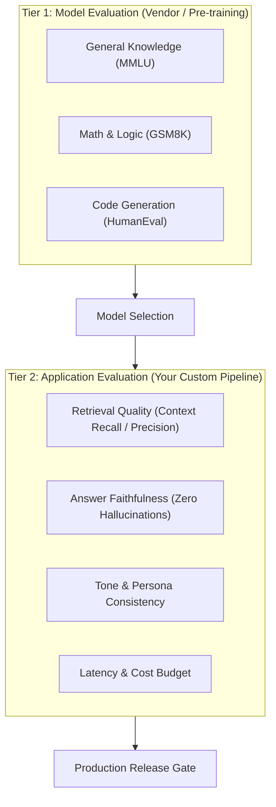

# LLM Evaluation Fundamentals: Model Evals vs Application Evals

<div className="video-card" style={{border: '1px solid #30363d', borderRadius: '8px', padding: '16px', marginBottom: '24px', background: 'rgba(56, 139, 253, 0.05)'}}>
  <div style={{display: 'flex', gap: '16px', flexWrap: 'wrap', alignItems: 'center'}}>
    <div><strong>Curators:</strong> Nitish Singh (CampusX)</div>
    <div><strong>Module:</strong> Module 6: LLM Evaluation & Observability</div>
    <div><strong>Focus:</strong> Beginner to Production</div>
  </div>
</div>

## 🎯 What You'll Learn
- Understand why non-deterministic LLM responses require probabilistic evaluation rather than exact-match unit tests.
- Differentiate Model Evaluations (measuring foundation model intelligence) from Application Evaluations (measuring end-to-end user experience).
- Identify the core evaluation metrics: Accuracy, Latency, Token Cost, and Safety.

---

## 💡 Concept & Architecture

In traditional software engineering, testing is deterministic:
```python
assert add(2, 2) == 4  # Always True or False
```
In AI Engineering, Large Language Models are **probabilistic**:
If you ask the model: *'Summarize this customer complaint'*, it might generate 10 different, equally valid summaries across 10 runs! A standard `assert result == expected` will fail 99% of the time.

To test AI applications reliably, we divide evaluation into two distinct tiers:
1. **Model Evaluations (Macro):** Testing the raw capabilities of the underlying model (e.g. Llama 3 vs GPT-4o on reasoning, coding, or math).
2. **Application Evaluations (Micro):** Testing your specific end-to-end pipeline (prompts, retrieval chunks, tools, and business rules) against user scenarios.

### System Architecture & Data Flow



---

## 💻 Step-by-Step Code Walkthrough

Below is the complete implementation broken down into digestible parts so you can understand every line.

### Part 1: Step 1: Understanding Non-Deterministic Output Variations

```python
from langchain_openai import ChatOpenAI

# Setting temperature > 0 causes varied wording across runs
llm = ChatOpenAI(model="gpt-4o-mini", temperature=0.7)

prompt = "Write a one-sentence welcoming message for a banking app."

# Run the prompt 3 times to observe lexical variation
for i in range(3):
    response = llm.invoke(prompt)
    print(f"Run #{i+1}: {response.content}")

# Notice: All 3 runs are valid welcoming messages, but their exact text is different!
# Traditional assert response.content == 'Welcome to our bank' would fail completely.
```

#### 🔍 In-Depth Explanation:
Because wording changes on every invocation, testing cannot rely on exact string equality. We must evaluate semantic meaning, tone, and factual content.

### Part 2: Step 2: Basic Semantic Similarity Scoring with Embeddings

```python
import numpy as np
from langchain_openai import OpenAIEmbeddings

embeddings = OpenAIEmbeddings(model="text-embedding-3-small")

def calculate_cosine_similarity(vec_a, vec_b):
    """Calculate cosine similarity between two embedding vectors."""
    dot_product = np.dot(vec_a, vec_b)
    norm_a = np.linalg.norm(vec_a)
    norm_b = np.linalg.norm(vec_b)
    return dot_product / (norm_a * norm_b)

# Ground truth expected concept vs actual generated output
expected_intent = "Welcome to SecureBank! Manage your accounts safely and easily."
generated_output = "Hello and welcome to SecureBank, where managing your finances is simple and secure."

vec_expected = embeddings.embed_query(expected_intent)
vec_generated = embeddings.embed_query(generated_output)

similarity_score = calculate_cosine_similarity(vec_expected, vec_generated)
print(f"Semantic Cosine Similarity Score: {similarity_score:.4f}")
# Scores > 0.85 indicate strong semantic alignment despite different words!
```

#### 🔍 In-Depth Explanation:
Embedding similarity allows us to score whether the model communicated the correct core meaning, even when the exact phrasing differs.

---

## ⚠️ Beginner Tips & Best Practices

:::tip Set Temperature to 0.0 During Benchmark Evals
When running evaluation suites, always set `temperature=0.0`. This minimizes random variation so you can benchmark prompt and code changes fairly.
:::

:::warning Semantic Similarity Does Not Catch Inverted Facts
Embedding similarity alone can give high scores to opposite statements (e.g. *'The drug is safe'* vs *'The drug is not safe'*). Always combine embeddings with factual assertion checks.
:::

---

## 📝 Key Takeaways & Summary

- AI testing requires probabilistic scoring rather than rigid exact-match unit assertions.
- Model Evals measure raw foundation capabilities; Application Evals measure custom pipeline quality.
- Semantic similarity measures intent preservation across varied wordings.

