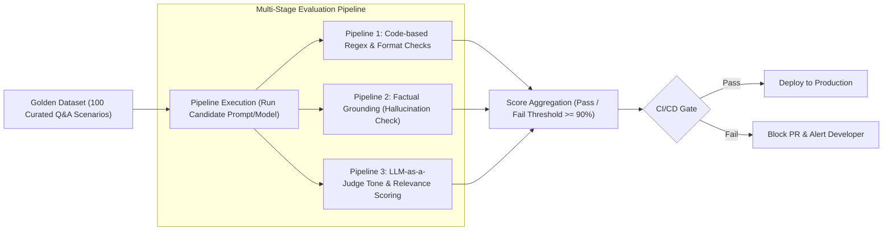

# The Evaluation Workflow & Why Multiple Evaluation Pipelines are Required

<div className="video-card" style={{border: '1px solid #30363d', borderRadius: '8px', padding: '16px', marginBottom: '24px', background: 'rgba(56, 139, 253, 0.05)'}}>
  <div style={{display: 'flex', gap: '16px', flexWrap: 'wrap', alignItems: 'center'}}>
    <div><strong>Curators:</strong> Nitish Singh (CampusX)</div>
    <div><strong>Module:</strong> Module 6: LLM Evaluation & Observability</div>
    <div><strong>Focus:</strong> Beginner to Production</div>
  </div>
</div>

## 🎯 What You'll Learn
- Structure the end-to-end evaluation lifecycle from dataset creation to CI/CD gating.
- Build a curated Golden Dataset with representative user queries and ground truth answers.
- Understand why a single metric is never enough and assemble multi-stage evaluation pipelines.

---

## 💡 Concept & Architecture

A complete AI evaluation system is not a single test run; it is a **continuous pipeline**:
1. **Dataset Creation (The Golden Dataset):** A curated collection of 50-200 realistic user queries representing standard questions, edge cases, and adversarial prompt injection attempts.
2. **Component Isolation:** Testing the retriever in isolation from the generator. If the retriever fails, the generator never has a chance.
3. **End-to-End Evaluation:** Testing the final synthesized answer for factual correctness, helpfulness, and tone.
4. **CI/CD Regression Gating:** Running evaluations in GitHub Actions before merging pull requests to prevent regressions.

### System Architecture & Data Flow



---

## 💻 Step-by-Step Code Walkthrough

Below is the complete implementation broken down into digestible parts so you can understand every line.

### Part 1: Step 1: Defining a Structured Golden Dataset Schema in Pydantic

```python
from pydantic import BaseModel, Field
from typing import List, Optional

# Schema for a single golden evaluation scenario
class GoldenEvalCase(BaseModel):
    case_id: str
    user_query: str
    expected_ground_truth: str
    required_keywords: List[str] = Field(default=[])
    forbidden_terms: List[str] = Field(default=[])
    acceptable_sources: List[str] = Field(default=[])

# Curated golden dataset
golden_dataset = [
    GoldenEvalCase(
        case_id="eval-01",
        user_query="What is our refund window for software licenses?",
        expected_ground_truth="Customers can request a full refund within 30 days of purchase.",
        required_keywords=["30 days", "refund"],
        forbidden_terms=["no refunds", "60 days"],
        acceptable_sources=["refund_policy.pdf"]
    ),
    GoldenEvalCase(
        case_id="eval-02",
        user_query="Do we support on-premise Kubernetes deployments?",
        expected_ground_truth="Yes, enterprise tier supports on-premise deployment via Helm charts.",
        required_keywords=["Helm", "enterprise"],
        acceptable_sources=["deployment_guide.md"]
    )
]

print(f"Loaded Golden Dataset with {len(golden_dataset)} curated scenarios.")
```

#### 🔍 In-Depth Explanation:
The Golden Dataset defines what 'good' looks like. It includes required keywords, forbidden phrases, and acceptable source documents.

### Part 2: Step 2: Implementing Deterministic Keyword and Regex Verification

```python
def evaluate_deterministic_rules(generated_text: str, test_case: GoldenEvalCase) -> dict:
    """Run fast code-based checks against required and forbidden keywords."""
    text_lower = generated_text.lower()
    
    # Check required keywords
    missing_keywords = [kw for kw in test_case.required_keywords if kw.lower() not in text_lower]
    
    # Check forbidden terms
    present_forbidden = [term for term in test_case.forbidden_terms if term.lower() in text_lower]
    
    passed = len(missing_keywords) == 0 and len(present_forbidden) == 0
    
    return {
        "case_id": test_case.case_id,
        "passed": passed,
        "missing_keywords": missing_keywords,
        "forbidden_violations": present_forbidden
    }

# Test with a candidate answer
candidate_answer = "You are eligible for a full refund within 30 days of license activation."
result = evaluate_deterministic_rules(candidate_answer, golden_dataset[0])
print("Rule Evaluation Result:", result)
```

#### 🔍 In-Depth Explanation:
Deterministic checks run in microseconds without calling any LLM API, quickly flagging obvious rule violations.

---

## ⚠️ Beginner Tips & Best Practices

:::tip Version Your Golden Datasets in Git
Treat your Golden Dataset as code. Store it as `evals/golden_dataset.json` in your repository so changes to test scenarios are reviewed in pull requests.
:::

:::warning Don't Overfit to the Golden Dataset
If you engineer your prompt specifically to pass 10 test questions, it will fail on novel user queries. Regularly add real production user queries to your golden set.
:::

---

## 📝 Key Takeaways & Summary

- A curated Golden Dataset is the bedrock of trustworthy AI testing.
- Multi-stage pipelines combine fast code checks with deep semantic evaluation.
- Automated CI/CD evaluation gates prevent prompt regressions from reaching production.

