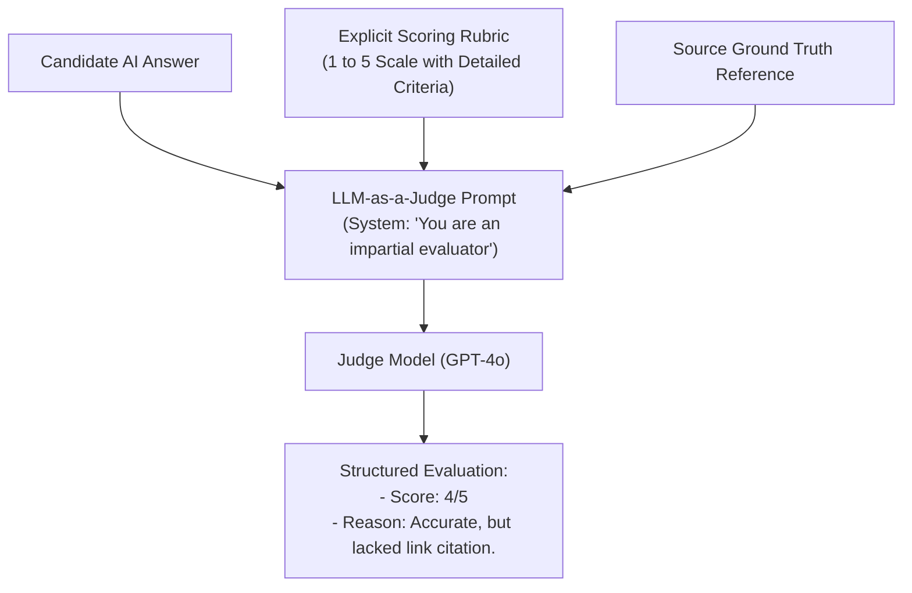

# Evaluation Methods: Code-Based, Reference-Based & LLM-as-a-Judge

<div className="video-card" style={{border: '1px solid #30363d', borderRadius: '8px', padding: '16px', marginBottom: '24px', background: 'rgba(56, 139, 253, 0.05)'}}>
  <div style={{display: 'flex', gap: '16px', flexWrap: 'wrap', alignItems: 'center'}}>
    <div><strong>Curators:</strong> Nitish Singh (CampusX)</div>
    <div><strong>Module:</strong> Module 6: LLM Evaluation & Observability</div>
    <div><strong>Focus:</strong> Beginner to Production</div>
  </div>
</div>

## 🎯 What You'll Learn
- Compare the three primary evaluation tiers: Code-Based, Reference-Based (ROUGE/BLEU), and Model-Based (LLM-as-a-Judge).
- Understand why LLM-as-a-Judge correlates more closely with human preferences than ROUGE or BLEU.
- Build a calibrated LLM-as-a-Judge evaluator with explicit scoring rubrics.

---

## 💡 Concept & Architecture

### The Three Evaluation Tiers:
1. **Tier 1: Code-Based Metrics (Regex, JSON Validation, Length):**
   - Blazing fast, zero cost, 100% deterministic.
   - Cannot measure semantic depth or tone.
2. **Tier 2: Reference-Based NLP Metrics (BLEU, ROUGE, METEOR):**
   - Measures exact n-gram overlap between candidate and reference texts.
   - Brittle: penalizes valid responses that express the same truth using synonyms!
3. **Tier 3: Model-Based Evaluation (LLM-as-a-Judge):**
   - An advanced model (GPT-4o / Claude 3.5 Sonnet) acts as an impartial judge, evaluating the candidate response against explicit scoring rubrics.
   - Closely correlates with human expert rankings!

### System Architecture & Data Flow



---

## 💻 Step-by-Step Code Walkthrough

Below is the complete implementation broken down into digestible parts so you can understand every line.

### Part 1: Step 1: Defining a Structured Evaluation Rubric Schema

```python
from pydantic import BaseModel, Field
from typing import Literal

# Schema for the Judge's evaluation report
class EvaluationVerdict(BaseModel):
    score: int = Field(..., ge=1, le=5, description="Integer score from 1 (terrible) to 5 (flawless)")
    factual_correctness: Literal["correct", "partially_correct", "incorrect"]
    critique: str = Field(..., description="Detailed reasoning explaining why this score was awarded")
    improvement_suggestion: str = Field(..., description="Actionable advice to improve the prompt/model")
```

#### 🔍 In-Depth Explanation:
Using Pydantic guarantees that the judge outputs a clean numerical score and structured critique rather than unstructured chatter.

### Part 2: Step 2: Assembling the LLM-as-a-Judge Evaluator

```python
from langchain_core.prompts import ChatPromptTemplate
from langchain_openai import ChatOpenAI

judge_prompt = ChatPromptTemplate.from_template("""You are an expert, impartial AI auditor evaluating technical support answers.
Evaluate the candidate response against the reference ground truth according to this rubric:

[SCORING RUBRIC]:
- Score 5: Factually flawless, perfectly structured, addresses all user questions.
- Score 4: Factually correct, but minor tone or conciseness issues.
- Score 3: Partially correct, but omits a key detail from the ground truth.
- Score 2: Factually flawed or introduces ungrounded assumptions.
- Score 1: Completely incorrect, harmful, or irrelevant.

User Question:
{question}

Ground Truth Reference:
{ground_truth}

Candidate Response to Evaluate:
{candidate_response}
""")

# Use an advanced model with temperature=0.0 as the judge
judge_llm = ChatOpenAI(model="gpt-4o", temperature=0.0)
judge_chain = judge_prompt | judge_llm.with_structured_output(EvaluationVerdict)

# Run evaluation
verdict = judge_chain.invoke({
    "question": "How do I reset my API key?",
    "ground_truth": "Navigate to Settings > API Keys, click Revoke on the old key, then click Generate New Key.",
    "candidate_response": "Go to Settings, select API Keys, and click Generate New Key. Be sure to delete the old one."
})

print(f"Judge Awarded Score: {verdict.score} / 5")
print(f"Factual Status: {verdict.factual_correctness}")
print(f"Critique: {verdict.critique}")
```

#### 🔍 In-Depth Explanation:
The judge reads the prompt, compares the candidate against the rubric, and outputs an objective numerical score and critique.

---

## ⚠️ Beginner Tips & Best Practices

:::tip Mitigate Positional Bias in Comparison Evals
When asking an LLM judge to pick the better of two answers (A vs B), swap the order and run the test twice. LLMs exhibit a mild bias toward selecting Answer A.
:::

:::warning Beware of Verbosity Bias
LLM judges tend to award higher scores to longer answers, even if they contain redundant filler. Explicitly instruct your judge rubric to reward concise, direct answers.
:::

---

## 📝 Key Takeaways & Summary

- Code checks verify structure; reference metrics measure overlap; LLM-as-a-Judge evaluates semantic quality.
- Explicit rubrics with clear criteria (1-5 scale) produce consistent, reproducible evaluations.
- Structured outputs make it easy to aggregate scores across entire test suites.

