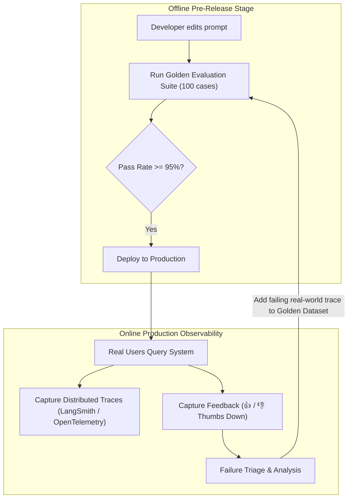

# Offline Golden Evals vs Online Production Observability

<div className="video-card" style={{border: '1px solid #30363d', borderRadius: '8px', padding: '16px', marginBottom: '24px', background: 'rgba(56, 139, 253, 0.05)'}}>
  <div style={{display: 'flex', gap: '16px', flexWrap: 'wrap', alignItems: 'center'}}>
    <div><strong>Curators:</strong> Nitish Singh (CampusX)</div>
    <div><strong>Module:</strong> Module 6: LLM Evaluation & Observability</div>
    <div><strong>Focus:</strong> Beginner to Production</div>
  </div>
</div>

## 🎯 What You'll Learn
- Understand why offline pre-deployment testing and online production monitoring are both mandatory.
- Collect implicit (copy, dwell time) and explicit (thumbs up/down) user feedback in production.
- Implement distributed tracing with OpenTelemetry and LangSmith.

---

## 💡 Concept & Architecture

AI evaluation does not end when you deploy code to production:
- **Offline Evaluations (Pre-Deployment):** Batch testing run during development and CI/CD against known golden datasets. Validates that code changes don't break existing functionality.
- **Online Evaluations (Post-Deployment Observability):** Monitoring real user traffic in production. Detects real-world edge cases, drift, sudden latency spikes, and negative user experiences.

### The Feedback Flywheel
1. Real users interact with your AI assistant in production.
2. Users click **Thumbs Down** or edit an AI-generated draft.
3. Observability tools capture the trace: the exact user prompt, the retrieved context, and the bad answer.
4. Engineers add this failure case to the **Offline Golden Dataset**, preventing that error from ever happening again!

### System Architecture & Data Flow



---

## 💻 Step-by-Step Code Walkthrough

Below is the complete implementation broken down into digestible parts so you can understand every line.

### Part 1: Step 1: Logging Production Traces with Metadata and Feedback

```python
from pydantic import BaseModel, Field
from datetime import datetime, timezone
from typing import Optional, Literal

# Production telemetry record
class ProductionTraceRecord(BaseModel):
    trace_id: str
    timestamp: datetime = Field(default_factory=lambda: datetime.now(timezone.utc))
    user_query: str
    generated_answer: str
    latency_ms: float
    token_usage: dict
    user_feedback: Optional[Literal["thumbs_up", "thumbs_down"]] = None
    user_comment: Optional[str] = None

# Simulate capturing a trace with user feedback
trace = ProductionTraceRecord(
    trace_id="trace-849201",
    user_query="Can I upgrade from monthly to annual billing?",
    generated_answer="Please contact sales for billing adjustments.",
    latency_ms=420.5,
    token_usage={"input_tokens": 45, "output_tokens": 12},
    user_feedback="thumbs_down",
    user_comment="Didn't provide self-service instructions!"
)

print("Captured Production Trace:")
print(trace.model_dump_json(indent=2))
```

#### 🔍 In-Depth Explanation:
This structured telemetry record captures everything needed to analyze failures: the prompt, the response, latency, token costs, and user feedback.

---

## ⚠️ Beginner Tips & Best Practices

:::tip Track Token Costs Per User and Feature
Always tag production traces with `user_id` and `feature_name`. This allows you to identify power users and spot features that consume disproportionate token budgets.
:::

:::warning Never Log Unmasked PII to Tracing Platforms
Ensure sensitive data (passwords, credit card numbers, confidential health data) is redacted by an output guardrail before sending traces to third-party monitoring platforms.
:::

---

## 📝 Key Takeaways & Summary

- Offline evaluations validate releases before deployment; online evaluations monitor real-world behavior.
- User feedback (thumbs up/down) highlights failure cases in production.
- Adding production failure traces back to offline datasets creates a self-improving quality flywheel.

